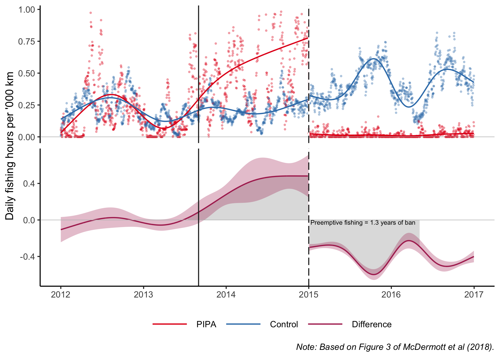
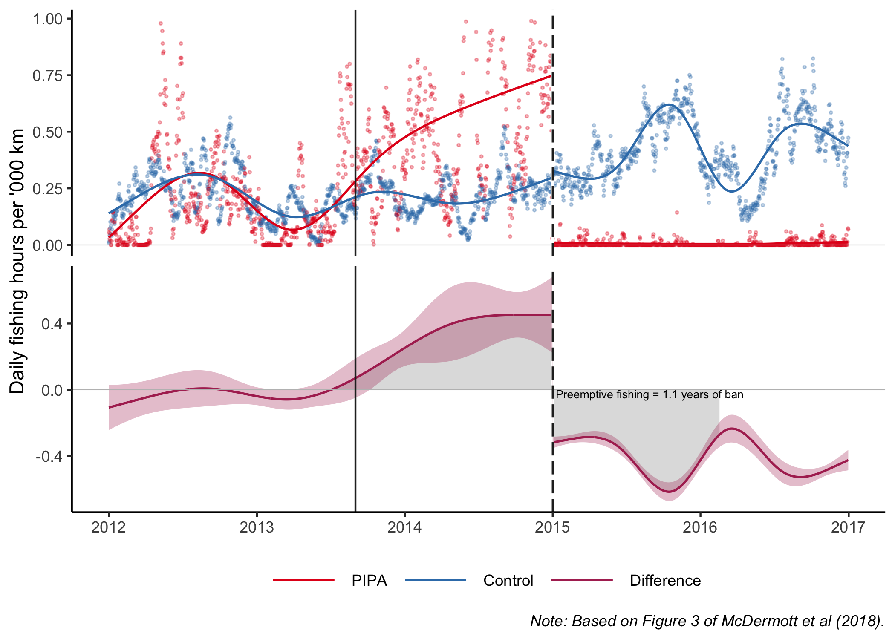

GFW in BigQuery
================
Devin Bunch
</br>01 October 2021

## Background

You are going to replicate the core result from [McDermott et
al. (PNAS, 2018)](https://grantmcdermott.com/papers/mcdermott2019blueparadox.pdf),
“The blue paradox: Preemptive overfishing in marine reserves”. As the
title suggests, the paper is essentially about a way in which
anticipatory behaviour can undermine conservation goals. In particular,
we document a preemptive surge in fishing effort within the Phoenix
Islands Protected Area (i.e. PIPA) — a pristine area of Pacific Ocean
roughly the size of California — once people realised that it was going
to be closed off to commercial fishing in 2015. The paper implements a
difference-in-differences strategy using data from Global Fishing Watch
(GFW). Here’s the key figure that I want you to reproduce.


## Preliminaries: Load packages, read in shapefiles and other data

**Note:** Since the assignment is aimed at practicing your BigQuery
skills, I’ve gone ahead and written the first few code chunks for you.
These are mostly auxiliary steps that will help you set up your
environment and query the right data.

Start by loading the packages needed to complete this assignment. Note
that I’m going to use the **rms** package, but I don’t want to load it
yet because it will create a bunch of namespace conflicts with
**dplyr**.

``` r
pacman::p_load(sf, tidyverse, lubridate, DBI, dbplyr, bigrquery, sandwich, here)
pacman::p_install(rms, force=FALSE)
```

Next, read in a shapefile of the
[Kiribati](https://en.wikipedia.org/wiki/Kiribati) exclusive economic
zone (EEZ). This EEZ comprises a cluster of three island groups in the
equatorial Pacific: 1) the Line Islands, 2) the Gilbert Islands, and 3)
the Phoenix Islands. We are going to use the first two of these to
create a control group. The treatment group will come from (part of) the
third group.

``` r
dsn_dir = here("data_analysis/big_query/data/shapefiles/kiribati_eez/")
## Read in Kiribati shapefile
kiribati_eez = 
  read_sf(dsn = dsn_dir, layer = "kiribati_eez") %>%
  select(GeoName, geometry)
## Get the projection string for later
proj_str = st_crs(kiribati_eez)

## Subset Line Islands
line = 
  kiribati_eez %>%
  subset(GeoName %in% c("Kiribati Exclusive Economic Zone (Line Islands)")) %>%
  rename(region = GeoName) %>%
  mutate(region = "Line Group")

## Subset Gilbert Islands
gilbert = 
  kiribati_eez %>%
  subset(GeoName %in% c("Kiribati Exclusive Economic Zone (Gilbert Islands)")) %>%
  rename(region = GeoName) %>%
  mutate(region = "Gilbert Islands")

## Daily, vessel-level fishing effort effort in Kirbati, split by sub-area
gfw = read_csv(here("data_analysis/big_query/data/gfw_split.csv"))
```

    ## Rows: 128678 Columns: 14

    ## ── Column specification ────────────────────────────────────────────────────────
    ## Delimiter: ","
    ## chr  (4): region, flag_iso3, vess_type, owner
    ## dbl  (9): yr, mnth, wk, dofw, mmsi, raw_hours, logistic_hours, nnet_hours, a...
    ## date (1): Date

    ## 
    ## ℹ Use `spec()` to retrieve the full column specification for this data.
    ## ℹ Specify the column types or set `show_col_types = FALSE` to quiet this message.

``` r
#get rid of the date format
gfw[["date"]] = as.character(gfw$Date)
```

Then, read in a shapefile of PIPA.

``` r
dsn_dir = here("data_analysis/big_query/data/shapefiles/pipa_shapefile/")

## Read in PIPA shapefile
pipa = 
  read_sf(dsn = dsn_dir, layer = "worldheritagemarineprogramme") %>%
  st_transform(proj_str) %>%
  select(region = full_name, geometry) %>%
  mutate(region = "PIPA")
```

Bind our control and treatment areas into a single object.

``` r
## Merge all regions of interest
all_regions = rbind(line, gilbert, pipa)
all_regions
```

    ## Simple feature collection with 3 features and 1 field
    ## Geometry type: GEOMETRY
    ## Dimension:     XY
    ## Bounding box:  xmin: -180 ymin: -13.83833 xmax: 180 ymax: 7.879056
    ## Geodetic CRS:  WGS 84
    ## # A tibble: 3 × 2
    ##   region                                                                geometry
    ## * <chr>                                                           <GEOMETRY [°]>
    ## 1 Line Group      MULTIPOLYGON (((-154.6153 3.954139, -154.6063 3.941567, -154.…
    ## 2 Gilbert Islands MULTIPOLYGON (((-179.9965 -3.752028, -180 -3.762181, -180 -1.…
    ## 3 PIPA            POLYGON ((-175.315 -6.616, -175.866 -6.618, -175.866 -2.091, …

Finally, we’ll get the bounding box of the study area to help limit our
query to the GFW database. I’m also going to set the resolution for the
“bins” that I want you to aggregate the data up to and pull in a data
frame of treatment and control areas sizes (in km<sup>2</sup>) that I’ve
already created.

``` r
## Get bounding box of Kiribati
bbox = 
  kiribati_eez %>%
  st_bbox()

## Extent the bounding box 1 degree in every direction.
## We will use these limits to query the GFW database
min_lon = bbox[["xmin"]] - 1 
max_lon = bbox[["xmax"]] + 1
min_lat = bbox[["ymin"]] - 1
max_lat = bbox[["ymax"]] + 1 

## Define mapping resoluion in degrees
resolution = 0.5
```

## 1\) Set up your BigQuery connection

Establish a BigQuery connection like we practiced in class (call it
`con`). Use your regular billing ID, but make sure that you set the
project to “global-fishing-watch” and the dataset to
“global\_footprint\_of\_fisheries”.

``` r
# Disclaimer: Devin has done ALL the work on this assignment . . . 

## Read in regional area sizes
region_areas = read_csv(here("data_analysis/big_query/data/region_areas.csv"))
```

    ## Rows: 4 Columns: 2

    ## ── Column specification ────────────────────────────────────────────────────────
    ## Delimiter: ","
    ## chr (1): region
    ## dbl (1): area_km2

    ## 
    ## ℹ Use `spec()` to retrieve the full column specification for this data.
    ## ℹ Specify the column types or set `show_col_types = FALSE` to quiet this message.

``` r
region_areas
```

    ## # A tibble: 4 × 2
    ##   region                 area_km2
    ##   <chr>                     <dbl>
    ## 1 PIPA                    413266.
    ## 2 Phoenix Group Non-PIPA  341505.
    ## 3 Line Group             1676839.
    ## 4 Gilbert Islands        1062406.

``` r
## Point towards your previously-generated GCP service key to avoid potential 
## authentication errors during the Rmd knit process. See:
## https://gargle.r-lib.org/articles/non-interactive-auth.html#sidebar-2-i-just-want-my--rmd-to-render

#library(bigquery)  ## already loaded

#from our local r environment, we already have our authentication saved to use for our connection
bq_auth(path = Sys.getenv("GCE_AUTH_FILE"))
```

    ## ! Using an auto-discovered, cached token.

    ##   To suppress this message, modify your code or options to clearly consent to
    ##   the use of a cached token.

    ##   See gargle's "Non-interactive auth" vignette for more details:

    ##   <https://gargle.r-lib.org/articles/non-interactive-auth.html>

    ## ℹ The bigrquery package is using a cached token for 'devinespanol@gmail.com'.

``` r
billing_id = Sys.getenv("GCE_DEFAULT_PROJECT_ID")

#creating a connection to the database through DuckDB
con =
  dbConnect(
    bigrquery::bigquery(),
    project = "global-fishing-watch",
    dataset = "global_footprint_of_fisheries",
    billing = billing_id
    )
```

**Google BigQuery is part of the Google Cloud Platform (GCP) that we
signed up for in the cloud computing lecture. There also exists public
datasets available for free use on Google BigQuery, one being the
dataset required for this assignment\!**

## 2\) Test the connection and authenticate if prompted

Confirm that you have a successful connection by running
`DBI::dbListTables(con)`. This should generate a list of available
tables in this dataset. You may also be prompted to authenticate if you
are running this for the first time. (Make sure to run this section
interactively before knitting your document.)

``` r
#success! 
DBI::dbListTables(con)
```

    ## [1] "fishing_effort"          "fishing_effort_byvessel"
    ## [3] "fishing_vessels"         "vessels"

**note: looks like we’ve got 4 available tables in our dataset**

## 3\) Create and preview the table of interest

We are particularly interested in the **“fishing\_effort”** table.
Reference this table to a new object in your R environment called
`effort` using the the `dplyr::tbl()` function. Preview the new `effort`
table after you have created it.

``` r
#from dplyr, create our reference object "effort" 
# to call upon the fishing effort table from our database
effort = tbl(con, "fishing_effort")
#print it out!
effort
```

    ## # Source:   table<fishing_effort> [?? x 8]
    ## # Database: BigQueryConnection
    ##    date       lat_bin lon_bin flag  geartype vessel_hours fishing_hours mmsi_present
    ##    <chr>        <int>   <int> <chr> <chr>           <dbl>         <dbl>        <int>
    ##  1 2012-03-23    -879    1324 AGO   purse_s…        5.76          0                1
    ##  2 2012-03-23   -5120   -6859 ARG   trawlers        1.57          1.57             1
    ##  3 2012-03-23   -5120   -6854 ARG   purse_s…        3.05          3.05             1
    ##  4 2012-03-23   -5119   -6858 ARG   purse_s…        2.40          2.40             1
    ##  5 2012-03-23   -5119   -6854 ARG   trawlers        1.52          1.52             1
    ##  6 2012-03-23   -5119   -6855 ARG   purse_s…        0.786         0.786            1
    ##  7 2012-03-23   -5119   -6853 ARG   trawlers        4.60          4.60             1
    ##  8 2012-03-23   -5118   -6852 ARG   trawlers        1.56          1.56             1
    ##  9 2012-03-23   -5118   -6850 ARG   trawlers        1.61          1.61             1
    ## 10 2012-03-23   -5117   -6849 ARG   trawlers        0.797         0.797            1
    ## # … with more rows

## 4\) Query the database

*Note: If you are feeling ambitious, you can try to run the query on the
whole polygon(s) instead. See the BONUS question at the end.*

Now, we get to the meat of the assignment. I want you to query the
effort table and isolate the observations of interest. This will involve
three steps — which I’ll detail individually below for clarity — but
please still run all three steps as part of the *same* query. In other
words, you need to bundle all three steps together in a single query.
Running them individually will result in errors.

**Step 1: Filter the observations that meet the following criteria.**

  - Maximum date of 31 December, 2016 (to coincide with the published
    figure).
  - `lat_bin` and `lon_bin` fall within the bounding box of interest.
    Some important comments and tips:
      - Use the `min_lat`, `max_lat`, `min_lon`, and `max_lon` variables
        that we created earlier as references for the bounding box.
        However, note that I have redefined the longitude variables to
        account for the
        [antimeridian](https://en.wikipedia.org/wiki/180th_meridian).
        The upshot is that I recommend you filter longitude according to
        an “OR” rule, i.e. `lon_bin >= min_lon | lon_bin <= max_lon`.
        For latitude, you should feel free to filter according to a
        regular “AND” rule (e.g. use sequential filters or just commas).
      - Also note that longitude and latitude columns of the database
        have been multiplied by 100. If I were you, the very first step
        of my query would be reversing this transformation with a mutate
        call (hint hint).
  - `fishing_hours` greater than zero.

**Step 2: Create binned data.** Once you have written out your filter
commands, you need to aggregate the data. However, before that you need
to create binned data cells (i.e. squares) of a desired resolution.
(I’ve already set a `resolution` variable equal to 0.5 in the
preliminary part of this assignment.) For clues on how you could do
this, take a look
[here](http://jsmayorga.com/post/getting-global-fishing-watch-from-google-bigquery-using-r/#make-a-map-of-fishing-effort-for-a-particular-region-of-the-ocean).
In particular, look where Juan (the author) creates the `lat_bin_center`
and `lon_bin_center` variables.

**Step 3: Summarise your data.** Aggregate your data up to the day
(i.e. `date`) by bin (i.e. `lat_bin_center`, `lon_bin_center`) level.

You can do all of this using either **dplyr** or SQL, though I recommend
you stick with the former. Do *not* collect the data yet, but call the
resulting query object `effort_query`.

**One of the best things about dplyr is that it automatically translates
tidyverse-style code into SQL for you by using the function
`show_query()`**

``` r
effort_query =
  effort %>%
  filter(`_PARTITIONTIME` < "2017-01-01 00:00:00") %>%
  mutate(
    lat_bin = lat_bin/100,
    lon_bin = lon_bin/100
    ) %>%
  filter(fishing_hours > 0) %>%
  filter(
    lat_bin >= min_lat, 
    lat_bin <= max_lat,
    lon_bin >= min_lon | lon_bin <= max_lon
    ) %>%
  mutate(
    lat_bin_center = floor(lat_bin/resolution)*resolution + 0.5*resolution,
    lon_bin_center = floor(lon_bin/resolution)*resolution + 0.5*resolution
    ) %>%
  group_by(date, lat_bin_center, lon_bin_center) %>%
  summarise(fishing_hours = sum(fishing_hours))
```

**for sql language: we filtered the coordinates so that they are inside
our bounding box. To do this we add ? before the name of our locally
defined variable and its value gets automatically added to the query**

## 5\) Collect the data

Now collect the data (i.e. pull it into you R environment). Assign the
resulting data frame to an object called `effort_ binned`.

``` r
#now let's collect
effort_binned = 
  effort_query %>% 
  collect()
```

    ## Warning: Missing values are always removed in SQL.
    ## Use `SUM(x, na.rm = TRUE)` to silence this warning
    ## This warning is displayed only once per session.

    ## `summarise()` has grouped output by 'date', 'lat_bin_center'. You can override using the `.groups` argument.

``` r
#our new variables are only: lat_bin_center, lon_bin_center, date, and fishing_hours
```

## 6\) Disconnect

Following good practice, make sure that you disconnect from `con`.

``` r
## Put your disconnect code here
dbDisconnect(con)
```

## 7\) Convert to **sf** object

Convert `effort_binned` data frame into an **sf** object. Now is also a
good time to convert the “date” string to an actual date. (Note that you
may need to ungroup the object first.)

*Hint: Pay attention to the “coords” option of the `st_as_sf()`
function.*

``` r
## Convert dataframe to SF
effort_binned = 
  effort_binned %>%
  ungroup %>%
  mutate(date = ymd(date)) %>%
  st_as_sf(
    coords = c("lon_bin_center","lat_bin_center"),
    crs = proj_str,
    remove = FALSE
    )
```

## 8\) Finalise the data

Now come the final stages of preparing the data. I’ll walk you through
this in three steps.

### 8.1) Crop to the region of interest

Crop `effort_binned` to the region of interest (i.e. using the
`all_regions` **sf** object that we created earlier). Call the resulting
object **`gfw`**.

You won’t need any more spatial analysis after this, so feel free to
coerce this newly created object into a regular tibble afterwards. You
will also want to filter out any observations where the “region” column
is `NA`.

``` r
sf::sf_use_s2(FALSE)
```

    ## Spherical geometry (s2) switched off

``` r
#use this command to make sure things are running! they are--we have a geometry column
#st_geometry(all_regions)

## Subset only effort points found in the regions of interest
# Turn into simple dataframe
gfw = 
  st_join(
    effort_binned, 
    all_regions, 
    join = st_intersects
    ) %>%
  as_tibble() %>%
  select(-geometry) %>%
  filter(!is.na(region)) 
```

    ## although coordinates are longitude/latitude, st_intersects assumes that they are planar
    ## although coordinates are longitude/latitude, st_intersects assumes that they are planar

``` r
gfw
```

    ## # A tibble: 160,482 × 5
    ##    date       lat_bin_center lon_bin_center fishing_hours region         
    ##    <date>              <dbl>          <dbl>         <dbl> <chr>          
    ##  1 2013-01-06           2.25           172.         14.6  Gilbert Islands
    ##  2 2014-04-08           2.25          -159.         14.5  Line Group     
    ##  3 2014-04-10           2.25          -160.          9.10 Line Group     
    ##  4 2012-01-24           2.25          -158.          3.66 Line Group     
    ##  5 2012-05-18           2.25           172.          7.81 Gilbert Islands
    ##  6 2016-08-30           2.25          -162.          1.81 Line Group     
    ##  7 2014-10-21           2.25          -159.          2.09 Line Group     
    ##  8 2012-05-06           2.25          -159.          2.05 Line Group     
    ##  9 2013-07-27           2.25          -159.          9.09 Line Group     
    ## 10 2012-11-10           2.25           176.          7.27 Gilbert Islands
    ## # … with 160,472 more rows

### 8.2) Get daily totals and complete missing dates

Take your `gfw` data frame and aggregate the “fishing\_hours” variable
up the day (i.e. date) by region level. You will also want to complete
any missing dates. Please make sure that the “fishing\_hours” column
from these filled-in missing dates are not left as `NA`; rather I want
you to replace them with zero.

``` r
#print it out
gfw
```

    ## # A tibble: 5,481 × 3
    ##    date       region          fishing_hours
    ##    <date>     <chr>                   <dbl>
    ##  1 2012-01-01 Gilbert Islands          24.6
    ##  2 2012-01-02 Gilbert Islands          39.6
    ##  3 2012-01-03 Gilbert Islands          62.2
    ##  4 2012-01-04 Gilbert Islands          84.9
    ##  5 2012-01-05 Gilbert Islands         141. 
    ##  6 2012-01-06 Gilbert Islands         120. 
    ##  7 2012-01-07 Gilbert Islands          85.0
    ##  8 2012-01-08 Gilbert Islands          53.4
    ##  9 2012-01-09 Gilbert Islands          94.5
    ## 10 2012-01-10 Gilbert Islands         265. 
    ## # … with 5,471 more rows

### 8.3) Split into control and treatment and normalize fishing hours by area

Okay, I’ll write out this last step for you. Make sure that you delete
`eval=FALSE` in the chunk header once you are ready to knit the whole
document, or else this chunk won’t produce any output.

``` r
gfw =
  gfw %>%
  left_join(region_areas) %>%
  mutate(region = ifelse(region=="PIPA", "PIPA", "Control")) %>%
  group_by(date, region) %>%
  mutate(area_km2 = sum(area_km2)) %>%
  mutate(fishing_hours_norm = fishing_hours/area_km2*1000) %>%
  summarise(fishing_hours_norm = sum(fishing_hours_norm)) %>% 
  ungroup 
```

    ## Joining, by = "region"

    ## `summarise()` has grouped output by 'date'. You can override using the `.groups` argument.

``` r
gfw
```

    ## # A tibble: 3,654 × 3
    ##    date       region  fishing_hours_norm
    ##    <date>     <chr>                <dbl>
    ##  1 2012-01-01 Control            0.00965
    ##  2 2012-01-01 PIPA               0.0546 
    ##  3 2012-01-02 Control            0.0152 
    ##  4 2012-01-02 PIPA               0.0687 
    ##  5 2012-01-03 Control            0.0415 
    ##  6 2012-01-03 PIPA               0.0272 
    ##  7 2012-01-04 Control            0.0735 
    ##  8 2012-01-04 PIPA               0.0512 
    ##  9 2012-01-05 Control            0.100  
    ## 10 2012-01-05 PIPA               0.0169 
    ## # … with 3,644 more rows

## Epilogue: Plot the figure

Assuming that you made it this far, you should be able to run the below
chunk —again, making sure that you delete `eval=FALSE` in the chunk
header first — and it will generate a figure that closely resembles
Figure 3 of the paper. There are a couple reasons why it isn’t an exact
copy. Most importantly, in the paper we use a measure of fishing effort
that is produced by a different classification algorithm. (For reasons
that we explain in the paper and I can go into if you’re interested.)
However, there’s also a fairly mechanical reason associated with how we
queried and aggregated the data in this assignment. Can you think of it?

*Hint: Think about how the bins are defined here…*

``` r
#Key PIPA announcement and enforcement dates
anticip_date = ymd("2013-09-01")
enforce_date = ymd("2015-01-01")
key_dates = c(anticip_date, enforce_date)
# http://www.earthisland.org/journal/index.php/eij/article/somethings_fishy/

#Regression analysis

## Choose the number of knots for fitting the restricted cubic spline (RCS) in 
## the pre- and post-enforcement periods, respectively.
knots_pre = 6
knots_post = 6

break_even_plot =
  function (f_var, gfw_data = gfw) {
    gfw_main = gfw_data
    
    ## We want to compute the RCSs separately for the pre- and post-enforcement 
    ## periods. We also want to plot separate facets for the observed regions
    ## (i.e. "PIPA" and "Control") and the difference series. The next few lines
    ## of code prep the data with data with these goals in mind.
    
    gfw_diff = 
      gfw_main %>% 
      select(date, region, all_of(f_var)) %>% 
      pivot_wider(names_from=region, values_from=all_of(f_var)) %>%
      mutate(y_var = PIPA - Control) %>% 
      mutate(
        region = "Difference", 
        grp = "Diff"
        ) %>% 
      select(date, region, y_var, grp)
    
    gfw_main =
      gfw_main %>%
      mutate(grp = "Main") %>% 
      rename("y_var" = all_of(f_var)) %>%
      select(date, region, y_var, grp)
    
    gfw_rcs = bind_rows(gfw_main, gfw_diff)
    gfw_rcs$region = factor(gfw_rcs$region, levels  = c("PIPA", "Control", "Difference"))
    gfw_rcs$grp = factor(gfw_rcs$grp, levels  = c("Main", "Diff"))
    
    ## Fit the RCS regressions in a DiD framework (i.e. pre & post separately)
    ## with some help from tidyr::nest(). We'll then extract the predictions and 
    ## manually calculate the pointwise HAC SEs (and 90% CI) using the sandwich 
    ## package, as well as some help from purrr::map().
    gfw_rcs =
      gfw_rcs %>%
      mutate(prepost = if_else(date < enforce_date, "pre", "post")) %>%
      group_by(prepost) %>%
      nest() %>%
      ## Run a separate model for each period
      mutate(mod = data %>%
               map( ~ lm(y_var ~ region*rms::rcs(as.numeric(date), knots_post), data = .x))) %>%
      ## Extract DoF
      mutate(dof = mod %>% map(~ df.residual(.x))) %>%
      ## Generate (point) predictions
      mutate(fit = mod %>% map(~ tibble(fit = predict(.x)))) %>%
      ## Get the design matrix
      mutate(X_mat = mod %>% map(~ model.matrix(.x))) %>%
      ## Get HAC VCOV matrix and calculate pointwise HAC SEs
      mutate(
        v_hac = mod %>% map(~ sandwich::NeweyWest(.x, prewhite=FALSE, lag = 60)),
        se_fit_hac = list(X_mat, v_hac) %>% pmap(~ sqrt(rowSums((.x %*% .y) * .x)))
        ) %>%
      ## Remove list columns that are no longer needed
      select(-c(mod, X_mat, v_hac)) %>%
      ## Unnest to get data in nice tibble form again
      unnest(cols = c(data, dof, fit, se_fit_hac)) %>%
      ## Construct 90% CI
      mutate(
        lwr_hac = fit - qt(0.95, df=dof)*se_fit_hac,
        upr_hac = fit + qt(0.95, df=dof)*se_fit_hac
        )

    ## Find the "break even" point at which the enforced ban finally makes up for the
    ## equivalent increase in effort.
    # start_date = anticip_date
    start_date =
      gfw_rcs %>%
      filter(grp=="Diff", date<=anticip_date) %>%
      arrange(desc(date)) %>%
      filter(y_var<=0) %>%
      slice(1) %>%
      pull(date) + days(1)
    break_even =
      gfw_rcs %>%
      filter(grp=="Diff", date>=start_date) %>%
      ungroup %>%
      mutate(culm_diff = cumsum(fit)) %>%
      filter(date>enforce_date, culm_diff<=0) %>%
      slice(1) %>%
      pull(date)
    
    ## How long does it take to recover (in years)?
    recovery = round((enforce_date %--% break_even)/ dyears(1), 1)
    ## Make a DF version (with a label) for the plot
    recovery_df =
      tibble(
        date = enforce_date, y = 0, 
        region = factor("Difference", levels = levels(gfw_rcs$region)),
        grp = factor("Diff", levels = levels(gfw_rcs$grp)),
        lab = paste0(" Preemptive fishing = ", recovery, " years of ban")
        )
    
    ## Plot the figure
    fig =
      gfw_rcs %>%
      ggplot(aes(x = date, group = region, col = region, fill = region)) +
      ## Add the shaded "break even" ribbon.
      geom_ribbon(
        data = gfw_rcs %>% filter(grp=="Diff", date>=start_date, date<=break_even),
        aes(ymin=0, ymax=fit),
        fill="gray", col=NA, alpha=0.5
      ) +
      geom_point(
        data = gfw_rcs %>% filter(grp == "Main") %>% filter(y_var <= 1), ## To aid visual inspection
        aes(y = y_var), show.legend = FALSE,
        alpha=0.3, size = 0.5
        ) +
      geom_line(aes(y = fit), lwd = 0.6) +
      ## Hack to hide vert line on enforcement date
      geom_vline(xintercept = enforce_date, col = "white", lwd = 0.75) +  
      geom_ribbon(
        data = filter(gfw_rcs, grp == "Diff"),
        aes(ymin=lwr_hac, ymax=upr_hac), show.legend = FALSE,
        alpha=0.3, col = NA
        ) +
      geom_hline(yintercept = 0, lwd = 0.25, col = "gray") +
      geom_vline(xintercept = anticip_date, col = "gray15") +
      geom_vline(xintercept = enforce_date, col = "gray15", lty = 5) +
      geom_text(
        data = recovery_df, aes(y = y, label = lab), 
        col = "black", hjust = "left", vjust = "top", size = 2.25
        ) +
      labs(
        y = "Daily fishing hours per '000 km",
        caption = "Note: Based on Figure 3 of McDermott et al (2018)."
        ) +
      scale_x_date(date_breaks = "1 year", date_labels = "%Y") +
      scale_colour_manual(
        values = c("PIPA"="#E41A1C", "Control"="#377EB8", "Difference"="maroon"),
        breaks = c("PIPA", "Control", "Difference")
        ) +
      scale_fill_manual(
        values = c("PIPA"="#E41A1C", "Control"="#377EB8", "Difference"="maroon"),
        breaks = c("PIPA", "Control", "Difference")
        ) +
      facet_wrap(~grp, scales = "free_y", ncol = 1) +
      theme_classic() +
      theme(
        legend.title = element_blank(),
        legend.position = "bottom",
        legend.key.width = unit(3, "lines"),
        axis.title.x = element_blank(),
        strip.text = element_blank(),
        plot.caption = element_text(face="italic")
        )
    
    print(fig)

    message(paste0("Break even date is ", break_even))
    
  }

break_even_plot("fishing_hours_norm")
```

    ## Warning in .recacheSubclasses(def@className, def, env): undefined subclass
    ## "numericVector" of class "Mnumeric"; definition not updated

<!-- -->

## BONUS: Query by polygon geometry

In Question 4, you were asked to query the data by lat-lon bins. This
was fairly inefficient and finicky. We had to adjust for the antimeridan
when setting our bound box and ultimately had to crop and aggregate the
data by region again anyway (in Question 8).

As a matter of fact, BigQuery supports [geometric
functions](https://cloud.google.com/bigquery/docs/reference/standard-sql/geography_functions)
using the same basic simple features verbs that we learned about back in
the spatial lecture. (Albeit, the SQL equivalents this time.)

For bonus marks, see if you can query the data by *(multi)polygon*. In
other words, write a query that downloads daily effort data — one data
point per day — for the whole of PIPA. Do the same for the entire
control region. Doing this directly in the SQL call (i.e. on the
BigQuery side) will allow you to skip several intermediate steps in the
assignment above.

*Hints: You will have to write these queries using direct SQL rather
than relying on the dplyr translation (see the link above for clues). I
would recommend using the `glue::glue_sql()` approach that I showed you
in the databases lecture. You can get the text representation of a
feature’s geometry with `st_as_text(st_geometry(FEATURE))`.*

``` r
## Reconnect to BQ
con = 
  dbConnect(
    bigrquery::bigquery(),
    project = "global-fishing-watch",
    dataset = "global_footprint_of_fisheries",
    billing = billing_id
    )

## Glue package for glue_sql() function
library(glue)
```

    ## 
    ## Attaching package: 'glue'

    ## The following object is masked from 'package:dplyr':
    ## 
    ##     collapse

``` r
## Extract PIPA and control region geometries (as text)
pipa_geom = st_as_text(pipa$geometry)
control_geom = st_as_text(st_union(line, gilbert)$geometry)
```

    ## although coordinates are longitude/latitude, st_union assumes that they are planar

    ## Warning: attribute variables are assumed to be spatially constant throughout all
    ## geometries

``` r
## We have to run the exact same query for each region, only adjusting for the
## underlying geometry (which we can supply as a variable to our query via 
## glue_sql). So I'll run this as a looped function. We might as well adjust
## for things like normalising effort by area size while we're at it.
bonus =
  purrr::map_dfr(
    c(pipa_geom, control_geom),
    function(g) {
      
      ## Region area (normalisation factor)
      area = ifelse(g == pipa_geom, 
                    sum(filter(region_areas, region=='PIPA')$area_km2), 
                    sum(filter(region_areas, !grepl('PIPA', region))$area_km2))
      
      ## Region character (will add to queried data frame later)
      region = ifelse(g == pipa_geom, 'PIPA', 'Control')
      
      ## The SQL query. Note the ST_CONTAINS clause.
      region_query =
        glue_sql(
        "
        SELECT
        DATE(_PARTITIONTIME) AS date,
        SUM(fishing_hours)/{area}*1000 AS fishing_hours_norm
        FROM fishing_effort
        WHERE
          _PARTITIONTIME >= '2012-01-01 00:00:00'
          AND _PARTITIONTIME < '2017-01-01 00:00:00'
          AND ST_CONTAINS(
            ST_GEOGFROMTEXT({g}),
            ST_GEOGPOINT(lon_bin/100, lat_bin/100))
        GROUP BY date
        ",
        .con = con
        )
      
      ## Run the query
      fishing = dbGetQuery(con, region_query)
      
      ## Add region column
      fishing$region = region
      
      return(fishing)
    }
    )
```

    ## Warning in class(obj) <- c("scalar", class(obj)): Setting class(x) to multiple
    ## strings ("scalar", "SQL", ...); result will no longer be an S4 object

    ## Warning in class(obj) <- c("scalar", class(obj)): Setting class(x) to multiple
    ## strings ("scalar", "SQL", ...); result will no longer be an S4 object

``` r
## Order by date
bonus = arrange(bonus, region, date)

## We also still need to complete the missing dates
bonus = 
  bonus %>%
  complete(
        date=seq(min(.$date), max(.$date), 1), 
        nesting(region), fill = list(fishing_hours_norm=0)
        )

bonus
```

    ## # A tibble: 3,654 × 3
    ##    date       region  fishing_hours_norm
    ##    <date>     <chr>                <dbl>
    ##  1 2012-01-01 Control            0.00965
    ##  2 2012-01-01 PIPA               0.0546 
    ##  3 2012-01-02 Control            0.0152 
    ##  4 2012-01-02 PIPA               0.0687 
    ##  5 2012-01-03 Control            0.0415 
    ##  6 2012-01-03 PIPA               0.0272 
    ##  7 2012-01-04 Control            0.0738 
    ##  8 2012-01-04 PIPA               0.0512 
    ##  9 2012-01-05 Control            0.102  
    ## 10 2012-01-05 PIPA               0.0169 
    ## # … with 3,644 more rows

``` r
## Just to prove it works
break_even_plot("fishing_hours_norm", gfw_data = bonus)
```

    ## Break even date is 2016-02-17

<!-- -->

``` r
## Don't forget to disconnect...
dbDisconnect(con)
```
