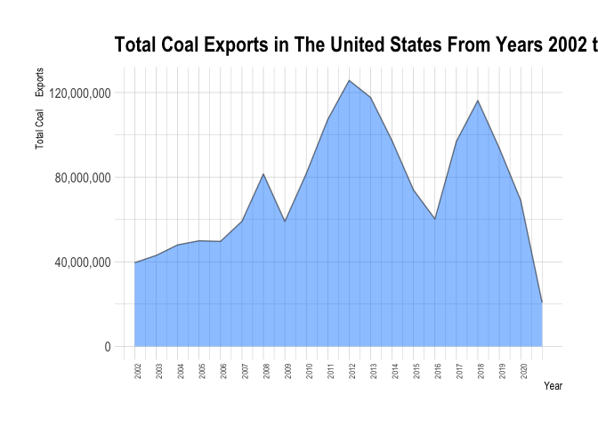
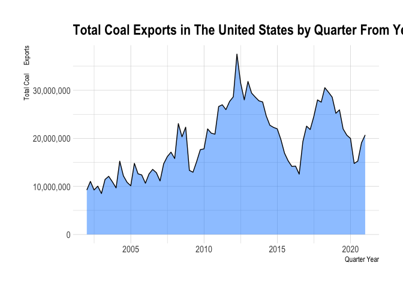
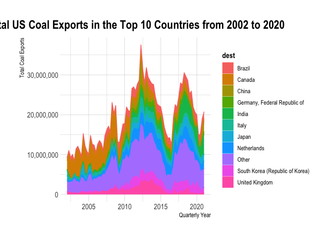
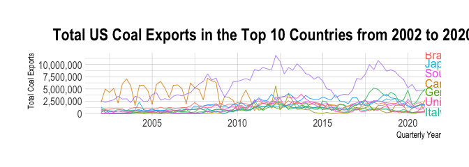
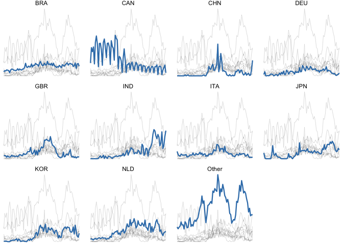
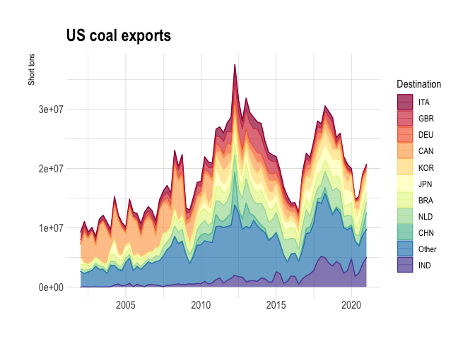
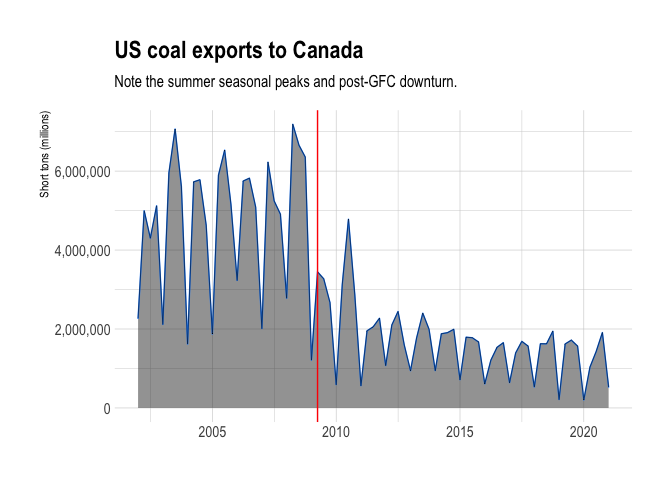

## Preliminaries: 

### Load libraries

It's a good idea to load our libraries at the top of the Rmd document so that everyone can see what we're using. Similarly, it's good practice to set `cache=FALSE` to ensure that the libraries are dynamically loaded each time you knit the document.

*I've only added the libraries needed to download and read the data. We'll need to load additional libraries to complete this assignment. Add them here once we discover that we need them.* 


```r
## Install the pacman package if necessary
if (!require("pacman")) install.packages("pacman")
## Install other packages using pacman::p_load()
pacman::p_load(httr, readxl, here,tinytex,tidyverse,data.table,rlang,
               ggplot2, janitor, tidyfast, dtplyr, microbenchmark, skimr, lubridate, ggiraph,naniar,dtplyr, ggthemes, hrbrthemes, gganimate, gifski, countrycode, plotly)
theme_set(hrbrthemes::theme_ipsum()) ## ggplot2 theme I like
```

### Read in the data

Use `httr::GET()` to fetch the EIA excel file for us from web.


```r
# library(here) ## Already loaded
# library(httr) ## Already loaded
url = "https://www.eia.gov/coal/archive/coal_historical_exports.xlsx"
## Only download the file if we need to
if(!file.exists(here::here("data/coal.xlsx"))) {
  GET(url, write_disk(here::here("data/coal.xlsx")))
}
```

Next, we read in the file.


```r
coal = read_excel(here::here("data/coal.xlsx"), skip = 3, na = ".")
```

We are now ready to go.

## 1) Clean the column names

The column (i.e. variable) names aren't great: Spacing, uppercase letters, etc. 

```r
#now let's make our data fram into a data table
coal_dt = as.data.table(coal)

#clean the variable names in our data set
#names(coal) #check to make sure they're uniform
coal = 
  coal %>% 
  clean_names() %>%
  rename(yr = year, qtr = quarter, dest = coal_destination_country)
coal
```

```
## # A tibble: 11,118 × 14
##       yr   qtr type         customs_district coal_origin_coun… dest   steam_coal
##    <dbl> <dbl> <chr>        <chr>            <chr>             <chr>       <dbl>
##  1  2002     1 Coal Exports Anchorage, AK    United States     South…      66874
##  2  2002     1 Coal Exports Baltimore, MD    United States     Belgi…     125856
##  3  2002     1 Coal Exports Baltimore, MD    United States     Brazil         NA
##  4  2002     1 Coal Exports Baltimore, MD    United States     Canada     149335
##  5  2002     1 Coal Exports Baltimore, MD    United States     Germa…     153465
##  6  2002     1 Coal Exports Baltimore, MD    United States     Irela…     132827
##  7  2002     1 Coal Exports Baltimore, MD    United States     Israel     130693
##  8  2002     1 Coal Exports Baltimore, MD    United States     Jamai…       4049
##  9  2002     1 Coal Exports Baltimore, MD    United States     Nethe…     139460
## 10  2002     1 Coal Exports Baltimore, MD    United States     Norway      12116
## # … with 11,108 more rows, and 7 more variables: steam_revenue <dbl>,
## #   metallurgical <dbl>, metallurgical_revenue <dbl>, total <dbl>,
## #   total_revenue <dbl>, coke <dbl>, coke_revenue <dbl>
```

## 2) Total US coal exports over time (year only)

Plot the US's total coal exports over time by year ONLY. What secular trends do you notice in the data?


```r
# names(coal_dt) = gsub(x = tolower(names(coal_dt)), " ", "_")
coal_dt = clean_names(coal_dt)
setnames(coal_dt, 
         old = c("year", "quarter", "coal_destination_country"),
         new = c("yr", "qtr", "dest"))
coal_dt
```

```
##          yr qtr         type customs_district coal_origin_country
##     1: 2002   1 Coal Exports    Anchorage, AK       United States
##     2: 2002   1 Coal Exports    Baltimore, MD       United States
##     3: 2002   1 Coal Exports    Baltimore, MD       United States
##     4: 2002   1 Coal Exports    Baltimore, MD       United States
##     5: 2002   1 Coal Exports    Baltimore, MD       United States
##    ---                                                           
## 11114: 2021   1 Coal Exports      Seattle, WA       United States
## 11115: 2021   1 Coal Exports      Seattle, WA       United States
## 11116: 2021   1 Coal Exports      Seattle, WA       United States
## 11117: 2021   1 Coal Exports      Seattle, WA       United States
## 11118: 2021   1 Coal Exports        Tampa, FL       United States
##                                   dest steam_coal steam_revenue metallurgical
##     1: South Korea (Republic of Korea)      66874       1669556            NA
##     2:                         Belgium     125856       3703190            NA
##     3:                          Brazil         NA            NA         44924
##     4:                          Canada     149335       4377923            NA
##     5:    Germany, Federal Republic of     153465       4788694         83010
##    ---                                                                       
## 11114:                           Japan     246086       7813540            NA
## 11115:                       Singapore         NA            NA            NA
## 11116: South Korea (Republic of Korea)    1241507      39447683            NA
## 11117:                        Thailand         47         32179            NA
## 11118:                          Panama         NA            NA            NA
##        metallurgical_revenue   total total_revenue coke coke_revenue
##     1:                    NA   66874       1669556   NA           NA
##     2:                    NA  125856       3703190   NA           NA
##     3:               2237029   44924       2237029   NA           NA
##     4:                    NA  149335       4377923   NA           NA
##     5:               2918079  236475       7706773   NA           NA
##    ---                                                              
## 11114:                    NA  246086       7813540   37        36038
## 11115:                    NA      NA            NA    6         2794
## 11116:                    NA 1241507      39447683   NA           NA
## 11117:                    NA      47         32179    7        10224
## 11118:                    NA      NA            NA   19        25499
```

*Hints: If you want nicely formatted y-axis label, add `+ scale_y_continuous(labels = scales::comma)` to your `ggplot2` code.*

**The trends in the data can be deciphered through the graph above. We see there is a steady increase of coal exports between the beginning years 2002 and 2006. In year 2006 and beyond, we start to see sections of a dramatic, positive increase followed by a dramatic decrease. It is oscillating in a linear  manner and getting more dramatic in magnitude as time goes on. Thus, coal is being exported immediately after it is harvested, in a quick fashion--and then the exports slow down as resources run out, and need time to replenish. It is also seen to slow down because once nations buy coal, they need time to use it up before they need to repurchase more coal, for more use... and so on. These secular trends can be defined over years 2006-2009, 2009-2018, and from 2018-2020. The magnitude of change in coal exports in these periods seem to get multiply the increasing and decreasing amounts of coal exports as time goes on. It is seen to have been given a small start though, with not too many exports. The secular trends seem to start around year 2007 and have gone on to increase overall coal exports. The level of exports doesn't seems to drop below the quantity of 50,000,000 a year though. Since 2006, there hadn't been less than 50,000,000 coal exports a year.**


```r
# set plotting theme
#now we want to plot total exports by year using data.table and ggplot2
coal_dt[, .(total = sum(total, na.rm=TRUE)), by = yr] %>%
  ggplot(aes(x=yr, y=total)) +
  geom_area(alpha=0.5, fill = "dodgerblue") +
  geom_line(alpha = 0.5, color = "black") +
  scale_y_continuous(labels = scales::comma) + 
  labs(title= "Total Coal Exports in The United States From Years 2002 to 2020", x = "Year", y = "Total Coal     Exports") + 
  scale_x_continuous(labels = seq(2002, 2020, 1), breaks = seq(2002, 2020, 1)) + # display every year's value
  theme(axis.text.x = element_text(angle=90,size=7))
```

<!-- -->

## 3) Total US coal exports over time (year AND quarter)

Now do the same as the above, expect aggregated quarter of year (2001Q1, 2002Q2, etc.). Do you notice any seasonality that was masked from the yearly averages?


```r
#aggregate by quarter every year now
coal_dt[, yr_qtr := as.IDate(paste(yr , qtr*3-2, '01', sep = '-'))]
#ggplot2 is going to want to convert your quarterly data into actual date format before it plots nicely. (i.e. Don't leave it as a string.

coal_dt
```

```
##          yr qtr         type customs_district coal_origin_country
##     1: 2002   1 Coal Exports    Anchorage, AK       United States
##     2: 2002   1 Coal Exports    Baltimore, MD       United States
##     3: 2002   1 Coal Exports    Baltimore, MD       United States
##     4: 2002   1 Coal Exports    Baltimore, MD       United States
##     5: 2002   1 Coal Exports    Baltimore, MD       United States
##    ---                                                           
## 11114: 2021   1 Coal Exports      Seattle, WA       United States
## 11115: 2021   1 Coal Exports      Seattle, WA       United States
## 11116: 2021   1 Coal Exports      Seattle, WA       United States
## 11117: 2021   1 Coal Exports      Seattle, WA       United States
## 11118: 2021   1 Coal Exports        Tampa, FL       United States
##                                   dest steam_coal steam_revenue metallurgical
##     1: South Korea (Republic of Korea)      66874       1669556            NA
##     2:                         Belgium     125856       3703190            NA
##     3:                          Brazil         NA            NA         44924
##     4:                          Canada     149335       4377923            NA
##     5:    Germany, Federal Republic of     153465       4788694         83010
##    ---                                                                       
## 11114:                           Japan     246086       7813540            NA
## 11115:                       Singapore         NA            NA            NA
## 11116: South Korea (Republic of Korea)    1241507      39447683            NA
## 11117:                        Thailand         47         32179            NA
## 11118:                          Panama         NA            NA            NA
##        metallurgical_revenue   total total_revenue coke coke_revenue     yr_qtr
##     1:                    NA   66874       1669556   NA           NA 2002-01-01
##     2:                    NA  125856       3703190   NA           NA 2002-01-01
##     3:               2237029   44924       2237029   NA           NA 2002-01-01
##     4:                    NA  149335       4377923   NA           NA 2002-01-01
##     5:               2918079  236475       7706773   NA           NA 2002-01-01
##    ---                                                                         
## 11114:                    NA  246086       7813540   37        36038 2021-01-01
## 11115:                    NA      NA            NA    6         2794 2021-01-01
## 11116:                    NA 1241507      39447683   NA           NA 2021-01-01
## 11117:                    NA      47         32179    7        10224 2021-01-01
## 11118:                    NA      NA            NA   19        25499 2021-01-01
```

```r
#plot it 
coal_dt[, .(total = sum(total, na.rm=TRUE)), by = yr_qtr] %>%
  ggplot(aes(x=yr_qtr, y=total)) +
  geom_area(alpha=0.5, fill = "dodgerblue") + 
  geom_line(alpha = 1, color = "black") +
  scale_y_continuous(labels = scales::comma)  +
  labs(title= "Total Coal Exports in The United States by Quarter From Years 2002 to 2020", x = "Quarter Year", y = "Total Coal     Exports") 
```

<!-- -->

**There was definitely seasonality that was masked from the yearly averages. We can see this because there exists more variation and more cycles within the given time  period. This is likely due to the fact that the yearly totals were summations of the quarters, which cuts out the ability to see more than one trend in a given year. From  our more detailed data display, we can see more secular trends, and more variation among the annual exports. Looking at the shape pattern, we see the triangles that signify a second quarter of a year, are mostly the  times when  exports  reach their highest each year: the second quarter receives the most coal exports in the given year. We also see the oscillation periods getting wider, signifying an export activity level that increases as time goes on.**

## 4) Exports by destination country

### 4.1) Create a new data frame

Create a new data frame called `coal_country` that aggregates total exports by destination country (and quarter of year). Make sure you print the resulting data frame so that it appears in the knitted R markdown document.


```r
#new data frame with total exports by country
# coal %>% distinct(type)
#data table way
coal_country_dt = coal_dt[, 
                          .(total = sum(total, na.rm=TRUE)), 
                          by = .(dest, yr_qtr)]

setorder(coal_country_dt, dest, yr_qtr)

coal_country_dt
```

```
##                dest     yr_qtr  total
##    1:       Albania 2016-10-01     74
##    2:       Algeria 2002-01-01 129305
##    3:       Algeria 2002-07-01  62931
##    4:       Algeria 2002-10-01 129563
##    5:       Algeria 2003-01-01 128525
##   ---                                
## 4682:       Vietnam 2020-01-01   1826
## 4683:       Vietnam 2020-04-01    137
## 4684:       Vietnam 2020-07-01     57
## 4685:       Vietnam 2021-01-01     24
## 4686: Western Samoa 2017-07-01    106
```

### 4.2) Inspect the data frame

It looks like some countries are missing data for a number of years and periods (e.g. Albania). Confirm that this is the case. What do you think is happening here?

```r
#we can compare rows and column with the original data.table set (not the copy) to see which variable inputs are missing

#first let us look at 
#names(coal_country$coal_destination_country)

#ungroup and then count how many each country destination has
coal_country_dt[, .N, by = dest]
```

```
##                dest  N
##   1:        Albania  1
##   2:        Algeria 47
##   3:        Andorra  1
##   4:         Angola 43
##   5:       Anguilla  1
##  ---                  
## 147: United Kingdom 77
## 148:        Uruguay 46
## 149:      Venezuela 72
## 150:        Vietnam 37
## 151:  Western Samoa  1
```
**Certain country's are getting omitted from our data.table because we need complete data on BOTH yearly quarter AND destination country in order to group by both objects. We removed NA values in our data sets when calculating sum totals. Since each country destination has multiple coal exports in a given quarter, we will have repeat amounts for our variable "summed_total" when looking at rows of JUST one destination country and one summed_total. Printing this out we can see this is the case due to the fact that all of the countries do not uniformly share the same amount of data entries.**

### 4.3) Complete the data frame

Fill in the implicit missing values, so that each country has a representative row for every year-quarter time period. In other words, you should modify the data frame so that every destination country has row entries for all possible year-quarter combinations (from 2002Q1 through the most recent quarter). Order your updated data frame by country, year and, quarter. 


```r
# Create a temporary data table with all possible combinations of countries and year-quarters
temp = CJ(dest = unique(coal_country_dt$dest), yr_qtr = unique(coal_country_dt$yr_qtr))

# Full join our temporary data table and our original caol_country_dt data table
coal_country_dt = merge(coal_country_dt, 
                        temp, 
                        all = TRUE, 
                        by = c('dest', 'yr_qtr'))

#rm(temp) # remove our temporary data table from our working environment

#print out our new merged data table containing all the quarterly years from 2002 to 2020 with the existing data filled in!
#coal_country_dt
```

### 4.4) Some more tidying up


```r
#as dplyr's data frame,  recall our data frame object


#we need to check if wee have any missing data in any quarters 
all_missing =
  coal %>%
  ## First count how many obs there per year-quarter combo
  add_count(yr, qtr) %>%
  ## Now we look at only the NA values
  filter(is.na(total)) %>%
  group_by(yr, qtr) %>%
  mutate(missing_n = n()) %>%
  ## See if we have any matches
  filter(n == missing_n) %>%
  distinct(yr, qtr)

#print out the missing ones
#all_missing ## there are none
```

**When using dplyr's data.frame's versus DataTable's data.table, you have to switch the formats of your data sets in order to use their corresponding package in R-studio. When data.table is used in conjunction with multiple steps, and multiple variable manipulation, it is imperative we create copies of our data in order to keep the original data set as it was imported. Otherwise, deletions,mutations, and other changes will permanently alter the observation values. However, I did not run into this issue and I have zero missing rows a.k.a. missing quarters.**

### 4.5) Culmulative top 10 US coal export destinations

Produce a vector 

```r
#make our vector
coal10_culm = coal_country_dt[, sum(total, na.rm=TRUE), by = dest][order(-V1), dest[1:10]]
#print out vector
coal10_culm
```

```
##  [1] "Canada"                          "Netherlands"                    
##  [3] "Brazil"                          "India"                          
##  [5] "South Korea (Republic of Korea)" "United Kingdom"                 
##  [7] "Japan"                           "Italy"                          
##  [9] "Germany, Federal Republic of"    "China"
```
### 4.6) Recent top 10 US coal export destinations

Now do the same, except for most recent period on record (i.e. final quarter in the dataset). Call this vector `coal10_recent` and make sure to print it so that I can see it too. Are there any interesting differences between the two vectors? Apart from any secular trends, what else might explain these differences?


```r
#make our vector
coal10_recent =
  coal_country_dt[yr_qtr==max(yr_qtr), sum(total, na.rm=TRUE), by = dest
                  ][order(-V1), dest[1:10]]
#print out the vector
coal10_recent
```

```
##  [1] "India"                           "China"                          
##  [3] "Netherlands"                     "Brazil"                         
##  [5] "Japan"                           "South Korea (Republic of Korea)"
##  [7] "Ukraine"                         "Canada"                         
##  [9] "Germany, Federal Republic of"    "Egypt"
```

**From our two vectors produced, we can see that they are the exact same vectors, with different arrangement of country destination names. Although they share the same top exports, we can gather that Canada is the Number 1 in most coal imports(since they're receiving US' coal exports). However, we also see India is #1 according to the second vector. If they are typical, and regular trading partners, then we would expect to see the same trends in top export destinations. Which we did overall.**

### 4.7) US coal exports over time by country {.tabset .tabset-fade .tabset-pills}

Plot the quarterly coal exports over time, but now disaggregated by country. In particular, highlight the top 10 (cumulative) export destinations and then sum the remaining countries into a combined "Other" category. (In other words, your figure should contain the time series of eleven different countries/categories.)


```r
#work with the datatable
`%nchin%` = Negate(`%chin%`)
coal_country_dt[dest %nchin% coal10_culm, dest := 'Other']
coal_country_dt = 
  coal_country_dt[, .(total = sum(total, na.rm=TRUE)), by = .(dest, yr_qtr)]

coal_country_dt
```

```
##                dest     yr_qtr   total
##   1:          Other 2002-01-01 2605613
##   2:          Other 2002-04-01 2281543
##   3:          Other 2002-07-01 2547928
##   4:          Other 2002-10-01 2782358
##   5:          Other 2003-01-01 3493542
##  ---                                  
## 843: United Kingdom 2020-01-01  354027
## 844: United Kingdom 2020-04-01  133708
## 845: United Kingdom 2020-07-01  317618
## 846: United Kingdom 2020-10-01  330598
## 847: United Kingdom 2021-01-01  323505
```


```r
library(directlabels)

#now plot it 
p = coal_country_dt %>%
  ggplot(aes(x=yr_qtr, y=total, fill= dest, col = dest)) + 
  scale_y_continuous(labels = scales::comma) +
  geom_area() +
  labs(x = "Quarterly Year", y = "Total Coal Exports", title = "Total US Coal Exports in the Top 10 Countries from 2002 to 2020") + 
  theme(legend.title = element_text(color = "Black", face = "bold")) +
#  scale_x_date() + 
  theme(plot.title = element_text(hjust = 0.5))

p
```

<!-- -->


```r
#now make another version of the same graph
p = coal_country_dt %>%
  ggplot(aes(x=yr_qtr, y=total, fill= dest, col = dest)) + 
  scale_y_continuous(labels = scales::comma) + 
  labs(x = "Quarterly Year", y = "Total Coal Exports", title = "Total US Coal Exports in the Top 10 Countries from 2002 to 2020") 


#get rid of the legend
p + theme(legend.position = "none") +
  geom_line(size = 0.29) + 
    # Add, from the directlabels package, 
  # geom_dl, using method = 'last.bumpup' to put the 
  # labels at the end, and make sure that if they intersect, 
  # one is bumped up
  geom_dl(aes(label = dest), method = 'last.bumpup')  +
  theme(plot.title = element_text(hjust = 0.5)) 
```

<!-- -->

### 4.8) Make it pretty

Take your previous plot and add some swag to it. That is, try to make it as visually appealing as possible without overloading it with chart junk.

*Hint: You've got loads of options here. If you haven't already done so, consider a more bespoke theme with the `ggthemes`, `hrbrthemes`, or `cowplot` packages. Try out `scale_fill_brewer()` and `scale_colour_brewer()` for a range of interesting colour palettes. Try some transparency effects with `alpha`. Give your axis labels more refined names with the `labs()` layer in ggplot2. While you're at it, you might want to scale (i.e. normalise) your y-variable to get rid of all those zeros. You can shorten any country names to their ISO abbreviation; see `?countrycode::countrycode`. More substantively --- but more complicated --- you might want to re-order your legend (and the plot itself) according to the relative importance of the destination countries. See `?forcats::fct_reorder` or forcats::fct_relevel`.*

```r
# library(countrycode) ## Already loaded

coal_country_dt[, iso := fifelse(dest!='Other',
                              countrycode(dest, 'country.name', 'iso3c'), 
                              'Other')]
```

```
## Warning in countrycode_convert(sourcevar = sourcevar, origin = origin, destination = dest, : Some values were not matched unambiguously: Other
```


```r
#spaghetti plot, faceted 
## Create a copy of our faceting variable (here: iso)
coal_country_dt$iso_copy = coal_country_dt$iso
coal_country = as.data.frame(coal_country_dt)
p1 = coal_country %>%
  ggplot(aes(x=yr_qtr, y=total)) +
  ## Extra geom_line() call. Note that i) we must remove the actual faceting 
  ## variable to ensure all the lines get printed in each facet, and ii) the
  ## copied facet variable is used in the group aesthetic.
  geom_line(
      data = . %>% select(-iso),
      aes(group=iso_copy), alpha=0.5, lwd=0.1
      ) +
  ## Main geom_line() call. We'll use a different colour/width for emphasis.
  geom_line(col = "#377EB8", lwd=0.8) +
  facet_wrap(~iso) +
  ## Since we're just emphasizing trends, I'll use a very plain plot theme
  theme_void()
p1
```

<!-- -->


```r
# the area map
# library(forcats)    ## Already loaded
# library(hrbrthemes) ## Already loaded

p2 =
  coal_country_dt %>%
  ggplot(
    aes(
      x=yr_qtr, y=total, 
      fill = forcats::fct_reorder2(iso, yr_qtr, total, .desc = FALSE), 
      col = forcats::fct_reorder2(iso, yr_qtr, total, .desc = FALSE)
      )) + 
  geom_area(alpha = 0.7) + ## Add some transparency
  geom_line(position="stack", lwd = 0.2) +
  scale_fill_brewer(palette="Spectral", name="Destination") + ## "Rainbow" palette (see note above)
  scale_colour_brewer(palette="Spectral", name="Destination") + ## See above.
  labs(y = "Short tons", title = "US coal exports") +
  theme(axis.title.x = element_blank()) ## Do we really to tell people that our x-axis is "Date"?
p2
```

<!-- -->


### 4.9) Make it interactive

Create an interactive version of your previous figure.


```r
#From our variable assignments, we can add our animations
ggplotly(p2)
```

```{=html}
<div id="htmlwidget-bf96c89e5850e22aae33" style="width:672px;height:480px;" class="plotly html-widget"></div>
<script type="application/json" data-for="htmlwidget-bf96c89e5850e22aae33">{"x":{"data":[{"x":[11688,11778,11869,11961,12053,12143,12234,12326,12418,12509,12600,12692,12784,12874,12965,13057,13149,13239,13330,13422,13514,13604,13695,13787,13879,13970,14061,14153,14245,14335,14426,14518,14610,14700,14791,14883,14975,15065,15156,15248,15340,15431,15522,15614,15706,15796,15887,15979,16071,16161,16252,16344,16436,16526,16617,16709,16801,16892,16983,17075,17167,17257,17348,17440,17532,17622,17713,17805,17897,17987,18078,18170,18262,18353,18444,18536,18628,18628,18536,18444,18353,18262,18170,18078,17987,17897,17805,17713,17622,17532,17440,17348,17257,17167,17075,16983,16892,16801,16709,16617,16526,16436,16344,16252,16161,16071,15979,15887,15796,15706,15614,15522,15431,15340,15248,15156,15065,14975,14883,14791,14700,14610,14518,14426,14335,14245,14153,14061,13970,13879,13787,13695,13604,13514,13422,13330,13239,13149,13057,12965,12874,12784,12692,12600,12509,12418,12326,12234,12143,12053,11961,11869,11778,11688,11688],"y":[7950721,10288579,8706368,9578204,7698491,10735753,11479436,10273379,9036724,14494222,11905635,10456409,9675579,14107844,11982235,11721516,9627530,11941415,12877541,11918092,10359065,13977573,15324428,15958359,15027139,22047680,19739303,21508232,12459886,12548296,14569722,17175885,16973893,21168769,20162917,20101781,25490201,25347480,24561440,26270030,26108456,35049833,29375247,26672308,29994678,27716158,26723574,26631236,25396843,23341449,21568639,21168835,21166071,18891509,16027990,14441319,13667998,13743815,12183258,18765623,21715062,21106247,23969903,27011190,26805091,29699396,28737732,27651469,24361192,25457729,21415053,19856375,19522124,14553412,14964987,18838452,20423125,20705921,19063979,15251963,14778291,19976530,20663083,21959546,25929050,25212972,28575487,29602063,30538394,27528128,27998377,24570968,21836174,22539600,19342681,12551910,14223405,14153021,15298734,16914302,19765801,21979051,22275733,22723075,24674050,27583888,27808662,28588663,29426762,31835181,28006159,31563367,37534438,28641698,27679278,25975612,26986514,26617157,20870017,21074094,21964969,17806595,17652792,15158611,12950726,13334822,22328502,20320529,23068506,15801578,17124192,16197591,14701934,11139386,12858250,13539545,12590310,10659164,12389855,12619905,14803046,10129405,10851830,12202660,15255342,9688063,10951988,12093944,11449798,8517778,10049584,9256554,11042519,9252584,7950721],"text":["yr_qtr: 2002-01-01<br />total:  1301863<br />forcats::fct_reorder2(iso, yr_qtr, total, .desc = FALSE): ITA<br />forcats::fct_reorder2(iso, yr_qtr, total, .desc = FALSE): ITA","yr_qtr: 2002-04-01<br />total:   753940<br />forcats::fct_reorder2(iso, yr_qtr, total, .desc = FALSE): ITA<br />forcats::fct_reorder2(iso, yr_qtr, total, .desc = FALSE): ITA","yr_qtr: 2002-07-01<br />total:   550186<br />forcats::fct_reorder2(iso, yr_qtr, total, .desc = FALSE): ITA<br />forcats::fct_reorder2(iso, yr_qtr, total, .desc = FALSE): ITA","yr_qtr: 2002-10-01<br />total:   471380<br />forcats::fct_reorder2(iso, yr_qtr, total, .desc = FALSE): ITA<br />forcats::fct_reorder2(iso, yr_qtr, total, .desc = FALSE): ITA","yr_qtr: 2003-01-01<br />total:   819287<br />forcats::fct_reorder2(iso, yr_qtr, total, .desc = FALSE): ITA<br />forcats::fct_reorder2(iso, yr_qtr, total, .desc = FALSE): ITA","yr_qtr: 2003-04-01<br />total:   714045<br />forcats::fct_reorder2(iso, yr_qtr, total, .desc = FALSE): ITA<br />forcats::fct_reorder2(iso, yr_qtr, total, .desc = FALSE): ITA","yr_qtr: 2003-07-01<br />total:   614508<br />forcats::fct_reorder2(iso, yr_qtr, total, .desc = FALSE): ITA<br />forcats::fct_reorder2(iso, yr_qtr, total, .desc = FALSE): ITA","yr_qtr: 2003-10-01<br />total:   678609<br />forcats::fct_reorder2(iso, yr_qtr, total, .desc = FALSE): ITA<br />forcats::fct_reorder2(iso, yr_qtr, total, .desc = FALSE): ITA","yr_qtr: 2004-01-01<br />total:   651339<br />forcats::fct_reorder2(iso, yr_qtr, total, .desc = FALSE): ITA<br />forcats::fct_reorder2(iso, yr_qtr, total, .desc = FALSE): ITA","yr_qtr: 2004-04-01<br />total:   761120<br />forcats::fct_reorder2(iso, yr_qtr, total, .desc = FALSE): ITA<br />forcats::fct_reorder2(iso, yr_qtr, total, .desc = FALSE): ITA","yr_qtr: 2004-07-01<br />total:   297025<br />forcats::fct_reorder2(iso, yr_qtr, total, .desc = FALSE): ITA<br />forcats::fct_reorder2(iso, yr_qtr, total, .desc = FALSE): ITA","yr_qtr: 2004-10-01<br />total:   395421<br />forcats::fct_reorder2(iso, yr_qtr, total, .desc = FALSE): ITA<br />forcats::fct_reorder2(iso, yr_qtr, total, .desc = FALSE): ITA","yr_qtr: 2005-01-01<br />total:   453826<br />forcats::fct_reorder2(iso, yr_qtr, total, .desc = FALSE): ITA<br />forcats::fct_reorder2(iso, yr_qtr, total, .desc = FALSE): ITA","yr_qtr: 2005-04-01<br />total:   695202<br />forcats::fct_reorder2(iso, yr_qtr, total, .desc = FALSE): ITA<br />forcats::fct_reorder2(iso, yr_qtr, total, .desc = FALSE): ITA","yr_qtr: 2005-07-01<br />total:   637670<br />forcats::fct_reorder2(iso, yr_qtr, total, .desc = FALSE): ITA<br />forcats::fct_reorder2(iso, yr_qtr, total, .desc = FALSE): ITA","yr_qtr: 2005-10-01<br />total:   668339<br />forcats::fct_reorder2(iso, yr_qtr, total, .desc = FALSE): ITA<br />forcats::fct_reorder2(iso, yr_qtr, total, .desc = FALSE): ITA","yr_qtr: 2006-01-01<br />total:  1031634<br />forcats::fct_reorder2(iso, yr_qtr, total, .desc = FALSE): ITA<br />forcats::fct_reorder2(iso, yr_qtr, total, .desc = FALSE): ITA","yr_qtr: 2006-04-01<br />total:   648895<br />forcats::fct_reorder2(iso, yr_qtr, total, .desc = FALSE): ITA<br />forcats::fct_reorder2(iso, yr_qtr, total, .desc = FALSE): ITA","yr_qtr: 2006-07-01<br />total:   662004<br />forcats::fct_reorder2(iso, yr_qtr, total, .desc = FALSE): ITA<br />forcats::fct_reorder2(iso, yr_qtr, total, .desc = FALSE): ITA","yr_qtr: 2006-10-01<br />total:   940158<br />forcats::fct_reorder2(iso, yr_qtr, total, .desc = FALSE): ITA<br />forcats::fct_reorder2(iso, yr_qtr, total, .desc = FALSE): ITA","yr_qtr: 2007-01-01<br />total:   780321<br />forcats::fct_reorder2(iso, yr_qtr, total, .desc = FALSE): ITA<br />forcats::fct_reorder2(iso, yr_qtr, total, .desc = FALSE): ITA","yr_qtr: 2007-04-01<br />total:   724361<br />forcats::fct_reorder2(iso, yr_qtr, total, .desc = FALSE): ITA<br />forcats::fct_reorder2(iso, yr_qtr, total, .desc = FALSE): ITA","yr_qtr: 2007-07-01<br />total:   873163<br />forcats::fct_reorder2(iso, yr_qtr, total, .desc = FALSE): ITA<br />forcats::fct_reorder2(iso, yr_qtr, total, .desc = FALSE): ITA","yr_qtr: 2007-10-01<br />total:  1165833<br />forcats::fct_reorder2(iso, yr_qtr, total, .desc = FALSE): ITA<br />forcats::fct_reorder2(iso, yr_qtr, total, .desc = FALSE): ITA","yr_qtr: 2008-01-01<br />total:   774439<br />forcats::fct_reorder2(iso, yr_qtr, total, .desc = FALSE): ITA<br />forcats::fct_reorder2(iso, yr_qtr, total, .desc = FALSE): ITA","yr_qtr: 2008-04-01<br />total:  1020826<br />forcats::fct_reorder2(iso, yr_qtr, total, .desc = FALSE): ITA<br />forcats::fct_reorder2(iso, yr_qtr, total, .desc = FALSE): ITA","yr_qtr: 2008-07-01<br />total:   581226<br />forcats::fct_reorder2(iso, yr_qtr, total, .desc = FALSE): ITA<br />forcats::fct_reorder2(iso, yr_qtr, total, .desc = FALSE): ITA","yr_qtr: 2008-10-01<br />total:   820270<br />forcats::fct_reorder2(iso, yr_qtr, total, .desc = FALSE): ITA<br />forcats::fct_reorder2(iso, yr_qtr, total, .desc = FALSE): ITA","yr_qtr: 2009-01-01<br />total:   874936<br />forcats::fct_reorder2(iso, yr_qtr, total, .desc = FALSE): ITA<br />forcats::fct_reorder2(iso, yr_qtr, total, .desc = FALSE): ITA","yr_qtr: 2009-04-01<br />total:   402430<br />forcats::fct_reorder2(iso, yr_qtr, total, .desc = FALSE): ITA<br />forcats::fct_reorder2(iso, yr_qtr, total, .desc = FALSE): ITA","yr_qtr: 2009-07-01<br />total:   588889<br />forcats::fct_reorder2(iso, yr_qtr, total, .desc = FALSE): ITA<br />forcats::fct_reorder2(iso, yr_qtr, total, .desc = FALSE): ITA","yr_qtr: 2009-10-01<br />total:   476907<br />forcats::fct_reorder2(iso, yr_qtr, total, .desc = FALSE): ITA<br />forcats::fct_reorder2(iso, yr_qtr, total, .desc = FALSE): ITA","yr_qtr: 2010-01-01<br />total:   832702<br />forcats::fct_reorder2(iso, yr_qtr, total, .desc = FALSE): ITA<br />forcats::fct_reorder2(iso, yr_qtr, total, .desc = FALSE): ITA","yr_qtr: 2010-04-01<br />total:   796200<br />forcats::fct_reorder2(iso, yr_qtr, total, .desc = FALSE): ITA<br />forcats::fct_reorder2(iso, yr_qtr, total, .desc = FALSE): ITA","yr_qtr: 2010-07-01<br />total:   911177<br />forcats::fct_reorder2(iso, yr_qtr, total, .desc = FALSE): ITA<br />forcats::fct_reorder2(iso, yr_qtr, total, .desc = FALSE): ITA","yr_qtr: 2010-10-01<br />total:   768236<br />forcats::fct_reorder2(iso, yr_qtr, total, .desc = FALSE): ITA<br />forcats::fct_reorder2(iso, yr_qtr, total, .desc = FALSE): ITA","yr_qtr: 2011-01-01<br />total:  1126956<br />forcats::fct_reorder2(iso, yr_qtr, total, .desc = FALSE): ITA<br />forcats::fct_reorder2(iso, yr_qtr, total, .desc = FALSE): ITA","yr_qtr: 2011-04-01<br />total:  1639034<br />forcats::fct_reorder2(iso, yr_qtr, total, .desc = FALSE): ITA<br />forcats::fct_reorder2(iso, yr_qtr, total, .desc = FALSE): ITA","yr_qtr: 2011-07-01<br />total:  1414172<br />forcats::fct_reorder2(iso, yr_qtr, total, .desc = FALSE): ITA<br />forcats::fct_reorder2(iso, yr_qtr, total, .desc = FALSE): ITA","yr_qtr: 2011-10-01<br />total:  1409248<br />forcats::fct_reorder2(iso, yr_qtr, total, .desc = FALSE): ITA<br />forcats::fct_reorder2(iso, yr_qtr, total, .desc = FALSE): ITA","yr_qtr: 2012-01-01<br />total:  2533242<br />forcats::fct_reorder2(iso, yr_qtr, total, .desc = FALSE): ITA<br />forcats::fct_reorder2(iso, yr_qtr, total, .desc = FALSE): ITA","yr_qtr: 2012-04-01<br />total:  2484605<br />forcats::fct_reorder2(iso, yr_qtr, total, .desc = FALSE): ITA<br />forcats::fct_reorder2(iso, yr_qtr, total, .desc = FALSE): ITA","yr_qtr: 2012-07-01<br />total:  2188120<br />forcats::fct_reorder2(iso, yr_qtr, total, .desc = FALSE): ITA<br />forcats::fct_reorder2(iso, yr_qtr, total, .desc = FALSE): ITA","yr_qtr: 2012-10-01<br />total:  1333851<br />forcats::fct_reorder2(iso, yr_qtr, total, .desc = FALSE): ITA<br />forcats::fct_reorder2(iso, yr_qtr, total, .desc = FALSE): ITA","yr_qtr: 2013-01-01<br />total:  1840503<br />forcats::fct_reorder2(iso, yr_qtr, total, .desc = FALSE): ITA<br />forcats::fct_reorder2(iso, yr_qtr, total, .desc = FALSE): ITA","yr_qtr: 2013-04-01<br />total:  1710604<br />forcats::fct_reorder2(iso, yr_qtr, total, .desc = FALSE): ITA<br />forcats::fct_reorder2(iso, yr_qtr, total, .desc = FALSE): ITA","yr_qtr: 2013-07-01<br />total:  1865089<br />forcats::fct_reorder2(iso, yr_qtr, total, .desc = FALSE): ITA<br />forcats::fct_reorder2(iso, yr_qtr, total, .desc = FALSE): ITA","yr_qtr: 2013-10-01<br />total:  1177426<br />forcats::fct_reorder2(iso, yr_qtr, total, .desc = FALSE): ITA<br />forcats::fct_reorder2(iso, yr_qtr, total, .desc = FALSE): ITA","yr_qtr: 2014-01-01<br />total:  2187045<br />forcats::fct_reorder2(iso, yr_qtr, total, .desc = FALSE): ITA<br />forcats::fct_reorder2(iso, yr_qtr, total, .desc = FALSE): ITA","yr_qtr: 2014-04-01<br />total:  1332601<br />forcats::fct_reorder2(iso, yr_qtr, total, .desc = FALSE): ITA<br />forcats::fct_reorder2(iso, yr_qtr, total, .desc = FALSE): ITA","yr_qtr: 2014-07-01<br />total:  1154436<br />forcats::fct_reorder2(iso, yr_qtr, total, .desc = FALSE): ITA<br />forcats::fct_reorder2(iso, yr_qtr, total, .desc = FALSE): ITA","yr_qtr: 2014-10-01<br />total:  1106898<br />forcats::fct_reorder2(iso, yr_qtr, total, .desc = FALSE): ITA<br />forcats::fct_reorder2(iso, yr_qtr, total, .desc = FALSE): ITA","yr_qtr: 2015-01-01<br />total:   812980<br />forcats::fct_reorder2(iso, yr_qtr, total, .desc = FALSE): ITA<br />forcats::fct_reorder2(iso, yr_qtr, total, .desc = FALSE): ITA","yr_qtr: 2015-04-01<br />total:   874292<br />forcats::fct_reorder2(iso, yr_qtr, total, .desc = FALSE): ITA<br />forcats::fct_reorder2(iso, yr_qtr, total, .desc = FALSE): ITA","yr_qtr: 2015-07-01<br />total:   886312<br />forcats::fct_reorder2(iso, yr_qtr, total, .desc = FALSE): ITA<br />forcats::fct_reorder2(iso, yr_qtr, total, .desc = FALSE): ITA","yr_qtr: 2015-10-01<br />total:   857415<br />forcats::fct_reorder2(iso, yr_qtr, total, .desc = FALSE): ITA<br />forcats::fct_reorder2(iso, yr_qtr, total, .desc = FALSE): ITA","yr_qtr: 2016-01-01<br />total:   485023<br />forcats::fct_reorder2(iso, yr_qtr, total, .desc = FALSE): ITA<br />forcats::fct_reorder2(iso, yr_qtr, total, .desc = FALSE): ITA","yr_qtr: 2016-04-01<br />total:   479590<br />forcats::fct_reorder2(iso, yr_qtr, total, .desc = FALSE): ITA<br />forcats::fct_reorder2(iso, yr_qtr, total, .desc = FALSE): ITA","yr_qtr: 2016-07-01<br />total:   368652<br />forcats::fct_reorder2(iso, yr_qtr, total, .desc = FALSE): ITA<br />forcats::fct_reorder2(iso, yr_qtr, total, .desc = FALSE): ITA","yr_qtr: 2016-10-01<br />total:   577058<br />forcats::fct_reorder2(iso, yr_qtr, total, .desc = FALSE): ITA<br />forcats::fct_reorder2(iso, yr_qtr, total, .desc = FALSE): ITA","yr_qtr: 2017-01-01<br />total:   824538<br />forcats::fct_reorder2(iso, yr_qtr, total, .desc = FALSE): ITA<br />forcats::fct_reorder2(iso, yr_qtr, total, .desc = FALSE): ITA","yr_qtr: 2017-04-01<br />total:   729927<br />forcats::fct_reorder2(iso, yr_qtr, total, .desc = FALSE): ITA<br />forcats::fct_reorder2(iso, yr_qtr, total, .desc = FALSE): ITA","yr_qtr: 2017-07-01<br />total:   601065<br />forcats::fct_reorder2(iso, yr_qtr, total, .desc = FALSE): ITA<br />forcats::fct_reorder2(iso, yr_qtr, total, .desc = FALSE): ITA","yr_qtr: 2017-10-01<br />total:   987187<br />forcats::fct_reorder2(iso, yr_qtr, total, .desc = FALSE): ITA<br />forcats::fct_reorder2(iso, yr_qtr, total, .desc = FALSE): ITA","yr_qtr: 2018-01-01<br />total:   723037<br />forcats::fct_reorder2(iso, yr_qtr, total, .desc = FALSE): ITA<br />forcats::fct_reorder2(iso, yr_qtr, total, .desc = FALSE): ITA","yr_qtr: 2018-04-01<br />total:   838998<br />forcats::fct_reorder2(iso, yr_qtr, total, .desc = FALSE): ITA<br />forcats::fct_reorder2(iso, yr_qtr, total, .desc = FALSE): ITA","yr_qtr: 2018-07-01<br />total:   864331<br />forcats::fct_reorder2(iso, yr_qtr, total, .desc = FALSE): ITA<br />forcats::fct_reorder2(iso, yr_qtr, total, .desc = FALSE): ITA","yr_qtr: 2018-10-01<br />total:   924018<br />forcats::fct_reorder2(iso, yr_qtr, total, .desc = FALSE): ITA<br />forcats::fct_reorder2(iso, yr_qtr, total, .desc = FALSE): ITA","yr_qtr: 2019-01-01<br />total:   851780<br />forcats::fct_reorder2(iso, yr_qtr, total, .desc = FALSE): ITA<br />forcats::fct_reorder2(iso, yr_qtr, total, .desc = FALSE): ITA","yr_qtr: 2019-04-01<br />total:   471321<br />forcats::fct_reorder2(iso, yr_qtr, total, .desc = FALSE): ITA<br />forcats::fct_reorder2(iso, yr_qtr, total, .desc = FALSE): ITA","yr_qtr: 2019-07-01<br />total:   544493<br />forcats::fct_reorder2(iso, yr_qtr, total, .desc = FALSE): ITA<br />forcats::fct_reorder2(iso, yr_qtr, total, .desc = FALSE): ITA","yr_qtr: 2019-10-01<br />total:   806708<br />forcats::fct_reorder2(iso, yr_qtr, total, .desc = FALSE): ITA<br />forcats::fct_reorder2(iso, yr_qtr, total, .desc = FALSE): ITA","yr_qtr: 2020-01-01<br />total:   454406<br />forcats::fct_reorder2(iso, yr_qtr, total, .desc = FALSE): ITA<br />forcats::fct_reorder2(iso, yr_qtr, total, .desc = FALSE): ITA","yr_qtr: 2020-04-01<br />total:   224879<br />forcats::fct_reorder2(iso, yr_qtr, total, .desc = FALSE): ITA<br />forcats::fct_reorder2(iso, yr_qtr, total, .desc = FALSE): ITA","yr_qtr: 2020-07-01<br />total:   286976<br />forcats::fct_reorder2(iso, yr_qtr, total, .desc = FALSE): ITA<br />forcats::fct_reorder2(iso, yr_qtr, total, .desc = FALSE): ITA","yr_qtr: 2020-10-01<br />total:   225527<br />forcats::fct_reorder2(iso, yr_qtr, total, .desc = FALSE): ITA<br />forcats::fct_reorder2(iso, yr_qtr, total, .desc = FALSE): ITA","yr_qtr: 2021-01-01<br />total:   282796<br />forcats::fct_reorder2(iso, yr_qtr, total, .desc = FALSE): ITA<br />forcats::fct_reorder2(iso, yr_qtr, total, .desc = FALSE): ITA","yr_qtr: 2021-01-01<br />total:   282796<br />forcats::fct_reorder2(iso, yr_qtr, total, .desc = FALSE): ITA<br />forcats::fct_reorder2(iso, yr_qtr, total, .desc = FALSE): ITA","yr_qtr: 2020-10-01<br />total:   225527<br />forcats::fct_reorder2(iso, yr_qtr, total, .desc = FALSE): ITA<br />forcats::fct_reorder2(iso, yr_qtr, total, .desc = FALSE): ITA","yr_qtr: 2020-07-01<br />total:   286976<br />forcats::fct_reorder2(iso, yr_qtr, total, .desc = FALSE): ITA<br />forcats::fct_reorder2(iso, yr_qtr, total, .desc = FALSE): ITA","yr_qtr: 2020-04-01<br />total:   224879<br />forcats::fct_reorder2(iso, yr_qtr, total, .desc = FALSE): ITA<br />forcats::fct_reorder2(iso, yr_qtr, total, .desc = FALSE): ITA","yr_qtr: 2020-01-01<br />total:   454406<br />forcats::fct_reorder2(iso, yr_qtr, total, .desc = FALSE): ITA<br />forcats::fct_reorder2(iso, yr_qtr, total, .desc = FALSE): ITA","yr_qtr: 2019-10-01<br />total:   806708<br />forcats::fct_reorder2(iso, yr_qtr, total, .desc = FALSE): ITA<br />forcats::fct_reorder2(iso, yr_qtr, total, .desc = FALSE): ITA","yr_qtr: 2019-07-01<br />total:   544493<br />forcats::fct_reorder2(iso, yr_qtr, total, .desc = FALSE): ITA<br />forcats::fct_reorder2(iso, yr_qtr, total, .desc = FALSE): ITA","yr_qtr: 2019-04-01<br />total:   471321<br />forcats::fct_reorder2(iso, yr_qtr, total, .desc = FALSE): ITA<br />forcats::fct_reorder2(iso, yr_qtr, total, .desc = FALSE): ITA","yr_qtr: 2019-01-01<br />total:   851780<br />forcats::fct_reorder2(iso, yr_qtr, total, .desc = FALSE): ITA<br />forcats::fct_reorder2(iso, yr_qtr, total, .desc = FALSE): ITA","yr_qtr: 2018-10-01<br />total:   924018<br />forcats::fct_reorder2(iso, yr_qtr, total, .desc = FALSE): ITA<br />forcats::fct_reorder2(iso, yr_qtr, total, .desc = FALSE): ITA","yr_qtr: 2018-07-01<br />total:   864331<br />forcats::fct_reorder2(iso, yr_qtr, total, .desc = FALSE): ITA<br />forcats::fct_reorder2(iso, yr_qtr, total, .desc = FALSE): ITA","yr_qtr: 2018-04-01<br />total:   838998<br />forcats::fct_reorder2(iso, yr_qtr, total, .desc = FALSE): ITA<br />forcats::fct_reorder2(iso, yr_qtr, total, .desc = FALSE): ITA","yr_qtr: 2018-01-01<br />total:   723037<br />forcats::fct_reorder2(iso, yr_qtr, total, .desc = FALSE): ITA<br />forcats::fct_reorder2(iso, yr_qtr, total, .desc = FALSE): ITA","yr_qtr: 2017-10-01<br />total:   987187<br />forcats::fct_reorder2(iso, yr_qtr, total, .desc = FALSE): ITA<br />forcats::fct_reorder2(iso, yr_qtr, total, .desc = FALSE): ITA","yr_qtr: 2017-07-01<br />total:   601065<br />forcats::fct_reorder2(iso, yr_qtr, total, .desc = FALSE): ITA<br />forcats::fct_reorder2(iso, yr_qtr, total, .desc = FALSE): ITA","yr_qtr: 2017-04-01<br />total:   729927<br />forcats::fct_reorder2(iso, yr_qtr, total, .desc = FALSE): ITA<br />forcats::fct_reorder2(iso, yr_qtr, total, .desc = FALSE): ITA","yr_qtr: 2017-01-01<br />total:   824538<br />forcats::fct_reorder2(iso, yr_qtr, total, .desc = FALSE): ITA<br />forcats::fct_reorder2(iso, yr_qtr, total, .desc = FALSE): ITA","yr_qtr: 2016-10-01<br />total:   577058<br />forcats::fct_reorder2(iso, yr_qtr, total, .desc = FALSE): ITA<br />forcats::fct_reorder2(iso, yr_qtr, total, .desc = FALSE): ITA","yr_qtr: 2016-07-01<br />total:   368652<br />forcats::fct_reorder2(iso, yr_qtr, total, .desc = FALSE): ITA<br />forcats::fct_reorder2(iso, yr_qtr, total, .desc = FALSE): ITA","yr_qtr: 2016-04-01<br />total:   479590<br />forcats::fct_reorder2(iso, yr_qtr, total, .desc = FALSE): ITA<br />forcats::fct_reorder2(iso, yr_qtr, total, .desc = FALSE): ITA","yr_qtr: 2016-01-01<br />total:   485023<br />forcats::fct_reorder2(iso, yr_qtr, total, .desc = FALSE): ITA<br />forcats::fct_reorder2(iso, yr_qtr, total, .desc = FALSE): ITA","yr_qtr: 2015-10-01<br />total:   857415<br />forcats::fct_reorder2(iso, yr_qtr, total, .desc = FALSE): ITA<br />forcats::fct_reorder2(iso, yr_qtr, total, .desc = FALSE): ITA","yr_qtr: 2015-07-01<br />total:   886312<br />forcats::fct_reorder2(iso, yr_qtr, total, .desc = FALSE): ITA<br />forcats::fct_reorder2(iso, yr_qtr, total, .desc = FALSE): ITA","yr_qtr: 2015-04-01<br />total:   874292<br />forcats::fct_reorder2(iso, yr_qtr, total, .desc = FALSE): ITA<br />forcats::fct_reorder2(iso, yr_qtr, total, .desc = FALSE): ITA","yr_qtr: 2015-01-01<br />total:   812980<br />forcats::fct_reorder2(iso, yr_qtr, total, .desc = FALSE): ITA<br />forcats::fct_reorder2(iso, yr_qtr, total, .desc = FALSE): ITA","yr_qtr: 2014-10-01<br />total:  1106898<br />forcats::fct_reorder2(iso, yr_qtr, total, .desc = FALSE): ITA<br />forcats::fct_reorder2(iso, yr_qtr, total, .desc = FALSE): ITA","yr_qtr: 2014-07-01<br />total:  1154436<br />forcats::fct_reorder2(iso, yr_qtr, total, .desc = FALSE): ITA<br />forcats::fct_reorder2(iso, yr_qtr, total, .desc = FALSE): ITA","yr_qtr: 2014-04-01<br />total:  1332601<br />forcats::fct_reorder2(iso, yr_qtr, total, .desc = FALSE): ITA<br />forcats::fct_reorder2(iso, yr_qtr, total, .desc = FALSE): ITA","yr_qtr: 2014-01-01<br />total:  2187045<br />forcats::fct_reorder2(iso, yr_qtr, total, .desc = FALSE): ITA<br />forcats::fct_reorder2(iso, yr_qtr, total, .desc = FALSE): ITA","yr_qtr: 2013-10-01<br />total:  1177426<br />forcats::fct_reorder2(iso, yr_qtr, total, .desc = FALSE): ITA<br />forcats::fct_reorder2(iso, yr_qtr, total, .desc = FALSE): ITA","yr_qtr: 2013-07-01<br />total:  1865089<br />forcats::fct_reorder2(iso, yr_qtr, total, .desc = FALSE): ITA<br />forcats::fct_reorder2(iso, yr_qtr, total, .desc = FALSE): ITA","yr_qtr: 2013-04-01<br />total:  1710604<br />forcats::fct_reorder2(iso, yr_qtr, total, .desc = FALSE): ITA<br />forcats::fct_reorder2(iso, yr_qtr, total, .desc = FALSE): ITA","yr_qtr: 2013-01-01<br />total:  1840503<br />forcats::fct_reorder2(iso, yr_qtr, total, .desc = FALSE): ITA<br />forcats::fct_reorder2(iso, yr_qtr, total, .desc = FALSE): ITA","yr_qtr: 2012-10-01<br />total:  1333851<br />forcats::fct_reorder2(iso, yr_qtr, total, .desc = FALSE): ITA<br />forcats::fct_reorder2(iso, yr_qtr, total, .desc = FALSE): ITA","yr_qtr: 2012-07-01<br />total:  2188120<br />forcats::fct_reorder2(iso, yr_qtr, total, .desc = FALSE): ITA<br />forcats::fct_reorder2(iso, yr_qtr, total, .desc = FALSE): ITA","yr_qtr: 2012-04-01<br />total:  2484605<br />forcats::fct_reorder2(iso, yr_qtr, total, .desc = FALSE): ITA<br />forcats::fct_reorder2(iso, yr_qtr, total, .desc = FALSE): ITA","yr_qtr: 2012-01-01<br />total:  2533242<br />forcats::fct_reorder2(iso, yr_qtr, total, .desc = FALSE): ITA<br />forcats::fct_reorder2(iso, yr_qtr, total, .desc = FALSE): ITA","yr_qtr: 2011-10-01<br />total:  1409248<br />forcats::fct_reorder2(iso, yr_qtr, total, .desc = FALSE): ITA<br />forcats::fct_reorder2(iso, yr_qtr, total, .desc = FALSE): ITA","yr_qtr: 2011-07-01<br />total:  1414172<br />forcats::fct_reorder2(iso, yr_qtr, total, .desc = FALSE): ITA<br />forcats::fct_reorder2(iso, yr_qtr, total, .desc = FALSE): ITA","yr_qtr: 2011-04-01<br />total:  1639034<br />forcats::fct_reorder2(iso, yr_qtr, total, .desc = FALSE): ITA<br />forcats::fct_reorder2(iso, yr_qtr, total, .desc = FALSE): ITA","yr_qtr: 2011-01-01<br />total:  1126956<br />forcats::fct_reorder2(iso, yr_qtr, total, .desc = FALSE): ITA<br />forcats::fct_reorder2(iso, yr_qtr, total, .desc = FALSE): ITA","yr_qtr: 2010-10-01<br />total:   768236<br />forcats::fct_reorder2(iso, yr_qtr, total, .desc = FALSE): ITA<br />forcats::fct_reorder2(iso, yr_qtr, total, .desc = FALSE): ITA","yr_qtr: 2010-07-01<br />total:   911177<br />forcats::fct_reorder2(iso, yr_qtr, total, .desc = FALSE): ITA<br />forcats::fct_reorder2(iso, yr_qtr, total, .desc = FALSE): ITA","yr_qtr: 2010-04-01<br />total:   796200<br />forcats::fct_reorder2(iso, yr_qtr, total, .desc = FALSE): ITA<br />forcats::fct_reorder2(iso, yr_qtr, total, .desc = FALSE): ITA","yr_qtr: 2010-01-01<br />total:   832702<br />forcats::fct_reorder2(iso, yr_qtr, total, .desc = FALSE): ITA<br />forcats::fct_reorder2(iso, yr_qtr, total, .desc = FALSE): ITA","yr_qtr: 2009-10-01<br />total:   476907<br />forcats::fct_reorder2(iso, yr_qtr, total, .desc = FALSE): ITA<br />forcats::fct_reorder2(iso, yr_qtr, total, .desc = FALSE): ITA","yr_qtr: 2009-07-01<br />total:   588889<br />forcats::fct_reorder2(iso, yr_qtr, total, .desc = FALSE): ITA<br />forcats::fct_reorder2(iso, yr_qtr, total, .desc = FALSE): ITA","yr_qtr: 2009-04-01<br />total:   402430<br />forcats::fct_reorder2(iso, yr_qtr, total, .desc = FALSE): ITA<br />forcats::fct_reorder2(iso, yr_qtr, total, .desc = FALSE): ITA","yr_qtr: 2009-01-01<br />total:   874936<br />forcats::fct_reorder2(iso, yr_qtr, total, .desc = FALSE): ITA<br />forcats::fct_reorder2(iso, yr_qtr, total, .desc = FALSE): ITA","yr_qtr: 2008-10-01<br />total:   820270<br />forcats::fct_reorder2(iso, yr_qtr, total, .desc = FALSE): ITA<br />forcats::fct_reorder2(iso, yr_qtr, total, .desc = FALSE): ITA","yr_qtr: 2008-07-01<br />total:   581226<br />forcats::fct_reorder2(iso, yr_qtr, total, .desc = FALSE): ITA<br />forcats::fct_reorder2(iso, yr_qtr, total, .desc = FALSE): ITA","yr_qtr: 2008-04-01<br />total:  1020826<br />forcats::fct_reorder2(iso, yr_qtr, total, .desc = FALSE): ITA<br />forcats::fct_reorder2(iso, yr_qtr, total, .desc = FALSE): ITA","yr_qtr: 2008-01-01<br />total:   774439<br />forcats::fct_reorder2(iso, yr_qtr, total, .desc = FALSE): ITA<br />forcats::fct_reorder2(iso, yr_qtr, total, .desc = FALSE): ITA","yr_qtr: 2007-10-01<br />total:  1165833<br />forcats::fct_reorder2(iso, yr_qtr, total, .desc = FALSE): ITA<br />forcats::fct_reorder2(iso, yr_qtr, total, .desc = FALSE): ITA","yr_qtr: 2007-07-01<br />total:   873163<br />forcats::fct_reorder2(iso, yr_qtr, total, .desc = FALSE): ITA<br />forcats::fct_reorder2(iso, yr_qtr, total, .desc = FALSE): ITA","yr_qtr: 2007-04-01<br />total:   724361<br />forcats::fct_reorder2(iso, yr_qtr, total, .desc = FALSE): ITA<br />forcats::fct_reorder2(iso, yr_qtr, total, .desc = FALSE): ITA","yr_qtr: 2007-01-01<br />total:   780321<br />forcats::fct_reorder2(iso, yr_qtr, total, .desc = FALSE): ITA<br />forcats::fct_reorder2(iso, yr_qtr, total, .desc = FALSE): ITA","yr_qtr: 2006-10-01<br />total:   940158<br />forcats::fct_reorder2(iso, yr_qtr, total, .desc = FALSE): ITA<br />forcats::fct_reorder2(iso, yr_qtr, total, .desc = FALSE): ITA","yr_qtr: 2006-07-01<br />total:   662004<br />forcats::fct_reorder2(iso, yr_qtr, total, .desc = FALSE): ITA<br />forcats::fct_reorder2(iso, yr_qtr, total, .desc = FALSE): ITA","yr_qtr: 2006-04-01<br />total:   648895<br />forcats::fct_reorder2(iso, yr_qtr, total, .desc = FALSE): ITA<br />forcats::fct_reorder2(iso, yr_qtr, total, .desc = FALSE): ITA","yr_qtr: 2006-01-01<br />total:  1031634<br />forcats::fct_reorder2(iso, yr_qtr, total, .desc = FALSE): ITA<br />forcats::fct_reorder2(iso, yr_qtr, total, .desc = FALSE): ITA","yr_qtr: 2005-10-01<br />total:   668339<br />forcats::fct_reorder2(iso, yr_qtr, total, .desc = FALSE): ITA<br />forcats::fct_reorder2(iso, yr_qtr, total, .desc = FALSE): ITA","yr_qtr: 2005-07-01<br />total:   637670<br />forcats::fct_reorder2(iso, yr_qtr, total, .desc = FALSE): ITA<br />forcats::fct_reorder2(iso, yr_qtr, total, .desc = FALSE): ITA","yr_qtr: 2005-04-01<br />total:   695202<br />forcats::fct_reorder2(iso, yr_qtr, total, .desc = FALSE): ITA<br />forcats::fct_reorder2(iso, yr_qtr, total, .desc = FALSE): ITA","yr_qtr: 2005-01-01<br />total:   453826<br />forcats::fct_reorder2(iso, yr_qtr, total, .desc = FALSE): ITA<br />forcats::fct_reorder2(iso, yr_qtr, total, .desc = FALSE): ITA","yr_qtr: 2004-10-01<br />total:   395421<br />forcats::fct_reorder2(iso, yr_qtr, total, .desc = FALSE): ITA<br />forcats::fct_reorder2(iso, yr_qtr, total, .desc = FALSE): ITA","yr_qtr: 2004-07-01<br />total:   297025<br />forcats::fct_reorder2(iso, yr_qtr, total, .desc = FALSE): ITA<br />forcats::fct_reorder2(iso, yr_qtr, total, .desc = FALSE): ITA","yr_qtr: 2004-04-01<br />total:   761120<br />forcats::fct_reorder2(iso, yr_qtr, total, .desc = FALSE): ITA<br />forcats::fct_reorder2(iso, yr_qtr, total, .desc = FALSE): ITA","yr_qtr: 2004-01-01<br />total:   651339<br />forcats::fct_reorder2(iso, yr_qtr, total, .desc = FALSE): ITA<br />forcats::fct_reorder2(iso, yr_qtr, total, .desc = FALSE): ITA","yr_qtr: 2003-10-01<br />total:   678609<br />forcats::fct_reorder2(iso, yr_qtr, total, .desc = FALSE): ITA<br />forcats::fct_reorder2(iso, yr_qtr, total, .desc = FALSE): ITA","yr_qtr: 2003-07-01<br />total:   614508<br />forcats::fct_reorder2(iso, yr_qtr, total, .desc = FALSE): ITA<br />forcats::fct_reorder2(iso, yr_qtr, total, .desc = FALSE): ITA","yr_qtr: 2003-04-01<br />total:   714045<br />forcats::fct_reorder2(iso, yr_qtr, total, .desc = FALSE): ITA<br />forcats::fct_reorder2(iso, yr_qtr, total, .desc = FALSE): ITA","yr_qtr: 2003-01-01<br />total:   819287<br />forcats::fct_reorder2(iso, yr_qtr, total, .desc = FALSE): ITA<br />forcats::fct_reorder2(iso, yr_qtr, total, .desc = FALSE): ITA","yr_qtr: 2002-10-01<br />total:   471380<br />forcats::fct_reorder2(iso, yr_qtr, total, .desc = FALSE): ITA<br />forcats::fct_reorder2(iso, yr_qtr, total, .desc = FALSE): ITA","yr_qtr: 2002-07-01<br />total:   550186<br />forcats::fct_reorder2(iso, yr_qtr, total, .desc = FALSE): ITA<br />forcats::fct_reorder2(iso, yr_qtr, total, .desc = FALSE): ITA","yr_qtr: 2002-04-01<br />total:   753940<br />forcats::fct_reorder2(iso, yr_qtr, total, .desc = FALSE): ITA<br />forcats::fct_reorder2(iso, yr_qtr, total, .desc = FALSE): ITA","yr_qtr: 2002-01-01<br />total:  1301863<br />forcats::fct_reorder2(iso, yr_qtr, total, .desc = FALSE): ITA<br />forcats::fct_reorder2(iso, yr_qtr, total, .desc = FALSE): ITA","yr_qtr: 2002-01-01<br />total:  1301863<br />forcats::fct_reorder2(iso, yr_qtr, total, .desc = FALSE): ITA<br />forcats::fct_reorder2(iso, yr_qtr, total, .desc = FALSE): ITA"],"type":"scatter","mode":"lines","line":{"width":1.88976377952756,"color":"rgba(158,1,66,0.7)","dash":"solid"},"fill":"toself","fillcolor":"rgba(158,1,66,0.7)","hoveron":"points","name":"ITA","legendgroup":"ITA","showlegend":true,"xaxis":"x","yaxis":"y","hoverinfo":"text","frame":null},{"x":[11688,11778,11869,11961,12053,12143,12234,12326,12418,12509,12600,12692,12784,12874,12965,13057,13149,13239,13330,13422,13514,13604,13695,13787,13879,13970,14061,14153,14245,14335,14426,14518,14610,14700,14791,14883,14975,15065,15156,15248,15340,15431,15522,15614,15706,15796,15887,15979,16071,16161,16252,16344,16436,16526,16617,16709,16801,16892,16983,17075,17167,17257,17348,17440,17532,17622,17713,17805,17897,17987,18078,18170,18262,18353,18444,18536,18628,18628,18536,18444,18353,18262,18170,18078,17987,17897,17805,17713,17622,17532,17440,17348,17257,17167,17075,16983,16892,16801,16709,16617,16526,16436,16344,16252,16161,16071,15979,15887,15796,15706,15614,15522,15431,15340,15248,15156,15065,14975,14883,14791,14700,14610,14518,14426,14335,14245,14153,14061,13970,13879,13787,13695,13604,13514,13422,13330,13239,13149,13057,12965,12874,12784,12692,12600,12509,12418,12326,12234,12143,12053,11961,11869,11778,11688,11688],"y":[7376003,9741204,8179288,9325185,7177550,10428320,11180604,9921070,8410342,14048408,11392594,10055865,9253098,13641135,11617102,11198348,8895552,11258166,12299666,11345989,9413052,13221044,14540345,15084169,13776004,20790478,18482622,19510330,11385131,11718306,13457889,15603862,16248021,19756572,19473991,18537287,24220924,23728490,22458426,24334607,24053537,31748582,26105804,23214845,26708610,24530056,23610726,22705041,22421074,20906843,19289602,19050215,19316428,17818738,15164648,14025578,13363542,13551085,11935776,18445887,20551051,20773395,23550193,26198212,26035652,29048170,27545170,26044102,23868545,25170042,20993191,19662288,19168097,14419704,14647369,18507854,20099620,20423125,18838452,14964987,14553412,19522124,19856375,21415053,25457729,24361192,27651469,28737732,29699396,26805091,27011190,23969903,21106247,21715062,18765623,12183258,13743815,13667998,14441319,16027990,18891509,21166071,21168835,21568639,23341449,25396843,26631236,26723574,27716158,29994678,26672308,29375247,35049833,26108456,26270030,24561440,25347480,25490201,20101781,20162917,21168769,16973893,17175885,14569722,12548296,12459886,21508232,19739303,22047680,15027139,15958359,15324428,13977573,10359065,11918092,12877541,11941415,9627530,11721516,11982235,14107844,9675579,10456409,11905635,14494222,9036724,10273379,11479436,10735753,7698491,9578204,8706368,10288579,7950721,7376003],"text":["yr_qtr: 2002-01-01<br />total:   574718<br />forcats::fct_reorder2(iso, yr_qtr, total, .desc = FALSE): GBR<br />forcats::fct_reorder2(iso, yr_qtr, total, .desc = FALSE): GBR","yr_qtr: 2002-04-01<br />total:   547375<br />forcats::fct_reorder2(iso, yr_qtr, total, .desc = FALSE): GBR<br />forcats::fct_reorder2(iso, yr_qtr, total, .desc = FALSE): GBR","yr_qtr: 2002-07-01<br />total:   527080<br />forcats::fct_reorder2(iso, yr_qtr, total, .desc = FALSE): GBR<br />forcats::fct_reorder2(iso, yr_qtr, total, .desc = FALSE): GBR","yr_qtr: 2002-10-01<br />total:   253019<br />forcats::fct_reorder2(iso, yr_qtr, total, .desc = FALSE): GBR<br />forcats::fct_reorder2(iso, yr_qtr, total, .desc = FALSE): GBR","yr_qtr: 2003-01-01<br />total:   520941<br />forcats::fct_reorder2(iso, yr_qtr, total, .desc = FALSE): GBR<br />forcats::fct_reorder2(iso, yr_qtr, total, .desc = FALSE): GBR","yr_qtr: 2003-04-01<br />total:   307433<br />forcats::fct_reorder2(iso, yr_qtr, total, .desc = FALSE): GBR<br />forcats::fct_reorder2(iso, yr_qtr, total, .desc = FALSE): GBR","yr_qtr: 2003-07-01<br />total:   298832<br />forcats::fct_reorder2(iso, yr_qtr, total, .desc = FALSE): GBR<br />forcats::fct_reorder2(iso, yr_qtr, total, .desc = FALSE): GBR","yr_qtr: 2003-10-01<br />total:   352309<br />forcats::fct_reorder2(iso, yr_qtr, total, .desc = FALSE): GBR<br />forcats::fct_reorder2(iso, yr_qtr, total, .desc = FALSE): GBR","yr_qtr: 2004-01-01<br />total:   626382<br />forcats::fct_reorder2(iso, yr_qtr, total, .desc = FALSE): GBR<br />forcats::fct_reorder2(iso, yr_qtr, total, .desc = FALSE): GBR","yr_qtr: 2004-04-01<br />total:   445814<br />forcats::fct_reorder2(iso, yr_qtr, total, .desc = FALSE): GBR<br />forcats::fct_reorder2(iso, yr_qtr, total, .desc = FALSE): GBR","yr_qtr: 2004-07-01<br />total:   513041<br />forcats::fct_reorder2(iso, yr_qtr, total, .desc = FALSE): GBR<br />forcats::fct_reorder2(iso, yr_qtr, total, .desc = FALSE): GBR","yr_qtr: 2004-10-01<br />total:   400544<br />forcats::fct_reorder2(iso, yr_qtr, total, .desc = FALSE): GBR<br />forcats::fct_reorder2(iso, yr_qtr, total, .desc = FALSE): GBR","yr_qtr: 2005-01-01<br />total:   422481<br />forcats::fct_reorder2(iso, yr_qtr, total, .desc = FALSE): GBR<br />forcats::fct_reorder2(iso, yr_qtr, total, .desc = FALSE): GBR","yr_qtr: 2005-04-01<br />total:   466709<br />forcats::fct_reorder2(iso, yr_qtr, total, .desc = FALSE): GBR<br />forcats::fct_reorder2(iso, yr_qtr, total, .desc = FALSE): GBR","yr_qtr: 2005-07-01<br />total:   365133<br />forcats::fct_reorder2(iso, yr_qtr, total, .desc = FALSE): GBR<br />forcats::fct_reorder2(iso, yr_qtr, total, .desc = FALSE): GBR","yr_qtr: 2005-10-01<br />total:   523168<br />forcats::fct_reorder2(iso, yr_qtr, total, .desc = FALSE): GBR<br />forcats::fct_reorder2(iso, yr_qtr, total, .desc = FALSE): GBR","yr_qtr: 2006-01-01<br />total:   731978<br />forcats::fct_reorder2(iso, yr_qtr, total, .desc = FALSE): GBR<br />forcats::fct_reorder2(iso, yr_qtr, total, .desc = FALSE): GBR","yr_qtr: 2006-04-01<br />total:   683249<br />forcats::fct_reorder2(iso, yr_qtr, total, .desc = FALSE): GBR<br />forcats::fct_reorder2(iso, yr_qtr, total, .desc = FALSE): GBR","yr_qtr: 2006-07-01<br />total:   577875<br />forcats::fct_reorder2(iso, yr_qtr, total, .desc = FALSE): GBR<br />forcats::fct_reorder2(iso, yr_qtr, total, .desc = FALSE): GBR","yr_qtr: 2006-10-01<br />total:   572103<br />forcats::fct_reorder2(iso, yr_qtr, total, .desc = FALSE): GBR<br />forcats::fct_reorder2(iso, yr_qtr, total, .desc = FALSE): GBR","yr_qtr: 2007-01-01<br />total:   946013<br />forcats::fct_reorder2(iso, yr_qtr, total, .desc = FALSE): GBR<br />forcats::fct_reorder2(iso, yr_qtr, total, .desc = FALSE): GBR","yr_qtr: 2007-04-01<br />total:   756529<br />forcats::fct_reorder2(iso, yr_qtr, total, .desc = FALSE): GBR<br />forcats::fct_reorder2(iso, yr_qtr, total, .desc = FALSE): GBR","yr_qtr: 2007-07-01<br />total:   784083<br />forcats::fct_reorder2(iso, yr_qtr, total, .desc = FALSE): GBR<br />forcats::fct_reorder2(iso, yr_qtr, total, .desc = FALSE): GBR","yr_qtr: 2007-10-01<br />total:   874190<br />forcats::fct_reorder2(iso, yr_qtr, total, .desc = FALSE): GBR<br />forcats::fct_reorder2(iso, yr_qtr, total, .desc = FALSE): GBR","yr_qtr: 2008-01-01<br />total:  1251135<br />forcats::fct_reorder2(iso, yr_qtr, total, .desc = FALSE): GBR<br />forcats::fct_reorder2(iso, yr_qtr, total, .desc = FALSE): GBR","yr_qtr: 2008-04-01<br />total:  1257202<br />forcats::fct_reorder2(iso, yr_qtr, total, .desc = FALSE): GBR<br />forcats::fct_reorder2(iso, yr_qtr, total, .desc = FALSE): GBR","yr_qtr: 2008-07-01<br />total:  1256681<br />forcats::fct_reorder2(iso, yr_qtr, total, .desc = FALSE): GBR<br />forcats::fct_reorder2(iso, yr_qtr, total, .desc = FALSE): GBR","yr_qtr: 2008-10-01<br />total:  1997902<br />forcats::fct_reorder2(iso, yr_qtr, total, .desc = FALSE): GBR<br />forcats::fct_reorder2(iso, yr_qtr, total, .desc = FALSE): GBR","yr_qtr: 2009-01-01<br />total:  1074755<br />forcats::fct_reorder2(iso, yr_qtr, total, .desc = FALSE): GBR<br />forcats::fct_reorder2(iso, yr_qtr, total, .desc = FALSE): GBR","yr_qtr: 2009-04-01<br />total:   829990<br />forcats::fct_reorder2(iso, yr_qtr, total, .desc = FALSE): GBR<br />forcats::fct_reorder2(iso, yr_qtr, total, .desc = FALSE): GBR","yr_qtr: 2009-07-01<br />total:  1111833<br />forcats::fct_reorder2(iso, yr_qtr, total, .desc = FALSE): GBR<br />forcats::fct_reorder2(iso, yr_qtr, total, .desc = FALSE): GBR","yr_qtr: 2009-10-01<br />total:  1572023<br />forcats::fct_reorder2(iso, yr_qtr, total, .desc = FALSE): GBR<br />forcats::fct_reorder2(iso, yr_qtr, total, .desc = FALSE): GBR","yr_qtr: 2010-01-01<br />total:   725872<br />forcats::fct_reorder2(iso, yr_qtr, total, .desc = FALSE): GBR<br />forcats::fct_reorder2(iso, yr_qtr, total, .desc = FALSE): GBR","yr_qtr: 2010-04-01<br />total:  1412197<br />forcats::fct_reorder2(iso, yr_qtr, total, .desc = FALSE): GBR<br />forcats::fct_reorder2(iso, yr_qtr, total, .desc = FALSE): GBR","yr_qtr: 2010-07-01<br />total:   688926<br />forcats::fct_reorder2(iso, yr_qtr, total, .desc = FALSE): GBR<br />forcats::fct_reorder2(iso, yr_qtr, total, .desc = FALSE): GBR","yr_qtr: 2010-10-01<br />total:  1564494<br />forcats::fct_reorder2(iso, yr_qtr, total, .desc = FALSE): GBR<br />forcats::fct_reorder2(iso, yr_qtr, total, .desc = FALSE): GBR","yr_qtr: 2011-01-01<br />total:  1269277<br />forcats::fct_reorder2(iso, yr_qtr, total, .desc = FALSE): GBR<br />forcats::fct_reorder2(iso, yr_qtr, total, .desc = FALSE): GBR","yr_qtr: 2011-04-01<br />total:  1618990<br />forcats::fct_reorder2(iso, yr_qtr, total, .desc = FALSE): GBR<br />forcats::fct_reorder2(iso, yr_qtr, total, .desc = FALSE): GBR","yr_qtr: 2011-07-01<br />total:  2103014<br />forcats::fct_reorder2(iso, yr_qtr, total, .desc = FALSE): GBR<br />forcats::fct_reorder2(iso, yr_qtr, total, .desc = FALSE): GBR","yr_qtr: 2011-10-01<br />total:  1935423<br />forcats::fct_reorder2(iso, yr_qtr, total, .desc = FALSE): GBR<br />forcats::fct_reorder2(iso, yr_qtr, total, .desc = FALSE): GBR","yr_qtr: 2012-01-01<br />total:  2054919<br />forcats::fct_reorder2(iso, yr_qtr, total, .desc = FALSE): GBR<br />forcats::fct_reorder2(iso, yr_qtr, total, .desc = FALSE): GBR","yr_qtr: 2012-04-01<br />total:  3301251<br />forcats::fct_reorder2(iso, yr_qtr, total, .desc = FALSE): GBR<br />forcats::fct_reorder2(iso, yr_qtr, total, .desc = FALSE): GBR","yr_qtr: 2012-07-01<br />total:  3269443<br />forcats::fct_reorder2(iso, yr_qtr, total, .desc = FALSE): GBR<br />forcats::fct_reorder2(iso, yr_qtr, total, .desc = FALSE): GBR","yr_qtr: 2012-10-01<br />total:  3457463<br />forcats::fct_reorder2(iso, yr_qtr, total, .desc = FALSE): GBR<br />forcats::fct_reorder2(iso, yr_qtr, total, .desc = FALSE): GBR","yr_qtr: 2013-01-01<br />total:  3286068<br />forcats::fct_reorder2(iso, yr_qtr, total, .desc = FALSE): GBR<br />forcats::fct_reorder2(iso, yr_qtr, total, .desc = FALSE): GBR","yr_qtr: 2013-04-01<br />total:  3186102<br />forcats::fct_reorder2(iso, yr_qtr, total, .desc = FALSE): GBR<br />forcats::fct_reorder2(iso, yr_qtr, total, .desc = FALSE): GBR","yr_qtr: 2013-07-01<br />total:  3112848<br />forcats::fct_reorder2(iso, yr_qtr, total, .desc = FALSE): GBR<br />forcats::fct_reorder2(iso, yr_qtr, total, .desc = FALSE): GBR","yr_qtr: 2013-10-01<br />total:  3926195<br />forcats::fct_reorder2(iso, yr_qtr, total, .desc = FALSE): GBR<br />forcats::fct_reorder2(iso, yr_qtr, total, .desc = FALSE): GBR","yr_qtr: 2014-01-01<br />total:  2975769<br />forcats::fct_reorder2(iso, yr_qtr, total, .desc = FALSE): GBR<br />forcats::fct_reorder2(iso, yr_qtr, total, .desc = FALSE): GBR","yr_qtr: 2014-04-01<br />total:  2434606<br />forcats::fct_reorder2(iso, yr_qtr, total, .desc = FALSE): GBR<br />forcats::fct_reorder2(iso, yr_qtr, total, .desc = FALSE): GBR","yr_qtr: 2014-07-01<br />total:  2279037<br />forcats::fct_reorder2(iso, yr_qtr, total, .desc = FALSE): GBR<br />forcats::fct_reorder2(iso, yr_qtr, total, .desc = FALSE): GBR","yr_qtr: 2014-10-01<br />total:  2118620<br />forcats::fct_reorder2(iso, yr_qtr, total, .desc = FALSE): GBR<br />forcats::fct_reorder2(iso, yr_qtr, total, .desc = FALSE): GBR","yr_qtr: 2015-01-01<br />total:  1849643<br />forcats::fct_reorder2(iso, yr_qtr, total, .desc = FALSE): GBR<br />forcats::fct_reorder2(iso, yr_qtr, total, .desc = FALSE): GBR","yr_qtr: 2015-04-01<br />total:  1072771<br />forcats::fct_reorder2(iso, yr_qtr, total, .desc = FALSE): GBR<br />forcats::fct_reorder2(iso, yr_qtr, total, .desc = FALSE): GBR","yr_qtr: 2015-07-01<br />total:   863342<br />forcats::fct_reorder2(iso, yr_qtr, total, .desc = FALSE): GBR<br />forcats::fct_reorder2(iso, yr_qtr, total, .desc = FALSE): GBR","yr_qtr: 2015-10-01<br />total:   415741<br />forcats::fct_reorder2(iso, yr_qtr, total, .desc = FALSE): GBR<br />forcats::fct_reorder2(iso, yr_qtr, total, .desc = FALSE): GBR","yr_qtr: 2016-01-01<br />total:   304456<br />forcats::fct_reorder2(iso, yr_qtr, total, .desc = FALSE): GBR<br />forcats::fct_reorder2(iso, yr_qtr, total, .desc = FALSE): GBR","yr_qtr: 2016-04-01<br />total:   192730<br />forcats::fct_reorder2(iso, yr_qtr, total, .desc = FALSE): GBR<br />forcats::fct_reorder2(iso, yr_qtr, total, .desc = FALSE): GBR","yr_qtr: 2016-07-01<br />total:   247482<br />forcats::fct_reorder2(iso, yr_qtr, total, .desc = FALSE): GBR<br />forcats::fct_reorder2(iso, yr_qtr, total, .desc = FALSE): GBR","yr_qtr: 2016-10-01<br />total:   319736<br />forcats::fct_reorder2(iso, yr_qtr, total, .desc = FALSE): GBR<br />forcats::fct_reorder2(iso, yr_qtr, total, .desc = FALSE): GBR","yr_qtr: 2017-01-01<br />total:  1164011<br />forcats::fct_reorder2(iso, yr_qtr, total, .desc = FALSE): GBR<br />forcats::fct_reorder2(iso, yr_qtr, total, .desc = FALSE): GBR","yr_qtr: 2017-04-01<br />total:   332852<br />forcats::fct_reorder2(iso, yr_qtr, total, .desc = FALSE): GBR<br />forcats::fct_reorder2(iso, yr_qtr, total, .desc = FALSE): GBR","yr_qtr: 2017-07-01<br />total:   419710<br />forcats::fct_reorder2(iso, yr_qtr, total, .desc = FALSE): GBR<br />forcats::fct_reorder2(iso, yr_qtr, total, .desc = FALSE): GBR","yr_qtr: 2017-10-01<br />total:   812978<br />forcats::fct_reorder2(iso, yr_qtr, total, .desc = FALSE): GBR<br />forcats::fct_reorder2(iso, yr_qtr, total, .desc = FALSE): GBR","yr_qtr: 2018-01-01<br />total:   769439<br />forcats::fct_reorder2(iso, yr_qtr, total, .desc = FALSE): GBR<br />forcats::fct_reorder2(iso, yr_qtr, total, .desc = FALSE): GBR","yr_qtr: 2018-04-01<br />total:   651226<br />forcats::fct_reorder2(iso, yr_qtr, total, .desc = FALSE): GBR<br />forcats::fct_reorder2(iso, yr_qtr, total, .desc = FALSE): GBR","yr_qtr: 2018-07-01<br />total:  1192562<br />forcats::fct_reorder2(iso, yr_qtr, total, .desc = FALSE): GBR<br />forcats::fct_reorder2(iso, yr_qtr, total, .desc = FALSE): GBR","yr_qtr: 2018-10-01<br />total:  1607367<br />forcats::fct_reorder2(iso, yr_qtr, total, .desc = FALSE): GBR<br />forcats::fct_reorder2(iso, yr_qtr, total, .desc = FALSE): GBR","yr_qtr: 2019-01-01<br />total:   492647<br />forcats::fct_reorder2(iso, yr_qtr, total, .desc = FALSE): GBR<br />forcats::fct_reorder2(iso, yr_qtr, total, .desc = FALSE): GBR","yr_qtr: 2019-04-01<br />total:   287687<br />forcats::fct_reorder2(iso, yr_qtr, total, .desc = FALSE): GBR<br />forcats::fct_reorder2(iso, yr_qtr, total, .desc = FALSE): GBR","yr_qtr: 2019-07-01<br />total:   421862<br />forcats::fct_reorder2(iso, yr_qtr, total, .desc = FALSE): GBR<br />forcats::fct_reorder2(iso, yr_qtr, total, .desc = FALSE): GBR","yr_qtr: 2019-10-01<br />total:   194087<br />forcats::fct_reorder2(iso, yr_qtr, total, .desc = FALSE): GBR<br />forcats::fct_reorder2(iso, yr_qtr, total, .desc = FALSE): GBR","yr_qtr: 2020-01-01<br />total:   354027<br />forcats::fct_reorder2(iso, yr_qtr, total, .desc = FALSE): GBR<br />forcats::fct_reorder2(iso, yr_qtr, total, .desc = FALSE): GBR","yr_qtr: 2020-04-01<br />total:   133708<br />forcats::fct_reorder2(iso, yr_qtr, total, .desc = FALSE): GBR<br />forcats::fct_reorder2(iso, yr_qtr, total, .desc = FALSE): GBR","yr_qtr: 2020-07-01<br />total:   317618<br />forcats::fct_reorder2(iso, yr_qtr, total, .desc = FALSE): GBR<br />forcats::fct_reorder2(iso, yr_qtr, total, .desc = FALSE): GBR","yr_qtr: 2020-10-01<br />total:   330598<br />forcats::fct_reorder2(iso, yr_qtr, total, .desc = FALSE): GBR<br />forcats::fct_reorder2(iso, yr_qtr, total, .desc = FALSE): GBR","yr_qtr: 2021-01-01<br />total:   323505<br />forcats::fct_reorder2(iso, yr_qtr, total, .desc = FALSE): GBR<br />forcats::fct_reorder2(iso, yr_qtr, total, .desc = FALSE): GBR","yr_qtr: 2021-01-01<br />total:   323505<br />forcats::fct_reorder2(iso, yr_qtr, total, .desc = FALSE): GBR<br />forcats::fct_reorder2(iso, yr_qtr, total, .desc = FALSE): GBR","yr_qtr: 2020-10-01<br />total:   330598<br />forcats::fct_reorder2(iso, yr_qtr, total, .desc = FALSE): GBR<br />forcats::fct_reorder2(iso, yr_qtr, total, .desc = FALSE): GBR","yr_qtr: 2020-07-01<br />total:   317618<br />forcats::fct_reorder2(iso, yr_qtr, total, .desc = FALSE): GBR<br />forcats::fct_reorder2(iso, yr_qtr, total, .desc = FALSE): GBR","yr_qtr: 2020-04-01<br />total:   133708<br />forcats::fct_reorder2(iso, yr_qtr, total, .desc = FALSE): GBR<br />forcats::fct_reorder2(iso, yr_qtr, total, .desc = FALSE): GBR","yr_qtr: 2020-01-01<br />total:   354027<br />forcats::fct_reorder2(iso, yr_qtr, total, .desc = FALSE): GBR<br />forcats::fct_reorder2(iso, yr_qtr, total, .desc = FALSE): GBR","yr_qtr: 2019-10-01<br />total:   194087<br />forcats::fct_reorder2(iso, yr_qtr, total, .desc = FALSE): GBR<br />forcats::fct_reorder2(iso, yr_qtr, total, .desc = FALSE): GBR","yr_qtr: 2019-07-01<br />total:   421862<br />forcats::fct_reorder2(iso, yr_qtr, total, .desc = FALSE): GBR<br />forcats::fct_reorder2(iso, yr_qtr, total, .desc = FALSE): GBR","yr_qtr: 2019-04-01<br />total:   287687<br />forcats::fct_reorder2(iso, yr_qtr, total, .desc = FALSE): GBR<br />forcats::fct_reorder2(iso, yr_qtr, total, .desc = FALSE): GBR","yr_qtr: 2019-01-01<br />total:   492647<br />forcats::fct_reorder2(iso, yr_qtr, total, .desc = FALSE): GBR<br />forcats::fct_reorder2(iso, yr_qtr, total, .desc = FALSE): GBR","yr_qtr: 2018-10-01<br />total:  1607367<br />forcats::fct_reorder2(iso, yr_qtr, total, .desc = FALSE): GBR<br />forcats::fct_reorder2(iso, yr_qtr, total, .desc = FALSE): GBR","yr_qtr: 2018-07-01<br />total:  1192562<br />forcats::fct_reorder2(iso, yr_qtr, total, .desc = FALSE): GBR<br />forcats::fct_reorder2(iso, yr_qtr, total, .desc = FALSE): GBR","yr_qtr: 2018-04-01<br />total:   651226<br />forcats::fct_reorder2(iso, yr_qtr, total, .desc = FALSE): GBR<br />forcats::fct_reorder2(iso, yr_qtr, total, .desc = FALSE): GBR","yr_qtr: 2018-01-01<br />total:   769439<br />forcats::fct_reorder2(iso, yr_qtr, total, .desc = FALSE): GBR<br />forcats::fct_reorder2(iso, yr_qtr, total, .desc = FALSE): GBR","yr_qtr: 2017-10-01<br />total:   812978<br />forcats::fct_reorder2(iso, yr_qtr, total, .desc = FALSE): GBR<br />forcats::fct_reorder2(iso, yr_qtr, total, .desc = FALSE): GBR","yr_qtr: 2017-07-01<br />total:   419710<br />forcats::fct_reorder2(iso, yr_qtr, total, .desc = FALSE): GBR<br />forcats::fct_reorder2(iso, yr_qtr, total, .desc = FALSE): GBR","yr_qtr: 2017-04-01<br />total:   332852<br />forcats::fct_reorder2(iso, yr_qtr, total, .desc = FALSE): GBR<br />forcats::fct_reorder2(iso, yr_qtr, total, .desc = FALSE): GBR","yr_qtr: 2017-01-01<br />total:  1164011<br />forcats::fct_reorder2(iso, yr_qtr, total, .desc = FALSE): GBR<br />forcats::fct_reorder2(iso, yr_qtr, total, .desc = FALSE): GBR","yr_qtr: 2016-10-01<br />total:   319736<br />forcats::fct_reorder2(iso, yr_qtr, total, .desc = FALSE): GBR<br />forcats::fct_reorder2(iso, yr_qtr, total, .desc = FALSE): GBR","yr_qtr: 2016-07-01<br />total:   247482<br />forcats::fct_reorder2(iso, yr_qtr, total, .desc = FALSE): GBR<br />forcats::fct_reorder2(iso, yr_qtr, total, .desc = FALSE): GBR","yr_qtr: 2016-04-01<br />total:   192730<br />forcats::fct_reorder2(iso, yr_qtr, total, .desc = FALSE): GBR<br />forcats::fct_reorder2(iso, yr_qtr, total, .desc = FALSE): GBR","yr_qtr: 2016-01-01<br />total:   304456<br />forcats::fct_reorder2(iso, yr_qtr, total, .desc = FALSE): GBR<br />forcats::fct_reorder2(iso, yr_qtr, total, .desc = FALSE): GBR","yr_qtr: 2015-10-01<br />total:   415741<br />forcats::fct_reorder2(iso, yr_qtr, total, .desc = FALSE): GBR<br />forcats::fct_reorder2(iso, yr_qtr, total, .desc = FALSE): GBR","yr_qtr: 2015-07-01<br />total:   863342<br />forcats::fct_reorder2(iso, yr_qtr, total, .desc = FALSE): GBR<br />forcats::fct_reorder2(iso, yr_qtr, total, .desc = FALSE): GBR","yr_qtr: 2015-04-01<br />total:  1072771<br />forcats::fct_reorder2(iso, yr_qtr, total, .desc = FALSE): GBR<br />forcats::fct_reorder2(iso, yr_qtr, total, .desc = FALSE): GBR","yr_qtr: 2015-01-01<br />total:  1849643<br />forcats::fct_reorder2(iso, yr_qtr, total, .desc = FALSE): GBR<br />forcats::fct_reorder2(iso, yr_qtr, total, .desc = FALSE): GBR","yr_qtr: 2014-10-01<br />total:  2118620<br />forcats::fct_reorder2(iso, yr_qtr, total, .desc = FALSE): GBR<br />forcats::fct_reorder2(iso, yr_qtr, total, .desc = FALSE): GBR","yr_qtr: 2014-07-01<br />total:  2279037<br />forcats::fct_reorder2(iso, yr_qtr, total, .desc = FALSE): GBR<br />forcats::fct_reorder2(iso, yr_qtr, total, .desc = FALSE): GBR","yr_qtr: 2014-04-01<br />total:  2434606<br />forcats::fct_reorder2(iso, yr_qtr, total, .desc = FALSE): GBR<br />forcats::fct_reorder2(iso, yr_qtr, total, .desc = FALSE): GBR","yr_qtr: 2014-01-01<br />total:  2975769<br />forcats::fct_reorder2(iso, yr_qtr, total, .desc = FALSE): GBR<br />forcats::fct_reorder2(iso, yr_qtr, total, .desc = FALSE): GBR","yr_qtr: 2013-10-01<br />total:  3926195<br />forcats::fct_reorder2(iso, yr_qtr, total, .desc = FALSE): GBR<br />forcats::fct_reorder2(iso, yr_qtr, total, .desc = FALSE): GBR","yr_qtr: 2013-07-01<br />total:  3112848<br />forcats::fct_reorder2(iso, yr_qtr, total, .desc = FALSE): GBR<br />forcats::fct_reorder2(iso, yr_qtr, total, .desc = FALSE): GBR","yr_qtr: 2013-04-01<br />total:  3186102<br />forcats::fct_reorder2(iso, yr_qtr, total, .desc = FALSE): GBR<br />forcats::fct_reorder2(iso, yr_qtr, total, .desc = FALSE): GBR","yr_qtr: 2013-01-01<br />total:  3286068<br />forcats::fct_reorder2(iso, yr_qtr, total, .desc = FALSE): GBR<br />forcats::fct_reorder2(iso, yr_qtr, total, .desc = FALSE): GBR","yr_qtr: 2012-10-01<br />total:  3457463<br />forcats::fct_reorder2(iso, yr_qtr, total, .desc = FALSE): GBR<br />forcats::fct_reorder2(iso, yr_qtr, total, .desc = FALSE): GBR","yr_qtr: 2012-07-01<br />total:  3269443<br />forcats::fct_reorder2(iso, yr_qtr, total, .desc = FALSE): GBR<br />forcats::fct_reorder2(iso, yr_qtr, total, .desc = FALSE): GBR","yr_qtr: 2012-04-01<br />total:  3301251<br />forcats::fct_reorder2(iso, yr_qtr, total, .desc = FALSE): GBR<br />forcats::fct_reorder2(iso, yr_qtr, total, .desc = FALSE): GBR","yr_qtr: 2012-01-01<br />total:  2054919<br />forcats::fct_reorder2(iso, yr_qtr, total, .desc = FALSE): GBR<br />forcats::fct_reorder2(iso, yr_qtr, total, .desc = FALSE): GBR","yr_qtr: 2011-10-01<br />total:  1935423<br />forcats::fct_reorder2(iso, yr_qtr, total, .desc = FALSE): GBR<br />forcats::fct_reorder2(iso, yr_qtr, total, .desc = FALSE): GBR","yr_qtr: 2011-07-01<br />total:  2103014<br />forcats::fct_reorder2(iso, yr_qtr, total, .desc = FALSE): GBR<br />forcats::fct_reorder2(iso, yr_qtr, total, .desc = FALSE): GBR","yr_qtr: 2011-04-01<br />total:  1618990<br />forcats::fct_reorder2(iso, yr_qtr, total, .desc = FALSE): GBR<br />forcats::fct_reorder2(iso, yr_qtr, total, .desc = FALSE): GBR","yr_qtr: 2011-01-01<br />total:  1269277<br />forcats::fct_reorder2(iso, yr_qtr, total, .desc = FALSE): GBR<br />forcats::fct_reorder2(iso, yr_qtr, total, .desc = FALSE): GBR","yr_qtr: 2010-10-01<br />total:  1564494<br />forcats::fct_reorder2(iso, yr_qtr, total, .desc = FALSE): GBR<br />forcats::fct_reorder2(iso, yr_qtr, total, .desc = FALSE): GBR","yr_qtr: 2010-07-01<br />total:   688926<br />forcats::fct_reorder2(iso, yr_qtr, total, .desc = FALSE): GBR<br />forcats::fct_reorder2(iso, yr_qtr, total, .desc = FALSE): GBR","yr_qtr: 2010-04-01<br />total:  1412197<br />forcats::fct_reorder2(iso, yr_qtr, total, .desc = FALSE): GBR<br />forcats::fct_reorder2(iso, yr_qtr, total, .desc = FALSE): GBR","yr_qtr: 2010-01-01<br />total:   725872<br />forcats::fct_reorder2(iso, yr_qtr, total, .desc = FALSE): GBR<br />forcats::fct_reorder2(iso, yr_qtr, total, .desc = FALSE): GBR","yr_qtr: 2009-10-01<br />total:  1572023<br />forcats::fct_reorder2(iso, yr_qtr, total, .desc = FALSE): GBR<br />forcats::fct_reorder2(iso, yr_qtr, total, .desc = FALSE): GBR","yr_qtr: 2009-07-01<br />total:  1111833<br />forcats::fct_reorder2(iso, yr_qtr, total, .desc = FALSE): GBR<br />forcats::fct_reorder2(iso, yr_qtr, total, .desc = FALSE): GBR","yr_qtr: 2009-04-01<br />total:   829990<br />forcats::fct_reorder2(iso, yr_qtr, total, .desc = FALSE): GBR<br />forcats::fct_reorder2(iso, yr_qtr, total, .desc = FALSE): GBR","yr_qtr: 2009-01-01<br />total:  1074755<br />forcats::fct_reorder2(iso, yr_qtr, total, .desc = FALSE): GBR<br />forcats::fct_reorder2(iso, yr_qtr, total, .desc = FALSE): GBR","yr_qtr: 2008-10-01<br />total:  1997902<br />forcats::fct_reorder2(iso, yr_qtr, total, .desc = FALSE): GBR<br />forcats::fct_reorder2(iso, yr_qtr, total, .desc = FALSE): GBR","yr_qtr: 2008-07-01<br />total:  1256681<br />forcats::fct_reorder2(iso, yr_qtr, total, .desc = FALSE): GBR<br />forcats::fct_reorder2(iso, yr_qtr, total, .desc = FALSE): GBR","yr_qtr: 2008-04-01<br />total:  1257202<br />forcats::fct_reorder2(iso, yr_qtr, total, .desc = FALSE): GBR<br />forcats::fct_reorder2(iso, yr_qtr, total, .desc = FALSE): GBR","yr_qtr: 2008-01-01<br />total:  1251135<br />forcats::fct_reorder2(iso, yr_qtr, total, .desc = FALSE): GBR<br />forcats::fct_reorder2(iso, yr_qtr, total, .desc = FALSE): GBR","yr_qtr: 2007-10-01<br />total:   874190<br />forcats::fct_reorder2(iso, yr_qtr, total, .desc = FALSE): GBR<br />forcats::fct_reorder2(iso, yr_qtr, total, .desc = FALSE): GBR","yr_qtr: 2007-07-01<br />total:   784083<br />forcats::fct_reorder2(iso, yr_qtr, total, .desc = FALSE): GBR<br />forcats::fct_reorder2(iso, yr_qtr, total, .desc = FALSE): GBR","yr_qtr: 2007-04-01<br />total:   756529<br />forcats::fct_reorder2(iso, yr_qtr, total, .desc = FALSE): GBR<br />forcats::fct_reorder2(iso, yr_qtr, total, .desc = FALSE): GBR","yr_qtr: 2007-01-01<br />total:   946013<br />forcats::fct_reorder2(iso, yr_qtr, total, .desc = FALSE): GBR<br />forcats::fct_reorder2(iso, yr_qtr, total, .desc = FALSE): GBR","yr_qtr: 2006-10-01<br />total:   572103<br />forcats::fct_reorder2(iso, yr_qtr, total, .desc = FALSE): GBR<br />forcats::fct_reorder2(iso, yr_qtr, total, .desc = FALSE): GBR","yr_qtr: 2006-07-01<br />total:   577875<br />forcats::fct_reorder2(iso, yr_qtr, total, .desc = FALSE): GBR<br />forcats::fct_reorder2(iso, yr_qtr, total, .desc = FALSE): GBR","yr_qtr: 2006-04-01<br />total:   683249<br />forcats::fct_reorder2(iso, yr_qtr, total, .desc = FALSE): GBR<br />forcats::fct_reorder2(iso, yr_qtr, total, .desc = FALSE): GBR","yr_qtr: 2006-01-01<br />total:   731978<br />forcats::fct_reorder2(iso, yr_qtr, total, .desc = FALSE): GBR<br />forcats::fct_reorder2(iso, yr_qtr, total, .desc = FALSE): GBR","yr_qtr: 2005-10-01<br />total:   523168<br />forcats::fct_reorder2(iso, yr_qtr, total, .desc = FALSE): GBR<br />forcats::fct_reorder2(iso, yr_qtr, total, .desc = FALSE): GBR","yr_qtr: 2005-07-01<br />total:   365133<br />forcats::fct_reorder2(iso, yr_qtr, total, .desc = FALSE): GBR<br />forcats::fct_reorder2(iso, yr_qtr, total, .desc = FALSE): GBR","yr_qtr: 2005-04-01<br />total:   466709<br />forcats::fct_reorder2(iso, yr_qtr, total, .desc = FALSE): GBR<br />forcats::fct_reorder2(iso, yr_qtr, total, .desc = FALSE): GBR","yr_qtr: 2005-01-01<br />total:   422481<br />forcats::fct_reorder2(iso, yr_qtr, total, .desc = FALSE): GBR<br />forcats::fct_reorder2(iso, yr_qtr, total, .desc = FALSE): GBR","yr_qtr: 2004-10-01<br />total:   400544<br />forcats::fct_reorder2(iso, yr_qtr, total, .desc = FALSE): GBR<br />forcats::fct_reorder2(iso, yr_qtr, total, .desc = FALSE): GBR","yr_qtr: 2004-07-01<br />total:   513041<br />forcats::fct_reorder2(iso, yr_qtr, total, .desc = FALSE): GBR<br />forcats::fct_reorder2(iso, yr_qtr, total, .desc = FALSE): GBR","yr_qtr: 2004-04-01<br />total:   445814<br />forcats::fct_reorder2(iso, yr_qtr, total, .desc = FALSE): GBR<br />forcats::fct_reorder2(iso, yr_qtr, total, .desc = FALSE): GBR","yr_qtr: 2004-01-01<br />total:   626382<br />forcats::fct_reorder2(iso, yr_qtr, total, .desc = FALSE): GBR<br />forcats::fct_reorder2(iso, yr_qtr, total, .desc = FALSE): GBR","yr_qtr: 2003-10-01<br />total:   352309<br />forcats::fct_reorder2(iso, yr_qtr, total, .desc = FALSE): GBR<br />forcats::fct_reorder2(iso, yr_qtr, total, .desc = FALSE): GBR","yr_qtr: 2003-07-01<br />total:   298832<br />forcats::fct_reorder2(iso, yr_qtr, total, .desc = FALSE): GBR<br />forcats::fct_reorder2(iso, yr_qtr, total, .desc = FALSE): GBR","yr_qtr: 2003-04-01<br />total:   307433<br />forcats::fct_reorder2(iso, yr_qtr, total, .desc = FALSE): GBR<br />forcats::fct_reorder2(iso, yr_qtr, total, .desc = FALSE): GBR","yr_qtr: 2003-01-01<br />total:   520941<br />forcats::fct_reorder2(iso, yr_qtr, total, .desc = FALSE): GBR<br />forcats::fct_reorder2(iso, yr_qtr, total, .desc = FALSE): GBR","yr_qtr: 2002-10-01<br />total:   253019<br />forcats::fct_reorder2(iso, yr_qtr, total, .desc = FALSE): GBR<br />forcats::fct_reorder2(iso, yr_qtr, total, .desc = FALSE): GBR","yr_qtr: 2002-07-01<br />total:   527080<br />forcats::fct_reorder2(iso, yr_qtr, total, .desc = FALSE): GBR<br />forcats::fct_reorder2(iso, yr_qtr, total, .desc = FALSE): GBR","yr_qtr: 2002-04-01<br />total:   547375<br />forcats::fct_reorder2(iso, yr_qtr, total, .desc = FALSE): GBR<br />forcats::fct_reorder2(iso, yr_qtr, total, .desc = FALSE): GBR","yr_qtr: 2002-01-01<br />total:   574718<br />forcats::fct_reorder2(iso, yr_qtr, total, .desc = FALSE): GBR<br />forcats::fct_reorder2(iso, yr_qtr, total, .desc = FALSE): GBR","yr_qtr: 2002-01-01<br />total:   574718<br />forcats::fct_reorder2(iso, yr_qtr, total, .desc = FALSE): GBR<br />forcats::fct_reorder2(iso, yr_qtr, total, .desc = FALSE): GBR"],"type":"scatter","mode":"lines","line":{"width":1.88976377952756,"color":"rgba(213,62,79,0.7)","dash":"solid"},"fill":"toself","fillcolor":"rgba(213,62,79,0.7)","hoveron":"points","name":"GBR","legendgroup":"GBR","showlegend":true,"xaxis":"x","yaxis":"y","hoverinfo":"text","frame":null},{"x":[11688,11778,11869,11961,12053,12143,12234,12326,12418,12509,12600,12692,12784,12874,12965,13057,13149,13239,13330,13422,13514,13604,13695,13787,13879,13970,14061,14153,14245,14335,14426,14518,14610,14700,14791,14883,14975,15065,15156,15248,15340,15431,15522,15614,15706,15796,15887,15979,16071,16161,16252,16344,16436,16526,16617,16709,16801,16892,16983,17075,17167,17257,17348,17440,17532,17622,17713,17805,17897,17987,18078,18170,18262,18353,18444,18536,18628,18628,18536,18444,18353,18262,18170,18078,17987,17897,17805,17713,17622,17532,17440,17348,17257,17167,17075,16983,16892,16801,16709,16617,16526,16436,16344,16252,16161,16071,15979,15887,15796,15706,15614,15522,15431,15340,15248,15156,15065,14975,14883,14791,14700,14610,14518,14426,14335,14245,14153,14061,13970,13879,13787,13695,13604,13514,13422,13330,13239,13149,13057,12965,12874,12784,12692,12600,12509,12418,12326,12234,12143,12053,11961,11869,11778,11688,11688],"y":[7139484,9020521,8178396,9325185,7105620,10428001,11025761,9613071,8099532,13793849,11392211,9979454,9029110,13414871,11617080,10980111,8410990,11025333,11679060,11033951,8594254,12993284,14265169,14085221,12994321,20488609,17870647,18674540,10594039,10981984,12836106,15295893,15455061,19175212,18781932,17940380,22775106,23010765,21687478,22508243,22510823,30612851,25219095,21519699,25229231,23396945,22418992,21033898,21020866,19838812,18101524,17891752,18057258,16911763,14269117,13069040,12734294,12577054,11051543,17429967,19331815,19840621,22398375,24579140,25232631,28051989,26634901,25185189,23335211,24699283,20647990,19219160,18961599,14356706,14490762,18250631,19589853,20099620,18507854,14647369,14419704,19168097,19662288,20993191,25170042,23868545,26044102,27545170,29048170,26035652,26198212,23550193,20773395,20551051,18445887,11935776,13551085,13363542,14025578,15164648,17818738,19316428,19050215,19289602,20906843,22421074,22705041,23610726,24530056,26708610,23214845,26105804,31748582,24053537,24334607,22458426,23728490,24220924,18537287,19473991,19756572,16248021,15603862,13457889,11718306,11385131,19510330,18482622,20790478,13776004,15084169,14540345,13221044,9413052,11345989,12299666,11258166,8895552,11198348,11617102,13641135,9253098,10055865,11392594,14048408,8410342,9921070,11180604,10428320,7177550,9325185,8179288,9741204,7376003,7139484],"text":["yr_qtr: 2002-01-01<br />total:   236519<br />forcats::fct_reorder2(iso, yr_qtr, total, .desc = FALSE): DEU<br />forcats::fct_reorder2(iso, yr_qtr, total, .desc = FALSE): DEU","yr_qtr: 2002-04-01<br />total:   720683<br />forcats::fct_reorder2(iso, yr_qtr, total, .desc = FALSE): DEU<br />forcats::fct_reorder2(iso, yr_qtr, total, .desc = FALSE): DEU","yr_qtr: 2002-07-01<br />total:      892<br />forcats::fct_reorder2(iso, yr_qtr, total, .desc = FALSE): DEU<br />forcats::fct_reorder2(iso, yr_qtr, total, .desc = FALSE): DEU","yr_qtr: 2002-10-01<br />total:        0<br />forcats::fct_reorder2(iso, yr_qtr, total, .desc = FALSE): DEU<br />forcats::fct_reorder2(iso, yr_qtr, total, .desc = FALSE): DEU","yr_qtr: 2003-01-01<br />total:    71930<br />forcats::fct_reorder2(iso, yr_qtr, total, .desc = FALSE): DEU<br />forcats::fct_reorder2(iso, yr_qtr, total, .desc = FALSE): DEU","yr_qtr: 2003-04-01<br />total:      319<br />forcats::fct_reorder2(iso, yr_qtr, total, .desc = FALSE): DEU<br />forcats::fct_reorder2(iso, yr_qtr, total, .desc = FALSE): DEU","yr_qtr: 2003-07-01<br />total:   154843<br />forcats::fct_reorder2(iso, yr_qtr, total, .desc = FALSE): DEU<br />forcats::fct_reorder2(iso, yr_qtr, total, .desc = FALSE): DEU","yr_qtr: 2003-10-01<br />total:   307999<br />forcats::fct_reorder2(iso, yr_qtr, total, .desc = FALSE): DEU<br />forcats::fct_reorder2(iso, yr_qtr, total, .desc = FALSE): DEU","yr_qtr: 2004-01-01<br />total:   310810<br />forcats::fct_reorder2(iso, yr_qtr, total, .desc = FALSE): DEU<br />forcats::fct_reorder2(iso, yr_qtr, total, .desc = FALSE): DEU","yr_qtr: 2004-04-01<br />total:   254559<br />forcats::fct_reorder2(iso, yr_qtr, total, .desc = FALSE): DEU<br />forcats::fct_reorder2(iso, yr_qtr, total, .desc = FALSE): DEU","yr_qtr: 2004-07-01<br />total:      383<br />forcats::fct_reorder2(iso, yr_qtr, total, .desc = FALSE): DEU<br />forcats::fct_reorder2(iso, yr_qtr, total, .desc = FALSE): DEU","yr_qtr: 2004-10-01<br />total:    76411<br />forcats::fct_reorder2(iso, yr_qtr, total, .desc = FALSE): DEU<br />forcats::fct_reorder2(iso, yr_qtr, total, .desc = FALSE): DEU","yr_qtr: 2005-01-01<br />total:   223988<br />forcats::fct_reorder2(iso, yr_qtr, total, .desc = FALSE): DEU<br />forcats::fct_reorder2(iso, yr_qtr, total, .desc = FALSE): DEU","yr_qtr: 2005-04-01<br />total:   226264<br />forcats::fct_reorder2(iso, yr_qtr, total, .desc = FALSE): DEU<br />forcats::fct_reorder2(iso, yr_qtr, total, .desc = FALSE): DEU","yr_qtr: 2005-07-01<br />total:       22<br />forcats::fct_reorder2(iso, yr_qtr, total, .desc = FALSE): DEU<br />forcats::fct_reorder2(iso, yr_qtr, total, .desc = FALSE): DEU","yr_qtr: 2005-10-01<br />total:   218237<br />forcats::fct_reorder2(iso, yr_qtr, total, .desc = FALSE): DEU<br />forcats::fct_reorder2(iso, yr_qtr, total, .desc = FALSE): DEU","yr_qtr: 2006-01-01<br />total:   484562<br />forcats::fct_reorder2(iso, yr_qtr, total, .desc = FALSE): DEU<br />forcats::fct_reorder2(iso, yr_qtr, total, .desc = FALSE): DEU","yr_qtr: 2006-04-01<br />total:   232833<br />forcats::fct_reorder2(iso, yr_qtr, total, .desc = FALSE): DEU<br />forcats::fct_reorder2(iso, yr_qtr, total, .desc = FALSE): DEU","yr_qtr: 2006-07-01<br />total:   620606<br />forcats::fct_reorder2(iso, yr_qtr, total, .desc = FALSE): DEU<br />forcats::fct_reorder2(iso, yr_qtr, total, .desc = FALSE): DEU","yr_qtr: 2006-10-01<br />total:   312038<br />forcats::fct_reorder2(iso, yr_qtr, total, .desc = FALSE): DEU<br />forcats::fct_reorder2(iso, yr_qtr, total, .desc = FALSE): DEU","yr_qtr: 2007-01-01<br />total:   818798<br />forcats::fct_reorder2(iso, yr_qtr, total, .desc = FALSE): DEU<br />forcats::fct_reorder2(iso, yr_qtr, total, .desc = FALSE): DEU","yr_qtr: 2007-04-01<br />total:   227760<br />forcats::fct_reorder2(iso, yr_qtr, total, .desc = FALSE): DEU<br />forcats::fct_reorder2(iso, yr_qtr, total, .desc = FALSE): DEU","yr_qtr: 2007-07-01<br />total:   275176<br />forcats::fct_reorder2(iso, yr_qtr, total, .desc = FALSE): DEU<br />forcats::fct_reorder2(iso, yr_qtr, total, .desc = FALSE): DEU","yr_qtr: 2007-10-01<br />total:   998948<br />forcats::fct_reorder2(iso, yr_qtr, total, .desc = FALSE): DEU<br />forcats::fct_reorder2(iso, yr_qtr, total, .desc = FALSE): DEU","yr_qtr: 2008-01-01<br />total:   781683<br />forcats::fct_reorder2(iso, yr_qtr, total, .desc = FALSE): DEU<br />forcats::fct_reorder2(iso, yr_qtr, total, .desc = FALSE): DEU","yr_qtr: 2008-04-01<br />total:   301869<br />forcats::fct_reorder2(iso, yr_qtr, total, .desc = FALSE): DEU<br />forcats::fct_reorder2(iso, yr_qtr, total, .desc = FALSE): DEU","yr_qtr: 2008-07-01<br />total:   611975<br />forcats::fct_reorder2(iso, yr_qtr, total, .desc = FALSE): DEU<br />forcats::fct_reorder2(iso, yr_qtr, total, .desc = FALSE): DEU","yr_qtr: 2008-10-01<br />total:   835790<br />forcats::fct_reorder2(iso, yr_qtr, total, .desc = FALSE): DEU<br />forcats::fct_reorder2(iso, yr_qtr, total, .desc = FALSE): DEU","yr_qtr: 2009-01-01<br />total:   791092<br />forcats::fct_reorder2(iso, yr_qtr, total, .desc = FALSE): DEU<br />forcats::fct_reorder2(iso, yr_qtr, total, .desc = FALSE): DEU","yr_qtr: 2009-04-01<br />total:   736322<br />forcats::fct_reorder2(iso, yr_qtr, total, .desc = FALSE): DEU<br />forcats::fct_reorder2(iso, yr_qtr, total, .desc = FALSE): DEU","yr_qtr: 2009-07-01<br />total:   621783<br />forcats::fct_reorder2(iso, yr_qtr, total, .desc = FALSE): DEU<br />forcats::fct_reorder2(iso, yr_qtr, total, .desc = FALSE): DEU","yr_qtr: 2009-10-01<br />total:   307969<br />forcats::fct_reorder2(iso, yr_qtr, total, .desc = FALSE): DEU<br />forcats::fct_reorder2(iso, yr_qtr, total, .desc = FALSE): DEU","yr_qtr: 2010-01-01<br />total:   792960<br />forcats::fct_reorder2(iso, yr_qtr, total, .desc = FALSE): DEU<br />forcats::fct_reorder2(iso, yr_qtr, total, .desc = FALSE): DEU","yr_qtr: 2010-04-01<br />total:   581360<br />forcats::fct_reorder2(iso, yr_qtr, total, .desc = FALSE): DEU<br />forcats::fct_reorder2(iso, yr_qtr, total, .desc = FALSE): DEU","yr_qtr: 2010-07-01<br />total:   692059<br />forcats::fct_reorder2(iso, yr_qtr, total, .desc = FALSE): DEU<br />forcats::fct_reorder2(iso, yr_qtr, total, .desc = FALSE): DEU","yr_qtr: 2010-10-01<br />total:   596907<br />forcats::fct_reorder2(iso, yr_qtr, total, .desc = FALSE): DEU<br />forcats::fct_reorder2(iso, yr_qtr, total, .desc = FALSE): DEU","yr_qtr: 2011-01-01<br />total:  1445818<br />forcats::fct_reorder2(iso, yr_qtr, total, .desc = FALSE): DEU<br />forcats::fct_reorder2(iso, yr_qtr, total, .desc = FALSE): DEU","yr_qtr: 2011-04-01<br />total:   717725<br />forcats::fct_reorder2(iso, yr_qtr, total, .desc = FALSE): DEU<br />forcats::fct_reorder2(iso, yr_qtr, total, .desc = FALSE): DEU","yr_qtr: 2011-07-01<br />total:   770948<br />forcats::fct_reorder2(iso, yr_qtr, total, .desc = FALSE): DEU<br />forcats::fct_reorder2(iso, yr_qtr, total, .desc = FALSE): DEU","yr_qtr: 2011-10-01<br />total:  1826364<br />forcats::fct_reorder2(iso, yr_qtr, total, .desc = FALSE): DEU<br />forcats::fct_reorder2(iso, yr_qtr, total, .desc = FALSE): DEU","yr_qtr: 2012-01-01<br />total:  1542714<br />forcats::fct_reorder2(iso, yr_qtr, total, .desc = FALSE): DEU<br />forcats::fct_reorder2(iso, yr_qtr, total, .desc = FALSE): DEU","yr_qtr: 2012-04-01<br />total:  1135731<br />forcats::fct_reorder2(iso, yr_qtr, total, .desc = FALSE): DEU<br />forcats::fct_reorder2(iso, yr_qtr, total, .desc = FALSE): DEU","yr_qtr: 2012-07-01<br />total:   886709<br />forcats::fct_reorder2(iso, yr_qtr, total, .desc = FALSE): DEU<br />forcats::fct_reorder2(iso, yr_qtr, total, .desc = FALSE): DEU","yr_qtr: 2012-10-01<br />total:  1695146<br />forcats::fct_reorder2(iso, yr_qtr, total, .desc = FALSE): DEU<br />forcats::fct_reorder2(iso, yr_qtr, total, .desc = FALSE): DEU","yr_qtr: 2013-01-01<br />total:  1479379<br />forcats::fct_reorder2(iso, yr_qtr, total, .desc = FALSE): DEU<br />forcats::fct_reorder2(iso, yr_qtr, total, .desc = FALSE): DEU","yr_qtr: 2013-04-01<br />total:  1133111<br />forcats::fct_reorder2(iso, yr_qtr, total, .desc = FALSE): DEU<br />forcats::fct_reorder2(iso, yr_qtr, total, .desc = FALSE): DEU","yr_qtr: 2013-07-01<br />total:  1191734<br />forcats::fct_reorder2(iso, yr_qtr, total, .desc = FALSE): DEU<br />forcats::fct_reorder2(iso, yr_qtr, total, .desc = FALSE): DEU","yr_qtr: 2013-10-01<br />total:  1671143<br />forcats::fct_reorder2(iso, yr_qtr, total, .desc = FALSE): DEU<br />forcats::fct_reorder2(iso, yr_qtr, total, .desc = FALSE): DEU","yr_qtr: 2014-01-01<br />total:  1400208<br />forcats::fct_reorder2(iso, yr_qtr, total, .desc = FALSE): DEU<br />forcats::fct_reorder2(iso, yr_qtr, total, .desc = FALSE): DEU","yr_qtr: 2014-04-01<br />total:  1068031<br />forcats::fct_reorder2(iso, yr_qtr, total, .desc = FALSE): DEU<br />forcats::fct_reorder2(iso, yr_qtr, total, .desc = FALSE): DEU","yr_qtr: 2014-07-01<br />total:  1188078<br />forcats::fct_reorder2(iso, yr_qtr, total, .desc = FALSE): DEU<br />forcats::fct_reorder2(iso, yr_qtr, total, .desc = FALSE): DEU","yr_qtr: 2014-10-01<br />total:  1158463<br />forcats::fct_reorder2(iso, yr_qtr, total, .desc = FALSE): DEU<br />forcats::fct_reorder2(iso, yr_qtr, total, .desc = FALSE): DEU","yr_qtr: 2015-01-01<br />total:  1259170<br />forcats::fct_reorder2(iso, yr_qtr, total, .desc = FALSE): DEU<br />forcats::fct_reorder2(iso, yr_qtr, total, .desc = FALSE): DEU","yr_qtr: 2015-04-01<br />total:   906975<br />forcats::fct_reorder2(iso, yr_qtr, total, .desc = FALSE): DEU<br />forcats::fct_reorder2(iso, yr_qtr, total, .desc = FALSE): DEU","yr_qtr: 2015-07-01<br />total:   895531<br />forcats::fct_reorder2(iso, yr_qtr, total, .desc = FALSE): DEU<br />forcats::fct_reorder2(iso, yr_qtr, total, .desc = FALSE): DEU","yr_qtr: 2015-10-01<br />total:   956538<br />forcats::fct_reorder2(iso, yr_qtr, total, .desc = FALSE): DEU<br />forcats::fct_reorder2(iso, yr_qtr, total, .desc = FALSE): DEU","yr_qtr: 2016-01-01<br />total:   629248<br />forcats::fct_reorder2(iso, yr_qtr, total, .desc = FALSE): DEU<br />forcats::fct_reorder2(iso, yr_qtr, total, .desc = FALSE): DEU","yr_qtr: 2016-04-01<br />total:   974031<br />forcats::fct_reorder2(iso, yr_qtr, total, .desc = FALSE): DEU<br />forcats::fct_reorder2(iso, yr_qtr, total, .desc = FALSE): DEU","yr_qtr: 2016-07-01<br />total:   884233<br />forcats::fct_reorder2(iso, yr_qtr, total, .desc = FALSE): DEU<br />forcats::fct_reorder2(iso, yr_qtr, total, .desc = FALSE): DEU","yr_qtr: 2016-10-01<br />total:  1015920<br />forcats::fct_reorder2(iso, yr_qtr, total, .desc = FALSE): DEU<br />forcats::fct_reorder2(iso, yr_qtr, total, .desc = FALSE): DEU","yr_qtr: 2017-01-01<br />total:  1219236<br />forcats::fct_reorder2(iso, yr_qtr, total, .desc = FALSE): DEU<br />forcats::fct_reorder2(iso, yr_qtr, total, .desc = FALSE): DEU","yr_qtr: 2017-04-01<br />total:   932774<br />forcats::fct_reorder2(iso, yr_qtr, total, .desc = FALSE): DEU<br />forcats::fct_reorder2(iso, yr_qtr, total, .desc = FALSE): DEU","yr_qtr: 2017-07-01<br />total:  1151818<br />forcats::fct_reorder2(iso, yr_qtr, total, .desc = FALSE): DEU<br />forcats::fct_reorder2(iso, yr_qtr, total, .desc = FALSE): DEU","yr_qtr: 2017-10-01<br />total:  1619072<br />forcats::fct_reorder2(iso, yr_qtr, total, .desc = FALSE): DEU<br />forcats::fct_reorder2(iso, yr_qtr, total, .desc = FALSE): DEU","yr_qtr: 2018-01-01<br />total:   803021<br />forcats::fct_reorder2(iso, yr_qtr, total, .desc = FALSE): DEU<br />forcats::fct_reorder2(iso, yr_qtr, total, .desc = FALSE): DEU","yr_qtr: 2018-04-01<br />total:   996181<br />forcats::fct_reorder2(iso, yr_qtr, total, .desc = FALSE): DEU<br />forcats::fct_reorder2(iso, yr_qtr, total, .desc = FALSE): DEU","yr_qtr: 2018-07-01<br />total:   910269<br />forcats::fct_reorder2(iso, yr_qtr, total, .desc = FALSE): DEU<br />forcats::fct_reorder2(iso, yr_qtr, total, .desc = FALSE): DEU","yr_qtr: 2018-10-01<br />total:   858913<br />forcats::fct_reorder2(iso, yr_qtr, total, .desc = FALSE): DEU<br />forcats::fct_reorder2(iso, yr_qtr, total, .desc = FALSE): DEU","yr_qtr: 2019-01-01<br />total:   533334<br />forcats::fct_reorder2(iso, yr_qtr, total, .desc = FALSE): DEU<br />forcats::fct_reorder2(iso, yr_qtr, total, .desc = FALSE): DEU","yr_qtr: 2019-04-01<br />total:   470759<br />forcats::fct_reorder2(iso, yr_qtr, total, .desc = FALSE): DEU<br />forcats::fct_reorder2(iso, yr_qtr, total, .desc = FALSE): DEU","yr_qtr: 2019-07-01<br />total:   345201<br />forcats::fct_reorder2(iso, yr_qtr, total, .desc = FALSE): DEU<br />forcats::fct_reorder2(iso, yr_qtr, total, .desc = FALSE): DEU","yr_qtr: 2019-10-01<br />total:   443128<br />forcats::fct_reorder2(iso, yr_qtr, total, .desc = FALSE): DEU<br />forcats::fct_reorder2(iso, yr_qtr, total, .desc = FALSE): DEU","yr_qtr: 2020-01-01<br />total:   206498<br />forcats::fct_reorder2(iso, yr_qtr, total, .desc = FALSE): DEU<br />forcats::fct_reorder2(iso, yr_qtr, total, .desc = FALSE): DEU","yr_qtr: 2020-04-01<br />total:    62998<br />forcats::fct_reorder2(iso, yr_qtr, total, .desc = FALSE): DEU<br />forcats::fct_reorder2(iso, yr_qtr, total, .desc = FALSE): DEU","yr_qtr: 2020-07-01<br />total:   156607<br />forcats::fct_reorder2(iso, yr_qtr, total, .desc = FALSE): DEU<br />forcats::fct_reorder2(iso, yr_qtr, total, .desc = FALSE): DEU","yr_qtr: 2020-10-01<br />total:   257223<br />forcats::fct_reorder2(iso, yr_qtr, total, .desc = FALSE): DEU<br />forcats::fct_reorder2(iso, yr_qtr, total, .desc = FALSE): DEU","yr_qtr: 2021-01-01<br />total:   509767<br />forcats::fct_reorder2(iso, yr_qtr, total, .desc = FALSE): DEU<br />forcats::fct_reorder2(iso, yr_qtr, total, .desc = FALSE): DEU","yr_qtr: 2021-01-01<br />total:   509767<br />forcats::fct_reorder2(iso, yr_qtr, total, .desc = FALSE): DEU<br />forcats::fct_reorder2(iso, yr_qtr, total, .desc = FALSE): DEU","yr_qtr: 2020-10-01<br />total:   257223<br />forcats::fct_reorder2(iso, yr_qtr, total, .desc = FALSE): DEU<br />forcats::fct_reorder2(iso, yr_qtr, total, .desc = FALSE): DEU","yr_qtr: 2020-07-01<br />total:   156607<br />forcats::fct_reorder2(iso, yr_qtr, total, .desc = FALSE): DEU<br />forcats::fct_reorder2(iso, yr_qtr, total, .desc = FALSE): DEU","yr_qtr: 2020-04-01<br />total:    62998<br />forcats::fct_reorder2(iso, yr_qtr, total, .desc = FALSE): DEU<br />forcats::fct_reorder2(iso, yr_qtr, total, .desc = FALSE): DEU","yr_qtr: 2020-01-01<br />total:   206498<br />forcats::fct_reorder2(iso, yr_qtr, total, .desc = FALSE): DEU<br />forcats::fct_reorder2(iso, yr_qtr, total, .desc = FALSE): DEU","yr_qtr: 2019-10-01<br />total:   443128<br />forcats::fct_reorder2(iso, yr_qtr, total, .desc = FALSE): DEU<br />forcats::fct_reorder2(iso, yr_qtr, total, .desc = FALSE): DEU","yr_qtr: 2019-07-01<br />total:   345201<br />forcats::fct_reorder2(iso, yr_qtr, total, .desc = FALSE): DEU<br />forcats::fct_reorder2(iso, yr_qtr, total, .desc = FALSE): DEU","yr_qtr: 2019-04-01<br />total:   470759<br />forcats::fct_reorder2(iso, yr_qtr, total, .desc = FALSE): DEU<br />forcats::fct_reorder2(iso, yr_qtr, total, .desc = FALSE): DEU","yr_qtr: 2019-01-01<br />total:   533334<br />forcats::fct_reorder2(iso, yr_qtr, total, .desc = FALSE): DEU<br />forcats::fct_reorder2(iso, yr_qtr, total, .desc = FALSE): DEU","yr_qtr: 2018-10-01<br />total:   858913<br />forcats::fct_reorder2(iso, yr_qtr, total, .desc = FALSE): DEU<br />forcats::fct_reorder2(iso, yr_qtr, total, .desc = FALSE): DEU","yr_qtr: 2018-07-01<br />total:   910269<br />forcats::fct_reorder2(iso, yr_qtr, total, .desc = FALSE): DEU<br />forcats::fct_reorder2(iso, yr_qtr, total, .desc = FALSE): DEU","yr_qtr: 2018-04-01<br />total:   996181<br />forcats::fct_reorder2(iso, yr_qtr, total, .desc = FALSE): DEU<br />forcats::fct_reorder2(iso, yr_qtr, total, .desc = FALSE): DEU","yr_qtr: 2018-01-01<br />total:   803021<br />forcats::fct_reorder2(iso, yr_qtr, total, .desc = FALSE): DEU<br />forcats::fct_reorder2(iso, yr_qtr, total, .desc = FALSE): DEU","yr_qtr: 2017-10-01<br />total:  1619072<br />forcats::fct_reorder2(iso, yr_qtr, total, .desc = FALSE): DEU<br />forcats::fct_reorder2(iso, yr_qtr, total, .desc = FALSE): DEU","yr_qtr: 2017-07-01<br />total:  1151818<br />forcats::fct_reorder2(iso, yr_qtr, total, .desc = FALSE): DEU<br />forcats::fct_reorder2(iso, yr_qtr, total, .desc = FALSE): DEU","yr_qtr: 2017-04-01<br />total:   932774<br />forcats::fct_reorder2(iso, yr_qtr, total, .desc = FALSE): DEU<br />forcats::fct_reorder2(iso, yr_qtr, total, .desc = FALSE): DEU","yr_qtr: 2017-01-01<br />total:  1219236<br />forcats::fct_reorder2(iso, yr_qtr, total, .desc = FALSE): DEU<br />forcats::fct_reorder2(iso, yr_qtr, total, .desc = FALSE): DEU","yr_qtr: 2016-10-01<br />total:  1015920<br />forcats::fct_reorder2(iso, yr_qtr, total, .desc = FALSE): DEU<br />forcats::fct_reorder2(iso, yr_qtr, total, .desc = FALSE): DEU","yr_qtr: 2016-07-01<br />total:   884233<br />forcats::fct_reorder2(iso, yr_qtr, total, .desc = FALSE): DEU<br />forcats::fct_reorder2(iso, yr_qtr, total, .desc = FALSE): DEU","yr_qtr: 2016-04-01<br />total:   974031<br />forcats::fct_reorder2(iso, yr_qtr, total, .desc = FALSE): DEU<br />forcats::fct_reorder2(iso, yr_qtr, total, .desc = FALSE): DEU","yr_qtr: 2016-01-01<br />total:   629248<br />forcats::fct_reorder2(iso, yr_qtr, total, .desc = FALSE): DEU<br />forcats::fct_reorder2(iso, yr_qtr, total, .desc = FALSE): DEU","yr_qtr: 2015-10-01<br />total:   956538<br />forcats::fct_reorder2(iso, yr_qtr, total, .desc = FALSE): DEU<br />forcats::fct_reorder2(iso, yr_qtr, total, .desc = FALSE): DEU","yr_qtr: 2015-07-01<br />total:   895531<br />forcats::fct_reorder2(iso, yr_qtr, total, .desc = FALSE): DEU<br />forcats::fct_reorder2(iso, yr_qtr, total, .desc = FALSE): DEU","yr_qtr: 2015-04-01<br />total:   906975<br />forcats::fct_reorder2(iso, yr_qtr, total, .desc = FALSE): DEU<br />forcats::fct_reorder2(iso, yr_qtr, total, .desc = FALSE): DEU","yr_qtr: 2015-01-01<br />total:  1259170<br />forcats::fct_reorder2(iso, yr_qtr, total, .desc = FALSE): DEU<br />forcats::fct_reorder2(iso, yr_qtr, total, .desc = FALSE): DEU","yr_qtr: 2014-10-01<br />total:  1158463<br />forcats::fct_reorder2(iso, yr_qtr, total, .desc = FALSE): DEU<br />forcats::fct_reorder2(iso, yr_qtr, total, .desc = FALSE): DEU","yr_qtr: 2014-07-01<br />total:  1188078<br />forcats::fct_reorder2(iso, yr_qtr, total, .desc = FALSE): DEU<br />forcats::fct_reorder2(iso, yr_qtr, total, .desc = FALSE): DEU","yr_qtr: 2014-04-01<br />total:  1068031<br />forcats::fct_reorder2(iso, yr_qtr, total, .desc = FALSE): DEU<br />forcats::fct_reorder2(iso, yr_qtr, total, .desc = FALSE): DEU","yr_qtr: 2014-01-01<br />total:  1400208<br />forcats::fct_reorder2(iso, yr_qtr, total, .desc = FALSE): DEU<br />forcats::fct_reorder2(iso, yr_qtr, total, .desc = FALSE): DEU","yr_qtr: 2013-10-01<br />total:  1671143<br />forcats::fct_reorder2(iso, yr_qtr, total, .desc = FALSE): DEU<br />forcats::fct_reorder2(iso, yr_qtr, total, .desc = FALSE): DEU","yr_qtr: 2013-07-01<br />total:  1191734<br />forcats::fct_reorder2(iso, yr_qtr, total, .desc = FALSE): DEU<br />forcats::fct_reorder2(iso, yr_qtr, total, .desc = FALSE): DEU","yr_qtr: 2013-04-01<br />total:  1133111<br />forcats::fct_reorder2(iso, yr_qtr, total, .desc = FALSE): DEU<br />forcats::fct_reorder2(iso, yr_qtr, total, .desc = FALSE): DEU","yr_qtr: 2013-01-01<br />total:  1479379<br />forcats::fct_reorder2(iso, yr_qtr, total, .desc = FALSE): DEU<br />forcats::fct_reorder2(iso, yr_qtr, total, .desc = FALSE): DEU","yr_qtr: 2012-10-01<br />total:  1695146<br />forcats::fct_reorder2(iso, yr_qtr, total, .desc = FALSE): DEU<br />forcats::fct_reorder2(iso, yr_qtr, total, .desc = FALSE): DEU","yr_qtr: 2012-07-01<br />total:   886709<br />forcats::fct_reorder2(iso, yr_qtr, total, .desc = FALSE): DEU<br />forcats::fct_reorder2(iso, yr_qtr, total, .desc = FALSE): DEU","yr_qtr: 2012-04-01<br />total:  1135731<br />forcats::fct_reorder2(iso, yr_qtr, total, .desc = FALSE): DEU<br />forcats::fct_reorder2(iso, yr_qtr, total, .desc = FALSE): DEU","yr_qtr: 2012-01-01<br />total:  1542714<br />forcats::fct_reorder2(iso, yr_qtr, total, .desc = FALSE): DEU<br />forcats::fct_reorder2(iso, yr_qtr, total, .desc = FALSE): DEU","yr_qtr: 2011-10-01<br />total:  1826364<br />forcats::fct_reorder2(iso, yr_qtr, total, .desc = FALSE): DEU<br />forcats::fct_reorder2(iso, yr_qtr, total, .desc = FALSE): DEU","yr_qtr: 2011-07-01<br />total:   770948<br />forcats::fct_reorder2(iso, yr_qtr, total, .desc = FALSE): DEU<br />forcats::fct_reorder2(iso, yr_qtr, total, .desc = FALSE): DEU","yr_qtr: 2011-04-01<br />total:   717725<br />forcats::fct_reorder2(iso, yr_qtr, total, .desc = FALSE): DEU<br />forcats::fct_reorder2(iso, yr_qtr, total, .desc = FALSE): DEU","yr_qtr: 2011-01-01<br />total:  1445818<br />forcats::fct_reorder2(iso, yr_qtr, total, .desc = FALSE): DEU<br />forcats::fct_reorder2(iso, yr_qtr, total, .desc = FALSE): DEU","yr_qtr: 2010-10-01<br />total:   596907<br />forcats::fct_reorder2(iso, yr_qtr, total, .desc = FALSE): DEU<br />forcats::fct_reorder2(iso, yr_qtr, total, .desc = FALSE): DEU","yr_qtr: 2010-07-01<br />total:   692059<br />forcats::fct_reorder2(iso, yr_qtr, total, .desc = FALSE): DEU<br />forcats::fct_reorder2(iso, yr_qtr, total, .desc = FALSE): DEU","yr_qtr: 2010-04-01<br />total:   581360<br />forcats::fct_reorder2(iso, yr_qtr, total, .desc = FALSE): DEU<br />forcats::fct_reorder2(iso, yr_qtr, total, .desc = FALSE): DEU","yr_qtr: 2010-01-01<br />total:   792960<br />forcats::fct_reorder2(iso, yr_qtr, total, .desc = FALSE): DEU<br />forcats::fct_reorder2(iso, yr_qtr, total, .desc = FALSE): DEU","yr_qtr: 2009-10-01<br />total:   307969<br />forcats::fct_reorder2(iso, yr_qtr, total, .desc = FALSE): DEU<br />forcats::fct_reorder2(iso, yr_qtr, total, .desc = FALSE): DEU","yr_qtr: 2009-07-01<br />total:   621783<br />forcats::fct_reorder2(iso, yr_qtr, total, .desc = FALSE): DEU<br />forcats::fct_reorder2(iso, yr_qtr, total, .desc = FALSE): DEU","yr_qtr: 2009-04-01<br />total:   736322<br />forcats::fct_reorder2(iso, yr_qtr, total, .desc = FALSE): DEU<br />forcats::fct_reorder2(iso, yr_qtr, total, .desc = FALSE): DEU","yr_qtr: 2009-01-01<br />total:   791092<br />forcats::fct_reorder2(iso, yr_qtr, total, .desc = FALSE): DEU<br />forcats::fct_reorder2(iso, yr_qtr, total, .desc = FALSE): DEU","yr_qtr: 2008-10-01<br />total:   835790<br />forcats::fct_reorder2(iso, yr_qtr, total, .desc = FALSE): DEU<br />forcats::fct_reorder2(iso, yr_qtr, total, .desc = FALSE): DEU","yr_qtr: 2008-07-01<br />total:   611975<br />forcats::fct_reorder2(iso, yr_qtr, total, .desc = FALSE): DEU<br />forcats::fct_reorder2(iso, yr_qtr, total, .desc = FALSE): DEU","yr_qtr: 2008-04-01<br />total:   301869<br />forcats::fct_reorder2(iso, yr_qtr, total, .desc = FALSE): DEU<br />forcats::fct_reorder2(iso, yr_qtr, total, .desc = FALSE): DEU","yr_qtr: 2008-01-01<br />total:   781683<br />forcats::fct_reorder2(iso, yr_qtr, total, .desc = FALSE): DEU<br />forcats::fct_reorder2(iso, yr_qtr, total, .desc = FALSE): DEU","yr_qtr: 2007-10-01<br />total:   998948<br />forcats::fct_reorder2(iso, yr_qtr, total, .desc = FALSE): DEU<br />forcats::fct_reorder2(iso, yr_qtr, total, .desc = FALSE): DEU","yr_qtr: 2007-07-01<br />total:   275176<br />forcats::fct_reorder2(iso, yr_qtr, total, .desc = FALSE): DEU<br />forcats::fct_reorder2(iso, yr_qtr, total, .desc = FALSE): DEU","yr_qtr: 2007-04-01<br />total:   227760<br />forcats::fct_reorder2(iso, yr_qtr, total, .desc = FALSE): DEU<br />forcats::fct_reorder2(iso, yr_qtr, total, .desc = FALSE): DEU","yr_qtr: 2007-01-01<br />total:   818798<br />forcats::fct_reorder2(iso, yr_qtr, total, .desc = FALSE): DEU<br />forcats::fct_reorder2(iso, yr_qtr, total, .desc = FALSE): DEU","yr_qtr: 2006-10-01<br />total:   312038<br />forcats::fct_reorder2(iso, yr_qtr, total, .desc = FALSE): DEU<br />forcats::fct_reorder2(iso, yr_qtr, total, .desc = FALSE): DEU","yr_qtr: 2006-07-01<br />total:   620606<br />forcats::fct_reorder2(iso, yr_qtr, total, .desc = FALSE): DEU<br />forcats::fct_reorder2(iso, yr_qtr, total, .desc = FALSE): DEU","yr_qtr: 2006-04-01<br />total:   232833<br />forcats::fct_reorder2(iso, yr_qtr, total, .desc = FALSE): DEU<br />forcats::fct_reorder2(iso, yr_qtr, total, .desc = FALSE): DEU","yr_qtr: 2006-01-01<br />total:   484562<br />forcats::fct_reorder2(iso, yr_qtr, total, .desc = FALSE): DEU<br />forcats::fct_reorder2(iso, yr_qtr, total, .desc = FALSE): DEU","yr_qtr: 2005-10-01<br />total:   218237<br />forcats::fct_reorder2(iso, yr_qtr, total, .desc = FALSE): DEU<br />forcats::fct_reorder2(iso, yr_qtr, total, .desc = FALSE): DEU","yr_qtr: 2005-07-01<br />total:       22<br />forcats::fct_reorder2(iso, yr_qtr, total, .desc = FALSE): DEU<br />forcats::fct_reorder2(iso, yr_qtr, total, .desc = FALSE): DEU","yr_qtr: 2005-04-01<br />total:   226264<br />forcats::fct_reorder2(iso, yr_qtr, total, .desc = FALSE): DEU<br />forcats::fct_reorder2(iso, yr_qtr, total, .desc = FALSE): DEU","yr_qtr: 2005-01-01<br />total:   223988<br />forcats::fct_reorder2(iso, yr_qtr, total, .desc = FALSE): DEU<br />forcats::fct_reorder2(iso, yr_qtr, total, .desc = FALSE): DEU","yr_qtr: 2004-10-01<br />total:    76411<br />forcats::fct_reorder2(iso, yr_qtr, total, .desc = FALSE): DEU<br />forcats::fct_reorder2(iso, yr_qtr, total, .desc = FALSE): DEU","yr_qtr: 2004-07-01<br />total:      383<br />forcats::fct_reorder2(iso, yr_qtr, total, .desc = FALSE): DEU<br />forcats::fct_reorder2(iso, yr_qtr, total, .desc = FALSE): DEU","yr_qtr: 2004-04-01<br />total:   254559<br />forcats::fct_reorder2(iso, yr_qtr, total, .desc = FALSE): DEU<br />forcats::fct_reorder2(iso, yr_qtr, total, .desc = FALSE): DEU","yr_qtr: 2004-01-01<br />total:   310810<br />forcats::fct_reorder2(iso, yr_qtr, total, .desc = FALSE): DEU<br />forcats::fct_reorder2(iso, yr_qtr, total, .desc = FALSE): DEU","yr_qtr: 2003-10-01<br />total:   307999<br />forcats::fct_reorder2(iso, yr_qtr, total, .desc = FALSE): DEU<br />forcats::fct_reorder2(iso, yr_qtr, total, .desc = FALSE): DEU","yr_qtr: 2003-07-01<br />total:   154843<br />forcats::fct_reorder2(iso, yr_qtr, total, .desc = FALSE): DEU<br />forcats::fct_reorder2(iso, yr_qtr, total, .desc = FALSE): DEU","yr_qtr: 2003-04-01<br />total:      319<br />forcats::fct_reorder2(iso, yr_qtr, total, .desc = FALSE): DEU<br />forcats::fct_reorder2(iso, yr_qtr, total, .desc = FALSE): DEU","yr_qtr: 2003-01-01<br />total:    71930<br />forcats::fct_reorder2(iso, yr_qtr, total, .desc = FALSE): DEU<br />forcats::fct_reorder2(iso, yr_qtr, total, .desc = FALSE): DEU","yr_qtr: 2002-10-01<br />total:        0<br />forcats::fct_reorder2(iso, yr_qtr, total, .desc = FALSE): DEU<br />forcats::fct_reorder2(iso, yr_qtr, total, .desc = FALSE): DEU","yr_qtr: 2002-07-01<br />total:      892<br />forcats::fct_reorder2(iso, yr_qtr, total, .desc = FALSE): DEU<br />forcats::fct_reorder2(iso, yr_qtr, total, .desc = FALSE): DEU","yr_qtr: 2002-04-01<br />total:   720683<br />forcats::fct_reorder2(iso, yr_qtr, total, .desc = FALSE): DEU<br />forcats::fct_reorder2(iso, yr_qtr, total, .desc = FALSE): DEU","yr_qtr: 2002-01-01<br />total:   236519<br />forcats::fct_reorder2(iso, yr_qtr, total, .desc = FALSE): DEU<br />forcats::fct_reorder2(iso, yr_qtr, total, .desc = FALSE): DEU","yr_qtr: 2002-01-01<br />total:   236519<br />forcats::fct_reorder2(iso, yr_qtr, total, .desc = FALSE): DEU<br />forcats::fct_reorder2(iso, yr_qtr, total, .desc = FALSE): DEU"],"type":"scatter","mode":"lines","line":{"width":1.88976377952756,"color":"rgba(244,109,67,0.7)","dash":"solid"},"fill":"toself","fillcolor":"rgba(244,109,67,0.7)","hoveron":"points","name":"DEU","legendgroup":"DEU","showlegend":true,"xaxis":"x","yaxis":"y","hoverinfo":"text","frame":null},{"x":[11688,11778,11869,11961,12053,12143,12234,12326,12418,12509,12600,12692,12784,12874,12965,13057,13149,13239,13330,13422,13514,13604,13695,13787,13879,13970,14061,14153,14245,14335,14426,14518,14610,14700,14791,14883,14975,15065,15156,15248,15340,15431,15522,15614,15706,15796,15887,15979,16071,16161,16252,16344,16436,16526,16617,16709,16801,16892,16983,17075,17167,17257,17348,17440,17532,17622,17713,17805,17897,17987,18078,18170,18262,18353,18444,18536,18628,18628,18536,18444,18353,18262,18170,18078,17987,17897,17805,17713,17622,17532,17440,17348,17257,17167,17075,16983,16892,16801,16709,16617,16526,16436,16344,16252,16161,16071,15979,15887,15796,15706,15614,15522,15431,15340,15248,15156,15065,14975,14883,14791,14700,14610,14518,14426,14335,14245,14153,14061,13970,13879,13787,13695,13604,13514,13422,13330,13239,13149,13057,12965,12874,12784,12692,12600,12509,12418,12326,12234,12143,12053,11961,11869,11778,11688,11688],"y":[4868872,4025280,3878897,4204962,4989250,4471011,3959894,3992052,6481124,8066113,5612586,5345070,7155143,7517409,5086613,5816132,5180588,5276689,5858331,5944545,6582362,6767983,9021994,9176266,10214503,13302914,11214709,12317481,9382679,7534434,9565915,12625728,14863243,16041384,14001803,15046259,22210413,21057143,19632511,20236209,21436291,28511317,22776068,19927826,24286170,21623301,20018995,19040545,20074482,17960215,16194241,15900212,17341555,15119491,12490629,11397919,12125425,11363928,9514684,15777430,18690156,18447494,20712050,23013105,24703115,26425666,25010250,23241577,23121801,23078549,18930716,17652819,18758937,13321974,13063368,16341328,19060129,19589853,18250631,14490762,14356706,18961599,19219160,20647990,24699283,23335211,25185189,26634901,28051989,25232631,24579140,22398375,19840621,19331815,17429967,11051543,12577054,12734294,13069040,14269117,16911763,18057258,17891752,18101524,19838812,21020866,21033898,22418992,23396945,25229231,21519699,25219095,30612851,22510823,22508243,21687478,23010765,22775106,17940380,18781932,19175212,15455061,15295893,12836106,10981984,10594039,18674540,17870647,20488609,12994321,14085221,14265169,12993284,8594254,11033951,11679060,11025333,8410990,10980111,11617080,13414871,9029110,9979454,11392211,13793849,8099532,9613071,11025761,10428001,7105620,9325185,8178396,9020521,7139484,4868872],"text":["yr_qtr: 2002-01-01<br />total:  2270612<br />forcats::fct_reorder2(iso, yr_qtr, total, .desc = FALSE): CAN<br />forcats::fct_reorder2(iso, yr_qtr, total, .desc = FALSE): CAN","yr_qtr: 2002-04-01<br />total:  4995241<br />forcats::fct_reorder2(iso, yr_qtr, total, .desc = FALSE): CAN<br />forcats::fct_reorder2(iso, yr_qtr, total, .desc = FALSE): CAN","yr_qtr: 2002-07-01<br />total:  4299499<br />forcats::fct_reorder2(iso, yr_qtr, total, .desc = FALSE): CAN<br />forcats::fct_reorder2(iso, yr_qtr, total, .desc = FALSE): CAN","yr_qtr: 2002-10-01<br />total:  5120223<br />forcats::fct_reorder2(iso, yr_qtr, total, .desc = FALSE): CAN<br />forcats::fct_reorder2(iso, yr_qtr, total, .desc = FALSE): CAN","yr_qtr: 2003-01-01<br />total:  2116370<br />forcats::fct_reorder2(iso, yr_qtr, total, .desc = FALSE): CAN<br />forcats::fct_reorder2(iso, yr_qtr, total, .desc = FALSE): CAN","yr_qtr: 2003-04-01<br />total:  5956990<br />forcats::fct_reorder2(iso, yr_qtr, total, .desc = FALSE): CAN<br />forcats::fct_reorder2(iso, yr_qtr, total, .desc = FALSE): CAN","yr_qtr: 2003-07-01<br />total:  7065867<br />forcats::fct_reorder2(iso, yr_qtr, total, .desc = FALSE): CAN<br />forcats::fct_reorder2(iso, yr_qtr, total, .desc = FALSE): CAN","yr_qtr: 2003-10-01<br />total:  5621019<br />forcats::fct_reorder2(iso, yr_qtr, total, .desc = FALSE): CAN<br />forcats::fct_reorder2(iso, yr_qtr, total, .desc = FALSE): CAN","yr_qtr: 2004-01-01<br />total:  1618408<br />forcats::fct_reorder2(iso, yr_qtr, total, .desc = FALSE): CAN<br />forcats::fct_reorder2(iso, yr_qtr, total, .desc = FALSE): CAN","yr_qtr: 2004-04-01<br />total:  5727736<br />forcats::fct_reorder2(iso, yr_qtr, total, .desc = FALSE): CAN<br />forcats::fct_reorder2(iso, yr_qtr, total, .desc = FALSE): CAN","yr_qtr: 2004-07-01<br />total:  5779625<br />forcats::fct_reorder2(iso, yr_qtr, total, .desc = FALSE): CAN<br />forcats::fct_reorder2(iso, yr_qtr, total, .desc = FALSE): CAN","yr_qtr: 2004-10-01<br />total:  4634384<br />forcats::fct_reorder2(iso, yr_qtr, total, .desc = FALSE): CAN<br />forcats::fct_reorder2(iso, yr_qtr, total, .desc = FALSE): CAN","yr_qtr: 2005-01-01<br />total:  1873967<br />forcats::fct_reorder2(iso, yr_qtr, total, .desc = FALSE): CAN<br />forcats::fct_reorder2(iso, yr_qtr, total, .desc = FALSE): CAN","yr_qtr: 2005-04-01<br />total:  5897462<br />forcats::fct_reorder2(iso, yr_qtr, total, .desc = FALSE): CAN<br />forcats::fct_reorder2(iso, yr_qtr, total, .desc = FALSE): CAN","yr_qtr: 2005-07-01<br />total:  6530467<br />forcats::fct_reorder2(iso, yr_qtr, total, .desc = FALSE): CAN<br />forcats::fct_reorder2(iso, yr_qtr, total, .desc = FALSE): CAN","yr_qtr: 2005-10-01<br />total:  5163979<br />forcats::fct_reorder2(iso, yr_qtr, total, .desc = FALSE): CAN<br />forcats::fct_reorder2(iso, yr_qtr, total, .desc = FALSE): CAN","yr_qtr: 2006-01-01<br />total:  3230402<br />forcats::fct_reorder2(iso, yr_qtr, total, .desc = FALSE): CAN<br />forcats::fct_reorder2(iso, yr_qtr, total, .desc = FALSE): CAN","yr_qtr: 2006-04-01<br />total:  5748644<br />forcats::fct_reorder2(iso, yr_qtr, total, .desc = FALSE): CAN<br />forcats::fct_reorder2(iso, yr_qtr, total, .desc = FALSE): CAN","yr_qtr: 2006-07-01<br />total:  5820729<br />forcats::fct_reorder2(iso, yr_qtr, total, .desc = FALSE): CAN<br />forcats::fct_reorder2(iso, yr_qtr, total, .desc = FALSE): CAN","yr_qtr: 2006-10-01<br />total:  5089406<br />forcats::fct_reorder2(iso, yr_qtr, total, .desc = FALSE): CAN<br />forcats::fct_reorder2(iso, yr_qtr, total, .desc = FALSE): CAN","yr_qtr: 2007-01-01<br />total:  2011892<br />forcats::fct_reorder2(iso, yr_qtr, total, .desc = FALSE): CAN<br />forcats::fct_reorder2(iso, yr_qtr, total, .desc = FALSE): CAN","yr_qtr: 2007-04-01<br />total:  6225301<br />forcats::fct_reorder2(iso, yr_qtr, total, .desc = FALSE): CAN<br />forcats::fct_reorder2(iso, yr_qtr, total, .desc = FALSE): CAN","yr_qtr: 2007-07-01<br />total:  5243175<br />forcats::fct_reorder2(iso, yr_qtr, total, .desc = FALSE): CAN<br />forcats::fct_reorder2(iso, yr_qtr, total, .desc = FALSE): CAN","yr_qtr: 2007-10-01<br />total:  4908955<br />forcats::fct_reorder2(iso, yr_qtr, total, .desc = FALSE): CAN<br />forcats::fct_reorder2(iso, yr_qtr, total, .desc = FALSE): CAN","yr_qtr: 2008-01-01<br />total:  2779818<br />forcats::fct_reorder2(iso, yr_qtr, total, .desc = FALSE): CAN<br />forcats::fct_reorder2(iso, yr_qtr, total, .desc = FALSE): CAN","yr_qtr: 2008-04-01<br />total:  7185695<br />forcats::fct_reorder2(iso, yr_qtr, total, .desc = FALSE): CAN<br />forcats::fct_reorder2(iso, yr_qtr, total, .desc = FALSE): CAN","yr_qtr: 2008-07-01<br />total:  6655938<br />forcats::fct_reorder2(iso, yr_qtr, total, .desc = FALSE): CAN<br />forcats::fct_reorder2(iso, yr_qtr, total, .desc = FALSE): CAN","yr_qtr: 2008-10-01<br />total:  6357059<br />forcats::fct_reorder2(iso, yr_qtr, total, .desc = FALSE): CAN<br />forcats::fct_reorder2(iso, yr_qtr, total, .desc = FALSE): CAN","yr_qtr: 2009-01-01<br />total:  1211360<br />forcats::fct_reorder2(iso, yr_qtr, total, .desc = FALSE): CAN<br />forcats::fct_reorder2(iso, yr_qtr, total, .desc = FALSE): CAN","yr_qtr: 2009-04-01<br />total:  3447550<br />forcats::fct_reorder2(iso, yr_qtr, total, .desc = FALSE): CAN<br />forcats::fct_reorder2(iso, yr_qtr, total, .desc = FALSE): CAN","yr_qtr: 2009-07-01<br />total:  3270191<br />forcats::fct_reorder2(iso, yr_qtr, total, .desc = FALSE): CAN<br />forcats::fct_reorder2(iso, yr_qtr, total, .desc = FALSE): CAN","yr_qtr: 2009-10-01<br />total:  2670165<br />forcats::fct_reorder2(iso, yr_qtr, total, .desc = FALSE): CAN<br />forcats::fct_reorder2(iso, yr_qtr, total, .desc = FALSE): CAN","yr_qtr: 2010-01-01<br />total:   591818<br />forcats::fct_reorder2(iso, yr_qtr, total, .desc = FALSE): CAN<br />forcats::fct_reorder2(iso, yr_qtr, total, .desc = FALSE): CAN","yr_qtr: 2010-04-01<br />total:  3133828<br />forcats::fct_reorder2(iso, yr_qtr, total, .desc = FALSE): CAN<br />forcats::fct_reorder2(iso, yr_qtr, total, .desc = FALSE): CAN","yr_qtr: 2010-07-01<br />total:  4780129<br />forcats::fct_reorder2(iso, yr_qtr, total, .desc = FALSE): CAN<br />forcats::fct_reorder2(iso, yr_qtr, total, .desc = FALSE): CAN","yr_qtr: 2010-10-01<br />total:  2894121<br />forcats::fct_reorder2(iso, yr_qtr, total, .desc = FALSE): CAN<br />forcats::fct_reorder2(iso, yr_qtr, total, .desc = FALSE): CAN","yr_qtr: 2011-01-01<br />total:   564693<br />forcats::fct_reorder2(iso, yr_qtr, total, .desc = FALSE): CAN<br />forcats::fct_reorder2(iso, yr_qtr, total, .desc = FALSE): CAN","yr_qtr: 2011-04-01<br />total:  1953622<br />forcats::fct_reorder2(iso, yr_qtr, total, .desc = FALSE): CAN<br />forcats::fct_reorder2(iso, yr_qtr, total, .desc = FALSE): CAN","yr_qtr: 2011-07-01<br />total:  2054967<br />forcats::fct_reorder2(iso, yr_qtr, total, .desc = FALSE): CAN<br />forcats::fct_reorder2(iso, yr_qtr, total, .desc = FALSE): CAN","yr_qtr: 2011-10-01<br />total:  2272034<br />forcats::fct_reorder2(iso, yr_qtr, total, .desc = FALSE): CAN<br />forcats::fct_reorder2(iso, yr_qtr, total, .desc = FALSE): CAN","yr_qtr: 2012-01-01<br />total:  1074532<br />forcats::fct_reorder2(iso, yr_qtr, total, .desc = FALSE): CAN<br />forcats::fct_reorder2(iso, yr_qtr, total, .desc = FALSE): CAN","yr_qtr: 2012-04-01<br />total:  2101534<br />forcats::fct_reorder2(iso, yr_qtr, total, .desc = FALSE): CAN<br />forcats::fct_reorder2(iso, yr_qtr, total, .desc = FALSE): CAN","yr_qtr: 2012-07-01<br />total:  2443027<br />forcats::fct_reorder2(iso, yr_qtr, total, .desc = FALSE): CAN<br />forcats::fct_reorder2(iso, yr_qtr, total, .desc = FALSE): CAN","yr_qtr: 2012-10-01<br />total:  1591873<br />forcats::fct_reorder2(iso, yr_qtr, total, .desc = FALSE): CAN<br />forcats::fct_reorder2(iso, yr_qtr, total, .desc = FALSE): CAN","yr_qtr: 2013-01-01<br />total:   943061<br />forcats::fct_reorder2(iso, yr_qtr, total, .desc = FALSE): CAN<br />forcats::fct_reorder2(iso, yr_qtr, total, .desc = FALSE): CAN","yr_qtr: 2013-04-01<br />total:  1773644<br />forcats::fct_reorder2(iso, yr_qtr, total, .desc = FALSE): CAN<br />forcats::fct_reorder2(iso, yr_qtr, total, .desc = FALSE): CAN","yr_qtr: 2013-07-01<br />total:  2399997<br />forcats::fct_reorder2(iso, yr_qtr, total, .desc = FALSE): CAN<br />forcats::fct_reorder2(iso, yr_qtr, total, .desc = FALSE): CAN","yr_qtr: 2013-10-01<br />total:  1993353<br />forcats::fct_reorder2(iso, yr_qtr, total, .desc = FALSE): CAN<br />forcats::fct_reorder2(iso, yr_qtr, total, .desc = FALSE): CAN","yr_qtr: 2014-01-01<br />total:   946384<br />forcats::fct_reorder2(iso, yr_qtr, total, .desc = FALSE): CAN<br />forcats::fct_reorder2(iso, yr_qtr, total, .desc = FALSE): CAN","yr_qtr: 2014-04-01<br />total:  1878597<br />forcats::fct_reorder2(iso, yr_qtr, total, .desc = FALSE): CAN<br />forcats::fct_reorder2(iso, yr_qtr, total, .desc = FALSE): CAN","yr_qtr: 2014-07-01<br />total:  1907283<br />forcats::fct_reorder2(iso, yr_qtr, total, .desc = FALSE): CAN<br />forcats::fct_reorder2(iso, yr_qtr, total, .desc = FALSE): CAN","yr_qtr: 2014-10-01<br />total:  1991540<br />forcats::fct_reorder2(iso, yr_qtr, total, .desc = FALSE): CAN<br />forcats::fct_reorder2(iso, yr_qtr, total, .desc = FALSE): CAN","yr_qtr: 2015-01-01<br />total:   715703<br />forcats::fct_reorder2(iso, yr_qtr, total, .desc = FALSE): CAN<br />forcats::fct_reorder2(iso, yr_qtr, total, .desc = FALSE): CAN","yr_qtr: 2015-04-01<br />total:  1792272<br />forcats::fct_reorder2(iso, yr_qtr, total, .desc = FALSE): CAN<br />forcats::fct_reorder2(iso, yr_qtr, total, .desc = FALSE): CAN","yr_qtr: 2015-07-01<br />total:  1778488<br />forcats::fct_reorder2(iso, yr_qtr, total, .desc = FALSE): CAN<br />forcats::fct_reorder2(iso, yr_qtr, total, .desc = FALSE): CAN","yr_qtr: 2015-10-01<br />total:  1671121<br />forcats::fct_reorder2(iso, yr_qtr, total, .desc = FALSE): CAN<br />forcats::fct_reorder2(iso, yr_qtr, total, .desc = FALSE): CAN","yr_qtr: 2016-01-01<br />total:   608869<br />forcats::fct_reorder2(iso, yr_qtr, total, .desc = FALSE): CAN<br />forcats::fct_reorder2(iso, yr_qtr, total, .desc = FALSE): CAN","yr_qtr: 2016-04-01<br />total:  1213126<br />forcats::fct_reorder2(iso, yr_qtr, total, .desc = FALSE): CAN<br />forcats::fct_reorder2(iso, yr_qtr, total, .desc = FALSE): CAN","yr_qtr: 2016-07-01<br />total:  1536859<br />forcats::fct_reorder2(iso, yr_qtr, total, .desc = FALSE): CAN<br />forcats::fct_reorder2(iso, yr_qtr, total, .desc = FALSE): CAN","yr_qtr: 2016-10-01<br />total:  1652537<br />forcats::fct_reorder2(iso, yr_qtr, total, .desc = FALSE): CAN<br />forcats::fct_reorder2(iso, yr_qtr, total, .desc = FALSE): CAN","yr_qtr: 2017-01-01<br />total:   641659<br />forcats::fct_reorder2(iso, yr_qtr, total, .desc = FALSE): CAN<br />forcats::fct_reorder2(iso, yr_qtr, total, .desc = FALSE): CAN","yr_qtr: 2017-04-01<br />total:  1393127<br />forcats::fct_reorder2(iso, yr_qtr, total, .desc = FALSE): CAN<br />forcats::fct_reorder2(iso, yr_qtr, total, .desc = FALSE): CAN","yr_qtr: 2017-07-01<br />total:  1686325<br />forcats::fct_reorder2(iso, yr_qtr, total, .desc = FALSE): CAN<br />forcats::fct_reorder2(iso, yr_qtr, total, .desc = FALSE): CAN","yr_qtr: 2017-10-01<br />total:  1566035<br />forcats::fct_reorder2(iso, yr_qtr, total, .desc = FALSE): CAN<br />forcats::fct_reorder2(iso, yr_qtr, total, .desc = FALSE): CAN","yr_qtr: 2018-01-01<br />total:   529516<br />forcats::fct_reorder2(iso, yr_qtr, total, .desc = FALSE): CAN<br />forcats::fct_reorder2(iso, yr_qtr, total, .desc = FALSE): CAN","yr_qtr: 2018-04-01<br />total:  1626323<br />forcats::fct_reorder2(iso, yr_qtr, total, .desc = FALSE): CAN<br />forcats::fct_reorder2(iso, yr_qtr, total, .desc = FALSE): CAN","yr_qtr: 2018-07-01<br />total:  1624651<br />forcats::fct_reorder2(iso, yr_qtr, total, .desc = FALSE): CAN<br />forcats::fct_reorder2(iso, yr_qtr, total, .desc = FALSE): CAN","yr_qtr: 2018-10-01<br />total:  1943612<br />forcats::fct_reorder2(iso, yr_qtr, total, .desc = FALSE): CAN<br />forcats::fct_reorder2(iso, yr_qtr, total, .desc = FALSE): CAN","yr_qtr: 2019-01-01<br />total:   213410<br />forcats::fct_reorder2(iso, yr_qtr, total, .desc = FALSE): CAN<br />forcats::fct_reorder2(iso, yr_qtr, total, .desc = FALSE): CAN","yr_qtr: 2019-04-01<br />total:  1620734<br />forcats::fct_reorder2(iso, yr_qtr, total, .desc = FALSE): CAN<br />forcats::fct_reorder2(iso, yr_qtr, total, .desc = FALSE): CAN","yr_qtr: 2019-07-01<br />total:  1717274<br />forcats::fct_reorder2(iso, yr_qtr, total, .desc = FALSE): CAN<br />forcats::fct_reorder2(iso, yr_qtr, total, .desc = FALSE): CAN","yr_qtr: 2019-10-01<br />total:  1566341<br />forcats::fct_reorder2(iso, yr_qtr, total, .desc = FALSE): CAN<br />forcats::fct_reorder2(iso, yr_qtr, total, .desc = FALSE): CAN","yr_qtr: 2020-01-01<br />total:   202662<br />forcats::fct_reorder2(iso, yr_qtr, total, .desc = FALSE): CAN<br />forcats::fct_reorder2(iso, yr_qtr, total, .desc = FALSE): CAN","yr_qtr: 2020-04-01<br />total:  1034732<br />forcats::fct_reorder2(iso, yr_qtr, total, .desc = FALSE): CAN<br />forcats::fct_reorder2(iso, yr_qtr, total, .desc = FALSE): CAN","yr_qtr: 2020-07-01<br />total:  1427394<br />forcats::fct_reorder2(iso, yr_qtr, total, .desc = FALSE): CAN<br />forcats::fct_reorder2(iso, yr_qtr, total, .desc = FALSE): CAN","yr_qtr: 2020-10-01<br />total:  1909303<br />forcats::fct_reorder2(iso, yr_qtr, total, .desc = FALSE): CAN<br />forcats::fct_reorder2(iso, yr_qtr, total, .desc = FALSE): CAN","yr_qtr: 2021-01-01<br />total:   529724<br />forcats::fct_reorder2(iso, yr_qtr, total, .desc = FALSE): CAN<br />forcats::fct_reorder2(iso, yr_qtr, total, .desc = FALSE): CAN","yr_qtr: 2021-01-01<br />total:   529724<br />forcats::fct_reorder2(iso, yr_qtr, total, .desc = FALSE): CAN<br />forcats::fct_reorder2(iso, yr_qtr, total, .desc = FALSE): CAN","yr_qtr: 2020-10-01<br />total:  1909303<br />forcats::fct_reorder2(iso, yr_qtr, total, .desc = FALSE): CAN<br />forcats::fct_reorder2(iso, yr_qtr, total, .desc = FALSE): CAN","yr_qtr: 2020-07-01<br />total:  1427394<br />forcats::fct_reorder2(iso, yr_qtr, total, .desc = FALSE): CAN<br />forcats::fct_reorder2(iso, yr_qtr, total, .desc = FALSE): CAN","yr_qtr: 2020-04-01<br />total:  1034732<br />forcats::fct_reorder2(iso, yr_qtr, total, .desc = FALSE): CAN<br />forcats::fct_reorder2(iso, yr_qtr, total, .desc = FALSE): CAN","yr_qtr: 2020-01-01<br />total:   202662<br />forcats::fct_reorder2(iso, yr_qtr, total, .desc = FALSE): CAN<br />forcats::fct_reorder2(iso, yr_qtr, total, .desc = FALSE): CAN","yr_qtr: 2019-10-01<br />total:  1566341<br />forcats::fct_reorder2(iso, yr_qtr, total, .desc = FALSE): CAN<br />forcats::fct_reorder2(iso, yr_qtr, total, .desc = FALSE): CAN","yr_qtr: 2019-07-01<br />total:  1717274<br />forcats::fct_reorder2(iso, yr_qtr, total, .desc = FALSE): CAN<br />forcats::fct_reorder2(iso, yr_qtr, total, .desc = FALSE): CAN","yr_qtr: 2019-04-01<br />total:  1620734<br />forcats::fct_reorder2(iso, yr_qtr, total, .desc = FALSE): CAN<br />forcats::fct_reorder2(iso, yr_qtr, total, .desc = FALSE): CAN","yr_qtr: 2019-01-01<br />total:   213410<br />forcats::fct_reorder2(iso, yr_qtr, total, .desc = FALSE): CAN<br />forcats::fct_reorder2(iso, yr_qtr, total, .desc = FALSE): CAN","yr_qtr: 2018-10-01<br />total:  1943612<br />forcats::fct_reorder2(iso, yr_qtr, total, .desc = FALSE): CAN<br />forcats::fct_reorder2(iso, yr_qtr, total, .desc = FALSE): CAN","yr_qtr: 2018-07-01<br />total:  1624651<br />forcats::fct_reorder2(iso, yr_qtr, total, .desc = FALSE): CAN<br />forcats::fct_reorder2(iso, yr_qtr, total, .desc = FALSE): CAN","yr_qtr: 2018-04-01<br />total:  1626323<br />forcats::fct_reorder2(iso, yr_qtr, total, .desc = FALSE): CAN<br />forcats::fct_reorder2(iso, yr_qtr, total, .desc = FALSE): CAN","yr_qtr: 2018-01-01<br />total:   529516<br />forcats::fct_reorder2(iso, yr_qtr, total, .desc = FALSE): CAN<br />forcats::fct_reorder2(iso, yr_qtr, total, .desc = FALSE): CAN","yr_qtr: 2017-10-01<br />total:  1566035<br />forcats::fct_reorder2(iso, yr_qtr, total, .desc = FALSE): CAN<br />forcats::fct_reorder2(iso, yr_qtr, total, .desc = FALSE): CAN","yr_qtr: 2017-07-01<br />total:  1686325<br />forcats::fct_reorder2(iso, yr_qtr, total, .desc = FALSE): CAN<br />forcats::fct_reorder2(iso, yr_qtr, total, .desc = FALSE): CAN","yr_qtr: 2017-04-01<br />total:  1393127<br />forcats::fct_reorder2(iso, yr_qtr, total, .desc = FALSE): CAN<br />forcats::fct_reorder2(iso, yr_qtr, total, .desc = FALSE): CAN","yr_qtr: 2017-01-01<br />total:   641659<br />forcats::fct_reorder2(iso, yr_qtr, total, .desc = FALSE): CAN<br />forcats::fct_reorder2(iso, yr_qtr, total, .desc = FALSE): CAN","yr_qtr: 2016-10-01<br />total:  1652537<br />forcats::fct_reorder2(iso, yr_qtr, total, .desc = FALSE): CAN<br />forcats::fct_reorder2(iso, yr_qtr, total, .desc = FALSE): CAN","yr_qtr: 2016-07-01<br />total:  1536859<br />forcats::fct_reorder2(iso, yr_qtr, total, .desc = FALSE): CAN<br />forcats::fct_reorder2(iso, yr_qtr, total, .desc = FALSE): CAN","yr_qtr: 2016-04-01<br />total:  1213126<br />forcats::fct_reorder2(iso, yr_qtr, total, .desc = FALSE): CAN<br />forcats::fct_reorder2(iso, yr_qtr, total, .desc = FALSE): CAN","yr_qtr: 2016-01-01<br />total:   608869<br />forcats::fct_reorder2(iso, yr_qtr, total, .desc = FALSE): CAN<br />forcats::fct_reorder2(iso, yr_qtr, total, .desc = FALSE): CAN","yr_qtr: 2015-10-01<br />total:  1671121<br />forcats::fct_reorder2(iso, yr_qtr, total, .desc = FALSE): CAN<br />forcats::fct_reorder2(iso, yr_qtr, total, .desc = FALSE): CAN","yr_qtr: 2015-07-01<br />total:  1778488<br />forcats::fct_reorder2(iso, yr_qtr, total, .desc = FALSE): CAN<br />forcats::fct_reorder2(iso, yr_qtr, total, .desc = FALSE): CAN","yr_qtr: 2015-04-01<br />total:  1792272<br />forcats::fct_reorder2(iso, yr_qtr, total, .desc = FALSE): CAN<br />forcats::fct_reorder2(iso, yr_qtr, total, .desc = FALSE): CAN","yr_qtr: 2015-01-01<br />total:   715703<br />forcats::fct_reorder2(iso, yr_qtr, total, .desc = FALSE): CAN<br />forcats::fct_reorder2(iso, yr_qtr, total, .desc = FALSE): CAN","yr_qtr: 2014-10-01<br />total:  1991540<br />forcats::fct_reorder2(iso, yr_qtr, total, .desc = FALSE): CAN<br />forcats::fct_reorder2(iso, yr_qtr, total, .desc = FALSE): CAN","yr_qtr: 2014-07-01<br />total:  1907283<br />forcats::fct_reorder2(iso, yr_qtr, total, .desc = FALSE): CAN<br />forcats::fct_reorder2(iso, yr_qtr, total, .desc = FALSE): CAN","yr_qtr: 2014-04-01<br />total:  1878597<br />forcats::fct_reorder2(iso, yr_qtr, total, .desc = FALSE): CAN<br />forcats::fct_reorder2(iso, yr_qtr, total, .desc = FALSE): CAN","yr_qtr: 2014-01-01<br />total:   946384<br />forcats::fct_reorder2(iso, yr_qtr, total, .desc = FALSE): CAN<br />forcats::fct_reorder2(iso, yr_qtr, total, .desc = FALSE): CAN","yr_qtr: 2013-10-01<br />total:  1993353<br />forcats::fct_reorder2(iso, yr_qtr, total, .desc = FALSE): CAN<br />forcats::fct_reorder2(iso, yr_qtr, total, .desc = FALSE): CAN","yr_qtr: 2013-07-01<br />total:  2399997<br />forcats::fct_reorder2(iso, yr_qtr, total, .desc = FALSE): CAN<br />forcats::fct_reorder2(iso, yr_qtr, total, .desc = FALSE): CAN","yr_qtr: 2013-04-01<br />total:  1773644<br />forcats::fct_reorder2(iso, yr_qtr, total, .desc = FALSE): CAN<br />forcats::fct_reorder2(iso, yr_qtr, total, .desc = FALSE): CAN","yr_qtr: 2013-01-01<br />total:   943061<br />forcats::fct_reorder2(iso, yr_qtr, total, .desc = FALSE): CAN<br />forcats::fct_reorder2(iso, yr_qtr, total, .desc = FALSE): CAN","yr_qtr: 2012-10-01<br />total:  1591873<br />forcats::fct_reorder2(iso, yr_qtr, total, .desc = FALSE): CAN<br />forcats::fct_reorder2(iso, yr_qtr, total, .desc = FALSE): CAN","yr_qtr: 2012-07-01<br />total:  2443027<br />forcats::fct_reorder2(iso, yr_qtr, total, .desc = FALSE): CAN<br />forcats::fct_reorder2(iso, yr_qtr, total, .desc = FALSE): CAN","yr_qtr: 2012-04-01<br />total:  2101534<br />forcats::fct_reorder2(iso, yr_qtr, total, .desc = FALSE): CAN<br />forcats::fct_reorder2(iso, yr_qtr, total, .desc = FALSE): CAN","yr_qtr: 2012-01-01<br />total:  1074532<br />forcats::fct_reorder2(iso, yr_qtr, total, .desc = FALSE): CAN<br />forcats::fct_reorder2(iso, yr_qtr, total, .desc = FALSE): CAN","yr_qtr: 2011-10-01<br />total:  2272034<br />forcats::fct_reorder2(iso, yr_qtr, total, .desc = FALSE): CAN<br />forcats::fct_reorder2(iso, yr_qtr, total, .desc = FALSE): CAN","yr_qtr: 2011-07-01<br />total:  2054967<br />forcats::fct_reorder2(iso, yr_qtr, total, .desc = FALSE): CAN<br />forcats::fct_reorder2(iso, yr_qtr, total, .desc = FALSE): CAN","yr_qtr: 2011-04-01<br />total:  1953622<br />forcats::fct_reorder2(iso, yr_qtr, total, .desc = FALSE): CAN<br />forcats::fct_reorder2(iso, yr_qtr, total, .desc = FALSE): CAN","yr_qtr: 2011-01-01<br />total:   564693<br />forcats::fct_reorder2(iso, yr_qtr, total, .desc = FALSE): CAN<br />forcats::fct_reorder2(iso, yr_qtr, total, .desc = FALSE): CAN","yr_qtr: 2010-10-01<br />total:  2894121<br />forcats::fct_reorder2(iso, yr_qtr, total, .desc = FALSE): CAN<br />forcats::fct_reorder2(iso, yr_qtr, total, .desc = FALSE): CAN","yr_qtr: 2010-07-01<br />total:  4780129<br />forcats::fct_reorder2(iso, yr_qtr, total, .desc = FALSE): CAN<br />forcats::fct_reorder2(iso, yr_qtr, total, .desc = FALSE): CAN","yr_qtr: 2010-04-01<br />total:  3133828<br />forcats::fct_reorder2(iso, yr_qtr, total, .desc = FALSE): CAN<br />forcats::fct_reorder2(iso, yr_qtr, total, .desc = FALSE): CAN","yr_qtr: 2010-01-01<br />total:   591818<br />forcats::fct_reorder2(iso, yr_qtr, total, .desc = FALSE): CAN<br />forcats::fct_reorder2(iso, yr_qtr, total, .desc = FALSE): CAN","yr_qtr: 2009-10-01<br />total:  2670165<br />forcats::fct_reorder2(iso, yr_qtr, total, .desc = FALSE): CAN<br />forcats::fct_reorder2(iso, yr_qtr, total, .desc = FALSE): CAN","yr_qtr: 2009-07-01<br />total:  3270191<br />forcats::fct_reorder2(iso, yr_qtr, total, .desc = FALSE): CAN<br />forcats::fct_reorder2(iso, yr_qtr, total, .desc = FALSE): CAN","yr_qtr: 2009-04-01<br />total:  3447550<br />forcats::fct_reorder2(iso, yr_qtr, total, .desc = FALSE): CAN<br />forcats::fct_reorder2(iso, yr_qtr, total, .desc = FALSE): CAN","yr_qtr: 2009-01-01<br />total:  1211360<br />forcats::fct_reorder2(iso, yr_qtr, total, .desc = FALSE): CAN<br />forcats::fct_reorder2(iso, yr_qtr, total, .desc = FALSE): CAN","yr_qtr: 2008-10-01<br />total:  6357059<br />forcats::fct_reorder2(iso, yr_qtr, total, .desc = FALSE): CAN<br />forcats::fct_reorder2(iso, yr_qtr, total, .desc = FALSE): CAN","yr_qtr: 2008-07-01<br />total:  6655938<br />forcats::fct_reorder2(iso, yr_qtr, total, .desc = FALSE): CAN<br />forcats::fct_reorder2(iso, yr_qtr, total, .desc = FALSE): CAN","yr_qtr: 2008-04-01<br />total:  7185695<br />forcats::fct_reorder2(iso, yr_qtr, total, .desc = FALSE): CAN<br />forcats::fct_reorder2(iso, yr_qtr, total, .desc = FALSE): CAN","yr_qtr: 2008-01-01<br />total:  2779818<br />forcats::fct_reorder2(iso, yr_qtr, total, .desc = FALSE): CAN<br />forcats::fct_reorder2(iso, yr_qtr, total, .desc = FALSE): CAN","yr_qtr: 2007-10-01<br />total:  4908955<br />forcats::fct_reorder2(iso, yr_qtr, total, .desc = FALSE): CAN<br />forcats::fct_reorder2(iso, yr_qtr, total, .desc = FALSE): CAN","yr_qtr: 2007-07-01<br />total:  5243175<br />forcats::fct_reorder2(iso, yr_qtr, total, .desc = FALSE): CAN<br />forcats::fct_reorder2(iso, yr_qtr, total, .desc = FALSE): CAN","yr_qtr: 2007-04-01<br />total:  6225301<br />forcats::fct_reorder2(iso, yr_qtr, total, .desc = FALSE): CAN<br />forcats::fct_reorder2(iso, yr_qtr, total, .desc = FALSE): CAN","yr_qtr: 2007-01-01<br />total:  2011892<br />forcats::fct_reorder2(iso, yr_qtr, total, .desc = FALSE): CAN<br />forcats::fct_reorder2(iso, yr_qtr, total, .desc = FALSE): CAN","yr_qtr: 2006-10-01<br />total:  5089406<br />forcats::fct_reorder2(iso, yr_qtr, total, .desc = FALSE): CAN<br />forcats::fct_reorder2(iso, yr_qtr, total, .desc = FALSE): CAN","yr_qtr: 2006-07-01<br />total:  5820729<br />forcats::fct_reorder2(iso, yr_qtr, total, .desc = FALSE): CAN<br />forcats::fct_reorder2(iso, yr_qtr, total, .desc = FALSE): CAN","yr_qtr: 2006-04-01<br />total:  5748644<br />forcats::fct_reorder2(iso, yr_qtr, total, .desc = FALSE): CAN<br />forcats::fct_reorder2(iso, yr_qtr, total, .desc = FALSE): CAN","yr_qtr: 2006-01-01<br />total:  3230402<br />forcats::fct_reorder2(iso, yr_qtr, total, .desc = FALSE): CAN<br />forcats::fct_reorder2(iso, yr_qtr, total, .desc = FALSE): CAN","yr_qtr: 2005-10-01<br />total:  5163979<br />forcats::fct_reorder2(iso, yr_qtr, total, .desc = FALSE): CAN<br />forcats::fct_reorder2(iso, yr_qtr, total, .desc = FALSE): CAN","yr_qtr: 2005-07-01<br />total:  6530467<br />forcats::fct_reorder2(iso, yr_qtr, total, .desc = FALSE): CAN<br />forcats::fct_reorder2(iso, yr_qtr, total, .desc = FALSE): CAN","yr_qtr: 2005-04-01<br />total:  5897462<br />forcats::fct_reorder2(iso, yr_qtr, total, .desc = FALSE): CAN<br />forcats::fct_reorder2(iso, yr_qtr, total, .desc = FALSE): CAN","yr_qtr: 2005-01-01<br />total:  1873967<br />forcats::fct_reorder2(iso, yr_qtr, total, .desc = FALSE): CAN<br />forcats::fct_reorder2(iso, yr_qtr, total, .desc = FALSE): CAN","yr_qtr: 2004-10-01<br />total:  4634384<br />forcats::fct_reorder2(iso, yr_qtr, total, .desc = FALSE): CAN<br />forcats::fct_reorder2(iso, yr_qtr, total, .desc = FALSE): CAN","yr_qtr: 2004-07-01<br />total:  5779625<br />forcats::fct_reorder2(iso, yr_qtr, total, .desc = FALSE): CAN<br />forcats::fct_reorder2(iso, yr_qtr, total, .desc = FALSE): CAN","yr_qtr: 2004-04-01<br />total:  5727736<br />forcats::fct_reorder2(iso, yr_qtr, total, .desc = FALSE): CAN<br />forcats::fct_reorder2(iso, yr_qtr, total, .desc = FALSE): CAN","yr_qtr: 2004-01-01<br />total:  1618408<br />forcats::fct_reorder2(iso, yr_qtr, total, .desc = FALSE): CAN<br />forcats::fct_reorder2(iso, yr_qtr, total, .desc = FALSE): CAN","yr_qtr: 2003-10-01<br />total:  5621019<br />forcats::fct_reorder2(iso, yr_qtr, total, .desc = FALSE): CAN<br />forcats::fct_reorder2(iso, yr_qtr, total, .desc = FALSE): CAN","yr_qtr: 2003-07-01<br />total:  7065867<br />forcats::fct_reorder2(iso, yr_qtr, total, .desc = FALSE): CAN<br />forcats::fct_reorder2(iso, yr_qtr, total, .desc = FALSE): CAN","yr_qtr: 2003-04-01<br />total:  5956990<br />forcats::fct_reorder2(iso, yr_qtr, total, .desc = FALSE): CAN<br />forcats::fct_reorder2(iso, yr_qtr, total, .desc = FALSE): CAN","yr_qtr: 2003-01-01<br />total:  2116370<br />forcats::fct_reorder2(iso, yr_qtr, total, .desc = FALSE): CAN<br />forcats::fct_reorder2(iso, yr_qtr, total, .desc = FALSE): CAN","yr_qtr: 2002-10-01<br />total:  5120223<br />forcats::fct_reorder2(iso, yr_qtr, total, .desc = FALSE): CAN<br />forcats::fct_reorder2(iso, yr_qtr, total, .desc = FALSE): CAN","yr_qtr: 2002-07-01<br />total:  4299499<br />forcats::fct_reorder2(iso, yr_qtr, total, .desc = FALSE): CAN<br />forcats::fct_reorder2(iso, yr_qtr, total, .desc = FALSE): CAN","yr_qtr: 2002-04-01<br />total:  4995241<br />forcats::fct_reorder2(iso, yr_qtr, total, .desc = FALSE): CAN<br />forcats::fct_reorder2(iso, yr_qtr, total, .desc = FALSE): CAN","yr_qtr: 2002-01-01<br />total:  2270612<br />forcats::fct_reorder2(iso, yr_qtr, total, .desc = FALSE): CAN<br />forcats::fct_reorder2(iso, yr_qtr, total, .desc = FALSE): CAN","yr_qtr: 2002-01-01<br />total:  2270612<br />forcats::fct_reorder2(iso, yr_qtr, total, .desc = FALSE): CAN<br />forcats::fct_reorder2(iso, yr_qtr, total, .desc = FALSE): CAN"],"type":"scatter","mode":"lines","line":{"width":1.88976377952756,"color":"rgba(253,174,97,0.7)","dash":"solid"},"fill":"toself","fillcolor":"rgba(253,174,97,0.7)","hoveron":"points","name":"CAN","legendgroup":"CAN","showlegend":true,"xaxis":"x","yaxis":"y","hoverinfo":"text","frame":null},{"x":[11688,11778,11869,11961,12053,12143,12234,12326,12418,12509,12600,12692,12784,12874,12965,13057,13149,13239,13330,13422,13514,13604,13695,13787,13879,13970,14061,14153,14245,14335,14426,14518,14610,14700,14791,14883,14975,15065,15156,15248,15340,15431,15522,15614,15706,15796,15887,15979,16071,16161,16252,16344,16436,16526,16617,16709,16801,16892,16983,17075,17167,17257,17348,17440,17532,17622,17713,17805,17897,17987,18078,18170,18262,18353,18444,18536,18628,18628,18536,18444,18353,18262,18170,18078,17987,17897,17805,17713,17622,17532,17440,17348,17257,17167,17075,16983,16892,16801,16709,16617,16526,16436,16344,16252,16161,16071,15979,15887,15796,15706,15614,15522,15431,15340,15248,15156,15065,14975,14883,14791,14700,14610,14518,14426,14335,14245,14153,14061,13970,13879,13787,13695,13604,13514,13422,13330,13239,13149,13057,12965,12874,12784,12692,12600,12509,12418,12326,12234,12143,12053,11961,11869,11778,11688,11688],"y":[4801784,3945272,3794867,4135365,4989026,4470797,3959886,3797330,6293501,7788884,5365908,5077371,6776597,7026384,4968104,5363916,4874797,5251405,5775566,5790118,6439776,6728412,8982119,9176178,10006167,12914418,10995719,11783848,9128940,7050302,8892739,11882601,13411028,14382093,12942943,13444026,19616589,18158695,17213106,17699135,19588981,26033798,19690905,18243113,22602989,19123175,17826764,16985901,17657501,15732506,14347893,14491184,15421827,13086855,10979983,10728407,11020782,10627432,8752656,13909513,16492543,16005188,18100030,20731197,22089923,23908569,22531735,21432661,21465483,21238814,16340829,16299428,15844676,11503238,12048047,15560464,17576626,19060129,16341328,13063368,13321974,18758937,17652819,18930716,23078549,23121801,23241577,25010250,26425666,24703115,23013105,20712050,18447494,18690156,15777430,9514684,11363928,12125425,11397919,12490629,15119491,17341555,15900212,16194241,17960215,20074482,19040545,20018995,21623301,24286170,19927826,22776068,28511317,21436291,20236209,19632511,21057143,22210413,15046259,14001803,16041384,14863243,12625728,9565915,7534434,9382679,12317481,11214709,13302914,10214503,9176266,9021994,6767983,6582362,5944545,5858331,5276689,5180588,5816132,5086613,7517409,7155143,5345070,5612586,8066113,6481124,3992052,3959894,4471011,4989250,4204962,3878897,4025280,4868872,4801784],"text":["yr_qtr: 2002-01-01<br />total:    67088<br />forcats::fct_reorder2(iso, yr_qtr, total, .desc = FALSE): KOR<br />forcats::fct_reorder2(iso, yr_qtr, total, .desc = FALSE): KOR","yr_qtr: 2002-04-01<br />total:    80008<br />forcats::fct_reorder2(iso, yr_qtr, total, .desc = FALSE): KOR<br />forcats::fct_reorder2(iso, yr_qtr, total, .desc = FALSE): KOR","yr_qtr: 2002-07-01<br />total:    84030<br />forcats::fct_reorder2(iso, yr_qtr, total, .desc = FALSE): KOR<br />forcats::fct_reorder2(iso, yr_qtr, total, .desc = FALSE): KOR","yr_qtr: 2002-10-01<br />total:    69597<br />forcats::fct_reorder2(iso, yr_qtr, total, .desc = FALSE): KOR<br />forcats::fct_reorder2(iso, yr_qtr, total, .desc = FALSE): KOR","yr_qtr: 2003-01-01<br />total:      224<br />forcats::fct_reorder2(iso, yr_qtr, total, .desc = FALSE): KOR<br />forcats::fct_reorder2(iso, yr_qtr, total, .desc = FALSE): KOR","yr_qtr: 2003-04-01<br />total:      214<br />forcats::fct_reorder2(iso, yr_qtr, total, .desc = FALSE): KOR<br />forcats::fct_reorder2(iso, yr_qtr, total, .desc = FALSE): KOR","yr_qtr: 2003-07-01<br />total:        8<br />forcats::fct_reorder2(iso, yr_qtr, total, .desc = FALSE): KOR<br />forcats::fct_reorder2(iso, yr_qtr, total, .desc = FALSE): KOR","yr_qtr: 2003-10-01<br />total:   194722<br />forcats::fct_reorder2(iso, yr_qtr, total, .desc = FALSE): KOR<br />forcats::fct_reorder2(iso, yr_qtr, total, .desc = FALSE): KOR","yr_qtr: 2004-01-01<br />total:   187623<br />forcats::fct_reorder2(iso, yr_qtr, total, .desc = FALSE): KOR<br />forcats::fct_reorder2(iso, yr_qtr, total, .desc = FALSE): KOR","yr_qtr: 2004-04-01<br />total:   277229<br />forcats::fct_reorder2(iso, yr_qtr, total, .desc = FALSE): KOR<br />forcats::fct_reorder2(iso, yr_qtr, total, .desc = FALSE): KOR","yr_qtr: 2004-07-01<br />total:   246678<br />forcats::fct_reorder2(iso, yr_qtr, total, .desc = FALSE): KOR<br />forcats::fct_reorder2(iso, yr_qtr, total, .desc = FALSE): KOR","yr_qtr: 2004-10-01<br />total:   267699<br />forcats::fct_reorder2(iso, yr_qtr, total, .desc = FALSE): KOR<br />forcats::fct_reorder2(iso, yr_qtr, total, .desc = FALSE): KOR","yr_qtr: 2005-01-01<br />total:   378546<br />forcats::fct_reorder2(iso, yr_qtr, total, .desc = FALSE): KOR<br />forcats::fct_reorder2(iso, yr_qtr, total, .desc = FALSE): KOR","yr_qtr: 2005-04-01<br />total:   491025<br />forcats::fct_reorder2(iso, yr_qtr, total, .desc = FALSE): KOR<br />forcats::fct_reorder2(iso, yr_qtr, total, .desc = FALSE): KOR","yr_qtr: 2005-07-01<br />total:   118509<br />forcats::fct_reorder2(iso, yr_qtr, total, .desc = FALSE): KOR<br />forcats::fct_reorder2(iso, yr_qtr, total, .desc = FALSE): KOR","yr_qtr: 2005-10-01<br />total:   452216<br />forcats::fct_reorder2(iso, yr_qtr, total, .desc = FALSE): KOR<br />forcats::fct_reorder2(iso, yr_qtr, total, .desc = FALSE): KOR","yr_qtr: 2006-01-01<br />total:   305791<br />forcats::fct_reorder2(iso, yr_qtr, total, .desc = FALSE): KOR<br />forcats::fct_reorder2(iso, yr_qtr, total, .desc = FALSE): KOR","yr_qtr: 2006-04-01<br />total:    25284<br />forcats::fct_reorder2(iso, yr_qtr, total, .desc = FALSE): KOR<br />forcats::fct_reorder2(iso, yr_qtr, total, .desc = FALSE): KOR","yr_qtr: 2006-07-01<br />total:    82765<br />forcats::fct_reorder2(iso, yr_qtr, total, .desc = FALSE): KOR<br />forcats::fct_reorder2(iso, yr_qtr, total, .desc = FALSE): KOR","yr_qtr: 2006-10-01<br />total:   154427<br />forcats::fct_reorder2(iso, yr_qtr, total, .desc = FALSE): KOR<br />forcats::fct_reorder2(iso, yr_qtr, total, .desc = FALSE): KOR","yr_qtr: 2007-01-01<br />total:   142586<br />forcats::fct_reorder2(iso, yr_qtr, total, .desc = FALSE): KOR<br />forcats::fct_reorder2(iso, yr_qtr, total, .desc = FALSE): KOR","yr_qtr: 2007-04-01<br />total:    39571<br />forcats::fct_reorder2(iso, yr_qtr, total, .desc = FALSE): KOR<br />forcats::fct_reorder2(iso, yr_qtr, total, .desc = FALSE): KOR","yr_qtr: 2007-07-01<br />total:    39875<br />forcats::fct_reorder2(iso, yr_qtr, total, .desc = FALSE): KOR<br />forcats::fct_reorder2(iso, yr_qtr, total, .desc = FALSE): KOR","yr_qtr: 2007-10-01<br />total:       88<br />forcats::fct_reorder2(iso, yr_qtr, total, .desc = FALSE): KOR<br />forcats::fct_reorder2(iso, yr_qtr, total, .desc = FALSE): KOR","yr_qtr: 2008-01-01<br />total:   208336<br />forcats::fct_reorder2(iso, yr_qtr, total, .desc = FALSE): KOR<br />forcats::fct_reorder2(iso, yr_qtr, total, .desc = FALSE): KOR","yr_qtr: 2008-04-01<br />total:   388496<br />forcats::fct_reorder2(iso, yr_qtr, total, .desc = FALSE): KOR<br />forcats::fct_reorder2(iso, yr_qtr, total, .desc = FALSE): KOR","yr_qtr: 2008-07-01<br />total:   218990<br />forcats::fct_reorder2(iso, yr_qtr, total, .desc = FALSE): KOR<br />forcats::fct_reorder2(iso, yr_qtr, total, .desc = FALSE): KOR","yr_qtr: 2008-10-01<br />total:   533633<br />forcats::fct_reorder2(iso, yr_qtr, total, .desc = FALSE): KOR<br />forcats::fct_reorder2(iso, yr_qtr, total, .desc = FALSE): KOR","yr_qtr: 2009-01-01<br />total:   253739<br />forcats::fct_reorder2(iso, yr_qtr, total, .desc = FALSE): KOR<br />forcats::fct_reorder2(iso, yr_qtr, total, .desc = FALSE): KOR","yr_qtr: 2009-04-01<br />total:   484132<br />forcats::fct_reorder2(iso, yr_qtr, total, .desc = FALSE): KOR<br />forcats::fct_reorder2(iso, yr_qtr, total, .desc = FALSE): KOR","yr_qtr: 2009-07-01<br />total:   673176<br />forcats::fct_reorder2(iso, yr_qtr, total, .desc = FALSE): KOR<br />forcats::fct_reorder2(iso, yr_qtr, total, .desc = FALSE): KOR","yr_qtr: 2009-10-01<br />total:   743127<br />forcats::fct_reorder2(iso, yr_qtr, total, .desc = FALSE): KOR<br />forcats::fct_reorder2(iso, yr_qtr, total, .desc = FALSE): KOR","yr_qtr: 2010-01-01<br />total:  1452215<br />forcats::fct_reorder2(iso, yr_qtr, total, .desc = FALSE): KOR<br />forcats::fct_reorder2(iso, yr_qtr, total, .desc = FALSE): KOR","yr_qtr: 2010-04-01<br />total:  1659291<br />forcats::fct_reorder2(iso, yr_qtr, total, .desc = FALSE): KOR<br />forcats::fct_reorder2(iso, yr_qtr, total, .desc = FALSE): KOR","yr_qtr: 2010-07-01<br />total:  1058860<br />forcats::fct_reorder2(iso, yr_qtr, total, .desc = FALSE): KOR<br />forcats::fct_reorder2(iso, yr_qtr, total, .desc = FALSE): KOR","yr_qtr: 2010-10-01<br />total:  1602233<br />forcats::fct_reorder2(iso, yr_qtr, total, .desc = FALSE): KOR<br />forcats::fct_reorder2(iso, yr_qtr, total, .desc = FALSE): KOR","yr_qtr: 2011-01-01<br />total:  2593824<br />forcats::fct_reorder2(iso, yr_qtr, total, .desc = FALSE): KOR<br />forcats::fct_reorder2(iso, yr_qtr, total, .desc = FALSE): KOR","yr_qtr: 2011-04-01<br />total:  2898448<br />forcats::fct_reorder2(iso, yr_qtr, total, .desc = FALSE): KOR<br />forcats::fct_reorder2(iso, yr_qtr, total, .desc = FALSE): KOR","yr_qtr: 2011-07-01<br />total:  2419405<br />forcats::fct_reorder2(iso, yr_qtr, total, .desc = FALSE): KOR<br />forcats::fct_reorder2(iso, yr_qtr, total, .desc = FALSE): KOR","yr_qtr: 2011-10-01<br />total:  2537074<br />forcats::fct_reorder2(iso, yr_qtr, total, .desc = FALSE): KOR<br />forcats::fct_reorder2(iso, yr_qtr, total, .desc = FALSE): KOR","yr_qtr: 2012-01-01<br />total:  1847310<br />forcats::fct_reorder2(iso, yr_qtr, total, .desc = FALSE): KOR<br />forcats::fct_reorder2(iso, yr_qtr, total, .desc = FALSE): KOR","yr_qtr: 2012-04-01<br />total:  2477519<br />forcats::fct_reorder2(iso, yr_qtr, total, .desc = FALSE): KOR<br />forcats::fct_reorder2(iso, yr_qtr, total, .desc = FALSE): KOR","yr_qtr: 2012-07-01<br />total:  3085163<br />forcats::fct_reorder2(iso, yr_qtr, total, .desc = FALSE): KOR<br />forcats::fct_reorder2(iso, yr_qtr, total, .desc = FALSE): KOR","yr_qtr: 2012-10-01<br />total:  1684713<br />forcats::fct_reorder2(iso, yr_qtr, total, .desc = FALSE): KOR<br />forcats::fct_reorder2(iso, yr_qtr, total, .desc = FALSE): KOR","yr_qtr: 2013-01-01<br />total:  1683181<br />forcats::fct_reorder2(iso, yr_qtr, total, .desc = FALSE): KOR<br />forcats::fct_reorder2(iso, yr_qtr, total, .desc = FALSE): KOR","yr_qtr: 2013-04-01<br />total:  2500126<br />forcats::fct_reorder2(iso, yr_qtr, total, .desc = FALSE): KOR<br />forcats::fct_reorder2(iso, yr_qtr, total, .desc = FALSE): KOR","yr_qtr: 2013-07-01<br />total:  2192231<br />forcats::fct_reorder2(iso, yr_qtr, total, .desc = FALSE): KOR<br />forcats::fct_reorder2(iso, yr_qtr, total, .desc = FALSE): KOR","yr_qtr: 2013-10-01<br />total:  2054644<br />forcats::fct_reorder2(iso, yr_qtr, total, .desc = FALSE): KOR<br />forcats::fct_reorder2(iso, yr_qtr, total, .desc = FALSE): KOR","yr_qtr: 2014-01-01<br />total:  2416981<br />forcats::fct_reorder2(iso, yr_qtr, total, .desc = FALSE): KOR<br />forcats::fct_reorder2(iso, yr_qtr, total, .desc = FALSE): KOR","yr_qtr: 2014-04-01<br />total:  2227709<br />forcats::fct_reorder2(iso, yr_qtr, total, .desc = FALSE): KOR<br />forcats::fct_reorder2(iso, yr_qtr, total, .desc = FALSE): KOR","yr_qtr: 2014-07-01<br />total:  1846348<br />forcats::fct_reorder2(iso, yr_qtr, total, .desc = FALSE): KOR<br />forcats::fct_reorder2(iso, yr_qtr, total, .desc = FALSE): KOR","yr_qtr: 2014-10-01<br />total:  1409028<br />forcats::fct_reorder2(iso, yr_qtr, total, .desc = FALSE): KOR<br />forcats::fct_reorder2(iso, yr_qtr, total, .desc = FALSE): KOR","yr_qtr: 2015-01-01<br />total:  1919728<br />forcats::fct_reorder2(iso, yr_qtr, total, .desc = FALSE): KOR<br />forcats::fct_reorder2(iso, yr_qtr, total, .desc = FALSE): KOR","yr_qtr: 2015-04-01<br />total:  2032636<br />forcats::fct_reorder2(iso, yr_qtr, total, .desc = FALSE): KOR<br />forcats::fct_reorder2(iso, yr_qtr, total, .desc = FALSE): KOR","yr_qtr: 2015-07-01<br />total:  1510646<br />forcats::fct_reorder2(iso, yr_qtr, total, .desc = FALSE): KOR<br />forcats::fct_reorder2(iso, yr_qtr, total, .desc = FALSE): KOR","yr_qtr: 2015-10-01<br />total:   669512<br />forcats::fct_reorder2(iso, yr_qtr, total, .desc = FALSE): KOR<br />forcats::fct_reorder2(iso, yr_qtr, total, .desc = FALSE): KOR","yr_qtr: 2016-01-01<br />total:  1104643<br />forcats::fct_reorder2(iso, yr_qtr, total, .desc = FALSE): KOR<br />forcats::fct_reorder2(iso, yr_qtr, total, .desc = FALSE): KOR","yr_qtr: 2016-04-01<br />total:   736496<br />forcats::fct_reorder2(iso, yr_qtr, total, .desc = FALSE): KOR<br />forcats::fct_reorder2(iso, yr_qtr, total, .desc = FALSE): KOR","yr_qtr: 2016-07-01<br />total:   762028<br />forcats::fct_reorder2(iso, yr_qtr, total, .desc = FALSE): KOR<br />forcats::fct_reorder2(iso, yr_qtr, total, .desc = FALSE): KOR","yr_qtr: 2016-10-01<br />total:  1867917<br />forcats::fct_reorder2(iso, yr_qtr, total, .desc = FALSE): KOR<br />forcats::fct_reorder2(iso, yr_qtr, total, .desc = FALSE): KOR","yr_qtr: 2017-01-01<br />total:  2197613<br />forcats::fct_reorder2(iso, yr_qtr, total, .desc = FALSE): KOR<br />forcats::fct_reorder2(iso, yr_qtr, total, .desc = FALSE): KOR","yr_qtr: 2017-04-01<br />total:  2442306<br />forcats::fct_reorder2(iso, yr_qtr, total, .desc = FALSE): KOR<br />forcats::fct_reorder2(iso, yr_qtr, total, .desc = FALSE): KOR","yr_qtr: 2017-07-01<br />total:  2612020<br />forcats::fct_reorder2(iso, yr_qtr, total, .desc = FALSE): KOR<br />forcats::fct_reorder2(iso, yr_qtr, total, .desc = FALSE): KOR","yr_qtr: 2017-10-01<br />total:  2281908<br />forcats::fct_reorder2(iso, yr_qtr, total, .desc = FALSE): KOR<br />forcats::fct_reorder2(iso, yr_qtr, total, .desc = FALSE): KOR","yr_qtr: 2018-01-01<br />total:  2613192<br />forcats::fct_reorder2(iso, yr_qtr, total, .desc = FALSE): KOR<br />forcats::fct_reorder2(iso, yr_qtr, total, .desc = FALSE): KOR","yr_qtr: 2018-04-01<br />total:  2517097<br />forcats::fct_reorder2(iso, yr_qtr, total, .desc = FALSE): KOR<br />forcats::fct_reorder2(iso, yr_qtr, total, .desc = FALSE): KOR","yr_qtr: 2018-07-01<br />total:  2478515<br />forcats::fct_reorder2(iso, yr_qtr, total, .desc = FALSE): KOR<br />forcats::fct_reorder2(iso, yr_qtr, total, .desc = FALSE): KOR","yr_qtr: 2018-10-01<br />total:  1808916<br />forcats::fct_reorder2(iso, yr_qtr, total, .desc = FALSE): KOR<br />forcats::fct_reorder2(iso, yr_qtr, total, .desc = FALSE): KOR","yr_qtr: 2019-01-01<br />total:  1656318<br />forcats::fct_reorder2(iso, yr_qtr, total, .desc = FALSE): KOR<br />forcats::fct_reorder2(iso, yr_qtr, total, .desc = FALSE): KOR","yr_qtr: 2019-04-01<br />total:  1839735<br />forcats::fct_reorder2(iso, yr_qtr, total, .desc = FALSE): KOR<br />forcats::fct_reorder2(iso, yr_qtr, total, .desc = FALSE): KOR","yr_qtr: 2019-07-01<br />total:  2589887<br />forcats::fct_reorder2(iso, yr_qtr, total, .desc = FALSE): KOR<br />forcats::fct_reorder2(iso, yr_qtr, total, .desc = FALSE): KOR","yr_qtr: 2019-10-01<br />total:  1353391<br />forcats::fct_reorder2(iso, yr_qtr, total, .desc = FALSE): KOR<br />forcats::fct_reorder2(iso, yr_qtr, total, .desc = FALSE): KOR","yr_qtr: 2020-01-01<br />total:  2914261<br />forcats::fct_reorder2(iso, yr_qtr, total, .desc = FALSE): KOR<br />forcats::fct_reorder2(iso, yr_qtr, total, .desc = FALSE): KOR","yr_qtr: 2020-04-01<br />total:  1818736<br />forcats::fct_reorder2(iso, yr_qtr, total, .desc = FALSE): KOR<br />forcats::fct_reorder2(iso, yr_qtr, total, .desc = FALSE): KOR","yr_qtr: 2020-07-01<br />total:  1015321<br />forcats::fct_reorder2(iso, yr_qtr, total, .desc = FALSE): KOR<br />forcats::fct_reorder2(iso, yr_qtr, total, .desc = FALSE): KOR","yr_qtr: 2020-10-01<br />total:   780864<br />forcats::fct_reorder2(iso, yr_qtr, total, .desc = FALSE): KOR<br />forcats::fct_reorder2(iso, yr_qtr, total, .desc = FALSE): KOR","yr_qtr: 2021-01-01<br />total:  1483503<br />forcats::fct_reorder2(iso, yr_qtr, total, .desc = FALSE): KOR<br />forcats::fct_reorder2(iso, yr_qtr, total, .desc = FALSE): KOR","yr_qtr: 2021-01-01<br />total:  1483503<br />forcats::fct_reorder2(iso, yr_qtr, total, .desc = FALSE): KOR<br />forcats::fct_reorder2(iso, yr_qtr, total, .desc = FALSE): KOR","yr_qtr: 2020-10-01<br />total:   780864<br />forcats::fct_reorder2(iso, yr_qtr, total, .desc = FALSE): KOR<br />forcats::fct_reorder2(iso, yr_qtr, total, .desc = FALSE): KOR","yr_qtr: 2020-07-01<br />total:  1015321<br />forcats::fct_reorder2(iso, yr_qtr, total, .desc = FALSE): KOR<br />forcats::fct_reorder2(iso, yr_qtr, total, .desc = FALSE): KOR","yr_qtr: 2020-04-01<br />total:  1818736<br />forcats::fct_reorder2(iso, yr_qtr, total, .desc = FALSE): KOR<br />forcats::fct_reorder2(iso, yr_qtr, total, .desc = FALSE): KOR","yr_qtr: 2020-01-01<br />total:  2914261<br />forcats::fct_reorder2(iso, yr_qtr, total, .desc = FALSE): KOR<br />forcats::fct_reorder2(iso, yr_qtr, total, .desc = FALSE): KOR","yr_qtr: 2019-10-01<br />total:  1353391<br />forcats::fct_reorder2(iso, yr_qtr, total, .desc = FALSE): KOR<br />forcats::fct_reorder2(iso, yr_qtr, total, .desc = FALSE): KOR","yr_qtr: 2019-07-01<br />total:  2589887<br />forcats::fct_reorder2(iso, yr_qtr, total, .desc = FALSE): KOR<br />forcats::fct_reorder2(iso, yr_qtr, total, .desc = FALSE): KOR","yr_qtr: 2019-04-01<br />total:  1839735<br />forcats::fct_reorder2(iso, yr_qtr, total, .desc = FALSE): KOR<br />forcats::fct_reorder2(iso, yr_qtr, total, .desc = FALSE): KOR","yr_qtr: 2019-01-01<br />total:  1656318<br />forcats::fct_reorder2(iso, yr_qtr, total, .desc = FALSE): KOR<br />forcats::fct_reorder2(iso, yr_qtr, total, .desc = FALSE): KOR","yr_qtr: 2018-10-01<br />total:  1808916<br />forcats::fct_reorder2(iso, yr_qtr, total, .desc = FALSE): KOR<br />forcats::fct_reorder2(iso, yr_qtr, total, .desc = FALSE): KOR","yr_qtr: 2018-07-01<br />total:  2478515<br />forcats::fct_reorder2(iso, yr_qtr, total, .desc = FALSE): KOR<br />forcats::fct_reorder2(iso, yr_qtr, total, .desc = FALSE): KOR","yr_qtr: 2018-04-01<br />total:  2517097<br />forcats::fct_reorder2(iso, yr_qtr, total, .desc = FALSE): KOR<br />forcats::fct_reorder2(iso, yr_qtr, total, .desc = FALSE): KOR","yr_qtr: 2018-01-01<br />total:  2613192<br />forcats::fct_reorder2(iso, yr_qtr, total, .desc = FALSE): KOR<br />forcats::fct_reorder2(iso, yr_qtr, total, .desc = FALSE): KOR","yr_qtr: 2017-10-01<br />total:  2281908<br />forcats::fct_reorder2(iso, yr_qtr, total, .desc = FALSE): KOR<br />forcats::fct_reorder2(iso, yr_qtr, total, .desc = FALSE): KOR","yr_qtr: 2017-07-01<br />total:  2612020<br />forcats::fct_reorder2(iso, yr_qtr, total, .desc = FALSE): KOR<br />forcats::fct_reorder2(iso, yr_qtr, total, .desc = FALSE): KOR","yr_qtr: 2017-04-01<br />total:  2442306<br />forcats::fct_reorder2(iso, yr_qtr, total, .desc = FALSE): KOR<br />forcats::fct_reorder2(iso, yr_qtr, total, .desc = FALSE): KOR","yr_qtr: 2017-01-01<br />total:  2197613<br />forcats::fct_reorder2(iso, yr_qtr, total, .desc = FALSE): KOR<br />forcats::fct_reorder2(iso, yr_qtr, total, .desc = FALSE): KOR","yr_qtr: 2016-10-01<br />total:  1867917<br />forcats::fct_reorder2(iso, yr_qtr, total, .desc = FALSE): KOR<br />forcats::fct_reorder2(iso, yr_qtr, total, .desc = FALSE): KOR","yr_qtr: 2016-07-01<br />total:   762028<br />forcats::fct_reorder2(iso, yr_qtr, total, .desc = FALSE): KOR<br />forcats::fct_reorder2(iso, yr_qtr, total, .desc = FALSE): KOR","yr_qtr: 2016-04-01<br />total:   736496<br />forcats::fct_reorder2(iso, yr_qtr, total, .desc = FALSE): KOR<br />forcats::fct_reorder2(iso, yr_qtr, total, .desc = FALSE): KOR","yr_qtr: 2016-01-01<br />total:  1104643<br />forcats::fct_reorder2(iso, yr_qtr, total, .desc = FALSE): KOR<br />forcats::fct_reorder2(iso, yr_qtr, total, .desc = FALSE): KOR","yr_qtr: 2015-10-01<br />total:   669512<br />forcats::fct_reorder2(iso, yr_qtr, total, .desc = FALSE): KOR<br />forcats::fct_reorder2(iso, yr_qtr, total, .desc = FALSE): KOR","yr_qtr: 2015-07-01<br />total:  1510646<br />forcats::fct_reorder2(iso, yr_qtr, total, .desc = FALSE): KOR<br />forcats::fct_reorder2(iso, yr_qtr, total, .desc = FALSE): KOR","yr_qtr: 2015-04-01<br />total:  2032636<br />forcats::fct_reorder2(iso, yr_qtr, total, .desc = FALSE): KOR<br />forcats::fct_reorder2(iso, yr_qtr, total, .desc = FALSE): KOR","yr_qtr: 2015-01-01<br />total:  1919728<br />forcats::fct_reorder2(iso, yr_qtr, total, .desc = FALSE): KOR<br />forcats::fct_reorder2(iso, yr_qtr, total, .desc = FALSE): KOR","yr_qtr: 2014-10-01<br />total:  1409028<br />forcats::fct_reorder2(iso, yr_qtr, total, .desc = FALSE): KOR<br />forcats::fct_reorder2(iso, yr_qtr, total, .desc = FALSE): KOR","yr_qtr: 2014-07-01<br />total:  1846348<br />forcats::fct_reorder2(iso, yr_qtr, total, .desc = FALSE): KOR<br />forcats::fct_reorder2(iso, yr_qtr, total, .desc = FALSE): KOR","yr_qtr: 2014-04-01<br />total:  2227709<br />forcats::fct_reorder2(iso, yr_qtr, total, .desc = FALSE): KOR<br />forcats::fct_reorder2(iso, yr_qtr, total, .desc = FALSE): KOR","yr_qtr: 2014-01-01<br />total:  2416981<br />forcats::fct_reorder2(iso, yr_qtr, total, .desc = FALSE): KOR<br />forcats::fct_reorder2(iso, yr_qtr, total, .desc = FALSE): KOR","yr_qtr: 2013-10-01<br />total:  2054644<br />forcats::fct_reorder2(iso, yr_qtr, total, .desc = FALSE): KOR<br />forcats::fct_reorder2(iso, yr_qtr, total, .desc = FALSE): KOR","yr_qtr: 2013-07-01<br />total:  2192231<br />forcats::fct_reorder2(iso, yr_qtr, total, .desc = FALSE): KOR<br />forcats::fct_reorder2(iso, yr_qtr, total, .desc = FALSE): KOR","yr_qtr: 2013-04-01<br />total:  2500126<br />forcats::fct_reorder2(iso, yr_qtr, total, .desc = FALSE): KOR<br />forcats::fct_reorder2(iso, yr_qtr, total, .desc = FALSE): KOR","yr_qtr: 2013-01-01<br />total:  1683181<br />forcats::fct_reorder2(iso, yr_qtr, total, .desc = FALSE): KOR<br />forcats::fct_reorder2(iso, yr_qtr, total, .desc = FALSE): KOR","yr_qtr: 2012-10-01<br />total:  1684713<br />forcats::fct_reorder2(iso, yr_qtr, total, .desc = FALSE): KOR<br />forcats::fct_reorder2(iso, yr_qtr, total, .desc = FALSE): KOR","yr_qtr: 2012-07-01<br />total:  3085163<br />forcats::fct_reorder2(iso, yr_qtr, total, .desc = FALSE): KOR<br />forcats::fct_reorder2(iso, yr_qtr, total, .desc = FALSE): KOR","yr_qtr: 2012-04-01<br />total:  2477519<br />forcats::fct_reorder2(iso, yr_qtr, total, .desc = FALSE): KOR<br />forcats::fct_reorder2(iso, yr_qtr, total, .desc = FALSE): KOR","yr_qtr: 2012-01-01<br />total:  1847310<br />forcats::fct_reorder2(iso, yr_qtr, total, .desc = FALSE): KOR<br />forcats::fct_reorder2(iso, yr_qtr, total, .desc = FALSE): KOR","yr_qtr: 2011-10-01<br />total:  2537074<br />forcats::fct_reorder2(iso, yr_qtr, total, .desc = FALSE): KOR<br />forcats::fct_reorder2(iso, yr_qtr, total, .desc = FALSE): KOR","yr_qtr: 2011-07-01<br />total:  2419405<br />forcats::fct_reorder2(iso, yr_qtr, total, .desc = FALSE): KOR<br />forcats::fct_reorder2(iso, yr_qtr, total, .desc = FALSE): KOR","yr_qtr: 2011-04-01<br />total:  2898448<br />forcats::fct_reorder2(iso, yr_qtr, total, .desc = FALSE): KOR<br />forcats::fct_reorder2(iso, yr_qtr, total, .desc = FALSE): KOR","yr_qtr: 2011-01-01<br />total:  2593824<br />forcats::fct_reorder2(iso, yr_qtr, total, .desc = FALSE): KOR<br />forcats::fct_reorder2(iso, yr_qtr, total, .desc = FALSE): KOR","yr_qtr: 2010-10-01<br />total:  1602233<br />forcats::fct_reorder2(iso, yr_qtr, total, .desc = FALSE): KOR<br />forcats::fct_reorder2(iso, yr_qtr, total, .desc = FALSE): KOR","yr_qtr: 2010-07-01<br />total:  1058860<br />forcats::fct_reorder2(iso, yr_qtr, total, .desc = FALSE): KOR<br />forcats::fct_reorder2(iso, yr_qtr, total, .desc = FALSE): KOR","yr_qtr: 2010-04-01<br />total:  1659291<br />forcats::fct_reorder2(iso, yr_qtr, total, .desc = FALSE): KOR<br />forcats::fct_reorder2(iso, yr_qtr, total, .desc = FALSE): KOR","yr_qtr: 2010-01-01<br />total:  1452215<br />forcats::fct_reorder2(iso, yr_qtr, total, .desc = FALSE): KOR<br />forcats::fct_reorder2(iso, yr_qtr, total, .desc = FALSE): KOR","yr_qtr: 2009-10-01<br />total:   743127<br />forcats::fct_reorder2(iso, yr_qtr, total, .desc = FALSE): KOR<br />forcats::fct_reorder2(iso, yr_qtr, total, .desc = FALSE): KOR","yr_qtr: 2009-07-01<br />total:   673176<br />forcats::fct_reorder2(iso, yr_qtr, total, .desc = FALSE): KOR<br />forcats::fct_reorder2(iso, yr_qtr, total, .desc = FALSE): KOR","yr_qtr: 2009-04-01<br />total:   484132<br />forcats::fct_reorder2(iso, yr_qtr, total, .desc = FALSE): KOR<br />forcats::fct_reorder2(iso, yr_qtr, total, .desc = FALSE): KOR","yr_qtr: 2009-01-01<br />total:   253739<br />forcats::fct_reorder2(iso, yr_qtr, total, .desc = FALSE): KOR<br />forcats::fct_reorder2(iso, yr_qtr, total, .desc = FALSE): KOR","yr_qtr: 2008-10-01<br />total:   533633<br />forcats::fct_reorder2(iso, yr_qtr, total, .desc = FALSE): KOR<br />forcats::fct_reorder2(iso, yr_qtr, total, .desc = FALSE): KOR","yr_qtr: 2008-07-01<br />total:   218990<br />forcats::fct_reorder2(iso, yr_qtr, total, .desc = FALSE): KOR<br />forcats::fct_reorder2(iso, yr_qtr, total, .desc = FALSE): KOR","yr_qtr: 2008-04-01<br />total:   388496<br />forcats::fct_reorder2(iso, yr_qtr, total, .desc = FALSE): KOR<br />forcats::fct_reorder2(iso, yr_qtr, total, .desc = FALSE): KOR","yr_qtr: 2008-01-01<br />total:   208336<br />forcats::fct_reorder2(iso, yr_qtr, total, .desc = FALSE): KOR<br />forcats::fct_reorder2(iso, yr_qtr, total, .desc = FALSE): KOR","yr_qtr: 2007-10-01<br />total:       88<br />forcats::fct_reorder2(iso, yr_qtr, total, .desc = FALSE): KOR<br />forcats::fct_reorder2(iso, yr_qtr, total, .desc = FALSE): KOR","yr_qtr: 2007-07-01<br />total:    39875<br />forcats::fct_reorder2(iso, yr_qtr, total, .desc = FALSE): KOR<br />forcats::fct_reorder2(iso, yr_qtr, total, .desc = FALSE): KOR","yr_qtr: 2007-04-01<br />total:    39571<br />forcats::fct_reorder2(iso, yr_qtr, total, .desc = FALSE): KOR<br />forcats::fct_reorder2(iso, yr_qtr, total, .desc = FALSE): KOR","yr_qtr: 2007-01-01<br />total:   142586<br />forcats::fct_reorder2(iso, yr_qtr, total, .desc = FALSE): KOR<br />forcats::fct_reorder2(iso, yr_qtr, total, .desc = FALSE): KOR","yr_qtr: 2006-10-01<br />total:   154427<br />forcats::fct_reorder2(iso, yr_qtr, total, .desc = FALSE): KOR<br />forcats::fct_reorder2(iso, yr_qtr, total, .desc = FALSE): KOR","yr_qtr: 2006-07-01<br />total:    82765<br />forcats::fct_reorder2(iso, yr_qtr, total, .desc = FALSE): KOR<br />forcats::fct_reorder2(iso, yr_qtr, total, .desc = FALSE): KOR","yr_qtr: 2006-04-01<br />total:    25284<br />forcats::fct_reorder2(iso, yr_qtr, total, .desc = FALSE): KOR<br />forcats::fct_reorder2(iso, yr_qtr, total, .desc = FALSE): KOR","yr_qtr: 2006-01-01<br />total:   305791<br />forcats::fct_reorder2(iso, yr_qtr, total, .desc = FALSE): KOR<br />forcats::fct_reorder2(iso, yr_qtr, total, .desc = FALSE): KOR","yr_qtr: 2005-10-01<br />total:   452216<br />forcats::fct_reorder2(iso, yr_qtr, total, .desc = FALSE): KOR<br />forcats::fct_reorder2(iso, yr_qtr, total, .desc = FALSE): KOR","yr_qtr: 2005-07-01<br />total:   118509<br />forcats::fct_reorder2(iso, yr_qtr, total, .desc = FALSE): KOR<br />forcats::fct_reorder2(iso, yr_qtr, total, .desc = FALSE): KOR","yr_qtr: 2005-04-01<br />total:   491025<br />forcats::fct_reorder2(iso, yr_qtr, total, .desc = FALSE): KOR<br />forcats::fct_reorder2(iso, yr_qtr, total, .desc = FALSE): KOR","yr_qtr: 2005-01-01<br />total:   378546<br />forcats::fct_reorder2(iso, yr_qtr, total, .desc = FALSE): KOR<br />forcats::fct_reorder2(iso, yr_qtr, total, .desc = FALSE): KOR","yr_qtr: 2004-10-01<br />total:   267699<br />forcats::fct_reorder2(iso, yr_qtr, total, .desc = FALSE): KOR<br />forcats::fct_reorder2(iso, yr_qtr, total, .desc = FALSE): KOR","yr_qtr: 2004-07-01<br />total:   246678<br />forcats::fct_reorder2(iso, yr_qtr, total, .desc = FALSE): KOR<br />forcats::fct_reorder2(iso, yr_qtr, total, .desc = FALSE): KOR","yr_qtr: 2004-04-01<br />total:   277229<br />forcats::fct_reorder2(iso, yr_qtr, total, .desc = FALSE): KOR<br />forcats::fct_reorder2(iso, yr_qtr, total, .desc = FALSE): KOR","yr_qtr: 2004-01-01<br />total:   187623<br />forcats::fct_reorder2(iso, yr_qtr, total, .desc = FALSE): KOR<br />forcats::fct_reorder2(iso, yr_qtr, total, .desc = FALSE): KOR","yr_qtr: 2003-10-01<br />total:   194722<br />forcats::fct_reorder2(iso, yr_qtr, total, .desc = FALSE): KOR<br />forcats::fct_reorder2(iso, yr_qtr, total, .desc = FALSE): KOR","yr_qtr: 2003-07-01<br />total:        8<br />forcats::fct_reorder2(iso, yr_qtr, total, .desc = FALSE): KOR<br />forcats::fct_reorder2(iso, yr_qtr, total, .desc = FALSE): KOR","yr_qtr: 2003-04-01<br />total:      214<br />forcats::fct_reorder2(iso, yr_qtr, total, .desc = FALSE): KOR<br />forcats::fct_reorder2(iso, yr_qtr, total, .desc = FALSE): KOR","yr_qtr: 2003-01-01<br />total:      224<br />forcats::fct_reorder2(iso, yr_qtr, total, .desc = FALSE): KOR<br />forcats::fct_reorder2(iso, yr_qtr, total, .desc = FALSE): KOR","yr_qtr: 2002-10-01<br />total:    69597<br />forcats::fct_reorder2(iso, yr_qtr, total, .desc = FALSE): KOR<br />forcats::fct_reorder2(iso, yr_qtr, total, .desc = FALSE): KOR","yr_qtr: 2002-07-01<br />total:    84030<br />forcats::fct_reorder2(iso, yr_qtr, total, .desc = FALSE): KOR<br />forcats::fct_reorder2(iso, yr_qtr, total, .desc = FALSE): KOR","yr_qtr: 2002-04-01<br />total:    80008<br />forcats::fct_reorder2(iso, yr_qtr, total, .desc = FALSE): KOR<br />forcats::fct_reorder2(iso, yr_qtr, total, .desc = FALSE): KOR","yr_qtr: 2002-01-01<br />total:    67088<br />forcats::fct_reorder2(iso, yr_qtr, total, .desc = FALSE): KOR<br />forcats::fct_reorder2(iso, yr_qtr, total, .desc = FALSE): KOR","yr_qtr: 2002-01-01<br />total:    67088<br />forcats::fct_reorder2(iso, yr_qtr, total, .desc = FALSE): KOR<br />forcats::fct_reorder2(iso, yr_qtr, total, .desc = FALSE): KOR"],"type":"scatter","mode":"lines","line":{"width":1.88976377952756,"color":"rgba(254,224,139,0.7)","dash":"solid"},"fill":"toself","fillcolor":"rgba(254,224,139,0.7)","hoveron":"points","name":"KOR","legendgroup":"KOR","showlegend":true,"xaxis":"x","yaxis":"y","hoverinfo":"text","frame":null},{"x":[11688,11778,11869,11961,12053,12143,12234,12326,12418,12509,12600,12692,12784,12874,12965,13057,13149,13239,13330,13422,13514,13604,13695,13787,13879,13970,14061,14153,14245,14335,14426,14518,14610,14700,14791,14883,14975,15065,15156,15248,15340,15431,15522,15614,15706,15796,15887,15979,16071,16161,16252,16344,16436,16526,16617,16709,16801,16892,16983,17075,17167,17257,17348,17440,17532,17622,17713,17805,17897,17987,18078,18170,18262,18353,18444,18536,18628,18628,18536,18444,18353,18262,18170,18078,17987,17897,17805,17713,17622,17532,17440,17348,17257,17167,17075,16983,16892,16801,16709,16617,16526,16436,16344,16252,16161,16071,15979,15887,15796,15706,15614,15522,15431,15340,15248,15156,15065,14975,14883,14791,14700,14610,14518,14426,14335,14245,14153,14061,13970,13879,13787,13695,13604,13514,13422,13330,13239,13149,13057,12965,12874,12784,12692,12600,12509,12418,12326,12234,12143,12053,11961,11869,11778,11688,11688],"y":[3768028,3727100,3794528,4134323,4986198,4469577,3959542,3795324,5546614,5469684,4584578,4499058,5805658,6498288,4644236,5106006,4611563,5183613,5775066,5789303,6439200,6726983,8981269,9173561,9875696,12005309,10745139,11341479,8934848,7048861,8599714,11464573,12790745,13265501,12268352,12691394,16798569,16928610,15802426,16235381,18159174,24509228,18397063,16792635,20826419,17924061,16547136,15880953,16350946,14764224,13170019,13045507,14232969,12039378,9708412,9579630,10041152,9768544,7825575,12119628,14890054,13527006,16438390,18790081,19566229,21357086,20050387,18446065,18768798,18150114,13544800,13856407,14213006,10211152,10720825,13714347,15992247,17576626,15560464,12048047,11503238,15844676,16299428,16340829,21238814,21465483,21432661,22531735,23908569,22089923,20731197,18100030,16005188,16492543,13909513,8752656,10627432,11020782,10728407,10979983,13086855,15421827,14491184,14347893,15732506,17657501,16985901,17826764,19123175,22602989,18243113,19690905,26033798,19588981,17699135,17213106,18158695,19616589,13444026,12942943,14382093,13411028,11882601,8892739,7050302,9128940,11783848,10995719,12914418,10006167,9176178,8982119,6728412,6439776,5790118,5775566,5251405,4874797,5363916,4968104,7026384,6776597,5077371,5365908,7788884,6293501,3797330,3959886,4470797,4989026,4135365,3794867,3945272,4801784,3768028],"text":["yr_qtr: 2002-01-01<br />total:  1033756<br />forcats::fct_reorder2(iso, yr_qtr, total, .desc = FALSE): JPN<br />forcats::fct_reorder2(iso, yr_qtr, total, .desc = FALSE): JPN","yr_qtr: 2002-04-01<br />total:   218172<br />forcats::fct_reorder2(iso, yr_qtr, total, .desc = FALSE): JPN<br />forcats::fct_reorder2(iso, yr_qtr, total, .desc = FALSE): JPN","yr_qtr: 2002-07-01<br />total:      339<br />forcats::fct_reorder2(iso, yr_qtr, total, .desc = FALSE): JPN<br />forcats::fct_reorder2(iso, yr_qtr, total, .desc = FALSE): JPN","yr_qtr: 2002-10-01<br />total:     1042<br />forcats::fct_reorder2(iso, yr_qtr, total, .desc = FALSE): JPN<br />forcats::fct_reorder2(iso, yr_qtr, total, .desc = FALSE): JPN","yr_qtr: 2003-01-01<br />total:     2828<br />forcats::fct_reorder2(iso, yr_qtr, total, .desc = FALSE): JPN<br />forcats::fct_reorder2(iso, yr_qtr, total, .desc = FALSE): JPN","yr_qtr: 2003-04-01<br />total:     1220<br />forcats::fct_reorder2(iso, yr_qtr, total, .desc = FALSE): JPN<br />forcats::fct_reorder2(iso, yr_qtr, total, .desc = FALSE): JPN","yr_qtr: 2003-07-01<br />total:      344<br />forcats::fct_reorder2(iso, yr_qtr, total, .desc = FALSE): JPN<br />forcats::fct_reorder2(iso, yr_qtr, total, .desc = FALSE): JPN","yr_qtr: 2003-10-01<br />total:     2006<br />forcats::fct_reorder2(iso, yr_qtr, total, .desc = FALSE): JPN<br />forcats::fct_reorder2(iso, yr_qtr, total, .desc = FALSE): JPN","yr_qtr: 2004-01-01<br />total:   746887<br />forcats::fct_reorder2(iso, yr_qtr, total, .desc = FALSE): JPN<br />forcats::fct_reorder2(iso, yr_qtr, total, .desc = FALSE): JPN","yr_qtr: 2004-04-01<br />total:  2319200<br />forcats::fct_reorder2(iso, yr_qtr, total, .desc = FALSE): JPN<br />forcats::fct_reorder2(iso, yr_qtr, total, .desc = FALSE): JPN","yr_qtr: 2004-07-01<br />total:   781330<br />forcats::fct_reorder2(iso, yr_qtr, total, .desc = FALSE): JPN<br />forcats::fct_reorder2(iso, yr_qtr, total, .desc = FALSE): JPN","yr_qtr: 2004-10-01<br />total:   578313<br />forcats::fct_reorder2(iso, yr_qtr, total, .desc = FALSE): JPN<br />forcats::fct_reorder2(iso, yr_qtr, total, .desc = FALSE): JPN","yr_qtr: 2005-01-01<br />total:   970939<br />forcats::fct_reorder2(iso, yr_qtr, total, .desc = FALSE): JPN<br />forcats::fct_reorder2(iso, yr_qtr, total, .desc = FALSE): JPN","yr_qtr: 2005-04-01<br />total:   528096<br />forcats::fct_reorder2(iso, yr_qtr, total, .desc = FALSE): JPN<br />forcats::fct_reorder2(iso, yr_qtr, total, .desc = FALSE): JPN","yr_qtr: 2005-07-01<br />total:   323868<br />forcats::fct_reorder2(iso, yr_qtr, total, .desc = FALSE): JPN<br />forcats::fct_reorder2(iso, yr_qtr, total, .desc = FALSE): JPN","yr_qtr: 2005-10-01<br />total:   257910<br />forcats::fct_reorder2(iso, yr_qtr, total, .desc = FALSE): JPN<br />forcats::fct_reorder2(iso, yr_qtr, total, .desc = FALSE): JPN","yr_qtr: 2006-01-01<br />total:   263234<br />forcats::fct_reorder2(iso, yr_qtr, total, .desc = FALSE): JPN<br />forcats::fct_reorder2(iso, yr_qtr, total, .desc = FALSE): JPN","yr_qtr: 2006-04-01<br />total:    67792<br />forcats::fct_reorder2(iso, yr_qtr, total, .desc = FALSE): JPN<br />forcats::fct_reorder2(iso, yr_qtr, total, .desc = FALSE): JPN","yr_qtr: 2006-07-01<br />total:      500<br />forcats::fct_reorder2(iso, yr_qtr, total, .desc = FALSE): JPN<br />forcats::fct_reorder2(iso, yr_qtr, total, .desc = FALSE): JPN","yr_qtr: 2006-10-01<br />total:      815<br />forcats::fct_reorder2(iso, yr_qtr, total, .desc = FALSE): JPN<br />forcats::fct_reorder2(iso, yr_qtr, total, .desc = FALSE): JPN","yr_qtr: 2007-01-01<br />total:      576<br />forcats::fct_reorder2(iso, yr_qtr, total, .desc = FALSE): JPN<br />forcats::fct_reorder2(iso, yr_qtr, total, .desc = FALSE): JPN","yr_qtr: 2007-04-01<br />total:     1429<br />forcats::fct_reorder2(iso, yr_qtr, total, .desc = FALSE): JPN<br />forcats::fct_reorder2(iso, yr_qtr, total, .desc = FALSE): JPN","yr_qtr: 2007-07-01<br />total:      850<br />forcats::fct_reorder2(iso, yr_qtr, total, .desc = FALSE): JPN<br />forcats::fct_reorder2(iso, yr_qtr, total, .desc = FALSE): JPN","yr_qtr: 2007-10-01<br />total:     2617<br />forcats::fct_reorder2(iso, yr_qtr, total, .desc = FALSE): JPN<br />forcats::fct_reorder2(iso, yr_qtr, total, .desc = FALSE): JPN","yr_qtr: 2008-01-01<br />total:   130471<br />forcats::fct_reorder2(iso, yr_qtr, total, .desc = FALSE): JPN<br />forcats::fct_reorder2(iso, yr_qtr, total, .desc = FALSE): JPN","yr_qtr: 2008-04-01<br />total:   909109<br />forcats::fct_reorder2(iso, yr_qtr, total, .desc = FALSE): JPN<br />forcats::fct_reorder2(iso, yr_qtr, total, .desc = FALSE): JPN","yr_qtr: 2008-07-01<br />total:   250580<br />forcats::fct_reorder2(iso, yr_qtr, total, .desc = FALSE): JPN<br />forcats::fct_reorder2(iso, yr_qtr, total, .desc = FALSE): JPN","yr_qtr: 2008-10-01<br />total:   442369<br />forcats::fct_reorder2(iso, yr_qtr, total, .desc = FALSE): JPN<br />forcats::fct_reorder2(iso, yr_qtr, total, .desc = FALSE): JPN","yr_qtr: 2009-01-01<br />total:   194092<br />forcats::fct_reorder2(iso, yr_qtr, total, .desc = FALSE): JPN<br />forcats::fct_reorder2(iso, yr_qtr, total, .desc = FALSE): JPN","yr_qtr: 2009-04-01<br />total:     1441<br />forcats::fct_reorder2(iso, yr_qtr, total, .desc = FALSE): JPN<br />forcats::fct_reorder2(iso, yr_qtr, total, .desc = FALSE): JPN","yr_qtr: 2009-07-01<br />total:   293025<br />forcats::fct_reorder2(iso, yr_qtr, total, .desc = FALSE): JPN<br />forcats::fct_reorder2(iso, yr_qtr, total, .desc = FALSE): JPN","yr_qtr: 2009-10-01<br />total:   418028<br />forcats::fct_reorder2(iso, yr_qtr, total, .desc = FALSE): JPN<br />forcats::fct_reorder2(iso, yr_qtr, total, .desc = FALSE): JPN","yr_qtr: 2010-01-01<br />total:   620283<br />forcats::fct_reorder2(iso, yr_qtr, total, .desc = FALSE): JPN<br />forcats::fct_reorder2(iso, yr_qtr, total, .desc = FALSE): JPN","yr_qtr: 2010-04-01<br />total:  1116592<br />forcats::fct_reorder2(iso, yr_qtr, total, .desc = FALSE): JPN<br />forcats::fct_reorder2(iso, yr_qtr, total, .desc = FALSE): JPN","yr_qtr: 2010-07-01<br />total:   674591<br />forcats::fct_reorder2(iso, yr_qtr, total, .desc = FALSE): JPN<br />forcats::fct_reorder2(iso, yr_qtr, total, .desc = FALSE): JPN","yr_qtr: 2010-10-01<br />total:   752632<br />forcats::fct_reorder2(iso, yr_qtr, total, .desc = FALSE): JPN<br />forcats::fct_reorder2(iso, yr_qtr, total, .desc = FALSE): JPN","yr_qtr: 2011-01-01<br />total:  2818020<br />forcats::fct_reorder2(iso, yr_qtr, total, .desc = FALSE): JPN<br />forcats::fct_reorder2(iso, yr_qtr, total, .desc = FALSE): JPN","yr_qtr: 2011-04-01<br />total:  1230085<br />forcats::fct_reorder2(iso, yr_qtr, total, .desc = FALSE): JPN<br />forcats::fct_reorder2(iso, yr_qtr, total, .desc = FALSE): JPN","yr_qtr: 2011-07-01<br />total:  1410680<br />forcats::fct_reorder2(iso, yr_qtr, total, .desc = FALSE): JPN<br />forcats::fct_reorder2(iso, yr_qtr, total, .desc = FALSE): JPN","yr_qtr: 2011-10-01<br />total:  1463754<br />forcats::fct_reorder2(iso, yr_qtr, total, .desc = FALSE): JPN<br />forcats::fct_reorder2(iso, yr_qtr, total, .desc = FALSE): JPN","yr_qtr: 2012-01-01<br />total:  1429807<br />forcats::fct_reorder2(iso, yr_qtr, total, .desc = FALSE): JPN<br />forcats::fct_reorder2(iso, yr_qtr, total, .desc = FALSE): JPN","yr_qtr: 2012-04-01<br />total:  1524570<br />forcats::fct_reorder2(iso, yr_qtr, total, .desc = FALSE): JPN<br />forcats::fct_reorder2(iso, yr_qtr, total, .desc = FALSE): JPN","yr_qtr: 2012-07-01<br />total:  1293842<br />forcats::fct_reorder2(iso, yr_qtr, total, .desc = FALSE): JPN<br />forcats::fct_reorder2(iso, yr_qtr, total, .desc = FALSE): JPN","yr_qtr: 2012-10-01<br />total:  1450478<br />forcats::fct_reorder2(iso, yr_qtr, total, .desc = FALSE): JPN<br />forcats::fct_reorder2(iso, yr_qtr, total, .desc = FALSE): JPN","yr_qtr: 2013-01-01<br />total:  1776570<br />forcats::fct_reorder2(iso, yr_qtr, total, .desc = FALSE): JPN<br />forcats::fct_reorder2(iso, yr_qtr, total, .desc = FALSE): JPN","yr_qtr: 2013-04-01<br />total:  1199114<br />forcats::fct_reorder2(iso, yr_qtr, total, .desc = FALSE): JPN<br />forcats::fct_reorder2(iso, yr_qtr, total, .desc = FALSE): JPN","yr_qtr: 2013-07-01<br />total:  1279628<br />forcats::fct_reorder2(iso, yr_qtr, total, .desc = FALSE): JPN<br />forcats::fct_reorder2(iso, yr_qtr, total, .desc = FALSE): JPN","yr_qtr: 2013-10-01<br />total:  1104948<br />forcats::fct_reorder2(iso, yr_qtr, total, .desc = FALSE): JPN<br />forcats::fct_reorder2(iso, yr_qtr, total, .desc = FALSE): JPN","yr_qtr: 2014-01-01<br />total:  1306555<br />forcats::fct_reorder2(iso, yr_qtr, total, .desc = FALSE): JPN<br />forcats::fct_reorder2(iso, yr_qtr, total, .desc = FALSE): JPN","yr_qtr: 2014-04-01<br />total:   968282<br />forcats::fct_reorder2(iso, yr_qtr, total, .desc = FALSE): JPN<br />forcats::fct_reorder2(iso, yr_qtr, total, .desc = FALSE): JPN","yr_qtr: 2014-07-01<br />total:  1177874<br />forcats::fct_reorder2(iso, yr_qtr, total, .desc = FALSE): JPN<br />forcats::fct_reorder2(iso, yr_qtr, total, .desc = FALSE): JPN","yr_qtr: 2014-10-01<br />total:  1445677<br />forcats::fct_reorder2(iso, yr_qtr, total, .desc = FALSE): JPN<br />forcats::fct_reorder2(iso, yr_qtr, total, .desc = FALSE): JPN","yr_qtr: 2015-01-01<br />total:  1188858<br />forcats::fct_reorder2(iso, yr_qtr, total, .desc = FALSE): JPN<br />forcats::fct_reorder2(iso, yr_qtr, total, .desc = FALSE): JPN","yr_qtr: 2015-04-01<br />total:  1047477<br />forcats::fct_reorder2(iso, yr_qtr, total, .desc = FALSE): JPN<br />forcats::fct_reorder2(iso, yr_qtr, total, .desc = FALSE): JPN","yr_qtr: 2015-07-01<br />total:  1271571<br />forcats::fct_reorder2(iso, yr_qtr, total, .desc = FALSE): JPN<br />forcats::fct_reorder2(iso, yr_qtr, total, .desc = FALSE): JPN","yr_qtr: 2015-10-01<br />total:  1148777<br />forcats::fct_reorder2(iso, yr_qtr, total, .desc = FALSE): JPN<br />forcats::fct_reorder2(iso, yr_qtr, total, .desc = FALSE): JPN","yr_qtr: 2016-01-01<br />total:   979630<br />forcats::fct_reorder2(iso, yr_qtr, total, .desc = FALSE): JPN<br />forcats::fct_reorder2(iso, yr_qtr, total, .desc = FALSE): JPN","yr_qtr: 2016-04-01<br />total:   858888<br />forcats::fct_reorder2(iso, yr_qtr, total, .desc = FALSE): JPN<br />forcats::fct_reorder2(iso, yr_qtr, total, .desc = FALSE): JPN","yr_qtr: 2016-07-01<br />total:   927081<br />forcats::fct_reorder2(iso, yr_qtr, total, .desc = FALSE): JPN<br />forcats::fct_reorder2(iso, yr_qtr, total, .desc = FALSE): JPN","yr_qtr: 2016-10-01<br />total:  1789885<br />forcats::fct_reorder2(iso, yr_qtr, total, .desc = FALSE): JPN<br />forcats::fct_reorder2(iso, yr_qtr, total, .desc = FALSE): JPN","yr_qtr: 2017-01-01<br />total:  1602489<br />forcats::fct_reorder2(iso, yr_qtr, total, .desc = FALSE): JPN<br />forcats::fct_reorder2(iso, yr_qtr, total, .desc = FALSE): JPN","yr_qtr: 2017-04-01<br />total:  2478182<br />forcats::fct_reorder2(iso, yr_qtr, total, .desc = FALSE): JPN<br />forcats::fct_reorder2(iso, yr_qtr, total, .desc = FALSE): JPN","yr_qtr: 2017-07-01<br />total:  1661640<br />forcats::fct_reorder2(iso, yr_qtr, total, .desc = FALSE): JPN<br />forcats::fct_reorder2(iso, yr_qtr, total, .desc = FALSE): JPN","yr_qtr: 2017-10-01<br />total:  1941116<br />forcats::fct_reorder2(iso, yr_qtr, total, .desc = FALSE): JPN<br />forcats::fct_reorder2(iso, yr_qtr, total, .desc = FALSE): JPN","yr_qtr: 2018-01-01<br />total:  2523694<br />forcats::fct_reorder2(iso, yr_qtr, total, .desc = FALSE): JPN<br />forcats::fct_reorder2(iso, yr_qtr, total, .desc = FALSE): JPN","yr_qtr: 2018-04-01<br />total:  2551483<br />forcats::fct_reorder2(iso, yr_qtr, total, .desc = FALSE): JPN<br />forcats::fct_reorder2(iso, yr_qtr, total, .desc = FALSE): JPN","yr_qtr: 2018-07-01<br />total:  2481348<br />forcats::fct_reorder2(iso, yr_qtr, total, .desc = FALSE): JPN<br />forcats::fct_reorder2(iso, yr_qtr, total, .desc = FALSE): JPN","yr_qtr: 2018-10-01<br />total:  2986596<br />forcats::fct_reorder2(iso, yr_qtr, total, .desc = FALSE): JPN<br />forcats::fct_reorder2(iso, yr_qtr, total, .desc = FALSE): JPN","yr_qtr: 2019-01-01<br />total:  2696685<br />forcats::fct_reorder2(iso, yr_qtr, total, .desc = FALSE): JPN<br />forcats::fct_reorder2(iso, yr_qtr, total, .desc = FALSE): JPN","yr_qtr: 2019-04-01<br />total:  3088700<br />forcats::fct_reorder2(iso, yr_qtr, total, .desc = FALSE): JPN<br />forcats::fct_reorder2(iso, yr_qtr, total, .desc = FALSE): JPN","yr_qtr: 2019-07-01<br />total:  2796029<br />forcats::fct_reorder2(iso, yr_qtr, total, .desc = FALSE): JPN<br />forcats::fct_reorder2(iso, yr_qtr, total, .desc = FALSE): JPN","yr_qtr: 2019-10-01<br />total:  2443021<br />forcats::fct_reorder2(iso, yr_qtr, total, .desc = FALSE): JPN<br />forcats::fct_reorder2(iso, yr_qtr, total, .desc = FALSE): JPN","yr_qtr: 2020-01-01<br />total:  1631670<br />forcats::fct_reorder2(iso, yr_qtr, total, .desc = FALSE): JPN<br />forcats::fct_reorder2(iso, yr_qtr, total, .desc = FALSE): JPN","yr_qtr: 2020-04-01<br />total:  1292086<br />forcats::fct_reorder2(iso, yr_qtr, total, .desc = FALSE): JPN<br />forcats::fct_reorder2(iso, yr_qtr, total, .desc = FALSE): JPN","yr_qtr: 2020-07-01<br />total:  1327222<br />forcats::fct_reorder2(iso, yr_qtr, total, .desc = FALSE): JPN<br />forcats::fct_reorder2(iso, yr_qtr, total, .desc = FALSE): JPN","yr_qtr: 2020-10-01<br />total:  1846117<br />forcats::fct_reorder2(iso, yr_qtr, total, .desc = FALSE): JPN<br />forcats::fct_reorder2(iso, yr_qtr, total, .desc = FALSE): JPN","yr_qtr: 2021-01-01<br />total:  1584379<br />forcats::fct_reorder2(iso, yr_qtr, total, .desc = FALSE): JPN<br />forcats::fct_reorder2(iso, yr_qtr, total, .desc = FALSE): JPN","yr_qtr: 2021-01-01<br />total:  1584379<br />forcats::fct_reorder2(iso, yr_qtr, total, .desc = FALSE): JPN<br />forcats::fct_reorder2(iso, yr_qtr, total, .desc = FALSE): JPN","yr_qtr: 2020-10-01<br />total:  1846117<br />forcats::fct_reorder2(iso, yr_qtr, total, .desc = FALSE): JPN<br />forcats::fct_reorder2(iso, yr_qtr, total, .desc = FALSE): JPN","yr_qtr: 2020-07-01<br />total:  1327222<br />forcats::fct_reorder2(iso, yr_qtr, total, .desc = FALSE): JPN<br />forcats::fct_reorder2(iso, yr_qtr, total, .desc = FALSE): JPN","yr_qtr: 2020-04-01<br />total:  1292086<br />forcats::fct_reorder2(iso, yr_qtr, total, .desc = FALSE): JPN<br />forcats::fct_reorder2(iso, yr_qtr, total, .desc = FALSE): JPN","yr_qtr: 2020-01-01<br />total:  1631670<br />forcats::fct_reorder2(iso, yr_qtr, total, .desc = FALSE): JPN<br />forcats::fct_reorder2(iso, yr_qtr, total, .desc = FALSE): JPN","yr_qtr: 2019-10-01<br />total:  2443021<br />forcats::fct_reorder2(iso, yr_qtr, total, .desc = FALSE): JPN<br />forcats::fct_reorder2(iso, yr_qtr, total, .desc = FALSE): JPN","yr_qtr: 2019-07-01<br />total:  2796029<br />forcats::fct_reorder2(iso, yr_qtr, total, .desc = FALSE): JPN<br />forcats::fct_reorder2(iso, yr_qtr, total, .desc = FALSE): JPN","yr_qtr: 2019-04-01<br />total:  3088700<br />forcats::fct_reorder2(iso, yr_qtr, total, .desc = FALSE): JPN<br />forcats::fct_reorder2(iso, yr_qtr, total, .desc = FALSE): JPN","yr_qtr: 2019-01-01<br />total:  2696685<br />forcats::fct_reorder2(iso, yr_qtr, total, .desc = FALSE): JPN<br />forcats::fct_reorder2(iso, yr_qtr, total, .desc = FALSE): JPN","yr_qtr: 2018-10-01<br />total:  2986596<br />forcats::fct_reorder2(iso, yr_qtr, total, .desc = FALSE): JPN<br />forcats::fct_reorder2(iso, yr_qtr, total, .desc = FALSE): JPN","yr_qtr: 2018-07-01<br />total:  2481348<br />forcats::fct_reorder2(iso, yr_qtr, total, .desc = FALSE): JPN<br />forcats::fct_reorder2(iso, yr_qtr, total, .desc = FALSE): JPN","yr_qtr: 2018-04-01<br />total:  2551483<br />forcats::fct_reorder2(iso, yr_qtr, total, .desc = FALSE): JPN<br />forcats::fct_reorder2(iso, yr_qtr, total, .desc = FALSE): JPN","yr_qtr: 2018-01-01<br />total:  2523694<br />forcats::fct_reorder2(iso, yr_qtr, total, .desc = FALSE): JPN<br />forcats::fct_reorder2(iso, yr_qtr, total, .desc = FALSE): JPN","yr_qtr: 2017-10-01<br />total:  1941116<br />forcats::fct_reorder2(iso, yr_qtr, total, .desc = FALSE): JPN<br />forcats::fct_reorder2(iso, yr_qtr, total, .desc = FALSE): JPN","yr_qtr: 2017-07-01<br />total:  1661640<br />forcats::fct_reorder2(iso, yr_qtr, total, .desc = FALSE): JPN<br />forcats::fct_reorder2(iso, yr_qtr, total, .desc = FALSE): JPN","yr_qtr: 2017-04-01<br />total:  2478182<br />forcats::fct_reorder2(iso, yr_qtr, total, .desc = FALSE): JPN<br />forcats::fct_reorder2(iso, yr_qtr, total, .desc = FALSE): JPN","yr_qtr: 2017-01-01<br />total:  1602489<br />forcats::fct_reorder2(iso, yr_qtr, total, .desc = FALSE): JPN<br />forcats::fct_reorder2(iso, yr_qtr, total, .desc = FALSE): JPN","yr_qtr: 2016-10-01<br />total:  1789885<br />forcats::fct_reorder2(iso, yr_qtr, total, .desc = FALSE): JPN<br />forcats::fct_reorder2(iso, yr_qtr, total, .desc = FALSE): JPN","yr_qtr: 2016-07-01<br />total:   927081<br />forcats::fct_reorder2(iso, yr_qtr, total, .desc = FALSE): JPN<br />forcats::fct_reorder2(iso, yr_qtr, total, .desc = FALSE): JPN","yr_qtr: 2016-04-01<br />total:   858888<br />forcats::fct_reorder2(iso, yr_qtr, total, .desc = FALSE): JPN<br />forcats::fct_reorder2(iso, yr_qtr, total, .desc = FALSE): JPN","yr_qtr: 2016-01-01<br />total:   979630<br />forcats::fct_reorder2(iso, yr_qtr, total, .desc = FALSE): JPN<br />forcats::fct_reorder2(iso, yr_qtr, total, .desc = FALSE): JPN","yr_qtr: 2015-10-01<br />total:  1148777<br />forcats::fct_reorder2(iso, yr_qtr, total, .desc = FALSE): JPN<br />forcats::fct_reorder2(iso, yr_qtr, total, .desc = FALSE): JPN","yr_qtr: 2015-07-01<br />total:  1271571<br />forcats::fct_reorder2(iso, yr_qtr, total, .desc = FALSE): JPN<br />forcats::fct_reorder2(iso, yr_qtr, total, .desc = FALSE): JPN","yr_qtr: 2015-04-01<br />total:  1047477<br />forcats::fct_reorder2(iso, yr_qtr, total, .desc = FALSE): JPN<br />forcats::fct_reorder2(iso, yr_qtr, total, .desc = FALSE): JPN","yr_qtr: 2015-01-01<br />total:  1188858<br />forcats::fct_reorder2(iso, yr_qtr, total, .desc = FALSE): JPN<br />forcats::fct_reorder2(iso, yr_qtr, total, .desc = FALSE): JPN","yr_qtr: 2014-10-01<br />total:  1445677<br />forcats::fct_reorder2(iso, yr_qtr, total, .desc = FALSE): JPN<br />forcats::fct_reorder2(iso, yr_qtr, total, .desc = FALSE): JPN","yr_qtr: 2014-07-01<br />total:  1177874<br />forcats::fct_reorder2(iso, yr_qtr, total, .desc = FALSE): JPN<br />forcats::fct_reorder2(iso, yr_qtr, total, .desc = FALSE): JPN","yr_qtr: 2014-04-01<br />total:   968282<br />forcats::fct_reorder2(iso, yr_qtr, total, .desc = FALSE): JPN<br />forcats::fct_reorder2(iso, yr_qtr, total, .desc = FALSE): JPN","yr_qtr: 2014-01-01<br />total:  1306555<br />forcats::fct_reorder2(iso, yr_qtr, total, .desc = FALSE): JPN<br />forcats::fct_reorder2(iso, yr_qtr, total, .desc = FALSE): JPN","yr_qtr: 2013-10-01<br />total:  1104948<br />forcats::fct_reorder2(iso, yr_qtr, total, .desc = FALSE): JPN<br />forcats::fct_reorder2(iso, yr_qtr, total, .desc = FALSE): JPN","yr_qtr: 2013-07-01<br />total:  1279628<br />forcats::fct_reorder2(iso, yr_qtr, total, .desc = FALSE): JPN<br />forcats::fct_reorder2(iso, yr_qtr, total, .desc = FALSE): JPN","yr_qtr: 2013-04-01<br />total:  1199114<br />forcats::fct_reorder2(iso, yr_qtr, total, .desc = FALSE): JPN<br />forcats::fct_reorder2(iso, yr_qtr, total, .desc = FALSE): JPN","yr_qtr: 2013-01-01<br />total:  1776570<br />forcats::fct_reorder2(iso, yr_qtr, total, .desc = FALSE): JPN<br />forcats::fct_reorder2(iso, yr_qtr, total, .desc = FALSE): JPN","yr_qtr: 2012-10-01<br />total:  1450478<br />forcats::fct_reorder2(iso, yr_qtr, total, .desc = FALSE): JPN<br />forcats::fct_reorder2(iso, yr_qtr, total, .desc = FALSE): JPN","yr_qtr: 2012-07-01<br />total:  1293842<br />forcats::fct_reorder2(iso, yr_qtr, total, .desc = FALSE): JPN<br />forcats::fct_reorder2(iso, yr_qtr, total, .desc = FALSE): JPN","yr_qtr: 2012-04-01<br />total:  1524570<br />forcats::fct_reorder2(iso, yr_qtr, total, .desc = FALSE): JPN<br />forcats::fct_reorder2(iso, yr_qtr, total, .desc = FALSE): JPN","yr_qtr: 2012-01-01<br />total:  1429807<br />forcats::fct_reorder2(iso, yr_qtr, total, .desc = FALSE): JPN<br />forcats::fct_reorder2(iso, yr_qtr, total, .desc = FALSE): JPN","yr_qtr: 2011-10-01<br />total:  1463754<br />forcats::fct_reorder2(iso, yr_qtr, total, .desc = FALSE): JPN<br />forcats::fct_reorder2(iso, yr_qtr, total, .desc = FALSE): JPN","yr_qtr: 2011-07-01<br />total:  1410680<br />forcats::fct_reorder2(iso, yr_qtr, total, .desc = FALSE): JPN<br />forcats::fct_reorder2(iso, yr_qtr, total, .desc = FALSE): JPN","yr_qtr: 2011-04-01<br />total:  1230085<br />forcats::fct_reorder2(iso, yr_qtr, total, .desc = FALSE): JPN<br />forcats::fct_reorder2(iso, yr_qtr, total, .desc = FALSE): JPN","yr_qtr: 2011-01-01<br />total:  2818020<br />forcats::fct_reorder2(iso, yr_qtr, total, .desc = FALSE): JPN<br />forcats::fct_reorder2(iso, yr_qtr, total, .desc = FALSE): JPN","yr_qtr: 2010-10-01<br />total:   752632<br />forcats::fct_reorder2(iso, yr_qtr, total, .desc = FALSE): JPN<br />forcats::fct_reorder2(iso, yr_qtr, total, .desc = FALSE): JPN","yr_qtr: 2010-07-01<br />total:   674591<br />forcats::fct_reorder2(iso, yr_qtr, total, .desc = FALSE): JPN<br />forcats::fct_reorder2(iso, yr_qtr, total, .desc = FALSE): JPN","yr_qtr: 2010-04-01<br />total:  1116592<br />forcats::fct_reorder2(iso, yr_qtr, total, .desc = FALSE): JPN<br />forcats::fct_reorder2(iso, yr_qtr, total, .desc = FALSE): JPN","yr_qtr: 2010-01-01<br />total:   620283<br />forcats::fct_reorder2(iso, yr_qtr, total, .desc = FALSE): JPN<br />forcats::fct_reorder2(iso, yr_qtr, total, .desc = FALSE): JPN","yr_qtr: 2009-10-01<br />total:   418028<br />forcats::fct_reorder2(iso, yr_qtr, total, .desc = FALSE): JPN<br />forcats::fct_reorder2(iso, yr_qtr, total, .desc = FALSE): JPN","yr_qtr: 2009-07-01<br />total:   293025<br />forcats::fct_reorder2(iso, yr_qtr, total, .desc = FALSE): JPN<br />forcats::fct_reorder2(iso, yr_qtr, total, .desc = FALSE): JPN","yr_qtr: 2009-04-01<br />total:     1441<br />forcats::fct_reorder2(iso, yr_qtr, total, .desc = FALSE): JPN<br />forcats::fct_reorder2(iso, yr_qtr, total, .desc = FALSE): JPN","yr_qtr: 2009-01-01<br />total:   194092<br />forcats::fct_reorder2(iso, yr_qtr, total, .desc = FALSE): JPN<br />forcats::fct_reorder2(iso, yr_qtr, total, .desc = FALSE): JPN","yr_qtr: 2008-10-01<br />total:   442369<br />forcats::fct_reorder2(iso, yr_qtr, total, .desc = FALSE): JPN<br />forcats::fct_reorder2(iso, yr_qtr, total, .desc = FALSE): JPN","yr_qtr: 2008-07-01<br />total:   250580<br />forcats::fct_reorder2(iso, yr_qtr, total, .desc = FALSE): JPN<br />forcats::fct_reorder2(iso, yr_qtr, total, .desc = FALSE): JPN","yr_qtr: 2008-04-01<br />total:   909109<br />forcats::fct_reorder2(iso, yr_qtr, total, .desc = FALSE): JPN<br />forcats::fct_reorder2(iso, yr_qtr, total, .desc = FALSE): JPN","yr_qtr: 2008-01-01<br />total:   130471<br />forcats::fct_reorder2(iso, yr_qtr, total, .desc = FALSE): JPN<br />forcats::fct_reorder2(iso, yr_qtr, total, .desc = FALSE): JPN","yr_qtr: 2007-10-01<br />total:     2617<br />forcats::fct_reorder2(iso, yr_qtr, total, .desc = FALSE): JPN<br />forcats::fct_reorder2(iso, yr_qtr, total, .desc = FALSE): JPN","yr_qtr: 2007-07-01<br />total:      850<br />forcats::fct_reorder2(iso, yr_qtr, total, .desc = FALSE): JPN<br />forcats::fct_reorder2(iso, yr_qtr, total, .desc = FALSE): JPN","yr_qtr: 2007-04-01<br />total:     1429<br />forcats::fct_reorder2(iso, yr_qtr, total, .desc = FALSE): JPN<br />forcats::fct_reorder2(iso, yr_qtr, total, .desc = FALSE): JPN","yr_qtr: 2007-01-01<br />total:      576<br />forcats::fct_reorder2(iso, yr_qtr, total, .desc = FALSE): JPN<br />forcats::fct_reorder2(iso, yr_qtr, total, .desc = FALSE): JPN","yr_qtr: 2006-10-01<br />total:      815<br />forcats::fct_reorder2(iso, yr_qtr, total, .desc = FALSE): JPN<br />forcats::fct_reorder2(iso, yr_qtr, total, .desc = FALSE): JPN","yr_qtr: 2006-07-01<br />total:      500<br />forcats::fct_reorder2(iso, yr_qtr, total, .desc = FALSE): JPN<br />forcats::fct_reorder2(iso, yr_qtr, total, .desc = FALSE): JPN","yr_qtr: 2006-04-01<br />total:    67792<br />forcats::fct_reorder2(iso, yr_qtr, total, .desc = FALSE): JPN<br />forcats::fct_reorder2(iso, yr_qtr, total, .desc = FALSE): JPN","yr_qtr: 2006-01-01<br />total:   263234<br />forcats::fct_reorder2(iso, yr_qtr, total, .desc = FALSE): JPN<br />forcats::fct_reorder2(iso, yr_qtr, total, .desc = FALSE): JPN","yr_qtr: 2005-10-01<br />total:   257910<br />forcats::fct_reorder2(iso, yr_qtr, total, .desc = FALSE): JPN<br />forcats::fct_reorder2(iso, yr_qtr, total, .desc = FALSE): JPN","yr_qtr: 2005-07-01<br />total:   323868<br />forcats::fct_reorder2(iso, yr_qtr, total, .desc = FALSE): JPN<br />forcats::fct_reorder2(iso, yr_qtr, total, .desc = FALSE): JPN","yr_qtr: 2005-04-01<br />total:   528096<br />forcats::fct_reorder2(iso, yr_qtr, total, .desc = FALSE): JPN<br />forcats::fct_reorder2(iso, yr_qtr, total, .desc = FALSE): JPN","yr_qtr: 2005-01-01<br />total:   970939<br />forcats::fct_reorder2(iso, yr_qtr, total, .desc = FALSE): JPN<br />forcats::fct_reorder2(iso, yr_qtr, total, .desc = FALSE): JPN","yr_qtr: 2004-10-01<br />total:   578313<br />forcats::fct_reorder2(iso, yr_qtr, total, .desc = FALSE): JPN<br />forcats::fct_reorder2(iso, yr_qtr, total, .desc = FALSE): JPN","yr_qtr: 2004-07-01<br />total:   781330<br />forcats::fct_reorder2(iso, yr_qtr, total, .desc = FALSE): JPN<br />forcats::fct_reorder2(iso, yr_qtr, total, .desc = FALSE): JPN","yr_qtr: 2004-04-01<br />total:  2319200<br />forcats::fct_reorder2(iso, yr_qtr, total, .desc = FALSE): JPN<br />forcats::fct_reorder2(iso, yr_qtr, total, .desc = FALSE): JPN","yr_qtr: 2004-01-01<br />total:   746887<br />forcats::fct_reorder2(iso, yr_qtr, total, .desc = FALSE): JPN<br />forcats::fct_reorder2(iso, yr_qtr, total, .desc = FALSE): JPN","yr_qtr: 2003-10-01<br />total:     2006<br />forcats::fct_reorder2(iso, yr_qtr, total, .desc = FALSE): JPN<br />forcats::fct_reorder2(iso, yr_qtr, total, .desc = FALSE): JPN","yr_qtr: 2003-07-01<br />total:      344<br />forcats::fct_reorder2(iso, yr_qtr, total, .desc = FALSE): JPN<br />forcats::fct_reorder2(iso, yr_qtr, total, .desc = FALSE): JPN","yr_qtr: 2003-04-01<br />total:     1220<br />forcats::fct_reorder2(iso, yr_qtr, total, .desc = FALSE): JPN<br />forcats::fct_reorder2(iso, yr_qtr, total, .desc = FALSE): JPN","yr_qtr: 2003-01-01<br />total:     2828<br />forcats::fct_reorder2(iso, yr_qtr, total, .desc = FALSE): JPN<br />forcats::fct_reorder2(iso, yr_qtr, total, .desc = FALSE): JPN","yr_qtr: 2002-10-01<br />total:     1042<br />forcats::fct_reorder2(iso, yr_qtr, total, .desc = FALSE): JPN<br />forcats::fct_reorder2(iso, yr_qtr, total, .desc = FALSE): JPN","yr_qtr: 2002-07-01<br />total:      339<br />forcats::fct_reorder2(iso, yr_qtr, total, .desc = FALSE): JPN<br />forcats::fct_reorder2(iso, yr_qtr, total, .desc = FALSE): JPN","yr_qtr: 2002-04-01<br />total:   218172<br />forcats::fct_reorder2(iso, yr_qtr, total, .desc = FALSE): JPN<br />forcats::fct_reorder2(iso, yr_qtr, total, .desc = FALSE): JPN","yr_qtr: 2002-01-01<br />total:  1033756<br />forcats::fct_reorder2(iso, yr_qtr, total, .desc = FALSE): JPN<br />forcats::fct_reorder2(iso, yr_qtr, total, .desc = FALSE): JPN","yr_qtr: 2002-01-01<br />total:  1033756<br />forcats::fct_reorder2(iso, yr_qtr, total, .desc = FALSE): JPN<br />forcats::fct_reorder2(iso, yr_qtr, total, .desc = FALSE): JPN"],"type":"scatter","mode":"lines","line":{"width":1.88976377952756,"color":"rgba(255,255,191,0.7)","dash":"solid"},"fill":"toself","fillcolor":"rgba(255,255,191,0.7)","hoveron":"points","name":"JPN","legendgroup":"JPN","showlegend":true,"xaxis":"x","yaxis":"y","hoverinfo":"text","frame":null},{"x":[11688,11778,11869,11961,12053,12143,12234,12326,12418,12509,12600,12692,12784,12874,12965,13057,13149,13239,13330,13422,13514,13604,13695,13787,13879,13970,14061,14153,14245,14335,14426,14518,14610,14700,14791,14883,14975,15065,15156,15248,15340,15431,15522,15614,15706,15796,15887,15979,16071,16161,16252,16344,16436,16526,16617,16709,16801,16892,16983,17075,17167,17257,17348,17440,17532,17622,17713,17805,17897,17987,18078,18170,18262,18353,18444,18536,18628,18628,18536,18444,18353,18262,18170,18078,17987,17897,17805,17713,17622,17532,17440,17348,17257,17167,17075,16983,16892,16801,16709,16617,16526,16436,16344,16252,16161,16071,15979,15887,15796,15706,15614,15522,15431,15340,15248,15156,15065,14975,14883,14791,14700,14610,14518,14426,14335,14245,14153,14061,13970,13879,13787,13695,13604,13514,13422,13330,13239,13149,13057,12965,12874,12784,12692,12600,12509,12418,12326,12234,12143,12053,11961,11869,11778,11688,11688],"y":[3058857,2812445,2934257,3080183,4001366,3532077,3414863,2748262,4346433,4300752,3578290,3513154,4863277,5503577,3379969,4108860,3395561,4097906,4751009,4581508,5244178,5211402,6755349,7597723,8390800,10277519,9180128,9739528,6834461,5482880,6705512,9609088,10585541,11235501,10286987,10983151,14559443,14378917,13716713,14429664,16296842,22276726,16442265,14888348,18250857,15911426,14445361,13960507,14134920,12969291,10926733,11267804,12522443,10560695,8088704,8049374,8182326,8105841,6376202,10151573,13010676,11824678,14497566,16634943,17270797,19470590,17925189,16237353,16705893,16060451,11877204,12085889,11942226,8868329,8617780,11541231,14275282,15992247,13714347,10720825,10211152,14213006,13856407,13544800,18150114,18768798,18446065,20050387,21357086,19566229,18790081,16438390,13527006,14890054,12119628,7825575,9768544,10041152,9579630,9708412,12039378,14232969,13045507,13170019,14764224,16350946,15880953,16547136,17924061,20826419,16792635,18397063,24509228,18159174,16235381,15802426,16928610,16798569,12691394,12268352,13265501,12790745,11464573,8599714,7048861,8934848,11341479,10745139,12005309,9875696,9173561,8981269,6726983,6439200,5789303,5775066,5183613,4611563,5106006,4644236,6498288,5805658,4499058,4584578,5469684,5546614,3795324,3959542,4469577,4986198,4134323,3794528,3727100,3768028,3058857],"text":["yr_qtr: 2002-01-01<br />total:   709171<br />forcats::fct_reorder2(iso, yr_qtr, total, .desc = FALSE): BRA<br />forcats::fct_reorder2(iso, yr_qtr, total, .desc = FALSE): BRA","yr_qtr: 2002-04-01<br />total:   914655<br />forcats::fct_reorder2(iso, yr_qtr, total, .desc = FALSE): BRA<br />forcats::fct_reorder2(iso, yr_qtr, total, .desc = FALSE): BRA","yr_qtr: 2002-07-01<br />total:   860271<br />forcats::fct_reorder2(iso, yr_qtr, total, .desc = FALSE): BRA<br />forcats::fct_reorder2(iso, yr_qtr, total, .desc = FALSE): BRA","yr_qtr: 2002-10-01<br />total:  1054140<br />forcats::fct_reorder2(iso, yr_qtr, total, .desc = FALSE): BRA<br />forcats::fct_reorder2(iso, yr_qtr, total, .desc = FALSE): BRA","yr_qtr: 2003-01-01<br />total:   984832<br />forcats::fct_reorder2(iso, yr_qtr, total, .desc = FALSE): BRA<br />forcats::fct_reorder2(iso, yr_qtr, total, .desc = FALSE): BRA","yr_qtr: 2003-04-01<br />total:   937500<br />forcats::fct_reorder2(iso, yr_qtr, total, .desc = FALSE): BRA<br />forcats::fct_reorder2(iso, yr_qtr, total, .desc = FALSE): BRA","yr_qtr: 2003-07-01<br />total:   544679<br />forcats::fct_reorder2(iso, yr_qtr, total, .desc = FALSE): BRA<br />forcats::fct_reorder2(iso, yr_qtr, total, .desc = FALSE): BRA","yr_qtr: 2003-10-01<br />total:  1047062<br />forcats::fct_reorder2(iso, yr_qtr, total, .desc = FALSE): BRA<br />forcats::fct_reorder2(iso, yr_qtr, total, .desc = FALSE): BRA","yr_qtr: 2004-01-01<br />total:  1200181<br />forcats::fct_reorder2(iso, yr_qtr, total, .desc = FALSE): BRA<br />forcats::fct_reorder2(iso, yr_qtr, total, .desc = FALSE): BRA","yr_qtr: 2004-04-01<br />total:  1168932<br />forcats::fct_reorder2(iso, yr_qtr, total, .desc = FALSE): BRA<br />forcats::fct_reorder2(iso, yr_qtr, total, .desc = FALSE): BRA","yr_qtr: 2004-07-01<br />total:  1006288<br />forcats::fct_reorder2(iso, yr_qtr, total, .desc = FALSE): BRA<br />forcats::fct_reorder2(iso, yr_qtr, total, .desc = FALSE): BRA","yr_qtr: 2004-10-01<br />total:   985904<br />forcats::fct_reorder2(iso, yr_qtr, total, .desc = FALSE): BRA<br />forcats::fct_reorder2(iso, yr_qtr, total, .desc = FALSE): BRA","yr_qtr: 2005-01-01<br />total:   942381<br />forcats::fct_reorder2(iso, yr_qtr, total, .desc = FALSE): BRA<br />forcats::fct_reorder2(iso, yr_qtr, total, .desc = FALSE): BRA","yr_qtr: 2005-04-01<br />total:   994711<br />forcats::fct_reorder2(iso, yr_qtr, total, .desc = FALSE): BRA<br />forcats::fct_reorder2(iso, yr_qtr, total, .desc = FALSE): BRA","yr_qtr: 2005-07-01<br />total:  1264267<br />forcats::fct_reorder2(iso, yr_qtr, total, .desc = FALSE): BRA<br />forcats::fct_reorder2(iso, yr_qtr, total, .desc = FALSE): BRA","yr_qtr: 2005-10-01<br />total:   997146<br />forcats::fct_reorder2(iso, yr_qtr, total, .desc = FALSE): BRA<br />forcats::fct_reorder2(iso, yr_qtr, total, .desc = FALSE): BRA","yr_qtr: 2006-01-01<br />total:  1216002<br />forcats::fct_reorder2(iso, yr_qtr, total, .desc = FALSE): BRA<br />forcats::fct_reorder2(iso, yr_qtr, total, .desc = FALSE): BRA","yr_qtr: 2006-04-01<br />total:  1085707<br />forcats::fct_reorder2(iso, yr_qtr, total, .desc = FALSE): BRA<br />forcats::fct_reorder2(iso, yr_qtr, total, .desc = FALSE): BRA","yr_qtr: 2006-07-01<br />total:  1024057<br />forcats::fct_reorder2(iso, yr_qtr, total, .desc = FALSE): BRA<br />forcats::fct_reorder2(iso, yr_qtr, total, .desc = FALSE): BRA","yr_qtr: 2006-10-01<br />total:  1207795<br />forcats::fct_reorder2(iso, yr_qtr, total, .desc = FALSE): BRA<br />forcats::fct_reorder2(iso, yr_qtr, total, .desc = FALSE): BRA","yr_qtr: 2007-01-01<br />total:  1195022<br />forcats::fct_reorder2(iso, yr_qtr, total, .desc = FALSE): BRA<br />forcats::fct_reorder2(iso, yr_qtr, total, .desc = FALSE): BRA","yr_qtr: 2007-04-01<br />total:  1515581<br />forcats::fct_reorder2(iso, yr_qtr, total, .desc = FALSE): BRA<br />forcats::fct_reorder2(iso, yr_qtr, total, .desc = FALSE): BRA","yr_qtr: 2007-07-01<br />total:  2225920<br />forcats::fct_reorder2(iso, yr_qtr, total, .desc = FALSE): BRA<br />forcats::fct_reorder2(iso, yr_qtr, total, .desc = FALSE): BRA","yr_qtr: 2007-10-01<br />total:  1575838<br />forcats::fct_reorder2(iso, yr_qtr, total, .desc = FALSE): BRA<br />forcats::fct_reorder2(iso, yr_qtr, total, .desc = FALSE): BRA","yr_qtr: 2008-01-01<br />total:  1484896<br />forcats::fct_reorder2(iso, yr_qtr, total, .desc = FALSE): BRA<br />forcats::fct_reorder2(iso, yr_qtr, total, .desc = FALSE): BRA","yr_qtr: 2008-04-01<br />total:  1727790<br />forcats::fct_reorder2(iso, yr_qtr, total, .desc = FALSE): BRA<br />forcats::fct_reorder2(iso, yr_qtr, total, .desc = FALSE): BRA","yr_qtr: 2008-07-01<br />total:  1565011<br />forcats::fct_reorder2(iso, yr_qtr, total, .desc = FALSE): BRA<br />forcats::fct_reorder2(iso, yr_qtr, total, .desc = FALSE): BRA","yr_qtr: 2008-10-01<br />total:  1601951<br />forcats::fct_reorder2(iso, yr_qtr, total, .desc = FALSE): BRA<br />forcats::fct_reorder2(iso, yr_qtr, total, .desc = FALSE): BRA","yr_qtr: 2009-01-01<br />total:  2100387<br />forcats::fct_reorder2(iso, yr_qtr, total, .desc = FALSE): BRA<br />forcats::fct_reorder2(iso, yr_qtr, total, .desc = FALSE): BRA","yr_qtr: 2009-04-01<br />total:  1565981<br />forcats::fct_reorder2(iso, yr_qtr, total, .desc = FALSE): BRA<br />forcats::fct_reorder2(iso, yr_qtr, total, .desc = FALSE): BRA","yr_qtr: 2009-07-01<br />total:  1894202<br />forcats::fct_reorder2(iso, yr_qtr, total, .desc = FALSE): BRA<br />forcats::fct_reorder2(iso, yr_qtr, total, .desc = FALSE): BRA","yr_qtr: 2009-10-01<br />total:  1855485<br />forcats::fct_reorder2(iso, yr_qtr, total, .desc = FALSE): BRA<br />forcats::fct_reorder2(iso, yr_qtr, total, .desc = FALSE): BRA","yr_qtr: 2010-01-01<br />total:  2205204<br />forcats::fct_reorder2(iso, yr_qtr, total, .desc = FALSE): BRA<br />forcats::fct_reorder2(iso, yr_qtr, total, .desc = FALSE): BRA","yr_qtr: 2010-04-01<br />total:  2030000<br />forcats::fct_reorder2(iso, yr_qtr, total, .desc = FALSE): BRA<br />forcats::fct_reorder2(iso, yr_qtr, total, .desc = FALSE): BRA","yr_qtr: 2010-07-01<br />total:  1981365<br />forcats::fct_reorder2(iso, yr_qtr, total, .desc = FALSE): BRA<br />forcats::fct_reorder2(iso, yr_qtr, total, .desc = FALSE): BRA","yr_qtr: 2010-10-01<br />total:  1708243<br />forcats::fct_reorder2(iso, yr_qtr, total, .desc = FALSE): BRA<br />forcats::fct_reorder2(iso, yr_qtr, total, .desc = FALSE): BRA","yr_qtr: 2011-01-01<br />total:  2239126<br />forcats::fct_reorder2(iso, yr_qtr, total, .desc = FALSE): BRA<br />forcats::fct_reorder2(iso, yr_qtr, total, .desc = FALSE): BRA","yr_qtr: 2011-04-01<br />total:  2549693<br />forcats::fct_reorder2(iso, yr_qtr, total, .desc = FALSE): BRA<br />forcats::fct_reorder2(iso, yr_qtr, total, .desc = FALSE): BRA","yr_qtr: 2011-07-01<br />total:  2085713<br />forcats::fct_reorder2(iso, yr_qtr, total, .desc = FALSE): BRA<br />forcats::fct_reorder2(iso, yr_qtr, total, .desc = FALSE): BRA","yr_qtr: 2011-10-01<br />total:  1805717<br />forcats::fct_reorder2(iso, yr_qtr, total, .desc = FALSE): BRA<br />forcats::fct_reorder2(iso, yr_qtr, total, .desc = FALSE): BRA","yr_qtr: 2012-01-01<br />total:  1862332<br />forcats::fct_reorder2(iso, yr_qtr, total, .desc = FALSE): BRA<br />forcats::fct_reorder2(iso, yr_qtr, total, .desc = FALSE): BRA","yr_qtr: 2012-04-01<br />total:  2232502<br />forcats::fct_reorder2(iso, yr_qtr, total, .desc = FALSE): BRA<br />forcats::fct_reorder2(iso, yr_qtr, total, .desc = FALSE): BRA","yr_qtr: 2012-07-01<br />total:  1954798<br />forcats::fct_reorder2(iso, yr_qtr, total, .desc = FALSE): BRA<br />forcats::fct_reorder2(iso, yr_qtr, total, .desc = FALSE): BRA","yr_qtr: 2012-10-01<br />total:  1904287<br />forcats::fct_reorder2(iso, yr_qtr, total, .desc = FALSE): BRA<br />forcats::fct_reorder2(iso, yr_qtr, total, .desc = FALSE): BRA","yr_qtr: 2013-01-01<br />total:  2575562<br />forcats::fct_reorder2(iso, yr_qtr, total, .desc = FALSE): BRA<br />forcats::fct_reorder2(iso, yr_qtr, total, .desc = FALSE): BRA","yr_qtr: 2013-04-01<br />total:  2012635<br />forcats::fct_reorder2(iso, yr_qtr, total, .desc = FALSE): BRA<br />forcats::fct_reorder2(iso, yr_qtr, total, .desc = FALSE): BRA","yr_qtr: 2013-07-01<br />total:  2101775<br />forcats::fct_reorder2(iso, yr_qtr, total, .desc = FALSE): BRA<br />forcats::fct_reorder2(iso, yr_qtr, total, .desc = FALSE): BRA","yr_qtr: 2013-10-01<br />total:  1920446<br />forcats::fct_reorder2(iso, yr_qtr, total, .desc = FALSE): BRA<br />forcats::fct_reorder2(iso, yr_qtr, total, .desc = FALSE): BRA","yr_qtr: 2014-01-01<br />total:  2216026<br />forcats::fct_reorder2(iso, yr_qtr, total, .desc = FALSE): BRA<br />forcats::fct_reorder2(iso, yr_qtr, total, .desc = FALSE): BRA","yr_qtr: 2014-04-01<br />total:  1794933<br />forcats::fct_reorder2(iso, yr_qtr, total, .desc = FALSE): BRA<br />forcats::fct_reorder2(iso, yr_qtr, total, .desc = FALSE): BRA","yr_qtr: 2014-07-01<br />total:  2243286<br />forcats::fct_reorder2(iso, yr_qtr, total, .desc = FALSE): BRA<br />forcats::fct_reorder2(iso, yr_qtr, total, .desc = FALSE): BRA","yr_qtr: 2014-10-01<br />total:  1777703<br />forcats::fct_reorder2(iso, yr_qtr, total, .desc = FALSE): BRA<br />forcats::fct_reorder2(iso, yr_qtr, total, .desc = FALSE): BRA","yr_qtr: 2015-01-01<br />total:  1710526<br />forcats::fct_reorder2(iso, yr_qtr, total, .desc = FALSE): BRA<br />forcats::fct_reorder2(iso, yr_qtr, total, .desc = FALSE): BRA","yr_qtr: 2015-04-01<br />total:  1478683<br />forcats::fct_reorder2(iso, yr_qtr, total, .desc = FALSE): BRA<br />forcats::fct_reorder2(iso, yr_qtr, total, .desc = FALSE): BRA","yr_qtr: 2015-07-01<br />total:  1619708<br />forcats::fct_reorder2(iso, yr_qtr, total, .desc = FALSE): BRA<br />forcats::fct_reorder2(iso, yr_qtr, total, .desc = FALSE): BRA","yr_qtr: 2015-10-01<br />total:  1530256<br />forcats::fct_reorder2(iso, yr_qtr, total, .desc = FALSE): BRA<br />forcats::fct_reorder2(iso, yr_qtr, total, .desc = FALSE): BRA","yr_qtr: 2016-01-01<br />total:  1858826<br />forcats::fct_reorder2(iso, yr_qtr, total, .desc = FALSE): BRA<br />forcats::fct_reorder2(iso, yr_qtr, total, .desc = FALSE): BRA","yr_qtr: 2016-04-01<br />total:  1662703<br />forcats::fct_reorder2(iso, yr_qtr, total, .desc = FALSE): BRA<br />forcats::fct_reorder2(iso, yr_qtr, total, .desc = FALSE): BRA","yr_qtr: 2016-07-01<br />total:  1449373<br />forcats::fct_reorder2(iso, yr_qtr, total, .desc = FALSE): BRA<br />forcats::fct_reorder2(iso, yr_qtr, total, .desc = FALSE): BRA","yr_qtr: 2016-10-01<br />total:  1968055<br />forcats::fct_reorder2(iso, yr_qtr, total, .desc = FALSE): BRA<br />forcats::fct_reorder2(iso, yr_qtr, total, .desc = FALSE): BRA","yr_qtr: 2017-01-01<br />total:  1879378<br />forcats::fct_reorder2(iso, yr_qtr, total, .desc = FALSE): BRA<br />forcats::fct_reorder2(iso, yr_qtr, total, .desc = FALSE): BRA","yr_qtr: 2017-04-01<br />total:  1702328<br />forcats::fct_reorder2(iso, yr_qtr, total, .desc = FALSE): BRA<br />forcats::fct_reorder2(iso, yr_qtr, total, .desc = FALSE): BRA","yr_qtr: 2017-07-01<br />total:  1940824<br />forcats::fct_reorder2(iso, yr_qtr, total, .desc = FALSE): BRA<br />forcats::fct_reorder2(iso, yr_qtr, total, .desc = FALSE): BRA","yr_qtr: 2017-10-01<br />total:  2155138<br />forcats::fct_reorder2(iso, yr_qtr, total, .desc = FALSE): BRA<br />forcats::fct_reorder2(iso, yr_qtr, total, .desc = FALSE): BRA","yr_qtr: 2018-01-01<br />total:  2295432<br />forcats::fct_reorder2(iso, yr_qtr, total, .desc = FALSE): BRA<br />forcats::fct_reorder2(iso, yr_qtr, total, .desc = FALSE): BRA","yr_qtr: 2018-04-01<br />total:  1886496<br />forcats::fct_reorder2(iso, yr_qtr, total, .desc = FALSE): BRA<br />forcats::fct_reorder2(iso, yr_qtr, total, .desc = FALSE): BRA","yr_qtr: 2018-07-01<br />total:  2125198<br />forcats::fct_reorder2(iso, yr_qtr, total, .desc = FALSE): BRA<br />forcats::fct_reorder2(iso, yr_qtr, total, .desc = FALSE): BRA","yr_qtr: 2018-10-01<br />total:  2208712<br />forcats::fct_reorder2(iso, yr_qtr, total, .desc = FALSE): BRA<br />forcats::fct_reorder2(iso, yr_qtr, total, .desc = FALSE): BRA","yr_qtr: 2019-01-01<br />total:  2062905<br />forcats::fct_reorder2(iso, yr_qtr, total, .desc = FALSE): BRA<br />forcats::fct_reorder2(iso, yr_qtr, total, .desc = FALSE): BRA","yr_qtr: 2019-04-01<br />total:  2089663<br />forcats::fct_reorder2(iso, yr_qtr, total, .desc = FALSE): BRA<br />forcats::fct_reorder2(iso, yr_qtr, total, .desc = FALSE): BRA","yr_qtr: 2019-07-01<br />total:  1667596<br />forcats::fct_reorder2(iso, yr_qtr, total, .desc = FALSE): BRA<br />forcats::fct_reorder2(iso, yr_qtr, total, .desc = FALSE): BRA","yr_qtr: 2019-10-01<br />total:  1770518<br />forcats::fct_reorder2(iso, yr_qtr, total, .desc = FALSE): BRA<br />forcats::fct_reorder2(iso, yr_qtr, total, .desc = FALSE): BRA","yr_qtr: 2020-01-01<br />total:  2270780<br />forcats::fct_reorder2(iso, yr_qtr, total, .desc = FALSE): BRA<br />forcats::fct_reorder2(iso, yr_qtr, total, .desc = FALSE): BRA","yr_qtr: 2020-04-01<br />total:  1342823<br />forcats::fct_reorder2(iso, yr_qtr, total, .desc = FALSE): BRA<br />forcats::fct_reorder2(iso, yr_qtr, total, .desc = FALSE): BRA","yr_qtr: 2020-07-01<br />total:  2103045<br />forcats::fct_reorder2(iso, yr_qtr, total, .desc = FALSE): BRA<br />forcats::fct_reorder2(iso, yr_qtr, total, .desc = FALSE): BRA","yr_qtr: 2020-10-01<br />total:  2173116<br />forcats::fct_reorder2(iso, yr_qtr, total, .desc = FALSE): BRA<br />forcats::fct_reorder2(iso, yr_qtr, total, .desc = FALSE): BRA","yr_qtr: 2021-01-01<br />total:  1716965<br />forcats::fct_reorder2(iso, yr_qtr, total, .desc = FALSE): BRA<br />forcats::fct_reorder2(iso, yr_qtr, total, .desc = FALSE): BRA","yr_qtr: 2021-01-01<br />total:  1716965<br />forcats::fct_reorder2(iso, yr_qtr, total, .desc = FALSE): BRA<br />forcats::fct_reorder2(iso, yr_qtr, total, .desc = FALSE): BRA","yr_qtr: 2020-10-01<br />total:  2173116<br />forcats::fct_reorder2(iso, yr_qtr, total, .desc = FALSE): BRA<br />forcats::fct_reorder2(iso, yr_qtr, total, .desc = FALSE): BRA","yr_qtr: 2020-07-01<br />total:  2103045<br />forcats::fct_reorder2(iso, yr_qtr, total, .desc = FALSE): BRA<br />forcats::fct_reorder2(iso, yr_qtr, total, .desc = FALSE): BRA","yr_qtr: 2020-04-01<br />total:  1342823<br />forcats::fct_reorder2(iso, yr_qtr, total, .desc = FALSE): BRA<br />forcats::fct_reorder2(iso, yr_qtr, total, .desc = FALSE): BRA","yr_qtr: 2020-01-01<br />total:  2270780<br />forcats::fct_reorder2(iso, yr_qtr, total, .desc = FALSE): BRA<br />forcats::fct_reorder2(iso, yr_qtr, total, .desc = FALSE): BRA","yr_qtr: 2019-10-01<br />total:  1770518<br />forcats::fct_reorder2(iso, yr_qtr, total, .desc = FALSE): BRA<br />forcats::fct_reorder2(iso, yr_qtr, total, .desc = FALSE): BRA","yr_qtr: 2019-07-01<br />total:  1667596<br />forcats::fct_reorder2(iso, yr_qtr, total, .desc = FALSE): BRA<br />forcats::fct_reorder2(iso, yr_qtr, total, .desc = FALSE): BRA","yr_qtr: 2019-04-01<br />total:  2089663<br />forcats::fct_reorder2(iso, yr_qtr, total, .desc = FALSE): BRA<br />forcats::fct_reorder2(iso, yr_qtr, total, .desc = FALSE): BRA","yr_qtr: 2019-01-01<br />total:  2062905<br />forcats::fct_reorder2(iso, yr_qtr, total, .desc = FALSE): BRA<br />forcats::fct_reorder2(iso, yr_qtr, total, .desc = FALSE): BRA","yr_qtr: 2018-10-01<br />total:  2208712<br />forcats::fct_reorder2(iso, yr_qtr, total, .desc = FALSE): BRA<br />forcats::fct_reorder2(iso, yr_qtr, total, .desc = FALSE): BRA","yr_qtr: 2018-07-01<br />total:  2125198<br />forcats::fct_reorder2(iso, yr_qtr, total, .desc = FALSE): BRA<br />forcats::fct_reorder2(iso, yr_qtr, total, .desc = FALSE): BRA","yr_qtr: 2018-04-01<br />total:  1886496<br />forcats::fct_reorder2(iso, yr_qtr, total, .desc = FALSE): BRA<br />forcats::fct_reorder2(iso, yr_qtr, total, .desc = FALSE): BRA","yr_qtr: 2018-01-01<br />total:  2295432<br />forcats::fct_reorder2(iso, yr_qtr, total, .desc = FALSE): BRA<br />forcats::fct_reorder2(iso, yr_qtr, total, .desc = FALSE): BRA","yr_qtr: 2017-10-01<br />total:  2155138<br />forcats::fct_reorder2(iso, yr_qtr, total, .desc = FALSE): BRA<br />forcats::fct_reorder2(iso, yr_qtr, total, .desc = FALSE): BRA","yr_qtr: 2017-07-01<br />total:  1940824<br />forcats::fct_reorder2(iso, yr_qtr, total, .desc = FALSE): BRA<br />forcats::fct_reorder2(iso, yr_qtr, total, .desc = FALSE): BRA","yr_qtr: 2017-04-01<br />total:  1702328<br />forcats::fct_reorder2(iso, yr_qtr, total, .desc = FALSE): BRA<br />forcats::fct_reorder2(iso, yr_qtr, total, .desc = FALSE): BRA","yr_qtr: 2017-01-01<br />total:  1879378<br />forcats::fct_reorder2(iso, yr_qtr, total, .desc = FALSE): BRA<br />forcats::fct_reorder2(iso, yr_qtr, total, .desc = FALSE): BRA","yr_qtr: 2016-10-01<br />total:  1968055<br />forcats::fct_reorder2(iso, yr_qtr, total, .desc = FALSE): BRA<br />forcats::fct_reorder2(iso, yr_qtr, total, .desc = FALSE): BRA","yr_qtr: 2016-07-01<br />total:  1449373<br />forcats::fct_reorder2(iso, yr_qtr, total, .desc = FALSE): BRA<br />forcats::fct_reorder2(iso, yr_qtr, total, .desc = FALSE): BRA","yr_qtr: 2016-04-01<br />total:  1662703<br />forcats::fct_reorder2(iso, yr_qtr, total, .desc = FALSE): BRA<br />forcats::fct_reorder2(iso, yr_qtr, total, .desc = FALSE): BRA","yr_qtr: 2016-01-01<br />total:  1858826<br />forcats::fct_reorder2(iso, yr_qtr, total, .desc = FALSE): BRA<br />forcats::fct_reorder2(iso, yr_qtr, total, .desc = FALSE): BRA","yr_qtr: 2015-10-01<br />total:  1530256<br />forcats::fct_reorder2(iso, yr_qtr, total, .desc = FALSE): BRA<br />forcats::fct_reorder2(iso, yr_qtr, total, .desc = FALSE): BRA","yr_qtr: 2015-07-01<br />total:  1619708<br />forcats::fct_reorder2(iso, yr_qtr, total, .desc = FALSE): BRA<br />forcats::fct_reorder2(iso, yr_qtr, total, .desc = FALSE): BRA","yr_qtr: 2015-04-01<br />total:  1478683<br />forcats::fct_reorder2(iso, yr_qtr, total, .desc = FALSE): BRA<br />forcats::fct_reorder2(iso, yr_qtr, total, .desc = FALSE): BRA","yr_qtr: 2015-01-01<br />total:  1710526<br />forcats::fct_reorder2(iso, yr_qtr, total, .desc = FALSE): BRA<br />forcats::fct_reorder2(iso, yr_qtr, total, .desc = FALSE): BRA","yr_qtr: 2014-10-01<br />total:  1777703<br />forcats::fct_reorder2(iso, yr_qtr, total, .desc = FALSE): BRA<br />forcats::fct_reorder2(iso, yr_qtr, total, .desc = FALSE): BRA","yr_qtr: 2014-07-01<br />total:  2243286<br />forcats::fct_reorder2(iso, yr_qtr, total, .desc = FALSE): BRA<br />forcats::fct_reorder2(iso, yr_qtr, total, .desc = FALSE): BRA","yr_qtr: 2014-04-01<br />total:  1794933<br />forcats::fct_reorder2(iso, yr_qtr, total, .desc = FALSE): BRA<br />forcats::fct_reorder2(iso, yr_qtr, total, .desc = FALSE): BRA","yr_qtr: 2014-01-01<br />total:  2216026<br />forcats::fct_reorder2(iso, yr_qtr, total, .desc = FALSE): BRA<br />forcats::fct_reorder2(iso, yr_qtr, total, .desc = FALSE): BRA","yr_qtr: 2013-10-01<br />total:  1920446<br />forcats::fct_reorder2(iso, yr_qtr, total, .desc = FALSE): BRA<br />forcats::fct_reorder2(iso, yr_qtr, total, .desc = FALSE): BRA","yr_qtr: 2013-07-01<br />total:  2101775<br />forcats::fct_reorder2(iso, yr_qtr, total, .desc = FALSE): BRA<br />forcats::fct_reorder2(iso, yr_qtr, total, .desc = FALSE): BRA","yr_qtr: 2013-04-01<br />total:  2012635<br />forcats::fct_reorder2(iso, yr_qtr, total, .desc = FALSE): BRA<br />forcats::fct_reorder2(iso, yr_qtr, total, .desc = FALSE): BRA","yr_qtr: 2013-01-01<br />total:  2575562<br />forcats::fct_reorder2(iso, yr_qtr, total, .desc = FALSE): BRA<br />forcats::fct_reorder2(iso, yr_qtr, total, .desc = FALSE): BRA","yr_qtr: 2012-10-01<br />total:  1904287<br />forcats::fct_reorder2(iso, yr_qtr, total, .desc = FALSE): BRA<br />forcats::fct_reorder2(iso, yr_qtr, total, .desc = FALSE): BRA","yr_qtr: 2012-07-01<br />total:  1954798<br />forcats::fct_reorder2(iso, yr_qtr, total, .desc = FALSE): BRA<br />forcats::fct_reorder2(iso, yr_qtr, total, .desc = FALSE): BRA","yr_qtr: 2012-04-01<br />total:  2232502<br />forcats::fct_reorder2(iso, yr_qtr, total, .desc = FALSE): BRA<br />forcats::fct_reorder2(iso, yr_qtr, total, .desc = FALSE): BRA","yr_qtr: 2012-01-01<br />total:  1862332<br />forcats::fct_reorder2(iso, yr_qtr, total, .desc = FALSE): BRA<br />forcats::fct_reorder2(iso, yr_qtr, total, .desc = FALSE): BRA","yr_qtr: 2011-10-01<br />total:  1805717<br />forcats::fct_reorder2(iso, yr_qtr, total, .desc = FALSE): BRA<br />forcats::fct_reorder2(iso, yr_qtr, total, .desc = FALSE): BRA","yr_qtr: 2011-07-01<br />total:  2085713<br />forcats::fct_reorder2(iso, yr_qtr, total, .desc = FALSE): BRA<br />forcats::fct_reorder2(iso, yr_qtr, total, .desc = FALSE): BRA","yr_qtr: 2011-04-01<br />total:  2549693<br />forcats::fct_reorder2(iso, yr_qtr, total, .desc = FALSE): BRA<br />forcats::fct_reorder2(iso, yr_qtr, total, .desc = FALSE): BRA","yr_qtr: 2011-01-01<br />total:  2239126<br />forcats::fct_reorder2(iso, yr_qtr, total, .desc = FALSE): BRA<br />forcats::fct_reorder2(iso, yr_qtr, total, .desc = FALSE): BRA","yr_qtr: 2010-10-01<br />total:  1708243<br />forcats::fct_reorder2(iso, yr_qtr, total, .desc = FALSE): BRA<br />forcats::fct_reorder2(iso, yr_qtr, total, .desc = FALSE): BRA","yr_qtr: 2010-07-01<br />total:  1981365<br />forcats::fct_reorder2(iso, yr_qtr, total, .desc = FALSE): BRA<br />forcats::fct_reorder2(iso, yr_qtr, total, .desc = FALSE): BRA","yr_qtr: 2010-04-01<br />total:  2030000<br />forcats::fct_reorder2(iso, yr_qtr, total, .desc = FALSE): BRA<br />forcats::fct_reorder2(iso, yr_qtr, total, .desc = FALSE): BRA","yr_qtr: 2010-01-01<br />total:  2205204<br />forcats::fct_reorder2(iso, yr_qtr, total, .desc = FALSE): BRA<br />forcats::fct_reorder2(iso, yr_qtr, total, .desc = FALSE): BRA","yr_qtr: 2009-10-01<br />total:  1855485<br />forcats::fct_reorder2(iso, yr_qtr, total, .desc = FALSE): BRA<br />forcats::fct_reorder2(iso, yr_qtr, total, .desc = FALSE): BRA","yr_qtr: 2009-07-01<br />total:  1894202<br />forcats::fct_reorder2(iso, yr_qtr, total, .desc = FALSE): BRA<br />forcats::fct_reorder2(iso, yr_qtr, total, .desc = FALSE): BRA","yr_qtr: 2009-04-01<br />total:  1565981<br />forcats::fct_reorder2(iso, yr_qtr, total, .desc = FALSE): BRA<br />forcats::fct_reorder2(iso, yr_qtr, total, .desc = FALSE): BRA","yr_qtr: 2009-01-01<br />total:  2100387<br />forcats::fct_reorder2(iso, yr_qtr, total, .desc = FALSE): BRA<br />forcats::fct_reorder2(iso, yr_qtr, total, .desc = FALSE): BRA","yr_qtr: 2008-10-01<br />total:  1601951<br />forcats::fct_reorder2(iso, yr_qtr, total, .desc = FALSE): BRA<br />forcats::fct_reorder2(iso, yr_qtr, total, .desc = FALSE): BRA","yr_qtr: 2008-07-01<br />total:  1565011<br />forcats::fct_reorder2(iso, yr_qtr, total, .desc = FALSE): BRA<br />forcats::fct_reorder2(iso, yr_qtr, total, .desc = FALSE): BRA","yr_qtr: 2008-04-01<br />total:  1727790<br />forcats::fct_reorder2(iso, yr_qtr, total, .desc = FALSE): BRA<br />forcats::fct_reorder2(iso, yr_qtr, total, .desc = FALSE): BRA","yr_qtr: 2008-01-01<br />total:  1484896<br />forcats::fct_reorder2(iso, yr_qtr, total, .desc = FALSE): BRA<br />forcats::fct_reorder2(iso, yr_qtr, total, .desc = FALSE): BRA","yr_qtr: 2007-10-01<br />total:  1575838<br />forcats::fct_reorder2(iso, yr_qtr, total, .desc = FALSE): BRA<br />forcats::fct_reorder2(iso, yr_qtr, total, .desc = FALSE): BRA","yr_qtr: 2007-07-01<br />total:  2225920<br />forcats::fct_reorder2(iso, yr_qtr, total, .desc = FALSE): BRA<br />forcats::fct_reorder2(iso, yr_qtr, total, .desc = FALSE): BRA","yr_qtr: 2007-04-01<br />total:  1515581<br />forcats::fct_reorder2(iso, yr_qtr, total, .desc = FALSE): BRA<br />forcats::fct_reorder2(iso, yr_qtr, total, .desc = FALSE): BRA","yr_qtr: 2007-01-01<br />total:  1195022<br />forcats::fct_reorder2(iso, yr_qtr, total, .desc = FALSE): BRA<br />forcats::fct_reorder2(iso, yr_qtr, total, .desc = FALSE): BRA","yr_qtr: 2006-10-01<br />total:  1207795<br />forcats::fct_reorder2(iso, yr_qtr, total, .desc = FALSE): BRA<br />forcats::fct_reorder2(iso, yr_qtr, total, .desc = FALSE): BRA","yr_qtr: 2006-07-01<br />total:  1024057<br />forcats::fct_reorder2(iso, yr_qtr, total, .desc = FALSE): BRA<br />forcats::fct_reorder2(iso, yr_qtr, total, .desc = FALSE): BRA","yr_qtr: 2006-04-01<br />total:  1085707<br />forcats::fct_reorder2(iso, yr_qtr, total, .desc = FALSE): BRA<br />forcats::fct_reorder2(iso, yr_qtr, total, .desc = FALSE): BRA","yr_qtr: 2006-01-01<br />total:  1216002<br />forcats::fct_reorder2(iso, yr_qtr, total, .desc = FALSE): BRA<br />forcats::fct_reorder2(iso, yr_qtr, total, .desc = FALSE): BRA","yr_qtr: 2005-10-01<br />total:   997146<br />forcats::fct_reorder2(iso, yr_qtr, total, .desc = FALSE): BRA<br />forcats::fct_reorder2(iso, yr_qtr, total, .desc = FALSE): BRA","yr_qtr: 2005-07-01<br />total:  1264267<br />forcats::fct_reorder2(iso, yr_qtr, total, .desc = FALSE): BRA<br />forcats::fct_reorder2(iso, yr_qtr, total, .desc = FALSE): BRA","yr_qtr: 2005-04-01<br />total:   994711<br />forcats::fct_reorder2(iso, yr_qtr, total, .desc = FALSE): BRA<br />forcats::fct_reorder2(iso, yr_qtr, total, .desc = FALSE): BRA","yr_qtr: 2005-01-01<br />total:   942381<br />forcats::fct_reorder2(iso, yr_qtr, total, .desc = FALSE): BRA<br />forcats::fct_reorder2(iso, yr_qtr, total, .desc = FALSE): BRA","yr_qtr: 2004-10-01<br />total:   985904<br />forcats::fct_reorder2(iso, yr_qtr, total, .desc = FALSE): BRA<br />forcats::fct_reorder2(iso, yr_qtr, total, .desc = FALSE): BRA","yr_qtr: 2004-07-01<br />total:  1006288<br />forcats::fct_reorder2(iso, yr_qtr, total, .desc = FALSE): BRA<br />forcats::fct_reorder2(iso, yr_qtr, total, .desc = FALSE): BRA","yr_qtr: 2004-04-01<br />total:  1168932<br />forcats::fct_reorder2(iso, yr_qtr, total, .desc = FALSE): BRA<br />forcats::fct_reorder2(iso, yr_qtr, total, .desc = FALSE): BRA","yr_qtr: 2004-01-01<br />total:  1200181<br />forcats::fct_reorder2(iso, yr_qtr, total, .desc = FALSE): BRA<br />forcats::fct_reorder2(iso, yr_qtr, total, .desc = FALSE): BRA","yr_qtr: 2003-10-01<br />total:  1047062<br />forcats::fct_reorder2(iso, yr_qtr, total, .desc = FALSE): BRA<br />forcats::fct_reorder2(iso, yr_qtr, total, .desc = FALSE): BRA","yr_qtr: 2003-07-01<br />total:   544679<br />forcats::fct_reorder2(iso, yr_qtr, total, .desc = FALSE): BRA<br />forcats::fct_reorder2(iso, yr_qtr, total, .desc = FALSE): BRA","yr_qtr: 2003-04-01<br />total:   937500<br />forcats::fct_reorder2(iso, yr_qtr, total, .desc = FALSE): BRA<br />forcats::fct_reorder2(iso, yr_qtr, total, .desc = FALSE): BRA","yr_qtr: 2003-01-01<br />total:   984832<br />forcats::fct_reorder2(iso, yr_qtr, total, .desc = FALSE): BRA<br />forcats::fct_reorder2(iso, yr_qtr, total, .desc = FALSE): BRA","yr_qtr: 2002-10-01<br />total:  1054140<br />forcats::fct_reorder2(iso, yr_qtr, total, .desc = FALSE): BRA<br />forcats::fct_reorder2(iso, yr_qtr, total, .desc = FALSE): BRA","yr_qtr: 2002-07-01<br />total:   860271<br />forcats::fct_reorder2(iso, yr_qtr, total, .desc = FALSE): BRA<br />forcats::fct_reorder2(iso, yr_qtr, total, .desc = FALSE): BRA","yr_qtr: 2002-04-01<br />total:   914655<br />forcats::fct_reorder2(iso, yr_qtr, total, .desc = FALSE): BRA<br />forcats::fct_reorder2(iso, yr_qtr, total, .desc = FALSE): BRA","yr_qtr: 2002-01-01<br />total:   709171<br />forcats::fct_reorder2(iso, yr_qtr, total, .desc = FALSE): BRA<br />forcats::fct_reorder2(iso, yr_qtr, total, .desc = FALSE): BRA","yr_qtr: 2002-01-01<br />total:   709171<br />forcats::fct_reorder2(iso, yr_qtr, total, .desc = FALSE): BRA<br />forcats::fct_reorder2(iso, yr_qtr, total, .desc = FALSE): BRA"],"type":"scatter","mode":"lines","line":{"width":1.88976377952756,"color":"rgba(230,245,152,0.7)","dash":"solid"},"fill":"toself","fillcolor":"rgba(230,245,152,0.7)","hoveron":"points","name":"BRA","legendgroup":"BRA","showlegend":true,"xaxis":"x","yaxis":"y","hoverinfo":"text","frame":null},{"x":[11688,11778,11869,11961,12053,12143,12234,12326,12418,12509,12600,12692,12784,12874,12965,13057,13149,13239,13330,13422,13514,13604,13695,13787,13879,13970,14061,14153,14245,14335,14426,14518,14610,14700,14791,14883,14975,15065,15156,15248,15340,15431,15522,15614,15706,15796,15887,15979,16071,16161,16252,16344,16436,16526,16617,16709,16801,16892,16983,17075,17167,17257,17348,17440,17532,17622,17713,17805,17897,17987,18078,18170,18262,18353,18444,18536,18628,18628,18536,18444,18353,18262,18170,18078,17987,17897,17805,17713,17622,17532,17440,17348,17257,17167,17075,16983,16892,16801,16709,16617,16526,16436,16344,16252,16161,16071,15979,15887,15796,15706,15614,15522,15431,15340,15248,15156,15065,14975,14883,14791,14700,14610,14518,14426,14335,14245,14153,14061,13970,13879,13787,13695,13604,13514,13422,13330,13239,13149,13057,12965,12874,12784,12692,12600,12509,12418,12326,12234,12143,12053,11961,11869,11778,11688,11688],"y":[2605792,2299562,2547928,2782893,3504422,2954375,2989261,2255092,3729485,3601922,3028387,2907842,4139888,4861728,2750933,3479837,2970010,3574823,4223995,3965907,4289753,4454082,5233767,6277837,6863861,8525109,7404388,7790315,5521438,3930678,5527097,7774706,8787938,9019631,8768767,9208468,12250701,11222493,11043869,11782253,12387784,19445044,13089269,11439755,14176662,12435405,12034652,11212646,10439092,9903536,8036937,8440302,9184731,7524244,5381302,4222992,5638317,5701134,4378616,6938497,9769026,10164375,11841391,14880089,15024634,16762655,14364778,12336812,13523334,13003972,10045999,10008505,10479344,7804198,7048556,9837827,12471610,14275282,11541231,8617780,8868329,11942226,12085889,11877204,16060451,16705893,16237353,17925189,19470590,17270797,16634943,14497566,11824678,13010676,10151573,6376202,8105841,8182326,8049374,8088704,10560695,12522443,11267804,10926733,12969291,14134920,13960507,14445361,15911426,18250857,14888348,16442265,22276726,16296842,14429664,13716713,14378917,14559443,10983151,10286987,11235501,10585541,9609088,6705512,5482880,6834461,9739528,9180128,10277519,8390800,7597723,6755349,5211402,5244178,4581508,4751009,4097906,3395561,4108860,3379969,5503577,4863277,3513154,3578290,4300752,4346433,2748262,3414863,3532077,4001366,3080183,2934257,2812445,3058857,2605792],"text":["yr_qtr: 2002-01-01<br />total:   453065<br />forcats::fct_reorder2(iso, yr_qtr, total, .desc = FALSE): NLD<br />forcats::fct_reorder2(iso, yr_qtr, total, .desc = FALSE): NLD","yr_qtr: 2002-04-01<br />total:   512883<br />forcats::fct_reorder2(iso, yr_qtr, total, .desc = FALSE): NLD<br />forcats::fct_reorder2(iso, yr_qtr, total, .desc = FALSE): NLD","yr_qtr: 2002-07-01<br />total:   386329<br />forcats::fct_reorder2(iso, yr_qtr, total, .desc = FALSE): NLD<br />forcats::fct_reorder2(iso, yr_qtr, total, .desc = FALSE): NLD","yr_qtr: 2002-10-01<br />total:   297290<br />forcats::fct_reorder2(iso, yr_qtr, total, .desc = FALSE): NLD<br />forcats::fct_reorder2(iso, yr_qtr, total, .desc = FALSE): NLD","yr_qtr: 2003-01-01<br />total:   496944<br />forcats::fct_reorder2(iso, yr_qtr, total, .desc = FALSE): NLD<br />forcats::fct_reorder2(iso, yr_qtr, total, .desc = FALSE): NLD","yr_qtr: 2003-04-01<br />total:   577702<br />forcats::fct_reorder2(iso, yr_qtr, total, .desc = FALSE): NLD<br />forcats::fct_reorder2(iso, yr_qtr, total, .desc = FALSE): NLD","yr_qtr: 2003-07-01<br />total:   425602<br />forcats::fct_reorder2(iso, yr_qtr, total, .desc = FALSE): NLD<br />forcats::fct_reorder2(iso, yr_qtr, total, .desc = FALSE): NLD","yr_qtr: 2003-10-01<br />total:   493170<br />forcats::fct_reorder2(iso, yr_qtr, total, .desc = FALSE): NLD<br />forcats::fct_reorder2(iso, yr_qtr, total, .desc = FALSE): NLD","yr_qtr: 2004-01-01<br />total:   616948<br />forcats::fct_reorder2(iso, yr_qtr, total, .desc = FALSE): NLD<br />forcats::fct_reorder2(iso, yr_qtr, total, .desc = FALSE): NLD","yr_qtr: 2004-04-01<br />total:   698830<br />forcats::fct_reorder2(iso, yr_qtr, total, .desc = FALSE): NLD<br />forcats::fct_reorder2(iso, yr_qtr, total, .desc = FALSE): NLD","yr_qtr: 2004-07-01<br />total:   549903<br />forcats::fct_reorder2(iso, yr_qtr, total, .desc = FALSE): NLD<br />forcats::fct_reorder2(iso, yr_qtr, total, .desc = FALSE): NLD","yr_qtr: 2004-10-01<br />total:   605312<br />forcats::fct_reorder2(iso, yr_qtr, total, .desc = FALSE): NLD<br />forcats::fct_reorder2(iso, yr_qtr, total, .desc = FALSE): NLD","yr_qtr: 2005-01-01<br />total:   723389<br />forcats::fct_reorder2(iso, yr_qtr, total, .desc = FALSE): NLD<br />forcats::fct_reorder2(iso, yr_qtr, total, .desc = FALSE): NLD","yr_qtr: 2005-04-01<br />total:   641849<br />forcats::fct_reorder2(iso, yr_qtr, total, .desc = FALSE): NLD<br />forcats::fct_reorder2(iso, yr_qtr, total, .desc = FALSE): NLD","yr_qtr: 2005-07-01<br />total:   629036<br />forcats::fct_reorder2(iso, yr_qtr, total, .desc = FALSE): NLD<br />forcats::fct_reorder2(iso, yr_qtr, total, .desc = FALSE): NLD","yr_qtr: 2005-10-01<br />total:   629023<br />forcats::fct_reorder2(iso, yr_qtr, total, .desc = FALSE): NLD<br />forcats::fct_reorder2(iso, yr_qtr, total, .desc = FALSE): NLD","yr_qtr: 2006-01-01<br />total:   425551<br />forcats::fct_reorder2(iso, yr_qtr, total, .desc = FALSE): NLD<br />forcats::fct_reorder2(iso, yr_qtr, total, .desc = FALSE): NLD","yr_qtr: 2006-04-01<br />total:   523083<br />forcats::fct_reorder2(iso, yr_qtr, total, .desc = FALSE): NLD<br />forcats::fct_reorder2(iso, yr_qtr, total, .desc = FALSE): NLD","yr_qtr: 2006-07-01<br />total:   527014<br />forcats::fct_reorder2(iso, yr_qtr, total, .desc = FALSE): NLD<br />forcats::fct_reorder2(iso, yr_qtr, total, .desc = FALSE): NLD","yr_qtr: 2006-10-01<br />total:   615601<br />forcats::fct_reorder2(iso, yr_qtr, total, .desc = FALSE): NLD<br />forcats::fct_reorder2(iso, yr_qtr, total, .desc = FALSE): NLD","yr_qtr: 2007-01-01<br />total:   954425<br />forcats::fct_reorder2(iso, yr_qtr, total, .desc = FALSE): NLD<br />forcats::fct_reorder2(iso, yr_qtr, total, .desc = FALSE): NLD","yr_qtr: 2007-04-01<br />total:   757320<br />forcats::fct_reorder2(iso, yr_qtr, total, .desc = FALSE): NLD<br />forcats::fct_reorder2(iso, yr_qtr, total, .desc = FALSE): NLD","yr_qtr: 2007-07-01<br />total:  1521582<br />forcats::fct_reorder2(iso, yr_qtr, total, .desc = FALSE): NLD<br />forcats::fct_reorder2(iso, yr_qtr, total, .desc = FALSE): NLD","yr_qtr: 2007-10-01<br />total:  1319886<br />forcats::fct_reorder2(iso, yr_qtr, total, .desc = FALSE): NLD<br />forcats::fct_reorder2(iso, yr_qtr, total, .desc = FALSE): NLD","yr_qtr: 2008-01-01<br />total:  1526939<br />forcats::fct_reorder2(iso, yr_qtr, total, .desc = FALSE): NLD<br />forcats::fct_reorder2(iso, yr_qtr, total, .desc = FALSE): NLD","yr_qtr: 2008-04-01<br />total:  1752410<br />forcats::fct_reorder2(iso, yr_qtr, total, .desc = FALSE): NLD<br />forcats::fct_reorder2(iso, yr_qtr, total, .desc = FALSE): NLD","yr_qtr: 2008-07-01<br />total:  1775740<br />forcats::fct_reorder2(iso, yr_qtr, total, .desc = FALSE): NLD<br />forcats::fct_reorder2(iso, yr_qtr, total, .desc = FALSE): NLD","yr_qtr: 2008-10-01<br />total:  1949213<br />forcats::fct_reorder2(iso, yr_qtr, total, .desc = FALSE): NLD<br />forcats::fct_reorder2(iso, yr_qtr, total, .desc = FALSE): NLD","yr_qtr: 2009-01-01<br />total:  1313023<br />forcats::fct_reorder2(iso, yr_qtr, total, .desc = FALSE): NLD<br />forcats::fct_reorder2(iso, yr_qtr, total, .desc = FALSE): NLD","yr_qtr: 2009-04-01<br />total:  1552202<br />forcats::fct_reorder2(iso, yr_qtr, total, .desc = FALSE): NLD<br />forcats::fct_reorder2(iso, yr_qtr, total, .desc = FALSE): NLD","yr_qtr: 2009-07-01<br />total:  1178415<br />forcats::fct_reorder2(iso, yr_qtr, total, .desc = FALSE): NLD<br />forcats::fct_reorder2(iso, yr_qtr, total, .desc = FALSE): NLD","yr_qtr: 2009-10-01<br />total:  1834382<br />forcats::fct_reorder2(iso, yr_qtr, total, .desc = FALSE): NLD<br />forcats::fct_reorder2(iso, yr_qtr, total, .desc = FALSE): NLD","yr_qtr: 2010-01-01<br />total:  1797603<br />forcats::fct_reorder2(iso, yr_qtr, total, .desc = FALSE): NLD<br />forcats::fct_reorder2(iso, yr_qtr, total, .desc = FALSE): NLD","yr_qtr: 2010-04-01<br />total:  2215870<br />forcats::fct_reorder2(iso, yr_qtr, total, .desc = FALSE): NLD<br />forcats::fct_reorder2(iso, yr_qtr, total, .desc = FALSE): NLD","yr_qtr: 2010-07-01<br />total:  1518220<br />forcats::fct_reorder2(iso, yr_qtr, total, .desc = FALSE): NLD<br />forcats::fct_reorder2(iso, yr_qtr, total, .desc = FALSE): NLD","yr_qtr: 2010-10-01<br />total:  1774683<br />forcats::fct_reorder2(iso, yr_qtr, total, .desc = FALSE): NLD<br />forcats::fct_reorder2(iso, yr_qtr, total, .desc = FALSE): NLD","yr_qtr: 2011-01-01<br />total:  2308742<br />forcats::fct_reorder2(iso, yr_qtr, total, .desc = FALSE): NLD<br />forcats::fct_reorder2(iso, yr_qtr, total, .desc = FALSE): NLD","yr_qtr: 2011-04-01<br />total:  3156424<br />forcats::fct_reorder2(iso, yr_qtr, total, .desc = FALSE): NLD<br />forcats::fct_reorder2(iso, yr_qtr, total, .desc = FALSE): NLD","yr_qtr: 2011-07-01<br />total:  2672844<br />forcats::fct_reorder2(iso, yr_qtr, total, .desc = FALSE): NLD<br />forcats::fct_reorder2(iso, yr_qtr, total, .desc = FALSE): NLD","yr_qtr: 2011-10-01<br />total:  2647411<br />forcats::fct_reorder2(iso, yr_qtr, total, .desc = FALSE): NLD<br />forcats::fct_reorder2(iso, yr_qtr, total, .desc = FALSE): NLD","yr_qtr: 2012-01-01<br />total:  3909058<br />forcats::fct_reorder2(iso, yr_qtr, total, .desc = FALSE): NLD<br />forcats::fct_reorder2(iso, yr_qtr, total, .desc = FALSE): NLD","yr_qtr: 2012-04-01<br />total:  2831682<br />forcats::fct_reorder2(iso, yr_qtr, total, .desc = FALSE): NLD<br />forcats::fct_reorder2(iso, yr_qtr, total, .desc = FALSE): NLD","yr_qtr: 2012-07-01<br />total:  3352996<br />forcats::fct_reorder2(iso, yr_qtr, total, .desc = FALSE): NLD<br />forcats::fct_reorder2(iso, yr_qtr, total, .desc = FALSE): NLD","yr_qtr: 2012-10-01<br />total:  3448593<br />forcats::fct_reorder2(iso, yr_qtr, total, .desc = FALSE): NLD<br />forcats::fct_reorder2(iso, yr_qtr, total, .desc = FALSE): NLD","yr_qtr: 2013-01-01<br />total:  4074195<br />forcats::fct_reorder2(iso, yr_qtr, total, .desc = FALSE): NLD<br />forcats::fct_reorder2(iso, yr_qtr, total, .desc = FALSE): NLD","yr_qtr: 2013-04-01<br />total:  3476021<br />forcats::fct_reorder2(iso, yr_qtr, total, .desc = FALSE): NLD<br />forcats::fct_reorder2(iso, yr_qtr, total, .desc = FALSE): NLD","yr_qtr: 2013-07-01<br />total:  2410709<br />forcats::fct_reorder2(iso, yr_qtr, total, .desc = FALSE): NLD<br />forcats::fct_reorder2(iso, yr_qtr, total, .desc = FALSE): NLD","yr_qtr: 2013-10-01<br />total:  2747861<br />forcats::fct_reorder2(iso, yr_qtr, total, .desc = FALSE): NLD<br />forcats::fct_reorder2(iso, yr_qtr, total, .desc = FALSE): NLD","yr_qtr: 2014-01-01<br />total:  3695828<br />forcats::fct_reorder2(iso, yr_qtr, total, .desc = FALSE): NLD<br />forcats::fct_reorder2(iso, yr_qtr, total, .desc = FALSE): NLD","yr_qtr: 2014-04-01<br />total:  3065755<br />forcats::fct_reorder2(iso, yr_qtr, total, .desc = FALSE): NLD<br />forcats::fct_reorder2(iso, yr_qtr, total, .desc = FALSE): NLD","yr_qtr: 2014-07-01<br />total:  2889796<br />forcats::fct_reorder2(iso, yr_qtr, total, .desc = FALSE): NLD<br />forcats::fct_reorder2(iso, yr_qtr, total, .desc = FALSE): NLD","yr_qtr: 2014-10-01<br />total:  2827502<br />forcats::fct_reorder2(iso, yr_qtr, total, .desc = FALSE): NLD<br />forcats::fct_reorder2(iso, yr_qtr, total, .desc = FALSE): NLD","yr_qtr: 2015-01-01<br />total:  3337712<br />forcats::fct_reorder2(iso, yr_qtr, total, .desc = FALSE): NLD<br />forcats::fct_reorder2(iso, yr_qtr, total, .desc = FALSE): NLD","yr_qtr: 2015-04-01<br />total:  3036451<br />forcats::fct_reorder2(iso, yr_qtr, total, .desc = FALSE): NLD<br />forcats::fct_reorder2(iso, yr_qtr, total, .desc = FALSE): NLD","yr_qtr: 2015-07-01<br />total:  2707402<br />forcats::fct_reorder2(iso, yr_qtr, total, .desc = FALSE): NLD<br />forcats::fct_reorder2(iso, yr_qtr, total, .desc = FALSE): NLD","yr_qtr: 2015-10-01<br />total:  3826382<br />forcats::fct_reorder2(iso, yr_qtr, total, .desc = FALSE): NLD<br />forcats::fct_reorder2(iso, yr_qtr, total, .desc = FALSE): NLD","yr_qtr: 2016-01-01<br />total:  2544009<br />forcats::fct_reorder2(iso, yr_qtr, total, .desc = FALSE): NLD<br />forcats::fct_reorder2(iso, yr_qtr, total, .desc = FALSE): NLD","yr_qtr: 2016-04-01<br />total:  2404707<br />forcats::fct_reorder2(iso, yr_qtr, total, .desc = FALSE): NLD<br />forcats::fct_reorder2(iso, yr_qtr, total, .desc = FALSE): NLD","yr_qtr: 2016-07-01<br />total:  1997586<br />forcats::fct_reorder2(iso, yr_qtr, total, .desc = FALSE): NLD<br />forcats::fct_reorder2(iso, yr_qtr, total, .desc = FALSE): NLD","yr_qtr: 2016-10-01<br />total:  3213076<br />forcats::fct_reorder2(iso, yr_qtr, total, .desc = FALSE): NLD<br />forcats::fct_reorder2(iso, yr_qtr, total, .desc = FALSE): NLD","yr_qtr: 2017-01-01<br />total:  3241650<br />forcats::fct_reorder2(iso, yr_qtr, total, .desc = FALSE): NLD<br />forcats::fct_reorder2(iso, yr_qtr, total, .desc = FALSE): NLD","yr_qtr: 2017-04-01<br />total:  1660303<br />forcats::fct_reorder2(iso, yr_qtr, total, .desc = FALSE): NLD<br />forcats::fct_reorder2(iso, yr_qtr, total, .desc = FALSE): NLD","yr_qtr: 2017-07-01<br />total:  2656175<br />forcats::fct_reorder2(iso, yr_qtr, total, .desc = FALSE): NLD<br />forcats::fct_reorder2(iso, yr_qtr, total, .desc = FALSE): NLD","yr_qtr: 2017-10-01<br />total:  1754854<br />forcats::fct_reorder2(iso, yr_qtr, total, .desc = FALSE): NLD<br />forcats::fct_reorder2(iso, yr_qtr, total, .desc = FALSE): NLD","yr_qtr: 2018-01-01<br />total:  2246163<br />forcats::fct_reorder2(iso, yr_qtr, total, .desc = FALSE): NLD<br />forcats::fct_reorder2(iso, yr_qtr, total, .desc = FALSE): NLD","yr_qtr: 2018-04-01<br />total:  2707935<br />forcats::fct_reorder2(iso, yr_qtr, total, .desc = FALSE): NLD<br />forcats::fct_reorder2(iso, yr_qtr, total, .desc = FALSE): NLD","yr_qtr: 2018-07-01<br />total:  3560411<br />forcats::fct_reorder2(iso, yr_qtr, total, .desc = FALSE): NLD<br />forcats::fct_reorder2(iso, yr_qtr, total, .desc = FALSE): NLD","yr_qtr: 2018-10-01<br />total:  3900541<br />forcats::fct_reorder2(iso, yr_qtr, total, .desc = FALSE): NLD<br />forcats::fct_reorder2(iso, yr_qtr, total, .desc = FALSE): NLD","yr_qtr: 2019-01-01<br />total:  3182559<br />forcats::fct_reorder2(iso, yr_qtr, total, .desc = FALSE): NLD<br />forcats::fct_reorder2(iso, yr_qtr, total, .desc = FALSE): NLD","yr_qtr: 2019-04-01<br />total:  3056479<br />forcats::fct_reorder2(iso, yr_qtr, total, .desc = FALSE): NLD<br />forcats::fct_reorder2(iso, yr_qtr, total, .desc = FALSE): NLD","yr_qtr: 2019-07-01<br />total:  1831205<br />forcats::fct_reorder2(iso, yr_qtr, total, .desc = FALSE): NLD<br />forcats::fct_reorder2(iso, yr_qtr, total, .desc = FALSE): NLD","yr_qtr: 2019-10-01<br />total:  2077384<br />forcats::fct_reorder2(iso, yr_qtr, total, .desc = FALSE): NLD<br />forcats::fct_reorder2(iso, yr_qtr, total, .desc = FALSE): NLD","yr_qtr: 2020-01-01<br />total:  1462882<br />forcats::fct_reorder2(iso, yr_qtr, total, .desc = FALSE): NLD<br />forcats::fct_reorder2(iso, yr_qtr, total, .desc = FALSE): NLD","yr_qtr: 2020-04-01<br />total:  1064131<br />forcats::fct_reorder2(iso, yr_qtr, total, .desc = FALSE): NLD<br />forcats::fct_reorder2(iso, yr_qtr, total, .desc = FALSE): NLD","yr_qtr: 2020-07-01<br />total:  1569224<br />forcats::fct_reorder2(iso, yr_qtr, total, .desc = FALSE): NLD<br />forcats::fct_reorder2(iso, yr_qtr, total, .desc = FALSE): NLD","yr_qtr: 2020-10-01<br />total:  1703404<br />forcats::fct_reorder2(iso, yr_qtr, total, .desc = FALSE): NLD<br />forcats::fct_reorder2(iso, yr_qtr, total, .desc = FALSE): NLD","yr_qtr: 2021-01-01<br />total:  1803672<br />forcats::fct_reorder2(iso, yr_qtr, total, .desc = FALSE): NLD<br />forcats::fct_reorder2(iso, yr_qtr, total, .desc = FALSE): NLD","yr_qtr: 2021-01-01<br />total:  1803672<br />forcats::fct_reorder2(iso, yr_qtr, total, .desc = FALSE): NLD<br />forcats::fct_reorder2(iso, yr_qtr, total, .desc = FALSE): NLD","yr_qtr: 2020-10-01<br />total:  1703404<br />forcats::fct_reorder2(iso, yr_qtr, total, .desc = FALSE): NLD<br />forcats::fct_reorder2(iso, yr_qtr, total, .desc = FALSE): NLD","yr_qtr: 2020-07-01<br />total:  1569224<br />forcats::fct_reorder2(iso, yr_qtr, total, .desc = FALSE): NLD<br />forcats::fct_reorder2(iso, yr_qtr, total, .desc = FALSE): NLD","yr_qtr: 2020-04-01<br />total:  1064131<br />forcats::fct_reorder2(iso, yr_qtr, total, .desc = FALSE): NLD<br />forcats::fct_reorder2(iso, yr_qtr, total, .desc = FALSE): NLD","yr_qtr: 2020-01-01<br />total:  1462882<br />forcats::fct_reorder2(iso, yr_qtr, total, .desc = FALSE): NLD<br />forcats::fct_reorder2(iso, yr_qtr, total, .desc = FALSE): NLD","yr_qtr: 2019-10-01<br />total:  2077384<br />forcats::fct_reorder2(iso, yr_qtr, total, .desc = FALSE): NLD<br />forcats::fct_reorder2(iso, yr_qtr, total, .desc = FALSE): NLD","yr_qtr: 2019-07-01<br />total:  1831205<br />forcats::fct_reorder2(iso, yr_qtr, total, .desc = FALSE): NLD<br />forcats::fct_reorder2(iso, yr_qtr, total, .desc = FALSE): NLD","yr_qtr: 2019-04-01<br />total:  3056479<br />forcats::fct_reorder2(iso, yr_qtr, total, .desc = FALSE): NLD<br />forcats::fct_reorder2(iso, yr_qtr, total, .desc = FALSE): NLD","yr_qtr: 2019-01-01<br />total:  3182559<br />forcats::fct_reorder2(iso, yr_qtr, total, .desc = FALSE): NLD<br />forcats::fct_reorder2(iso, yr_qtr, total, .desc = FALSE): NLD","yr_qtr: 2018-10-01<br />total:  3900541<br />forcats::fct_reorder2(iso, yr_qtr, total, .desc = FALSE): NLD<br />forcats::fct_reorder2(iso, yr_qtr, total, .desc = FALSE): NLD","yr_qtr: 2018-07-01<br />total:  3560411<br />forcats::fct_reorder2(iso, yr_qtr, total, .desc = FALSE): NLD<br />forcats::fct_reorder2(iso, yr_qtr, total, .desc = FALSE): NLD","yr_qtr: 2018-04-01<br />total:  2707935<br />forcats::fct_reorder2(iso, yr_qtr, total, .desc = FALSE): NLD<br />forcats::fct_reorder2(iso, yr_qtr, total, .desc = FALSE): NLD","yr_qtr: 2018-01-01<br />total:  2246163<br />forcats::fct_reorder2(iso, yr_qtr, total, .desc = FALSE): NLD<br />forcats::fct_reorder2(iso, yr_qtr, total, .desc = FALSE): NLD","yr_qtr: 2017-10-01<br />total:  1754854<br />forcats::fct_reorder2(iso, yr_qtr, total, .desc = FALSE): NLD<br />forcats::fct_reorder2(iso, yr_qtr, total, .desc = FALSE): NLD","yr_qtr: 2017-07-01<br />total:  2656175<br />forcats::fct_reorder2(iso, yr_qtr, total, .desc = FALSE): NLD<br />forcats::fct_reorder2(iso, yr_qtr, total, .desc = FALSE): NLD","yr_qtr: 2017-04-01<br />total:  1660303<br />forcats::fct_reorder2(iso, yr_qtr, total, .desc = FALSE): NLD<br />forcats::fct_reorder2(iso, yr_qtr, total, .desc = FALSE): NLD","yr_qtr: 2017-01-01<br />total:  3241650<br />forcats::fct_reorder2(iso, yr_qtr, total, .desc = FALSE): NLD<br />forcats::fct_reorder2(iso, yr_qtr, total, .desc = FALSE): NLD","yr_qtr: 2016-10-01<br />total:  3213076<br />forcats::fct_reorder2(iso, yr_qtr, total, .desc = FALSE): NLD<br />forcats::fct_reorder2(iso, yr_qtr, total, .desc = FALSE): NLD","yr_qtr: 2016-07-01<br />total:  1997586<br />forcats::fct_reorder2(iso, yr_qtr, total, .desc = FALSE): NLD<br />forcats::fct_reorder2(iso, yr_qtr, total, .desc = FALSE): NLD","yr_qtr: 2016-04-01<br />total:  2404707<br />forcats::fct_reorder2(iso, yr_qtr, total, .desc = FALSE): NLD<br />forcats::fct_reorder2(iso, yr_qtr, total, .desc = FALSE): NLD","yr_qtr: 2016-01-01<br />total:  2544009<br />forcats::fct_reorder2(iso, yr_qtr, total, .desc = FALSE): NLD<br />forcats::fct_reorder2(iso, yr_qtr, total, .desc = FALSE): NLD","yr_qtr: 2015-10-01<br />total:  3826382<br />forcats::fct_reorder2(iso, yr_qtr, total, .desc = FALSE): NLD<br />forcats::fct_reorder2(iso, yr_qtr, total, .desc = FALSE): NLD","yr_qtr: 2015-07-01<br />total:  2707402<br />forcats::fct_reorder2(iso, yr_qtr, total, .desc = FALSE): NLD<br />forcats::fct_reorder2(iso, yr_qtr, total, .desc = FALSE): NLD","yr_qtr: 2015-04-01<br />total:  3036451<br />forcats::fct_reorder2(iso, yr_qtr, total, .desc = FALSE): NLD<br />forcats::fct_reorder2(iso, yr_qtr, total, .desc = FALSE): NLD","yr_qtr: 2015-01-01<br />total:  3337712<br />forcats::fct_reorder2(iso, yr_qtr, total, .desc = FALSE): NLD<br />forcats::fct_reorder2(iso, yr_qtr, total, .desc = FALSE): NLD","yr_qtr: 2014-10-01<br />total:  2827502<br />forcats::fct_reorder2(iso, yr_qtr, total, .desc = FALSE): NLD<br />forcats::fct_reorder2(iso, yr_qtr, total, .desc = FALSE): NLD","yr_qtr: 2014-07-01<br />total:  2889796<br />forcats::fct_reorder2(iso, yr_qtr, total, .desc = FALSE): NLD<br />forcats::fct_reorder2(iso, yr_qtr, total, .desc = FALSE): NLD","yr_qtr: 2014-04-01<br />total:  3065755<br />forcats::fct_reorder2(iso, yr_qtr, total, .desc = FALSE): NLD<br />forcats::fct_reorder2(iso, yr_qtr, total, .desc = FALSE): NLD","yr_qtr: 2014-01-01<br />total:  3695828<br />forcats::fct_reorder2(iso, yr_qtr, total, .desc = FALSE): NLD<br />forcats::fct_reorder2(iso, yr_qtr, total, .desc = FALSE): NLD","yr_qtr: 2013-10-01<br />total:  2747861<br />forcats::fct_reorder2(iso, yr_qtr, total, .desc = FALSE): NLD<br />forcats::fct_reorder2(iso, yr_qtr, total, .desc = FALSE): NLD","yr_qtr: 2013-07-01<br />total:  2410709<br />forcats::fct_reorder2(iso, yr_qtr, total, .desc = FALSE): NLD<br />forcats::fct_reorder2(iso, yr_qtr, total, .desc = FALSE): NLD","yr_qtr: 2013-04-01<br />total:  3476021<br />forcats::fct_reorder2(iso, yr_qtr, total, .desc = FALSE): NLD<br />forcats::fct_reorder2(iso, yr_qtr, total, .desc = FALSE): NLD","yr_qtr: 2013-01-01<br />total:  4074195<br />forcats::fct_reorder2(iso, yr_qtr, total, .desc = FALSE): NLD<br />forcats::fct_reorder2(iso, yr_qtr, total, .desc = FALSE): NLD","yr_qtr: 2012-10-01<br />total:  3448593<br />forcats::fct_reorder2(iso, yr_qtr, total, .desc = FALSE): NLD<br />forcats::fct_reorder2(iso, yr_qtr, total, .desc = FALSE): NLD","yr_qtr: 2012-07-01<br />total:  3352996<br />forcats::fct_reorder2(iso, yr_qtr, total, .desc = FALSE): NLD<br />forcats::fct_reorder2(iso, yr_qtr, total, .desc = FALSE): NLD","yr_qtr: 2012-04-01<br />total:  2831682<br />forcats::fct_reorder2(iso, yr_qtr, total, .desc = FALSE): NLD<br />forcats::fct_reorder2(iso, yr_qtr, total, .desc = FALSE): NLD","yr_qtr: 2012-01-01<br />total:  3909058<br />forcats::fct_reorder2(iso, yr_qtr, total, .desc = FALSE): NLD<br />forcats::fct_reorder2(iso, yr_qtr, total, .desc = FALSE): NLD","yr_qtr: 2011-10-01<br />total:  2647411<br />forcats::fct_reorder2(iso, yr_qtr, total, .desc = FALSE): NLD<br />forcats::fct_reorder2(iso, yr_qtr, total, .desc = FALSE): NLD","yr_qtr: 2011-07-01<br />total:  2672844<br />forcats::fct_reorder2(iso, yr_qtr, total, .desc = FALSE): NLD<br />forcats::fct_reorder2(iso, yr_qtr, total, .desc = FALSE): NLD","yr_qtr: 2011-04-01<br />total:  3156424<br />forcats::fct_reorder2(iso, yr_qtr, total, .desc = FALSE): NLD<br />forcats::fct_reorder2(iso, yr_qtr, total, .desc = FALSE): NLD","yr_qtr: 2011-01-01<br />total:  2308742<br />forcats::fct_reorder2(iso, yr_qtr, total, .desc = FALSE): NLD<br />forcats::fct_reorder2(iso, yr_qtr, total, .desc = FALSE): NLD","yr_qtr: 2010-10-01<br />total:  1774683<br />forcats::fct_reorder2(iso, yr_qtr, total, .desc = FALSE): NLD<br />forcats::fct_reorder2(iso, yr_qtr, total, .desc = FALSE): NLD","yr_qtr: 2010-07-01<br />total:  1518220<br />forcats::fct_reorder2(iso, yr_qtr, total, .desc = FALSE): NLD<br />forcats::fct_reorder2(iso, yr_qtr, total, .desc = FALSE): NLD","yr_qtr: 2010-04-01<br />total:  2215870<br />forcats::fct_reorder2(iso, yr_qtr, total, .desc = FALSE): NLD<br />forcats::fct_reorder2(iso, yr_qtr, total, .desc = FALSE): NLD","yr_qtr: 2010-01-01<br />total:  1797603<br />forcats::fct_reorder2(iso, yr_qtr, total, .desc = FALSE): NLD<br />forcats::fct_reorder2(iso, yr_qtr, total, .desc = FALSE): NLD","yr_qtr: 2009-10-01<br />total:  1834382<br />forcats::fct_reorder2(iso, yr_qtr, total, .desc = FALSE): NLD<br />forcats::fct_reorder2(iso, yr_qtr, total, .desc = FALSE): NLD","yr_qtr: 2009-07-01<br />total:  1178415<br />forcats::fct_reorder2(iso, yr_qtr, total, .desc = FALSE): NLD<br />forcats::fct_reorder2(iso, yr_qtr, total, .desc = FALSE): NLD","yr_qtr: 2009-04-01<br />total:  1552202<br />forcats::fct_reorder2(iso, yr_qtr, total, .desc = FALSE): NLD<br />forcats::fct_reorder2(iso, yr_qtr, total, .desc = FALSE): NLD","yr_qtr: 2009-01-01<br />total:  1313023<br />forcats::fct_reorder2(iso, yr_qtr, total, .desc = FALSE): NLD<br />forcats::fct_reorder2(iso, yr_qtr, total, .desc = FALSE): NLD","yr_qtr: 2008-10-01<br />total:  1949213<br />forcats::fct_reorder2(iso, yr_qtr, total, .desc = FALSE): NLD<br />forcats::fct_reorder2(iso, yr_qtr, total, .desc = FALSE): NLD","yr_qtr: 2008-07-01<br />total:  1775740<br />forcats::fct_reorder2(iso, yr_qtr, total, .desc = FALSE): NLD<br />forcats::fct_reorder2(iso, yr_qtr, total, .desc = FALSE): NLD","yr_qtr: 2008-04-01<br />total:  1752410<br />forcats::fct_reorder2(iso, yr_qtr, total, .desc = FALSE): NLD<br />forcats::fct_reorder2(iso, yr_qtr, total, .desc = FALSE): NLD","yr_qtr: 2008-01-01<br />total:  1526939<br />forcats::fct_reorder2(iso, yr_qtr, total, .desc = FALSE): NLD<br />forcats::fct_reorder2(iso, yr_qtr, total, .desc = FALSE): NLD","yr_qtr: 2007-10-01<br />total:  1319886<br />forcats::fct_reorder2(iso, yr_qtr, total, .desc = FALSE): NLD<br />forcats::fct_reorder2(iso, yr_qtr, total, .desc = FALSE): NLD","yr_qtr: 2007-07-01<br />total:  1521582<br />forcats::fct_reorder2(iso, yr_qtr, total, .desc = FALSE): NLD<br />forcats::fct_reorder2(iso, yr_qtr, total, .desc = FALSE): NLD","yr_qtr: 2007-04-01<br />total:   757320<br />forcats::fct_reorder2(iso, yr_qtr, total, .desc = FALSE): NLD<br />forcats::fct_reorder2(iso, yr_qtr, total, .desc = FALSE): NLD","yr_qtr: 2007-01-01<br />total:   954425<br />forcats::fct_reorder2(iso, yr_qtr, total, .desc = FALSE): NLD<br />forcats::fct_reorder2(iso, yr_qtr, total, .desc = FALSE): NLD","yr_qtr: 2006-10-01<br />total:   615601<br />forcats::fct_reorder2(iso, yr_qtr, total, .desc = FALSE): NLD<br />forcats::fct_reorder2(iso, yr_qtr, total, .desc = FALSE): NLD","yr_qtr: 2006-07-01<br />total:   527014<br />forcats::fct_reorder2(iso, yr_qtr, total, .desc = FALSE): NLD<br />forcats::fct_reorder2(iso, yr_qtr, total, .desc = FALSE): NLD","yr_qtr: 2006-04-01<br />total:   523083<br />forcats::fct_reorder2(iso, yr_qtr, total, .desc = FALSE): NLD<br />forcats::fct_reorder2(iso, yr_qtr, total, .desc = FALSE): NLD","yr_qtr: 2006-01-01<br />total:   425551<br />forcats::fct_reorder2(iso, yr_qtr, total, .desc = FALSE): NLD<br />forcats::fct_reorder2(iso, yr_qtr, total, .desc = FALSE): NLD","yr_qtr: 2005-10-01<br />total:   629023<br />forcats::fct_reorder2(iso, yr_qtr, total, .desc = FALSE): NLD<br />forcats::fct_reorder2(iso, yr_qtr, total, .desc = FALSE): NLD","yr_qtr: 2005-07-01<br />total:   629036<br />forcats::fct_reorder2(iso, yr_qtr, total, .desc = FALSE): NLD<br />forcats::fct_reorder2(iso, yr_qtr, total, .desc = FALSE): NLD","yr_qtr: 2005-04-01<br />total:   641849<br />forcats::fct_reorder2(iso, yr_qtr, total, .desc = FALSE): NLD<br />forcats::fct_reorder2(iso, yr_qtr, total, .desc = FALSE): NLD","yr_qtr: 2005-01-01<br />total:   723389<br />forcats::fct_reorder2(iso, yr_qtr, total, .desc = FALSE): NLD<br />forcats::fct_reorder2(iso, yr_qtr, total, .desc = FALSE): NLD","yr_qtr: 2004-10-01<br />total:   605312<br />forcats::fct_reorder2(iso, yr_qtr, total, .desc = FALSE): NLD<br />forcats::fct_reorder2(iso, yr_qtr, total, .desc = FALSE): NLD","yr_qtr: 2004-07-01<br />total:   549903<br />forcats::fct_reorder2(iso, yr_qtr, total, .desc = FALSE): NLD<br />forcats::fct_reorder2(iso, yr_qtr, total, .desc = FALSE): NLD","yr_qtr: 2004-04-01<br />total:   698830<br />forcats::fct_reorder2(iso, yr_qtr, total, .desc = FALSE): NLD<br />forcats::fct_reorder2(iso, yr_qtr, total, .desc = FALSE): NLD","yr_qtr: 2004-01-01<br />total:   616948<br />forcats::fct_reorder2(iso, yr_qtr, total, .desc = FALSE): NLD<br />forcats::fct_reorder2(iso, yr_qtr, total, .desc = FALSE): NLD","yr_qtr: 2003-10-01<br />total:   493170<br />forcats::fct_reorder2(iso, yr_qtr, total, .desc = FALSE): NLD<br />forcats::fct_reorder2(iso, yr_qtr, total, .desc = FALSE): NLD","yr_qtr: 2003-07-01<br />total:   425602<br />forcats::fct_reorder2(iso, yr_qtr, total, .desc = FALSE): NLD<br />forcats::fct_reorder2(iso, yr_qtr, total, .desc = FALSE): NLD","yr_qtr: 2003-04-01<br />total:   577702<br />forcats::fct_reorder2(iso, yr_qtr, total, .desc = FALSE): NLD<br />forcats::fct_reorder2(iso, yr_qtr, total, .desc = FALSE): NLD","yr_qtr: 2003-01-01<br />total:   496944<br />forcats::fct_reorder2(iso, yr_qtr, total, .desc = FALSE): NLD<br />forcats::fct_reorder2(iso, yr_qtr, total, .desc = FALSE): NLD","yr_qtr: 2002-10-01<br />total:   297290<br />forcats::fct_reorder2(iso, yr_qtr, total, .desc = FALSE): NLD<br />forcats::fct_reorder2(iso, yr_qtr, total, .desc = FALSE): NLD","yr_qtr: 2002-07-01<br />total:   386329<br />forcats::fct_reorder2(iso, yr_qtr, total, .desc = FALSE): NLD<br />forcats::fct_reorder2(iso, yr_qtr, total, .desc = FALSE): NLD","yr_qtr: 2002-04-01<br />total:   512883<br />forcats::fct_reorder2(iso, yr_qtr, total, .desc = FALSE): NLD<br />forcats::fct_reorder2(iso, yr_qtr, total, .desc = FALSE): NLD","yr_qtr: 2002-01-01<br />total:   453065<br />forcats::fct_reorder2(iso, yr_qtr, total, .desc = FALSE): NLD<br />forcats::fct_reorder2(iso, yr_qtr, total, .desc = FALSE): NLD","yr_qtr: 2002-01-01<br />total:   453065<br />forcats::fct_reorder2(iso, yr_qtr, total, .desc = FALSE): NLD<br />forcats::fct_reorder2(iso, yr_qtr, total, .desc = FALSE): NLD"],"type":"scatter","mode":"lines","line":{"width":1.88976377952756,"color":"rgba(171,221,164,0.7)","dash":"solid"},"fill":"toself","fillcolor":"rgba(171,221,164,0.7)","hoveron":"points","name":"NLD","legendgroup":"NLD","showlegend":true,"xaxis":"x","yaxis":"y","hoverinfo":"text","frame":null},{"x":[11688,11778,11869,11961,12053,12143,12234,12326,12418,12509,12600,12692,12784,12874,12965,13057,13149,13239,13330,13422,13514,13604,13695,13787,13879,13970,14061,14153,14245,14335,14426,14518,14610,14700,14791,14883,14975,15065,15156,15248,15340,15431,15522,15614,15706,15796,15887,15979,16071,16161,16252,16344,16436,16526,16617,16709,16801,16892,16983,17075,17167,17257,17348,17440,17532,17622,17713,17805,17897,17987,18078,18170,18262,18353,18444,18536,18628,18628,18536,18444,18353,18262,18170,18078,17987,17897,17805,17713,17622,17532,17440,17348,17257,17167,17075,16983,16892,16801,16709,16617,16526,16436,16344,16252,16161,16071,15979,15887,15796,15706,15614,15522,15431,15340,15248,15156,15065,14975,14883,14791,14700,14610,14518,14426,14335,14245,14153,14061,13970,13879,13787,13695,13604,13514,13422,13330,13239,13149,13057,12965,12874,12784,12692,12600,12509,12418,12326,12234,12143,12053,11961,11869,11778,11688,11688],"y":[2605792,2291457,2547928,2782893,3504422,2954375,2989261,2255092,3569329,3601902,2949052,2743216,4139848,4861646,2750873,3479797,2968674,3574587,4223490,3964976,4284671,4449681,5232658,6276626,6863393,8524779,7318590,7634730,5521314,3928088,5142861,7019149,7113656,7777203,7613640,7483176,10197057,10249231,10054379,10212221,10386749,13826992,12366379,9726263,10229023,9902422,11207150,10291239,9657761,9171485,7849350,8364298,9184360,7295667,5380650,4222701,5514472,5700027,4298612,6147552,9033182,9151653,10794303,14359197,14099099,15747426,13930365,12193130,13231664,12426658,9929635,9689165,10030363,7721378,6916123,8714421,9731345,12471610,9837827,7048556,7804198,10479344,10008505,10045999,13003972,13523334,12336812,14364778,16762655,15024634,14880089,11841391,10164375,9769026,6938497,4378616,5701134,5638317,4222992,5381302,7524244,9184731,8440302,8036937,9903536,10439092,11212646,12034652,12435405,14176662,11439755,13089269,19445044,12387784,11782253,11043869,11222493,12250701,9208468,8768767,9019631,8787938,7774706,5527097,3930678,5521438,7790315,7404388,8525109,6863861,6277837,5233767,4454082,4289753,3965907,4223995,3574823,2970010,3479837,2750933,4861728,4139888,2907842,3028387,3601922,3729485,2255092,2989261,2954375,3504422,2782893,2547928,2299562,2605792,2605792],"text":["yr_qtr: 2002-01-01<br />total:        0<br />forcats::fct_reorder2(iso, yr_qtr, total, .desc = FALSE): CHN<br />forcats::fct_reorder2(iso, yr_qtr, total, .desc = FALSE): CHN","yr_qtr: 2002-04-01<br />total:     8105<br />forcats::fct_reorder2(iso, yr_qtr, total, .desc = FALSE): CHN<br />forcats::fct_reorder2(iso, yr_qtr, total, .desc = FALSE): CHN","yr_qtr: 2002-07-01<br />total:        0<br />forcats::fct_reorder2(iso, yr_qtr, total, .desc = FALSE): CHN<br />forcats::fct_reorder2(iso, yr_qtr, total, .desc = FALSE): CHN","yr_qtr: 2002-10-01<br />total:        0<br />forcats::fct_reorder2(iso, yr_qtr, total, .desc = FALSE): CHN<br />forcats::fct_reorder2(iso, yr_qtr, total, .desc = FALSE): CHN","yr_qtr: 2003-01-01<br />total:        0<br />forcats::fct_reorder2(iso, yr_qtr, total, .desc = FALSE): CHN<br />forcats::fct_reorder2(iso, yr_qtr, total, .desc = FALSE): CHN","yr_qtr: 2003-04-01<br />total:        0<br />forcats::fct_reorder2(iso, yr_qtr, total, .desc = FALSE): CHN<br />forcats::fct_reorder2(iso, yr_qtr, total, .desc = FALSE): CHN","yr_qtr: 2003-07-01<br />total:        0<br />forcats::fct_reorder2(iso, yr_qtr, total, .desc = FALSE): CHN<br />forcats::fct_reorder2(iso, yr_qtr, total, .desc = FALSE): CHN","yr_qtr: 2003-10-01<br />total:        0<br />forcats::fct_reorder2(iso, yr_qtr, total, .desc = FALSE): CHN<br />forcats::fct_reorder2(iso, yr_qtr, total, .desc = FALSE): CHN","yr_qtr: 2004-01-01<br />total:   160156<br />forcats::fct_reorder2(iso, yr_qtr, total, .desc = FALSE): CHN<br />forcats::fct_reorder2(iso, yr_qtr, total, .desc = FALSE): CHN","yr_qtr: 2004-04-01<br />total:       20<br />forcats::fct_reorder2(iso, yr_qtr, total, .desc = FALSE): CHN<br />forcats::fct_reorder2(iso, yr_qtr, total, .desc = FALSE): CHN","yr_qtr: 2004-07-01<br />total:    79335<br />forcats::fct_reorder2(iso, yr_qtr, total, .desc = FALSE): CHN<br />forcats::fct_reorder2(iso, yr_qtr, total, .desc = FALSE): CHN","yr_qtr: 2004-10-01<br />total:   164626<br />forcats::fct_reorder2(iso, yr_qtr, total, .desc = FALSE): CHN<br />forcats::fct_reorder2(iso, yr_qtr, total, .desc = FALSE): CHN","yr_qtr: 2005-01-01<br />total:       40<br />forcats::fct_reorder2(iso, yr_qtr, total, .desc = FALSE): CHN<br />forcats::fct_reorder2(iso, yr_qtr, total, .desc = FALSE): CHN","yr_qtr: 2005-04-01<br />total:       82<br />forcats::fct_reorder2(iso, yr_qtr, total, .desc = FALSE): CHN<br />forcats::fct_reorder2(iso, yr_qtr, total, .desc = FALSE): CHN","yr_qtr: 2005-07-01<br />total:       60<br />forcats::fct_reorder2(iso, yr_qtr, total, .desc = FALSE): CHN<br />forcats::fct_reorder2(iso, yr_qtr, total, .desc = FALSE): CHN","yr_qtr: 2005-10-01<br />total:       40<br />forcats::fct_reorder2(iso, yr_qtr, total, .desc = FALSE): CHN<br />forcats::fct_reorder2(iso, yr_qtr, total, .desc = FALSE): CHN","yr_qtr: 2006-01-01<br />total:     1336<br />forcats::fct_reorder2(iso, yr_qtr, total, .desc = FALSE): CHN<br />forcats::fct_reorder2(iso, yr_qtr, total, .desc = FALSE): CHN","yr_qtr: 2006-04-01<br />total:      236<br />forcats::fct_reorder2(iso, yr_qtr, total, .desc = FALSE): CHN<br />forcats::fct_reorder2(iso, yr_qtr, total, .desc = FALSE): CHN","yr_qtr: 2006-07-01<br />total:      505<br />forcats::fct_reorder2(iso, yr_qtr, total, .desc = FALSE): CHN<br />forcats::fct_reorder2(iso, yr_qtr, total, .desc = FALSE): CHN","yr_qtr: 2006-10-01<br />total:      931<br />forcats::fct_reorder2(iso, yr_qtr, total, .desc = FALSE): CHN<br />forcats::fct_reorder2(iso, yr_qtr, total, .desc = FALSE): CHN","yr_qtr: 2007-01-01<br />total:     5082<br />forcats::fct_reorder2(iso, yr_qtr, total, .desc = FALSE): CHN<br />forcats::fct_reorder2(iso, yr_qtr, total, .desc = FALSE): CHN","yr_qtr: 2007-04-01<br />total:     4401<br />forcats::fct_reorder2(iso, yr_qtr, total, .desc = FALSE): CHN<br />forcats::fct_reorder2(iso, yr_qtr, total, .desc = FALSE): CHN","yr_qtr: 2007-07-01<br />total:     1109<br />forcats::fct_reorder2(iso, yr_qtr, total, .desc = FALSE): CHN<br />forcats::fct_reorder2(iso, yr_qtr, total, .desc = FALSE): CHN","yr_qtr: 2007-10-01<br />total:     1211<br />forcats::fct_reorder2(iso, yr_qtr, total, .desc = FALSE): CHN<br />forcats::fct_reorder2(iso, yr_qtr, total, .desc = FALSE): CHN","yr_qtr: 2008-01-01<br />total:      468<br />forcats::fct_reorder2(iso, yr_qtr, total, .desc = FALSE): CHN<br />forcats::fct_reorder2(iso, yr_qtr, total, .desc = FALSE): CHN","yr_qtr: 2008-04-01<br />total:      330<br />forcats::fct_reorder2(iso, yr_qtr, total, .desc = FALSE): CHN<br />forcats::fct_reorder2(iso, yr_qtr, total, .desc = FALSE): CHN","yr_qtr: 2008-07-01<br />total:    85798<br />forcats::fct_reorder2(iso, yr_qtr, total, .desc = FALSE): CHN<br />forcats::fct_reorder2(iso, yr_qtr, total, .desc = FALSE): CHN","yr_qtr: 2008-10-01<br />total:   155585<br />forcats::fct_reorder2(iso, yr_qtr, total, .desc = FALSE): CHN<br />forcats::fct_reorder2(iso, yr_qtr, total, .desc = FALSE): CHN","yr_qtr: 2009-01-01<br />total:      124<br />forcats::fct_reorder2(iso, yr_qtr, total, .desc = FALSE): CHN<br />forcats::fct_reorder2(iso, yr_qtr, total, .desc = FALSE): CHN","yr_qtr: 2009-04-01<br />total:     2590<br />forcats::fct_reorder2(iso, yr_qtr, total, .desc = FALSE): CHN<br />forcats::fct_reorder2(iso, yr_qtr, total, .desc = FALSE): CHN","yr_qtr: 2009-07-01<br />total:   384236<br />forcats::fct_reorder2(iso, yr_qtr, total, .desc = FALSE): CHN<br />forcats::fct_reorder2(iso, yr_qtr, total, .desc = FALSE): CHN","yr_qtr: 2009-10-01<br />total:   755557<br />forcats::fct_reorder2(iso, yr_qtr, total, .desc = FALSE): CHN<br />forcats::fct_reorder2(iso, yr_qtr, total, .desc = FALSE): CHN","yr_qtr: 2010-01-01<br />total:  1674282<br />forcats::fct_reorder2(iso, yr_qtr, total, .desc = FALSE): CHN<br />forcats::fct_reorder2(iso, yr_qtr, total, .desc = FALSE): CHN","yr_qtr: 2010-04-01<br />total:  1242428<br />forcats::fct_reorder2(iso, yr_qtr, total, .desc = FALSE): CHN<br />forcats::fct_reorder2(iso, yr_qtr, total, .desc = FALSE): CHN","yr_qtr: 2010-07-01<br />total:  1155127<br />forcats::fct_reorder2(iso, yr_qtr, total, .desc = FALSE): CHN<br />forcats::fct_reorder2(iso, yr_qtr, total, .desc = FALSE): CHN","yr_qtr: 2010-10-01<br />total:  1725292<br />forcats::fct_reorder2(iso, yr_qtr, total, .desc = FALSE): CHN<br />forcats::fct_reorder2(iso, yr_qtr, total, .desc = FALSE): CHN","yr_qtr: 2011-01-01<br />total:  2053644<br />forcats::fct_reorder2(iso, yr_qtr, total, .desc = FALSE): CHN<br />forcats::fct_reorder2(iso, yr_qtr, total, .desc = FALSE): CHN","yr_qtr: 2011-04-01<br />total:   973262<br />forcats::fct_reorder2(iso, yr_qtr, total, .desc = FALSE): CHN<br />forcats::fct_reorder2(iso, yr_qtr, total, .desc = FALSE): CHN","yr_qtr: 2011-07-01<br />total:   989490<br />forcats::fct_reorder2(iso, yr_qtr, total, .desc = FALSE): CHN<br />forcats::fct_reorder2(iso, yr_qtr, total, .desc = FALSE): CHN","yr_qtr: 2011-10-01<br />total:  1570032<br />forcats::fct_reorder2(iso, yr_qtr, total, .desc = FALSE): CHN<br />forcats::fct_reorder2(iso, yr_qtr, total, .desc = FALSE): CHN","yr_qtr: 2012-01-01<br />total:  2001035<br />forcats::fct_reorder2(iso, yr_qtr, total, .desc = FALSE): CHN<br />forcats::fct_reorder2(iso, yr_qtr, total, .desc = FALSE): CHN","yr_qtr: 2012-04-01<br />total:  5618052<br />forcats::fct_reorder2(iso, yr_qtr, total, .desc = FALSE): CHN<br />forcats::fct_reorder2(iso, yr_qtr, total, .desc = FALSE): CHN","yr_qtr: 2012-07-01<br />total:   722890<br />forcats::fct_reorder2(iso, yr_qtr, total, .desc = FALSE): CHN<br />forcats::fct_reorder2(iso, yr_qtr, total, .desc = FALSE): CHN","yr_qtr: 2012-10-01<br />total:  1713492<br />forcats::fct_reorder2(iso, yr_qtr, total, .desc = FALSE): CHN<br />forcats::fct_reorder2(iso, yr_qtr, total, .desc = FALSE): CHN","yr_qtr: 2013-01-01<br />total:  3947639<br />forcats::fct_reorder2(iso, yr_qtr, total, .desc = FALSE): CHN<br />forcats::fct_reorder2(iso, yr_qtr, total, .desc = FALSE): CHN","yr_qtr: 2013-04-01<br />total:  2532983<br />forcats::fct_reorder2(iso, yr_qtr, total, .desc = FALSE): CHN<br />forcats::fct_reorder2(iso, yr_qtr, total, .desc = FALSE): CHN","yr_qtr: 2013-07-01<br />total:   827502<br />forcats::fct_reorder2(iso, yr_qtr, total, .desc = FALSE): CHN<br />forcats::fct_reorder2(iso, yr_qtr, total, .desc = FALSE): CHN","yr_qtr: 2013-10-01<br />total:   921407<br />forcats::fct_reorder2(iso, yr_qtr, total, .desc = FALSE): CHN<br />forcats::fct_reorder2(iso, yr_qtr, total, .desc = FALSE): CHN","yr_qtr: 2014-01-01<br />total:   781331<br />forcats::fct_reorder2(iso, yr_qtr, total, .desc = FALSE): CHN<br />forcats::fct_reorder2(iso, yr_qtr, total, .desc = FALSE): CHN","yr_qtr: 2014-04-01<br />total:   732051<br />forcats::fct_reorder2(iso, yr_qtr, total, .desc = FALSE): CHN<br />forcats::fct_reorder2(iso, yr_qtr, total, .desc = FALSE): CHN","yr_qtr: 2014-07-01<br />total:   187587<br />forcats::fct_reorder2(iso, yr_qtr, total, .desc = FALSE): CHN<br />forcats::fct_reorder2(iso, yr_qtr, total, .desc = FALSE): CHN","yr_qtr: 2014-10-01<br />total:    76004<br />forcats::fct_reorder2(iso, yr_qtr, total, .desc = FALSE): CHN<br />forcats::fct_reorder2(iso, yr_qtr, total, .desc = FALSE): CHN","yr_qtr: 2015-01-01<br />total:      371<br />forcats::fct_reorder2(iso, yr_qtr, total, .desc = FALSE): CHN<br />forcats::fct_reorder2(iso, yr_qtr, total, .desc = FALSE): CHN","yr_qtr: 2015-04-01<br />total:   228577<br />forcats::fct_reorder2(iso, yr_qtr, total, .desc = FALSE): CHN<br />forcats::fct_reorder2(iso, yr_qtr, total, .desc = FALSE): CHN","yr_qtr: 2015-07-01<br />total:      652<br />forcats::fct_reorder2(iso, yr_qtr, total, .desc = FALSE): CHN<br />forcats::fct_reorder2(iso, yr_qtr, total, .desc = FALSE): CHN","yr_qtr: 2015-10-01<br />total:      291<br />forcats::fct_reorder2(iso, yr_qtr, total, .desc = FALSE): CHN<br />forcats::fct_reorder2(iso, yr_qtr, total, .desc = FALSE): CHN","yr_qtr: 2016-01-01<br />total:   123845<br />forcats::fct_reorder2(iso, yr_qtr, total, .desc = FALSE): CHN<br />forcats::fct_reorder2(iso, yr_qtr, total, .desc = FALSE): CHN","yr_qtr: 2016-04-01<br />total:     1107<br />forcats::fct_reorder2(iso, yr_qtr, total, .desc = FALSE): CHN<br />forcats::fct_reorder2(iso, yr_qtr, total, .desc = FALSE): CHN","yr_qtr: 2016-07-01<br />total:    80004<br />forcats::fct_reorder2(iso, yr_qtr, total, .desc = FALSE): CHN<br />forcats::fct_reorder2(iso, yr_qtr, total, .desc = FALSE): CHN","yr_qtr: 2016-10-01<br />total:   790945<br />forcats::fct_reorder2(iso, yr_qtr, total, .desc = FALSE): CHN<br />forcats::fct_reorder2(iso, yr_qtr, total, .desc = FALSE): CHN","yr_qtr: 2017-01-01<br />total:   735844<br />forcats::fct_reorder2(iso, yr_qtr, total, .desc = FALSE): CHN<br />forcats::fct_reorder2(iso, yr_qtr, total, .desc = FALSE): CHN","yr_qtr: 2017-04-01<br />total:  1012722<br />forcats::fct_reorder2(iso, yr_qtr, total, .desc = FALSE): CHN<br />forcats::fct_reorder2(iso, yr_qtr, total, .desc = FALSE): CHN","yr_qtr: 2017-07-01<br />total:  1047088<br />forcats::fct_reorder2(iso, yr_qtr, total, .desc = FALSE): CHN<br />forcats::fct_reorder2(iso, yr_qtr, total, .desc = FALSE): CHN","yr_qtr: 2017-10-01<br />total:   520892<br />forcats::fct_reorder2(iso, yr_qtr, total, .desc = FALSE): CHN<br />forcats::fct_reorder2(iso, yr_qtr, total, .desc = FALSE): CHN","yr_qtr: 2018-01-01<br />total:   925535<br />forcats::fct_reorder2(iso, yr_qtr, total, .desc = FALSE): CHN<br />forcats::fct_reorder2(iso, yr_qtr, total, .desc = FALSE): CHN","yr_qtr: 2018-04-01<br />total:  1015229<br />forcats::fct_reorder2(iso, yr_qtr, total, .desc = FALSE): CHN<br />forcats::fct_reorder2(iso, yr_qtr, total, .desc = FALSE): CHN","yr_qtr: 2018-07-01<br />total:   434413<br />forcats::fct_reorder2(iso, yr_qtr, total, .desc = FALSE): CHN<br />forcats::fct_reorder2(iso, yr_qtr, total, .desc = FALSE): CHN","yr_qtr: 2018-10-01<br />total:   143682<br />forcats::fct_reorder2(iso, yr_qtr, total, .desc = FALSE): CHN<br />forcats::fct_reorder2(iso, yr_qtr, total, .desc = FALSE): CHN","yr_qtr: 2019-01-01<br />total:   291670<br />forcats::fct_reorder2(iso, yr_qtr, total, .desc = FALSE): CHN<br />forcats::fct_reorder2(iso, yr_qtr, total, .desc = FALSE): CHN","yr_qtr: 2019-04-01<br />total:   577314<br />forcats::fct_reorder2(iso, yr_qtr, total, .desc = FALSE): CHN<br />forcats::fct_reorder2(iso, yr_qtr, total, .desc = FALSE): CHN","yr_qtr: 2019-07-01<br />total:   116364<br />forcats::fct_reorder2(iso, yr_qtr, total, .desc = FALSE): CHN<br />forcats::fct_reorder2(iso, yr_qtr, total, .desc = FALSE): CHN","yr_qtr: 2019-10-01<br />total:   319340<br />forcats::fct_reorder2(iso, yr_qtr, total, .desc = FALSE): CHN<br />forcats::fct_reorder2(iso, yr_qtr, total, .desc = FALSE): CHN","yr_qtr: 2020-01-01<br />total:   448981<br />forcats::fct_reorder2(iso, yr_qtr, total, .desc = FALSE): CHN<br />forcats::fct_reorder2(iso, yr_qtr, total, .desc = FALSE): CHN","yr_qtr: 2020-04-01<br />total:    82820<br />forcats::fct_reorder2(iso, yr_qtr, total, .desc = FALSE): CHN<br />forcats::fct_reorder2(iso, yr_qtr, total, .desc = FALSE): CHN","yr_qtr: 2020-07-01<br />total:   132433<br />forcats::fct_reorder2(iso, yr_qtr, total, .desc = FALSE): CHN<br />forcats::fct_reorder2(iso, yr_qtr, total, .desc = FALSE): CHN","yr_qtr: 2020-10-01<br />total:  1123406<br />forcats::fct_reorder2(iso, yr_qtr, total, .desc = FALSE): CHN<br />forcats::fct_reorder2(iso, yr_qtr, total, .desc = FALSE): CHN","yr_qtr: 2021-01-01<br />total:  2740265<br />forcats::fct_reorder2(iso, yr_qtr, total, .desc = FALSE): CHN<br />forcats::fct_reorder2(iso, yr_qtr, total, .desc = FALSE): CHN","yr_qtr: 2021-01-01<br />total:  2740265<br />forcats::fct_reorder2(iso, yr_qtr, total, .desc = FALSE): CHN<br />forcats::fct_reorder2(iso, yr_qtr, total, .desc = FALSE): CHN","yr_qtr: 2020-10-01<br />total:  1123406<br />forcats::fct_reorder2(iso, yr_qtr, total, .desc = FALSE): CHN<br />forcats::fct_reorder2(iso, yr_qtr, total, .desc = FALSE): CHN","yr_qtr: 2020-07-01<br />total:   132433<br />forcats::fct_reorder2(iso, yr_qtr, total, .desc = FALSE): CHN<br />forcats::fct_reorder2(iso, yr_qtr, total, .desc = FALSE): CHN","yr_qtr: 2020-04-01<br />total:    82820<br />forcats::fct_reorder2(iso, yr_qtr, total, .desc = FALSE): CHN<br />forcats::fct_reorder2(iso, yr_qtr, total, .desc = FALSE): CHN","yr_qtr: 2020-01-01<br />total:   448981<br />forcats::fct_reorder2(iso, yr_qtr, total, .desc = FALSE): CHN<br />forcats::fct_reorder2(iso, yr_qtr, total, .desc = FALSE): CHN","yr_qtr: 2019-10-01<br />total:   319340<br />forcats::fct_reorder2(iso, yr_qtr, total, .desc = FALSE): CHN<br />forcats::fct_reorder2(iso, yr_qtr, total, .desc = FALSE): CHN","yr_qtr: 2019-07-01<br />total:   116364<br />forcats::fct_reorder2(iso, yr_qtr, total, .desc = FALSE): CHN<br />forcats::fct_reorder2(iso, yr_qtr, total, .desc = FALSE): CHN","yr_qtr: 2019-04-01<br />total:   577314<br />forcats::fct_reorder2(iso, yr_qtr, total, .desc = FALSE): CHN<br />forcats::fct_reorder2(iso, yr_qtr, total, .desc = FALSE): CHN","yr_qtr: 2019-01-01<br />total:   291670<br />forcats::fct_reorder2(iso, yr_qtr, total, .desc = FALSE): CHN<br />forcats::fct_reorder2(iso, yr_qtr, total, .desc = FALSE): CHN","yr_qtr: 2018-10-01<br />total:   143682<br />forcats::fct_reorder2(iso, yr_qtr, total, .desc = FALSE): CHN<br />forcats::fct_reorder2(iso, yr_qtr, total, .desc = FALSE): CHN","yr_qtr: 2018-07-01<br />total:   434413<br />forcats::fct_reorder2(iso, yr_qtr, total, .desc = FALSE): CHN<br />forcats::fct_reorder2(iso, yr_qtr, total, .desc = FALSE): CHN","yr_qtr: 2018-04-01<br />total:  1015229<br />forcats::fct_reorder2(iso, yr_qtr, total, .desc = FALSE): CHN<br />forcats::fct_reorder2(iso, yr_qtr, total, .desc = FALSE): CHN","yr_qtr: 2018-01-01<br />total:   925535<br />forcats::fct_reorder2(iso, yr_qtr, total, .desc = FALSE): CHN<br />forcats::fct_reorder2(iso, yr_qtr, total, .desc = FALSE): CHN","yr_qtr: 2017-10-01<br />total:   520892<br />forcats::fct_reorder2(iso, yr_qtr, total, .desc = FALSE): CHN<br />forcats::fct_reorder2(iso, yr_qtr, total, .desc = FALSE): CHN","yr_qtr: 2017-07-01<br />total:  1047088<br />forcats::fct_reorder2(iso, yr_qtr, total, .desc = FALSE): CHN<br />forcats::fct_reorder2(iso, yr_qtr, total, .desc = FALSE): CHN","yr_qtr: 2017-04-01<br />total:  1012722<br />forcats::fct_reorder2(iso, yr_qtr, total, .desc = FALSE): CHN<br />forcats::fct_reorder2(iso, yr_qtr, total, .desc = FALSE): CHN","yr_qtr: 2017-01-01<br />total:   735844<br />forcats::fct_reorder2(iso, yr_qtr, total, .desc = FALSE): CHN<br />forcats::fct_reorder2(iso, yr_qtr, total, .desc = FALSE): CHN","yr_qtr: 2016-10-01<br />total:   790945<br />forcats::fct_reorder2(iso, yr_qtr, total, .desc = FALSE): CHN<br />forcats::fct_reorder2(iso, yr_qtr, total, .desc = FALSE): CHN","yr_qtr: 2016-07-01<br />total:    80004<br />forcats::fct_reorder2(iso, yr_qtr, total, .desc = FALSE): CHN<br />forcats::fct_reorder2(iso, yr_qtr, total, .desc = FALSE): CHN","yr_qtr: 2016-04-01<br />total:     1107<br />forcats::fct_reorder2(iso, yr_qtr, total, .desc = FALSE): CHN<br />forcats::fct_reorder2(iso, yr_qtr, total, .desc = FALSE): CHN","yr_qtr: 2016-01-01<br />total:   123845<br />forcats::fct_reorder2(iso, yr_qtr, total, .desc = FALSE): CHN<br />forcats::fct_reorder2(iso, yr_qtr, total, .desc = FALSE): CHN","yr_qtr: 2015-10-01<br />total:      291<br />forcats::fct_reorder2(iso, yr_qtr, total, .desc = FALSE): CHN<br />forcats::fct_reorder2(iso, yr_qtr, total, .desc = FALSE): CHN","yr_qtr: 2015-07-01<br />total:      652<br />forcats::fct_reorder2(iso, yr_qtr, total, .desc = FALSE): CHN<br />forcats::fct_reorder2(iso, yr_qtr, total, .desc = FALSE): CHN","yr_qtr: 2015-04-01<br />total:   228577<br />forcats::fct_reorder2(iso, yr_qtr, total, .desc = FALSE): CHN<br />forcats::fct_reorder2(iso, yr_qtr, total, .desc = FALSE): CHN","yr_qtr: 2015-01-01<br />total:      371<br />forcats::fct_reorder2(iso, yr_qtr, total, .desc = FALSE): CHN<br />forcats::fct_reorder2(iso, yr_qtr, total, .desc = FALSE): CHN","yr_qtr: 2014-10-01<br />total:    76004<br />forcats::fct_reorder2(iso, yr_qtr, total, .desc = FALSE): CHN<br />forcats::fct_reorder2(iso, yr_qtr, total, .desc = FALSE): CHN","yr_qtr: 2014-07-01<br />total:   187587<br />forcats::fct_reorder2(iso, yr_qtr, total, .desc = FALSE): CHN<br />forcats::fct_reorder2(iso, yr_qtr, total, .desc = FALSE): CHN","yr_qtr: 2014-04-01<br />total:   732051<br />forcats::fct_reorder2(iso, yr_qtr, total, .desc = FALSE): CHN<br />forcats::fct_reorder2(iso, yr_qtr, total, .desc = FALSE): CHN","yr_qtr: 2014-01-01<br />total:   781331<br />forcats::fct_reorder2(iso, yr_qtr, total, .desc = FALSE): CHN<br />forcats::fct_reorder2(iso, yr_qtr, total, .desc = FALSE): CHN","yr_qtr: 2013-10-01<br />total:   921407<br />forcats::fct_reorder2(iso, yr_qtr, total, .desc = FALSE): CHN<br />forcats::fct_reorder2(iso, yr_qtr, total, .desc = FALSE): CHN","yr_qtr: 2013-07-01<br />total:   827502<br />forcats::fct_reorder2(iso, yr_qtr, total, .desc = FALSE): CHN<br />forcats::fct_reorder2(iso, yr_qtr, total, .desc = FALSE): CHN","yr_qtr: 2013-04-01<br />total:  2532983<br />forcats::fct_reorder2(iso, yr_qtr, total, .desc = FALSE): CHN<br />forcats::fct_reorder2(iso, yr_qtr, total, .desc = FALSE): CHN","yr_qtr: 2013-01-01<br />total:  3947639<br />forcats::fct_reorder2(iso, yr_qtr, total, .desc = FALSE): CHN<br />forcats::fct_reorder2(iso, yr_qtr, total, .desc = FALSE): CHN","yr_qtr: 2012-10-01<br />total:  1713492<br />forcats::fct_reorder2(iso, yr_qtr, total, .desc = FALSE): CHN<br />forcats::fct_reorder2(iso, yr_qtr, total, .desc = FALSE): CHN","yr_qtr: 2012-07-01<br />total:   722890<br />forcats::fct_reorder2(iso, yr_qtr, total, .desc = FALSE): CHN<br />forcats::fct_reorder2(iso, yr_qtr, total, .desc = FALSE): CHN","yr_qtr: 2012-04-01<br />total:  5618052<br />forcats::fct_reorder2(iso, yr_qtr, total, .desc = FALSE): CHN<br />forcats::fct_reorder2(iso, yr_qtr, total, .desc = FALSE): CHN","yr_qtr: 2012-01-01<br />total:  2001035<br />forcats::fct_reorder2(iso, yr_qtr, total, .desc = FALSE): CHN<br />forcats::fct_reorder2(iso, yr_qtr, total, .desc = FALSE): CHN","yr_qtr: 2011-10-01<br />total:  1570032<br />forcats::fct_reorder2(iso, yr_qtr, total, .desc = FALSE): CHN<br />forcats::fct_reorder2(iso, yr_qtr, total, .desc = FALSE): CHN","yr_qtr: 2011-07-01<br />total:   989490<br />forcats::fct_reorder2(iso, yr_qtr, total, .desc = FALSE): CHN<br />forcats::fct_reorder2(iso, yr_qtr, total, .desc = FALSE): CHN","yr_qtr: 2011-04-01<br />total:   973262<br />forcats::fct_reorder2(iso, yr_qtr, total, .desc = FALSE): CHN<br />forcats::fct_reorder2(iso, yr_qtr, total, .desc = FALSE): CHN","yr_qtr: 2011-01-01<br />total:  2053644<br />forcats::fct_reorder2(iso, yr_qtr, total, .desc = FALSE): CHN<br />forcats::fct_reorder2(iso, yr_qtr, total, .desc = FALSE): CHN","yr_qtr: 2010-10-01<br />total:  1725292<br />forcats::fct_reorder2(iso, yr_qtr, total, .desc = FALSE): CHN<br />forcats::fct_reorder2(iso, yr_qtr, total, .desc = FALSE): CHN","yr_qtr: 2010-07-01<br />total:  1155127<br />forcats::fct_reorder2(iso, yr_qtr, total, .desc = FALSE): CHN<br />forcats::fct_reorder2(iso, yr_qtr, total, .desc = FALSE): CHN","yr_qtr: 2010-04-01<br />total:  1242428<br />forcats::fct_reorder2(iso, yr_qtr, total, .desc = FALSE): CHN<br />forcats::fct_reorder2(iso, yr_qtr, total, .desc = FALSE): CHN","yr_qtr: 2010-01-01<br />total:  1674282<br />forcats::fct_reorder2(iso, yr_qtr, total, .desc = FALSE): CHN<br />forcats::fct_reorder2(iso, yr_qtr, total, .desc = FALSE): CHN","yr_qtr: 2009-10-01<br />total:   755557<br />forcats::fct_reorder2(iso, yr_qtr, total, .desc = FALSE): CHN<br />forcats::fct_reorder2(iso, yr_qtr, total, .desc = FALSE): CHN","yr_qtr: 2009-07-01<br />total:   384236<br />forcats::fct_reorder2(iso, yr_qtr, total, .desc = FALSE): CHN<br />forcats::fct_reorder2(iso, yr_qtr, total, .desc = FALSE): CHN","yr_qtr: 2009-04-01<br />total:     2590<br />forcats::fct_reorder2(iso, yr_qtr, total, .desc = FALSE): CHN<br />forcats::fct_reorder2(iso, yr_qtr, total, .desc = FALSE): CHN","yr_qtr: 2009-01-01<br />total:      124<br />forcats::fct_reorder2(iso, yr_qtr, total, .desc = FALSE): CHN<br />forcats::fct_reorder2(iso, yr_qtr, total, .desc = FALSE): CHN","yr_qtr: 2008-10-01<br />total:   155585<br />forcats::fct_reorder2(iso, yr_qtr, total, .desc = FALSE): CHN<br />forcats::fct_reorder2(iso, yr_qtr, total, .desc = FALSE): CHN","yr_qtr: 2008-07-01<br />total:    85798<br />forcats::fct_reorder2(iso, yr_qtr, total, .desc = FALSE): CHN<br />forcats::fct_reorder2(iso, yr_qtr, total, .desc = FALSE): CHN","yr_qtr: 2008-04-01<br />total:      330<br />forcats::fct_reorder2(iso, yr_qtr, total, .desc = FALSE): CHN<br />forcats::fct_reorder2(iso, yr_qtr, total, .desc = FALSE): CHN","yr_qtr: 2008-01-01<br />total:      468<br />forcats::fct_reorder2(iso, yr_qtr, total, .desc = FALSE): CHN<br />forcats::fct_reorder2(iso, yr_qtr, total, .desc = FALSE): CHN","yr_qtr: 2007-10-01<br />total:     1211<br />forcats::fct_reorder2(iso, yr_qtr, total, .desc = FALSE): CHN<br />forcats::fct_reorder2(iso, yr_qtr, total, .desc = FALSE): CHN","yr_qtr: 2007-07-01<br />total:     1109<br />forcats::fct_reorder2(iso, yr_qtr, total, .desc = FALSE): CHN<br />forcats::fct_reorder2(iso, yr_qtr, total, .desc = FALSE): CHN","yr_qtr: 2007-04-01<br />total:     4401<br />forcats::fct_reorder2(iso, yr_qtr, total, .desc = FALSE): CHN<br />forcats::fct_reorder2(iso, yr_qtr, total, .desc = FALSE): CHN","yr_qtr: 2007-01-01<br />total:     5082<br />forcats::fct_reorder2(iso, yr_qtr, total, .desc = FALSE): CHN<br />forcats::fct_reorder2(iso, yr_qtr, total, .desc = FALSE): CHN","yr_qtr: 2006-10-01<br />total:      931<br />forcats::fct_reorder2(iso, yr_qtr, total, .desc = FALSE): CHN<br />forcats::fct_reorder2(iso, yr_qtr, total, .desc = FALSE): CHN","yr_qtr: 2006-07-01<br />total:      505<br />forcats::fct_reorder2(iso, yr_qtr, total, .desc = FALSE): CHN<br />forcats::fct_reorder2(iso, yr_qtr, total, .desc = FALSE): CHN","yr_qtr: 2006-04-01<br />total:      236<br />forcats::fct_reorder2(iso, yr_qtr, total, .desc = FALSE): CHN<br />forcats::fct_reorder2(iso, yr_qtr, total, .desc = FALSE): CHN","yr_qtr: 2006-01-01<br />total:     1336<br />forcats::fct_reorder2(iso, yr_qtr, total, .desc = FALSE): CHN<br />forcats::fct_reorder2(iso, yr_qtr, total, .desc = FALSE): CHN","yr_qtr: 2005-10-01<br />total:       40<br />forcats::fct_reorder2(iso, yr_qtr, total, .desc = FALSE): CHN<br />forcats::fct_reorder2(iso, yr_qtr, total, .desc = FALSE): CHN","yr_qtr: 2005-07-01<br />total:       60<br />forcats::fct_reorder2(iso, yr_qtr, total, .desc = FALSE): CHN<br />forcats::fct_reorder2(iso, yr_qtr, total, .desc = FALSE): CHN","yr_qtr: 2005-04-01<br />total:       82<br />forcats::fct_reorder2(iso, yr_qtr, total, .desc = FALSE): CHN<br />forcats::fct_reorder2(iso, yr_qtr, total, .desc = FALSE): CHN","yr_qtr: 2005-01-01<br />total:       40<br />forcats::fct_reorder2(iso, yr_qtr, total, .desc = FALSE): CHN<br />forcats::fct_reorder2(iso, yr_qtr, total, .desc = FALSE): CHN","yr_qtr: 2004-10-01<br />total:   164626<br />forcats::fct_reorder2(iso, yr_qtr, total, .desc = FALSE): CHN<br />forcats::fct_reorder2(iso, yr_qtr, total, .desc = FALSE): CHN","yr_qtr: 2004-07-01<br />total:    79335<br />forcats::fct_reorder2(iso, yr_qtr, total, .desc = FALSE): CHN<br />forcats::fct_reorder2(iso, yr_qtr, total, .desc = FALSE): CHN","yr_qtr: 2004-04-01<br />total:       20<br />forcats::fct_reorder2(iso, yr_qtr, total, .desc = FALSE): CHN<br />forcats::fct_reorder2(iso, yr_qtr, total, .desc = FALSE): CHN","yr_qtr: 2004-01-01<br />total:   160156<br />forcats::fct_reorder2(iso, yr_qtr, total, .desc = FALSE): CHN<br />forcats::fct_reorder2(iso, yr_qtr, total, .desc = FALSE): CHN","yr_qtr: 2003-10-01<br />total:        0<br />forcats::fct_reorder2(iso, yr_qtr, total, .desc = FALSE): CHN<br />forcats::fct_reorder2(iso, yr_qtr, total, .desc = FALSE): CHN","yr_qtr: 2003-07-01<br />total:        0<br />forcats::fct_reorder2(iso, yr_qtr, total, .desc = FALSE): CHN<br />forcats::fct_reorder2(iso, yr_qtr, total, .desc = FALSE): CHN","yr_qtr: 2003-04-01<br />total:        0<br />forcats::fct_reorder2(iso, yr_qtr, total, .desc = FALSE): CHN<br />forcats::fct_reorder2(iso, yr_qtr, total, .desc = FALSE): CHN","yr_qtr: 2003-01-01<br />total:        0<br />forcats::fct_reorder2(iso, yr_qtr, total, .desc = FALSE): CHN<br />forcats::fct_reorder2(iso, yr_qtr, total, .desc = FALSE): CHN","yr_qtr: 2002-10-01<br />total:        0<br />forcats::fct_reorder2(iso, yr_qtr, total, .desc = FALSE): CHN<br />forcats::fct_reorder2(iso, yr_qtr, total, .desc = FALSE): CHN","yr_qtr: 2002-07-01<br />total:        0<br />forcats::fct_reorder2(iso, yr_qtr, total, .desc = FALSE): CHN<br />forcats::fct_reorder2(iso, yr_qtr, total, .desc = FALSE): CHN","yr_qtr: 2002-04-01<br />total:     8105<br />forcats::fct_reorder2(iso, yr_qtr, total, .desc = FALSE): CHN<br />forcats::fct_reorder2(iso, yr_qtr, total, .desc = FALSE): CHN","yr_qtr: 2002-01-01<br />total:        0<br />forcats::fct_reorder2(iso, yr_qtr, total, .desc = FALSE): CHN<br />forcats::fct_reorder2(iso, yr_qtr, total, .desc = FALSE): CHN","yr_qtr: 2002-01-01<br />total:        0<br />forcats::fct_reorder2(iso, yr_qtr, total, .desc = FALSE): CHN<br />forcats::fct_reorder2(iso, yr_qtr, total, .desc = FALSE): CHN"],"type":"scatter","mode":"lines","line":{"width":1.88976377952756,"color":"rgba(102,194,165,0.7)","dash":"solid"},"fill":"toself","fillcolor":"rgba(102,194,165,0.7)","hoveron":"points","name":"CHN","legendgroup":"CHN","showlegend":true,"xaxis":"x","yaxis":"y","hoverinfo":"text","frame":null},{"x":[11688,11778,11869,11961,12053,12143,12234,12326,12418,12509,12600,12692,12784,12874,12965,13057,13149,13239,13330,13422,13514,13604,13695,13787,13879,13970,14061,14153,14245,14335,14426,14518,14610,14700,14791,14883,14975,15065,15156,15248,15340,15431,15522,15614,15706,15796,15887,15979,16071,16161,16252,16344,16436,16526,16617,16709,16801,16892,16983,17075,17167,17257,17348,17440,17532,17622,17713,17805,17897,17987,18078,18170,18262,18353,18444,18536,18628,18628,18536,18444,18353,18262,18170,18078,17987,17897,17805,17713,17622,17532,17440,17348,17257,17167,17075,16983,16892,16801,16709,16617,16526,16436,16344,16252,16161,16071,15979,15887,15796,15706,15614,15522,15431,15340,15248,15156,15065,14975,14883,14791,14700,14610,14518,14426,14335,14245,14153,14061,13970,13879,13787,13695,13604,13514,13422,13330,13239,13149,13057,12965,12874,12784,12692,12600,12509,12418,12326,12234,12143,12053,11961,11869,11778,11688,11688],"y":[179,9914,0,535,10880,0,175,8994,46027,344399,504364,196086,291178,629008,52522,454704,213590,57067,404930,383898,325332,212162,51546,294289,321982,425821,515946,402882,438400,557723,472808,593120,567421,954509,493828,706919,1226395,1527570,639073,1107067,1474171,1958639,1727985,1653138,859503,1045686,1054783,960722,1500787,1371768,843713,870405,2574784,2270539,597089,945602,1869932,1771137,481589,1405564,1886297,2196084,2809793,4370801,5165653,4927065,4028418,3557703,4311912,3862792,2303489,2799167,4771769,1801577,2334619,3939270,4985449,9731345,8714421,6916123,7721378,10030363,9689165,9929635,12426658,13231664,12193130,13930365,15747426,14099099,14359197,10794303,9151653,9033182,6147552,4298612,5700027,5514472,4222701,5380650,7295667,9184360,8364298,7849350,9171485,9657761,10291239,11207150,9902422,10229023,9726263,12366379,13826992,10386749,10212221,10054379,10249231,10197057,7483176,7613640,7777203,7113656,7019149,5142861,3928088,5521314,7634730,7318590,8524779,6863393,6276626,5232658,4449681,4284671,3964976,4223490,3574587,2968674,3479797,2750873,4861646,4139848,2743216,2949052,3601902,3569329,2255092,2989261,2954375,3504422,2782893,2547928,2291457,2605792,179],"text":["yr_qtr: 2002-01-01<br />total:  2605613<br />forcats::fct_reorder2(iso, yr_qtr, total, .desc = FALSE): Other<br />forcats::fct_reorder2(iso, yr_qtr, total, .desc = FALSE): Other","yr_qtr: 2002-04-01<br />total:  2281543<br />forcats::fct_reorder2(iso, yr_qtr, total, .desc = FALSE): Other<br />forcats::fct_reorder2(iso, yr_qtr, total, .desc = FALSE): Other","yr_qtr: 2002-07-01<br />total:  2547928<br />forcats::fct_reorder2(iso, yr_qtr, total, .desc = FALSE): Other<br />forcats::fct_reorder2(iso, yr_qtr, total, .desc = FALSE): Other","yr_qtr: 2002-10-01<br />total:  2782358<br />forcats::fct_reorder2(iso, yr_qtr, total, .desc = FALSE): Other<br />forcats::fct_reorder2(iso, yr_qtr, total, .desc = FALSE): Other","yr_qtr: 2003-01-01<br />total:  3493542<br />forcats::fct_reorder2(iso, yr_qtr, total, .desc = FALSE): Other<br />forcats::fct_reorder2(iso, yr_qtr, total, .desc = FALSE): Other","yr_qtr: 2003-04-01<br />total:  2954375<br />forcats::fct_reorder2(iso, yr_qtr, total, .desc = FALSE): Other<br />forcats::fct_reorder2(iso, yr_qtr, total, .desc = FALSE): Other","yr_qtr: 2003-07-01<br />total:  2989086<br />forcats::fct_reorder2(iso, yr_qtr, total, .desc = FALSE): Other<br />forcats::fct_reorder2(iso, yr_qtr, total, .desc = FALSE): Other","yr_qtr: 2003-10-01<br />total:  2246098<br />forcats::fct_reorder2(iso, yr_qtr, total, .desc = FALSE): Other<br />forcats::fct_reorder2(iso, yr_qtr, total, .desc = FALSE): Other","yr_qtr: 2004-01-01<br />total:  3523302<br />forcats::fct_reorder2(iso, yr_qtr, total, .desc = FALSE): Other<br />forcats::fct_reorder2(iso, yr_qtr, total, .desc = FALSE): Other","yr_qtr: 2004-04-01<br />total:  3257503<br />forcats::fct_reorder2(iso, yr_qtr, total, .desc = FALSE): Other<br />forcats::fct_reorder2(iso, yr_qtr, total, .desc = FALSE): Other","yr_qtr: 2004-07-01<br />total:  2444688<br />forcats::fct_reorder2(iso, yr_qtr, total, .desc = FALSE): Other<br />forcats::fct_reorder2(iso, yr_qtr, total, .desc = FALSE): Other","yr_qtr: 2004-10-01<br />total:  2547130<br />forcats::fct_reorder2(iso, yr_qtr, total, .desc = FALSE): Other<br />forcats::fct_reorder2(iso, yr_qtr, total, .desc = FALSE): Other","yr_qtr: 2005-01-01<br />total:  3848670<br />forcats::fct_reorder2(iso, yr_qtr, total, .desc = FALSE): Other<br />forcats::fct_reorder2(iso, yr_qtr, total, .desc = FALSE): Other","yr_qtr: 2005-04-01<br />total:  4232638<br />forcats::fct_reorder2(iso, yr_qtr, total, .desc = FALSE): Other<br />forcats::fct_reorder2(iso, yr_qtr, total, .desc = FALSE): Other","yr_qtr: 2005-07-01<br />total:  2698351<br />forcats::fct_reorder2(iso, yr_qtr, total, .desc = FALSE): Other<br />forcats::fct_reorder2(iso, yr_qtr, total, .desc = FALSE): Other","yr_qtr: 2005-10-01<br />total:  3025093<br />forcats::fct_reorder2(iso, yr_qtr, total, .desc = FALSE): Other<br />forcats::fct_reorder2(iso, yr_qtr, total, .desc = FALSE): Other","yr_qtr: 2006-01-01<br />total:  2755084<br />forcats::fct_reorder2(iso, yr_qtr, total, .desc = FALSE): Other<br />forcats::fct_reorder2(iso, yr_qtr, total, .desc = FALSE): Other","yr_qtr: 2006-04-01<br />total:  3517520<br />forcats::fct_reorder2(iso, yr_qtr, total, .desc = FALSE): Other<br />forcats::fct_reorder2(iso, yr_qtr, total, .desc = FALSE): Other","yr_qtr: 2006-07-01<br />total:  3818560<br />forcats::fct_reorder2(iso, yr_qtr, total, .desc = FALSE): Other<br />forcats::fct_reorder2(iso, yr_qtr, total, .desc = FALSE): Other","yr_qtr: 2006-10-01<br />total:  3581078<br />forcats::fct_reorder2(iso, yr_qtr, total, .desc = FALSE): Other<br />forcats::fct_reorder2(iso, yr_qtr, total, .desc = FALSE): Other","yr_qtr: 2007-01-01<br />total:  3959339<br />forcats::fct_reorder2(iso, yr_qtr, total, .desc = FALSE): Other<br />forcats::fct_reorder2(iso, yr_qtr, total, .desc = FALSE): Other","yr_qtr: 2007-04-01<br />total:  4237519<br />forcats::fct_reorder2(iso, yr_qtr, total, .desc = FALSE): Other<br />forcats::fct_reorder2(iso, yr_qtr, total, .desc = FALSE): Other","yr_qtr: 2007-07-01<br />total:  5181112<br />forcats::fct_reorder2(iso, yr_qtr, total, .desc = FALSE): Other<br />forcats::fct_reorder2(iso, yr_qtr, total, .desc = FALSE): Other","yr_qtr: 2007-10-01<br />total:  5982337<br />forcats::fct_reorder2(iso, yr_qtr, total, .desc = FALSE): Other<br />forcats::fct_reorder2(iso, yr_qtr, total, .desc = FALSE): Other","yr_qtr: 2008-01-01<br />total:  6541411<br />forcats::fct_reorder2(iso, yr_qtr, total, .desc = FALSE): Other<br />forcats::fct_reorder2(iso, yr_qtr, total, .desc = FALSE): Other","yr_qtr: 2008-04-01<br />total:  8098958<br />forcats::fct_reorder2(iso, yr_qtr, total, .desc = FALSE): Other<br />forcats::fct_reorder2(iso, yr_qtr, total, .desc = FALSE): Other","yr_qtr: 2008-07-01<br />total:  6802644<br />forcats::fct_reorder2(iso, yr_qtr, total, .desc = FALSE): Other<br />forcats::fct_reorder2(iso, yr_qtr, total, .desc = FALSE): Other","yr_qtr: 2008-10-01<br />total:  7231848<br />forcats::fct_reorder2(iso, yr_qtr, total, .desc = FALSE): Other<br />forcats::fct_reorder2(iso, yr_qtr, total, .desc = FALSE): Other","yr_qtr: 2009-01-01<br />total:  5082914<br />forcats::fct_reorder2(iso, yr_qtr, total, .desc = FALSE): Other<br />forcats::fct_reorder2(iso, yr_qtr, total, .desc = FALSE): Other","yr_qtr: 2009-04-01<br />total:  3370365<br />forcats::fct_reorder2(iso, yr_qtr, total, .desc = FALSE): Other<br />forcats::fct_reorder2(iso, yr_qtr, total, .desc = FALSE): Other","yr_qtr: 2009-07-01<br />total:  4670053<br />forcats::fct_reorder2(iso, yr_qtr, total, .desc = FALSE): Other<br />forcats::fct_reorder2(iso, yr_qtr, total, .desc = FALSE): Other","yr_qtr: 2009-10-01<br />total:  6426029<br />forcats::fct_reorder2(iso, yr_qtr, total, .desc = FALSE): Other<br />forcats::fct_reorder2(iso, yr_qtr, total, .desc = FALSE): Other","yr_qtr: 2010-01-01<br />total:  6546235<br />forcats::fct_reorder2(iso, yr_qtr, total, .desc = FALSE): Other<br />forcats::fct_reorder2(iso, yr_qtr, total, .desc = FALSE): Other","yr_qtr: 2010-04-01<br />total:  6822694<br />forcats::fct_reorder2(iso, yr_qtr, total, .desc = FALSE): Other<br />forcats::fct_reorder2(iso, yr_qtr, total, .desc = FALSE): Other","yr_qtr: 2010-07-01<br />total:  7119812<br />forcats::fct_reorder2(iso, yr_qtr, total, .desc = FALSE): Other<br />forcats::fct_reorder2(iso, yr_qtr, total, .desc = FALSE): Other","yr_qtr: 2010-10-01<br />total:  6776257<br />forcats::fct_reorder2(iso, yr_qtr, total, .desc = FALSE): Other<br />forcats::fct_reorder2(iso, yr_qtr, total, .desc = FALSE): Other","yr_qtr: 2011-01-01<br />total:  8970662<br />forcats::fct_reorder2(iso, yr_qtr, total, .desc = FALSE): Other<br />forcats::fct_reorder2(iso, yr_qtr, total, .desc = FALSE): Other","yr_qtr: 2011-04-01<br />total:  8721661<br />forcats::fct_reorder2(iso, yr_qtr, total, .desc = FALSE): Other<br />forcats::fct_reorder2(iso, yr_qtr, total, .desc = FALSE): Other","yr_qtr: 2011-07-01<br />total:  9415306<br />forcats::fct_reorder2(iso, yr_qtr, total, .desc = FALSE): Other<br />forcats::fct_reorder2(iso, yr_qtr, total, .desc = FALSE): Other","yr_qtr: 2011-10-01<br />total:  9105154<br />forcats::fct_reorder2(iso, yr_qtr, total, .desc = FALSE): Other<br />forcats::fct_reorder2(iso, yr_qtr, total, .desc = FALSE): Other","yr_qtr: 2012-01-01<br />total:  8912578<br />forcats::fct_reorder2(iso, yr_qtr, total, .desc = FALSE): Other<br />forcats::fct_reorder2(iso, yr_qtr, total, .desc = FALSE): Other","yr_qtr: 2012-04-01<br />total: 11868353<br />forcats::fct_reorder2(iso, yr_qtr, total, .desc = FALSE): Other<br />forcats::fct_reorder2(iso, yr_qtr, total, .desc = FALSE): Other","yr_qtr: 2012-07-01<br />total: 10638394<br />forcats::fct_reorder2(iso, yr_qtr, total, .desc = FALSE): Other<br />forcats::fct_reorder2(iso, yr_qtr, total, .desc = FALSE): Other","yr_qtr: 2012-10-01<br />total:  8073125<br />forcats::fct_reorder2(iso, yr_qtr, total, .desc = FALSE): Other<br />forcats::fct_reorder2(iso, yr_qtr, total, .desc = FALSE): Other","yr_qtr: 2013-01-01<br />total:  9369520<br />forcats::fct_reorder2(iso, yr_qtr, total, .desc = FALSE): Other<br />forcats::fct_reorder2(iso, yr_qtr, total, .desc = FALSE): Other","yr_qtr: 2013-04-01<br />total:  8856736<br />forcats::fct_reorder2(iso, yr_qtr, total, .desc = FALSE): Other<br />forcats::fct_reorder2(iso, yr_qtr, total, .desc = FALSE): Other","yr_qtr: 2013-07-01<br />total: 10152367<br />forcats::fct_reorder2(iso, yr_qtr, total, .desc = FALSE): Other<br />forcats::fct_reorder2(iso, yr_qtr, total, .desc = FALSE): Other","yr_qtr: 2013-10-01<br />total:  9330517<br />forcats::fct_reorder2(iso, yr_qtr, total, .desc = FALSE): Other<br />forcats::fct_reorder2(iso, yr_qtr, total, .desc = FALSE): Other","yr_qtr: 2014-01-01<br />total:  8156974<br />forcats::fct_reorder2(iso, yr_qtr, total, .desc = FALSE): Other<br />forcats::fct_reorder2(iso, yr_qtr, total, .desc = FALSE): Other","yr_qtr: 2014-04-01<br />total:  7799717<br />forcats::fct_reorder2(iso, yr_qtr, total, .desc = FALSE): Other<br />forcats::fct_reorder2(iso, yr_qtr, total, .desc = FALSE): Other","yr_qtr: 2014-07-01<br />total:  7005637<br />forcats::fct_reorder2(iso, yr_qtr, total, .desc = FALSE): Other<br />forcats::fct_reorder2(iso, yr_qtr, total, .desc = FALSE): Other","yr_qtr: 2014-10-01<br />total:  7493893<br />forcats::fct_reorder2(iso, yr_qtr, total, .desc = FALSE): Other<br />forcats::fct_reorder2(iso, yr_qtr, total, .desc = FALSE): Other","yr_qtr: 2015-01-01<br />total:  6609576<br />forcats::fct_reorder2(iso, yr_qtr, total, .desc = FALSE): Other<br />forcats::fct_reorder2(iso, yr_qtr, total, .desc = FALSE): Other","yr_qtr: 2015-04-01<br />total:  5025128<br />forcats::fct_reorder2(iso, yr_qtr, total, .desc = FALSE): Other<br />forcats::fct_reorder2(iso, yr_qtr, total, .desc = FALSE): Other","yr_qtr: 2015-07-01<br />total:  4783561<br />forcats::fct_reorder2(iso, yr_qtr, total, .desc = FALSE): Other<br />forcats::fct_reorder2(iso, yr_qtr, total, .desc = FALSE): Other","yr_qtr: 2015-10-01<br />total:  3277099<br />forcats::fct_reorder2(iso, yr_qtr, total, .desc = FALSE): Other<br />forcats::fct_reorder2(iso, yr_qtr, total, .desc = FALSE): Other","yr_qtr: 2016-01-01<br />total:  3644540<br />forcats::fct_reorder2(iso, yr_qtr, total, .desc = FALSE): Other<br />forcats::fct_reorder2(iso, yr_qtr, total, .desc = FALSE): Other","yr_qtr: 2016-04-01<br />total:  3928890<br />forcats::fct_reorder2(iso, yr_qtr, total, .desc = FALSE): Other<br />forcats::fct_reorder2(iso, yr_qtr, total, .desc = FALSE): Other","yr_qtr: 2016-07-01<br />total:  3817023<br />forcats::fct_reorder2(iso, yr_qtr, total, .desc = FALSE): Other<br />forcats::fct_reorder2(iso, yr_qtr, total, .desc = FALSE): Other","yr_qtr: 2016-10-01<br />total:  4741988<br />forcats::fct_reorder2(iso, yr_qtr, total, .desc = FALSE): Other<br />forcats::fct_reorder2(iso, yr_qtr, total, .desc = FALSE): Other","yr_qtr: 2017-01-01<br />total:  7146885<br />forcats::fct_reorder2(iso, yr_qtr, total, .desc = FALSE): Other<br />forcats::fct_reorder2(iso, yr_qtr, total, .desc = FALSE): Other","yr_qtr: 2017-04-01<br />total:  6955569<br />forcats::fct_reorder2(iso, yr_qtr, total, .desc = FALSE): Other<br />forcats::fct_reorder2(iso, yr_qtr, total, .desc = FALSE): Other","yr_qtr: 2017-07-01<br />total:  7984510<br />forcats::fct_reorder2(iso, yr_qtr, total, .desc = FALSE): Other<br />forcats::fct_reorder2(iso, yr_qtr, total, .desc = FALSE): Other","yr_qtr: 2017-10-01<br />total:  9988396<br />forcats::fct_reorder2(iso, yr_qtr, total, .desc = FALSE): Other<br />forcats::fct_reorder2(iso, yr_qtr, total, .desc = FALSE): Other","yr_qtr: 2018-01-01<br />total:  8933446<br />forcats::fct_reorder2(iso, yr_qtr, total, .desc = FALSE): Other<br />forcats::fct_reorder2(iso, yr_qtr, total, .desc = FALSE): Other","yr_qtr: 2018-04-01<br />total: 10820361<br />forcats::fct_reorder2(iso, yr_qtr, total, .desc = FALSE): Other<br />forcats::fct_reorder2(iso, yr_qtr, total, .desc = FALSE): Other","yr_qtr: 2018-07-01<br />total:  9901947<br />forcats::fct_reorder2(iso, yr_qtr, total, .desc = FALSE): Other<br />forcats::fct_reorder2(iso, yr_qtr, total, .desc = FALSE): Other","yr_qtr: 2018-10-01<br />total:  8635427<br />forcats::fct_reorder2(iso, yr_qtr, total, .desc = FALSE): Other<br />forcats::fct_reorder2(iso, yr_qtr, total, .desc = FALSE): Other","yr_qtr: 2019-01-01<br />total:  8919752<br />forcats::fct_reorder2(iso, yr_qtr, total, .desc = FALSE): Other<br />forcats::fct_reorder2(iso, yr_qtr, total, .desc = FALSE): Other","yr_qtr: 2019-04-01<br />total:  8563866<br />forcats::fct_reorder2(iso, yr_qtr, total, .desc = FALSE): Other<br />forcats::fct_reorder2(iso, yr_qtr, total, .desc = FALSE): Other","yr_qtr: 2019-07-01<br />total:  7626146<br />forcats::fct_reorder2(iso, yr_qtr, total, .desc = FALSE): Other<br />forcats::fct_reorder2(iso, yr_qtr, total, .desc = FALSE): Other","yr_qtr: 2019-10-01<br />total:  6889998<br />forcats::fct_reorder2(iso, yr_qtr, total, .desc = FALSE): Other<br />forcats::fct_reorder2(iso, yr_qtr, total, .desc = FALSE): Other","yr_qtr: 2020-01-01<br />total:  5258594<br />forcats::fct_reorder2(iso, yr_qtr, total, .desc = FALSE): Other<br />forcats::fct_reorder2(iso, yr_qtr, total, .desc = FALSE): Other","yr_qtr: 2020-04-01<br />total:  5919801<br />forcats::fct_reorder2(iso, yr_qtr, total, .desc = FALSE): Other<br />forcats::fct_reorder2(iso, yr_qtr, total, .desc = FALSE): Other","yr_qtr: 2020-07-01<br />total:  4581504<br />forcats::fct_reorder2(iso, yr_qtr, total, .desc = FALSE): Other<br />forcats::fct_reorder2(iso, yr_qtr, total, .desc = FALSE): Other","yr_qtr: 2020-10-01<br />total:  4775151<br />forcats::fct_reorder2(iso, yr_qtr, total, .desc = FALSE): Other<br />forcats::fct_reorder2(iso, yr_qtr, total, .desc = FALSE): Other","yr_qtr: 2021-01-01<br />total:  4745896<br />forcats::fct_reorder2(iso, yr_qtr, total, .desc = FALSE): Other<br />forcats::fct_reorder2(iso, yr_qtr, total, .desc = FALSE): Other","yr_qtr: 2021-01-01<br />total:  4745896<br />forcats::fct_reorder2(iso, yr_qtr, total, .desc = FALSE): Other<br />forcats::fct_reorder2(iso, yr_qtr, total, .desc = FALSE): Other","yr_qtr: 2020-10-01<br />total:  4775151<br />forcats::fct_reorder2(iso, yr_qtr, total, .desc = FALSE): Other<br />forcats::fct_reorder2(iso, yr_qtr, total, .desc = FALSE): Other","yr_qtr: 2020-07-01<br />total:  4581504<br />forcats::fct_reorder2(iso, yr_qtr, total, .desc = FALSE): Other<br />forcats::fct_reorder2(iso, yr_qtr, total, .desc = FALSE): Other","yr_qtr: 2020-04-01<br />total:  5919801<br />forcats::fct_reorder2(iso, yr_qtr, total, .desc = FALSE): Other<br />forcats::fct_reorder2(iso, yr_qtr, total, .desc = FALSE): Other","yr_qtr: 2020-01-01<br />total:  5258594<br />forcats::fct_reorder2(iso, yr_qtr, total, .desc = FALSE): Other<br />forcats::fct_reorder2(iso, yr_qtr, total, .desc = FALSE): Other","yr_qtr: 2019-10-01<br />total:  6889998<br />forcats::fct_reorder2(iso, yr_qtr, total, .desc = FALSE): Other<br />forcats::fct_reorder2(iso, yr_qtr, total, .desc = FALSE): Other","yr_qtr: 2019-07-01<br />total:  7626146<br />forcats::fct_reorder2(iso, yr_qtr, total, .desc = FALSE): Other<br />forcats::fct_reorder2(iso, yr_qtr, total, .desc = FALSE): Other","yr_qtr: 2019-04-01<br />total:  8563866<br />forcats::fct_reorder2(iso, yr_qtr, total, .desc = FALSE): Other<br />forcats::fct_reorder2(iso, yr_qtr, total, .desc = FALSE): Other","yr_qtr: 2019-01-01<br />total:  8919752<br />forcats::fct_reorder2(iso, yr_qtr, total, .desc = FALSE): Other<br />forcats::fct_reorder2(iso, yr_qtr, total, .desc = FALSE): Other","yr_qtr: 2018-10-01<br />total:  8635427<br />forcats::fct_reorder2(iso, yr_qtr, total, .desc = FALSE): Other<br />forcats::fct_reorder2(iso, yr_qtr, total, .desc = FALSE): Other","yr_qtr: 2018-07-01<br />total:  9901947<br />forcats::fct_reorder2(iso, yr_qtr, total, .desc = FALSE): Other<br />forcats::fct_reorder2(iso, yr_qtr, total, .desc = FALSE): Other","yr_qtr: 2018-04-01<br />total: 10820361<br />forcats::fct_reorder2(iso, yr_qtr, total, .desc = FALSE): Other<br />forcats::fct_reorder2(iso, yr_qtr, total, .desc = FALSE): Other","yr_qtr: 2018-01-01<br />total:  8933446<br />forcats::fct_reorder2(iso, yr_qtr, total, .desc = FALSE): Other<br />forcats::fct_reorder2(iso, yr_qtr, total, .desc = FALSE): Other","yr_qtr: 2017-10-01<br />total:  9988396<br />forcats::fct_reorder2(iso, yr_qtr, total, .desc = FALSE): Other<br />forcats::fct_reorder2(iso, yr_qtr, total, .desc = FALSE): Other","yr_qtr: 2017-07-01<br />total:  7984510<br />forcats::fct_reorder2(iso, yr_qtr, total, .desc = FALSE): Other<br />forcats::fct_reorder2(iso, yr_qtr, total, .desc = FALSE): Other","yr_qtr: 2017-04-01<br />total:  6955569<br />forcats::fct_reorder2(iso, yr_qtr, total, .desc = FALSE): Other<br />forcats::fct_reorder2(iso, yr_qtr, total, .desc = FALSE): Other","yr_qtr: 2017-01-01<br />total:  7146885<br />forcats::fct_reorder2(iso, yr_qtr, total, .desc = FALSE): Other<br />forcats::fct_reorder2(iso, yr_qtr, total, .desc = FALSE): Other","yr_qtr: 2016-10-01<br />total:  4741988<br />forcats::fct_reorder2(iso, yr_qtr, total, .desc = FALSE): Other<br />forcats::fct_reorder2(iso, yr_qtr, total, .desc = FALSE): Other","yr_qtr: 2016-07-01<br />total:  3817023<br />forcats::fct_reorder2(iso, yr_qtr, total, .desc = FALSE): Other<br />forcats::fct_reorder2(iso, yr_qtr, total, .desc = FALSE): Other","yr_qtr: 2016-04-01<br />total:  3928890<br />forcats::fct_reorder2(iso, yr_qtr, total, .desc = FALSE): Other<br />forcats::fct_reorder2(iso, yr_qtr, total, .desc = FALSE): Other","yr_qtr: 2016-01-01<br />total:  3644540<br />forcats::fct_reorder2(iso, yr_qtr, total, .desc = FALSE): Other<br />forcats::fct_reorder2(iso, yr_qtr, total, .desc = FALSE): Other","yr_qtr: 2015-10-01<br />total:  3277099<br />forcats::fct_reorder2(iso, yr_qtr, total, .desc = FALSE): Other<br />forcats::fct_reorder2(iso, yr_qtr, total, .desc = FALSE): Other","yr_qtr: 2015-07-01<br />total:  4783561<br />forcats::fct_reorder2(iso, yr_qtr, total, .desc = FALSE): Other<br />forcats::fct_reorder2(iso, yr_qtr, total, .desc = FALSE): Other","yr_qtr: 2015-04-01<br />total:  5025128<br />forcats::fct_reorder2(iso, yr_qtr, total, .desc = FALSE): Other<br />forcats::fct_reorder2(iso, yr_qtr, total, .desc = FALSE): Other","yr_qtr: 2015-01-01<br />total:  6609576<br />forcats::fct_reorder2(iso, yr_qtr, total, .desc = FALSE): Other<br />forcats::fct_reorder2(iso, yr_qtr, total, .desc = FALSE): Other","yr_qtr: 2014-10-01<br />total:  7493893<br />forcats::fct_reorder2(iso, yr_qtr, total, .desc = FALSE): Other<br />forcats::fct_reorder2(iso, yr_qtr, total, .desc = FALSE): Other","yr_qtr: 2014-07-01<br />total:  7005637<br />forcats::fct_reorder2(iso, yr_qtr, total, .desc = FALSE): Other<br />forcats::fct_reorder2(iso, yr_qtr, total, .desc = FALSE): Other","yr_qtr: 2014-04-01<br />total:  7799717<br />forcats::fct_reorder2(iso, yr_qtr, total, .desc = FALSE): Other<br />forcats::fct_reorder2(iso, yr_qtr, total, .desc = FALSE): Other","yr_qtr: 2014-01-01<br />total:  8156974<br />forcats::fct_reorder2(iso, yr_qtr, total, .desc = FALSE): Other<br />forcats::fct_reorder2(iso, yr_qtr, total, .desc = FALSE): Other","yr_qtr: 2013-10-01<br />total:  9330517<br />forcats::fct_reorder2(iso, yr_qtr, total, .desc = FALSE): Other<br />forcats::fct_reorder2(iso, yr_qtr, total, .desc = FALSE): Other","yr_qtr: 2013-07-01<br />total: 10152367<br />forcats::fct_reorder2(iso, yr_qtr, total, .desc = FALSE): Other<br />forcats::fct_reorder2(iso, yr_qtr, total, .desc = FALSE): Other","yr_qtr: 2013-04-01<br />total:  8856736<br />forcats::fct_reorder2(iso, yr_qtr, total, .desc = FALSE): Other<br />forcats::fct_reorder2(iso, yr_qtr, total, .desc = FALSE): Other","yr_qtr: 2013-01-01<br />total:  9369520<br />forcats::fct_reorder2(iso, yr_qtr, total, .desc = FALSE): Other<br />forcats::fct_reorder2(iso, yr_qtr, total, .desc = FALSE): Other","yr_qtr: 2012-10-01<br />total:  8073125<br />forcats::fct_reorder2(iso, yr_qtr, total, .desc = FALSE): Other<br />forcats::fct_reorder2(iso, yr_qtr, total, .desc = FALSE): Other","yr_qtr: 2012-07-01<br />total: 10638394<br />forcats::fct_reorder2(iso, yr_qtr, total, .desc = FALSE): Other<br />forcats::fct_reorder2(iso, yr_qtr, total, .desc = FALSE): Other","yr_qtr: 2012-04-01<br />total: 11868353<br />forcats::fct_reorder2(iso, yr_qtr, total, .desc = FALSE): Other<br />forcats::fct_reorder2(iso, yr_qtr, total, .desc = FALSE): Other","yr_qtr: 2012-01-01<br />total:  8912578<br />forcats::fct_reorder2(iso, yr_qtr, total, .desc = FALSE): Other<br />forcats::fct_reorder2(iso, yr_qtr, total, .desc = FALSE): Other","yr_qtr: 2011-10-01<br />total:  9105154<br />forcats::fct_reorder2(iso, yr_qtr, total, .desc = FALSE): Other<br />forcats::fct_reorder2(iso, yr_qtr, total, .desc = FALSE): Other","yr_qtr: 2011-07-01<br />total:  9415306<br />forcats::fct_reorder2(iso, yr_qtr, total, .desc = FALSE): Other<br />forcats::fct_reorder2(iso, yr_qtr, total, .desc = FALSE): Other","yr_qtr: 2011-04-01<br />total:  8721661<br />forcats::fct_reorder2(iso, yr_qtr, total, .desc = FALSE): Other<br />forcats::fct_reorder2(iso, yr_qtr, total, .desc = FALSE): Other","yr_qtr: 2011-01-01<br />total:  8970662<br />forcats::fct_reorder2(iso, yr_qtr, total, .desc = FALSE): Other<br />forcats::fct_reorder2(iso, yr_qtr, total, .desc = FALSE): Other","yr_qtr: 2010-10-01<br />total:  6776257<br />forcats::fct_reorder2(iso, yr_qtr, total, .desc = FALSE): Other<br />forcats::fct_reorder2(iso, yr_qtr, total, .desc = FALSE): Other","yr_qtr: 2010-07-01<br />total:  7119812<br />forcats::fct_reorder2(iso, yr_qtr, total, .desc = FALSE): Other<br />forcats::fct_reorder2(iso, yr_qtr, total, .desc = FALSE): Other","yr_qtr: 2010-04-01<br />total:  6822694<br />forcats::fct_reorder2(iso, yr_qtr, total, .desc = FALSE): Other<br />forcats::fct_reorder2(iso, yr_qtr, total, .desc = FALSE): Other","yr_qtr: 2010-01-01<br />total:  6546235<br />forcats::fct_reorder2(iso, yr_qtr, total, .desc = FALSE): Other<br />forcats::fct_reorder2(iso, yr_qtr, total, .desc = FALSE): Other","yr_qtr: 2009-10-01<br />total:  6426029<br />forcats::fct_reorder2(iso, yr_qtr, total, .desc = FALSE): Other<br />forcats::fct_reorder2(iso, yr_qtr, total, .desc = FALSE): Other","yr_qtr: 2009-07-01<br />total:  4670053<br />forcats::fct_reorder2(iso, yr_qtr, total, .desc = FALSE): Other<br />forcats::fct_reorder2(iso, yr_qtr, total, .desc = FALSE): Other","yr_qtr: 2009-04-01<br />total:  3370365<br />forcats::fct_reorder2(iso, yr_qtr, total, .desc = FALSE): Other<br />forcats::fct_reorder2(iso, yr_qtr, total, .desc = FALSE): Other","yr_qtr: 2009-01-01<br />total:  5082914<br />forcats::fct_reorder2(iso, yr_qtr, total, .desc = FALSE): Other<br />forcats::fct_reorder2(iso, yr_qtr, total, .desc = FALSE): Other","yr_qtr: 2008-10-01<br />total:  7231848<br />forcats::fct_reorder2(iso, yr_qtr, total, .desc = FALSE): Other<br />forcats::fct_reorder2(iso, yr_qtr, total, .desc = FALSE): Other","yr_qtr: 2008-07-01<br />total:  6802644<br />forcats::fct_reorder2(iso, yr_qtr, total, .desc = FALSE): Other<br />forcats::fct_reorder2(iso, yr_qtr, total, .desc = FALSE): Other","yr_qtr: 2008-04-01<br />total:  8098958<br />forcats::fct_reorder2(iso, yr_qtr, total, .desc = FALSE): Other<br />forcats::fct_reorder2(iso, yr_qtr, total, .desc = FALSE): Other","yr_qtr: 2008-01-01<br />total:  6541411<br />forcats::fct_reorder2(iso, yr_qtr, total, .desc = FALSE): Other<br />forcats::fct_reorder2(iso, yr_qtr, total, .desc = FALSE): Other","yr_qtr: 2007-10-01<br />total:  5982337<br />forcats::fct_reorder2(iso, yr_qtr, total, .desc = FALSE): Other<br />forcats::fct_reorder2(iso, yr_qtr, total, .desc = FALSE): Other","yr_qtr: 2007-07-01<br />total:  5181112<br />forcats::fct_reorder2(iso, yr_qtr, total, .desc = FALSE): Other<br />forcats::fct_reorder2(iso, yr_qtr, total, .desc = FALSE): Other","yr_qtr: 2007-04-01<br />total:  4237519<br />forcats::fct_reorder2(iso, yr_qtr, total, .desc = FALSE): Other<br />forcats::fct_reorder2(iso, yr_qtr, total, .desc = FALSE): Other","yr_qtr: 2007-01-01<br />total:  3959339<br />forcats::fct_reorder2(iso, yr_qtr, total, .desc = FALSE): Other<br />forcats::fct_reorder2(iso, yr_qtr, total, .desc = FALSE): Other","yr_qtr: 2006-10-01<br />total:  3581078<br />forcats::fct_reorder2(iso, yr_qtr, total, .desc = FALSE): Other<br />forcats::fct_reorder2(iso, yr_qtr, total, .desc = FALSE): Other","yr_qtr: 2006-07-01<br />total:  3818560<br />forcats::fct_reorder2(iso, yr_qtr, total, .desc = FALSE): Other<br />forcats::fct_reorder2(iso, yr_qtr, total, .desc = FALSE): Other","yr_qtr: 2006-04-01<br />total:  3517520<br />forcats::fct_reorder2(iso, yr_qtr, total, .desc = FALSE): Other<br />forcats::fct_reorder2(iso, yr_qtr, total, .desc = FALSE): Other","yr_qtr: 2006-01-01<br />total:  2755084<br />forcats::fct_reorder2(iso, yr_qtr, total, .desc = FALSE): Other<br />forcats::fct_reorder2(iso, yr_qtr, total, .desc = FALSE): Other","yr_qtr: 2005-10-01<br />total:  3025093<br />forcats::fct_reorder2(iso, yr_qtr, total, .desc = FALSE): Other<br />forcats::fct_reorder2(iso, yr_qtr, total, .desc = FALSE): Other","yr_qtr: 2005-07-01<br />total:  2698351<br />forcats::fct_reorder2(iso, yr_qtr, total, .desc = FALSE): Other<br />forcats::fct_reorder2(iso, yr_qtr, total, .desc = FALSE): Other","yr_qtr: 2005-04-01<br />total:  4232638<br />forcats::fct_reorder2(iso, yr_qtr, total, .desc = FALSE): Other<br />forcats::fct_reorder2(iso, yr_qtr, total, .desc = FALSE): Other","yr_qtr: 2005-01-01<br />total:  3848670<br />forcats::fct_reorder2(iso, yr_qtr, total, .desc = FALSE): Other<br />forcats::fct_reorder2(iso, yr_qtr, total, .desc = FALSE): Other","yr_qtr: 2004-10-01<br />total:  2547130<br />forcats::fct_reorder2(iso, yr_qtr, total, .desc = FALSE): Other<br />forcats::fct_reorder2(iso, yr_qtr, total, .desc = FALSE): Other","yr_qtr: 2004-07-01<br />total:  2444688<br />forcats::fct_reorder2(iso, yr_qtr, total, .desc = FALSE): Other<br />forcats::fct_reorder2(iso, yr_qtr, total, .desc = FALSE): Other","yr_qtr: 2004-04-01<br />total:  3257503<br />forcats::fct_reorder2(iso, yr_qtr, total, .desc = FALSE): Other<br />forcats::fct_reorder2(iso, yr_qtr, total, .desc = FALSE): Other","yr_qtr: 2004-01-01<br />total:  3523302<br />forcats::fct_reorder2(iso, yr_qtr, total, .desc = FALSE): Other<br />forcats::fct_reorder2(iso, yr_qtr, total, .desc = FALSE): Other","yr_qtr: 2003-10-01<br />total:  2246098<br />forcats::fct_reorder2(iso, yr_qtr, total, .desc = FALSE): Other<br />forcats::fct_reorder2(iso, yr_qtr, total, .desc = FALSE): Other","yr_qtr: 2003-07-01<br />total:  2989086<br />forcats::fct_reorder2(iso, yr_qtr, total, .desc = FALSE): Other<br />forcats::fct_reorder2(iso, yr_qtr, total, .desc = FALSE): Other","yr_qtr: 2003-04-01<br />total:  2954375<br />forcats::fct_reorder2(iso, yr_qtr, total, .desc = FALSE): Other<br />forcats::fct_reorder2(iso, yr_qtr, total, .desc = FALSE): Other","yr_qtr: 2003-01-01<br />total:  3493542<br />forcats::fct_reorder2(iso, yr_qtr, total, .desc = FALSE): Other<br />forcats::fct_reorder2(iso, yr_qtr, total, .desc = FALSE): Other","yr_qtr: 2002-10-01<br />total:  2782358<br />forcats::fct_reorder2(iso, yr_qtr, total, .desc = FALSE): Other<br />forcats::fct_reorder2(iso, yr_qtr, total, .desc = FALSE): Other","yr_qtr: 2002-07-01<br />total:  2547928<br />forcats::fct_reorder2(iso, yr_qtr, total, .desc = FALSE): Other<br />forcats::fct_reorder2(iso, yr_qtr, total, .desc = FALSE): Other","yr_qtr: 2002-04-01<br />total:  2281543<br />forcats::fct_reorder2(iso, yr_qtr, total, .desc = FALSE): Other<br />forcats::fct_reorder2(iso, yr_qtr, total, .desc = FALSE): Other","yr_qtr: 2002-01-01<br />total:  2605613<br />forcats::fct_reorder2(iso, yr_qtr, total, .desc = FALSE): Other<br />forcats::fct_reorder2(iso, yr_qtr, total, .desc = FALSE): Other","yr_qtr: 2002-01-01<br />total:  2605613<br />forcats::fct_reorder2(iso, yr_qtr, total, .desc = FALSE): Other<br />forcats::fct_reorder2(iso, yr_qtr, total, .desc = FALSE): Other"],"type":"scatter","mode":"lines","line":{"width":1.88976377952756,"color":"rgba(50,136,189,0.7)","dash":"solid"},"fill":"toself","fillcolor":"rgba(50,136,189,0.7)","hoveron":"points","name":"Other","legendgroup":"Other","showlegend":true,"xaxis":"x","yaxis":"y","hoverinfo":"text","frame":null},{"x":[11688,11778,11869,11961,12053,12143,12234,12326,12418,12509,12600,12692,12784,12874,12965,13057,13149,13239,13330,13422,13514,13604,13695,13787,13879,13970,14061,14153,14245,14335,14426,14518,14610,14700,14791,14883,14975,15065,15156,15248,15340,15431,15522,15614,15706,15796,15887,15979,16071,16161,16252,16344,16436,16526,16617,16709,16801,16892,16983,17075,17167,17257,17348,17440,17532,17622,17713,17805,17897,17987,18078,18170,18262,18353,18444,18536,18628,18628,18628,18536,18444,18353,18262,18170,18078,17987,17897,17805,17713,17622,17532,17440,17348,17257,17167,17075,16983,16892,16801,16709,16617,16526,16436,16344,16252,16161,16071,15979,15887,15796,15706,15614,15522,15431,15340,15248,15156,15065,14975,14883,14791,14700,14610,14518,14426,14335,14245,14153,14061,13970,13879,13787,13695,13604,13514,13422,13330,13239,13149,13057,12965,12874,12784,12692,12600,12509,12418,12326,12234,12143,12053,11961,11869,11778,11688,11688],"y":[0,0,0,0,0,0,0,0,0,0,0,0,0,0,0,0,0,0,0,0,0,0,0,0,0,0,0,0,0,0,0,0,0,0,0,0,0,0,0,0,0,0,0,0,0,0,0,0,0,0,0,0,0,0,0,0,0,0,0,0,0,0,0,0,0,0,0,0,0,0,0,0,0,0,0,0,0,0,4985449,3939270,2334619,1801577,4771769,2799167,2303489,3862792,4311912,3557703,4028418,4927065,5165653,4370801,2809793,2196084,1886297,1405564,481589,1771137,1869932,945602,597089,2270539,2574784,870405,843713,1371768,1500787,960722,1054783,1045686,859503,1653138,1727985,1958639,1474171,1107067,639073,1527570,1226395,706919,493828,954509,567421,593120,472808,557723,438400,402882,515946,425821,321982,294289,51546,212162,325332,383898,404930,57067,213590,454704,52522,629008,291178,196086,504364,344399,46027,8994,175,0,10880,535,0,9914,179,0],"text":["yr_qtr: 2002-01-01<br />total:      179<br />forcats::fct_reorder2(iso, yr_qtr, total, .desc = FALSE): IND<br />forcats::fct_reorder2(iso, yr_qtr, total, .desc = FALSE): IND","yr_qtr: 2002-04-01<br />total:     9914<br />forcats::fct_reorder2(iso, yr_qtr, total, .desc = FALSE): IND<br />forcats::fct_reorder2(iso, yr_qtr, total, .desc = FALSE): IND","yr_qtr: 2002-07-01<br />total:        0<br />forcats::fct_reorder2(iso, yr_qtr, total, .desc = FALSE): IND<br />forcats::fct_reorder2(iso, yr_qtr, total, .desc = FALSE): IND","yr_qtr: 2002-10-01<br />total:      535<br />forcats::fct_reorder2(iso, yr_qtr, total, .desc = FALSE): IND<br />forcats::fct_reorder2(iso, yr_qtr, total, .desc = FALSE): IND","yr_qtr: 2003-01-01<br />total:    10880<br />forcats::fct_reorder2(iso, yr_qtr, total, .desc = FALSE): IND<br />forcats::fct_reorder2(iso, yr_qtr, total, .desc = FALSE): IND","yr_qtr: 2003-04-01<br />total:        0<br />forcats::fct_reorder2(iso, yr_qtr, total, .desc = FALSE): IND<br />forcats::fct_reorder2(iso, yr_qtr, total, .desc = FALSE): IND","yr_qtr: 2003-07-01<br />total:      175<br />forcats::fct_reorder2(iso, yr_qtr, total, .desc = FALSE): IND<br />forcats::fct_reorder2(iso, yr_qtr, total, .desc = FALSE): IND","yr_qtr: 2003-10-01<br />total:     8994<br />forcats::fct_reorder2(iso, yr_qtr, total, .desc = FALSE): IND<br />forcats::fct_reorder2(iso, yr_qtr, total, .desc = FALSE): IND","yr_qtr: 2004-01-01<br />total:    46027<br />forcats::fct_reorder2(iso, yr_qtr, total, .desc = FALSE): IND<br />forcats::fct_reorder2(iso, yr_qtr, total, .desc = FALSE): IND","yr_qtr: 2004-04-01<br />total:   344399<br />forcats::fct_reorder2(iso, yr_qtr, total, .desc = FALSE): IND<br />forcats::fct_reorder2(iso, yr_qtr, total, .desc = FALSE): IND","yr_qtr: 2004-07-01<br />total:   504364<br />forcats::fct_reorder2(iso, yr_qtr, total, .desc = FALSE): IND<br />forcats::fct_reorder2(iso, yr_qtr, total, .desc = FALSE): IND","yr_qtr: 2004-10-01<br />total:   196086<br />forcats::fct_reorder2(iso, yr_qtr, total, .desc = FALSE): IND<br />forcats::fct_reorder2(iso, yr_qtr, total, .desc = FALSE): IND","yr_qtr: 2005-01-01<br />total:   291178<br />forcats::fct_reorder2(iso, yr_qtr, total, .desc = FALSE): IND<br />forcats::fct_reorder2(iso, yr_qtr, total, .desc = FALSE): IND","yr_qtr: 2005-04-01<br />total:   629008<br />forcats::fct_reorder2(iso, yr_qtr, total, .desc = FALSE): IND<br />forcats::fct_reorder2(iso, yr_qtr, total, .desc = FALSE): IND","yr_qtr: 2005-07-01<br />total:    52522<br />forcats::fct_reorder2(iso, yr_qtr, total, .desc = FALSE): IND<br />forcats::fct_reorder2(iso, yr_qtr, total, .desc = FALSE): IND","yr_qtr: 2005-10-01<br />total:   454704<br />forcats::fct_reorder2(iso, yr_qtr, total, .desc = FALSE): IND<br />forcats::fct_reorder2(iso, yr_qtr, total, .desc = FALSE): IND","yr_qtr: 2006-01-01<br />total:   213590<br />forcats::fct_reorder2(iso, yr_qtr, total, .desc = FALSE): IND<br />forcats::fct_reorder2(iso, yr_qtr, total, .desc = FALSE): IND","yr_qtr: 2006-04-01<br />total:    57067<br />forcats::fct_reorder2(iso, yr_qtr, total, .desc = FALSE): IND<br />forcats::fct_reorder2(iso, yr_qtr, total, .desc = FALSE): IND","yr_qtr: 2006-07-01<br />total:   404930<br />forcats::fct_reorder2(iso, yr_qtr, total, .desc = FALSE): IND<br />forcats::fct_reorder2(iso, yr_qtr, total, .desc = FALSE): IND","yr_qtr: 2006-10-01<br />total:   383898<br />forcats::fct_reorder2(iso, yr_qtr, total, .desc = FALSE): IND<br />forcats::fct_reorder2(iso, yr_qtr, total, .desc = FALSE): IND","yr_qtr: 2007-01-01<br />total:   325332<br />forcats::fct_reorder2(iso, yr_qtr, total, .desc = FALSE): IND<br />forcats::fct_reorder2(iso, yr_qtr, total, .desc = FALSE): IND","yr_qtr: 2007-04-01<br />total:   212162<br />forcats::fct_reorder2(iso, yr_qtr, total, .desc = FALSE): IND<br />forcats::fct_reorder2(iso, yr_qtr, total, .desc = FALSE): IND","yr_qtr: 2007-07-01<br />total:    51546<br />forcats::fct_reorder2(iso, yr_qtr, total, .desc = FALSE): IND<br />forcats::fct_reorder2(iso, yr_qtr, total, .desc = FALSE): IND","yr_qtr: 2007-10-01<br />total:   294289<br />forcats::fct_reorder2(iso, yr_qtr, total, .desc = FALSE): IND<br />forcats::fct_reorder2(iso, yr_qtr, total, .desc = FALSE): IND","yr_qtr: 2008-01-01<br />total:   321982<br />forcats::fct_reorder2(iso, yr_qtr, total, .desc = FALSE): IND<br />forcats::fct_reorder2(iso, yr_qtr, total, .desc = FALSE): IND","yr_qtr: 2008-04-01<br />total:   425821<br />forcats::fct_reorder2(iso, yr_qtr, total, .desc = FALSE): IND<br />forcats::fct_reorder2(iso, yr_qtr, total, .desc = FALSE): IND","yr_qtr: 2008-07-01<br />total:   515946<br />forcats::fct_reorder2(iso, yr_qtr, total, .desc = FALSE): IND<br />forcats::fct_reorder2(iso, yr_qtr, total, .desc = FALSE): IND","yr_qtr: 2008-10-01<br />total:   402882<br />forcats::fct_reorder2(iso, yr_qtr, total, .desc = FALSE): IND<br />forcats::fct_reorder2(iso, yr_qtr, total, .desc = FALSE): IND","yr_qtr: 2009-01-01<br />total:   438400<br />forcats::fct_reorder2(iso, yr_qtr, total, .desc = FALSE): IND<br />forcats::fct_reorder2(iso, yr_qtr, total, .desc = FALSE): IND","yr_qtr: 2009-04-01<br />total:   557723<br />forcats::fct_reorder2(iso, yr_qtr, total, .desc = FALSE): IND<br />forcats::fct_reorder2(iso, yr_qtr, total, .desc = FALSE): IND","yr_qtr: 2009-07-01<br />total:   472808<br />forcats::fct_reorder2(iso, yr_qtr, total, .desc = FALSE): IND<br />forcats::fct_reorder2(iso, yr_qtr, total, .desc = FALSE): IND","yr_qtr: 2009-10-01<br />total:   593120<br />forcats::fct_reorder2(iso, yr_qtr, total, .desc = FALSE): IND<br />forcats::fct_reorder2(iso, yr_qtr, total, .desc = FALSE): IND","yr_qtr: 2010-01-01<br />total:   567421<br />forcats::fct_reorder2(iso, yr_qtr, total, .desc = FALSE): IND<br />forcats::fct_reorder2(iso, yr_qtr, total, .desc = FALSE): IND","yr_qtr: 2010-04-01<br />total:   954509<br />forcats::fct_reorder2(iso, yr_qtr, total, .desc = FALSE): IND<br />forcats::fct_reorder2(iso, yr_qtr, total, .desc = FALSE): IND","yr_qtr: 2010-07-01<br />total:   493828<br />forcats::fct_reorder2(iso, yr_qtr, total, .desc = FALSE): IND<br />forcats::fct_reorder2(iso, yr_qtr, total, .desc = FALSE): IND","yr_qtr: 2010-10-01<br />total:   706919<br />forcats::fct_reorder2(iso, yr_qtr, total, .desc = FALSE): IND<br />forcats::fct_reorder2(iso, yr_qtr, total, .desc = FALSE): IND","yr_qtr: 2011-01-01<br />total:  1226395<br />forcats::fct_reorder2(iso, yr_qtr, total, .desc = FALSE): IND<br />forcats::fct_reorder2(iso, yr_qtr, total, .desc = FALSE): IND","yr_qtr: 2011-04-01<br />total:  1527570<br />forcats::fct_reorder2(iso, yr_qtr, total, .desc = FALSE): IND<br />forcats::fct_reorder2(iso, yr_qtr, total, .desc = FALSE): IND","yr_qtr: 2011-07-01<br />total:   639073<br />forcats::fct_reorder2(iso, yr_qtr, total, .desc = FALSE): IND<br />forcats::fct_reorder2(iso, yr_qtr, total, .desc = FALSE): IND","yr_qtr: 2011-10-01<br />total:  1107067<br />forcats::fct_reorder2(iso, yr_qtr, total, .desc = FALSE): IND<br />forcats::fct_reorder2(iso, yr_qtr, total, .desc = FALSE): IND","yr_qtr: 2012-01-01<br />total:  1474171<br />forcats::fct_reorder2(iso, yr_qtr, total, .desc = FALSE): IND<br />forcats::fct_reorder2(iso, yr_qtr, total, .desc = FALSE): IND","yr_qtr: 2012-04-01<br />total:  1958639<br />forcats::fct_reorder2(iso, yr_qtr, total, .desc = FALSE): IND<br />forcats::fct_reorder2(iso, yr_qtr, total, .desc = FALSE): IND","yr_qtr: 2012-07-01<br />total:  1727985<br />forcats::fct_reorder2(iso, yr_qtr, total, .desc = FALSE): IND<br />forcats::fct_reorder2(iso, yr_qtr, total, .desc = FALSE): IND","yr_qtr: 2012-10-01<br />total:  1653138<br />forcats::fct_reorder2(iso, yr_qtr, total, .desc = FALSE): IND<br />forcats::fct_reorder2(iso, yr_qtr, total, .desc = FALSE): IND","yr_qtr: 2013-01-01<br />total:   859503<br />forcats::fct_reorder2(iso, yr_qtr, total, .desc = FALSE): IND<br />forcats::fct_reorder2(iso, yr_qtr, total, .desc = FALSE): IND","yr_qtr: 2013-04-01<br />total:  1045686<br />forcats::fct_reorder2(iso, yr_qtr, total, .desc = FALSE): IND<br />forcats::fct_reorder2(iso, yr_qtr, total, .desc = FALSE): IND","yr_qtr: 2013-07-01<br />total:  1054783<br />forcats::fct_reorder2(iso, yr_qtr, total, .desc = FALSE): IND<br />forcats::fct_reorder2(iso, yr_qtr, total, .desc = FALSE): IND","yr_qtr: 2013-10-01<br />total:   960722<br />forcats::fct_reorder2(iso, yr_qtr, total, .desc = FALSE): IND<br />forcats::fct_reorder2(iso, yr_qtr, total, .desc = FALSE): IND","yr_qtr: 2014-01-01<br />total:  1500787<br />forcats::fct_reorder2(iso, yr_qtr, total, .desc = FALSE): IND<br />forcats::fct_reorder2(iso, yr_qtr, total, .desc = FALSE): IND","yr_qtr: 2014-04-01<br />total:  1371768<br />forcats::fct_reorder2(iso, yr_qtr, total, .desc = FALSE): IND<br />forcats::fct_reorder2(iso, yr_qtr, total, .desc = FALSE): IND","yr_qtr: 2014-07-01<br />total:   843713<br />forcats::fct_reorder2(iso, yr_qtr, total, .desc = FALSE): IND<br />forcats::fct_reorder2(iso, yr_qtr, total, .desc = FALSE): IND","yr_qtr: 2014-10-01<br />total:   870405<br />forcats::fct_reorder2(iso, yr_qtr, total, .desc = FALSE): IND<br />forcats::fct_reorder2(iso, yr_qtr, total, .desc = FALSE): IND","yr_qtr: 2015-01-01<br />total:  2574784<br />forcats::fct_reorder2(iso, yr_qtr, total, .desc = FALSE): IND<br />forcats::fct_reorder2(iso, yr_qtr, total, .desc = FALSE): IND","yr_qtr: 2015-04-01<br />total:  2270539<br />forcats::fct_reorder2(iso, yr_qtr, total, .desc = FALSE): IND<br />forcats::fct_reorder2(iso, yr_qtr, total, .desc = FALSE): IND","yr_qtr: 2015-07-01<br />total:   597089<br />forcats::fct_reorder2(iso, yr_qtr, total, .desc = FALSE): IND<br />forcats::fct_reorder2(iso, yr_qtr, total, .desc = FALSE): IND","yr_qtr: 2015-10-01<br />total:   945602<br />forcats::fct_reorder2(iso, yr_qtr, total, .desc = FALSE): IND<br />forcats::fct_reorder2(iso, yr_qtr, total, .desc = FALSE): IND","yr_qtr: 2016-01-01<br />total:  1869932<br />forcats::fct_reorder2(iso, yr_qtr, total, .desc = FALSE): IND<br />forcats::fct_reorder2(iso, yr_qtr, total, .desc = FALSE): IND","yr_qtr: 2016-04-01<br />total:  1771137<br />forcats::fct_reorder2(iso, yr_qtr, total, .desc = FALSE): IND<br />forcats::fct_reorder2(iso, yr_qtr, total, .desc = FALSE): IND","yr_qtr: 2016-07-01<br />total:   481589<br />forcats::fct_reorder2(iso, yr_qtr, total, .desc = FALSE): IND<br />forcats::fct_reorder2(iso, yr_qtr, total, .desc = FALSE): IND","yr_qtr: 2016-10-01<br />total:  1405564<br />forcats::fct_reorder2(iso, yr_qtr, total, .desc = FALSE): IND<br />forcats::fct_reorder2(iso, yr_qtr, total, .desc = FALSE): IND","yr_qtr: 2017-01-01<br />total:  1886297<br />forcats::fct_reorder2(iso, yr_qtr, total, .desc = FALSE): IND<br />forcats::fct_reorder2(iso, yr_qtr, total, .desc = FALSE): IND","yr_qtr: 2017-04-01<br />total:  2196084<br />forcats::fct_reorder2(iso, yr_qtr, total, .desc = FALSE): IND<br />forcats::fct_reorder2(iso, yr_qtr, total, .desc = FALSE): IND","yr_qtr: 2017-07-01<br />total:  2809793<br />forcats::fct_reorder2(iso, yr_qtr, total, .desc = FALSE): IND<br />forcats::fct_reorder2(iso, yr_qtr, total, .desc = FALSE): IND","yr_qtr: 2017-10-01<br />total:  4370801<br />forcats::fct_reorder2(iso, yr_qtr, total, .desc = FALSE): IND<br />forcats::fct_reorder2(iso, yr_qtr, total, .desc = FALSE): IND","yr_qtr: 2018-01-01<br />total:  5165653<br />forcats::fct_reorder2(iso, yr_qtr, total, .desc = FALSE): IND<br />forcats::fct_reorder2(iso, yr_qtr, total, .desc = FALSE): IND","yr_qtr: 2018-04-01<br />total:  4927065<br />forcats::fct_reorder2(iso, yr_qtr, total, .desc = FALSE): IND<br />forcats::fct_reorder2(iso, yr_qtr, total, .desc = FALSE): IND","yr_qtr: 2018-07-01<br />total:  4028418<br />forcats::fct_reorder2(iso, yr_qtr, total, .desc = FALSE): IND<br />forcats::fct_reorder2(iso, yr_qtr, total, .desc = FALSE): IND","yr_qtr: 2018-10-01<br />total:  3557703<br />forcats::fct_reorder2(iso, yr_qtr, total, .desc = FALSE): IND<br />forcats::fct_reorder2(iso, yr_qtr, total, .desc = FALSE): IND","yr_qtr: 2019-01-01<br />total:  4311912<br />forcats::fct_reorder2(iso, yr_qtr, total, .desc = FALSE): IND<br />forcats::fct_reorder2(iso, yr_qtr, total, .desc = FALSE): IND","yr_qtr: 2019-04-01<br />total:  3862792<br />forcats::fct_reorder2(iso, yr_qtr, total, .desc = FALSE): IND<br />forcats::fct_reorder2(iso, yr_qtr, total, .desc = FALSE): IND","yr_qtr: 2019-07-01<br />total:  2303489<br />forcats::fct_reorder2(iso, yr_qtr, total, .desc = FALSE): IND<br />forcats::fct_reorder2(iso, yr_qtr, total, .desc = FALSE): IND","yr_qtr: 2019-10-01<br />total:  2799167<br />forcats::fct_reorder2(iso, yr_qtr, total, .desc = FALSE): IND<br />forcats::fct_reorder2(iso, yr_qtr, total, .desc = FALSE): IND","yr_qtr: 2020-01-01<br />total:  4771769<br />forcats::fct_reorder2(iso, yr_qtr, total, .desc = FALSE): IND<br />forcats::fct_reorder2(iso, yr_qtr, total, .desc = FALSE): IND","yr_qtr: 2020-04-01<br />total:  1801577<br />forcats::fct_reorder2(iso, yr_qtr, total, .desc = FALSE): IND<br />forcats::fct_reorder2(iso, yr_qtr, total, .desc = FALSE): IND","yr_qtr: 2020-07-01<br />total:  2334619<br />forcats::fct_reorder2(iso, yr_qtr, total, .desc = FALSE): IND<br />forcats::fct_reorder2(iso, yr_qtr, total, .desc = FALSE): IND","yr_qtr: 2020-10-01<br />total:  3939270<br />forcats::fct_reorder2(iso, yr_qtr, total, .desc = FALSE): IND<br />forcats::fct_reorder2(iso, yr_qtr, total, .desc = FALSE): IND","yr_qtr: 2021-01-01<br />total:  4985449<br />forcats::fct_reorder2(iso, yr_qtr, total, .desc = FALSE): IND<br />forcats::fct_reorder2(iso, yr_qtr, total, .desc = FALSE): IND","yr_qtr: 2021-01-01<br />total:  4985449<br />forcats::fct_reorder2(iso, yr_qtr, total, .desc = FALSE): IND<br />forcats::fct_reorder2(iso, yr_qtr, total, .desc = FALSE): IND","yr_qtr: 2021-01-01<br />total:  4985449<br />forcats::fct_reorder2(iso, yr_qtr, total, .desc = FALSE): IND<br />forcats::fct_reorder2(iso, yr_qtr, total, .desc = FALSE): IND","yr_qtr: 2020-10-01<br />total:  3939270<br />forcats::fct_reorder2(iso, yr_qtr, total, .desc = FALSE): IND<br />forcats::fct_reorder2(iso, yr_qtr, total, .desc = FALSE): IND","yr_qtr: 2020-07-01<br />total:  2334619<br />forcats::fct_reorder2(iso, yr_qtr, total, .desc = FALSE): IND<br />forcats::fct_reorder2(iso, yr_qtr, total, .desc = FALSE): IND","yr_qtr: 2020-04-01<br />total:  1801577<br />forcats::fct_reorder2(iso, yr_qtr, total, .desc = FALSE): IND<br />forcats::fct_reorder2(iso, yr_qtr, total, .desc = FALSE): IND","yr_qtr: 2020-01-01<br />total:  4771769<br />forcats::fct_reorder2(iso, yr_qtr, total, .desc = FALSE): IND<br />forcats::fct_reorder2(iso, yr_qtr, total, .desc = FALSE): IND","yr_qtr: 2019-10-01<br />total:  2799167<br />forcats::fct_reorder2(iso, yr_qtr, total, .desc = FALSE): IND<br />forcats::fct_reorder2(iso, yr_qtr, total, .desc = FALSE): IND","yr_qtr: 2019-07-01<br />total:  2303489<br />forcats::fct_reorder2(iso, yr_qtr, total, .desc = FALSE): IND<br />forcats::fct_reorder2(iso, yr_qtr, total, .desc = FALSE): IND","yr_qtr: 2019-04-01<br />total:  3862792<br />forcats::fct_reorder2(iso, yr_qtr, total, .desc = FALSE): IND<br />forcats::fct_reorder2(iso, yr_qtr, total, .desc = FALSE): IND","yr_qtr: 2019-01-01<br />total:  4311912<br />forcats::fct_reorder2(iso, yr_qtr, total, .desc = FALSE): IND<br />forcats::fct_reorder2(iso, yr_qtr, total, .desc = FALSE): IND","yr_qtr: 2018-10-01<br />total:  3557703<br />forcats::fct_reorder2(iso, yr_qtr, total, .desc = FALSE): IND<br />forcats::fct_reorder2(iso, yr_qtr, total, .desc = FALSE): IND","yr_qtr: 2018-07-01<br />total:  4028418<br />forcats::fct_reorder2(iso, yr_qtr, total, .desc = FALSE): IND<br />forcats::fct_reorder2(iso, yr_qtr, total, .desc = FALSE): IND","yr_qtr: 2018-04-01<br />total:  4927065<br />forcats::fct_reorder2(iso, yr_qtr, total, .desc = FALSE): IND<br />forcats::fct_reorder2(iso, yr_qtr, total, .desc = FALSE): IND","yr_qtr: 2018-01-01<br />total:  5165653<br />forcats::fct_reorder2(iso, yr_qtr, total, .desc = FALSE): IND<br />forcats::fct_reorder2(iso, yr_qtr, total, .desc = FALSE): IND","yr_qtr: 2017-10-01<br />total:  4370801<br />forcats::fct_reorder2(iso, yr_qtr, total, .desc = FALSE): IND<br />forcats::fct_reorder2(iso, yr_qtr, total, .desc = FALSE): IND","yr_qtr: 2017-07-01<br />total:  2809793<br />forcats::fct_reorder2(iso, yr_qtr, total, .desc = FALSE): IND<br />forcats::fct_reorder2(iso, yr_qtr, total, .desc = FALSE): IND","yr_qtr: 2017-04-01<br />total:  2196084<br />forcats::fct_reorder2(iso, yr_qtr, total, .desc = FALSE): IND<br />forcats::fct_reorder2(iso, yr_qtr, total, .desc = FALSE): IND","yr_qtr: 2017-01-01<br />total:  1886297<br />forcats::fct_reorder2(iso, yr_qtr, total, .desc = FALSE): IND<br />forcats::fct_reorder2(iso, yr_qtr, total, .desc = FALSE): IND","yr_qtr: 2016-10-01<br />total:  1405564<br />forcats::fct_reorder2(iso, yr_qtr, total, .desc = FALSE): IND<br />forcats::fct_reorder2(iso, yr_qtr, total, .desc = FALSE): IND","yr_qtr: 2016-07-01<br />total:   481589<br />forcats::fct_reorder2(iso, yr_qtr, total, .desc = FALSE): IND<br />forcats::fct_reorder2(iso, yr_qtr, total, .desc = FALSE): IND","yr_qtr: 2016-04-01<br />total:  1771137<br />forcats::fct_reorder2(iso, yr_qtr, total, .desc = FALSE): IND<br />forcats::fct_reorder2(iso, yr_qtr, total, .desc = FALSE): IND","yr_qtr: 2016-01-01<br />total:  1869932<br />forcats::fct_reorder2(iso, yr_qtr, total, .desc = FALSE): IND<br />forcats::fct_reorder2(iso, yr_qtr, total, .desc = FALSE): IND","yr_qtr: 2015-10-01<br />total:   945602<br />forcats::fct_reorder2(iso, yr_qtr, total, .desc = FALSE): IND<br />forcats::fct_reorder2(iso, yr_qtr, total, .desc = FALSE): IND","yr_qtr: 2015-07-01<br />total:   597089<br />forcats::fct_reorder2(iso, yr_qtr, total, .desc = FALSE): IND<br />forcats::fct_reorder2(iso, yr_qtr, total, .desc = FALSE): IND","yr_qtr: 2015-04-01<br />total:  2270539<br />forcats::fct_reorder2(iso, yr_qtr, total, .desc = FALSE): IND<br />forcats::fct_reorder2(iso, yr_qtr, total, .desc = FALSE): IND","yr_qtr: 2015-01-01<br />total:  2574784<br />forcats::fct_reorder2(iso, yr_qtr, total, .desc = FALSE): IND<br />forcats::fct_reorder2(iso, yr_qtr, total, .desc = FALSE): IND","yr_qtr: 2014-10-01<br />total:   870405<br />forcats::fct_reorder2(iso, yr_qtr, total, .desc = FALSE): IND<br />forcats::fct_reorder2(iso, yr_qtr, total, .desc = FALSE): IND","yr_qtr: 2014-07-01<br />total:   843713<br />forcats::fct_reorder2(iso, yr_qtr, total, .desc = FALSE): IND<br />forcats::fct_reorder2(iso, yr_qtr, total, .desc = FALSE): IND","yr_qtr: 2014-04-01<br />total:  1371768<br />forcats::fct_reorder2(iso, yr_qtr, total, .desc = FALSE): IND<br />forcats::fct_reorder2(iso, yr_qtr, total, .desc = FALSE): IND","yr_qtr: 2014-01-01<br />total:  1500787<br />forcats::fct_reorder2(iso, yr_qtr, total, .desc = FALSE): IND<br />forcats::fct_reorder2(iso, yr_qtr, total, .desc = FALSE): IND","yr_qtr: 2013-10-01<br />total:   960722<br />forcats::fct_reorder2(iso, yr_qtr, total, .desc = FALSE): IND<br />forcats::fct_reorder2(iso, yr_qtr, total, .desc = FALSE): IND","yr_qtr: 2013-07-01<br />total:  1054783<br />forcats::fct_reorder2(iso, yr_qtr, total, .desc = FALSE): IND<br />forcats::fct_reorder2(iso, yr_qtr, total, .desc = FALSE): IND","yr_qtr: 2013-04-01<br />total:  1045686<br />forcats::fct_reorder2(iso, yr_qtr, total, .desc = FALSE): IND<br />forcats::fct_reorder2(iso, yr_qtr, total, .desc = FALSE): IND","yr_qtr: 2013-01-01<br />total:   859503<br />forcats::fct_reorder2(iso, yr_qtr, total, .desc = FALSE): IND<br />forcats::fct_reorder2(iso, yr_qtr, total, .desc = FALSE): IND","yr_qtr: 2012-10-01<br />total:  1653138<br />forcats::fct_reorder2(iso, yr_qtr, total, .desc = FALSE): IND<br />forcats::fct_reorder2(iso, yr_qtr, total, .desc = FALSE): IND","yr_qtr: 2012-07-01<br />total:  1727985<br />forcats::fct_reorder2(iso, yr_qtr, total, .desc = FALSE): IND<br />forcats::fct_reorder2(iso, yr_qtr, total, .desc = FALSE): IND","yr_qtr: 2012-04-01<br />total:  1958639<br />forcats::fct_reorder2(iso, yr_qtr, total, .desc = FALSE): IND<br />forcats::fct_reorder2(iso, yr_qtr, total, .desc = FALSE): IND","yr_qtr: 2012-01-01<br />total:  1474171<br />forcats::fct_reorder2(iso, yr_qtr, total, .desc = FALSE): IND<br />forcats::fct_reorder2(iso, yr_qtr, total, .desc = FALSE): IND","yr_qtr: 2011-10-01<br />total:  1107067<br />forcats::fct_reorder2(iso, yr_qtr, total, .desc = FALSE): IND<br />forcats::fct_reorder2(iso, yr_qtr, total, .desc = FALSE): IND","yr_qtr: 2011-07-01<br />total:   639073<br />forcats::fct_reorder2(iso, yr_qtr, total, .desc = FALSE): IND<br />forcats::fct_reorder2(iso, yr_qtr, total, .desc = FALSE): IND","yr_qtr: 2011-04-01<br />total:  1527570<br />forcats::fct_reorder2(iso, yr_qtr, total, .desc = FALSE): IND<br />forcats::fct_reorder2(iso, yr_qtr, total, .desc = FALSE): IND","yr_qtr: 2011-01-01<br />total:  1226395<br />forcats::fct_reorder2(iso, yr_qtr, total, .desc = FALSE): IND<br />forcats::fct_reorder2(iso, yr_qtr, total, .desc = FALSE): IND","yr_qtr: 2010-10-01<br />total:   706919<br />forcats::fct_reorder2(iso, yr_qtr, total, .desc = FALSE): IND<br />forcats::fct_reorder2(iso, yr_qtr, total, .desc = FALSE): IND","yr_qtr: 2010-07-01<br />total:   493828<br />forcats::fct_reorder2(iso, yr_qtr, total, .desc = FALSE): IND<br />forcats::fct_reorder2(iso, yr_qtr, total, .desc = FALSE): IND","yr_qtr: 2010-04-01<br />total:   954509<br />forcats::fct_reorder2(iso, yr_qtr, total, .desc = FALSE): IND<br />forcats::fct_reorder2(iso, yr_qtr, total, .desc = FALSE): IND","yr_qtr: 2010-01-01<br />total:   567421<br />forcats::fct_reorder2(iso, yr_qtr, total, .desc = FALSE): IND<br />forcats::fct_reorder2(iso, yr_qtr, total, .desc = FALSE): IND","yr_qtr: 2009-10-01<br />total:   593120<br />forcats::fct_reorder2(iso, yr_qtr, total, .desc = FALSE): IND<br />forcats::fct_reorder2(iso, yr_qtr, total, .desc = FALSE): IND","yr_qtr: 2009-07-01<br />total:   472808<br />forcats::fct_reorder2(iso, yr_qtr, total, .desc = FALSE): IND<br />forcats::fct_reorder2(iso, yr_qtr, total, .desc = FALSE): IND","yr_qtr: 2009-04-01<br />total:   557723<br />forcats::fct_reorder2(iso, yr_qtr, total, .desc = FALSE): IND<br />forcats::fct_reorder2(iso, yr_qtr, total, .desc = FALSE): IND","yr_qtr: 2009-01-01<br />total:   438400<br />forcats::fct_reorder2(iso, yr_qtr, total, .desc = FALSE): IND<br />forcats::fct_reorder2(iso, yr_qtr, total, .desc = FALSE): IND","yr_qtr: 2008-10-01<br />total:   402882<br />forcats::fct_reorder2(iso, yr_qtr, total, .desc = FALSE): IND<br />forcats::fct_reorder2(iso, yr_qtr, total, .desc = FALSE): IND","yr_qtr: 2008-07-01<br />total:   515946<br />forcats::fct_reorder2(iso, yr_qtr, total, .desc = FALSE): IND<br />forcats::fct_reorder2(iso, yr_qtr, total, .desc = FALSE): IND","yr_qtr: 2008-04-01<br />total:   425821<br />forcats::fct_reorder2(iso, yr_qtr, total, .desc = FALSE): IND<br />forcats::fct_reorder2(iso, yr_qtr, total, .desc = FALSE): IND","yr_qtr: 2008-01-01<br />total:   321982<br />forcats::fct_reorder2(iso, yr_qtr, total, .desc = FALSE): IND<br />forcats::fct_reorder2(iso, yr_qtr, total, .desc = FALSE): IND","yr_qtr: 2007-10-01<br />total:   294289<br />forcats::fct_reorder2(iso, yr_qtr, total, .desc = FALSE): IND<br />forcats::fct_reorder2(iso, yr_qtr, total, .desc = FALSE): IND","yr_qtr: 2007-07-01<br />total:    51546<br />forcats::fct_reorder2(iso, yr_qtr, total, .desc = FALSE): IND<br />forcats::fct_reorder2(iso, yr_qtr, total, .desc = FALSE): IND","yr_qtr: 2007-04-01<br />total:   212162<br />forcats::fct_reorder2(iso, yr_qtr, total, .desc = FALSE): IND<br />forcats::fct_reorder2(iso, yr_qtr, total, .desc = FALSE): IND","yr_qtr: 2007-01-01<br />total:   325332<br />forcats::fct_reorder2(iso, yr_qtr, total, .desc = FALSE): IND<br />forcats::fct_reorder2(iso, yr_qtr, total, .desc = FALSE): IND","yr_qtr: 2006-10-01<br />total:   383898<br />forcats::fct_reorder2(iso, yr_qtr, total, .desc = FALSE): IND<br />forcats::fct_reorder2(iso, yr_qtr, total, .desc = FALSE): IND","yr_qtr: 2006-07-01<br />total:   404930<br />forcats::fct_reorder2(iso, yr_qtr, total, .desc = FALSE): IND<br />forcats::fct_reorder2(iso, yr_qtr, total, .desc = FALSE): IND","yr_qtr: 2006-04-01<br />total:    57067<br />forcats::fct_reorder2(iso, yr_qtr, total, .desc = FALSE): IND<br />forcats::fct_reorder2(iso, yr_qtr, total, .desc = FALSE): IND","yr_qtr: 2006-01-01<br />total:   213590<br />forcats::fct_reorder2(iso, yr_qtr, total, .desc = FALSE): IND<br />forcats::fct_reorder2(iso, yr_qtr, total, .desc = FALSE): IND","yr_qtr: 2005-10-01<br />total:   454704<br />forcats::fct_reorder2(iso, yr_qtr, total, .desc = FALSE): IND<br />forcats::fct_reorder2(iso, yr_qtr, total, .desc = FALSE): IND","yr_qtr: 2005-07-01<br />total:    52522<br />forcats::fct_reorder2(iso, yr_qtr, total, .desc = FALSE): IND<br />forcats::fct_reorder2(iso, yr_qtr, total, .desc = FALSE): IND","yr_qtr: 2005-04-01<br />total:   629008<br />forcats::fct_reorder2(iso, yr_qtr, total, .desc = FALSE): IND<br />forcats::fct_reorder2(iso, yr_qtr, total, .desc = FALSE): IND","yr_qtr: 2005-01-01<br />total:   291178<br />forcats::fct_reorder2(iso, yr_qtr, total, .desc = FALSE): IND<br />forcats::fct_reorder2(iso, yr_qtr, total, .desc = FALSE): IND","yr_qtr: 2004-10-01<br />total:   196086<br />forcats::fct_reorder2(iso, yr_qtr, total, .desc = FALSE): IND<br />forcats::fct_reorder2(iso, yr_qtr, total, .desc = FALSE): IND","yr_qtr: 2004-07-01<br />total:   504364<br />forcats::fct_reorder2(iso, yr_qtr, total, .desc = FALSE): IND<br />forcats::fct_reorder2(iso, yr_qtr, total, .desc = FALSE): IND","yr_qtr: 2004-04-01<br />total:   344399<br />forcats::fct_reorder2(iso, yr_qtr, total, .desc = FALSE): IND<br />forcats::fct_reorder2(iso, yr_qtr, total, .desc = FALSE): IND","yr_qtr: 2004-01-01<br />total:    46027<br />forcats::fct_reorder2(iso, yr_qtr, total, .desc = FALSE): IND<br />forcats::fct_reorder2(iso, yr_qtr, total, .desc = FALSE): IND","yr_qtr: 2003-10-01<br />total:     8994<br />forcats::fct_reorder2(iso, yr_qtr, total, .desc = FALSE): IND<br />forcats::fct_reorder2(iso, yr_qtr, total, .desc = FALSE): IND","yr_qtr: 2003-07-01<br />total:      175<br />forcats::fct_reorder2(iso, yr_qtr, total, .desc = FALSE): IND<br />forcats::fct_reorder2(iso, yr_qtr, total, .desc = FALSE): IND","yr_qtr: 2003-04-01<br />total:        0<br />forcats::fct_reorder2(iso, yr_qtr, total, .desc = FALSE): IND<br />forcats::fct_reorder2(iso, yr_qtr, total, .desc = FALSE): IND","yr_qtr: 2003-01-01<br />total:    10880<br />forcats::fct_reorder2(iso, yr_qtr, total, .desc = FALSE): IND<br />forcats::fct_reorder2(iso, yr_qtr, total, .desc = FALSE): IND","yr_qtr: 2002-10-01<br />total:      535<br />forcats::fct_reorder2(iso, yr_qtr, total, .desc = FALSE): IND<br />forcats::fct_reorder2(iso, yr_qtr, total, .desc = FALSE): IND","yr_qtr: 2002-07-01<br />total:        0<br />forcats::fct_reorder2(iso, yr_qtr, total, .desc = FALSE): IND<br />forcats::fct_reorder2(iso, yr_qtr, total, .desc = FALSE): IND","yr_qtr: 2002-04-01<br />total:     9914<br />forcats::fct_reorder2(iso, yr_qtr, total, .desc = FALSE): IND<br />forcats::fct_reorder2(iso, yr_qtr, total, .desc = FALSE): IND","yr_qtr: 2002-01-01<br />total:      179<br />forcats::fct_reorder2(iso, yr_qtr, total, .desc = FALSE): IND<br />forcats::fct_reorder2(iso, yr_qtr, total, .desc = FALSE): IND","yr_qtr: 2002-01-01<br />total:      179<br />forcats::fct_reorder2(iso, yr_qtr, total, .desc = FALSE): IND<br />forcats::fct_reorder2(iso, yr_qtr, total, .desc = FALSE): IND"],"type":"scatter","mode":"lines","line":{"width":1.88976377952756,"color":"rgba(94,79,162,0.7)","dash":"solid"},"fill":"toself","fillcolor":"rgba(94,79,162,0.7)","hoveron":"points","name":"IND","legendgroup":"IND","showlegend":true,"xaxis":"x","yaxis":"y","hoverinfo":"text","frame":null},{"x":[11688,11778,11869,11961,12053,12143,12234,12326,12418,12509,12600,12692,12784,12874,12965,13057,13149,13239,13330,13422,13514,13604,13695,13787,13879,13970,14061,14153,14245,14335,14426,14518,14610,14700,14791,14883,14975,15065,15156,15248,15340,15431,15522,15614,15706,15796,15887,15979,16071,16161,16252,16344,16436,16526,16617,16709,16801,16892,16983,17075,17167,17257,17348,17440,17532,17622,17713,17805,17897,17987,18078,18170,18262,18353,18444,18536,18628],"y":[9252584,11042519,9256554,10049584,8517778,11449798,12093944,10951988,9688063,15255342,12202660,10851830,10129405,14803046,12619905,12389855,10659164,12590310,13539545,12858250,11139386,14701934,16197591,17124192,15801578,23068506,20320529,22328502,13334822,12950726,15158611,17652792,17806595,21964969,21074094,20870017,26617157,26986514,25975612,27679278,28641698,37534438,31563367,28006159,31835181,29426762,28588663,27808662,27583888,24674050,22723075,22275733,21979051,19765801,16914302,15298734,14153021,14223405,12551910,19342681,22539600,21836174,24570968,27998377,27528128,30538394,29602063,28575487,25212972,25929050,21959546,20663083,19976530,14778291,15251963,19063979,20705921],"text":["yr_qtr: 2002-01-01<br />total:  1301863<br />forcats::fct_reorder2(iso, yr_qtr, total, .desc = FALSE): ITA<br />forcats::fct_reorder2(iso, yr_qtr, total, .desc = FALSE): ITA","yr_qtr: 2002-04-01<br />total:   753940<br />forcats::fct_reorder2(iso, yr_qtr, total, .desc = FALSE): ITA<br />forcats::fct_reorder2(iso, yr_qtr, total, .desc = FALSE): ITA","yr_qtr: 2002-07-01<br />total:   550186<br />forcats::fct_reorder2(iso, yr_qtr, total, .desc = FALSE): ITA<br />forcats::fct_reorder2(iso, yr_qtr, total, .desc = FALSE): ITA","yr_qtr: 2002-10-01<br />total:   471380<br />forcats::fct_reorder2(iso, yr_qtr, total, .desc = FALSE): ITA<br />forcats::fct_reorder2(iso, yr_qtr, total, .desc = FALSE): ITA","yr_qtr: 2003-01-01<br />total:   819287<br />forcats::fct_reorder2(iso, yr_qtr, total, .desc = FALSE): ITA<br />forcats::fct_reorder2(iso, yr_qtr, total, .desc = FALSE): ITA","yr_qtr: 2003-04-01<br />total:   714045<br />forcats::fct_reorder2(iso, yr_qtr, total, .desc = FALSE): ITA<br />forcats::fct_reorder2(iso, yr_qtr, total, .desc = FALSE): ITA","yr_qtr: 2003-07-01<br />total:   614508<br />forcats::fct_reorder2(iso, yr_qtr, total, .desc = FALSE): ITA<br />forcats::fct_reorder2(iso, yr_qtr, total, .desc = FALSE): ITA","yr_qtr: 2003-10-01<br />total:   678609<br />forcats::fct_reorder2(iso, yr_qtr, total, .desc = FALSE): ITA<br />forcats::fct_reorder2(iso, yr_qtr, total, .desc = FALSE): ITA","yr_qtr: 2004-01-01<br />total:   651339<br />forcats::fct_reorder2(iso, yr_qtr, total, .desc = FALSE): ITA<br />forcats::fct_reorder2(iso, yr_qtr, total, .desc = FALSE): ITA","yr_qtr: 2004-04-01<br />total:   761120<br />forcats::fct_reorder2(iso, yr_qtr, total, .desc = FALSE): ITA<br />forcats::fct_reorder2(iso, yr_qtr, total, .desc = FALSE): ITA","yr_qtr: 2004-07-01<br />total:   297025<br />forcats::fct_reorder2(iso, yr_qtr, total, .desc = FALSE): ITA<br />forcats::fct_reorder2(iso, yr_qtr, total, .desc = FALSE): ITA","yr_qtr: 2004-10-01<br />total:   395421<br />forcats::fct_reorder2(iso, yr_qtr, total, .desc = FALSE): ITA<br />forcats::fct_reorder2(iso, yr_qtr, total, .desc = FALSE): ITA","yr_qtr: 2005-01-01<br />total:   453826<br />forcats::fct_reorder2(iso, yr_qtr, total, .desc = FALSE): ITA<br />forcats::fct_reorder2(iso, yr_qtr, total, .desc = FALSE): ITA","yr_qtr: 2005-04-01<br />total:   695202<br />forcats::fct_reorder2(iso, yr_qtr, total, .desc = FALSE): ITA<br />forcats::fct_reorder2(iso, yr_qtr, total, .desc = FALSE): ITA","yr_qtr: 2005-07-01<br />total:   637670<br />forcats::fct_reorder2(iso, yr_qtr, total, .desc = FALSE): ITA<br />forcats::fct_reorder2(iso, yr_qtr, total, .desc = FALSE): ITA","yr_qtr: 2005-10-01<br />total:   668339<br />forcats::fct_reorder2(iso, yr_qtr, total, .desc = FALSE): ITA<br />forcats::fct_reorder2(iso, yr_qtr, total, .desc = FALSE): ITA","yr_qtr: 2006-01-01<br />total:  1031634<br />forcats::fct_reorder2(iso, yr_qtr, total, .desc = FALSE): ITA<br />forcats::fct_reorder2(iso, yr_qtr, total, .desc = FALSE): ITA","yr_qtr: 2006-04-01<br />total:   648895<br />forcats::fct_reorder2(iso, yr_qtr, total, .desc = FALSE): ITA<br />forcats::fct_reorder2(iso, yr_qtr, total, .desc = FALSE): ITA","yr_qtr: 2006-07-01<br />total:   662004<br />forcats::fct_reorder2(iso, yr_qtr, total, .desc = FALSE): ITA<br />forcats::fct_reorder2(iso, yr_qtr, total, .desc = FALSE): ITA","yr_qtr: 2006-10-01<br />total:   940158<br />forcats::fct_reorder2(iso, yr_qtr, total, .desc = FALSE): ITA<br />forcats::fct_reorder2(iso, yr_qtr, total, .desc = FALSE): ITA","yr_qtr: 2007-01-01<br />total:   780321<br />forcats::fct_reorder2(iso, yr_qtr, total, .desc = FALSE): ITA<br />forcats::fct_reorder2(iso, yr_qtr, total, .desc = FALSE): ITA","yr_qtr: 2007-04-01<br />total:   724361<br />forcats::fct_reorder2(iso, yr_qtr, total, .desc = FALSE): ITA<br />forcats::fct_reorder2(iso, yr_qtr, total, .desc = FALSE): ITA","yr_qtr: 2007-07-01<br />total:   873163<br />forcats::fct_reorder2(iso, yr_qtr, total, .desc = FALSE): ITA<br />forcats::fct_reorder2(iso, yr_qtr, total, .desc = FALSE): ITA","yr_qtr: 2007-10-01<br />total:  1165833<br />forcats::fct_reorder2(iso, yr_qtr, total, .desc = FALSE): ITA<br />forcats::fct_reorder2(iso, yr_qtr, total, .desc = FALSE): ITA","yr_qtr: 2008-01-01<br />total:   774439<br />forcats::fct_reorder2(iso, yr_qtr, total, .desc = FALSE): ITA<br />forcats::fct_reorder2(iso, yr_qtr, total, .desc = FALSE): ITA","yr_qtr: 2008-04-01<br />total:  1020826<br />forcats::fct_reorder2(iso, yr_qtr, total, .desc = FALSE): ITA<br />forcats::fct_reorder2(iso, yr_qtr, total, .desc = FALSE): ITA","yr_qtr: 2008-07-01<br />total:   581226<br />forcats::fct_reorder2(iso, yr_qtr, total, .desc = FALSE): ITA<br />forcats::fct_reorder2(iso, yr_qtr, total, .desc = FALSE): ITA","yr_qtr: 2008-10-01<br />total:   820270<br />forcats::fct_reorder2(iso, yr_qtr, total, .desc = FALSE): ITA<br />forcats::fct_reorder2(iso, yr_qtr, total, .desc = FALSE): ITA","yr_qtr: 2009-01-01<br />total:   874936<br />forcats::fct_reorder2(iso, yr_qtr, total, .desc = FALSE): ITA<br />forcats::fct_reorder2(iso, yr_qtr, total, .desc = FALSE): ITA","yr_qtr: 2009-04-01<br />total:   402430<br />forcats::fct_reorder2(iso, yr_qtr, total, .desc = FALSE): ITA<br />forcats::fct_reorder2(iso, yr_qtr, total, .desc = FALSE): ITA","yr_qtr: 2009-07-01<br />total:   588889<br />forcats::fct_reorder2(iso, yr_qtr, total, .desc = FALSE): ITA<br />forcats::fct_reorder2(iso, yr_qtr, total, .desc = FALSE): ITA","yr_qtr: 2009-10-01<br />total:   476907<br />forcats::fct_reorder2(iso, yr_qtr, total, .desc = FALSE): ITA<br />forcats::fct_reorder2(iso, yr_qtr, total, .desc = FALSE): ITA","yr_qtr: 2010-01-01<br />total:   832702<br />forcats::fct_reorder2(iso, yr_qtr, total, .desc = FALSE): ITA<br />forcats::fct_reorder2(iso, yr_qtr, total, .desc = FALSE): ITA","yr_qtr: 2010-04-01<br />total:   796200<br />forcats::fct_reorder2(iso, yr_qtr, total, .desc = FALSE): ITA<br />forcats::fct_reorder2(iso, yr_qtr, total, .desc = FALSE): ITA","yr_qtr: 2010-07-01<br />total:   911177<br />forcats::fct_reorder2(iso, yr_qtr, total, .desc = FALSE): ITA<br />forcats::fct_reorder2(iso, yr_qtr, total, .desc = FALSE): ITA","yr_qtr: 2010-10-01<br />total:   768236<br />forcats::fct_reorder2(iso, yr_qtr, total, .desc = FALSE): ITA<br />forcats::fct_reorder2(iso, yr_qtr, total, .desc = FALSE): ITA","yr_qtr: 2011-01-01<br />total:  1126956<br />forcats::fct_reorder2(iso, yr_qtr, total, .desc = FALSE): ITA<br />forcats::fct_reorder2(iso, yr_qtr, total, .desc = FALSE): ITA","yr_qtr: 2011-04-01<br />total:  1639034<br />forcats::fct_reorder2(iso, yr_qtr, total, .desc = FALSE): ITA<br />forcats::fct_reorder2(iso, yr_qtr, total, .desc = FALSE): ITA","yr_qtr: 2011-07-01<br />total:  1414172<br />forcats::fct_reorder2(iso, yr_qtr, total, .desc = FALSE): ITA<br />forcats::fct_reorder2(iso, yr_qtr, total, .desc = FALSE): ITA","yr_qtr: 2011-10-01<br />total:  1409248<br />forcats::fct_reorder2(iso, yr_qtr, total, .desc = FALSE): ITA<br />forcats::fct_reorder2(iso, yr_qtr, total, .desc = FALSE): ITA","yr_qtr: 2012-01-01<br />total:  2533242<br />forcats::fct_reorder2(iso, yr_qtr, total, .desc = FALSE): ITA<br />forcats::fct_reorder2(iso, yr_qtr, total, .desc = FALSE): ITA","yr_qtr: 2012-04-01<br />total:  2484605<br />forcats::fct_reorder2(iso, yr_qtr, total, .desc = FALSE): ITA<br />forcats::fct_reorder2(iso, yr_qtr, total, .desc = FALSE): ITA","yr_qtr: 2012-07-01<br />total:  2188120<br />forcats::fct_reorder2(iso, yr_qtr, total, .desc = FALSE): ITA<br />forcats::fct_reorder2(iso, yr_qtr, total, .desc = FALSE): ITA","yr_qtr: 2012-10-01<br />total:  1333851<br />forcats::fct_reorder2(iso, yr_qtr, total, .desc = FALSE): ITA<br />forcats::fct_reorder2(iso, yr_qtr, total, .desc = FALSE): ITA","yr_qtr: 2013-01-01<br />total:  1840503<br />forcats::fct_reorder2(iso, yr_qtr, total, .desc = FALSE): ITA<br />forcats::fct_reorder2(iso, yr_qtr, total, .desc = FALSE): ITA","yr_qtr: 2013-04-01<br />total:  1710604<br />forcats::fct_reorder2(iso, yr_qtr, total, .desc = FALSE): ITA<br />forcats::fct_reorder2(iso, yr_qtr, total, .desc = FALSE): ITA","yr_qtr: 2013-07-01<br />total:  1865089<br />forcats::fct_reorder2(iso, yr_qtr, total, .desc = FALSE): ITA<br />forcats::fct_reorder2(iso, yr_qtr, total, .desc = FALSE): ITA","yr_qtr: 2013-10-01<br />total:  1177426<br />forcats::fct_reorder2(iso, yr_qtr, total, .desc = FALSE): ITA<br />forcats::fct_reorder2(iso, yr_qtr, total, .desc = FALSE): ITA","yr_qtr: 2014-01-01<br />total:  2187045<br />forcats::fct_reorder2(iso, yr_qtr, total, .desc = FALSE): ITA<br />forcats::fct_reorder2(iso, yr_qtr, total, .desc = FALSE): ITA","yr_qtr: 2014-04-01<br />total:  1332601<br />forcats::fct_reorder2(iso, yr_qtr, total, .desc = FALSE): ITA<br />forcats::fct_reorder2(iso, yr_qtr, total, .desc = FALSE): ITA","yr_qtr: 2014-07-01<br />total:  1154436<br />forcats::fct_reorder2(iso, yr_qtr, total, .desc = FALSE): ITA<br />forcats::fct_reorder2(iso, yr_qtr, total, .desc = FALSE): ITA","yr_qtr: 2014-10-01<br />total:  1106898<br />forcats::fct_reorder2(iso, yr_qtr, total, .desc = FALSE): ITA<br />forcats::fct_reorder2(iso, yr_qtr, total, .desc = FALSE): ITA","yr_qtr: 2015-01-01<br />total:   812980<br />forcats::fct_reorder2(iso, yr_qtr, total, .desc = FALSE): ITA<br />forcats::fct_reorder2(iso, yr_qtr, total, .desc = FALSE): ITA","yr_qtr: 2015-04-01<br />total:   874292<br />forcats::fct_reorder2(iso, yr_qtr, total, .desc = FALSE): ITA<br />forcats::fct_reorder2(iso, yr_qtr, total, .desc = FALSE): ITA","yr_qtr: 2015-07-01<br />total:   886312<br />forcats::fct_reorder2(iso, yr_qtr, total, .desc = FALSE): ITA<br />forcats::fct_reorder2(iso, yr_qtr, total, .desc = FALSE): ITA","yr_qtr: 2015-10-01<br />total:   857415<br />forcats::fct_reorder2(iso, yr_qtr, total, .desc = FALSE): ITA<br />forcats::fct_reorder2(iso, yr_qtr, total, .desc = FALSE): ITA","yr_qtr: 2016-01-01<br />total:   485023<br />forcats::fct_reorder2(iso, yr_qtr, total, .desc = FALSE): ITA<br />forcats::fct_reorder2(iso, yr_qtr, total, .desc = FALSE): ITA","yr_qtr: 2016-04-01<br />total:   479590<br />forcats::fct_reorder2(iso, yr_qtr, total, .desc = FALSE): ITA<br />forcats::fct_reorder2(iso, yr_qtr, total, .desc = FALSE): ITA","yr_qtr: 2016-07-01<br />total:   368652<br />forcats::fct_reorder2(iso, yr_qtr, total, .desc = FALSE): ITA<br />forcats::fct_reorder2(iso, yr_qtr, total, .desc = FALSE): ITA","yr_qtr: 2016-10-01<br />total:   577058<br />forcats::fct_reorder2(iso, yr_qtr, total, .desc = FALSE): ITA<br />forcats::fct_reorder2(iso, yr_qtr, total, .desc = FALSE): ITA","yr_qtr: 2017-01-01<br />total:   824538<br />forcats::fct_reorder2(iso, yr_qtr, total, .desc = FALSE): ITA<br />forcats::fct_reorder2(iso, yr_qtr, total, .desc = FALSE): ITA","yr_qtr: 2017-04-01<br />total:   729927<br />forcats::fct_reorder2(iso, yr_qtr, total, .desc = FALSE): ITA<br />forcats::fct_reorder2(iso, yr_qtr, total, .desc = FALSE): ITA","yr_qtr: 2017-07-01<br />total:   601065<br />forcats::fct_reorder2(iso, yr_qtr, total, .desc = FALSE): ITA<br />forcats::fct_reorder2(iso, yr_qtr, total, .desc = FALSE): ITA","yr_qtr: 2017-10-01<br />total:   987187<br />forcats::fct_reorder2(iso, yr_qtr, total, .desc = FALSE): ITA<br />forcats::fct_reorder2(iso, yr_qtr, total, .desc = FALSE): ITA","yr_qtr: 2018-01-01<br />total:   723037<br />forcats::fct_reorder2(iso, yr_qtr, total, .desc = FALSE): ITA<br />forcats::fct_reorder2(iso, yr_qtr, total, .desc = FALSE): ITA","yr_qtr: 2018-04-01<br />total:   838998<br />forcats::fct_reorder2(iso, yr_qtr, total, .desc = FALSE): ITA<br />forcats::fct_reorder2(iso, yr_qtr, total, .desc = FALSE): ITA","yr_qtr: 2018-07-01<br />total:   864331<br />forcats::fct_reorder2(iso, yr_qtr, total, .desc = FALSE): ITA<br />forcats::fct_reorder2(iso, yr_qtr, total, .desc = FALSE): ITA","yr_qtr: 2018-10-01<br />total:   924018<br />forcats::fct_reorder2(iso, yr_qtr, total, .desc = FALSE): ITA<br />forcats::fct_reorder2(iso, yr_qtr, total, .desc = FALSE): ITA","yr_qtr: 2019-01-01<br />total:   851780<br />forcats::fct_reorder2(iso, yr_qtr, total, .desc = FALSE): ITA<br />forcats::fct_reorder2(iso, yr_qtr, total, .desc = FALSE): ITA","yr_qtr: 2019-04-01<br />total:   471321<br />forcats::fct_reorder2(iso, yr_qtr, total, .desc = FALSE): ITA<br />forcats::fct_reorder2(iso, yr_qtr, total, .desc = FALSE): ITA","yr_qtr: 2019-07-01<br />total:   544493<br />forcats::fct_reorder2(iso, yr_qtr, total, .desc = FALSE): ITA<br />forcats::fct_reorder2(iso, yr_qtr, total, .desc = FALSE): ITA","yr_qtr: 2019-10-01<br />total:   806708<br />forcats::fct_reorder2(iso, yr_qtr, total, .desc = FALSE): ITA<br />forcats::fct_reorder2(iso, yr_qtr, total, .desc = FALSE): ITA","yr_qtr: 2020-01-01<br />total:   454406<br />forcats::fct_reorder2(iso, yr_qtr, total, .desc = FALSE): ITA<br />forcats::fct_reorder2(iso, yr_qtr, total, .desc = FALSE): ITA","yr_qtr: 2020-04-01<br />total:   224879<br />forcats::fct_reorder2(iso, yr_qtr, total, .desc = FALSE): ITA<br />forcats::fct_reorder2(iso, yr_qtr, total, .desc = FALSE): ITA","yr_qtr: 2020-07-01<br />total:   286976<br />forcats::fct_reorder2(iso, yr_qtr, total, .desc = FALSE): ITA<br />forcats::fct_reorder2(iso, yr_qtr, total, .desc = FALSE): ITA","yr_qtr: 2020-10-01<br />total:   225527<br />forcats::fct_reorder2(iso, yr_qtr, total, .desc = FALSE): ITA<br />forcats::fct_reorder2(iso, yr_qtr, total, .desc = FALSE): ITA","yr_qtr: 2021-01-01<br />total:   282796<br />forcats::fct_reorder2(iso, yr_qtr, total, .desc = FALSE): ITA<br />forcats::fct_reorder2(iso, yr_qtr, total, .desc = FALSE): ITA"],"type":"scatter","mode":"lines","line":{"width":0.755905511811024,"color":"rgba(158,1,66,1)","dash":"solid"},"hoveron":"points","name":"ITA","legendgroup":"ITA","showlegend":false,"xaxis":"x","yaxis":"y","hoverinfo":"text","frame":null},{"x":[11688,11778,11869,11961,12053,12143,12234,12326,12418,12509,12600,12692,12784,12874,12965,13057,13149,13239,13330,13422,13514,13604,13695,13787,13879,13970,14061,14153,14245,14335,14426,14518,14610,14700,14791,14883,14975,15065,15156,15248,15340,15431,15522,15614,15706,15796,15887,15979,16071,16161,16252,16344,16436,16526,16617,16709,16801,16892,16983,17075,17167,17257,17348,17440,17532,17622,17713,17805,17897,17987,18078,18170,18262,18353,18444,18536,18628],"y":[7950721,10288579,8706368,9578204,7698491,10735753,11479436,10273379,9036724,14494222,11905635,10456409,9675579,14107844,11982235,11721516,9627530,11941415,12877541,11918092,10359065,13977573,15324428,15958359,15027139,22047680,19739303,21508232,12459886,12548296,14569722,17175885,16973893,21168769,20162917,20101781,25490201,25347480,24561440,26270030,26108456,35049833,29375247,26672308,29994678,27716158,26723574,26631236,25396843,23341449,21568639,21168835,21166071,18891509,16027990,14441319,13667998,13743815,12183258,18765623,21715062,21106247,23969903,27011190,26805091,29699396,28737732,27651469,24361192,25457729,21415053,19856375,19522124,14553412,14964987,18838452,20423125],"text":["yr_qtr: 2002-01-01<br />total:   574718<br />forcats::fct_reorder2(iso, yr_qtr, total, .desc = FALSE): GBR<br />forcats::fct_reorder2(iso, yr_qtr, total, .desc = FALSE): GBR","yr_qtr: 2002-04-01<br />total:   547375<br />forcats::fct_reorder2(iso, yr_qtr, total, .desc = FALSE): GBR<br />forcats::fct_reorder2(iso, yr_qtr, total, .desc = FALSE): GBR","yr_qtr: 2002-07-01<br />total:   527080<br />forcats::fct_reorder2(iso, yr_qtr, total, .desc = FALSE): GBR<br />forcats::fct_reorder2(iso, yr_qtr, total, .desc = FALSE): GBR","yr_qtr: 2002-10-01<br />total:   253019<br />forcats::fct_reorder2(iso, yr_qtr, total, .desc = FALSE): GBR<br />forcats::fct_reorder2(iso, yr_qtr, total, .desc = FALSE): GBR","yr_qtr: 2003-01-01<br />total:   520941<br />forcats::fct_reorder2(iso, yr_qtr, total, .desc = FALSE): GBR<br />forcats::fct_reorder2(iso, yr_qtr, total, .desc = FALSE): GBR","yr_qtr: 2003-04-01<br />total:   307433<br />forcats::fct_reorder2(iso, yr_qtr, total, .desc = FALSE): GBR<br />forcats::fct_reorder2(iso, yr_qtr, total, .desc = FALSE): GBR","yr_qtr: 2003-07-01<br />total:   298832<br />forcats::fct_reorder2(iso, yr_qtr, total, .desc = FALSE): GBR<br />forcats::fct_reorder2(iso, yr_qtr, total, .desc = FALSE): GBR","yr_qtr: 2003-10-01<br />total:   352309<br />forcats::fct_reorder2(iso, yr_qtr, total, .desc = FALSE): GBR<br />forcats::fct_reorder2(iso, yr_qtr, total, .desc = FALSE): GBR","yr_qtr: 2004-01-01<br />total:   626382<br />forcats::fct_reorder2(iso, yr_qtr, total, .desc = FALSE): GBR<br />forcats::fct_reorder2(iso, yr_qtr, total, .desc = FALSE): GBR","yr_qtr: 2004-04-01<br />total:   445814<br />forcats::fct_reorder2(iso, yr_qtr, total, .desc = FALSE): GBR<br />forcats::fct_reorder2(iso, yr_qtr, total, .desc = FALSE): GBR","yr_qtr: 2004-07-01<br />total:   513041<br />forcats::fct_reorder2(iso, yr_qtr, total, .desc = FALSE): GBR<br />forcats::fct_reorder2(iso, yr_qtr, total, .desc = FALSE): GBR","yr_qtr: 2004-10-01<br />total:   400544<br />forcats::fct_reorder2(iso, yr_qtr, total, .desc = FALSE): GBR<br />forcats::fct_reorder2(iso, yr_qtr, total, .desc = FALSE): GBR","yr_qtr: 2005-01-01<br />total:   422481<br />forcats::fct_reorder2(iso, yr_qtr, total, .desc = FALSE): GBR<br />forcats::fct_reorder2(iso, yr_qtr, total, .desc = FALSE): GBR","yr_qtr: 2005-04-01<br />total:   466709<br />forcats::fct_reorder2(iso, yr_qtr, total, .desc = FALSE): GBR<br />forcats::fct_reorder2(iso, yr_qtr, total, .desc = FALSE): GBR","yr_qtr: 2005-07-01<br />total:   365133<br />forcats::fct_reorder2(iso, yr_qtr, total, .desc = FALSE): GBR<br />forcats::fct_reorder2(iso, yr_qtr, total, .desc = FALSE): GBR","yr_qtr: 2005-10-01<br />total:   523168<br />forcats::fct_reorder2(iso, yr_qtr, total, .desc = FALSE): GBR<br />forcats::fct_reorder2(iso, yr_qtr, total, .desc = FALSE): GBR","yr_qtr: 2006-01-01<br />total:   731978<br />forcats::fct_reorder2(iso, yr_qtr, total, .desc = FALSE): GBR<br />forcats::fct_reorder2(iso, yr_qtr, total, .desc = FALSE): GBR","yr_qtr: 2006-04-01<br />total:   683249<br />forcats::fct_reorder2(iso, yr_qtr, total, .desc = FALSE): GBR<br />forcats::fct_reorder2(iso, yr_qtr, total, .desc = FALSE): GBR","yr_qtr: 2006-07-01<br />total:   577875<br />forcats::fct_reorder2(iso, yr_qtr, total, .desc = FALSE): GBR<br />forcats::fct_reorder2(iso, yr_qtr, total, .desc = FALSE): GBR","yr_qtr: 2006-10-01<br />total:   572103<br />forcats::fct_reorder2(iso, yr_qtr, total, .desc = FALSE): GBR<br />forcats::fct_reorder2(iso, yr_qtr, total, .desc = FALSE): GBR","yr_qtr: 2007-01-01<br />total:   946013<br />forcats::fct_reorder2(iso, yr_qtr, total, .desc = FALSE): GBR<br />forcats::fct_reorder2(iso, yr_qtr, total, .desc = FALSE): GBR","yr_qtr: 2007-04-01<br />total:   756529<br />forcats::fct_reorder2(iso, yr_qtr, total, .desc = FALSE): GBR<br />forcats::fct_reorder2(iso, yr_qtr, total, .desc = FALSE): GBR","yr_qtr: 2007-07-01<br />total:   784083<br />forcats::fct_reorder2(iso, yr_qtr, total, .desc = FALSE): GBR<br />forcats::fct_reorder2(iso, yr_qtr, total, .desc = FALSE): GBR","yr_qtr: 2007-10-01<br />total:   874190<br />forcats::fct_reorder2(iso, yr_qtr, total, .desc = FALSE): GBR<br />forcats::fct_reorder2(iso, yr_qtr, total, .desc = FALSE): GBR","yr_qtr: 2008-01-01<br />total:  1251135<br />forcats::fct_reorder2(iso, yr_qtr, total, .desc = FALSE): GBR<br />forcats::fct_reorder2(iso, yr_qtr, total, .desc = FALSE): GBR","yr_qtr: 2008-04-01<br />total:  1257202<br />forcats::fct_reorder2(iso, yr_qtr, total, .desc = FALSE): GBR<br />forcats::fct_reorder2(iso, yr_qtr, total, .desc = FALSE): GBR","yr_qtr: 2008-07-01<br />total:  1256681<br />forcats::fct_reorder2(iso, yr_qtr, total, .desc = FALSE): GBR<br />forcats::fct_reorder2(iso, yr_qtr, total, .desc = FALSE): GBR","yr_qtr: 2008-10-01<br />total:  1997902<br />forcats::fct_reorder2(iso, yr_qtr, total, .desc = FALSE): GBR<br />forcats::fct_reorder2(iso, yr_qtr, total, .desc = FALSE): GBR","yr_qtr: 2009-01-01<br />total:  1074755<br />forcats::fct_reorder2(iso, yr_qtr, total, .desc = FALSE): GBR<br />forcats::fct_reorder2(iso, yr_qtr, total, .desc = FALSE): GBR","yr_qtr: 2009-04-01<br />total:   829990<br />forcats::fct_reorder2(iso, yr_qtr, total, .desc = FALSE): GBR<br />forcats::fct_reorder2(iso, yr_qtr, total, .desc = FALSE): GBR","yr_qtr: 2009-07-01<br />total:  1111833<br />forcats::fct_reorder2(iso, yr_qtr, total, .desc = FALSE): GBR<br />forcats::fct_reorder2(iso, yr_qtr, total, .desc = FALSE): GBR","yr_qtr: 2009-10-01<br />total:  1572023<br />forcats::fct_reorder2(iso, yr_qtr, total, .desc = FALSE): GBR<br />forcats::fct_reorder2(iso, yr_qtr, total, .desc = FALSE): GBR","yr_qtr: 2010-01-01<br />total:   725872<br />forcats::fct_reorder2(iso, yr_qtr, total, .desc = FALSE): GBR<br />forcats::fct_reorder2(iso, yr_qtr, total, .desc = FALSE): GBR","yr_qtr: 2010-04-01<br />total:  1412197<br />forcats::fct_reorder2(iso, yr_qtr, total, .desc = FALSE): GBR<br />forcats::fct_reorder2(iso, yr_qtr, total, .desc = FALSE): GBR","yr_qtr: 2010-07-01<br />total:   688926<br />forcats::fct_reorder2(iso, yr_qtr, total, .desc = FALSE): GBR<br />forcats::fct_reorder2(iso, yr_qtr, total, .desc = FALSE): GBR","yr_qtr: 2010-10-01<br />total:  1564494<br />forcats::fct_reorder2(iso, yr_qtr, total, .desc = FALSE): GBR<br />forcats::fct_reorder2(iso, yr_qtr, total, .desc = FALSE): GBR","yr_qtr: 2011-01-01<br />total:  1269277<br />forcats::fct_reorder2(iso, yr_qtr, total, .desc = FALSE): GBR<br />forcats::fct_reorder2(iso, yr_qtr, total, .desc = FALSE): GBR","yr_qtr: 2011-04-01<br />total:  1618990<br />forcats::fct_reorder2(iso, yr_qtr, total, .desc = FALSE): GBR<br />forcats::fct_reorder2(iso, yr_qtr, total, .desc = FALSE): GBR","yr_qtr: 2011-07-01<br />total:  2103014<br />forcats::fct_reorder2(iso, yr_qtr, total, .desc = FALSE): GBR<br />forcats::fct_reorder2(iso, yr_qtr, total, .desc = FALSE): GBR","yr_qtr: 2011-10-01<br />total:  1935423<br />forcats::fct_reorder2(iso, yr_qtr, total, .desc = FALSE): GBR<br />forcats::fct_reorder2(iso, yr_qtr, total, .desc = FALSE): GBR","yr_qtr: 2012-01-01<br />total:  2054919<br />forcats::fct_reorder2(iso, yr_qtr, total, .desc = FALSE): GBR<br />forcats::fct_reorder2(iso, yr_qtr, total, .desc = FALSE): GBR","yr_qtr: 2012-04-01<br />total:  3301251<br />forcats::fct_reorder2(iso, yr_qtr, total, .desc = FALSE): GBR<br />forcats::fct_reorder2(iso, yr_qtr, total, .desc = FALSE): GBR","yr_qtr: 2012-07-01<br />total:  3269443<br />forcats::fct_reorder2(iso, yr_qtr, total, .desc = FALSE): GBR<br />forcats::fct_reorder2(iso, yr_qtr, total, .desc = FALSE): GBR","yr_qtr: 2012-10-01<br />total:  3457463<br />forcats::fct_reorder2(iso, yr_qtr, total, .desc = FALSE): GBR<br />forcats::fct_reorder2(iso, yr_qtr, total, .desc = FALSE): GBR","yr_qtr: 2013-01-01<br />total:  3286068<br />forcats::fct_reorder2(iso, yr_qtr, total, .desc = FALSE): GBR<br />forcats::fct_reorder2(iso, yr_qtr, total, .desc = FALSE): GBR","yr_qtr: 2013-04-01<br />total:  3186102<br />forcats::fct_reorder2(iso, yr_qtr, total, .desc = FALSE): GBR<br />forcats::fct_reorder2(iso, yr_qtr, total, .desc = FALSE): GBR","yr_qtr: 2013-07-01<br />total:  3112848<br />forcats::fct_reorder2(iso, yr_qtr, total, .desc = FALSE): GBR<br />forcats::fct_reorder2(iso, yr_qtr, total, .desc = FALSE): GBR","yr_qtr: 2013-10-01<br />total:  3926195<br />forcats::fct_reorder2(iso, yr_qtr, total, .desc = FALSE): GBR<br />forcats::fct_reorder2(iso, yr_qtr, total, .desc = FALSE): GBR","yr_qtr: 2014-01-01<br />total:  2975769<br />forcats::fct_reorder2(iso, yr_qtr, total, .desc = FALSE): GBR<br />forcats::fct_reorder2(iso, yr_qtr, total, .desc = FALSE): GBR","yr_qtr: 2014-04-01<br />total:  2434606<br />forcats::fct_reorder2(iso, yr_qtr, total, .desc = FALSE): GBR<br />forcats::fct_reorder2(iso, yr_qtr, total, .desc = FALSE): GBR","yr_qtr: 2014-07-01<br />total:  2279037<br />forcats::fct_reorder2(iso, yr_qtr, total, .desc = FALSE): GBR<br />forcats::fct_reorder2(iso, yr_qtr, total, .desc = FALSE): GBR","yr_qtr: 2014-10-01<br />total:  2118620<br />forcats::fct_reorder2(iso, yr_qtr, total, .desc = FALSE): GBR<br />forcats::fct_reorder2(iso, yr_qtr, total, .desc = FALSE): GBR","yr_qtr: 2015-01-01<br />total:  1849643<br />forcats::fct_reorder2(iso, yr_qtr, total, .desc = FALSE): GBR<br />forcats::fct_reorder2(iso, yr_qtr, total, .desc = FALSE): GBR","yr_qtr: 2015-04-01<br />total:  1072771<br />forcats::fct_reorder2(iso, yr_qtr, total, .desc = FALSE): GBR<br />forcats::fct_reorder2(iso, yr_qtr, total, .desc = FALSE): GBR","yr_qtr: 2015-07-01<br />total:   863342<br />forcats::fct_reorder2(iso, yr_qtr, total, .desc = FALSE): GBR<br />forcats::fct_reorder2(iso, yr_qtr, total, .desc = FALSE): GBR","yr_qtr: 2015-10-01<br />total:   415741<br />forcats::fct_reorder2(iso, yr_qtr, total, .desc = FALSE): GBR<br />forcats::fct_reorder2(iso, yr_qtr, total, .desc = FALSE): GBR","yr_qtr: 2016-01-01<br />total:   304456<br />forcats::fct_reorder2(iso, yr_qtr, total, .desc = FALSE): GBR<br />forcats::fct_reorder2(iso, yr_qtr, total, .desc = FALSE): GBR","yr_qtr: 2016-04-01<br />total:   192730<br />forcats::fct_reorder2(iso, yr_qtr, total, .desc = FALSE): GBR<br />forcats::fct_reorder2(iso, yr_qtr, total, .desc = FALSE): GBR","yr_qtr: 2016-07-01<br />total:   247482<br />forcats::fct_reorder2(iso, yr_qtr, total, .desc = FALSE): GBR<br />forcats::fct_reorder2(iso, yr_qtr, total, .desc = FALSE): GBR","yr_qtr: 2016-10-01<br />total:   319736<br />forcats::fct_reorder2(iso, yr_qtr, total, .desc = FALSE): GBR<br />forcats::fct_reorder2(iso, yr_qtr, total, .desc = FALSE): GBR","yr_qtr: 2017-01-01<br />total:  1164011<br />forcats::fct_reorder2(iso, yr_qtr, total, .desc = FALSE): GBR<br />forcats::fct_reorder2(iso, yr_qtr, total, .desc = FALSE): GBR","yr_qtr: 2017-04-01<br />total:   332852<br />forcats::fct_reorder2(iso, yr_qtr, total, .desc = FALSE): GBR<br />forcats::fct_reorder2(iso, yr_qtr, total, .desc = FALSE): GBR","yr_qtr: 2017-07-01<br />total:   419710<br />forcats::fct_reorder2(iso, yr_qtr, total, .desc = FALSE): GBR<br />forcats::fct_reorder2(iso, yr_qtr, total, .desc = FALSE): GBR","yr_qtr: 2017-10-01<br />total:   812978<br />forcats::fct_reorder2(iso, yr_qtr, total, .desc = FALSE): GBR<br />forcats::fct_reorder2(iso, yr_qtr, total, .desc = FALSE): GBR","yr_qtr: 2018-01-01<br />total:   769439<br />forcats::fct_reorder2(iso, yr_qtr, total, .desc = FALSE): GBR<br />forcats::fct_reorder2(iso, yr_qtr, total, .desc = FALSE): GBR","yr_qtr: 2018-04-01<br />total:   651226<br />forcats::fct_reorder2(iso, yr_qtr, total, .desc = FALSE): GBR<br />forcats::fct_reorder2(iso, yr_qtr, total, .desc = FALSE): GBR","yr_qtr: 2018-07-01<br />total:  1192562<br />forcats::fct_reorder2(iso, yr_qtr, total, .desc = FALSE): GBR<br />forcats::fct_reorder2(iso, yr_qtr, total, .desc = FALSE): GBR","yr_qtr: 2018-10-01<br />total:  1607367<br />forcats::fct_reorder2(iso, yr_qtr, total, .desc = FALSE): GBR<br />forcats::fct_reorder2(iso, yr_qtr, total, .desc = FALSE): GBR","yr_qtr: 2019-01-01<br />total:   492647<br />forcats::fct_reorder2(iso, yr_qtr, total, .desc = FALSE): GBR<br />forcats::fct_reorder2(iso, yr_qtr, total, .desc = FALSE): GBR","yr_qtr: 2019-04-01<br />total:   287687<br />forcats::fct_reorder2(iso, yr_qtr, total, .desc = FALSE): GBR<br />forcats::fct_reorder2(iso, yr_qtr, total, .desc = FALSE): GBR","yr_qtr: 2019-07-01<br />total:   421862<br />forcats::fct_reorder2(iso, yr_qtr, total, .desc = FALSE): GBR<br />forcats::fct_reorder2(iso, yr_qtr, total, .desc = FALSE): GBR","yr_qtr: 2019-10-01<br />total:   194087<br />forcats::fct_reorder2(iso, yr_qtr, total, .desc = FALSE): GBR<br />forcats::fct_reorder2(iso, yr_qtr, total, .desc = FALSE): GBR","yr_qtr: 2020-01-01<br />total:   354027<br />forcats::fct_reorder2(iso, yr_qtr, total, .desc = FALSE): GBR<br />forcats::fct_reorder2(iso, yr_qtr, total, .desc = FALSE): GBR","yr_qtr: 2020-04-01<br />total:   133708<br />forcats::fct_reorder2(iso, yr_qtr, total, .desc = FALSE): GBR<br />forcats::fct_reorder2(iso, yr_qtr, total, .desc = FALSE): GBR","yr_qtr: 2020-07-01<br />total:   317618<br />forcats::fct_reorder2(iso, yr_qtr, total, .desc = FALSE): GBR<br />forcats::fct_reorder2(iso, yr_qtr, total, .desc = FALSE): GBR","yr_qtr: 2020-10-01<br />total:   330598<br />forcats::fct_reorder2(iso, yr_qtr, total, .desc = FALSE): GBR<br />forcats::fct_reorder2(iso, yr_qtr, total, .desc = FALSE): GBR","yr_qtr: 2021-01-01<br />total:   323505<br />forcats::fct_reorder2(iso, yr_qtr, total, .desc = FALSE): GBR<br />forcats::fct_reorder2(iso, yr_qtr, total, .desc = FALSE): GBR"],"type":"scatter","mode":"lines","line":{"width":0.755905511811024,"color":"rgba(213,62,79,1)","dash":"solid"},"hoveron":"points","name":"GBR","legendgroup":"GBR","showlegend":false,"xaxis":"x","yaxis":"y","hoverinfo":"text","frame":null},{"x":[11688,11778,11869,11961,12053,12143,12234,12326,12418,12509,12600,12692,12784,12874,12965,13057,13149,13239,13330,13422,13514,13604,13695,13787,13879,13970,14061,14153,14245,14335,14426,14518,14610,14700,14791,14883,14975,15065,15156,15248,15340,15431,15522,15614,15706,15796,15887,15979,16071,16161,16252,16344,16436,16526,16617,16709,16801,16892,16983,17075,17167,17257,17348,17440,17532,17622,17713,17805,17897,17987,18078,18170,18262,18353,18444,18536,18628],"y":[7376003,9741204,8179288,9325185,7177550,10428320,11180604,9921070,8410342,14048408,11392594,10055865,9253098,13641135,11617102,11198348,8895552,11258166,12299666,11345989,9413052,13221044,14540345,15084169,13776004,20790478,18482622,19510330,11385131,11718306,13457889,15603862,16248021,19756572,19473991,18537287,24220924,23728490,22458426,24334607,24053537,31748582,26105804,23214845,26708610,24530056,23610726,22705041,22421074,20906843,19289602,19050215,19316428,17818738,15164648,14025578,13363542,13551085,11935776,18445887,20551051,20773395,23550193,26198212,26035652,29048170,27545170,26044102,23868545,25170042,20993191,19662288,19168097,14419704,14647369,18507854,20099620],"text":["yr_qtr: 2002-01-01<br />total:   236519<br />forcats::fct_reorder2(iso, yr_qtr, total, .desc = FALSE): DEU<br />forcats::fct_reorder2(iso, yr_qtr, total, .desc = FALSE): DEU","yr_qtr: 2002-04-01<br />total:   720683<br />forcats::fct_reorder2(iso, yr_qtr, total, .desc = FALSE): DEU<br />forcats::fct_reorder2(iso, yr_qtr, total, .desc = FALSE): DEU","yr_qtr: 2002-07-01<br />total:      892<br />forcats::fct_reorder2(iso, yr_qtr, total, .desc = FALSE): DEU<br />forcats::fct_reorder2(iso, yr_qtr, total, .desc = FALSE): DEU","yr_qtr: 2002-10-01<br />total:        0<br />forcats::fct_reorder2(iso, yr_qtr, total, .desc = FALSE): DEU<br />forcats::fct_reorder2(iso, yr_qtr, total, .desc = FALSE): DEU","yr_qtr: 2003-01-01<br />total:    71930<br />forcats::fct_reorder2(iso, yr_qtr, total, .desc = FALSE): DEU<br />forcats::fct_reorder2(iso, yr_qtr, total, .desc = FALSE): DEU","yr_qtr: 2003-04-01<br />total:      319<br />forcats::fct_reorder2(iso, yr_qtr, total, .desc = FALSE): DEU<br />forcats::fct_reorder2(iso, yr_qtr, total, .desc = FALSE): DEU","yr_qtr: 2003-07-01<br />total:   154843<br />forcats::fct_reorder2(iso, yr_qtr, total, .desc = FALSE): DEU<br />forcats::fct_reorder2(iso, yr_qtr, total, .desc = FALSE): DEU","yr_qtr: 2003-10-01<br />total:   307999<br />forcats::fct_reorder2(iso, yr_qtr, total, .desc = FALSE): DEU<br />forcats::fct_reorder2(iso, yr_qtr, total, .desc = FALSE): DEU","yr_qtr: 2004-01-01<br />total:   310810<br />forcats::fct_reorder2(iso, yr_qtr, total, .desc = FALSE): DEU<br />forcats::fct_reorder2(iso, yr_qtr, total, .desc = FALSE): DEU","yr_qtr: 2004-04-01<br />total:   254559<br />forcats::fct_reorder2(iso, yr_qtr, total, .desc = FALSE): DEU<br />forcats::fct_reorder2(iso, yr_qtr, total, .desc = FALSE): DEU","yr_qtr: 2004-07-01<br />total:      383<br />forcats::fct_reorder2(iso, yr_qtr, total, .desc = FALSE): DEU<br />forcats::fct_reorder2(iso, yr_qtr, total, .desc = FALSE): DEU","yr_qtr: 2004-10-01<br />total:    76411<br />forcats::fct_reorder2(iso, yr_qtr, total, .desc = FALSE): DEU<br />forcats::fct_reorder2(iso, yr_qtr, total, .desc = FALSE): DEU","yr_qtr: 2005-01-01<br />total:   223988<br />forcats::fct_reorder2(iso, yr_qtr, total, .desc = FALSE): DEU<br />forcats::fct_reorder2(iso, yr_qtr, total, .desc = FALSE): DEU","yr_qtr: 2005-04-01<br />total:   226264<br />forcats::fct_reorder2(iso, yr_qtr, total, .desc = FALSE): DEU<br />forcats::fct_reorder2(iso, yr_qtr, total, .desc = FALSE): DEU","yr_qtr: 2005-07-01<br />total:       22<br />forcats::fct_reorder2(iso, yr_qtr, total, .desc = FALSE): DEU<br />forcats::fct_reorder2(iso, yr_qtr, total, .desc = FALSE): DEU","yr_qtr: 2005-10-01<br />total:   218237<br />forcats::fct_reorder2(iso, yr_qtr, total, .desc = FALSE): DEU<br />forcats::fct_reorder2(iso, yr_qtr, total, .desc = FALSE): DEU","yr_qtr: 2006-01-01<br />total:   484562<br />forcats::fct_reorder2(iso, yr_qtr, total, .desc = FALSE): DEU<br />forcats::fct_reorder2(iso, yr_qtr, total, .desc = FALSE): DEU","yr_qtr: 2006-04-01<br />total:   232833<br />forcats::fct_reorder2(iso, yr_qtr, total, .desc = FALSE): DEU<br />forcats::fct_reorder2(iso, yr_qtr, total, .desc = FALSE): DEU","yr_qtr: 2006-07-01<br />total:   620606<br />forcats::fct_reorder2(iso, yr_qtr, total, .desc = FALSE): DEU<br />forcats::fct_reorder2(iso, yr_qtr, total, .desc = FALSE): DEU","yr_qtr: 2006-10-01<br />total:   312038<br />forcats::fct_reorder2(iso, yr_qtr, total, .desc = FALSE): DEU<br />forcats::fct_reorder2(iso, yr_qtr, total, .desc = FALSE): DEU","yr_qtr: 2007-01-01<br />total:   818798<br />forcats::fct_reorder2(iso, yr_qtr, total, .desc = FALSE): DEU<br />forcats::fct_reorder2(iso, yr_qtr, total, .desc = FALSE): DEU","yr_qtr: 2007-04-01<br />total:   227760<br />forcats::fct_reorder2(iso, yr_qtr, total, .desc = FALSE): DEU<br />forcats::fct_reorder2(iso, yr_qtr, total, .desc = FALSE): DEU","yr_qtr: 2007-07-01<br />total:   275176<br />forcats::fct_reorder2(iso, yr_qtr, total, .desc = FALSE): DEU<br />forcats::fct_reorder2(iso, yr_qtr, total, .desc = FALSE): DEU","yr_qtr: 2007-10-01<br />total:   998948<br />forcats::fct_reorder2(iso, yr_qtr, total, .desc = FALSE): DEU<br />forcats::fct_reorder2(iso, yr_qtr, total, .desc = FALSE): DEU","yr_qtr: 2008-01-01<br />total:   781683<br />forcats::fct_reorder2(iso, yr_qtr, total, .desc = FALSE): DEU<br />forcats::fct_reorder2(iso, yr_qtr, total, .desc = FALSE): DEU","yr_qtr: 2008-04-01<br />total:   301869<br />forcats::fct_reorder2(iso, yr_qtr, total, .desc = FALSE): DEU<br />forcats::fct_reorder2(iso, yr_qtr, total, .desc = FALSE): DEU","yr_qtr: 2008-07-01<br />total:   611975<br />forcats::fct_reorder2(iso, yr_qtr, total, .desc = FALSE): DEU<br />forcats::fct_reorder2(iso, yr_qtr, total, .desc = FALSE): DEU","yr_qtr: 2008-10-01<br />total:   835790<br />forcats::fct_reorder2(iso, yr_qtr, total, .desc = FALSE): DEU<br />forcats::fct_reorder2(iso, yr_qtr, total, .desc = FALSE): DEU","yr_qtr: 2009-01-01<br />total:   791092<br />forcats::fct_reorder2(iso, yr_qtr, total, .desc = FALSE): DEU<br />forcats::fct_reorder2(iso, yr_qtr, total, .desc = FALSE): DEU","yr_qtr: 2009-04-01<br />total:   736322<br />forcats::fct_reorder2(iso, yr_qtr, total, .desc = FALSE): DEU<br />forcats::fct_reorder2(iso, yr_qtr, total, .desc = FALSE): DEU","yr_qtr: 2009-07-01<br />total:   621783<br />forcats::fct_reorder2(iso, yr_qtr, total, .desc = FALSE): DEU<br />forcats::fct_reorder2(iso, yr_qtr, total, .desc = FALSE): DEU","yr_qtr: 2009-10-01<br />total:   307969<br />forcats::fct_reorder2(iso, yr_qtr, total, .desc = FALSE): DEU<br />forcats::fct_reorder2(iso, yr_qtr, total, .desc = FALSE): DEU","yr_qtr: 2010-01-01<br />total:   792960<br />forcats::fct_reorder2(iso, yr_qtr, total, .desc = FALSE): DEU<br />forcats::fct_reorder2(iso, yr_qtr, total, .desc = FALSE): DEU","yr_qtr: 2010-04-01<br />total:   581360<br />forcats::fct_reorder2(iso, yr_qtr, total, .desc = FALSE): DEU<br />forcats::fct_reorder2(iso, yr_qtr, total, .desc = FALSE): DEU","yr_qtr: 2010-07-01<br />total:   692059<br />forcats::fct_reorder2(iso, yr_qtr, total, .desc = FALSE): DEU<br />forcats::fct_reorder2(iso, yr_qtr, total, .desc = FALSE): DEU","yr_qtr: 2010-10-01<br />total:   596907<br />forcats::fct_reorder2(iso, yr_qtr, total, .desc = FALSE): DEU<br />forcats::fct_reorder2(iso, yr_qtr, total, .desc = FALSE): DEU","yr_qtr: 2011-01-01<br />total:  1445818<br />forcats::fct_reorder2(iso, yr_qtr, total, .desc = FALSE): DEU<br />forcats::fct_reorder2(iso, yr_qtr, total, .desc = FALSE): DEU","yr_qtr: 2011-04-01<br />total:   717725<br />forcats::fct_reorder2(iso, yr_qtr, total, .desc = FALSE): DEU<br />forcats::fct_reorder2(iso, yr_qtr, total, .desc = FALSE): DEU","yr_qtr: 2011-07-01<br />total:   770948<br />forcats::fct_reorder2(iso, yr_qtr, total, .desc = FALSE): DEU<br />forcats::fct_reorder2(iso, yr_qtr, total, .desc = FALSE): DEU","yr_qtr: 2011-10-01<br />total:  1826364<br />forcats::fct_reorder2(iso, yr_qtr, total, .desc = FALSE): DEU<br />forcats::fct_reorder2(iso, yr_qtr, total, .desc = FALSE): DEU","yr_qtr: 2012-01-01<br />total:  1542714<br />forcats::fct_reorder2(iso, yr_qtr, total, .desc = FALSE): DEU<br />forcats::fct_reorder2(iso, yr_qtr, total, .desc = FALSE): DEU","yr_qtr: 2012-04-01<br />total:  1135731<br />forcats::fct_reorder2(iso, yr_qtr, total, .desc = FALSE): DEU<br />forcats::fct_reorder2(iso, yr_qtr, total, .desc = FALSE): DEU","yr_qtr: 2012-07-01<br />total:   886709<br />forcats::fct_reorder2(iso, yr_qtr, total, .desc = FALSE): DEU<br />forcats::fct_reorder2(iso, yr_qtr, total, .desc = FALSE): DEU","yr_qtr: 2012-10-01<br />total:  1695146<br />forcats::fct_reorder2(iso, yr_qtr, total, .desc = FALSE): DEU<br />forcats::fct_reorder2(iso, yr_qtr, total, .desc = FALSE): DEU","yr_qtr: 2013-01-01<br />total:  1479379<br />forcats::fct_reorder2(iso, yr_qtr, total, .desc = FALSE): DEU<br />forcats::fct_reorder2(iso, yr_qtr, total, .desc = FALSE): DEU","yr_qtr: 2013-04-01<br />total:  1133111<br />forcats::fct_reorder2(iso, yr_qtr, total, .desc = FALSE): DEU<br />forcats::fct_reorder2(iso, yr_qtr, total, .desc = FALSE): DEU","yr_qtr: 2013-07-01<br />total:  1191734<br />forcats::fct_reorder2(iso, yr_qtr, total, .desc = FALSE): DEU<br />forcats::fct_reorder2(iso, yr_qtr, total, .desc = FALSE): DEU","yr_qtr: 2013-10-01<br />total:  1671143<br />forcats::fct_reorder2(iso, yr_qtr, total, .desc = FALSE): DEU<br />forcats::fct_reorder2(iso, yr_qtr, total, .desc = FALSE): DEU","yr_qtr: 2014-01-01<br />total:  1400208<br />forcats::fct_reorder2(iso, yr_qtr, total, .desc = FALSE): DEU<br />forcats::fct_reorder2(iso, yr_qtr, total, .desc = FALSE): DEU","yr_qtr: 2014-04-01<br />total:  1068031<br />forcats::fct_reorder2(iso, yr_qtr, total, .desc = FALSE): DEU<br />forcats::fct_reorder2(iso, yr_qtr, total, .desc = FALSE): DEU","yr_qtr: 2014-07-01<br />total:  1188078<br />forcats::fct_reorder2(iso, yr_qtr, total, .desc = FALSE): DEU<br />forcats::fct_reorder2(iso, yr_qtr, total, .desc = FALSE): DEU","yr_qtr: 2014-10-01<br />total:  1158463<br />forcats::fct_reorder2(iso, yr_qtr, total, .desc = FALSE): DEU<br />forcats::fct_reorder2(iso, yr_qtr, total, .desc = FALSE): DEU","yr_qtr: 2015-01-01<br />total:  1259170<br />forcats::fct_reorder2(iso, yr_qtr, total, .desc = FALSE): DEU<br />forcats::fct_reorder2(iso, yr_qtr, total, .desc = FALSE): DEU","yr_qtr: 2015-04-01<br />total:   906975<br />forcats::fct_reorder2(iso, yr_qtr, total, .desc = FALSE): DEU<br />forcats::fct_reorder2(iso, yr_qtr, total, .desc = FALSE): DEU","yr_qtr: 2015-07-01<br />total:   895531<br />forcats::fct_reorder2(iso, yr_qtr, total, .desc = FALSE): DEU<br />forcats::fct_reorder2(iso, yr_qtr, total, .desc = FALSE): DEU","yr_qtr: 2015-10-01<br />total:   956538<br />forcats::fct_reorder2(iso, yr_qtr, total, .desc = FALSE): DEU<br />forcats::fct_reorder2(iso, yr_qtr, total, .desc = FALSE): DEU","yr_qtr: 2016-01-01<br />total:   629248<br />forcats::fct_reorder2(iso, yr_qtr, total, .desc = FALSE): DEU<br />forcats::fct_reorder2(iso, yr_qtr, total, .desc = FALSE): DEU","yr_qtr: 2016-04-01<br />total:   974031<br />forcats::fct_reorder2(iso, yr_qtr, total, .desc = FALSE): DEU<br />forcats::fct_reorder2(iso, yr_qtr, total, .desc = FALSE): DEU","yr_qtr: 2016-07-01<br />total:   884233<br />forcats::fct_reorder2(iso, yr_qtr, total, .desc = FALSE): DEU<br />forcats::fct_reorder2(iso, yr_qtr, total, .desc = FALSE): DEU","yr_qtr: 2016-10-01<br />total:  1015920<br />forcats::fct_reorder2(iso, yr_qtr, total, .desc = FALSE): DEU<br />forcats::fct_reorder2(iso, yr_qtr, total, .desc = FALSE): DEU","yr_qtr: 2017-01-01<br />total:  1219236<br />forcats::fct_reorder2(iso, yr_qtr, total, .desc = FALSE): DEU<br />forcats::fct_reorder2(iso, yr_qtr, total, .desc = FALSE): DEU","yr_qtr: 2017-04-01<br />total:   932774<br />forcats::fct_reorder2(iso, yr_qtr, total, .desc = FALSE): DEU<br />forcats::fct_reorder2(iso, yr_qtr, total, .desc = FALSE): DEU","yr_qtr: 2017-07-01<br />total:  1151818<br />forcats::fct_reorder2(iso, yr_qtr, total, .desc = FALSE): DEU<br />forcats::fct_reorder2(iso, yr_qtr, total, .desc = FALSE): DEU","yr_qtr: 2017-10-01<br />total:  1619072<br />forcats::fct_reorder2(iso, yr_qtr, total, .desc = FALSE): DEU<br />forcats::fct_reorder2(iso, yr_qtr, total, .desc = FALSE): DEU","yr_qtr: 2018-01-01<br />total:   803021<br />forcats::fct_reorder2(iso, yr_qtr, total, .desc = FALSE): DEU<br />forcats::fct_reorder2(iso, yr_qtr, total, .desc = FALSE): DEU","yr_qtr: 2018-04-01<br />total:   996181<br />forcats::fct_reorder2(iso, yr_qtr, total, .desc = FALSE): DEU<br />forcats::fct_reorder2(iso, yr_qtr, total, .desc = FALSE): DEU","yr_qtr: 2018-07-01<br />total:   910269<br />forcats::fct_reorder2(iso, yr_qtr, total, .desc = FALSE): DEU<br />forcats::fct_reorder2(iso, yr_qtr, total, .desc = FALSE): DEU","yr_qtr: 2018-10-01<br />total:   858913<br />forcats::fct_reorder2(iso, yr_qtr, total, .desc = FALSE): DEU<br />forcats::fct_reorder2(iso, yr_qtr, total, .desc = FALSE): DEU","yr_qtr: 2019-01-01<br />total:   533334<br />forcats::fct_reorder2(iso, yr_qtr, total, .desc = FALSE): DEU<br />forcats::fct_reorder2(iso, yr_qtr, total, .desc = FALSE): DEU","yr_qtr: 2019-04-01<br />total:   470759<br />forcats::fct_reorder2(iso, yr_qtr, total, .desc = FALSE): DEU<br />forcats::fct_reorder2(iso, yr_qtr, total, .desc = FALSE): DEU","yr_qtr: 2019-07-01<br />total:   345201<br />forcats::fct_reorder2(iso, yr_qtr, total, .desc = FALSE): DEU<br />forcats::fct_reorder2(iso, yr_qtr, total, .desc = FALSE): DEU","yr_qtr: 2019-10-01<br />total:   443128<br />forcats::fct_reorder2(iso, yr_qtr, total, .desc = FALSE): DEU<br />forcats::fct_reorder2(iso, yr_qtr, total, .desc = FALSE): DEU","yr_qtr: 2020-01-01<br />total:   206498<br />forcats::fct_reorder2(iso, yr_qtr, total, .desc = FALSE): DEU<br />forcats::fct_reorder2(iso, yr_qtr, total, .desc = FALSE): DEU","yr_qtr: 2020-04-01<br />total:    62998<br />forcats::fct_reorder2(iso, yr_qtr, total, .desc = FALSE): DEU<br />forcats::fct_reorder2(iso, yr_qtr, total, .desc = FALSE): DEU","yr_qtr: 2020-07-01<br />total:   156607<br />forcats::fct_reorder2(iso, yr_qtr, total, .desc = FALSE): DEU<br />forcats::fct_reorder2(iso, yr_qtr, total, .desc = FALSE): DEU","yr_qtr: 2020-10-01<br />total:   257223<br />forcats::fct_reorder2(iso, yr_qtr, total, .desc = FALSE): DEU<br />forcats::fct_reorder2(iso, yr_qtr, total, .desc = FALSE): DEU","yr_qtr: 2021-01-01<br />total:   509767<br />forcats::fct_reorder2(iso, yr_qtr, total, .desc = FALSE): DEU<br />forcats::fct_reorder2(iso, yr_qtr, total, .desc = FALSE): DEU"],"type":"scatter","mode":"lines","line":{"width":0.755905511811024,"color":"rgba(244,109,67,1)","dash":"solid"},"hoveron":"points","name":"DEU","legendgroup":"DEU","showlegend":false,"xaxis":"x","yaxis":"y","hoverinfo":"text","frame":null},{"x":[11688,11778,11869,11961,12053,12143,12234,12326,12418,12509,12600,12692,12784,12874,12965,13057,13149,13239,13330,13422,13514,13604,13695,13787,13879,13970,14061,14153,14245,14335,14426,14518,14610,14700,14791,14883,14975,15065,15156,15248,15340,15431,15522,15614,15706,15796,15887,15979,16071,16161,16252,16344,16436,16526,16617,16709,16801,16892,16983,17075,17167,17257,17348,17440,17532,17622,17713,17805,17897,17987,18078,18170,18262,18353,18444,18536,18628],"y":[7139484,9020521,8178396,9325185,7105620,10428001,11025761,9613071,8099532,13793849,11392211,9979454,9029110,13414871,11617080,10980111,8410990,11025333,11679060,11033951,8594254,12993284,14265169,14085221,12994321,20488609,17870647,18674540,10594039,10981984,12836106,15295893,15455061,19175212,18781932,17940380,22775106,23010765,21687478,22508243,22510823,30612851,25219095,21519699,25229231,23396945,22418992,21033898,21020866,19838812,18101524,17891752,18057258,16911763,14269117,13069040,12734294,12577054,11051543,17429967,19331815,19840621,22398375,24579140,25232631,28051989,26634901,25185189,23335211,24699283,20647990,19219160,18961599,14356706,14490762,18250631,19589853],"text":["yr_qtr: 2002-01-01<br />total:  2270612<br />forcats::fct_reorder2(iso, yr_qtr, total, .desc = FALSE): CAN<br />forcats::fct_reorder2(iso, yr_qtr, total, .desc = FALSE): CAN","yr_qtr: 2002-04-01<br />total:  4995241<br />forcats::fct_reorder2(iso, yr_qtr, total, .desc = FALSE): CAN<br />forcats::fct_reorder2(iso, yr_qtr, total, .desc = FALSE): CAN","yr_qtr: 2002-07-01<br />total:  4299499<br />forcats::fct_reorder2(iso, yr_qtr, total, .desc = FALSE): CAN<br />forcats::fct_reorder2(iso, yr_qtr, total, .desc = FALSE): CAN","yr_qtr: 2002-10-01<br />total:  5120223<br />forcats::fct_reorder2(iso, yr_qtr, total, .desc = FALSE): CAN<br />forcats::fct_reorder2(iso, yr_qtr, total, .desc = FALSE): CAN","yr_qtr: 2003-01-01<br />total:  2116370<br />forcats::fct_reorder2(iso, yr_qtr, total, .desc = FALSE): CAN<br />forcats::fct_reorder2(iso, yr_qtr, total, .desc = FALSE): CAN","yr_qtr: 2003-04-01<br />total:  5956990<br />forcats::fct_reorder2(iso, yr_qtr, total, .desc = FALSE): CAN<br />forcats::fct_reorder2(iso, yr_qtr, total, .desc = FALSE): CAN","yr_qtr: 2003-07-01<br />total:  7065867<br />forcats::fct_reorder2(iso, yr_qtr, total, .desc = FALSE): CAN<br />forcats::fct_reorder2(iso, yr_qtr, total, .desc = FALSE): CAN","yr_qtr: 2003-10-01<br />total:  5621019<br />forcats::fct_reorder2(iso, yr_qtr, total, .desc = FALSE): CAN<br />forcats::fct_reorder2(iso, yr_qtr, total, .desc = FALSE): CAN","yr_qtr: 2004-01-01<br />total:  1618408<br />forcats::fct_reorder2(iso, yr_qtr, total, .desc = FALSE): CAN<br />forcats::fct_reorder2(iso, yr_qtr, total, .desc = FALSE): CAN","yr_qtr: 2004-04-01<br />total:  5727736<br />forcats::fct_reorder2(iso, yr_qtr, total, .desc = FALSE): CAN<br />forcats::fct_reorder2(iso, yr_qtr, total, .desc = FALSE): CAN","yr_qtr: 2004-07-01<br />total:  5779625<br />forcats::fct_reorder2(iso, yr_qtr, total, .desc = FALSE): CAN<br />forcats::fct_reorder2(iso, yr_qtr, total, .desc = FALSE): CAN","yr_qtr: 2004-10-01<br />total:  4634384<br />forcats::fct_reorder2(iso, yr_qtr, total, .desc = FALSE): CAN<br />forcats::fct_reorder2(iso, yr_qtr, total, .desc = FALSE): CAN","yr_qtr: 2005-01-01<br />total:  1873967<br />forcats::fct_reorder2(iso, yr_qtr, total, .desc = FALSE): CAN<br />forcats::fct_reorder2(iso, yr_qtr, total, .desc = FALSE): CAN","yr_qtr: 2005-04-01<br />total:  5897462<br />forcats::fct_reorder2(iso, yr_qtr, total, .desc = FALSE): CAN<br />forcats::fct_reorder2(iso, yr_qtr, total, .desc = FALSE): CAN","yr_qtr: 2005-07-01<br />total:  6530467<br />forcats::fct_reorder2(iso, yr_qtr, total, .desc = FALSE): CAN<br />forcats::fct_reorder2(iso, yr_qtr, total, .desc = FALSE): CAN","yr_qtr: 2005-10-01<br />total:  5163979<br />forcats::fct_reorder2(iso, yr_qtr, total, .desc = FALSE): CAN<br />forcats::fct_reorder2(iso, yr_qtr, total, .desc = FALSE): CAN","yr_qtr: 2006-01-01<br />total:  3230402<br />forcats::fct_reorder2(iso, yr_qtr, total, .desc = FALSE): CAN<br />forcats::fct_reorder2(iso, yr_qtr, total, .desc = FALSE): CAN","yr_qtr: 2006-04-01<br />total:  5748644<br />forcats::fct_reorder2(iso, yr_qtr, total, .desc = FALSE): CAN<br />forcats::fct_reorder2(iso, yr_qtr, total, .desc = FALSE): CAN","yr_qtr: 2006-07-01<br />total:  5820729<br />forcats::fct_reorder2(iso, yr_qtr, total, .desc = FALSE): CAN<br />forcats::fct_reorder2(iso, yr_qtr, total, .desc = FALSE): CAN","yr_qtr: 2006-10-01<br />total:  5089406<br />forcats::fct_reorder2(iso, yr_qtr, total, .desc = FALSE): CAN<br />forcats::fct_reorder2(iso, yr_qtr, total, .desc = FALSE): CAN","yr_qtr: 2007-01-01<br />total:  2011892<br />forcats::fct_reorder2(iso, yr_qtr, total, .desc = FALSE): CAN<br />forcats::fct_reorder2(iso, yr_qtr, total, .desc = FALSE): CAN","yr_qtr: 2007-04-01<br />total:  6225301<br />forcats::fct_reorder2(iso, yr_qtr, total, .desc = FALSE): CAN<br />forcats::fct_reorder2(iso, yr_qtr, total, .desc = FALSE): CAN","yr_qtr: 2007-07-01<br />total:  5243175<br />forcats::fct_reorder2(iso, yr_qtr, total, .desc = FALSE): CAN<br />forcats::fct_reorder2(iso, yr_qtr, total, .desc = FALSE): CAN","yr_qtr: 2007-10-01<br />total:  4908955<br />forcats::fct_reorder2(iso, yr_qtr, total, .desc = FALSE): CAN<br />forcats::fct_reorder2(iso, yr_qtr, total, .desc = FALSE): CAN","yr_qtr: 2008-01-01<br />total:  2779818<br />forcats::fct_reorder2(iso, yr_qtr, total, .desc = FALSE): CAN<br />forcats::fct_reorder2(iso, yr_qtr, total, .desc = FALSE): CAN","yr_qtr: 2008-04-01<br />total:  7185695<br />forcats::fct_reorder2(iso, yr_qtr, total, .desc = FALSE): CAN<br />forcats::fct_reorder2(iso, yr_qtr, total, .desc = FALSE): CAN","yr_qtr: 2008-07-01<br />total:  6655938<br />forcats::fct_reorder2(iso, yr_qtr, total, .desc = FALSE): CAN<br />forcats::fct_reorder2(iso, yr_qtr, total, .desc = FALSE): CAN","yr_qtr: 2008-10-01<br />total:  6357059<br />forcats::fct_reorder2(iso, yr_qtr, total, .desc = FALSE): CAN<br />forcats::fct_reorder2(iso, yr_qtr, total, .desc = FALSE): CAN","yr_qtr: 2009-01-01<br />total:  1211360<br />forcats::fct_reorder2(iso, yr_qtr, total, .desc = FALSE): CAN<br />forcats::fct_reorder2(iso, yr_qtr, total, .desc = FALSE): CAN","yr_qtr: 2009-04-01<br />total:  3447550<br />forcats::fct_reorder2(iso, yr_qtr, total, .desc = FALSE): CAN<br />forcats::fct_reorder2(iso, yr_qtr, total, .desc = FALSE): CAN","yr_qtr: 2009-07-01<br />total:  3270191<br />forcats::fct_reorder2(iso, yr_qtr, total, .desc = FALSE): CAN<br />forcats::fct_reorder2(iso, yr_qtr, total, .desc = FALSE): CAN","yr_qtr: 2009-10-01<br />total:  2670165<br />forcats::fct_reorder2(iso, yr_qtr, total, .desc = FALSE): CAN<br />forcats::fct_reorder2(iso, yr_qtr, total, .desc = FALSE): CAN","yr_qtr: 2010-01-01<br />total:   591818<br />forcats::fct_reorder2(iso, yr_qtr, total, .desc = FALSE): CAN<br />forcats::fct_reorder2(iso, yr_qtr, total, .desc = FALSE): CAN","yr_qtr: 2010-04-01<br />total:  3133828<br />forcats::fct_reorder2(iso, yr_qtr, total, .desc = FALSE): CAN<br />forcats::fct_reorder2(iso, yr_qtr, total, .desc = FALSE): CAN","yr_qtr: 2010-07-01<br />total:  4780129<br />forcats::fct_reorder2(iso, yr_qtr, total, .desc = FALSE): CAN<br />forcats::fct_reorder2(iso, yr_qtr, total, .desc = FALSE): CAN","yr_qtr: 2010-10-01<br />total:  2894121<br />forcats::fct_reorder2(iso, yr_qtr, total, .desc = FALSE): CAN<br />forcats::fct_reorder2(iso, yr_qtr, total, .desc = FALSE): CAN","yr_qtr: 2011-01-01<br />total:   564693<br />forcats::fct_reorder2(iso, yr_qtr, total, .desc = FALSE): CAN<br />forcats::fct_reorder2(iso, yr_qtr, total, .desc = FALSE): CAN","yr_qtr: 2011-04-01<br />total:  1953622<br />forcats::fct_reorder2(iso, yr_qtr, total, .desc = FALSE): CAN<br />forcats::fct_reorder2(iso, yr_qtr, total, .desc = FALSE): CAN","yr_qtr: 2011-07-01<br />total:  2054967<br />forcats::fct_reorder2(iso, yr_qtr, total, .desc = FALSE): CAN<br />forcats::fct_reorder2(iso, yr_qtr, total, .desc = FALSE): CAN","yr_qtr: 2011-10-01<br />total:  2272034<br />forcats::fct_reorder2(iso, yr_qtr, total, .desc = FALSE): CAN<br />forcats::fct_reorder2(iso, yr_qtr, total, .desc = FALSE): CAN","yr_qtr: 2012-01-01<br />total:  1074532<br />forcats::fct_reorder2(iso, yr_qtr, total, .desc = FALSE): CAN<br />forcats::fct_reorder2(iso, yr_qtr, total, .desc = FALSE): CAN","yr_qtr: 2012-04-01<br />total:  2101534<br />forcats::fct_reorder2(iso, yr_qtr, total, .desc = FALSE): CAN<br />forcats::fct_reorder2(iso, yr_qtr, total, .desc = FALSE): CAN","yr_qtr: 2012-07-01<br />total:  2443027<br />forcats::fct_reorder2(iso, yr_qtr, total, .desc = FALSE): CAN<br />forcats::fct_reorder2(iso, yr_qtr, total, .desc = FALSE): CAN","yr_qtr: 2012-10-01<br />total:  1591873<br />forcats::fct_reorder2(iso, yr_qtr, total, .desc = FALSE): CAN<br />forcats::fct_reorder2(iso, yr_qtr, total, .desc = FALSE): CAN","yr_qtr: 2013-01-01<br />total:   943061<br />forcats::fct_reorder2(iso, yr_qtr, total, .desc = FALSE): CAN<br />forcats::fct_reorder2(iso, yr_qtr, total, .desc = FALSE): CAN","yr_qtr: 2013-04-01<br />total:  1773644<br />forcats::fct_reorder2(iso, yr_qtr, total, .desc = FALSE): CAN<br />forcats::fct_reorder2(iso, yr_qtr, total, .desc = FALSE): CAN","yr_qtr: 2013-07-01<br />total:  2399997<br />forcats::fct_reorder2(iso, yr_qtr, total, .desc = FALSE): CAN<br />forcats::fct_reorder2(iso, yr_qtr, total, .desc = FALSE): CAN","yr_qtr: 2013-10-01<br />total:  1993353<br />forcats::fct_reorder2(iso, yr_qtr, total, .desc = FALSE): CAN<br />forcats::fct_reorder2(iso, yr_qtr, total, .desc = FALSE): CAN","yr_qtr: 2014-01-01<br />total:   946384<br />forcats::fct_reorder2(iso, yr_qtr, total, .desc = FALSE): CAN<br />forcats::fct_reorder2(iso, yr_qtr, total, .desc = FALSE): CAN","yr_qtr: 2014-04-01<br />total:  1878597<br />forcats::fct_reorder2(iso, yr_qtr, total, .desc = FALSE): CAN<br />forcats::fct_reorder2(iso, yr_qtr, total, .desc = FALSE): CAN","yr_qtr: 2014-07-01<br />total:  1907283<br />forcats::fct_reorder2(iso, yr_qtr, total, .desc = FALSE): CAN<br />forcats::fct_reorder2(iso, yr_qtr, total, .desc = FALSE): CAN","yr_qtr: 2014-10-01<br />total:  1991540<br />forcats::fct_reorder2(iso, yr_qtr, total, .desc = FALSE): CAN<br />forcats::fct_reorder2(iso, yr_qtr, total, .desc = FALSE): CAN","yr_qtr: 2015-01-01<br />total:   715703<br />forcats::fct_reorder2(iso, yr_qtr, total, .desc = FALSE): CAN<br />forcats::fct_reorder2(iso, yr_qtr, total, .desc = FALSE): CAN","yr_qtr: 2015-04-01<br />total:  1792272<br />forcats::fct_reorder2(iso, yr_qtr, total, .desc = FALSE): CAN<br />forcats::fct_reorder2(iso, yr_qtr, total, .desc = FALSE): CAN","yr_qtr: 2015-07-01<br />total:  1778488<br />forcats::fct_reorder2(iso, yr_qtr, total, .desc = FALSE): CAN<br />forcats::fct_reorder2(iso, yr_qtr, total, .desc = FALSE): CAN","yr_qtr: 2015-10-01<br />total:  1671121<br />forcats::fct_reorder2(iso, yr_qtr, total, .desc = FALSE): CAN<br />forcats::fct_reorder2(iso, yr_qtr, total, .desc = FALSE): CAN","yr_qtr: 2016-01-01<br />total:   608869<br />forcats::fct_reorder2(iso, yr_qtr, total, .desc = FALSE): CAN<br />forcats::fct_reorder2(iso, yr_qtr, total, .desc = FALSE): CAN","yr_qtr: 2016-04-01<br />total:  1213126<br />forcats::fct_reorder2(iso, yr_qtr, total, .desc = FALSE): CAN<br />forcats::fct_reorder2(iso, yr_qtr, total, .desc = FALSE): CAN","yr_qtr: 2016-07-01<br />total:  1536859<br />forcats::fct_reorder2(iso, yr_qtr, total, .desc = FALSE): CAN<br />forcats::fct_reorder2(iso, yr_qtr, total, .desc = FALSE): CAN","yr_qtr: 2016-10-01<br />total:  1652537<br />forcats::fct_reorder2(iso, yr_qtr, total, .desc = FALSE): CAN<br />forcats::fct_reorder2(iso, yr_qtr, total, .desc = FALSE): CAN","yr_qtr: 2017-01-01<br />total:   641659<br />forcats::fct_reorder2(iso, yr_qtr, total, .desc = FALSE): CAN<br />forcats::fct_reorder2(iso, yr_qtr, total, .desc = FALSE): CAN","yr_qtr: 2017-04-01<br />total:  1393127<br />forcats::fct_reorder2(iso, yr_qtr, total, .desc = FALSE): CAN<br />forcats::fct_reorder2(iso, yr_qtr, total, .desc = FALSE): CAN","yr_qtr: 2017-07-01<br />total:  1686325<br />forcats::fct_reorder2(iso, yr_qtr, total, .desc = FALSE): CAN<br />forcats::fct_reorder2(iso, yr_qtr, total, .desc = FALSE): CAN","yr_qtr: 2017-10-01<br />total:  1566035<br />forcats::fct_reorder2(iso, yr_qtr, total, .desc = FALSE): CAN<br />forcats::fct_reorder2(iso, yr_qtr, total, .desc = FALSE): CAN","yr_qtr: 2018-01-01<br />total:   529516<br />forcats::fct_reorder2(iso, yr_qtr, total, .desc = FALSE): CAN<br />forcats::fct_reorder2(iso, yr_qtr, total, .desc = FALSE): CAN","yr_qtr: 2018-04-01<br />total:  1626323<br />forcats::fct_reorder2(iso, yr_qtr, total, .desc = FALSE): CAN<br />forcats::fct_reorder2(iso, yr_qtr, total, .desc = FALSE): CAN","yr_qtr: 2018-07-01<br />total:  1624651<br />forcats::fct_reorder2(iso, yr_qtr, total, .desc = FALSE): CAN<br />forcats::fct_reorder2(iso, yr_qtr, total, .desc = FALSE): CAN","yr_qtr: 2018-10-01<br />total:  1943612<br />forcats::fct_reorder2(iso, yr_qtr, total, .desc = FALSE): CAN<br />forcats::fct_reorder2(iso, yr_qtr, total, .desc = FALSE): CAN","yr_qtr: 2019-01-01<br />total:   213410<br />forcats::fct_reorder2(iso, yr_qtr, total, .desc = FALSE): CAN<br />forcats::fct_reorder2(iso, yr_qtr, total, .desc = FALSE): CAN","yr_qtr: 2019-04-01<br />total:  1620734<br />forcats::fct_reorder2(iso, yr_qtr, total, .desc = FALSE): CAN<br />forcats::fct_reorder2(iso, yr_qtr, total, .desc = FALSE): CAN","yr_qtr: 2019-07-01<br />total:  1717274<br />forcats::fct_reorder2(iso, yr_qtr, total, .desc = FALSE): CAN<br />forcats::fct_reorder2(iso, yr_qtr, total, .desc = FALSE): CAN","yr_qtr: 2019-10-01<br />total:  1566341<br />forcats::fct_reorder2(iso, yr_qtr, total, .desc = FALSE): CAN<br />forcats::fct_reorder2(iso, yr_qtr, total, .desc = FALSE): CAN","yr_qtr: 2020-01-01<br />total:   202662<br />forcats::fct_reorder2(iso, yr_qtr, total, .desc = FALSE): CAN<br />forcats::fct_reorder2(iso, yr_qtr, total, .desc = FALSE): CAN","yr_qtr: 2020-04-01<br />total:  1034732<br />forcats::fct_reorder2(iso, yr_qtr, total, .desc = FALSE): CAN<br />forcats::fct_reorder2(iso, yr_qtr, total, .desc = FALSE): CAN","yr_qtr: 2020-07-01<br />total:  1427394<br />forcats::fct_reorder2(iso, yr_qtr, total, .desc = FALSE): CAN<br />forcats::fct_reorder2(iso, yr_qtr, total, .desc = FALSE): CAN","yr_qtr: 2020-10-01<br />total:  1909303<br />forcats::fct_reorder2(iso, yr_qtr, total, .desc = FALSE): CAN<br />forcats::fct_reorder2(iso, yr_qtr, total, .desc = FALSE): CAN","yr_qtr: 2021-01-01<br />total:   529724<br />forcats::fct_reorder2(iso, yr_qtr, total, .desc = FALSE): CAN<br />forcats::fct_reorder2(iso, yr_qtr, total, .desc = FALSE): CAN"],"type":"scatter","mode":"lines","line":{"width":0.755905511811024,"color":"rgba(253,174,97,1)","dash":"solid"},"hoveron":"points","name":"CAN","legendgroup":"CAN","showlegend":false,"xaxis":"x","yaxis":"y","hoverinfo":"text","frame":null},{"x":[11688,11778,11869,11961,12053,12143,12234,12326,12418,12509,12600,12692,12784,12874,12965,13057,13149,13239,13330,13422,13514,13604,13695,13787,13879,13970,14061,14153,14245,14335,14426,14518,14610,14700,14791,14883,14975,15065,15156,15248,15340,15431,15522,15614,15706,15796,15887,15979,16071,16161,16252,16344,16436,16526,16617,16709,16801,16892,16983,17075,17167,17257,17348,17440,17532,17622,17713,17805,17897,17987,18078,18170,18262,18353,18444,18536,18628],"y":[4868872,4025280,3878897,4204962,4989250,4471011,3959894,3992052,6481124,8066113,5612586,5345070,7155143,7517409,5086613,5816132,5180588,5276689,5858331,5944545,6582362,6767983,9021994,9176266,10214503,13302914,11214709,12317481,9382679,7534434,9565915,12625728,14863243,16041384,14001803,15046259,22210413,21057143,19632511,20236209,21436291,28511317,22776068,19927826,24286170,21623301,20018995,19040545,20074482,17960215,16194241,15900212,17341555,15119491,12490629,11397919,12125425,11363928,9514684,15777430,18690156,18447494,20712050,23013105,24703115,26425666,25010250,23241577,23121801,23078549,18930716,17652819,18758937,13321974,13063368,16341328,19060129],"text":["yr_qtr: 2002-01-01<br />total:    67088<br />forcats::fct_reorder2(iso, yr_qtr, total, .desc = FALSE): KOR<br />forcats::fct_reorder2(iso, yr_qtr, total, .desc = FALSE): KOR","yr_qtr: 2002-04-01<br />total:    80008<br />forcats::fct_reorder2(iso, yr_qtr, total, .desc = FALSE): KOR<br />forcats::fct_reorder2(iso, yr_qtr, total, .desc = FALSE): KOR","yr_qtr: 2002-07-01<br />total:    84030<br />forcats::fct_reorder2(iso, yr_qtr, total, .desc = FALSE): KOR<br />forcats::fct_reorder2(iso, yr_qtr, total, .desc = FALSE): KOR","yr_qtr: 2002-10-01<br />total:    69597<br />forcats::fct_reorder2(iso, yr_qtr, total, .desc = FALSE): KOR<br />forcats::fct_reorder2(iso, yr_qtr, total, .desc = FALSE): KOR","yr_qtr: 2003-01-01<br />total:      224<br />forcats::fct_reorder2(iso, yr_qtr, total, .desc = FALSE): KOR<br />forcats::fct_reorder2(iso, yr_qtr, total, .desc = FALSE): KOR","yr_qtr: 2003-04-01<br />total:      214<br />forcats::fct_reorder2(iso, yr_qtr, total, .desc = FALSE): KOR<br />forcats::fct_reorder2(iso, yr_qtr, total, .desc = FALSE): KOR","yr_qtr: 2003-07-01<br />total:        8<br />forcats::fct_reorder2(iso, yr_qtr, total, .desc = FALSE): KOR<br />forcats::fct_reorder2(iso, yr_qtr, total, .desc = FALSE): KOR","yr_qtr: 2003-10-01<br />total:   194722<br />forcats::fct_reorder2(iso, yr_qtr, total, .desc = FALSE): KOR<br />forcats::fct_reorder2(iso, yr_qtr, total, .desc = FALSE): KOR","yr_qtr: 2004-01-01<br />total:   187623<br />forcats::fct_reorder2(iso, yr_qtr, total, .desc = FALSE): KOR<br />forcats::fct_reorder2(iso, yr_qtr, total, .desc = FALSE): KOR","yr_qtr: 2004-04-01<br />total:   277229<br />forcats::fct_reorder2(iso, yr_qtr, total, .desc = FALSE): KOR<br />forcats::fct_reorder2(iso, yr_qtr, total, .desc = FALSE): KOR","yr_qtr: 2004-07-01<br />total:   246678<br />forcats::fct_reorder2(iso, yr_qtr, total, .desc = FALSE): KOR<br />forcats::fct_reorder2(iso, yr_qtr, total, .desc = FALSE): KOR","yr_qtr: 2004-10-01<br />total:   267699<br />forcats::fct_reorder2(iso, yr_qtr, total, .desc = FALSE): KOR<br />forcats::fct_reorder2(iso, yr_qtr, total, .desc = FALSE): KOR","yr_qtr: 2005-01-01<br />total:   378546<br />forcats::fct_reorder2(iso, yr_qtr, total, .desc = FALSE): KOR<br />forcats::fct_reorder2(iso, yr_qtr, total, .desc = FALSE): KOR","yr_qtr: 2005-04-01<br />total:   491025<br />forcats::fct_reorder2(iso, yr_qtr, total, .desc = FALSE): KOR<br />forcats::fct_reorder2(iso, yr_qtr, total, .desc = FALSE): KOR","yr_qtr: 2005-07-01<br />total:   118509<br />forcats::fct_reorder2(iso, yr_qtr, total, .desc = FALSE): KOR<br />forcats::fct_reorder2(iso, yr_qtr, total, .desc = FALSE): KOR","yr_qtr: 2005-10-01<br />total:   452216<br />forcats::fct_reorder2(iso, yr_qtr, total, .desc = FALSE): KOR<br />forcats::fct_reorder2(iso, yr_qtr, total, .desc = FALSE): KOR","yr_qtr: 2006-01-01<br />total:   305791<br />forcats::fct_reorder2(iso, yr_qtr, total, .desc = FALSE): KOR<br />forcats::fct_reorder2(iso, yr_qtr, total, .desc = FALSE): KOR","yr_qtr: 2006-04-01<br />total:    25284<br />forcats::fct_reorder2(iso, yr_qtr, total, .desc = FALSE): KOR<br />forcats::fct_reorder2(iso, yr_qtr, total, .desc = FALSE): KOR","yr_qtr: 2006-07-01<br />total:    82765<br />forcats::fct_reorder2(iso, yr_qtr, total, .desc = FALSE): KOR<br />forcats::fct_reorder2(iso, yr_qtr, total, .desc = FALSE): KOR","yr_qtr: 2006-10-01<br />total:   154427<br />forcats::fct_reorder2(iso, yr_qtr, total, .desc = FALSE): KOR<br />forcats::fct_reorder2(iso, yr_qtr, total, .desc = FALSE): KOR","yr_qtr: 2007-01-01<br />total:   142586<br />forcats::fct_reorder2(iso, yr_qtr, total, .desc = FALSE): KOR<br />forcats::fct_reorder2(iso, yr_qtr, total, .desc = FALSE): KOR","yr_qtr: 2007-04-01<br />total:    39571<br />forcats::fct_reorder2(iso, yr_qtr, total, .desc = FALSE): KOR<br />forcats::fct_reorder2(iso, yr_qtr, total, .desc = FALSE): KOR","yr_qtr: 2007-07-01<br />total:    39875<br />forcats::fct_reorder2(iso, yr_qtr, total, .desc = FALSE): KOR<br />forcats::fct_reorder2(iso, yr_qtr, total, .desc = FALSE): KOR","yr_qtr: 2007-10-01<br />total:       88<br />forcats::fct_reorder2(iso, yr_qtr, total, .desc = FALSE): KOR<br />forcats::fct_reorder2(iso, yr_qtr, total, .desc = FALSE): KOR","yr_qtr: 2008-01-01<br />total:   208336<br />forcats::fct_reorder2(iso, yr_qtr, total, .desc = FALSE): KOR<br />forcats::fct_reorder2(iso, yr_qtr, total, .desc = FALSE): KOR","yr_qtr: 2008-04-01<br />total:   388496<br />forcats::fct_reorder2(iso, yr_qtr, total, .desc = FALSE): KOR<br />forcats::fct_reorder2(iso, yr_qtr, total, .desc = FALSE): KOR","yr_qtr: 2008-07-01<br />total:   218990<br />forcats::fct_reorder2(iso, yr_qtr, total, .desc = FALSE): KOR<br />forcats::fct_reorder2(iso, yr_qtr, total, .desc = FALSE): KOR","yr_qtr: 2008-10-01<br />total:   533633<br />forcats::fct_reorder2(iso, yr_qtr, total, .desc = FALSE): KOR<br />forcats::fct_reorder2(iso, yr_qtr, total, .desc = FALSE): KOR","yr_qtr: 2009-01-01<br />total:   253739<br />forcats::fct_reorder2(iso, yr_qtr, total, .desc = FALSE): KOR<br />forcats::fct_reorder2(iso, yr_qtr, total, .desc = FALSE): KOR","yr_qtr: 2009-04-01<br />total:   484132<br />forcats::fct_reorder2(iso, yr_qtr, total, .desc = FALSE): KOR<br />forcats::fct_reorder2(iso, yr_qtr, total, .desc = FALSE): KOR","yr_qtr: 2009-07-01<br />total:   673176<br />forcats::fct_reorder2(iso, yr_qtr, total, .desc = FALSE): KOR<br />forcats::fct_reorder2(iso, yr_qtr, total, .desc = FALSE): KOR","yr_qtr: 2009-10-01<br />total:   743127<br />forcats::fct_reorder2(iso, yr_qtr, total, .desc = FALSE): KOR<br />forcats::fct_reorder2(iso, yr_qtr, total, .desc = FALSE): KOR","yr_qtr: 2010-01-01<br />total:  1452215<br />forcats::fct_reorder2(iso, yr_qtr, total, .desc = FALSE): KOR<br />forcats::fct_reorder2(iso, yr_qtr, total, .desc = FALSE): KOR","yr_qtr: 2010-04-01<br />total:  1659291<br />forcats::fct_reorder2(iso, yr_qtr, total, .desc = FALSE): KOR<br />forcats::fct_reorder2(iso, yr_qtr, total, .desc = FALSE): KOR","yr_qtr: 2010-07-01<br />total:  1058860<br />forcats::fct_reorder2(iso, yr_qtr, total, .desc = FALSE): KOR<br />forcats::fct_reorder2(iso, yr_qtr, total, .desc = FALSE): KOR","yr_qtr: 2010-10-01<br />total:  1602233<br />forcats::fct_reorder2(iso, yr_qtr, total, .desc = FALSE): KOR<br />forcats::fct_reorder2(iso, yr_qtr, total, .desc = FALSE): KOR","yr_qtr: 2011-01-01<br />total:  2593824<br />forcats::fct_reorder2(iso, yr_qtr, total, .desc = FALSE): KOR<br />forcats::fct_reorder2(iso, yr_qtr, total, .desc = FALSE): KOR","yr_qtr: 2011-04-01<br />total:  2898448<br />forcats::fct_reorder2(iso, yr_qtr, total, .desc = FALSE): KOR<br />forcats::fct_reorder2(iso, yr_qtr, total, .desc = FALSE): KOR","yr_qtr: 2011-07-01<br />total:  2419405<br />forcats::fct_reorder2(iso, yr_qtr, total, .desc = FALSE): KOR<br />forcats::fct_reorder2(iso, yr_qtr, total, .desc = FALSE): KOR","yr_qtr: 2011-10-01<br />total:  2537074<br />forcats::fct_reorder2(iso, yr_qtr, total, .desc = FALSE): KOR<br />forcats::fct_reorder2(iso, yr_qtr, total, .desc = FALSE): KOR","yr_qtr: 2012-01-01<br />total:  1847310<br />forcats::fct_reorder2(iso, yr_qtr, total, .desc = FALSE): KOR<br />forcats::fct_reorder2(iso, yr_qtr, total, .desc = FALSE): KOR","yr_qtr: 2012-04-01<br />total:  2477519<br />forcats::fct_reorder2(iso, yr_qtr, total, .desc = FALSE): KOR<br />forcats::fct_reorder2(iso, yr_qtr, total, .desc = FALSE): KOR","yr_qtr: 2012-07-01<br />total:  3085163<br />forcats::fct_reorder2(iso, yr_qtr, total, .desc = FALSE): KOR<br />forcats::fct_reorder2(iso, yr_qtr, total, .desc = FALSE): KOR","yr_qtr: 2012-10-01<br />total:  1684713<br />forcats::fct_reorder2(iso, yr_qtr, total, .desc = FALSE): KOR<br />forcats::fct_reorder2(iso, yr_qtr, total, .desc = FALSE): KOR","yr_qtr: 2013-01-01<br />total:  1683181<br />forcats::fct_reorder2(iso, yr_qtr, total, .desc = FALSE): KOR<br />forcats::fct_reorder2(iso, yr_qtr, total, .desc = FALSE): KOR","yr_qtr: 2013-04-01<br />total:  2500126<br />forcats::fct_reorder2(iso, yr_qtr, total, .desc = FALSE): KOR<br />forcats::fct_reorder2(iso, yr_qtr, total, .desc = FALSE): KOR","yr_qtr: 2013-07-01<br />total:  2192231<br />forcats::fct_reorder2(iso, yr_qtr, total, .desc = FALSE): KOR<br />forcats::fct_reorder2(iso, yr_qtr, total, .desc = FALSE): KOR","yr_qtr: 2013-10-01<br />total:  2054644<br />forcats::fct_reorder2(iso, yr_qtr, total, .desc = FALSE): KOR<br />forcats::fct_reorder2(iso, yr_qtr, total, .desc = FALSE): KOR","yr_qtr: 2014-01-01<br />total:  2416981<br />forcats::fct_reorder2(iso, yr_qtr, total, .desc = FALSE): KOR<br />forcats::fct_reorder2(iso, yr_qtr, total, .desc = FALSE): KOR","yr_qtr: 2014-04-01<br />total:  2227709<br />forcats::fct_reorder2(iso, yr_qtr, total, .desc = FALSE): KOR<br />forcats::fct_reorder2(iso, yr_qtr, total, .desc = FALSE): KOR","yr_qtr: 2014-07-01<br />total:  1846348<br />forcats::fct_reorder2(iso, yr_qtr, total, .desc = FALSE): KOR<br />forcats::fct_reorder2(iso, yr_qtr, total, .desc = FALSE): KOR","yr_qtr: 2014-10-01<br />total:  1409028<br />forcats::fct_reorder2(iso, yr_qtr, total, .desc = FALSE): KOR<br />forcats::fct_reorder2(iso, yr_qtr, total, .desc = FALSE): KOR","yr_qtr: 2015-01-01<br />total:  1919728<br />forcats::fct_reorder2(iso, yr_qtr, total, .desc = FALSE): KOR<br />forcats::fct_reorder2(iso, yr_qtr, total, .desc = FALSE): KOR","yr_qtr: 2015-04-01<br />total:  2032636<br />forcats::fct_reorder2(iso, yr_qtr, total, .desc = FALSE): KOR<br />forcats::fct_reorder2(iso, yr_qtr, total, .desc = FALSE): KOR","yr_qtr: 2015-07-01<br />total:  1510646<br />forcats::fct_reorder2(iso, yr_qtr, total, .desc = FALSE): KOR<br />forcats::fct_reorder2(iso, yr_qtr, total, .desc = FALSE): KOR","yr_qtr: 2015-10-01<br />total:   669512<br />forcats::fct_reorder2(iso, yr_qtr, total, .desc = FALSE): KOR<br />forcats::fct_reorder2(iso, yr_qtr, total, .desc = FALSE): KOR","yr_qtr: 2016-01-01<br />total:  1104643<br />forcats::fct_reorder2(iso, yr_qtr, total, .desc = FALSE): KOR<br />forcats::fct_reorder2(iso, yr_qtr, total, .desc = FALSE): KOR","yr_qtr: 2016-04-01<br />total:   736496<br />forcats::fct_reorder2(iso, yr_qtr, total, .desc = FALSE): KOR<br />forcats::fct_reorder2(iso, yr_qtr, total, .desc = FALSE): KOR","yr_qtr: 2016-07-01<br />total:   762028<br />forcats::fct_reorder2(iso, yr_qtr, total, .desc = FALSE): KOR<br />forcats::fct_reorder2(iso, yr_qtr, total, .desc = FALSE): KOR","yr_qtr: 2016-10-01<br />total:  1867917<br />forcats::fct_reorder2(iso, yr_qtr, total, .desc = FALSE): KOR<br />forcats::fct_reorder2(iso, yr_qtr, total, .desc = FALSE): KOR","yr_qtr: 2017-01-01<br />total:  2197613<br />forcats::fct_reorder2(iso, yr_qtr, total, .desc = FALSE): KOR<br />forcats::fct_reorder2(iso, yr_qtr, total, .desc = FALSE): KOR","yr_qtr: 2017-04-01<br />total:  2442306<br />forcats::fct_reorder2(iso, yr_qtr, total, .desc = FALSE): KOR<br />forcats::fct_reorder2(iso, yr_qtr, total, .desc = FALSE): KOR","yr_qtr: 2017-07-01<br />total:  2612020<br />forcats::fct_reorder2(iso, yr_qtr, total, .desc = FALSE): KOR<br />forcats::fct_reorder2(iso, yr_qtr, total, .desc = FALSE): KOR","yr_qtr: 2017-10-01<br />total:  2281908<br />forcats::fct_reorder2(iso, yr_qtr, total, .desc = FALSE): KOR<br />forcats::fct_reorder2(iso, yr_qtr, total, .desc = FALSE): KOR","yr_qtr: 2018-01-01<br />total:  2613192<br />forcats::fct_reorder2(iso, yr_qtr, total, .desc = FALSE): KOR<br />forcats::fct_reorder2(iso, yr_qtr, total, .desc = FALSE): KOR","yr_qtr: 2018-04-01<br />total:  2517097<br />forcats::fct_reorder2(iso, yr_qtr, total, .desc = FALSE): KOR<br />forcats::fct_reorder2(iso, yr_qtr, total, .desc = FALSE): KOR","yr_qtr: 2018-07-01<br />total:  2478515<br />forcats::fct_reorder2(iso, yr_qtr, total, .desc = FALSE): KOR<br />forcats::fct_reorder2(iso, yr_qtr, total, .desc = FALSE): KOR","yr_qtr: 2018-10-01<br />total:  1808916<br />forcats::fct_reorder2(iso, yr_qtr, total, .desc = FALSE): KOR<br />forcats::fct_reorder2(iso, yr_qtr, total, .desc = FALSE): KOR","yr_qtr: 2019-01-01<br />total:  1656318<br />forcats::fct_reorder2(iso, yr_qtr, total, .desc = FALSE): KOR<br />forcats::fct_reorder2(iso, yr_qtr, total, .desc = FALSE): KOR","yr_qtr: 2019-04-01<br />total:  1839735<br />forcats::fct_reorder2(iso, yr_qtr, total, .desc = FALSE): KOR<br />forcats::fct_reorder2(iso, yr_qtr, total, .desc = FALSE): KOR","yr_qtr: 2019-07-01<br />total:  2589887<br />forcats::fct_reorder2(iso, yr_qtr, total, .desc = FALSE): KOR<br />forcats::fct_reorder2(iso, yr_qtr, total, .desc = FALSE): KOR","yr_qtr: 2019-10-01<br />total:  1353391<br />forcats::fct_reorder2(iso, yr_qtr, total, .desc = FALSE): KOR<br />forcats::fct_reorder2(iso, yr_qtr, total, .desc = FALSE): KOR","yr_qtr: 2020-01-01<br />total:  2914261<br />forcats::fct_reorder2(iso, yr_qtr, total, .desc = FALSE): KOR<br />forcats::fct_reorder2(iso, yr_qtr, total, .desc = FALSE): KOR","yr_qtr: 2020-04-01<br />total:  1818736<br />forcats::fct_reorder2(iso, yr_qtr, total, .desc = FALSE): KOR<br />forcats::fct_reorder2(iso, yr_qtr, total, .desc = FALSE): KOR","yr_qtr: 2020-07-01<br />total:  1015321<br />forcats::fct_reorder2(iso, yr_qtr, total, .desc = FALSE): KOR<br />forcats::fct_reorder2(iso, yr_qtr, total, .desc = FALSE): KOR","yr_qtr: 2020-10-01<br />total:   780864<br />forcats::fct_reorder2(iso, yr_qtr, total, .desc = FALSE): KOR<br />forcats::fct_reorder2(iso, yr_qtr, total, .desc = FALSE): KOR","yr_qtr: 2021-01-01<br />total:  1483503<br />forcats::fct_reorder2(iso, yr_qtr, total, .desc = FALSE): KOR<br />forcats::fct_reorder2(iso, yr_qtr, total, .desc = FALSE): KOR"],"type":"scatter","mode":"lines","line":{"width":0.755905511811024,"color":"rgba(254,224,139,1)","dash":"solid"},"hoveron":"points","name":"KOR","legendgroup":"KOR","showlegend":false,"xaxis":"x","yaxis":"y","hoverinfo":"text","frame":null},{"x":[11688,11778,11869,11961,12053,12143,12234,12326,12418,12509,12600,12692,12784,12874,12965,13057,13149,13239,13330,13422,13514,13604,13695,13787,13879,13970,14061,14153,14245,14335,14426,14518,14610,14700,14791,14883,14975,15065,15156,15248,15340,15431,15522,15614,15706,15796,15887,15979,16071,16161,16252,16344,16436,16526,16617,16709,16801,16892,16983,17075,17167,17257,17348,17440,17532,17622,17713,17805,17897,17987,18078,18170,18262,18353,18444,18536,18628],"y":[4801784,3945272,3794867,4135365,4989026,4470797,3959886,3797330,6293501,7788884,5365908,5077371,6776597,7026384,4968104,5363916,4874797,5251405,5775566,5790118,6439776,6728412,8982119,9176178,10006167,12914418,10995719,11783848,9128940,7050302,8892739,11882601,13411028,14382093,12942943,13444026,19616589,18158695,17213106,17699135,19588981,26033798,19690905,18243113,22602989,19123175,17826764,16985901,17657501,15732506,14347893,14491184,15421827,13086855,10979983,10728407,11020782,10627432,8752656,13909513,16492543,16005188,18100030,20731197,22089923,23908569,22531735,21432661,21465483,21238814,16340829,16299428,15844676,11503238,12048047,15560464,17576626],"text":["yr_qtr: 2002-01-01<br />total:  1033756<br />forcats::fct_reorder2(iso, yr_qtr, total, .desc = FALSE): JPN<br />forcats::fct_reorder2(iso, yr_qtr, total, .desc = FALSE): JPN","yr_qtr: 2002-04-01<br />total:   218172<br />forcats::fct_reorder2(iso, yr_qtr, total, .desc = FALSE): JPN<br />forcats::fct_reorder2(iso, yr_qtr, total, .desc = FALSE): JPN","yr_qtr: 2002-07-01<br />total:      339<br />forcats::fct_reorder2(iso, yr_qtr, total, .desc = FALSE): JPN<br />forcats::fct_reorder2(iso, yr_qtr, total, .desc = FALSE): JPN","yr_qtr: 2002-10-01<br />total:     1042<br />forcats::fct_reorder2(iso, yr_qtr, total, .desc = FALSE): JPN<br />forcats::fct_reorder2(iso, yr_qtr, total, .desc = FALSE): JPN","yr_qtr: 2003-01-01<br />total:     2828<br />forcats::fct_reorder2(iso, yr_qtr, total, .desc = FALSE): JPN<br />forcats::fct_reorder2(iso, yr_qtr, total, .desc = FALSE): JPN","yr_qtr: 2003-04-01<br />total:     1220<br />forcats::fct_reorder2(iso, yr_qtr, total, .desc = FALSE): JPN<br />forcats::fct_reorder2(iso, yr_qtr, total, .desc = FALSE): JPN","yr_qtr: 2003-07-01<br />total:      344<br />forcats::fct_reorder2(iso, yr_qtr, total, .desc = FALSE): JPN<br />forcats::fct_reorder2(iso, yr_qtr, total, .desc = FALSE): JPN","yr_qtr: 2003-10-01<br />total:     2006<br />forcats::fct_reorder2(iso, yr_qtr, total, .desc = FALSE): JPN<br />forcats::fct_reorder2(iso, yr_qtr, total, .desc = FALSE): JPN","yr_qtr: 2004-01-01<br />total:   746887<br />forcats::fct_reorder2(iso, yr_qtr, total, .desc = FALSE): JPN<br />forcats::fct_reorder2(iso, yr_qtr, total, .desc = FALSE): JPN","yr_qtr: 2004-04-01<br />total:  2319200<br />forcats::fct_reorder2(iso, yr_qtr, total, .desc = FALSE): JPN<br />forcats::fct_reorder2(iso, yr_qtr, total, .desc = FALSE): JPN","yr_qtr: 2004-07-01<br />total:   781330<br />forcats::fct_reorder2(iso, yr_qtr, total, .desc = FALSE): JPN<br />forcats::fct_reorder2(iso, yr_qtr, total, .desc = FALSE): JPN","yr_qtr: 2004-10-01<br />total:   578313<br />forcats::fct_reorder2(iso, yr_qtr, total, .desc = FALSE): JPN<br />forcats::fct_reorder2(iso, yr_qtr, total, .desc = FALSE): JPN","yr_qtr: 2005-01-01<br />total:   970939<br />forcats::fct_reorder2(iso, yr_qtr, total, .desc = FALSE): JPN<br />forcats::fct_reorder2(iso, yr_qtr, total, .desc = FALSE): JPN","yr_qtr: 2005-04-01<br />total:   528096<br />forcats::fct_reorder2(iso, yr_qtr, total, .desc = FALSE): JPN<br />forcats::fct_reorder2(iso, yr_qtr, total, .desc = FALSE): JPN","yr_qtr: 2005-07-01<br />total:   323868<br />forcats::fct_reorder2(iso, yr_qtr, total, .desc = FALSE): JPN<br />forcats::fct_reorder2(iso, yr_qtr, total, .desc = FALSE): JPN","yr_qtr: 2005-10-01<br />total:   257910<br />forcats::fct_reorder2(iso, yr_qtr, total, .desc = FALSE): JPN<br />forcats::fct_reorder2(iso, yr_qtr, total, .desc = FALSE): JPN","yr_qtr: 2006-01-01<br />total:   263234<br />forcats::fct_reorder2(iso, yr_qtr, total, .desc = FALSE): JPN<br />forcats::fct_reorder2(iso, yr_qtr, total, .desc = FALSE): JPN","yr_qtr: 2006-04-01<br />total:    67792<br />forcats::fct_reorder2(iso, yr_qtr, total, .desc = FALSE): JPN<br />forcats::fct_reorder2(iso, yr_qtr, total, .desc = FALSE): JPN","yr_qtr: 2006-07-01<br />total:      500<br />forcats::fct_reorder2(iso, yr_qtr, total, .desc = FALSE): JPN<br />forcats::fct_reorder2(iso, yr_qtr, total, .desc = FALSE): JPN","yr_qtr: 2006-10-01<br />total:      815<br />forcats::fct_reorder2(iso, yr_qtr, total, .desc = FALSE): JPN<br />forcats::fct_reorder2(iso, yr_qtr, total, .desc = FALSE): JPN","yr_qtr: 2007-01-01<br />total:      576<br />forcats::fct_reorder2(iso, yr_qtr, total, .desc = FALSE): JPN<br />forcats::fct_reorder2(iso, yr_qtr, total, .desc = FALSE): JPN","yr_qtr: 2007-04-01<br />total:     1429<br />forcats::fct_reorder2(iso, yr_qtr, total, .desc = FALSE): JPN<br />forcats::fct_reorder2(iso, yr_qtr, total, .desc = FALSE): JPN","yr_qtr: 2007-07-01<br />total:      850<br />forcats::fct_reorder2(iso, yr_qtr, total, .desc = FALSE): JPN<br />forcats::fct_reorder2(iso, yr_qtr, total, .desc = FALSE): JPN","yr_qtr: 2007-10-01<br />total:     2617<br />forcats::fct_reorder2(iso, yr_qtr, total, .desc = FALSE): JPN<br />forcats::fct_reorder2(iso, yr_qtr, total, .desc = FALSE): JPN","yr_qtr: 2008-01-01<br />total:   130471<br />forcats::fct_reorder2(iso, yr_qtr, total, .desc = FALSE): JPN<br />forcats::fct_reorder2(iso, yr_qtr, total, .desc = FALSE): JPN","yr_qtr: 2008-04-01<br />total:   909109<br />forcats::fct_reorder2(iso, yr_qtr, total, .desc = FALSE): JPN<br />forcats::fct_reorder2(iso, yr_qtr, total, .desc = FALSE): JPN","yr_qtr: 2008-07-01<br />total:   250580<br />forcats::fct_reorder2(iso, yr_qtr, total, .desc = FALSE): JPN<br />forcats::fct_reorder2(iso, yr_qtr, total, .desc = FALSE): JPN","yr_qtr: 2008-10-01<br />total:   442369<br />forcats::fct_reorder2(iso, yr_qtr, total, .desc = FALSE): JPN<br />forcats::fct_reorder2(iso, yr_qtr, total, .desc = FALSE): JPN","yr_qtr: 2009-01-01<br />total:   194092<br />forcats::fct_reorder2(iso, yr_qtr, total, .desc = FALSE): JPN<br />forcats::fct_reorder2(iso, yr_qtr, total, .desc = FALSE): JPN","yr_qtr: 2009-04-01<br />total:     1441<br />forcats::fct_reorder2(iso, yr_qtr, total, .desc = FALSE): JPN<br />forcats::fct_reorder2(iso, yr_qtr, total, .desc = FALSE): JPN","yr_qtr: 2009-07-01<br />total:   293025<br />forcats::fct_reorder2(iso, yr_qtr, total, .desc = FALSE): JPN<br />forcats::fct_reorder2(iso, yr_qtr, total, .desc = FALSE): JPN","yr_qtr: 2009-10-01<br />total:   418028<br />forcats::fct_reorder2(iso, yr_qtr, total, .desc = FALSE): JPN<br />forcats::fct_reorder2(iso, yr_qtr, total, .desc = FALSE): JPN","yr_qtr: 2010-01-01<br />total:   620283<br />forcats::fct_reorder2(iso, yr_qtr, total, .desc = FALSE): JPN<br />forcats::fct_reorder2(iso, yr_qtr, total, .desc = FALSE): JPN","yr_qtr: 2010-04-01<br />total:  1116592<br />forcats::fct_reorder2(iso, yr_qtr, total, .desc = FALSE): JPN<br />forcats::fct_reorder2(iso, yr_qtr, total, .desc = FALSE): JPN","yr_qtr: 2010-07-01<br />total:   674591<br />forcats::fct_reorder2(iso, yr_qtr, total, .desc = FALSE): JPN<br />forcats::fct_reorder2(iso, yr_qtr, total, .desc = FALSE): JPN","yr_qtr: 2010-10-01<br />total:   752632<br />forcats::fct_reorder2(iso, yr_qtr, total, .desc = FALSE): JPN<br />forcats::fct_reorder2(iso, yr_qtr, total, .desc = FALSE): JPN","yr_qtr: 2011-01-01<br />total:  2818020<br />forcats::fct_reorder2(iso, yr_qtr, total, .desc = FALSE): JPN<br />forcats::fct_reorder2(iso, yr_qtr, total, .desc = FALSE): JPN","yr_qtr: 2011-04-01<br />total:  1230085<br />forcats::fct_reorder2(iso, yr_qtr, total, .desc = FALSE): JPN<br />forcats::fct_reorder2(iso, yr_qtr, total, .desc = FALSE): JPN","yr_qtr: 2011-07-01<br />total:  1410680<br />forcats::fct_reorder2(iso, yr_qtr, total, .desc = FALSE): JPN<br />forcats::fct_reorder2(iso, yr_qtr, total, .desc = FALSE): JPN","yr_qtr: 2011-10-01<br />total:  1463754<br />forcats::fct_reorder2(iso, yr_qtr, total, .desc = FALSE): JPN<br />forcats::fct_reorder2(iso, yr_qtr, total, .desc = FALSE): JPN","yr_qtr: 2012-01-01<br />total:  1429807<br />forcats::fct_reorder2(iso, yr_qtr, total, .desc = FALSE): JPN<br />forcats::fct_reorder2(iso, yr_qtr, total, .desc = FALSE): JPN","yr_qtr: 2012-04-01<br />total:  1524570<br />forcats::fct_reorder2(iso, yr_qtr, total, .desc = FALSE): JPN<br />forcats::fct_reorder2(iso, yr_qtr, total, .desc = FALSE): JPN","yr_qtr: 2012-07-01<br />total:  1293842<br />forcats::fct_reorder2(iso, yr_qtr, total, .desc = FALSE): JPN<br />forcats::fct_reorder2(iso, yr_qtr, total, .desc = FALSE): JPN","yr_qtr: 2012-10-01<br />total:  1450478<br />forcats::fct_reorder2(iso, yr_qtr, total, .desc = FALSE): JPN<br />forcats::fct_reorder2(iso, yr_qtr, total, .desc = FALSE): JPN","yr_qtr: 2013-01-01<br />total:  1776570<br />forcats::fct_reorder2(iso, yr_qtr, total, .desc = FALSE): JPN<br />forcats::fct_reorder2(iso, yr_qtr, total, .desc = FALSE): JPN","yr_qtr: 2013-04-01<br />total:  1199114<br />forcats::fct_reorder2(iso, yr_qtr, total, .desc = FALSE): JPN<br />forcats::fct_reorder2(iso, yr_qtr, total, .desc = FALSE): JPN","yr_qtr: 2013-07-01<br />total:  1279628<br />forcats::fct_reorder2(iso, yr_qtr, total, .desc = FALSE): JPN<br />forcats::fct_reorder2(iso, yr_qtr, total, .desc = FALSE): JPN","yr_qtr: 2013-10-01<br />total:  1104948<br />forcats::fct_reorder2(iso, yr_qtr, total, .desc = FALSE): JPN<br />forcats::fct_reorder2(iso, yr_qtr, total, .desc = FALSE): JPN","yr_qtr: 2014-01-01<br />total:  1306555<br />forcats::fct_reorder2(iso, yr_qtr, total, .desc = FALSE): JPN<br />forcats::fct_reorder2(iso, yr_qtr, total, .desc = FALSE): JPN","yr_qtr: 2014-04-01<br />total:   968282<br />forcats::fct_reorder2(iso, yr_qtr, total, .desc = FALSE): JPN<br />forcats::fct_reorder2(iso, yr_qtr, total, .desc = FALSE): JPN","yr_qtr: 2014-07-01<br />total:  1177874<br />forcats::fct_reorder2(iso, yr_qtr, total, .desc = FALSE): JPN<br />forcats::fct_reorder2(iso, yr_qtr, total, .desc = FALSE): JPN","yr_qtr: 2014-10-01<br />total:  1445677<br />forcats::fct_reorder2(iso, yr_qtr, total, .desc = FALSE): JPN<br />forcats::fct_reorder2(iso, yr_qtr, total, .desc = FALSE): JPN","yr_qtr: 2015-01-01<br />total:  1188858<br />forcats::fct_reorder2(iso, yr_qtr, total, .desc = FALSE): JPN<br />forcats::fct_reorder2(iso, yr_qtr, total, .desc = FALSE): JPN","yr_qtr: 2015-04-01<br />total:  1047477<br />forcats::fct_reorder2(iso, yr_qtr, total, .desc = FALSE): JPN<br />forcats::fct_reorder2(iso, yr_qtr, total, .desc = FALSE): JPN","yr_qtr: 2015-07-01<br />total:  1271571<br />forcats::fct_reorder2(iso, yr_qtr, total, .desc = FALSE): JPN<br />forcats::fct_reorder2(iso, yr_qtr, total, .desc = FALSE): JPN","yr_qtr: 2015-10-01<br />total:  1148777<br />forcats::fct_reorder2(iso, yr_qtr, total, .desc = FALSE): JPN<br />forcats::fct_reorder2(iso, yr_qtr, total, .desc = FALSE): JPN","yr_qtr: 2016-01-01<br />total:   979630<br />forcats::fct_reorder2(iso, yr_qtr, total, .desc = FALSE): JPN<br />forcats::fct_reorder2(iso, yr_qtr, total, .desc = FALSE): JPN","yr_qtr: 2016-04-01<br />total:   858888<br />forcats::fct_reorder2(iso, yr_qtr, total, .desc = FALSE): JPN<br />forcats::fct_reorder2(iso, yr_qtr, total, .desc = FALSE): JPN","yr_qtr: 2016-07-01<br />total:   927081<br />forcats::fct_reorder2(iso, yr_qtr, total, .desc = FALSE): JPN<br />forcats::fct_reorder2(iso, yr_qtr, total, .desc = FALSE): JPN","yr_qtr: 2016-10-01<br />total:  1789885<br />forcats::fct_reorder2(iso, yr_qtr, total, .desc = FALSE): JPN<br />forcats::fct_reorder2(iso, yr_qtr, total, .desc = FALSE): JPN","yr_qtr: 2017-01-01<br />total:  1602489<br />forcats::fct_reorder2(iso, yr_qtr, total, .desc = FALSE): JPN<br />forcats::fct_reorder2(iso, yr_qtr, total, .desc = FALSE): JPN","yr_qtr: 2017-04-01<br />total:  2478182<br />forcats::fct_reorder2(iso, yr_qtr, total, .desc = FALSE): JPN<br />forcats::fct_reorder2(iso, yr_qtr, total, .desc = FALSE): JPN","yr_qtr: 2017-07-01<br />total:  1661640<br />forcats::fct_reorder2(iso, yr_qtr, total, .desc = FALSE): JPN<br />forcats::fct_reorder2(iso, yr_qtr, total, .desc = FALSE): JPN","yr_qtr: 2017-10-01<br />total:  1941116<br />forcats::fct_reorder2(iso, yr_qtr, total, .desc = FALSE): JPN<br />forcats::fct_reorder2(iso, yr_qtr, total, .desc = FALSE): JPN","yr_qtr: 2018-01-01<br />total:  2523694<br />forcats::fct_reorder2(iso, yr_qtr, total, .desc = FALSE): JPN<br />forcats::fct_reorder2(iso, yr_qtr, total, .desc = FALSE): JPN","yr_qtr: 2018-04-01<br />total:  2551483<br />forcats::fct_reorder2(iso, yr_qtr, total, .desc = FALSE): JPN<br />forcats::fct_reorder2(iso, yr_qtr, total, .desc = FALSE): JPN","yr_qtr: 2018-07-01<br />total:  2481348<br />forcats::fct_reorder2(iso, yr_qtr, total, .desc = FALSE): JPN<br />forcats::fct_reorder2(iso, yr_qtr, total, .desc = FALSE): JPN","yr_qtr: 2018-10-01<br />total:  2986596<br />forcats::fct_reorder2(iso, yr_qtr, total, .desc = FALSE): JPN<br />forcats::fct_reorder2(iso, yr_qtr, total, .desc = FALSE): JPN","yr_qtr: 2019-01-01<br />total:  2696685<br />forcats::fct_reorder2(iso, yr_qtr, total, .desc = FALSE): JPN<br />forcats::fct_reorder2(iso, yr_qtr, total, .desc = FALSE): JPN","yr_qtr: 2019-04-01<br />total:  3088700<br />forcats::fct_reorder2(iso, yr_qtr, total, .desc = FALSE): JPN<br />forcats::fct_reorder2(iso, yr_qtr, total, .desc = FALSE): JPN","yr_qtr: 2019-07-01<br />total:  2796029<br />forcats::fct_reorder2(iso, yr_qtr, total, .desc = FALSE): JPN<br />forcats::fct_reorder2(iso, yr_qtr, total, .desc = FALSE): JPN","yr_qtr: 2019-10-01<br />total:  2443021<br />forcats::fct_reorder2(iso, yr_qtr, total, .desc = FALSE): JPN<br />forcats::fct_reorder2(iso, yr_qtr, total, .desc = FALSE): JPN","yr_qtr: 2020-01-01<br />total:  1631670<br />forcats::fct_reorder2(iso, yr_qtr, total, .desc = FALSE): JPN<br />forcats::fct_reorder2(iso, yr_qtr, total, .desc = FALSE): JPN","yr_qtr: 2020-04-01<br />total:  1292086<br />forcats::fct_reorder2(iso, yr_qtr, total, .desc = FALSE): JPN<br />forcats::fct_reorder2(iso, yr_qtr, total, .desc = FALSE): JPN","yr_qtr: 2020-07-01<br />total:  1327222<br />forcats::fct_reorder2(iso, yr_qtr, total, .desc = FALSE): JPN<br />forcats::fct_reorder2(iso, yr_qtr, total, .desc = FALSE): JPN","yr_qtr: 2020-10-01<br />total:  1846117<br />forcats::fct_reorder2(iso, yr_qtr, total, .desc = FALSE): JPN<br />forcats::fct_reorder2(iso, yr_qtr, total, .desc = FALSE): JPN","yr_qtr: 2021-01-01<br />total:  1584379<br />forcats::fct_reorder2(iso, yr_qtr, total, .desc = FALSE): JPN<br />forcats::fct_reorder2(iso, yr_qtr, total, .desc = FALSE): JPN"],"type":"scatter","mode":"lines","line":{"width":0.755905511811024,"color":"rgba(255,255,191,1)","dash":"solid"},"hoveron":"points","name":"JPN","legendgroup":"JPN","showlegend":false,"xaxis":"x","yaxis":"y","hoverinfo":"text","frame":null},{"x":[11688,11778,11869,11961,12053,12143,12234,12326,12418,12509,12600,12692,12784,12874,12965,13057,13149,13239,13330,13422,13514,13604,13695,13787,13879,13970,14061,14153,14245,14335,14426,14518,14610,14700,14791,14883,14975,15065,15156,15248,15340,15431,15522,15614,15706,15796,15887,15979,16071,16161,16252,16344,16436,16526,16617,16709,16801,16892,16983,17075,17167,17257,17348,17440,17532,17622,17713,17805,17897,17987,18078,18170,18262,18353,18444,18536,18628],"y":[3768028,3727100,3794528,4134323,4986198,4469577,3959542,3795324,5546614,5469684,4584578,4499058,5805658,6498288,4644236,5106006,4611563,5183613,5775066,5789303,6439200,6726983,8981269,9173561,9875696,12005309,10745139,11341479,8934848,7048861,8599714,11464573,12790745,13265501,12268352,12691394,16798569,16928610,15802426,16235381,18159174,24509228,18397063,16792635,20826419,17924061,16547136,15880953,16350946,14764224,13170019,13045507,14232969,12039378,9708412,9579630,10041152,9768544,7825575,12119628,14890054,13527006,16438390,18790081,19566229,21357086,20050387,18446065,18768798,18150114,13544800,13856407,14213006,10211152,10720825,13714347,15992247],"text":["yr_qtr: 2002-01-01<br />total:   709171<br />forcats::fct_reorder2(iso, yr_qtr, total, .desc = FALSE): BRA<br />forcats::fct_reorder2(iso, yr_qtr, total, .desc = FALSE): BRA","yr_qtr: 2002-04-01<br />total:   914655<br />forcats::fct_reorder2(iso, yr_qtr, total, .desc = FALSE): BRA<br />forcats::fct_reorder2(iso, yr_qtr, total, .desc = FALSE): BRA","yr_qtr: 2002-07-01<br />total:   860271<br />forcats::fct_reorder2(iso, yr_qtr, total, .desc = FALSE): BRA<br />forcats::fct_reorder2(iso, yr_qtr, total, .desc = FALSE): BRA","yr_qtr: 2002-10-01<br />total:  1054140<br />forcats::fct_reorder2(iso, yr_qtr, total, .desc = FALSE): BRA<br />forcats::fct_reorder2(iso, yr_qtr, total, .desc = FALSE): BRA","yr_qtr: 2003-01-01<br />total:   984832<br />forcats::fct_reorder2(iso, yr_qtr, total, .desc = FALSE): BRA<br />forcats::fct_reorder2(iso, yr_qtr, total, .desc = FALSE): BRA","yr_qtr: 2003-04-01<br />total:   937500<br />forcats::fct_reorder2(iso, yr_qtr, total, .desc = FALSE): BRA<br />forcats::fct_reorder2(iso, yr_qtr, total, .desc = FALSE): BRA","yr_qtr: 2003-07-01<br />total:   544679<br />forcats::fct_reorder2(iso, yr_qtr, total, .desc = FALSE): BRA<br />forcats::fct_reorder2(iso, yr_qtr, total, .desc = FALSE): BRA","yr_qtr: 2003-10-01<br />total:  1047062<br />forcats::fct_reorder2(iso, yr_qtr, total, .desc = FALSE): BRA<br />forcats::fct_reorder2(iso, yr_qtr, total, .desc = FALSE): BRA","yr_qtr: 2004-01-01<br />total:  1200181<br />forcats::fct_reorder2(iso, yr_qtr, total, .desc = FALSE): BRA<br />forcats::fct_reorder2(iso, yr_qtr, total, .desc = FALSE): BRA","yr_qtr: 2004-04-01<br />total:  1168932<br />forcats::fct_reorder2(iso, yr_qtr, total, .desc = FALSE): BRA<br />forcats::fct_reorder2(iso, yr_qtr, total, .desc = FALSE): BRA","yr_qtr: 2004-07-01<br />total:  1006288<br />forcats::fct_reorder2(iso, yr_qtr, total, .desc = FALSE): BRA<br />forcats::fct_reorder2(iso, yr_qtr, total, .desc = FALSE): BRA","yr_qtr: 2004-10-01<br />total:   985904<br />forcats::fct_reorder2(iso, yr_qtr, total, .desc = FALSE): BRA<br />forcats::fct_reorder2(iso, yr_qtr, total, .desc = FALSE): BRA","yr_qtr: 2005-01-01<br />total:   942381<br />forcats::fct_reorder2(iso, yr_qtr, total, .desc = FALSE): BRA<br />forcats::fct_reorder2(iso, yr_qtr, total, .desc = FALSE): BRA","yr_qtr: 2005-04-01<br />total:   994711<br />forcats::fct_reorder2(iso, yr_qtr, total, .desc = FALSE): BRA<br />forcats::fct_reorder2(iso, yr_qtr, total, .desc = FALSE): BRA","yr_qtr: 2005-07-01<br />total:  1264267<br />forcats::fct_reorder2(iso, yr_qtr, total, .desc = FALSE): BRA<br />forcats::fct_reorder2(iso, yr_qtr, total, .desc = FALSE): BRA","yr_qtr: 2005-10-01<br />total:   997146<br />forcats::fct_reorder2(iso, yr_qtr, total, .desc = FALSE): BRA<br />forcats::fct_reorder2(iso, yr_qtr, total, .desc = FALSE): BRA","yr_qtr: 2006-01-01<br />total:  1216002<br />forcats::fct_reorder2(iso, yr_qtr, total, .desc = FALSE): BRA<br />forcats::fct_reorder2(iso, yr_qtr, total, .desc = FALSE): BRA","yr_qtr: 2006-04-01<br />total:  1085707<br />forcats::fct_reorder2(iso, yr_qtr, total, .desc = FALSE): BRA<br />forcats::fct_reorder2(iso, yr_qtr, total, .desc = FALSE): BRA","yr_qtr: 2006-07-01<br />total:  1024057<br />forcats::fct_reorder2(iso, yr_qtr, total, .desc = FALSE): BRA<br />forcats::fct_reorder2(iso, yr_qtr, total, .desc = FALSE): BRA","yr_qtr: 2006-10-01<br />total:  1207795<br />forcats::fct_reorder2(iso, yr_qtr, total, .desc = FALSE): BRA<br />forcats::fct_reorder2(iso, yr_qtr, total, .desc = FALSE): BRA","yr_qtr: 2007-01-01<br />total:  1195022<br />forcats::fct_reorder2(iso, yr_qtr, total, .desc = FALSE): BRA<br />forcats::fct_reorder2(iso, yr_qtr, total, .desc = FALSE): BRA","yr_qtr: 2007-04-01<br />total:  1515581<br />forcats::fct_reorder2(iso, yr_qtr, total, .desc = FALSE): BRA<br />forcats::fct_reorder2(iso, yr_qtr, total, .desc = FALSE): BRA","yr_qtr: 2007-07-01<br />total:  2225920<br />forcats::fct_reorder2(iso, yr_qtr, total, .desc = FALSE): BRA<br />forcats::fct_reorder2(iso, yr_qtr, total, .desc = FALSE): BRA","yr_qtr: 2007-10-01<br />total:  1575838<br />forcats::fct_reorder2(iso, yr_qtr, total, .desc = FALSE): BRA<br />forcats::fct_reorder2(iso, yr_qtr, total, .desc = FALSE): BRA","yr_qtr: 2008-01-01<br />total:  1484896<br />forcats::fct_reorder2(iso, yr_qtr, total, .desc = FALSE): BRA<br />forcats::fct_reorder2(iso, yr_qtr, total, .desc = FALSE): BRA","yr_qtr: 2008-04-01<br />total:  1727790<br />forcats::fct_reorder2(iso, yr_qtr, total, .desc = FALSE): BRA<br />forcats::fct_reorder2(iso, yr_qtr, total, .desc = FALSE): BRA","yr_qtr: 2008-07-01<br />total:  1565011<br />forcats::fct_reorder2(iso, yr_qtr, total, .desc = FALSE): BRA<br />forcats::fct_reorder2(iso, yr_qtr, total, .desc = FALSE): BRA","yr_qtr: 2008-10-01<br />total:  1601951<br />forcats::fct_reorder2(iso, yr_qtr, total, .desc = FALSE): BRA<br />forcats::fct_reorder2(iso, yr_qtr, total, .desc = FALSE): BRA","yr_qtr: 2009-01-01<br />total:  2100387<br />forcats::fct_reorder2(iso, yr_qtr, total, .desc = FALSE): BRA<br />forcats::fct_reorder2(iso, yr_qtr, total, .desc = FALSE): BRA","yr_qtr: 2009-04-01<br />total:  1565981<br />forcats::fct_reorder2(iso, yr_qtr, total, .desc = FALSE): BRA<br />forcats::fct_reorder2(iso, yr_qtr, total, .desc = FALSE): BRA","yr_qtr: 2009-07-01<br />total:  1894202<br />forcats::fct_reorder2(iso, yr_qtr, total, .desc = FALSE): BRA<br />forcats::fct_reorder2(iso, yr_qtr, total, .desc = FALSE): BRA","yr_qtr: 2009-10-01<br />total:  1855485<br />forcats::fct_reorder2(iso, yr_qtr, total, .desc = FALSE): BRA<br />forcats::fct_reorder2(iso, yr_qtr, total, .desc = FALSE): BRA","yr_qtr: 2010-01-01<br />total:  2205204<br />forcats::fct_reorder2(iso, yr_qtr, total, .desc = FALSE): BRA<br />forcats::fct_reorder2(iso, yr_qtr, total, .desc = FALSE): BRA","yr_qtr: 2010-04-01<br />total:  2030000<br />forcats::fct_reorder2(iso, yr_qtr, total, .desc = FALSE): BRA<br />forcats::fct_reorder2(iso, yr_qtr, total, .desc = FALSE): BRA","yr_qtr: 2010-07-01<br />total:  1981365<br />forcats::fct_reorder2(iso, yr_qtr, total, .desc = FALSE): BRA<br />forcats::fct_reorder2(iso, yr_qtr, total, .desc = FALSE): BRA","yr_qtr: 2010-10-01<br />total:  1708243<br />forcats::fct_reorder2(iso, yr_qtr, total, .desc = FALSE): BRA<br />forcats::fct_reorder2(iso, yr_qtr, total, .desc = FALSE): BRA","yr_qtr: 2011-01-01<br />total:  2239126<br />forcats::fct_reorder2(iso, yr_qtr, total, .desc = FALSE): BRA<br />forcats::fct_reorder2(iso, yr_qtr, total, .desc = FALSE): BRA","yr_qtr: 2011-04-01<br />total:  2549693<br />forcats::fct_reorder2(iso, yr_qtr, total, .desc = FALSE): BRA<br />forcats::fct_reorder2(iso, yr_qtr, total, .desc = FALSE): BRA","yr_qtr: 2011-07-01<br />total:  2085713<br />forcats::fct_reorder2(iso, yr_qtr, total, .desc = FALSE): BRA<br />forcats::fct_reorder2(iso, yr_qtr, total, .desc = FALSE): BRA","yr_qtr: 2011-10-01<br />total:  1805717<br />forcats::fct_reorder2(iso, yr_qtr, total, .desc = FALSE): BRA<br />forcats::fct_reorder2(iso, yr_qtr, total, .desc = FALSE): BRA","yr_qtr: 2012-01-01<br />total:  1862332<br />forcats::fct_reorder2(iso, yr_qtr, total, .desc = FALSE): BRA<br />forcats::fct_reorder2(iso, yr_qtr, total, .desc = FALSE): BRA","yr_qtr: 2012-04-01<br />total:  2232502<br />forcats::fct_reorder2(iso, yr_qtr, total, .desc = FALSE): BRA<br />forcats::fct_reorder2(iso, yr_qtr, total, .desc = FALSE): BRA","yr_qtr: 2012-07-01<br />total:  1954798<br />forcats::fct_reorder2(iso, yr_qtr, total, .desc = FALSE): BRA<br />forcats::fct_reorder2(iso, yr_qtr, total, .desc = FALSE): BRA","yr_qtr: 2012-10-01<br />total:  1904287<br />forcats::fct_reorder2(iso, yr_qtr, total, .desc = FALSE): BRA<br />forcats::fct_reorder2(iso, yr_qtr, total, .desc = FALSE): BRA","yr_qtr: 2013-01-01<br />total:  2575562<br />forcats::fct_reorder2(iso, yr_qtr, total, .desc = FALSE): BRA<br />forcats::fct_reorder2(iso, yr_qtr, total, .desc = FALSE): BRA","yr_qtr: 2013-04-01<br />total:  2012635<br />forcats::fct_reorder2(iso, yr_qtr, total, .desc = FALSE): BRA<br />forcats::fct_reorder2(iso, yr_qtr, total, .desc = FALSE): BRA","yr_qtr: 2013-07-01<br />total:  2101775<br />forcats::fct_reorder2(iso, yr_qtr, total, .desc = FALSE): BRA<br />forcats::fct_reorder2(iso, yr_qtr, total, .desc = FALSE): BRA","yr_qtr: 2013-10-01<br />total:  1920446<br />forcats::fct_reorder2(iso, yr_qtr, total, .desc = FALSE): BRA<br />forcats::fct_reorder2(iso, yr_qtr, total, .desc = FALSE): BRA","yr_qtr: 2014-01-01<br />total:  2216026<br />forcats::fct_reorder2(iso, yr_qtr, total, .desc = FALSE): BRA<br />forcats::fct_reorder2(iso, yr_qtr, total, .desc = FALSE): BRA","yr_qtr: 2014-04-01<br />total:  1794933<br />forcats::fct_reorder2(iso, yr_qtr, total, .desc = FALSE): BRA<br />forcats::fct_reorder2(iso, yr_qtr, total, .desc = FALSE): BRA","yr_qtr: 2014-07-01<br />total:  2243286<br />forcats::fct_reorder2(iso, yr_qtr, total, .desc = FALSE): BRA<br />forcats::fct_reorder2(iso, yr_qtr, total, .desc = FALSE): BRA","yr_qtr: 2014-10-01<br />total:  1777703<br />forcats::fct_reorder2(iso, yr_qtr, total, .desc = FALSE): BRA<br />forcats::fct_reorder2(iso, yr_qtr, total, .desc = FALSE): BRA","yr_qtr: 2015-01-01<br />total:  1710526<br />forcats::fct_reorder2(iso, yr_qtr, total, .desc = FALSE): BRA<br />forcats::fct_reorder2(iso, yr_qtr, total, .desc = FALSE): BRA","yr_qtr: 2015-04-01<br />total:  1478683<br />forcats::fct_reorder2(iso, yr_qtr, total, .desc = FALSE): BRA<br />forcats::fct_reorder2(iso, yr_qtr, total, .desc = FALSE): BRA","yr_qtr: 2015-07-01<br />total:  1619708<br />forcats::fct_reorder2(iso, yr_qtr, total, .desc = FALSE): BRA<br />forcats::fct_reorder2(iso, yr_qtr, total, .desc = FALSE): BRA","yr_qtr: 2015-10-01<br />total:  1530256<br />forcats::fct_reorder2(iso, yr_qtr, total, .desc = FALSE): BRA<br />forcats::fct_reorder2(iso, yr_qtr, total, .desc = FALSE): BRA","yr_qtr: 2016-01-01<br />total:  1858826<br />forcats::fct_reorder2(iso, yr_qtr, total, .desc = FALSE): BRA<br />forcats::fct_reorder2(iso, yr_qtr, total, .desc = FALSE): BRA","yr_qtr: 2016-04-01<br />total:  1662703<br />forcats::fct_reorder2(iso, yr_qtr, total, .desc = FALSE): BRA<br />forcats::fct_reorder2(iso, yr_qtr, total, .desc = FALSE): BRA","yr_qtr: 2016-07-01<br />total:  1449373<br />forcats::fct_reorder2(iso, yr_qtr, total, .desc = FALSE): BRA<br />forcats::fct_reorder2(iso, yr_qtr, total, .desc = FALSE): BRA","yr_qtr: 2016-10-01<br />total:  1968055<br />forcats::fct_reorder2(iso, yr_qtr, total, .desc = FALSE): BRA<br />forcats::fct_reorder2(iso, yr_qtr, total, .desc = FALSE): BRA","yr_qtr: 2017-01-01<br />total:  1879378<br />forcats::fct_reorder2(iso, yr_qtr, total, .desc = FALSE): BRA<br />forcats::fct_reorder2(iso, yr_qtr, total, .desc = FALSE): BRA","yr_qtr: 2017-04-01<br />total:  1702328<br />forcats::fct_reorder2(iso, yr_qtr, total, .desc = FALSE): BRA<br />forcats::fct_reorder2(iso, yr_qtr, total, .desc = FALSE): BRA","yr_qtr: 2017-07-01<br />total:  1940824<br />forcats::fct_reorder2(iso, yr_qtr, total, .desc = FALSE): BRA<br />forcats::fct_reorder2(iso, yr_qtr, total, .desc = FALSE): BRA","yr_qtr: 2017-10-01<br />total:  2155138<br />forcats::fct_reorder2(iso, yr_qtr, total, .desc = FALSE): BRA<br />forcats::fct_reorder2(iso, yr_qtr, total, .desc = FALSE): BRA","yr_qtr: 2018-01-01<br />total:  2295432<br />forcats::fct_reorder2(iso, yr_qtr, total, .desc = FALSE): BRA<br />forcats::fct_reorder2(iso, yr_qtr, total, .desc = FALSE): BRA","yr_qtr: 2018-04-01<br />total:  1886496<br />forcats::fct_reorder2(iso, yr_qtr, total, .desc = FALSE): BRA<br />forcats::fct_reorder2(iso, yr_qtr, total, .desc = FALSE): BRA","yr_qtr: 2018-07-01<br />total:  2125198<br />forcats::fct_reorder2(iso, yr_qtr, total, .desc = FALSE): BRA<br />forcats::fct_reorder2(iso, yr_qtr, total, .desc = FALSE): BRA","yr_qtr: 2018-10-01<br />total:  2208712<br />forcats::fct_reorder2(iso, yr_qtr, total, .desc = FALSE): BRA<br />forcats::fct_reorder2(iso, yr_qtr, total, .desc = FALSE): BRA","yr_qtr: 2019-01-01<br />total:  2062905<br />forcats::fct_reorder2(iso, yr_qtr, total, .desc = FALSE): BRA<br />forcats::fct_reorder2(iso, yr_qtr, total, .desc = FALSE): BRA","yr_qtr: 2019-04-01<br />total:  2089663<br />forcats::fct_reorder2(iso, yr_qtr, total, .desc = FALSE): BRA<br />forcats::fct_reorder2(iso, yr_qtr, total, .desc = FALSE): BRA","yr_qtr: 2019-07-01<br />total:  1667596<br />forcats::fct_reorder2(iso, yr_qtr, total, .desc = FALSE): BRA<br />forcats::fct_reorder2(iso, yr_qtr, total, .desc = FALSE): BRA","yr_qtr: 2019-10-01<br />total:  1770518<br />forcats::fct_reorder2(iso, yr_qtr, total, .desc = FALSE): BRA<br />forcats::fct_reorder2(iso, yr_qtr, total, .desc = FALSE): BRA","yr_qtr: 2020-01-01<br />total:  2270780<br />forcats::fct_reorder2(iso, yr_qtr, total, .desc = FALSE): BRA<br />forcats::fct_reorder2(iso, yr_qtr, total, .desc = FALSE): BRA","yr_qtr: 2020-04-01<br />total:  1342823<br />forcats::fct_reorder2(iso, yr_qtr, total, .desc = FALSE): BRA<br />forcats::fct_reorder2(iso, yr_qtr, total, .desc = FALSE): BRA","yr_qtr: 2020-07-01<br />total:  2103045<br />forcats::fct_reorder2(iso, yr_qtr, total, .desc = FALSE): BRA<br />forcats::fct_reorder2(iso, yr_qtr, total, .desc = FALSE): BRA","yr_qtr: 2020-10-01<br />total:  2173116<br />forcats::fct_reorder2(iso, yr_qtr, total, .desc = FALSE): BRA<br />forcats::fct_reorder2(iso, yr_qtr, total, .desc = FALSE): BRA","yr_qtr: 2021-01-01<br />total:  1716965<br />forcats::fct_reorder2(iso, yr_qtr, total, .desc = FALSE): BRA<br />forcats::fct_reorder2(iso, yr_qtr, total, .desc = FALSE): BRA"],"type":"scatter","mode":"lines","line":{"width":0.755905511811024,"color":"rgba(230,245,152,1)","dash":"solid"},"hoveron":"points","name":"BRA","legendgroup":"BRA","showlegend":false,"xaxis":"x","yaxis":"y","hoverinfo":"text","frame":null},{"x":[11688,11778,11869,11961,12053,12143,12234,12326,12418,12509,12600,12692,12784,12874,12965,13057,13149,13239,13330,13422,13514,13604,13695,13787,13879,13970,14061,14153,14245,14335,14426,14518,14610,14700,14791,14883,14975,15065,15156,15248,15340,15431,15522,15614,15706,15796,15887,15979,16071,16161,16252,16344,16436,16526,16617,16709,16801,16892,16983,17075,17167,17257,17348,17440,17532,17622,17713,17805,17897,17987,18078,18170,18262,18353,18444,18536,18628],"y":[3058857,2812445,2934257,3080183,4001366,3532077,3414863,2748262,4346433,4300752,3578290,3513154,4863277,5503577,3379969,4108860,3395561,4097906,4751009,4581508,5244178,5211402,6755349,7597723,8390800,10277519,9180128,9739528,6834461,5482880,6705512,9609088,10585541,11235501,10286987,10983151,14559443,14378917,13716713,14429664,16296842,22276726,16442265,14888348,18250857,15911426,14445361,13960507,14134920,12969291,10926733,11267804,12522443,10560695,8088704,8049374,8182326,8105841,6376202,10151573,13010676,11824678,14497566,16634943,17270797,19470590,17925189,16237353,16705893,16060451,11877204,12085889,11942226,8868329,8617780,11541231,14275282],"text":["yr_qtr: 2002-01-01<br />total:   453065<br />forcats::fct_reorder2(iso, yr_qtr, total, .desc = FALSE): NLD<br />forcats::fct_reorder2(iso, yr_qtr, total, .desc = FALSE): NLD","yr_qtr: 2002-04-01<br />total:   512883<br />forcats::fct_reorder2(iso, yr_qtr, total, .desc = FALSE): NLD<br />forcats::fct_reorder2(iso, yr_qtr, total, .desc = FALSE): NLD","yr_qtr: 2002-07-01<br />total:   386329<br />forcats::fct_reorder2(iso, yr_qtr, total, .desc = FALSE): NLD<br />forcats::fct_reorder2(iso, yr_qtr, total, .desc = FALSE): NLD","yr_qtr: 2002-10-01<br />total:   297290<br />forcats::fct_reorder2(iso, yr_qtr, total, .desc = FALSE): NLD<br />forcats::fct_reorder2(iso, yr_qtr, total, .desc = FALSE): NLD","yr_qtr: 2003-01-01<br />total:   496944<br />forcats::fct_reorder2(iso, yr_qtr, total, .desc = FALSE): NLD<br />forcats::fct_reorder2(iso, yr_qtr, total, .desc = FALSE): NLD","yr_qtr: 2003-04-01<br />total:   577702<br />forcats::fct_reorder2(iso, yr_qtr, total, .desc = FALSE): NLD<br />forcats::fct_reorder2(iso, yr_qtr, total, .desc = FALSE): NLD","yr_qtr: 2003-07-01<br />total:   425602<br />forcats::fct_reorder2(iso, yr_qtr, total, .desc = FALSE): NLD<br />forcats::fct_reorder2(iso, yr_qtr, total, .desc = FALSE): NLD","yr_qtr: 2003-10-01<br />total:   493170<br />forcats::fct_reorder2(iso, yr_qtr, total, .desc = FALSE): NLD<br />forcats::fct_reorder2(iso, yr_qtr, total, .desc = FALSE): NLD","yr_qtr: 2004-01-01<br />total:   616948<br />forcats::fct_reorder2(iso, yr_qtr, total, .desc = FALSE): NLD<br />forcats::fct_reorder2(iso, yr_qtr, total, .desc = FALSE): NLD","yr_qtr: 2004-04-01<br />total:   698830<br />forcats::fct_reorder2(iso, yr_qtr, total, .desc = FALSE): NLD<br />forcats::fct_reorder2(iso, yr_qtr, total, .desc = FALSE): NLD","yr_qtr: 2004-07-01<br />total:   549903<br />forcats::fct_reorder2(iso, yr_qtr, total, .desc = FALSE): NLD<br />forcats::fct_reorder2(iso, yr_qtr, total, .desc = FALSE): NLD","yr_qtr: 2004-10-01<br />total:   605312<br />forcats::fct_reorder2(iso, yr_qtr, total, .desc = FALSE): NLD<br />forcats::fct_reorder2(iso, yr_qtr, total, .desc = FALSE): NLD","yr_qtr: 2005-01-01<br />total:   723389<br />forcats::fct_reorder2(iso, yr_qtr, total, .desc = FALSE): NLD<br />forcats::fct_reorder2(iso, yr_qtr, total, .desc = FALSE): NLD","yr_qtr: 2005-04-01<br />total:   641849<br />forcats::fct_reorder2(iso, yr_qtr, total, .desc = FALSE): NLD<br />forcats::fct_reorder2(iso, yr_qtr, total, .desc = FALSE): NLD","yr_qtr: 2005-07-01<br />total:   629036<br />forcats::fct_reorder2(iso, yr_qtr, total, .desc = FALSE): NLD<br />forcats::fct_reorder2(iso, yr_qtr, total, .desc = FALSE): NLD","yr_qtr: 2005-10-01<br />total:   629023<br />forcats::fct_reorder2(iso, yr_qtr, total, .desc = FALSE): NLD<br />forcats::fct_reorder2(iso, yr_qtr, total, .desc = FALSE): NLD","yr_qtr: 2006-01-01<br />total:   425551<br />forcats::fct_reorder2(iso, yr_qtr, total, .desc = FALSE): NLD<br />forcats::fct_reorder2(iso, yr_qtr, total, .desc = FALSE): NLD","yr_qtr: 2006-04-01<br />total:   523083<br />forcats::fct_reorder2(iso, yr_qtr, total, .desc = FALSE): NLD<br />forcats::fct_reorder2(iso, yr_qtr, total, .desc = FALSE): NLD","yr_qtr: 2006-07-01<br />total:   527014<br />forcats::fct_reorder2(iso, yr_qtr, total, .desc = FALSE): NLD<br />forcats::fct_reorder2(iso, yr_qtr, total, .desc = FALSE): NLD","yr_qtr: 2006-10-01<br />total:   615601<br />forcats::fct_reorder2(iso, yr_qtr, total, .desc = FALSE): NLD<br />forcats::fct_reorder2(iso, yr_qtr, total, .desc = FALSE): NLD","yr_qtr: 2007-01-01<br />total:   954425<br />forcats::fct_reorder2(iso, yr_qtr, total, .desc = FALSE): NLD<br />forcats::fct_reorder2(iso, yr_qtr, total, .desc = FALSE): NLD","yr_qtr: 2007-04-01<br />total:   757320<br />forcats::fct_reorder2(iso, yr_qtr, total, .desc = FALSE): NLD<br />forcats::fct_reorder2(iso, yr_qtr, total, .desc = FALSE): NLD","yr_qtr: 2007-07-01<br />total:  1521582<br />forcats::fct_reorder2(iso, yr_qtr, total, .desc = FALSE): NLD<br />forcats::fct_reorder2(iso, yr_qtr, total, .desc = FALSE): NLD","yr_qtr: 2007-10-01<br />total:  1319886<br />forcats::fct_reorder2(iso, yr_qtr, total, .desc = FALSE): NLD<br />forcats::fct_reorder2(iso, yr_qtr, total, .desc = FALSE): NLD","yr_qtr: 2008-01-01<br />total:  1526939<br />forcats::fct_reorder2(iso, yr_qtr, total, .desc = FALSE): NLD<br />forcats::fct_reorder2(iso, yr_qtr, total, .desc = FALSE): NLD","yr_qtr: 2008-04-01<br />total:  1752410<br />forcats::fct_reorder2(iso, yr_qtr, total, .desc = FALSE): NLD<br />forcats::fct_reorder2(iso, yr_qtr, total, .desc = FALSE): NLD","yr_qtr: 2008-07-01<br />total:  1775740<br />forcats::fct_reorder2(iso, yr_qtr, total, .desc = FALSE): NLD<br />forcats::fct_reorder2(iso, yr_qtr, total, .desc = FALSE): NLD","yr_qtr: 2008-10-01<br />total:  1949213<br />forcats::fct_reorder2(iso, yr_qtr, total, .desc = FALSE): NLD<br />forcats::fct_reorder2(iso, yr_qtr, total, .desc = FALSE): NLD","yr_qtr: 2009-01-01<br />total:  1313023<br />forcats::fct_reorder2(iso, yr_qtr, total, .desc = FALSE): NLD<br />forcats::fct_reorder2(iso, yr_qtr, total, .desc = FALSE): NLD","yr_qtr: 2009-04-01<br />total:  1552202<br />forcats::fct_reorder2(iso, yr_qtr, total, .desc = FALSE): NLD<br />forcats::fct_reorder2(iso, yr_qtr, total, .desc = FALSE): NLD","yr_qtr: 2009-07-01<br />total:  1178415<br />forcats::fct_reorder2(iso, yr_qtr, total, .desc = FALSE): NLD<br />forcats::fct_reorder2(iso, yr_qtr, total, .desc = FALSE): NLD","yr_qtr: 2009-10-01<br />total:  1834382<br />forcats::fct_reorder2(iso, yr_qtr, total, .desc = FALSE): NLD<br />forcats::fct_reorder2(iso, yr_qtr, total, .desc = FALSE): NLD","yr_qtr: 2010-01-01<br />total:  1797603<br />forcats::fct_reorder2(iso, yr_qtr, total, .desc = FALSE): NLD<br />forcats::fct_reorder2(iso, yr_qtr, total, .desc = FALSE): NLD","yr_qtr: 2010-04-01<br />total:  2215870<br />forcats::fct_reorder2(iso, yr_qtr, total, .desc = FALSE): NLD<br />forcats::fct_reorder2(iso, yr_qtr, total, .desc = FALSE): NLD","yr_qtr: 2010-07-01<br />total:  1518220<br />forcats::fct_reorder2(iso, yr_qtr, total, .desc = FALSE): NLD<br />forcats::fct_reorder2(iso, yr_qtr, total, .desc = FALSE): NLD","yr_qtr: 2010-10-01<br />total:  1774683<br />forcats::fct_reorder2(iso, yr_qtr, total, .desc = FALSE): NLD<br />forcats::fct_reorder2(iso, yr_qtr, total, .desc = FALSE): NLD","yr_qtr: 2011-01-01<br />total:  2308742<br />forcats::fct_reorder2(iso, yr_qtr, total, .desc = FALSE): NLD<br />forcats::fct_reorder2(iso, yr_qtr, total, .desc = FALSE): NLD","yr_qtr: 2011-04-01<br />total:  3156424<br />forcats::fct_reorder2(iso, yr_qtr, total, .desc = FALSE): NLD<br />forcats::fct_reorder2(iso, yr_qtr, total, .desc = FALSE): NLD","yr_qtr: 2011-07-01<br />total:  2672844<br />forcats::fct_reorder2(iso, yr_qtr, total, .desc = FALSE): NLD<br />forcats::fct_reorder2(iso, yr_qtr, total, .desc = FALSE): NLD","yr_qtr: 2011-10-01<br />total:  2647411<br />forcats::fct_reorder2(iso, yr_qtr, total, .desc = FALSE): NLD<br />forcats::fct_reorder2(iso, yr_qtr, total, .desc = FALSE): NLD","yr_qtr: 2012-01-01<br />total:  3909058<br />forcats::fct_reorder2(iso, yr_qtr, total, .desc = FALSE): NLD<br />forcats::fct_reorder2(iso, yr_qtr, total, .desc = FALSE): NLD","yr_qtr: 2012-04-01<br />total:  2831682<br />forcats::fct_reorder2(iso, yr_qtr, total, .desc = FALSE): NLD<br />forcats::fct_reorder2(iso, yr_qtr, total, .desc = FALSE): NLD","yr_qtr: 2012-07-01<br />total:  3352996<br />forcats::fct_reorder2(iso, yr_qtr, total, .desc = FALSE): NLD<br />forcats::fct_reorder2(iso, yr_qtr, total, .desc = FALSE): NLD","yr_qtr: 2012-10-01<br />total:  3448593<br />forcats::fct_reorder2(iso, yr_qtr, total, .desc = FALSE): NLD<br />forcats::fct_reorder2(iso, yr_qtr, total, .desc = FALSE): NLD","yr_qtr: 2013-01-01<br />total:  4074195<br />forcats::fct_reorder2(iso, yr_qtr, total, .desc = FALSE): NLD<br />forcats::fct_reorder2(iso, yr_qtr, total, .desc = FALSE): NLD","yr_qtr: 2013-04-01<br />total:  3476021<br />forcats::fct_reorder2(iso, yr_qtr, total, .desc = FALSE): NLD<br />forcats::fct_reorder2(iso, yr_qtr, total, .desc = FALSE): NLD","yr_qtr: 2013-07-01<br />total:  2410709<br />forcats::fct_reorder2(iso, yr_qtr, total, .desc = FALSE): NLD<br />forcats::fct_reorder2(iso, yr_qtr, total, .desc = FALSE): NLD","yr_qtr: 2013-10-01<br />total:  2747861<br />forcats::fct_reorder2(iso, yr_qtr, total, .desc = FALSE): NLD<br />forcats::fct_reorder2(iso, yr_qtr, total, .desc = FALSE): NLD","yr_qtr: 2014-01-01<br />total:  3695828<br />forcats::fct_reorder2(iso, yr_qtr, total, .desc = FALSE): NLD<br />forcats::fct_reorder2(iso, yr_qtr, total, .desc = FALSE): NLD","yr_qtr: 2014-04-01<br />total:  3065755<br />forcats::fct_reorder2(iso, yr_qtr, total, .desc = FALSE): NLD<br />forcats::fct_reorder2(iso, yr_qtr, total, .desc = FALSE): NLD","yr_qtr: 2014-07-01<br />total:  2889796<br />forcats::fct_reorder2(iso, yr_qtr, total, .desc = FALSE): NLD<br />forcats::fct_reorder2(iso, yr_qtr, total, .desc = FALSE): NLD","yr_qtr: 2014-10-01<br />total:  2827502<br />forcats::fct_reorder2(iso, yr_qtr, total, .desc = FALSE): NLD<br />forcats::fct_reorder2(iso, yr_qtr, total, .desc = FALSE): NLD","yr_qtr: 2015-01-01<br />total:  3337712<br />forcats::fct_reorder2(iso, yr_qtr, total, .desc = FALSE): NLD<br />forcats::fct_reorder2(iso, yr_qtr, total, .desc = FALSE): NLD","yr_qtr: 2015-04-01<br />total:  3036451<br />forcats::fct_reorder2(iso, yr_qtr, total, .desc = FALSE): NLD<br />forcats::fct_reorder2(iso, yr_qtr, total, .desc = FALSE): NLD","yr_qtr: 2015-07-01<br />total:  2707402<br />forcats::fct_reorder2(iso, yr_qtr, total, .desc = FALSE): NLD<br />forcats::fct_reorder2(iso, yr_qtr, total, .desc = FALSE): NLD","yr_qtr: 2015-10-01<br />total:  3826382<br />forcats::fct_reorder2(iso, yr_qtr, total, .desc = FALSE): NLD<br />forcats::fct_reorder2(iso, yr_qtr, total, .desc = FALSE): NLD","yr_qtr: 2016-01-01<br />total:  2544009<br />forcats::fct_reorder2(iso, yr_qtr, total, .desc = FALSE): NLD<br />forcats::fct_reorder2(iso, yr_qtr, total, .desc = FALSE): NLD","yr_qtr: 2016-04-01<br />total:  2404707<br />forcats::fct_reorder2(iso, yr_qtr, total, .desc = FALSE): NLD<br />forcats::fct_reorder2(iso, yr_qtr, total, .desc = FALSE): NLD","yr_qtr: 2016-07-01<br />total:  1997586<br />forcats::fct_reorder2(iso, yr_qtr, total, .desc = FALSE): NLD<br />forcats::fct_reorder2(iso, yr_qtr, total, .desc = FALSE): NLD","yr_qtr: 2016-10-01<br />total:  3213076<br />forcats::fct_reorder2(iso, yr_qtr, total, .desc = FALSE): NLD<br />forcats::fct_reorder2(iso, yr_qtr, total, .desc = FALSE): NLD","yr_qtr: 2017-01-01<br />total:  3241650<br />forcats::fct_reorder2(iso, yr_qtr, total, .desc = FALSE): NLD<br />forcats::fct_reorder2(iso, yr_qtr, total, .desc = FALSE): NLD","yr_qtr: 2017-04-01<br />total:  1660303<br />forcats::fct_reorder2(iso, yr_qtr, total, .desc = FALSE): NLD<br />forcats::fct_reorder2(iso, yr_qtr, total, .desc = FALSE): NLD","yr_qtr: 2017-07-01<br />total:  2656175<br />forcats::fct_reorder2(iso, yr_qtr, total, .desc = FALSE): NLD<br />forcats::fct_reorder2(iso, yr_qtr, total, .desc = FALSE): NLD","yr_qtr: 2017-10-01<br />total:  1754854<br />forcats::fct_reorder2(iso, yr_qtr, total, .desc = FALSE): NLD<br />forcats::fct_reorder2(iso, yr_qtr, total, .desc = FALSE): NLD","yr_qtr: 2018-01-01<br />total:  2246163<br />forcats::fct_reorder2(iso, yr_qtr, total, .desc = FALSE): NLD<br />forcats::fct_reorder2(iso, yr_qtr, total, .desc = FALSE): NLD","yr_qtr: 2018-04-01<br />total:  2707935<br />forcats::fct_reorder2(iso, yr_qtr, total, .desc = FALSE): NLD<br />forcats::fct_reorder2(iso, yr_qtr, total, .desc = FALSE): NLD","yr_qtr: 2018-07-01<br />total:  3560411<br />forcats::fct_reorder2(iso, yr_qtr, total, .desc = FALSE): NLD<br />forcats::fct_reorder2(iso, yr_qtr, total, .desc = FALSE): NLD","yr_qtr: 2018-10-01<br />total:  3900541<br />forcats::fct_reorder2(iso, yr_qtr, total, .desc = FALSE): NLD<br />forcats::fct_reorder2(iso, yr_qtr, total, .desc = FALSE): NLD","yr_qtr: 2019-01-01<br />total:  3182559<br />forcats::fct_reorder2(iso, yr_qtr, total, .desc = FALSE): NLD<br />forcats::fct_reorder2(iso, yr_qtr, total, .desc = FALSE): NLD","yr_qtr: 2019-04-01<br />total:  3056479<br />forcats::fct_reorder2(iso, yr_qtr, total, .desc = FALSE): NLD<br />forcats::fct_reorder2(iso, yr_qtr, total, .desc = FALSE): NLD","yr_qtr: 2019-07-01<br />total:  1831205<br />forcats::fct_reorder2(iso, yr_qtr, total, .desc = FALSE): NLD<br />forcats::fct_reorder2(iso, yr_qtr, total, .desc = FALSE): NLD","yr_qtr: 2019-10-01<br />total:  2077384<br />forcats::fct_reorder2(iso, yr_qtr, total, .desc = FALSE): NLD<br />forcats::fct_reorder2(iso, yr_qtr, total, .desc = FALSE): NLD","yr_qtr: 2020-01-01<br />total:  1462882<br />forcats::fct_reorder2(iso, yr_qtr, total, .desc = FALSE): NLD<br />forcats::fct_reorder2(iso, yr_qtr, total, .desc = FALSE): NLD","yr_qtr: 2020-04-01<br />total:  1064131<br />forcats::fct_reorder2(iso, yr_qtr, total, .desc = FALSE): NLD<br />forcats::fct_reorder2(iso, yr_qtr, total, .desc = FALSE): NLD","yr_qtr: 2020-07-01<br />total:  1569224<br />forcats::fct_reorder2(iso, yr_qtr, total, .desc = FALSE): NLD<br />forcats::fct_reorder2(iso, yr_qtr, total, .desc = FALSE): NLD","yr_qtr: 2020-10-01<br />total:  1703404<br />forcats::fct_reorder2(iso, yr_qtr, total, .desc = FALSE): NLD<br />forcats::fct_reorder2(iso, yr_qtr, total, .desc = FALSE): NLD","yr_qtr: 2021-01-01<br />total:  1803672<br />forcats::fct_reorder2(iso, yr_qtr, total, .desc = FALSE): NLD<br />forcats::fct_reorder2(iso, yr_qtr, total, .desc = FALSE): NLD"],"type":"scatter","mode":"lines","line":{"width":0.755905511811024,"color":"rgba(171,221,164,1)","dash":"solid"},"hoveron":"points","name":"NLD","legendgroup":"NLD","showlegend":false,"xaxis":"x","yaxis":"y","hoverinfo":"text","frame":null},{"x":[11688,11778,11869,11961,12053,12143,12234,12326,12418,12509,12600,12692,12784,12874,12965,13057,13149,13239,13330,13422,13514,13604,13695,13787,13879,13970,14061,14153,14245,14335,14426,14518,14610,14700,14791,14883,14975,15065,15156,15248,15340,15431,15522,15614,15706,15796,15887,15979,16071,16161,16252,16344,16436,16526,16617,16709,16801,16892,16983,17075,17167,17257,17348,17440,17532,17622,17713,17805,17897,17987,18078,18170,18262,18353,18444,18536,18628],"y":[2605792,2299562,2547928,2782893,3504422,2954375,2989261,2255092,3729485,3601922,3028387,2907842,4139888,4861728,2750933,3479837,2970010,3574823,4223995,3965907,4289753,4454082,5233767,6277837,6863861,8525109,7404388,7790315,5521438,3930678,5527097,7774706,8787938,9019631,8768767,9208468,12250701,11222493,11043869,11782253,12387784,19445044,13089269,11439755,14176662,12435405,12034652,11212646,10439092,9903536,8036937,8440302,9184731,7524244,5381302,4222992,5638317,5701134,4378616,6938497,9769026,10164375,11841391,14880089,15024634,16762655,14364778,12336812,13523334,13003972,10045999,10008505,10479344,7804198,7048556,9837827,12471610],"text":["yr_qtr: 2002-01-01<br />total:        0<br />forcats::fct_reorder2(iso, yr_qtr, total, .desc = FALSE): CHN<br />forcats::fct_reorder2(iso, yr_qtr, total, .desc = FALSE): CHN","yr_qtr: 2002-04-01<br />total:     8105<br />forcats::fct_reorder2(iso, yr_qtr, total, .desc = FALSE): CHN<br />forcats::fct_reorder2(iso, yr_qtr, total, .desc = FALSE): CHN","yr_qtr: 2002-07-01<br />total:        0<br />forcats::fct_reorder2(iso, yr_qtr, total, .desc = FALSE): CHN<br />forcats::fct_reorder2(iso, yr_qtr, total, .desc = FALSE): CHN","yr_qtr: 2002-10-01<br />total:        0<br />forcats::fct_reorder2(iso, yr_qtr, total, .desc = FALSE): CHN<br />forcats::fct_reorder2(iso, yr_qtr, total, .desc = FALSE): CHN","yr_qtr: 2003-01-01<br />total:        0<br />forcats::fct_reorder2(iso, yr_qtr, total, .desc = FALSE): CHN<br />forcats::fct_reorder2(iso, yr_qtr, total, .desc = FALSE): CHN","yr_qtr: 2003-04-01<br />total:        0<br />forcats::fct_reorder2(iso, yr_qtr, total, .desc = FALSE): CHN<br />forcats::fct_reorder2(iso, yr_qtr, total, .desc = FALSE): CHN","yr_qtr: 2003-07-01<br />total:        0<br />forcats::fct_reorder2(iso, yr_qtr, total, .desc = FALSE): CHN<br />forcats::fct_reorder2(iso, yr_qtr, total, .desc = FALSE): CHN","yr_qtr: 2003-10-01<br />total:        0<br />forcats::fct_reorder2(iso, yr_qtr, total, .desc = FALSE): CHN<br />forcats::fct_reorder2(iso, yr_qtr, total, .desc = FALSE): CHN","yr_qtr: 2004-01-01<br />total:   160156<br />forcats::fct_reorder2(iso, yr_qtr, total, .desc = FALSE): CHN<br />forcats::fct_reorder2(iso, yr_qtr, total, .desc = FALSE): CHN","yr_qtr: 2004-04-01<br />total:       20<br />forcats::fct_reorder2(iso, yr_qtr, total, .desc = FALSE): CHN<br />forcats::fct_reorder2(iso, yr_qtr, total, .desc = FALSE): CHN","yr_qtr: 2004-07-01<br />total:    79335<br />forcats::fct_reorder2(iso, yr_qtr, total, .desc = FALSE): CHN<br />forcats::fct_reorder2(iso, yr_qtr, total, .desc = FALSE): CHN","yr_qtr: 2004-10-01<br />total:   164626<br />forcats::fct_reorder2(iso, yr_qtr, total, .desc = FALSE): CHN<br />forcats::fct_reorder2(iso, yr_qtr, total, .desc = FALSE): CHN","yr_qtr: 2005-01-01<br />total:       40<br />forcats::fct_reorder2(iso, yr_qtr, total, .desc = FALSE): CHN<br />forcats::fct_reorder2(iso, yr_qtr, total, .desc = FALSE): CHN","yr_qtr: 2005-04-01<br />total:       82<br />forcats::fct_reorder2(iso, yr_qtr, total, .desc = FALSE): CHN<br />forcats::fct_reorder2(iso, yr_qtr, total, .desc = FALSE): CHN","yr_qtr: 2005-07-01<br />total:       60<br />forcats::fct_reorder2(iso, yr_qtr, total, .desc = FALSE): CHN<br />forcats::fct_reorder2(iso, yr_qtr, total, .desc = FALSE): CHN","yr_qtr: 2005-10-01<br />total:       40<br />forcats::fct_reorder2(iso, yr_qtr, total, .desc = FALSE): CHN<br />forcats::fct_reorder2(iso, yr_qtr, total, .desc = FALSE): CHN","yr_qtr: 2006-01-01<br />total:     1336<br />forcats::fct_reorder2(iso, yr_qtr, total, .desc = FALSE): CHN<br />forcats::fct_reorder2(iso, yr_qtr, total, .desc = FALSE): CHN","yr_qtr: 2006-04-01<br />total:      236<br />forcats::fct_reorder2(iso, yr_qtr, total, .desc = FALSE): CHN<br />forcats::fct_reorder2(iso, yr_qtr, total, .desc = FALSE): CHN","yr_qtr: 2006-07-01<br />total:      505<br />forcats::fct_reorder2(iso, yr_qtr, total, .desc = FALSE): CHN<br />forcats::fct_reorder2(iso, yr_qtr, total, .desc = FALSE): CHN","yr_qtr: 2006-10-01<br />total:      931<br />forcats::fct_reorder2(iso, yr_qtr, total, .desc = FALSE): CHN<br />forcats::fct_reorder2(iso, yr_qtr, total, .desc = FALSE): CHN","yr_qtr: 2007-01-01<br />total:     5082<br />forcats::fct_reorder2(iso, yr_qtr, total, .desc = FALSE): CHN<br />forcats::fct_reorder2(iso, yr_qtr, total, .desc = FALSE): CHN","yr_qtr: 2007-04-01<br />total:     4401<br />forcats::fct_reorder2(iso, yr_qtr, total, .desc = FALSE): CHN<br />forcats::fct_reorder2(iso, yr_qtr, total, .desc = FALSE): CHN","yr_qtr: 2007-07-01<br />total:     1109<br />forcats::fct_reorder2(iso, yr_qtr, total, .desc = FALSE): CHN<br />forcats::fct_reorder2(iso, yr_qtr, total, .desc = FALSE): CHN","yr_qtr: 2007-10-01<br />total:     1211<br />forcats::fct_reorder2(iso, yr_qtr, total, .desc = FALSE): CHN<br />forcats::fct_reorder2(iso, yr_qtr, total, .desc = FALSE): CHN","yr_qtr: 2008-01-01<br />total:      468<br />forcats::fct_reorder2(iso, yr_qtr, total, .desc = FALSE): CHN<br />forcats::fct_reorder2(iso, yr_qtr, total, .desc = FALSE): CHN","yr_qtr: 2008-04-01<br />total:      330<br />forcats::fct_reorder2(iso, yr_qtr, total, .desc = FALSE): CHN<br />forcats::fct_reorder2(iso, yr_qtr, total, .desc = FALSE): CHN","yr_qtr: 2008-07-01<br />total:    85798<br />forcats::fct_reorder2(iso, yr_qtr, total, .desc = FALSE): CHN<br />forcats::fct_reorder2(iso, yr_qtr, total, .desc = FALSE): CHN","yr_qtr: 2008-10-01<br />total:   155585<br />forcats::fct_reorder2(iso, yr_qtr, total, .desc = FALSE): CHN<br />forcats::fct_reorder2(iso, yr_qtr, total, .desc = FALSE): CHN","yr_qtr: 2009-01-01<br />total:      124<br />forcats::fct_reorder2(iso, yr_qtr, total, .desc = FALSE): CHN<br />forcats::fct_reorder2(iso, yr_qtr, total, .desc = FALSE): CHN","yr_qtr: 2009-04-01<br />total:     2590<br />forcats::fct_reorder2(iso, yr_qtr, total, .desc = FALSE): CHN<br />forcats::fct_reorder2(iso, yr_qtr, total, .desc = FALSE): CHN","yr_qtr: 2009-07-01<br />total:   384236<br />forcats::fct_reorder2(iso, yr_qtr, total, .desc = FALSE): CHN<br />forcats::fct_reorder2(iso, yr_qtr, total, .desc = FALSE): CHN","yr_qtr: 2009-10-01<br />total:   755557<br />forcats::fct_reorder2(iso, yr_qtr, total, .desc = FALSE): CHN<br />forcats::fct_reorder2(iso, yr_qtr, total, .desc = FALSE): CHN","yr_qtr: 2010-01-01<br />total:  1674282<br />forcats::fct_reorder2(iso, yr_qtr, total, .desc = FALSE): CHN<br />forcats::fct_reorder2(iso, yr_qtr, total, .desc = FALSE): CHN","yr_qtr: 2010-04-01<br />total:  1242428<br />forcats::fct_reorder2(iso, yr_qtr, total, .desc = FALSE): CHN<br />forcats::fct_reorder2(iso, yr_qtr, total, .desc = FALSE): CHN","yr_qtr: 2010-07-01<br />total:  1155127<br />forcats::fct_reorder2(iso, yr_qtr, total, .desc = FALSE): CHN<br />forcats::fct_reorder2(iso, yr_qtr, total, .desc = FALSE): CHN","yr_qtr: 2010-10-01<br />total:  1725292<br />forcats::fct_reorder2(iso, yr_qtr, total, .desc = FALSE): CHN<br />forcats::fct_reorder2(iso, yr_qtr, total, .desc = FALSE): CHN","yr_qtr: 2011-01-01<br />total:  2053644<br />forcats::fct_reorder2(iso, yr_qtr, total, .desc = FALSE): CHN<br />forcats::fct_reorder2(iso, yr_qtr, total, .desc = FALSE): CHN","yr_qtr: 2011-04-01<br />total:   973262<br />forcats::fct_reorder2(iso, yr_qtr, total, .desc = FALSE): CHN<br />forcats::fct_reorder2(iso, yr_qtr, total, .desc = FALSE): CHN","yr_qtr: 2011-07-01<br />total:   989490<br />forcats::fct_reorder2(iso, yr_qtr, total, .desc = FALSE): CHN<br />forcats::fct_reorder2(iso, yr_qtr, total, .desc = FALSE): CHN","yr_qtr: 2011-10-01<br />total:  1570032<br />forcats::fct_reorder2(iso, yr_qtr, total, .desc = FALSE): CHN<br />forcats::fct_reorder2(iso, yr_qtr, total, .desc = FALSE): CHN","yr_qtr: 2012-01-01<br />total:  2001035<br />forcats::fct_reorder2(iso, yr_qtr, total, .desc = FALSE): CHN<br />forcats::fct_reorder2(iso, yr_qtr, total, .desc = FALSE): CHN","yr_qtr: 2012-04-01<br />total:  5618052<br />forcats::fct_reorder2(iso, yr_qtr, total, .desc = FALSE): CHN<br />forcats::fct_reorder2(iso, yr_qtr, total, .desc = FALSE): CHN","yr_qtr: 2012-07-01<br />total:   722890<br />forcats::fct_reorder2(iso, yr_qtr, total, .desc = FALSE): CHN<br />forcats::fct_reorder2(iso, yr_qtr, total, .desc = FALSE): CHN","yr_qtr: 2012-10-01<br />total:  1713492<br />forcats::fct_reorder2(iso, yr_qtr, total, .desc = FALSE): CHN<br />forcats::fct_reorder2(iso, yr_qtr, total, .desc = FALSE): CHN","yr_qtr: 2013-01-01<br />total:  3947639<br />forcats::fct_reorder2(iso, yr_qtr, total, .desc = FALSE): CHN<br />forcats::fct_reorder2(iso, yr_qtr, total, .desc = FALSE): CHN","yr_qtr: 2013-04-01<br />total:  2532983<br />forcats::fct_reorder2(iso, yr_qtr, total, .desc = FALSE): CHN<br />forcats::fct_reorder2(iso, yr_qtr, total, .desc = FALSE): CHN","yr_qtr: 2013-07-01<br />total:   827502<br />forcats::fct_reorder2(iso, yr_qtr, total, .desc = FALSE): CHN<br />forcats::fct_reorder2(iso, yr_qtr, total, .desc = FALSE): CHN","yr_qtr: 2013-10-01<br />total:   921407<br />forcats::fct_reorder2(iso, yr_qtr, total, .desc = FALSE): CHN<br />forcats::fct_reorder2(iso, yr_qtr, total, .desc = FALSE): CHN","yr_qtr: 2014-01-01<br />total:   781331<br />forcats::fct_reorder2(iso, yr_qtr, total, .desc = FALSE): CHN<br />forcats::fct_reorder2(iso, yr_qtr, total, .desc = FALSE): CHN","yr_qtr: 2014-04-01<br />total:   732051<br />forcats::fct_reorder2(iso, yr_qtr, total, .desc = FALSE): CHN<br />forcats::fct_reorder2(iso, yr_qtr, total, .desc = FALSE): CHN","yr_qtr: 2014-07-01<br />total:   187587<br />forcats::fct_reorder2(iso, yr_qtr, total, .desc = FALSE): CHN<br />forcats::fct_reorder2(iso, yr_qtr, total, .desc = FALSE): CHN","yr_qtr: 2014-10-01<br />total:    76004<br />forcats::fct_reorder2(iso, yr_qtr, total, .desc = FALSE): CHN<br />forcats::fct_reorder2(iso, yr_qtr, total, .desc = FALSE): CHN","yr_qtr: 2015-01-01<br />total:      371<br />forcats::fct_reorder2(iso, yr_qtr, total, .desc = FALSE): CHN<br />forcats::fct_reorder2(iso, yr_qtr, total, .desc = FALSE): CHN","yr_qtr: 2015-04-01<br />total:   228577<br />forcats::fct_reorder2(iso, yr_qtr, total, .desc = FALSE): CHN<br />forcats::fct_reorder2(iso, yr_qtr, total, .desc = FALSE): CHN","yr_qtr: 2015-07-01<br />total:      652<br />forcats::fct_reorder2(iso, yr_qtr, total, .desc = FALSE): CHN<br />forcats::fct_reorder2(iso, yr_qtr, total, .desc = FALSE): CHN","yr_qtr: 2015-10-01<br />total:      291<br />forcats::fct_reorder2(iso, yr_qtr, total, .desc = FALSE): CHN<br />forcats::fct_reorder2(iso, yr_qtr, total, .desc = FALSE): CHN","yr_qtr: 2016-01-01<br />total:   123845<br />forcats::fct_reorder2(iso, yr_qtr, total, .desc = FALSE): CHN<br />forcats::fct_reorder2(iso, yr_qtr, total, .desc = FALSE): CHN","yr_qtr: 2016-04-01<br />total:     1107<br />forcats::fct_reorder2(iso, yr_qtr, total, .desc = FALSE): CHN<br />forcats::fct_reorder2(iso, yr_qtr, total, .desc = FALSE): CHN","yr_qtr: 2016-07-01<br />total:    80004<br />forcats::fct_reorder2(iso, yr_qtr, total, .desc = FALSE): CHN<br />forcats::fct_reorder2(iso, yr_qtr, total, .desc = FALSE): CHN","yr_qtr: 2016-10-01<br />total:   790945<br />forcats::fct_reorder2(iso, yr_qtr, total, .desc = FALSE): CHN<br />forcats::fct_reorder2(iso, yr_qtr, total, .desc = FALSE): CHN","yr_qtr: 2017-01-01<br />total:   735844<br />forcats::fct_reorder2(iso, yr_qtr, total, .desc = FALSE): CHN<br />forcats::fct_reorder2(iso, yr_qtr, total, .desc = FALSE): CHN","yr_qtr: 2017-04-01<br />total:  1012722<br />forcats::fct_reorder2(iso, yr_qtr, total, .desc = FALSE): CHN<br />forcats::fct_reorder2(iso, yr_qtr, total, .desc = FALSE): CHN","yr_qtr: 2017-07-01<br />total:  1047088<br />forcats::fct_reorder2(iso, yr_qtr, total, .desc = FALSE): CHN<br />forcats::fct_reorder2(iso, yr_qtr, total, .desc = FALSE): CHN","yr_qtr: 2017-10-01<br />total:   520892<br />forcats::fct_reorder2(iso, yr_qtr, total, .desc = FALSE): CHN<br />forcats::fct_reorder2(iso, yr_qtr, total, .desc = FALSE): CHN","yr_qtr: 2018-01-01<br />total:   925535<br />forcats::fct_reorder2(iso, yr_qtr, total, .desc = FALSE): CHN<br />forcats::fct_reorder2(iso, yr_qtr, total, .desc = FALSE): CHN","yr_qtr: 2018-04-01<br />total:  1015229<br />forcats::fct_reorder2(iso, yr_qtr, total, .desc = FALSE): CHN<br />forcats::fct_reorder2(iso, yr_qtr, total, .desc = FALSE): CHN","yr_qtr: 2018-07-01<br />total:   434413<br />forcats::fct_reorder2(iso, yr_qtr, total, .desc = FALSE): CHN<br />forcats::fct_reorder2(iso, yr_qtr, total, .desc = FALSE): CHN","yr_qtr: 2018-10-01<br />total:   143682<br />forcats::fct_reorder2(iso, yr_qtr, total, .desc = FALSE): CHN<br />forcats::fct_reorder2(iso, yr_qtr, total, .desc = FALSE): CHN","yr_qtr: 2019-01-01<br />total:   291670<br />forcats::fct_reorder2(iso, yr_qtr, total, .desc = FALSE): CHN<br />forcats::fct_reorder2(iso, yr_qtr, total, .desc = FALSE): CHN","yr_qtr: 2019-04-01<br />total:   577314<br />forcats::fct_reorder2(iso, yr_qtr, total, .desc = FALSE): CHN<br />forcats::fct_reorder2(iso, yr_qtr, total, .desc = FALSE): CHN","yr_qtr: 2019-07-01<br />total:   116364<br />forcats::fct_reorder2(iso, yr_qtr, total, .desc = FALSE): CHN<br />forcats::fct_reorder2(iso, yr_qtr, total, .desc = FALSE): CHN","yr_qtr: 2019-10-01<br />total:   319340<br />forcats::fct_reorder2(iso, yr_qtr, total, .desc = FALSE): CHN<br />forcats::fct_reorder2(iso, yr_qtr, total, .desc = FALSE): CHN","yr_qtr: 2020-01-01<br />total:   448981<br />forcats::fct_reorder2(iso, yr_qtr, total, .desc = FALSE): CHN<br />forcats::fct_reorder2(iso, yr_qtr, total, .desc = FALSE): CHN","yr_qtr: 2020-04-01<br />total:    82820<br />forcats::fct_reorder2(iso, yr_qtr, total, .desc = FALSE): CHN<br />forcats::fct_reorder2(iso, yr_qtr, total, .desc = FALSE): CHN","yr_qtr: 2020-07-01<br />total:   132433<br />forcats::fct_reorder2(iso, yr_qtr, total, .desc = FALSE): CHN<br />forcats::fct_reorder2(iso, yr_qtr, total, .desc = FALSE): CHN","yr_qtr: 2020-10-01<br />total:  1123406<br />forcats::fct_reorder2(iso, yr_qtr, total, .desc = FALSE): CHN<br />forcats::fct_reorder2(iso, yr_qtr, total, .desc = FALSE): CHN","yr_qtr: 2021-01-01<br />total:  2740265<br />forcats::fct_reorder2(iso, yr_qtr, total, .desc = FALSE): CHN<br />forcats::fct_reorder2(iso, yr_qtr, total, .desc = FALSE): CHN"],"type":"scatter","mode":"lines","line":{"width":0.755905511811024,"color":"rgba(102,194,165,1)","dash":"solid"},"hoveron":"points","name":"CHN","legendgroup":"CHN","showlegend":false,"xaxis":"x","yaxis":"y","hoverinfo":"text","frame":null},{"x":[11688,11778,11869,11961,12053,12143,12234,12326,12418,12509,12600,12692,12784,12874,12965,13057,13149,13239,13330,13422,13514,13604,13695,13787,13879,13970,14061,14153,14245,14335,14426,14518,14610,14700,14791,14883,14975,15065,15156,15248,15340,15431,15522,15614,15706,15796,15887,15979,16071,16161,16252,16344,16436,16526,16617,16709,16801,16892,16983,17075,17167,17257,17348,17440,17532,17622,17713,17805,17897,17987,18078,18170,18262,18353,18444,18536,18628],"y":[2605792,2291457,2547928,2782893,3504422,2954375,2989261,2255092,3569329,3601902,2949052,2743216,4139848,4861646,2750873,3479797,2968674,3574587,4223490,3964976,4284671,4449681,5232658,6276626,6863393,8524779,7318590,7634730,5521314,3928088,5142861,7019149,7113656,7777203,7613640,7483176,10197057,10249231,10054379,10212221,10386749,13826992,12366379,9726263,10229023,9902422,11207150,10291239,9657761,9171485,7849350,8364298,9184360,7295667,5380650,4222701,5514472,5700027,4298612,6147552,9033182,9151653,10794303,14359197,14099099,15747426,13930365,12193130,13231664,12426658,9929635,9689165,10030363,7721378,6916123,8714421,9731345],"text":["yr_qtr: 2002-01-01<br />total:  2605613<br />forcats::fct_reorder2(iso, yr_qtr, total, .desc = FALSE): Other<br />forcats::fct_reorder2(iso, yr_qtr, total, .desc = FALSE): Other","yr_qtr: 2002-04-01<br />total:  2281543<br />forcats::fct_reorder2(iso, yr_qtr, total, .desc = FALSE): Other<br />forcats::fct_reorder2(iso, yr_qtr, total, .desc = FALSE): Other","yr_qtr: 2002-07-01<br />total:  2547928<br />forcats::fct_reorder2(iso, yr_qtr, total, .desc = FALSE): Other<br />forcats::fct_reorder2(iso, yr_qtr, total, .desc = FALSE): Other","yr_qtr: 2002-10-01<br />total:  2782358<br />forcats::fct_reorder2(iso, yr_qtr, total, .desc = FALSE): Other<br />forcats::fct_reorder2(iso, yr_qtr, total, .desc = FALSE): Other","yr_qtr: 2003-01-01<br />total:  3493542<br />forcats::fct_reorder2(iso, yr_qtr, total, .desc = FALSE): Other<br />forcats::fct_reorder2(iso, yr_qtr, total, .desc = FALSE): Other","yr_qtr: 2003-04-01<br />total:  2954375<br />forcats::fct_reorder2(iso, yr_qtr, total, .desc = FALSE): Other<br />forcats::fct_reorder2(iso, yr_qtr, total, .desc = FALSE): Other","yr_qtr: 2003-07-01<br />total:  2989086<br />forcats::fct_reorder2(iso, yr_qtr, total, .desc = FALSE): Other<br />forcats::fct_reorder2(iso, yr_qtr, total, .desc = FALSE): Other","yr_qtr: 2003-10-01<br />total:  2246098<br />forcats::fct_reorder2(iso, yr_qtr, total, .desc = FALSE): Other<br />forcats::fct_reorder2(iso, yr_qtr, total, .desc = FALSE): Other","yr_qtr: 2004-01-01<br />total:  3523302<br />forcats::fct_reorder2(iso, yr_qtr, total, .desc = FALSE): Other<br />forcats::fct_reorder2(iso, yr_qtr, total, .desc = FALSE): Other","yr_qtr: 2004-04-01<br />total:  3257503<br />forcats::fct_reorder2(iso, yr_qtr, total, .desc = FALSE): Other<br />forcats::fct_reorder2(iso, yr_qtr, total, .desc = FALSE): Other","yr_qtr: 2004-07-01<br />total:  2444688<br />forcats::fct_reorder2(iso, yr_qtr, total, .desc = FALSE): Other<br />forcats::fct_reorder2(iso, yr_qtr, total, .desc = FALSE): Other","yr_qtr: 2004-10-01<br />total:  2547130<br />forcats::fct_reorder2(iso, yr_qtr, total, .desc = FALSE): Other<br />forcats::fct_reorder2(iso, yr_qtr, total, .desc = FALSE): Other","yr_qtr: 2005-01-01<br />total:  3848670<br />forcats::fct_reorder2(iso, yr_qtr, total, .desc = FALSE): Other<br />forcats::fct_reorder2(iso, yr_qtr, total, .desc = FALSE): Other","yr_qtr: 2005-04-01<br />total:  4232638<br />forcats::fct_reorder2(iso, yr_qtr, total, .desc = FALSE): Other<br />forcats::fct_reorder2(iso, yr_qtr, total, .desc = FALSE): Other","yr_qtr: 2005-07-01<br />total:  2698351<br />forcats::fct_reorder2(iso, yr_qtr, total, .desc = FALSE): Other<br />forcats::fct_reorder2(iso, yr_qtr, total, .desc = FALSE): Other","yr_qtr: 2005-10-01<br />total:  3025093<br />forcats::fct_reorder2(iso, yr_qtr, total, .desc = FALSE): Other<br />forcats::fct_reorder2(iso, yr_qtr, total, .desc = FALSE): Other","yr_qtr: 2006-01-01<br />total:  2755084<br />forcats::fct_reorder2(iso, yr_qtr, total, .desc = FALSE): Other<br />forcats::fct_reorder2(iso, yr_qtr, total, .desc = FALSE): Other","yr_qtr: 2006-04-01<br />total:  3517520<br />forcats::fct_reorder2(iso, yr_qtr, total, .desc = FALSE): Other<br />forcats::fct_reorder2(iso, yr_qtr, total, .desc = FALSE): Other","yr_qtr: 2006-07-01<br />total:  3818560<br />forcats::fct_reorder2(iso, yr_qtr, total, .desc = FALSE): Other<br />forcats::fct_reorder2(iso, yr_qtr, total, .desc = FALSE): Other","yr_qtr: 2006-10-01<br />total:  3581078<br />forcats::fct_reorder2(iso, yr_qtr, total, .desc = FALSE): Other<br />forcats::fct_reorder2(iso, yr_qtr, total, .desc = FALSE): Other","yr_qtr: 2007-01-01<br />total:  3959339<br />forcats::fct_reorder2(iso, yr_qtr, total, .desc = FALSE): Other<br />forcats::fct_reorder2(iso, yr_qtr, total, .desc = FALSE): Other","yr_qtr: 2007-04-01<br />total:  4237519<br />forcats::fct_reorder2(iso, yr_qtr, total, .desc = FALSE): Other<br />forcats::fct_reorder2(iso, yr_qtr, total, .desc = FALSE): Other","yr_qtr: 2007-07-01<br />total:  5181112<br />forcats::fct_reorder2(iso, yr_qtr, total, .desc = FALSE): Other<br />forcats::fct_reorder2(iso, yr_qtr, total, .desc = FALSE): Other","yr_qtr: 2007-10-01<br />total:  5982337<br />forcats::fct_reorder2(iso, yr_qtr, total, .desc = FALSE): Other<br />forcats::fct_reorder2(iso, yr_qtr, total, .desc = FALSE): Other","yr_qtr: 2008-01-01<br />total:  6541411<br />forcats::fct_reorder2(iso, yr_qtr, total, .desc = FALSE): Other<br />forcats::fct_reorder2(iso, yr_qtr, total, .desc = FALSE): Other","yr_qtr: 2008-04-01<br />total:  8098958<br />forcats::fct_reorder2(iso, yr_qtr, total, .desc = FALSE): Other<br />forcats::fct_reorder2(iso, yr_qtr, total, .desc = FALSE): Other","yr_qtr: 2008-07-01<br />total:  6802644<br />forcats::fct_reorder2(iso, yr_qtr, total, .desc = FALSE): Other<br />forcats::fct_reorder2(iso, yr_qtr, total, .desc = FALSE): Other","yr_qtr: 2008-10-01<br />total:  7231848<br />forcats::fct_reorder2(iso, yr_qtr, total, .desc = FALSE): Other<br />forcats::fct_reorder2(iso, yr_qtr, total, .desc = FALSE): Other","yr_qtr: 2009-01-01<br />total:  5082914<br />forcats::fct_reorder2(iso, yr_qtr, total, .desc = FALSE): Other<br />forcats::fct_reorder2(iso, yr_qtr, total, .desc = FALSE): Other","yr_qtr: 2009-04-01<br />total:  3370365<br />forcats::fct_reorder2(iso, yr_qtr, total, .desc = FALSE): Other<br />forcats::fct_reorder2(iso, yr_qtr, total, .desc = FALSE): Other","yr_qtr: 2009-07-01<br />total:  4670053<br />forcats::fct_reorder2(iso, yr_qtr, total, .desc = FALSE): Other<br />forcats::fct_reorder2(iso, yr_qtr, total, .desc = FALSE): Other","yr_qtr: 2009-10-01<br />total:  6426029<br />forcats::fct_reorder2(iso, yr_qtr, total, .desc = FALSE): Other<br />forcats::fct_reorder2(iso, yr_qtr, total, .desc = FALSE): Other","yr_qtr: 2010-01-01<br />total:  6546235<br />forcats::fct_reorder2(iso, yr_qtr, total, .desc = FALSE): Other<br />forcats::fct_reorder2(iso, yr_qtr, total, .desc = FALSE): Other","yr_qtr: 2010-04-01<br />total:  6822694<br />forcats::fct_reorder2(iso, yr_qtr, total, .desc = FALSE): Other<br />forcats::fct_reorder2(iso, yr_qtr, total, .desc = FALSE): Other","yr_qtr: 2010-07-01<br />total:  7119812<br />forcats::fct_reorder2(iso, yr_qtr, total, .desc = FALSE): Other<br />forcats::fct_reorder2(iso, yr_qtr, total, .desc = FALSE): Other","yr_qtr: 2010-10-01<br />total:  6776257<br />forcats::fct_reorder2(iso, yr_qtr, total, .desc = FALSE): Other<br />forcats::fct_reorder2(iso, yr_qtr, total, .desc = FALSE): Other","yr_qtr: 2011-01-01<br />total:  8970662<br />forcats::fct_reorder2(iso, yr_qtr, total, .desc = FALSE): Other<br />forcats::fct_reorder2(iso, yr_qtr, total, .desc = FALSE): Other","yr_qtr: 2011-04-01<br />total:  8721661<br />forcats::fct_reorder2(iso, yr_qtr, total, .desc = FALSE): Other<br />forcats::fct_reorder2(iso, yr_qtr, total, .desc = FALSE): Other","yr_qtr: 2011-07-01<br />total:  9415306<br />forcats::fct_reorder2(iso, yr_qtr, total, .desc = FALSE): Other<br />forcats::fct_reorder2(iso, yr_qtr, total, .desc = FALSE): Other","yr_qtr: 2011-10-01<br />total:  9105154<br />forcats::fct_reorder2(iso, yr_qtr, total, .desc = FALSE): Other<br />forcats::fct_reorder2(iso, yr_qtr, total, .desc = FALSE): Other","yr_qtr: 2012-01-01<br />total:  8912578<br />forcats::fct_reorder2(iso, yr_qtr, total, .desc = FALSE): Other<br />forcats::fct_reorder2(iso, yr_qtr, total, .desc = FALSE): Other","yr_qtr: 2012-04-01<br />total: 11868353<br />forcats::fct_reorder2(iso, yr_qtr, total, .desc = FALSE): Other<br />forcats::fct_reorder2(iso, yr_qtr, total, .desc = FALSE): Other","yr_qtr: 2012-07-01<br />total: 10638394<br />forcats::fct_reorder2(iso, yr_qtr, total, .desc = FALSE): Other<br />forcats::fct_reorder2(iso, yr_qtr, total, .desc = FALSE): Other","yr_qtr: 2012-10-01<br />total:  8073125<br />forcats::fct_reorder2(iso, yr_qtr, total, .desc = FALSE): Other<br />forcats::fct_reorder2(iso, yr_qtr, total, .desc = FALSE): Other","yr_qtr: 2013-01-01<br />total:  9369520<br />forcats::fct_reorder2(iso, yr_qtr, total, .desc = FALSE): Other<br />forcats::fct_reorder2(iso, yr_qtr, total, .desc = FALSE): Other","yr_qtr: 2013-04-01<br />total:  8856736<br />forcats::fct_reorder2(iso, yr_qtr, total, .desc = FALSE): Other<br />forcats::fct_reorder2(iso, yr_qtr, total, .desc = FALSE): Other","yr_qtr: 2013-07-01<br />total: 10152367<br />forcats::fct_reorder2(iso, yr_qtr, total, .desc = FALSE): Other<br />forcats::fct_reorder2(iso, yr_qtr, total, .desc = FALSE): Other","yr_qtr: 2013-10-01<br />total:  9330517<br />forcats::fct_reorder2(iso, yr_qtr, total, .desc = FALSE): Other<br />forcats::fct_reorder2(iso, yr_qtr, total, .desc = FALSE): Other","yr_qtr: 2014-01-01<br />total:  8156974<br />forcats::fct_reorder2(iso, yr_qtr, total, .desc = FALSE): Other<br />forcats::fct_reorder2(iso, yr_qtr, total, .desc = FALSE): Other","yr_qtr: 2014-04-01<br />total:  7799717<br />forcats::fct_reorder2(iso, yr_qtr, total, .desc = FALSE): Other<br />forcats::fct_reorder2(iso, yr_qtr, total, .desc = FALSE): Other","yr_qtr: 2014-07-01<br />total:  7005637<br />forcats::fct_reorder2(iso, yr_qtr, total, .desc = FALSE): Other<br />forcats::fct_reorder2(iso, yr_qtr, total, .desc = FALSE): Other","yr_qtr: 2014-10-01<br />total:  7493893<br />forcats::fct_reorder2(iso, yr_qtr, total, .desc = FALSE): Other<br />forcats::fct_reorder2(iso, yr_qtr, total, .desc = FALSE): Other","yr_qtr: 2015-01-01<br />total:  6609576<br />forcats::fct_reorder2(iso, yr_qtr, total, .desc = FALSE): Other<br />forcats::fct_reorder2(iso, yr_qtr, total, .desc = FALSE): Other","yr_qtr: 2015-04-01<br />total:  5025128<br />forcats::fct_reorder2(iso, yr_qtr, total, .desc = FALSE): Other<br />forcats::fct_reorder2(iso, yr_qtr, total, .desc = FALSE): Other","yr_qtr: 2015-07-01<br />total:  4783561<br />forcats::fct_reorder2(iso, yr_qtr, total, .desc = FALSE): Other<br />forcats::fct_reorder2(iso, yr_qtr, total, .desc = FALSE): Other","yr_qtr: 2015-10-01<br />total:  3277099<br />forcats::fct_reorder2(iso, yr_qtr, total, .desc = FALSE): Other<br />forcats::fct_reorder2(iso, yr_qtr, total, .desc = FALSE): Other","yr_qtr: 2016-01-01<br />total:  3644540<br />forcats::fct_reorder2(iso, yr_qtr, total, .desc = FALSE): Other<br />forcats::fct_reorder2(iso, yr_qtr, total, .desc = FALSE): Other","yr_qtr: 2016-04-01<br />total:  3928890<br />forcats::fct_reorder2(iso, yr_qtr, total, .desc = FALSE): Other<br />forcats::fct_reorder2(iso, yr_qtr, total, .desc = FALSE): Other","yr_qtr: 2016-07-01<br />total:  3817023<br />forcats::fct_reorder2(iso, yr_qtr, total, .desc = FALSE): Other<br />forcats::fct_reorder2(iso, yr_qtr, total, .desc = FALSE): Other","yr_qtr: 2016-10-01<br />total:  4741988<br />forcats::fct_reorder2(iso, yr_qtr, total, .desc = FALSE): Other<br />forcats::fct_reorder2(iso, yr_qtr, total, .desc = FALSE): Other","yr_qtr: 2017-01-01<br />total:  7146885<br />forcats::fct_reorder2(iso, yr_qtr, total, .desc = FALSE): Other<br />forcats::fct_reorder2(iso, yr_qtr, total, .desc = FALSE): Other","yr_qtr: 2017-04-01<br />total:  6955569<br />forcats::fct_reorder2(iso, yr_qtr, total, .desc = FALSE): Other<br />forcats::fct_reorder2(iso, yr_qtr, total, .desc = FALSE): Other","yr_qtr: 2017-07-01<br />total:  7984510<br />forcats::fct_reorder2(iso, yr_qtr, total, .desc = FALSE): Other<br />forcats::fct_reorder2(iso, yr_qtr, total, .desc = FALSE): Other","yr_qtr: 2017-10-01<br />total:  9988396<br />forcats::fct_reorder2(iso, yr_qtr, total, .desc = FALSE): Other<br />forcats::fct_reorder2(iso, yr_qtr, total, .desc = FALSE): Other","yr_qtr: 2018-01-01<br />total:  8933446<br />forcats::fct_reorder2(iso, yr_qtr, total, .desc = FALSE): Other<br />forcats::fct_reorder2(iso, yr_qtr, total, .desc = FALSE): Other","yr_qtr: 2018-04-01<br />total: 10820361<br />forcats::fct_reorder2(iso, yr_qtr, total, .desc = FALSE): Other<br />forcats::fct_reorder2(iso, yr_qtr, total, .desc = FALSE): Other","yr_qtr: 2018-07-01<br />total:  9901947<br />forcats::fct_reorder2(iso, yr_qtr, total, .desc = FALSE): Other<br />forcats::fct_reorder2(iso, yr_qtr, total, .desc = FALSE): Other","yr_qtr: 2018-10-01<br />total:  8635427<br />forcats::fct_reorder2(iso, yr_qtr, total, .desc = FALSE): Other<br />forcats::fct_reorder2(iso, yr_qtr, total, .desc = FALSE): Other","yr_qtr: 2019-01-01<br />total:  8919752<br />forcats::fct_reorder2(iso, yr_qtr, total, .desc = FALSE): Other<br />forcats::fct_reorder2(iso, yr_qtr, total, .desc = FALSE): Other","yr_qtr: 2019-04-01<br />total:  8563866<br />forcats::fct_reorder2(iso, yr_qtr, total, .desc = FALSE): Other<br />forcats::fct_reorder2(iso, yr_qtr, total, .desc = FALSE): Other","yr_qtr: 2019-07-01<br />total:  7626146<br />forcats::fct_reorder2(iso, yr_qtr, total, .desc = FALSE): Other<br />forcats::fct_reorder2(iso, yr_qtr, total, .desc = FALSE): Other","yr_qtr: 2019-10-01<br />total:  6889998<br />forcats::fct_reorder2(iso, yr_qtr, total, .desc = FALSE): Other<br />forcats::fct_reorder2(iso, yr_qtr, total, .desc = FALSE): Other","yr_qtr: 2020-01-01<br />total:  5258594<br />forcats::fct_reorder2(iso, yr_qtr, total, .desc = FALSE): Other<br />forcats::fct_reorder2(iso, yr_qtr, total, .desc = FALSE): Other","yr_qtr: 2020-04-01<br />total:  5919801<br />forcats::fct_reorder2(iso, yr_qtr, total, .desc = FALSE): Other<br />forcats::fct_reorder2(iso, yr_qtr, total, .desc = FALSE): Other","yr_qtr: 2020-07-01<br />total:  4581504<br />forcats::fct_reorder2(iso, yr_qtr, total, .desc = FALSE): Other<br />forcats::fct_reorder2(iso, yr_qtr, total, .desc = FALSE): Other","yr_qtr: 2020-10-01<br />total:  4775151<br />forcats::fct_reorder2(iso, yr_qtr, total, .desc = FALSE): Other<br />forcats::fct_reorder2(iso, yr_qtr, total, .desc = FALSE): Other","yr_qtr: 2021-01-01<br />total:  4745896<br />forcats::fct_reorder2(iso, yr_qtr, total, .desc = FALSE): Other<br />forcats::fct_reorder2(iso, yr_qtr, total, .desc = FALSE): Other"],"type":"scatter","mode":"lines","line":{"width":0.755905511811024,"color":"rgba(50,136,189,1)","dash":"solid"},"hoveron":"points","name":"Other","legendgroup":"Other","showlegend":false,"xaxis":"x","yaxis":"y","hoverinfo":"text","frame":null},{"x":[11688,11778,11869,11961,12053,12143,12234,12326,12418,12509,12600,12692,12784,12874,12965,13057,13149,13239,13330,13422,13514,13604,13695,13787,13879,13970,14061,14153,14245,14335,14426,14518,14610,14700,14791,14883,14975,15065,15156,15248,15340,15431,15522,15614,15706,15796,15887,15979,16071,16161,16252,16344,16436,16526,16617,16709,16801,16892,16983,17075,17167,17257,17348,17440,17532,17622,17713,17805,17897,17987,18078,18170,18262,18353,18444,18536,18628],"y":[179,9914,0,535,10880,0,175,8994,46027,344399,504364,196086,291178,629008,52522,454704,213590,57067,404930,383898,325332,212162,51546,294289,321982,425821,515946,402882,438400,557723,472808,593120,567421,954509,493828,706919,1226395,1527570,639073,1107067,1474171,1958639,1727985,1653138,859503,1045686,1054783,960722,1500787,1371768,843713,870405,2574784,2270539,597089,945602,1869932,1771137,481589,1405564,1886297,2196084,2809793,4370801,5165653,4927065,4028418,3557703,4311912,3862792,2303489,2799167,4771769,1801577,2334619,3939270,4985449],"text":["yr_qtr: 2002-01-01<br />total:      179<br />forcats::fct_reorder2(iso, yr_qtr, total, .desc = FALSE): IND<br />forcats::fct_reorder2(iso, yr_qtr, total, .desc = FALSE): IND","yr_qtr: 2002-04-01<br />total:     9914<br />forcats::fct_reorder2(iso, yr_qtr, total, .desc = FALSE): IND<br />forcats::fct_reorder2(iso, yr_qtr, total, .desc = FALSE): IND","yr_qtr: 2002-07-01<br />total:        0<br />forcats::fct_reorder2(iso, yr_qtr, total, .desc = FALSE): IND<br />forcats::fct_reorder2(iso, yr_qtr, total, .desc = FALSE): IND","yr_qtr: 2002-10-01<br />total:      535<br />forcats::fct_reorder2(iso, yr_qtr, total, .desc = FALSE): IND<br />forcats::fct_reorder2(iso, yr_qtr, total, .desc = FALSE): IND","yr_qtr: 2003-01-01<br />total:    10880<br />forcats::fct_reorder2(iso, yr_qtr, total, .desc = FALSE): IND<br />forcats::fct_reorder2(iso, yr_qtr, total, .desc = FALSE): IND","yr_qtr: 2003-04-01<br />total:        0<br />forcats::fct_reorder2(iso, yr_qtr, total, .desc = FALSE): IND<br />forcats::fct_reorder2(iso, yr_qtr, total, .desc = FALSE): IND","yr_qtr: 2003-07-01<br />total:      175<br />forcats::fct_reorder2(iso, yr_qtr, total, .desc = FALSE): IND<br />forcats::fct_reorder2(iso, yr_qtr, total, .desc = FALSE): IND","yr_qtr: 2003-10-01<br />total:     8994<br />forcats::fct_reorder2(iso, yr_qtr, total, .desc = FALSE): IND<br />forcats::fct_reorder2(iso, yr_qtr, total, .desc = FALSE): IND","yr_qtr: 2004-01-01<br />total:    46027<br />forcats::fct_reorder2(iso, yr_qtr, total, .desc = FALSE): IND<br />forcats::fct_reorder2(iso, yr_qtr, total, .desc = FALSE): IND","yr_qtr: 2004-04-01<br />total:   344399<br />forcats::fct_reorder2(iso, yr_qtr, total, .desc = FALSE): IND<br />forcats::fct_reorder2(iso, yr_qtr, total, .desc = FALSE): IND","yr_qtr: 2004-07-01<br />total:   504364<br />forcats::fct_reorder2(iso, yr_qtr, total, .desc = FALSE): IND<br />forcats::fct_reorder2(iso, yr_qtr, total, .desc = FALSE): IND","yr_qtr: 2004-10-01<br />total:   196086<br />forcats::fct_reorder2(iso, yr_qtr, total, .desc = FALSE): IND<br />forcats::fct_reorder2(iso, yr_qtr, total, .desc = FALSE): IND","yr_qtr: 2005-01-01<br />total:   291178<br />forcats::fct_reorder2(iso, yr_qtr, total, .desc = FALSE): IND<br />forcats::fct_reorder2(iso, yr_qtr, total, .desc = FALSE): IND","yr_qtr: 2005-04-01<br />total:   629008<br />forcats::fct_reorder2(iso, yr_qtr, total, .desc = FALSE): IND<br />forcats::fct_reorder2(iso, yr_qtr, total, .desc = FALSE): IND","yr_qtr: 2005-07-01<br />total:    52522<br />forcats::fct_reorder2(iso, yr_qtr, total, .desc = FALSE): IND<br />forcats::fct_reorder2(iso, yr_qtr, total, .desc = FALSE): IND","yr_qtr: 2005-10-01<br />total:   454704<br />forcats::fct_reorder2(iso, yr_qtr, total, .desc = FALSE): IND<br />forcats::fct_reorder2(iso, yr_qtr, total, .desc = FALSE): IND","yr_qtr: 2006-01-01<br />total:   213590<br />forcats::fct_reorder2(iso, yr_qtr, total, .desc = FALSE): IND<br />forcats::fct_reorder2(iso, yr_qtr, total, .desc = FALSE): IND","yr_qtr: 2006-04-01<br />total:    57067<br />forcats::fct_reorder2(iso, yr_qtr, total, .desc = FALSE): IND<br />forcats::fct_reorder2(iso, yr_qtr, total, .desc = FALSE): IND","yr_qtr: 2006-07-01<br />total:   404930<br />forcats::fct_reorder2(iso, yr_qtr, total, .desc = FALSE): IND<br />forcats::fct_reorder2(iso, yr_qtr, total, .desc = FALSE): IND","yr_qtr: 2006-10-01<br />total:   383898<br />forcats::fct_reorder2(iso, yr_qtr, total, .desc = FALSE): IND<br />forcats::fct_reorder2(iso, yr_qtr, total, .desc = FALSE): IND","yr_qtr: 2007-01-01<br />total:   325332<br />forcats::fct_reorder2(iso, yr_qtr, total, .desc = FALSE): IND<br />forcats::fct_reorder2(iso, yr_qtr, total, .desc = FALSE): IND","yr_qtr: 2007-04-01<br />total:   212162<br />forcats::fct_reorder2(iso, yr_qtr, total, .desc = FALSE): IND<br />forcats::fct_reorder2(iso, yr_qtr, total, .desc = FALSE): IND","yr_qtr: 2007-07-01<br />total:    51546<br />forcats::fct_reorder2(iso, yr_qtr, total, .desc = FALSE): IND<br />forcats::fct_reorder2(iso, yr_qtr, total, .desc = FALSE): IND","yr_qtr: 2007-10-01<br />total:   294289<br />forcats::fct_reorder2(iso, yr_qtr, total, .desc = FALSE): IND<br />forcats::fct_reorder2(iso, yr_qtr, total, .desc = FALSE): IND","yr_qtr: 2008-01-01<br />total:   321982<br />forcats::fct_reorder2(iso, yr_qtr, total, .desc = FALSE): IND<br />forcats::fct_reorder2(iso, yr_qtr, total, .desc = FALSE): IND","yr_qtr: 2008-04-01<br />total:   425821<br />forcats::fct_reorder2(iso, yr_qtr, total, .desc = FALSE): IND<br />forcats::fct_reorder2(iso, yr_qtr, total, .desc = FALSE): IND","yr_qtr: 2008-07-01<br />total:   515946<br />forcats::fct_reorder2(iso, yr_qtr, total, .desc = FALSE): IND<br />forcats::fct_reorder2(iso, yr_qtr, total, .desc = FALSE): IND","yr_qtr: 2008-10-01<br />total:   402882<br />forcats::fct_reorder2(iso, yr_qtr, total, .desc = FALSE): IND<br />forcats::fct_reorder2(iso, yr_qtr, total, .desc = FALSE): IND","yr_qtr: 2009-01-01<br />total:   438400<br />forcats::fct_reorder2(iso, yr_qtr, total, .desc = FALSE): IND<br />forcats::fct_reorder2(iso, yr_qtr, total, .desc = FALSE): IND","yr_qtr: 2009-04-01<br />total:   557723<br />forcats::fct_reorder2(iso, yr_qtr, total, .desc = FALSE): IND<br />forcats::fct_reorder2(iso, yr_qtr, total, .desc = FALSE): IND","yr_qtr: 2009-07-01<br />total:   472808<br />forcats::fct_reorder2(iso, yr_qtr, total, .desc = FALSE): IND<br />forcats::fct_reorder2(iso, yr_qtr, total, .desc = FALSE): IND","yr_qtr: 2009-10-01<br />total:   593120<br />forcats::fct_reorder2(iso, yr_qtr, total, .desc = FALSE): IND<br />forcats::fct_reorder2(iso, yr_qtr, total, .desc = FALSE): IND","yr_qtr: 2010-01-01<br />total:   567421<br />forcats::fct_reorder2(iso, yr_qtr, total, .desc = FALSE): IND<br />forcats::fct_reorder2(iso, yr_qtr, total, .desc = FALSE): IND","yr_qtr: 2010-04-01<br />total:   954509<br />forcats::fct_reorder2(iso, yr_qtr, total, .desc = FALSE): IND<br />forcats::fct_reorder2(iso, yr_qtr, total, .desc = FALSE): IND","yr_qtr: 2010-07-01<br />total:   493828<br />forcats::fct_reorder2(iso, yr_qtr, total, .desc = FALSE): IND<br />forcats::fct_reorder2(iso, yr_qtr, total, .desc = FALSE): IND","yr_qtr: 2010-10-01<br />total:   706919<br />forcats::fct_reorder2(iso, yr_qtr, total, .desc = FALSE): IND<br />forcats::fct_reorder2(iso, yr_qtr, total, .desc = FALSE): IND","yr_qtr: 2011-01-01<br />total:  1226395<br />forcats::fct_reorder2(iso, yr_qtr, total, .desc = FALSE): IND<br />forcats::fct_reorder2(iso, yr_qtr, total, .desc = FALSE): IND","yr_qtr: 2011-04-01<br />total:  1527570<br />forcats::fct_reorder2(iso, yr_qtr, total, .desc = FALSE): IND<br />forcats::fct_reorder2(iso, yr_qtr, total, .desc = FALSE): IND","yr_qtr: 2011-07-01<br />total:   639073<br />forcats::fct_reorder2(iso, yr_qtr, total, .desc = FALSE): IND<br />forcats::fct_reorder2(iso, yr_qtr, total, .desc = FALSE): IND","yr_qtr: 2011-10-01<br />total:  1107067<br />forcats::fct_reorder2(iso, yr_qtr, total, .desc = FALSE): IND<br />forcats::fct_reorder2(iso, yr_qtr, total, .desc = FALSE): IND","yr_qtr: 2012-01-01<br />total:  1474171<br />forcats::fct_reorder2(iso, yr_qtr, total, .desc = FALSE): IND<br />forcats::fct_reorder2(iso, yr_qtr, total, .desc = FALSE): IND","yr_qtr: 2012-04-01<br />total:  1958639<br />forcats::fct_reorder2(iso, yr_qtr, total, .desc = FALSE): IND<br />forcats::fct_reorder2(iso, yr_qtr, total, .desc = FALSE): IND","yr_qtr: 2012-07-01<br />total:  1727985<br />forcats::fct_reorder2(iso, yr_qtr, total, .desc = FALSE): IND<br />forcats::fct_reorder2(iso, yr_qtr, total, .desc = FALSE): IND","yr_qtr: 2012-10-01<br />total:  1653138<br />forcats::fct_reorder2(iso, yr_qtr, total, .desc = FALSE): IND<br />forcats::fct_reorder2(iso, yr_qtr, total, .desc = FALSE): IND","yr_qtr: 2013-01-01<br />total:   859503<br />forcats::fct_reorder2(iso, yr_qtr, total, .desc = FALSE): IND<br />forcats::fct_reorder2(iso, yr_qtr, total, .desc = FALSE): IND","yr_qtr: 2013-04-01<br />total:  1045686<br />forcats::fct_reorder2(iso, yr_qtr, total, .desc = FALSE): IND<br />forcats::fct_reorder2(iso, yr_qtr, total, .desc = FALSE): IND","yr_qtr: 2013-07-01<br />total:  1054783<br />forcats::fct_reorder2(iso, yr_qtr, total, .desc = FALSE): IND<br />forcats::fct_reorder2(iso, yr_qtr, total, .desc = FALSE): IND","yr_qtr: 2013-10-01<br />total:   960722<br />forcats::fct_reorder2(iso, yr_qtr, total, .desc = FALSE): IND<br />forcats::fct_reorder2(iso, yr_qtr, total, .desc = FALSE): IND","yr_qtr: 2014-01-01<br />total:  1500787<br />forcats::fct_reorder2(iso, yr_qtr, total, .desc = FALSE): IND<br />forcats::fct_reorder2(iso, yr_qtr, total, .desc = FALSE): IND","yr_qtr: 2014-04-01<br />total:  1371768<br />forcats::fct_reorder2(iso, yr_qtr, total, .desc = FALSE): IND<br />forcats::fct_reorder2(iso, yr_qtr, total, .desc = FALSE): IND","yr_qtr: 2014-07-01<br />total:   843713<br />forcats::fct_reorder2(iso, yr_qtr, total, .desc = FALSE): IND<br />forcats::fct_reorder2(iso, yr_qtr, total, .desc = FALSE): IND","yr_qtr: 2014-10-01<br />total:   870405<br />forcats::fct_reorder2(iso, yr_qtr, total, .desc = FALSE): IND<br />forcats::fct_reorder2(iso, yr_qtr, total, .desc = FALSE): IND","yr_qtr: 2015-01-01<br />total:  2574784<br />forcats::fct_reorder2(iso, yr_qtr, total, .desc = FALSE): IND<br />forcats::fct_reorder2(iso, yr_qtr, total, .desc = FALSE): IND","yr_qtr: 2015-04-01<br />total:  2270539<br />forcats::fct_reorder2(iso, yr_qtr, total, .desc = FALSE): IND<br />forcats::fct_reorder2(iso, yr_qtr, total, .desc = FALSE): IND","yr_qtr: 2015-07-01<br />total:   597089<br />forcats::fct_reorder2(iso, yr_qtr, total, .desc = FALSE): IND<br />forcats::fct_reorder2(iso, yr_qtr, total, .desc = FALSE): IND","yr_qtr: 2015-10-01<br />total:   945602<br />forcats::fct_reorder2(iso, yr_qtr, total, .desc = FALSE): IND<br />forcats::fct_reorder2(iso, yr_qtr, total, .desc = FALSE): IND","yr_qtr: 2016-01-01<br />total:  1869932<br />forcats::fct_reorder2(iso, yr_qtr, total, .desc = FALSE): IND<br />forcats::fct_reorder2(iso, yr_qtr, total, .desc = FALSE): IND","yr_qtr: 2016-04-01<br />total:  1771137<br />forcats::fct_reorder2(iso, yr_qtr, total, .desc = FALSE): IND<br />forcats::fct_reorder2(iso, yr_qtr, total, .desc = FALSE): IND","yr_qtr: 2016-07-01<br />total:   481589<br />forcats::fct_reorder2(iso, yr_qtr, total, .desc = FALSE): IND<br />forcats::fct_reorder2(iso, yr_qtr, total, .desc = FALSE): IND","yr_qtr: 2016-10-01<br />total:  1405564<br />forcats::fct_reorder2(iso, yr_qtr, total, .desc = FALSE): IND<br />forcats::fct_reorder2(iso, yr_qtr, total, .desc = FALSE): IND","yr_qtr: 2017-01-01<br />total:  1886297<br />forcats::fct_reorder2(iso, yr_qtr, total, .desc = FALSE): IND<br />forcats::fct_reorder2(iso, yr_qtr, total, .desc = FALSE): IND","yr_qtr: 2017-04-01<br />total:  2196084<br />forcats::fct_reorder2(iso, yr_qtr, total, .desc = FALSE): IND<br />forcats::fct_reorder2(iso, yr_qtr, total, .desc = FALSE): IND","yr_qtr: 2017-07-01<br />total:  2809793<br />forcats::fct_reorder2(iso, yr_qtr, total, .desc = FALSE): IND<br />forcats::fct_reorder2(iso, yr_qtr, total, .desc = FALSE): IND","yr_qtr: 2017-10-01<br />total:  4370801<br />forcats::fct_reorder2(iso, yr_qtr, total, .desc = FALSE): IND<br />forcats::fct_reorder2(iso, yr_qtr, total, .desc = FALSE): IND","yr_qtr: 2018-01-01<br />total:  5165653<br />forcats::fct_reorder2(iso, yr_qtr, total, .desc = FALSE): IND<br />forcats::fct_reorder2(iso, yr_qtr, total, .desc = FALSE): IND","yr_qtr: 2018-04-01<br />total:  4927065<br />forcats::fct_reorder2(iso, yr_qtr, total, .desc = FALSE): IND<br />forcats::fct_reorder2(iso, yr_qtr, total, .desc = FALSE): IND","yr_qtr: 2018-07-01<br />total:  4028418<br />forcats::fct_reorder2(iso, yr_qtr, total, .desc = FALSE): IND<br />forcats::fct_reorder2(iso, yr_qtr, total, .desc = FALSE): IND","yr_qtr: 2018-10-01<br />total:  3557703<br />forcats::fct_reorder2(iso, yr_qtr, total, .desc = FALSE): IND<br />forcats::fct_reorder2(iso, yr_qtr, total, .desc = FALSE): IND","yr_qtr: 2019-01-01<br />total:  4311912<br />forcats::fct_reorder2(iso, yr_qtr, total, .desc = FALSE): IND<br />forcats::fct_reorder2(iso, yr_qtr, total, .desc = FALSE): IND","yr_qtr: 2019-04-01<br />total:  3862792<br />forcats::fct_reorder2(iso, yr_qtr, total, .desc = FALSE): IND<br />forcats::fct_reorder2(iso, yr_qtr, total, .desc = FALSE): IND","yr_qtr: 2019-07-01<br />total:  2303489<br />forcats::fct_reorder2(iso, yr_qtr, total, .desc = FALSE): IND<br />forcats::fct_reorder2(iso, yr_qtr, total, .desc = FALSE): IND","yr_qtr: 2019-10-01<br />total:  2799167<br />forcats::fct_reorder2(iso, yr_qtr, total, .desc = FALSE): IND<br />forcats::fct_reorder2(iso, yr_qtr, total, .desc = FALSE): IND","yr_qtr: 2020-01-01<br />total:  4771769<br />forcats::fct_reorder2(iso, yr_qtr, total, .desc = FALSE): IND<br />forcats::fct_reorder2(iso, yr_qtr, total, .desc = FALSE): IND","yr_qtr: 2020-04-01<br />total:  1801577<br />forcats::fct_reorder2(iso, yr_qtr, total, .desc = FALSE): IND<br />forcats::fct_reorder2(iso, yr_qtr, total, .desc = FALSE): IND","yr_qtr: 2020-07-01<br />total:  2334619<br />forcats::fct_reorder2(iso, yr_qtr, total, .desc = FALSE): IND<br />forcats::fct_reorder2(iso, yr_qtr, total, .desc = FALSE): IND","yr_qtr: 2020-10-01<br />total:  3939270<br />forcats::fct_reorder2(iso, yr_qtr, total, .desc = FALSE): IND<br />forcats::fct_reorder2(iso, yr_qtr, total, .desc = FALSE): IND","yr_qtr: 2021-01-01<br />total:  4985449<br />forcats::fct_reorder2(iso, yr_qtr, total, .desc = FALSE): IND<br />forcats::fct_reorder2(iso, yr_qtr, total, .desc = FALSE): IND"],"type":"scatter","mode":"lines","line":{"width":0.755905511811024,"color":"rgba(94,79,162,1)","dash":"solid"},"hoveron":"points","name":"IND","legendgroup":"IND","showlegend":false,"xaxis":"x","yaxis":"y","hoverinfo":"text","frame":null}],"layout":{"margin":{"t":95.7011207970112,"r":39.8505603985056,"b":74.8858447488585,"l":93.8148609381486},"font":{"color":"rgba(0,0,0,1)","family":"Arial Narrow","size":15.2760481527605},"title":{"text":"<b> US coal exports <\/b>","font":{"color":"rgba(0,0,0,1)","family":"Arial Narrow","size":23.9103362391034},"x":0,"xref":"paper"},"xaxis":{"domain":[0,1],"automargin":true,"type":"linear","autorange":false,"range":[11341,18975],"tickmode":"array","ticktext":["2005","2010","2015","2020"],"tickvals":[12784,14610,16436,18262],"categoryorder":"array","categoryarray":["2005","2010","2015","2020"],"nticks":null,"ticks":"","tickcolor":null,"ticklen":3.81901203819012,"tickwidth":0,"showticklabels":true,"tickfont":{"color":"rgba(77,77,77,1)","family":"Arial Narrow","size":15.2760481527605},"tickangle":-0,"showline":false,"linecolor":null,"linewidth":0,"showgrid":true,"gridcolor":"rgba(204,204,204,1)","gridwidth":0.265670402656704,"zeroline":false,"anchor":"y","title":{"text":"","font":{"color":null,"family":null,"size":0}},"hoverformat":".2f"},"yaxis":{"domain":[0,1],"automargin":true,"type":"linear","autorange":false,"range":[-1876721.9,39411159.9],"tickmode":"array","ticktext":["0e+00","1e+07","2e+07","3e+07"],"tickvals":[0,10000000,20000000,30000000],"categoryorder":"array","categoryarray":["0e+00","1e+07","2e+07","3e+07"],"nticks":null,"ticks":"","tickcolor":null,"ticklen":3.81901203819012,"tickwidth":0,"showticklabels":true,"tickfont":{"color":"rgba(77,77,77,1)","family":"Arial Narrow","size":15.2760481527605},"tickangle":-0,"showline":false,"linecolor":null,"linewidth":0,"showgrid":true,"gridcolor":"rgba(204,204,204,1)","gridwidth":0.265670402656704,"zeroline":false,"anchor":"x","title":{"text":"Short tons","font":{"color":"rgba(0,0,0,1)","family":"Arial Narrow","size":11.9551681195517}},"hoverformat":".2f"},"shapes":[{"type":"rect","fillcolor":null,"line":{"color":null,"width":0,"linetype":[]},"yref":"paper","xref":"paper","x0":0,"x1":1,"y0":0,"y1":1}],"showlegend":true,"legend":{"bgcolor":null,"bordercolor":null,"borderwidth":0,"font":{"color":"rgba(0,0,0,1)","family":"Arial Narrow","size":12.2208385222084},"y":0.909448818897638},"annotations":[{"text":"Destination","x":1.02,"y":1,"showarrow":false,"ax":0,"ay":0,"font":{"color":"rgba(0,0,0,1)","family":"Arial Narrow","size":15.2760481527605},"xref":"paper","yref":"paper","textangle":-0,"xanchor":"left","yanchor":"bottom","legendTitle":true}],"hovermode":"closest","barmode":"relative"},"config":{"doubleClick":"reset","showSendToCloud":false},"source":"A","attrs":{"7cf25230d84":{"x":{},"y":{},"fill":{},"colour":{},"type":"scatter"},"7cf204c6828":{"x":{},"y":{},"fill":{},"colour":{}}},"cur_data":"7cf25230d84","visdat":{"7cf25230d84":["function (y) ","x"],"7cf204c6828":["function (y) ","x"]},"highlight":{"on":"plotly_click","persistent":false,"dynamic":false,"selectize":false,"opacityDim":0.2,"selected":{"opacity":1},"debounce":0},"shinyEvents":["plotly_hover","plotly_click","plotly_selected","plotly_relayout","plotly_brushed","plotly_brushing","plotly_clickannotation","plotly_doubleclick","plotly_deselect","plotly_afterplot","plotly_sunburstclick"],"base_url":"https://plot.ly"},"evals":[],"jsHooks":[]}</script>
```

*Hint: Take a look at plotly::ggplotly(), or the gganimate package.*

## 5) Show me something interesting

There's a lot still to explore with this data set. Your final task is to
show me something interesting. Drill down into the data and explain
what's driving the secular trends that we have observed above. Or
highlight interesting seasonality within a particular country. Or go
back to the original `coal` data frame and look at exports by customs
district, or by coal type. Do we changes or trends there? Etcetera.
Etcetera. My only requirement is that you show your work and tell me
what you have found.


```r
coal_country_dt[dest == "Canada"] %>%
  ggplot(aes(x=yr_qtr, y=total)) + 
  scale_y_continuous(labels = scales::comma) + 
  geom_area(alpha = 0.5, color = "dodgerblue") + ## Add some transparency
  geom_line(position="stack", lwd = 0.2) +
  geom_vline(xintercept = yq("2009q2"), col = "red") +
  labs(
    y = "Short tons (millions)", 
    title = "US coal exports to Canada",
    subtitle = "Note the summer seasonal peaks and post-GFC downturn."
    ) +
  theme(axis.title.x = element_blank())
```

<!-- -->

