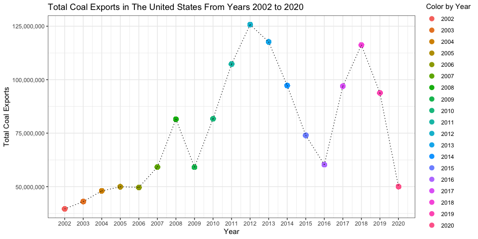
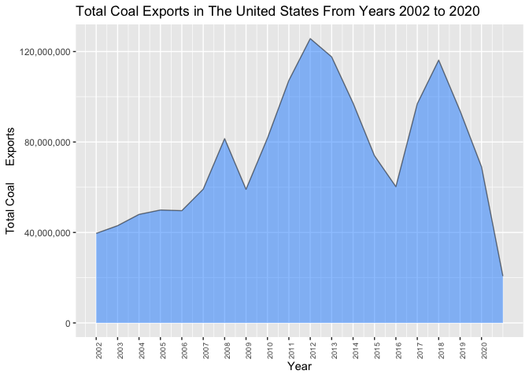
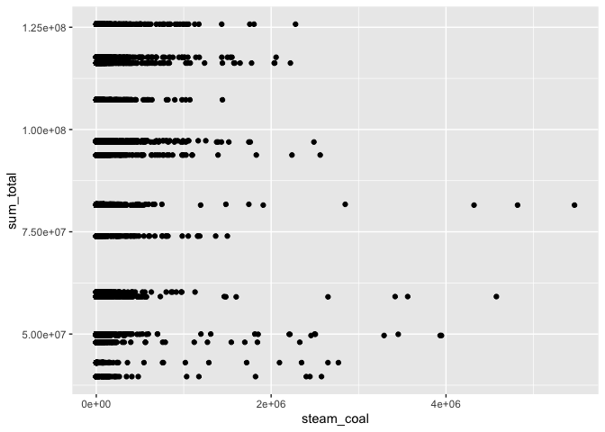

## Preliminaries: 

### Load libraries

It's a good idea to load your libraries at the top of the Rmd document so that everyone can see what you're using. Similarly, it's good practice to set `cache=FALSE` to ensure that the libraries are dynamically loaded each time you knit the document.

*Hint: I've only added the libraries needed to download and read the data. You'll need to load additional libraries to complete this assignment. Add them here once you discover that you need them.* 


```r
## Install the pacman package if necessary
if (!require("pacman")) install.packages("pacman")
## Install other packages using pacman::p_load()
pacman::p_load(httr, readxl, here,tinytex,tidyverse,data.table,rlang,
               ggplot2, janitor, tidyfast, dtplyr, microbenchmark, skimr, lubridate, ggiraph,naniar,dtplyr)
```

### Read in the data

Use `httr::GET()` to fetch the EIA excel file for us from web. (We'll learn more about `httr`, GET and other HTTP methods when we get to webscraping next week.) 


```r
# library(here) ## Already loaded
# library(httr) ## Already loaded
url = "https://www.eia.gov/coal/archive/coal_historical_exports.xlsx"
## Only download the file if we need to
if(!file.exists(here::here("data/coal.xlsx"))) {
  GET(url, write_disk(here::here("data/coal.xlsx")))
}
```

Next, we read in the file.


```r
coal = read_excel(here::here("data/coal.xlsx"), skip = 3, na = ".")
```

We are now ready to go.

## 1) Clean the column names

The column (i.e. variable) names aren't great: Spacing, uppercase letters, etc. 

```r
#names(coal)

coal <- coal %>% clean_names()

names(coal)
```

```
##  [1] "year"                     "quarter"                 
##  [3] "type"                     "customs_district"        
##  [5] "coal_origin_country"      "coal_destination_country"
##  [7] "steam_coal"               "steam_revenue"           
##  [9] "metallurgical"            "metallurgical_revenue"   
## [11] "total"                    "total_revenue"           
## [13] "coke"                     "coke_revenue"
```


*Hint: Use either `gsub()` and regular expressions or, more simply, the `janitor()` package. You will need to install the latter first.*


## 2) Total US coal exports over time (year only)

Plot the US's total coal exports over time by year ONLY. What secular trends do you notice in the data?


```r
#We want to group by year and put it in chronological order, using dplyr before transition from a data frame into a data table
#coal <- coal %>% group_by("year") %>% arrange(year) 
#from dplyr
#coal <- coal %>% filter(coal_origin_country=="United States")

#from data.table commands, turn data frame into data table
coal = setDT(coal)

#Attempt to make a loop command for summation of totals by year
#coal[,lapply(.SD,sum,na.rm=T),.SDcols=c("total"), by = year]

#Using our data.table package, we have filtered out other countries(subset just includes US data), grouped by year, and have created a variable for sum totals of coal exports
coal[coal_origin_country=="United States" & order(year),sum_total:=sum(total, na.rm=T), by=year]

#Now we can use ggplot to display our data, and add customization
ggplot(data = coal, aes(x = year, y = sum_total)) + scale_y_continuous(labels = scales::comma) + geom_point(aes(color = factor(year)), size = 3) + labs(title= "Total Coal Exports in The United States From Years 2002 to 2020", x = "Year", y = "Total Coal Exports", color = "Color by Year") + geom_line(linetype="dotted", size = 0.5) + theme_bw() + scale_x_continuous(breaks = seq(2002, 2020, 1))
```

<!-- -->

```r
#Look at our summary
summary(coal)
```

```
##       year         quarter         type           customs_district  
##  Min.   :2002   Min.   :1.00   Length:10839       Length:10839      
##  1st Qu.:2008   1st Qu.:2.00   Class :character   Class :character  
##  Median :2012   Median :2.00   Mode  :character   Mode  :character  
##  Mean   :2011   Mean   :2.49                                        
##  3rd Qu.:2016   3rd Qu.:3.00                                        
##  Max.   :2020   Max.   :4.00                                        
##                                                                     
##  coal_origin_country coal_destination_country   steam_coal     
##  Length:10839        Length:10839             Min.   :      1  
##  Class :character    Class :character         1st Qu.:     49  
##  Mode  :character    Mode  :character         Median :    390  
##                                               Mean   :  76691  
##                                               3rd Qu.:  53656  
##                                               Max.   :5469837  
##                                               NA's   :2967     
##  steam_revenue       metallurgical     metallurgical_revenue     total        
##  Min.   :     2505   Min.   :      8   Min.   :     2510     Min.   :      1  
##  1st Qu.:    13298   1st Qu.:  54069   1st Qu.:  4874344     1st Qu.:     88  
##  Median :    64882   Median : 132277   Median : 14300438     Median :   5709  
##  Mean   :  4642737   Mean   : 253546   Mean   : 30266043     Mean   : 149568  
##  3rd Qu.:  3192905   3rd Qu.: 353636   3rd Qu.: 38596104     3rd Qu.: 138465  
##  Max.   :183430606   Max.   :3054129   Max.   :481900685     Max.   :5477286  
##  NA's   :2967        NA's   :7498      NA's   :7498          NA's   :1139     
##  total_revenue            coke           coke_revenue        sum_total        
##  Min.   :     2505   Min.   :     1.0   Min.   :    2527   Min.   : 39601241  
##  1st Qu.:    19738   1st Qu.:    22.0   1st Qu.:   10742   1st Qu.: 59096951  
##  Median :   444718   Median :   109.5   Median :   33130   Median : 81519115  
##  Mean   : 14192420   Mean   :  9846.6   Mean   : 1569972   Mean   : 81439118  
##  3rd Qu.: 11647034   3rd Qu.:  3769.0   3rd Qu.:  677451   3rd Qu.:107258561  
##  Max.   :529486058   Max.   :218986.0   Max.   :41625090   Max.   :125745662  
##  NA's   :1139        NA's   :8635       NA's   :8635
```

*Hints: If you want nicely formatted y-axis label, add `+ scale_y_continuous(labels = scales::comma)` to your `ggplot2` code.*

**The trends in the data can be deciphered through the graph above. We see there is a steady increase of coal exports between the beginning years 2002 and 2006. In year 2006 and beyond, we start to see sections of a dramatic, positive increase followed by a dramatic decrease. It is oscillating in a linear  manner and getting more dramatic in magnitude as time goes on. Thus, coal is being exported immediately after it is harvested, in a quick fashion--and then the exports slow down as resources run out, and need time to replenish. It is also seen to slow down because once nations buy coal, they need time to use it up before they need to repurchase more coal, for more use... and so on. These secular trends can be defined over years 2006-2009, 2009-2018, and from 2018-2020. The magnitude of change in coal exports in these periods seem to get multiply the increasing and decreasing amounts of coal exports as time goes on. It is seen to have been given a small start though, with not too many exports. The secular trends seem to start around year 2007 and have gone on to increase overall coal exports. The level of exports doesn't seems to drop below the quantity of 50,000,000 a year though. Since 2006, there hadn't been less than 50,000,000 coal exports a year.**

## 3) Total US coal exports over time (year AND quarter)

Now do the same as the above, expect aggregated quarter of year (2001Q1, 2002Q2, etc.). Do you notice any seasonality that was masked from the yearly averages?


```r
#So as to not lose our data.table for coal in #1, we must create a copy from our data.table package and use that data.table
coal_dt = copy(coal)

#Now we want to factor in quarter of the year

#Now we want to factor in quarter of the year
coal_dt[order(year)]
```

```
##        year quarter         type customs_district coal_origin_country
##     1: 2002       1 Coal Exports    Anchorage, AK       United States
##     2: 2002       1 Coal Exports    Baltimore, MD       United States
##     3: 2002       1 Coal Exports    Baltimore, MD       United States
##     4: 2002       1 Coal Exports    Baltimore, MD       United States
##     5: 2002       1 Coal Exports    Baltimore, MD       United States
##    ---                                                               
## 10835: 2020       3 Coal Exports      Seattle, WA       United States
## 10836: 2020       3 Coal Exports      Seattle, WA       United States
## 10837: 2020       3 Coal Exports   St. Albans, VT       United States
## 10838: 2020       3 Coal Exports        Tampa, FL       United States
## 10839: 2020       3 Coal Exports        Tampa, FL       United States
##               coal_destination_country steam_coal steam_revenue metallurgical
##     1: South Korea (Republic of Korea)      66874       1669556            NA
##     2:                         Belgium     125856       3703190            NA
##     3:                          Brazil         NA            NA         44924
##     4:                          Canada     149335       4377923            NA
##     5:    Germany, Federal Republic of     153465       4788694         83010
##    ---                                                                       
## 10835: South Korea (Republic of Korea)     700683      22886439            NA
## 10836:                        Thailand         39         22568            NA
## 10837:                          Canada         43         13919           168
## 10838:                        Cambodia          6         11267            NA
## 10839:                         Vietnam         23         30827            NA
##        metallurgical_revenue  total total_revenue coke coke_revenue sum_total
##     1:                    NA  66874       1669556   NA           NA  39601241
##     2:                    NA 125856       3703190   NA           NA  39601241
##     3:               2237029  44924       2237029   NA           NA  39601241
##     4:                    NA 149335       4377923   NA           NA  39601241
##     5:               2918079 236475       7706773   NA           NA  39601241
##    ---                                                                       
## 10835:                    NA 700683      22886439   NA           NA  50006784
## 10836:                    NA     39         22568   NA           NA  50006784
## 10837:                 68201    211         82120   NA           NA  50006784
## 10838:                    NA      6         11267   NA           NA  50006784
## 10839:                    NA     23         30827   NA           NA  50006784
```

```r
coal_dt$yearqt <- paste(coal_dt$year,coal_dt$quarter)

coal_dt[,sum_total:=sum(total,na.rm=T),by=yearqt]

coal_dt
```

```
##        year quarter         type customs_district coal_origin_country
##     1: 2002       1 Coal Exports    Anchorage, AK       United States
##     2: 2002       1 Coal Exports    Baltimore, MD       United States
##     3: 2002       1 Coal Exports    Baltimore, MD       United States
##     4: 2002       1 Coal Exports    Baltimore, MD       United States
##     5: 2002       1 Coal Exports    Baltimore, MD       United States
##    ---                                                               
## 10835: 2020       3 Coal Exports      Seattle, WA       United States
## 10836: 2020       3 Coal Exports      Seattle, WA       United States
## 10837: 2020       3 Coal Exports   St. Albans, VT       United States
## 10838: 2020       3 Coal Exports        Tampa, FL       United States
## 10839: 2020       3 Coal Exports        Tampa, FL       United States
##               coal_destination_country steam_coal steam_revenue metallurgical
##     1: South Korea (Republic of Korea)      66874       1669556            NA
##     2:                         Belgium     125856       3703190            NA
##     3:                          Brazil         NA            NA         44924
##     4:                          Canada     149335       4377923            NA
##     5:    Germany, Federal Republic of     153465       4788694         83010
##    ---                                                                       
## 10835: South Korea (Republic of Korea)     700683      22886439            NA
## 10836:                        Thailand         39         22568            NA
## 10837:                          Canada         43         13919           168
## 10838:                        Cambodia          6         11267            NA
## 10839:                         Vietnam         23         30827            NA
##        metallurgical_revenue  total total_revenue coke coke_revenue sum_total
##     1:                    NA  66874       1669556   NA           NA   9252584
##     2:                    NA 125856       3703190   NA           NA   9252584
##     3:               2237029  44924       2237029   NA           NA   9252584
##     4:                    NA 149335       4377923   NA           NA   9252584
##     5:               2918079 236475       7706773   NA           NA   9252584
##    ---                                                                       
## 10835:                    NA 700683      22886439   NA           NA  15251963
## 10836:                    NA     39         22568   NA           NA  15251963
## 10837:                 68201    211         82120   NA           NA  15251963
## 10838:                    NA      6         11267   NA           NA  15251963
## 10839:                    NA     23         30827   NA           NA  15251963
##        yearqt
##     1: 2002 1
##     2: 2002 1
##     3: 2002 1
##     4: 2002 1
##     5: 2002 1
##    ---       
## 10835: 2020 3
## 10836: 2020 3
## 10837: 2020 3
## 10838: 2020 3
## 10839: 2020 3
```

```r
cols <- as.character(coal_dt$yearqt)

#NOW, we again want to make a scatter plot of our data using ggplot
#Note the (fig.width and fig.height code in  this r chunk that makes this display so nicley
ggplot(data=coal_dt, aes(y=sum_total, x=yearqt)) + labs(title= "Total Coal Exports in The United States From Years 2002 to 2020", x = "Yearly Quarters", y = "Total Coal Exports", color = "Color by Quarter in Sequence", caption = "The quarters can be defined by the last digit after the year") + geom_point(aes(x=yearqt, y=sum_total, color = factor(year), shape = factor(quarter)), show.legend = FALSE)  + scale_y_continuous(labels = scales::comma) + theme(axis.text.x = element_text(angle=90,size=7))           
```

<!-- -->
*Hint: ggplot2 is going to want you to convert your quarterly data into actual date format before it plots nicely. (i.e. Don't leave it as a string.)*

**There was definitely seasonality that was masked from the yearly averages. We can see this because there exists more variation and more cycles within the given time  period. This is likely due to the fact that the yearly totals were summations of the quarters, which cuts out the ability to see more than one trend in a given year. From  our more detailed data display, we can see more secular trends, and more variation among the annual exports. Looking at the shape pattern, we see the triangles that signify a second quarter of a year, are mostly the  times when  exports  reach their highest each year: the second quarter receives the most coal exports in the given year. We also see the oscillation periods getting wider, signifying an export activity level that increases as time goes on.**

## 4) Exports by destination country

### 4.1) Create a new data frame

Create a new data frame called `coal_country` that aggregates total exports by destination country (and quarter of year). Make sure you print the resulting data frame so that it appears in the knitted R markdown document.

```r
#So as to not lose our data.table for coal in #1 or #2, we must create a copy from our data.table package and use that new data.table
coal_country = copy(coal)

#coal_country[,,by=coal_destination_country]

#Now we want to aggregate total exports by destination country and quarter of year
#so do the same steps as in 2 first
coal_country[order(year)]
```

```
##        year quarter         type customs_district coal_origin_country
##     1: 2002       1 Coal Exports    Anchorage, AK       United States
##     2: 2002       1 Coal Exports    Baltimore, MD       United States
##     3: 2002       1 Coal Exports    Baltimore, MD       United States
##     4: 2002       1 Coal Exports    Baltimore, MD       United States
##     5: 2002       1 Coal Exports    Baltimore, MD       United States
##    ---                                                               
## 10835: 2020       3 Coal Exports      Seattle, WA       United States
## 10836: 2020       3 Coal Exports      Seattle, WA       United States
## 10837: 2020       3 Coal Exports   St. Albans, VT       United States
## 10838: 2020       3 Coal Exports        Tampa, FL       United States
## 10839: 2020       3 Coal Exports        Tampa, FL       United States
##               coal_destination_country steam_coal steam_revenue metallurgical
##     1: South Korea (Republic of Korea)      66874       1669556            NA
##     2:                         Belgium     125856       3703190            NA
##     3:                          Brazil         NA            NA         44924
##     4:                          Canada     149335       4377923            NA
##     5:    Germany, Federal Republic of     153465       4788694         83010
##    ---                                                                       
## 10835: South Korea (Republic of Korea)     700683      22886439            NA
## 10836:                        Thailand         39         22568            NA
## 10837:                          Canada         43         13919           168
## 10838:                        Cambodia          6         11267            NA
## 10839:                         Vietnam         23         30827            NA
##        metallurgical_revenue  total total_revenue coke coke_revenue sum_total
##     1:                    NA  66874       1669556   NA           NA  39601241
##     2:                    NA 125856       3703190   NA           NA  39601241
##     3:               2237029  44924       2237029   NA           NA  39601241
##     4:                    NA 149335       4377923   NA           NA  39601241
##     5:               2918079 236475       7706773   NA           NA  39601241
##    ---                                                                       
## 10835:                    NA 700683      22886439   NA           NA  50006784
## 10836:                    NA     39         22568   NA           NA  50006784
## 10837:                 68201    211         82120   NA           NA  50006784
## 10838:                    NA      6         11267   NA           NA  50006784
## 10839:                    NA     23         30827   NA           NA  50006784
```

```r
#make our quarterly variable
coal_country$yearqt <- paste(coal_country$year,coal_country$quarter)

#now our data is summed according to the destination country
coal_country[,sum_total:=sum(total,na.rm=T),by= coal_destination_country]

names(coal_country$coal_destination_country)
```

```
## NULL
```

```r
#but now we need to sum the sum_total variable to get it differentiated by quarters: sum(sum_total)
coal_country[,summed_total:=sum(sum_total,na.rm=T),by= coal_destination_country]

coal_country[,order(yearqt), by=coal_destination_country]
```

```
##               coal_destination_country V1
##     1: South Korea (Republic of Korea)  1
##     2: South Korea (Republic of Korea)  2
##     3: South Korea (Republic of Korea)  3
##     4: South Korea (Republic of Korea)  4
##     5: South Korea (Republic of Korea)  5
##    ---                                   
## 10835:                         Senegal  9
## 10836:   Fedrated States of Micronesia  1
## 10837:                   Western Samoa  1
## 10838:                        Anguilla  1
## 10839:                          Guinea  1
```

```r
#sum by country
#coal_country[order(coal_destination_country)]
#coal_country[,sum_country:=sum(sum_total,na.rm=T),by= coal_destination_country]

#ok, check to see it worked
#coal_country
#print it out
coal_country
```

```
##        year quarter         type customs_district coal_origin_country
##     1: 2002       1 Coal Exports    Anchorage, AK       United States
##     2: 2002       1 Coal Exports    Baltimore, MD       United States
##     3: 2002       1 Coal Exports    Baltimore, MD       United States
##     4: 2002       1 Coal Exports    Baltimore, MD       United States
##     5: 2002       1 Coal Exports    Baltimore, MD       United States
##    ---                                                               
## 10835: 2020       3 Coal Exports      Seattle, WA       United States
## 10836: 2020       3 Coal Exports      Seattle, WA       United States
## 10837: 2020       3 Coal Exports   St. Albans, VT       United States
## 10838: 2020       3 Coal Exports        Tampa, FL       United States
## 10839: 2020       3 Coal Exports        Tampa, FL       United States
##               coal_destination_country steam_coal steam_revenue metallurgical
##     1: South Korea (Republic of Korea)      66874       1669556            NA
##     2:                         Belgium     125856       3703190            NA
##     3:                          Brazil         NA            NA         44924
##     4:                          Canada     149335       4377923            NA
##     5:    Germany, Federal Republic of     153465       4788694         83010
##    ---                                                                       
## 10835: South Korea (Republic of Korea)     700683      22886439            NA
## 10836:                        Thailand         39         22568            NA
## 10837:                          Canada         43         13919           168
## 10838:                        Cambodia          6         11267            NA
## 10839:                         Vietnam         23         30827            NA
##        metallurgical_revenue  total total_revenue coke coke_revenue sum_total
##     1:                    NA  66874       1669556   NA           NA  91598557
##     2:                    NA 125856       3703190   NA           NA  34935617
##     3:               2237029  44924       2237029   NA           NA 124434057
##     4:                    NA 149335       4377923   NA           NA 215580936
##     5:               2918079 236475       7706773   NA           NA  52969106
##    ---                                                                       
## 10835:                    NA 700683      22886439   NA           NA  91598557
## 10836:                    NA     39         22568   NA           NA    663563
## 10837:                 68201    211         82120   NA           NA 215580936
## 10838:                    NA      6         11267   NA           NA        36
## 10839:                    NA     23         30827   NA           NA      5575
##        yearqt summed_total
##     1: 2002 1  27754362771
##     2: 2002 1   6987123400
##     3: 2002 1  38698991727
##     4: 2002 1 201999337032
##     5: 2002 1  14937287892
##    ---                    
## 10835: 2020 3  27754362771
## 10836: 2020 3    145320297
## 10837: 2020 3 201999337032
## 10838: 2020 3          144
## 10839: 2020 3       462725
```


### 4.2) Inspect the data frame

It looks like some countries are missing data for a number of years and periods (e.g. Albania). Confirm that this is the case. What do you think is happening here?

```r
#we can compare rows and column with the original data.table set (not the copy) to see which variable inputs are missing

#first let us look at 
#names(coal_country$coal_destination_country)
anyNA(coal_country$total)
```

```
## [1] TRUE
```

```r
#well, let's just confirm this is the case
```
**Certain country's are getting omitted from our data.table because we need complete data on BOTH yearly quarter AND destination country in order to group by both objects. We removed NA values in our data sets when calculating sum totals. Since each country destination has multiple coal exports in a given quarter, we will have repeat amounts for our variable "summed_total" when looking at rows of JUST one destination country and one summed_total. Our function to check if any NA observations exist within our new data.table, and when we ran our check, it shows us an output of "TRUE," indicating there exists missing observations.**

### 4.3) Complete the data frame

Fill in the implicit missing values, so that each country has a representative row for every year-quarter time period. In other words, you should modify the data frame so that every destination country has row entries for all possible year-quarter combinations (from 2002Q1 through the most recent quarter). Order your updated data frame by country, year and, quarter. 


```r
coal_country$total_clean <- coal_country$total

coal_country$total_ms <- 0

coal_country$total_ms[is.na(coal_country$total)] <- 1

coal_country$total_clean[coal_country$total_ms==1] <-
  mean(coal_country$total[coal_country$total_ms==0])

coal_country
```

```
##        year quarter         type customs_district coal_origin_country
##     1: 2002       1 Coal Exports    Anchorage, AK       United States
##     2: 2002       1 Coal Exports    Baltimore, MD       United States
##     3: 2002       1 Coal Exports    Baltimore, MD       United States
##     4: 2002       1 Coal Exports    Baltimore, MD       United States
##     5: 2002       1 Coal Exports    Baltimore, MD       United States
##    ---                                                               
## 10835: 2020       3 Coal Exports      Seattle, WA       United States
## 10836: 2020       3 Coal Exports      Seattle, WA       United States
## 10837: 2020       3 Coal Exports   St. Albans, VT       United States
## 10838: 2020       3 Coal Exports        Tampa, FL       United States
## 10839: 2020       3 Coal Exports        Tampa, FL       United States
##               coal_destination_country steam_coal steam_revenue metallurgical
##     1: South Korea (Republic of Korea)      66874       1669556            NA
##     2:                         Belgium     125856       3703190            NA
##     3:                          Brazil         NA            NA         44924
##     4:                          Canada     149335       4377923            NA
##     5:    Germany, Federal Republic of     153465       4788694         83010
##    ---                                                                       
## 10835: South Korea (Republic of Korea)     700683      22886439            NA
## 10836:                        Thailand         39         22568            NA
## 10837:                          Canada         43         13919           168
## 10838:                        Cambodia          6         11267            NA
## 10839:                         Vietnam         23         30827            NA
##        metallurgical_revenue  total total_revenue coke coke_revenue sum_total
##     1:                    NA  66874       1669556   NA           NA  91598557
##     2:                    NA 125856       3703190   NA           NA  34935617
##     3:               2237029  44924       2237029   NA           NA 124434057
##     4:                    NA 149335       4377923   NA           NA 215580936
##     5:               2918079 236475       7706773   NA           NA  52969106
##    ---                                                                       
## 10835:                    NA 700683      22886439   NA           NA  91598557
## 10836:                    NA     39         22568   NA           NA    663563
## 10837:                 68201    211         82120   NA           NA 215580936
## 10838:                    NA      6         11267   NA           NA        36
## 10839:                    NA     23         30827   NA           NA      5575
##        yearqt summed_total total_clean total_ms
##     1: 2002 1  27754362771       66874        0
##     2: 2002 1   6987123400      125856        0
##     3: 2002 1  38698991727       44924        0
##     4: 2002 1 201999337032      149335        0
##     5: 2002 1  14937287892      236475        0
##    ---                                         
## 10835: 2020 3  27754362771      700683        0
## 10836: 2020 3    145320297          39        0
## 10837: 2020 3 201999337032         211        0
## 10838: 2020 3          144           6        0
## 10839: 2020 3       462725          23        0
```


*Hints: See `?tidyr::complete()` for some convenience options. Again, don't forget to print `coal_country` after you've updated the data frame so that I can see the results.*


### 4.4 Some more tidying up

In answering the previous question, you _may_ encounter a situation where the data frame contains a quarter --- probably 2021q1 --- that is missing total export numbers for *all* countries. Did this happen to you? Filter out the completely missing quarter if so. Also: Why do you think this might have happened? (Please answer the latter question even if it didn't happen to you.) 

**Though this did not happen to us in our imputation, it is entirely possible that other groups, in their attempts to fill in the gaps in their data, forgot to create a copy of their data.table or data frame. This resulted in an override several times over of certain sets of observations. When using dplyr's data.frame's versus DataTable's data.table, you have to switch formats on your data set in order to use their corresponding package. When data.table is used in conjunction with multiple steps, and multiple variable manipulation, it is imperative we create copies of our data in order to keep the original data set as it was imported. Otherwise, deletions,mutations, and other changes will permanently alter the observation values. So if this was not done correctly, we would be overwriting our "total" variable, and summing it up in an aggregated way, such that certain countries for certain quarters would be accidentally ommitted, and thus formatted odd. I think the way we formatted our data is professional and it works--we did not have any troubles like stated above.**


### 4.5) Culmulative top 10 US coal export destinations

Produce a vector --- call it `coal10_culm` --- of the top 10 top coal destinations over the full 1--`r `max(coal[, which(grepl('Year|year', names(coal)))], na.rm=T)` study period. What are they?

```r
#create our vector
coal10_df <- copy(coal_country)

coal10_df[,sum_country := sum(total_clean),by=coal_destination_country]
#to find the first 10 inputs
#head(10)
coal10_df %>% as.data.frame()
```

```
##      year quarter         type                          customs_district
## 1    2002       1 Coal Exports                             Anchorage, AK
## 2    2002       1 Coal Exports                             Baltimore, MD
## 3    2002       1 Coal Exports                             Baltimore, MD
## 4    2002       1 Coal Exports                             Baltimore, MD
## 5    2002       1 Coal Exports                             Baltimore, MD
## 6    2002       1 Coal Exports                             Baltimore, MD
## 7    2002       1 Coal Exports                             Baltimore, MD
## 8    2002       1 Coal Exports                             Baltimore, MD
## 9    2002       1 Coal Exports                             Baltimore, MD
## 10   2002       1 Coal Exports                             Baltimore, MD
## 11   2002       1 Coal Exports                             Baltimore, MD
## 12   2002       1 Coal Exports                             Baltimore, MD
## 13   2002       1 Coal Exports                             Baltimore, MD
## 14   2002       1 Coal Exports                               Buffalo, NY
## 15   2002       1 Coal Exports                               Chicago, IL
## 16   2002       1 Coal Exports                             Cleveland, OH
## 17   2002       1 Coal Exports                             Cleveland, OH
## 18   2002       1 Coal Exports                               Detroit, MI
## 19   2002       1 Coal Exports                               Detroit, MI
## 20   2002       1 Coal Exports                               Detroit, MI
## 21   2002       1 Coal Exports                                Duluth, MN
## 22   2002       1 Coal Exports                               El Paso, TX
## 23   2002       1 Coal Exports                           Great Falls, MT
## 24   2002       1 Coal Exports                     Houston-Galveston, TX
## 25   2002       1 Coal Exports                     Houston-Galveston, TX
## 26   2002       1 Coal Exports                     Houston-Galveston, TX
## 27   2002       1 Coal Exports                     Houston-Galveston, TX
## 28   2002       1 Coal Exports                     Houston-Galveston, TX
## 29   2002       1 Coal Exports                     Houston-Galveston, TX
## 30   2002       1 Coal Exports                     Houston-Galveston, TX
## 31   2002       1 Coal Exports                     Houston-Galveston, TX
## 32   2002       1 Coal Exports                     Houston-Galveston, TX
## 33   2002       1 Coal Exports                     Houston-Galveston, TX
## 34   2002       1 Coal Exports                     Houston-Galveston, TX
## 35   2002       1 Coal Exports                     Houston-Galveston, TX
## 36   2002       1 Coal Exports                     Houston-Galveston, TX
## 37   2002       1 Coal Exports                                Laredo, TX
## 38   2002       1 Coal Exports                           Los Angeles, CA
## 39   2002       1 Coal Exports                           Los Angeles, CA
## 40   2002       1 Coal Exports                           Los Angeles, CA
## 41   2002       1 Coal Exports                                 Miami, FL
## 42   2002       1 Coal Exports                                 Miami, FL
## 43   2002       1 Coal Exports                                 Miami, FL
## 44   2002       1 Coal Exports                                 Miami, FL
## 45   2002       1 Coal Exports                                 Miami, FL
## 46   2002       1 Coal Exports                           New Orleans, LA
## 47   2002       1 Coal Exports                           New Orleans, LA
## 48   2002       1 Coal Exports                           New Orleans, LA
## 49   2002       1 Coal Exports                           New Orleans, LA
## 50   2002       1 Coal Exports                         New York City, NY
## 51   2002       1 Coal Exports                         New York City, NY
## 52   2002       1 Coal Exports                         New York City, NY
## 53   2002       1 Coal Exports                         New York City, NY
## 54   2002       1 Coal Exports                         New York City, NY
## 55   2002       1 Coal Exports                         New York City, NY
## 56   2002       1 Coal Exports                         New York City, NY
## 57   2002       1 Coal Exports                               Nogales, AZ
## 58   2002       1 Coal Exports Norfolk, VA / Mobile, AL / Charleston, SC
## 59   2002       1 Coal Exports Norfolk, VA / Mobile, AL / Charleston, SC
## 60   2002       1 Coal Exports Norfolk, VA / Mobile, AL / Charleston, SC
## 61   2002       1 Coal Exports Norfolk, VA / Mobile, AL / Charleston, SC
## 62   2002       1 Coal Exports Norfolk, VA / Mobile, AL / Charleston, SC
## 63   2002       1 Coal Exports Norfolk, VA / Mobile, AL / Charleston, SC
## 64   2002       1 Coal Exports Norfolk, VA / Mobile, AL / Charleston, SC
## 65   2002       1 Coal Exports Norfolk, VA / Mobile, AL / Charleston, SC
## 66   2002       1 Coal Exports Norfolk, VA / Mobile, AL / Charleston, SC
## 67   2002       1 Coal Exports Norfolk, VA / Mobile, AL / Charleston, SC
## 68   2002       1 Coal Exports Norfolk, VA / Mobile, AL / Charleston, SC
## 69   2002       1 Coal Exports Norfolk, VA / Mobile, AL / Charleston, SC
## 70   2002       1 Coal Exports Norfolk, VA / Mobile, AL / Charleston, SC
## 71   2002       1 Coal Exports Norfolk, VA / Mobile, AL / Charleston, SC
## 72   2002       1 Coal Exports Norfolk, VA / Mobile, AL / Charleston, SC
## 73   2002       1 Coal Exports Norfolk, VA / Mobile, AL / Charleston, SC
## 74   2002       1 Coal Exports Norfolk, VA / Mobile, AL / Charleston, SC
## 75   2002       1 Coal Exports Norfolk, VA / Mobile, AL / Charleston, SC
## 76   2002       1 Coal Exports Norfolk, VA / Mobile, AL / Charleston, SC
## 77   2002       1 Coal Exports Norfolk, VA / Mobile, AL / Charleston, SC
## 78   2002       1 Coal Exports Norfolk, VA / Mobile, AL / Charleston, SC
## 79   2002       1 Coal Exports Norfolk, VA / Mobile, AL / Charleston, SC
## 80   2002       1 Coal Exports                            Ogdensburg, NY
## 81   2002       1 Coal Exports                               Other Ports
## 82   2002       1 Coal Exports                               Pembina, ND
## 83   2002       1 Coal Exports                          Philadelphia, PA
## 84   2002       1 Coal Exports                          Philadelphia, PA
## 85   2002       1 Coal Exports                          Philadelphia, PA
## 86   2002       1 Coal Exports                             San Diego, CA
## 87   2002       1 Coal Exports                         San Francisco, CA
## 88   2002       1 Coal Exports                              Savannah, GA
## 89   2002       1 Coal Exports                              Savannah, GA
## 90   2002       1 Coal Exports                              Savannah, GA
## 91   2002       1 Coal Exports                               Seattle, WA
## 92   2002       1 Coal Exports                               Seattle, WA
## 93   2002       1 Coal Exports                               Seattle, WA
## 94   2002       1 Coal Exports                               Seattle, WA
## 95   2002       1 Coal Exports                               Seattle, WA
## 96   2002       1 Coal Exports                               Seattle, WA
## 97   2002       1 Coal Exports                            St. Albans, VT
## 98   2002       1 Coal Exports                                 Tampa, FL
## 99   2002       1 Coal Exports                            Wilmington, NC
## 100  2002       2 Coal Exports                             Anchorage, AK
## 101  2002       2 Coal Exports                             Baltimore, MD
## 102  2002       2 Coal Exports                             Baltimore, MD
## 103  2002       2 Coal Exports                             Baltimore, MD
## 104  2002       2 Coal Exports                             Baltimore, MD
## 105  2002       2 Coal Exports                             Baltimore, MD
## 106  2002       2 Coal Exports                             Baltimore, MD
## 107  2002       2 Coal Exports                             Baltimore, MD
## 108  2002       2 Coal Exports                             Baltimore, MD
## 109  2002       2 Coal Exports                             Baltimore, MD
## 110  2002       2 Coal Exports                             Baltimore, MD
## 111  2002       2 Coal Exports                               Buffalo, NY
## 112  2002       2 Coal Exports                               Chicago, IL
## 113  2002       2 Coal Exports                             Cleveland, OH
## 114  2002       2 Coal Exports                             Cleveland, OH
## 115  2002       2 Coal Exports                               Detroit, MI
## 116  2002       2 Coal Exports                               Detroit, MI
## 117  2002       2 Coal Exports                               Detroit, MI
## 118  2002       2 Coal Exports                               Detroit, MI
## 119  2002       2 Coal Exports                                Duluth, MN
## 120  2002       2 Coal Exports                               El Paso, TX
## 121  2002       2 Coal Exports                           Great Falls, MT
## 122  2002       2 Coal Exports                     Houston-Galveston, TX
## 123  2002       2 Coal Exports                     Houston-Galveston, TX
## 124  2002       2 Coal Exports                     Houston-Galveston, TX
## 125  2002       2 Coal Exports                     Houston-Galveston, TX
## 126  2002       2 Coal Exports                     Houston-Galveston, TX
## 127  2002       2 Coal Exports                     Houston-Galveston, TX
## 128  2002       2 Coal Exports                     Houston-Galveston, TX
## 129  2002       2 Coal Exports                     Houston-Galveston, TX
## 130  2002       2 Coal Exports                     Houston-Galveston, TX
## 131  2002       2 Coal Exports                     Houston-Galveston, TX
## 132  2002       2 Coal Exports                     Houston-Galveston, TX
## 133  2002       2 Coal Exports                     Houston-Galveston, TX
## 134  2002       2 Coal Exports                     Houston-Galveston, TX
## 135  2002       2 Coal Exports                     Houston-Galveston, TX
## 136  2002       2 Coal Exports                     Houston-Galveston, TX
## 137  2002       2 Coal Exports                                Laredo, TX
## 138  2002       2 Coal Exports                           Los Angeles, CA
## 139  2002       2 Coal Exports                           Los Angeles, CA
## 140  2002       2 Coal Exports                           Los Angeles, CA
## 141  2002       2 Coal Exports                           Los Angeles, CA
## 142  2002       2 Coal Exports                           Los Angeles, CA
## 143  2002       2 Coal Exports                           Los Angeles, CA
## 144  2002       2 Coal Exports                                 Miami, FL
## 145  2002       2 Coal Exports                                 Miami, FL
## 146  2002       2 Coal Exports                                 Miami, FL
## 147  2002       2 Coal Exports                                 Miami, FL
## 148  2002       2 Coal Exports                                 Miami, FL
## 149  2002       2 Coal Exports                           New Orleans, LA
## 150  2002       2 Coal Exports                           New Orleans, LA
## 151  2002       2 Coal Exports                           New Orleans, LA
## 152  2002       2 Coal Exports                           New Orleans, LA
## 153  2002       2 Coal Exports                           New Orleans, LA
## 154  2002       2 Coal Exports                           New Orleans, LA
## 155  2002       2 Coal Exports                         New York City, NY
## 156  2002       2 Coal Exports                         New York City, NY
## 157  2002       2 Coal Exports                         New York City, NY
## 158  2002       2 Coal Exports                         New York City, NY
## 159  2002       2 Coal Exports                         New York City, NY
## 160  2002       2 Coal Exports                         New York City, NY
## 161  2002       2 Coal Exports                         New York City, NY
## 162  2002       2 Coal Exports                         New York City, NY
## 163  2002       2 Coal Exports                         New York City, NY
## 164  2002       2 Coal Exports                         New York City, NY
## 165  2002       2 Coal Exports Norfolk, VA / Mobile, AL / Charleston, SC
## 166  2002       2 Coal Exports Norfolk, VA / Mobile, AL / Charleston, SC
## 167  2002       2 Coal Exports Norfolk, VA / Mobile, AL / Charleston, SC
## 168  2002       2 Coal Exports Norfolk, VA / Mobile, AL / Charleston, SC
## 169  2002       2 Coal Exports Norfolk, VA / Mobile, AL / Charleston, SC
## 170  2002       2 Coal Exports Norfolk, VA / Mobile, AL / Charleston, SC
## 171  2002       2 Coal Exports Norfolk, VA / Mobile, AL / Charleston, SC
## 172  2002       2 Coal Exports Norfolk, VA / Mobile, AL / Charleston, SC
## 173  2002       2 Coal Exports Norfolk, VA / Mobile, AL / Charleston, SC
## 174  2002       2 Coal Exports Norfolk, VA / Mobile, AL / Charleston, SC
## 175  2002       2 Coal Exports Norfolk, VA / Mobile, AL / Charleston, SC
## 176  2002       2 Coal Exports Norfolk, VA / Mobile, AL / Charleston, SC
## 177  2002       2 Coal Exports Norfolk, VA / Mobile, AL / Charleston, SC
## 178  2002       2 Coal Exports Norfolk, VA / Mobile, AL / Charleston, SC
## 179  2002       2 Coal Exports Norfolk, VA / Mobile, AL / Charleston, SC
## 180  2002       2 Coal Exports Norfolk, VA / Mobile, AL / Charleston, SC
## 181  2002       2 Coal Exports Norfolk, VA / Mobile, AL / Charleston, SC
## 182  2002       2 Coal Exports Norfolk, VA / Mobile, AL / Charleston, SC
## 183  2002       2 Coal Exports Norfolk, VA / Mobile, AL / Charleston, SC
## 184  2002       2 Coal Exports Norfolk, VA / Mobile, AL / Charleston, SC
## 185  2002       2 Coal Exports Norfolk, VA / Mobile, AL / Charleston, SC
## 186  2002       2 Coal Exports Norfolk, VA / Mobile, AL / Charleston, SC
## 187  2002       2 Coal Exports Norfolk, VA / Mobile, AL / Charleston, SC
## 188  2002       2 Coal Exports Norfolk, VA / Mobile, AL / Charleston, SC
## 189  2002       2 Coal Exports Norfolk, VA / Mobile, AL / Charleston, SC
## 190  2002       2 Coal Exports                            Ogdensburg, NY
## 191  2002       2 Coal Exports                               Other Ports
## 192  2002       2 Coal Exports                               Pembina, ND
## 193  2002       2 Coal Exports                          Philadelphia, PA
## 194  2002       2 Coal Exports                             San Diego, CA
## 195  2002       2 Coal Exports                              Savannah, GA
## 196  2002       2 Coal Exports                              Savannah, GA
## 197  2002       2 Coal Exports                               Seattle, WA
## 198  2002       2 Coal Exports                               Seattle, WA
## 199  2002       2 Coal Exports                               Seattle, WA
## 200  2002       2 Coal Exports                               Seattle, WA
## 201  2002       2 Coal Exports                            St. Albans, VT
## 202  2002       2 Coal Exports                                 Tampa, FL
## 203  2002       2 Coal Exports                                 Tampa, FL
## 204  2002       2 Coal Exports                            Wilmington, NC
## 205  2002       3 Coal Exports                             Anchorage, AK
## 206  2002       3 Coal Exports                             Baltimore, MD
## 207  2002       3 Coal Exports                             Baltimore, MD
## 208  2002       3 Coal Exports                             Baltimore, MD
## 209  2002       3 Coal Exports                             Baltimore, MD
## 210  2002       3 Coal Exports                             Baltimore, MD
## 211  2002       3 Coal Exports                               Buffalo, NY
## 212  2002       3 Coal Exports                               Chicago, IL
## 213  2002       3 Coal Exports                             Cleveland, OH
## 214  2002       3 Coal Exports                               Detroit, MI
## 215  2002       3 Coal Exports                               Detroit, MI
## 216  2002       3 Coal Exports                               Detroit, MI
## 217  2002       3 Coal Exports                               Detroit, MI
## 218  2002       3 Coal Exports                                Duluth, MN
## 219  2002       3 Coal Exports                               El Paso, TX
## 220  2002       3 Coal Exports                           Great Falls, MT
## 221  2002       3 Coal Exports                     Houston-Galveston, TX
## 222  2002       3 Coal Exports                     Houston-Galveston, TX
## 223  2002       3 Coal Exports                     Houston-Galveston, TX
## 224  2002       3 Coal Exports                     Houston-Galveston, TX
## 225  2002       3 Coal Exports                     Houston-Galveston, TX
## 226  2002       3 Coal Exports                     Houston-Galveston, TX
## 227  2002       3 Coal Exports                     Houston-Galveston, TX
## 228  2002       3 Coal Exports                     Houston-Galveston, TX
## 229  2002       3 Coal Exports                     Houston-Galveston, TX
## 230  2002       3 Coal Exports                     Houston-Galveston, TX
## 231  2002       3 Coal Exports                     Houston-Galveston, TX
## 232  2002       3 Coal Exports                                Laredo, TX
## 233  2002       3 Coal Exports                           Los Angeles, CA
## 234  2002       3 Coal Exports                           Los Angeles, CA
## 235  2002       3 Coal Exports                           Los Angeles, CA
## 236  2002       3 Coal Exports                           Los Angeles, CA
## 237  2002       3 Coal Exports                                 Miami, FL
## 238  2002       3 Coal Exports                                 Miami, FL
## 239  2002       3 Coal Exports                                 Miami, FL
## 240  2002       3 Coal Exports                                 Miami, FL
## 241  2002       3 Coal Exports                                 Miami, FL
## 242  2002       3 Coal Exports                                 Miami, FL
## 243  2002       3 Coal Exports                           New Orleans, LA
## 244  2002       3 Coal Exports                           New Orleans, LA
## 245  2002       3 Coal Exports                           New Orleans, LA
## 246  2002       3 Coal Exports                         New York City, NY
## 247  2002       3 Coal Exports                         New York City, NY
## 248  2002       3 Coal Exports                         New York City, NY
## 249  2002       3 Coal Exports                         New York City, NY
## 250  2002       3 Coal Exports                         New York City, NY
## 251  2002       3 Coal Exports                         New York City, NY
## 252  2002       3 Coal Exports                         New York City, NY
## 253  2002       3 Coal Exports                         New York City, NY
## 254  2002       3 Coal Exports Norfolk, VA / Mobile, AL / Charleston, SC
## 255  2002       3 Coal Exports Norfolk, VA / Mobile, AL / Charleston, SC
## 256  2002       3 Coal Exports Norfolk, VA / Mobile, AL / Charleston, SC
## 257  2002       3 Coal Exports Norfolk, VA / Mobile, AL / Charleston, SC
## 258  2002       3 Coal Exports Norfolk, VA / Mobile, AL / Charleston, SC
## 259  2002       3 Coal Exports Norfolk, VA / Mobile, AL / Charleston, SC
## 260  2002       3 Coal Exports Norfolk, VA / Mobile, AL / Charleston, SC
## 261  2002       3 Coal Exports Norfolk, VA / Mobile, AL / Charleston, SC
## 262  2002       3 Coal Exports Norfolk, VA / Mobile, AL / Charleston, SC
## 263  2002       3 Coal Exports Norfolk, VA / Mobile, AL / Charleston, SC
## 264  2002       3 Coal Exports Norfolk, VA / Mobile, AL / Charleston, SC
## 265  2002       3 Coal Exports Norfolk, VA / Mobile, AL / Charleston, SC
## 266  2002       3 Coal Exports Norfolk, VA / Mobile, AL / Charleston, SC
## 267  2002       3 Coal Exports Norfolk, VA / Mobile, AL / Charleston, SC
## 268  2002       3 Coal Exports Norfolk, VA / Mobile, AL / Charleston, SC
## 269  2002       3 Coal Exports Norfolk, VA / Mobile, AL / Charleston, SC
## 270  2002       3 Coal Exports Norfolk, VA / Mobile, AL / Charleston, SC
## 271  2002       3 Coal Exports Norfolk, VA / Mobile, AL / Charleston, SC
## 272  2002       3 Coal Exports Norfolk, VA / Mobile, AL / Charleston, SC
## 273  2002       3 Coal Exports Norfolk, VA / Mobile, AL / Charleston, SC
## 274  2002       3 Coal Exports Norfolk, VA / Mobile, AL / Charleston, SC
## 275  2002       3 Coal Exports Norfolk, VA / Mobile, AL / Charleston, SC
## 276  2002       3 Coal Exports Norfolk, VA / Mobile, AL / Charleston, SC
## 277  2002       3 Coal Exports                            Ogdensburg, NY
## 278  2002       3 Coal Exports                               Other Ports
## 279  2002       3 Coal Exports                               Pembina, ND
## 280  2002       3 Coal Exports                          Philadelphia, PA
## 281  2002       3 Coal Exports                          Philadelphia, PA
## 282  2002       3 Coal Exports                          Philadelphia, PA
## 283  2002       3 Coal Exports                              Portland, ME
## 284  2002       3 Coal Exports                             San Diego, CA
## 285  2002       3 Coal Exports                         San Francisco, CA
## 286  2002       3 Coal Exports                              Savannah, GA
## 287  2002       3 Coal Exports                              Savannah, GA
## 288  2002       3 Coal Exports                              Savannah, GA
## 289  2002       3 Coal Exports                               Seattle, WA
## 290  2002       3 Coal Exports                               Seattle, WA
## 291  2002       3 Coal Exports                               Seattle, WA
## 292  2002       3 Coal Exports                               Seattle, WA
## 293  2002       3 Coal Exports                               Seattle, WA
## 294  2002       3 Coal Exports                            St. Albans, VT
## 295  2002       3 Coal Exports                                 Tampa, FL
## 296  2002       3 Coal Exports                            Wilmington, NC
## 297  2002       4 Coal Exports                             Anchorage, AK
## 298  2002       4 Coal Exports                             Baltimore, MD
## 299  2002       4 Coal Exports                             Baltimore, MD
## 300  2002       4 Coal Exports                             Baltimore, MD
## 301  2002       4 Coal Exports                             Baltimore, MD
## 302  2002       4 Coal Exports                             Baltimore, MD
## 303  2002       4 Coal Exports                             Baltimore, MD
## 304  2002       4 Coal Exports                               Buffalo, NY
## 305  2002       4 Coal Exports                               Chicago, IL
## 306  2002       4 Coal Exports                             Cleveland, OH
## 307  2002       4 Coal Exports                               Detroit, MI
## 308  2002       4 Coal Exports                               Detroit, MI
## 309  2002       4 Coal Exports                               Detroit, MI
## 310  2002       4 Coal Exports                               Detroit, MI
## 311  2002       4 Coal Exports                                Duluth, MN
## 312  2002       4 Coal Exports                           Great Falls, MT
## 313  2002       4 Coal Exports                     Houston-Galveston, TX
## 314  2002       4 Coal Exports                     Houston-Galveston, TX
## 315  2002       4 Coal Exports                     Houston-Galveston, TX
## 316  2002       4 Coal Exports                     Houston-Galveston, TX
## 317  2002       4 Coal Exports                     Houston-Galveston, TX
## 318  2002       4 Coal Exports                     Houston-Galveston, TX
## 319  2002       4 Coal Exports                     Houston-Galveston, TX
## 320  2002       4 Coal Exports                     Houston-Galveston, TX
## 321  2002       4 Coal Exports                     Houston-Galveston, TX
## 322  2002       4 Coal Exports                     Houston-Galveston, TX
## 323  2002       4 Coal Exports                     Houston-Galveston, TX
## 324  2002       4 Coal Exports                     Houston-Galveston, TX
## 325  2002       4 Coal Exports                     Houston-Galveston, TX
## 326  2002       4 Coal Exports                     Houston-Galveston, TX
## 327  2002       4 Coal Exports                     Houston-Galveston, TX
## 328  2002       4 Coal Exports                     Houston-Galveston, TX
## 329  2002       4 Coal Exports                     Houston-Galveston, TX
## 330  2002       4 Coal Exports                     Houston-Galveston, TX
## 331  2002       4 Coal Exports                                Laredo, TX
## 332  2002       4 Coal Exports                           Los Angeles, CA
## 333  2002       4 Coal Exports                           Los Angeles, CA
## 334  2002       4 Coal Exports                           Los Angeles, CA
## 335  2002       4 Coal Exports                           Los Angeles, CA
## 336  2002       4 Coal Exports                           Los Angeles, CA
## 337  2002       4 Coal Exports                                 Miami, FL
## 338  2002       4 Coal Exports                                 Miami, FL
## 339  2002       4 Coal Exports                                 Miami, FL
## 340  2002       4 Coal Exports                           New Orleans, LA
## 341  2002       4 Coal Exports                           New Orleans, LA
## 342  2002       4 Coal Exports                           New Orleans, LA
## 343  2002       4 Coal Exports                           New Orleans, LA
## 344  2002       4 Coal Exports                         New York City, NY
## 345  2002       4 Coal Exports                         New York City, NY
## 346  2002       4 Coal Exports                         New York City, NY
## 347  2002       4 Coal Exports                         New York City, NY
## 348  2002       4 Coal Exports                         New York City, NY
## 349  2002       4 Coal Exports                         New York City, NY
## 350  2002       4 Coal Exports Norfolk, VA / Mobile, AL / Charleston, SC
## 351  2002       4 Coal Exports Norfolk, VA / Mobile, AL / Charleston, SC
## 352  2002       4 Coal Exports Norfolk, VA / Mobile, AL / Charleston, SC
## 353  2002       4 Coal Exports Norfolk, VA / Mobile, AL / Charleston, SC
## 354  2002       4 Coal Exports Norfolk, VA / Mobile, AL / Charleston, SC
## 355  2002       4 Coal Exports Norfolk, VA / Mobile, AL / Charleston, SC
## 356  2002       4 Coal Exports Norfolk, VA / Mobile, AL / Charleston, SC
## 357  2002       4 Coal Exports Norfolk, VA / Mobile, AL / Charleston, SC
## 358  2002       4 Coal Exports Norfolk, VA / Mobile, AL / Charleston, SC
## 359  2002       4 Coal Exports Norfolk, VA / Mobile, AL / Charleston, SC
## 360  2002       4 Coal Exports Norfolk, VA / Mobile, AL / Charleston, SC
## 361  2002       4 Coal Exports Norfolk, VA / Mobile, AL / Charleston, SC
## 362  2002       4 Coal Exports Norfolk, VA / Mobile, AL / Charleston, SC
## 363  2002       4 Coal Exports Norfolk, VA / Mobile, AL / Charleston, SC
## 364  2002       4 Coal Exports Norfolk, VA / Mobile, AL / Charleston, SC
## 365  2002       4 Coal Exports Norfolk, VA / Mobile, AL / Charleston, SC
## 366  2002       4 Coal Exports Norfolk, VA / Mobile, AL / Charleston, SC
## 367  2002       4 Coal Exports Norfolk, VA / Mobile, AL / Charleston, SC
## 368  2002       4 Coal Exports Norfolk, VA / Mobile, AL / Charleston, SC
## 369  2002       4 Coal Exports Norfolk, VA / Mobile, AL / Charleston, SC
## 370  2002       4 Coal Exports Norfolk, VA / Mobile, AL / Charleston, SC
## 371  2002       4 Coal Exports Norfolk, VA / Mobile, AL / Charleston, SC
## 372  2002       4 Coal Exports Norfolk, VA / Mobile, AL / Charleston, SC
## 373  2002       4 Coal Exports Norfolk, VA / Mobile, AL / Charleston, SC
## 374  2002       4 Coal Exports                            Ogdensburg, NY
## 375  2002       4 Coal Exports                               Other Ports
## 376  2002       4 Coal Exports                               Pembina, ND
## 377  2002       4 Coal Exports                              Portland, ME
## 378  2002       4 Coal Exports                             San Diego, CA
## 379  2002       4 Coal Exports                         San Francisco, CA
## 380  2002       4 Coal Exports                               Seattle, WA
## 381  2002       4 Coal Exports                               Seattle, WA
## 382  2002       4 Coal Exports                               Seattle, WA
## 383  2002       4 Coal Exports                               Seattle, WA
## 384  2002       4 Coal Exports                               Seattle, WA
## 385  2002       4 Coal Exports                               Seattle, WA
## 386  2002       4 Coal Exports                            St. Albans, VT
## 387  2002       4 Coal Exports                                 Tampa, FL
## 388  2002       4 Coal Exports                            Wilmington, NC
## 389  2003       1 Coal Exports                             Anchorage, AK
## 390  2003       1 Coal Exports                             Baltimore, MD
## 391  2003       1 Coal Exports                             Baltimore, MD
## 392  2003       1 Coal Exports                             Baltimore, MD
## 393  2003       1 Coal Exports                             Baltimore, MD
## 394  2003       1 Coal Exports                             Baltimore, MD
## 395  2003       1 Coal Exports                             Baltimore, MD
## 396  2003       1 Coal Exports                             Baltimore, MD
## 397  2003       1 Coal Exports                             Baltimore, MD
## 398  2003       1 Coal Exports                             Baltimore, MD
## 399  2003       1 Coal Exports                             Baltimore, MD
## 400  2003       1 Coal Exports                             Baltimore, MD
## 401  2003       1 Coal Exports                               Buffalo, NY
## 402  2003       1 Coal Exports                             Cleveland, OH
## 403  2003       1 Coal Exports                               Detroit, MI
## 404  2003       1 Coal Exports                               Detroit, MI
## 405  2003       1 Coal Exports                               Detroit, MI
## 406  2003       1 Coal Exports                               Detroit, MI
## 407  2003       1 Coal Exports                                Duluth, MN
## 408  2003       1 Coal Exports                               El Paso, TX
## 409  2003       1 Coal Exports                           Great Falls, MT
## 410  2003       1 Coal Exports                     Houston-Galveston, TX
## 411  2003       1 Coal Exports                     Houston-Galveston, TX
## 412  2003       1 Coal Exports                     Houston-Galveston, TX
## 413  2003       1 Coal Exports                     Houston-Galveston, TX
## 414  2003       1 Coal Exports                     Houston-Galveston, TX
## 415  2003       1 Coal Exports                     Houston-Galveston, TX
## 416  2003       1 Coal Exports                     Houston-Galveston, TX
## 417  2003       1 Coal Exports                     Houston-Galveston, TX
## 418  2003       1 Coal Exports                     Houston-Galveston, TX
## 419  2003       1 Coal Exports                     Houston-Galveston, TX
## 420  2003       1 Coal Exports                     Houston-Galveston, TX
## 421  2003       1 Coal Exports                     Houston-Galveston, TX
## 422  2003       1 Coal Exports                     Houston-Galveston, TX
## 423  2003       1 Coal Exports                     Houston-Galveston, TX
## 424  2003       1 Coal Exports                     Houston-Galveston, TX
## 425  2003       1 Coal Exports                                Laredo, TX
## 426  2003       1 Coal Exports                           Los Angeles, CA
## 427  2003       1 Coal Exports                           Los Angeles, CA
## 428  2003       1 Coal Exports                           Los Angeles, CA
## 429  2003       1 Coal Exports                           Los Angeles, CA
## 430  2003       1 Coal Exports                           Los Angeles, CA
## 431  2003       1 Coal Exports                                 Miami, FL
## 432  2003       1 Coal Exports                                 Miami, FL
## 433  2003       1 Coal Exports                                 Miami, FL
## 434  2003       1 Coal Exports                           New Orleans, LA
## 435  2003       1 Coal Exports                           New Orleans, LA
## 436  2003       1 Coal Exports                           New Orleans, LA
## 437  2003       1 Coal Exports                           New Orleans, LA
## 438  2003       1 Coal Exports                           New Orleans, LA
## 439  2003       1 Coal Exports                           New Orleans, LA
## 440  2003       1 Coal Exports                           New Orleans, LA
## 441  2003       1 Coal Exports                           New Orleans, LA
## 442  2003       1 Coal Exports                         New York City, NY
## 443  2003       1 Coal Exports                         New York City, NY
## 444  2003       1 Coal Exports                         New York City, NY
## 445  2003       1 Coal Exports                         New York City, NY
## 446  2003       1 Coal Exports                               Nogales, AZ
## 447  2003       1 Coal Exports Norfolk, VA / Mobile, AL / Charleston, SC
## 448  2003       1 Coal Exports Norfolk, VA / Mobile, AL / Charleston, SC
## 449  2003       1 Coal Exports Norfolk, VA / Mobile, AL / Charleston, SC
## 450  2003       1 Coal Exports Norfolk, VA / Mobile, AL / Charleston, SC
## 451  2003       1 Coal Exports Norfolk, VA / Mobile, AL / Charleston, SC
## 452  2003       1 Coal Exports Norfolk, VA / Mobile, AL / Charleston, SC
## 453  2003       1 Coal Exports Norfolk, VA / Mobile, AL / Charleston, SC
## 454  2003       1 Coal Exports Norfolk, VA / Mobile, AL / Charleston, SC
## 455  2003       1 Coal Exports Norfolk, VA / Mobile, AL / Charleston, SC
## 456  2003       1 Coal Exports Norfolk, VA / Mobile, AL / Charleston, SC
## 457  2003       1 Coal Exports Norfolk, VA / Mobile, AL / Charleston, SC
## 458  2003       1 Coal Exports Norfolk, VA / Mobile, AL / Charleston, SC
## 459  2003       1 Coal Exports Norfolk, VA / Mobile, AL / Charleston, SC
## 460  2003       1 Coal Exports Norfolk, VA / Mobile, AL / Charleston, SC
## 461  2003       1 Coal Exports Norfolk, VA / Mobile, AL / Charleston, SC
## 462  2003       1 Coal Exports Norfolk, VA / Mobile, AL / Charleston, SC
## 463  2003       1 Coal Exports Norfolk, VA / Mobile, AL / Charleston, SC
## 464  2003       1 Coal Exports Norfolk, VA / Mobile, AL / Charleston, SC
## 465  2003       1 Coal Exports Norfolk, VA / Mobile, AL / Charleston, SC
## 466  2003       1 Coal Exports Norfolk, VA / Mobile, AL / Charleston, SC
## 467  2003       1 Coal Exports Norfolk, VA / Mobile, AL / Charleston, SC
## 468  2003       1 Coal Exports Norfolk, VA / Mobile, AL / Charleston, SC
## 469  2003       1 Coal Exports Norfolk, VA / Mobile, AL / Charleston, SC
## 470  2003       1 Coal Exports Norfolk, VA / Mobile, AL / Charleston, SC
## 471  2003       1 Coal Exports                            Ogdensburg, NY
## 472  2003       1 Coal Exports                               Other Ports
## 473  2003       1 Coal Exports                               Pembina, ND
## 474  2003       1 Coal Exports                          Philadelphia, PA
## 475  2003       1 Coal Exports                              Portland, ME
## 476  2003       1 Coal Exports                             San Diego, CA
## 477  2003       1 Coal Exports                         San Francisco, CA
## 478  2003       1 Coal Exports                              Savannah, GA
## 479  2003       1 Coal Exports                              Savannah, GA
## 480  2003       1 Coal Exports                              Savannah, GA
## 481  2003       1 Coal Exports                               Seattle, WA
## 482  2003       1 Coal Exports                               Seattle, WA
## 483  2003       1 Coal Exports                               Seattle, WA
## 484  2003       1 Coal Exports                               Seattle, WA
## 485  2003       1 Coal Exports                               Seattle, WA
## 486  2003       1 Coal Exports                            St. Albans, VT
## 487  2003       1 Coal Exports                                 Tampa, FL
## 488  2003       2 Coal Exports                             Baltimore, MD
## 489  2003       2 Coal Exports                             Baltimore, MD
## 490  2003       2 Coal Exports                             Baltimore, MD
## 491  2003       2 Coal Exports                             Baltimore, MD
## 492  2003       2 Coal Exports                             Baltimore, MD
## 493  2003       2 Coal Exports                             Baltimore, MD
## 494  2003       2 Coal Exports                             Baltimore, MD
## 495  2003       2 Coal Exports                             Baltimore, MD
## 496  2003       2 Coal Exports                             Baltimore, MD
## 497  2003       2 Coal Exports                             Baltimore, MD
## 498  2003       2 Coal Exports                               Buffalo, NY
## 499  2003       2 Coal Exports                               Chicago, IL
## 500  2003       2 Coal Exports                             Cleveland, OH
## 501  2003       2 Coal Exports                               Detroit, MI
## 502  2003       2 Coal Exports                               Detroit, MI
## 503  2003       2 Coal Exports                               Detroit, MI
## 504  2003       2 Coal Exports                               Detroit, MI
## 505  2003       2 Coal Exports                                Duluth, MN
## 506  2003       2 Coal Exports                           Great Falls, MT
## 507  2003       2 Coal Exports                     Houston-Galveston, TX
## 508  2003       2 Coal Exports                     Houston-Galveston, TX
## 509  2003       2 Coal Exports                     Houston-Galveston, TX
## 510  2003       2 Coal Exports                     Houston-Galveston, TX
## 511  2003       2 Coal Exports                     Houston-Galveston, TX
## 512  2003       2 Coal Exports                     Houston-Galveston, TX
## 513  2003       2 Coal Exports                     Houston-Galveston, TX
## 514  2003       2 Coal Exports                     Houston-Galveston, TX
## 515  2003       2 Coal Exports                     Houston-Galveston, TX
## 516  2003       2 Coal Exports                     Houston-Galveston, TX
## 517  2003       2 Coal Exports                     Houston-Galveston, TX
## 518  2003       2 Coal Exports                     Houston-Galveston, TX
## 519  2003       2 Coal Exports                     Houston-Galveston, TX
## 520  2003       2 Coal Exports                     Houston-Galveston, TX
## 521  2003       2 Coal Exports                     Houston-Galveston, TX
## 522  2003       2 Coal Exports                                Laredo, TX
## 523  2003       2 Coal Exports                           Los Angeles, CA
## 524  2003       2 Coal Exports                           Los Angeles, CA
## 525  2003       2 Coal Exports                           Los Angeles, CA
## 526  2003       2 Coal Exports                           Los Angeles, CA
## 527  2003       2 Coal Exports                                 Miami, FL
## 528  2003       2 Coal Exports                                 Miami, FL
## 529  2003       2 Coal Exports                                 Miami, FL
## 530  2003       2 Coal Exports                                 Miami, FL
## 531  2003       2 Coal Exports                           New Orleans, LA
## 532  2003       2 Coal Exports                           New Orleans, LA
## 533  2003       2 Coal Exports                           New Orleans, LA
## 534  2003       2 Coal Exports                           New Orleans, LA
## 535  2003       2 Coal Exports                           New Orleans, LA
## 536  2003       2 Coal Exports                           New Orleans, LA
## 537  2003       2 Coal Exports                         New York City, NY
## 538  2003       2 Coal Exports                         New York City, NY
## 539  2003       2 Coal Exports                         New York City, NY
## 540  2003       2 Coal Exports                         New York City, NY
## 541  2003       2 Coal Exports                         New York City, NY
## 542  2003       2 Coal Exports                         New York City, NY
## 543  2003       2 Coal Exports Norfolk, VA / Mobile, AL / Charleston, SC
## 544  2003       2 Coal Exports Norfolk, VA / Mobile, AL / Charleston, SC
## 545  2003       2 Coal Exports Norfolk, VA / Mobile, AL / Charleston, SC
## 546  2003       2 Coal Exports Norfolk, VA / Mobile, AL / Charleston, SC
## 547  2003       2 Coal Exports Norfolk, VA / Mobile, AL / Charleston, SC
## 548  2003       2 Coal Exports Norfolk, VA / Mobile, AL / Charleston, SC
## 549  2003       2 Coal Exports Norfolk, VA / Mobile, AL / Charleston, SC
## 550  2003       2 Coal Exports Norfolk, VA / Mobile, AL / Charleston, SC
## 551  2003       2 Coal Exports Norfolk, VA / Mobile, AL / Charleston, SC
## 552  2003       2 Coal Exports Norfolk, VA / Mobile, AL / Charleston, SC
## 553  2003       2 Coal Exports Norfolk, VA / Mobile, AL / Charleston, SC
## 554  2003       2 Coal Exports Norfolk, VA / Mobile, AL / Charleston, SC
## 555  2003       2 Coal Exports Norfolk, VA / Mobile, AL / Charleston, SC
## 556  2003       2 Coal Exports Norfolk, VA / Mobile, AL / Charleston, SC
## 557  2003       2 Coal Exports Norfolk, VA / Mobile, AL / Charleston, SC
## 558  2003       2 Coal Exports Norfolk, VA / Mobile, AL / Charleston, SC
## 559  2003       2 Coal Exports Norfolk, VA / Mobile, AL / Charleston, SC
## 560  2003       2 Coal Exports Norfolk, VA / Mobile, AL / Charleston, SC
## 561  2003       2 Coal Exports Norfolk, VA / Mobile, AL / Charleston, SC
## 562  2003       2 Coal Exports Norfolk, VA / Mobile, AL / Charleston, SC
## 563  2003       2 Coal Exports Norfolk, VA / Mobile, AL / Charleston, SC
## 564  2003       2 Coal Exports Norfolk, VA / Mobile, AL / Charleston, SC
## 565  2003       2 Coal Exports                            Ogdensburg, NY
## 566  2003       2 Coal Exports                               Other Ports
## 567  2003       2 Coal Exports                               Pembina, ND
## 568  2003       2 Coal Exports                          Philadelphia, PA
## 569  2003       2 Coal Exports                          Philadelphia, PA
## 570  2003       2 Coal Exports                          Philadelphia, PA
## 571  2003       2 Coal Exports                              Portland, ME
## 572  2003       2 Coal Exports                             San Diego, CA
## 573  2003       2 Coal Exports                         San Francisco, CA
## 574  2003       2 Coal Exports                              Savannah, GA
## 575  2003       2 Coal Exports                              Savannah, GA
## 576  2003       2 Coal Exports                              Savannah, GA
## 577  2003       2 Coal Exports                              Savannah, GA
## 578  2003       2 Coal Exports                               Seattle, WA
## 579  2003       2 Coal Exports                               Seattle, WA
## 580  2003       2 Coal Exports                               Seattle, WA
## 581  2003       2 Coal Exports                               Seattle, WA
## 582  2003       2 Coal Exports                               Seattle, WA
## 583  2003       2 Coal Exports                            St. Albans, VT
## 584  2003       2 Coal Exports                                 Tampa, FL
## 585  2003       3 Coal Exports                             Baltimore, MD
## 586  2003       3 Coal Exports                             Baltimore, MD
## 587  2003       3 Coal Exports                             Baltimore, MD
## 588  2003       3 Coal Exports                             Baltimore, MD
## 589  2003       3 Coal Exports                             Baltimore, MD
## 590  2003       3 Coal Exports                             Baltimore, MD
## 591  2003       3 Coal Exports                             Baltimore, MD
## 592  2003       3 Coal Exports                             Baltimore, MD
## 593  2003       3 Coal Exports                               Buffalo, NY
## 594  2003       3 Coal Exports                               Chicago, IL
## 595  2003       3 Coal Exports                             Cleveland, OH
## 596  2003       3 Coal Exports                               Detroit, MI
## 597  2003       3 Coal Exports                               Detroit, MI
## 598  2003       3 Coal Exports                               Detroit, MI
## 599  2003       3 Coal Exports                               Detroit, MI
## 600  2003       3 Coal Exports                                Duluth, MN
## 601  2003       3 Coal Exports                               El Paso, TX
## 602  2003       3 Coal Exports                           Great Falls, MT
## 603  2003       3 Coal Exports                     Houston-Galveston, TX
## 604  2003       3 Coal Exports                     Houston-Galveston, TX
## 605  2003       3 Coal Exports                     Houston-Galveston, TX
## 606  2003       3 Coal Exports                     Houston-Galveston, TX
## 607  2003       3 Coal Exports                     Houston-Galveston, TX
## 608  2003       3 Coal Exports                     Houston-Galveston, TX
## 609  2003       3 Coal Exports                     Houston-Galveston, TX
## 610  2003       3 Coal Exports                     Houston-Galveston, TX
## 611  2003       3 Coal Exports                     Houston-Galveston, TX
## 612  2003       3 Coal Exports                     Houston-Galveston, TX
## 613  2003       3 Coal Exports                     Houston-Galveston, TX
## 614  2003       3 Coal Exports                     Houston-Galveston, TX
## 615  2003       3 Coal Exports                     Houston-Galveston, TX
## 616  2003       3 Coal Exports                     Houston-Galveston, TX
## 617  2003       3 Coal Exports                     Houston-Galveston, TX
## 618  2003       3 Coal Exports                     Houston-Galveston, TX
## 619  2003       3 Coal Exports                                Laredo, TX
## 620  2003       3 Coal Exports                           Los Angeles, CA
## 621  2003       3 Coal Exports                           Los Angeles, CA
## 622  2003       3 Coal Exports                           Los Angeles, CA
## 623  2003       3 Coal Exports                           Los Angeles, CA
## 624  2003       3 Coal Exports                           Los Angeles, CA
## 625  2003       3 Coal Exports                                 Miami, FL
## 626  2003       3 Coal Exports                                 Miami, FL
## 627  2003       3 Coal Exports                                 Miami, FL
## 628  2003       3 Coal Exports                                 Miami, FL
## 629  2003       3 Coal Exports                                 Miami, FL
## 630  2003       3 Coal Exports                           New Orleans, LA
## 631  2003       3 Coal Exports                           New Orleans, LA
## 632  2003       3 Coal Exports                           New Orleans, LA
## 633  2003       3 Coal Exports                           New Orleans, LA
## 634  2003       3 Coal Exports                           New Orleans, LA
## 635  2003       3 Coal Exports                           New Orleans, LA
## 636  2003       3 Coal Exports                           New Orleans, LA
## 637  2003       3 Coal Exports                           New Orleans, LA
## 638  2003       3 Coal Exports                         New York City, NY
## 639  2003       3 Coal Exports                         New York City, NY
## 640  2003       3 Coal Exports                         New York City, NY
## 641  2003       3 Coal Exports                         New York City, NY
## 642  2003       3 Coal Exports                         New York City, NY
## 643  2003       3 Coal Exports                         New York City, NY
## 644  2003       3 Coal Exports                         New York City, NY
## 645  2003       3 Coal Exports                         New York City, NY
## 646  2003       3 Coal Exports Norfolk, VA / Mobile, AL / Charleston, SC
## 647  2003       3 Coal Exports Norfolk, VA / Mobile, AL / Charleston, SC
## 648  2003       3 Coal Exports Norfolk, VA / Mobile, AL / Charleston, SC
## 649  2003       3 Coal Exports Norfolk, VA / Mobile, AL / Charleston, SC
## 650  2003       3 Coal Exports Norfolk, VA / Mobile, AL / Charleston, SC
## 651  2003       3 Coal Exports Norfolk, VA / Mobile, AL / Charleston, SC
## 652  2003       3 Coal Exports Norfolk, VA / Mobile, AL / Charleston, SC
## 653  2003       3 Coal Exports Norfolk, VA / Mobile, AL / Charleston, SC
## 654  2003       3 Coal Exports Norfolk, VA / Mobile, AL / Charleston, SC
## 655  2003       3 Coal Exports Norfolk, VA / Mobile, AL / Charleston, SC
## 656  2003       3 Coal Exports Norfolk, VA / Mobile, AL / Charleston, SC
## 657  2003       3 Coal Exports Norfolk, VA / Mobile, AL / Charleston, SC
## 658  2003       3 Coal Exports Norfolk, VA / Mobile, AL / Charleston, SC
## 659  2003       3 Coal Exports Norfolk, VA / Mobile, AL / Charleston, SC
## 660  2003       3 Coal Exports Norfolk, VA / Mobile, AL / Charleston, SC
## 661  2003       3 Coal Exports Norfolk, VA / Mobile, AL / Charleston, SC
## 662  2003       3 Coal Exports Norfolk, VA / Mobile, AL / Charleston, SC
## 663  2003       3 Coal Exports Norfolk, VA / Mobile, AL / Charleston, SC
## 664  2003       3 Coal Exports Norfolk, VA / Mobile, AL / Charleston, SC
## 665  2003       3 Coal Exports                            Ogdensburg, NY
## 666  2003       3 Coal Exports                               Other Ports
## 667  2003       3 Coal Exports                               Pembina, ND
## 668  2003       3 Coal Exports                          Philadelphia, PA
## 669  2003       3 Coal Exports                              Portland, OR
## 670  2003       3 Coal Exports                             San Diego, CA
## 671  2003       3 Coal Exports                         San Francisco, CA
## 672  2003       3 Coal Exports                         San Francisco, CA
## 673  2003       3 Coal Exports                              Savannah, GA
## 674  2003       3 Coal Exports                               Seattle, WA
## 675  2003       3 Coal Exports                               Seattle, WA
## 676  2003       3 Coal Exports                               Seattle, WA
## 677  2003       3 Coal Exports                               Seattle, WA
## 678  2003       3 Coal Exports                            St. Albans, VT
## 679  2003       3 Coal Exports                                 Tampa, FL
## 680  2003       3 Coal Exports                                 Tampa, FL
## 681  2003       4 Coal Exports                             Anchorage, AK
## 682  2003       4 Coal Exports                             Baltimore, MD
## 683  2003       4 Coal Exports                             Baltimore, MD
## 684  2003       4 Coal Exports                             Baltimore, MD
## 685  2003       4 Coal Exports                             Baltimore, MD
## 686  2003       4 Coal Exports                             Baltimore, MD
## 687  2003       4 Coal Exports                             Baltimore, MD
## 688  2003       4 Coal Exports                             Baltimore, MD
## 689  2003       4 Coal Exports                             Baltimore, MD
## 690  2003       4 Coal Exports                             Baltimore, MD
## 691  2003       4 Coal Exports                               Buffalo, NY
## 692  2003       4 Coal Exports                               Chicago, IL
## 693  2003       4 Coal Exports                             Cleveland, OH
## 694  2003       4 Coal Exports                               Detroit, MI
## 695  2003       4 Coal Exports                               Detroit, MI
## 696  2003       4 Coal Exports                               Detroit, MI
## 697  2003       4 Coal Exports                               Detroit, MI
## 698  2003       4 Coal Exports                                Duluth, MN
## 699  2003       4 Coal Exports                           Great Falls, MT
## 700  2003       4 Coal Exports                     Houston-Galveston, TX
## 701  2003       4 Coal Exports                     Houston-Galveston, TX
## 702  2003       4 Coal Exports                     Houston-Galveston, TX
## 703  2003       4 Coal Exports                     Houston-Galveston, TX
## 704  2003       4 Coal Exports                     Houston-Galveston, TX
## 705  2003       4 Coal Exports                     Houston-Galveston, TX
## 706  2003       4 Coal Exports                     Houston-Galveston, TX
## 707  2003       4 Coal Exports                     Houston-Galveston, TX
## 708  2003       4 Coal Exports                     Houston-Galveston, TX
## 709  2003       4 Coal Exports                     Houston-Galveston, TX
## 710  2003       4 Coal Exports                     Houston-Galveston, TX
## 711  2003       4 Coal Exports                     Houston-Galveston, TX
## 712  2003       4 Coal Exports                     Houston-Galveston, TX
## 713  2003       4 Coal Exports                     Houston-Galveston, TX
## 714  2003       4 Coal Exports                     Houston-Galveston, TX
## 715  2003       4 Coal Exports                     Houston-Galveston, TX
## 716  2003       4 Coal Exports                                Laredo, TX
## 717  2003       4 Coal Exports                           Los Angeles, CA
## 718  2003       4 Coal Exports                           Los Angeles, CA
## 719  2003       4 Coal Exports                                 Miami, FL
## 720  2003       4 Coal Exports                                 Miami, FL
## 721  2003       4 Coal Exports                           New Orleans, LA
## 722  2003       4 Coal Exports                           New Orleans, LA
## 723  2003       4 Coal Exports                           New Orleans, LA
## 724  2003       4 Coal Exports                           New Orleans, LA
## 725  2003       4 Coal Exports                           New Orleans, LA
## 726  2003       4 Coal Exports                           New Orleans, LA
## 727  2003       4 Coal Exports                           New Orleans, LA
## 728  2003       4 Coal Exports                           New Orleans, LA
## 729  2003       4 Coal Exports                         New York City, NY
## 730  2003       4 Coal Exports                         New York City, NY
## 731  2003       4 Coal Exports                         New York City, NY
## 732  2003       4 Coal Exports                         New York City, NY
## 733  2003       4 Coal Exports                         New York City, NY
## 734  2003       4 Coal Exports                         New York City, NY
## 735  2003       4 Coal Exports                               Nogales, AZ
## 736  2003       4 Coal Exports Norfolk, VA / Mobile, AL / Charleston, SC
## 737  2003       4 Coal Exports Norfolk, VA / Mobile, AL / Charleston, SC
## 738  2003       4 Coal Exports Norfolk, VA / Mobile, AL / Charleston, SC
## 739  2003       4 Coal Exports Norfolk, VA / Mobile, AL / Charleston, SC
## 740  2003       4 Coal Exports Norfolk, VA / Mobile, AL / Charleston, SC
## 741  2003       4 Coal Exports Norfolk, VA / Mobile, AL / Charleston, SC
## 742  2003       4 Coal Exports Norfolk, VA / Mobile, AL / Charleston, SC
## 743  2003       4 Coal Exports Norfolk, VA / Mobile, AL / Charleston, SC
## 744  2003       4 Coal Exports Norfolk, VA / Mobile, AL / Charleston, SC
## 745  2003       4 Coal Exports Norfolk, VA / Mobile, AL / Charleston, SC
## 746  2003       4 Coal Exports Norfolk, VA / Mobile, AL / Charleston, SC
## 747  2003       4 Coal Exports Norfolk, VA / Mobile, AL / Charleston, SC
## 748  2003       4 Coal Exports Norfolk, VA / Mobile, AL / Charleston, SC
## 749  2003       4 Coal Exports Norfolk, VA / Mobile, AL / Charleston, SC
## 750  2003       4 Coal Exports Norfolk, VA / Mobile, AL / Charleston, SC
## 751  2003       4 Coal Exports Norfolk, VA / Mobile, AL / Charleston, SC
## 752  2003       4 Coal Exports Norfolk, VA / Mobile, AL / Charleston, SC
## 753  2003       4 Coal Exports Norfolk, VA / Mobile, AL / Charleston, SC
## 754  2003       4 Coal Exports Norfolk, VA / Mobile, AL / Charleston, SC
## 755  2003       4 Coal Exports Norfolk, VA / Mobile, AL / Charleston, SC
## 756  2003       4 Coal Exports Norfolk, VA / Mobile, AL / Charleston, SC
## 757  2003       4 Coal Exports Norfolk, VA / Mobile, AL / Charleston, SC
## 758  2003       4 Coal Exports                            Ogdensburg, NY
## 759  2003       4 Coal Exports                               Other Ports
## 760  2003       4 Coal Exports                               Pembina, ND
## 761  2003       4 Coal Exports                              Portland, ME
## 762  2003       4 Coal Exports                             San Diego, CA
## 763  2003       4 Coal Exports                         San Francisco, CA
## 764  2003       4 Coal Exports                              Savannah, GA
## 765  2003       4 Coal Exports                               Seattle, WA
## 766  2003       4 Coal Exports                               Seattle, WA
## 767  2003       4 Coal Exports                               Seattle, WA
## 768  2003       4 Coal Exports                                 Tampa, FL
## 769  2004       1 Coal Exports                             Anchorage, AK
## 770  2004       1 Coal Exports                             Baltimore, MD
## 771  2004       1 Coal Exports                             Baltimore, MD
## 772  2004       1 Coal Exports                             Baltimore, MD
## 773  2004       1 Coal Exports                             Baltimore, MD
## 774  2004       1 Coal Exports                             Baltimore, MD
## 775  2004       1 Coal Exports                             Baltimore, MD
## 776  2004       1 Coal Exports                             Baltimore, MD
## 777  2004       1 Coal Exports                             Baltimore, MD
## 778  2004       1 Coal Exports                             Baltimore, MD
## 779  2004       1 Coal Exports                             Baltimore, MD
## 780  2004       1 Coal Exports                               Buffalo, NY
## 781  2004       1 Coal Exports                               Chicago, IL
## 782  2004       1 Coal Exports                               Chicago, IL
## 783  2004       1 Coal Exports                             Cleveland, OH
## 784  2004       1 Coal Exports                               Detroit, MI
## 785  2004       1 Coal Exports                               Detroit, MI
## 786  2004       1 Coal Exports                               Detroit, MI
## 787  2004       1 Coal Exports                               Detroit, MI
## 788  2004       1 Coal Exports                                Duluth, MN
## 789  2004       1 Coal Exports                               El Paso, TX
## 790  2004       1 Coal Exports                           Great Falls, MT
## 791  2004       1 Coal Exports                     Houston-Galveston, TX
## 792  2004       1 Coal Exports                     Houston-Galveston, TX
## 793  2004       1 Coal Exports                     Houston-Galveston, TX
## 794  2004       1 Coal Exports                     Houston-Galveston, TX
## 795  2004       1 Coal Exports                     Houston-Galveston, TX
## 796  2004       1 Coal Exports                     Houston-Galveston, TX
## 797  2004       1 Coal Exports                     Houston-Galveston, TX
## 798  2004       1 Coal Exports                     Houston-Galveston, TX
## 799  2004       1 Coal Exports                     Houston-Galveston, TX
## 800  2004       1 Coal Exports                     Houston-Galveston, TX
## 801  2004       1 Coal Exports                     Houston-Galveston, TX
## 802  2004       1 Coal Exports                     Houston-Galveston, TX
## 803  2004       1 Coal Exports                     Houston-Galveston, TX
## 804  2004       1 Coal Exports                     Houston-Galveston, TX
## 805  2004       1 Coal Exports                     Houston-Galveston, TX
## 806  2004       1 Coal Exports                     Houston-Galveston, TX
## 807  2004       1 Coal Exports                     Houston-Galveston, TX
## 808  2004       1 Coal Exports                     Houston-Galveston, TX
## 809  2004       1 Coal Exports                     Houston-Galveston, TX
## 810  2004       1 Coal Exports                     Houston-Galveston, TX
## 811  2004       1 Coal Exports                     Houston-Galveston, TX
## 812  2004       1 Coal Exports                                Laredo, TX
## 813  2004       1 Coal Exports                           Los Angeles, CA
## 814  2004       1 Coal Exports                           Los Angeles, CA
## 815  2004       1 Coal Exports                           Los Angeles, CA
## 816  2004       1 Coal Exports                           Los Angeles, CA
## 817  2004       1 Coal Exports                                 Miami, FL
## 818  2004       1 Coal Exports                                 Miami, FL
## 819  2004       1 Coal Exports                                 Miami, FL
## 820  2004       1 Coal Exports                                 Miami, FL
## 821  2004       1 Coal Exports                                 Miami, FL
## 822  2004       1 Coal Exports                           New Orleans, LA
## 823  2004       1 Coal Exports                           New Orleans, LA
## 824  2004       1 Coal Exports                           New Orleans, LA
## 825  2004       1 Coal Exports                           New Orleans, LA
## 826  2004       1 Coal Exports                           New Orleans, LA
## 827  2004       1 Coal Exports                           New Orleans, LA
## 828  2004       1 Coal Exports                           New Orleans, LA
## 829  2004       1 Coal Exports                         New York City, NY
## 830  2004       1 Coal Exports                         New York City, NY
## 831  2004       1 Coal Exports                         New York City, NY
## 832  2004       1 Coal Exports                         New York City, NY
## 833  2004       1 Coal Exports                         New York City, NY
## 834  2004       1 Coal Exports                         New York City, NY
## 835  2004       1 Coal Exports                         New York City, NY
## 836  2004       1 Coal Exports                         New York City, NY
## 837  2004       1 Coal Exports                         New York City, NY
## 838  2004       1 Coal Exports Norfolk, VA / Mobile, AL / Charleston, SC
## 839  2004       1 Coal Exports Norfolk, VA / Mobile, AL / Charleston, SC
## 840  2004       1 Coal Exports Norfolk, VA / Mobile, AL / Charleston, SC
## 841  2004       1 Coal Exports Norfolk, VA / Mobile, AL / Charleston, SC
## 842  2004       1 Coal Exports Norfolk, VA / Mobile, AL / Charleston, SC
## 843  2004       1 Coal Exports Norfolk, VA / Mobile, AL / Charleston, SC
## 844  2004       1 Coal Exports Norfolk, VA / Mobile, AL / Charleston, SC
## 845  2004       1 Coal Exports Norfolk, VA / Mobile, AL / Charleston, SC
## 846  2004       1 Coal Exports Norfolk, VA / Mobile, AL / Charleston, SC
## 847  2004       1 Coal Exports Norfolk, VA / Mobile, AL / Charleston, SC
## 848  2004       1 Coal Exports Norfolk, VA / Mobile, AL / Charleston, SC
## 849  2004       1 Coal Exports Norfolk, VA / Mobile, AL / Charleston, SC
## 850  2004       1 Coal Exports Norfolk, VA / Mobile, AL / Charleston, SC
## 851  2004       1 Coal Exports Norfolk, VA / Mobile, AL / Charleston, SC
## 852  2004       1 Coal Exports Norfolk, VA / Mobile, AL / Charleston, SC
## 853  2004       1 Coal Exports Norfolk, VA / Mobile, AL / Charleston, SC
## 854  2004       1 Coal Exports Norfolk, VA / Mobile, AL / Charleston, SC
## 855  2004       1 Coal Exports Norfolk, VA / Mobile, AL / Charleston, SC
## 856  2004       1 Coal Exports Norfolk, VA / Mobile, AL / Charleston, SC
## 857  2004       1 Coal Exports Norfolk, VA / Mobile, AL / Charleston, SC
## 858  2004       1 Coal Exports Norfolk, VA / Mobile, AL / Charleston, SC
## 859  2004       1 Coal Exports Norfolk, VA / Mobile, AL / Charleston, SC
## 860  2004       1 Coal Exports Norfolk, VA / Mobile, AL / Charleston, SC
## 861  2004       1 Coal Exports Norfolk, VA / Mobile, AL / Charleston, SC
## 862  2004       1 Coal Exports Norfolk, VA / Mobile, AL / Charleston, SC
## 863  2004       1 Coal Exports Norfolk, VA / Mobile, AL / Charleston, SC
## 864  2004       1 Coal Exports Norfolk, VA / Mobile, AL / Charleston, SC
## 865  2004       1 Coal Exports Norfolk, VA / Mobile, AL / Charleston, SC
## 866  2004       1 Coal Exports                            Ogdensburg, NY
## 867  2004       1 Coal Exports                               Other Ports
## 868  2004       1 Coal Exports                               Pembina, ND
## 869  2004       1 Coal Exports                          Philadelphia, PA
## 870  2004       1 Coal Exports                              Portland, ME
## 871  2004       1 Coal Exports                             San Diego, CA
## 872  2004       1 Coal Exports                              Savannah, GA
## 873  2004       1 Coal Exports                               Seattle, WA
## 874  2004       1 Coal Exports                               Seattle, WA
## 875  2004       1 Coal Exports                               Seattle, WA
## 876  2004       1 Coal Exports                               Seattle, WA
## 877  2004       1 Coal Exports                               Seattle, WA
## 878  2004       1 Coal Exports                            St. Albans, VT
## 879  2004       1 Coal Exports                                 Tampa, FL
## 880  2004       1 Coal Exports                                 Tampa, FL
## 881  2004       2 Coal Exports                             Anchorage, AK
## 882  2004       2 Coal Exports                             Baltimore, MD
## 883  2004       2 Coal Exports                             Baltimore, MD
## 884  2004       2 Coal Exports                             Baltimore, MD
## 885  2004       2 Coal Exports                             Baltimore, MD
## 886  2004       2 Coal Exports                             Baltimore, MD
## 887  2004       2 Coal Exports                             Baltimore, MD
## 888  2004       2 Coal Exports                             Baltimore, MD
## 889  2004       2 Coal Exports                             Baltimore, MD
## 890  2004       2 Coal Exports                             Baltimore, MD
## 891  2004       2 Coal Exports                             Baltimore, MD
## 892  2004       2 Coal Exports                             Baltimore, MD
## 893  2004       2 Coal Exports                               Buffalo, NY
## 894  2004       2 Coal Exports                               Chicago, IL
## 895  2004       2 Coal Exports                               Chicago, IL
## 896  2004       2 Coal Exports                             Cleveland, OH
## 897  2004       2 Coal Exports                             Cleveland, OH
## 898  2004       2 Coal Exports                               Detroit, MI
## 899  2004       2 Coal Exports                               Detroit, MI
## 900  2004       2 Coal Exports                               Detroit, MI
## 901  2004       2 Coal Exports                               Detroit, MI
## 902  2004       2 Coal Exports                                Duluth, MN
## 903  2004       2 Coal Exports                               El Paso, TX
## 904  2004       2 Coal Exports                           Great Falls, MT
## 905  2004       2 Coal Exports                     Houston-Galveston, TX
## 906  2004       2 Coal Exports                     Houston-Galveston, TX
## 907  2004       2 Coal Exports                     Houston-Galveston, TX
## 908  2004       2 Coal Exports                     Houston-Galveston, TX
## 909  2004       2 Coal Exports                     Houston-Galveston, TX
## 910  2004       2 Coal Exports                     Houston-Galveston, TX
## 911  2004       2 Coal Exports                     Houston-Galveston, TX
## 912  2004       2 Coal Exports                     Houston-Galveston, TX
## 913  2004       2 Coal Exports                     Houston-Galveston, TX
## 914  2004       2 Coal Exports                     Houston-Galveston, TX
## 915  2004       2 Coal Exports                     Houston-Galveston, TX
## 916  2004       2 Coal Exports                     Houston-Galveston, TX
## 917  2004       2 Coal Exports                     Houston-Galveston, TX
## 918  2004       2 Coal Exports                     Houston-Galveston, TX
## 919  2004       2 Coal Exports                     Houston-Galveston, TX
## 920  2004       2 Coal Exports                     Houston-Galveston, TX
## 921  2004       2 Coal Exports                     Houston-Galveston, TX
## 922  2004       2 Coal Exports                     Houston-Galveston, TX
## 923  2004       2 Coal Exports                                Laredo, TX
## 924  2004       2 Coal Exports                           Los Angeles, CA
## 925  2004       2 Coal Exports                           Los Angeles, CA
## 926  2004       2 Coal Exports                           Los Angeles, CA
## 927  2004       2 Coal Exports                           Los Angeles, CA
## 928  2004       2 Coal Exports                           Los Angeles, CA
## 929  2004       2 Coal Exports                                 Miami, FL
## 930  2004       2 Coal Exports                                 Miami, FL
## 931  2004       2 Coal Exports                                 Miami, FL
## 932  2004       2 Coal Exports                                 Miami, FL
## 933  2004       2 Coal Exports                                 Miami, FL
## 934  2004       2 Coal Exports                                 Miami, FL
## 935  2004       2 Coal Exports                                 Miami, FL
## 936  2004       2 Coal Exports                                 Miami, FL
## 937  2004       2 Coal Exports                           New Orleans, LA
## 938  2004       2 Coal Exports                           New Orleans, LA
## 939  2004       2 Coal Exports                           New Orleans, LA
## 940  2004       2 Coal Exports                           New Orleans, LA
## 941  2004       2 Coal Exports                           New Orleans, LA
## 942  2004       2 Coal Exports                           New Orleans, LA
## 943  2004       2 Coal Exports                           New Orleans, LA
## 944  2004       2 Coal Exports                           New Orleans, LA
## 945  2004       2 Coal Exports                           New Orleans, LA
## 946  2004       2 Coal Exports                           New Orleans, LA
## 947  2004       2 Coal Exports                           New Orleans, LA
## 948  2004       2 Coal Exports                           New Orleans, LA
## 949  2004       2 Coal Exports                           New Orleans, LA
## 950  2004       2 Coal Exports                         New York City, NY
## 951  2004       2 Coal Exports                         New York City, NY
## 952  2004       2 Coal Exports                         New York City, NY
## 953  2004       2 Coal Exports                         New York City, NY
## 954  2004       2 Coal Exports                         New York City, NY
## 955  2004       2 Coal Exports                         New York City, NY
## 956  2004       2 Coal Exports                         New York City, NY
## 957  2004       2 Coal Exports                         New York City, NY
## 958  2004       2 Coal Exports                         New York City, NY
## 959  2004       2 Coal Exports Norfolk, VA / Mobile, AL / Charleston, SC
## 960  2004       2 Coal Exports Norfolk, VA / Mobile, AL / Charleston, SC
## 961  2004       2 Coal Exports Norfolk, VA / Mobile, AL / Charleston, SC
## 962  2004       2 Coal Exports Norfolk, VA / Mobile, AL / Charleston, SC
## 963  2004       2 Coal Exports Norfolk, VA / Mobile, AL / Charleston, SC
## 964  2004       2 Coal Exports Norfolk, VA / Mobile, AL / Charleston, SC
## 965  2004       2 Coal Exports Norfolk, VA / Mobile, AL / Charleston, SC
## 966  2004       2 Coal Exports Norfolk, VA / Mobile, AL / Charleston, SC
## 967  2004       2 Coal Exports Norfolk, VA / Mobile, AL / Charleston, SC
## 968  2004       2 Coal Exports Norfolk, VA / Mobile, AL / Charleston, SC
## 969  2004       2 Coal Exports Norfolk, VA / Mobile, AL / Charleston, SC
## 970  2004       2 Coal Exports Norfolk, VA / Mobile, AL / Charleston, SC
## 971  2004       2 Coal Exports Norfolk, VA / Mobile, AL / Charleston, SC
## 972  2004       2 Coal Exports Norfolk, VA / Mobile, AL / Charleston, SC
## 973  2004       2 Coal Exports Norfolk, VA / Mobile, AL / Charleston, SC
## 974  2004       2 Coal Exports Norfolk, VA / Mobile, AL / Charleston, SC
## 975  2004       2 Coal Exports Norfolk, VA / Mobile, AL / Charleston, SC
## 976  2004       2 Coal Exports Norfolk, VA / Mobile, AL / Charleston, SC
## 977  2004       2 Coal Exports Norfolk, VA / Mobile, AL / Charleston, SC
## 978  2004       2 Coal Exports Norfolk, VA / Mobile, AL / Charleston, SC
## 979  2004       2 Coal Exports Norfolk, VA / Mobile, AL / Charleston, SC
## 980  2004       2 Coal Exports Norfolk, VA / Mobile, AL / Charleston, SC
## 981  2004       2 Coal Exports Norfolk, VA / Mobile, AL / Charleston, SC
## 982  2004       2 Coal Exports Norfolk, VA / Mobile, AL / Charleston, SC
## 983  2004       2 Coal Exports Norfolk, VA / Mobile, AL / Charleston, SC
## 984  2004       2 Coal Exports                            Ogdensburg, NY
## 985  2004       2 Coal Exports                               Other Ports
## 986  2004       2 Coal Exports                               Pembina, ND
## 987  2004       2 Coal Exports                               Pembina, ND
## 988  2004       2 Coal Exports                          Philadelphia, PA
## 989  2004       2 Coal Exports                              Portland, ME
## 990  2004       2 Coal Exports                             San Diego, CA
## 991  2004       2 Coal Exports                         San Francisco, CA
## 992  2004       2 Coal Exports                         San Francisco, CA
## 993  2004       2 Coal Exports                              Savannah, GA
## 994  2004       2 Coal Exports                               Seattle, WA
## 995  2004       2 Coal Exports                               Seattle, WA
## 996  2004       2 Coal Exports                               Seattle, WA
## 997  2004       2 Coal Exports                                 Tampa, FL
## 998  2004       2 Coal Exports                                 Tampa, FL
## 999  2004       3 Coal Exports                             Anchorage, AK
## 1000 2004       3 Coal Exports                             Anchorage, AK
## 1001 2004       3 Coal Exports                             Baltimore, MD
## 1002 2004       3 Coal Exports                             Baltimore, MD
## 1003 2004       3 Coal Exports                             Baltimore, MD
## 1004 2004       3 Coal Exports                             Baltimore, MD
## 1005 2004       3 Coal Exports                             Baltimore, MD
## 1006 2004       3 Coal Exports                             Baltimore, MD
## 1007 2004       3 Coal Exports                             Baltimore, MD
## 1008 2004       3 Coal Exports                             Baltimore, MD
## 1009 2004       3 Coal Exports                             Baltimore, MD
## 1010 2004       3 Coal Exports                             Baltimore, MD
## 1011 2004       3 Coal Exports                             Baltimore, MD
## 1012 2004       3 Coal Exports                               Buffalo, NY
## 1013 2004       3 Coal Exports                               Chicago, IL
## 1014 2004       3 Coal Exports                               Chicago, IL
## 1015 2004       3 Coal Exports                             Cleveland, OH
## 1016 2004       3 Coal Exports                               Detroit, MI
## 1017 2004       3 Coal Exports                               Detroit, MI
## 1018 2004       3 Coal Exports                               Detroit, MI
## 1019 2004       3 Coal Exports                               Detroit, MI
## 1020 2004       3 Coal Exports                               Detroit, MI
## 1021 2004       3 Coal Exports                                Duluth, MN
## 1022 2004       3 Coal Exports                               El Paso, TX
## 1023 2004       3 Coal Exports                           Great Falls, MT
## 1024 2004       3 Coal Exports                     Houston-Galveston, TX
## 1025 2004       3 Coal Exports                     Houston-Galveston, TX
## 1026 2004       3 Coal Exports                     Houston-Galveston, TX
## 1027 2004       3 Coal Exports                     Houston-Galveston, TX
## 1028 2004       3 Coal Exports                     Houston-Galveston, TX
## 1029 2004       3 Coal Exports                     Houston-Galveston, TX
## 1030 2004       3 Coal Exports                     Houston-Galveston, TX
## 1031 2004       3 Coal Exports                     Houston-Galveston, TX
## 1032 2004       3 Coal Exports                     Houston-Galveston, TX
## 1033 2004       3 Coal Exports                     Houston-Galveston, TX
## 1034 2004       3 Coal Exports                     Houston-Galveston, TX
## 1035 2004       3 Coal Exports                     Houston-Galveston, TX
## 1036 2004       3 Coal Exports                     Houston-Galveston, TX
## 1037 2004       3 Coal Exports                     Houston-Galveston, TX
## 1038 2004       3 Coal Exports                     Houston-Galveston, TX
## 1039 2004       3 Coal Exports                     Houston-Galveston, TX
## 1040 2004       3 Coal Exports                     Houston-Galveston, TX
## 1041 2004       3 Coal Exports                                Laredo, TX
## 1042 2004       3 Coal Exports                           Los Angeles, CA
## 1043 2004       3 Coal Exports                           Los Angeles, CA
## 1044 2004       3 Coal Exports                           Los Angeles, CA
## 1045 2004       3 Coal Exports                           Los Angeles, CA
## 1046 2004       3 Coal Exports                           Los Angeles, CA
## 1047 2004       3 Coal Exports                                 Miami, FL
## 1048 2004       3 Coal Exports                                 Miami, FL
## 1049 2004       3 Coal Exports                                 Miami, FL
## 1050 2004       3 Coal Exports                                 Miami, FL
## 1051 2004       3 Coal Exports                                 Miami, FL
## 1052 2004       3 Coal Exports                           New Orleans, LA
## 1053 2004       3 Coal Exports                           New Orleans, LA
## 1054 2004       3 Coal Exports                           New Orleans, LA
## 1055 2004       3 Coal Exports                           New Orleans, LA
## 1056 2004       3 Coal Exports                           New Orleans, LA
## 1057 2004       3 Coal Exports                           New Orleans, LA
## 1058 2004       3 Coal Exports                           New Orleans, LA
## 1059 2004       3 Coal Exports                           New Orleans, LA
## 1060 2004       3 Coal Exports                           New Orleans, LA
## 1061 2004       3 Coal Exports                           New Orleans, LA
## 1062 2004       3 Coal Exports                           New Orleans, LA
## 1063 2004       3 Coal Exports                         New York City, NY
## 1064 2004       3 Coal Exports                         New York City, NY
## 1065 2004       3 Coal Exports                         New York City, NY
## 1066 2004       3 Coal Exports                         New York City, NY
## 1067 2004       3 Coal Exports                         New York City, NY
## 1068 2004       3 Coal Exports Norfolk, VA / Mobile, AL / Charleston, SC
## 1069 2004       3 Coal Exports Norfolk, VA / Mobile, AL / Charleston, SC
## 1070 2004       3 Coal Exports Norfolk, VA / Mobile, AL / Charleston, SC
## 1071 2004       3 Coal Exports Norfolk, VA / Mobile, AL / Charleston, SC
## 1072 2004       3 Coal Exports Norfolk, VA / Mobile, AL / Charleston, SC
## 1073 2004       3 Coal Exports Norfolk, VA / Mobile, AL / Charleston, SC
## 1074 2004       3 Coal Exports Norfolk, VA / Mobile, AL / Charleston, SC
## 1075 2004       3 Coal Exports Norfolk, VA / Mobile, AL / Charleston, SC
## 1076 2004       3 Coal Exports Norfolk, VA / Mobile, AL / Charleston, SC
## 1077 2004       3 Coal Exports Norfolk, VA / Mobile, AL / Charleston, SC
## 1078 2004       3 Coal Exports Norfolk, VA / Mobile, AL / Charleston, SC
## 1079 2004       3 Coal Exports Norfolk, VA / Mobile, AL / Charleston, SC
## 1080 2004       3 Coal Exports Norfolk, VA / Mobile, AL / Charleston, SC
## 1081 2004       3 Coal Exports Norfolk, VA / Mobile, AL / Charleston, SC
## 1082 2004       3 Coal Exports Norfolk, VA / Mobile, AL / Charleston, SC
## 1083 2004       3 Coal Exports Norfolk, VA / Mobile, AL / Charleston, SC
## 1084 2004       3 Coal Exports Norfolk, VA / Mobile, AL / Charleston, SC
## 1085 2004       3 Coal Exports Norfolk, VA / Mobile, AL / Charleston, SC
## 1086 2004       3 Coal Exports Norfolk, VA / Mobile, AL / Charleston, SC
## 1087 2004       3 Coal Exports Norfolk, VA / Mobile, AL / Charleston, SC
## 1088 2004       3 Coal Exports Norfolk, VA / Mobile, AL / Charleston, SC
## 1089 2004       3 Coal Exports Norfolk, VA / Mobile, AL / Charleston, SC
## 1090 2004       3 Coal Exports Norfolk, VA / Mobile, AL / Charleston, SC
## 1091 2004       3 Coal Exports Norfolk, VA / Mobile, AL / Charleston, SC
## 1092 2004       3 Coal Exports Norfolk, VA / Mobile, AL / Charleston, SC
## 1093 2004       3 Coal Exports Norfolk, VA / Mobile, AL / Charleston, SC
## 1094 2004       3 Coal Exports Norfolk, VA / Mobile, AL / Charleston, SC
## 1095 2004       3 Coal Exports Norfolk, VA / Mobile, AL / Charleston, SC
## 1096 2004       3 Coal Exports                            Ogdensburg, NY
## 1097 2004       3 Coal Exports                               Other Ports
## 1098 2004       3 Coal Exports                               Pembina, ND
## 1099 2004       3 Coal Exports                           Port Arthur, TX
## 1100 2004       3 Coal Exports                           Port Arthur, TX
## 1101 2004       3 Coal Exports                           Port Arthur, TX
## 1102 2004       3 Coal Exports                           Port Arthur, TX
## 1103 2004       3 Coal Exports                             San Diego, CA
## 1104 2004       3 Coal Exports                         San Francisco, CA
## 1105 2004       3 Coal Exports                              Savannah, GA
## 1106 2004       3 Coal Exports                               Seattle, WA
## 1107 2004       3 Coal Exports                               Seattle, WA
## 1108 2004       3 Coal Exports                               Seattle, WA
## 1109 2004       3 Coal Exports                               Seattle, WA
## 1110 2004       3 Coal Exports                                 Tampa, FL
## 1111 2004       4 Coal Exports                             Anchorage, AK
## 1112 2004       4 Coal Exports                             Anchorage, AK
## 1113 2004       4 Coal Exports                             Anchorage, AK
## 1114 2004       4 Coal Exports                             Baltimore, MD
## 1115 2004       4 Coal Exports                             Baltimore, MD
## 1116 2004       4 Coal Exports                             Baltimore, MD
## 1117 2004       4 Coal Exports                             Baltimore, MD
## 1118 2004       4 Coal Exports                             Baltimore, MD
## 1119 2004       4 Coal Exports                             Baltimore, MD
## 1120 2004       4 Coal Exports                             Baltimore, MD
## 1121 2004       4 Coal Exports                             Baltimore, MD
## 1122 2004       4 Coal Exports                             Baltimore, MD
## 1123 2004       4 Coal Exports                             Baltimore, MD
## 1124 2004       4 Coal Exports                             Baltimore, MD
## 1125 2004       4 Coal Exports                             Baltimore, MD
## 1126 2004       4 Coal Exports                             Baltimore, MD
## 1127 2004       4 Coal Exports                             Baltimore, MD
## 1128 2004       4 Coal Exports                               Buffalo, NY
## 1129 2004       4 Coal Exports                               Buffalo, NY
## 1130 2004       4 Coal Exports                               Chicago, IL
## 1131 2004       4 Coal Exports                             Cleveland, OH
## 1132 2004       4 Coal Exports                             Cleveland, OH
## 1133 2004       4 Coal Exports                             Cleveland, OH
## 1134 2004       4 Coal Exports                             Cleveland, OH
## 1135 2004       4 Coal Exports                             Cleveland, OH
## 1136 2004       4 Coal Exports                               Detroit, MI
## 1137 2004       4 Coal Exports                               Detroit, MI
## 1138 2004       4 Coal Exports                               Detroit, MI
## 1139 2004       4 Coal Exports                               Detroit, MI
## 1140 2004       4 Coal Exports                                Duluth, MN
## 1141 2004       4 Coal Exports                               El Paso, TX
## 1142 2004       4 Coal Exports                           Great Falls, MT
## 1143 2004       4 Coal Exports                     Houston-Galveston, TX
## 1144 2004       4 Coal Exports                     Houston-Galveston, TX
## 1145 2004       4 Coal Exports                     Houston-Galveston, TX
## 1146 2004       4 Coal Exports                     Houston-Galveston, TX
## 1147 2004       4 Coal Exports                     Houston-Galveston, TX
## 1148 2004       4 Coal Exports                     Houston-Galveston, TX
## 1149 2004       4 Coal Exports                     Houston-Galveston, TX
## 1150 2004       4 Coal Exports                     Houston-Galveston, TX
## 1151 2004       4 Coal Exports                     Houston-Galveston, TX
## 1152 2004       4 Coal Exports                     Houston-Galveston, TX
## 1153 2004       4 Coal Exports                     Houston-Galveston, TX
## 1154 2004       4 Coal Exports                     Houston-Galveston, TX
## 1155 2004       4 Coal Exports                     Houston-Galveston, TX
## 1156 2004       4 Coal Exports                     Houston-Galveston, TX
## 1157 2004       4 Coal Exports                     Houston-Galveston, TX
## 1158 2004       4 Coal Exports                     Houston-Galveston, TX
## 1159 2004       4 Coal Exports                     Houston-Galveston, TX
## 1160 2004       4 Coal Exports                                Laredo, TX
## 1161 2004       4 Coal Exports                           Los Angeles, CA
## 1162 2004       4 Coal Exports                           Los Angeles, CA
## 1163 2004       4 Coal Exports                                 Miami, FL
## 1164 2004       4 Coal Exports                                 Miami, FL
## 1165 2004       4 Coal Exports                                 Miami, FL
## 1166 2004       4 Coal Exports                                 Miami, FL
## 1167 2004       4 Coal Exports                                 Miami, FL
## 1168 2004       4 Coal Exports                                 Miami, FL
## 1169 2004       4 Coal Exports                                 Miami, FL
## 1170 2004       4 Coal Exports                                 Miami, FL
## 1171 2004       4 Coal Exports                           New Orleans, LA
## 1172 2004       4 Coal Exports                           New Orleans, LA
## 1173 2004       4 Coal Exports                           New Orleans, LA
## 1174 2004       4 Coal Exports                           New Orleans, LA
## 1175 2004       4 Coal Exports                           New Orleans, LA
## 1176 2004       4 Coal Exports                           New Orleans, LA
## 1177 2004       4 Coal Exports                           New Orleans, LA
## 1178 2004       4 Coal Exports                           New Orleans, LA
## 1179 2004       4 Coal Exports                           New Orleans, LA
## 1180 2004       4 Coal Exports                           New Orleans, LA
## 1181 2004       4 Coal Exports                         New York City, NY
## 1182 2004       4 Coal Exports                         New York City, NY
## 1183 2004       4 Coal Exports                         New York City, NY
## 1184 2004       4 Coal Exports                         New York City, NY
## 1185 2004       4 Coal Exports                         New York City, NY
## 1186 2004       4 Coal Exports                         New York City, NY
## 1187 2004       4 Coal Exports                         New York City, NY
## 1188 2004       4 Coal Exports                         New York City, NY
## 1189 2004       4 Coal Exports                         New York City, NY
## 1190 2004       4 Coal Exports                         New York City, NY
## 1191 2004       4 Coal Exports                         New York City, NY
## 1192 2004       4 Coal Exports Norfolk, VA / Mobile, AL / Charleston, SC
## 1193 2004       4 Coal Exports Norfolk, VA / Mobile, AL / Charleston, SC
## 1194 2004       4 Coal Exports Norfolk, VA / Mobile, AL / Charleston, SC
## 1195 2004       4 Coal Exports Norfolk, VA / Mobile, AL / Charleston, SC
## 1196 2004       4 Coal Exports Norfolk, VA / Mobile, AL / Charleston, SC
## 1197 2004       4 Coal Exports Norfolk, VA / Mobile, AL / Charleston, SC
## 1198 2004       4 Coal Exports Norfolk, VA / Mobile, AL / Charleston, SC
## 1199 2004       4 Coal Exports Norfolk, VA / Mobile, AL / Charleston, SC
## 1200 2004       4 Coal Exports Norfolk, VA / Mobile, AL / Charleston, SC
## 1201 2004       4 Coal Exports Norfolk, VA / Mobile, AL / Charleston, SC
## 1202 2004       4 Coal Exports Norfolk, VA / Mobile, AL / Charleston, SC
## 1203 2004       4 Coal Exports Norfolk, VA / Mobile, AL / Charleston, SC
## 1204 2004       4 Coal Exports Norfolk, VA / Mobile, AL / Charleston, SC
## 1205 2004       4 Coal Exports Norfolk, VA / Mobile, AL / Charleston, SC
## 1206 2004       4 Coal Exports Norfolk, VA / Mobile, AL / Charleston, SC
## 1207 2004       4 Coal Exports Norfolk, VA / Mobile, AL / Charleston, SC
## 1208 2004       4 Coal Exports Norfolk, VA / Mobile, AL / Charleston, SC
## 1209 2004       4 Coal Exports Norfolk, VA / Mobile, AL / Charleston, SC
## 1210 2004       4 Coal Exports Norfolk, VA / Mobile, AL / Charleston, SC
## 1211 2004       4 Coal Exports Norfolk, VA / Mobile, AL / Charleston, SC
## 1212 2004       4 Coal Exports Norfolk, VA / Mobile, AL / Charleston, SC
## 1213 2004       4 Coal Exports Norfolk, VA / Mobile, AL / Charleston, SC
## 1214 2004       4 Coal Exports Norfolk, VA / Mobile, AL / Charleston, SC
## 1215 2004       4 Coal Exports Norfolk, VA / Mobile, AL / Charleston, SC
## 1216 2004       4 Coal Exports Norfolk, VA / Mobile, AL / Charleston, SC
## 1217 2004       4 Coal Exports                            Ogdensburg, NY
## 1218 2004       4 Coal Exports                               Other Ports
## 1219 2004       4 Coal Exports                               Pembina, ND
## 1220 2004       4 Coal Exports                          Philadelphia, PA
## 1221 2004       4 Coal Exports                              Portland, ME
## 1222 2004       4 Coal Exports                              Portland, OR
## 1223 2004       4 Coal Exports                             San Diego, CA
## 1224 2004       4 Coal Exports                         San Francisco, CA
## 1225 2004       4 Coal Exports                         San Francisco, CA
## 1226 2004       4 Coal Exports                         San Francisco, CA
## 1227 2004       4 Coal Exports                               Seattle, WA
## 1228 2004       4 Coal Exports                               Seattle, WA
## 1229 2004       4 Coal Exports                               Seattle, WA
## 1230 2004       4 Coal Exports                                 Tampa, FL
## 1231 2004       4 Coal Exports                                 Tampa, FL
## 1232 2004       4 Coal Exports                                 Tampa, FL
## 1233 2004       4 Coal Exports                                 Tampa, FL
## 1234 2004       4 Coal Exports       Virgin Islands of the United States
## 1235 2005       1 Coal Exports                             Anchorage, AK
## 1236 2005       1 Coal Exports                             Anchorage, AK
## 1237 2005       1 Coal Exports                             Baltimore, MD
## 1238 2005       1 Coal Exports                             Baltimore, MD
## 1239 2005       1 Coal Exports                             Baltimore, MD
## 1240 2005       1 Coal Exports                             Baltimore, MD
## 1241 2005       1 Coal Exports                             Baltimore, MD
## 1242 2005       1 Coal Exports                             Baltimore, MD
## 1243 2005       1 Coal Exports                             Baltimore, MD
## 1244 2005       1 Coal Exports                             Baltimore, MD
## 1245 2005       1 Coal Exports                             Baltimore, MD
## 1246 2005       1 Coal Exports                             Baltimore, MD
## 1247 2005       1 Coal Exports                             Baltimore, MD
## 1248 2005       1 Coal Exports                             Baltimore, MD
## 1249 2005       1 Coal Exports                             Baltimore, MD
## 1250 2005       1 Coal Exports                             Baltimore, MD
## 1251 2005       1 Coal Exports                             Baltimore, MD
## 1252 2005       1 Coal Exports                               Buffalo, NY
## 1253 2005       1 Coal Exports                               Chicago, IL
## 1254 2005       1 Coal Exports                               Chicago, IL
## 1255 2005       1 Coal Exports                             Cleveland, OH
## 1256 2005       1 Coal Exports                               Detroit, MI
## 1257 2005       1 Coal Exports                               Detroit, MI
## 1258 2005       1 Coal Exports                               Detroit, MI
## 1259 2005       1 Coal Exports                               Detroit, MI
## 1260 2005       1 Coal Exports                                Duluth, MN
## 1261 2005       1 Coal Exports                               El Paso, TX
## 1262 2005       1 Coal Exports                           Great Falls, MT
## 1263 2005       1 Coal Exports                     Houston-Galveston, TX
## 1264 2005       1 Coal Exports                     Houston-Galveston, TX
## 1265 2005       1 Coal Exports                     Houston-Galveston, TX
## 1266 2005       1 Coal Exports                     Houston-Galveston, TX
## 1267 2005       1 Coal Exports                     Houston-Galveston, TX
## 1268 2005       1 Coal Exports                     Houston-Galveston, TX
## 1269 2005       1 Coal Exports                     Houston-Galveston, TX
## 1270 2005       1 Coal Exports                     Houston-Galveston, TX
## 1271 2005       1 Coal Exports                     Houston-Galveston, TX
## 1272 2005       1 Coal Exports                     Houston-Galveston, TX
## 1273 2005       1 Coal Exports                     Houston-Galveston, TX
## 1274 2005       1 Coal Exports                     Houston-Galveston, TX
## 1275 2005       1 Coal Exports                     Houston-Galveston, TX
## 1276 2005       1 Coal Exports                                Laredo, TX
## 1277 2005       1 Coal Exports                           Los Angeles, CA
## 1278 2005       1 Coal Exports                           Los Angeles, CA
## 1279 2005       1 Coal Exports                           Los Angeles, CA
## 1280 2005       1 Coal Exports                           Los Angeles, CA
## 1281 2005       1 Coal Exports                           Los Angeles, CA
## 1282 2005       1 Coal Exports                                 Miami, FL
## 1283 2005       1 Coal Exports                                 Miami, FL
## 1284 2005       1 Coal Exports                                 Miami, FL
## 1285 2005       1 Coal Exports                                 Miami, FL
## 1286 2005       1 Coal Exports                                 Miami, FL
## 1287 2005       1 Coal Exports                                 Miami, FL
## 1288 2005       1 Coal Exports                           New Orleans, LA
## 1289 2005       1 Coal Exports                           New Orleans, LA
## 1290 2005       1 Coal Exports                           New Orleans, LA
## 1291 2005       1 Coal Exports                           New Orleans, LA
## 1292 2005       1 Coal Exports                           New Orleans, LA
## 1293 2005       1 Coal Exports                           New Orleans, LA
## 1294 2005       1 Coal Exports                           New Orleans, LA
## 1295 2005       1 Coal Exports                           New Orleans, LA
## 1296 2005       1 Coal Exports                           New Orleans, LA
## 1297 2005       1 Coal Exports                           New Orleans, LA
## 1298 2005       1 Coal Exports                           New Orleans, LA
## 1299 2005       1 Coal Exports                         New York City, NY
## 1300 2005       1 Coal Exports                         New York City, NY
## 1301 2005       1 Coal Exports                         New York City, NY
## 1302 2005       1 Coal Exports                         New York City, NY
## 1303 2005       1 Coal Exports                         New York City, NY
## 1304 2005       1 Coal Exports                         New York City, NY
## 1305 2005       1 Coal Exports                         New York City, NY
## 1306 2005       1 Coal Exports                         New York City, NY
## 1307 2005       1 Coal Exports                         New York City, NY
## 1308 2005       1 Coal Exports                         New York City, NY
## 1309 2005       1 Coal Exports Norfolk, VA / Mobile, AL / Charleston, SC
## 1310 2005       1 Coal Exports Norfolk, VA / Mobile, AL / Charleston, SC
## 1311 2005       1 Coal Exports Norfolk, VA / Mobile, AL / Charleston, SC
## 1312 2005       1 Coal Exports Norfolk, VA / Mobile, AL / Charleston, SC
## 1313 2005       1 Coal Exports Norfolk, VA / Mobile, AL / Charleston, SC
## 1314 2005       1 Coal Exports Norfolk, VA / Mobile, AL / Charleston, SC
## 1315 2005       1 Coal Exports Norfolk, VA / Mobile, AL / Charleston, SC
## 1316 2005       1 Coal Exports Norfolk, VA / Mobile, AL / Charleston, SC
## 1317 2005       1 Coal Exports Norfolk, VA / Mobile, AL / Charleston, SC
## 1318 2005       1 Coal Exports Norfolk, VA / Mobile, AL / Charleston, SC
## 1319 2005       1 Coal Exports Norfolk, VA / Mobile, AL / Charleston, SC
## 1320 2005       1 Coal Exports Norfolk, VA / Mobile, AL / Charleston, SC
## 1321 2005       1 Coal Exports Norfolk, VA / Mobile, AL / Charleston, SC
## 1322 2005       1 Coal Exports Norfolk, VA / Mobile, AL / Charleston, SC
## 1323 2005       1 Coal Exports Norfolk, VA / Mobile, AL / Charleston, SC
## 1324 2005       1 Coal Exports Norfolk, VA / Mobile, AL / Charleston, SC
## 1325 2005       1 Coal Exports Norfolk, VA / Mobile, AL / Charleston, SC
## 1326 2005       1 Coal Exports Norfolk, VA / Mobile, AL / Charleston, SC
## 1327 2005       1 Coal Exports Norfolk, VA / Mobile, AL / Charleston, SC
## 1328 2005       1 Coal Exports Norfolk, VA / Mobile, AL / Charleston, SC
## 1329 2005       1 Coal Exports Norfolk, VA / Mobile, AL / Charleston, SC
## 1330 2005       1 Coal Exports Norfolk, VA / Mobile, AL / Charleston, SC
## 1331 2005       1 Coal Exports Norfolk, VA / Mobile, AL / Charleston, SC
## 1332 2005       1 Coal Exports Norfolk, VA / Mobile, AL / Charleston, SC
## 1333 2005       1 Coal Exports Norfolk, VA / Mobile, AL / Charleston, SC
## 1334 2005       1 Coal Exports Norfolk, VA / Mobile, AL / Charleston, SC
## 1335 2005       1 Coal Exports Norfolk, VA / Mobile, AL / Charleston, SC
## 1336 2005       1 Coal Exports Norfolk, VA / Mobile, AL / Charleston, SC
## 1337 2005       1 Coal Exports                            Ogdensburg, NY
## 1338 2005       1 Coal Exports                               Other Ports
## 1339 2005       1 Coal Exports                               Pembina, ND
## 1340 2005       1 Coal Exports                             San Diego, CA
## 1341 2005       1 Coal Exports                               Seattle, WA
## 1342 2005       1 Coal Exports                               Seattle, WA
## 1343 2005       1 Coal Exports                               Seattle, WA
## 1344 2005       1 Coal Exports                                 Tampa, FL
## 1345 2005       1 Coal Exports                                 Tampa, FL
## 1346 2005       2 Coal Exports                             Anchorage, AK
## 1347 2005       2 Coal Exports                             Anchorage, AK
## 1348 2005       2 Coal Exports                             Baltimore, MD
## 1349 2005       2 Coal Exports                             Baltimore, MD
## 1350 2005       2 Coal Exports                             Baltimore, MD
## 1351 2005       2 Coal Exports                             Baltimore, MD
## 1352 2005       2 Coal Exports                             Baltimore, MD
## 1353 2005       2 Coal Exports                             Baltimore, MD
## 1354 2005       2 Coal Exports                             Baltimore, MD
## 1355 2005       2 Coal Exports                             Baltimore, MD
## 1356 2005       2 Coal Exports                             Baltimore, MD
## 1357 2005       2 Coal Exports                             Baltimore, MD
## 1358 2005       2 Coal Exports                             Baltimore, MD
## 1359 2005       2 Coal Exports                             Baltimore, MD
## 1360 2005       2 Coal Exports                             Baltimore, MD
## 1361 2005       2 Coal Exports                             Baltimore, MD
## 1362 2005       2 Coal Exports                             Baltimore, MD
## 1363 2005       2 Coal Exports                               Buffalo, NY
## 1364 2005       2 Coal Exports                               Chicago, IL
## 1365 2005       2 Coal Exports                             Cleveland, OH
## 1366 2005       2 Coal Exports                             Cleveland, OH
## 1367 2005       2 Coal Exports                             Cleveland, OH
## 1368 2005       2 Coal Exports                               Detroit, MI
## 1369 2005       2 Coal Exports                               Detroit, MI
## 1370 2005       2 Coal Exports                               Detroit, MI
## 1371 2005       2 Coal Exports                               Detroit, MI
## 1372 2005       2 Coal Exports                                Duluth, MN
## 1373 2005       2 Coal Exports                               El Paso, TX
## 1374 2005       2 Coal Exports                           Great Falls, MT
## 1375 2005       2 Coal Exports                     Houston-Galveston, TX
## 1376 2005       2 Coal Exports                     Houston-Galveston, TX
## 1377 2005       2 Coal Exports                     Houston-Galveston, TX
## 1378 2005       2 Coal Exports                     Houston-Galveston, TX
## 1379 2005       2 Coal Exports                     Houston-Galveston, TX
## 1380 2005       2 Coal Exports                     Houston-Galveston, TX
## 1381 2005       2 Coal Exports                     Houston-Galveston, TX
## 1382 2005       2 Coal Exports                     Houston-Galveston, TX
## 1383 2005       2 Coal Exports                     Houston-Galveston, TX
## 1384 2005       2 Coal Exports                     Houston-Galveston, TX
## 1385 2005       2 Coal Exports                     Houston-Galveston, TX
## 1386 2005       2 Coal Exports                     Houston-Galveston, TX
## 1387 2005       2 Coal Exports                     Houston-Galveston, TX
## 1388 2005       2 Coal Exports                                Laredo, TX
## 1389 2005       2 Coal Exports                           Los Angeles, CA
## 1390 2005       2 Coal Exports                           Los Angeles, CA
## 1391 2005       2 Coal Exports                           Los Angeles, CA
## 1392 2005       2 Coal Exports                           Los Angeles, CA
## 1393 2005       2 Coal Exports                           Los Angeles, CA
## 1394 2005       2 Coal Exports                                 Miami, FL
## 1395 2005       2 Coal Exports                                 Miami, FL
## 1396 2005       2 Coal Exports                                 Miami, FL
## 1397 2005       2 Coal Exports                                 Miami, FL
## 1398 2005       2 Coal Exports                                 Miami, FL
## 1399 2005       2 Coal Exports                                 Miami, FL
## 1400 2005       2 Coal Exports                           New Orleans, LA
## 1401 2005       2 Coal Exports                           New Orleans, LA
## 1402 2005       2 Coal Exports                           New Orleans, LA
## 1403 2005       2 Coal Exports                           New Orleans, LA
## 1404 2005       2 Coal Exports                           New Orleans, LA
## 1405 2005       2 Coal Exports                           New Orleans, LA
## 1406 2005       2 Coal Exports                           New Orleans, LA
## 1407 2005       2 Coal Exports                           New Orleans, LA
## 1408 2005       2 Coal Exports                           New Orleans, LA
## 1409 2005       2 Coal Exports                           New Orleans, LA
## 1410 2005       2 Coal Exports                           New Orleans, LA
## 1411 2005       2 Coal Exports                         New York City, NY
## 1412 2005       2 Coal Exports                         New York City, NY
## 1413 2005       2 Coal Exports                         New York City, NY
## 1414 2005       2 Coal Exports                         New York City, NY
## 1415 2005       2 Coal Exports                         New York City, NY
## 1416 2005       2 Coal Exports                         New York City, NY
## 1417 2005       2 Coal Exports                         New York City, NY
## 1418 2005       2 Coal Exports                         New York City, NY
## 1419 2005       2 Coal Exports                         New York City, NY
## 1420 2005       2 Coal Exports                         New York City, NY
## 1421 2005       2 Coal Exports                         New York City, NY
## 1422 2005       2 Coal Exports                               Nogales, AZ
## 1423 2005       2 Coal Exports Norfolk, VA / Mobile, AL / Charleston, SC
## 1424 2005       2 Coal Exports Norfolk, VA / Mobile, AL / Charleston, SC
## 1425 2005       2 Coal Exports Norfolk, VA / Mobile, AL / Charleston, SC
## 1426 2005       2 Coal Exports Norfolk, VA / Mobile, AL / Charleston, SC
## 1427 2005       2 Coal Exports Norfolk, VA / Mobile, AL / Charleston, SC
## 1428 2005       2 Coal Exports Norfolk, VA / Mobile, AL / Charleston, SC
## 1429 2005       2 Coal Exports Norfolk, VA / Mobile, AL / Charleston, SC
## 1430 2005       2 Coal Exports Norfolk, VA / Mobile, AL / Charleston, SC
## 1431 2005       2 Coal Exports Norfolk, VA / Mobile, AL / Charleston, SC
## 1432 2005       2 Coal Exports Norfolk, VA / Mobile, AL / Charleston, SC
## 1433 2005       2 Coal Exports Norfolk, VA / Mobile, AL / Charleston, SC
## 1434 2005       2 Coal Exports Norfolk, VA / Mobile, AL / Charleston, SC
## 1435 2005       2 Coal Exports Norfolk, VA / Mobile, AL / Charleston, SC
## 1436 2005       2 Coal Exports Norfolk, VA / Mobile, AL / Charleston, SC
## 1437 2005       2 Coal Exports Norfolk, VA / Mobile, AL / Charleston, SC
## 1438 2005       2 Coal Exports Norfolk, VA / Mobile, AL / Charleston, SC
## 1439 2005       2 Coal Exports Norfolk, VA / Mobile, AL / Charleston, SC
## 1440 2005       2 Coal Exports Norfolk, VA / Mobile, AL / Charleston, SC
## 1441 2005       2 Coal Exports Norfolk, VA / Mobile, AL / Charleston, SC
## 1442 2005       2 Coal Exports Norfolk, VA / Mobile, AL / Charleston, SC
## 1443 2005       2 Coal Exports Norfolk, VA / Mobile, AL / Charleston, SC
## 1444 2005       2 Coal Exports Norfolk, VA / Mobile, AL / Charleston, SC
## 1445 2005       2 Coal Exports Norfolk, VA / Mobile, AL / Charleston, SC
## 1446 2005       2 Coal Exports Norfolk, VA / Mobile, AL / Charleston, SC
## 1447 2005       2 Coal Exports Norfolk, VA / Mobile, AL / Charleston, SC
## 1448 2005       2 Coal Exports Norfolk, VA / Mobile, AL / Charleston, SC
## 1449 2005       2 Coal Exports Norfolk, VA / Mobile, AL / Charleston, SC
## 1450 2005       2 Coal Exports Norfolk, VA / Mobile, AL / Charleston, SC
## 1451 2005       2 Coal Exports Norfolk, VA / Mobile, AL / Charleston, SC
## 1452 2005       2 Coal Exports Norfolk, VA / Mobile, AL / Charleston, SC
## 1453 2005       2 Coal Exports                            Ogdensburg, NY
## 1454 2005       2 Coal Exports                               Other Ports
## 1455 2005       2 Coal Exports                               Pembina, ND
## 1456 2005       2 Coal Exports                               Pembina, ND
## 1457 2005       2 Coal Exports                          Philadelphia, PA
## 1458 2005       2 Coal Exports                          Philadelphia, PA
## 1459 2005       2 Coal Exports                              Portland, ME
## 1460 2005       2 Coal Exports                             San Diego, CA
## 1461 2005       2 Coal Exports                         San Francisco, CA
## 1462 2005       2 Coal Exports                         San Francisco, CA
## 1463 2005       2 Coal Exports                         San Francisco, CA
## 1464 2005       2 Coal Exports                              Savannah, GA
## 1465 2005       2 Coal Exports                              Savannah, GA
## 1466 2005       2 Coal Exports                               Seattle, WA
## 1467 2005       2 Coal Exports                                 Tampa, FL
## 1468 2005       2 Coal Exports                                 Tampa, FL
## 1469 2005       3 Coal Exports                             Baltimore, MD
## 1470 2005       3 Coal Exports                             Baltimore, MD
## 1471 2005       3 Coal Exports                             Baltimore, MD
## 1472 2005       3 Coal Exports                             Baltimore, MD
## 1473 2005       3 Coal Exports                             Baltimore, MD
## 1474 2005       3 Coal Exports                             Baltimore, MD
## 1475 2005       3 Coal Exports                             Baltimore, MD
## 1476 2005       3 Coal Exports                             Baltimore, MD
## 1477 2005       3 Coal Exports                             Baltimore, MD
## 1478 2005       3 Coal Exports                             Baltimore, MD
## 1479 2005       3 Coal Exports                             Baltimore, MD
## 1480 2005       3 Coal Exports                             Baltimore, MD
## 1481 2005       3 Coal Exports                             Baltimore, MD
## 1482 2005       3 Coal Exports                             Baltimore, MD
## 1483 2005       3 Coal Exports                             Baltimore, MD
## 1484 2005       3 Coal Exports                               Buffalo, NY
## 1485 2005       3 Coal Exports                               Chicago, IL
## 1486 2005       3 Coal Exports                               Chicago, IL
## 1487 2005       3 Coal Exports                             Cleveland, OH
## 1488 2005       3 Coal Exports                             Cleveland, OH
## 1489 2005       3 Coal Exports                               Detroit, MI
## 1490 2005       3 Coal Exports                               Detroit, MI
## 1491 2005       3 Coal Exports                               Detroit, MI
## 1492 2005       3 Coal Exports                                Duluth, MN
## 1493 2005       3 Coal Exports                               El Paso, TX
## 1494 2005       3 Coal Exports                           Great Falls, MT
## 1495 2005       3 Coal Exports                     Houston-Galveston, TX
## 1496 2005       3 Coal Exports                     Houston-Galveston, TX
## 1497 2005       3 Coal Exports                     Houston-Galveston, TX
## 1498 2005       3 Coal Exports                     Houston-Galveston, TX
## 1499 2005       3 Coal Exports                     Houston-Galveston, TX
## 1500 2005       3 Coal Exports                     Houston-Galveston, TX
## 1501 2005       3 Coal Exports                     Houston-Galveston, TX
## 1502 2005       3 Coal Exports                     Houston-Galveston, TX
## 1503 2005       3 Coal Exports                     Houston-Galveston, TX
## 1504 2005       3 Coal Exports                     Houston-Galveston, TX
## 1505 2005       3 Coal Exports                     Houston-Galveston, TX
## 1506 2005       3 Coal Exports                     Houston-Galveston, TX
## 1507 2005       3 Coal Exports                     Houston-Galveston, TX
## 1508 2005       3 Coal Exports                     Houston-Galveston, TX
## 1509 2005       3 Coal Exports                     Houston-Galveston, TX
## 1510 2005       3 Coal Exports                     Houston-Galveston, TX
## 1511 2005       3 Coal Exports                                Laredo, TX
## 1512 2005       3 Coal Exports                           Los Angeles, CA
## 1513 2005       3 Coal Exports                           Los Angeles, CA
## 1514 2005       3 Coal Exports                           Los Angeles, CA
## 1515 2005       3 Coal Exports                           Los Angeles, CA
## 1516 2005       3 Coal Exports                                 Miami, FL
## 1517 2005       3 Coal Exports                                 Miami, FL
## 1518 2005       3 Coal Exports                                 Miami, FL
## 1519 2005       3 Coal Exports                                 Miami, FL
## 1520 2005       3 Coal Exports                                 Miami, FL
## 1521 2005       3 Coal Exports                                 Miami, FL
## 1522 2005       3 Coal Exports                                 Miami, FL
## 1523 2005       3 Coal Exports                           New Orleans, LA
## 1524 2005       3 Coal Exports                           New Orleans, LA
## 1525 2005       3 Coal Exports                           New Orleans, LA
## 1526 2005       3 Coal Exports                           New Orleans, LA
## 1527 2005       3 Coal Exports                           New Orleans, LA
## 1528 2005       3 Coal Exports                         New York City, NY
## 1529 2005       3 Coal Exports                         New York City, NY
## 1530 2005       3 Coal Exports                         New York City, NY
## 1531 2005       3 Coal Exports                         New York City, NY
## 1532 2005       3 Coal Exports                         New York City, NY
## 1533 2005       3 Coal Exports                         New York City, NY
## 1534 2005       3 Coal Exports                         New York City, NY
## 1535 2005       3 Coal Exports                         New York City, NY
## 1536 2005       3 Coal Exports                         New York City, NY
## 1537 2005       3 Coal Exports                         New York City, NY
## 1538 2005       3 Coal Exports                               Nogales, AZ
## 1539 2005       3 Coal Exports Norfolk, VA / Mobile, AL / Charleston, SC
## 1540 2005       3 Coal Exports Norfolk, VA / Mobile, AL / Charleston, SC
## 1541 2005       3 Coal Exports Norfolk, VA / Mobile, AL / Charleston, SC
## 1542 2005       3 Coal Exports Norfolk, VA / Mobile, AL / Charleston, SC
## 1543 2005       3 Coal Exports Norfolk, VA / Mobile, AL / Charleston, SC
## 1544 2005       3 Coal Exports Norfolk, VA / Mobile, AL / Charleston, SC
## 1545 2005       3 Coal Exports Norfolk, VA / Mobile, AL / Charleston, SC
## 1546 2005       3 Coal Exports Norfolk, VA / Mobile, AL / Charleston, SC
## 1547 2005       3 Coal Exports Norfolk, VA / Mobile, AL / Charleston, SC
## 1548 2005       3 Coal Exports Norfolk, VA / Mobile, AL / Charleston, SC
## 1549 2005       3 Coal Exports Norfolk, VA / Mobile, AL / Charleston, SC
## 1550 2005       3 Coal Exports Norfolk, VA / Mobile, AL / Charleston, SC
## 1551 2005       3 Coal Exports Norfolk, VA / Mobile, AL / Charleston, SC
## 1552 2005       3 Coal Exports Norfolk, VA / Mobile, AL / Charleston, SC
## 1553 2005       3 Coal Exports Norfolk, VA / Mobile, AL / Charleston, SC
## 1554 2005       3 Coal Exports Norfolk, VA / Mobile, AL / Charleston, SC
## 1555 2005       3 Coal Exports Norfolk, VA / Mobile, AL / Charleston, SC
## 1556 2005       3 Coal Exports Norfolk, VA / Mobile, AL / Charleston, SC
## 1557 2005       3 Coal Exports Norfolk, VA / Mobile, AL / Charleston, SC
## 1558 2005       3 Coal Exports Norfolk, VA / Mobile, AL / Charleston, SC
## 1559 2005       3 Coal Exports Norfolk, VA / Mobile, AL / Charleston, SC
## 1560 2005       3 Coal Exports Norfolk, VA / Mobile, AL / Charleston, SC
## 1561 2005       3 Coal Exports Norfolk, VA / Mobile, AL / Charleston, SC
## 1562 2005       3 Coal Exports Norfolk, VA / Mobile, AL / Charleston, SC
## 1563 2005       3 Coal Exports Norfolk, VA / Mobile, AL / Charleston, SC
## 1564 2005       3 Coal Exports Norfolk, VA / Mobile, AL / Charleston, SC
## 1565 2005       3 Coal Exports Norfolk, VA / Mobile, AL / Charleston, SC
## 1566 2005       3 Coal Exports                            Ogdensburg, NY
## 1567 2005       3 Coal Exports                               Other Ports
## 1568 2005       3 Coal Exports                               Pembina, ND
## 1569 2005       3 Coal Exports                          Philadelphia, PA
## 1570 2005       3 Coal Exports                              Portland, ME
## 1571 2005       3 Coal Exports                             San Diego, CA
## 1572 2005       3 Coal Exports                         San Francisco, CA
## 1573 2005       3 Coal Exports                               Seattle, WA
## 1574 2005       3 Coal Exports                               Seattle, WA
## 1575 2005       3 Coal Exports                               Seattle, WA
## 1576 2005       3 Coal Exports                            St. Albans, VT
## 1577 2005       3 Coal Exports                                 Tampa, FL
## 1578 2005       3 Coal Exports                                 Tampa, FL
## 1579 2005       3 Coal Exports                                 Tampa, FL
## 1580 2005       4 Coal Exports                             Anchorage, AK
## 1581 2005       4 Coal Exports                             Baltimore, MD
## 1582 2005       4 Coal Exports                             Baltimore, MD
## 1583 2005       4 Coal Exports                             Baltimore, MD
## 1584 2005       4 Coal Exports                             Baltimore, MD
## 1585 2005       4 Coal Exports                             Baltimore, MD
## 1586 2005       4 Coal Exports                             Baltimore, MD
## 1587 2005       4 Coal Exports                             Baltimore, MD
## 1588 2005       4 Coal Exports                             Baltimore, MD
## 1589 2005       4 Coal Exports                             Baltimore, MD
## 1590 2005       4 Coal Exports                             Baltimore, MD
## 1591 2005       4 Coal Exports                             Baltimore, MD
## 1592 2005       4 Coal Exports                             Baltimore, MD
## 1593 2005       4 Coal Exports                               Buffalo, NY
## 1594 2005       4 Coal Exports                               Chicago, IL
## 1595 2005       4 Coal Exports                               Chicago, IL
## 1596 2005       4 Coal Exports                             Cleveland, OH
## 1597 2005       4 Coal Exports                               Detroit, MI
## 1598 2005       4 Coal Exports                               Detroit, MI
## 1599 2005       4 Coal Exports                               Detroit, MI
## 1600 2005       4 Coal Exports                               El Paso, TX
## 1601 2005       4 Coal Exports                           Great Falls, MT
## 1602 2005       4 Coal Exports                     Houston-Galveston, TX
## 1603 2005       4 Coal Exports                     Houston-Galveston, TX
## 1604 2005       4 Coal Exports                     Houston-Galveston, TX
## 1605 2005       4 Coal Exports                     Houston-Galveston, TX
## 1606 2005       4 Coal Exports                     Houston-Galveston, TX
## 1607 2005       4 Coal Exports                     Houston-Galveston, TX
## 1608 2005       4 Coal Exports                     Houston-Galveston, TX
## 1609 2005       4 Coal Exports                     Houston-Galveston, TX
## 1610 2005       4 Coal Exports                     Houston-Galveston, TX
## 1611 2005       4 Coal Exports                     Houston-Galveston, TX
## 1612 2005       4 Coal Exports                     Houston-Galveston, TX
## 1613 2005       4 Coal Exports                     Houston-Galveston, TX
## 1614 2005       4 Coal Exports                     Houston-Galveston, TX
## 1615 2005       4 Coal Exports                     Houston-Galveston, TX
## 1616 2005       4 Coal Exports                                Laredo, TX
## 1617 2005       4 Coal Exports                           Los Angeles, CA
## 1618 2005       4 Coal Exports                           Los Angeles, CA
## 1619 2005       4 Coal Exports                           Los Angeles, CA
## 1620 2005       4 Coal Exports                                 Miami, FL
## 1621 2005       4 Coal Exports                                 Miami, FL
## 1622 2005       4 Coal Exports                                 Miami, FL
## 1623 2005       4 Coal Exports                                 Miami, FL
## 1624 2005       4 Coal Exports                           New Orleans, LA
## 1625 2005       4 Coal Exports                           New Orleans, LA
## 1626 2005       4 Coal Exports                           New Orleans, LA
## 1627 2005       4 Coal Exports                           New Orleans, LA
## 1628 2005       4 Coal Exports                           New Orleans, LA
## 1629 2005       4 Coal Exports                           New Orleans, LA
## 1630 2005       4 Coal Exports                           New Orleans, LA
## 1631 2005       4 Coal Exports                           New Orleans, LA
## 1632 2005       4 Coal Exports                         New York City, NY
## 1633 2005       4 Coal Exports                         New York City, NY
## 1634 2005       4 Coal Exports                         New York City, NY
## 1635 2005       4 Coal Exports                         New York City, NY
## 1636 2005       4 Coal Exports                         New York City, NY
## 1637 2005       4 Coal Exports                         New York City, NY
## 1638 2005       4 Coal Exports                         New York City, NY
## 1639 2005       4 Coal Exports                         New York City, NY
## 1640 2005       4 Coal Exports                         New York City, NY
## 1641 2005       4 Coal Exports Norfolk, VA / Mobile, AL / Charleston, SC
## 1642 2005       4 Coal Exports Norfolk, VA / Mobile, AL / Charleston, SC
## 1643 2005       4 Coal Exports Norfolk, VA / Mobile, AL / Charleston, SC
## 1644 2005       4 Coal Exports Norfolk, VA / Mobile, AL / Charleston, SC
## 1645 2005       4 Coal Exports Norfolk, VA / Mobile, AL / Charleston, SC
## 1646 2005       4 Coal Exports Norfolk, VA / Mobile, AL / Charleston, SC
## 1647 2005       4 Coal Exports Norfolk, VA / Mobile, AL / Charleston, SC
## 1648 2005       4 Coal Exports Norfolk, VA / Mobile, AL / Charleston, SC
## 1649 2005       4 Coal Exports Norfolk, VA / Mobile, AL / Charleston, SC
## 1650 2005       4 Coal Exports Norfolk, VA / Mobile, AL / Charleston, SC
## 1651 2005       4 Coal Exports Norfolk, VA / Mobile, AL / Charleston, SC
## 1652 2005       4 Coal Exports Norfolk, VA / Mobile, AL / Charleston, SC
## 1653 2005       4 Coal Exports Norfolk, VA / Mobile, AL / Charleston, SC
## 1654 2005       4 Coal Exports Norfolk, VA / Mobile, AL / Charleston, SC
## 1655 2005       4 Coal Exports Norfolk, VA / Mobile, AL / Charleston, SC
## 1656 2005       4 Coal Exports Norfolk, VA / Mobile, AL / Charleston, SC
## 1657 2005       4 Coal Exports Norfolk, VA / Mobile, AL / Charleston, SC
## 1658 2005       4 Coal Exports Norfolk, VA / Mobile, AL / Charleston, SC
## 1659 2005       4 Coal Exports Norfolk, VA / Mobile, AL / Charleston, SC
## 1660 2005       4 Coal Exports Norfolk, VA / Mobile, AL / Charleston, SC
## 1661 2005       4 Coal Exports Norfolk, VA / Mobile, AL / Charleston, SC
## 1662 2005       4 Coal Exports Norfolk, VA / Mobile, AL / Charleston, SC
## 1663 2005       4 Coal Exports Norfolk, VA / Mobile, AL / Charleston, SC
## 1664 2005       4 Coal Exports Norfolk, VA / Mobile, AL / Charleston, SC
## 1665 2005       4 Coal Exports Norfolk, VA / Mobile, AL / Charleston, SC
## 1666 2005       4 Coal Exports Norfolk, VA / Mobile, AL / Charleston, SC
## 1667 2005       4 Coal Exports Norfolk, VA / Mobile, AL / Charleston, SC
## 1668 2005       4 Coal Exports Norfolk, VA / Mobile, AL / Charleston, SC
## 1669 2005       4 Coal Exports Norfolk, VA / Mobile, AL / Charleston, SC
## 1670 2005       4 Coal Exports Norfolk, VA / Mobile, AL / Charleston, SC
## 1671 2005       4 Coal Exports                            Ogdensburg, NY
## 1672 2005       4 Coal Exports                               Other Ports
## 1673 2005       4 Coal Exports                               Pembina, ND
## 1674 2005       4 Coal Exports                          Philadelphia, PA
## 1675 2005       4 Coal Exports                              Portland, ME
## 1676 2005       4 Coal Exports                             San Diego, CA
## 1677 2005       4 Coal Exports                         San Francisco, CA
## 1678 2005       4 Coal Exports                               Seattle, WA
## 1679 2005       4 Coal Exports                               Seattle, WA
## 1680 2005       4 Coal Exports                               Seattle, WA
## 1681 2005       4 Coal Exports                            St. Albans, VT
## 1682 2005       4 Coal Exports                                 Tampa, FL
## 1683 2005       4 Coal Exports                                 Tampa, FL
## 1684 2006       1 Coal Exports                             Anchorage, AK
## 1685 2006       1 Coal Exports                             Baltimore, MD
## 1686 2006       1 Coal Exports                             Baltimore, MD
## 1687 2006       1 Coal Exports                             Baltimore, MD
## 1688 2006       1 Coal Exports                             Baltimore, MD
## 1689 2006       1 Coal Exports                             Baltimore, MD
## 1690 2006       1 Coal Exports                             Baltimore, MD
## 1691 2006       1 Coal Exports                             Baltimore, MD
## 1692 2006       1 Coal Exports                             Baltimore, MD
## 1693 2006       1 Coal Exports                             Baltimore, MD
## 1694 2006       1 Coal Exports                             Baltimore, MD
## 1695 2006       1 Coal Exports                               Buffalo, NY
## 1696 2006       1 Coal Exports                               Chicago, IL
## 1697 2006       1 Coal Exports                             Cleveland, OH
## 1698 2006       1 Coal Exports                               Detroit, MI
## 1699 2006       1 Coal Exports                               Detroit, MI
## 1700 2006       1 Coal Exports                               Detroit, MI
## 1701 2006       1 Coal Exports                                Duluth, MN
## 1702 2006       1 Coal Exports                               El Paso, TX
## 1703 2006       1 Coal Exports                           Great Falls, MT
## 1704 2006       1 Coal Exports                     Houston-Galveston, TX
## 1705 2006       1 Coal Exports                     Houston-Galveston, TX
## 1706 2006       1 Coal Exports                     Houston-Galveston, TX
## 1707 2006       1 Coal Exports                     Houston-Galveston, TX
## 1708 2006       1 Coal Exports                     Houston-Galveston, TX
## 1709 2006       1 Coal Exports                     Houston-Galveston, TX
## 1710 2006       1 Coal Exports                     Houston-Galveston, TX
## 1711 2006       1 Coal Exports                     Houston-Galveston, TX
## 1712 2006       1 Coal Exports                     Houston-Galveston, TX
## 1713 2006       1 Coal Exports                     Houston-Galveston, TX
## 1714 2006       1 Coal Exports                     Houston-Galveston, TX
## 1715 2006       1 Coal Exports                     Houston-Galveston, TX
## 1716 2006       1 Coal Exports                     Houston-Galveston, TX
## 1717 2006       1 Coal Exports                     Houston-Galveston, TX
## 1718 2006       1 Coal Exports                     Houston-Galveston, TX
## 1719 2006       1 Coal Exports                     Houston-Galveston, TX
## 1720 2006       1 Coal Exports                                Laredo, TX
## 1721 2006       1 Coal Exports                                Laredo, TX
## 1722 2006       1 Coal Exports                           Los Angeles, CA
## 1723 2006       1 Coal Exports                           Los Angeles, CA
## 1724 2006       1 Coal Exports                           Los Angeles, CA
## 1725 2006       1 Coal Exports                           Los Angeles, CA
## 1726 2006       1 Coal Exports                                 Miami, FL
## 1727 2006       1 Coal Exports                                 Miami, FL
## 1728 2006       1 Coal Exports                                 Miami, FL
## 1729 2006       1 Coal Exports                                 Miami, FL
## 1730 2006       1 Coal Exports                                 Miami, FL
## 1731 2006       1 Coal Exports                           New Orleans, LA
## 1732 2006       1 Coal Exports                           New Orleans, LA
## 1733 2006       1 Coal Exports                           New Orleans, LA
## 1734 2006       1 Coal Exports                           New Orleans, LA
## 1735 2006       1 Coal Exports                           New Orleans, LA
## 1736 2006       1 Coal Exports                           New Orleans, LA
## 1737 2006       1 Coal Exports                           New Orleans, LA
## 1738 2006       1 Coal Exports                           New Orleans, LA
## 1739 2006       1 Coal Exports                         New York City, NY
## 1740 2006       1 Coal Exports                         New York City, NY
## 1741 2006       1 Coal Exports                         New York City, NY
## 1742 2006       1 Coal Exports                         New York City, NY
## 1743 2006       1 Coal Exports                         New York City, NY
## 1744 2006       1 Coal Exports                         New York City, NY
## 1745 2006       1 Coal Exports                         New York City, NY
## 1746 2006       1 Coal Exports                         New York City, NY
## 1747 2006       1 Coal Exports                         New York City, NY
## 1748 2006       1 Coal Exports                         New York City, NY
## 1749 2006       1 Coal Exports                         New York City, NY
## 1750 2006       1 Coal Exports                         New York City, NY
## 1751 2006       1 Coal Exports                         New York City, NY
## 1752 2006       1 Coal Exports                         New York City, NY
## 1753 2006       1 Coal Exports Norfolk, VA / Mobile, AL / Charleston, SC
## 1754 2006       1 Coal Exports Norfolk, VA / Mobile, AL / Charleston, SC
## 1755 2006       1 Coal Exports Norfolk, VA / Mobile, AL / Charleston, SC
## 1756 2006       1 Coal Exports Norfolk, VA / Mobile, AL / Charleston, SC
## 1757 2006       1 Coal Exports Norfolk, VA / Mobile, AL / Charleston, SC
## 1758 2006       1 Coal Exports Norfolk, VA / Mobile, AL / Charleston, SC
## 1759 2006       1 Coal Exports Norfolk, VA / Mobile, AL / Charleston, SC
## 1760 2006       1 Coal Exports Norfolk, VA / Mobile, AL / Charleston, SC
## 1761 2006       1 Coal Exports Norfolk, VA / Mobile, AL / Charleston, SC
## 1762 2006       1 Coal Exports Norfolk, VA / Mobile, AL / Charleston, SC
## 1763 2006       1 Coal Exports Norfolk, VA / Mobile, AL / Charleston, SC
## 1764 2006       1 Coal Exports Norfolk, VA / Mobile, AL / Charleston, SC
## 1765 2006       1 Coal Exports Norfolk, VA / Mobile, AL / Charleston, SC
## 1766 2006       1 Coal Exports Norfolk, VA / Mobile, AL / Charleston, SC
## 1767 2006       1 Coal Exports Norfolk, VA / Mobile, AL / Charleston, SC
## 1768 2006       1 Coal Exports Norfolk, VA / Mobile, AL / Charleston, SC
## 1769 2006       1 Coal Exports Norfolk, VA / Mobile, AL / Charleston, SC
## 1770 2006       1 Coal Exports Norfolk, VA / Mobile, AL / Charleston, SC
## 1771 2006       1 Coal Exports Norfolk, VA / Mobile, AL / Charleston, SC
## 1772 2006       1 Coal Exports Norfolk, VA / Mobile, AL / Charleston, SC
## 1773 2006       1 Coal Exports Norfolk, VA / Mobile, AL / Charleston, SC
## 1774 2006       1 Coal Exports Norfolk, VA / Mobile, AL / Charleston, SC
## 1775 2006       1 Coal Exports Norfolk, VA / Mobile, AL / Charleston, SC
## 1776 2006       1 Coal Exports Norfolk, VA / Mobile, AL / Charleston, SC
## 1777 2006       1 Coal Exports Norfolk, VA / Mobile, AL / Charleston, SC
## 1778 2006       1 Coal Exports Norfolk, VA / Mobile, AL / Charleston, SC
## 1779 2006       1 Coal Exports Norfolk, VA / Mobile, AL / Charleston, SC
## 1780 2006       1 Coal Exports Norfolk, VA / Mobile, AL / Charleston, SC
## 1781 2006       1 Coal Exports Norfolk, VA / Mobile, AL / Charleston, SC
## 1782 2006       1 Coal Exports Norfolk, VA / Mobile, AL / Charleston, SC
## 1783 2006       1 Coal Exports Norfolk, VA / Mobile, AL / Charleston, SC
## 1784 2006       1 Coal Exports Norfolk, VA / Mobile, AL / Charleston, SC
## 1785 2006       1 Coal Exports                            Ogdensburg, NY
## 1786 2006       1 Coal Exports                               Other Ports
## 1787 2006       1 Coal Exports                               Pembina, ND
## 1788 2006       1 Coal Exports                          Philadelphia, PA
## 1789 2006       1 Coal Exports                          Philadelphia, PA
## 1790 2006       1 Coal Exports                              Portland, ME
## 1791 2006       1 Coal Exports                             San Diego, CA
## 1792 2006       1 Coal Exports                         San Francisco, CA
## 1793 2006       1 Coal Exports                         San Francisco, CA
## 1794 2006       1 Coal Exports                              Savannah, GA
## 1795 2006       1 Coal Exports                               Seattle, WA
## 1796 2006       1 Coal Exports                               Seattle, WA
## 1797 2006       1 Coal Exports                               Seattle, WA
## 1798 2006       1 Coal Exports                               Seattle, WA
## 1799 2006       1 Coal Exports                                 Tampa, FL
## 1800 2006       1 Coal Exports                                 Tampa, FL
## 1801 2006       1 Coal Exports       Virgin Islands of the United States
## 1802 2006       2 Coal Exports                             Anchorage, AK
## 1803 2006       2 Coal Exports                             Baltimore, MD
## 1804 2006       2 Coal Exports                             Baltimore, MD
## 1805 2006       2 Coal Exports                             Baltimore, MD
## 1806 2006       2 Coal Exports                             Baltimore, MD
## 1807 2006       2 Coal Exports                             Baltimore, MD
## 1808 2006       2 Coal Exports                             Baltimore, MD
## 1809 2006       2 Coal Exports                             Baltimore, MD
## 1810 2006       2 Coal Exports                             Baltimore, MD
## 1811 2006       2 Coal Exports                             Baltimore, MD
## 1812 2006       2 Coal Exports                             Baltimore, MD
## 1813 2006       2 Coal Exports                             Baltimore, MD
## 1814 2006       2 Coal Exports                               Buffalo, NY
## 1815 2006       2 Coal Exports                               Chicago, IL
## 1816 2006       2 Coal Exports                               Chicago, IL
## 1817 2006       2 Coal Exports                               Chicago, IL
## 1818 2006       2 Coal Exports                             Cleveland, OH
## 1819 2006       2 Coal Exports                             Cleveland, OH
## 1820 2006       2 Coal Exports                             Cleveland, OH
## 1821 2006       2 Coal Exports                               Detroit, MI
## 1822 2006       2 Coal Exports                               Detroit, MI
## 1823 2006       2 Coal Exports                               Detroit, MI
## 1824 2006       2 Coal Exports                               Detroit, MI
## 1825 2006       2 Coal Exports                               Detroit, MI
## 1826 2006       2 Coal Exports                                Duluth, MN
## 1827 2006       2 Coal Exports                               El Paso, TX
## 1828 2006       2 Coal Exports                     Houston-Galveston, TX
## 1829 2006       2 Coal Exports                     Houston-Galveston, TX
## 1830 2006       2 Coal Exports                     Houston-Galveston, TX
## 1831 2006       2 Coal Exports                     Houston-Galveston, TX
## 1832 2006       2 Coal Exports                     Houston-Galveston, TX
## 1833 2006       2 Coal Exports                     Houston-Galveston, TX
## 1834 2006       2 Coal Exports                     Houston-Galveston, TX
## 1835 2006       2 Coal Exports                     Houston-Galveston, TX
## 1836 2006       2 Coal Exports                     Houston-Galveston, TX
## 1837 2006       2 Coal Exports                     Houston-Galveston, TX
## 1838 2006       2 Coal Exports                     Houston-Galveston, TX
## 1839 2006       2 Coal Exports                     Houston-Galveston, TX
## 1840 2006       2 Coal Exports                     Houston-Galveston, TX
## 1841 2006       2 Coal Exports                     Houston-Galveston, TX
## 1842 2006       2 Coal Exports                     Houston-Galveston, TX
## 1843 2006       2 Coal Exports                     Houston-Galveston, TX
## 1844 2006       2 Coal Exports                     Houston-Galveston, TX
## 1845 2006       2 Coal Exports                     Houston-Galveston, TX
## 1846 2006       2 Coal Exports                                Laredo, TX
## 1847 2006       2 Coal Exports                           Los Angeles, CA
## 1848 2006       2 Coal Exports                           Los Angeles, CA
## 1849 2006       2 Coal Exports                           Los Angeles, CA
## 1850 2006       2 Coal Exports                           Los Angeles, CA
## 1851 2006       2 Coal Exports                           Los Angeles, CA
## 1852 2006       2 Coal Exports                           Los Angeles, CA
## 1853 2006       2 Coal Exports                                 Miami, FL
## 1854 2006       2 Coal Exports                                 Miami, FL
## 1855 2006       2 Coal Exports                                 Miami, FL
## 1856 2006       2 Coal Exports                                 Miami, FL
## 1857 2006       2 Coal Exports                                 Miami, FL
## 1858 2006       2 Coal Exports                                 Miami, FL
## 1859 2006       2 Coal Exports                                 Miami, FL
## 1860 2006       2 Coal Exports                           New Orleans, LA
## 1861 2006       2 Coal Exports                           New Orleans, LA
## 1862 2006       2 Coal Exports                           New Orleans, LA
## 1863 2006       2 Coal Exports                           New Orleans, LA
## 1864 2006       2 Coal Exports                           New Orleans, LA
## 1865 2006       2 Coal Exports                           New Orleans, LA
## 1866 2006       2 Coal Exports                         New York City, NY
## 1867 2006       2 Coal Exports                         New York City, NY
## 1868 2006       2 Coal Exports                         New York City, NY
## 1869 2006       2 Coal Exports                         New York City, NY
## 1870 2006       2 Coal Exports                         New York City, NY
## 1871 2006       2 Coal Exports                         New York City, NY
## 1872 2006       2 Coal Exports                         New York City, NY
## 1873 2006       2 Coal Exports                         New York City, NY
## 1874 2006       2 Coal Exports                         New York City, NY
## 1875 2006       2 Coal Exports                         New York City, NY
## 1876 2006       2 Coal Exports                         New York City, NY
## 1877 2006       2 Coal Exports                         New York City, NY
## 1878 2006       2 Coal Exports                         New York City, NY
## 1879 2006       2 Coal Exports Norfolk, VA / Mobile, AL / Charleston, SC
## 1880 2006       2 Coal Exports Norfolk, VA / Mobile, AL / Charleston, SC
## 1881 2006       2 Coal Exports Norfolk, VA / Mobile, AL / Charleston, SC
## 1882 2006       2 Coal Exports Norfolk, VA / Mobile, AL / Charleston, SC
## 1883 2006       2 Coal Exports Norfolk, VA / Mobile, AL / Charleston, SC
## 1884 2006       2 Coal Exports Norfolk, VA / Mobile, AL / Charleston, SC
## 1885 2006       2 Coal Exports Norfolk, VA / Mobile, AL / Charleston, SC
## 1886 2006       2 Coal Exports Norfolk, VA / Mobile, AL / Charleston, SC
## 1887 2006       2 Coal Exports Norfolk, VA / Mobile, AL / Charleston, SC
## 1888 2006       2 Coal Exports Norfolk, VA / Mobile, AL / Charleston, SC
## 1889 2006       2 Coal Exports Norfolk, VA / Mobile, AL / Charleston, SC
## 1890 2006       2 Coal Exports Norfolk, VA / Mobile, AL / Charleston, SC
## 1891 2006       2 Coal Exports Norfolk, VA / Mobile, AL / Charleston, SC
## 1892 2006       2 Coal Exports Norfolk, VA / Mobile, AL / Charleston, SC
## 1893 2006       2 Coal Exports Norfolk, VA / Mobile, AL / Charleston, SC
## 1894 2006       2 Coal Exports Norfolk, VA / Mobile, AL / Charleston, SC
## 1895 2006       2 Coal Exports Norfolk, VA / Mobile, AL / Charleston, SC
## 1896 2006       2 Coal Exports Norfolk, VA / Mobile, AL / Charleston, SC
## 1897 2006       2 Coal Exports Norfolk, VA / Mobile, AL / Charleston, SC
## 1898 2006       2 Coal Exports Norfolk, VA / Mobile, AL / Charleston, SC
## 1899 2006       2 Coal Exports Norfolk, VA / Mobile, AL / Charleston, SC
## 1900 2006       2 Coal Exports Norfolk, VA / Mobile, AL / Charleston, SC
## 1901 2006       2 Coal Exports Norfolk, VA / Mobile, AL / Charleston, SC
## 1902 2006       2 Coal Exports Norfolk, VA / Mobile, AL / Charleston, SC
## 1903 2006       2 Coal Exports Norfolk, VA / Mobile, AL / Charleston, SC
## 1904 2006       2 Coal Exports Norfolk, VA / Mobile, AL / Charleston, SC
## 1905 2006       2 Coal Exports Norfolk, VA / Mobile, AL / Charleston, SC
## 1906 2006       2 Coal Exports Norfolk, VA / Mobile, AL / Charleston, SC
## 1907 2006       2 Coal Exports Norfolk, VA / Mobile, AL / Charleston, SC
## 1908 2006       2 Coal Exports                            Ogdensburg, NY
## 1909 2006       2 Coal Exports                               Other Ports
## 1910 2006       2 Coal Exports                               Pembina, ND
## 1911 2006       2 Coal Exports                          Philadelphia, PA
## 1912 2006       2 Coal Exports                              Portland, ME
## 1913 2006       2 Coal Exports                              Portland, OR
## 1914 2006       2 Coal Exports                             San Diego, CA
## 1915 2006       2 Coal Exports                         San Francisco, CA
## 1916 2006       2 Coal Exports                         San Francisco, CA
## 1917 2006       2 Coal Exports                              Savannah, GA
## 1918 2006       2 Coal Exports                               Seattle, WA
## 1919 2006       2 Coal Exports                                 Tampa, FL
## 1920 2006       3 Coal Exports                             Anchorage, AK
## 1921 2006       3 Coal Exports                             Baltimore, MD
## 1922 2006       3 Coal Exports                             Baltimore, MD
## 1923 2006       3 Coal Exports                             Baltimore, MD
## 1924 2006       3 Coal Exports                             Baltimore, MD
## 1925 2006       3 Coal Exports                             Baltimore, MD
## 1926 2006       3 Coal Exports                             Baltimore, MD
## 1927 2006       3 Coal Exports                             Baltimore, MD
## 1928 2006       3 Coal Exports                             Baltimore, MD
## 1929 2006       3 Coal Exports                             Baltimore, MD
## 1930 2006       3 Coal Exports                             Baltimore, MD
## 1931 2006       3 Coal Exports                             Baltimore, MD
## 1932 2006       3 Coal Exports                             Baltimore, MD
## 1933 2006       3 Coal Exports                             Baltimore, MD
## 1934 2006       3 Coal Exports                             Baltimore, MD
## 1935 2006       3 Coal Exports                             Baltimore, MD
## 1936 2006       3 Coal Exports                             Baltimore, MD
## 1937 2006       3 Coal Exports                               Buffalo, NY
## 1938 2006       3 Coal Exports                               Chicago, IL
## 1939 2006       3 Coal Exports                               Chicago, IL
## 1940 2006       3 Coal Exports                             Cleveland, OH
## 1941 2006       3 Coal Exports                               Detroit, MI
## 1942 2006       3 Coal Exports                               Detroit, MI
## 1943 2006       3 Coal Exports                                Duluth, MN
## 1944 2006       3 Coal Exports                               El Paso, TX
## 1945 2006       3 Coal Exports                           Great Falls, MT
## 1946 2006       3 Coal Exports                     Houston-Galveston, TX
## 1947 2006       3 Coal Exports                     Houston-Galveston, TX
## 1948 2006       3 Coal Exports                     Houston-Galveston, TX
## 1949 2006       3 Coal Exports                     Houston-Galveston, TX
## 1950 2006       3 Coal Exports                     Houston-Galveston, TX
## 1951 2006       3 Coal Exports                     Houston-Galveston, TX
## 1952 2006       3 Coal Exports                     Houston-Galveston, TX
## 1953 2006       3 Coal Exports                     Houston-Galveston, TX
## 1954 2006       3 Coal Exports                     Houston-Galveston, TX
## 1955 2006       3 Coal Exports                     Houston-Galveston, TX
## 1956 2006       3 Coal Exports                     Houston-Galveston, TX
## 1957 2006       3 Coal Exports                     Houston-Galveston, TX
## 1958 2006       3 Coal Exports                     Houston-Galveston, TX
## 1959 2006       3 Coal Exports                     Houston-Galveston, TX
## 1960 2006       3 Coal Exports                     Houston-Galveston, TX
## 1961 2006       3 Coal Exports                     Houston-Galveston, TX
## 1962 2006       3 Coal Exports                                Laredo, TX
## 1963 2006       3 Coal Exports                           Los Angeles, CA
## 1964 2006       3 Coal Exports                           Los Angeles, CA
## 1965 2006       3 Coal Exports                           Los Angeles, CA
## 1966 2006       3 Coal Exports                           Los Angeles, CA
## 1967 2006       3 Coal Exports                           Los Angeles, CA
## 1968 2006       3 Coal Exports                           Los Angeles, CA
## 1969 2006       3 Coal Exports                           Los Angeles, CA
## 1970 2006       3 Coal Exports                                 Miami, FL
## 1971 2006       3 Coal Exports                                 Miami, FL
## 1972 2006       3 Coal Exports                                 Miami, FL
## 1973 2006       3 Coal Exports                                 Miami, FL
## 1974 2006       3 Coal Exports                                 Miami, FL
## 1975 2006       3 Coal Exports                                 Miami, FL
## 1976 2006       3 Coal Exports                                 Miami, FL
## 1977 2006       3 Coal Exports                           New Orleans, LA
## 1978 2006       3 Coal Exports                           New Orleans, LA
## 1979 2006       3 Coal Exports                           New Orleans, LA
## 1980 2006       3 Coal Exports                           New Orleans, LA
## 1981 2006       3 Coal Exports                           New Orleans, LA
## 1982 2006       3 Coal Exports                           New Orleans, LA
## 1983 2006       3 Coal Exports                         New York City, NY
## 1984 2006       3 Coal Exports                         New York City, NY
## 1985 2006       3 Coal Exports                         New York City, NY
## 1986 2006       3 Coal Exports                         New York City, NY
## 1987 2006       3 Coal Exports                         New York City, NY
## 1988 2006       3 Coal Exports                         New York City, NY
## 1989 2006       3 Coal Exports                         New York City, NY
## 1990 2006       3 Coal Exports                         New York City, NY
## 1991 2006       3 Coal Exports                         New York City, NY
## 1992 2006       3 Coal Exports                         New York City, NY
## 1993 2006       3 Coal Exports                         New York City, NY
## 1994 2006       3 Coal Exports                         New York City, NY
## 1995 2006       3 Coal Exports                         New York City, NY
## 1996 2006       3 Coal Exports                         New York City, NY
## 1997 2006       3 Coal Exports                               Nogales, AZ
## 1998 2006       3 Coal Exports Norfolk, VA / Mobile, AL / Charleston, SC
## 1999 2006       3 Coal Exports Norfolk, VA / Mobile, AL / Charleston, SC
## 2000 2006       3 Coal Exports Norfolk, VA / Mobile, AL / Charleston, SC
## 2001 2006       3 Coal Exports Norfolk, VA / Mobile, AL / Charleston, SC
## 2002 2006       3 Coal Exports Norfolk, VA / Mobile, AL / Charleston, SC
## 2003 2006       3 Coal Exports Norfolk, VA / Mobile, AL / Charleston, SC
## 2004 2006       3 Coal Exports Norfolk, VA / Mobile, AL / Charleston, SC
## 2005 2006       3 Coal Exports Norfolk, VA / Mobile, AL / Charleston, SC
## 2006 2006       3 Coal Exports Norfolk, VA / Mobile, AL / Charleston, SC
## 2007 2006       3 Coal Exports Norfolk, VA / Mobile, AL / Charleston, SC
## 2008 2006       3 Coal Exports Norfolk, VA / Mobile, AL / Charleston, SC
## 2009 2006       3 Coal Exports Norfolk, VA / Mobile, AL / Charleston, SC
## 2010 2006       3 Coal Exports Norfolk, VA / Mobile, AL / Charleston, SC
## 2011 2006       3 Coal Exports Norfolk, VA / Mobile, AL / Charleston, SC
## 2012 2006       3 Coal Exports Norfolk, VA / Mobile, AL / Charleston, SC
## 2013 2006       3 Coal Exports Norfolk, VA / Mobile, AL / Charleston, SC
## 2014 2006       3 Coal Exports Norfolk, VA / Mobile, AL / Charleston, SC
## 2015 2006       3 Coal Exports Norfolk, VA / Mobile, AL / Charleston, SC
## 2016 2006       3 Coal Exports Norfolk, VA / Mobile, AL / Charleston, SC
## 2017 2006       3 Coal Exports Norfolk, VA / Mobile, AL / Charleston, SC
## 2018 2006       3 Coal Exports Norfolk, VA / Mobile, AL / Charleston, SC
## 2019 2006       3 Coal Exports Norfolk, VA / Mobile, AL / Charleston, SC
## 2020 2006       3 Coal Exports Norfolk, VA / Mobile, AL / Charleston, SC
## 2021 2006       3 Coal Exports Norfolk, VA / Mobile, AL / Charleston, SC
## 2022 2006       3 Coal Exports Norfolk, VA / Mobile, AL / Charleston, SC
## 2023 2006       3 Coal Exports Norfolk, VA / Mobile, AL / Charleston, SC
## 2024 2006       3 Coal Exports Norfolk, VA / Mobile, AL / Charleston, SC
## 2025 2006       3 Coal Exports Norfolk, VA / Mobile, AL / Charleston, SC
## 2026 2006       3 Coal Exports Norfolk, VA / Mobile, AL / Charleston, SC
## 2027 2006       3 Coal Exports Norfolk, VA / Mobile, AL / Charleston, SC
## 2028 2006       3 Coal Exports Norfolk, VA / Mobile, AL / Charleston, SC
## 2029 2006       3 Coal Exports                            Ogdensburg, NY
## 2030 2006       3 Coal Exports                               Other Ports
## 2031 2006       3 Coal Exports                               Pembina, ND
## 2032 2006       3 Coal Exports                          Philadelphia, PA
## 2033 2006       3 Coal Exports                          Philadelphia, PA
## 2034 2006       3 Coal Exports                          Philadelphia, PA
## 2035 2006       3 Coal Exports                             San Diego, CA
## 2036 2006       3 Coal Exports                         San Francisco, CA
## 2037 2006       3 Coal Exports                         San Francisco, CA
## 2038 2006       3 Coal Exports                         San Francisco, CA
## 2039 2006       3 Coal Exports                              Savannah, GA
## 2040 2006       3 Coal Exports                               Seattle, WA
## 2041 2006       3 Coal Exports                               Seattle, WA
## 2042 2006       3 Coal Exports                            St. Albans, VT
## 2043 2006       3 Coal Exports                                 Tampa, FL
## 2044 2006       4 Coal Exports                             Anchorage, AK
## 2045 2006       4 Coal Exports                             Baltimore, MD
## 2046 2006       4 Coal Exports                             Baltimore, MD
## 2047 2006       4 Coal Exports                             Baltimore, MD
## 2048 2006       4 Coal Exports                             Baltimore, MD
## 2049 2006       4 Coal Exports                             Baltimore, MD
## 2050 2006       4 Coal Exports                             Baltimore, MD
## 2051 2006       4 Coal Exports                             Baltimore, MD
## 2052 2006       4 Coal Exports                             Baltimore, MD
## 2053 2006       4 Coal Exports                             Baltimore, MD
## 2054 2006       4 Coal Exports                             Baltimore, MD
## 2055 2006       4 Coal Exports                             Baltimore, MD
## 2056 2006       4 Coal Exports                             Baltimore, MD
## 2057 2006       4 Coal Exports                             Baltimore, MD
## 2058 2006       4 Coal Exports                             Baltimore, MD
## 2059 2006       4 Coal Exports                                Boston, MA
## 2060 2006       4 Coal Exports                               Buffalo, NY
## 2061 2006       4 Coal Exports                               Chicago, IL
## 2062 2006       4 Coal Exports                             Cleveland, OH
## 2063 2006       4 Coal Exports                               Detroit, MI
## 2064 2006       4 Coal Exports                               Detroit, MI
## 2065 2006       4 Coal Exports                               Detroit, MI
## 2066 2006       4 Coal Exports                               Detroit, MI
## 2067 2006       4 Coal Exports                                Duluth, MN
## 2068 2006       4 Coal Exports                               El Paso, TX
## 2069 2006       4 Coal Exports                           Great Falls, MT
## 2070 2006       4 Coal Exports                     Houston-Galveston, TX
## 2071 2006       4 Coal Exports                     Houston-Galveston, TX
## 2072 2006       4 Coal Exports                     Houston-Galveston, TX
## 2073 2006       4 Coal Exports                     Houston-Galveston, TX
## 2074 2006       4 Coal Exports                     Houston-Galveston, TX
## 2075 2006       4 Coal Exports                     Houston-Galveston, TX
## 2076 2006       4 Coal Exports                     Houston-Galveston, TX
## 2077 2006       4 Coal Exports                     Houston-Galveston, TX
## 2078 2006       4 Coal Exports                     Houston-Galveston, TX
## 2079 2006       4 Coal Exports                     Houston-Galveston, TX
## 2080 2006       4 Coal Exports                     Houston-Galveston, TX
## 2081 2006       4 Coal Exports                     Houston-Galveston, TX
## 2082 2006       4 Coal Exports                     Houston-Galveston, TX
## 2083 2006       4 Coal Exports                     Houston-Galveston, TX
## 2084 2006       4 Coal Exports                     Houston-Galveston, TX
## 2085 2006       4 Coal Exports                     Houston-Galveston, TX
## 2086 2006       4 Coal Exports                     Houston-Galveston, TX
## 2087 2006       4 Coal Exports                     Houston-Galveston, TX
## 2088 2006       4 Coal Exports                     Houston-Galveston, TX
## 2089 2006       4 Coal Exports                     Houston-Galveston, TX
## 2090 2006       4 Coal Exports                                Laredo, TX
## 2091 2006       4 Coal Exports                                Laredo, TX
## 2092 2006       4 Coal Exports                           Los Angeles, CA
## 2093 2006       4 Coal Exports                           Los Angeles, CA
## 2094 2006       4 Coal Exports                           Los Angeles, CA
## 2095 2006       4 Coal Exports                           Los Angeles, CA
## 2096 2006       4 Coal Exports                           Los Angeles, CA
## 2097 2006       4 Coal Exports                           Los Angeles, CA
## 2098 2006       4 Coal Exports                                 Miami, FL
## 2099 2006       4 Coal Exports                                 Miami, FL
## 2100 2006       4 Coal Exports                                 Miami, FL
## 2101 2006       4 Coal Exports                                 Miami, FL
## 2102 2006       4 Coal Exports                                 Miami, FL
## 2103 2006       4 Coal Exports                           New Orleans, LA
## 2104 2006       4 Coal Exports                           New Orleans, LA
## 2105 2006       4 Coal Exports                           New Orleans, LA
## 2106 2006       4 Coal Exports                           New Orleans, LA
## 2107 2006       4 Coal Exports                           New Orleans, LA
## 2108 2006       4 Coal Exports                           New Orleans, LA
## 2109 2006       4 Coal Exports                         New York City, NY
## 2110 2006       4 Coal Exports                         New York City, NY
## 2111 2006       4 Coal Exports                         New York City, NY
## 2112 2006       4 Coal Exports                         New York City, NY
## 2113 2006       4 Coal Exports                         New York City, NY
## 2114 2006       4 Coal Exports                         New York City, NY
## 2115 2006       4 Coal Exports                         New York City, NY
## 2116 2006       4 Coal Exports                         New York City, NY
## 2117 2006       4 Coal Exports                         New York City, NY
## 2118 2006       4 Coal Exports                         New York City, NY
## 2119 2006       4 Coal Exports                         New York City, NY
## 2120 2006       4 Coal Exports                         New York City, NY
## 2121 2006       4 Coal Exports                         New York City, NY
## 2122 2006       4 Coal Exports                         New York City, NY
## 2123 2006       4 Coal Exports                               Nogales, AZ
## 2124 2006       4 Coal Exports Norfolk, VA / Mobile, AL / Charleston, SC
## 2125 2006       4 Coal Exports Norfolk, VA / Mobile, AL / Charleston, SC
## 2126 2006       4 Coal Exports Norfolk, VA / Mobile, AL / Charleston, SC
## 2127 2006       4 Coal Exports Norfolk, VA / Mobile, AL / Charleston, SC
## 2128 2006       4 Coal Exports Norfolk, VA / Mobile, AL / Charleston, SC
## 2129 2006       4 Coal Exports Norfolk, VA / Mobile, AL / Charleston, SC
## 2130 2006       4 Coal Exports Norfolk, VA / Mobile, AL / Charleston, SC
## 2131 2006       4 Coal Exports Norfolk, VA / Mobile, AL / Charleston, SC
## 2132 2006       4 Coal Exports Norfolk, VA / Mobile, AL / Charleston, SC
## 2133 2006       4 Coal Exports Norfolk, VA / Mobile, AL / Charleston, SC
## 2134 2006       4 Coal Exports Norfolk, VA / Mobile, AL / Charleston, SC
## 2135 2006       4 Coal Exports Norfolk, VA / Mobile, AL / Charleston, SC
## 2136 2006       4 Coal Exports Norfolk, VA / Mobile, AL / Charleston, SC
## 2137 2006       4 Coal Exports Norfolk, VA / Mobile, AL / Charleston, SC
## 2138 2006       4 Coal Exports Norfolk, VA / Mobile, AL / Charleston, SC
## 2139 2006       4 Coal Exports Norfolk, VA / Mobile, AL / Charleston, SC
## 2140 2006       4 Coal Exports Norfolk, VA / Mobile, AL / Charleston, SC
## 2141 2006       4 Coal Exports Norfolk, VA / Mobile, AL / Charleston, SC
## 2142 2006       4 Coal Exports Norfolk, VA / Mobile, AL / Charleston, SC
## 2143 2006       4 Coal Exports Norfolk, VA / Mobile, AL / Charleston, SC
## 2144 2006       4 Coal Exports Norfolk, VA / Mobile, AL / Charleston, SC
## 2145 2006       4 Coal Exports Norfolk, VA / Mobile, AL / Charleston, SC
## 2146 2006       4 Coal Exports Norfolk, VA / Mobile, AL / Charleston, SC
## 2147 2006       4 Coal Exports Norfolk, VA / Mobile, AL / Charleston, SC
## 2148 2006       4 Coal Exports Norfolk, VA / Mobile, AL / Charleston, SC
## 2149 2006       4 Coal Exports Norfolk, VA / Mobile, AL / Charleston, SC
## 2150 2006       4 Coal Exports Norfolk, VA / Mobile, AL / Charleston, SC
## 2151 2006       4 Coal Exports Norfolk, VA / Mobile, AL / Charleston, SC
## 2152 2006       4 Coal Exports Norfolk, VA / Mobile, AL / Charleston, SC
## 2153 2006       4 Coal Exports Norfolk, VA / Mobile, AL / Charleston, SC
## 2154 2006       4 Coal Exports                            Ogdensburg, NY
## 2155 2006       4 Coal Exports                               Other Ports
## 2156 2006       4 Coal Exports                               Pembina, ND
## 2157 2006       4 Coal Exports                              Portland, OR
## 2158 2006       4 Coal Exports                             San Diego, CA
## 2159 2006       4 Coal Exports                               Seattle, WA
## 2160 2006       4 Coal Exports                               Seattle, WA
## 2161 2006       4 Coal Exports                                 Tampa, FL
## 2162 2007       1 Coal Exports                             Anchorage, AK
## 2163 2007       1 Coal Exports                             Anchorage, AK
## 2164 2007       1 Coal Exports                             Baltimore, MD
## 2165 2007       1 Coal Exports                             Baltimore, MD
## 2166 2007       1 Coal Exports                             Baltimore, MD
## 2167 2007       1 Coal Exports                             Baltimore, MD
## 2168 2007       1 Coal Exports                             Baltimore, MD
## 2169 2007       1 Coal Exports                             Baltimore, MD
## 2170 2007       1 Coal Exports                             Baltimore, MD
## 2171 2007       1 Coal Exports                             Baltimore, MD
## 2172 2007       1 Coal Exports                             Baltimore, MD
## 2173 2007       1 Coal Exports                             Baltimore, MD
## 2174 2007       1 Coal Exports                             Baltimore, MD
## 2175 2007       1 Coal Exports                             Baltimore, MD
## 2176 2007       1 Coal Exports                               Buffalo, NY
## 2177 2007       1 Coal Exports                               Chicago, IL
## 2178 2007       1 Coal Exports                             Cleveland, OH
## 2179 2007       1 Coal Exports                               Detroit, MI
## 2180 2007       1 Coal Exports                               Detroit, MI
## 2181 2007       1 Coal Exports                               Detroit, MI
## 2182 2007       1 Coal Exports                                Duluth, MN
## 2183 2007       1 Coal Exports                               El Paso, TX
## 2184 2007       1 Coal Exports                           Great Falls, MT
## 2185 2007       1 Coal Exports                     Houston-Galveston, TX
## 2186 2007       1 Coal Exports                     Houston-Galveston, TX
## 2187 2007       1 Coal Exports                     Houston-Galveston, TX
## 2188 2007       1 Coal Exports                     Houston-Galveston, TX
## 2189 2007       1 Coal Exports                     Houston-Galveston, TX
## 2190 2007       1 Coal Exports                     Houston-Galveston, TX
## 2191 2007       1 Coal Exports                     Houston-Galveston, TX
## 2192 2007       1 Coal Exports                     Houston-Galveston, TX
## 2193 2007       1 Coal Exports                     Houston-Galveston, TX
## 2194 2007       1 Coal Exports                     Houston-Galveston, TX
## 2195 2007       1 Coal Exports                     Houston-Galveston, TX
## 2196 2007       1 Coal Exports                     Houston-Galveston, TX
## 2197 2007       1 Coal Exports                     Houston-Galveston, TX
## 2198 2007       1 Coal Exports                     Houston-Galveston, TX
## 2199 2007       1 Coal Exports                     Houston-Galveston, TX
## 2200 2007       1 Coal Exports                     Houston-Galveston, TX
## 2201 2007       1 Coal Exports                     Houston-Galveston, TX
## 2202 2007       1 Coal Exports                     Houston-Galveston, TX
## 2203 2007       1 Coal Exports                     Houston-Galveston, TX
## 2204 2007       1 Coal Exports                     Houston-Galveston, TX
## 2205 2007       1 Coal Exports                     Houston-Galveston, TX
## 2206 2007       1 Coal Exports                     Houston-Galveston, TX
## 2207 2007       1 Coal Exports                     Houston-Galveston, TX
## 2208 2007       1 Coal Exports                     Houston-Galveston, TX
## 2209 2007       1 Coal Exports                     Houston-Galveston, TX
## 2210 2007       1 Coal Exports                                Laredo, TX
## 2211 2007       1 Coal Exports                           Los Angeles, CA
## 2212 2007       1 Coal Exports                           Los Angeles, CA
## 2213 2007       1 Coal Exports                                 Miami, FL
## 2214 2007       1 Coal Exports                                 Miami, FL
## 2215 2007       1 Coal Exports                                 Miami, FL
## 2216 2007       1 Coal Exports                                 Miami, FL
## 2217 2007       1 Coal Exports                                 Miami, FL
## 2218 2007       1 Coal Exports                                 Miami, FL
## 2219 2007       1 Coal Exports                                 Miami, FL
## 2220 2007       1 Coal Exports                                 Miami, FL
## 2221 2007       1 Coal Exports                           New Orleans, LA
## 2222 2007       1 Coal Exports                           New Orleans, LA
## 2223 2007       1 Coal Exports                           New Orleans, LA
## 2224 2007       1 Coal Exports                           New Orleans, LA
## 2225 2007       1 Coal Exports                           New Orleans, LA
## 2226 2007       1 Coal Exports                           New Orleans, LA
## 2227 2007       1 Coal Exports                         New York City, NY
## 2228 2007       1 Coal Exports                         New York City, NY
## 2229 2007       1 Coal Exports                         New York City, NY
## 2230 2007       1 Coal Exports                         New York City, NY
## 2231 2007       1 Coal Exports                         New York City, NY
## 2232 2007       1 Coal Exports                         New York City, NY
## 2233 2007       1 Coal Exports                         New York City, NY
## 2234 2007       1 Coal Exports                         New York City, NY
## 2235 2007       1 Coal Exports                         New York City, NY
## 2236 2007       1 Coal Exports                         New York City, NY
## 2237 2007       1 Coal Exports                         New York City, NY
## 2238 2007       1 Coal Exports                         New York City, NY
## 2239 2007       1 Coal Exports                         New York City, NY
## 2240 2007       1 Coal Exports                         New York City, NY
## 2241 2007       1 Coal Exports                         New York City, NY
## 2242 2007       1 Coal Exports                         New York City, NY
## 2243 2007       1 Coal Exports                         New York City, NY
## 2244 2007       1 Coal Exports                         New York City, NY
## 2245 2007       1 Coal Exports Norfolk, VA / Mobile, AL / Charleston, SC
## 2246 2007       1 Coal Exports Norfolk, VA / Mobile, AL / Charleston, SC
## 2247 2007       1 Coal Exports Norfolk, VA / Mobile, AL / Charleston, SC
## 2248 2007       1 Coal Exports Norfolk, VA / Mobile, AL / Charleston, SC
## 2249 2007       1 Coal Exports Norfolk, VA / Mobile, AL / Charleston, SC
## 2250 2007       1 Coal Exports Norfolk, VA / Mobile, AL / Charleston, SC
## 2251 2007       1 Coal Exports Norfolk, VA / Mobile, AL / Charleston, SC
## 2252 2007       1 Coal Exports Norfolk, VA / Mobile, AL / Charleston, SC
## 2253 2007       1 Coal Exports Norfolk, VA / Mobile, AL / Charleston, SC
## 2254 2007       1 Coal Exports Norfolk, VA / Mobile, AL / Charleston, SC
## 2255 2007       1 Coal Exports Norfolk, VA / Mobile, AL / Charleston, SC
## 2256 2007       1 Coal Exports Norfolk, VA / Mobile, AL / Charleston, SC
## 2257 2007       1 Coal Exports Norfolk, VA / Mobile, AL / Charleston, SC
## 2258 2007       1 Coal Exports Norfolk, VA / Mobile, AL / Charleston, SC
## 2259 2007       1 Coal Exports Norfolk, VA / Mobile, AL / Charleston, SC
## 2260 2007       1 Coal Exports Norfolk, VA / Mobile, AL / Charleston, SC
## 2261 2007       1 Coal Exports Norfolk, VA / Mobile, AL / Charleston, SC
## 2262 2007       1 Coal Exports Norfolk, VA / Mobile, AL / Charleston, SC
## 2263 2007       1 Coal Exports Norfolk, VA / Mobile, AL / Charleston, SC
## 2264 2007       1 Coal Exports Norfolk, VA / Mobile, AL / Charleston, SC
## 2265 2007       1 Coal Exports Norfolk, VA / Mobile, AL / Charleston, SC
## 2266 2007       1 Coal Exports Norfolk, VA / Mobile, AL / Charleston, SC
## 2267 2007       1 Coal Exports Norfolk, VA / Mobile, AL / Charleston, SC
## 2268 2007       1 Coal Exports Norfolk, VA / Mobile, AL / Charleston, SC
## 2269 2007       1 Coal Exports Norfolk, VA / Mobile, AL / Charleston, SC
## 2270 2007       1 Coal Exports Norfolk, VA / Mobile, AL / Charleston, SC
## 2271 2007       1 Coal Exports Norfolk, VA / Mobile, AL / Charleston, SC
## 2272 2007       1 Coal Exports Norfolk, VA / Mobile, AL / Charleston, SC
## 2273 2007       1 Coal Exports Norfolk, VA / Mobile, AL / Charleston, SC
## 2274 2007       1 Coal Exports                            Ogdensburg, NY
## 2275 2007       1 Coal Exports                               Other Ports
## 2276 2007       1 Coal Exports                               Pembina, ND
## 2277 2007       1 Coal Exports                          Philadelphia, PA
## 2278 2007       1 Coal Exports                          Philadelphia, PA
## 2279 2007       1 Coal Exports                              Portland, ME
## 2280 2007       1 Coal Exports                             San Diego, CA
## 2281 2007       1 Coal Exports                              Savannah, GA
## 2282 2007       1 Coal Exports                               Seattle, WA
## 2283 2007       1 Coal Exports                               Seattle, WA
## 2284 2007       1 Coal Exports                               Seattle, WA
## 2285 2007       1 Coal Exports                            St. Albans, VT
## 2286 2007       1 Coal Exports                                 Tampa, FL
## 2287 2007       2 Coal Exports                             Anchorage, AK
## 2288 2007       2 Coal Exports                             Baltimore, MD
## 2289 2007       2 Coal Exports                             Baltimore, MD
## 2290 2007       2 Coal Exports                             Baltimore, MD
## 2291 2007       2 Coal Exports                             Baltimore, MD
## 2292 2007       2 Coal Exports                             Baltimore, MD
## 2293 2007       2 Coal Exports                             Baltimore, MD
## 2294 2007       2 Coal Exports                             Baltimore, MD
## 2295 2007       2 Coal Exports                             Baltimore, MD
## 2296 2007       2 Coal Exports                             Baltimore, MD
## 2297 2007       2 Coal Exports                             Baltimore, MD
## 2298 2007       2 Coal Exports                               Buffalo, NY
## 2299 2007       2 Coal Exports                               Chicago, IL
## 2300 2007       2 Coal Exports                               Chicago, IL
## 2301 2007       2 Coal Exports                             Cleveland, OH
## 2302 2007       2 Coal Exports                               Detroit, MI
## 2303 2007       2 Coal Exports                               Detroit, MI
## 2304 2007       2 Coal Exports                               Detroit, MI
## 2305 2007       2 Coal Exports                               Detroit, MI
## 2306 2007       2 Coal Exports                               Detroit, MI
## 2307 2007       2 Coal Exports                               Detroit, MI
## 2308 2007       2 Coal Exports                                Duluth, MN
## 2309 2007       2 Coal Exports                               El Paso, TX
## 2310 2007       2 Coal Exports                           Great Falls, MT
## 2311 2007       2 Coal Exports                     Houston-Galveston, TX
## 2312 2007       2 Coal Exports                     Houston-Galveston, TX
## 2313 2007       2 Coal Exports                     Houston-Galveston, TX
## 2314 2007       2 Coal Exports                     Houston-Galveston, TX
## 2315 2007       2 Coal Exports                     Houston-Galveston, TX
## 2316 2007       2 Coal Exports                     Houston-Galveston, TX
## 2317 2007       2 Coal Exports                     Houston-Galveston, TX
## 2318 2007       2 Coal Exports                     Houston-Galveston, TX
## 2319 2007       2 Coal Exports                     Houston-Galveston, TX
## 2320 2007       2 Coal Exports                     Houston-Galveston, TX
## 2321 2007       2 Coal Exports                     Houston-Galveston, TX
## 2322 2007       2 Coal Exports                     Houston-Galveston, TX
## 2323 2007       2 Coal Exports                     Houston-Galveston, TX
## 2324 2007       2 Coal Exports                     Houston-Galveston, TX
## 2325 2007       2 Coal Exports                     Houston-Galveston, TX
## 2326 2007       2 Coal Exports                     Houston-Galveston, TX
## 2327 2007       2 Coal Exports                     Houston-Galveston, TX
## 2328 2007       2 Coal Exports                     Houston-Galveston, TX
## 2329 2007       2 Coal Exports                     Houston-Galveston, TX
## 2330 2007       2 Coal Exports                                Laredo, TX
## 2331 2007       2 Coal Exports                           Los Angeles, CA
## 2332 2007       2 Coal Exports                           Los Angeles, CA
## 2333 2007       2 Coal Exports                           Los Angeles, CA
## 2334 2007       2 Coal Exports                           Los Angeles, CA
## 2335 2007       2 Coal Exports                           Los Angeles, CA
## 2336 2007       2 Coal Exports                                 Miami, FL
## 2337 2007       2 Coal Exports                                 Miami, FL
## 2338 2007       2 Coal Exports                                 Miami, FL
## 2339 2007       2 Coal Exports                                 Miami, FL
## 2340 2007       2 Coal Exports                                 Miami, FL
## 2341 2007       2 Coal Exports                                 Miami, FL
## 2342 2007       2 Coal Exports                                 Miami, FL
## 2343 2007       2 Coal Exports                           New Orleans, LA
## 2344 2007       2 Coal Exports                           New Orleans, LA
## 2345 2007       2 Coal Exports                           New Orleans, LA
## 2346 2007       2 Coal Exports                           New Orleans, LA
## 2347 2007       2 Coal Exports                           New Orleans, LA
## 2348 2007       2 Coal Exports                           New Orleans, LA
## 2349 2007       2 Coal Exports                           New Orleans, LA
## 2350 2007       2 Coal Exports                         New York City, NY
## 2351 2007       2 Coal Exports                         New York City, NY
## 2352 2007       2 Coal Exports                         New York City, NY
## 2353 2007       2 Coal Exports                         New York City, NY
## 2354 2007       2 Coal Exports                         New York City, NY
## 2355 2007       2 Coal Exports                         New York City, NY
## 2356 2007       2 Coal Exports                         New York City, NY
## 2357 2007       2 Coal Exports                         New York City, NY
## 2358 2007       2 Coal Exports                         New York City, NY
## 2359 2007       2 Coal Exports                         New York City, NY
## 2360 2007       2 Coal Exports Norfolk, VA / Mobile, AL / Charleston, SC
## 2361 2007       2 Coal Exports Norfolk, VA / Mobile, AL / Charleston, SC
## 2362 2007       2 Coal Exports Norfolk, VA / Mobile, AL / Charleston, SC
## 2363 2007       2 Coal Exports Norfolk, VA / Mobile, AL / Charleston, SC
## 2364 2007       2 Coal Exports Norfolk, VA / Mobile, AL / Charleston, SC
## 2365 2007       2 Coal Exports Norfolk, VA / Mobile, AL / Charleston, SC
## 2366 2007       2 Coal Exports Norfolk, VA / Mobile, AL / Charleston, SC
## 2367 2007       2 Coal Exports Norfolk, VA / Mobile, AL / Charleston, SC
## 2368 2007       2 Coal Exports Norfolk, VA / Mobile, AL / Charleston, SC
## 2369 2007       2 Coal Exports Norfolk, VA / Mobile, AL / Charleston, SC
## 2370 2007       2 Coal Exports Norfolk, VA / Mobile, AL / Charleston, SC
## 2371 2007       2 Coal Exports Norfolk, VA / Mobile, AL / Charleston, SC
## 2372 2007       2 Coal Exports Norfolk, VA / Mobile, AL / Charleston, SC
## 2373 2007       2 Coal Exports Norfolk, VA / Mobile, AL / Charleston, SC
## 2374 2007       2 Coal Exports Norfolk, VA / Mobile, AL / Charleston, SC
## 2375 2007       2 Coal Exports Norfolk, VA / Mobile, AL / Charleston, SC
## 2376 2007       2 Coal Exports Norfolk, VA / Mobile, AL / Charleston, SC
## 2377 2007       2 Coal Exports Norfolk, VA / Mobile, AL / Charleston, SC
## 2378 2007       2 Coal Exports Norfolk, VA / Mobile, AL / Charleston, SC
## 2379 2007       2 Coal Exports Norfolk, VA / Mobile, AL / Charleston, SC
## 2380 2007       2 Coal Exports Norfolk, VA / Mobile, AL / Charleston, SC
## 2381 2007       2 Coal Exports Norfolk, VA / Mobile, AL / Charleston, SC
## 2382 2007       2 Coal Exports Norfolk, VA / Mobile, AL / Charleston, SC
## 2383 2007       2 Coal Exports Norfolk, VA / Mobile, AL / Charleston, SC
## 2384 2007       2 Coal Exports Norfolk, VA / Mobile, AL / Charleston, SC
## 2385 2007       2 Coal Exports Norfolk, VA / Mobile, AL / Charleston, SC
## 2386 2007       2 Coal Exports Norfolk, VA / Mobile, AL / Charleston, SC
## 2387 2007       2 Coal Exports Norfolk, VA / Mobile, AL / Charleston, SC
## 2388 2007       2 Coal Exports Norfolk, VA / Mobile, AL / Charleston, SC
## 2389 2007       2 Coal Exports Norfolk, VA / Mobile, AL / Charleston, SC
## 2390 2007       2 Coal Exports                            Ogdensburg, NY
## 2391 2007       2 Coal Exports                               Other Ports
## 2392 2007       2 Coal Exports                               Pembina, ND
## 2393 2007       2 Coal Exports                              Portland, ME
## 2394 2007       2 Coal Exports                             San Diego, CA
## 2395 2007       2 Coal Exports                         San Francisco, CA
## 2396 2007       2 Coal Exports                         San Francisco, CA
## 2397 2007       2 Coal Exports                              Savannah, GA
## 2398 2007       2 Coal Exports                               Seattle, WA
## 2399 2007       2 Coal Exports                               Seattle, WA
## 2400 2007       2 Coal Exports                                 Tampa, FL
## 2401 2007       3 Coal Exports                             Baltimore, MD
## 2402 2007       3 Coal Exports                             Baltimore, MD
## 2403 2007       3 Coal Exports                             Baltimore, MD
## 2404 2007       3 Coal Exports                             Baltimore, MD
## 2405 2007       3 Coal Exports                             Baltimore, MD
## 2406 2007       3 Coal Exports                             Baltimore, MD
## 2407 2007       3 Coal Exports                             Baltimore, MD
## 2408 2007       3 Coal Exports                             Baltimore, MD
## 2409 2007       3 Coal Exports                             Baltimore, MD
## 2410 2007       3 Coal Exports                             Baltimore, MD
## 2411 2007       3 Coal Exports                             Baltimore, MD
## 2412 2007       3 Coal Exports                             Baltimore, MD
## 2413 2007       3 Coal Exports                             Baltimore, MD
## 2414 2007       3 Coal Exports                             Baltimore, MD
## 2415 2007       3 Coal Exports                             Baltimore, MD
## 2416 2007       3 Coal Exports                               Buffalo, NY
## 2417 2007       3 Coal Exports                               Chicago, IL
## 2418 2007       3 Coal Exports                               Chicago, IL
## 2419 2007       3 Coal Exports                               Chicago, IL
## 2420 2007       3 Coal Exports                             Cleveland, OH
## 2421 2007       3 Coal Exports                               Detroit, MI
## 2422 2007       3 Coal Exports                               Detroit, MI
## 2423 2007       3 Coal Exports                               Detroit, MI
## 2424 2007       3 Coal Exports                                Duluth, MN
## 2425 2007       3 Coal Exports                               El Paso, TX
## 2426 2007       3 Coal Exports                           Great Falls, MT
## 2427 2007       3 Coal Exports                     Houston-Galveston, TX
## 2428 2007       3 Coal Exports                     Houston-Galveston, TX
## 2429 2007       3 Coal Exports                     Houston-Galveston, TX
## 2430 2007       3 Coal Exports                     Houston-Galveston, TX
## 2431 2007       3 Coal Exports                     Houston-Galveston, TX
## 2432 2007       3 Coal Exports                     Houston-Galveston, TX
## 2433 2007       3 Coal Exports                     Houston-Galveston, TX
## 2434 2007       3 Coal Exports                     Houston-Galveston, TX
## 2435 2007       3 Coal Exports                     Houston-Galveston, TX
## 2436 2007       3 Coal Exports                     Houston-Galveston, TX
## 2437 2007       3 Coal Exports                     Houston-Galveston, TX
## 2438 2007       3 Coal Exports                     Houston-Galveston, TX
## 2439 2007       3 Coal Exports                     Houston-Galveston, TX
## 2440 2007       3 Coal Exports                     Houston-Galveston, TX
## 2441 2007       3 Coal Exports                     Houston-Galveston, TX
## 2442 2007       3 Coal Exports                                Laredo, TX
## 2443 2007       3 Coal Exports                           Los Angeles, CA
## 2444 2007       3 Coal Exports                           Los Angeles, CA
## 2445 2007       3 Coal Exports                           Los Angeles, CA
## 2446 2007       3 Coal Exports                           Los Angeles, CA
## 2447 2007       3 Coal Exports                           Los Angeles, CA
## 2448 2007       3 Coal Exports                           Los Angeles, CA
## 2449 2007       3 Coal Exports                                 Miami, FL
## 2450 2007       3 Coal Exports                                 Miami, FL
## 2451 2007       3 Coal Exports                                 Miami, FL
## 2452 2007       3 Coal Exports                                 Miami, FL
## 2453 2007       3 Coal Exports                                 Miami, FL
## 2454 2007       3 Coal Exports                                 Miami, FL
## 2455 2007       3 Coal Exports                                 Miami, FL
## 2456 2007       3 Coal Exports                                 Miami, FL
## 2457 2007       3 Coal Exports                                 Miami, FL
## 2458 2007       3 Coal Exports                           New Orleans, LA
## 2459 2007       3 Coal Exports                           New Orleans, LA
## 2460 2007       3 Coal Exports                           New Orleans, LA
## 2461 2007       3 Coal Exports                           New Orleans, LA
## 2462 2007       3 Coal Exports                           New Orleans, LA
## 2463 2007       3 Coal Exports                           New Orleans, LA
## 2464 2007       3 Coal Exports                         New York City, NY
## 2465 2007       3 Coal Exports                         New York City, NY
## 2466 2007       3 Coal Exports                         New York City, NY
## 2467 2007       3 Coal Exports                         New York City, NY
## 2468 2007       3 Coal Exports                         New York City, NY
## 2469 2007       3 Coal Exports                         New York City, NY
## 2470 2007       3 Coal Exports                         New York City, NY
## 2471 2007       3 Coal Exports                         New York City, NY
## 2472 2007       3 Coal Exports                         New York City, NY
## 2473 2007       3 Coal Exports                         New York City, NY
## 2474 2007       3 Coal Exports                         New York City, NY
## 2475 2007       3 Coal Exports                         New York City, NY
## 2476 2007       3 Coal Exports                         New York City, NY
## 2477 2007       3 Coal Exports                         New York City, NY
## 2478 2007       3 Coal Exports                         New York City, NY
## 2479 2007       3 Coal Exports                         New York City, NY
## 2480 2007       3 Coal Exports                         New York City, NY
## 2481 2007       3 Coal Exports                         New York City, NY
## 2482 2007       3 Coal Exports Norfolk, VA / Mobile, AL / Charleston, SC
## 2483 2007       3 Coal Exports Norfolk, VA / Mobile, AL / Charleston, SC
## 2484 2007       3 Coal Exports Norfolk, VA / Mobile, AL / Charleston, SC
## 2485 2007       3 Coal Exports Norfolk, VA / Mobile, AL / Charleston, SC
## 2486 2007       3 Coal Exports Norfolk, VA / Mobile, AL / Charleston, SC
## 2487 2007       3 Coal Exports Norfolk, VA / Mobile, AL / Charleston, SC
## 2488 2007       3 Coal Exports Norfolk, VA / Mobile, AL / Charleston, SC
## 2489 2007       3 Coal Exports Norfolk, VA / Mobile, AL / Charleston, SC
## 2490 2007       3 Coal Exports Norfolk, VA / Mobile, AL / Charleston, SC
## 2491 2007       3 Coal Exports Norfolk, VA / Mobile, AL / Charleston, SC
## 2492 2007       3 Coal Exports Norfolk, VA / Mobile, AL / Charleston, SC
## 2493 2007       3 Coal Exports Norfolk, VA / Mobile, AL / Charleston, SC
## 2494 2007       3 Coal Exports Norfolk, VA / Mobile, AL / Charleston, SC
## 2495 2007       3 Coal Exports Norfolk, VA / Mobile, AL / Charleston, SC
## 2496 2007       3 Coal Exports Norfolk, VA / Mobile, AL / Charleston, SC
## 2497 2007       3 Coal Exports Norfolk, VA / Mobile, AL / Charleston, SC
## 2498 2007       3 Coal Exports Norfolk, VA / Mobile, AL / Charleston, SC
## 2499 2007       3 Coal Exports Norfolk, VA / Mobile, AL / Charleston, SC
## 2500 2007       3 Coal Exports Norfolk, VA / Mobile, AL / Charleston, SC
## 2501 2007       3 Coal Exports Norfolk, VA / Mobile, AL / Charleston, SC
## 2502 2007       3 Coal Exports Norfolk, VA / Mobile, AL / Charleston, SC
## 2503 2007       3 Coal Exports Norfolk, VA / Mobile, AL / Charleston, SC
## 2504 2007       3 Coal Exports Norfolk, VA / Mobile, AL / Charleston, SC
## 2505 2007       3 Coal Exports Norfolk, VA / Mobile, AL / Charleston, SC
## 2506 2007       3 Coal Exports Norfolk, VA / Mobile, AL / Charleston, SC
## 2507 2007       3 Coal Exports Norfolk, VA / Mobile, AL / Charleston, SC
## 2508 2007       3 Coal Exports Norfolk, VA / Mobile, AL / Charleston, SC
## 2509 2007       3 Coal Exports Norfolk, VA / Mobile, AL / Charleston, SC
## 2510 2007       3 Coal Exports Norfolk, VA / Mobile, AL / Charleston, SC
## 2511 2007       3 Coal Exports Norfolk, VA / Mobile, AL / Charleston, SC
## 2512 2007       3 Coal Exports Norfolk, VA / Mobile, AL / Charleston, SC
## 2513 2007       3 Coal Exports Norfolk, VA / Mobile, AL / Charleston, SC
## 2514 2007       3 Coal Exports Norfolk, VA / Mobile, AL / Charleston, SC
## 2515 2007       3 Coal Exports Norfolk, VA / Mobile, AL / Charleston, SC
## 2516 2007       3 Coal Exports Norfolk, VA / Mobile, AL / Charleston, SC
## 2517 2007       3 Coal Exports                            Ogdensburg, NY
## 2518 2007       3 Coal Exports                               Other Ports
## 2519 2007       3 Coal Exports                               Pembina, ND
## 2520 2007       3 Coal Exports                          Philadelphia, PA
## 2521 2007       3 Coal Exports                          Philadelphia, PA
## 2522 2007       3 Coal Exports                              Portland, ME
## 2523 2007       3 Coal Exports                             San Diego, CA
## 2524 2007       3 Coal Exports                         San Francisco, CA
## 2525 2007       3 Coal Exports                              Savannah, GA
## 2526 2007       3 Coal Exports                               Seattle, WA
## 2527 2007       3 Coal Exports                               Seattle, WA
## 2528 2007       3 Coal Exports                            St. Albans, VT
## 2529 2007       3 Coal Exports                                 Tampa, FL
## 2530 2007       3 Coal Exports                                 Tampa, FL
## 2531 2007       4 Coal Exports                             Anchorage, AK
## 2532 2007       4 Coal Exports                             Anchorage, AK
## 2533 2007       4 Coal Exports                             Baltimore, MD
## 2534 2007       4 Coal Exports                             Baltimore, MD
## 2535 2007       4 Coal Exports                             Baltimore, MD
## 2536 2007       4 Coal Exports                             Baltimore, MD
## 2537 2007       4 Coal Exports                             Baltimore, MD
## 2538 2007       4 Coal Exports                             Baltimore, MD
## 2539 2007       4 Coal Exports                             Baltimore, MD
## 2540 2007       4 Coal Exports                             Baltimore, MD
## 2541 2007       4 Coal Exports                             Baltimore, MD
## 2542 2007       4 Coal Exports                             Baltimore, MD
## 2543 2007       4 Coal Exports                             Baltimore, MD
## 2544 2007       4 Coal Exports                             Baltimore, MD
## 2545 2007       4 Coal Exports                             Baltimore, MD
## 2546 2007       4 Coal Exports                             Baltimore, MD
## 2547 2007       4 Coal Exports                             Baltimore, MD
## 2548 2007       4 Coal Exports                             Baltimore, MD
## 2549 2007       4 Coal Exports                             Baltimore, MD
## 2550 2007       4 Coal Exports                             Baltimore, MD
## 2551 2007       4 Coal Exports                               Buffalo, NY
## 2552 2007       4 Coal Exports                               Chicago, IL
## 2553 2007       4 Coal Exports                               Chicago, IL
## 2554 2007       4 Coal Exports                             Cleveland, OH
## 2555 2007       4 Coal Exports                               Detroit, MI
## 2556 2007       4 Coal Exports                               Detroit, MI
## 2557 2007       4 Coal Exports                               Detroit, MI
## 2558 2007       4 Coal Exports                               Detroit, MI
## 2559 2007       4 Coal Exports                                Duluth, MN
## 2560 2007       4 Coal Exports                               El Paso, TX
## 2561 2007       4 Coal Exports                           Great Falls, MT
## 2562 2007       4 Coal Exports                     Houston-Galveston, TX
## 2563 2007       4 Coal Exports                     Houston-Galveston, TX
## 2564 2007       4 Coal Exports                     Houston-Galveston, TX
## 2565 2007       4 Coal Exports                     Houston-Galveston, TX
## 2566 2007       4 Coal Exports                     Houston-Galveston, TX
## 2567 2007       4 Coal Exports                     Houston-Galveston, TX
## 2568 2007       4 Coal Exports                     Houston-Galveston, TX
## 2569 2007       4 Coal Exports                     Houston-Galveston, TX
## 2570 2007       4 Coal Exports                     Houston-Galveston, TX
## 2571 2007       4 Coal Exports                     Houston-Galveston, TX
## 2572 2007       4 Coal Exports                     Houston-Galveston, TX
## 2573 2007       4 Coal Exports                     Houston-Galveston, TX
## 2574 2007       4 Coal Exports                     Houston-Galveston, TX
## 2575 2007       4 Coal Exports                     Houston-Galveston, TX
## 2576 2007       4 Coal Exports                     Houston-Galveston, TX
## 2577 2007       4 Coal Exports                     Houston-Galveston, TX
## 2578 2007       4 Coal Exports                     Houston-Galveston, TX
## 2579 2007       4 Coal Exports                     Houston-Galveston, TX
## 2580 2007       4 Coal Exports                     Houston-Galveston, TX
## 2581 2007       4 Coal Exports                     Houston-Galveston, TX
## 2582 2007       4 Coal Exports                     Houston-Galveston, TX
## 2583 2007       4 Coal Exports                     Houston-Galveston, TX
## 2584 2007       4 Coal Exports                     Houston-Galveston, TX
## 2585 2007       4 Coal Exports                     Houston-Galveston, TX
## 2586 2007       4 Coal Exports                     Houston-Galveston, TX
## 2587 2007       4 Coal Exports                     Houston-Galveston, TX
## 2588 2007       4 Coal Exports                     Houston-Galveston, TX
## 2589 2007       4 Coal Exports                     Houston-Galveston, TX
## 2590 2007       4 Coal Exports                                Laredo, TX
## 2591 2007       4 Coal Exports                           Los Angeles, CA
## 2592 2007       4 Coal Exports                           Los Angeles, CA
## 2593 2007       4 Coal Exports                           Los Angeles, CA
## 2594 2007       4 Coal Exports                           Los Angeles, CA
## 2595 2007       4 Coal Exports                           Los Angeles, CA
## 2596 2007       4 Coal Exports                           Los Angeles, CA
## 2597 2007       4 Coal Exports                                 Miami, FL
## 2598 2007       4 Coal Exports                                 Miami, FL
## 2599 2007       4 Coal Exports                                 Miami, FL
## 2600 2007       4 Coal Exports                                 Miami, FL
## 2601 2007       4 Coal Exports                                 Miami, FL
## 2602 2007       4 Coal Exports                                 Miami, FL
## 2603 2007       4 Coal Exports                                 Miami, FL
## 2604 2007       4 Coal Exports                                 Miami, FL
## 2605 2007       4 Coal Exports                                 Miami, FL
## 2606 2007       4 Coal Exports                           New Orleans, LA
## 2607 2007       4 Coal Exports                           New Orleans, LA
## 2608 2007       4 Coal Exports                           New Orleans, LA
## 2609 2007       4 Coal Exports                           New Orleans, LA
## 2610 2007       4 Coal Exports                           New Orleans, LA
## 2611 2007       4 Coal Exports                           New Orleans, LA
## 2612 2007       4 Coal Exports                           New Orleans, LA
## 2613 2007       4 Coal Exports                           New Orleans, LA
## 2614 2007       4 Coal Exports                           New Orleans, LA
## 2615 2007       4 Coal Exports                           New Orleans, LA
## 2616 2007       4 Coal Exports                           New Orleans, LA
## 2617 2007       4 Coal Exports                         New York City, NY
## 2618 2007       4 Coal Exports                         New York City, NY
## 2619 2007       4 Coal Exports                         New York City, NY
## 2620 2007       4 Coal Exports                         New York City, NY
## 2621 2007       4 Coal Exports                         New York City, NY
## 2622 2007       4 Coal Exports                         New York City, NY
## 2623 2007       4 Coal Exports                         New York City, NY
## 2624 2007       4 Coal Exports                         New York City, NY
## 2625 2007       4 Coal Exports                         New York City, NY
## 2626 2007       4 Coal Exports                         New York City, NY
## 2627 2007       4 Coal Exports                         New York City, NY
## 2628 2007       4 Coal Exports                         New York City, NY
## 2629 2007       4 Coal Exports                         New York City, NY
## 2630 2007       4 Coal Exports                               Nogales, AZ
## 2631 2007       4 Coal Exports Norfolk, VA / Mobile, AL / Charleston, SC
## 2632 2007       4 Coal Exports Norfolk, VA / Mobile, AL / Charleston, SC
## 2633 2007       4 Coal Exports Norfolk, VA / Mobile, AL / Charleston, SC
## 2634 2007       4 Coal Exports Norfolk, VA / Mobile, AL / Charleston, SC
## 2635 2007       4 Coal Exports Norfolk, VA / Mobile, AL / Charleston, SC
## 2636 2007       4 Coal Exports Norfolk, VA / Mobile, AL / Charleston, SC
## 2637 2007       4 Coal Exports Norfolk, VA / Mobile, AL / Charleston, SC
## 2638 2007       4 Coal Exports Norfolk, VA / Mobile, AL / Charleston, SC
## 2639 2007       4 Coal Exports Norfolk, VA / Mobile, AL / Charleston, SC
## 2640 2007       4 Coal Exports Norfolk, VA / Mobile, AL / Charleston, SC
## 2641 2007       4 Coal Exports Norfolk, VA / Mobile, AL / Charleston, SC
## 2642 2007       4 Coal Exports Norfolk, VA / Mobile, AL / Charleston, SC
## 2643 2007       4 Coal Exports Norfolk, VA / Mobile, AL / Charleston, SC
## 2644 2007       4 Coal Exports Norfolk, VA / Mobile, AL / Charleston, SC
## 2645 2007       4 Coal Exports Norfolk, VA / Mobile, AL / Charleston, SC
## 2646 2007       4 Coal Exports Norfolk, VA / Mobile, AL / Charleston, SC
## 2647 2007       4 Coal Exports Norfolk, VA / Mobile, AL / Charleston, SC
## 2648 2007       4 Coal Exports Norfolk, VA / Mobile, AL / Charleston, SC
## 2649 2007       4 Coal Exports Norfolk, VA / Mobile, AL / Charleston, SC
## 2650 2007       4 Coal Exports Norfolk, VA / Mobile, AL / Charleston, SC
## 2651 2007       4 Coal Exports Norfolk, VA / Mobile, AL / Charleston, SC
## 2652 2007       4 Coal Exports Norfolk, VA / Mobile, AL / Charleston, SC
## 2653 2007       4 Coal Exports Norfolk, VA / Mobile, AL / Charleston, SC
## 2654 2007       4 Coal Exports Norfolk, VA / Mobile, AL / Charleston, SC
## 2655 2007       4 Coal Exports Norfolk, VA / Mobile, AL / Charleston, SC
## 2656 2007       4 Coal Exports Norfolk, VA / Mobile, AL / Charleston, SC
## 2657 2007       4 Coal Exports Norfolk, VA / Mobile, AL / Charleston, SC
## 2658 2007       4 Coal Exports Norfolk, VA / Mobile, AL / Charleston, SC
## 2659 2007       4 Coal Exports Norfolk, VA / Mobile, AL / Charleston, SC
## 2660 2007       4 Coal Exports Norfolk, VA / Mobile, AL / Charleston, SC
## 2661 2007       4 Coal Exports Norfolk, VA / Mobile, AL / Charleston, SC
## 2662 2007       4 Coal Exports Norfolk, VA / Mobile, AL / Charleston, SC
## 2663 2007       4 Coal Exports Norfolk, VA / Mobile, AL / Charleston, SC
## 2664 2007       4 Coal Exports                            Ogdensburg, NY
## 2665 2007       4 Coal Exports                               Other Ports
## 2666 2007       4 Coal Exports                               Pembina, ND
## 2667 2007       4 Coal Exports                           Port Arthur, TX
## 2668 2007       4 Coal Exports                              Portland, ME
## 2669 2007       4 Coal Exports                             San Diego, CA
## 2670 2007       4 Coal Exports                         San Francisco, CA
## 2671 2007       4 Coal Exports                               Seattle, WA
## 2672 2007       4 Coal Exports                               Seattle, WA
## 2673 2007       4 Coal Exports                               Seattle, WA
## 2674 2007       4 Coal Exports                               Seattle, WA
## 2675 2007       4 Coal Exports                            St. Albans, VT
## 2676 2007       4 Coal Exports                                 Tampa, FL
## 2677 2008       1 Coal Exports                             Anchorage, AK
## 2678 2008       1 Coal Exports                             Anchorage, AK
## 2679 2008       1 Coal Exports                             Baltimore, MD
## 2680 2008       1 Coal Exports                             Baltimore, MD
## 2681 2008       1 Coal Exports                             Baltimore, MD
## 2682 2008       1 Coal Exports                             Baltimore, MD
## 2683 2008       1 Coal Exports                             Baltimore, MD
## 2684 2008       1 Coal Exports                             Baltimore, MD
## 2685 2008       1 Coal Exports                             Baltimore, MD
## 2686 2008       1 Coal Exports                             Baltimore, MD
## 2687 2008       1 Coal Exports                             Baltimore, MD
## 2688 2008       1 Coal Exports                             Baltimore, MD
## 2689 2008       1 Coal Exports                             Baltimore, MD
## 2690 2008       1 Coal Exports                             Baltimore, MD
## 2691 2008       1 Coal Exports                             Baltimore, MD
## 2692 2008       1 Coal Exports                               Buffalo, NY
## 2693 2008       1 Coal Exports                             Cleveland, OH
## 2694 2008       1 Coal Exports                               Detroit, MI
## 2695 2008       1 Coal Exports                               Detroit, MI
## 2696 2008       1 Coal Exports                               Detroit, MI
## 2697 2008       1 Coal Exports                               Detroit, MI
## 2698 2008       1 Coal Exports                               Detroit, MI
## 2699 2008       1 Coal Exports                                Duluth, MN
## 2700 2008       1 Coal Exports                               El Paso, TX
## 2701 2008       1 Coal Exports                           Great Falls, MT
## 2702 2008       1 Coal Exports                     Houston-Galveston, TX
## 2703 2008       1 Coal Exports                     Houston-Galveston, TX
## 2704 2008       1 Coal Exports                     Houston-Galveston, TX
## 2705 2008       1 Coal Exports                     Houston-Galveston, TX
## 2706 2008       1 Coal Exports                     Houston-Galveston, TX
## 2707 2008       1 Coal Exports                     Houston-Galveston, TX
## 2708 2008       1 Coal Exports                     Houston-Galveston, TX
## 2709 2008       1 Coal Exports                     Houston-Galveston, TX
## 2710 2008       1 Coal Exports                     Houston-Galveston, TX
## 2711 2008       1 Coal Exports                     Houston-Galveston, TX
## 2712 2008       1 Coal Exports                     Houston-Galveston, TX
## 2713 2008       1 Coal Exports                     Houston-Galveston, TX
## 2714 2008       1 Coal Exports                     Houston-Galveston, TX
## 2715 2008       1 Coal Exports                     Houston-Galveston, TX
## 2716 2008       1 Coal Exports                     Houston-Galveston, TX
## 2717 2008       1 Coal Exports                     Houston-Galveston, TX
## 2718 2008       1 Coal Exports                     Houston-Galveston, TX
## 2719 2008       1 Coal Exports                     Houston-Galveston, TX
## 2720 2008       1 Coal Exports                     Houston-Galveston, TX
## 2721 2008       1 Coal Exports                     Houston-Galveston, TX
## 2722 2008       1 Coal Exports                     Houston-Galveston, TX
## 2723 2008       1 Coal Exports                                Laredo, TX
## 2724 2008       1 Coal Exports                           Los Angeles, CA
## 2725 2008       1 Coal Exports                           Los Angeles, CA
## 2726 2008       1 Coal Exports                           Los Angeles, CA
## 2727 2008       1 Coal Exports                           Los Angeles, CA
## 2728 2008       1 Coal Exports                           Los Angeles, CA
## 2729 2008       1 Coal Exports                           Los Angeles, CA
## 2730 2008       1 Coal Exports                           Los Angeles, CA
## 2731 2008       1 Coal Exports                           Los Angeles, CA
## 2732 2008       1 Coal Exports                                 Miami, FL
## 2733 2008       1 Coal Exports                                 Miami, FL
## 2734 2008       1 Coal Exports                                 Miami, FL
## 2735 2008       1 Coal Exports                                 Miami, FL
## 2736 2008       1 Coal Exports                                 Miami, FL
## 2737 2008       1 Coal Exports                                 Miami, FL
## 2738 2008       1 Coal Exports                                 Miami, FL
## 2739 2008       1 Coal Exports                                 Miami, FL
## 2740 2008       1 Coal Exports                           New Orleans, LA
## 2741 2008       1 Coal Exports                           New Orleans, LA
## 2742 2008       1 Coal Exports                           New Orleans, LA
## 2743 2008       1 Coal Exports                           New Orleans, LA
## 2744 2008       1 Coal Exports                           New Orleans, LA
## 2745 2008       1 Coal Exports                           New Orleans, LA
## 2746 2008       1 Coal Exports                           New Orleans, LA
## 2747 2008       1 Coal Exports                           New Orleans, LA
## 2748 2008       1 Coal Exports                           New Orleans, LA
## 2749 2008       1 Coal Exports                           New Orleans, LA
## 2750 2008       1 Coal Exports                           New Orleans, LA
## 2751 2008       1 Coal Exports                           New Orleans, LA
## 2752 2008       1 Coal Exports                           New Orleans, LA
## 2753 2008       1 Coal Exports                           New Orleans, LA
## 2754 2008       1 Coal Exports                         New York City, NY
## 2755 2008       1 Coal Exports                         New York City, NY
## 2756 2008       1 Coal Exports                         New York City, NY
## 2757 2008       1 Coal Exports                         New York City, NY
## 2758 2008       1 Coal Exports                         New York City, NY
## 2759 2008       1 Coal Exports                         New York City, NY
## 2760 2008       1 Coal Exports                         New York City, NY
## 2761 2008       1 Coal Exports                         New York City, NY
## 2762 2008       1 Coal Exports                         New York City, NY
## 2763 2008       1 Coal Exports                         New York City, NY
## 2764 2008       1 Coal Exports                         New York City, NY
## 2765 2008       1 Coal Exports                         New York City, NY
## 2766 2008       1 Coal Exports                         New York City, NY
## 2767 2008       1 Coal Exports                         New York City, NY
## 2768 2008       1 Coal Exports Norfolk, VA / Mobile, AL / Charleston, SC
## 2769 2008       1 Coal Exports Norfolk, VA / Mobile, AL / Charleston, SC
## 2770 2008       1 Coal Exports Norfolk, VA / Mobile, AL / Charleston, SC
## 2771 2008       1 Coal Exports Norfolk, VA / Mobile, AL / Charleston, SC
## 2772 2008       1 Coal Exports Norfolk, VA / Mobile, AL / Charleston, SC
## 2773 2008       1 Coal Exports Norfolk, VA / Mobile, AL / Charleston, SC
## 2774 2008       1 Coal Exports Norfolk, VA / Mobile, AL / Charleston, SC
## 2775 2008       1 Coal Exports Norfolk, VA / Mobile, AL / Charleston, SC
## 2776 2008       1 Coal Exports Norfolk, VA / Mobile, AL / Charleston, SC
## 2777 2008       1 Coal Exports Norfolk, VA / Mobile, AL / Charleston, SC
## 2778 2008       1 Coal Exports Norfolk, VA / Mobile, AL / Charleston, SC
## 2779 2008       1 Coal Exports Norfolk, VA / Mobile, AL / Charleston, SC
## 2780 2008       1 Coal Exports Norfolk, VA / Mobile, AL / Charleston, SC
## 2781 2008       1 Coal Exports Norfolk, VA / Mobile, AL / Charleston, SC
## 2782 2008       1 Coal Exports Norfolk, VA / Mobile, AL / Charleston, SC
## 2783 2008       1 Coal Exports Norfolk, VA / Mobile, AL / Charleston, SC
## 2784 2008       1 Coal Exports Norfolk, VA / Mobile, AL / Charleston, SC
## 2785 2008       1 Coal Exports Norfolk, VA / Mobile, AL / Charleston, SC
## 2786 2008       1 Coal Exports Norfolk, VA / Mobile, AL / Charleston, SC
## 2787 2008       1 Coal Exports Norfolk, VA / Mobile, AL / Charleston, SC
## 2788 2008       1 Coal Exports Norfolk, VA / Mobile, AL / Charleston, SC
## 2789 2008       1 Coal Exports Norfolk, VA / Mobile, AL / Charleston, SC
## 2790 2008       1 Coal Exports Norfolk, VA / Mobile, AL / Charleston, SC
## 2791 2008       1 Coal Exports Norfolk, VA / Mobile, AL / Charleston, SC
## 2792 2008       1 Coal Exports Norfolk, VA / Mobile, AL / Charleston, SC
## 2793 2008       1 Coal Exports Norfolk, VA / Mobile, AL / Charleston, SC
## 2794 2008       1 Coal Exports Norfolk, VA / Mobile, AL / Charleston, SC
## 2795 2008       1 Coal Exports Norfolk, VA / Mobile, AL / Charleston, SC
## 2796 2008       1 Coal Exports Norfolk, VA / Mobile, AL / Charleston, SC
## 2797 2008       1 Coal Exports Norfolk, VA / Mobile, AL / Charleston, SC
## 2798 2008       1 Coal Exports Norfolk, VA / Mobile, AL / Charleston, SC
## 2799 2008       1 Coal Exports Norfolk, VA / Mobile, AL / Charleston, SC
## 2800 2008       1 Coal Exports Norfolk, VA / Mobile, AL / Charleston, SC
## 2801 2008       1 Coal Exports Norfolk, VA / Mobile, AL / Charleston, SC
## 2802 2008       1 Coal Exports                            Ogdensburg, NY
## 2803 2008       1 Coal Exports                               Other Ports
## 2804 2008       1 Coal Exports                               Pembina, ND
## 2805 2008       1 Coal Exports                          Philadelphia, PA
## 2806 2008       1 Coal Exports                          Philadelphia, PA
## 2807 2008       1 Coal Exports                              Portland, ME
## 2808 2008       1 Coal Exports                             San Diego, CA
## 2809 2008       1 Coal Exports                         San Francisco, CA
## 2810 2008       1 Coal Exports                              Savannah, GA
## 2811 2008       1 Coal Exports                               Seattle, WA
## 2812 2008       1 Coal Exports                               Seattle, WA
## 2813 2008       1 Coal Exports                            St. Albans, VT
## 2814 2008       1 Coal Exports                                 Tampa, FL
## 2815 2008       1 Coal Exports                            Wilmington, NC
## 2816 2008       1 Coal Exports                            Wilmington, NC
## 2817 2008       2 Coal Exports                             Anchorage, AK
## 2818 2008       2 Coal Exports                             Baltimore, MD
## 2819 2008       2 Coal Exports                             Baltimore, MD
## 2820 2008       2 Coal Exports                             Baltimore, MD
## 2821 2008       2 Coal Exports                             Baltimore, MD
## 2822 2008       2 Coal Exports                             Baltimore, MD
## 2823 2008       2 Coal Exports                             Baltimore, MD
## 2824 2008       2 Coal Exports                             Baltimore, MD
## 2825 2008       2 Coal Exports                             Baltimore, MD
## 2826 2008       2 Coal Exports                             Baltimore, MD
## 2827 2008       2 Coal Exports                             Baltimore, MD
## 2828 2008       2 Coal Exports                             Baltimore, MD
## 2829 2008       2 Coal Exports                             Baltimore, MD
## 2830 2008       2 Coal Exports                             Baltimore, MD
## 2831 2008       2 Coal Exports                             Baltimore, MD
## 2832 2008       2 Coal Exports                             Baltimore, MD
## 2833 2008       2 Coal Exports                             Baltimore, MD
## 2834 2008       2 Coal Exports                             Baltimore, MD
## 2835 2008       2 Coal Exports                             Baltimore, MD
## 2836 2008       2 Coal Exports                             Baltimore, MD
## 2837 2008       2 Coal Exports                             Baltimore, MD
## 2838 2008       2 Coal Exports                               Buffalo, NY
## 2839 2008       2 Coal Exports                               Chicago, IL
## 2840 2008       2 Coal Exports                             Cleveland, OH
## 2841 2008       2 Coal Exports                     Dallas/Fort Worth, TX
## 2842 2008       2 Coal Exports                               Detroit, MI
## 2843 2008       2 Coal Exports                               Detroit, MI
## 2844 2008       2 Coal Exports                               Detroit, MI
## 2845 2008       2 Coal Exports                                Duluth, MN
## 2846 2008       2 Coal Exports                               El Paso, TX
## 2847 2008       2 Coal Exports                           Great Falls, MT
## 2848 2008       2 Coal Exports                     Houston-Galveston, TX
## 2849 2008       2 Coal Exports                     Houston-Galveston, TX
## 2850 2008       2 Coal Exports                     Houston-Galveston, TX
## 2851 2008       2 Coal Exports                     Houston-Galveston, TX
## 2852 2008       2 Coal Exports                     Houston-Galveston, TX
## 2853 2008       2 Coal Exports                     Houston-Galveston, TX
## 2854 2008       2 Coal Exports                     Houston-Galveston, TX
## 2855 2008       2 Coal Exports                     Houston-Galveston, TX
## 2856 2008       2 Coal Exports                     Houston-Galveston, TX
## 2857 2008       2 Coal Exports                     Houston-Galveston, TX
## 2858 2008       2 Coal Exports                     Houston-Galveston, TX
## 2859 2008       2 Coal Exports                     Houston-Galveston, TX
## 2860 2008       2 Coal Exports                     Houston-Galveston, TX
## 2861 2008       2 Coal Exports                     Houston-Galveston, TX
## 2862 2008       2 Coal Exports                     Houston-Galveston, TX
## 2863 2008       2 Coal Exports                     Houston-Galveston, TX
## 2864 2008       2 Coal Exports                     Houston-Galveston, TX
## 2865 2008       2 Coal Exports                     Houston-Galveston, TX
## 2866 2008       2 Coal Exports                     Houston-Galveston, TX
## 2867 2008       2 Coal Exports                     Houston-Galveston, TX
## 2868 2008       2 Coal Exports                     Houston-Galveston, TX
## 2869 2008       2 Coal Exports                                Laredo, TX
## 2870 2008       2 Coal Exports                           Los Angeles, CA
## 2871 2008       2 Coal Exports                           Los Angeles, CA
## 2872 2008       2 Coal Exports                           Los Angeles, CA
## 2873 2008       2 Coal Exports                           Los Angeles, CA
## 2874 2008       2 Coal Exports                           Los Angeles, CA
## 2875 2008       2 Coal Exports                           Los Angeles, CA
## 2876 2008       2 Coal Exports                           Los Angeles, CA
## 2877 2008       2 Coal Exports                                 Miami, FL
## 2878 2008       2 Coal Exports                                 Miami, FL
## 2879 2008       2 Coal Exports                           New Orleans, LA
## 2880 2008       2 Coal Exports                           New Orleans, LA
## 2881 2008       2 Coal Exports                           New Orleans, LA
## 2882 2008       2 Coal Exports                           New Orleans, LA
## 2883 2008       2 Coal Exports                           New Orleans, LA
## 2884 2008       2 Coal Exports                           New Orleans, LA
## 2885 2008       2 Coal Exports                           New Orleans, LA
## 2886 2008       2 Coal Exports                           New Orleans, LA
## 2887 2008       2 Coal Exports                           New Orleans, LA
## 2888 2008       2 Coal Exports                           New Orleans, LA
## 2889 2008       2 Coal Exports                           New Orleans, LA
## 2890 2008       2 Coal Exports                           New Orleans, LA
## 2891 2008       2 Coal Exports                           New Orleans, LA
## 2892 2008       2 Coal Exports                           New Orleans, LA
## 2893 2008       2 Coal Exports                           New Orleans, LA
## 2894 2008       2 Coal Exports                         New York City, NY
## 2895 2008       2 Coal Exports                         New York City, NY
## 2896 2008       2 Coal Exports                         New York City, NY
## 2897 2008       2 Coal Exports                         New York City, NY
## 2898 2008       2 Coal Exports                         New York City, NY
## 2899 2008       2 Coal Exports                         New York City, NY
## 2900 2008       2 Coal Exports                         New York City, NY
## 2901 2008       2 Coal Exports                         New York City, NY
## 2902 2008       2 Coal Exports                         New York City, NY
## 2903 2008       2 Coal Exports                         New York City, NY
## 2904 2008       2 Coal Exports                         New York City, NY
## 2905 2008       2 Coal Exports                         New York City, NY
## 2906 2008       2 Coal Exports                         New York City, NY
## 2907 2008       2 Coal Exports                         New York City, NY
## 2908 2008       2 Coal Exports                         New York City, NY
## 2909 2008       2 Coal Exports                         New York City, NY
## 2910 2008       2 Coal Exports                         New York City, NY
## 2911 2008       2 Coal Exports                         New York City, NY
## 2912 2008       2 Coal Exports                         New York City, NY
## 2913 2008       2 Coal Exports                         New York City, NY
## 2914 2008       2 Coal Exports Norfolk, VA / Mobile, AL / Charleston, SC
## 2915 2008       2 Coal Exports Norfolk, VA / Mobile, AL / Charleston, SC
## 2916 2008       2 Coal Exports Norfolk, VA / Mobile, AL / Charleston, SC
## 2917 2008       2 Coal Exports Norfolk, VA / Mobile, AL / Charleston, SC
## 2918 2008       2 Coal Exports Norfolk, VA / Mobile, AL / Charleston, SC
## 2919 2008       2 Coal Exports Norfolk, VA / Mobile, AL / Charleston, SC
## 2920 2008       2 Coal Exports Norfolk, VA / Mobile, AL / Charleston, SC
## 2921 2008       2 Coal Exports Norfolk, VA / Mobile, AL / Charleston, SC
## 2922 2008       2 Coal Exports Norfolk, VA / Mobile, AL / Charleston, SC
## 2923 2008       2 Coal Exports Norfolk, VA / Mobile, AL / Charleston, SC
## 2924 2008       2 Coal Exports Norfolk, VA / Mobile, AL / Charleston, SC
## 2925 2008       2 Coal Exports Norfolk, VA / Mobile, AL / Charleston, SC
## 2926 2008       2 Coal Exports Norfolk, VA / Mobile, AL / Charleston, SC
## 2927 2008       2 Coal Exports Norfolk, VA / Mobile, AL / Charleston, SC
## 2928 2008       2 Coal Exports Norfolk, VA / Mobile, AL / Charleston, SC
## 2929 2008       2 Coal Exports Norfolk, VA / Mobile, AL / Charleston, SC
## 2930 2008       2 Coal Exports Norfolk, VA / Mobile, AL / Charleston, SC
## 2931 2008       2 Coal Exports Norfolk, VA / Mobile, AL / Charleston, SC
## 2932 2008       2 Coal Exports Norfolk, VA / Mobile, AL / Charleston, SC
## 2933 2008       2 Coal Exports Norfolk, VA / Mobile, AL / Charleston, SC
## 2934 2008       2 Coal Exports Norfolk, VA / Mobile, AL / Charleston, SC
## 2935 2008       2 Coal Exports Norfolk, VA / Mobile, AL / Charleston, SC
## 2936 2008       2 Coal Exports Norfolk, VA / Mobile, AL / Charleston, SC
## 2937 2008       2 Coal Exports Norfolk, VA / Mobile, AL / Charleston, SC
## 2938 2008       2 Coal Exports Norfolk, VA / Mobile, AL / Charleston, SC
## 2939 2008       2 Coal Exports Norfolk, VA / Mobile, AL / Charleston, SC
## 2940 2008       2 Coal Exports Norfolk, VA / Mobile, AL / Charleston, SC
## 2941 2008       2 Coal Exports Norfolk, VA / Mobile, AL / Charleston, SC
## 2942 2008       2 Coal Exports Norfolk, VA / Mobile, AL / Charleston, SC
## 2943 2008       2 Coal Exports Norfolk, VA / Mobile, AL / Charleston, SC
## 2944 2008       2 Coal Exports Norfolk, VA / Mobile, AL / Charleston, SC
## 2945 2008       2 Coal Exports Norfolk, VA / Mobile, AL / Charleston, SC
## 2946 2008       2 Coal Exports Norfolk, VA / Mobile, AL / Charleston, SC
## 2947 2008       2 Coal Exports Norfolk, VA / Mobile, AL / Charleston, SC
## 2948 2008       2 Coal Exports Norfolk, VA / Mobile, AL / Charleston, SC
## 2949 2008       2 Coal Exports Norfolk, VA / Mobile, AL / Charleston, SC
## 2950 2008       2 Coal Exports Norfolk, VA / Mobile, AL / Charleston, SC
## 2951 2008       2 Coal Exports                            Ogdensburg, NY
## 2952 2008       2 Coal Exports                               Other Ports
## 2953 2008       2 Coal Exports                               Pembina, ND
## 2954 2008       2 Coal Exports                          Philadelphia, PA
## 2955 2008       2 Coal Exports                          Philadelphia, PA
## 2956 2008       2 Coal Exports                          Philadelphia, PA
## 2957 2008       2 Coal Exports                             San Diego, CA
## 2958 2008       2 Coal Exports                         San Francisco, CA
## 2959 2008       2 Coal Exports                         San Francisco, CA
## 2960 2008       2 Coal Exports                               Seattle, WA
## 2961 2008       2 Coal Exports                               Seattle, WA
## 2962 2008       2 Coal Exports                                 Tampa, FL
## 2963 2008       2 Coal Exports                                 Tampa, FL
## 2964 2008       2 Coal Exports                            Wilmington, NC
## 2965 2008       3 Coal Exports                             Anchorage, AK
## 2966 2008       3 Coal Exports                             Anchorage, AK
## 2967 2008       3 Coal Exports                             Baltimore, MD
## 2968 2008       3 Coal Exports                             Baltimore, MD
## 2969 2008       3 Coal Exports                             Baltimore, MD
## 2970 2008       3 Coal Exports                             Baltimore, MD
## 2971 2008       3 Coal Exports                             Baltimore, MD
## 2972 2008       3 Coal Exports                             Baltimore, MD
## 2973 2008       3 Coal Exports                             Baltimore, MD
## 2974 2008       3 Coal Exports                             Baltimore, MD
## 2975 2008       3 Coal Exports                             Baltimore, MD
## 2976 2008       3 Coal Exports                             Baltimore, MD
## 2977 2008       3 Coal Exports                             Baltimore, MD
## 2978 2008       3 Coal Exports                             Baltimore, MD
## 2979 2008       3 Coal Exports                             Baltimore, MD
## 2980 2008       3 Coal Exports                             Baltimore, MD
## 2981 2008       3 Coal Exports                             Baltimore, MD
## 2982 2008       3 Coal Exports                             Baltimore, MD
## 2983 2008       3 Coal Exports                             Baltimore, MD
## 2984 2008       3 Coal Exports                             Baltimore, MD
## 2985 2008       3 Coal Exports                             Baltimore, MD
## 2986 2008       3 Coal Exports                               Buffalo, NY
## 2987 2008       3 Coal Exports                               Chicago, IL
## 2988 2008       3 Coal Exports                             Cleveland, OH
## 2989 2008       3 Coal Exports                             Cleveland, OH
## 2990 2008       3 Coal Exports                               Detroit, MI
## 2991 2008       3 Coal Exports                                Duluth, MN
## 2992 2008       3 Coal Exports                               El Paso, TX
## 2993 2008       3 Coal Exports                           Great Falls, MT
## 2994 2008       3 Coal Exports                     Houston-Galveston, TX
## 2995 2008       3 Coal Exports                     Houston-Galveston, TX
## 2996 2008       3 Coal Exports                     Houston-Galveston, TX
## 2997 2008       3 Coal Exports                     Houston-Galveston, TX
## 2998 2008       3 Coal Exports                     Houston-Galveston, TX
## 2999 2008       3 Coal Exports                     Houston-Galveston, TX
## 3000 2008       3 Coal Exports                     Houston-Galveston, TX
## 3001 2008       3 Coal Exports                     Houston-Galveston, TX
## 3002 2008       3 Coal Exports                     Houston-Galveston, TX
## 3003 2008       3 Coal Exports                     Houston-Galveston, TX
## 3004 2008       3 Coal Exports                     Houston-Galveston, TX
## 3005 2008       3 Coal Exports                     Houston-Galveston, TX
## 3006 2008       3 Coal Exports                     Houston-Galveston, TX
## 3007 2008       3 Coal Exports                     Houston-Galveston, TX
## 3008 2008       3 Coal Exports                     Houston-Galveston, TX
## 3009 2008       3 Coal Exports                     Houston-Galveston, TX
## 3010 2008       3 Coal Exports                     Houston-Galveston, TX
## 3011 2008       3 Coal Exports                     Houston-Galveston, TX
## 3012 2008       3 Coal Exports                     Houston-Galveston, TX
## 3013 2008       3 Coal Exports                     Houston-Galveston, TX
## 3014 2008       3 Coal Exports                     Houston-Galveston, TX
## 3015 2008       3 Coal Exports                     Houston-Galveston, TX
## 3016 2008       3 Coal Exports                     Houston-Galveston, TX
## 3017 2008       3 Coal Exports                     Houston-Galveston, TX
## 3018 2008       3 Coal Exports                     Houston-Galveston, TX
## 3019 2008       3 Coal Exports                                Laredo, TX
## 3020 2008       3 Coal Exports                           Los Angeles, CA
## 3021 2008       3 Coal Exports                           Los Angeles, CA
## 3022 2008       3 Coal Exports                           Los Angeles, CA
## 3023 2008       3 Coal Exports                           Los Angeles, CA
## 3024 2008       3 Coal Exports                           Los Angeles, CA
## 3025 2008       3 Coal Exports                           Los Angeles, CA
## 3026 2008       3 Coal Exports                           Los Angeles, CA
## 3027 2008       3 Coal Exports                           Los Angeles, CA
## 3028 2008       3 Coal Exports                           Los Angeles, CA
## 3029 2008       3 Coal Exports                                 Miami, FL
## 3030 2008       3 Coal Exports                                 Miami, FL
## 3031 2008       3 Coal Exports                                 Miami, FL
## 3032 2008       3 Coal Exports                                 Miami, FL
## 3033 2008       3 Coal Exports                                 Miami, FL
## 3034 2008       3 Coal Exports                                 Miami, FL
## 3035 2008       3 Coal Exports                                 Miami, FL
## 3036 2008       3 Coal Exports                           New Orleans, LA
## 3037 2008       3 Coal Exports                           New Orleans, LA
## 3038 2008       3 Coal Exports                           New Orleans, LA
## 3039 2008       3 Coal Exports                           New Orleans, LA
## 3040 2008       3 Coal Exports                           New Orleans, LA
## 3041 2008       3 Coal Exports                           New Orleans, LA
## 3042 2008       3 Coal Exports                           New Orleans, LA
## 3043 2008       3 Coal Exports                           New Orleans, LA
## 3044 2008       3 Coal Exports                           New Orleans, LA
## 3045 2008       3 Coal Exports                           New Orleans, LA
## 3046 2008       3 Coal Exports                           New Orleans, LA
## 3047 2008       3 Coal Exports                           New Orleans, LA
## 3048 2008       3 Coal Exports                           New Orleans, LA
## 3049 2008       3 Coal Exports                           New Orleans, LA
## 3050 2008       3 Coal Exports                           New Orleans, LA
## 3051 2008       3 Coal Exports                           New Orleans, LA
## 3052 2008       3 Coal Exports                           New Orleans, LA
## 3053 2008       3 Coal Exports                           New Orleans, LA
## 3054 2008       3 Coal Exports                           New Orleans, LA
## 3055 2008       3 Coal Exports                           New Orleans, LA
## 3056 2008       3 Coal Exports                           New Orleans, LA
## 3057 2008       3 Coal Exports                         New York City, NY
## 3058 2008       3 Coal Exports                         New York City, NY
## 3059 2008       3 Coal Exports                         New York City, NY
## 3060 2008       3 Coal Exports                         New York City, NY
## 3061 2008       3 Coal Exports                         New York City, NY
## 3062 2008       3 Coal Exports                         New York City, NY
## 3063 2008       3 Coal Exports                         New York City, NY
## 3064 2008       3 Coal Exports                         New York City, NY
## 3065 2008       3 Coal Exports                         New York City, NY
## 3066 2008       3 Coal Exports                         New York City, NY
## 3067 2008       3 Coal Exports                         New York City, NY
## 3068 2008       3 Coal Exports                         New York City, NY
## 3069 2008       3 Coal Exports                         New York City, NY
## 3070 2008       3 Coal Exports                         New York City, NY
## 3071 2008       3 Coal Exports                         New York City, NY
## 3072 2008       3 Coal Exports                         New York City, NY
## 3073 2008       3 Coal Exports Norfolk, VA / Mobile, AL / Charleston, SC
## 3074 2008       3 Coal Exports Norfolk, VA / Mobile, AL / Charleston, SC
## 3075 2008       3 Coal Exports Norfolk, VA / Mobile, AL / Charleston, SC
## 3076 2008       3 Coal Exports Norfolk, VA / Mobile, AL / Charleston, SC
## 3077 2008       3 Coal Exports Norfolk, VA / Mobile, AL / Charleston, SC
## 3078 2008       3 Coal Exports Norfolk, VA / Mobile, AL / Charleston, SC
## 3079 2008       3 Coal Exports Norfolk, VA / Mobile, AL / Charleston, SC
## 3080 2008       3 Coal Exports Norfolk, VA / Mobile, AL / Charleston, SC
## 3081 2008       3 Coal Exports Norfolk, VA / Mobile, AL / Charleston, SC
## 3082 2008       3 Coal Exports Norfolk, VA / Mobile, AL / Charleston, SC
## 3083 2008       3 Coal Exports Norfolk, VA / Mobile, AL / Charleston, SC
## 3084 2008       3 Coal Exports Norfolk, VA / Mobile, AL / Charleston, SC
## 3085 2008       3 Coal Exports Norfolk, VA / Mobile, AL / Charleston, SC
## 3086 2008       3 Coal Exports Norfolk, VA / Mobile, AL / Charleston, SC
## 3087 2008       3 Coal Exports Norfolk, VA / Mobile, AL / Charleston, SC
## 3088 2008       3 Coal Exports Norfolk, VA / Mobile, AL / Charleston, SC
## 3089 2008       3 Coal Exports Norfolk, VA / Mobile, AL / Charleston, SC
## 3090 2008       3 Coal Exports Norfolk, VA / Mobile, AL / Charleston, SC
## 3091 2008       3 Coal Exports Norfolk, VA / Mobile, AL / Charleston, SC
## 3092 2008       3 Coal Exports Norfolk, VA / Mobile, AL / Charleston, SC
## 3093 2008       3 Coal Exports Norfolk, VA / Mobile, AL / Charleston, SC
## 3094 2008       3 Coal Exports Norfolk, VA / Mobile, AL / Charleston, SC
## 3095 2008       3 Coal Exports Norfolk, VA / Mobile, AL / Charleston, SC
## 3096 2008       3 Coal Exports Norfolk, VA / Mobile, AL / Charleston, SC
## 3097 2008       3 Coal Exports Norfolk, VA / Mobile, AL / Charleston, SC
## 3098 2008       3 Coal Exports Norfolk, VA / Mobile, AL / Charleston, SC
## 3099 2008       3 Coal Exports Norfolk, VA / Mobile, AL / Charleston, SC
## 3100 2008       3 Coal Exports Norfolk, VA / Mobile, AL / Charleston, SC
## 3101 2008       3 Coal Exports Norfolk, VA / Mobile, AL / Charleston, SC
## 3102 2008       3 Coal Exports Norfolk, VA / Mobile, AL / Charleston, SC
## 3103 2008       3 Coal Exports Norfolk, VA / Mobile, AL / Charleston, SC
## 3104 2008       3 Coal Exports Norfolk, VA / Mobile, AL / Charleston, SC
## 3105 2008       3 Coal Exports Norfolk, VA / Mobile, AL / Charleston, SC
## 3106 2008       3 Coal Exports Norfolk, VA / Mobile, AL / Charleston, SC
## 3107 2008       3 Coal Exports Norfolk, VA / Mobile, AL / Charleston, SC
## 3108 2008       3 Coal Exports Norfolk, VA / Mobile, AL / Charleston, SC
## 3109 2008       3 Coal Exports Norfolk, VA / Mobile, AL / Charleston, SC
## 3110 2008       3 Coal Exports Norfolk, VA / Mobile, AL / Charleston, SC
## 3111 2008       3 Coal Exports Norfolk, VA / Mobile, AL / Charleston, SC
## 3112 2008       3 Coal Exports Norfolk, VA / Mobile, AL / Charleston, SC
## 3113 2008       3 Coal Exports Norfolk, VA / Mobile, AL / Charleston, SC
## 3114 2008       3 Coal Exports Norfolk, VA / Mobile, AL / Charleston, SC
## 3115 2008       3 Coal Exports Norfolk, VA / Mobile, AL / Charleston, SC
## 3116 2008       3 Coal Exports                            Ogdensburg, NY
## 3117 2008       3 Coal Exports                               Other Ports
## 3118 2008       3 Coal Exports                               Pembina, ND
## 3119 2008       3 Coal Exports                          Philadelphia, PA
## 3120 2008       3 Coal Exports                          Philadelphia, PA
## 3121 2008       3 Coal Exports                          Philadelphia, PA
## 3122 2008       3 Coal Exports                              Portland, ME
## 3123 2008       3 Coal Exports                             San Diego, CA
## 3124 2008       3 Coal Exports                         San Francisco, CA
## 3125 2008       3 Coal Exports                         San Francisco, CA
## 3126 2008       3 Coal Exports                              Savannah, GA
## 3127 2008       3 Coal Exports                              Savannah, GA
## 3128 2008       3 Coal Exports                               Seattle, WA
## 3129 2008       3 Coal Exports                               Seattle, WA
## 3130 2008       3 Coal Exports                               Seattle, WA
## 3131 2008       3 Coal Exports                            St. Albans, VT
## 3132 2008       3 Coal Exports                                 Tampa, FL
## 3133 2008       3 Coal Exports                                 Tampa, FL
## 3134 2008       3 Coal Exports                                 Tampa, FL
## 3135 2008       4 Coal Exports                             Anchorage, AK
## 3136 2008       4 Coal Exports                             Anchorage, AK
## 3137 2008       4 Coal Exports                             Anchorage, AK
## 3138 2008       4 Coal Exports                             Anchorage, AK
## 3139 2008       4 Coal Exports                             Baltimore, MD
## 3140 2008       4 Coal Exports                             Baltimore, MD
## 3141 2008       4 Coal Exports                             Baltimore, MD
## 3142 2008       4 Coal Exports                             Baltimore, MD
## 3143 2008       4 Coal Exports                             Baltimore, MD
## 3144 2008       4 Coal Exports                             Baltimore, MD
## 3145 2008       4 Coal Exports                             Baltimore, MD
## 3146 2008       4 Coal Exports                             Baltimore, MD
## 3147 2008       4 Coal Exports                             Baltimore, MD
## 3148 2008       4 Coal Exports                             Baltimore, MD
## 3149 2008       4 Coal Exports                             Baltimore, MD
## 3150 2008       4 Coal Exports                             Baltimore, MD
## 3151 2008       4 Coal Exports                             Baltimore, MD
## 3152 2008       4 Coal Exports                             Baltimore, MD
## 3153 2008       4 Coal Exports                             Baltimore, MD
## 3154 2008       4 Coal Exports                             Baltimore, MD
## 3155 2008       4 Coal Exports                             Baltimore, MD
## 3156 2008       4 Coal Exports                             Baltimore, MD
## 3157 2008       4 Coal Exports                             Baltimore, MD
## 3158 2008       4 Coal Exports                             Baltimore, MD
## 3159 2008       4 Coal Exports                             Baltimore, MD
## 3160 2008       4 Coal Exports                             Baltimore, MD
## 3161 2008       4 Coal Exports                             Baltimore, MD
## 3162 2008       4 Coal Exports                               Buffalo, NY
## 3163 2008       4 Coal Exports                               Chicago, IL
## 3164 2008       4 Coal Exports                             Cleveland, OH
## 3165 2008       4 Coal Exports                             Cleveland, OH
## 3166 2008       4 Coal Exports                             Cleveland, OH
## 3167 2008       4 Coal Exports                             Cleveland, OH
## 3168 2008       4 Coal Exports                     Dallas/Fort Worth, TX
## 3169 2008       4 Coal Exports                               Detroit, MI
## 3170 2008       4 Coal Exports                               Detroit, MI
## 3171 2008       4 Coal Exports                               Detroit, MI
## 3172 2008       4 Coal Exports                                Duluth, MN
## 3173 2008       4 Coal Exports                               El Paso, TX
## 3174 2008       4 Coal Exports                           Great Falls, MT
## 3175 2008       4 Coal Exports                     Houston-Galveston, TX
## 3176 2008       4 Coal Exports                     Houston-Galveston, TX
## 3177 2008       4 Coal Exports                     Houston-Galveston, TX
## 3178 2008       4 Coal Exports                     Houston-Galveston, TX
## 3179 2008       4 Coal Exports                     Houston-Galveston, TX
## 3180 2008       4 Coal Exports                     Houston-Galveston, TX
## 3181 2008       4 Coal Exports                     Houston-Galveston, TX
## 3182 2008       4 Coal Exports                     Houston-Galveston, TX
## 3183 2008       4 Coal Exports                     Houston-Galveston, TX
## 3184 2008       4 Coal Exports                     Houston-Galveston, TX
## 3185 2008       4 Coal Exports                     Houston-Galveston, TX
## 3186 2008       4 Coal Exports                     Houston-Galveston, TX
## 3187 2008       4 Coal Exports                     Houston-Galveston, TX
## 3188 2008       4 Coal Exports                     Houston-Galveston, TX
## 3189 2008       4 Coal Exports                     Houston-Galveston, TX
## 3190 2008       4 Coal Exports                     Houston-Galveston, TX
## 3191 2008       4 Coal Exports                     Houston-Galveston, TX
## 3192 2008       4 Coal Exports                     Houston-Galveston, TX
## 3193 2008       4 Coal Exports                     Houston-Galveston, TX
## 3194 2008       4 Coal Exports                     Houston-Galveston, TX
## 3195 2008       4 Coal Exports                     Houston-Galveston, TX
## 3196 2008       4 Coal Exports                     Houston-Galveston, TX
## 3197 2008       4 Coal Exports                     Houston-Galveston, TX
## 3198 2008       4 Coal Exports                     Houston-Galveston, TX
## 3199 2008       4 Coal Exports                     Houston-Galveston, TX
## 3200 2008       4 Coal Exports                     Houston-Galveston, TX
## 3201 2008       4 Coal Exports                     Houston-Galveston, TX
## 3202 2008       4 Coal Exports                     Houston-Galveston, TX
## 3203 2008       4 Coal Exports                                Laredo, TX
## 3204 2008       4 Coal Exports                                Laredo, TX
## 3205 2008       4 Coal Exports                           Los Angeles, CA
## 3206 2008       4 Coal Exports                           Los Angeles, CA
## 3207 2008       4 Coal Exports                           Los Angeles, CA
## 3208 2008       4 Coal Exports                           Los Angeles, CA
## 3209 2008       4 Coal Exports                           Los Angeles, CA
## 3210 2008       4 Coal Exports                           Los Angeles, CA
## 3211 2008       4 Coal Exports                           Los Angeles, CA
## 3212 2008       4 Coal Exports                           Los Angeles, CA
## 3213 2008       4 Coal Exports                                 Miami, FL
## 3214 2008       4 Coal Exports                                 Miami, FL
## 3215 2008       4 Coal Exports                                 Miami, FL
## 3216 2008       4 Coal Exports                                 Miami, FL
## 3217 2008       4 Coal Exports                                 Miami, FL
## 3218 2008       4 Coal Exports                                 Miami, FL
## 3219 2008       4 Coal Exports                           New Orleans, LA
## 3220 2008       4 Coal Exports                           New Orleans, LA
## 3221 2008       4 Coal Exports                           New Orleans, LA
## 3222 2008       4 Coal Exports                           New Orleans, LA
## 3223 2008       4 Coal Exports                           New Orleans, LA
## 3224 2008       4 Coal Exports                           New Orleans, LA
## 3225 2008       4 Coal Exports                           New Orleans, LA
## 3226 2008       4 Coal Exports                           New Orleans, LA
## 3227 2008       4 Coal Exports                           New Orleans, LA
## 3228 2008       4 Coal Exports                           New Orleans, LA
## 3229 2008       4 Coal Exports                           New Orleans, LA
## 3230 2008       4 Coal Exports                           New Orleans, LA
## 3231 2008       4 Coal Exports                           New Orleans, LA
## 3232 2008       4 Coal Exports                           New Orleans, LA
## 3233 2008       4 Coal Exports                           New Orleans, LA
## 3234 2008       4 Coal Exports                           New Orleans, LA
## 3235 2008       4 Coal Exports                         New York City, NY
## 3236 2008       4 Coal Exports                         New York City, NY
## 3237 2008       4 Coal Exports                         New York City, NY
## 3238 2008       4 Coal Exports                         New York City, NY
## 3239 2008       4 Coal Exports                         New York City, NY
## 3240 2008       4 Coal Exports                         New York City, NY
## 3241 2008       4 Coal Exports                         New York City, NY
## 3242 2008       4 Coal Exports                         New York City, NY
## 3243 2008       4 Coal Exports                         New York City, NY
## 3244 2008       4 Coal Exports                         New York City, NY
## 3245 2008       4 Coal Exports                         New York City, NY
## 3246 2008       4 Coal Exports                         New York City, NY
## 3247 2008       4 Coal Exports                         New York City, NY
## 3248 2008       4 Coal Exports                         New York City, NY
## 3249 2008       4 Coal Exports                         New York City, NY
## 3250 2008       4 Coal Exports                         New York City, NY
## 3251 2008       4 Coal Exports                         New York City, NY
## 3252 2008       4 Coal Exports                               Nogales, AZ
## 3253 2008       4 Coal Exports Norfolk, VA / Mobile, AL / Charleston, SC
## 3254 2008       4 Coal Exports Norfolk, VA / Mobile, AL / Charleston, SC
## 3255 2008       4 Coal Exports Norfolk, VA / Mobile, AL / Charleston, SC
## 3256 2008       4 Coal Exports Norfolk, VA / Mobile, AL / Charleston, SC
## 3257 2008       4 Coal Exports Norfolk, VA / Mobile, AL / Charleston, SC
## 3258 2008       4 Coal Exports Norfolk, VA / Mobile, AL / Charleston, SC
## 3259 2008       4 Coal Exports Norfolk, VA / Mobile, AL / Charleston, SC
## 3260 2008       4 Coal Exports Norfolk, VA / Mobile, AL / Charleston, SC
## 3261 2008       4 Coal Exports Norfolk, VA / Mobile, AL / Charleston, SC
## 3262 2008       4 Coal Exports Norfolk, VA / Mobile, AL / Charleston, SC
## 3263 2008       4 Coal Exports Norfolk, VA / Mobile, AL / Charleston, SC
## 3264 2008       4 Coal Exports Norfolk, VA / Mobile, AL / Charleston, SC
## 3265 2008       4 Coal Exports Norfolk, VA / Mobile, AL / Charleston, SC
## 3266 2008       4 Coal Exports Norfolk, VA / Mobile, AL / Charleston, SC
## 3267 2008       4 Coal Exports Norfolk, VA / Mobile, AL / Charleston, SC
## 3268 2008       4 Coal Exports Norfolk, VA / Mobile, AL / Charleston, SC
## 3269 2008       4 Coal Exports Norfolk, VA / Mobile, AL / Charleston, SC
## 3270 2008       4 Coal Exports Norfolk, VA / Mobile, AL / Charleston, SC
## 3271 2008       4 Coal Exports Norfolk, VA / Mobile, AL / Charleston, SC
## 3272 2008       4 Coal Exports Norfolk, VA / Mobile, AL / Charleston, SC
## 3273 2008       4 Coal Exports Norfolk, VA / Mobile, AL / Charleston, SC
## 3274 2008       4 Coal Exports Norfolk, VA / Mobile, AL / Charleston, SC
## 3275 2008       4 Coal Exports Norfolk, VA / Mobile, AL / Charleston, SC
## 3276 2008       4 Coal Exports Norfolk, VA / Mobile, AL / Charleston, SC
## 3277 2008       4 Coal Exports Norfolk, VA / Mobile, AL / Charleston, SC
## 3278 2008       4 Coal Exports Norfolk, VA / Mobile, AL / Charleston, SC
## 3279 2008       4 Coal Exports Norfolk, VA / Mobile, AL / Charleston, SC
## 3280 2008       4 Coal Exports Norfolk, VA / Mobile, AL / Charleston, SC
## 3281 2008       4 Coal Exports Norfolk, VA / Mobile, AL / Charleston, SC
## 3282 2008       4 Coal Exports Norfolk, VA / Mobile, AL / Charleston, SC
## 3283 2008       4 Coal Exports Norfolk, VA / Mobile, AL / Charleston, SC
## 3284 2008       4 Coal Exports Norfolk, VA / Mobile, AL / Charleston, SC
## 3285 2008       4 Coal Exports Norfolk, VA / Mobile, AL / Charleston, SC
## 3286 2008       4 Coal Exports Norfolk, VA / Mobile, AL / Charleston, SC
## 3287 2008       4 Coal Exports                            Ogdensburg, NY
## 3288 2008       4 Coal Exports                               Other Ports
## 3289 2008       4 Coal Exports                               Pembina, ND
## 3290 2008       4 Coal Exports                          Philadelphia, PA
## 3291 2008       4 Coal Exports                          Philadelphia, PA
## 3292 2008       4 Coal Exports                          Philadelphia, PA
## 3293 2008       4 Coal Exports                          Philadelphia, PA
## 3294 2008       4 Coal Exports                              Portland, ME
## 3295 2008       4 Coal Exports                             San Diego, CA
## 3296 2008       4 Coal Exports                         San Francisco, CA
## 3297 2008       4 Coal Exports                         San Francisco, CA
## 3298 2008       4 Coal Exports                              Savannah, GA
## 3299 2008       4 Coal Exports                              Savannah, GA
## 3300 2008       4 Coal Exports                              Savannah, GA
## 3301 2008       4 Coal Exports                               Seattle, WA
## 3302 2008       4 Coal Exports                               Seattle, WA
## 3303 2008       4 Coal Exports                               Seattle, WA
## 3304 2008       4 Coal Exports                            St. Albans, VT
## 3305 2008       4 Coal Exports                                 Tampa, FL
## 3306 2009       1 Coal Exports                             Anchorage, AK
## 3307 2009       1 Coal Exports                             Baltimore, MD
## 3308 2009       1 Coal Exports                             Baltimore, MD
## 3309 2009       1 Coal Exports                             Baltimore, MD
## 3310 2009       1 Coal Exports                             Baltimore, MD
## 3311 2009       1 Coal Exports                             Baltimore, MD
## 3312 2009       1 Coal Exports                             Baltimore, MD
## 3313 2009       1 Coal Exports                             Baltimore, MD
## 3314 2009       1 Coal Exports                             Baltimore, MD
## 3315 2009       1 Coal Exports                             Baltimore, MD
## 3316 2009       1 Coal Exports                             Baltimore, MD
## 3317 2009       1 Coal Exports                             Baltimore, MD
## 3318 2009       1 Coal Exports                             Baltimore, MD
## 3319 2009       1 Coal Exports                             Baltimore, MD
## 3320 2009       1 Coal Exports                               Buffalo, NY
## 3321 2009       1 Coal Exports                             Cleveland, OH
## 3322 2009       1 Coal Exports                               Detroit, MI
## 3323 2009       1 Coal Exports                               Detroit, MI
## 3324 2009       1 Coal Exports                               Detroit, MI
## 3325 2009       1 Coal Exports                                Duluth, MN
## 3326 2009       1 Coal Exports                               El Paso, TX
## 3327 2009       1 Coal Exports                           Great Falls, MT
## 3328 2009       1 Coal Exports                     Houston-Galveston, TX
## 3329 2009       1 Coal Exports                     Houston-Galveston, TX
## 3330 2009       1 Coal Exports                     Houston-Galveston, TX
## 3331 2009       1 Coal Exports                     Houston-Galveston, TX
## 3332 2009       1 Coal Exports                     Houston-Galveston, TX
## 3333 2009       1 Coal Exports                     Houston-Galveston, TX
## 3334 2009       1 Coal Exports                     Houston-Galveston, TX
## 3335 2009       1 Coal Exports                     Houston-Galveston, TX
## 3336 2009       1 Coal Exports                     Houston-Galveston, TX
## 3337 2009       1 Coal Exports                     Houston-Galveston, TX
## 3338 2009       1 Coal Exports                     Houston-Galveston, TX
## 3339 2009       1 Coal Exports                     Houston-Galveston, TX
## 3340 2009       1 Coal Exports                     Houston-Galveston, TX
## 3341 2009       1 Coal Exports                     Houston-Galveston, TX
## 3342 2009       1 Coal Exports                     Houston-Galveston, TX
## 3343 2009       1 Coal Exports                     Houston-Galveston, TX
## 3344 2009       1 Coal Exports                     Houston-Galveston, TX
## 3345 2009       1 Coal Exports                     Houston-Galveston, TX
## 3346 2009       1 Coal Exports                     Houston-Galveston, TX
## 3347 2009       1 Coal Exports                     Houston-Galveston, TX
## 3348 2009       1 Coal Exports                     Houston-Galveston, TX
## 3349 2009       1 Coal Exports                     Houston-Galveston, TX
## 3350 2009       1 Coal Exports                     Houston-Galveston, TX
## 3351 2009       1 Coal Exports                     Houston-Galveston, TX
## 3352 2009       1 Coal Exports                                Laredo, TX
## 3353 2009       1 Coal Exports                                Laredo, TX
## 3354 2009       1 Coal Exports                           Los Angeles, CA
## 3355 2009       1 Coal Exports                           Los Angeles, CA
## 3356 2009       1 Coal Exports                           Los Angeles, CA
## 3357 2009       1 Coal Exports                           Los Angeles, CA
## 3358 2009       1 Coal Exports                           Los Angeles, CA
## 3359 2009       1 Coal Exports                           Los Angeles, CA
## 3360 2009       1 Coal Exports                           Los Angeles, CA
## 3361 2009       1 Coal Exports                           Los Angeles, CA
## 3362 2009       1 Coal Exports                                 Miami, FL
## 3363 2009       1 Coal Exports                                 Miami, FL
## 3364 2009       1 Coal Exports                                 Miami, FL
## 3365 2009       1 Coal Exports                                 Miami, FL
## 3366 2009       1 Coal Exports                                 Miami, FL
## 3367 2009       1 Coal Exports                                 Miami, FL
## 3368 2009       1 Coal Exports                           New Orleans, LA
## 3369 2009       1 Coal Exports                           New Orleans, LA
## 3370 2009       1 Coal Exports                           New Orleans, LA
## 3371 2009       1 Coal Exports                           New Orleans, LA
## 3372 2009       1 Coal Exports                           New Orleans, LA
## 3373 2009       1 Coal Exports                           New Orleans, LA
## 3374 2009       1 Coal Exports                           New Orleans, LA
## 3375 2009       1 Coal Exports                           New Orleans, LA
## 3376 2009       1 Coal Exports                           New Orleans, LA
## 3377 2009       1 Coal Exports                           New Orleans, LA
## 3378 2009       1 Coal Exports                           New Orleans, LA
## 3379 2009       1 Coal Exports                           New Orleans, LA
## 3380 2009       1 Coal Exports                           New Orleans, LA
## 3381 2009       1 Coal Exports                         New York City, NY
## 3382 2009       1 Coal Exports                         New York City, NY
## 3383 2009       1 Coal Exports                         New York City, NY
## 3384 2009       1 Coal Exports                         New York City, NY
## 3385 2009       1 Coal Exports                         New York City, NY
## 3386 2009       1 Coal Exports                         New York City, NY
## 3387 2009       1 Coal Exports                         New York City, NY
## 3388 2009       1 Coal Exports                         New York City, NY
## 3389 2009       1 Coal Exports                         New York City, NY
## 3390 2009       1 Coal Exports                         New York City, NY
## 3391 2009       1 Coal Exports                         New York City, NY
## 3392 2009       1 Coal Exports                         New York City, NY
## 3393 2009       1 Coal Exports                         New York City, NY
## 3394 2009       1 Coal Exports                         New York City, NY
## 3395 2009       1 Coal Exports                         New York City, NY
## 3396 2009       1 Coal Exports                               Nogales, AZ
## 3397 2009       1 Coal Exports Norfolk, VA / Mobile, AL / Charleston, SC
## 3398 2009       1 Coal Exports Norfolk, VA / Mobile, AL / Charleston, SC
## 3399 2009       1 Coal Exports Norfolk, VA / Mobile, AL / Charleston, SC
## 3400 2009       1 Coal Exports Norfolk, VA / Mobile, AL / Charleston, SC
## 3401 2009       1 Coal Exports Norfolk, VA / Mobile, AL / Charleston, SC
## 3402 2009       1 Coal Exports Norfolk, VA / Mobile, AL / Charleston, SC
## 3403 2009       1 Coal Exports Norfolk, VA / Mobile, AL / Charleston, SC
## 3404 2009       1 Coal Exports Norfolk, VA / Mobile, AL / Charleston, SC
## 3405 2009       1 Coal Exports Norfolk, VA / Mobile, AL / Charleston, SC
## 3406 2009       1 Coal Exports Norfolk, VA / Mobile, AL / Charleston, SC
## 3407 2009       1 Coal Exports Norfolk, VA / Mobile, AL / Charleston, SC
## 3408 2009       1 Coal Exports Norfolk, VA / Mobile, AL / Charleston, SC
## 3409 2009       1 Coal Exports Norfolk, VA / Mobile, AL / Charleston, SC
## 3410 2009       1 Coal Exports Norfolk, VA / Mobile, AL / Charleston, SC
## 3411 2009       1 Coal Exports Norfolk, VA / Mobile, AL / Charleston, SC
## 3412 2009       1 Coal Exports Norfolk, VA / Mobile, AL / Charleston, SC
## 3413 2009       1 Coal Exports Norfolk, VA / Mobile, AL / Charleston, SC
## 3414 2009       1 Coal Exports Norfolk, VA / Mobile, AL / Charleston, SC
## 3415 2009       1 Coal Exports Norfolk, VA / Mobile, AL / Charleston, SC
## 3416 2009       1 Coal Exports Norfolk, VA / Mobile, AL / Charleston, SC
## 3417 2009       1 Coal Exports Norfolk, VA / Mobile, AL / Charleston, SC
## 3418 2009       1 Coal Exports Norfolk, VA / Mobile, AL / Charleston, SC
## 3419 2009       1 Coal Exports Norfolk, VA / Mobile, AL / Charleston, SC
## 3420 2009       1 Coal Exports Norfolk, VA / Mobile, AL / Charleston, SC
## 3421 2009       1 Coal Exports Norfolk, VA / Mobile, AL / Charleston, SC
## 3422 2009       1 Coal Exports Norfolk, VA / Mobile, AL / Charleston, SC
## 3423 2009       1 Coal Exports Norfolk, VA / Mobile, AL / Charleston, SC
## 3424 2009       1 Coal Exports Norfolk, VA / Mobile, AL / Charleston, SC
## 3425 2009       1 Coal Exports Norfolk, VA / Mobile, AL / Charleston, SC
## 3426 2009       1 Coal Exports Norfolk, VA / Mobile, AL / Charleston, SC
## 3427 2009       1 Coal Exports Norfolk, VA / Mobile, AL / Charleston, SC
## 3428 2009       1 Coal Exports Norfolk, VA / Mobile, AL / Charleston, SC
## 3429 2009       1 Coal Exports Norfolk, VA / Mobile, AL / Charleston, SC
## 3430 2009       1 Coal Exports                            Ogdensburg, NY
## 3431 2009       1 Coal Exports                               Other Ports
## 3432 2009       1 Coal Exports                               Pembina, ND
## 3433 2009       1 Coal Exports                          Philadelphia, PA
## 3434 2009       1 Coal Exports                              Portland, ME
## 3435 2009       1 Coal Exports                              Portland, OR
## 3436 2009       1 Coal Exports                              Portland, OR
## 3437 2009       1 Coal Exports                             San Diego, CA
## 3438 2009       1 Coal Exports                         San Francisco, CA
## 3439 2009       1 Coal Exports                               Seattle, WA
## 3440 2009       1 Coal Exports                               Seattle, WA
## 3441 2009       1 Coal Exports                               Seattle, WA
## 3442 2009       1 Coal Exports                               Seattle, WA
## 3443 2009       2 Coal Exports                             Anchorage, AK
## 3444 2009       2 Coal Exports                             Anchorage, AK
## 3445 2009       2 Coal Exports                             Anchorage, AK
## 3446 2009       2 Coal Exports                             Baltimore, MD
## 3447 2009       2 Coal Exports                             Baltimore, MD
## 3448 2009       2 Coal Exports                             Baltimore, MD
## 3449 2009       2 Coal Exports                             Baltimore, MD
## 3450 2009       2 Coal Exports                             Baltimore, MD
## 3451 2009       2 Coal Exports                             Baltimore, MD
## 3452 2009       2 Coal Exports                             Baltimore, MD
## 3453 2009       2 Coal Exports                             Baltimore, MD
## 3454 2009       2 Coal Exports                             Baltimore, MD
## 3455 2009       2 Coal Exports                             Baltimore, MD
## 3456 2009       2 Coal Exports                             Baltimore, MD
## 3457 2009       2 Coal Exports                             Baltimore, MD
## 3458 2009       2 Coal Exports                               Buffalo, NY
## 3459 2009       2 Coal Exports                               Buffalo, NY
## 3460 2009       2 Coal Exports                               Chicago, IL
## 3461 2009       2 Coal Exports                               Chicago, IL
## 3462 2009       2 Coal Exports                             Cleveland, OH
## 3463 2009       2 Coal Exports                             Cleveland, OH
## 3464 2009       2 Coal Exports                               Detroit, MI
## 3465 2009       2 Coal Exports                               Detroit, MI
## 3466 2009       2 Coal Exports                               El Paso, TX
## 3467 2009       2 Coal Exports                           Great Falls, MT
## 3468 2009       2 Coal Exports                     Houston-Galveston, TX
## 3469 2009       2 Coal Exports                     Houston-Galveston, TX
## 3470 2009       2 Coal Exports                     Houston-Galveston, TX
## 3471 2009       2 Coal Exports                     Houston-Galveston, TX
## 3472 2009       2 Coal Exports                     Houston-Galveston, TX
## 3473 2009       2 Coal Exports                     Houston-Galveston, TX
## 3474 2009       2 Coal Exports                     Houston-Galveston, TX
## 3475 2009       2 Coal Exports                     Houston-Galveston, TX
## 3476 2009       2 Coal Exports                     Houston-Galveston, TX
## 3477 2009       2 Coal Exports                     Houston-Galveston, TX
## 3478 2009       2 Coal Exports                     Houston-Galveston, TX
## 3479 2009       2 Coal Exports                     Houston-Galveston, TX
## 3480 2009       2 Coal Exports                     Houston-Galveston, TX
## 3481 2009       2 Coal Exports                     Houston-Galveston, TX
## 3482 2009       2 Coal Exports                     Houston-Galveston, TX
## 3483 2009       2 Coal Exports                     Houston-Galveston, TX
## 3484 2009       2 Coal Exports                     Houston-Galveston, TX
## 3485 2009       2 Coal Exports                                Laredo, TX
## 3486 2009       2 Coal Exports                           Los Angeles, CA
## 3487 2009       2 Coal Exports                           Los Angeles, CA
## 3488 2009       2 Coal Exports                           Los Angeles, CA
## 3489 2009       2 Coal Exports                           Los Angeles, CA
## 3490 2009       2 Coal Exports                           Los Angeles, CA
## 3491 2009       2 Coal Exports                           Los Angeles, CA
## 3492 2009       2 Coal Exports                                 Miami, FL
## 3493 2009       2 Coal Exports                                 Miami, FL
## 3494 2009       2 Coal Exports                                 Miami, FL
## 3495 2009       2 Coal Exports                                 Miami, FL
## 3496 2009       2 Coal Exports                                 Miami, FL
## 3497 2009       2 Coal Exports                                 Miami, FL
## 3498 2009       2 Coal Exports                                 Miami, FL
## 3499 2009       2 Coal Exports                                 Miami, FL
## 3500 2009       2 Coal Exports                                 Miami, FL
## 3501 2009       2 Coal Exports                           New Orleans, LA
## 3502 2009       2 Coal Exports                           New Orleans, LA
## 3503 2009       2 Coal Exports                           New Orleans, LA
## 3504 2009       2 Coal Exports                           New Orleans, LA
## 3505 2009       2 Coal Exports                           New Orleans, LA
## 3506 2009       2 Coal Exports                           New Orleans, LA
## 3507 2009       2 Coal Exports                           New Orleans, LA
## 3508 2009       2 Coal Exports                           New Orleans, LA
## 3509 2009       2 Coal Exports                         New York City, NY
## 3510 2009       2 Coal Exports                         New York City, NY
## 3511 2009       2 Coal Exports                         New York City, NY
## 3512 2009       2 Coal Exports                         New York City, NY
## 3513 2009       2 Coal Exports                         New York City, NY
## 3514 2009       2 Coal Exports                         New York City, NY
## 3515 2009       2 Coal Exports                         New York City, NY
## 3516 2009       2 Coal Exports                         New York City, NY
## 3517 2009       2 Coal Exports                         New York City, NY
## 3518 2009       2 Coal Exports                         New York City, NY
## 3519 2009       2 Coal Exports                         New York City, NY
## 3520 2009       2 Coal Exports                         New York City, NY
## 3521 2009       2 Coal Exports                               Nogales, AZ
## 3522 2009       2 Coal Exports Norfolk, VA / Mobile, AL / Charleston, SC
## 3523 2009       2 Coal Exports Norfolk, VA / Mobile, AL / Charleston, SC
## 3524 2009       2 Coal Exports Norfolk, VA / Mobile, AL / Charleston, SC
## 3525 2009       2 Coal Exports Norfolk, VA / Mobile, AL / Charleston, SC
## 3526 2009       2 Coal Exports Norfolk, VA / Mobile, AL / Charleston, SC
## 3527 2009       2 Coal Exports Norfolk, VA / Mobile, AL / Charleston, SC
## 3528 2009       2 Coal Exports Norfolk, VA / Mobile, AL / Charleston, SC
## 3529 2009       2 Coal Exports Norfolk, VA / Mobile, AL / Charleston, SC
## 3530 2009       2 Coal Exports Norfolk, VA / Mobile, AL / Charleston, SC
## 3531 2009       2 Coal Exports Norfolk, VA / Mobile, AL / Charleston, SC
## 3532 2009       2 Coal Exports Norfolk, VA / Mobile, AL / Charleston, SC
## 3533 2009       2 Coal Exports Norfolk, VA / Mobile, AL / Charleston, SC
## 3534 2009       2 Coal Exports Norfolk, VA / Mobile, AL / Charleston, SC
## 3535 2009       2 Coal Exports Norfolk, VA / Mobile, AL / Charleston, SC
## 3536 2009       2 Coal Exports Norfolk, VA / Mobile, AL / Charleston, SC
## 3537 2009       2 Coal Exports Norfolk, VA / Mobile, AL / Charleston, SC
## 3538 2009       2 Coal Exports Norfolk, VA / Mobile, AL / Charleston, SC
## 3539 2009       2 Coal Exports Norfolk, VA / Mobile, AL / Charleston, SC
## 3540 2009       2 Coal Exports Norfolk, VA / Mobile, AL / Charleston, SC
## 3541 2009       2 Coal Exports Norfolk, VA / Mobile, AL / Charleston, SC
## 3542 2009       2 Coal Exports Norfolk, VA / Mobile, AL / Charleston, SC
## 3543 2009       2 Coal Exports Norfolk, VA / Mobile, AL / Charleston, SC
## 3544 2009       2 Coal Exports Norfolk, VA / Mobile, AL / Charleston, SC
## 3545 2009       2 Coal Exports Norfolk, VA / Mobile, AL / Charleston, SC
## 3546 2009       2 Coal Exports Norfolk, VA / Mobile, AL / Charleston, SC
## 3547 2009       2 Coal Exports Norfolk, VA / Mobile, AL / Charleston, SC
## 3548 2009       2 Coal Exports Norfolk, VA / Mobile, AL / Charleston, SC
## 3549 2009       2 Coal Exports Norfolk, VA / Mobile, AL / Charleston, SC
## 3550 2009       2 Coal Exports Norfolk, VA / Mobile, AL / Charleston, SC
## 3551 2009       2 Coal Exports Norfolk, VA / Mobile, AL / Charleston, SC
## 3552 2009       2 Coal Exports Norfolk, VA / Mobile, AL / Charleston, SC
## 3553 2009       2 Coal Exports Norfolk, VA / Mobile, AL / Charleston, SC
## 3554 2009       2 Coal Exports Norfolk, VA / Mobile, AL / Charleston, SC
## 3555 2009       2 Coal Exports Norfolk, VA / Mobile, AL / Charleston, SC
## 3556 2009       2 Coal Exports Norfolk, VA / Mobile, AL / Charleston, SC
## 3557 2009       2 Coal Exports Norfolk, VA / Mobile, AL / Charleston, SC
## 3558 2009       2 Coal Exports Norfolk, VA / Mobile, AL / Charleston, SC
## 3559 2009       2 Coal Exports                            Ogdensburg, NY
## 3560 2009       2 Coal Exports                               Other Ports
## 3561 2009       2 Coal Exports                               Pembina, ND
## 3562 2009       2 Coal Exports                          Philadelphia, PA
## 3563 2009       2 Coal Exports                          Philadelphia, PA
## 3564 2009       2 Coal Exports                          Philadelphia, PA
## 3565 2009       2 Coal Exports                              Portland, ME
## 3566 2009       2 Coal Exports                              Portland, OR
## 3567 2009       2 Coal Exports                              Portland, OR
## 3568 2009       2 Coal Exports                             San Diego, CA
## 3569 2009       2 Coal Exports                         San Francisco, CA
## 3570 2009       2 Coal Exports                         San Francisco, CA
## 3571 2009       2 Coal Exports                         San Francisco, CA
## 3572 2009       2 Coal Exports                               Seattle, WA
## 3573 2009       2 Coal Exports                               Seattle, WA
## 3574 2009       2 Coal Exports                               Seattle, WA
## 3575 2009       2 Coal Exports                               Seattle, WA
## 3576 2009       2 Coal Exports                            St. Albans, VT
## 3577 2009       3 Coal Exports                             Anchorage, AK
## 3578 2009       3 Coal Exports                             Anchorage, AK
## 3579 2009       3 Coal Exports                             Anchorage, AK
## 3580 2009       3 Coal Exports                             Baltimore, MD
## 3581 2009       3 Coal Exports                             Baltimore, MD
## 3582 2009       3 Coal Exports                             Baltimore, MD
## 3583 2009       3 Coal Exports                             Baltimore, MD
## 3584 2009       3 Coal Exports                             Baltimore, MD
## 3585 2009       3 Coal Exports                             Baltimore, MD
## 3586 2009       3 Coal Exports                             Baltimore, MD
## 3587 2009       3 Coal Exports                             Baltimore, MD
## 3588 2009       3 Coal Exports                             Baltimore, MD
## 3589 2009       3 Coal Exports                             Baltimore, MD
## 3590 2009       3 Coal Exports                             Baltimore, MD
## 3591 2009       3 Coal Exports                             Baltimore, MD
## 3592 2009       3 Coal Exports                             Baltimore, MD
## 3593 2009       3 Coal Exports                             Baltimore, MD
## 3594 2009       3 Coal Exports                             Baltimore, MD
## 3595 2009       3 Coal Exports                             Baltimore, MD
## 3596 2009       3 Coal Exports                             Baltimore, MD
## 3597 2009       3 Coal Exports                               Buffalo, NY
## 3598 2009       3 Coal Exports                               Chicago, IL
## 3599 2009       3 Coal Exports                               Chicago, IL
## 3600 2009       3 Coal Exports                               Chicago, IL
## 3601 2009       3 Coal Exports                             Cleveland, OH
## 3602 2009       3 Coal Exports                             Cleveland, OH
## 3603 2009       3 Coal Exports                             Cleveland, OH
## 3604 2009       3 Coal Exports                             Cleveland, OH
## 3605 2009       3 Coal Exports                     Dallas/Fort Worth, TX
## 3606 2009       3 Coal Exports                               Detroit, MI
## 3607 2009       3 Coal Exports                               Detroit, MI
## 3608 2009       3 Coal Exports                               Detroit, MI
## 3609 2009       3 Coal Exports                               Detroit, MI
## 3610 2009       3 Coal Exports                               Detroit, MI
## 3611 2009       3 Coal Exports                               Detroit, MI
## 3612 2009       3 Coal Exports                                Duluth, MN
## 3613 2009       3 Coal Exports                               El Paso, TX
## 3614 2009       3 Coal Exports                           Great Falls, MT
## 3615 2009       3 Coal Exports                     Houston-Galveston, TX
## 3616 2009       3 Coal Exports                     Houston-Galveston, TX
## 3617 2009       3 Coal Exports                     Houston-Galveston, TX
## 3618 2009       3 Coal Exports                     Houston-Galveston, TX
## 3619 2009       3 Coal Exports                     Houston-Galveston, TX
## 3620 2009       3 Coal Exports                     Houston-Galveston, TX
## 3621 2009       3 Coal Exports                     Houston-Galveston, TX
## 3622 2009       3 Coal Exports                     Houston-Galveston, TX
## 3623 2009       3 Coal Exports                     Houston-Galveston, TX
## 3624 2009       3 Coal Exports                     Houston-Galveston, TX
## 3625 2009       3 Coal Exports                     Houston-Galveston, TX
## 3626 2009       3 Coal Exports                     Houston-Galveston, TX
## 3627 2009       3 Coal Exports                     Houston-Galveston, TX
## 3628 2009       3 Coal Exports                     Houston-Galveston, TX
## 3629 2009       3 Coal Exports                     Houston-Galveston, TX
## 3630 2009       3 Coal Exports                     Houston-Galveston, TX
## 3631 2009       3 Coal Exports                     Houston-Galveston, TX
## 3632 2009       3 Coal Exports                     Houston-Galveston, TX
## 3633 2009       3 Coal Exports                                Laredo, TX
## 3634 2009       3 Coal Exports                           Los Angeles, CA
## 3635 2009       3 Coal Exports                           Los Angeles, CA
## 3636 2009       3 Coal Exports                           Los Angeles, CA
## 3637 2009       3 Coal Exports                           Los Angeles, CA
## 3638 2009       3 Coal Exports                           Los Angeles, CA
## 3639 2009       3 Coal Exports                           Los Angeles, CA
## 3640 2009       3 Coal Exports                           Los Angeles, CA
## 3641 2009       3 Coal Exports                           Los Angeles, CA
## 3642 2009       3 Coal Exports                                 Miami, FL
## 3643 2009       3 Coal Exports                                 Miami, FL
## 3644 2009       3 Coal Exports                                 Miami, FL
## 3645 2009       3 Coal Exports                                 Miami, FL
## 3646 2009       3 Coal Exports                                 Miami, FL
## 3647 2009       3 Coal Exports                                 Miami, FL
## 3648 2009       3 Coal Exports                           New Orleans, LA
## 3649 2009       3 Coal Exports                           New Orleans, LA
## 3650 2009       3 Coal Exports                           New Orleans, LA
## 3651 2009       3 Coal Exports                           New Orleans, LA
## 3652 2009       3 Coal Exports                           New Orleans, LA
## 3653 2009       3 Coal Exports                           New Orleans, LA
## 3654 2009       3 Coal Exports                           New Orleans, LA
## 3655 2009       3 Coal Exports                           New Orleans, LA
## 3656 2009       3 Coal Exports                           New Orleans, LA
## 3657 2009       3 Coal Exports                           New Orleans, LA
## 3658 2009       3 Coal Exports                           New Orleans, LA
## 3659 2009       3 Coal Exports                         New York City, NY
## 3660 2009       3 Coal Exports                         New York City, NY
## 3661 2009       3 Coal Exports                         New York City, NY
## 3662 2009       3 Coal Exports                         New York City, NY
## 3663 2009       3 Coal Exports                         New York City, NY
## 3664 2009       3 Coal Exports                         New York City, NY
## 3665 2009       3 Coal Exports                         New York City, NY
## 3666 2009       3 Coal Exports                         New York City, NY
## 3667 2009       3 Coal Exports                         New York City, NY
## 3668 2009       3 Coal Exports                         New York City, NY
## 3669 2009       3 Coal Exports                         New York City, NY
## 3670 2009       3 Coal Exports                         New York City, NY
## 3671 2009       3 Coal Exports                         New York City, NY
## 3672 2009       3 Coal Exports                         New York City, NY
## 3673 2009       3 Coal Exports                         New York City, NY
## 3674 2009       3 Coal Exports                         New York City, NY
## 3675 2009       3 Coal Exports                         New York City, NY
## 3676 2009       3 Coal Exports                         New York City, NY
## 3677 2009       3 Coal Exports                         New York City, NY
## 3678 2009       3 Coal Exports Norfolk, VA / Mobile, AL / Charleston, SC
## 3679 2009       3 Coal Exports Norfolk, VA / Mobile, AL / Charleston, SC
## 3680 2009       3 Coal Exports Norfolk, VA / Mobile, AL / Charleston, SC
## 3681 2009       3 Coal Exports Norfolk, VA / Mobile, AL / Charleston, SC
## 3682 2009       3 Coal Exports Norfolk, VA / Mobile, AL / Charleston, SC
## 3683 2009       3 Coal Exports Norfolk, VA / Mobile, AL / Charleston, SC
## 3684 2009       3 Coal Exports Norfolk, VA / Mobile, AL / Charleston, SC
## 3685 2009       3 Coal Exports Norfolk, VA / Mobile, AL / Charleston, SC
## 3686 2009       3 Coal Exports Norfolk, VA / Mobile, AL / Charleston, SC
## 3687 2009       3 Coal Exports Norfolk, VA / Mobile, AL / Charleston, SC
## 3688 2009       3 Coal Exports Norfolk, VA / Mobile, AL / Charleston, SC
## 3689 2009       3 Coal Exports Norfolk, VA / Mobile, AL / Charleston, SC
## 3690 2009       3 Coal Exports Norfolk, VA / Mobile, AL / Charleston, SC
## 3691 2009       3 Coal Exports Norfolk, VA / Mobile, AL / Charleston, SC
## 3692 2009       3 Coal Exports Norfolk, VA / Mobile, AL / Charleston, SC
## 3693 2009       3 Coal Exports Norfolk, VA / Mobile, AL / Charleston, SC
## 3694 2009       3 Coal Exports Norfolk, VA / Mobile, AL / Charleston, SC
## 3695 2009       3 Coal Exports Norfolk, VA / Mobile, AL / Charleston, SC
## 3696 2009       3 Coal Exports Norfolk, VA / Mobile, AL / Charleston, SC
## 3697 2009       3 Coal Exports Norfolk, VA / Mobile, AL / Charleston, SC
## 3698 2009       3 Coal Exports Norfolk, VA / Mobile, AL / Charleston, SC
## 3699 2009       3 Coal Exports Norfolk, VA / Mobile, AL / Charleston, SC
## 3700 2009       3 Coal Exports Norfolk, VA / Mobile, AL / Charleston, SC
## 3701 2009       3 Coal Exports Norfolk, VA / Mobile, AL / Charleston, SC
## 3702 2009       3 Coal Exports Norfolk, VA / Mobile, AL / Charleston, SC
## 3703 2009       3 Coal Exports Norfolk, VA / Mobile, AL / Charleston, SC
## 3704 2009       3 Coal Exports Norfolk, VA / Mobile, AL / Charleston, SC
## 3705 2009       3 Coal Exports Norfolk, VA / Mobile, AL / Charleston, SC
## 3706 2009       3 Coal Exports Norfolk, VA / Mobile, AL / Charleston, SC
## 3707 2009       3 Coal Exports Norfolk, VA / Mobile, AL / Charleston, SC
## 3708 2009       3 Coal Exports Norfolk, VA / Mobile, AL / Charleston, SC
## 3709 2009       3 Coal Exports Norfolk, VA / Mobile, AL / Charleston, SC
## 3710 2009       3 Coal Exports Norfolk, VA / Mobile, AL / Charleston, SC
## 3711 2009       3 Coal Exports Norfolk, VA / Mobile, AL / Charleston, SC
## 3712 2009       3 Coal Exports Norfolk, VA / Mobile, AL / Charleston, SC
## 3713 2009       3 Coal Exports Norfolk, VA / Mobile, AL / Charleston, SC
## 3714 2009       3 Coal Exports Norfolk, VA / Mobile, AL / Charleston, SC
## 3715 2009       3 Coal Exports Norfolk, VA / Mobile, AL / Charleston, SC
## 3716 2009       3 Coal Exports Norfolk, VA / Mobile, AL / Charleston, SC
## 3717 2009       3 Coal Exports                            Ogdensburg, NY
## 3718 2009       3 Coal Exports                               Other Ports
## 3719 2009       3 Coal Exports                               Pembina, ND
## 3720 2009       3 Coal Exports                          Philadelphia, PA
## 3721 2009       3 Coal Exports                          Philadelphia, PA
## 3722 2009       3 Coal Exports                          Philadelphia, PA
## 3723 2009       3 Coal Exports                              Portland, ME
## 3724 2009       3 Coal Exports                              Portland, OR
## 3725 2009       3 Coal Exports                              Portland, OR
## 3726 2009       3 Coal Exports                             San Diego, CA
## 3727 2009       3 Coal Exports                         San Francisco, CA
## 3728 2009       3 Coal Exports                              Savannah, GA
## 3729 2009       3 Coal Exports                              Savannah, GA
## 3730 2009       3 Coal Exports                               Seattle, WA
## 3731 2009       3 Coal Exports                               Seattle, WA
## 3732 2009       3 Coal Exports                               Seattle, WA
## 3733 2009       3 Coal Exports                               Seattle, WA
## 3734 2009       3 Coal Exports                               Seattle, WA
## 3735 2009       3 Coal Exports                            St. Albans, VT
## 3736 2009       4 Coal Exports                             Anchorage, AK
## 3737 2009       4 Coal Exports                             Anchorage, AK
## 3738 2009       4 Coal Exports                             Anchorage, AK
## 3739 2009       4 Coal Exports                             Anchorage, AK
## 3740 2009       4 Coal Exports                             Baltimore, MD
## 3741 2009       4 Coal Exports                             Baltimore, MD
## 3742 2009       4 Coal Exports                             Baltimore, MD
## 3743 2009       4 Coal Exports                             Baltimore, MD
## 3744 2009       4 Coal Exports                             Baltimore, MD
## 3745 2009       4 Coal Exports                             Baltimore, MD
## 3746 2009       4 Coal Exports                             Baltimore, MD
## 3747 2009       4 Coal Exports                             Baltimore, MD
## 3748 2009       4 Coal Exports                             Baltimore, MD
## 3749 2009       4 Coal Exports                             Baltimore, MD
## 3750 2009       4 Coal Exports                             Baltimore, MD
## 3751 2009       4 Coal Exports                             Baltimore, MD
## 3752 2009       4 Coal Exports                             Baltimore, MD
## 3753 2009       4 Coal Exports                             Baltimore, MD
## 3754 2009       4 Coal Exports                             Baltimore, MD
## 3755 2009       4 Coal Exports                             Baltimore, MD
## 3756 2009       4 Coal Exports                             Baltimore, MD
## 3757 2009       4 Coal Exports                               Buffalo, NY
## 3758 2009       4 Coal Exports                               Buffalo, NY
## 3759 2009       4 Coal Exports                               Chicago, IL
## 3760 2009       4 Coal Exports                               Chicago, IL
## 3761 2009       4 Coal Exports                             Cleveland, OH
## 3762 2009       4 Coal Exports                             Cleveland, OH
## 3763 2009       4 Coal Exports                             Cleveland, OH
## 3764 2009       4 Coal Exports                             Cleveland, OH
## 3765 2009       4 Coal Exports                             Cleveland, OH
## 3766 2009       4 Coal Exports                               Detroit, MI
## 3767 2009       4 Coal Exports                               Detroit, MI
## 3768 2009       4 Coal Exports                               Detroit, MI
## 3769 2009       4 Coal Exports                               Detroit, MI
## 3770 2009       4 Coal Exports                               Detroit, MI
## 3771 2009       4 Coal Exports                               El Paso, TX
## 3772 2009       4 Coal Exports                           Great Falls, MT
## 3773 2009       4 Coal Exports                     Houston-Galveston, TX
## 3774 2009       4 Coal Exports                     Houston-Galveston, TX
## 3775 2009       4 Coal Exports                     Houston-Galveston, TX
## 3776 2009       4 Coal Exports                     Houston-Galveston, TX
## 3777 2009       4 Coal Exports                     Houston-Galveston, TX
## 3778 2009       4 Coal Exports                     Houston-Galveston, TX
## 3779 2009       4 Coal Exports                     Houston-Galveston, TX
## 3780 2009       4 Coal Exports                     Houston-Galveston, TX
## 3781 2009       4 Coal Exports                     Houston-Galveston, TX
## 3782 2009       4 Coal Exports                     Houston-Galveston, TX
## 3783 2009       4 Coal Exports                     Houston-Galveston, TX
## 3784 2009       4 Coal Exports                     Houston-Galveston, TX
## 3785 2009       4 Coal Exports                     Houston-Galveston, TX
## 3786 2009       4 Coal Exports                     Houston-Galveston, TX
## 3787 2009       4 Coal Exports                     Houston-Galveston, TX
## 3788 2009       4 Coal Exports                     Houston-Galveston, TX
## 3789 2009       4 Coal Exports                     Houston-Galveston, TX
## 3790 2009       4 Coal Exports                     Houston-Galveston, TX
## 3791 2009       4 Coal Exports                     Houston-Galveston, TX
## 3792 2009       4 Coal Exports                                Laredo, TX
## 3793 2009       4 Coal Exports                           Los Angeles, CA
## 3794 2009       4 Coal Exports                           Los Angeles, CA
## 3795 2009       4 Coal Exports                           Los Angeles, CA
## 3796 2009       4 Coal Exports                           Los Angeles, CA
## 3797 2009       4 Coal Exports                           Los Angeles, CA
## 3798 2009       4 Coal Exports                           Los Angeles, CA
## 3799 2009       4 Coal Exports                                 Miami, FL
## 3800 2009       4 Coal Exports                                 Miami, FL
## 3801 2009       4 Coal Exports                                 Miami, FL
## 3802 2009       4 Coal Exports                                 Miami, FL
## 3803 2009       4 Coal Exports                                 Miami, FL
## 3804 2009       4 Coal Exports                                 Miami, FL
## 3805 2009       4 Coal Exports                           New Orleans, LA
## 3806 2009       4 Coal Exports                           New Orleans, LA
## 3807 2009       4 Coal Exports                           New Orleans, LA
## 3808 2009       4 Coal Exports                           New Orleans, LA
## 3809 2009       4 Coal Exports                           New Orleans, LA
## 3810 2009       4 Coal Exports                           New Orleans, LA
## 3811 2009       4 Coal Exports                           New Orleans, LA
## 3812 2009       4 Coal Exports                           New Orleans, LA
## 3813 2009       4 Coal Exports                           New Orleans, LA
## 3814 2009       4 Coal Exports                           New Orleans, LA
## 3815 2009       4 Coal Exports                           New Orleans, LA
## 3816 2009       4 Coal Exports                           New Orleans, LA
## 3817 2009       4 Coal Exports                           New Orleans, LA
## 3818 2009       4 Coal Exports                           New Orleans, LA
## 3819 2009       4 Coal Exports                         New York City, NY
## 3820 2009       4 Coal Exports                         New York City, NY
## 3821 2009       4 Coal Exports                         New York City, NY
## 3822 2009       4 Coal Exports                         New York City, NY
## 3823 2009       4 Coal Exports                         New York City, NY
## 3824 2009       4 Coal Exports                         New York City, NY
## 3825 2009       4 Coal Exports                         New York City, NY
## 3826 2009       4 Coal Exports                         New York City, NY
## 3827 2009       4 Coal Exports                         New York City, NY
## 3828 2009       4 Coal Exports                         New York City, NY
## 3829 2009       4 Coal Exports                         New York City, NY
## 3830 2009       4 Coal Exports                         New York City, NY
## 3831 2009       4 Coal Exports                         New York City, NY
## 3832 2009       4 Coal Exports                         New York City, NY
## 3833 2009       4 Coal Exports                         New York City, NY
## 3834 2009       4 Coal Exports                         New York City, NY
## 3835 2009       4 Coal Exports                         New York City, NY
## 3836 2009       4 Coal Exports                               Nogales, AZ
## 3837 2009       4 Coal Exports Norfolk, VA / Mobile, AL / Charleston, SC
## 3838 2009       4 Coal Exports Norfolk, VA / Mobile, AL / Charleston, SC
## 3839 2009       4 Coal Exports Norfolk, VA / Mobile, AL / Charleston, SC
## 3840 2009       4 Coal Exports Norfolk, VA / Mobile, AL / Charleston, SC
## 3841 2009       4 Coal Exports Norfolk, VA / Mobile, AL / Charleston, SC
## 3842 2009       4 Coal Exports Norfolk, VA / Mobile, AL / Charleston, SC
## 3843 2009       4 Coal Exports Norfolk, VA / Mobile, AL / Charleston, SC
## 3844 2009       4 Coal Exports Norfolk, VA / Mobile, AL / Charleston, SC
## 3845 2009       4 Coal Exports Norfolk, VA / Mobile, AL / Charleston, SC
## 3846 2009       4 Coal Exports Norfolk, VA / Mobile, AL / Charleston, SC
## 3847 2009       4 Coal Exports Norfolk, VA / Mobile, AL / Charleston, SC
## 3848 2009       4 Coal Exports Norfolk, VA / Mobile, AL / Charleston, SC
## 3849 2009       4 Coal Exports Norfolk, VA / Mobile, AL / Charleston, SC
## 3850 2009       4 Coal Exports Norfolk, VA / Mobile, AL / Charleston, SC
## 3851 2009       4 Coal Exports Norfolk, VA / Mobile, AL / Charleston, SC
## 3852 2009       4 Coal Exports Norfolk, VA / Mobile, AL / Charleston, SC
## 3853 2009       4 Coal Exports Norfolk, VA / Mobile, AL / Charleston, SC
## 3854 2009       4 Coal Exports Norfolk, VA / Mobile, AL / Charleston, SC
## 3855 2009       4 Coal Exports Norfolk, VA / Mobile, AL / Charleston, SC
## 3856 2009       4 Coal Exports Norfolk, VA / Mobile, AL / Charleston, SC
## 3857 2009       4 Coal Exports Norfolk, VA / Mobile, AL / Charleston, SC
## 3858 2009       4 Coal Exports Norfolk, VA / Mobile, AL / Charleston, SC
## 3859 2009       4 Coal Exports Norfolk, VA / Mobile, AL / Charleston, SC
## 3860 2009       4 Coal Exports Norfolk, VA / Mobile, AL / Charleston, SC
## 3861 2009       4 Coal Exports Norfolk, VA / Mobile, AL / Charleston, SC
## 3862 2009       4 Coal Exports Norfolk, VA / Mobile, AL / Charleston, SC
## 3863 2009       4 Coal Exports Norfolk, VA / Mobile, AL / Charleston, SC
## 3864 2009       4 Coal Exports Norfolk, VA / Mobile, AL / Charleston, SC
## 3865 2009       4 Coal Exports Norfolk, VA / Mobile, AL / Charleston, SC
## 3866 2009       4 Coal Exports Norfolk, VA / Mobile, AL / Charleston, SC
## 3867 2009       4 Coal Exports Norfolk, VA / Mobile, AL / Charleston, SC
## 3868 2009       4 Coal Exports Norfolk, VA / Mobile, AL / Charleston, SC
## 3869 2009       4 Coal Exports Norfolk, VA / Mobile, AL / Charleston, SC
## 3870 2009       4 Coal Exports Norfolk, VA / Mobile, AL / Charleston, SC
## 3871 2009       4 Coal Exports Norfolk, VA / Mobile, AL / Charleston, SC
## 3872 2009       4 Coal Exports Norfolk, VA / Mobile, AL / Charleston, SC
## 3873 2009       4 Coal Exports Norfolk, VA / Mobile, AL / Charleston, SC
## 3874 2009       4 Coal Exports Norfolk, VA / Mobile, AL / Charleston, SC
## 3875 2009       4 Coal Exports Norfolk, VA / Mobile, AL / Charleston, SC
## 3876 2009       4 Coal Exports Norfolk, VA / Mobile, AL / Charleston, SC
## 3877 2009       4 Coal Exports Norfolk, VA / Mobile, AL / Charleston, SC
## 3878 2009       4 Coal Exports                            Ogdensburg, NY
## 3879 2009       4 Coal Exports                               Other Ports
## 3880 2009       4 Coal Exports                               Pembina, ND
## 3881 2009       4 Coal Exports                              Portland, ME
## 3882 2009       4 Coal Exports                              Portland, OR
## 3883 2009       4 Coal Exports                             San Diego, CA
## 3884 2009       4 Coal Exports                              Savannah, GA
## 3885 2009       4 Coal Exports                               Seattle, WA
## 3886 2009       4 Coal Exports                               Seattle, WA
## 3887 2009       4 Coal Exports                               Seattle, WA
## 3888 2009       4 Coal Exports                               Seattle, WA
## 3889 2009       4 Coal Exports                               Seattle, WA
## 3890 2009       4 Coal Exports                               Seattle, WA
## 3891 2009       4 Coal Exports                               Seattle, WA
## 3892 2009       4 Coal Exports                               Seattle, WA
## 3893 2009       4 Coal Exports                            St. Albans, VT
## 3894 2010       1 Coal Exports                             Anchorage, AK
## 3895 2010       1 Coal Exports                             Anchorage, AK
## 3896 2010       1 Coal Exports                             Baltimore, MD
## 3897 2010       1 Coal Exports                             Baltimore, MD
## 3898 2010       1 Coal Exports                             Baltimore, MD
## 3899 2010       1 Coal Exports                             Baltimore, MD
## 3900 2010       1 Coal Exports                             Baltimore, MD
## 3901 2010       1 Coal Exports                             Baltimore, MD
## 3902 2010       1 Coal Exports                             Baltimore, MD
## 3903 2010       1 Coal Exports                             Baltimore, MD
## 3904 2010       1 Coal Exports                             Baltimore, MD
## 3905 2010       1 Coal Exports                             Baltimore, MD
## 3906 2010       1 Coal Exports                             Baltimore, MD
## 3907 2010       1 Coal Exports                             Baltimore, MD
## 3908 2010       1 Coal Exports                             Baltimore, MD
## 3909 2010       1 Coal Exports                             Baltimore, MD
## 3910 2010       1 Coal Exports                               Buffalo, NY
## 3911 2010       1 Coal Exports                               Chicago, IL
## 3912 2010       1 Coal Exports                               Chicago, IL
## 3913 2010       1 Coal Exports                               Chicago, IL
## 3914 2010       1 Coal Exports                             Cleveland, OH
## 3915 2010       1 Coal Exports                             Cleveland, OH
## 3916 2010       1 Coal Exports                             Cleveland, OH
## 3917 2010       1 Coal Exports                             Cleveland, OH
## 3918 2010       1 Coal Exports                               Detroit, MI
## 3919 2010       1 Coal Exports                               Detroit, MI
## 3920 2010       1 Coal Exports                               Detroit, MI
## 3921 2010       1 Coal Exports                               Detroit, MI
## 3922 2010       1 Coal Exports                                Duluth, MN
## 3923 2010       1 Coal Exports                               El Paso, TX
## 3924 2010       1 Coal Exports                           Great Falls, MT
## 3925 2010       1 Coal Exports                     Houston-Galveston, TX
## 3926 2010       1 Coal Exports                     Houston-Galveston, TX
## 3927 2010       1 Coal Exports                     Houston-Galveston, TX
## 3928 2010       1 Coal Exports                     Houston-Galveston, TX
## 3929 2010       1 Coal Exports                     Houston-Galveston, TX
## 3930 2010       1 Coal Exports                     Houston-Galveston, TX
## 3931 2010       1 Coal Exports                     Houston-Galveston, TX
## 3932 2010       1 Coal Exports                     Houston-Galveston, TX
## 3933 2010       1 Coal Exports                     Houston-Galveston, TX
## 3934 2010       1 Coal Exports                     Houston-Galveston, TX
## 3935 2010       1 Coal Exports                     Houston-Galveston, TX
## 3936 2010       1 Coal Exports                     Houston-Galveston, TX
## 3937 2010       1 Coal Exports                     Houston-Galveston, TX
## 3938 2010       1 Coal Exports                     Houston-Galveston, TX
## 3939 2010       1 Coal Exports                     Houston-Galveston, TX
## 3940 2010       1 Coal Exports                     Houston-Galveston, TX
## 3941 2010       1 Coal Exports                     Houston-Galveston, TX
## 3942 2010       1 Coal Exports                     Houston-Galveston, TX
## 3943 2010       1 Coal Exports                     Houston-Galveston, TX
## 3944 2010       1 Coal Exports                     Houston-Galveston, TX
## 3945 2010       1 Coal Exports                     Houston-Galveston, TX
## 3946 2010       1 Coal Exports                     Houston-Galveston, TX
## 3947 2010       1 Coal Exports                     Houston-Galveston, TX
## 3948 2010       1 Coal Exports                     Houston-Galveston, TX
## 3949 2010       1 Coal Exports                     Houston-Galveston, TX
## 3950 2010       1 Coal Exports                                Laredo, TX
## 3951 2010       1 Coal Exports                           Los Angeles, CA
## 3952 2010       1 Coal Exports                           Los Angeles, CA
## 3953 2010       1 Coal Exports                           Los Angeles, CA
## 3954 2010       1 Coal Exports                           Los Angeles, CA
## 3955 2010       1 Coal Exports                           Los Angeles, CA
## 3956 2010       1 Coal Exports                           Los Angeles, CA
## 3957 2010       1 Coal Exports                           Los Angeles, CA
## 3958 2010       1 Coal Exports                           Los Angeles, CA
## 3959 2010       1 Coal Exports                           Los Angeles, CA
## 3960 2010       1 Coal Exports                                 Miami, FL
## 3961 2010       1 Coal Exports                                 Miami, FL
## 3962 2010       1 Coal Exports                                 Miami, FL
## 3963 2010       1 Coal Exports                                 Miami, FL
## 3964 2010       1 Coal Exports                                 Miami, FL
## 3965 2010       1 Coal Exports                                 Miami, FL
## 3966 2010       1 Coal Exports                           New Orleans, LA
## 3967 2010       1 Coal Exports                           New Orleans, LA
## 3968 2010       1 Coal Exports                           New Orleans, LA
## 3969 2010       1 Coal Exports                           New Orleans, LA
## 3970 2010       1 Coal Exports                           New Orleans, LA
## 3971 2010       1 Coal Exports                           New Orleans, LA
## 3972 2010       1 Coal Exports                           New Orleans, LA
## 3973 2010       1 Coal Exports                           New Orleans, LA
## 3974 2010       1 Coal Exports                           New Orleans, LA
## 3975 2010       1 Coal Exports                           New Orleans, LA
## 3976 2010       1 Coal Exports                           New Orleans, LA
## 3977 2010       1 Coal Exports                           New Orleans, LA
## 3978 2010       1 Coal Exports                           New Orleans, LA
## 3979 2010       1 Coal Exports                           New Orleans, LA
## 3980 2010       1 Coal Exports                         New York City, NY
## 3981 2010       1 Coal Exports                         New York City, NY
## 3982 2010       1 Coal Exports                         New York City, NY
## 3983 2010       1 Coal Exports                         New York City, NY
## 3984 2010       1 Coal Exports                         New York City, NY
## 3985 2010       1 Coal Exports                         New York City, NY
## 3986 2010       1 Coal Exports                         New York City, NY
## 3987 2010       1 Coal Exports                         New York City, NY
## 3988 2010       1 Coal Exports                         New York City, NY
## 3989 2010       1 Coal Exports                         New York City, NY
## 3990 2010       1 Coal Exports                         New York City, NY
## 3991 2010       1 Coal Exports                         New York City, NY
## 3992 2010       1 Coal Exports                         New York City, NY
## 3993 2010       1 Coal Exports                         New York City, NY
## 3994 2010       1 Coal Exports                         New York City, NY
## 3995 2010       1 Coal Exports                         New York City, NY
## 3996 2010       1 Coal Exports                         New York City, NY
## 3997 2010       1 Coal Exports                         New York City, NY
## 3998 2010       1 Coal Exports                         New York City, NY
## 3999 2010       1 Coal Exports Norfolk, VA / Mobile, AL / Charleston, SC
## 4000 2010       1 Coal Exports Norfolk, VA / Mobile, AL / Charleston, SC
## 4001 2010       1 Coal Exports Norfolk, VA / Mobile, AL / Charleston, SC
## 4002 2010       1 Coal Exports Norfolk, VA / Mobile, AL / Charleston, SC
## 4003 2010       1 Coal Exports Norfolk, VA / Mobile, AL / Charleston, SC
## 4004 2010       1 Coal Exports Norfolk, VA / Mobile, AL / Charleston, SC
## 4005 2010       1 Coal Exports Norfolk, VA / Mobile, AL / Charleston, SC
## 4006 2010       1 Coal Exports Norfolk, VA / Mobile, AL / Charleston, SC
## 4007 2010       1 Coal Exports Norfolk, VA / Mobile, AL / Charleston, SC
## 4008 2010       1 Coal Exports Norfolk, VA / Mobile, AL / Charleston, SC
## 4009 2010       1 Coal Exports Norfolk, VA / Mobile, AL / Charleston, SC
## 4010 2010       1 Coal Exports Norfolk, VA / Mobile, AL / Charleston, SC
## 4011 2010       1 Coal Exports Norfolk, VA / Mobile, AL / Charleston, SC
## 4012 2010       1 Coal Exports Norfolk, VA / Mobile, AL / Charleston, SC
## 4013 2010       1 Coal Exports Norfolk, VA / Mobile, AL / Charleston, SC
## 4014 2010       1 Coal Exports Norfolk, VA / Mobile, AL / Charleston, SC
## 4015 2010       1 Coal Exports Norfolk, VA / Mobile, AL / Charleston, SC
## 4016 2010       1 Coal Exports Norfolk, VA / Mobile, AL / Charleston, SC
## 4017 2010       1 Coal Exports Norfolk, VA / Mobile, AL / Charleston, SC
## 4018 2010       1 Coal Exports Norfolk, VA / Mobile, AL / Charleston, SC
## 4019 2010       1 Coal Exports Norfolk, VA / Mobile, AL / Charleston, SC
## 4020 2010       1 Coal Exports Norfolk, VA / Mobile, AL / Charleston, SC
## 4021 2010       1 Coal Exports Norfolk, VA / Mobile, AL / Charleston, SC
## 4022 2010       1 Coal Exports Norfolk, VA / Mobile, AL / Charleston, SC
## 4023 2010       1 Coal Exports Norfolk, VA / Mobile, AL / Charleston, SC
## 4024 2010       1 Coal Exports Norfolk, VA / Mobile, AL / Charleston, SC
## 4025 2010       1 Coal Exports Norfolk, VA / Mobile, AL / Charleston, SC
## 4026 2010       1 Coal Exports Norfolk, VA / Mobile, AL / Charleston, SC
## 4027 2010       1 Coal Exports Norfolk, VA / Mobile, AL / Charleston, SC
## 4028 2010       1 Coal Exports Norfolk, VA / Mobile, AL / Charleston, SC
## 4029 2010       1 Coal Exports Norfolk, VA / Mobile, AL / Charleston, SC
## 4030 2010       1 Coal Exports Norfolk, VA / Mobile, AL / Charleston, SC
## 4031 2010       1 Coal Exports Norfolk, VA / Mobile, AL / Charleston, SC
## 4032 2010       1 Coal Exports Norfolk, VA / Mobile, AL / Charleston, SC
## 4033 2010       1 Coal Exports Norfolk, VA / Mobile, AL / Charleston, SC
## 4034 2010       1 Coal Exports Norfolk, VA / Mobile, AL / Charleston, SC
## 4035 2010       1 Coal Exports Norfolk, VA / Mobile, AL / Charleston, SC
## 4036 2010       1 Coal Exports Norfolk, VA / Mobile, AL / Charleston, SC
## 4037 2010       1 Coal Exports Norfolk, VA / Mobile, AL / Charleston, SC
## 4038 2010       1 Coal Exports Norfolk, VA / Mobile, AL / Charleston, SC
## 4039 2010       1 Coal Exports                            Ogdensburg, NY
## 4040 2010       1 Coal Exports                               Other Ports
## 4041 2010       1 Coal Exports                               Pembina, ND
## 4042 2010       1 Coal Exports                          Philadelphia, PA
## 4043 2010       1 Coal Exports                              Portland, OR
## 4044 2010       1 Coal Exports                             San Diego, CA
## 4045 2010       1 Coal Exports                         San Francisco, CA
## 4046 2010       1 Coal Exports                               Seattle, WA
## 4047 2010       1 Coal Exports                               Seattle, WA
## 4048 2010       1 Coal Exports                               Seattle, WA
## 4049 2010       1 Coal Exports                               Seattle, WA
## 4050 2010       1 Coal Exports                                 Tampa, FL
## 4051 2010       2 Coal Exports                             Anchorage, AK
## 4052 2010       2 Coal Exports                             Anchorage, AK
## 4053 2010       2 Coal Exports                             Anchorage, AK
## 4054 2010       2 Coal Exports                             Baltimore, MD
## 4055 2010       2 Coal Exports                             Baltimore, MD
## 4056 2010       2 Coal Exports                             Baltimore, MD
## 4057 2010       2 Coal Exports                             Baltimore, MD
## 4058 2010       2 Coal Exports                             Baltimore, MD
## 4059 2010       2 Coal Exports                             Baltimore, MD
## 4060 2010       2 Coal Exports                             Baltimore, MD
## 4061 2010       2 Coal Exports                             Baltimore, MD
## 4062 2010       2 Coal Exports                             Baltimore, MD
## 4063 2010       2 Coal Exports                             Baltimore, MD
## 4064 2010       2 Coal Exports                             Baltimore, MD
## 4065 2010       2 Coal Exports                             Baltimore, MD
## 4066 2010       2 Coal Exports                             Baltimore, MD
## 4067 2010       2 Coal Exports                             Baltimore, MD
## 4068 2010       2 Coal Exports                             Baltimore, MD
## 4069 2010       2 Coal Exports                             Baltimore, MD
## 4070 2010       2 Coal Exports                             Baltimore, MD
## 4071 2010       2 Coal Exports                             Baltimore, MD
## 4072 2010       2 Coal Exports                                Boston, MA
## 4073 2010       2 Coal Exports                               Buffalo, NY
## 4074 2010       2 Coal Exports                               Chicago, IL
## 4075 2010       2 Coal Exports                               Chicago, IL
## 4076 2010       2 Coal Exports                             Cleveland, OH
## 4077 2010       2 Coal Exports                             Cleveland, OH
## 4078 2010       2 Coal Exports                             Cleveland, OH
## 4079 2010       2 Coal Exports                               Detroit, MI
## 4080 2010       2 Coal Exports                               Detroit, MI
## 4081 2010       2 Coal Exports                               Detroit, MI
## 4082 2010       2 Coal Exports                               Detroit, MI
## 4083 2010       2 Coal Exports                                Duluth, MN
## 4084 2010       2 Coal Exports                               El Paso, TX
## 4085 2010       2 Coal Exports                           Great Falls, MT
## 4086 2010       2 Coal Exports                     Houston-Galveston, TX
## 4087 2010       2 Coal Exports                     Houston-Galveston, TX
## 4088 2010       2 Coal Exports                     Houston-Galveston, TX
## 4089 2010       2 Coal Exports                     Houston-Galveston, TX
## 4090 2010       2 Coal Exports                     Houston-Galveston, TX
## 4091 2010       2 Coal Exports                     Houston-Galveston, TX
## 4092 2010       2 Coal Exports                     Houston-Galveston, TX
## 4093 2010       2 Coal Exports                     Houston-Galveston, TX
## 4094 2010       2 Coal Exports                     Houston-Galveston, TX
## 4095 2010       2 Coal Exports                     Houston-Galveston, TX
## 4096 2010       2 Coal Exports                     Houston-Galveston, TX
## 4097 2010       2 Coal Exports                     Houston-Galveston, TX
## 4098 2010       2 Coal Exports                     Houston-Galveston, TX
## 4099 2010       2 Coal Exports                     Houston-Galveston, TX
## 4100 2010       2 Coal Exports                     Houston-Galveston, TX
## 4101 2010       2 Coal Exports                     Houston-Galveston, TX
## 4102 2010       2 Coal Exports                     Houston-Galveston, TX
## 4103 2010       2 Coal Exports                     Houston-Galveston, TX
## 4104 2010       2 Coal Exports                                Laredo, TX
## 4105 2010       2 Coal Exports                           Los Angeles, CA
## 4106 2010       2 Coal Exports                           Los Angeles, CA
## 4107 2010       2 Coal Exports                           Los Angeles, CA
## 4108 2010       2 Coal Exports                           Los Angeles, CA
## 4109 2010       2 Coal Exports                           Los Angeles, CA
## 4110 2010       2 Coal Exports                           Los Angeles, CA
## 4111 2010       2 Coal Exports                           Los Angeles, CA
## 4112 2010       2 Coal Exports                           Los Angeles, CA
## 4113 2010       2 Coal Exports                           Los Angeles, CA
## 4114 2010       2 Coal Exports                           Los Angeles, CA
## 4115 2010       2 Coal Exports                           Los Angeles, CA
## 4116 2010       2 Coal Exports                           Los Angeles, CA
## 4117 2010       2 Coal Exports                                 Miami, FL
## 4118 2010       2 Coal Exports                                 Miami, FL
## 4119 2010       2 Coal Exports                           New Orleans, LA
## 4120 2010       2 Coal Exports                           New Orleans, LA
## 4121 2010       2 Coal Exports                           New Orleans, LA
## 4122 2010       2 Coal Exports                           New Orleans, LA
## 4123 2010       2 Coal Exports                           New Orleans, LA
## 4124 2010       2 Coal Exports                           New Orleans, LA
## 4125 2010       2 Coal Exports                           New Orleans, LA
## 4126 2010       2 Coal Exports                           New Orleans, LA
## 4127 2010       2 Coal Exports                           New Orleans, LA
## 4128 2010       2 Coal Exports                           New Orleans, LA
## 4129 2010       2 Coal Exports                           New Orleans, LA
## 4130 2010       2 Coal Exports                           New Orleans, LA
## 4131 2010       2 Coal Exports                           New Orleans, LA
## 4132 2010       2 Coal Exports                           New Orleans, LA
## 4133 2010       2 Coal Exports                           New Orleans, LA
## 4134 2010       2 Coal Exports                           New Orleans, LA
## 4135 2010       2 Coal Exports                           New Orleans, LA
## 4136 2010       2 Coal Exports                           New Orleans, LA
## 4137 2010       2 Coal Exports                           New Orleans, LA
## 4138 2010       2 Coal Exports                           New Orleans, LA
## 4139 2010       2 Coal Exports                         New York City, NY
## 4140 2010       2 Coal Exports                         New York City, NY
## 4141 2010       2 Coal Exports                         New York City, NY
## 4142 2010       2 Coal Exports                         New York City, NY
## 4143 2010       2 Coal Exports                         New York City, NY
## 4144 2010       2 Coal Exports                         New York City, NY
## 4145 2010       2 Coal Exports                         New York City, NY
## 4146 2010       2 Coal Exports                         New York City, NY
## 4147 2010       2 Coal Exports                         New York City, NY
## 4148 2010       2 Coal Exports                         New York City, NY
## 4149 2010       2 Coal Exports                         New York City, NY
## 4150 2010       2 Coal Exports                         New York City, NY
## 4151 2010       2 Coal Exports                         New York City, NY
## 4152 2010       2 Coal Exports                         New York City, NY
## 4153 2010       2 Coal Exports                         New York City, NY
## 4154 2010       2 Coal Exports                         New York City, NY
## 4155 2010       2 Coal Exports                         New York City, NY
## 4156 2010       2 Coal Exports                         New York City, NY
## 4157 2010       2 Coal Exports                               Nogales, AZ
## 4158 2010       2 Coal Exports Norfolk, VA / Mobile, AL / Charleston, SC
## 4159 2010       2 Coal Exports Norfolk, VA / Mobile, AL / Charleston, SC
## 4160 2010       2 Coal Exports Norfolk, VA / Mobile, AL / Charleston, SC
## 4161 2010       2 Coal Exports Norfolk, VA / Mobile, AL / Charleston, SC
## 4162 2010       2 Coal Exports Norfolk, VA / Mobile, AL / Charleston, SC
## 4163 2010       2 Coal Exports Norfolk, VA / Mobile, AL / Charleston, SC
## 4164 2010       2 Coal Exports Norfolk, VA / Mobile, AL / Charleston, SC
## 4165 2010       2 Coal Exports Norfolk, VA / Mobile, AL / Charleston, SC
## 4166 2010       2 Coal Exports Norfolk, VA / Mobile, AL / Charleston, SC
## 4167 2010       2 Coal Exports Norfolk, VA / Mobile, AL / Charleston, SC
## 4168 2010       2 Coal Exports Norfolk, VA / Mobile, AL / Charleston, SC
## 4169 2010       2 Coal Exports Norfolk, VA / Mobile, AL / Charleston, SC
## 4170 2010       2 Coal Exports Norfolk, VA / Mobile, AL / Charleston, SC
## 4171 2010       2 Coal Exports Norfolk, VA / Mobile, AL / Charleston, SC
## 4172 2010       2 Coal Exports Norfolk, VA / Mobile, AL / Charleston, SC
## 4173 2010       2 Coal Exports Norfolk, VA / Mobile, AL / Charleston, SC
## 4174 2010       2 Coal Exports Norfolk, VA / Mobile, AL / Charleston, SC
## 4175 2010       2 Coal Exports Norfolk, VA / Mobile, AL / Charleston, SC
## 4176 2010       2 Coal Exports Norfolk, VA / Mobile, AL / Charleston, SC
## 4177 2010       2 Coal Exports Norfolk, VA / Mobile, AL / Charleston, SC
## 4178 2010       2 Coal Exports Norfolk, VA / Mobile, AL / Charleston, SC
## 4179 2010       2 Coal Exports Norfolk, VA / Mobile, AL / Charleston, SC
## 4180 2010       2 Coal Exports Norfolk, VA / Mobile, AL / Charleston, SC
## 4181 2010       2 Coal Exports Norfolk, VA / Mobile, AL / Charleston, SC
## 4182 2010       2 Coal Exports Norfolk, VA / Mobile, AL / Charleston, SC
## 4183 2010       2 Coal Exports Norfolk, VA / Mobile, AL / Charleston, SC
## 4184 2010       2 Coal Exports Norfolk, VA / Mobile, AL / Charleston, SC
## 4185 2010       2 Coal Exports Norfolk, VA / Mobile, AL / Charleston, SC
## 4186 2010       2 Coal Exports Norfolk, VA / Mobile, AL / Charleston, SC
## 4187 2010       2 Coal Exports Norfolk, VA / Mobile, AL / Charleston, SC
## 4188 2010       2 Coal Exports Norfolk, VA / Mobile, AL / Charleston, SC
## 4189 2010       2 Coal Exports Norfolk, VA / Mobile, AL / Charleston, SC
## 4190 2010       2 Coal Exports Norfolk, VA / Mobile, AL / Charleston, SC
## 4191 2010       2 Coal Exports Norfolk, VA / Mobile, AL / Charleston, SC
## 4192 2010       2 Coal Exports Norfolk, VA / Mobile, AL / Charleston, SC
## 4193 2010       2 Coal Exports Norfolk, VA / Mobile, AL / Charleston, SC
## 4194 2010       2 Coal Exports Norfolk, VA / Mobile, AL / Charleston, SC
## 4195 2010       2 Coal Exports Norfolk, VA / Mobile, AL / Charleston, SC
## 4196 2010       2 Coal Exports Norfolk, VA / Mobile, AL / Charleston, SC
## 4197 2010       2 Coal Exports Norfolk, VA / Mobile, AL / Charleston, SC
## 4198 2010       2 Coal Exports Norfolk, VA / Mobile, AL / Charleston, SC
## 4199 2010       2 Coal Exports                            Ogdensburg, NY
## 4200 2010       2 Coal Exports                               Other Ports
## 4201 2010       2 Coal Exports                               Pembina, ND
## 4202 2010       2 Coal Exports                          Philadelphia, PA
## 4203 2010       2 Coal Exports                              Portland, ME
## 4204 2010       2 Coal Exports                              Portland, OR
## 4205 2010       2 Coal Exports                              Portland, OR
## 4206 2010       2 Coal Exports                              Portland, OR
## 4207 2010       2 Coal Exports                             San Diego, CA
## 4208 2010       2 Coal Exports                         San Francisco, CA
## 4209 2010       2 Coal Exports                              San Juan, PR
## 4210 2010       2 Coal Exports                              Savannah, GA
## 4211 2010       2 Coal Exports                               Seattle, WA
## 4212 2010       2 Coal Exports                               Seattle, WA
## 4213 2010       2 Coal Exports                               Seattle, WA
## 4214 2010       2 Coal Exports                               Seattle, WA
## 4215 2010       2 Coal Exports                               Seattle, WA
## 4216 2010       2 Coal Exports                            St. Albans, VT
## 4217 2010       2 Coal Exports                                 Tampa, FL
## 4218 2010       2 Coal Exports                                 Tampa, FL
## 4219 2010       2 Coal Exports                                 Tampa, FL
## 4220 2010       3 Coal Exports                             Anchorage, AK
## 4221 2010       3 Coal Exports                             Anchorage, AK
## 4222 2010       3 Coal Exports                             Anchorage, AK
## 4223 2010       3 Coal Exports                             Baltimore, MD
## 4224 2010       3 Coal Exports                             Baltimore, MD
## 4225 2010       3 Coal Exports                             Baltimore, MD
## 4226 2010       3 Coal Exports                             Baltimore, MD
## 4227 2010       3 Coal Exports                             Baltimore, MD
## 4228 2010       3 Coal Exports                             Baltimore, MD
## 4229 2010       3 Coal Exports                             Baltimore, MD
## 4230 2010       3 Coal Exports                             Baltimore, MD
## 4231 2010       3 Coal Exports                             Baltimore, MD
## 4232 2010       3 Coal Exports                             Baltimore, MD
## 4233 2010       3 Coal Exports                             Baltimore, MD
## 4234 2010       3 Coal Exports                             Baltimore, MD
## 4235 2010       3 Coal Exports                             Baltimore, MD
## 4236 2010       3 Coal Exports                             Baltimore, MD
## 4237 2010       3 Coal Exports                             Baltimore, MD
## 4238 2010       3 Coal Exports                             Baltimore, MD
## 4239 2010       3 Coal Exports                             Baltimore, MD
## 4240 2010       3 Coal Exports                             Baltimore, MD
## 4241 2010       3 Coal Exports                             Baltimore, MD
## 4242 2010       3 Coal Exports                               Buffalo, NY
## 4243 2010       3 Coal Exports                               Chicago, IL
## 4244 2010       3 Coal Exports                             Cleveland, OH
## 4245 2010       3 Coal Exports                             Cleveland, OH
## 4246 2010       3 Coal Exports                               Detroit, MI
## 4247 2010       3 Coal Exports                               Detroit, MI
## 4248 2010       3 Coal Exports                               Detroit, MI
## 4249 2010       3 Coal Exports                               Detroit, MI
## 4250 2010       3 Coal Exports                               Detroit, MI
## 4251 2010       3 Coal Exports                                Duluth, MN
## 4252 2010       3 Coal Exports                               El Paso, TX
## 4253 2010       3 Coal Exports                     Houston-Galveston, TX
## 4254 2010       3 Coal Exports                     Houston-Galveston, TX
## 4255 2010       3 Coal Exports                     Houston-Galveston, TX
## 4256 2010       3 Coal Exports                     Houston-Galveston, TX
## 4257 2010       3 Coal Exports                     Houston-Galveston, TX
## 4258 2010       3 Coal Exports                     Houston-Galveston, TX
## 4259 2010       3 Coal Exports                     Houston-Galveston, TX
## 4260 2010       3 Coal Exports                     Houston-Galveston, TX
## 4261 2010       3 Coal Exports                     Houston-Galveston, TX
## 4262 2010       3 Coal Exports                     Houston-Galveston, TX
## 4263 2010       3 Coal Exports                     Houston-Galveston, TX
## 4264 2010       3 Coal Exports                     Houston-Galveston, TX
## 4265 2010       3 Coal Exports                     Houston-Galveston, TX
## 4266 2010       3 Coal Exports                     Houston-Galveston, TX
## 4267 2010       3 Coal Exports                     Houston-Galveston, TX
## 4268 2010       3 Coal Exports                     Houston-Galveston, TX
## 4269 2010       3 Coal Exports                     Houston-Galveston, TX
## 4270 2010       3 Coal Exports                     Houston-Galveston, TX
## 4271 2010       3 Coal Exports                     Houston-Galveston, TX
## 4272 2010       3 Coal Exports                     Houston-Galveston, TX
## 4273 2010       3 Coal Exports                     Houston-Galveston, TX
## 4274 2010       3 Coal Exports                                Laredo, TX
## 4275 2010       3 Coal Exports                           Los Angeles, CA
## 4276 2010       3 Coal Exports                           Los Angeles, CA
## 4277 2010       3 Coal Exports                           Los Angeles, CA
## 4278 2010       3 Coal Exports                           Los Angeles, CA
## 4279 2010       3 Coal Exports                           Los Angeles, CA
## 4280 2010       3 Coal Exports                           Los Angeles, CA
## 4281 2010       3 Coal Exports                           Los Angeles, CA
## 4282 2010       3 Coal Exports                           Los Angeles, CA
## 4283 2010       3 Coal Exports                                 Miami, FL
## 4284 2010       3 Coal Exports                                 Miami, FL
## 4285 2010       3 Coal Exports                                 Miami, FL
## 4286 2010       3 Coal Exports                                 Miami, FL
## 4287 2010       3 Coal Exports                                 Miami, FL
## 4288 2010       3 Coal Exports                                 Miami, FL
## 4289 2010       3 Coal Exports                           New Orleans, LA
## 4290 2010       3 Coal Exports                           New Orleans, LA
## 4291 2010       3 Coal Exports                           New Orleans, LA
## 4292 2010       3 Coal Exports                           New Orleans, LA
## 4293 2010       3 Coal Exports                           New Orleans, LA
## 4294 2010       3 Coal Exports                           New Orleans, LA
## 4295 2010       3 Coal Exports                           New Orleans, LA
## 4296 2010       3 Coal Exports                           New Orleans, LA
## 4297 2010       3 Coal Exports                           New Orleans, LA
## 4298 2010       3 Coal Exports                           New Orleans, LA
## 4299 2010       3 Coal Exports                           New Orleans, LA
## 4300 2010       3 Coal Exports                           New Orleans, LA
## 4301 2010       3 Coal Exports                           New Orleans, LA
## 4302 2010       3 Coal Exports                           New Orleans, LA
## 4303 2010       3 Coal Exports                           New Orleans, LA
## 4304 2010       3 Coal Exports                           New Orleans, LA
## 4305 2010       3 Coal Exports                           New Orleans, LA
## 4306 2010       3 Coal Exports                           New Orleans, LA
## 4307 2010       3 Coal Exports                           New Orleans, LA
## 4308 2010       3 Coal Exports                           New Orleans, LA
## 4309 2010       3 Coal Exports                           New Orleans, LA
## 4310 2010       3 Coal Exports                           New Orleans, LA
## 4311 2010       3 Coal Exports                         New York City, NY
## 4312 2010       3 Coal Exports                         New York City, NY
## 4313 2010       3 Coal Exports                         New York City, NY
## 4314 2010       3 Coal Exports                         New York City, NY
## 4315 2010       3 Coal Exports                         New York City, NY
## 4316 2010       3 Coal Exports                         New York City, NY
## 4317 2010       3 Coal Exports                         New York City, NY
## 4318 2010       3 Coal Exports                         New York City, NY
## 4319 2010       3 Coal Exports                         New York City, NY
## 4320 2010       3 Coal Exports                         New York City, NY
## 4321 2010       3 Coal Exports                         New York City, NY
## 4322 2010       3 Coal Exports                         New York City, NY
## 4323 2010       3 Coal Exports                         New York City, NY
## 4324 2010       3 Coal Exports                         New York City, NY
## 4325 2010       3 Coal Exports                         New York City, NY
## 4326 2010       3 Coal Exports                         New York City, NY
## 4327 2010       3 Coal Exports Norfolk, VA / Mobile, AL / Charleston, SC
## 4328 2010       3 Coal Exports Norfolk, VA / Mobile, AL / Charleston, SC
## 4329 2010       3 Coal Exports Norfolk, VA / Mobile, AL / Charleston, SC
## 4330 2010       3 Coal Exports Norfolk, VA / Mobile, AL / Charleston, SC
## 4331 2010       3 Coal Exports Norfolk, VA / Mobile, AL / Charleston, SC
## 4332 2010       3 Coal Exports Norfolk, VA / Mobile, AL / Charleston, SC
## 4333 2010       3 Coal Exports Norfolk, VA / Mobile, AL / Charleston, SC
## 4334 2010       3 Coal Exports Norfolk, VA / Mobile, AL / Charleston, SC
## 4335 2010       3 Coal Exports Norfolk, VA / Mobile, AL / Charleston, SC
## 4336 2010       3 Coal Exports Norfolk, VA / Mobile, AL / Charleston, SC
## 4337 2010       3 Coal Exports Norfolk, VA / Mobile, AL / Charleston, SC
## 4338 2010       3 Coal Exports Norfolk, VA / Mobile, AL / Charleston, SC
## 4339 2010       3 Coal Exports Norfolk, VA / Mobile, AL / Charleston, SC
## 4340 2010       3 Coal Exports Norfolk, VA / Mobile, AL / Charleston, SC
## 4341 2010       3 Coal Exports Norfolk, VA / Mobile, AL / Charleston, SC
## 4342 2010       3 Coal Exports Norfolk, VA / Mobile, AL / Charleston, SC
## 4343 2010       3 Coal Exports Norfolk, VA / Mobile, AL / Charleston, SC
## 4344 2010       3 Coal Exports Norfolk, VA / Mobile, AL / Charleston, SC
## 4345 2010       3 Coal Exports Norfolk, VA / Mobile, AL / Charleston, SC
## 4346 2010       3 Coal Exports Norfolk, VA / Mobile, AL / Charleston, SC
## 4347 2010       3 Coal Exports Norfolk, VA / Mobile, AL / Charleston, SC
## 4348 2010       3 Coal Exports Norfolk, VA / Mobile, AL / Charleston, SC
## 4349 2010       3 Coal Exports Norfolk, VA / Mobile, AL / Charleston, SC
## 4350 2010       3 Coal Exports Norfolk, VA / Mobile, AL / Charleston, SC
## 4351 2010       3 Coal Exports Norfolk, VA / Mobile, AL / Charleston, SC
## 4352 2010       3 Coal Exports Norfolk, VA / Mobile, AL / Charleston, SC
## 4353 2010       3 Coal Exports Norfolk, VA / Mobile, AL / Charleston, SC
## 4354 2010       3 Coal Exports Norfolk, VA / Mobile, AL / Charleston, SC
## 4355 2010       3 Coal Exports Norfolk, VA / Mobile, AL / Charleston, SC
## 4356 2010       3 Coal Exports Norfolk, VA / Mobile, AL / Charleston, SC
## 4357 2010       3 Coal Exports Norfolk, VA / Mobile, AL / Charleston, SC
## 4358 2010       3 Coal Exports Norfolk, VA / Mobile, AL / Charleston, SC
## 4359 2010       3 Coal Exports Norfolk, VA / Mobile, AL / Charleston, SC
## 4360 2010       3 Coal Exports Norfolk, VA / Mobile, AL / Charleston, SC
## 4361 2010       3 Coal Exports Norfolk, VA / Mobile, AL / Charleston, SC
## 4362 2010       3 Coal Exports Norfolk, VA / Mobile, AL / Charleston, SC
## 4363 2010       3 Coal Exports Norfolk, VA / Mobile, AL / Charleston, SC
## 4364 2010       3 Coal Exports Norfolk, VA / Mobile, AL / Charleston, SC
## 4365 2010       3 Coal Exports Norfolk, VA / Mobile, AL / Charleston, SC
## 4366 2010       3 Coal Exports Norfolk, VA / Mobile, AL / Charleston, SC
## 4367 2010       3 Coal Exports Norfolk, VA / Mobile, AL / Charleston, SC
## 4368 2010       3 Coal Exports Norfolk, VA / Mobile, AL / Charleston, SC
## 4369 2010       3 Coal Exports Norfolk, VA / Mobile, AL / Charleston, SC
## 4370 2010       3 Coal Exports                            Ogdensburg, NY
## 4371 2010       3 Coal Exports                               Other Ports
## 4372 2010       3 Coal Exports                               Pembina, ND
## 4373 2010       3 Coal Exports                          Philadelphia, PA
## 4374 2010       3 Coal Exports                          Philadelphia, PA
## 4375 2010       3 Coal Exports                              Portland, OR
## 4376 2010       3 Coal Exports                             San Diego, CA
## 4377 2010       3 Coal Exports                         San Francisco, CA
## 4378 2010       3 Coal Exports                         San Francisco, CA
## 4379 2010       3 Coal Exports                              San Juan, PR
## 4380 2010       3 Coal Exports                              Savannah, GA
## 4381 2010       3 Coal Exports                              Savannah, GA
## 4382 2010       3 Coal Exports                               Seattle, WA
## 4383 2010       3 Coal Exports                               Seattle, WA
## 4384 2010       3 Coal Exports                               Seattle, WA
## 4385 2010       3 Coal Exports                               Seattle, WA
## 4386 2010       3 Coal Exports                               Seattle, WA
## 4387 2010       3 Coal Exports                            St. Albans, VT
## 4388 2010       3 Coal Exports                                 Tampa, FL
## 4389 2010       3 Coal Exports                                 Tampa, FL
## 4390 2010       4 Coal Exports                             Anchorage, AK
## 4391 2010       4 Coal Exports                             Baltimore, MD
## 4392 2010       4 Coal Exports                             Baltimore, MD
## 4393 2010       4 Coal Exports                             Baltimore, MD
## 4394 2010       4 Coal Exports                             Baltimore, MD
## 4395 2010       4 Coal Exports                             Baltimore, MD
## 4396 2010       4 Coal Exports                             Baltimore, MD
## 4397 2010       4 Coal Exports                             Baltimore, MD
## 4398 2010       4 Coal Exports                             Baltimore, MD
## 4399 2010       4 Coal Exports                             Baltimore, MD
## 4400 2010       4 Coal Exports                             Baltimore, MD
## 4401 2010       4 Coal Exports                             Baltimore, MD
## 4402 2010       4 Coal Exports                             Baltimore, MD
## 4403 2010       4 Coal Exports                             Baltimore, MD
## 4404 2010       4 Coal Exports                             Baltimore, MD
## 4405 2010       4 Coal Exports                             Baltimore, MD
## 4406 2010       4 Coal Exports                             Baltimore, MD
## 4407 2010       4 Coal Exports                             Baltimore, MD
## 4408 2010       4 Coal Exports                             Baltimore, MD
## 4409 2010       4 Coal Exports                             Baltimore, MD
## 4410 2010       4 Coal Exports                             Baltimore, MD
## 4411 2010       4 Coal Exports                             Baltimore, MD
## 4412 2010       4 Coal Exports                               Buffalo, NY
## 4413 2010       4 Coal Exports                               Chicago, IL
## 4414 2010       4 Coal Exports                               Chicago, IL
## 4415 2010       4 Coal Exports                             Cleveland, OH
## 4416 2010       4 Coal Exports                             Cleveland, OH
## 4417 2010       4 Coal Exports                             Cleveland, OH
## 4418 2010       4 Coal Exports                               Detroit, MI
## 4419 2010       4 Coal Exports                               Detroit, MI
## 4420 2010       4 Coal Exports                               Detroit, MI
## 4421 2010       4 Coal Exports                               Detroit, MI
## 4422 2010       4 Coal Exports                                Duluth, MN
## 4423 2010       4 Coal Exports                               El Paso, TX
## 4424 2010       4 Coal Exports                           Great Falls, MT
## 4425 2010       4 Coal Exports                     Houston-Galveston, TX
## 4426 2010       4 Coal Exports                     Houston-Galveston, TX
## 4427 2010       4 Coal Exports                     Houston-Galveston, TX
## 4428 2010       4 Coal Exports                     Houston-Galveston, TX
## 4429 2010       4 Coal Exports                     Houston-Galveston, TX
## 4430 2010       4 Coal Exports                     Houston-Galveston, TX
## 4431 2010       4 Coal Exports                     Houston-Galveston, TX
## 4432 2010       4 Coal Exports                     Houston-Galveston, TX
## 4433 2010       4 Coal Exports                     Houston-Galveston, TX
## 4434 2010       4 Coal Exports                     Houston-Galveston, TX
## 4435 2010       4 Coal Exports                     Houston-Galveston, TX
## 4436 2010       4 Coal Exports                     Houston-Galveston, TX
## 4437 2010       4 Coal Exports                     Houston-Galveston, TX
## 4438 2010       4 Coal Exports                     Houston-Galveston, TX
## 4439 2010       4 Coal Exports                     Houston-Galveston, TX
## 4440 2010       4 Coal Exports                     Houston-Galveston, TX
## 4441 2010       4 Coal Exports                     Houston-Galveston, TX
## 4442 2010       4 Coal Exports                     Houston-Galveston, TX
## 4443 2010       4 Coal Exports                     Houston-Galveston, TX
## 4444 2010       4 Coal Exports                     Houston-Galveston, TX
## 4445 2010       4 Coal Exports                     Houston-Galveston, TX
## 4446 2010       4 Coal Exports                     Houston-Galveston, TX
## 4447 2010       4 Coal Exports                     Houston-Galveston, TX
## 4448 2010       4 Coal Exports                     Houston-Galveston, TX
## 4449 2010       4 Coal Exports                     Houston-Galveston, TX
## 4450 2010       4 Coal Exports                     Houston-Galveston, TX
## 4451 2010       4 Coal Exports                     Houston-Galveston, TX
## 4452 2010       4 Coal Exports                                Laredo, TX
## 4453 2010       4 Coal Exports                           Los Angeles, CA
## 4454 2010       4 Coal Exports                           Los Angeles, CA
## 4455 2010       4 Coal Exports                           Los Angeles, CA
## 4456 2010       4 Coal Exports                           Los Angeles, CA
## 4457 2010       4 Coal Exports                           Los Angeles, CA
## 4458 2010       4 Coal Exports                           Los Angeles, CA
## 4459 2010       4 Coal Exports                           Los Angeles, CA
## 4460 2010       4 Coal Exports                           Los Angeles, CA
## 4461 2010       4 Coal Exports                                 Miami, FL
## 4462 2010       4 Coal Exports                                 Miami, FL
## 4463 2010       4 Coal Exports                                 Miami, FL
## 4464 2010       4 Coal Exports                                 Miami, FL
## 4465 2010       4 Coal Exports                                 Miami, FL
## 4466 2010       4 Coal Exports                                 Miami, FL
## 4467 2010       4 Coal Exports                           New Orleans, LA
## 4468 2010       4 Coal Exports                           New Orleans, LA
## 4469 2010       4 Coal Exports                           New Orleans, LA
## 4470 2010       4 Coal Exports                           New Orleans, LA
## 4471 2010       4 Coal Exports                           New Orleans, LA
## 4472 2010       4 Coal Exports                           New Orleans, LA
## 4473 2010       4 Coal Exports                           New Orleans, LA
## 4474 2010       4 Coal Exports                           New Orleans, LA
## 4475 2010       4 Coal Exports                           New Orleans, LA
## 4476 2010       4 Coal Exports                           New Orleans, LA
## 4477 2010       4 Coal Exports                           New Orleans, LA
## 4478 2010       4 Coal Exports                           New Orleans, LA
## 4479 2010       4 Coal Exports                           New Orleans, LA
## 4480 2010       4 Coal Exports                           New Orleans, LA
## 4481 2010       4 Coal Exports                           New Orleans, LA
## 4482 2010       4 Coal Exports                           New Orleans, LA
## 4483 2010       4 Coal Exports                           New Orleans, LA
## 4484 2010       4 Coal Exports                           New Orleans, LA
## 4485 2010       4 Coal Exports                           New Orleans, LA
## 4486 2010       4 Coal Exports                           New Orleans, LA
## 4487 2010       4 Coal Exports                           New Orleans, LA
## 4488 2010       4 Coal Exports                           New Orleans, LA
## 4489 2010       4 Coal Exports                         New York City, NY
## 4490 2010       4 Coal Exports                         New York City, NY
## 4491 2010       4 Coal Exports                         New York City, NY
## 4492 2010       4 Coal Exports                         New York City, NY
## 4493 2010       4 Coal Exports                         New York City, NY
## 4494 2010       4 Coal Exports                         New York City, NY
## 4495 2010       4 Coal Exports                         New York City, NY
## 4496 2010       4 Coal Exports                         New York City, NY
## 4497 2010       4 Coal Exports                         New York City, NY
## 4498 2010       4 Coal Exports                         New York City, NY
## 4499 2010       4 Coal Exports                         New York City, NY
## 4500 2010       4 Coal Exports                         New York City, NY
## 4501 2010       4 Coal Exports                         New York City, NY
## 4502 2010       4 Coal Exports                         New York City, NY
## 4503 2010       4 Coal Exports                         New York City, NY
## 4504 2010       4 Coal Exports                         New York City, NY
## 4505 2010       4 Coal Exports                         New York City, NY
## 4506 2010       4 Coal Exports                               Nogales, AZ
## 4507 2010       4 Coal Exports Norfolk, VA / Mobile, AL / Charleston, SC
## 4508 2010       4 Coal Exports Norfolk, VA / Mobile, AL / Charleston, SC
## 4509 2010       4 Coal Exports Norfolk, VA / Mobile, AL / Charleston, SC
## 4510 2010       4 Coal Exports Norfolk, VA / Mobile, AL / Charleston, SC
## 4511 2010       4 Coal Exports Norfolk, VA / Mobile, AL / Charleston, SC
## 4512 2010       4 Coal Exports Norfolk, VA / Mobile, AL / Charleston, SC
## 4513 2010       4 Coal Exports Norfolk, VA / Mobile, AL / Charleston, SC
## 4514 2010       4 Coal Exports Norfolk, VA / Mobile, AL / Charleston, SC
## 4515 2010       4 Coal Exports Norfolk, VA / Mobile, AL / Charleston, SC
## 4516 2010       4 Coal Exports Norfolk, VA / Mobile, AL / Charleston, SC
## 4517 2010       4 Coal Exports Norfolk, VA / Mobile, AL / Charleston, SC
## 4518 2010       4 Coal Exports Norfolk, VA / Mobile, AL / Charleston, SC
## 4519 2010       4 Coal Exports Norfolk, VA / Mobile, AL / Charleston, SC
## 4520 2010       4 Coal Exports Norfolk, VA / Mobile, AL / Charleston, SC
## 4521 2010       4 Coal Exports Norfolk, VA / Mobile, AL / Charleston, SC
## 4522 2010       4 Coal Exports Norfolk, VA / Mobile, AL / Charleston, SC
## 4523 2010       4 Coal Exports Norfolk, VA / Mobile, AL / Charleston, SC
## 4524 2010       4 Coal Exports Norfolk, VA / Mobile, AL / Charleston, SC
## 4525 2010       4 Coal Exports Norfolk, VA / Mobile, AL / Charleston, SC
## 4526 2010       4 Coal Exports Norfolk, VA / Mobile, AL / Charleston, SC
## 4527 2010       4 Coal Exports Norfolk, VA / Mobile, AL / Charleston, SC
## 4528 2010       4 Coal Exports Norfolk, VA / Mobile, AL / Charleston, SC
## 4529 2010       4 Coal Exports Norfolk, VA / Mobile, AL / Charleston, SC
## 4530 2010       4 Coal Exports Norfolk, VA / Mobile, AL / Charleston, SC
## 4531 2010       4 Coal Exports Norfolk, VA / Mobile, AL / Charleston, SC
## 4532 2010       4 Coal Exports Norfolk, VA / Mobile, AL / Charleston, SC
## 4533 2010       4 Coal Exports Norfolk, VA / Mobile, AL / Charleston, SC
## 4534 2010       4 Coal Exports Norfolk, VA / Mobile, AL / Charleston, SC
## 4535 2010       4 Coal Exports Norfolk, VA / Mobile, AL / Charleston, SC
## 4536 2010       4 Coal Exports Norfolk, VA / Mobile, AL / Charleston, SC
## 4537 2010       4 Coal Exports Norfolk, VA / Mobile, AL / Charleston, SC
## 4538 2010       4 Coal Exports Norfolk, VA / Mobile, AL / Charleston, SC
## 4539 2010       4 Coal Exports Norfolk, VA / Mobile, AL / Charleston, SC
## 4540 2010       4 Coal Exports Norfolk, VA / Mobile, AL / Charleston, SC
## 4541 2010       4 Coal Exports Norfolk, VA / Mobile, AL / Charleston, SC
## 4542 2010       4 Coal Exports Norfolk, VA / Mobile, AL / Charleston, SC
## 4543 2010       4 Coal Exports Norfolk, VA / Mobile, AL / Charleston, SC
## 4544 2010       4 Coal Exports Norfolk, VA / Mobile, AL / Charleston, SC
## 4545 2010       4 Coal Exports Norfolk, VA / Mobile, AL / Charleston, SC
## 4546 2010       4 Coal Exports Norfolk, VA / Mobile, AL / Charleston, SC
## 4547 2010       4 Coal Exports Norfolk, VA / Mobile, AL / Charleston, SC
## 4548 2010       4 Coal Exports                            Ogdensburg, NY
## 4549 2010       4 Coal Exports                               Other Ports
## 4550 2010       4 Coal Exports                               Pembina, ND
## 4551 2010       4 Coal Exports                          Philadelphia, PA
## 4552 2010       4 Coal Exports                          Philadelphia, PA
## 4553 2010       4 Coal Exports                              Portland, OR
## 4554 2010       4 Coal Exports                              Portland, OR
## 4555 2010       4 Coal Exports                             San Diego, CA
## 4556 2010       4 Coal Exports                         San Francisco, CA
## 4557 2010       4 Coal Exports                         San Francisco, CA
## 4558 2010       4 Coal Exports                         San Francisco, CA
## 4559 2010       4 Coal Exports                              Savannah, GA
## 4560 2010       4 Coal Exports                              Savannah, GA
## 4561 2010       4 Coal Exports                               Seattle, WA
## 4562 2010       4 Coal Exports                               Seattle, WA
## 4563 2010       4 Coal Exports                               Seattle, WA
## 4564 2010       4 Coal Exports                               Seattle, WA
## 4565 2010       4 Coal Exports                               Seattle, WA
## 4566 2010       4 Coal Exports                               Seattle, WA
## 4567 2010       4 Coal Exports                            St. Albans, VT
## 4568 2010       4 Coal Exports                                 Tampa, FL
## 4569 2010       4 Coal Exports                                 Tampa, FL
## 4570 2010       4 Coal Exports                                 Tampa, FL
## 4571 2011       1 Coal Exports                             Anchorage, AK
## 4572 2011       1 Coal Exports                             Anchorage, AK
## 4573 2011       1 Coal Exports                             Anchorage, AK
## 4574 2011       1 Coal Exports                             Baltimore, MD
## 4575 2011       1 Coal Exports                             Baltimore, MD
## 4576 2011       1 Coal Exports                             Baltimore, MD
## 4577 2011       1 Coal Exports                             Baltimore, MD
## 4578 2011       1 Coal Exports                             Baltimore, MD
## 4579 2011       1 Coal Exports                             Baltimore, MD
## 4580 2011       1 Coal Exports                             Baltimore, MD
## 4581 2011       1 Coal Exports                             Baltimore, MD
## 4582 2011       1 Coal Exports                             Baltimore, MD
## 4583 2011       1 Coal Exports                             Baltimore, MD
## 4584 2011       1 Coal Exports                             Baltimore, MD
## 4585 2011       1 Coal Exports                             Baltimore, MD
## 4586 2011       1 Coal Exports                             Baltimore, MD
## 4587 2011       1 Coal Exports                             Baltimore, MD
## 4588 2011       1 Coal Exports                             Baltimore, MD
## 4589 2011       1 Coal Exports                             Baltimore, MD
## 4590 2011       1 Coal Exports                             Baltimore, MD
## 4591 2011       1 Coal Exports                             Baltimore, MD
## 4592 2011       1 Coal Exports                               Buffalo, NY
## 4593 2011       1 Coal Exports                             Cleveland, OH
## 4594 2011       1 Coal Exports                               Detroit, MI
## 4595 2011       1 Coal Exports                               Detroit, MI
## 4596 2011       1 Coal Exports                               Detroit, MI
## 4597 2011       1 Coal Exports                               El Paso, TX
## 4598 2011       1 Coal Exports                           Great Falls, MT
## 4599 2011       1 Coal Exports                           Great Falls, MT
## 4600 2011       1 Coal Exports                     Houston-Galveston, TX
## 4601 2011       1 Coal Exports                     Houston-Galveston, TX
## 4602 2011       1 Coal Exports                     Houston-Galveston, TX
## 4603 2011       1 Coal Exports                     Houston-Galveston, TX
## 4604 2011       1 Coal Exports                     Houston-Galveston, TX
## 4605 2011       1 Coal Exports                     Houston-Galveston, TX
## 4606 2011       1 Coal Exports                     Houston-Galveston, TX
## 4607 2011       1 Coal Exports                     Houston-Galveston, TX
## 4608 2011       1 Coal Exports                     Houston-Galveston, TX
## 4609 2011       1 Coal Exports                     Houston-Galveston, TX
## 4610 2011       1 Coal Exports                     Houston-Galveston, TX
## 4611 2011       1 Coal Exports                     Houston-Galveston, TX
## 4612 2011       1 Coal Exports                     Houston-Galveston, TX
## 4613 2011       1 Coal Exports                     Houston-Galveston, TX
## 4614 2011       1 Coal Exports                     Houston-Galveston, TX
## 4615 2011       1 Coal Exports                     Houston-Galveston, TX
## 4616 2011       1 Coal Exports                     Houston-Galveston, TX
## 4617 2011       1 Coal Exports                     Houston-Galveston, TX
## 4618 2011       1 Coal Exports                     Houston-Galveston, TX
## 4619 2011       1 Coal Exports                                Laredo, TX
## 4620 2011       1 Coal Exports                           Los Angeles, CA
## 4621 2011       1 Coal Exports                           Los Angeles, CA
## 4622 2011       1 Coal Exports                           Los Angeles, CA
## 4623 2011       1 Coal Exports                           Los Angeles, CA
## 4624 2011       1 Coal Exports                           Los Angeles, CA
## 4625 2011       1 Coal Exports                           Los Angeles, CA
## 4626 2011       1 Coal Exports                           Los Angeles, CA
## 4627 2011       1 Coal Exports                           Los Angeles, CA
## 4628 2011       1 Coal Exports                           Los Angeles, CA
## 4629 2011       1 Coal Exports                                 Miami, FL
## 4630 2011       1 Coal Exports                                 Miami, FL
## 4631 2011       1 Coal Exports                                 Miami, FL
## 4632 2011       1 Coal Exports                                 Miami, FL
## 4633 2011       1 Coal Exports                                 Miami, FL
## 4634 2011       1 Coal Exports                                 Miami, FL
## 4635 2011       1 Coal Exports                           New Orleans, LA
## 4636 2011       1 Coal Exports                           New Orleans, LA
## 4637 2011       1 Coal Exports                           New Orleans, LA
## 4638 2011       1 Coal Exports                           New Orleans, LA
## 4639 2011       1 Coal Exports                           New Orleans, LA
## 4640 2011       1 Coal Exports                           New Orleans, LA
## 4641 2011       1 Coal Exports                           New Orleans, LA
## 4642 2011       1 Coal Exports                           New Orleans, LA
## 4643 2011       1 Coal Exports                           New Orleans, LA
## 4644 2011       1 Coal Exports                           New Orleans, LA
## 4645 2011       1 Coal Exports                           New Orleans, LA
## 4646 2011       1 Coal Exports                           New Orleans, LA
## 4647 2011       1 Coal Exports                           New Orleans, LA
## 4648 2011       1 Coal Exports                           New Orleans, LA
## 4649 2011       1 Coal Exports                           New Orleans, LA
## 4650 2011       1 Coal Exports                           New Orleans, LA
## 4651 2011       1 Coal Exports                           New Orleans, LA
## 4652 2011       1 Coal Exports                           New Orleans, LA
## 4653 2011       1 Coal Exports                           New Orleans, LA
## 4654 2011       1 Coal Exports                           New Orleans, LA
## 4655 2011       1 Coal Exports                           New Orleans, LA
## 4656 2011       1 Coal Exports                           New Orleans, LA
## 4657 2011       1 Coal Exports                           New Orleans, LA
## 4658 2011       1 Coal Exports                           New Orleans, LA
## 4659 2011       1 Coal Exports                           New Orleans, LA
## 4660 2011       1 Coal Exports                           New Orleans, LA
## 4661 2011       1 Coal Exports                           New Orleans, LA
## 4662 2011       1 Coal Exports                           New Orleans, LA
## 4663 2011       1 Coal Exports                           New Orleans, LA
## 4664 2011       1 Coal Exports                         New York City, NY
## 4665 2011       1 Coal Exports                         New York City, NY
## 4666 2011       1 Coal Exports                         New York City, NY
## 4667 2011       1 Coal Exports                         New York City, NY
## 4668 2011       1 Coal Exports                         New York City, NY
## 4669 2011       1 Coal Exports                         New York City, NY
## 4670 2011       1 Coal Exports                         New York City, NY
## 4671 2011       1 Coal Exports                         New York City, NY
## 4672 2011       1 Coal Exports                         New York City, NY
## 4673 2011       1 Coal Exports                         New York City, NY
## 4674 2011       1 Coal Exports                         New York City, NY
## 4675 2011       1 Coal Exports                         New York City, NY
## 4676 2011       1 Coal Exports                         New York City, NY
## 4677 2011       1 Coal Exports                         New York City, NY
## 4678 2011       1 Coal Exports Norfolk, VA / Mobile, AL / Charleston, SC
## 4679 2011       1 Coal Exports Norfolk, VA / Mobile, AL / Charleston, SC
## 4680 2011       1 Coal Exports Norfolk, VA / Mobile, AL / Charleston, SC
## 4681 2011       1 Coal Exports Norfolk, VA / Mobile, AL / Charleston, SC
## 4682 2011       1 Coal Exports Norfolk, VA / Mobile, AL / Charleston, SC
## 4683 2011       1 Coal Exports Norfolk, VA / Mobile, AL / Charleston, SC
## 4684 2011       1 Coal Exports Norfolk, VA / Mobile, AL / Charleston, SC
## 4685 2011       1 Coal Exports Norfolk, VA / Mobile, AL / Charleston, SC
## 4686 2011       1 Coal Exports Norfolk, VA / Mobile, AL / Charleston, SC
## 4687 2011       1 Coal Exports Norfolk, VA / Mobile, AL / Charleston, SC
## 4688 2011       1 Coal Exports Norfolk, VA / Mobile, AL / Charleston, SC
## 4689 2011       1 Coal Exports Norfolk, VA / Mobile, AL / Charleston, SC
## 4690 2011       1 Coal Exports Norfolk, VA / Mobile, AL / Charleston, SC
## 4691 2011       1 Coal Exports Norfolk, VA / Mobile, AL / Charleston, SC
## 4692 2011       1 Coal Exports Norfolk, VA / Mobile, AL / Charleston, SC
## 4693 2011       1 Coal Exports Norfolk, VA / Mobile, AL / Charleston, SC
## 4694 2011       1 Coal Exports Norfolk, VA / Mobile, AL / Charleston, SC
## 4695 2011       1 Coal Exports Norfolk, VA / Mobile, AL / Charleston, SC
## 4696 2011       1 Coal Exports Norfolk, VA / Mobile, AL / Charleston, SC
## 4697 2011       1 Coal Exports Norfolk, VA / Mobile, AL / Charleston, SC
## 4698 2011       1 Coal Exports Norfolk, VA / Mobile, AL / Charleston, SC
## 4699 2011       1 Coal Exports Norfolk, VA / Mobile, AL / Charleston, SC
## 4700 2011       1 Coal Exports Norfolk, VA / Mobile, AL / Charleston, SC
## 4701 2011       1 Coal Exports Norfolk, VA / Mobile, AL / Charleston, SC
## 4702 2011       1 Coal Exports Norfolk, VA / Mobile, AL / Charleston, SC
## 4703 2011       1 Coal Exports Norfolk, VA / Mobile, AL / Charleston, SC
## 4704 2011       1 Coal Exports Norfolk, VA / Mobile, AL / Charleston, SC
## 4705 2011       1 Coal Exports Norfolk, VA / Mobile, AL / Charleston, SC
## 4706 2011       1 Coal Exports Norfolk, VA / Mobile, AL / Charleston, SC
## 4707 2011       1 Coal Exports Norfolk, VA / Mobile, AL / Charleston, SC
## 4708 2011       1 Coal Exports Norfolk, VA / Mobile, AL / Charleston, SC
## 4709 2011       1 Coal Exports Norfolk, VA / Mobile, AL / Charleston, SC
## 4710 2011       1 Coal Exports Norfolk, VA / Mobile, AL / Charleston, SC
## 4711 2011       1 Coal Exports Norfolk, VA / Mobile, AL / Charleston, SC
## 4712 2011       1 Coal Exports Norfolk, VA / Mobile, AL / Charleston, SC
## 4713 2011       1 Coal Exports Norfolk, VA / Mobile, AL / Charleston, SC
## 4714 2011       1 Coal Exports Norfolk, VA / Mobile, AL / Charleston, SC
## 4715 2011       1 Coal Exports Norfolk, VA / Mobile, AL / Charleston, SC
## 4716 2011       1 Coal Exports Norfolk, VA / Mobile, AL / Charleston, SC
## 4717 2011       1 Coal Exports Norfolk, VA / Mobile, AL / Charleston, SC
## 4718 2011       1 Coal Exports                            Ogdensburg, NY
## 4719 2011       1 Coal Exports                               Other Ports
## 4720 2011       1 Coal Exports                               Pembina, ND
## 4721 2011       1 Coal Exports                          Philadelphia, PA
## 4722 2011       1 Coal Exports                          Philadelphia, PA
## 4723 2011       1 Coal Exports                          Philadelphia, PA
## 4724 2011       1 Coal Exports                              Portland, OR
## 4725 2011       1 Coal Exports                              Portland, OR
## 4726 2011       1 Coal Exports                              Portland, OR
## 4727 2011       1 Coal Exports                            Providence, RI
## 4728 2011       1 Coal Exports                             San Diego, CA
## 4729 2011       1 Coal Exports                              Savannah, GA
## 4730 2011       1 Coal Exports                               Seattle, WA
## 4731 2011       1 Coal Exports                               Seattle, WA
## 4732 2011       1 Coal Exports                               Seattle, WA
## 4733 2011       1 Coal Exports                               Seattle, WA
## 4734 2011       1 Coal Exports                               Seattle, WA
## 4735 2011       1 Coal Exports                               Seattle, WA
## 4736 2011       1 Coal Exports                            St. Albans, VT
## 4737 2011       1 Coal Exports                                 Tampa, FL
## 4738 2011       1 Coal Exports                                 Tampa, FL
## 4739 2011       2 Coal Exports                             Anchorage, AK
## 4740 2011       2 Coal Exports                             Anchorage, AK
## 4741 2011       2 Coal Exports                             Baltimore, MD
## 4742 2011       2 Coal Exports                             Baltimore, MD
## 4743 2011       2 Coal Exports                             Baltimore, MD
## 4744 2011       2 Coal Exports                             Baltimore, MD
## 4745 2011       2 Coal Exports                             Baltimore, MD
## 4746 2011       2 Coal Exports                             Baltimore, MD
## 4747 2011       2 Coal Exports                             Baltimore, MD
## 4748 2011       2 Coal Exports                             Baltimore, MD
## 4749 2011       2 Coal Exports                             Baltimore, MD
## 4750 2011       2 Coal Exports                             Baltimore, MD
## 4751 2011       2 Coal Exports                             Baltimore, MD
## 4752 2011       2 Coal Exports                             Baltimore, MD
## 4753 2011       2 Coal Exports                             Baltimore, MD
## 4754 2011       2 Coal Exports                             Baltimore, MD
## 4755 2011       2 Coal Exports                             Baltimore, MD
## 4756 2011       2 Coal Exports                             Baltimore, MD
## 4757 2011       2 Coal Exports                             Baltimore, MD
## 4758 2011       2 Coal Exports                               Buffalo, NY
## 4759 2011       2 Coal Exports                               Buffalo, NY
## 4760 2011       2 Coal Exports                               Chicago, IL
## 4761 2011       2 Coal Exports                             Cleveland, OH
## 4762 2011       2 Coal Exports                             Cleveland, OH
## 4763 2011       2 Coal Exports                             Cleveland, OH
## 4764 2011       2 Coal Exports                               Detroit, MI
## 4765 2011       2 Coal Exports                               Detroit, MI
## 4766 2011       2 Coal Exports                               Detroit, MI
## 4767 2011       2 Coal Exports                               Detroit, MI
## 4768 2011       2 Coal Exports                               El Paso, TX
## 4769 2011       2 Coal Exports                           Great Falls, MT
## 4770 2011       2 Coal Exports                     Houston-Galveston, TX
## 4771 2011       2 Coal Exports                     Houston-Galveston, TX
## 4772 2011       2 Coal Exports                     Houston-Galveston, TX
## 4773 2011       2 Coal Exports                     Houston-Galveston, TX
## 4774 2011       2 Coal Exports                     Houston-Galveston, TX
## 4775 2011       2 Coal Exports                     Houston-Galveston, TX
## 4776 2011       2 Coal Exports                     Houston-Galveston, TX
## 4777 2011       2 Coal Exports                     Houston-Galveston, TX
## 4778 2011       2 Coal Exports                     Houston-Galveston, TX
## 4779 2011       2 Coal Exports                     Houston-Galveston, TX
## 4780 2011       2 Coal Exports                     Houston-Galveston, TX
## 4781 2011       2 Coal Exports                     Houston-Galveston, TX
## 4782 2011       2 Coal Exports                     Houston-Galveston, TX
## 4783 2011       2 Coal Exports                     Houston-Galveston, TX
## 4784 2011       2 Coal Exports                     Houston-Galveston, TX
## 4785 2011       2 Coal Exports                     Houston-Galveston, TX
## 4786 2011       2 Coal Exports                     Houston-Galveston, TX
## 4787 2011       2 Coal Exports                     Houston-Galveston, TX
## 4788 2011       2 Coal Exports                     Houston-Galveston, TX
## 4789 2011       2 Coal Exports                     Houston-Galveston, TX
## 4790 2011       2 Coal Exports                                Laredo, TX
## 4791 2011       2 Coal Exports                           Los Angeles, CA
## 4792 2011       2 Coal Exports                           Los Angeles, CA
## 4793 2011       2 Coal Exports                           Los Angeles, CA
## 4794 2011       2 Coal Exports                           Los Angeles, CA
## 4795 2011       2 Coal Exports                           Los Angeles, CA
## 4796 2011       2 Coal Exports                           Los Angeles, CA
## 4797 2011       2 Coal Exports                           Los Angeles, CA
## 4798 2011       2 Coal Exports                           Los Angeles, CA
## 4799 2011       2 Coal Exports                           Los Angeles, CA
## 4800 2011       2 Coal Exports                           Los Angeles, CA
## 4801 2011       2 Coal Exports                           Los Angeles, CA
## 4802 2011       2 Coal Exports                                 Miami, FL
## 4803 2011       2 Coal Exports                                 Miami, FL
## 4804 2011       2 Coal Exports                                 Miami, FL
## 4805 2011       2 Coal Exports                                 Miami, FL
## 4806 2011       2 Coal Exports                                 Miami, FL
## 4807 2011       2 Coal Exports                           Minneapolis, MN
## 4808 2011       2 Coal Exports                           New Orleans, LA
## 4809 2011       2 Coal Exports                           New Orleans, LA
## 4810 2011       2 Coal Exports                           New Orleans, LA
## 4811 2011       2 Coal Exports                           New Orleans, LA
## 4812 2011       2 Coal Exports                           New Orleans, LA
## 4813 2011       2 Coal Exports                           New Orleans, LA
## 4814 2011       2 Coal Exports                           New Orleans, LA
## 4815 2011       2 Coal Exports                           New Orleans, LA
## 4816 2011       2 Coal Exports                           New Orleans, LA
## 4817 2011       2 Coal Exports                           New Orleans, LA
## 4818 2011       2 Coal Exports                           New Orleans, LA
## 4819 2011       2 Coal Exports                           New Orleans, LA
## 4820 2011       2 Coal Exports                           New Orleans, LA
## 4821 2011       2 Coal Exports                           New Orleans, LA
## 4822 2011       2 Coal Exports                           New Orleans, LA
## 4823 2011       2 Coal Exports                           New Orleans, LA
## 4824 2011       2 Coal Exports                           New Orleans, LA
## 4825 2011       2 Coal Exports                           New Orleans, LA
## 4826 2011       2 Coal Exports                           New Orleans, LA
## 4827 2011       2 Coal Exports                           New Orleans, LA
## 4828 2011       2 Coal Exports                           New Orleans, LA
## 4829 2011       2 Coal Exports                           New Orleans, LA
## 4830 2011       2 Coal Exports                           New Orleans, LA
## 4831 2011       2 Coal Exports                           New Orleans, LA
## 4832 2011       2 Coal Exports                           New Orleans, LA
## 4833 2011       2 Coal Exports                           New Orleans, LA
## 4834 2011       2 Coal Exports                           New Orleans, LA
## 4835 2011       2 Coal Exports                           New Orleans, LA
## 4836 2011       2 Coal Exports                           New Orleans, LA
## 4837 2011       2 Coal Exports                         New York City, NY
## 4838 2011       2 Coal Exports                         New York City, NY
## 4839 2011       2 Coal Exports                         New York City, NY
## 4840 2011       2 Coal Exports                         New York City, NY
## 4841 2011       2 Coal Exports                         New York City, NY
## 4842 2011       2 Coal Exports                         New York City, NY
## 4843 2011       2 Coal Exports                         New York City, NY
## 4844 2011       2 Coal Exports                         New York City, NY
## 4845 2011       2 Coal Exports                         New York City, NY
## 4846 2011       2 Coal Exports                         New York City, NY
## 4847 2011       2 Coal Exports                         New York City, NY
## 4848 2011       2 Coal Exports                         New York City, NY
## 4849 2011       2 Coal Exports                         New York City, NY
## 4850 2011       2 Coal Exports                         New York City, NY
## 4851 2011       2 Coal Exports                         New York City, NY
## 4852 2011       2 Coal Exports                         New York City, NY
## 4853 2011       2 Coal Exports                         New York City, NY
## 4854 2011       2 Coal Exports                         New York City, NY
## 4855 2011       2 Coal Exports                         New York City, NY
## 4856 2011       2 Coal Exports Norfolk, VA / Mobile, AL / Charleston, SC
## 4857 2011       2 Coal Exports Norfolk, VA / Mobile, AL / Charleston, SC
## 4858 2011       2 Coal Exports Norfolk, VA / Mobile, AL / Charleston, SC
## 4859 2011       2 Coal Exports Norfolk, VA / Mobile, AL / Charleston, SC
## 4860 2011       2 Coal Exports Norfolk, VA / Mobile, AL / Charleston, SC
## 4861 2011       2 Coal Exports Norfolk, VA / Mobile, AL / Charleston, SC
## 4862 2011       2 Coal Exports Norfolk, VA / Mobile, AL / Charleston, SC
## 4863 2011       2 Coal Exports Norfolk, VA / Mobile, AL / Charleston, SC
## 4864 2011       2 Coal Exports Norfolk, VA / Mobile, AL / Charleston, SC
## 4865 2011       2 Coal Exports Norfolk, VA / Mobile, AL / Charleston, SC
## 4866 2011       2 Coal Exports Norfolk, VA / Mobile, AL / Charleston, SC
## 4867 2011       2 Coal Exports Norfolk, VA / Mobile, AL / Charleston, SC
## 4868 2011       2 Coal Exports Norfolk, VA / Mobile, AL / Charleston, SC
## 4869 2011       2 Coal Exports Norfolk, VA / Mobile, AL / Charleston, SC
## 4870 2011       2 Coal Exports Norfolk, VA / Mobile, AL / Charleston, SC
## 4871 2011       2 Coal Exports Norfolk, VA / Mobile, AL / Charleston, SC
## 4872 2011       2 Coal Exports Norfolk, VA / Mobile, AL / Charleston, SC
## 4873 2011       2 Coal Exports Norfolk, VA / Mobile, AL / Charleston, SC
## 4874 2011       2 Coal Exports Norfolk, VA / Mobile, AL / Charleston, SC
## 4875 2011       2 Coal Exports Norfolk, VA / Mobile, AL / Charleston, SC
## 4876 2011       2 Coal Exports Norfolk, VA / Mobile, AL / Charleston, SC
## 4877 2011       2 Coal Exports Norfolk, VA / Mobile, AL / Charleston, SC
## 4878 2011       2 Coal Exports Norfolk, VA / Mobile, AL / Charleston, SC
## 4879 2011       2 Coal Exports Norfolk, VA / Mobile, AL / Charleston, SC
## 4880 2011       2 Coal Exports Norfolk, VA / Mobile, AL / Charleston, SC
## 4881 2011       2 Coal Exports Norfolk, VA / Mobile, AL / Charleston, SC
## 4882 2011       2 Coal Exports Norfolk, VA / Mobile, AL / Charleston, SC
## 4883 2011       2 Coal Exports Norfolk, VA / Mobile, AL / Charleston, SC
## 4884 2011       2 Coal Exports Norfolk, VA / Mobile, AL / Charleston, SC
## 4885 2011       2 Coal Exports Norfolk, VA / Mobile, AL / Charleston, SC
## 4886 2011       2 Coal Exports Norfolk, VA / Mobile, AL / Charleston, SC
## 4887 2011       2 Coal Exports Norfolk, VA / Mobile, AL / Charleston, SC
## 4888 2011       2 Coal Exports Norfolk, VA / Mobile, AL / Charleston, SC
## 4889 2011       2 Coal Exports Norfolk, VA / Mobile, AL / Charleston, SC
## 4890 2011       2 Coal Exports Norfolk, VA / Mobile, AL / Charleston, SC
## 4891 2011       2 Coal Exports Norfolk, VA / Mobile, AL / Charleston, SC
## 4892 2011       2 Coal Exports Norfolk, VA / Mobile, AL / Charleston, SC
## 4893 2011       2 Coal Exports Norfolk, VA / Mobile, AL / Charleston, SC
## 4894 2011       2 Coal Exports                            Ogdensburg, NY
## 4895 2011       2 Coal Exports                               Other Ports
## 4896 2011       2 Coal Exports                               Pembina, ND
## 4897 2011       2 Coal Exports                          Philadelphia, PA
## 4898 2011       2 Coal Exports                          Philadelphia, PA
## 4899 2011       2 Coal Exports                          Philadelphia, PA
## 4900 2011       2 Coal Exports                          Philadelphia, PA
## 4901 2011       2 Coal Exports                          Philadelphia, PA
## 4902 2011       2 Coal Exports                              Portland, OR
## 4903 2011       2 Coal Exports                              Portland, OR
## 4904 2011       2 Coal Exports                             San Diego, CA
## 4905 2011       2 Coal Exports                         San Francisco, CA
## 4906 2011       2 Coal Exports                              Savannah, GA
## 4907 2011       2 Coal Exports                              Savannah, GA
## 4908 2011       2 Coal Exports                               Seattle, WA
## 4909 2011       2 Coal Exports                               Seattle, WA
## 4910 2011       2 Coal Exports                               Seattle, WA
## 4911 2011       2 Coal Exports                               Seattle, WA
## 4912 2011       2 Coal Exports                            St. Albans, VT
## 4913 2011       2 Coal Exports                                 Tampa, FL
## 4914 2011       3 Coal Exports                             Anchorage, AK
## 4915 2011       3 Coal Exports                             Anchorage, AK
## 4916 2011       3 Coal Exports                             Anchorage, AK
## 4917 2011       3 Coal Exports                             Baltimore, MD
## 4918 2011       3 Coal Exports                             Baltimore, MD
## 4919 2011       3 Coal Exports                             Baltimore, MD
## 4920 2011       3 Coal Exports                             Baltimore, MD
## 4921 2011       3 Coal Exports                             Baltimore, MD
## 4922 2011       3 Coal Exports                             Baltimore, MD
## 4923 2011       3 Coal Exports                             Baltimore, MD
## 4924 2011       3 Coal Exports                             Baltimore, MD
## 4925 2011       3 Coal Exports                             Baltimore, MD
## 4926 2011       3 Coal Exports                             Baltimore, MD
## 4927 2011       3 Coal Exports                             Baltimore, MD
## 4928 2011       3 Coal Exports                             Baltimore, MD
## 4929 2011       3 Coal Exports                             Baltimore, MD
## 4930 2011       3 Coal Exports                             Baltimore, MD
## 4931 2011       3 Coal Exports                             Baltimore, MD
## 4932 2011       3 Coal Exports                             Baltimore, MD
## 4933 2011       3 Coal Exports                             Baltimore, MD
## 4934 2011       3 Coal Exports                             Baltimore, MD
## 4935 2011       3 Coal Exports                               Buffalo, NY
## 4936 2011       3 Coal Exports                               Chicago, IL
## 4937 2011       3 Coal Exports                             Cleveland, OH
## 4938 2011       3 Coal Exports                             Cleveland, OH
## 4939 2011       3 Coal Exports                               Detroit, MI
## 4940 2011       3 Coal Exports                               Detroit, MI
## 4941 2011       3 Coal Exports                               Detroit, MI
## 4942 2011       3 Coal Exports                               El Paso, TX
## 4943 2011       3 Coal Exports                           Great Falls, MT
## 4944 2011       3 Coal Exports                     Houston-Galveston, TX
## 4945 2011       3 Coal Exports                     Houston-Galveston, TX
## 4946 2011       3 Coal Exports                     Houston-Galveston, TX
## 4947 2011       3 Coal Exports                     Houston-Galveston, TX
## 4948 2011       3 Coal Exports                     Houston-Galveston, TX
## 4949 2011       3 Coal Exports                     Houston-Galveston, TX
## 4950 2011       3 Coal Exports                     Houston-Galveston, TX
## 4951 2011       3 Coal Exports                     Houston-Galveston, TX
## 4952 2011       3 Coal Exports                     Houston-Galveston, TX
## 4953 2011       3 Coal Exports                     Houston-Galveston, TX
## 4954 2011       3 Coal Exports                     Houston-Galveston, TX
## 4955 2011       3 Coal Exports                     Houston-Galveston, TX
## 4956 2011       3 Coal Exports                     Houston-Galveston, TX
## 4957 2011       3 Coal Exports                     Houston-Galveston, TX
## 4958 2011       3 Coal Exports                     Houston-Galveston, TX
## 4959 2011       3 Coal Exports                     Houston-Galveston, TX
## 4960 2011       3 Coal Exports                     Houston-Galveston, TX
## 4961 2011       3 Coal Exports                     Houston-Galveston, TX
## 4962 2011       3 Coal Exports                     Houston-Galveston, TX
## 4963 2011       3 Coal Exports                     Houston-Galveston, TX
## 4964 2011       3 Coal Exports                     Houston-Galveston, TX
## 4965 2011       3 Coal Exports                     Houston-Galveston, TX
## 4966 2011       3 Coal Exports                     Houston-Galveston, TX
## 4967 2011       3 Coal Exports                     Houston-Galveston, TX
## 4968 2011       3 Coal Exports                     Houston-Galveston, TX
## 4969 2011       3 Coal Exports                     Houston-Galveston, TX
## 4970 2011       3 Coal Exports                     Houston-Galveston, TX
## 4971 2011       3 Coal Exports                                Laredo, TX
## 4972 2011       3 Coal Exports                           Los Angeles, CA
## 4973 2011       3 Coal Exports                           Los Angeles, CA
## 4974 2011       3 Coal Exports                           Los Angeles, CA
## 4975 2011       3 Coal Exports                           Los Angeles, CA
## 4976 2011       3 Coal Exports                           Los Angeles, CA
## 4977 2011       3 Coal Exports                           Los Angeles, CA
## 4978 2011       3 Coal Exports                           Los Angeles, CA
## 4979 2011       3 Coal Exports                           Los Angeles, CA
## 4980 2011       3 Coal Exports                           Los Angeles, CA
## 4981 2011       3 Coal Exports                                 Miami, FL
## 4982 2011       3 Coal Exports                                 Miami, FL
## 4983 2011       3 Coal Exports                           Minneapolis, MN
## 4984 2011       3 Coal Exports                           New Orleans, LA
## 4985 2011       3 Coal Exports                           New Orleans, LA
## 4986 2011       3 Coal Exports                           New Orleans, LA
## 4987 2011       3 Coal Exports                           New Orleans, LA
## 4988 2011       3 Coal Exports                           New Orleans, LA
## 4989 2011       3 Coal Exports                           New Orleans, LA
## 4990 2011       3 Coal Exports                           New Orleans, LA
## 4991 2011       3 Coal Exports                           New Orleans, LA
## 4992 2011       3 Coal Exports                           New Orleans, LA
## 4993 2011       3 Coal Exports                           New Orleans, LA
## 4994 2011       3 Coal Exports                           New Orleans, LA
## 4995 2011       3 Coal Exports                           New Orleans, LA
## 4996 2011       3 Coal Exports                           New Orleans, LA
## 4997 2011       3 Coal Exports                           New Orleans, LA
## 4998 2011       3 Coal Exports                           New Orleans, LA
## 4999 2011       3 Coal Exports                           New Orleans, LA
##      coal_origin_country               coal_destination_country steam_coal
## 1          United States        South Korea (Republic of Korea)      66874
## 2          United States                                Belgium     125856
## 3          United States                                 Brazil         NA
## 4          United States                                 Canada     149335
## 5          United States           Germany, Federal Republic of     153465
## 6          United States                                Ireland     132827
## 7          United States                                 Israel     130693
## 8          United States                                Jamaica       4049
## 9          United States                            Netherlands     139460
## 10         United States                                 Norway      12116
## 11         United States                               Portugal     126319
## 12         United States                         United Kingdom     119009
## 13         United States                                Uruguay         NA
## 14         United States                                 Canada       2146
## 15         United States                                 Canada         NA
## 16         United States                                 Canada    1821356
## 17         United States                              Singapore          7
## 18         United States                                 Canada       1237
## 19         United States                                  Italy        402
## 20         United States                                  Spain        741
## 21         United States                                 Canada      97940
## 22         United States                                 Mexico         NA
## 23         United States                                 Canada        859
## 24         United States                                Algeria       5952
## 25         United States                                 Angola       5713
## 26         United States                              Argentina        177
## 27         United States                                 Brazil        495
## 28         United States                               Colombia        703
## 29         United States                                Ecuador        651
## 30         United States                                Ireland      27603
## 31         United States                            Netherlands       4165
## 32         United States                                   Peru       1096
## 33         United States                    Trinidad and Tobago       3845
## 34         United States                                 Turkey        361
## 35         United States                         United Kingdom       4352
## 36         United States                              Venezuela       5514
## 37         United States                                 Mexico       3495
## 38         United States                                  Chile        111
## 39         United States                                  China         NA
## 40         United States                                  Japan    1033618
## 41         United States                             Costa Rica        109
## 42         United States                     Dominican Republic          7
## 43         United States                              Singapore        403
## 44         United States                    Trinidad and Tobago         21
## 45         United States                              Venezuela         42
## 46         United States                            El Salvador         NA
## 47         United States                              Guatemala         NA
## 48         United States                                Iceland         NA
## 49         United States                                  Spain     134358
## 50         United States                                  Chile        134
## 51         United States                                  Italy         21
## 52         United States                                  Japan         NA
## 53         United States                            Netherlands        271
## 54         United States                               Pakistan         22
## 55         United States                              Singapore         21
## 56         United States                               Thailand         NA
## 57         United States                                 Mexico         NA
## 58         United States                                Algeria         NA
## 59         United States                              Argentina         NA
## 60         United States                                Belgium         NA
## 61         United States                                 Brazil         NA
## 62         United States                             Costa Rica         24
## 63         United States                     Dominican Republic      23294
## 64         United States                                  Egypt         NA
## 65         United States                            El Salvador         NA
## 66         United States                                 France         NA
## 67         United States           Germany, Federal Republic of         44
## 68         United States                              Guatemala         NA
## 69         United States                               Honduras         NA
## 70         United States                                  Italy     479772
## 71         United States                                  Japan         89
## 72         United States                               Malaysia         22
## 73         United States                                 Mexico         NA
## 74         United States                            Netherlands      77725
## 75         United States                                  Spain         NA
## 76         United States                                 Sweden         NA
## 77         United States                                 Taiwan         90
## 78         United States                                 Turkey         NA
## 79         United States                         United Kingdom         10
## 80         United States                                 Canada       7885
## 81         United States                                 Canada       6964
## 82         United States                                 Canada       6302
## 83         United States                             Costa Rica         NA
## 84         United States                     Dominican Republic         NA
## 85         United States                    Trinidad and Tobago        218
## 86         United States                                 Mexico        249
## 87         United States                                  India        179
## 88         United States                              Australia        153
## 89         United States                                  Chile        567
## 90         United States                                 Panama         NA
## 91         United States                              Australia         22
## 92         United States                              Hong Kong        254
## 93         United States                                  Japan         49
## 94         United States                               Malaysia        138
## 95         United States        South Korea (Republic of Korea)        214
## 96         United States                               Thailand         20
## 97         United States                                 Canada        187
## 98         United States                              Argentina        367
## 99         United States                             Costa Rica         NA
## 100        United States        South Korea (Republic of Korea)      79623
## 101        United States                                Belgium     117177
## 102        United States                                 Brazil         NA
## 103        United States                                  Chile         26
## 104        United States           Germany, Federal Republic of     406764
## 105        United States                                Ireland     135255
## 106        United States                                Morocco     140166
## 107        United States                                   Peru       6375
## 108        United States                                  Spain      77591
## 109        United States                                 Turkey       2598
## 110        United States                         United Kingdom     201768
## 111        United States                                 Canada      11511
## 112        United States                                 Canada         NA
## 113        United States                                 Canada    2401424
## 114        United States                                 Taiwan         NA
## 115        United States                                 Canada      20951
## 116        United States           Germany, Federal Republic of        188
## 117        United States                                  Italy         84
## 118        United States                                  Spain        210
## 119        United States                                 Canada     345714
## 120        United States                                 Mexico         NA
## 121        United States                                 Canada        105
## 122        United States                                 Angola       2810
## 123        United States                                 Brazil       1402
## 124        United States                               Colombia       1351
## 125        United States                                  Egypt        453
## 126        United States           Germany, Federal Republic of        304
## 127        United States                              Guatemala         NA
## 128        United States                                 Israel         22
## 129        United States                                 Jordan        147
## 130        United States                                Nigeria       6737
## 131        United States                                 Norway        534
## 132        United States                                 Panama         NA
## 133        United States                                   Peru        654
## 134        United States                           Saudi Arabia       6293
## 135        United States                    Trinidad and Tobago       2630
## 136        United States                              Venezuela       4578
## 137        United States                                 Mexico      79220
## 138        United States                                 Brunei       2050
## 139        United States                                  China        712
## 140        United States                                  Japan     218025
## 141        United States                              Singapore       9360
## 142        United States        South Korea (Republic of Korea)         NA
## 143        United States                               Thailand        276
## 144        United States                                Bahamas         NA
## 145        United States                             Costa Rica         NA
## 146        United States                     Dominican Republic         NA
## 147        United States                              Guatemala        325
## 148        United States                              Venezuela         13
## 149        United States                                 Brazil       4677
## 150        United States                                Iceland         NA
## 151        United States                                  India         NA
## 152        United States                                 Norway       9877
## 153        United States                                  Spain     216682
## 154        United States                         United Kingdom      71378
## 155        United States                                 Canada         NA
## 156        United States                                  Chile         21
## 157        United States                                 France          9
## 158        United States                                 Greece         95
## 159        United States                                  Japan         NA
## 160        United States                            Netherlands         NA
## 161        United States                              Singapore         63
## 162        United States                           South Africa         44
## 163        United States                               Thailand         NA
## 164        United States                                 Turkey         22
## 165        United States                              Argentina        367
## 166        United States                                Belgium         NA
## 167        United States                                 Brazil         NA
## 168        United States                               Bulgaria         NA
## 169        United States                                  China         NA
## 170        United States                             Costa Rica        321
## 171        United States                     Dominican Republic      23186
## 172        United States                                  Egypt         NA
## 173        United States                            El Salvador         NA
## 174        United States                                 France         NA
## 175        United States           Germany, Federal Republic of         NA
## 176        United States                              Guatemala         NA
## 177        United States                               Honduras         NA
## 178        United States                                Hungary         NA
## 179        United States                                  Italy         NA
## 180        United States                                  Japan        147
## 181        United States                                 Mexico         NA
## 182        United States                            Netherlands         NA
## 183        United States                           Saudi Arabia         57
## 184        United States                                  Spain         NA
## 185        United States                                 Sweden         NA
## 186        United States                            Switzerland         22
## 187        United States                                 Taiwan         58
## 188        United States                                 Turkey         NA
## 189        United States                         United Kingdom         NA
## 190        United States                                 Canada     175903
## 191        United States                                 Canada       6687
## 192        United States                                 Canada       5432
## 193        United States                                 Canada      66806
## 194        United States                                 Mexico        640
## 195        United States                              Australia         44
## 196        United States                                 Panama         NA
## 197        United States                                 Canada         29
## 198        United States                              Hong Kong        127
## 199        United States        South Korea (Republic of Korea)        385
## 200        United States                                 Taiwan        294
## 201        United States                                 Canada        164
## 202        United States                              Argentina        611
## 203        United States                                 Guyana         NA
## 204        United States                                 Taiwan         40
## 205        United States        South Korea (Republic of Korea)      83345
## 206        United States                                Belgium     139750
## 207        United States                                 Brazil         NA
## 208        United States                                Ireland     138509
## 209        United States                                Jamaica      16907
## 210        United States                         United Kingdom     122613
## 211        United States                                 Canada       2193
## 212        United States                                 Canada         NA
## 213        United States                                 Canada    2575891
## 214        United States                                 Canada      21421
## 215        United States           Germany, Federal Republic of         94
## 216        United States                                  Italy        306
## 217        United States                                  Spain        519
## 218        United States                                 Canada     239077
## 219        United States                                 Mexico         NA
## 220        United States                                 Canada       1150
## 221        United States                                 Canada         NA
## 222        United States                               Colombia        621
## 223        United States                                  Egypt       1703
## 224        United States           Germany, Federal Republic of        776
## 225        United States                              Guatemala         NA
## 226        United States                               Pakistan         76
## 227        United States                                   Peru        434
## 228        United States                           Saudi Arabia       5133
## 229        United States                                 Turkey       1686
## 230        United States                         United Kingdom        960
## 231        United States                              Venezuela       2103
## 232        United States                                 Mexico      22072
## 233        United States                                  China         NA
## 234        United States                            New Zealand         64
## 235        United States        South Korea (Republic of Korea)         NA
## 236        United States                                 Taiwan         NA
## 237        United States                     Dominican Republic        593
## 238        United States                                Ecuador         97
## 239        United States                              Guatemala       6511
## 240        United States                                   Peru        115
## 241        United States                    Trinidad and Tobago         21
## 242        United States                              Venezuela         57
## 243        United States                                 Brazil      12597
## 244        United States                                Iceland         NA
## 245        United States                                  Spain     105903
## 246        United States                                Belgium         NA
## 247        United States                               Colombia        796
## 248        United States                                  Japan         21
## 249        United States                           Saudi Arabia         26
## 250        United States                              Singapore         84
## 251        United States                               Thailand         NA
## 252        United States                         United Kingdom         19
## 253        United States                                Uruguay         NA
## 254        United States                                Algeria         NA
## 255        United States                                Belgium        172
## 256        United States                                 Brazil         84
## 257        United States                               Bulgaria         NA
## 258        United States                             Costa Rica        299
## 259        United States                                Ecuador         11
## 260        United States                            El Salvador         NA
## 261        United States                                Finland         NA
## 262        United States                                 France         NA
## 263        United States           Germany, Federal Republic of         22
## 264        United States                              Guatemala         NA
## 265        United States                               Honduras         NA
## 266        United States                                Hungary         NA
## 267        United States                                  Italy         NA
## 268        United States                                  Japan        210
## 269        United States                                 Mexico         NA
## 270        United States                            Netherlands         NA
## 271        United States                                  Spain      69480
## 272        United States                                 Sweden         NA
## 273        United States                            Switzerland         22
## 274        United States                               Thailand         66
## 275        United States                                 Turkey         NA
## 276        United States                         United Kingdom         NA
## 277        United States                                 Canada     104117
## 278        United States                                 Canada       8569
## 279        United States                                 Canada       2956
## 280        United States                             Costa Rica         NA
## 281        United States                     Dominican Republic         NA
## 282        United States                            Netherlands      12318
## 283        United States                                 Canada      67526
## 284        United States                                 Mexico         NA
## 285        United States                                   Oman         NA
## 286        United States                              Australia       2690
## 287        United States                                  Japan        108
## 288        United States                                 Panama         NA
## 289        United States                                 Canada         90
## 290        United States                              Hong Kong        126
## 291        United States                               Malaysia        513
## 292        United States        South Korea (Republic of Korea)        685
## 293        United States                               Thailand         19
## 294        United States                                 Canada        236
## 295        United States                              Argentina       1039
## 296        United States                                 Taiwan        119
## 297        United States        South Korea (Republic of Korea)      68592
## 298        United States                                Belgium     121623
## 299        United States                                 Brazil         NA
## 300        United States                                 Canada      34294
## 301        United States                                  Chile        637
## 302        United States                                Ireland     263137
## 303        United States                         United Kingdom      78843
## 304        United States                                 Canada       3437
## 305        United States                                 Canada         NA
## 306        United States                                 Canada    2443664
## 307        United States                                 Canada      47833
## 308        United States                                  Italy        357
## 309        United States                                  Spain        944
## 310        United States                         United Kingdom         19
## 311        United States                                 Canada    1173459
## 312        United States                                 Canada        481
## 313        United States                                 Angola       1387
## 314        United States                              Argentina        198
## 315        United States                                Belgium       3913
## 316        United States                                 Canada         NA
## 317        United States                               Colombia        519
## 318        United States                             Costa Rica        690
## 319        United States                                  Egypt       1207
## 320        United States                              Guatemala         NA
## 321        United States                                 Israel         22
## 322        United States                                 Mexico       1528
## 323        United States                            Netherlands       1322
## 324        United States                                   Peru        816
## 325        United States                              Singapore       2858
## 326        United States                    Trinidad and Tobago         14
## 327        United States                                 Turkey        503
## 328        United States                   United Arab Emirates       1393
## 329        United States                         United Kingdom      15127
## 330        United States                              Venezuela       2003
## 331        United States                                 Mexico       3971
## 332        United States                              Australia        143
## 333        United States                                  China         NA
## 334        United States                                 France        338
## 335        United States                              Singapore        422
## 336        United States        South Korea (Republic of Korea)         NA
## 337        United States                                 Canada         NA
## 338        United States                               Honduras         NA
## 339        United States                              Venezuela          9
## 340        United States                                 Brazil       1102
## 341        United States                                Iceland         NA
## 342        United States                                  Spain      72422
## 343        United States                                 Turkey       5039
## 344        United States                               Honduras         20
## 345        United States                                  Japan        137
## 346        United States                              Singapore         42
## 347        United States                           South Africa         43
## 348        United States                               Thailand         NA
## 349        United States                                Uruguay         NA
## 350        United States                                Algeria         NA
## 351        United States                              Argentina         NA
## 352        United States                                Belgium         NA
## 353        United States                                 Brazil         84
## 354        United States                               Bulgaria         NA
## 355        United States                             Costa Rica         44
## 356        United States                     Dominican Republic      23035
## 357        United States                                  Egypt         NA
## 358        United States                            El Salvador         NA
## 359        United States                                Finland         NA
## 360        United States                                 France         NA
## 361        United States                                 Greece         NA
## 362        United States                              Guatemala         NA
## 363        United States                               Honduras         NA
## 364        United States                                Hungary         NA
## 365        United States                                  Italy         NA
## 366        United States                                  Japan        905
## 367        United States                               Malaysia         20
## 368        United States                                 Mexico         NA
## 369        United States                            Netherlands         NA
## 370        United States                                  Spain         NA
## 371        United States                                 Sweden         NA
## 372        United States                                 Turkey         NA
## 373        United States                         United Kingdom         NA
## 374        United States                                 Canada     102341
## 375        United States                                 Canada       8100
## 376        United States                                 Canada       5568
## 377        United States                                 Canada         NA
## 378        United States                                 Mexico        226
## 379        United States                                   Oman         NA
## 380        United States                              Australia         22
## 381        United States                                 Canada         22
## 382        United States                              Hong Kong        255
## 383        United States                                  India        535
## 384        United States        South Korea (Republic of Korea)       1005
## 385        United States                               Thailand         19
## 386        United States                                 Canada        153
## 387        United States                              Argentina       1067
## 388        United States                                 Taiwan        119
## 389        United States                                 Brazil         NA
## 390        United States                                Belgium      73809
## 391        United States                                 Canada      68113
## 392        United States                                  Chile         42
## 393        United States                             Costa Rica      32203
## 394        United States             Denmark (Except Greenland)      77896
## 395        United States           Germany, Federal Republic of      71697
## 396        United States                                Morocco     138678
## 397        United States                                 Panama      15312
## 398        United States                               Portugal     137802
## 399        United States                   United Arab Emirates         11
## 400        United States                         United Kingdom      75468
## 401        United States                                 Canada       2747
## 402        United States                                 Canada    1018628
## 403        United States                                 Canada       2874
## 404        United States           Germany, Federal Republic of         94
## 405        United States                                  Italy        126
## 406        United States                                  Spain       1095
## 407        United States                                 Canada     757498
## 408        United States                                 Mexico         21
## 409        United States                                 Canada       2256
## 410        United States                              Argentina        165
## 411        United States                                Belgium       2480
## 412        United States                                Bolivia        460
## 413        United States                               Colombia        347
## 414        United States                                  Egypt       1419
## 415        United States           Germany, Federal Republic of        139
## 416        United States                                 Mexico       2190
## 417        United States                            Netherlands       1102
## 418        United States                                Nigeria       2219
## 419        United States                                 Norway        347
## 420        United States                              Singapore        628
## 421        United States                                 Turkey        873
## 422        United States                   United Arab Emirates        209
## 423        United States                         United Kingdom       3137
## 424        United States                              Venezuela       2176
## 425        United States                                 Mexico       5027
## 426        United States                                 Brunei        624
## 427        United States                                  Japan        218
## 428        United States                              Singapore       3469
## 429        United States                                 Taiwan         NA
## 430        United States                                Vietnam        120
## 431        United States                                Bahamas        268
## 432        United States                         Cayman Islands         33
## 433        United States                              Venezuela         10
## 434        United States                            El Salvador         NA
## 435        United States                                  Gabon         NA
## 436        United States                                Iceland         NA
## 437        United States                                  India         NA
## 438        United States                                  Italy      68264
## 439        United States                                 Mexico      88477
## 440        United States                                 Norway         NA
## 441        United States                                  Spain      67856
## 442        United States                                  Japan        266
## 443        United States                            Netherlands         NA
## 444        United States                              Singapore        193
## 445        United States                           South Africa         22
## 446        United States                                 Mexico         NA
## 447        United States                                Algeria         NA
## 448        United States                              Argentina         NA
## 449        United States                              Australia        422
## 450        United States                                Belgium         NA
## 451        United States                                 Brazil        171
## 452        United States                               Bulgaria         NA
## 453        United States                             Costa Rica        172
## 454        United States                                  Egypt         NA
## 455        United States                            El Salvador         NA
## 456        United States                                 France         NA
## 457        United States                              Guatemala         NA
## 458        United States                               Honduras         NA
## 459        United States                                  Italy         NA
## 460        United States                                  Japan        821
## 461        United States                                Liberia        165
## 462        United States                                 Mexico         NA
## 463        United States                                Morocco         NA
## 464        United States                            Netherlands      81367
## 465        United States                                 Panama         NA
## 466        United States        South Korea (Republic of Korea)         10
## 467        United States                                  Spain         NA
## 468        United States                                 Sweden         NA
## 469        United States                                 Turkey         NA
## 470        United States                         United Kingdom         46
## 471        United States                                 Canada       2154
## 472        United States                                 Canada       7536
## 473        United States                                 Canada      10524
## 474        United States                             Costa Rica         73
## 475        United States                                 Canada      68003
## 476        United States                                 Mexico         NA
## 477        United States                              Hong Kong         NA
## 478        United States                             Costa Rica         NA
## 479        United States                                 Panama         NA
## 480        United States                                 Taiwan        353
## 481        United States                                 Canada         46
## 482        United States                              Hong Kong        252
## 483        United States                                  Japan         47
## 484        United States                               Malaysia        864
## 485        United States        South Korea (Republic of Korea)        214
## 486        United States                                 Canada        217
## 487        United States                              Argentina        216
## 488        United States                                Belgium      78816
## 489        United States                                 Brazil         NA
## 490        United States                                 Canada      66958
## 491        United States                                  Chile         11
## 492        United States                                Finland      72422
## 493        United States                                Ireland     238216
## 494        United States                            Netherlands     157536
## 495        United States                                   Oman         22
## 496        United States                                   Peru       9025
## 497        United States                         United Kingdom      78289
## 498        United States                                 Canada      69270
## 499        United States                                 Canada      19557
## 500        United States                                 Canada    2769356
## 501        United States                                 Canada      47489
## 502        United States           Germany, Federal Republic of         94
## 503        United States                                  Italy         42
## 504        United States                                  Spain        189
## 505        United States                                 Canada    1719813
## 506        United States                                 Canada       1178
## 507        United States                                Belgium         NA
## 508        United States                                Bolivia        687
## 509        United States                               Colombia        137
## 510        United States                                  Gabon        681
## 511        United States           Germany, Federal Republic of        104
## 512        United States                                 Greece         19
## 513        United States                                 Israel         22
## 514        United States                            Netherlands       1937
## 515        United States                                Nigeria       3298
## 516        United States                                 Norway       1624
## 517        United States                           Saudi Arabia       7816
## 518        United States                    Trinidad and Tobago        101
## 519        United States                                 Turkey       1021
## 520        United States                         United Kingdom       1335
## 521        United States                              Venezuela       2414
## 522        United States                                 Mexico      11072
## 523        United States                                  China         NA
## 524        United States                                 France        306
## 525        United States                              Singapore       4411
## 526        United States                               Thailand         89
## 527        United States                               Colombia        131
## 528        United States                     Dominican Republic       4371
## 529        United States                                Ecuador        122
## 530        United States                               Honduras         NA
## 531        United States                                 Brazil       1242
## 532        United States                            El Salvador         NA
## 533        United States                                 France         29
## 534        United States                                  Gabon         NA
## 535        United States                                Iceland         NA
## 536        United States                                  Spain         NA
## 537        United States                                 France          9
## 538        United States                              Hong Kong        203
## 539        United States                                  Japan        203
## 540        United States                              Singapore         63
## 541        United States                                 Taiwan         20
## 542        United States                         United Kingdom         61
## 543        United States                                Algeria         NA
## 544        United States                              Argentina         NA
## 545        United States                                Belgium         NA
## 546        United States                                 Brazil      11400
## 547        United States                               Bulgaria         NA
## 548        United States                             Costa Rica        432
## 549        United States                     Dominican Republic      22514
## 550        United States                                  Egypt         NA
## 551        United States                                Finland         NA
## 552        United States                                 France         NA
## 553        United States           Germany, Federal Republic of        121
## 554        United States                              Guatemala         NA
## 555        United States                               Honduras         NA
## 556        United States                                  Italy         NA
## 557        United States                                  Japan       1017
## 558        United States                                 Mexico         NA
## 559        United States                                Morocco         NA
## 560        United States                            Netherlands         NA
## 561        United States                                  Spain         NA
## 562        United States                                 Sweden         NA
## 563        United States                                 Turkey         NA
## 564        United States                         United Kingdom         21
## 565        United States                                 Canada      38640
## 566        United States                                 Canada       9338
## 567        United States                                 Canada       8282
## 568        United States                             Costa Rica         NA
## 569        United States                     Dominican Republic       4352
## 570        United States                               Honduras        193
## 571        United States                                 Canada         44
## 572        United States                                 Mexico        196
## 573        United States                                 Taiwan        745
## 574        United States                             Costa Rica         NA
## 575        United States                                 Panama         NA
## 576        United States                                  Spain         NA
## 577        United States                                 Taiwan        236
## 578        United States                              Australia         44
## 579        United States                                 Canada         66
## 580        United States                               Malaysia        453
## 581        United States        South Korea (Republic of Korea)        214
## 582        United States                               Thailand         19
## 583        United States                                 Canada        139
## 584        United States                              Argentina       1372
## 585        United States                                Belgium      79783
## 586        United States                                 Brazil      22105
## 587        United States                                 Canada      64870
## 588        United States                                  Chile         21
## 589        United States           Germany, Federal Republic of      79469
## 590        United States                            Netherlands      79568
## 591        United States                               Pakistan         22
## 592        United States                               Portugal     252913
## 593        United States                                 Canada       3024
## 594        United States                                 Canada      39818
## 595        United States                                 Canada    2649699
## 596        United States                                 Canada     767498
## 597        United States           Germany, Federal Republic of         94
## 598        United States                                  Italy        316
## 599        United States                                  Spain        231
## 600        United States                                 Canada    2347790
## 601        United States                                 Mexico         NA
## 602        United States                                 Canada        821
## 603        United States                                 Angola        669
## 604        United States                                Belgium       2004
## 605        United States                                  Chile        256
## 606        United States                               Colombia        476
## 607        United States                                  Egypt       2414
## 608        United States                                 Greece         19
## 609        United States                                 Mexico       5781
## 610        United States                            Netherlands       1584
## 611        United States                                Nigeria       4231
## 612        United States                                 Norway        671
## 613        United States                               Pakistan         NA
## 614        United States                                   Peru         NA
## 615        United States                           Saudi Arabia         14
## 616        United States                           South Africa         22
## 617        United States                                 Turkey        851
## 618        United States                              Venezuela       2686
## 619        United States                                 Mexico       3199
## 620        United States                                 Brunei       1226
## 621        United States                              Singapore       9274
## 622        United States        South Korea (Republic of Korea)         NA
## 623        United States                                 Taiwan       2145
## 624        United States                               Thailand         NA
## 625        United States                                 Brazil         42
## 626        United States                         Cayman Islands        244
## 627        United States                     Dominican Republic         22
## 628        United States                                Ecuador        112
## 629        United States                              Venezuela       2005
## 630        United States                                 Brazil       1347
## 631        United States                               Bulgaria         NA
## 632        United States             Denmark (Except Greenland)     147757
## 633        United States                            El Salvador         NA
## 634        United States                                  Gabon         NA
## 635        United States                                Iceland         NA
## 636        United States                                 Norway         NA
## 637        United States                                  Spain      71066
## 638        United States                                Algeria         NA
## 639        United States                              Argentina         23
## 640        United States                                  Chile         71
## 641        United States           Germany, Federal Republic of         19
## 642        United States                                  Japan        134
## 643        United States                            Philippines         14
## 644        United States                              Singapore         42
## 645        United States                              Venezuela       8123
## 646        United States                                Algeria         NA
## 647        United States                              Argentina         22
## 648        United States                                Belgium         NA
## 649        United States                                 Brazil      55854
## 650        United States                             Costa Rica        110
## 651        United States                                  Egypt         NA
## 652        United States                                Finland         NA
## 653        United States                                 France         NA
## 654        United States           Germany, Federal Republic of         NA
## 655        United States                              Guatemala         NA
## 656        United States                               Honduras         NA
## 657        United States                                  Italy         NA
## 658        United States                                  Japan        210
## 659        United States                                 Mexico         NA
## 660        United States                            Netherlands         NA
## 661        United States                                  Spain         NA
## 662        United States                                 Sweden         NA
## 663        United States                                 Turkey         NA
## 664        United States                         United Kingdom         22
## 665        United States                                 Canada      67997
## 666        United States                                 Canada      10274
## 667        United States                                 Canada      16690
## 668        United States                     Dominican Republic       4683
## 669        United States                                 Canada         NA
## 670        United States                                 Mexico        175
## 671        United States                                  India        175
## 672        United States                                 Sweden         74
## 673        United States                                 Panama         NA
## 674        United States                              Australia         44
## 675        United States                                 Canada         43
## 676        United States        South Korea (Republic of Korea)          8
## 677        United States                               Thailand         19
## 678        United States                                 Canada        139
## 679        United States                              Argentina        951
## 680        United States                                Ecuador          9
## 681        United States        South Korea (Republic of Korea)     194074
## 682        United States                                Belgium     151322
## 683        United States                                 Brazil         NA
## 684        United States                                 Canada     356580
## 685        United States                                  Chile         20
## 686        United States           Germany, Federal Republic of     239764
## 687        United States                            Netherlands      85874
## 688        United States                               Portugal      56874
## 689        United States                           Saudi Arabia         78
## 690        United States                         United Kingdom      79791
## 691        United States                                 Canada      15449
## 692        United States                                 Canada     146783
## 693        United States                                 Canada     545437
## 694        United States                                 Canada    2095349
## 695        United States           Germany, Federal Republic of         19
## 696        United States                                  Italy        350
## 697        United States                                  Spain        700
## 698        United States                                 Canada    1287403
## 699        United States                                 Canada        356
## 700        United States                                Belgium       7333
## 701        United States                                  Chile         64
## 702        United States                               Colombia        955
## 703        United States                                  Egypt        817
## 704        United States                                 Israel         22
## 705        United States                                 Mexico       4183
## 706        United States                                Nigeria       5234
## 707        United States                                 Norway        691
## 708        United States                                 Panama         NA
## 709        United States                                 Russia       1204
## 710        United States                           Saudi Arabia       2797
## 711        United States                              Singapore       1490
## 712        United States                    Trinidad and Tobago        172
## 713        United States                                 Turkey       1313
## 714        United States                         United Kingdom        999
## 715        United States                              Venezuela       3513
## 716        United States                                 Mexico       3543
## 717        United States                              Singapore       6679
## 718        United States                               Thailand         NA
## 719        United States                               Colombia         52
## 720        United States                             Costa Rica         NA
## 721        United States             Denmark (Except Greenland)      62231
## 722        United States                                  Gabon         NA
## 723        United States                                Iceland         NA
## 724        United States                                  India         NA
## 725        United States                            Netherlands     101333
## 726        United States                                 Norway         NA
## 727        United States                                  Spain         NA
## 728        United States                              Venezuela       9922
## 729        United States                              Argentina         22
## 730        United States                                  Chile         21
## 731        United States                                  Japan        136
## 732        United States                              Singapore         42
## 733        United States                           South Africa         19
## 734        United States                         United Kingdom         98
## 735        United States                                 Mexico         66
## 736        United States                                Algeria         NA
## 737        United States                              Argentina         NA
## 738        United States                                Belgium         NA
## 739        United States                                 Brazil     108673
## 740        United States                               Bulgaria         NA
## 741        United States                             Costa Rica        255
## 742        United States                     Dominican Republic      22961
## 743        United States                                  Egypt         NA
## 744        United States                                 France         NA
## 745        United States           Germany, Federal Republic of        121
## 746        United States                              Guatemala         NA
## 747        United States                               Honduras         NA
## 748        United States                                  Italy         NA
## 749        United States                                  Japan        231
## 750        United States                                 Mexico         NA
## 751        United States                                Morocco      64479
## 752        United States                            Netherlands         NA
## 753        United States                                 Panama        562
## 754        United States                                  Spain         NA
## 755        United States                                 Sweden         NA
## 756        United States                                 Turkey         NA
## 757        United States                         United Kingdom         23
## 758        United States                                 Canada      38081
## 759        United States                                 Canada       9986
## 760        United States                                 Canada       8129
## 761        United States                                  Japan        126
## 762        United States                                 Mexico       6460
## 763        United States                                 Greece        384
## 764        United States                                  Japan       1513
## 765        United States                                 Canada        201
## 766        United States        South Korea (Republic of Korea)        648
## 767        United States                               Thailand         NA
## 768        United States                              Argentina       1099
## 769        United States        South Korea (Republic of Korea)     123794
## 770        United States                                Belgium     156817
## 771        United States                                 Brazil         NA
## 772        United States                                 Canada      67736
## 773        United States                                Ecuador         18
## 774        United States                                  Egypt         NA
## 775        United States                                 France          9
## 776        United States           Germany, Federal Republic of     235834
## 777        United States                                  Japan     177975
## 778        United States                               Portugal      72639
## 779        United States                         United Kingdom      75870
## 780        United States                                 Canada       1852
## 781        United States                                 Canada      64546
## 782        United States                                  Japan         89
## 783        United States                                 Canada      32010
## 784        United States                                 Canada     788985
## 785        United States           Germany, Federal Republic of        187
## 786        United States                                  Italy         84
## 787        United States                                  Spain       2627
## 788        United States                                 Canada     299306
## 789        United States                                 Mexico         NA
## 790        United States                                 Canada        338
## 791        United States                                 Angola       1113
## 792        United States                              Argentina        217
## 793        United States                                Belgium       1423
## 794        United States                                Bolivia        352
## 795        United States                                 Brunei        992
## 796        United States                               Colombia         NA
## 797        United States                             Costa Rica         NA
## 798        United States                                Ecuador         23
## 799        United States                                  Egypt       3496
## 800        United States                                  Gabon        633
## 801        United States                                 Jordan        132
## 802        United States                                 Mexico       9090
## 803        United States                                 Norway        691
## 804        United States                                 Panama         NA
## 805        United States                                   Peru         NA
## 806        United States                           Saudi Arabia      13394
## 807        United States                              Singapore       4519
## 808        United States                    Trinidad and Tobago         32
## 809        United States                   United Arab Emirates         14
## 810        United States                         United Kingdom      18714
## 811        United States                              Venezuela       5533
## 812        United States                                 Mexico       2853
## 813        United States                                  Japan        371
## 814        United States                              Singapore      15460
## 815        United States                               Slovenia        335
## 816        United States                               Thailand         NA
## 817        United States                               Colombia         NA
## 818        United States                             Costa Rica         NA
## 819        United States                                Jamaica        474
## 820        United States                                 Panama         41
## 821        United States                                   Peru         NA
## 822        United States                                  Gabon         NA
## 823        United States                                Iceland         NA
## 824        United States                                  Italy      66531
## 825        United States                            Netherlands     174604
## 826        United States                                 Norway         NA
## 827        United States                                  Spain         NA
## 828        United States                         United Kingdom     133561
## 829        United States                                  China         NA
## 830        United States                                 France         78
## 831        United States           Germany, Federal Republic of         93
## 832        United States                                  India         NA
## 833        United States                                 Israel         17
## 834        United States                                  Japan       3318
## 835        United States                            Netherlands        261
## 836        United States                              Singapore         63
## 837        United States                           South Africa         19
## 838        United States                                Algeria         NA
## 839        United States                              Argentina         NA
## 840        United States                                Belgium         NA
## 841        United States                                 Brazil     224068
## 842        United States                               Bulgaria         NA
## 843        United States                                  China         18
## 844        United States                             Costa Rica         22
## 845        United States                                  Egypt         NA
## 846        United States                            El Salvador         NA
## 847        United States                                 France         NA
## 848        United States           Germany, Federal Republic of        165
## 849        United States                              Guatemala         NA
## 850        United States                               Honduras         NA
## 851        United States                                  India         NA
## 852        United States                                  Italy         NA
## 853        United States                                  Japan        357
## 854        United States                                 Mexico         NA
## 855        United States                                Morocco      56036
## 856        United States                            Netherlands     111589
## 857        United States                                 Norway         NA
## 858        United States                                 Panama        266
## 859        United States        South Korea (Republic of Korea)         NA
## 860        United States                                  Spain         NA
## 861        United States                                 Sweden         NA
## 862        United States                            Switzerland         NA
## 863        United States                                 Taiwan         20
## 864        United States                                 Turkey         NA
## 865        United States                         United Kingdom         19
## 866        United States                                 Canada       1629
## 867        United States                                 Canada       8863
## 868        United States                                 Canada      14774
## 869        United States                                 Canada      42425
## 870        United States                                 Canada         22
## 871        United States                                 Mexico        768
## 872        United States                                 Taiwan        100
## 873        United States                              Australia         21
## 874        United States                                  Japan         64
## 875        United States                               Malaysia        962
## 876        United States        South Korea (Republic of Korea)        218
## 877        United States                               Thailand        228
## 878        United States                                 Canada        200
## 879        United States                              Argentina       1230
## 880        United States                                 Brazil       5705
## 881        United States        South Korea (Republic of Korea)      88570
## 882        United States                                Belgium     158492
## 883        United States                                 Brazil      38747
## 884        United States                                 Canada     105046
## 885        United States                                  India      28107
## 886        United States                                  Japan     560382
## 887        United States                                 Norway         NA
## 888        United States                                 Panama         53
## 889        United States                               Portugal     152077
## 890        United States                           Saudi Arabia         54
## 891        United States        South Korea (Republic of Korea)     128058
## 892        United States                                Uruguay         NA
## 893        United States                                 Canada      68326
## 894        United States                                 Canada     183177
## 895        United States                                  Japan         39
## 896        United States                                 Canada     201290
## 897        United States                                  Italy         NA
## 898        United States                                 Canada    2327437
## 899        United States           Germany, Federal Republic of        155
## 900        United States                                  Italy        627
## 901        United States                                  Spain       1739
## 902        United States                                 Canada    1544296
## 903        United States                                 Mexico         NA
## 904        United States                                 Canada        167
## 905        United States                                 Angola       1333
## 906        United States                                Belgium       1129
## 907        United States                                Bolivia        348
## 908        United States                                 Canada         NA
## 909        United States                                 Israel         22
## 910        United States                             Kazakhstan        471
## 911        United States                                Lebanon        152
## 912        United States                                 Mexico       3557
## 913        United States                            Netherlands       1410
## 914        United States                                Nigeria       7535
## 915        United States                                 Norway       6193
## 916        United States                           Saudi Arabia        152
## 917        United States                           South Africa        157
## 918        United States                                 Sweden         11
## 919        United States                    Trinidad and Tobago         91
## 920        United States                                 Turkey       2377
## 921        United States                         United Kingdom       4478
## 922        United States                              Venezuela       5986
## 923        United States                                 Mexico       5525
## 924        United States                                  China         NA
## 925        United States                                 France        306
## 926        United States                                  Japan      85010
## 927        United States                              Singapore       2185
## 928        United States                               Thailand         NA
## 929        United States                              Argentina         19
## 930        United States                                  Chile          8
## 931        United States                             Costa Rica         NA
## 932        United States                     Dominican Republic         NA
## 933        United States                                Ecuador        337
## 934        United States                              Guatemala        428
## 935        United States                                 Panama         NA
## 936        United States                              Venezuela        761
## 937        United States                                 Brazil      92581
## 938        United States                                  Egypt         NA
## 939        United States                                  Gabon         NA
## 940        United States           Germany, Federal Republic of     177955
## 941        United States                                Iceland         NA
## 942        United States                                  India         NA
## 943        United States                                  Japan         NA
## 944        United States                                Morocco      71383
## 945        United States                            Netherlands     179053
## 946        United States                                 Norway         NA
## 947        United States        South Korea (Republic of Korea)         NA
## 948        United States                                  Spain      73597
## 949        United States                         United Kingdom      79056
## 950        United States                              Argentina         22
## 951        United States                                  Chile        156
## 952        United States                                  India         NA
## 953        United States                                  Japan        165
## 954        United States                            Netherlands        261
## 955        United States                              Singapore         65
## 956        United States                                 Taiwan         NA
## 957        United States                         United Kingdom         19
## 958        United States                                Uruguay         11
## 959        United States                                Algeria         NA
## 960        United States                              Argentina         NA
## 961        United States                                Belgium     110073
## 962        United States                                 Brazil      86642
## 963        United States                                  China         20
## 964        United States                             Costa Rica       1140
## 965        United States                     Dominican Republic      22693
## 966        United States                                  Egypt         NA
## 967        United States                            El Salvador         NA
## 968        United States                                Finland         NA
## 969        United States                                 France         NA
## 970        United States    French Southern and Antarctic Lands         NA
## 971        United States           Germany, Federal Republic of         NA
## 972        United States                              Guatemala         NA
## 973        United States                               Honduras         NA
## 974        United States                                  India         NA
## 975        United States                                  Italy         NA
## 976        United States                                  Japan        796
## 977        United States                                 Mexico         NA
## 978        United States                            Netherlands         NA
## 979        United States                                  Spain         NA
## 980        United States                                 Sweden         NA
## 981        United States                                 Taiwan        122
## 982        United States                                 Turkey         NA
## 983        United States                         United Kingdom         47
## 984        United States                                 Canada      47453
## 985        United States                                 Canada      15694
## 986        United States                                 Canada      20465
## 987        United States                              Singapore         76
## 988        United States                                 Norway         NA
## 989        United States                                  Japan         79
## 990        United States                                 Mexico        229
## 991        United States                                 Brunei          4
## 992        United States                                  India        263
## 993        United States                                  Italy         NA
## 994        United States                                 Canada        155
## 995        United States                                  Japan         23
## 996        United States        South Korea (Republic of Korea)       1076
## 997        United States                              Argentina       2253
## 998        United States                                 Brazil       3409
## 999        United States                                  Chile      47893
## 1000       United States        South Korea (Republic of Korea)      55495
## 1001       United States                                Belgium      78449
## 1002       United States                                 Brazil      21961
## 1003       United States                                 Canada      87378
## 1004       United States                                Croatia      31472
## 1005       United States                                  India     219289
## 1006       United States                                Jamaica      22412
## 1007       United States                                  Japan     394663
## 1008       United States                                 Mexico         NA
## 1009       United States                            Netherlands      71086
## 1010       United States        South Korea (Republic of Korea)     127700
## 1011       United States                                Uruguay         NA
## 1012       United States                                 Canada      96640
## 1013       United States                                 Canada     180703
## 1014       United States                                  Japan         NA
## 1015       United States                                 Canada     562998
## 1016       United States                                 Canada    1698820
## 1017       United States           Germany, Federal Republic of        246
## 1018       United States                                  Italy        105
## 1019       United States                                  Spain       1044
## 1020       United States                         United Kingdom        188
## 1021       United States                                 Canada    1843011
## 1022       United States                                 Mexico         NA
## 1023       United States                                 Canada         64
## 1024       United States                                 Angola        212
## 1025       United States                              Argentina        216
## 1026       United States                                Belgium       2823
## 1027       United States                                Bolivia        282
## 1028       United States                                  China         NA
## 1029       United States                               Colombia        177
## 1030       United States                                  Egypt       2809
## 1031       United States                                  Gabon        353
## 1032       United States                             Kazakhstan       2465
## 1033       United States                                 Mexico       6963
## 1034       United States                                 Norway       4084
## 1035       United States                                   Peru        137
## 1036       United States                                 Russia         NA
## 1037       United States                           Saudi Arabia       7983
## 1038       United States                    Trinidad and Tobago        548
## 1039       United States                         United Kingdom       2103
## 1040       United States                              Venezuela       1852
## 1041       United States                                 Mexico       4263
## 1042       United States                              Australia        169
## 1043       United States                                  China         NA
## 1044       United States                              Indonesia        670
## 1045       United States                              Singapore       5731
## 1046       United States                               Thailand        675
## 1047       United States                                 Brazil        272
## 1048       United States                                  Chile        140
## 1049       United States                     Dominican Republic       4178
## 1050       United States                                Ecuador         13
## 1051       United States                                 Panama         NA
## 1052       United States                                  Benin         NA
## 1053       United States                                 Brazil         NA
## 1054       United States                                  Chile         NA
## 1055       United States                                Iceland         NA
## 1056       United States                                  Japan         NA
## 1057       United States                            Netherlands       9805
## 1058       United States                                 Norway         NA
## 1059       United States                               Portugal         NA
## 1060       United States        South Korea (Republic of Korea)         NA
## 1061       United States                                  Spain         NA
## 1062       United States                         United Kingdom     225031
## 1063       United States                                  Japan        318
## 1064       United States                            Netherlands        212
## 1065       United States                              Singapore        119
## 1066       United States                           South Africa         33
## 1067       United States                   United Arab Emirates         NA
## 1068       United States                                Algeria         NA
## 1069       United States                              Argentina         NA
## 1070       United States                                Belgium         NA
## 1071       United States                                 Brazil      87995
## 1072       United States                               Bulgaria         NA
## 1073       United States                                  China         20
## 1074       United States                             Costa Rica        600
## 1075       United States                                Croatia         NA
## 1076       United States                                  Egypt         NA
## 1077       United States                            El Salvador         NA
## 1078       United States                                Finland         NA
## 1079       United States                                 France         NA
## 1080       United States           Germany, Federal Republic of        137
## 1081       United States                              Guatemala         NA
## 1082       United States                               Honduras         NA
## 1083       United States                                  India         22
## 1084       United States                                  Italy         NA
## 1085       United States                                  Japan        653
## 1086       United States                             Madagascar         NA
## 1087       United States                                 Mexico         NA
## 1088       United States                            Netherlands         NA
## 1089       United States                                 Panama         NA
## 1090       United States                                  Spain         NA
## 1091       United States                                 Sweden         NA
## 1092       United States                                 Taiwan        143
## 1093       United States                               Thailand        251
## 1094       United States                                 Turkey         NA
## 1095       United States                         United Kingdom         89
## 1096       United States                                 Canada      85107
## 1097       United States                                 Canada      13105
## 1098       United States                                 Canada      13119
## 1099       United States                                  Chile         NA
## 1100       United States                                Estonia         NA
## 1101       United States                                  Italy         NA
## 1102       United States                            Netherlands         NA
## 1103       United States                                 Mexico        142
## 1104       United States                                 Brunei         74
## 1105       United States                                  Japan         90
## 1106       United States                                 Canada        499
## 1107       United States                                  Japan        195
## 1108       United States        South Korea (Republic of Korea)        210
## 1109       United States                               Thailand        376
## 1110       United States                              Argentina       2292
## 1111       United States                                  Chile      47145
## 1112       United States                              Singapore         NA
## 1113       United States        South Korea (Republic of Korea)     207478
## 1114       United States                                Belgium      79127
## 1115       United States                                 Brazil     319085
## 1116       United States                                 Canada      93803
## 1117       United States                                  India         NA
## 1118       United States                                  Japan      29920
## 1119       United States                                 Mexico      55533
## 1120       United States                                Morocco      68337
## 1121       United States                            Netherlands       8798
## 1122       United States                                   Peru       9109
## 1123       United States                               Portugal     125208
## 1124       United States                                Romania     148775
## 1125       United States                           Saudi Arabia         40
## 1126       United States                         United Kingdom      83051
## 1127       United States                                Uruguay         NA
## 1128       United States                                 Canada     121250
## 1129       United States                                 Norway         NA
## 1130       United States                                 Canada      77885
## 1131       United States                                 Canada     759601
## 1132       United States                                  Italy         NA
## 1133       United States                                 Mexico         NA
## 1134       United States                                 Norway         NA
## 1135       United States                                  Spain         NA
## 1136       United States                                 Canada    1120472
## 1137       United States           Germany, Federal Republic of         20
## 1138       United States                                  Italy        406
## 1139       United States                                  Spain       2287
## 1140       United States                                 Canada    1271592
## 1141       United States                                 Mexico      21696
## 1142       United States                                 Canada        105
## 1143       United States                              Argentina        176
## 1144       United States                                Belgium       6776
## 1145       United States                                  Egypt       1980
## 1146       United States                                  Gabon        703
## 1147       United States           Germany, Federal Republic of         22
## 1148       United States                                  India         22
## 1149       United States                             Kazakhstan        468
## 1150       United States                                 Mexico       1546
## 1151       United States                                Nigeria       1479
## 1152       United States                                 Norway       4775
## 1153       United States                                   Peru        618
## 1154       United States                                 Russia         NA
## 1155       United States                           Saudi Arabia      15481
## 1156       United States                           South Africa         22
## 1157       United States                    Trinidad and Tobago         61
## 1158       United States                         United Kingdom       2811
## 1159       United States                              Venezuela       4537
## 1160       United States                                 Mexico       5861
## 1161       United States                                  China         NA
## 1162       United States                              Singapore       9520
## 1163       United States                                  Chile         NA
## 1164       United States                               Colombia        718
## 1165       United States                             Costa Rica         NA
## 1166       United States                     Dominican Republic        437
## 1167       United States                                Ecuador          7
## 1168       United States                   Netherlands Antilles         NA
## 1169       United States                                 Panama         NA
## 1170       United States                              Venezuela         41
## 1171       United States                                  Chile         NA
## 1172       United States             Denmark (Except Greenland)      73821
## 1173       United States                                  Gabon         NA
## 1174       United States                                Iceland         NA
## 1175       United States                                  India         NA
## 1176       United States                                  Italy      68006
## 1177       United States                                Morocco     198986
## 1178       United States                            Netherlands      96665
## 1179       United States        South Korea (Republic of Korea)         NA
## 1180       United States                                  Spain         NA
## 1181       United States                              Argentina        960
## 1182       United States                                  China         71
## 1183       United States                                  India        355
## 1184       United States                                  Italy         NA
## 1185       United States                                  Japan        452
## 1186       United States                            Netherlands        282
## 1187       United States                            Philippines         96
## 1188       United States                                 Russia         NA
## 1189       United States                           Saudi Arabia        364
## 1190       United States                              Singapore         46
## 1191       United States                         United Kingdom         19
## 1192       United States                                Algeria         NA
## 1193       United States                              Argentina         NA
## 1194       United States                                 Brazil      86700
## 1195       United States                               Bulgaria         NA
## 1196       United States                                  China         89
## 1197       United States                             Costa Rica        644
## 1198       United States                                Croatia         NA
## 1199       United States                                Ecuador        354
## 1200       United States                                  Egypt         NA
## 1201       United States                            El Salvador         NA
## 1202       United States                                Finland         NA
## 1203       United States           Germany, Federal Republic of         20
## 1204       United States                              Guatemala         NA
## 1205       United States                               Honduras         NA
## 1206       United States                                  India         NA
## 1207       United States                                  Italy         NA
## 1208       United States                                  Japan        838
## 1209       United States                                 Mexico         NA
## 1210       United States                            Netherlands         NA
## 1211       United States                                Romania         NA
## 1212       United States                                  Spain         NA
## 1213       United States                                 Sweden         NA
## 1214       United States                                 Taiwan        348
## 1215       United States                                 Turkey         NA
## 1216       United States                         United Kingdom         23
## 1217       United States                                 Canada      32593
## 1218       United States                                 Canada      21005
## 1219       United States                                 Canada      10430
## 1220       United States                             Costa Rica         NA
## 1221       United States                                 Canada      51888
## 1222       United States                                 Brazil         NA
## 1223       United States                                 Mexico        741
## 1224       United States                                Belgium      28103
## 1225       United States                                  India        269
## 1226       United States        South Korea (Republic of Korea)        161
## 1227       United States                              Australia         24
## 1228       United States                                 Canada        197
## 1229       United States        South Korea (Republic of Korea)        535
## 1230       United States                              Argentina       1777
## 1231       United States                                Bahamas         20
## 1232       United States                                 Brazil       6322
## 1233       United States                     Dominican Republic         NA
## 1234       United States                             Guadeloupe       1219
## 1235       United States                            Ivory Coast      48391
## 1236       United States        South Korea (Republic of Korea)     158963
## 1237       United States                                Belgium      97613
## 1238       United States                                 Brazil      33343
## 1239       United States                                 Canada      27343
## 1240       United States                                  Chile         40
## 1241       United States                                 France         NA
## 1242       United States           Germany, Federal Republic of      79270
## 1243       United States                              Hong Kong         17
## 1244       United States                                Jamaica      54446
## 1245       United States                                  Japan     127983
## 1246       United States                                 Mexico      88746
## 1247       United States                                Morocco      69116
## 1248       United States                            Netherlands     155803
## 1249       United States                                Romania     156265
## 1250       United States                                 Sweden      78319
## 1251       United States                                Uruguay         NA
## 1252       United States                                 Canada       2883
## 1253       United States                                 Canada      67586
## 1254       United States                         United Kingdom         60
## 1255       United States                                 Canada      61245
## 1256       United States                                 Canada     573607
## 1257       United States           Germany, Federal Republic of        208
## 1258       United States                                  Italy        648
## 1259       United States                                  Spain       1829
## 1260       United States                                 Canada     497820
## 1261       United States                                 Mexico      33494
## 1262       United States                                 Canada        163
## 1263       United States                                 Angola       1754
## 1264       United States                                Belgium       5577
## 1265       United States                                 Brazil         NA
## 1266       United States                                Ecuador        242
## 1267       United States                             Kazakhstan        891
## 1268       United States                                 Mexico       2760
## 1269       United States                            Netherlands        705
## 1270       United States                                 Norway       1371
## 1271       United States                           Saudi Arabia      12281
## 1272       United States                    Trinidad and Tobago         15
## 1273       United States                                 Turkey        688
## 1274       United States                         United Kingdom       3361
## 1275       United States                              Venezuela       3087
## 1276       United States                                 Mexico       9691
## 1277       United States                              Australia        629
## 1278       United States                                  China         NA
## 1279       United States                                 France        347
## 1280       United States                              Singapore      10345
## 1281       United States        South Korea (Republic of Korea)        214
## 1282       United States                                Bahamas         NA
## 1283       United States                                 Brazil         NA
## 1284       United States                             Costa Rica        418
## 1285       United States                               Dominica         NA
## 1286       United States                     Dominican Republic        152
## 1287       United States                                 Panama         NA
## 1288       United States                                  Chile      28702
## 1289       United States                                  Gabon         NA
## 1290       United States           Germany, Federal Republic of      67109
## 1291       United States                                Iceland         NA
## 1292       United States                                  India         NA
## 1293       United States                                  Japan         NA
## 1294       United States                            Netherlands     101413
## 1295       United States                                 Norway         NA
## 1296       United States                               Portugal      77218
## 1297       United States        South Korea (Republic of Korea)         NA
## 1298       United States                                  Spain         NA
## 1299       United States                                 Brazil         79
## 1300       United States                     Dominican Republic         24
## 1301       United States                                  India         NA
## 1302       United States                                  Italy         NA
## 1303       United States                                  Japan        136
## 1304       United States                                Lebanon         94
## 1305       United States                            Netherlands        282
## 1306       United States                              Singapore         46
## 1307       United States                           South Africa         NA
## 1308       United States                               Thailand         65
## 1309       United States                                Algeria         NA
## 1310       United States                              Argentina         22
## 1311       United States                                Austria         NA
## 1312       United States                                Belgium         NA
## 1313       United States                                 Brazil     156174
## 1314       United States                               Bulgaria         NA
## 1315       United States                                  China         40
## 1316       United States                             Costa Rica        632
## 1317       United States                                Croatia         NA
## 1318       United States                     Dominican Republic      22482
## 1319       United States                                  Egypt         NA
## 1320       United States                            El Salvador         NA
## 1321       United States                                Finland         NA
## 1322       United States                                 France         NA
## 1323       United States           Germany, Federal Republic of        137
## 1324       United States                              Guatemala         NA
## 1325       United States                                  India         NA
## 1326       United States                                  Italy         NA
## 1327       United States                                  Japan        294
## 1328       United States                            Netherlands         NA
## 1329       United States                                Romania         NA
## 1330       United States        South Korea (Republic of Korea)         NA
## 1331       United States                                  Spain         NA
## 1332       United States                                 Sweden         NA
## 1333       United States                               Thailand        251
## 1334       United States                                 Turkey         NA
## 1335       United States                                Ukraine         NA
## 1336       United States                         United Kingdom        168
## 1337       United States                                 Canada       1783
## 1338       United States                                 Canada      20311
## 1339       United States                                 Canada       5069
## 1340       United States                                 Mexico        443
## 1341       United States                                 Canada         44
## 1342       United States                               Malaysia       3079
## 1343       United States        South Korea (Republic of Korea)        214
## 1344       United States                              Argentina       1542
## 1345       United States                                 Brazil       5136
## 1346       United States                                  Chile      54562
## 1347       United States        South Korea (Republic of Korea)      85057
## 1348       United States                                Belgium      83334
## 1349       United States                                 Brazil      23861
## 1350       United States                                 Canada      35470
## 1351       United States                                  Chile         66
## 1352       United States                                Croatia         NA
## 1353       United States                                 France          7
## 1354       United States                                  India     159704
## 1355       United States                                  Japan         NA
## 1356       United States                                 Mexico      61867
## 1357       United States                            Netherlands     306654
## 1358       United States                                Romania     144937
## 1359       United States        South Korea (Republic of Korea)     140001
## 1360       United States                               Thailand         21
## 1361       United States                         United Kingdom     164108
## 1362       United States                                Uruguay         NA
## 1363       United States                                 Canada     212179
## 1364       United States                                 Canada         NA
## 1365       United States                                 Canada     391337
## 1366       United States                                  Italy         NA
## 1367       United States                                 Mexico         NA
## 1368       United States                                 Canada    2215026
## 1369       United States           Germany, Federal Republic of        412
## 1370       United States                                  Italy        276
## 1371       United States                                  Spain        962
## 1372       United States                                 Canada    1851040
## 1373       United States                                 Mexico      13007
## 1374       United States                                 Canada         42
## 1375       United States                                 Angola       2461
## 1376       United States                              Argentina        128
## 1377       United States                                  China         NA
## 1378       United States                               Colombia        502
## 1379       United States                                  Egypt        715
## 1380       United States                                  Gabon        723
## 1381       United States                             Kazakhstan       1723
## 1382       United States                            Netherlands        690
## 1383       United States                                 Russia         NA
## 1384       United States                           Saudi Arabia       8922
## 1385       United States                                 Turkey       2848
## 1386       United States                         United Kingdom       4131
## 1387       United States                              Venezuela       6478
## 1388       United States                                 Mexico       2797
## 1389       United States                                  Chile         11
## 1390       United States                                  China         NA
## 1391       United States                            El Salvador        338
## 1392       United States                              Singapore       3944
## 1393       United States        South Korea (Republic of Korea)       1171
## 1394       United States                                 Brazil         82
## 1395       United States                               Colombia         NA
## 1396       United States                             Costa Rica         NA
## 1397       United States                                Ecuador         63
## 1398       United States                                 Panama         NA
## 1399       United States                               Portugal        409
## 1400       United States                                 Brazil         NA
## 1401       United States             Denmark (Except Greenland)      73298
## 1402       United States                                Iceland         NA
## 1403       United States                                  India         NA
## 1404       United States                                 Norway         NA
## 1405       United States                               Portugal      80137
## 1406       United States        South Korea (Republic of Korea)         NA
## 1407       United States                                  Spain         NA
## 1408       United States                   United Arab Emirates      41160
## 1409       United States                         United Kingdom      69816
## 1410       United States                              Venezuela      15209
## 1411       United States                              Argentina       1182
## 1412       United States                                  India         NA
## 1413       United States                                 Israel         17
## 1414       United States                                  Italy         NA
## 1415       United States                                  Japan        256
## 1416       United States                                 Panama         35
## 1417       United States                                  Qatar         NA
## 1418       United States                              Singapore         65
## 1419       United States                           South Africa         NA
## 1420       United States                               Thailand         22
## 1421       United States                         United Kingdom        245
## 1422       United States                                 Mexico        353
## 1423       United States                                Algeria         NA
## 1424       United States                              Argentina         20
## 1425       United States                                Austria         NA
## 1426       United States                                Belgium         24
## 1427       United States                                 Brazil     173360
## 1428       United States                               Bulgaria      78114
## 1429       United States                                  Chile         11
## 1430       United States                                  China         82
## 1431       United States                             Costa Rica        996
## 1432       United States                                Croatia         NA
## 1433       United States                                  Egypt         NA
## 1434       United States                            El Salvador         NA
## 1435       United States                                Finland         NA
## 1436       United States                                 France         NA
## 1437       United States           Germany, Federal Republic of         22
## 1438       United States                              Guatemala         NA
## 1439       United States                               Honduras         NA
## 1440       United States                                  India         22
## 1441       United States                                  Italy      25253
## 1442       United States                                  Japan        273
## 1443       United States                            Netherlands         NA
## 1444       United States        South Korea (Republic of Korea)         NA
## 1445       United States                                  Spain         NA
## 1446       United States                                 Sweden         NA
## 1447       United States                                 Taiwan        100
## 1448       United States Tanzania (United Republic of Tanzania)         99
## 1449       United States                               Thailand         51
## 1450       United States                                 Turkey      73425
## 1451       United States                                Ukraine         NA
## 1452       United States                         United Kingdom         46
## 1453       United States                                 Canada      36221
## 1454       United States                                 Canada      22418
## 1455       United States                                 Canada        107
## 1456       United States                              Singapore         21
## 1457       United States                              Argentina         23
## 1458       United States                                 Canada      36047
## 1459       United States                                 Canada         78
## 1460       United States                                 Mexico        130
## 1461       United States                                 Brunei         98
## 1462       United States                                 France         NA
## 1463       United States                           South Africa         NA
## 1464       United States                                  Japan         82
## 1465       United States                           South Africa         NA
## 1466       United States                                 Canada         45
## 1467       United States                              Argentina       1927
## 1468       United States                                 Brazil       3453
## 1469       United States                              Argentina       2417
## 1470       United States                                Belgium      68610
## 1471       United States                                 Brazil     122566
## 1472       United States                                 Canada      66698
## 1473       United States                                  Chile         82
## 1474       United States                                Croatia      47839
## 1475       United States                                Jamaica      20049
## 1476       United States                                  Japan     129531
## 1477       United States                                 Mexico      63687
## 1478       United States                            Netherlands     100830
## 1479       United States                                 Norway         NA
## 1480       United States                               Pakistan         28
## 1481       United States                                Romania     161814
## 1482       United States                    Trinidad and Tobago         20
## 1483       United States                         United Kingdom      80309
## 1484       United States                                 Canada      21381
## 1485       United States                                 Canada      19659
## 1486       United States                         United Kingdom         NA
## 1487       United States                                 Canada     257487
## 1488       United States                                 Mexico         NA
## 1489       United States                                 Canada    2206180
## 1490       United States                                  Italy         84
## 1491       United States                                  Spain       1133
## 1492       United States                                 Canada    2505422
## 1493       United States                                 Mexico       3590
## 1494       United States                                 Canada         NA
## 1495       United States                                 Angola       4326
## 1496       United States                                 Brazil        435
## 1497       United States                                  China         NA
## 1498       United States                               Colombia        359
## 1499       United States                                Eritrea        722
## 1500       United States                              Indonesia       2030
## 1501       United States                                 Israel         22
## 1502       United States                                 Jordan        153
## 1503       United States                             Kazakhstan        850
## 1504       United States                                 Mexico        726
## 1505       United States                                 Norway        674
## 1506       United States                           Saudi Arabia       8536
## 1507       United States                              Singapore       2683
## 1508       United States                    Trinidad and Tobago        953
## 1509       United States                         United Kingdom       4130
## 1510       United States                              Venezuela       3545
## 1511       United States                                 Mexico       7465
## 1512       United States                            New Zealand        292
## 1513       United States                                 Russia       2999
## 1514       United States                              Singapore       8049
## 1515       United States        South Korea (Republic of Korea)        126
## 1516       United States                                 Brazil        405
## 1517       United States                                 Canada         NA
## 1518       United States                             Costa Rica         NA
## 1519       United States                     Dominican Republic         NA
## 1520       United States                            El Salvador         NA
## 1521       United States                              Guatemala         NA
## 1522       United States                                 Panama         NA
## 1523       United States                                 France      30300
## 1524       United States                                  Gabon         NA
## 1525       United States                                Iceland         NA
## 1526       United States                                 Mexico         NA
## 1527       United States                                  Spain         NA
## 1528       United States                              Argentina       2069
## 1529       United States                                 Brazil         21
## 1530       United States                                 France        115
## 1531       United States                                  India         NA
## 1532       United States                                  Italy        359
## 1533       United States                                  Japan        706
## 1534       United States                            Netherlands        282
## 1535       United States                              Singapore         65
## 1536       United States                               Thailand         58
## 1537       United States                         United Kingdom         18
## 1538       United States                                 Mexico        820
## 1539       United States                                Algeria         NA
## 1540       United States                              Argentina         NA
## 1541       United States                                Belgium         22
## 1542       United States                                 Brazil      76150
## 1543       United States                                  China         60
## 1544       United States                             Costa Rica        332
## 1545       United States                                Ecuador         22
## 1546       United States                            El Salvador         NA
## 1547       United States                                Finland         NA
## 1548       United States                                 France         NA
## 1549       United States           Germany, Federal Republic of         22
## 1550       United States                              Guatemala         NA
## 1551       United States                               Honduras         NA
## 1552       United States                                  India         NA
## 1553       United States                                  Italy         NA
## 1554       United States                                  Japan        365
## 1555       United States                            Netherlands         NA
## 1556       United States                                 Panama         NA
## 1557       United States                                Romania         NA
## 1558       United States                               Slovenia         NA
## 1559       United States        South Korea (Republic of Korea)         NA
## 1560       United States                                  Spain         NA
## 1561       United States                                 Sweden         NA
## 1562       United States                                 Taiwan         62
## 1563       United States                                 Turkey         NA
## 1564       United States                         United Kingdom         23
## 1565       United States                              Venezuela         21
## 1566       United States                                 Canada      52068
## 1567       United States                                 Canada      47100
## 1568       United States                                 Canada        115
## 1569       United States                              Argentina         44
## 1570       United States                                 Canada         23
## 1571       United States                                 Mexico        148
## 1572       United States                                  India        263
## 1573       United States                              Australia         24
## 1574       United States                                 Canada          8
## 1575       United States                               Thailand        142
## 1576       United States                                 Canada         NA
## 1577       United States                              Argentina       3106
## 1578       United States                                 Brazil       3727
## 1579       United States                     Dominican Republic         56
## 1580       United States        South Korea (Republic of Korea)      77785
## 1581       United States                                Belgium     203088
## 1582       United States                                 Brazil         NA
## 1583       United States                                 Canada     121895
## 1584       United States                                 France         NA
## 1585       United States                                  India      79405
## 1586       United States                                 Mexico      90802
## 1587       United States                            Netherlands     249927
## 1588       United States                                   Peru       6907
## 1589       United States                                Romania     467651
## 1590       United States                           South Africa       2756
## 1591       United States        South Korea (Republic of Korea)     174727
## 1592       United States                         United Kingdom      83988
## 1593       United States                                 Canada      18732
## 1594       United States                                 Canada         NA
## 1595       United States                         United Kingdom         85
## 1596       United States                                 Canada     148889
## 1597       United States                                 Canada    3453735
## 1598       United States                                  Italy         84
## 1599       United States                                  Spain       1839
## 1600       United States                                 Mexico         NA
## 1601       United States                                 Canada        373
## 1602       United States                                 Angola       2125
## 1603       United States                                 Brazil       2130
## 1604       United States                               Colombia        709
## 1605       United States                                Ecuador         78
## 1606       United States                                  Egypt        708
## 1607       United States                             Kazakhstan        697
## 1608       United States                                 Mexico        568
## 1609       United States                                Nigeria       3123
## 1610       United States                                 Norway        395
## 1611       United States                           Saudi Arabia      28809
## 1612       United States                    Trinidad and Tobago       1401
## 1613       United States                                 Turkey        714
## 1614       United States                         United Kingdom       2807
## 1615       United States                              Venezuela       2481
## 1616       United States                                 Mexico       8181
## 1617       United States                              Singapore       1053
## 1618       United States        South Korea (Republic of Korea)        150
## 1619       United States                               Thailand         NA
## 1620       United States                              Argentina         NA
## 1621       United States                                 Brazil        484
## 1622       United States                            El Salvador         NA
## 1623       United States                   Netherlands Antilles         NA
## 1624       United States                                  Gabon         NA
## 1625       United States                               Honduras         NA
## 1626       United States                                Iceland         NA
## 1627       United States                                  India         NA
## 1628       United States                                 Mexico         NA
## 1629       United States                               Portugal         NA
## 1630       United States        South Korea (Republic of Korea)         NA
## 1631       United States                                  Spain         NA
## 1632       United States                              Argentina         20
## 1633       United States                     Dominican Republic         NA
## 1634       United States                                  India         NA
## 1635       United States                                 Israel         17
## 1636       United States                                  Japan        147
## 1637       United States                            Netherlands        220
## 1638       United States                              Singapore         43
## 1639       United States                               Thailand         44
## 1640       United States                                Uruguay         NA
## 1641       United States                                Algeria         NA
## 1642       United States                              Argentina         NA
## 1643       United States                                Austria         NA
## 1644       United States                                Belgium         NA
## 1645       United States                                 Brazil     163335
## 1646       United States                               Bulgaria         NA
## 1647       United States                                  Chile        473
## 1648       United States                                  China         40
## 1649       United States                             Costa Rica        376
## 1650       United States                                Ecuador        149
## 1651       United States                            El Salvador         NA
## 1652       United States                                Finland         NA
## 1653       United States                                 France         NA
## 1654       United States           Germany, Federal Republic of         NA
## 1655       United States                              Guatemala         22
## 1656       United States                               Honduras         NA
## 1657       United States                                  India         NA
## 1658       United States                                  Italy         NA
## 1659       United States                                  Japan        326
## 1660       United States                            Netherlands         NA
## 1661       United States                               Pakistan         10
## 1662       United States                                 Panama        330
## 1663       United States                           Saudi Arabia         NA
## 1664       United States                               Slovenia         NA
## 1665       United States        South Korea (Republic of Korea)         NA
## 1666       United States                                  Spain         NA
## 1667       United States                                 Sweden         NA
## 1668       United States                                 Taiwan        455
## 1669       United States                                 Turkey         NA
## 1670       United States                         United Kingdom         22
## 1671       United States                                 Canada      11293
## 1672       United States                                 Canada      30794
## 1673       United States                                 Canada         22
## 1674       United States                              Argentina         63
## 1675       United States                                 Canada         22
## 1676       United States                                 Mexico       2224
## 1677       United States                                 Taiwan         NA
## 1678       United States                              Australia         22
## 1679       United States                                 Canada        108
## 1680       United States                               Malaysia        481
## 1681       United States                                 Canada         37
## 1682       United States                              Argentina       2474
## 1683       United States                                 Brazil       1767
## 1684       United States        South Korea (Republic of Korea)      78997
## 1685       United States                              Argentina         39
## 1686       United States                                Belgium     154558
## 1687       United States                                 Canada     250919
## 1688       United States                                  Chile         29
## 1689       United States                                 France         NA
## 1690       United States           Germany, Federal Republic of     158613
## 1691       United States                                 Mexico      61661
## 1692       United States                                Romania     226992
## 1693       United States        South Korea (Republic of Korea)      81161
## 1694       United States                         United Kingdom     159001
## 1695       United States                                 Canada       2670
## 1696       United States                                 Canada         NA
## 1697       United States                                 Canada        220
## 1698       United States                                 Canada    2456326
## 1699       United States                                  Italy        255
## 1700       United States                                  Spain        672
## 1701       United States                                 Canada        190
## 1702       United States                                 Mexico       1750
## 1703       United States                                 Canada         62
## 1704       United States                                 Angola       8868
## 1705       United States                              Argentina        236
## 1706       United States                                Belgium        708
## 1707       United States                                 Brazil       1419
## 1708       United States                                  China         NA
## 1709       United States                                Ecuador        257
## 1710       United States                                  Egypt         78
## 1711       United States           Germany, Federal Republic of        158
## 1712       United States                                 Israel         22
## 1713       United States                             Kazakhstan        467
## 1714       United States                                 Mexico       4004
## 1715       United States                            Netherlands        383
## 1716       United States                                 Norway       2513
## 1717       United States                                 Turkey        701
## 1718       United States                         United Kingdom       3262
## 1719       United States                              Venezuela       6993
## 1720       United States                              Guatemala         98
## 1721       United States                                 Mexico      10539
## 1722       United States                                  China         66
## 1723       United States                              Indonesia       2302
## 1724       United States                                  Japan        299
## 1725       United States        South Korea (Republic of Korea)        225
## 1726       United States                               Colombia         89
## 1727       United States                             Costa Rica         50
## 1728       United States                     Dominican Republic        258
## 1729       United States                                 Panama         NA
## 1730       United States                               Portugal        736
## 1731       United States                                  Gabon         NA
## 1732       United States                                Iceland         NA
## 1733       United States                                  India         NA
## 1734       United States                                  Japan         NA
## 1735       United States                            Netherlands      77955
## 1736       United States        South Korea (Republic of Korea)         NA
## 1737       United States                                  Spain         NA
## 1738       United States                         United Kingdom     148313
## 1739       United States                              Argentina         22
## 1740       United States                                  China         41
## 1741       United States                             Costa Rica         NA
## 1742       United States                                  Egypt        709
## 1743       United States                                  India         NA
## 1744       United States                                  Italy        319
## 1745       United States                                  Japan        188
## 1746       United States                                 Panama         22
## 1747       United States                                  Qatar         NA
## 1748       United States                                 Russia         NA
## 1749       United States                           Saudi Arabia        109
## 1750       United States                              Singapore         42
## 1751       United States                           South Africa         18
## 1752       United States                               Thailand         21
## 1753       United States                                Algeria         NA
## 1754       United States                              Argentina         NA
## 1755       United States                                Austria         NA
## 1756       United States                                Belgium         24
## 1757       United States                                 Brazil      90670
## 1758       United States                               Bulgaria         NA
## 1759       United States                                  Chile         21
## 1760       United States                                  China       1206
## 1761       United States                             Costa Rica        332
## 1762       United States                                Croatia         NA
## 1763       United States                                Ecuador         11
## 1764       United States                                  Egypt         NA
## 1765       United States                            El Salvador         NA
## 1766       United States                                 France         NA
## 1767       United States           Germany, Federal Republic of         41
## 1768       United States                              Guatemala         NA
## 1769       United States                               Honduras         NA
## 1770       United States                                  India         NA
## 1771       United States                                  Italy         NA
## 1772       United States                                  Japan        387
## 1773       United States                            Netherlands         NA
## 1774       United States                                Romania         NA
## 1775       United States                              Singapore         22
## 1776       United States                               Slovenia         NA
## 1777       United States        South Korea (Republic of Korea)         NA
## 1778       United States                                  Spain         NA
## 1779       United States                                 Sweden         NA
## 1780       United States                                 Taiwan         60
## 1781       United States                               Thailand        256
## 1782       United States                                 Turkey         NA
## 1783       United States                         United Kingdom        249
## 1784       United States                              Venezuela         64
## 1785       United States                                 Canada       2783
## 1786       United States                                 Canada      87370
## 1787       United States                                 Canada         42
## 1788       United States           Germany, Federal Republic of         NA
## 1789       United States                         United Kingdom         NA
## 1790       United States                                 Canada         23
## 1791       United States                                 Mexico        281
## 1792       United States                                 Brunei         87
## 1793       United States                                 Taiwan         NA
## 1794       United States                    Trinidad and Tobago         20
## 1795       United States                              Australia         22
## 1796       United States                                 Canada        113
## 1797       United States                                  China         23
## 1798       United States        South Korea (Republic of Korea)        200
## 1799       United States                              Argentina       3200
## 1800       United States                     Dominican Republic         NA
## 1801       United States                   Netherlands Antilles        203
## 1802       United States        South Korea (Republic of Korea)      24583
## 1803       United States                               Bulgaria         NA
## 1804       United States                                 Canada      78885
## 1805       United States                                  Chile        522
## 1806       United States             Denmark (Except Greenland)     219404
## 1807       United States                                Ecuador         14
## 1808       United States                                Finland      76542
## 1809       United States                                 France          9
## 1810       United States                                  Japan         NA
## 1811       United States                            Netherlands     160336
## 1812       United States                                Romania     154417
## 1813       United States                           Saudi Arabia         35
## 1814       United States                                 Canada      32342
## 1815       United States                                 Canada         NA
## 1816       United States                                 Mexico         NA
## 1817       United States                            Netherlands         NA
## 1818       United States                                 Canada     106062
## 1819       United States                             Guadeloupe         NA
## 1820       United States                            Netherlands         NA
## 1821       United States                                Algeria         NA
## 1822       United States                                 Canada    3933077
## 1823       United States           Germany, Federal Republic of        211
## 1824       United States                                  Italy        324
## 1825       United States                                  Spain       1630
## 1826       United States                                 Canada       2107
## 1827       United States                                 Mexico        108
## 1828       United States                                 Angola       7174
## 1829       United States                                Belgium        485
## 1830       United States                                 Brazil       1454
## 1831       United States                                  China         NA
## 1832       United States                                Ecuador        173
## 1833       United States                                  Egypt       4327
## 1834       United States                                  India        245
## 1835       United States                                  Libya        396
## 1836       United States                                 Mexico        399
## 1837       United States                            Netherlands        950
## 1838       United States                                Nigeria       4367
## 1839       United States                                 Russia         NA
## 1840       United States                           Saudi Arabia        176
## 1841       United States                              Singapore        726
## 1842       United States                                 Turkey       1608
## 1843       United States                   United Arab Emirates         18
## 1844       United States                         United Kingdom      34698
## 1845       United States                              Venezuela       7568
## 1846       United States                                 Mexico      19890
## 1847       United States                              Australia       1058
## 1848       United States                                  China         66
## 1849       United States                              Indonesia       3236
## 1850       United States                                 Russia        473
## 1851       United States                              Singapore        732
## 1852       United States        South Korea (Republic of Korea)        701
## 1853       United States                                 Canada         NA
## 1854       United States                               Colombia         53
## 1855       United States                            El Salvador        431
## 1856       United States           Germany, Federal Republic of         NA
## 1857       United States                               Honduras         NA
## 1858       United States                                 Panama         NA
## 1859       United States                               Portugal        409
## 1860       United States                                  Gabon         NA
## 1861       United States                                Morocco      70870
## 1862       United States                            Netherlands      79220
## 1863       United States                                  Spain      79962
## 1864       United States                         United Kingdom     152374
## 1865       United States                              Venezuela         NA
## 1866       United States                              Argentina       1127
## 1867       United States                                  China         75
## 1868       United States                             Costa Rica         NA
## 1869       United States                              Guatemala         22
## 1870       United States                                  India         NA
## 1871       United States                                  Japan        124
## 1872       United States                                 Panama         24
## 1873       United States                              Singapore         42
## 1874       United States                                 Taiwan        399
## 1875       United States                               Thailand         48
## 1876       United States                    Trinidad and Tobago        115
## 1877       United States                         United Kingdom         19
## 1878       United States                                Uruguay          8
## 1879       United States                                Algeria         NA
## 1880       United States                              Argentina         NA
## 1881       United States                                Belgium         NA
## 1882       United States                                 Brazil      78935
## 1883       United States                               Bulgaria         NA
## 1884       United States                                  China         60
## 1885       United States                                Croatia         NA
## 1886       United States             Denmark (Except Greenland)       7985
## 1887       United States                                Ecuador         22
## 1888       United States                                  Egypt         NA
## 1889       United States                            El Salvador         NA
## 1890       United States                                Finland         NA
## 1891       United States                                 France         NA
## 1892       United States           Germany, Federal Republic of         20
## 1893       United States                              Guatemala         NA
## 1894       United States                                  India         22
## 1895       United States                                  Italy        165
## 1896       United States                                  Japan       1969
## 1897       United States                            Netherlands         NA
## 1898       United States                               Pakistan         14
## 1899       United States                               Slovenia         NA
## 1900       United States                                  Spain         NA
## 1901       United States                                 Sweden         NA
## 1902       United States                            Switzerland        282
## 1903       United States                                 Taiwan        285
## 1904       United States                               Thailand        256
## 1905       United States                                 Turkey         NA
## 1906       United States                         United Kingdom         NA
## 1907       United States                              Venezuela         42
## 1908       United States                                 Canada      46430
## 1909       United States                                 Canada      61379
## 1910       United States                                 Canada         44
## 1911       United States                                Uruguay         NA
## 1912       United States                                 Canada         57
## 1913       United States                                 Brunei         NA
## 1914       United States                                 Mexico        354
## 1915       United States                                  China         35
## 1916       United States                                 Taiwan         NA
## 1917       United States                                 Taiwan         44
## 1918       United States                                 Canada         68
## 1919       United States                              Argentina       2319
## 1920       United States        South Korea (Republic of Korea)      82743
## 1921       United States                                Belgium     166195
## 1922       United States                               Bulgaria      81979
## 1923       United States                                 Canada     117771
## 1924       United States                                  Chile         33
## 1925       United States                                Croatia         NA
## 1926       United States             Denmark (Except Greenland)     156000
## 1927       United States                                Finland      76877
## 1928       United States                                 France     133399
## 1929       United States           Germany, Federal Republic of     311526
## 1930       United States                                  India      77809
## 1931       United States                                Jamaica         NA
## 1932       United States                                 Mexico      61421
## 1933       United States                            Netherlands      81642
## 1934       United States                               Portugal     150474
## 1935       United States                                Romania     316727
## 1936       United States                         United Kingdom     118766
## 1937       United States                                 Canada      21892
## 1938       United States                                 Canada      64333
## 1939       United States                         United Kingdom         85
## 1940       United States                                 Canada     133008
## 1941       United States                                Algeria         NA
## 1942       United States                                 Canada    3948111
## 1943       United States                                 Canada       1416
## 1944       United States                                 Mexico         NA
## 1945       United States                                 Canada         65
## 1946       United States                                 Angola       2485
## 1947       United States                                Belgium       2691
## 1948       United States                                  China         NA
## 1949       United States                                Ecuador        413
## 1950       United States                                  Egypt       3662
## 1951       United States                                 Israel         22
## 1952       United States                             Kazakhstan       1763
## 1953       United States                                 Mexico       3177
## 1954       United States                                 Norway       2793
## 1955       United States                                 Russia         NA
## 1956       United States                           Saudi Arabia      21645
## 1957       United States                    Trinidad and Tobago         73
## 1958       United States                                 Turkey       2073
## 1959       United States                   United Arab Emirates       1861
## 1960       United States                         United Kingdom        789
## 1961       United States                              Venezuela       7385
## 1962       United States                                 Mexico      15919
## 1963       United States                                  China         99
## 1964       United States                              Indonesia       1263
## 1965       United States                                  Japan         NA
## 1966       United States                               Malaysia         NA
## 1967       United States                              Singapore       1656
## 1968       United States                               Slovenia         31
## 1969       United States        South Korea (Republic of Korea)         NA
## 1970       United States                                 Brazil         40
## 1971       United States                                 Canada         NA
## 1972       United States                               Colombia         69
## 1973       United States                             Costa Rica         NA
## 1974       United States                     Dominican Republic        234
## 1975       United States                                 Panama         NA
## 1976       United States                               Portugal        818
## 1977       United States                                  Gabon         NA
## 1978       United States                               Honduras         NA
## 1979       United States                                  India         NA
## 1980       United States                                Morocco     138077
## 1981       United States                                  Spain      99067
## 1982       United States                         United Kingdom     226406
## 1983       United States                              Argentina         21
## 1984       United States                              Hong Kong         46
## 1985       United States                                  India         NA
## 1986       United States                                  Italy        559
## 1987       United States                                  Japan        185
## 1988       United States                            Netherlands         99
## 1989       United States                                 Panama         12
## 1990       United States                            Philippines         11
## 1991       United States                              Singapore         63
## 1992       United States                                  Spain       2907
## 1993       United States                                 Taiwan        549
## 1994       United States                               Thailand         24
## 1995       United States                                 Turkey         47
## 1996       United States                         United Kingdom        148
## 1997       United States                                 Mexico         97
## 1998       United States                                Algeria         NA
## 1999       United States                              Argentina         NA
## 2000       United States                                Belgium         NA
## 2001       United States                                 Brazil        625
## 2002       United States                               Bulgaria         NA
## 2003       United States                                  Chile         42
## 2004       United States                                  China        406
## 2005       United States                             Costa Rica        343
## 2006       United States                                Ecuador         22
## 2007       United States                                  Egypt         NA
## 2008       United States                                Finland         NA
## 2009       United States                                 France         NA
## 2010       United States           Germany, Federal Republic of         NA
## 2011       United States                              Guatemala         NA
## 2012       United States                               Honduras         NA
## 2013       United States                                  India         44
## 2014       United States                                  Italy         NA
## 2015       United States                                  Japan        315
## 2016       United States                                 Mexico         NA
## 2017       United States                            Netherlands         NA
## 2018       United States                               Slovakia         NA
## 2019       United States                               Slovenia         NA
## 2020       United States        South Korea (Republic of Korea)         22
## 2021       United States                                  Spain         NA
## 2022       United States                                 Sweden         NA
## 2023       United States                            Switzerland         NA
## 2024       United States                                 Taiwan        550
## 2025       United States                               Thailand        256
## 2026       United States                                 Turkey         NA
## 2027       United States                         United Kingdom         NA
## 2028       United States                              Venezuela         21
## 2029       United States                                 Canada      46661
## 2030       United States                                 Canada     115637
## 2031       United States                                 Canada         89
## 2032       United States                    Trinidad and Tobago         97
## 2033       United States                                Uruguay         NA
## 2034       United States                              Venezuela        204
## 2035       United States                                 Mexico       1491
## 2036       United States                                 Brunei         95
## 2037       United States                                  India        378
## 2038       United States                                 Taiwan         NA
## 2039       United States                            Philippines         29
## 2040       United States                                 Canada        474
## 2041       United States                               Malaysia         NA
## 2042       United States                                 Canada         36
## 2043       United States                              Argentina        432
## 2044       United States        South Korea (Republic of Korea)     154427
## 2045       United States                                Belgium      79039
## 2046       United States                               Bulgaria         NA
## 2047       United States                                 Canada     108573
## 2048       United States                                  Chile        450
## 2049       United States                                Croatia         NA
## 2050       United States                                Finland     243806
## 2051       United States                                 France      80547
## 2052       United States           Germany, Federal Republic of     156798
## 2053       United States                                 Mexico         NA
## 2054       United States                            Netherlands     254343
## 2055       United States                                   Peru       6830
## 2056       United States                               Portugal     143838
## 2057       United States                                Romania     323525
## 2058       United States                         United Kingdom      77312
## 2059       United States                                  China        649
## 2060       United States                                 Canada      22066
## 2061       United States                                 Canada      29751
## 2062       United States                                 Canada     155351
## 2063       United States                                 Canada    3291691
## 2064       United States           Germany, Federal Republic of        559
## 2065       United States                                  Italy        559
## 2066       United States                                  Spain       2482
## 2067       United States                                 Canada       1467
## 2068       United States                                 Mexico        200
## 2069       United States                                 Canada         67
## 2070       United States                                 Angola       1709
## 2071       United States                                Belgium       3795
## 2072       United States                                  China         NA
## 2073       United States                               Colombia        321
## 2074       United States                     Dominican Republic         22
## 2075       United States                            El Salvador         11
## 2076       United States                                 France        554
## 2077       United States                                 Greece        144
## 2078       United States                              Indonesia        245
## 2079       United States                             Kazakhstan       4650
## 2080       United States                                 Mexico       2580
## 2081       United States                                 Norway        746
## 2082       United States                                   Peru        142
## 2083       United States                                 Russia       2450
## 2084       United States                           Saudi Arabia        465
## 2085       United States                              Singapore       1874
## 2086       United States                    Trinidad and Tobago       1524
## 2087       United States                                 Turkey       1619
## 2088       United States                         United Kingdom       1279
## 2089       United States                              Venezuela      10002
## 2090       United States                               Honduras        239
## 2091       United States                                 Mexico      13334
## 2092       United States                                 Canada         NA
## 2093       United States                                  China        201
## 2094       United States                              Indonesia        763
## 2095       United States                                  Japan        306
## 2096       United States                                 Russia        571
## 2097       United States                              Singapore       2931
## 2098       United States                               Colombia        279
## 2099       United States                             Costa Rica         NA
## 2100       United States                     Dominican Republic        688
## 2101       United States                   Netherlands Antilles        123
## 2102       United States       Saint Vincent and the Grenadines         NA
## 2103       United States                                 Canada         NA
## 2104       United States                                  Gabon         NA
## 2105       United States                                Iceland         NA
## 2106       United States                                Morocco         NA
## 2107       United States                                  Spain      97032
## 2108       United States                         United Kingdom     249809
## 2109       United States                              Argentina         77
## 2110       United States                                Belgium         NA
## 2111       United States                                  Chile         14
## 2112       United States                                  China         21
## 2113       United States                                  India         NA
## 2114       United States                                  Italy        851
## 2115       United States                                  Japan        257
## 2116       United States                                 Russia         NA
## 2117       United States                              Singapore         41
## 2118       United States                                  Spain        831
## 2119       United States                               Thailand         48
## 2120       United States                    Trinidad and Tobago         20
## 2121       United States                         United Kingdom        185
## 2122       United States                                Uruguay         11
## 2123       United States                                 Mexico          7
## 2124       United States                                Algeria         NA
## 2125       United States                              Argentina         NA
## 2126       United States                                Belgium         NA
## 2127       United States                                 Brazil      23192
## 2128       United States                                  China         60
## 2129       United States                                Croatia         NA
## 2130       United States                                Ecuador         11
## 2131       United States                                Finland         NA
## 2132       United States                                 France         NA
## 2133       United States           Germany, Federal Republic of         NA
## 2134       United States                              Guatemala         NA
## 2135       United States                               Honduras         20
## 2136       United States                                Hungary         NA
## 2137       United States                                  India         66
## 2138       United States                                  Italy         NA
## 2139       United States                                  Japan        252
## 2140       United States                            Netherlands         NA
## 2141       United States                               Pakistan        328
## 2142       United States                               Slovenia         NA
## 2143       United States                           South Africa         NA
## 2144       United States                                  Spain         NA
## 2145       United States                                 Sweden         NA
## 2146       United States                            Switzerland         NA
## 2147       United States                                 Taiwan        808
## 2148       United States                               Thailand        256
## 2149       United States                                 Turkey         NA
## 2150       United States                                Ukraine         NA
## 2151       United States                         United Kingdom         NA
## 2152       United States                                Uruguay         20
## 2153       United States                              Venezuela         21
## 2154       United States                                 Canada      20514
## 2155       United States                                 Canada     124620
## 2156       United States                                 Canada         24
## 2157       United States                                 Canada      29928
## 2158       United States                                 Mexico        206
## 2159       United States                                 Canada      37164
## 2160       United States                              Singapore         NA
## 2161       United States                              Argentina       2592
## 2162       United States                                  Chile      74728
## 2163       United States                              Singapore         NA
## 2164       United States                                Belgium      72770
## 2165       United States                                 Canada     249032
## 2166       United States                                  Chile        360
## 2167       United States                                Croatia         NA
## 2168       United States           Germany, Federal Republic of     556807
## 2169       United States                                Ireland      80992
## 2170       United States                                Jamaica      30251
## 2171       United States                            Netherlands     403378
## 2172       United States                                Romania     321810
## 2173       United States                               Slovakia         NA
## 2174       United States                                  Spain         22
## 2175       United States                         United Kingdom      76511
## 2176       United States                                 Canada       1861
## 2177       United States                                 Canada         NA
## 2178       United States                                 Canada         NA
## 2179       United States                                 Canada    1463205
## 2180       United States                                  Italy        757
## 2181       United States                                  Spain       4700
## 2182       United States                                 Canada        419
## 2183       United States                                 Mexico      12648
## 2184       United States                                 Canada        517
## 2185       United States                                 Angola        911
## 2186       United States                              Argentina        497
## 2187       United States                                Belgium       3467
## 2188       United States                                 Brunei        670
## 2189       United States                               Cameroon        115
## 2190       United States                                  China         NA
## 2191       United States                               Colombia       2489
## 2192       United States                                  Egypt       6712
## 2193       United States                                 France        299
## 2194       United States                              Indonesia        734
## 2195       United States                                 Israel         22
## 2196       United States                             Kazakhstan       1476
## 2197       United States                                Lebanon        151
## 2198       United States                                 Mexico       3028
## 2199       United States                            Netherlands        877
## 2200       United States                                Nigeria        875
## 2201       United States                                 Norway       5718
## 2202       United States                               Pakistan        647
## 2203       United States                                   Peru        276
## 2204       United States                                 Russia       2723
## 2205       United States                           Saudi Arabia         55
## 2206       United States                           South Africa         21
## 2207       United States                    Trinidad and Tobago        931
## 2208       United States                         United Kingdom       2642
## 2209       United States                              Venezuela       3956
## 2210       United States                                 Mexico      12760
## 2211       United States                                  China         NA
## 2212       United States                                  Japan         62
## 2213       United States                                Bahamas         11
## 2214       United States                         Cayman Islands         12
## 2215       United States                               Colombia         23
## 2216       United States                             Costa Rica         NA
## 2217       United States                     Dominican Republic        255
## 2218       United States                                 Panama         NA
## 2219       United States                               Portugal       1220
## 2220       United States                    Trinidad and Tobago        528
## 2221       United States                             Costa Rica        926
## 2222       United States                                  Gabon         NA
## 2223       United States                                Iceland         NA
## 2224       United States                                  India         NA
## 2225       United States                                Morocco     422137
## 2226       United States                         United Kingdom     295145
## 2227       United States                              Argentina         22
## 2228       United States                                Belgium         NA
## 2229       United States                                  China         96
## 2230       United States                             Costa Rica        156
## 2231       United States                                  India         NA
## 2232       United States                                Ireland         23
## 2233       United States                                  Italy        267
## 2234       United States                                  Japan        190
## 2235       United States                            Netherlands        110
## 2236       United States                                  Qatar        205
## 2237       United States                                 Russia         NA
## 2238       United States                            Saint Lucia       1910
## 2239       United States                           Saudi Arabia       5192
## 2240       United States                              Singapore         21
## 2241       United States                           South Africa          7
## 2242       United States                               Thailand         24
## 2243       United States                    Trinidad and Tobago         22
## 2244       United States                         United Kingdom         17
## 2245       United States                                Algeria         NA
## 2246       United States                              Argentina         NA
## 2247       United States                                Belgium         NA
## 2248       United States                                 Brazil         96
## 2249       United States                                  Chile         63
## 2250       United States                                  China        814
## 2251       United States                             Costa Rica        203
## 2252       United States                                Croatia         NA
## 2253       United States                                Ecuador         22
## 2254       United States                                  Egypt         NA
## 2255       United States                            El Salvador         NA
## 2256       United States                                 France         NA
## 2257       United States           Germany, Federal Republic of         NA
## 2258       United States                              Guatemala         NA
## 2259       United States                                  India         22
## 2260       United States                                  Italy         NA
## 2261       United States                                  Japan        324
## 2262       United States                                 Mexico         NA
## 2263       United States                            Netherlands      80372
## 2264       United States                               Pakistan         10
## 2265       United States                               Slovakia         NA
## 2266       United States                               Slovenia         NA
## 2267       United States        South Korea (Republic of Korea)         NA
## 2268       United States                                  Spain         NA
## 2269       United States                                 Sweden         NA
## 2270       United States                                 Taiwan        857
## 2271       United States                                 Turkey         NA
## 2272       United States                         United Kingdom      72984
## 2273       United States                              Venezuela         21
## 2274       United States                                 Canada       3942
## 2275       United States                                 Canada     116291
## 2276       United States                                 Canada        137
## 2277       United States                              Argentina         19
## 2278       United States                    Trinidad and Tobago       5070
## 2279       United States                                 Canada         24
## 2280       United States                                 Mexico        864
## 2281       United States                                  China       4172
## 2282       United States                                 Canada         66
## 2283       United States                               Malaysia         65
## 2284       United States                               Thailand         NA
## 2285       United States                                 Canada         21
## 2286       United States                              Argentina       3301
## 2287       United States                                  Chile      85154
## 2288       United States                                 Brazil         NA
## 2289       United States                               Bulgaria         NA
## 2290       United States                                 Canada     186758
## 2291       United States                                  Chile       3039
## 2292       United States                             Costa Rica         NA
## 2293       United States           Germany, Federal Republic of        298
## 2294       United States                            Netherlands     156921
## 2295       United States                                Romania     310821
## 2296       United States                         United Kingdom     191506
## 2297       United States                                Uruguay         NA
## 2298       United States                                 Canada       2340
## 2299       United States                                 Canada      30342
## 2300       United States                         United Kingdom        108
## 2301       United States                                 Canada         NA
## 2302       United States                                Algeria         NA
## 2303       United States                                 Canada    4576174
## 2304       United States           Germany, Federal Republic of        281
## 2305       United States                                  Italy        594
## 2306       United States                           Saudi Arabia          9
## 2307       United States                                  Spain       2394
## 2308       United States                                 Canada       2618
## 2309       United States                                 Mexico      58695
## 2310       United States                                 Canada          4
## 2311       United States                                 Angola       1680
## 2312       United States                              Argentina        503
## 2313       United States                                Belgium       2512
## 2314       United States                                  Chile        616
## 2315       United States                               Colombia        336
## 2316       United States                                  Egypt       1596
## 2317       United States           Germany, Federal Republic of        326
## 2318       United States                                  Libya        802
## 2319       United States                                 Mexico       6583
## 2320       United States                            Netherlands        508
## 2321       United States                                Nigeria       3334
## 2322       United States                                 Norway       1872
## 2323       United States                                 Russia        427
## 2324       United States                           Saudi Arabia       9817
## 2325       United States                              Singapore        665
## 2326       United States                    Trinidad and Tobago       1910
## 2327       United States                                 Turkey       3460
## 2328       United States                         United Kingdom       1605
## 2329       United States                              Venezuela       7450
## 2330       United States                                 Mexico       7216
## 2331       United States                                 Brunei        462
## 2332       United States                                  China        198
## 2333       United States                              Indonesia        150
## 2334       United States                                  Japan        830
## 2335       United States                              Singapore         11
## 2336       United States                                Bahamas         68
## 2337       United States                                 Brazil         NA
## 2338       United States                               Colombia         79
## 2339       United States                             Costa Rica         NA
## 2340       United States                                 Panama         NA
## 2341       United States       Saint Vincent and the Grenadines         NA
## 2342       United States                    Trinidad and Tobago       2691
## 2343       United States                                Croatia      74762
## 2344       United States                                Iceland         NA
## 2345       United States                                  Italy         NA
## 2346       United States                                Jamaica      20923
## 2347       United States                                Morocco     487276
## 2348       United States                            Netherlands         NA
## 2349       United States                         United Kingdom     250872
## 2350       United States                              Argentina         41
## 2351       United States                                  Chile         14
## 2352       United States                                  India        444
## 2353       United States                                Ireland         45
## 2354       United States                                  Japan        229
## 2355       United States                              Singapore         42
## 2356       United States                               Thailand         71
## 2357       United States                    Trinidad and Tobago        543
## 2358       United States                   United Arab Emirates         NA
## 2359       United States                         United Kingdom       1529
## 2360       United States                                Algeria         NA
## 2361       United States                              Argentina         NA
## 2362       United States                                Belgium         NA
## 2363       United States                                 Brazil      11482
## 2364       United States                               Bulgaria         NA
## 2365       United States                                  Chile        501
## 2366       United States                                  China        144
## 2367       United States                                Croatia         NA
## 2368       United States                                Ecuador         11
## 2369       United States                                  Egypt        485
## 2370       United States                            El Salvador         NA
## 2371       United States                                Finland         NA
## 2372       United States                                 France         NA
## 2373       United States           Germany, Federal Republic of         NA
## 2374       United States                              Guatemala         NA
## 2375       United States                                  India         66
## 2376       United States                                  Italy         NA
## 2377       United States                                  Japan        370
## 2378       United States                                 Mexico        756
## 2379       United States                                Morocco     136982
## 2380       United States                            Netherlands         NA
## 2381       United States                                 Poland         NA
## 2382       United States                               Slovakia         NA
## 2383       United States                                  Spain         NA
## 2384       United States                                 Sweden         NA
## 2385       United States                                 Taiwan        857
## 2386       United States                                 Turkey         NA
## 2387       United States                   United Arab Emirates         NA
## 2388       United States                         United Kingdom         23
## 2389       United States                              Venezuela        453
## 2390       United States                                 Canada       6707
## 2391       United States                                 Canada      94099
## 2392       United States                                 Canada        292
## 2393       United States                                 Canada         50
## 2394       United States                                 Mexico       1091
## 2395       United States                                  India        263
## 2396       United States        South Korea (Republic of Korea)      39571
## 2397       United States                                  China       4059
## 2398       United States                                 Canada         44
## 2399       United States                               Malaysia         NA
## 2400       United States                              Argentina       3320
## 2401       United States                                Belgium     299203
## 2402       United States                                 Brazil      47676
## 2403       United States                               Bulgaria         NA
## 2404       United States                                 Canada     250742
## 2405       United States                                  Chile        597
## 2406       United States                                Finland     123295
## 2407       United States                                 France         NA
## 2408       United States           Germany, Federal Republic of      79565
## 2409       United States                                Jamaica         NA
## 2410       United States                                 Mexico         NA
## 2411       United States                                Morocco      71099
## 2412       United States                            Netherlands     732864
## 2413       United States                               Portugal     125450
## 2414       United States                                Romania     314111
## 2415       United States                         United Kingdom      78845
## 2416       United States                                 Canada       2040
## 2417       United States                                 Canada         NA
## 2418       United States           Germany, Federal Republic of       2162
## 2419       United States                            New Zealand         NA
## 2420       United States                                 Canada      60376
## 2421       United States                                 Canada    3561762
## 2422       United States                                  Italy        198
## 2423       United States                           Saudi Arabia          6
## 2424       United States                                 Canada       1257
## 2425       United States                                 Mexico      30997
## 2426       United States                                 Canada         32
## 2427       United States                                 Angola        840
## 2428       United States                                 Brazil        335
## 2429       United States                                Ecuador        133
## 2430       United States                                  Egypt       9607
## 2431       United States                              Indonesia       3283
## 2432       United States                            Netherlands        853
## 2433       United States                                 Norway       3644
## 2434       United States                                   Peru         63
## 2435       United States                                 Russia       1008
## 2436       United States                           Saudi Arabia      20684
## 2437       United States                    Trinidad and Tobago       2676
## 2438       United States                                 Turkey        633
## 2439       United States                   United Arab Emirates          9
## 2440       United States                         United Kingdom       4305
## 2441       United States                              Venezuela       5935
## 2442       United States                                 Mexico       8475
## 2443       United States                                  China        215
## 2444       United States                                 France      11541
## 2445       United States                              Indonesia        525
## 2446       United States                               Malaysia         NA
## 2447       United States                           Saudi Arabia       1366
## 2448       United States                   United Arab Emirates       1232
## 2449       United States                    Antigua and Barbuda        110
## 2450       United States                                Bahamas         28
## 2451       United States                                 Canada         NA
## 2452       United States                                  Chile        112
## 2453       United States                               Colombia        215
## 2454       United States                             Costa Rica         NA
## 2455       United States                                Grenada        260
## 2456       United States                              Guatemala         NA
## 2457       United States                    Trinidad and Tobago          6
## 2458       United States                                  Chile      53637
## 2459       United States                                  Gabon         NA
## 2460       United States                                Iceland         NA
## 2461       United States                                Morocco     276144
## 2462       United States                            Netherlands     158502
## 2463       United States                         United Kingdom     239795
## 2464       United States                              Argentina         19
## 2465       United States                                Austria      17851
## 2466       United States                                 Brazil        131
## 2467       United States                                  Chile        355
## 2468       United States                                  China         NA
## 2469       United States                                 France         24
## 2470       United States           Germany, Federal Republic of      29752
## 2471       United States                              Guatemala         NA
## 2472       United States                                  India         NA
## 2473       United States                                 Israel         39
## 2474       United States                                  Japan        376
## 2475       United States                               Malaysia         79
## 2476       United States                               Pakistan          4
## 2477       United States                                  Qatar        107
## 2478       United States                              Singapore         42
## 2479       United States                           South Africa       3222
## 2480       United States                               Thailand         71
## 2481       United States                         United Kingdom       4935
## 2482       United States                                Algeria         NA
## 2483       United States                              Argentina         NA
## 2484       United States                              Australia        274
## 2485       United States                                Belgium      10192
## 2486       United States                                 Brazil      12052
## 2487       United States                                  Chile         21
## 2488       United States                                  China        894
## 2489       United States                             Costa Rica        223
## 2490       United States                                Croatia         NA
## 2491       United States                                Ecuador         22
## 2492       United States                                  Egypt         NA
## 2493       United States                            El Salvador         NA
## 2494       United States                                 France      80248
## 2495       United States           Germany, Federal Republic of         NA
## 2496       United States                              Guatemala         NA
## 2497       United States                                  India         66
## 2498       United States                                  Italy         NA
## 2499       United States                                  Japan        474
## 2500       United States                                 Mexico         NA
## 2501       United States                                Morocco     139748
## 2502       United States                            Netherlands         NA
## 2503       United States                              Nicaragua         NA
## 2504       United States                                 Poland         NA
## 2505       United States                                Romania         NA
## 2506       United States                               Slovakia         NA
## 2507       United States                               Slovenia         NA
## 2508       United States                           South Africa         NA
## 2509       United States                                  Spain         NA
## 2510       United States                                 Sweden         NA
## 2511       United States                                 Taiwan        245
## 2512       United States                                 Turkey         NA
## 2513       United States                                Ukraine         NA
## 2514       United States                         United Kingdom         23
## 2515       United States                                Uruguay         20
## 2516       United States                              Venezuela        432
## 2517       United States                                 Canada      15099
## 2518       United States                                 Canada      74013
## 2519       United States                                 Canada         90
## 2520       United States                              Argentina        138
## 2521       United States                             Costa Rica         20
## 2522       United States                                 Canada         24
## 2523       United States                                 Mexico       1625
## 2524       United States        South Korea (Republic of Korea)      39875
## 2525       United States                   Netherlands Antilles         42
## 2526       United States                                 Canada         66
## 2527       United States                               Malaysia        352
## 2528       United States                                 Canada         49
## 2529       United States                              Argentina       1697
## 2530       United States                     Dominican Republic         NA
## 2531       United States                                  Chile       2192
## 2532       United States                                  China          7
## 2533       United States                                Austria      82689
## 2534       United States                                Belgium      78109
## 2535       United States                                 Brazil         NA
## 2536       United States                               Bulgaria         NA
## 2537       United States                                 Canada     240947
## 2538       United States                                  Chile        906
## 2539       United States             Denmark (Except Greenland)      79841
## 2540       United States                                Finland      70788
## 2541       United States                                 France         NA
## 2542       United States           Germany, Federal Republic of     397033
## 2543       United States                                 Mexico         NA
## 2544       United States                                Morocco      68508
## 2545       United States                            Netherlands     552559
## 2546       United States                                   Peru       6785
## 2547       United States                               Portugal     159091
## 2548       United States                                Romania     231373
## 2549       United States                                  Spain         22
## 2550       United States                         United Kingdom      76795
## 2551       United States                                 Canada       5364
## 2552       United States                                 Canada         NA
## 2553       United States                            New Zealand         NA
## 2554       United States                                 Canada     201087
## 2555       United States                                 Canada    3418127
## 2556       United States                                  Italy       1190
## 2557       United States                                  Spain       2687
## 2558       United States                         United Kingdom         21
## 2559       United States                                 Canada        578
## 2560       United States                                 Mexico      46484
## 2561       United States                                 Canada         NA
## 2562       United States                                 Angola       3698
## 2563       United States                              Argentina        132
## 2564       United States                                  Aruba        119
## 2565       United States                                Bolivia        353
## 2566       United States                                  Chile        864
## 2567       United States                               Colombia       2321
## 2568       United States                     Dominican Republic         66
## 2569       United States                                Ecuador         88
## 2570       United States                                  Egypt       7285
## 2571       United States                                 France        313
## 2572       United States           Germany, Federal Republic of        628
## 2573       United States                              Indonesia       2554
## 2574       United States                                  Italy        715
## 2575       United States                                 Jordan        245
## 2576       United States                                  Libya        932
## 2577       United States                                 Mexico       3170
## 2578       United States                            Netherlands       2013
## 2579       United States                                 Norway       3049
## 2580       United States                               Pakistan        507
## 2581       United States                                   Peru        125
## 2582       United States                                 Russia       1057
## 2583       United States                           Saudi Arabia      25786
## 2584       United States                               Suriname         23
## 2585       United States                    Trinidad and Tobago       1528
## 2586       United States                                 Turkey       2185
## 2587       United States                   United Arab Emirates         14
## 2588       United States                         United Kingdom       1612
## 2589       United States                              Venezuela      19703
## 2590       United States                                 Mexico       5881
## 2591       United States                                  China         NA
## 2592       United States                              Indonesia         20
## 2593       United States                                  Japan        153
## 2594       United States                                 Russia       1057
## 2595       United States        South Korea (Republic of Korea)         NA
## 2596       United States                                 Taiwan         23
## 2597       United States                                Bahamas        860
## 2598       United States                                 Canada         NA
## 2599       United States                                  Chile          8
## 2600       United States                             Costa Rica         NA
## 2601       United States                                Ecuador         NA
## 2602       United States                   Netherlands Antilles          6
## 2603       United States                                 Panama        117
## 2604       United States                                   Peru        443
## 2605       United States                    Trinidad and Tobago        636
## 2606       United States                                  Chile     105355
## 2607       United States                                 France      77918
## 2608       United States                                  Gabon         NA
## 2609       United States                                Iceland         NA
## 2610       United States                                  India         NA
## 2611       United States                                Morocco     482423
## 2612       United States                            Netherlands      79937
## 2613       United States                                 Norway         NA
## 2614       United States                                 Russia         NA
## 2615       United States                                Ukraine         NA
## 2616       United States                         United Kingdom     388799
## 2617       United States                              Argentina         21
## 2618       United States                                Austria      22627
## 2619       United States                                  Chile        115
## 2620       United States           Germany, Federal Republic of      11901
## 2621       United States                                  India         NA
## 2622       United States                                  Japan        148
## 2623       United States                              Singapore         47
## 2624       United States        South Korea (Republic of Korea)         88
## 2625       United States                               Thailand         23
## 2626       United States                    Trinidad and Tobago         20
## 2627       United States                                 Turkey       1175
## 2628       United States                         United Kingdom       1509
## 2629       United States                                Uruguay       1401
## 2630       United States                                 Mexico         22
## 2631       United States                                Algeria         NA
## 2632       United States                              Argentina         NA
## 2633       United States                                Austria         NA
## 2634       United States                                Belgium      72620
## 2635       United States                                 Brazil      33404
## 2636       United States                                  Chile        119
## 2637       United States                                  China       1160
## 2638       United States                                Croatia         NA
## 2639       United States                     Dominican Republic      59028
## 2640       United States                                Ecuador         11
## 2641       United States                                  Egypt         NA
## 2642       United States                            El Salvador         NA
## 2643       United States                                 France     467297
## 2644       United States           Germany, Federal Republic of      78157
## 2645       United States                              Guatemala         NA
## 2646       United States                                  India        707
## 2647       United States                                  Italy     147910
## 2648       United States                                  Japan       2316
## 2649       United States                                 Kuwait         34
## 2650       United States                                 Mexico         NA
## 2651       United States                                Morocco     344729
## 2652       United States                            Netherlands     347000
## 2653       United States                                 Poland         NA
## 2654       United States                                Romania         NA
## 2655       United States                               Slovakia         NA
## 2656       United States                                  Spain         NA
## 2657       United States                                 Sweden         NA
## 2658       United States                                 Taiwan        360
## 2659       United States                                 Turkey         NA
## 2660       United States                                Ukraine         NA
## 2661       United States                   United Arab Emirates        450
## 2662       United States                         United Kingdom         44
## 2663       United States                              Venezuela         84
## 2664       United States                                 Canada      74377
## 2665       United States                                 Canada     111249
## 2666       United States                                 Canada        224
## 2667       United States                                  India         NA
## 2668       United States                                 Canada         69
## 2669       United States                                 Mexico        463
## 2670       United States                               Thailand         NA
## 2671       United States                                 Canada        262
## 2672       United States                                  China         44
## 2673       United States                               Malaysia         NA
## 2674       United States                               Thailand         NA
## 2675       United States                                 Canada         66
## 2676       United States                              Argentina        234
## 2677       United States                                  Chile      77162
## 2678       United States                                  Japan         22
## 2679       United States                                Belgium      96804
## 2680       United States                                 Brazil        129
## 2681       United States                                 Canada     241468
## 2682       United States                                  Chile        152
## 2683       United States                                Croatia         NA
## 2684       United States                                 France      79106
## 2685       United States           Germany, Federal Republic of     309647
## 2686       United States                                Jamaica      24251
## 2687       United States                                  Japan         NA
## 2688       United States                            Netherlands     319489
## 2689       United States                                Romania         NA
## 2690       United States        South Korea (Republic of Korea)         NA
## 2691       United States                         United Kingdom     159117
## 2692       United States                                 Canada      57309
## 2693       United States                                 Canada     116893
## 2694       United States                                 Canada    1909488
## 2695       United States           Germany, Federal Republic of        142
## 2696       United States                                  Italy       1429
## 2697       United States                                  Spain        467
## 2698       United States                         United Kingdom        239
## 2699       United States                                 Canada        653
## 2700       United States                                 Mexico      33616
## 2701       United States                                 Canada         28
## 2702       United States                                Algeria        201
## 2703       United States                                 Angola       4862
## 2704       United States                              Argentina        186
## 2705       United States                              Australia        659
## 2706       United States                                 Brazil       1856
## 2707       United States                                  Chile       1253
## 2708       United States                                  Egypt       3652
## 2709       United States           Germany, Federal Republic of       9924
## 2710       United States                                  India        400
## 2711       United States                              Indonesia       1840
## 2712       United States                                  Libya        154
## 2713       United States                                 Mexico       1662
## 2714       United States                            Netherlands       1952
## 2715       United States                                Nigeria        515
## 2716       United States                                 Norway       3012
## 2717       United States                           Saudi Arabia      35090
## 2718       United States                                  Spain      22673
## 2719       United States                    Trinidad and Tobago        545
## 2720       United States                                Tunisia         NA
## 2721       United States                         United Kingdom       1623
## 2722       United States                              Venezuela       1717
## 2723       United States                                 Mexico      84362
## 2724       United States                                  China         NA
## 2725       United States                              Indonesia        130
## 2726       United States                                  Japan         69
## 2727       United States                                   Peru         22
## 2728       United States                              Singapore        201
## 2729       United States        South Korea (Republic of Korea)         19
## 2730       United States                               Thailand         17
## 2731       United States                   United Arab Emirates         74
## 2732       United States                                Bahamas        143
## 2733       United States                                 Brazil         32
## 2734       United States                             Costa Rica         NA
## 2735       United States                                Jamaica       1616
## 2736       United States                                 Panama         NA
## 2737       United States                               Portugal        987
## 2738       United States                    Trinidad and Tobago       3610
## 2739       United States                              Venezuela        165
## 2740       United States                                Belgium         NA
## 2741       United States                                 Brazil         NA
## 2742       United States                                  Chile     118786
## 2743       United States             Denmark (Except Greenland)         NA
## 2744       United States                                 France      78480
## 2745       United States           Germany, Federal Republic of     152503
## 2746       United States                                Iceland         NA
## 2747       United States                                Morocco     346370
## 2748       United States                            Netherlands     239907
## 2749       United States                                 Norway         NA
## 2750       United States                           Saudi Arabia         NA
## 2751       United States                                  Spain     144217
## 2752       United States                                 Turkey         NA
## 2753       United States                         United Kingdom     456724
## 2754       United States                              Argentina        299
## 2755       United States                                Austria      11510
## 2756       United States                                  Chile         29
## 2757       United States                               Colombia        416
## 2758       United States                                Ecuador        473
## 2759       United States                                  India         NA
## 2760       United States                                 Israel         NA
## 2761       United States                                  Japan        237
## 2762       United States                                 Kuwait         91
## 2763       United States                           Saudi Arabia        433
## 2764       United States                              Singapore         21
## 2765       United States                           South Africa        504
## 2766       United States                               Thailand        133
## 2767       United States                   United Arab Emirates         12
## 2768       United States                                Algeria         NA
## 2769       United States                              Argentina         NA
## 2770       United States                                Belgium     188206
## 2771       United States                                 Brazil        177
## 2772       United States                               Bulgaria         NA
## 2773       United States                                  Chile         42
## 2774       United States                                  China        318
## 2775       United States                                Croatia         NA
## 2776       United States             Denmark (Except Greenland)      71388
## 2777       United States                                Ecuador         11
## 2778       United States                                  Egypt         NA
## 2779       United States                            El Salvador         NA
## 2780       United States                                Finland         NA
## 2781       United States                                 France     239815
## 2782       United States           Germany, Federal Republic of      73251
## 2783       United States                              Guatemala         NA
## 2784       United States                                  India         44
## 2785       United States                                  Italy      73343
## 2786       United States                                  Japan       1040
## 2787       United States                             Madagascar         NA
## 2788       United States                                 Mexico         NA
## 2789       United States                                Morocco     138861
## 2790       United States                            Netherlands     418877
## 2791       United States                              Nicaragua         NA
## 2792       United States                                 Panama         NA
## 2793       United States                                 Poland      71523
## 2794       United States                                Romania      80909
## 2795       United States                           South Africa         NA
## 2796       United States        South Korea (Republic of Korea)         NA
## 2797       United States                                  Spain         NA
## 2798       United States                                 Sweden         NA
## 2799       United States                                 Turkey         NA
## 2800       United States                                Ukraine         NA
## 2801       United States                         United Kingdom      77617
## 2802       United States                                 Canada       6068
## 2803       United States                                 Canada     105579
## 2804       United States                                 Canada        337
## 2805       United States                              Argentina        953
## 2806       United States                                 Brazil        276
## 2807       United States                                 Canada         25
## 2808       United States                                 Mexico        923
## 2809       United States                                 Canada      10175
## 2810       United States                                Vietnam        193
## 2811       United States                                 Canada       1486
## 2812       United States                               Malaysia         NA
## 2813       United States                                 Canada         46
## 2814       United States                              Argentina       1919
## 2815       United States                                  China        150
## 2816       United States                                 Taiwan         50
## 2817       United States                                  Chile     124247
## 2818       United States                                Algeria      71063
## 2819       United States                                Belgium      77217
## 2820       United States                                 Brazil     134326
## 2821       United States                               Bulgaria         NA
## 2822       United States                                 Canada     405915
## 2823       United States                                  Chile        416
## 2824       United States                                 France      33990
## 2825       United States           Germany, Federal Republic of      78851
## 2826       United States                                  India         NA
## 2827       United States                                Ireland      81623
## 2828       United States                                Jamaica         NA
## 2829       United States                                  Japan      18389
## 2830       United States                                 Mexico         NA
## 2831       United States                            Netherlands     234958
## 2832       United States                               Pakistan        379
## 2833       United States                               Portugal      81664
## 2834       United States                                Romania         NA
## 2835       United States        South Korea (Republic of Korea)         NA
## 2836       United States                                 Sweden         NA
## 2837       United States                                 Turkey         NA
## 2838       United States                                 Canada       3236
## 2839       United States                                 Canada         NA
## 2840       United States                                 Canada      90968
## 2841       United States                                 Mexico         NA
## 2842       United States                                 Canada    5469837
## 2843       United States                                  Italy        198
## 2844       United States                         United Kingdom        239
## 2845       United States                                 Canada       1488
## 2846       United States                                 Mexico      29284
## 2847       United States                                 Canada        449
## 2848       United States                                 Angola        961
## 2849       United States                              Argentina        529
## 2850       United States                                 Brazil        433
## 2851       United States                                 Brunei        192
## 2852       United States                               Cameroon         NA
## 2853       United States                               Colombia         44
## 2854       United States                                Ecuador         96
## 2855       United States                                  Egypt       4354
## 2856       United States                                 France        359
## 2857       United States                              Indonesia        575
## 2858       United States                             Kazakhstan       1151
## 2859       United States                                  Libya       1681
## 2860       United States                            Netherlands        606
## 2861       United States                                Nigeria       1367
## 2862       United States                                 Norway       3311
## 2863       United States                                   Peru         24
## 2864       United States                           Saudi Arabia      31773
## 2865       United States                    Trinidad and Tobago        245
## 2866       United States                   United Arab Emirates        680
## 2867       United States                         United Kingdom       5759
## 2868       United States                              Venezuela       4083
## 2869       United States                                 Mexico      16179
## 2870       United States                              Australia        376
## 2871       United States                                  China         20
## 2872       United States                                  Japan      88710
## 2873       United States                               Malaysia         44
## 2874       United States                               Pakistan        164
## 2875       United States                           Saudi Arabia       1762
## 2876       United States                               Thailand         NA
## 2877       United States                                Bahamas        580
## 2878       United States                                Bolivia         NA
## 2879       United States                                  Chile     171562
## 2880       United States                                 Greece      73171
## 2881       United States                                Iceland         NA
## 2882       United States                                  India      78769
## 2883       United States                                  Italy         NA
## 2884       United States                                  Japan      49657
## 2885       United States                                 Mexico         NA
## 2886       United States                                Morocco     419213
## 2887       United States                            Netherlands     313088
## 2888       United States                                 Norway         NA
## 2889       United States                                  Spain     157010
## 2890       United States                            Switzerland         NA
## 2891       United States                                 Turkey         NA
## 2892       United States                                Ukraine         NA
## 2893       United States                         United Kingdom     473567
## 2894       United States                                Belgium         22
## 2895       United States                                 Brazil        146
## 2896       United States                                 Canada         NA
## 2897       United States                                  Chile         33
## 2898       United States                                  Egypt         20
## 2899       United States           Germany, Federal Republic of         80
## 2900       United States                               Honduras         22
## 2901       United States                                Iceland         NA
## 2902       United States                                  India         78
## 2903       United States                                Ireland         22
## 2904       United States                                 Israel         NA
## 2905       United States                                  Japan        572
## 2906       United States                            Netherlands         NA
## 2907       United States                               Pakistan        272
## 2908       United States                                   Peru        648
## 2909       United States                           Saudi Arabia       1111
## 2910       United States                              Singapore         64
## 2911       United States                           South Africa         23
## 2912       United States                               Thailand        127
## 2913       United States                    Trinidad and Tobago         20
## 2914       United States                              Argentina         NA
## 2915       United States                                Austria         NA
## 2916       United States                                Belgium     220743
## 2917       United States                                 Brazil      83970
## 2918       United States                               Bulgaria         NA
## 2919       United States                                 Canada      59327
## 2920       United States                                  Chile        102
## 2921       United States                                  China        310
## 2922       United States                                Croatia     115059
## 2923       United States                                Ecuador         22
## 2924       United States                                  Egypt         NA
## 2925       United States                            El Salvador         NA
## 2926       United States                                Finland      48634
## 2927       United States                                 France     333589
## 2928       United States           Germany, Federal Republic of         NA
## 2929       United States                              Guatemala         NA
## 2930       United States                                Iceland         75
## 2931       United States                                  India        110
## 2932       United States                                  Italy      80747
## 2933       United States                                  Japan       2410
## 2934       United States                               Malaysia         11
## 2935       United States                                 Mexico         NA
## 2936       United States                                Morocco         NA
## 2937       United States                            Netherlands     277451
## 2938       United States                                 Norway       1668
## 2939       United States                                 Panama         NA
## 2940       United States                                 Poland         NA
## 2941       United States                                Romania         NA
## 2942       United States                               Slovakia         NA
## 2943       United States                           South Africa         NA
## 2944       United States                                  Spain      92831
## 2945       United States                                 Sweden         NA
## 2946       United States                                 Taiwan         40
## 2947       United States                    Trinidad and Tobago         22
## 2948       United States                                 Turkey      36859
## 2949       United States                                Ukraine         NA
## 2950       United States                         United Kingdom      75188
## 2951       United States                                 Canada     140750
## 2952       United States                                 Canada      69277
## 2953       United States                                 Canada        135
## 2954       United States                              Argentina        237
## 2955       United States                                Belgium      23038
## 2956       United States                    Trinidad and Tobago         22
## 2957       United States                                 Mexico        230
## 2958       United States                                  India        269
## 2959       United States                                  Japan         NA
## 2960       United States                                 Canada         22
## 2961       United States        South Korea (Republic of Korea)         NA
## 2962       United States                              Argentina       1687
## 2963       United States                    Trinidad and Tobago        143
## 2964       United States                                 Taiwan        143
## 2965       United States                                  Chile     128754
## 2966       United States                                 Taiwan          8
## 2967       United States                                Belgium      78543
## 2968       United States                                 Brazil      90185
## 2969       United States                                 Canada     130391
## 2970       United States                                  Chile        603
## 2971       United States                                Croatia     143402
## 2972       United States                                 France         NA
## 2973       United States           Germany, Federal Republic of      81915
## 2974       United States                                  Japan         NA
## 2975       United States                                 Mexico         NA
## 2976       United States                                Morocco     139203
## 2977       United States                            Netherlands     393728
## 2978       United States                               Portugal     219868
## 2979       United States                                Romania         NA
## 2980       United States                               Slovenia         NA
## 2981       United States        South Korea (Republic of Korea)         NA
## 2982       United States                                  Spain         NA
## 2983       United States                                 Taiwan         NA
## 2984       United States                         United Kingdom      76747
## 2985       United States                                Uruguay         22
## 2986       United States                                 Canada       1514
## 2987       United States                                 Canada         NA
## 2988       United States                                Bahrain         NA
## 2989       United States                                 Canada     421921
## 2990       United States                                 Canada    4818689
## 2991       United States                                 Canada       1105
## 2992       United States                                 Mexico      52264
## 2993       United States                                 Canada        125
## 2994       United States                                Algeria       7252
## 2995       United States                              Australia        240
## 2996       United States                                 Brazil         NA
## 2997       United States                                  Chile        336
## 2998       United States                               Colombia        203
## 2999       United States                                Ecuador        408
## 3000       United States                                  Egypt       1643
## 3001       United States                                 France        363
## 3002       United States                                  Gabon         11
## 3003       United States           Germany, Federal Republic of        831
## 3004       United States                              Guatemala         21
## 3005       United States                              Indonesia       1496
## 3006       United States                                  Libya       1053
## 3007       United States                            Netherlands        761
## 3008       United States                                 Norway       8338
## 3009       United States                                   Peru        137
## 3010       United States                                 Russia         10
## 3011       United States                           Saudi Arabia      14067
## 3012       United States                              Singapore        721
## 3013       United States                                  Spain         17
## 3014       United States                    Trinidad and Tobago       1074
## 3015       United States                                 Turkey        109
## 3016       United States                   United Arab Emirates        680
## 3017       United States                         United Kingdom       1858
## 3018       United States                              Venezuela       2727
## 3019       United States                                 Mexico      73973
## 3020       United States                              Australia        399
## 3021       United States                                  China        293
## 3022       United States                              Indonesia        679
## 3023       United States                                  Japan      57517
## 3024       United States                               Malaysia        619
## 3025       United States                               Pakistan         11
## 3026       United States        South Korea (Republic of Korea)         NA
## 3027       United States                               Thailand         NA
## 3028       United States                   United Arab Emirates        370
## 3029       United States                                Bolivia         NA
## 3030       United States                                  Chile         14
## 3031       United States                             Costa Rica         NA
## 3032       United States                     Dominican Republic         NA
## 3033       United States                              Guatemala         NA
## 3034       United States                   Netherlands Antilles         46
## 3035       United States                    Trinidad and Tobago         12
## 3036       United States                                Belgium         NA
## 3037       United States                                 Brazil         NA
## 3038       United States                                  Chile      46764
## 3039       United States                                  China      85181
## 3040       United States             Denmark (Except Greenland)         NA
## 3041       United States                                  Gabon         NA
## 3042       United States           Germany, Federal Republic of      76058
## 3043       United States                                Iceland         NA
## 3044       United States                                  India         NA
## 3045       United States                                Ireland         NA
## 3046       United States                                  Japan         NA
## 3047       United States                                 Mexico         NA
## 3048       United States                                Morocco     138786
## 3049       United States                            Netherlands      79003
## 3050       United States                                 Norway         NA
## 3051       United States                           Saudi Arabia         NA
## 3052       United States        South Korea (Republic of Korea)         NA
## 3053       United States                                  Spain     147088
## 3054       United States                                 Sweden     158923
## 3055       United States                            Switzerland         NA
## 3056       United States                         United Kingdom     526551
## 3057       United States                              Argentina         46
## 3058       United States                                Belgium         NA
## 3059       United States                                 Canada         NA
## 3060       United States                                  Chile         15
## 3061       United States                                Ecuador         44
## 3062       United States                                 Greece         40
## 3063       United States                                  India        220
## 3064       United States                                  Japan        281
## 3065       United States                               Pakistan         41
## 3066       United States                                 Russia         NA
## 3067       United States                           Saudi Arabia        681
## 3068       United States                              Singapore         43
## 3069       United States                           South Africa         73
## 3070       United States                               Thailand        126
## 3071       United States                                 Turkey        331
## 3072       United States                   United Arab Emirates         24
## 3073       United States                                Algeria         NA
## 3074       United States                              Argentina         NA
## 3075       United States                              Australia         26
## 3076       United States                                Austria         NA
## 3077       United States                                Belgium     268962
## 3078       United States                                 Brazil      52246
## 3079       United States                               Bulgaria         NA
## 3080       United States                                  Chile         63
## 3081       United States                                  China        321
## 3082       United States                                Croatia         NA
## 3083       United States                                Ecuador         11
## 3084       United States                                  Egypt         NA
## 3085       United States                            El Salvador         NA
## 3086       United States                                Finland         NA
## 3087       United States                                 France         NA
## 3088       United States           Germany, Federal Republic of     146773
## 3089       United States                                 Greece         NA
## 3090       United States                              Guatemala         NA
## 3091       United States                                Hungary         NA
## 3092       United States                                Iceland         NA
## 3093       United States                                  India        199
## 3094       United States                                  Italy       9363
## 3095       United States                                Jamaica         18
## 3096       United States                                  Japan        914
## 3097       United States                                 Mexico         NA
## 3098       United States                                Morocco     206213
## 3099       United States                            Netherlands     340840
## 3100       United States                              Nicaragua         NA
## 3101       United States                            Philippines          9
## 3102       United States                                 Poland         NA
## 3103       United States                                Romania         NA
## 3104       United States                           Saudi Arabia         NA
## 3105       United States                               Slovakia         NA
## 3106       United States        South Korea (Republic of Korea)         NA
## 3107       United States                                  Spain     140266
## 3108       United States                                 Sweden         NA
## 3109       United States                            Switzerland         NA
## 3110       United States                                 Taiwan        166
## 3111       United States                                 Turkey         NA
## 3112       United States                                Ukraine         NA
## 3113       United States                   United Arab Emirates          8
## 3114       United States                         United Kingdom     140787
## 3115       United States                                Uruguay         20
## 3116       United States                                 Canada      70464
## 3117       United States                                 Canada     136914
## 3118       United States                                 Canada        323
## 3119       United States                                Belgium      24873
## 3120       United States                                 Norway         NA
## 3121       United States                         United Kingdom        255
## 3122       United States                                 Canada        112
## 3123       United States                                 Mexico        441
## 3124       United States                                  China          3
## 3125       United States                                  Japan         NA
## 3126       United States                                 Brazil         NA
## 3127       United States           Germany, Federal Republic of        496
## 3128       United States                                 Canada        820
## 3129       United States                               Malaysia         NA
## 3130       United States        South Korea (Republic of Korea)         NA
## 3131       United States                                 Canada         85
## 3132       United States                              Argentina       1769
## 3133       United States                     Dominican Republic         NA
## 3134       United States                    Trinidad and Tobago          9
## 3135       United States                                  Chile      74813
## 3136       United States                                  China      85947
## 3137       United States                                  Japan      39368
## 3138       United States        South Korea (Republic of Korea)      48402
## 3139       United States                                Algeria      70669
## 3140       United States                                Belgium     163530
## 3141       United States                                 Brazil         63
## 3142       United States                               Bulgaria         NA
## 3143       United States                                 Canada     262916
## 3144       United States                                  Chile        475
## 3145       United States                                Croatia      73907
## 3146       United States                                Finland      77507
## 3147       United States                                 France      84840
## 3148       United States           Germany, Federal Republic of         NA
## 3149       United States                                  Italy      48587
## 3150       United States                                Jamaica         NA
## 3151       United States                                  Japan         NA
## 3152       United States                                 Mexico      61053
## 3153       United States                            Netherlands     496125
## 3154       United States                                 Panama         NA
## 3155       United States                                   Peru       6853
## 3156       United States                               Portugal     129494
## 3157       United States                                Romania         NA
## 3158       United States        South Korea (Republic of Korea)         NA
## 3159       United States                                  Spain     161101
## 3160       United States                            Switzerland     164134
## 3161       United States                         United Kingdom      76627
## 3162       United States                                 Canada      17852
## 3163       United States                                 Canada      30038
## 3164       United States                                 Brazil         NA
## 3165       United States                                 Canada     251236
## 3166       United States                           Saudi Arabia         NA
## 3167       United States                                 Sweden         NA
## 3168       United States                              Indonesia          1
## 3169       United States                                 Canada    4320638
## 3170       United States                            Netherlands         NA
## 3171       United States                                  Spain         NA
## 3172       United States                                 Canada       1637
## 3173       United States                                 Mexico      57694
## 3174       United States                                 Canada         NA
## 3175       United States                                Algeria        457
## 3176       United States                                 Angola         19
## 3177       United States                              Argentina        776
## 3178       United States                             Azerbaijan       1198
## 3179       United States                                Belgium       1670
## 3180       United States                                 Brazil        571
## 3181       United States         British Indian Ocean Territory        157
## 3182       United States                                  Chile        128
## 3183       United States                               Colombia         44
## 3184       United States                                Ecuador        110
## 3185       United States                                  Egypt       6450
## 3186       United States                      Equatorial Guinea        128
## 3187       United States                              Guatemala          6
## 3188       United States                                  India         NA
## 3189       United States                              Indonesia       4163
## 3190       United States                             Kazakhstan        243
## 3191       United States                            Netherlands        365
## 3192       United States                                Nigeria       1042
## 3193       United States                                 Norway       6109
## 3194       United States                                   Oman        103
## 3195       United States                               Pakistan         NA
## 3196       United States                                   Peru        466
## 3197       United States                           Saudi Arabia      15184
## 3198       United States                              Singapore        539
## 3199       United States                                  Spain         24
## 3200       United States                    Trinidad and Tobago         NA
## 3201       United States                         United Kingdom       2166
## 3202       United States                              Venezuela       7928
## 3203       United States                                 Mexico      48874
## 3204       United States                             Montenegro         NA
## 3205       United States                              Australia         65
## 3206       United States                                 Brunei        448
## 3207       United States                              Hong Kong        381
## 3208       United States                              Indonesia        114
## 3209       United States                                  Japan      77162
## 3210       United States                            New Zealand          2
## 3211       United States        South Korea (Republic of Korea)         NA
## 3212       United States                   United Arab Emirates         23
## 3213       United States                               Barbados        699
## 3214       United States                                  Chile         36
## 3215       United States                             Costa Rica         NA
## 3216       United States                     Dominican Republic         NA
## 3217       United States                            El Salvador          4
## 3218       United States                                Jamaica         55
## 3219       United States                                  Chile     107860
## 3220       United States                                  China      69512
## 3221       United States             Denmark (Except Greenland)         NA
## 3222       United States                                  Egypt         NA
## 3223       United States                                Finland      77599
## 3224       United States                                  Gabon         NA
## 3225       United States           Germany, Federal Republic of     158734
## 3226       United States                              Gibraltar      63966
## 3227       United States                                Iceland         NA
## 3228       United States                                Morocco     215183
## 3229       United States                            Netherlands         NA
## 3230       United States                                 Norway         NA
## 3231       United States        South Korea (Republic of Korea)     232297
## 3232       United States                                  Spain     144093
## 3233       United States                                 Turkey         NA
## 3234       United States                         United Kingdom    1193619
## 3235       United States                                 Brazil         24
## 3236       United States                                 Canada         NA
## 3237       United States                                  Chile         36
## 3238       United States                                  China         23
## 3239       United States                     Dominican Republic        230
## 3240       United States                                Ecuador         19
## 3241       United States           Germany, Federal Republic of         NA
## 3242       United States                                  India         NA
## 3243       United States                                 Israel         24
## 3244       United States                                  Japan        188
## 3245       United States                          New Caledonia        133
## 3246       United States                              Singapore         44
## 3247       United States                           South Africa         73
## 3248       United States                                  Spain        644
## 3249       United States                            Switzerland         19
## 3250       United States                               Thailand        126
## 3251       United States                                 Turkey        298
## 3252       United States                                 Mexico         NA
## 3253       United States                                Algeria         NA
## 3254       United States                                 Angola         17
## 3255       United States                              Argentina         NA
## 3256       United States                                Austria         NA
## 3257       United States                                Belgium      87041
## 3258       United States                                 Brazil        154
## 3259       United States                                  China        103
## 3260       United States                                Croatia         NA
## 3261       United States             Denmark (Except Greenland)      82270
## 3262       United States                                Ecuador         19
## 3263       United States                                  Egypt         NA
## 3264       United States                            El Salvador         NA
## 3265       United States                          Faroe Islands      76244
## 3266       United States                                Finland         NA
## 3267       United States                                 France     541530
## 3268       United States           Germany, Federal Republic of     306434
## 3269       United States                                 Greece         NA
## 3270       United States                              Guatemala         NA
## 3271       United States                                  India         90
## 3272       United States                                 Israel         NA
## 3273       United States                                  Italy     104192
## 3274       United States                                  Japan        892
## 3275       United States                                 Mexico      61243
## 3276       United States                                Morocco     141081
## 3277       United States                            Netherlands     500497
## 3278       United States                                 Poland      48385
## 3279       United States                                Romania         NA
## 3280       United States                               Slovakia         NA
## 3281       United States        South Korea (Republic of Korea)         NA
## 3282       United States                                  Spain      80796
## 3283       United States                                 Sweden         NA
## 3284       United States                                 Turkey         NA
## 3285       United States                                Ukraine         NA
## 3286       United States                         United Kingdom     438903
## 3287       United States                                 Canada      41807
## 3288       United States                                 Canada     124216
## 3289       United States                                 Canada        378
## 3290       United States                              Argentina        152
## 3291       United States                                Belgium      32194
## 3292       United States                             Costa Rica        388
## 3293       United States                         United Kingdom         NA
## 3294       United States                                 Canada         26
## 3295       United States                                 Mexico        169
## 3296       United States                                 Canada      25794
## 3297       United States                                  Japan         NA
## 3298       United States                                  Egypt         NA
## 3299       United States                                  Qatar         96
## 3300       United States                                  Spain         17
## 3301       United States                                 Brunei         NA
## 3302       United States                                 Canada      28253
## 3303       United States                               Malaysia         NA
## 3304       United States                                 Canada         44
## 3305       United States                              Argentina        866
## 3306       United States                                  Chile     154733
## 3307       United States                                Belgium      79105
## 3308       United States                                 Brazil         90
## 3309       United States                                 Canada      85212
## 3310       United States                                  Chile        520
## 3311       United States           Germany, Federal Republic of      91616
## 3312       United States                                  Japan         NA
## 3313       United States                                  Malta         NA
## 3314       United States                                Morocco     140534
## 3315       United States                            Netherlands     253855
## 3316       United States                                 Panama         87
## 3317       United States                               Portugal     151752
## 3318       United States                                 Sweden         NA
## 3319       United States                                Uruguay        621
## 3320       United States                                 Canada       1157
## 3321       United States                                 Canada         NA
## 3322       United States                                 Canada     561686
## 3323       United States                                  Italy         84
## 3324       United States                                  Spain         23
## 3325       United States                                 Canada       1425
## 3326       United States                                 Mexico      32963
## 3327       United States                                 Canada        126
## 3328       United States                                Algeria       1616
## 3329       United States                                 Angola        112
## 3330       United States                             Azerbaijan       2611
## 3331       United States                                 Brazil       2002
## 3332       United States                                  Chile        197
## 3333       United States                               Colombia        257
## 3334       United States                             Costa Rica         NA
## 3335       United States                                Ecuador        147
## 3336       United States                                  Egypt       5023
## 3337       United States                            El Salvador          2
## 3338       United States                                  Gabon        337
## 3339       United States           Germany, Federal Republic of        165
## 3340       United States                                  India         NA
## 3341       United States                              Indonesia       9491
## 3342       United States                                  Japan         22
## 3343       United States                             Kazakhstan       2546
## 3344       United States                                  Libya       1860
## 3345       United States                            Netherlands        131
## 3346       United States                              Nicaragua         NA
## 3347       United States                                 Norway       5519
## 3348       United States                                   Oman       3407
## 3349       United States                                   Peru          2
## 3350       United States                           Saudi Arabia      26454
## 3351       United States                              Venezuela       3173
## 3352       United States                                 Mexico      95115
## 3353       United States                             Montenegro         NA
## 3354       United States                              Australia          6
## 3355       United States                              Hong Kong         78
## 3356       United States                              Indonesia        205
## 3357       United States                                  Japan         47
## 3358       United States                               Pakistan        326
## 3359       United States                                 Russia       1826
## 3360       United States                              Singapore         13
## 3361       United States                                 Taiwan         11
## 3362       United States                               Barbados        161
## 3363       United States                                  Chile         22
## 3364       United States                               Colombia          6
## 3365       United States                     Dominican Republic         11
## 3366       United States                                 Panama        175
## 3367       United States                  Saint Kitts and Nevis         NA
## 3368       United States                                Algeria         NA
## 3369       United States                                 Brazil         NA
## 3370       United States             Denmark (Except Greenland)         NA
## 3371       United States           Germany, Federal Republic of         NA
## 3372       United States                              Gibraltar      78815
## 3373       United States                                Iceland         NA
## 3374       United States                                Morocco     350200
## 3375       United States                            Netherlands     162811
## 3376       United States                                 Norway         NA
## 3377       United States                                 Panama         NA
## 3378       United States        South Korea (Republic of Korea)         NA
## 3379       United States                            Switzerland         NA
## 3380       United States                         United Kingdom     525858
## 3381       United States                              Argentina         40
## 3382       United States                              Australia         NA
## 3383       United States                                Bermuda         NA
## 3384       United States                                  Chile         33
## 3385       United States                                  India         13
## 3386       United States                              Indonesia          4
## 3387       United States                                 Israel         19
## 3388       United States                                  Italy         42
## 3389       United States                                  Japan        249
## 3390       United States                            Netherlands        282
## 3391       United States                                  Qatar        139
## 3392       United States                              Singapore         22
## 3393       United States                               Thailand         63
## 3394       United States                   United Arab Emirates         22
## 3395       United States                                Uruguay        868
## 3396       United States                                 Mexico         26
## 3397       United States                              Argentina         11
## 3398       United States                                Austria         NA
## 3399       United States                                Belgium      84868
## 3400       United States                                 Brazil         41
## 3401       United States                                 Canada     268649
## 3402       United States                                  China        124
## 3403       United States                                Croatia      72970
## 3404       United States                         Czech Republic         NA
## 3405       United States                                Ecuador         19
## 3406       United States                            El Salvador         NA
## 3407       United States                          Faroe Islands      69444
## 3408       United States                                 France     504175
## 3409       United States           Germany, Federal Republic of     144315
## 3410       United States                                 Greece      85049
## 3411       United States                              Guatemala         NA
## 3412       United States                                Hungary         NA
## 3413       United States                                Iceland         NA
## 3414       United States                                  India        148
## 3415       United States                                  Italy      66657
## 3416       United States                                  Japan        633
## 3417       United States                                 Mexico         NA
## 3418       United States                                Morocco     144200
## 3419       United States                            Netherlands     255336
## 3420       United States                                 Panama         NA
## 3421       United States                                 Poland         NA
## 3422       United States                                  Qatar         23
## 3423       United States                                Romania         NA
## 3424       United States        South Korea (Republic of Korea)         NA
## 3425       United States                                  Spain      81906
## 3426       United States                                 Sweden         NA
## 3427       United States                                 Taiwan         84
## 3428       United States                                 Turkey         NA
## 3429       United States                         United Kingdom      79247
## 3430       United States                                 Canada      15336
## 3431       United States                                 Canada      93873
## 3432       United States                                 Canada        279
## 3433       United States                              Argentina        305
## 3434       United States                                 Canada         NA
## 3435       United States                               Malaysia         NA
## 3436       United States                              Singapore         NA
## 3437       United States                                 Mexico        161
## 3438       United States                                 Brunei          2
## 3439       United States                                 Brunei         NA
## 3440       United States                                 Canada        760
## 3441       United States                              Singapore         NA
## 3442       United States        South Korea (Republic of Korea)      65884
## 3443       United States                                  Chile     150270
## 3444       United States                              Hong Kong         NA
## 3445       United States        South Korea (Republic of Korea)      78853
## 3446       United States                                Belgium      86180
## 3447       United States                                 Brazil         44
## 3448       United States                                 Canada     128191
## 3449       United States                                  Chile         55
## 3450       United States                                 France         NA
## 3451       United States           Germany, Federal Republic of      80471
## 3452       United States                                Jamaica      36373
## 3453       United States                                  Malta         NA
## 3454       United States                            Netherlands     314042
## 3455       United States                               Portugal     169757
## 3456       United States        South Korea (Republic of Korea)         NA
## 3457       United States                         United Kingdom      81437
## 3458       United States                                 Canada        720
## 3459       United States                                 Serbia         NA
## 3460       United States                                 Canada         NA
## 3461       United States                                  India         NA
## 3462       United States                                 Canada     101687
## 3463       United States                           South Africa         NA
## 3464       United States                                 Canada    2650434
## 3465       United States           Germany, Federal Republic of         21
## 3466       United States                                 Mexico      42927
## 3467       United States                                 Canada        414
## 3468       United States                                Algeria      13926
## 3469       United States                                 Angola       5167
## 3470       United States                                 Brazil       6955
## 3471       United States                               Colombia         22
## 3472       United States                    Congo (Brazzaville)        362
## 3473       United States                                  Egypt        959
## 3474       United States                              Indonesia       1297
## 3475       United States                                  Libya       1355
## 3476       United States                              Nicaragua          2
## 3477       United States                                 Norway       7891
## 3478       United States                                   Oman       2622
## 3479       United States                                   Peru        776
## 3480       United States                           Saudi Arabia      13032
## 3481       United States                                  Spain         78
## 3482       United States                    Trinidad and Tobago          3
## 3483       United States                         United Kingdom       1927
## 3484       United States                              Venezuela        115
## 3485       United States                                 Mexico     159356
## 3486       United States                                  China       2174
## 3487       United States                              Indonesia        959
## 3488       United States                                  Japan        187
## 3489       United States                               Malaysia       1686
## 3490       United States                                 Russia       1337
## 3491       United States                               Thailand         NA
## 3492       United States                              Argentina         20
## 3493       United States                                Bahamas         53
## 3494       United States                         Cayman Islands         35
## 3495       United States                     Dominican Republic         NA
## 3496       United States                                   Peru         22
## 3497       United States                               Portugal         21
## 3498       United States                    Trinidad and Tobago          8
## 3499       United States               Turks and Caicos Islands         32
## 3500       United States                              Venezuela          4
## 3501       United States                                 Brazil         NA
## 3502       United States             Denmark (Except Greenland)      79624
## 3503       United States           Germany, Federal Republic of         NA
## 3504       United States                                Iceland         NA
## 3505       United States                            Netherlands     190651
## 3506       United States                                 Norway         NA
## 3507       United States                                  Spain         NA
## 3508       United States                         United Kingdom     263929
## 3509       United States                                Bermuda         NA
## 3510       United States                                  Chile        166
## 3511       United States                                  China         13
## 3512       United States                                  India         NA
## 3513       United States                                  Italy         42
## 3514       United States                                  Japan        398
## 3515       United States                           Saudi Arabia         22
## 3516       United States                              Singapore         21
## 3517       United States                               Thailand         84
## 3518       United States                    Trinidad and Tobago        143
## 3519       United States                   United Arab Emirates         24
## 3520       United States                                Uruguay        111
## 3521       United States                                 Mexico         24
## 3522       United States                                Algeria         NA
## 3523       United States                              Argentina         NA
## 3524       United States                                Austria         NA
## 3525       United States                                Belgium     161891
## 3526       United States                                 Brazil         21
## 3527       United States                                 Canada     142654
## 3528       United States                                  Chile        139
## 3529       United States                                  China        393
## 3530       United States                             Costa Rica         22
## 3531       United States                                Ecuador         19
## 3532       United States                                  Egypt         NA
## 3533       United States                            El Salvador         NA
## 3534       United States                                 France     369152
## 3535       United States           Germany, Federal Republic of     255638
## 3536       United States                                 Greece      82051
## 3537       United States                              Guatemala         NA
## 3538       United States                                Iceland         21
## 3539       United States                                  India        131
## 3540       United States                              Indonesia         15
## 3541       United States                                  Italy      71683
## 3542       United States                                  Japan        832
## 3543       United States                               Malaysia         11
## 3544       United States                                 Mexico         NA
## 3545       United States                            Netherlands     410225
## 3546       United States                               Slovakia         NA
## 3547       United States                           South Africa         26
## 3548       United States        South Korea (Republic of Korea)         NA
## 3549       United States                                  Spain      82759
## 3550       United States                                 Sweden         NA
## 3551       United States                            Switzerland        108
## 3552       United States                                 Taiwan         80
## 3553       United States                               Thailand         11
## 3554       United States                                 Turkey         NA
## 3555       United States                   United Arab Emirates          9
## 3556       United States                         United Kingdom      81049
## 3557       United States                                Uruguay         20
## 3558       United States                              Venezuela         44
## 3559       United States                                 Canada       7928
## 3560       United States                                 Canada      14086
## 3561       United States                                 Canada        350
## 3562       United States                              Argentina        299
## 3563       United States                             Costa Rica        209
## 3564       United States           Germany, Federal Republic of         NA
## 3565       United States                                 Canada      35911
## 3566       United States                              Singapore         NA
## 3567       United States                               Thailand         NA
## 3568       United States                                 Mexico         98
## 3569       United States                                  China         NA
## 3570       United States                                  India         22
## 3571       United States        South Korea (Republic of Korea)         NA
## 3572       United States                                 Canada        461
## 3573       United States                                  Japan         24
## 3574       United States        South Korea (Republic of Korea)       6095
## 3575       United States                                 Taiwan         84
## 3576       United States                                 Canada         46
## 3577       United States                                  Chile      80237
## 3578       United States                                  China         NA
## 3579       United States        South Korea (Republic of Korea)      69446
## 3580       United States                                Belgium      86696
## 3581       United States                                 Brazil         21
## 3582       United States                                 Canada     109946
## 3583       United States                                  Chile        280
## 3584       United States                                  China         NA
## 3585       United States                                Finland      78109
## 3586       United States                                 France         NA
## 3587       United States                                 Israel         NA
## 3588       United States                                  Italy      31103
## 3589       United States                                  Japan         NA
## 3590       United States                                Morocco      59607
## 3591       United States                            Netherlands     310822
## 3592       United States                               Portugal      86631
## 3593       United States                                Romania         NA
## 3594       United States        South Korea (Republic of Korea)         NA
## 3595       United States                                 Sweden         NA
## 3596       United States                                Ukraine         NA
## 3597       United States                                 Canada      19686
## 3598       United States                                 Canada         NA
## 3599       United States                                  India         NA
## 3600       United States                               Thailand         21
## 3601       United States                                 Canada     238378
## 3602       United States                                  China         NA
## 3603       United States                              Singapore          7
## 3604       United States                           South Africa         NA
## 3605       United States                   United Arab Emirates         24
## 3606       United States                                 Brazil         NA
## 3607       United States                                 Canada    1599997
## 3608       United States                                  India         NA
## 3609       United States                                  Italy         42
## 3610       United States                                  Spain         NA
## 3611       United States                         United Kingdom         19
## 3612       United States                                  Japan         NA
## 3613       United States                                 Mexico      29013
## 3614       United States                                 Canada         83
## 3615       United States                                 Angola        927
## 3616       United States                             Azerbaijan        937
## 3617       United States                               Barbados          4
## 3618       United States                                Belgium        743
## 3619       United States                                Bolivia         20
## 3620       United States                               Cameroon        134
## 3621       United States                                  Chile         61
## 3622       United States                                  China         97
## 3623       United States                               Colombia        824
## 3624       United States                                Ecuador         17
## 3625       United States                                  Egypt       1134
## 3626       United States                             Mozambique        487
## 3627       United States                                 Norway      15979
## 3628       United States                                   Oman        182
## 3629       United States                                   Peru         21
## 3630       United States                           Saudi Arabia      32103
## 3631       United States                    Trinidad and Tobago         35
## 3632       United States                         United Kingdom       2808
## 3633       United States                                 Mexico      47554
## 3634       United States                                 Brunei        611
## 3635       United States                                  China      48143
## 3636       United States                               Pakistan         12
## 3637       United States                                 Russia       3203
## 3638       United States                           Saudi Arabia        956
## 3639       United States                              Singapore         10
## 3640       United States        South Korea (Republic of Korea)         12
## 3641       United States                               Thailand         NA
## 3642       United States                                 Brazil         34
## 3643       United States                             Costa Rica         NA
## 3644       United States                                Ecuador         25
## 3645       United States                            El Salvador         24
## 3646       United States                   Netherlands Antilles          2
## 3647       United States                              Venezuela        249
## 3648       United States             Denmark (Except Greenland)      81351
## 3649       United States                                  Egypt         NA
## 3650       United States                                 France         NA
## 3651       United States           Germany, Federal Republic of      71824
## 3652       United States                                Iceland         NA
## 3653       United States                                 Mexico         NA
## 3654       United States                            Netherlands      79918
## 3655       United States                                 Norway         NA
## 3656       United States                            Switzerland         NA
## 3657       United States                                Ukraine         NA
## 3658       United States                         United Kingdom     374590
## 3659       United States                                 Angola         19
## 3660       United States                                Bermuda         NA
## 3661       United States                                 Brazil         94
## 3662       United States                                  Chile        222
## 3663       United States                                  China         90
## 3664       United States                             Costa Rica         NA
## 3665       United States                              Guatemala         45
## 3666       United States                                 Guyana        962
## 3667       United States                                  India        467
## 3668       United States                                 Israel         21
## 3669       United States                                  Japan         84
## 3670       United States                                 Panama        362
## 3671       United States                           Saudi Arabia         40
## 3672       United States                              Singapore         42
## 3673       United States                                  Spain        150
## 3674       United States                               Thailand        282
## 3675       United States                   United Arab Emirates         24
## 3676       United States                         United Kingdom         19
## 3677       United States                              Venezuela         67
## 3678       United States                              Argentina         NA
## 3679       United States                                Austria         NA
## 3680       United States                                Belgium      87980
## 3681       United States                                 Brazil         63
## 3682       United States                                  Chile     109025
## 3683       United States                                  China        226
## 3684       United States                             Costa Rica         88
## 3685       United States                                Ecuador         38
## 3686       United States                                  Egypt         NA
## 3687       United States                            El Salvador         NA
## 3688       United States                                Finland         NA
## 3689       United States                                 France      89273
## 3690       United States           Germany, Federal Republic of     160003
## 3691       United States                              Guatemala         NA
## 3692       United States                Holy See (Vatican City)         NA
## 3693       United States                                Hungary         NA
## 3694       United States                                Iceland         21
## 3695       United States                                  India         88
## 3696       United States                              Indonesia          8
## 3697       United States                                  Italy      25703
## 3698       United States                                  Japan       1251
## 3699       United States                                 Mexico         NA
## 3700       United States                                Morocco         NA
## 3701       United States                            Netherlands     173796
## 3702       United States                                 Panama         NA
## 3703       United States                               Portugal     167851
## 3704       United States                                Romania         NA
## 3705       United States                           South Africa         NA
## 3706       United States        South Korea (Republic of Korea)         NA
## 3707       United States                                  Spain        140
## 3708       United States                                 Sweden         NA
## 3709       United States                            Switzerland        202
## 3710       United States                                 Taiwan        120
## 3711       United States                               Thailand         11
## 3712       United States                                 Turkey         NA
## 3713       United States                                Ukraine         NA
## 3714       United States                         United Kingdom     244982
## 3715       United States                                Uruguay         20
## 3716       United States                              Venezuela         42
## 3717       United States                                 Canada       3103
## 3718       United States                                 Canada      14023
## 3719       United States                                 Canada        112
## 3720       United States             Denmark (Except Greenland)         NA
## 3721       United States                               Slovenia         17
## 3722       United States                           South Africa        141
## 3723       United States                                 Canada      60484
## 3724       United States                                 Brunei         NA
## 3725       United States                              Singapore         NA
## 3726       United States                                 Mexico        192
## 3727       United States                                  India        134
## 3728       United States                              Argentina         11
## 3729       United States                                  Japan         NA
## 3730       United States                                 Canada      74819
## 3731       United States                                  China        154
## 3732       United States                                  Japan         13
## 3733       United States        South Korea (Republic of Korea)        106
## 3734       United States                                 Taiwan         NA
## 3735       United States                                 Canada         89
## 3736       United States                                  Chile     129814
## 3737       United States                              Indonesia         50
## 3738       United States                                  Japan      78651
## 3739       United States        South Korea (Republic of Korea)     144520
## 3740       United States                                Belgium      76589
## 3741       United States                                 Brazil         NA
## 3742       United States                                  Chile        388
## 3743       United States                                  China      78264
## 3744       United States                                Croatia         NA
## 3745       United States                                 France         NA
## 3746       United States                                  India         NA
## 3747       United States                                 Israel         NA
## 3748       United States                                  Italy      44146
## 3749       United States                                  Japan     132304
## 3750       United States                                 Mexico         NA
## 3751       United States                            Netherlands     472981
## 3752       United States                                 Poland         NA
## 3753       United States                               Portugal     224459
## 3754       United States        South Korea (Republic of Korea)         NA
## 3755       United States                                  Spain         NA
## 3756       United States                                 Turkey         NA
## 3757       United States                                 Brazil         NA
## 3758       United States                                 Canada      49727
## 3759       United States                                Algeria         NA
## 3760       United States                           South Africa         NA
## 3761       United States                               Bulgaria         NA
## 3762       United States                                 Canada     407569
## 3763       United States                                  China         NA
## 3764       United States                                  India         NA
## 3765       United States                                  Italy         NA
## 3766       United States                                 Canada    1481668
## 3767       United States           Germany, Federal Republic of         19
## 3768       United States                                  Italy         71
## 3769       United States                              Lithuania          3
## 3770       United States                                  Spain         NA
## 3771       United States                                 Mexico      35002
## 3772       United States                                 Canada        129
## 3773       United States                                Algeria         NA
## 3774       United States                                 Angola       2035
## 3775       United States                              Argentina        937
## 3776       United States                                Belgium      10398
## 3777       United States                                 Brazil         NA
## 3778       United States                               Colombia        496
## 3779       United States                                Ecuador        184
## 3780       United States                                  Egypt        864
## 3781       United States                            El Salvador         12
## 3782       United States                              Indonesia        623
## 3783       United States                            Ivory Coast        239
## 3784       United States                                 Jordan         20
## 3785       United States                                  Libya       1016
## 3786       United States                               Pakistan        112
## 3787       United States                                   Peru          4
## 3788       United States                           Saudi Arabia       8606
## 3789       United States                    Trinidad and Tobago         31
## 3790       United States                                Tunisia         NA
## 3791       United States                                 Turkey        137
## 3792       United States                                 Mexico      10068
## 3793       United States                                  China      27308
## 3794       United States                                  India         23
## 3795       United States                              Indonesia        201
## 3796       United States                                  Japan          6
## 3797       United States                                 Russia       1271
## 3798       United States                   United Arab Emirates        103
## 3799       United States                              Argentina        204
## 3800       United States                                Bahamas       1612
## 3801       United States                     Dominican Republic         NA
## 3802       United States                                   Peru         15
## 3803       United States                    Trinidad and Tobago          2
## 3804       United States                              Venezuela        266
## 3805       United States                                 Brazil       5179
## 3806       United States             Denmark (Except Greenland)      78821
## 3807       United States                                 France         NA
## 3808       United States                                  Gabon         NA
## 3809       United States           Germany, Federal Republic of         NA
## 3810       United States                                Iceland         NA
## 3811       United States                                  India         NA
## 3812       United States                                 Mexico     253125
## 3813       United States                                 Norway         NA
## 3814       United States                           Saudi Arabia         NA
## 3815       United States                            Switzerland         NA
## 3816       United States                                Ukraine      86939
## 3817       United States                         United Kingdom     574331
## 3818       United States                              Venezuela         NA
## 3819       United States                              Argentina         44
## 3820       United States                                  Chile         41
## 3821       United States                                  China         77
## 3822       United States                                  India        708
## 3823       United States                              Indonesia        108
## 3824       United States                                 Israel         NA
## 3825       United States                                  Japan        277
## 3826       United States                             Madagascar          8
## 3827       United States                                  Malta         NA
## 3828       United States                            Philippines        353
## 3829       United States                              Singapore         43
## 3830       United States                                  Spain         25
## 3831       United States                               Thailand        108
## 3832       United States                    Trinidad and Tobago         78
## 3833       United States                   United Arab Emirates         22
## 3834       United States                         United Kingdom         44
## 3835       United States                                Uruguay        550
## 3836       United States                                 Mexico        130
## 3837       United States                              Argentina         NA
## 3838       United States                                Armenia         NA
## 3839       United States                                Austria         NA
## 3840       United States                                Belgium         NA
## 3841       United States                                 Brazil         84
## 3842       United States                                  Chile      54168
## 3843       United States                                  China        362
## 3844       United States                             Costa Rica         22
## 3845       United States                                Croatia         NA
## 3846       United States                     Dominican Republic     124545
## 3847       United States                                Ecuador         19
## 3848       United States                                  Egypt         NA
## 3849       United States                            El Salvador         NA
## 3850       United States                                 France     262118
## 3851       United States           Germany, Federal Republic of         NA
## 3852       United States                              Guatemala         NA
## 3853       United States                               Honduras         NA
## 3854       United States                                  India        220
## 3855       United States                              Indonesia          8
## 3856       United States                                  Italy         NA
## 3857       United States                                Jamaica         20
## 3858       United States                                  Japan       1026
## 3859       United States                               Malaysia         11
## 3860       United States                                 Mexico         NA
## 3861       United States                            Netherlands     331427
## 3862       United States                                 Panama         NA
## 3863       United States                                 Poland         NA
## 3864       United States                               Portugal      82469
## 3865       United States                                Romania         NA
## 3866       United States                               Slovakia         NA
## 3867       United States                           South Africa         NA
## 3868       United States        South Korea (Republic of Korea)         NA
## 3869       United States                                  Spain         42
## 3870       United States                                 Sweden         NA
## 3871       United States                            Switzerland         23
## 3872       United States                                 Taiwan         88
## 3873       United States                               Thailand         22
## 3874       United States                                 Turkey        959
## 3875       United States                                Ukraine         NA
## 3876       United States                         United Kingdom     358077
## 3877       United States                              Venezuela         21
## 3878       United States                                 Canada       5138
## 3879       United States                                 Canada      32974
## 3880       United States                                 Canada        261
## 3881       United States                                 Canada         91
## 3882       United States                               Thailand         NA
## 3883       United States                                 Mexico         42
## 3884       United States                                 Brazil        608
## 3885       United States                              Australia      26929
## 3886       United States                                 Canada        126
## 3887       United States                                  China        176
## 3888       United States                                  Japan       2696
## 3889       United States                               Malaysia         NA
## 3890       United States                              Singapore         NA
## 3891       United States        South Korea (Republic of Korea)      66943
## 3892       United States                                 Taiwan         NA
## 3893       United States                                 Canada        104
## 3894       United States                                  Chile     194747
## 3895       United States                                  Japan         69
## 3896       United States                                Armenia         NA
## 3897       United States                                Austria         NA
## 3898       United States                                 Brazil         NA
## 3899       United States                                  Chile        391
## 3900       United States                                  China         NA
## 3901       United States                                Ecuador         14
## 3902       United States                                 France     156433
## 3903       United States                                  Japan         NA
## 3904       United States                                 Jordan        223
## 3905       United States                                 Mexico         NA
## 3906       United States                                Morocco      70513
## 3907       United States                            Netherlands         NA
## 3908       United States                                   Peru         17
## 3909       United States        South Korea (Republic of Korea)         NA
## 3910       United States                                 Canada       1844
## 3911       United States                                  China          7
## 3912       United States                                  Japan          4
## 3913       United States                               Thailand         36
## 3914       United States                                 Canada      94412
## 3915       United States                              Hong Kong         NA
## 3916       United States                                Hungary         NA
## 3917       United States        South Korea (Republic of Korea)         NA
## 3918       United States                                 Canada     112068
## 3919       United States           Germany, Federal Republic of         40
## 3920       United States                                  Italy        245
## 3921       United States                         United Kingdom         19
## 3922       United States                                 Canada        429
## 3923       United States                                 Mexico      34280
## 3924       United States                                 Canada        168
## 3925       United States                                Algeria         NA
## 3926       United States                                 Angola       1222
## 3927       United States                              Argentina         22
## 3928       United States                             Azerbaijan       3181
## 3929       United States                                Belgium      14756
## 3930       United States                                Bolivia       1267
## 3931       United States                                 Brazil        642
## 3932       United States                               Cameroon        191
## 3933       United States                                  China        197
## 3934       United States                               Colombia       1102
## 3935       United States                    Congo (Brazzaville)        870
## 3936       United States                                Ecuador         31
## 3937       United States                                  Egypt       4251
## 3938       United States                                 Jordan         37
## 3939       United States                             Kazakhstan        959
## 3940       United States                                 Norway       5519
## 3941       United States                                   Oman       3952
## 3942       United States                                   Peru        162
## 3943       United States                                 Russia          2
## 3944       United States                           Saudi Arabia        649
## 3945       United States                    Trinidad and Tobago       1988
## 3946       United States                                 Turkey        117
## 3947       United States                   United Arab Emirates         20
## 3948       United States                         United Kingdom       1989
## 3949       United States                              Venezuela       2315
## 3950       United States                                 Mexico      15727
## 3951       United States                              Australia        650
## 3952       United States                              Indonesia       1409
## 3953       United States                                  Japan         80
## 3954       United States                               Pakistan         41
## 3955       United States                            Philippines         61
## 3956       United States                                 Russia       2780
## 3957       United States                              Singapore      81563
## 3958       United States        South Korea (Republic of Korea)         NA
## 3959       United States                               Thailand        876
## 3960       United States                                Bahamas          8
## 3961       United States                                  Chile         NA
## 3962       United States                             Costa Rica         NA
## 3963       United States                     Dominican Republic         11
## 3964       United States                              Guatemala          6
## 3965       United States                              Venezuela        207
## 3966       United States                                Algeria         NA
## 3967       United States                                 Brazil         NA
## 3968       United States                                  China     156136
## 3969       United States           Germany, Federal Republic of         NA
## 3970       United States                                Iceland         NA
## 3971       United States                                  Italy      59525
## 3972       United States                                Jamaica      30361
## 3973       United States                                 Mexico      27050
## 3974       United States                            Netherlands      81037
## 3975       United States                                 Norway         NA
## 3976       United States                                 Poland      72034
## 3977       United States                                  Spain      84510
## 3978       United States                                 Turkey      84239
## 3979       United States                         United Kingdom      77936
## 3980       United States                              Argentina         59
## 3981       United States                                Bermuda         NA
## 3982       United States                                 Brazil        446
## 3983       United States                                  Chile         10
## 3984       United States                                  China        186
## 3985       United States                                  Egypt         20
## 3986       United States                              Guatemala        448
## 3987       United States                                   Iraq         40
## 3988       United States                                 Israel         19
## 3989       United States                                  Japan        318
## 3990       United States                                 Jordan        220
## 3991       United States                               Paraguay         49
## 3992       United States                                 Russia         NA
## 3993       United States                           Saudi Arabia         42
## 3994       United States                              Singapore         44
## 3995       United States                           South Africa         21
## 3996       United States                                  Spain         44
## 3997       United States                               Thailand        112
## 3998       United States                         United Kingdom        233
## 3999       United States                              Argentina         11
## 4000       United States                                Armenia         NA
## 4001       United States                              Australia         11
## 4002       United States                                Belgium         NA
## 4003       United States                 Bosnia and Herzegovina         NA
## 4004       United States                                 Brazil        244
## 4005       United States                                 Canada      86239
## 4006       United States                                  Chile      54322
## 4007       United States                                  China        426
## 4008       United States                             Costa Rica         44
## 4009       United States                                Croatia         NA
## 4010       United States                                Ecuador         29
## 4011       United States                                  Egypt         NA
## 4012       United States                            El Salvador         NA
## 4013       United States                                 France     172931
## 4014       United States           Germany, Federal Republic of     166274
## 4015       United States                              Guatemala         NA
## 4016       United States                                Iceland          9
## 4017       United States                                  India        110
## 4018       United States                              Indonesia         19
## 4019       United States                                  Italy      67771
## 4020       United States                                  Japan       1125
## 4021       United States                               Malaysia         11
## 4022       United States                                 Mexico         NA
## 4023       United States                            Netherlands     253591
## 4024       United States                                 Panama         NA
## 4025       United States                                 Poland         NA
## 4026       United States                               Portugal      79135
## 4027       United States                                Romania         NA
## 4028       United States        South Korea (Republic of Korea)         NA
## 4029       United States                                  Spain      57523
## 4030       United States                                 Sweden         NA
## 4031       United States                            Switzerland         46
## 4032       United States                                 Taiwan        124
## 4033       United States                               Thailand         11
## 4034       United States                                 Turkey         NA
## 4035       United States                                Ukraine         NA
## 4036       United States                         United Kingdom      79103
## 4037       United States                                Uruguay         45
## 4038       United States                              Venezuela         42
## 4039       United States                                 Canada       6237
## 4040       United States                                 Canada      39977
## 4041       United States                                 Canada        223
## 4042       United States                                 France          2
## 4043       United States                              Singapore         NA
## 4044       United States                                 Mexico         76
## 4045       United States                                 Greece         19
## 4046       United States                                 Canada       3549
## 4047       United States                                  China     597314
## 4048       United States                              Singapore         NA
## 4049       United States        South Korea (Republic of Korea)     471908
## 4050       United States                                  India          3
## 4051       United States                                  Chile     207235
## 4052       United States                              Hong Kong         64
## 4053       United States                                  Japan      81468
## 4054       United States                                Armenia         NA
## 4055       United States                                Belgium      84991
## 4056       United States                                 Brazil         55
## 4057       United States                                  Chile        229
## 4058       United States                                  China         NA
## 4059       United States                                Croatia         NA
## 4060       United States                                 France      84174
## 4061       United States           Germany, Federal Republic of      79179
## 4062       United States                                  India         NA
## 4063       United States                                  Japan         NA
## 4064       United States                                 Jordan        220
## 4065       United States                            Netherlands     168372
## 4066       United States                               Slovenia         NA
## 4067       United States        South Korea (Republic of Korea)         NA
## 4068       United States                                 Taiwan         NA
## 4069       United States                    Trinidad and Tobago        220
## 4070       United States                                Ukraine         NA
## 4071       United States                         United Kingdom         NA
## 4072       United States                   United Arab Emirates         51
## 4073       United States                                 Canada       1550
## 4074       United States                                Belgium         NA
## 4075       United States                                 Canada         NA
## 4076       United States                                 Canada     330977
## 4077       United States                                 Mexico         NA
## 4078       United States                                  Spain         NA
## 4079       United States                                 Canada    1744984
## 4080       United States           Germany, Federal Republic of         41
## 4081       United States                                  Italy         48
## 4082       United States                                  Spain         42
## 4083       United States                                 Canada       3169
## 4084       United States                                 Mexico      44500
## 4085       United States                                 Canada         41
## 4086       United States                                Algeria         NA
## 4087       United States                                 Angola       2195
## 4088       United States                              Argentina        325
## 4089       United States                                Bolivia        301
## 4090       United States                                  Chile        182
## 4091       United States                               Colombia        502
## 4092       United States                              Indonesia       1164
## 4093       United States                             Kazakhstan       3461
## 4094       United States                            Netherlands         26
## 4095       United States                                 Norway       7607
## 4096       United States                                   Oman       3971
## 4097       United States                               Pakistan         NA
## 4098       United States                                   Peru         88
## 4099       United States                            Philippines         11
## 4100       United States                              Singapore        289
## 4101       United States                                  Spain         20
## 4102       United States                                 Turkey        433
## 4103       United States                              Venezuela       3631
## 4104       United States                                 Mexico      11212
## 4105       United States                              Australia        711
## 4106       United States                                Bermuda         NA
## 4107       United States                                 Brunei        841
## 4108       United States                                  China      82330
## 4109       United States                              Indonesia        968
## 4110       United States                                  Japan      45102
## 4111       United States                            New Zealand         11
## 4112       United States                               Pakistan        377
## 4113       United States                                 Russia       4909
## 4114       United States                              Singapore         19
## 4115       United States                                  Spain         21
## 4116       United States                               Thailand          3
## 4117       United States                                  Aruba        292
## 4118       United States                             Costa Rica         NA
## 4119       United States                                 Brazil         NA
## 4120       United States                                  China      80185
## 4121       United States                            El Salvador         NA
## 4122       United States                                 France     242212
## 4123       United States                                  Gabon         NA
## 4124       United States           Germany, Federal Republic of      81884
## 4125       United States                                 Greece      51596
## 4126       United States                                Iceland         NA
## 4127       United States                                  Italy      80863
## 4128       United States                             Luxembourg         NA
## 4129       United States                                 Mexico     458204
## 4130       United States                                Morocco     279955
## 4131       United States                            Netherlands      81510
## 4132       United States                                 Norway         NA
## 4133       United States                           Saudi Arabia      29278
## 4134       United States                           South Africa         NA
## 4135       United States        South Korea (Republic of Korea)      82159
## 4136       United States                                 Sweden      83351
## 4137       United States                                 Turkey      78264
## 4138       United States                         United Kingdom     238662
## 4139       United States                              Argentina         66
## 4140       United States                                Bermuda         NA
## 4141       United States                                 Brazil       1698
## 4142       United States                                 Canada      56449
## 4143       United States                             Costa Rica        448
## 4144       United States                                  Egypt         22
## 4145       United States                              Guatemala         NA
## 4146       United States                              Hong Kong         29
## 4147       United States                                 Israel         NA
## 4148       United States                                  Japan        710
## 4149       United States                               Pakistan          9
## 4150       United States                            Philippines        150
## 4151       United States                           Saudi Arabia         15
## 4152       United States                              Singapore         44
## 4153       United States                                  Spain         22
## 4154       United States                               Thailand        149
## 4155       United States                                Tunisia         11
## 4156       United States                   United Arab Emirates         46
## 4157       United States                                 Mexico         26
## 4158       United States                              Argentina         NA
## 4159       United States                                Armenia         NA
## 4160       United States                                Austria         NA
## 4161       United States                                Belgium         NA
## 4162       United States                                 Brazil       3876
## 4163       United States                                  Chile      54117
## 4164       United States                                  China        100
## 4165       United States                             Costa Rica         21
## 4166       United States                                Croatia         NA
## 4167       United States                                Ecuador         49
## 4168       United States                                  Egypt         NA
## 4169       United States                            El Salvador         NA
## 4170       United States                                Finland         NA
## 4171       United States                                 France     187892
## 4172       United States           Germany, Federal Republic of      84879
## 4173       United States                              Guatemala         NA
## 4174       United States                                Hungary         NA
## 4175       United States                                Iceland         21
## 4176       United States                                  India        132
## 4177       United States                              Indonesia         19
## 4178       United States                                  Italy      57874
## 4179       United States                                  Japan       1698
## 4180       United States                                 Latvia         10
## 4181       United States                                 Mexico         NA
## 4182       United States                             Mozambique       1653
## 4183       United States                            Netherlands     161895
## 4184       United States                                 Panama         NA
## 4185       United States                                   Peru         11
## 4186       United States                                 Poland         NA
## 4187       United States                                Romania         NA
## 4188       United States        South Korea (Republic of Korea)         NA
## 4189       United States                                  Spain      91008
## 4190       United States                                 Sweden      26673
## 4191       United States                            Switzerland        120
## 4192       United States                                 Taiwan        162
## 4193       United States                               Thailand         11
## 4194       United States                                 Turkey         NA
## 4195       United States                                Ukraine         NA
## 4196       United States                         United Kingdom         NA
## 4197       United States                                Uruguay         90
## 4198       United States                              Venezuela         21
## 4199       United States                                 Canada       9921
## 4200       United States                                 Canada      21244
## 4201       United States                                 Canada        232
## 4202       United States                                  Italy         NA
## 4203       United States                                 Canada         23
## 4204       United States                                 Brunei         NA
## 4205       United States                              Singapore         NA
## 4206       United States        South Korea (Republic of Korea)         NA
## 4207       United States                                 Mexico         84
## 4208       United States                              Indonesia       3901
## 4209       United States                                  Aruba         NA
## 4210       United States                               Malaysia         NA
## 4211       United States                                 Canada      43394
## 4212       United States                                  China        131
## 4213       United States                                  Japan         NA
## 4214       United States                              Singapore         NA
## 4215       United States        South Korea (Republic of Korea)     668082
## 4216       United States                                 Canada         23
## 4217       United States                                Bahamas         22
## 4218       United States                     Dominican Republic        140
## 4219       United States           Germany, Federal Republic of       2357
## 4220       United States                                  Chile     201054
## 4221       United States                                  Japan        985
## 4222       United States        South Korea (Republic of Korea)         NA
## 4223       United States                                Belgium      98766
## 4224       United States                                 Brazil         NA
## 4225       United States                                  Chile      56982
## 4226       United States                                  China         NA
## 4227       United States                                Croatia         NA
## 4228       United States                                Finland     182929
## 4229       United States                                 France         NA
## 4230       United States                                  India         NA
## 4231       United States                                  Italy      68210
## 4232       United States                                  Japan         NA
## 4233       United States                            Netherlands      85998
## 4234       United States                               Portugal      80608
## 4235       United States                                Romania         NA
## 4236       United States        South Korea (Republic of Korea)         NA
## 4237       United States                                 Taiwan         NA
## 4238       United States                    Trinidad and Tobago        379
## 4239       United States                                Ukraine         NA
## 4240       United States                         United Kingdom         NA
## 4241       United States                                Uruguay         NA
## 4242       United States                                 Canada       1601
## 4243       United States                                 Canada         NA
## 4244       United States                                 Canada     489750
## 4245       United States                                  China         NA
## 4246       United States                                 Canada    2847277
## 4247       United States           Germany, Federal Republic of         41
## 4248       United States                                  Italy         44
## 4249       United States                           South Africa         NA
## 4250       United States                                  Spain         21
## 4251       United States                                 Canada       2655
## 4252       United States                                 Mexico      54730
## 4253       United States                                 Angola       4872
## 4254       United States                              Argentina        399
## 4255       United States                                Belgium       1019
## 4256       United States                                Bolivia        988
## 4257       United States                                 Brazil        616
## 4258       United States                                  Chile        169
## 4259       United States                               Colombia       1956
## 4260       United States                                Ecuador        116
## 4261       United States                                  Egypt        389
## 4262       United States                              Guatemala         40
## 4263       United States                              Indonesia      14087
## 4264       United States                            Ivory Coast         NA
## 4265       United States                            Netherlands         18
## 4266       United States                                 Norway      10477
## 4267       United States                               Pakistan        161
## 4268       United States                                   Peru        401
## 4269       United States                                  Qatar         14
## 4270       United States                                 Russia        144
## 4271       United States                               Suriname          9
## 4272       United States                    Trinidad and Tobago         40
## 4273       United States                              Venezuela       6509
## 4274       United States                                 Mexico      23805
## 4275       United States                                  China     141350
## 4276       United States                                  India         22
## 4277       United States                              Indonesia       2053
## 4278       United States                            New Zealand          8
## 4279       United States                               Pakistan       1132
## 4280       United States                              Singapore         31
## 4281       United States        South Korea (Republic of Korea)         NA
## 4282       United States                               Thailand       3376
## 4283       United States                             Costa Rica          6
## 4284       United States                     Dominican Republic         14
## 4285       United States                   Netherlands Antilles         72
## 4286       United States                              Nicaragua          8
## 4287       United States                                   Peru        486
## 4288       United States                              Venezuela        275
## 4289       United States                               Barbados         NA
## 4290       United States                                 Brazil         NA
## 4291       United States                                  China      69446
## 4292       United States                                Croatia         NA
## 4293       United States                                  Egypt     161362
## 4294       United States           Germany, Federal Republic of     208869
## 4295       United States                              Gibraltar         NA
## 4296       United States                               Honduras         NA
## 4297       United States                                Iceland         NA
## 4298       United States                                Jamaica      12857
## 4299       United States                                 Mexico     262955
## 4300       United States                                Morocco     206965
## 4301       United States                            Netherlands     122072
## 4302       United States                                 Norway         NA
## 4303       United States                                 Poland         NA
## 4304       United States                               Portugal     177859
## 4305       United States                                 Russia         NA
## 4306       United States        South Korea (Republic of Korea)      80724
## 4307       United States                                 Sweden      70507
## 4308       United States                            Switzerland         NA
## 4309       United States                                 Turkey      79979
## 4310       United States                         United Kingdom     237524
## 4311       United States                              Argentina         35
## 4312       United States                                Bermuda         NA
## 4313       United States                                  Chile         69
## 4314       United States                                 France         NA
## 4315       United States                              Guatemala        448
## 4316       United States                                  India          2
## 4317       United States                              Indonesia         24
## 4318       United States                                 Israel         NA
## 4319       United States                                  Japan         63
## 4320       United States                            Philippines        161
## 4321       United States                              Singapore         22
## 4322       United States                           South Africa         15
## 4323       United States                                  Spain        132
## 4324       United States                               Thailand         90
## 4325       United States                                 Turkey        299
## 4326       United States                         United Kingdom         19
## 4327       United States                                Andorra          9
## 4328       United States                              Argentina         NA
## 4329       United States                                Austria         NA
## 4330       United States                                Belgium         NA
## 4331       United States                                 Brazil         68
## 4332       United States                                 Canada     251846
## 4333       United States                                  Chile      54409
## 4334       United States                                  China        330
## 4335       United States                             Costa Rica         71
## 4336       United States                                Croatia         NA
## 4337       United States                                  Egypt         NA
## 4338       United States                            El Salvador         NA
## 4339       United States                                Finland         NA
## 4340       United States                                 France         10
## 4341       United States           Germany, Federal Republic of     161169
## 4342       United States                              Guatemala         NA
## 4343       United States                               Honduras         24
## 4344       United States                                Hungary         NA
## 4345       United States                                  India        110
## 4346       United States                              Indonesia          8
## 4347       United States                                Ireland         17
## 4348       United States                                  Italy     189588
## 4349       United States                                Jamaica         20
## 4350       United States                                  Japan       1884
## 4351       United States                               Malaysia         11
## 4352       United States                                 Mexico         NA
## 4353       United States                            Netherlands     169727
## 4354       United States                                 Panama         NA
## 4355       United States                                 Poland         NA
## 4356       United States                                Romania         NA
## 4357       United States                               Slovakia         NA
## 4358       United States                               Slovenia      37453
## 4359       United States        South Korea (Republic of Korea)         NA
## 4360       United States                                  Spain      90963
## 4361       United States                                 Sweden         NA
## 4362       United States                            Switzerland         22
## 4363       United States                                 Taiwan         44
## 4364       United States                               Thailand         22
## 4365       United States                                 Turkey         NA
## 4366       United States                                Ukraine         NA
## 4367       United States                   United Arab Emirates          8
## 4368       United States                         United Kingdom         NA
## 4369       United States                              Venezuela         42
## 4370       United States                                 Canada      59983
## 4371       United States                                 Canada      28266
## 4372       United States                                 Canada         25
## 4373       United States                                Belgium      44699
## 4374       United States                   United Arab Emirates         22
## 4375       United States                                 Canada       9039
## 4376       United States                                 Mexico        120
## 4377       United States                                  India         10
## 4378       United States                              Singapore         NA
## 4379       United States                                  Aruba         NA
## 4380       United States                                  Japan         NA
## 4381       United States                                  Malta         22
## 4382       United States                                 Brunei         NA
## 4383       United States                                 Canada        355
## 4384       United States                                  China     200631
## 4385       United States                              Singapore         NA
## 4386       United States        South Korea (Republic of Korea)     647565
## 4387       United States                                 Canada         73
## 4388       United States                                Bermuda         29
## 4389       United States                                  India          1
## 4390       United States                                  Chile     227683
## 4391       United States                                Belgium      79463
## 4392       United States                                 Brazil         NA
## 4393       United States                                 Canada      43939
## 4394       United States                                  Chile     107609
## 4395       United States                                  China         NA
## 4396       United States                             Costa Rica         NA
## 4397       United States                                Croatia         NA
## 4398       United States                                Ecuador         21
## 4399       United States                                 France         NA
## 4400       United States                                  India         NA
## 4401       United States                                  Italy         NA
## 4402       United States                                  Japan         NA
## 4403       United States                            Netherlands     324699
## 4404       United States                               Portugal      82739
## 4405       United States                                Romania         NA
## 4406       United States                               Slovenia      81861
## 4407       United States        South Korea (Republic of Korea)         NA
## 4408       United States                    Trinidad and Tobago        560
## 4409       United States                                Ukraine         NA
## 4410       United States                         United Kingdom      77971
## 4411       United States                                Uruguay         NA
## 4412       United States                                 Canada      31915
## 4413       United States                                 Canada         NA
## 4414       United States                                  India         NA
## 4415       United States                                 Canada         NA
## 4416       United States                                 Mexico         NA
## 4417       United States                                  Spain         NA
## 4418       United States                                 Canada    1482646
## 4419       United States                                  Italy         88
## 4420       United States                                  Spain        178
## 4421       United States                         United Kingdom         20
## 4422       United States                                 Canada       1813
## 4423       United States                                 Mexico      49218
## 4424       United States                                 Canada         69
## 4425       United States                                 Angola       2360
## 4426       United States                              Argentina        350
## 4427       United States                              Australia          9
## 4428       United States                                Bolivia        525
## 4429       United States                                  Chile        432
## 4430       United States                               Colombia         NA
## 4431       United States                             Costa Rica        244
## 4432       United States                                Ecuador         37
## 4433       United States                                  Egypt        585
## 4434       United States                      Equatorial Guinea       2761
## 4435       United States                                  Gabon        661
## 4436       United States           Germany, Federal Republic of         17
## 4437       United States                              Indonesia        992
## 4438       United States                                 Jordan         43
## 4439       United States                                  Kenya        142
## 4440       United States                            Netherlands         34
## 4441       United States                                 Norway       3066
## 4442       United States                                   Oman       1988
## 4443       United States                               Pakistan         NA
## 4444       United States                                   Peru        194
## 4445       United States                                 Russia        238
## 4446       United States                           Saudi Arabia       1538
## 4447       United States                                  Spain        172
## 4448       United States                               Suriname          9
## 4449       United States                                 Turkey        273
## 4450       United States                         United Kingdom       2133
## 4451       United States                              Venezuela       3856
## 4452       United States                                 Mexico      14737
## 4453       United States                                 Brunei        442
## 4454       United States                                  China     269821
## 4455       United States                              Indonesia       1338
## 4456       United States                                  Japan      56822
## 4457       United States                               Pakistan        297
## 4458       United States                              Singapore        253
## 4459       United States                                 Taiwan         NA
## 4460       United States                               Thailand         NA
## 4461       United States                                  Chile         31
## 4462       United States                             Costa Rica         NA
## 4463       United States                     Dominican Republic         NA
## 4464       United States                            El Salvador        175
## 4465       United States                   Netherlands Antilles         NA
## 4466       United States                                 Panama         55
## 4467       United States                                Belgium      97098
## 4468       United States                                 Brazil      51219
## 4469       United States             Denmark (Except Greenland)      80181
## 4470       United States                                  Egypt         NA
## 4471       United States                                 France      84878
## 4472       United States                                  Gabon         NA
## 4473       United States           Germany, Federal Republic of      70879
## 4474       United States                               Honduras      27558
## 4475       United States                                Iceland         NA
## 4476       United States                                  India     188426
## 4477       United States                                 Latvia      36887
## 4478       United States                                 Mexico     130804
## 4479       United States                                Morocco     561588
## 4480       United States                            Netherlands     339225
## 4481       United States                                 Norway         NA
## 4482       United States                               Portugal     164655
## 4483       United States                           Saudi Arabia         NA
## 4484       United States                           South Africa         NA
## 4485       United States        South Korea (Republic of Korea)      78858
## 4486       United States                                 Sweden      68054
## 4487       United States                         United Kingdom     480161
## 4488       United States                              Venezuela         NA
## 4489       United States                              Argentina        115
## 4490       United States                                 Brazil         NA
## 4491       United States                                  Chile         77
## 4492       United States                                  China         90
## 4493       United States                                 Israel         76
## 4494       United States                                  Japan        105
## 4495       United States                                 Latvia         17
## 4496       United States                                Nigeria        974
## 4497       United States                                 Panama         40
## 4498       United States                            Philippines        454
## 4499       United States                                 Poland         NA
## 4500       United States                              Singapore         44
## 4501       United States                           South Africa         21
## 4502       United States                                  Spain        132
## 4503       United States                               Thailand         95
## 4504       United States                    Trinidad and Tobago        381
## 4505       United States                   United Arab Emirates         24
## 4506       United States                                 Mexico        104
## 4507       United States                              Argentina         NA
## 4508       United States                                Austria         NA
## 4509       United States                                Belgium         NA
## 4510       United States                                 Brazil        308
## 4511       United States                                 Canada     148958
## 4512       United States                                  Chile         64
## 4513       United States                                  China        308
## 4514       United States                             Costa Rica         98
## 4515       United States                                Croatia         NA
## 4516       United States                                Ecuador         11
## 4517       United States                            El Salvador         NA
## 4518       United States                                Finland         NA
## 4519       United States                                 France     250391
## 4520       United States           Germany, Federal Republic of     177913
## 4521       United States                              Guatemala         NA
## 4522       United States                               Honduras         NA
## 4523       United States                                Hungary         NA
## 4524       United States                                  India        132
## 4525       United States                              Indonesia          8
## 4526       United States                                  Italy     151314
## 4527       United States                                  Japan       1933
## 4528       United States                                 Latvia         NA
## 4529       United States                               Malaysia          6
## 4530       United States                                 Mexico         NA
## 4531       United States                            Netherlands      84889
## 4532       United States                                Nigeria         12
## 4533       United States                                 Panama        105
## 4534       United States                                   Peru      51492
## 4535       United States                                 Poland         NA
## 4536       United States                                Romania         NA
## 4537       United States                               Slovakia         NA
## 4538       United States                               Slovenia      81395
## 4539       United States        South Korea (Republic of Korea)         NA
## 4540       United States                                  Spain      87214
## 4541       United States                                 Sweden      54560
## 4542       United States                            Switzerland         22
## 4543       United States                                 Taiwan        154
## 4544       United States                               Thailand         22
## 4545       United States                                 Turkey         21
## 4546       United States                                Ukraine         NA
## 4547       United States                         United Kingdom     151841
## 4548       United States                                 Canada       5307
## 4549       United States                                 Canada      28078
## 4550       United States                                 Canada       2262
## 4551       United States                                 Brazil      12138
## 4552       United States                                 France      11023
## 4553       United States                              Singapore         NA
## 4554       United States        South Korea (Republic of Korea)         NA
## 4555       United States                                 Mexico         92
## 4556       United States                              Australia         15
## 4557       United States                                  China         NA
## 4558       United States                                  India         10
## 4559       United States                              Venezuela         88
## 4560       United States                                Vietnam          3
## 4561       United States                              Australia     116271
## 4562       United States                                 Brunei         NA
## 4563       United States                                 Canada         NA
## 4564       United States                                  China        196
## 4565       United States                               Malaysia         NA
## 4566       United States        South Korea (Republic of Korea)     750808
## 4567       United States                                 Canada        138
## 4568       United States                             Costa Rica         NA
## 4569       United States                                 Mexico        586
## 4570       United States                                Vietnam         69
## 4571       United States                                  Chile     201066
## 4572       United States                                  Japan         46
## 4573       United States        South Korea (Republic of Korea)       3431
## 4574       United States                                Belgium      85486
## 4575       United States                                 Brazil         61
## 4576       United States                                 Canada      65213
## 4577       United States                                  Chile        259
## 4578       United States                                  China     284583
## 4579       United States                                Croatia         NA
## 4580       United States                                Ecuador         20
## 4581       United States                                 France      84877
## 4582       United States           Germany, Federal Republic of      86283
## 4583       United States                                  India         NA
## 4584       United States                                  Italy         NA
## 4585       United States                                  Japan      16503
## 4586       United States                                 Mexico         NA
## 4587       United States                            Netherlands     455169
## 4588       United States                                   Peru         17
## 4589       United States        South Korea (Republic of Korea)     305065
## 4590       United States                                Ukraine         NA
## 4591       United States                         United Kingdom         NA
## 4592       United States                                 Canada       1560
## 4593       United States                                 Canada         NA
## 4594       United States                                 Canada      82490
## 4595       United States                                  Italy        112
## 4596       United States                                  Spain         46
## 4597       United States                                 Mexico      44400
## 4598       United States                                 Canada         54
## 4599       United States                                  China      13563
## 4600       United States                              Argentina        436
## 4601       United States                                Belgium        147
## 4602       United States                                  Chile        137
## 4603       United States                               Colombia        597
## 4604       United States                                Ecuador         11
## 4605       United States                                  Egypt       4563
## 4606       United States                             Kazakhstan       1172
## 4607       United States                            Netherlands        364
## 4608       United States                                 Norway       6230
## 4609       United States                                   Oman       4980
## 4610       United States                               Pakistan         NA
## 4611       United States                                   Peru        414
## 4612       United States                                 Poland        174
## 4613       United States                                 Russia        144
## 4614       United States                                  Spain         40
## 4615       United States                    Trinidad and Tobago        944
## 4616       United States                                Tunisia          6
## 4617       United States                                 Turkey        168
## 4618       United States                              Venezuela       3791
## 4619       United States                                 Mexico      10556
## 4620       United States                              Australia         15
## 4621       United States                                  China     207046
## 4622       United States                                Ecuador         20
## 4623       United States                              Indonesia         20
## 4624       United States                                  Japan     101135
## 4625       United States                               Malaysia         24
## 4626       United States                              Singapore         20
## 4627       United States        South Korea (Republic of Korea)         49
## 4628       United States                               Thailand        639
## 4629       United States                 British Virgin Islands         NA
## 4630       United States                             Costa Rica         80
## 4631       United States                     Dominican Republic         37
## 4632       United States                                 Guyana         22
## 4633       United States                                 Panama        806
## 4634       United States                              Venezuela        484
## 4635       United States                                Belgium      33132
## 4636       United States                                 Brazil     138279
## 4637       United States                                  Chile      51873
## 4638       United States                                  China         NA
## 4639       United States                                Croatia     148073
## 4640       United States             Denmark (Except Greenland)      84689
## 4641       United States                                  Egypt     158794
## 4642       United States                                 France      75178
## 4643       United States           Germany, Federal Republic of     442702
## 4644       United States                                Iceland         NA
## 4645       United States                                  India     231510
## 4646       United States                                Ireland         NA
## 4647       United States                                Jamaica      24251
## 4648       United States                                 Latvia      78337
## 4649       United States                                 Mexico         NA
## 4650       United States                                Morocco     556176
## 4651       United States                            Netherlands     402708
## 4652       United States                                 Norway         NA
## 4653       United States                                 Panama      43652
## 4654       United States                               Portugal      74139
## 4655       United States                               Slovenia         NA
## 4656       United States                           South Africa         NA
## 4657       United States        South Korea (Republic of Korea)     169115
## 4658       United States                                  Spain      75648
## 4659       United States                            Switzerland      71114
## 4660       United States                                 Taiwan         NA
## 4661       United States                                 Turkey     229662
## 4662       United States                                Ukraine         NA
## 4663       United States                         United Kingdom     603366
## 4664       United States                              Argentina         77
## 4665       United States                                Belgium         20
## 4666       United States                                  Chile         46
## 4667       United States                             Costa Rica         29
## 4668       United States                                 Israel         20
## 4669       United States                                  Italy         NA
## 4670       United States                                  Japan         31
## 4671       United States                              Singapore         44
## 4672       United States                           South Africa        200
## 4673       United States        South Korea (Republic of Korea)         22
## 4674       United States                                  Spain        156
## 4675       United States                               Thailand        132
## 4676       United States                                 Turkey          7
## 4677       United States                         United Kingdom         21
## 4678       United States                              Argentina         NA
## 4679       United States                                Austria         NA
## 4680       United States                                Belgium      26685
## 4681       United States                                 Brazil        531
## 4682       United States                                 Canada      78945
## 4683       United States                                  Chile     157548
## 4684       United States                                  China        374
## 4685       United States                                Croatia         NA
## 4686       United States                                Ecuador         22
## 4687       United States                                  Egypt         NA
## 4688       United States                            El Salvador         NA
## 4689       United States                                Finland         NA
## 4690       United States                                 France     323830
## 4691       United States           Germany, Federal Republic of     370024
## 4692       United States                              Guatemala         NA
## 4693       United States                                  India        154
## 4694       United States                                Ireland      90949
## 4695       United States                                  Italy     222887
## 4696       United States                                  Japan       1129
## 4697       United States                                 Latvia         NA
## 4698       United States                                 Mexico      63590
## 4699       United States                                Morocco     215815
## 4700       United States                            Netherlands     262501
## 4701       United States                                   Peru          8
## 4702       United States                                 Poland         NA
## 4703       United States                               Portugal     169492
## 4704       United States                                Romania         NA
## 4705       United States                           Saudi Arabia        144
## 4706       United States                               Slovakia         NA
## 4707       United States                               Slovenia         NA
## 4708       United States                           South Africa         11
## 4709       United States        South Korea (Republic of Korea)         NA
## 4710       United States                                  Spain      79214
## 4711       United States                                 Sweden         NA
## 4712       United States                            Switzerland         68
## 4713       United States                                 Taiwan         88
## 4714       United States                                 Turkey      80336
## 4715       United States                                Ukraine         NA
## 4716       United States                         United Kingdom     248772
## 4717       United States                                Uruguay         49
## 4718       United States                                 Canada      53830
## 4719       United States                                 Canada      26184
## 4720       United States                                 Canada        249
## 4721       United States                                 France      11023
## 4722       United States                                 Norway       6063
## 4723       United States                    Trinidad and Tobago       1147
## 4724       United States                                  China         NA
## 4725       United States                              Singapore         NA
## 4726       United States                               Thailand         NA
## 4727       United States                                 Turkey         NA
## 4728       United States                                 Mexico         94
## 4729       United States                              Venezuela         22
## 4730       United States                              Australia     166126
## 4731       United States                                 Canada        710
## 4732       United States                                  China         66
## 4733       United States                                  Japan         NA
## 4734       United States        South Korea (Republic of Korea)    1023409
## 4735       United States                                 Taiwan         NA
## 4736       United States                                 Canada         67
## 4737       United States                                Bahamas         95
## 4738       United States                                Vietnam        671
## 4739       United States                                  Chile     251961
## 4740       United States                                  Japan        793
## 4741       United States                                Belgium     164868
## 4742       United States                                 Brazil      36319
## 4743       United States                                  Chile         44
## 4744       United States                                  China         NA
## 4745       United States                               Colombia         NA
## 4746       United States                                Croatia         NA
## 4747       United States                                 France      83200
## 4748       United States           Germany, Federal Republic of      80611
## 4749       United States                                  India         NA
## 4750       United States                                  Italy         NA
## 4751       United States                                  Japan         NA
## 4752       United States                            Netherlands     314221
## 4753       United States                               Portugal         NA
## 4754       United States        South Korea (Republic of Korea)     278096
## 4755       United States                                Ukraine         NA
## 4756       United States                         United Kingdom      55391
## 4757       United States                                Uruguay         NA
## 4758       United States                                 Canada       2401
## 4759       United States                                  Chile         19
## 4760       United States                                  Italy         24
## 4761       United States                                 Canada      55198
## 4762       United States                                  India         66
## 4763       United States                         United Kingdom         45
## 4764       United States                                 Canada     537679
## 4765       United States           Germany, Federal Republic of         NA
## 4766       United States                                  Italy         89
## 4767       United States                                  Spain        140
## 4768       United States                                 Mexico      21065
## 4769       United States                                 Canada        128
## 4770       United States                              Argentina        138
## 4771       United States                                Belgium       1119
## 4772       United States                                 Brazil         19
## 4773       United States                               Cameroon         NA
## 4774       United States                                  Chile         68
## 4775       United States                               Colombia        673
## 4776       United States                                  Egypt       1079
## 4777       United States                                Jamaica         11
## 4778       United States                             Mozambique       3307
## 4779       United States                            Netherlands        124
## 4780       United States                                 Norway       6348
## 4781       United States                                   Oman       2119
## 4782       United States                                   Peru         40
## 4783       United States                           Saudi Arabia        666
## 4784       United States                                  Spain         20
## 4785       United States                    Trinidad and Tobago         88
## 4786       United States                                Tunisia         NA
## 4787       United States                                 Turkey         61
## 4788       United States                   United Arab Emirates         33
## 4789       United States                              Venezuela       3267
## 4790       United States                                 Mexico      11497
## 4791       United States                                  Chile      77161
## 4792       United States                                  China     158643
## 4793       United States                                 France      41562
## 4794       United States                              Indonesia        420
## 4795       United States                                  Japan      50006
## 4796       United States                             Kazakhstan        164
## 4797       United States                                 Mexico      84877
## 4798       United States                            Netherlands      22046
## 4799       United States                           Saudi Arabia       3108
## 4800       United States        South Korea (Republic of Korea)         67
## 4801       United States                                 Taiwan         NA
## 4802       United States                                  Chile         41
## 4803       United States                     Dominican Republic         NA
## 4804       United States                                 Panama         NA
## 4805       United States                               Portugal         22
## 4806       United States                              Venezuela        645
## 4807       United States                                  Spain     139756
## 4808       United States                                Belgium     109129
## 4809       United States                                 Brazil         NA
## 4810       United States                                  Chile      43378
## 4811       United States                                  Egypt         NA
## 4812       United States                                Finland      81020
## 4813       United States                                 France     236535
## 4814       United States           Germany, Federal Republic of     246207
## 4815       United States                               Honduras      37269
## 4816       United States                                Iceland         NA
## 4817       United States                                  India     228820
## 4818       United States                                   Iraq        388
## 4819       United States                                Ireland         NA
## 4820       United States                                Jamaica      24251
## 4821       United States                                  Japan         NA
## 4822       United States                                 Latvia      37258
## 4823       United States                                 Mexico     388595
## 4824       United States                                Morocco     347657
## 4825       United States                            Netherlands     338739
## 4826       United States                                 Norway         NA
## 4827       United States                                 Panama     156943
## 4828       United States                                   Peru      52364
## 4829       United States                                 Poland      67356
## 4830       United States                               Portugal      75179
## 4831       United States                           South Africa         NA
## 4832       United States        South Korea (Republic of Korea)         NA
## 4833       United States                                  Spain      76894
## 4834       United States                                 Turkey      76325
## 4835       United States                                Ukraine      70893
## 4836       United States                         United Kingdom     446196
## 4837       United States                              Argentina         19
## 4838       United States                                Bermuda         NA
## 4839       United States                                  Chile        273
## 4840       United States                               Colombia        601
## 4841       United States                                  Egypt         22
## 4842       United States           Germany, Federal Republic of         40
## 4843       United States                               Honduras         74
## 4844       United States                                  India         34
## 4845       United States                                 Israel         22
## 4846       United States                                   Peru        287
## 4847       United States                                 Russia         NA
## 4848       United States                              Singapore        208
## 4849       United States                           South Africa         82
## 4850       United States                                  Spain       1418
## 4851       United States                               Thailand         63
## 4852       United States                                 Turkey        255
## 4853       United States                   United Arab Emirates         24
## 4854       United States                         United Kingdom         20
## 4855       United States                                Uruguay         54
## 4856       United States                              Argentina         NA
## 4857       United States                                Austria         NA
## 4858       United States                                Belgium      78701
## 4859       United States                                 Brazil        988
## 4860       United States                                  Chile      54587
## 4861       United States                                  China       1086
## 4862       United States                             Costa Rica         44
## 4863       United States                                Croatia         NA
## 4864       United States                                Ecuador         22
## 4865       United States                                  Egypt         NA
## 4866       United States                            El Salvador         NA
## 4867       United States                                Finland         NA
## 4868       United States                                 France     403609
## 4869       United States           Germany, Federal Republic of     100840
## 4870       United States                              Guatemala         NA
## 4871       United States                               Honduras        161
## 4872       United States                                Hungary         NA
## 4873       United States                                  India        527
## 4874       United States                                  Italy     234124
## 4875       United States                                  Japan      81324
## 4876       United States                                 Latvia         10
## 4877       United States                               Malaysia         11
## 4878       United States                                 Mexico         NA
## 4879       United States                                Morocco     282426
## 4880       United States                            Netherlands     342817
## 4881       United States                                   Peru         11
## 4882       United States                                 Poland         NA
## 4883       United States                                Romania         NA
## 4884       United States                               Slovakia         NA
## 4885       United States                               Slovenia         NA
## 4886       United States        South Korea (Republic of Korea)         NA
## 4887       United States                                  Spain        130
## 4888       United States                                 Sweden      76161
## 4889       United States                            Switzerland         23
## 4890       United States                               Thailand         22
## 4891       United States                                 Turkey        364
## 4892       United States                                Ukraine         NA
## 4893       United States                         United Kingdom     147352
## 4894       United States                                 Canada     151644
## 4895       United States                                 Canada      37223
## 4896       United States                                 Canada        702
## 4897       United States                              Australia          3
## 4898       United States                                 Brazil       6063
## 4899       United States                                 Canada      32690
## 4900       United States                                 France      22046
## 4901       United States                    Trinidad and Tobago       2381
## 4902       United States                              Singapore         NA
## 4903       United States                                 Taiwan         NA
## 4904       United States                                 Mexico         67
## 4905       United States                                  India         11
## 4906       United States                                 France        120
## 4907       United States                                  Malta         51
## 4908       United States                                 Canada       1187
## 4909       United States                                  Japan         NA
## 4910       United States                              Singapore         NA
## 4911       United States        South Korea (Republic of Korea)    1442684
## 4912       United States                                 Canada         87
## 4913       United States                             Costa Rica         NA
## 4914       United States                                  Chile     119602
## 4915       United States                                  Japan      79243
## 4916       United States        South Korea (Republic of Korea)      81439
## 4917       United States                                Belgium      63762
## 4918       United States                                 Brazil         NA
## 4919       United States                                 Canada      37648
## 4920       United States                                  Chile      54610
## 4921       United States                                  China         NA
## 4922       United States                             Costa Rica         NA
## 4923       United States                                Croatia         NA
## 4924       United States                                 France         NA
## 4925       United States           Germany, Federal Republic of      78552
## 4926       United States                              Guatemala         NA
## 4927       United States                                  Italy         NA
## 4928       United States                                  Japan         NA
## 4929       United States                                 Latvia         NA
## 4930       United States                            Netherlands     269688
## 4931       United States                                Romania         NA
## 4932       United States        South Korea (Republic of Korea)         NA
## 4933       United States                                Ukraine         NA
## 4934       United States                         United Kingdom      81440
## 4935       United States                                 Canada       4201
## 4936       United States                                 Canada         NA
## 4937       United States                                 Canada      42123
## 4938       United States                            Switzerland          3
## 4939       United States                                 Canada     819737
## 4940       United States                                  Italy         65
## 4941       United States                                  Spain         43
## 4942       United States                                 Mexico      46485
## 4943       United States                                 Canada         22
## 4944       United States                                Algeria        273
## 4945       United States                                 Angola         NA
## 4946       United States                              Argentina        493
## 4947       United States                                Bolivia          3
## 4948       United States                                 Brazil       1178
## 4949       United States                               Cameroon         NA
## 4950       United States                                  Chile        150
## 4951       United States                               Colombia       2150
## 4952       United States                                Ecuador         13
## 4953       United States                                  Egypt       1452
## 4954       United States                      Equatorial Guinea         17
## 4955       United States                                  Gabon          2
## 4956       United States           Germany, Federal Republic of         44
## 4957       United States                               Honduras         21
## 4958       United States                                  Italy         NA
## 4959       United States                             Mozambique       1960
## 4960       United States                            Netherlands        193
## 4961       United States                                 Norway        106
## 4962       United States                                   Oman         22
## 4963       United States                               Portugal      64730
## 4964       United States                                 Russia          4
## 4965       United States                           Saudi Arabia        149
## 4966       United States                                  Spain         40
## 4967       United States                    Trinidad and Tobago          8
## 4968       United States                                 Turkey        242
## 4969       United States                         United Kingdom         19
## 4970       United States                              Venezuela       1106
## 4971       United States                                 Mexico       6295
## 4972       United States                              Australia        274
## 4973       United States                                  Chile      79223
## 4974       United States                                  China        281
## 4975       United States                              Indonesia        439
## 4976       United States                                  Japan     149447
## 4977       United States                                  Kenya         NA
## 4978       United States                                 Mexico      84875
## 4979       United States                           Saudi Arabia      10210
## 4980       United States                               Thailand       4359
## 4981       United States                             Costa Rica        129
## 4982       United States                                 Panama         NA
## 4983       United States                            Switzerland      85642
## 4984       United States                                Belgium     218164
## 4985       United States                                 Brazil     127637
## 4986       United States                                  Chile     158240
## 4987       United States                                Croatia      74737
## 4988       United States                     Dominican Republic      31967
## 4989       United States                                Finland      79140
## 4990       United States                                 France     226558
## 4991       United States                                  Gabon         NA
## 4992       United States           Germany, Federal Republic of     260859
## 4993       United States                               Honduras      24802
## 4994       United States                                Iceland         NA
## 4995       United States                                  India     237372
## 4996       United States                                Jamaica      24802
## 4997       United States                                  Japan         NA
## 4998       United States                                 Mexico     585837
## 4999       United States                                Morocco     357598
##      steam_revenue metallurgical metallurgical_revenue   total total_revenue
## 1          1669556            NA                    NA   66874       1669556
## 2          3703190            NA                    NA  125856       3703190
## 3               NA         44924               2237029   44924       2237029
## 4          4377923            NA                    NA  149335       4377923
## 5          4788694         83010               2918079  236475       7706773
## 6          4204082            NA                    NA  132827       4204082
## 7          4179366            NA                    NA  130693       4179366
## 8           809875            NA                    NA    4049        809875
## 9          4469823            NA                    NA  139460       4469823
## 10          417623            NA                    NA   12116        417623
## 11         4188460            NA                    NA  126319       4188460
## 12         3713944            NA                    NA  119009       3713944
## 13              NA            NA                    NA      NA            NA
## 14          134224          1052                 36641    3198        170865
## 15              NA            NA                    NA      NA            NA
## 16        54369774        174526               5993567 1995882      60363341
## 17            5400            NA                    NA       7          5400
## 18          106721            NA                    NA    1237        106721
## 19           16392            NA                    NA     402         16392
## 20           53281            NA                    NA     741         53281
## 21         4834509            NA                    NA   97940       4834509
## 22              NA            NA                    NA      NA            NA
## 23           45165            NA                    NA     859         45165
## 24          150930            NA                    NA    5952        150930
## 25          227823            NA                    NA    5713        227823
## 26            7046            NA                    NA     177          7046
## 27           19740            NA                    NA     495         19740
## 28           28000            NA                    NA     703         28000
## 29           26508            NA                    NA     651         26508
## 30         1329160            NA                    NA   27603       1329160
## 31          173353            NA                    NA    4165        173353
## 32           51022            NA                    NA    1096         51022
## 33          153523            NA                    NA    3845        153523
## 34           21450            NA                    NA     361         21450
## 35          173682            NA                    NA    4352        173682
## 36          270804            NA                    NA    5514        270804
## 37          186435        144220               5462162  147715       5648597
## 38            3823            NA                    NA     111          3823
## 39              NA            NA                    NA      NA            NA
## 40        37945553            NA                    NA 1033618      37945553
## 41           17344            NA                    NA     109         17344
## 42            3696            NA                    NA       7          3696
## 43           16437            NA                    NA     403         16437
## 44            3495            NA                    NA      21          3495
## 45           12445            NA                    NA      42         12445
## 46              NA            NA                    NA      NA            NA
## 47              NA            NA                    NA      NA            NA
## 48              NA         24435               1450845   24435       1450845
## 49         2861896            NA                    NA  134358       2861896
## 50           22377            NA                    NA     134         22377
## 51            3906            NA                    NA      21          3906
## 52              NA            NA                    NA      NA            NA
## 53           11040            NA                    NA     271         11040
## 54            6653            NA                    NA      22          6653
## 55            3378            NA                    NA      21          3378
## 56              NA            43                  7152      43          7152
## 57              NA            NA                    NA      NA            NA
## 58              NA        123353               6701922  123353       6701922
## 59              NA         39615               1465873   39615       1465873
## 60              NA        449700              20804724  449700      20804724
## 61              NA        663752              31438573  663752      31438573
## 62            5200            NA                    NA      24          5200
## 63         1401680            NA                    NA   23294       1401680
## 64              NA        148683               5118499  148683       5118499
## 65              NA            NA                    NA      NA            NA
## 66              NA        380346              19152214  380346      19152214
## 67           10804            NA                    NA      44         10804
## 68              NA            NA                    NA      NA            NA
## 69              NA            NA                    NA      NA            NA
## 70        18638119        821668              42987637 1301440      61625756
## 71           20082            NA                    NA      89         20082
## 72            4452            NA                    NA      22          4452
## 73              NA            NA                    NA      NA            NA
## 74         1987788        231444              11942765  309169      13930553
## 75              NA        333135              14419760  333135      14419760
## 76              NA        153104               7737369  153104       7737369
## 77           18000            NA                    NA      90         18000
## 78              NA         60615               2457479   60615       2457479
## 79            2600        451347              20347303  451357      20349903
## 80          554461           823                 50252    8708        604713
## 81          412491            NA                    NA    6964        412491
## 82          309808            NA                    NA    6302        309808
## 83              NA            NA                    NA      NA            NA
## 84              NA            NA                    NA      NA            NA
## 85           28710            NA                    NA     218         28710
## 86           10166            NA                    NA     249         10166
## 87            7275            NA                    NA     179          7275
## 88           24741            NA                    NA     153         24741
## 89           89792            NA                    NA     567         89792
## 90              NA            NA                    NA      NA            NA
## 91            4306            NA                    NA      22          4306
## 92           10084            NA                    NA     254         10084
## 93            9760            NA                    NA      49          9760
## 94            5611            NA                    NA     138          5611
## 95            7360            NA                    NA     214          7360
## 96            3567            NA                    NA      20          3567
## 97            4199            NA                    NA     187          4199
## 98           24900            NA                    NA     367         24900
## 99              NA            NA                    NA      NA            NA
## 100        3779129            NA                    NA   79623       3779129
## 101        3789643            NA                    NA  117177       3789643
## 102             NA         68929               2413733   68929       2413733
## 103           3210            NA                    NA      26          3210
## 104       11879838        238963               7227513  645727      19107351
## 105        4011111            NA                    NA  135255       4011111
## 106        4030995            NA                    NA  140166       4030995
## 107         622080            NA                    NA    6375        622080
## 108        2428427            NA                    NA   77591       2428427
## 109         519800            NA                    NA    2598        519800
## 110        6155693            NA                    NA  201768       6155693
## 111         546378           763                 28531   12274        574909
## 112             NA            NA                    NA      NA            NA
## 113       83794093       1814444              72085533 4215868     155879626
## 114             NA            NA                    NA      NA            NA
## 115         811116        109731               3635778  130682       4446894
## 116           7628            NA                    NA     188          7628
## 117          15739            NA                    NA      84         15739
## 118          42265            NA                    NA     210         42265
## 119       19295244            NA                    NA  345714      19295244
## 120             NA            NA                    NA      NA            NA
## 121           7766            NA                    NA     105          7766
## 122         112056            NA                    NA    2810        112056
## 123          55908            NA                    NA    1402         55908
## 124          54071            NA                    NA    1351         54071
## 125          18492            NA                    NA     453         18492
## 126          12112            NA                    NA     304         12112
## 127             NA            NA                    NA      NA            NA
## 128           2959            NA                    NA      22          2959
## 129           5977            NA                    NA     147          5977
## 130         275000            NA                    NA    6737        275000
## 131          21281            NA                    NA     534         21281
## 132             NA            NA                    NA      NA            NA
## 133          26646            NA                    NA     654         26646
## 134         251221            NA                    NA    6293        251221
## 135         104966            NA                    NA    2630        104966
## 136         198379            NA                    NA    4578        198379
## 137        3305860        113792               4309438  193012       7615298
## 138          81756            NA                    NA    2050         81756
## 139          26970            NA                    NA     712         26970
## 140        7778988            NA                    NA  218025       7778988
## 141         373511            NA                    NA    9360        373511
## 142             NA            NA                    NA      NA            NA
## 143           9498            NA                    NA     276          9498
## 144             NA            NA                    NA      NA            NA
## 145             NA            NA                    NA      NA            NA
## 146             NA            NA                    NA      NA            NA
## 147          25874            NA                    NA     325         25874
## 148           3920            NA                    NA      13          3920
## 149         161223            NA                    NA    4677        161223
## 150             NA         21663               1218964   21663       1218964
## 151             NA          9914                568025    9914        568025
## 152         340457         13815               1176046   23692       1516503
## 153        4477490            NA                    NA  216682       4477490
## 154        1683578            NA                    NA   71378       1683578
## 155             NA            NA                    NA      NA            NA
## 156           4267            NA                    NA      21          4267
## 157           5640            NA                    NA       9          5640
## 158           3850            NA                    NA      95          3850
## 159             NA            NA                    NA      NA            NA
## 160             NA            NA                    NA      NA            NA
## 161          10134            NA                    NA      63         10134
## 162           7508            NA                    NA      44          7508
## 163             NA            44                  7028      44          7028
## 164           3846            NA                    NA      22          3846
## 165          24900         47650               1316910   48017       1341810
## 166             NA        406539              19266120  406539      19266120
## 167             NA        839647              40373316  839647      40373316
## 168             NA         44005               2235625   44005       2235625
## 169             NA          7393                402429    7393        402429
## 170          26000            NA                    NA     321         26000
## 171        1395163            NA                    NA   23186       1395163
## 172             NA        151505               5235126  151505       5235126
## 173             NA            NA                    NA      NA            NA
## 174             NA        213531              10269535  213531      10269535
## 175             NA         74464               3208800   74464       3208800
## 176             NA            NA                    NA      NA            NA
## 177             NA            NA                    NA      NA            NA
## 178             NA          4409                228800    4409        228800
## 179             NA        753856              38940473  753856      38940473
## 180          46269            NA                    NA     147         46269
## 181             NA            NA                    NA      NA            NA
## 182             NA        512883              26759655  512883      26759655
## 183           4500            NA                    NA      57          4500
## 184             NA        257591              11194167  257591      11194167
## 185             NA         57607               2835089   57607       2835089
## 186           4960            NA                    NA      22          4960
## 187          14196            NA                    NA      58         14196
## 188             NA         99961               4265119   99961       4265119
## 189             NA        274229              12919916  274229      12919916
## 190       10704484         35398                950033  211301      11654517
## 191         480820           179                  5227    6866        486047
## 192         335187            NA                    NA    5432        335187
## 193        2780979            NA                    NA   66806       2780979
## 194          60742            NA                    NA     640         60742
## 195           6147            NA                    NA      44          6147
## 196             NA            NA                    NA      NA            NA
## 197           5877            NA                    NA      29          5877
## 198           5043            NA                    NA     127          5043
## 199          13248            NA                    NA     385         13248
## 200          11998            NA                    NA     294         11998
## 201           8691            NA                    NA     164          8691
## 202          24900            NA                    NA     611         24900
## 203             NA            NA                    NA      NA            NA
## 204           7200            NA                    NA      40          7200
## 205        2080760            NA                    NA   83345       2080760
## 206        4202709            NA                    NA  139750       4202709
## 207             NA         61570               2155968   61570       2155968
## 208        3789702            NA                    NA  138509       3789702
## 209         690224            NA                    NA   16907        690224
## 210        3503867            NA                    NA  122613       3503867
## 211         136726          1379                 49380    3572        186106
## 212             NA            NA                    NA      NA            NA
## 213       93735679       1109460              43820010 3685351     137555689
## 214        1049255        164883               5756834  186304       6806089
## 215           3814            NA                    NA      94          3814
## 216          21693            NA                    NA     306         21693
## 217          38037            NA                    NA     519         38037
## 218       19426754            NA                    NA  239077      19426754
## 219             NA            72                  3657      72          3657
## 220          88386            NA                    NA    1150         88386
## 221             NA            NA                    NA      NA            NA
## 222          27118            NA                    NA     621         27118
## 223          68349            NA                    NA    1703         68349
## 224          30932            NA                    NA     776         30932
## 225             NA            NA                    NA      NA            NA
## 226           3082            NA                    NA      76          3082
## 227          17678            NA                    NA     434         17678
## 228         204906            NA                    NA    5133        204906
## 229          68682            NA                    NA    1686         68682
## 230          38304            NA                    NA     960         38304
## 231          83853            NA                    NA    2103         83853
## 232        1281379        264020              12059415  286092      13340794
## 233             NA            NA                    NA      NA            NA
## 234           2567            NA                    NA      64          2567
## 235             NA            NA                    NA      NA            NA
## 236             NA            NA                    NA      NA            NA
## 237          21562            NA                    NA     593         21562
## 238           3950            NA                    NA      97          3950
## 239         227017            NA                    NA    6511        227017
## 240           4662            NA                    NA     115          4662
## 241           3400            NA                    NA      21          3400
## 242          17030            NA                    NA      57         17030
## 243         434226            NA                    NA   12597        434226
## 244             NA         20940               1141243   20940       1141243
## 245        2928602            NA                    NA  105903       2928602
## 246             NA            NA                    NA      NA            NA
## 247          32500            NA                    NA     796         32500
## 248           5895            NA                    NA      21          5895
## 249           5132            NA                    NA      26          5132
## 250          13514            NA                    NA      84         13514
## 251             NA            44                  6835      44          6835
## 252           2536            NA                    NA      19          2536
## 253             NA            NA                    NA      NA            NA
## 254             NA         62931               3054317   62931       3054317
## 255           6985        593515              28118678  593687      28125663
## 256          17600        786020              36646579  786104      36664179
## 257             NA        117513               5207304  117513       5207304
## 258          20800            NA                    NA     299         20800
## 259           3450            NA                    NA      11          3450
## 260             NA            NA                    NA      NA            NA
## 261             NA        123538               5377177  123538       5377177
## 262             NA        159068               8079090  159068       8079090
## 263           4960            NA                    NA      22          4960
## 264             NA            NA                    NA      NA            NA
## 265             NA            NA                    NA      NA            NA
## 266             NA          3858                200200    3858        200200
## 267             NA        549880              27006762  549880      27006762
## 268          64019            NA                    NA     210         64019
## 269             NA            NA                    NA      NA            NA
## 270             NA        374011              17800273  374011      17800273
## 271        2026446        351517              17164961  420997      19191407
## 272             NA        164314               8110809  164314       8110809
## 273           4960            NA                    NA      22          4960
## 274          18534            NA                    NA      66         18534
## 275             NA        168262               8566871  168262       8566871
## 276             NA        403488              18114096  403488      18114096
## 277        7073721            NA                    NA  104117       7073721
## 278         554322            NA                    NA    8569        554322
## 279         269052           551                 21237    3507        290289
## 280             NA            NA                    NA      NA            NA
## 281             NA            NA                    NA      NA            NA
## 282        1218123            NA                    NA   12318       1218123
## 283        3053338            NA                    NA   67526       3053338
## 284             NA            NA                    NA      NA            NA
## 285             NA            NA                    NA      NA            NA
## 286         107322            NA                    NA    2690        107322
## 287           7784            NA                    NA     108          7784
## 288             NA            NA                    NA      NA            NA
## 289           9386            NA                    NA      90          9386
## 290           4992            NA                    NA     126          4992
## 291          20897            NA                    NA     513         20897
## 292          23552            NA                    NA     685         23552
## 293           3097            NA                    NA      19          3097
## 294          12671            NA                    NA     236         12671
## 295          62250            NA                    NA    1039         62250
## 296          21600            NA                    NA     119         21600
## 297        1712460            NA                    NA   68592       1712460
## 298        3657597            NA                    NA  121623       3657597
## 299             NA         42480               1487516   42480       1487516
## 300        1479940            NA                    NA   34294       1479940
## 301          29810            NA                    NA     637         29810
## 302        6744690            NA                    NA  263137       6744690
## 303        1988403            NA                    NA   78843       1988403
## 304         219058         29032               1195354   32469       1414412
## 305             NA            NA                    NA      NA            NA
## 306       87781847       1150890              43180500 3594554     130962347
## 307        1427406         57720               2077798  105553       3505204
## 308          23782            NA                    NA     357         23782
## 309          45133            NA                    NA     944         45133
## 310           4149            NA                    NA      19          4149
## 311       16577557         61503               2642318 1234962      19219875
## 312          37122            NA                    NA     481         37122
## 313          55331            NA                    NA    1387         55331
## 314           8084            NA                    NA     198          8084
## 315          97328            NA                    NA    3913         97328
## 316             NA            NA                    NA      NA            NA
## 317          21133            NA                    NA     519         21133
## 318          28138            NA                    NA     690         28138
## 319          48634            NA                    NA    1207         48634
## 320             NA            NA                    NA      NA            NA
## 321           2988            NA                    NA      22          2988
## 322          62236            NA                    NA    1528         62236
## 323          39194            NA                    NA    1322         39194
## 324          33226            NA                    NA     816         33226
## 325         113983            NA                    NA    2858        113983
## 326           3141            NA                    NA      14          3141
## 327          20356            NA                    NA     503         20356
## 328          55607            NA                    NA    1393         55607
## 329         614349            NA                    NA   15127        614349
## 330          82576            NA                    NA    2003         82576
## 331         221207        164102               7720016  168073       7941223
## 332          11372            NA                    NA     143         11372
## 333             NA            NA                    NA      NA            NA
## 334          26950            NA                    NA     338         26950
## 335          20237            NA                    NA     422         20237
## 336             NA            NA                    NA      NA            NA
## 337             NA            NA                    NA      NA            NA
## 338             NA            NA                    NA      NA            NA
## 339           2614            NA                    NA       9          2614
## 340          38000            NA                    NA    1102         38000
## 341             NA         29197               1884776   29197       1884776
## 342        1430950            NA                    NA   72422       1430950
## 343         402186            NA                    NA    5039        402186
## 344           4200            NA                    NA      20          4200
## 345          35924            NA                    NA     137         35924
## 346           6758            NA                    NA      42          6758
## 347           7508            NA                    NA      43          7508
## 348             NA            44                  6778      44          6778
## 349             NA            NA                    NA      NA            NA
## 350             NA        129563               6288304  129563       6288304
## 351             NA         98625               3968247   98625       3968247
## 352             NA        412834              20001505  412834      20001505
## 353          17600       1010474              48545721 1010558      48563321
## 354             NA         72653               3691009   72653       3691009
## 355          10400            NA                    NA      44         10400
## 356        1386119            NA                    NA   23035       1386119
## 357             NA        160070               6606195  160070       6606195
## 358             NA            NA                    NA      NA            NA
## 359             NA         38084               1718861   38084       1718861
## 360             NA        552002              27563107  552002      27563107
## 361             NA         18868                958602   18868        958602
## 362             NA            NA                    NA      NA            NA
## 363             NA            NA                    NA      NA            NA
## 364             NA          3858                200200    3858        200200
## 365             NA        471023              23933273  471023      23933273
## 366          67703            NA                    NA     905         67703
## 367           4200            NA                    NA      20          4200
## 368             NA            NA                    NA      NA            NA
## 369             NA        295968              14564866  295968      14564866
## 370             NA        292739              14967003  292739      14967003
## 371             NA         58105               2872809   58105       2872809
## 372             NA        240966              10547031  240966      10547031
## 373             NA        159030               7026226  159030       7026226
## 374        6092862          1726                 56517  104067       6149379
## 375         546996            NA                    NA    8100        546996
## 376         476505            NA                    NA    5568        476505
## 377             NA            NA                    NA      NA            NA
## 378          15228            NA                    NA     226         15228
## 379             NA            NA                    NA      NA            NA
## 380           4835            NA                    NA      22          4835
## 381           2940            NA                    NA      22          2940
## 382          10138            NA                    NA     255         10138
## 383          21781            NA                    NA     535         21781
## 384          34592            NA                    NA    1005         34592
## 385           3791            NA                    NA      19          3791
## 386           8732            NA                    NA     153          8732
## 387          37350            NA                    NA    1067         37350
## 388          21600            NA                    NA     119         21600
## 389             NA         45890               2955822   45890       2955822
## 390        2052268            NA                    NA   73809       2052268
## 391        2159162            NA                    NA   68113       2159162
## 392          13113            NA                    NA      42         13113
## 393        1058436            NA                    NA   32203       1058436
## 394        1925659            NA                    NA   77896       1925659
## 395        2048828            NA                    NA   71697       2048828
## 396        4738544            NA                    NA  138678       4738544
## 397         495228            NA                    NA   15312        495228
## 398        4205403            NA                    NA  137802       4205403
## 399           2719            NA                    NA      11          2719
## 400        1903285            NA                    NA   75468       1903285
## 401         171596          1034                 37196    3781        208792
## 402       35485778        143575               4782726 1162203      40268504
## 403          79516         28629                957697   31503       1037213
## 404           3814            NA                    NA      94          3814
## 405          23586            NA                    NA     126         23586
## 406          54794            NA                    NA    1095         54794
## 407        6978145            NA                    NA  757498       6978145
## 408           4263            NA                    NA      21          4263
## 409          68990            NA                    NA    2256         68990
## 410           4145            NA                    NA     165          4145
## 411          61791            NA                    NA    2480         61791
## 412          22794            NA                    NA     460         22794
## 413          13790            NA                    NA     347         13790
## 414          56729            NA                    NA    1419         56729
## 415           5526            NA                    NA     139          5526
## 416          62846            NA                    NA    2190         62846
## 417          31357            NA                    NA    1102         31357
## 418          88568            NA                    NA    2219         88568
## 419          13859            NA                    NA     347         13859
## 420          25058            NA                    NA     628         25058
## 421          35289            NA                    NA     873         35289
## 422           8322            NA                    NA     209          8322
## 423         125154            NA                    NA    3137        125154
## 424          86816            NA                    NA    2176         86816
## 425         269229        229969              10815910  234996      11085139
## 426          24894            NA                    NA     624         24894
## 427           7500          1476                 75000    1694         82500
## 428         138421            NA                    NA    3469        138421
## 429             NA            20                  7676      20          7676
## 430           4900            NA                    NA     120          4900
## 431          10903            NA                    NA     268         10903
## 432           2616            NA                    NA      33          2616
## 433           2940            NA                    NA      10          2940
## 434             NA            NA                    NA      NA            NA
## 435             NA            NA                    NA      NA            NA
## 436             NA         22035               1233378   22035       1233378
## 437             NA         10880                621864   10880        621864
## 438        2848703            NA                    NA   68264       2848703
## 439        2407965            NA                    NA   88477       2407965
## 440             NA          7765                664047    7765        664047
## 441        1455233         70858               1530537  138714       2985770
## 442          41363            NA                    NA     266         41363
## 443             NA            NA                    NA      NA            NA
## 444          10135            NA                    NA     193         10135
## 445           3754            NA                    NA      22          3754
## 446             NA            NA                    NA      NA            NA
## 447             NA        128525               6237850  128525       6237850
## 448             NA         48627               1660403   48627       1660403
## 449          40095            NA                    NA     422         40095
## 450             NA        457520              20496808  457520      20496808
## 451          17600        938771              45801938  938942      45819538
## 452             NA        291408              13112700  291408      13112700
## 453          15600            NA                    NA     172         15600
## 454             NA        237492               9738221  237492       9738221
## 455             NA            NA                    NA      NA            NA
## 456             NA        368333              18391357  368333      18391357
## 457             NA            NA                    NA      NA            NA
## 458             NA            NA                    NA      NA            NA
## 459             NA        750897              37281047  750897      37281047
## 460          80241            NA                    NA     821         80241
## 461           6732            NA                    NA     165          6732
## 462             NA            NA                    NA      NA            NA
## 463             NA        213099               7872170  213099       7872170
## 464        3284802        414475              20144283  495842      23429085
## 465             NA            NA                    NA      NA            NA
## 466           6906            NA                    NA      10          6906
## 467             NA        364830              17994893  364830      17994893
## 468             NA         54069               2673321   54069       2673321
## 469             NA        339994              14985790  339994      14985790
## 470           9828        442290              20063578  442336      20073406
## 471         146529          2450                 84512    4604        231041
## 472         463507            86                  2919    7622        466426
## 473         529888            NA                    NA   10524        529888
## 474          13650            NA                    NA      73         13650
## 475        2006196            NA                    NA   68003       2006196
## 476             NA            NA                    NA      NA            NA
## 477             NA            NA                    NA      NA            NA
## 478             NA            NA                    NA      NA            NA
## 479             NA            NA                    NA      NA            NA
## 480          14400            NA                    NA     353         14400
## 481           5204            NA                    NA      46          5204
## 482           9984            NA                    NA     252          9984
## 483           8559            NA                    NA      47          8559
## 484          35268            NA                    NA     864         35268
## 485           7360            NA                    NA     214          7360
## 486          12654            NA                    NA     217         12654
## 487          43056            NA                    NA     216         43056
## 488        2191518            NA                    NA   78816       2191518
## 489             NA         33953               1185875   33953       1185875
## 490        2125134            NA                    NA   66958       2125134
## 491           5372            NA                    NA      11          5372
## 492        1857988            NA                    NA   72422       1857988
## 493        6793881            NA                    NA  238216       6793881
## 494        4240233            NA                    NA  157536       4240233
## 495           4536            NA                    NA      22          4536
## 496         872519            NA                    NA    9025        872519
## 497        1974444            NA                    NA   78289       1974444
## 498        1758628         21689                791667   90959       2550295
## 499         763834            NA                    NA   19557        763834
## 500       90090882       1078890              39994432 3848246     130085314
## 501        1440233        101840               3442966  149329       4883199
## 502           3814            NA                    NA      94          3814
## 503           7862            NA                    NA      42          7862
## 504          37634            NA                    NA     189         37634
## 505       19400141            NA                    NA 1719813      19400141
## 506          31673            NA                    NA    1178         31673
## 507             NA            NA                    NA      NA            NA
## 508          27288            NA                    NA     687         27288
## 509           5413            NA                    NA     137          5413
## 510          27163            NA                    NA     681         27163
## 511           4092            NA                    NA     104          4092
## 512           4149            NA                    NA      19          4149
## 513           2989            NA                    NA      22          2989
## 514          77241            NA                    NA    1937         77241
## 515         131563            NA                    NA    3298        131563
## 516          64769            NA                    NA    1624         64769
## 517         312509            NA                    NA    7816        312509
## 518           6980            NA                    NA     101          6980
## 519          41606            NA                    NA    1021         41606
## 520          53252            NA                    NA    1335         53252
## 521          96263            NA                    NA    2414         96263
## 522         704040        283634              14591125  294706      15295165
## 523             NA            NA                    NA      NA            NA
## 524          24420            NA                    NA     306         24420
## 525         175934            NA                    NA    4411        175934
## 526           3619            NA                    NA      89          3619
## 527           8740            NA                    NA     131          8740
## 528         154592            NA                    NA    4371        154592
## 529           4950            NA                    NA     122          4950
## 530             NA            NA                    NA      NA            NA
## 531          42846            NA                    NA    1242         42846
## 532             NA            NA                    NA      NA            NA
## 533           6375            NA                    NA      29          6375
## 534             NA            NA                    NA      NA            NA
## 535             NA         23772               1374460   23772       1374460
## 536             NA         71935               1700627   71935       1700627
## 537           5910            NA                    NA       9          5910
## 538          16183            NA                    NA     203         16183
## 539          51304            NA                    NA     203         51304
## 540          10136            NA                    NA      63         10136
## 541           3595            NA                    NA      20          3595
## 542           8417            NA                    NA      61          8417
## 543             NA         70539               3407599   70539       3407599
## 544             NA         46562               2308133   46562       2308133
## 545             NA        570997              26798656  570997      26798656
## 546         850735        890905              39839815  902305      40690550
## 547             NA         74951               2793464   74951       2793464
## 548          46800            NA                    NA     432         46800
## 549        1354741            NA                    NA   22514       1354741
## 550             NA        152981               5214973  152981       5214973
## 551             NA         50143               2131171   50143       2131171
## 552             NA        424463              21578024  424463      21578024
## 553           4960            NA                    NA     121          4960
## 554             NA            NA                    NA      NA            NA
## 555             NA            NA                    NA      NA            NA
## 556             NA        714003              35540342  714003      35540342
## 557          82372            NA                    NA    1017         82372
## 558             NA            NA                    NA      NA            NA
## 559             NA         68728               2556312   68728       2556312
## 560             NA        418229              20452960  418229      20452960
## 561             NA        276755              15122137  276755      15122137
## 562             NA         83427               4124811   83427       4124811
## 563             NA        271581              10593683  271581      10593683
## 564           4914        227727              10275338  227748      10280252
## 565        2041598          4441                161924   43081       2203522
## 566         594205            NA                    NA    9338        594205
## 567         672236            NA                    NA    8282        672236
## 568             NA            NA                    NA      NA            NA
## 569         150000            NA                    NA    4352        150000
## 570           6625            NA                    NA     193          6625
## 571          11202            NA                    NA      44         11202
## 572          16223            NA                    NA     196         16223
## 573          30366            NA                    NA     745         30366
## 574             NA            NA                    NA      NA            NA
## 575             NA            NA                    NA      NA            NA
## 576             NA         16004                785786   16004        785786
## 577          18000            NA                    NA     236         18000
## 578           6400            NA                    NA      44          6400
## 579           8632            NA                    NA      66          8632
## 580          26565            NA                    NA     453         26565
## 581           7360            NA                    NA     214          7360
## 582           3791            NA                    NA      19          3791
## 583           8509            NA                    NA     139          8509
## 584          56034            NA                    NA    1372         56034
## 585        2218414            NA                    NA   79783       2218414
## 586         896390         46312               1676107   68417       2572497
## 587        2103601            NA                    NA   64870       2103601
## 588           3453            NA                    NA      21          3453
## 589        2108721            NA                    NA   79469       2108721
## 590        1873168            NA                    NA   79568       1873168
## 591           7295            NA                    NA      22          7295
## 592        7718319            NA                    NA  252913       7718319
## 593         174279          1170                 44465    4194        218744
## 594        1381018            NA                    NA   39818       1381018
## 595       85589367       1005114              37578428 3654813     123167795
## 596       27255383         58316               2095749  825814      29351132
## 597           3814            NA                    NA      94          3814
## 598          15969            NA                    NA     316         15969
## 599          46986            NA                    NA     231         46986
## 600       27676732            NA                    NA 2347790      27676732
## 601             NA            NA                    NA      NA            NA
## 602          28868            NA                    NA     821         28868
## 603          26672            NA                    NA     669         26672
## 604          79986            NA                    NA    2004         79986
## 605          10432            NA                    NA     256         10432
## 606          18960            NA                    NA     476         18960
## 607          96310            NA                    NA    2414         96310
## 608           4149            NA                    NA      19          4149
## 609         152364            NA                    NA    5781        152364
## 610          63170            NA                    NA    1584         63170
## 611         168841            NA                    NA    4231        168841
## 612          26775            NA                    NA     671         26775
## 613             NA            NA                    NA      NA            NA
## 614             NA            NA                    NA      NA            NA
## 615           3192            NA                    NA      14          3192
## 616           3754            NA                    NA      22          3754
## 617          34672            NA                    NA     851         34672
## 618         107185            NA                    NA    2686        107185
## 619         219564        244787              10559980  247986      10779544
## 620          48880            NA                    NA    1226         48880
## 621         370022            NA                    NA    9274        370022
## 622             NA            NA                    NA      NA            NA
## 623          87565            NA                    NA    2145         87565
## 624             NA            NA                    NA      NA            NA
## 625           7791            NA                    NA      42          7791
## 626           4882            NA                    NA     244          4882
## 627           9180            NA                    NA      22          9180
## 628           6986            NA                    NA     112          6986
## 629          69100            NA                    NA    2005         69100
## 630          46455            NA                    NA    1347         46455
## 631             NA         74666               3004502   74666       3004502
## 632        4021290            NA                    NA  147757       4021290
## 633             NA            NA                    NA      NA            NA
## 634             NA            NA                    NA      NA            NA
## 635             NA         15467                891182   15467        891182
## 636             NA          7824                693734    7824        693734
## 637        1685895         71314               1739024  142380       3424919
## 638             NA            NA                    NA      NA            NA
## 639           3024            NA                    NA      23          3024
## 640          14900            NA                    NA      71         14900
## 641           3218            NA                    NA      19          3218
## 642          34913            NA                    NA     134         34913
## 643           3146            NA                    NA      14          3146
## 644           6758            NA                    NA      42          6758
## 645         280000            NA                    NA    8123        280000
## 646             NA        141813               6794071  141813       6794071
## 647           6996        100818               3422703  100840       3429699
## 648             NA        194939               8307485  194939       8307485
## 649        2217576        419019              16311819  474873      18529395
## 650          26000            NA                    NA     110         26000
## 651             NA        236868               9997228  236868       9997228
## 652             NA        169876               7472512  169876       7472512
## 653             NA        231921              11779934  231921      11779934
## 654             NA         75261               2617682   75261       2617682
## 655             NA            NA                    NA      NA            NA
## 656             NA            NA                    NA      NA            NA
## 657             NA        614192              29911779  614192      29911779
## 658          68821            NA                    NA     210         68821
## 659             NA            NA                    NA      NA            NA
## 660             NA        344450              14952948  344450      14952948
## 661             NA        369321              18577860  369321      18577860
## 662             NA        164761               8221468  164761       8221468
## 663             NA        360237              15746938  360237      15746938
## 664           4914        298810              13984021  298832      13988935
## 665        2935027          2656                 95637   70653       3030664
## 666         611520            NA                    NA   10274        611520
## 667         912259            NA                    NA   16690        912259
## 668         161412            NA                    NA    4683        161412
## 669             NA         29948               1095827   29948       1095827
## 670          10491            NA                    NA     175         10491
## 671           7154            NA                    NA     175          7154
## 672           3000            NA                    NA      74          3000
## 673             NA            NA                    NA      NA            NA
## 674           6400            NA                    NA      44          6400
## 675           6968            NA                    NA      43          6968
## 676           3770            NA                    NA       8          3770
## 677           3791            NA                    NA      19          3791
## 678           9236            NA                    NA     139          9236
## 679          52459            NA                    NA     951         52459
## 680           3990            NA                    NA       9          3990
## 681        4227428            NA                    NA  194074       4227428
## 682        5462478            NA                    NA  151322       5462478
## 683             NA         45679               1716809   45679       1716809
## 684       11646681            NA                    NA  356580      11646681
## 685          11982            NA                    NA      20         11982
## 686        6234848            NA                    NA  239764       6234848
## 687        3041710            NA                    NA   85874       3041710
## 688        2072140            NA                    NA   56874       2072140
## 689          11806            NA                    NA      78         11806
## 690        2424897            NA                    NA   79791       2424897
## 691         946183        195359               6835775  210808       7781958
## 692        4867650            NA                    NA  146783       4867650
## 693       15664632        665681              24657279 1211118      40321911
## 694       72723770        253377               8975726 2348726      81699496
## 695           4149            NA                    NA      19          4149
## 696          29576            NA                    NA     350         29576
## 697          35298            NA                    NA     700         35298
## 698       20501393            NA                    NA 1287403      20501393
## 699          19126            NA                    NA     356         19126
## 700         292563            NA                    NA    7333        292563
## 701           2632            NA                    NA      64          2632
## 702          37932            NA                    NA     955         37932
## 703          32527            NA                    NA     817         32527
## 704           2989            NA                    NA      22          2989
## 705         175938            NA                    NA    4183        175938
## 706         208832            NA                    NA    5234        208832
## 707          27562            NA                    NA     691         27562
## 708             NA            NA                    NA      NA            NA
## 709          48026            NA                    NA    1204         48026
## 710         111749            NA                    NA    2797        111749
## 711          59439            NA                    NA    1490         59439
## 712           6980            NA                    NA     172          6980
## 713          53538            NA                    NA    1313         53538
## 714          39810            NA                    NA     999         39810
## 715         140032            NA                    NA    3513        140032
## 716         243449        178848               8204533  182391       8447982
## 717         259669            NA                    NA    6679        259669
## 718             NA            NA                    NA      NA            NA
## 719           3458            NA                    NA      52          3458
## 720             NA            NA                    NA      NA            NA
## 721        2161224            NA                    NA   62231       2161224
## 722             NA            NA                    NA      NA            NA
## 723             NA         30009               1866967   30009       1866967
## 724             NA          8994                514035    8994        514035
## 725        2757840            NA                    NA  101333       2757840
## 726             NA          3361                298831    3361        298831
## 727             NA        144611               3111824  144611       3111824
## 728         342033            NA                    NA    9922        342033
## 729           3550            NA                    NA      22          3550
## 730           3452            NA                    NA      21          3452
## 731          35921            NA                    NA     136         35921
## 732           6758            NA                    NA      42          6758
## 733           3754            NA                    NA      19          3754
## 734           3370            NA                    NA      98          3370
## 735           2664            NA                    NA      66          2664
## 736             NA         66499               3185895   66499       3185895
## 737             NA         40871               1427297   40871       1427297
## 738             NA        197297               9453628  197297       9453628
## 739        5165006        892710              38672530 1001383      43837536
## 740             NA        147732               6686067  147732       6686067
## 741          10400            NA                    NA     255         10400
## 742        1381631            NA                    NA   22961       1381631
## 743             NA        321842              15127340  321842      15127340
## 744             NA        252959              12651925  252959      12651925
## 745           4960         68095               2339000   68216       2343960
## 746             NA            NA                    NA      NA            NA
## 747             NA            NA                    NA      NA            NA
## 748             NA        678259              33563574  678259      33563574
## 749          75702            NA                    NA     231         75702
## 750             NA            NA                    NA      NA            NA
## 751        2849223            NA                    NA   64479       2849223
## 752             NA        305963              14590947  305963      14590947
## 753          10400            NA                    NA     562         10400
## 754             NA        244413              12586720  244413      12586720
## 755             NA         79328               3922130   79328       3922130
## 756             NA        120749               6195861  120749       6195861
## 757           4914        271398              12804528  271421      12809442
## 758        1923637          2848                105119   40929       2028756
## 759         666750            NA                    NA    9986        666750
## 760         348514            NA                    NA    8129        348514
## 761           5146            NA                    NA     126          5146
## 762         241759            NA                    NA    6460        241759
## 763          15632            NA                    NA     384         15632
## 764         302804            NA                    NA    1513        302804
## 765          18420            NA                    NA     201         18420
## 766          22304            NA                    NA     648         22304
## 767             NA            NA                    NA      NA            NA
## 768          69439            NA                    NA    1099         69439
## 769        3057967            NA                    NA  123794       3057967
## 770        6056107            NA                    NA  156817       6056107
## 771             NA         83508               3045622   83508       3045622
## 772        2141747            NA                    NA   67736       2141747
## 773           2687            NA                    NA      18          2687
## 774             NA         43505               2940259   43505       2940259
## 775           5910            NA                    NA       9          5910
## 776        6764919            NA                    NA  235834       6764919
## 777       15308840         57637               4078565  235612      19387405
## 778        2216790            NA                    NA   72639       2216790
## 779        2305754            NA                    NA   75870       2305754
## 780         115780        148239               5729870  150091       5845650
## 781        2484541            NA                    NA   64546       2484541
## 782           3654            NA                    NA      89          3654
## 783        1048374         63782               2371021   95792       3419395
## 784       24939972         81358               3212563  870343      28152535
## 785           7628            NA                    NA     187          7628
## 786          15683            NA                    NA      84         15683
## 787         116621            NA                    NA    2627        116621
## 788        3350279            NA                    NA  299306       3350279
## 789             NA            NA                    NA      NA            NA
## 790          13340            NA                    NA     338         13340
## 791          44369            NA                    NA    1113         44369
## 792           8844            NA                    NA     217          8844
## 793          56798            NA                    NA    1423         56798
## 794          13997            NA                    NA     352         13997
## 795          25290            NA                    NA     992         25290
## 796             NA            NA                    NA      NA            NA
## 797             NA            NA                    NA      NA            NA
## 798           4696            NA                    NA      23          4696
## 799         139543            NA                    NA    3496        139543
## 800          25193            NA                    NA     633         25193
## 801           5370            NA                    NA     132          5370
## 802         368469            NA                    NA    9090        368469
## 803          27558            NA                    NA     691         27558
## 804             NA            NA                    NA      NA            NA
## 805             NA            NA                    NA      NA            NA
## 806         534510            NA                    NA   13394        534510
## 807         165887            NA                    NA    4519        165887
## 808           6980            NA                    NA      32          6980
## 809           4045            NA                    NA      14          4045
## 810         933709            NA                    NA   18714        933709
## 811         220735            NA                    NA    5533        220735
## 812         162408        188624               9213014  191477       9375422
## 813          15120            NA                    NA     371         15120
## 814         617002            NA                    NA   15460        617002
## 815          11522            NA                    NA     335         11522
## 816             NA            NA                    NA      NA            NA
## 817             NA           285                 14480     285         14480
## 818             NA            NA                    NA      NA            NA
## 819          16335            NA                    NA     474         16335
## 820           3172            NA                    NA      41          3172
## 821             NA            64                  3247      64          3247
## 822             NA            NA                    NA      NA            NA
## 823             NA         21251               1536447   21251       1536447
## 824        2293528            NA                    NA   66531       2293528
## 825        5587963            NA                    NA  174604       5587963
## 826             NA          8342                737901    8342        737901
## 827             NA         72165               1715912   72165       1715912
## 828        3846216            NA                    NA  133561       3846216
## 829             NA            NA                    NA      NA            NA
## 830           3150            NA                    NA      78          3150
## 831           7379            NA                    NA      93          7379
## 832             NA            NA                    NA      NA            NA
## 833           3120            NA                    NA      17          3120
## 834         632192            NA                    NA    3318        632192
## 835          10414            NA                    NA     261         10414
## 836          10137            NA                    NA      63         10137
## 837           3148            NA                    NA      19          3148
## 838             NA        141438               6776090  141438       6776090
## 839             NA         51034               1796600   51034       1796600
## 840             NA        485810              24625068  485810      24625068
## 841       10978103        886900              41808369 1110968      52786472
## 842             NA        123469               7733298  123469       7733298
## 843           3420        160138               9878809  160156       9882229
## 844           5420            NA                    NA      22          5420
## 845             NA        289438              11489623  289438      11489623
## 846             NA            NA                    NA      NA            NA
## 847             NA        465210              25430246  465210      25430246
## 848          10120         74531               2569718   74696       2579838
## 849             NA            NA                    NA      NA            NA
## 850             NA            NA                    NA      NA            NA
## 851             NA         46027               4300734   46027       4300734
## 852             NA        584724              31221033  584724      31221033
## 853         121809        507076              38202625  507433      38324434
## 854             NA            NA                    NA      NA            NA
## 855        1926643            NA                    NA   56036       1926643
## 856        6731926        330494              17188423  442083      23920349
## 857             NA            NA                    NA      NA            NA
## 858          10840            NA                    NA     266         10840
## 859             NA         63611               6809456   63611       6809456
## 860             NA        432489              22240407  432489      22240407
## 861             NA        158263               7674240  158263       7674240
## 862             NA         24501               1264741   24501       1264741
## 863           8720        282958              19487263  282978      19495983
## 864             NA        381699              26108823  381699      26108823
## 865           4914        398218              18987300  398237      18992214
## 866         121577          2343                 91366    3972        212943
## 867         689728            NA                    NA    8863        689728
## 868         507489            NA                    NA   14774        507489
## 869        1098684            NA                    NA   42425       1098684
## 870           2665            NA                    NA      22          2665
## 871          31193            NA                    NA     768         31193
## 872          19000            NA                    NA     100         19000
## 873           4865            NA                    NA      21          4865
## 874           2575            NA                    NA      64          2575
## 875          39280            NA                    NA     962         39280
## 876          10304            NA                    NA     218         10304
## 877           9304            NA                    NA     228          9304
## 878          13736            NA                    NA     200         13736
## 879          71150            NA                    NA    1230         71150
## 880         196560            NA                    NA    5705        196560
## 881        1873934            NA                    NA   88570       1873934
## 882        6120798            NA                    NA  158492       6120798
## 883        3515100            NA                    NA   38747       3515100
## 884        3725134            NA                    NA  105046       3725134
## 885        2555888            NA                    NA   28107       2555888
## 886       48107187        194540              16450240  754922      64557427
## 887             NA            NA                    NA      NA            NA
## 888           7540            NA                    NA      53          7540
## 889        6656666            NA                    NA  152077       6656666
## 890           9978            NA                    NA      54          9978
## 891       13476413            NA                    NA  128058      13476413
## 892             NA            60                  3007      60          3007
## 893        2161701        480924              21807853  549250      23969554
## 894        6613815            NA                    NA  183177       6613815
## 895           2565            NA                    NA      39          2565
## 896        7194758        627593              27220831  828883      34415589
## 897             NA            93                  4695      93          4695
## 898       94002702        104606               4660681 2432043      98663383
## 899           6300            NA                    NA     155          6300
## 900          31573            NA                    NA     627         31573
## 901          84814            NA                    NA    1739         84814
## 902       34574672            NA                    NA 1544296      34574672
## 903             NA            NA                    NA      NA            NA
## 904           6163            NA                    NA     167          6163
## 905          53127            NA                    NA    1333         53127
## 906          45016            NA                    NA    1129         45016
## 907          13891            NA                    NA     348         13891
## 908             NA            NA                    NA      NA            NA
## 909           3005            NA                    NA      22          3005
## 910          18773            NA                    NA     471         18773
## 911           6189            NA                    NA     152          6189
## 912         142365            NA                    NA    3557        142365
## 913          56236            NA                    NA    1410         56236
## 914         300593            NA                    NA    7535        300593
## 915         246920            NA                    NA    6193        246920
## 916           6176            NA                    NA     152          6176
## 917           6384            NA                    NA     157          6384
## 918           2600            NA                    NA      11          2600
## 919           3717            NA                    NA      91          3717
## 920          96993            NA                    NA    2377         96993
## 921         178594            NA                    NA    4478        178594
## 922         243447            NA                    NA    5986        243447
## 923         288985        168973              12518135  174498      12807120
## 924             NA            NA                    NA      NA            NA
## 925          24420            NA                    NA     306         24420
## 926        7258992            NA                    NA   85010       7258992
## 927         124124            NA                    NA    2185        124124
## 928             NA            NA                    NA      NA            NA
## 929           3145            NA                    NA      19          3145
## 930           2700            NA                    NA       8          2700
## 931             NA            NA                    NA      NA            NA
## 932             NA            NA                    NA      NA            NA
## 933          13750            NA                    NA     337         13750
## 934          14670            NA                    NA     428         14670
## 935             NA            NA                    NA      NA            NA
## 936          26200            NA                    NA     761         26200
## 937       10669970            NA                    NA   92581      10669970
## 938             NA          4884                487416    4884        487416
## 939             NA            NA                    NA      NA            NA
## 940        7152760            NA                    NA  177955       7152760
## 941             NA         26356               2003123   26356       2003123
## 942             NA         89294               8043054   89294       8043054
## 943             NA        111952               9071573  111952       9071573
## 944        2493183            NA                    NA   71383       2493183
## 945        5538235            NA                    NA  179053       5538235
## 946             NA         10311                934730   10311        934730
## 947             NA         59525               5808000   59525       5808000
## 948        1785337        219700               5261521  293297       7046858
## 949        2635637            NA                    NA   79056       2635637
## 950           3550            NA                    NA      22          3550
## 951          24413            NA                    NA     156         24413
## 952             NA            NA                    NA      NA            NA
## 953          42434            NA                    NA     165         42434
## 954          10414            NA                    NA     261         10414
## 955          11284            NA                    NA      65         11284
## 956             NA            NA                    NA      NA            NA
## 957           3500            NA                    NA      19          3500
## 958           4384            NA                    NA      11          4384
## 959             NA         67022               3210893   67022       3210893
## 960             NA         89597               3134810   89597       3134810
## 961        6389173        317985              20210143  428058      26599316
## 962       12114577        947553              59879820 1034195      71994397
## 963           3800            NA                    NA      20          3800
## 964          55520            NA                    NA    1140         55520
## 965        1586879            NA                    NA   22693       1586879
## 966             NA        235894               9392365  235894       9392365
## 967             NA            NA                    NA      NA            NA
## 968             NA         79376               4018157   79376       4018157
## 969             NA        402495              30158880  402495      30158880
## 970             NA         31029               1674920   31029       1674920
## 971             NA         76449               4109566   76449       4109566
## 972             NA            NA                    NA      NA            NA
## 973             NA            NA                    NA      NA            NA
## 974             NA        226735              23720194  226735      23720194
## 975             NA        743785              48785978  743785      48785978
## 976         103380       1366214             127289265 1367010     127392645
## 977             NA            NA                    NA      NA            NA
## 978             NA        518106              30218703  518106      30218703
## 979             NA        169408              10828600  169408      10828600
## 980             NA        159623               7934146  159623       7934146
## 981          33512        210997              14574636  211119      14608148
## 982             NA        430337              24367217  430337      24367217
## 983          10622        362214              19440648  362261      19451270
## 984        2346141          1107                104128   48560       2450269
## 985         792312            NA                    NA   15694        792312
## 986         843800            NA                    NA   20465        843800
## 987           2625            NA                    NA      76          2625
## 988             NA            NA                    NA      NA            NA
## 989           3223            NA                    NA      79          3223
## 990          12863            NA                    NA     229         12863
## 991           3507            NA                    NA       4          3507
## 992          10750            NA                    NA     263         10750
## 993             NA         16615               1281254   16615       1281254
## 994          12757            NA                    NA     155         12757
## 995           5937            NA                    NA      23          5937
## 996          37024            NA                    NA    1076         37024
## 997         101010           134                 14930    2387        115940
## 998         117505            NA                    NA    3409        117505
## 999         868960            NA                    NA   47893        868960
## 1000       1460179            NA                    NA   55495       1460179
## 1001       3029611            NA                    NA   78449       3029611
## 1002        896530         69493               5993548   91454       6890078
## 1003       3269695            NA                    NA   87378       3269695
## 1004       2145109            NA                    NA   31472       2145109
## 1005      24930825            NA                    NA  219289      24930825
## 1006        914925            NA                    NA   22412        914925
## 1007      29517114         65080               4723200  459743      34240314
## 1008            NA            NA                    NA      NA            NA
## 1009       3343131            NA                    NA   71086       3343131
## 1010      12024262            NA                    NA  127700      12024262
## 1011            NA            71                  6014      71          6014
## 1012       3565096        549147              28928064  645787      32493160
## 1013       7335028            NA                    NA  180703       7335028
## 1014            NA            NA                    NA      NA            NA
## 1015      23608730        594767              31793964 1157765      55402694
## 1016      76834709         53115               2793635 1751935      79628344
## 1017          9992            NA                    NA     246          9992
## 1018         19444            NA                    NA     105         19444
## 1019         56451            NA                    NA    1044         56451
## 1020          7658            NA                    NA     188          7658
## 1021      40791908            NA                    NA 1843011      40791908
## 1022            NA            NA                    NA      NA            NA
## 1023          5667            NA                    NA      64          5667
## 1024          8432            NA                    NA     212          8432
## 1025          8780            NA                    NA     216          8780
## 1026        112571            NA                    NA    2823        112571
## 1027         11259            NA                    NA     282         11259
## 1028            NA            NA                    NA      NA            NA
## 1029          7077            NA                    NA     177          7077
## 1030        112016            NA                    NA    2809        112016
## 1031         14051            NA                    NA     353         14051
## 1032        103996            NA                    NA    2465        103996
## 1033        278115            NA                    NA    6963        278115
## 1034        162879            NA                    NA    4084        162879
## 1035          5578            NA                    NA     137          5578
## 1036            NA            NA                    NA      NA            NA
## 1037        318600            NA                    NA    7983        318600
## 1038         29641            NA                    NA     548         29641
## 1039         83854            NA                    NA    2103         83854
## 1040         88930            NA                    NA    1852         88930
## 1041        245217        261730              18972558  265993      19217775
## 1042          6727            NA                    NA     169          6727
## 1043            NA            NA                    NA      NA            NA
## 1044         26732            NA                    NA     670         26732
## 1045        182542            NA                    NA    5731        182542
## 1046         27471            NA                    NA     675         27471
## 1047          9338            NA                    NA     272          9338
## 1048          9356            NA                    NA     140          9356
## 1049        144000            NA                    NA    4178        144000
## 1050          7301            NA                    NA      13          7301
## 1051            NA            NA                    NA      NA            NA
## 1052            NA            NA                    NA      NA            NA
## 1053            NA            NA                    NA      NA            NA
## 1054            NA            NA                    NA      NA            NA
## 1055            NA         29073               2138356   29073       2138356
## 1056            NA         64507               8631716   64507       8631716
## 1057        337972            NA                    NA    9805        337972
## 1058            NA         10156                920496   10156        920496
## 1059            NA         96971               3078985   96971       3078985
## 1060            NA         63273               5800000   63273       5800000
## 1061            NA        146947               3529945  146947       3529945
## 1062       8649052            NA                    NA  225031       8649052
## 1063         38960            NA                    NA     318         38960
## 1064          8455            NA                    NA     212          8455
## 1065         15798            NA                    NA     119         15798
## 1066          3112            NA                    NA      33          3112
## 1067            NA            21                  2510      21          2510
## 1068            NA        142134               9093189  142134       9093189
## 1069            NA         94377               7450676   94377       7450676
## 1070            NA        316449              22431784  316449      22431784
## 1071       4383220        826567              48871584  914562      53254804
## 1072            NA         73796               3892819   73796       3892819
## 1073          4200         79315               7555110   79335       7559310
## 1074         24440            NA                    NA     600         24440
## 1075            NA         54563               5098496   54563       5098496
## 1076            NA        155868              13468371  155868      13468371
## 1077            NA            NA                    NA      NA            NA
## 1078            NA         79379               4860763   79379       4860763
## 1079            NA        234974              16242543  234974      16242543
## 1080          5560            NA                    NA     137          5560
## 1081            NA            NA                    NA      NA            NA
## 1082            NA            NA                    NA      NA            NA
## 1083          7200        285053              28380358  285075      28387558
## 1084            NA        296920              18947089  296920      18947089
## 1085         93672        255824              25779508  256477      25873180
## 1086            NA         66236               7736470   66236       7736470
## 1087            NA            NA                    NA      NA            NA
## 1088            NA        468800              31955364  468800      31955364
## 1089            NA            NA                    NA      NA            NA
## 1090            NA        180710              12681481  180710      12681481
## 1091            NA         78726               3892381   78726       3892381
## 1092         12600            NA                    NA     143         12600
## 1093         10252            NA                    NA     251         10252
## 1094            NA        190464              13239086  190464      13239086
## 1095         11574        285630              16562341  285719      16573915
## 1096       4898533          1058                 80859   86165       4979392
## 1097        776098            94                  5383   13199        781481
## 1098        639042            NA                    NA   13119        639042
## 1099            NA            NA                    NA      NA            NA
## 1100            NA            NA                    NA      NA            NA
## 1101            NA            NA                    NA      NA            NA
## 1102            NA            NA                    NA      NA            NA
## 1103         27234            NA                    NA     142         27234
## 1104          3021            NA                    NA      74          3021
## 1105          3690            NA                    NA      90          3690
## 1106         35042            NA                    NA     499         35042
## 1107         11932            NA                    NA     195         11932
## 1108          7200            NA                    NA     210          7200
## 1109         15318            NA                    NA     376         15318
## 1110        105574            NA                    NA    2292        105574
## 1111       1753775            NA                    NA   47145       1753775
## 1112            NA            NA                    NA      NA            NA
## 1113       4975152            NA                    NA  207478       4975152
## 1114       3055798            NA                    NA   79127       3055798
## 1115      22106125            NA                    NA  319085      22106125
## 1116       3194805            NA                    NA   93803       3194805
## 1117            NA         49788               3974729   49788       3974729
## 1118       2931444         64752               5580490   94672       8511934
## 1119       5125055            NA                    NA   55533       5125055
## 1120       3632902            NA                    NA   68337       3632902
## 1121       1275565            NA                    NA    8798       1275565
## 1122        290338            NA                    NA    9109        290338
## 1123       5480572            NA                    NA  125208       5480572
## 1124      14441716         78043               7717091  226818      22158807
## 1125          6736            NA                    NA      40          6736
## 1126       3213570            NA                    NA   83051       3213570
## 1127            NA            21                  3057      21          3057
## 1128       5610562        443930              27506693  565180      33117255
## 1129            NA            NA                    NA      NA            NA
## 1130       2974316            NA                    NA   77885       2974316
## 1131      31824453        515052              27095100 1274653      58919553
## 1132            NA            NA                    NA      NA            NA
## 1133            NA            NA                    NA      NA            NA
## 1134            NA          6560                598109    6560        598109
## 1135            NA            NA                    NA      NA            NA
## 1136      49936633        113794               5885864 1234266      55822497
## 1137          4495            NA                    NA      20          4495
## 1138         22610            NA                    NA     406         22610
## 1139         96642            NA                    NA    2287         96642
## 1140      27891990            NA                    NA 1271592      27891990
## 1141        666074            NA                    NA   21696        666074
## 1142         17946            NA                    NA     105         17946
## 1143          7037            NA                    NA     176          7037
## 1144        270326            NA                    NA    6776        270326
## 1145         84431            NA                    NA    1980         84431
## 1146         28057            NA                    NA     703         28057
## 1147          4553            NA                    NA      22          4553
## 1148          5367            NA                    NA      22          5367
## 1149         18695            NA                    NA     468         18695
## 1150         67963            NA                    NA    1546         67963
## 1151         58953            NA                    NA    1479         58953
## 1152        190474            NA                    NA    4775        190474
## 1153         25114            NA                    NA     618         25114
## 1154            NA            NA                    NA      NA            NA
## 1155        617860            NA                    NA   15481        617860
## 1156          5572            NA                    NA      22          5572
## 1157         12871            NA                    NA      61         12871
## 1158        112118            NA                    NA    2811        112118
## 1159        165131            NA                    NA    4537        165131
## 1160        323817        229410              11518276  235271      11842093
## 1161            NA            NA                    NA      NA            NA
## 1162        379737            NA                    NA    9520        379737
## 1163            NA            NA                    NA      NA            NA
## 1164         31936            NA                    NA     718         31936
## 1165            NA            NA                    NA      NA            NA
## 1166         35524            NA                    NA     437         35524
## 1167          4167            NA                    NA       7          4167
## 1168            NA            NA                    NA      NA            NA
## 1169            NA            NA                    NA      NA            NA
## 1170          3220            NA                    NA      41          3220
## 1171            NA            NA                    NA      NA            NA
## 1172       2544822            NA                    NA   73821       2544822
## 1173            NA            NA                    NA      NA            NA
## 1174            NA         14034                956315   14034        956315
## 1175            NA         72722               8576405   72722       8576405
## 1176       3393170            NA                    NA   68006       3393170
## 1177       8867394            NA                    NA  198986       8867394
## 1178       3069255            NA                    NA   96665       3069255
## 1179            NA         59525               5808000   59525       5808000
## 1180            NA        147906               3603149  147906       3603149
## 1181         41817            NA                    NA     960         41817
## 1182          2807            NA                    NA      71          2807
## 1183         12210            NA                    NA     355         12210
## 1184            NA            NA                    NA      NA            NA
## 1185         63198            NA                    NA     452         63198
## 1186         11242            NA                    NA     282         11242
## 1187         14688            NA                    NA      96         14688
## 1188            NA            NA                    NA      NA            NA
## 1189         48000            NA                    NA     364         48000
## 1190          7906            NA                    NA      46          7906
## 1191          3500            NA                    NA      19          3500
## 1192            NA         69711               4616637   69711       4616637
## 1193            NA         48243               2601936   48243       2601936
## 1194       8595436        562932              36391874  649632      44987310
## 1195            NA         84664               7266323   84664       7266323
## 1196         11382        164466              15666136  164555      15677518
## 1197         30550            NA                    NA     644         30550
## 1198            NA        156599              13643246  156599      13643246
## 1199         14402            NA                    NA     354         14402
## 1200            NA         84728               4168095   84728       4168095
## 1201            NA            NA                    NA      NA            NA
## 1202            NA         75170               4978111   75170       4978111
## 1203          5597         76349               3827517   76369       3833114
## 1204            NA            NA                    NA      NA            NA
## 1205            NA            NA                    NA      NA            NA
## 1206            NA         72930               6616090   72930       6616090
## 1207            NA        327009              19426586  327009      19426586
## 1208        118695        482351              42426958  483189      42545653
## 1209            NA            NA                    NA      NA            NA
## 1210            NA        499567              39650819  499567      39650819
## 1211            NA         55758               3773007   55758       3773007
## 1212            NA         78531               5414457   78531       5414457
## 1213            NA        231330              11437397  231330      11437397
## 1214         31080            NA                    NA     348         31080
## 1215            NA        266456              20811204  266456      20811204
## 1216          5787        314640              20737137  314663      20742924
## 1217       2465726           768                105401   33361       2571127
## 1218        875505            19                  3875   21024        879380
## 1219        770156            NA                    NA   10430        770156
## 1220            NA            NA                    NA      NA            NA
## 1221       3782096            NA                    NA   51888       3782096
## 1222            NA         10865               1121247   10865       1121247
## 1223         35159            NA                    NA     741         35159
## 1224        994340            NA                    NA   28103        994340
## 1225         10965            NA                    NA     269         10965
## 1226          5520            NA                    NA     161          5520
## 1227          4928            NA                    NA      24          4928
## 1228         16042            NA                    NA     197         16042
## 1229         18400            NA                    NA     535         18400
## 1230         72480            NA                    NA    1777         72480
## 1231          4191            NA                    NA      20          4191
## 1232        217882            NA                    NA    6322        217882
## 1233            NA            NA                    NA      NA            NA
## 1234         42000            NA                    NA    1219         42000
## 1235       3000000            NA                    NA   48391       3000000
## 1236       4181556            NA                    NA  158963       4181556
## 1237       5623295         30670               3756149  128283       9379444
## 1238       6225107         11130               1110677   44473       7335784
## 1239       1221476            NA                    NA   27343       1221476
## 1240          6906            NA                    NA      40          6906
## 1241            NA         11023               1350000   11023       1350000
## 1242       4063099            NA                    NA   79270       4063099
## 1243          3344            NA                    NA      17          3344
## 1244       1848381            NA                    NA   54446       1848381
## 1245      11313340            NA                    NA  127983      11313340
## 1246      12558912            NA                    NA   88746      12558912
## 1247       3758962            NA                    NA   69116       3758962
## 1248      10680313            NA                    NA  155803      10680313
## 1249      16640821         66185               6964930  222450      23605751
## 1250       8330233            NA                    NA   78319       8330233
## 1251            NA            11                  3399      11          3399
## 1252        253634        295384              16809853  298267      17063487
## 1253       2732180            NA                    NA   67586       2732180
## 1254          4778            NA                    NA      60          4778
## 1255       1990043        276650              18871547  337895      20861590
## 1256      26204946         43644               1593591  617251      27798537
## 1257          8490            NA                    NA     208          8490
## 1258         37424            NA                    NA     648         37424
## 1259         88746            NA                    NA    1829         88746
## 1260      11612696            NA                    NA  497820      11612696
## 1261       1119527          9141                269772   42635       1389299
## 1262         13010            NA                    NA     163         13010
## 1263         70031            NA                    NA    1754         70031
## 1264        222646            NA                    NA    5577        222646
## 1265            NA            NA                    NA      NA            NA
## 1266         11744            NA                    NA     242         11744
## 1267         35549            NA                    NA     891         35549
## 1268        111947            NA                    NA    2760        111947
## 1269         28160            NA                    NA     705         28160
## 1270         54754            NA                    NA    1371         54754
## 1271        490200            NA                    NA   12281        490200
## 1272          3308            NA                    NA      15          3308
## 1273         28092            NA                    NA     688         28092
## 1274        134110            NA                    NA    3361        134110
## 1275        130957            NA                    NA    3087        130957
## 1276        456407        168560               8861746  178251       9318153
## 1277         25133            NA                    NA     629         25133
## 1278            NA            NA                    NA      NA            NA
## 1279         27720            NA                    NA     347         27720
## 1280        412965            NA                    NA   10345        412965
## 1281          7360            NA                    NA     214          7360
## 1282            NA           219                 11167     219         11167
## 1283            NA            NA                    NA      NA            NA
## 1284          8721            NA                    NA     418          8721
## 1285            NA            NA                    NA      NA            NA
## 1286          5242            NA                    NA     152          5242
## 1287            NA            NA                    NA      NA            NA
## 1288        989459            NA                    NA   28702        989459
## 1289            NA            NA                    NA      NA            NA
## 1290       2313440            NA                    NA   67109       2313440
## 1291            NA         18665               1375685   18665       1375685
## 1292            NA        145643              17144069  145643      17144069
## 1293            NA         65817               6418628   65817       6418628
## 1294       3864000            NA                    NA  101413       3864000
## 1295            NA         15464               1460257   15464       1460257
## 1296       3527796            NA                    NA   77218       3527796
## 1297            NA         62729               6120348   62729       6120348
## 1298            NA        218685               5463625  218685       5463625
## 1299          2724            NA                    NA      79          2724
## 1300          3243            NA                    NA      24          3243
## 1301            NA            NA                    NA      NA            NA
## 1302            NA            NA                    NA      NA            NA
## 1303         39525            NA                    NA     136         39525
## 1304          3840            NA                    NA      94          3840
## 1305         11242            NA                    NA     282         11242
## 1306          7906            NA                    NA      46          7906
## 1307            NA            NA                    NA      NA            NA
## 1308          9266            NA                    NA      65          9266
## 1309            NA        142323               9861889  142323       9861889
## 1310          7128         48511               2534516   48533       2541644
## 1311            NA         76277               7879844   76277       7879844
## 1312            NA        458813              34343168  458813      34343168
## 1313      12818243        736519              50795272  892693      63613515
## 1314            NA         76043               4012117   76043       4012117
## 1315          8400            NA                    NA      40          8400
## 1316         25760            NA                    NA     632         25760
## 1317            NA        124581              10577148  124581      10577148
## 1318       1776025            NA                    NA   22482       1776025
## 1319            NA         75188               3786779   75188       3786779
## 1320            NA            NA                    NA      NA            NA
## 1321            NA         77736               4760176   77736       4760176
## 1322            NA        194921              13036893  194921      13036893
## 1323          5560         77264               4110903   77401       4116463
## 1324            NA            NA                    NA      NA            NA
## 1325            NA        145535              13202640  145535      13202640
## 1326            NA        453178              31651483  453178      31651483
## 1327        115216        776709              64588377  777003      64703593
## 1328            NA        465186              28135662  465186      28135662
## 1329            NA        171178              13053763  171178      13053763
## 1330            NA        156426              14602316  156426      14602316
## 1331            NA        379013              30331365  379013      30331365
## 1332            NA         60604               2996382   60604       2996382
## 1333         10252            NA                    NA     251         10252
## 1334            NA        531329              52169243  531329      52169243
## 1335            NA         80406               9373202   80406       9373202
## 1336          5787        418892              24363076  419060      24368863
## 1337        370289           435                 89097    2218        459386
## 1338       1202652            NA                    NA   20311       1202652
## 1339        308143            NA                    NA    5069        308143
## 1340         48638            NA                    NA     443         48638
## 1341          5937            NA                    NA      44          5937
## 1342        125648            NA                    NA    3079        125648
## 1343          7360            NA                    NA     214          7360
## 1344         62921            NA                    NA    1542         62921
## 1345        177040            NA                    NA    5136        177040
## 1346       1138454            NA                    NA   54562       1138454
## 1347       2083374         80575               1827400  165632       3910774
## 1348       4360576            NA                    NA   83334       4360576
## 1349       2164600            NA                    NA   23861       2164600
## 1350       1552666            NA                    NA   35470       1552666
## 1351         14032            NA                    NA      66         14032
## 1352            NA         44918               5093631   44918       5093631
## 1353          5213         29748               3643273   29755       3648486
## 1354      11977713            NA                    NA  159704      11977713
## 1355            NA         63277               4879340   63277       4879340
## 1356       5939198            NA                    NA   61867       5939198
## 1357      25862273            NA                    NA  306654      25862273
## 1358      12734439         82819               6667365  227756      19401804
## 1359      13685502            NA                    NA  140001      13685502
## 1360          6080            NA                    NA      21          6080
## 1361      12160666            NA                    NA  164108      12160666
## 1362            NA            78                  6798      78          6798
## 1363      13590056        494132              32854035  706311      46444091
## 1364            NA            NA                    NA      NA            NA
## 1365      21715268        491431              28048908  882768      49764176
## 1366            NA            NA                    NA      NA            NA
## 1367            NA            NA                    NA      NA            NA
## 1368     110268266         79022               4628673 2294048     114896939
## 1369         16813            NA                    NA     412         16813
## 1370         25938            NA                    NA     276         25938
## 1371         76071            NA                    NA     962         76071
## 1372      38262181            NA                    NA 1851040      38262181
## 1373        423621         30577                963966   43584       1387587
## 1374          3746            NA                    NA      42          3746
## 1375         98214            NA                    NA    2461         98214
## 1376          8843            NA                    NA     128          8843
## 1377            NA            NA                    NA      NA            NA
## 1378         20069            NA                    NA     502         20069
## 1379         28584            NA                    NA     715         28584
## 1380         28843            NA                    NA     723         28843
## 1381         68734            NA                    NA    1723         68734
## 1382         27528            NA                    NA     690         27528
## 1383            NA            NA                    NA      NA            NA
## 1384        356422            NA                    NA    8922        356422
## 1385        116321            NA                    NA    2848        116321
## 1386        164920            NA                    NA    4131        164920
## 1387        262012            NA                    NA    6478        262012
## 1388        186025        125220               6744079  128017       6930104
## 1389          9434            NA                    NA      11          9434
## 1390            NA            NA                    NA      NA            NA
## 1391         13800            NA                    NA     338         13800
## 1392        157449            NA                    NA    3944        157449
## 1393         40360            NA                    NA    1171         40360
## 1394          2804            NA                    NA      82          2804
## 1395            NA            NA                    NA      NA            NA
## 1396            NA            NA                    NA      NA            NA
## 1397          8334            NA                    NA      63          8334
## 1398            NA            NA                    NA      NA            NA
## 1399         16700            NA                    NA     409         16700
## 1400            NA            NA                    NA      NA            NA
## 1401       2792790            NA                    NA   73298       2792790
## 1402            NA         23070               2739465   23070       2739465
## 1403            NA         68879               7498360   68879       7498360
## 1404            NA          4266                505752    4266        505752
## 1405       3658970            NA                    NA   80137       3658970
## 1406            NA         72745               5696874   72745       5696874
## 1407            NA        145322               3945157  145322       3945157
## 1408       2378584            NA                    NA   41160       2378584
## 1409       2596776            NA                    NA   69816       2596776
## 1410        524300            NA                    NA   15209        524300
## 1411         80092            NA                    NA    1182         80092
## 1412            NA            NA                    NA      NA            NA
## 1413          3120            NA                    NA      17          3120
## 1414            NA            NA                    NA      NA            NA
## 1415         85476            NA                    NA     256         85476
## 1416          5436            NA                    NA      35          5436
## 1417            NA            NA                    NA      NA            NA
## 1418         12750            NA                    NA      65         12750
## 1419            NA            NA                    NA      NA            NA
## 1420          3089            NA                    NA      22          3089
## 1421          9989            NA                    NA     245          9989
## 1422         12150            NA                    NA     353         12150
## 1423            NA        133375               9227443  133375       9227443
## 1424          4540         93495               7617760   93515       7622300
## 1425            NA        149028              16139477  149028      16139477
## 1426          6245        401844              35921913  401868      35928158
## 1427      11438396        793955              54987178  967315      66425574
## 1428       4213287        153102              15109730  231216      19323017
## 1429          4683            NA                    NA      11          4683
## 1430         23964            NA                    NA      82         23964
## 1431         40620            NA                    NA     996         40620
## 1432            NA        243408              18748297  243408      18748297
## 1433            NA        232952              15150893  232952      15150893
## 1434            NA            NA                    NA      NA            NA
## 1435            NA         55832               3418894   55832       3418894
## 1436            NA        378678              35731263  378678      35731263
## 1437          5560        225830              24768881  225852      24774441
## 1438            NA            NA                    NA      NA            NA
## 1439            NA            NA                    NA      NA            NA
## 1440          7744        400403              43073217  400425      43080961
## 1441       2067800        669673              50807156  694926      52874956
## 1442        112386        464208              45846518  464481      45958904
## 1443            NA        334505              30744089  334505      30744089
## 1444            NA        111476              11121679  111476      11121679
## 1445            NA        401460              31530751  401460      31530751
## 1446            NA        164895              10658340  164895      10658340
## 1447         28440            NA                    NA     100         28440
## 1448          7911            NA                    NA      99          7911
## 1449         10252            NA                    NA      51         10252
## 1450       7193890        507938              53829315  581363      61023205
## 1451            NA         73271               8907013   73271       8907013
## 1452         11574        228363              16738435  228409      16750009
## 1453       2649780         32867               1409121   69088       4058901
## 1454       1281037            NA                    NA   22418       1281037
## 1455         18640            NA                    NA     107         18640
## 1456          5570            NA                    NA      21          5570
## 1457          3390            NA                    NA      23          3390
## 1458       2440671            NA                    NA   36047       2440671
## 1459          7474            NA                    NA      78          7474
## 1460         23623            NA                    NA     130         23623
## 1461          4013            NA                    NA      98          4013
## 1462            NA            NA                    NA      NA            NA
## 1463            NA            NA                    NA      NA            NA
## 1464          3333            NA                    NA      82          3333
## 1465            NA            NA                    NA      NA            NA
## 1466          5992            NA                    NA      45          5992
## 1467         86360            NA                    NA    1927         86360
## 1468        119034            NA                    NA    3453        119034
## 1469         83315            NA                    NA    2417         83315
## 1470       3590137            NA                    NA   68610       3590137
## 1471      10531585            NA                    NA  122566      10531585
## 1472       3098270            NA                    NA   66698       3098270
## 1473         17530            NA                    NA      82         17530
## 1474       5598551         45080               4805334   92919      10403885
## 1475        818454            NA                    NA   20049        818454
## 1476      12956068            NA                    NA  129531      12956068
## 1477       5540735            NA                    NA   63687       5540735
## 1478       8789580         78001               7253986  178831      16043566
## 1479            NA            NA                    NA      NA            NA
## 1480         11446            NA                    NA      28         11446
## 1481      13046061            NA                    NA  161814      13046061
## 1482          3200            NA                    NA      20          3200
## 1483       6097305            NA                    NA   80309       6097305
## 1484       2532416        570507              42909681  591888      45442097
## 1485        800022            NA                    NA   19659        800022
## 1486            NA            NA                    NA      NA            NA
## 1487      15245250        764919              50175261 1022406      65420511
## 1488            NA            NA                    NA      NA            NA
## 1489     126453999         18385               1190383 2224565     127644382
## 1490         14651            NA                    NA      84         14651
## 1491         59286            NA                    NA    1133         59286
## 1492      51264345            NA                    NA 2505422      51264345
## 1493        175732         46295               1589489   49885       1765221
## 1494            NA            NA                    NA      NA            NA
## 1495        172674            NA                    NA    4326        172674
## 1496         17362            NA                    NA     435         17362
## 1497            NA            NA                    NA      NA            NA
## 1498         14341            NA                    NA     359         14341
## 1499         28798            NA                    NA     722         28798
## 1500         81040            NA                    NA    2030         81040
## 1501          3085            NA                    NA      22          3085
## 1502          6273            NA                    NA     153          6273
## 1503         33904            NA                    NA     850         33904
## 1504         28953            NA                    NA     726         28953
## 1505         26877            NA                    NA     674         26877
## 1506        340732            NA                    NA    8536        340732
## 1507        107081            NA                    NA    2683        107081
## 1508         38040            NA                    NA     953         38040
## 1509        164857            NA                    NA    4130        164857
## 1510        142348            NA                    NA    3545        142348
## 1511        678249        158344               5622118  165809       6300367
## 1512         11911            NA                    NA     292         11911
## 1513        119670            NA                    NA    2999        119670
## 1514        321301            NA                    NA    8049        321301
## 1515          4318            NA                    NA     126          4318
## 1516         13971            NA                    NA     405         13971
## 1517            NA            NA                    NA      NA            NA
## 1518            NA            NA                    NA      NA            NA
## 1519            NA            NA                    NA      NA            NA
## 1520            NA            NA                    NA      NA            NA
## 1521            NA            NA                    NA      NA            NA
## 1522            NA            NA                    NA      NA            NA
## 1523       1099520            NA                    NA   30300       1099520
## 1524            NA            NA                    NA      NA            NA
## 1525            NA         11574               1413884   11574       1413884
## 1526            NA            NA                    NA      NA            NA
## 1527            NA         71286               1967263   71286       1967263
## 1528         88192            NA                    NA    2069         88192
## 1529          4268            NA                    NA      21          4268
## 1530          3960            NA                    NA     115          3960
## 1531            NA            NA                    NA      NA            NA
## 1532         14688            NA                    NA     359         14688
## 1533         99739            NA                    NA     706         99739
## 1534         11243            NA                    NA     282         11243
## 1535         12750            NA                    NA      65         12750
## 1536          9626            NA                    NA      58          9626
## 1537          3556            NA                    NA      18          3556
## 1538         65495            NA                    NA     820         65495
## 1539            NA         67875               4494968   67875       4494968
## 1540            NA         41923               4522261   41923       4522261
## 1541          5760        315423              26792540  315445      26798300
## 1542       5005586       1060963             101684619 1137113     106690205
## 1543         18480            NA                    NA      60         18480
## 1544         13540            NA                    NA     332         13540
## 1545         11088            NA                    NA      22         11088
## 1546            NA            NA                    NA      NA            NA
## 1547            NA        103264               9007563  103264       9007563
## 1548            NA        195252              19022477  195252      19022477
## 1549          6160            NA                    NA      22          6160
## 1550            NA            NA                    NA      NA            NA
## 1551            NA            NA                    NA      NA            NA
## 1552            NA         52259               4740850   52259       4740850
## 1553            NA        637227              55284069  637227      55284069
## 1554        117885        193266              18080799  193631      18198684
## 1555            NA        449923              41807362  449923      41807362
## 1556            NA            NA                    NA      NA            NA
## 1557            NA        282689              23255764  282689      23255764
## 1558            NA        146823              15975688  146823      15975688
## 1559            NA        118383              10887424  118383      10887424
## 1560            NA        270797              29548733  270797      29548733
## 1561            NA        126908               8203067  126908       8203067
## 1562         18840            NA                    NA      62         18840
## 1563            NA        363759              37630754  363759      37630754
## 1564          5787        280653              28212294  280676      28218081
## 1565          8400            NA                    NA      21          8400
## 1566       4727330           493                 33590   52561       4760920
## 1567       1260328            NA                    NA   47100       1260328
## 1568         21133            NA                    NA     115         21133
## 1569          6780            NA                    NA      44          6780
## 1570          3858            NA                    NA      23          3858
## 1571         24884            NA                    NA     148         24884
## 1572         10750            NA                    NA     263         10750
## 1573          5368            NA                    NA      24          5368
## 1574          3561            NA                    NA       8          3561
## 1575          6790            NA                    NA     142          6790
## 1576            NA            22                  5350      22          5350
## 1577        161947            NA                    NA    3106        161947
## 1578        128471            NA                    NA    3727        128471
## 1579         11005            NA                    NA      56         11005
## 1580       1905255            NA                    NA   77785       1905255
## 1581      10626869            NA                    NA  203088      10626869
## 1582            NA         89570               8572653   89570       8572653
## 1583       4552040            NA                    NA  121895       4552040
## 1584            NA         33517               2588967   33517       2588967
## 1585       8680302            NA                    NA   79405       8680302
## 1586       3706836            NA                    NA   90802       3706836
## 1587      14139857            NA                    NA  249927      14139857
## 1588        936900            NA                    NA    6907        936900
## 1589      38911312            NA                    NA  467651      38911312
## 1590         95000            NA                    NA    2756         95000
## 1591       7132952            NA                    NA  174727       7132952
## 1592       5969772            NA                    NA   83988       5969772
## 1593       1375677        532693              39062340  551425      40438017
## 1594            NA            NA                    NA      NA            NA
## 1595          3460            NA                    NA      85          3460
## 1596       6484548        808374              49277761  957263      55762309
## 1597     122136257         36363               2017932 3490098     124154189
## 1598         14304            NA                    NA      84         14304
## 1599         95901            NA                    NA    1839         95901
## 1600            NA         14149                509865   14149        509865
## 1601         36170            NA                    NA     373         36170
## 1602         84864            NA                    NA    2125         84864
## 1603         84985            NA                    NA    2130         84985
## 1604         28322            NA                    NA     709         28322
## 1605          3109            NA                    NA      78          3109
## 1606         28261            NA                    NA     708         28261
## 1607         24000            NA                    NA     697         24000
## 1608         22645            NA                    NA     568         22645
## 1609        124621            NA                    NA    3123        124621
## 1610         15757            NA                    NA     395         15757
## 1611       1376000            NA                    NA   28809       1376000
## 1612         55892            NA                    NA    1401         55892
## 1613         29153            NA                    NA     714         29153
## 1614        112194            NA                    NA    2807        112194
## 1615         99037            NA                    NA    2481         99037
## 1616        526949         95345               3628622  103526       4155571
## 1617         42017            NA                    NA    1053         42017
## 1618          5181            NA                    NA     150          5181
## 1619            NA            NA                    NA      NA            NA
## 1620            NA           108                  5500     108          5500
## 1621         16675            NA                    NA     484         16675
## 1622            NA            11                  2600      11          2600
## 1623            NA            NA                    NA      NA            NA
## 1624            NA            NA                    NA      NA            NA
## 1625            NA            NA                    NA      NA            NA
## 1626            NA          9233               1094578    9233       1094578
## 1627            NA        231720              25330916  231720      25330916
## 1628            NA            NA                    NA      NA            NA
## 1629            NA            NA                    NA      NA            NA
## 1630            NA        126716              11475280  126716      11475280
## 1631            NA            NA                    NA      NA            NA
## 1632          3173            NA                    NA      20          3173
## 1633            NA            NA                    NA      NA            NA
## 1634            NA            NA                    NA      NA            NA
## 1635          3510            NA                    NA      17          3510
## 1636         49588            NA                    NA     147         49588
## 1637         11242            NA                    NA     220         11242
## 1638          9475            NA                    NA      43          9475
## 1639          6113            NA                    NA      44          6113
## 1640            NA            44                  6950      44          6950
## 1641            NA         71796               4754629   71796       4754629
## 1642            NA         43818               4736279   43818       4736279
## 1643            NA         38400               4110650   38400       4110650
## 1644            NA        414010              29938974  414010      29938974
## 1645      11967010        739860              73283263  903195      85250273
## 1646            NA         66736               2960512   66736       2960512
## 1647         26027            NA                    NA     473         26027
## 1648          9600            NA                    NA      40          9600
## 1649         27080            NA                    NA     376         27080
## 1650          6089            NA                    NA     149          6089
## 1651            NA            NA                    NA      NA            NA
## 1652            NA         49476               5161708   49476       5161708
## 1653            NA        387346              35912718  387346      35912718
## 1654            NA        218237              23671833  218237      23671833
## 1655          6770            NA                    NA      22          6770
## 1656            NA            NA                    NA      NA            NA
## 1657            NA        143579              18549518  143579      18549518
## 1658            NA        668255              52165168  668255      52165168
## 1659         87888        257437              26360944  257763      26448832
## 1660            NA        378876              36095887  378876      36095887
## 1661          4950            NA                    NA      10          4950
## 1662         13470            NA                    NA     330         13470
## 1663            NA            NA                    NA      NA            NA
## 1664            NA         32350               3520670   32350       3520670
## 1665            NA         72838               8193573   72838       8193573
## 1666            NA        371128              28622165  371128      28622165
## 1667            NA        159374              10301496  159374      10301496
## 1668         45040            NA                    NA     455         45040
## 1669            NA        406964              39478196  406964      39478196
## 1670          5788        436266              44799601  436288      44805389
## 1671       1167604           649                 79248   11942       1246852
## 1672       1185194            NA                    NA   30794       1185194
## 1673          3951            NA                    NA      22          3951
## 1674         11256            NA                    NA      63         11256
## 1675          4682            NA                    NA      22          4682
## 1676        106595            NA                    NA    2224        106595
## 1677            NA            NA                    NA      NA            NA
## 1678          5632            NA                    NA      22          5632
## 1679          6514            NA                    NA     108          6514
## 1680         19619            NA                    NA     481         19619
## 1681          3648            NA                    NA      37          3648
## 1682        100998            NA                    NA    2474        100998
## 1683         60907            NA                    NA    1767         60907
## 1684       1863290            NA                    NA   78997       1863290
## 1685          9079            NA                    NA      39          9079
## 1686       8755678            NA                    NA  154558       8755678
## 1687      13938523            NA                    NA  250919      13938523
## 1688         14142            NA                    NA      29         14142
## 1689            NA         23961               2825846   23961       2825846
## 1690      11943401            NA                    NA  158613      11943401
## 1691       5333662            NA                    NA   61661       5333662
## 1692      21634332            NA                    NA  226992      21634332
## 1693       7417284            NA                    NA   81161       7417284
## 1694      11301527            NA                    NA  159001      11301527
## 1695        264036         97592               8332808  100262       8596844
## 1696            NA            NA                    NA      NA            NA
## 1697         14709        311518              21653439  311738      21668148
## 1698      91597464         19846               1223765 2476172      92821229
## 1699         21372            NA                    NA     255         21372
## 1700         67078            NA                    NA     672         67078
## 1701         21866            NA                    NA     190         21866
## 1702        141171         10791                626242   12541        767413
## 1703          5887            NA                    NA      62          5887
## 1704        353940            NA                    NA    8868        353940
## 1705          9436            NA                    NA     236          9436
## 1706         28249            NA                    NA     708         28249
## 1707         56620            NA                    NA    1419         56620
## 1708            NA            NA                    NA      NA            NA
## 1709         10245            NA                    NA     257         10245
## 1710          3141            NA                    NA      78          3141
## 1711          6282            NA                    NA     158          6282
## 1712          3085            NA                    NA      22          3085
## 1713         18666            NA                    NA     467         18666
## 1714        159857            NA                    NA    4004        159857
## 1715         15254            NA                    NA     383         15254
## 1716        100364            NA                    NA    2513        100364
## 1717         27992            NA                    NA     701         27992
## 1718        130189            NA                    NA    3262        130189
## 1719        282248            NA                    NA    6993        282248
## 1720          4000            NA                    NA      98          4000
## 1721       1479045        106939              11205847  117478      12684892
## 1722          6600            NA                    NA      66          6600
## 1723         91863            NA                    NA    2302         91863
## 1724         13344            NA                    NA     299         13344
## 1725          7772            NA                    NA     225          7772
## 1726          3078            NA                    NA      89          3078
## 1727          3942            NA                    NA      50          3942
## 1728         10539            NA                    NA     258         10539
## 1729            NA            NA                    NA      NA            NA
## 1730         30060            NA                    NA     736         30060
## 1731            NA            NA                    NA      NA            NA
## 1732            NA         14138               1773390   14138       1773390
## 1733            NA        157368              17210206  157368      17210206
## 1734            NA         66593               6826556   66593       6826556
## 1735       2828810            NA                    NA   77955       2828810
## 1736            NA         64595               5868873   64595       5868873
## 1737            NA        143823               3840439  143823       3840439
## 1738       3691839            NA                    NA  148313       3691839
## 1739          4432            NA                    NA      22          4432
## 1740         10460            NA                    NA      41         10460
## 1741            NA            NA                    NA      NA            NA
## 1742         28283            NA                    NA     709         28283
## 1743            NA            NA                    NA      NA            NA
## 1744         13000            NA                    NA     319         13000
## 1745         64749            NA                    NA     188         64749
## 1746          3089            NA                    NA      22          3089
## 1747            NA            NA                    NA      NA            NA
## 1748            NA            NA                    NA      NA            NA
## 1749          4465            NA                    NA     109          4465
## 1750         10349            NA                    NA      42         10349
## 1751         13006            NA                    NA      18         13006
## 1752          3391            NA                    NA      21          3391
## 1753            NA         66640               4178636   66640       4178636
## 1754            NA         47009               5027528   47009       5027528
## 1755            NA         33072               3540177   33072       3540177
## 1756          6245        345822              31849504  345846      31855749
## 1757       6747530       1123913             112183116 1214583     118930646
## 1758            NA        128928              10397528  128928      10397528
## 1759          9366            NA                    NA      21          9366
## 1760         48480            NA                    NA    1206         48480
## 1761         13540            NA                    NA     332         13540
## 1762            NA         57996               5319700   57996       5319700
## 1763          6090            NA                    NA      11          6090
## 1764            NA         78190               8348930   78190       8348930
## 1765            NA            NA                    NA      NA            NA
## 1766            NA        370595              35480185  370595      35480185
## 1767         12405        325668              34573870  325709      34586275
## 1768            NA            NA                    NA      NA            NA
## 1769            NA            NA                    NA      NA            NA
## 1770            NA         56222               6477588   56222       6477588
## 1771            NA       1031060              88735991 1031060      88735991
## 1772         91963        195767              14988879  196154      15080842
## 1773            NA        347213              31780554  347213      31780554
## 1774            NA         82649               9372307   82649       9372307
## 1775          8404            NA                    NA      22          8404
## 1776            NA         22246               2406380   22246       2406380
## 1777            NA         80613               7525271   80613       7525271
## 1778            NA        239096              24204205  239096      24204205
## 1779            NA        157230              12355446  157230      12355446
## 1780         19000            NA                    NA      60         19000
## 1781         10428            NA                    NA     256         10428
## 1782            NA        335793              30441389  335793      30441389
## 1783         14817        421102              42615666  421351      42630483
## 1784         25200            NA                    NA      64         25200
## 1785        455668           728                 87857    3511        543525
## 1786       1292680            NA                    NA   87370       1292680
## 1787          6204            NA                    NA      42          6204
## 1788            NA            82                  4145      82          4145
## 1789            NA            51                  7500      51          7500
## 1790          4266            NA                    NA      23          4266
## 1791         14209            NA                    NA     281         14209
## 1792          3542            NA                    NA      87          3542
## 1793            NA            NA                    NA      NA            NA
## 1794          3602            NA                    NA      20          3602
## 1795          5632            NA                    NA      22          5632
## 1796          9324            NA                    NA     113          9324
## 1797          5000            NA                    NA      23          5000
## 1798          6903            NA                    NA     200          6903
## 1799        158696            NA                    NA    3200        158696
## 1800            NA            NA                    NA      NA            NA
## 1801          7000            NA                    NA     203          7000
## 1802       1962454            NA                    NA   24583       1962454
## 1803            NA         78414               9532280   78414       9532280
## 1804       7635746            NA                    NA   78885       7635746
## 1805         46830            NA                    NA     522         46830
## 1806      11818044            NA                    NA  219404      11818044
## 1807          2598            NA                    NA      14          2598
## 1808       3888506            NA                    NA   76542       3888506
## 1809          6480         35132               3410515   35141       3416995
## 1810            NA         65699               4910939   65699       4910939
## 1811      12965709            NA                    NA  160336      12965709
## 1812      14222068            NA                    NA  154417      14222068
## 1813          2847            NA                    NA      35          2847
## 1814       1626038        532698              43544790  565040      45170828
## 1815            NA            NA                    NA      NA            NA
## 1816            NA            NA                    NA      NA            NA
## 1817            NA            NA                    NA      NA            NA
## 1818       7313271        920367              67618480 1026429      74931751
## 1819            NA            78                  3960      78          3960
## 1820            NA            NA                    NA      NA            NA
## 1821            NA            NA                    NA      NA            NA
## 1822     156942729         34329               2859335 3967406     159802064
## 1823         16086            NA                    NA     211         16086
## 1824         15383            NA                    NA     324         15383
## 1825         74290            NA                    NA    1630         74290
## 1826        254696            NA                    NA    2107        254696
## 1827          4304         31715               1611138   31823       1615442
## 1828        286383            NA                    NA    7174        286383
## 1829         19364            NA                    NA     485         19364
## 1830         58049            NA                    NA    1454         58049
## 1831            NA            NA                    NA      NA            NA
## 1832          6903            NA                    NA     173          6903
## 1833        172746            NA                    NA    4327        172746
## 1834         10000            NA                    NA     245         10000
## 1835         15804            NA                    NA     396         15804
## 1836         15933            NA                    NA     399         15933
## 1837         37953            NA                    NA     950         37953
## 1838        174317            NA                    NA    4367        174317
## 1839            NA            NA                    NA      NA            NA
## 1840          7210            NA                    NA     176          7210
## 1841         28979            NA                    NA     726         28979
## 1842         65669            NA                    NA    1608         65669
## 1843          5080            NA                    NA      18          5080
## 1844       2054852            NA                    NA   34698       2054852
## 1845        306136            NA                    NA    7568        306136
## 1846       1925974         59102               7188003   78992       9113977
## 1847         42233            NA                    NA    1058         42233
## 1848          9025            NA                    NA      66          9025
## 1849        129200            NA                    NA    3236        129200
## 1850         18873            NA                    NA     473         18873
## 1851         29206            NA                    NA     732         29206
## 1852         24086            NA                    NA     701         24086
## 1853            NA            NA                    NA      NA            NA
## 1854          6156            NA                    NA      53          6156
## 1855         39099            NA                    NA     431         39099
## 1856            NA            NA                    NA      NA            NA
## 1857            NA            NA                    NA      NA            NA
## 1858            NA            NA                    NA      NA            NA
## 1859         16700            NA                    NA     409         16700
## 1860            NA            NA                    NA      NA            NA
## 1861       3198527            NA                    NA   70870       3198527
## 1862       3234015         81121               3311640  160341       6545655
## 1863       3627000         71612               2039281  151574       5666281
## 1864       6496857            NA                    NA  152374       6496857
## 1865            NA            NA                    NA      NA            NA
## 1866         45979            NA                    NA    1127         45979
## 1867         24762            NA                    NA      75         24762
## 1868            NA            NA                    NA      NA            NA
## 1869          4952            NA                    NA      22          4952
## 1870            NA            NA                    NA      NA            NA
## 1871         43036            NA                    NA     124         43036
## 1872          3265            NA                    NA      24          3265
## 1873         10455            NA                    NA      42         10455
## 1874         82405            NA                    NA     399         82405
## 1875          6782            NA                    NA      48          6782
## 1876         19760            NA                    NA     115         19760
## 1877          4212            NA                    NA      19          4212
## 1878          2856            NA                    NA       8          2856
## 1879            NA         66341               4159890   66341       4159890
## 1880            NA         92912               9781997   92912       9781997
## 1881            NA        461489              41577282  461489      41577282
## 1882       6402090       1005318              96917298 1084253     103319388
## 1883            NA         78120               5208835   78120       5208835
## 1884         14800            NA                    NA      60         14800
## 1885            NA        111377              10351971  111377      10351971
## 1886        433942            NA                    NA    7985        433942
## 1887         11903            NA                    NA      22         11903
## 1888            NA        317950              30713639  317950      30713639
## 1889            NA            NA                    NA      NA            NA
## 1890            NA        114089              11101388  114089      11101388
## 1891            NA        391184              36059648  391184      36059648
## 1892          6160        232602              23616007  232622      23622167
## 1893            NA            NA                    NA      NA            NA
## 1894          8448         56800               6544174   56822       6552622
## 1895         10128        648406              63825760  648571      63835888
## 1896        157970            NA                    NA    1969        157970
## 1897            NA        201456              18441671  201456      18441671
## 1898          5003            NA                    NA      14          5003
## 1899            NA         78031               7136407   78031       7136407
## 1900            NA        373939              36981884  373939      36981884
## 1901            NA         72839               6971233   72839       6971233
## 1902         11500            44                 12720     326         24220
## 1903         19600            NA                    NA     285         19600
## 1904         10428            NA                    NA     256         10428
## 1905            NA        412541              38804425  412541      38804425
## 1906            NA        496158              47263756  496158      47263756
## 1907         16800            NA                    NA      42         16800
## 1908       4019883           799                 92320   47229       4112203
## 1909       1293616            NA                    NA   61379       1293616
## 1910          8051            NA                    NA      44          8051
## 1911            NA            11                  3481      11          3481
## 1912          9282            NA                    NA      57          9282
## 1913            NA            NA                    NA      NA            NA
## 1914         14417            NA                    NA     354         14417
## 1915          5000            NA                    NA      35          5000
## 1916            NA            NA                    NA      NA            NA
## 1917          8840            NA                    NA      44          8840
## 1918          9273            NA                    NA      68          9273
## 1919        122681            NA                    NA    2319        122681
## 1920       2221865            NA                    NA   82743       2221865
## 1921       8525479            NA                    NA  166195       8525479
## 1922       4996616         81624               9404096  163603      14400712
## 1923       6126771            NA                    NA  117771       6126771
## 1924          5861            NA                    NA      33          5861
## 1925            NA         74693               9100187   74693       9100187
## 1926       8309160            NA                    NA  156000       8309160
## 1927       3347592            NA                    NA   76877       3347592
## 1928       9098860         42739               3785881  176138      12884741
## 1929      19593083            NA                    NA  311526      19593083
## 1930       5135347            NA                    NA   77809       5135347
## 1931            NA         30314                893750   30314        893750
## 1932       4678552            NA                    NA   61421       4678552
## 1933       4469794         93987               5030619  175629       9500413
## 1934       7712699            NA                    NA  150474       7712699
## 1935      21727419            NA                    NA  316727      21727419
## 1936       6088296            NA                    NA  118766       6088296
## 1937       2277781        627582              49063754  649474      51341535
## 1938       2828348            NA                    NA   64333       2828348
## 1939          3460            NA                    NA      85          3460
## 1940       8092655        737296              58326720  870304      66419375
## 1941            NA            NA                    NA      NA            NA
## 1942     161364995          5258                654147 3953369     162019142
## 1943        160539            NA                    NA    1416        160539
## 1944            NA         30460               1547381   30460       1547381
## 1945          6322            NA                    NA      65          6322
## 1946         99183            NA                    NA    2485         99183
## 1947        107366            NA                    NA    2691        107366
## 1948            NA            NA                    NA      NA            NA
## 1949         16881            NA                    NA     413         16881
## 1950        146213            NA                    NA    3662        146213
## 1951          3085            NA                    NA      22          3085
## 1952         70418            NA                    NA    1763         70418
## 1953        126834            NA                    NA    3177        126834
## 1954        111486            NA                    NA    2793        111486
## 1955            NA            NA                    NA      NA            NA
## 1956        864000            NA                    NA   21645        864000
## 1957         18869            NA                    NA      73         18869
## 1958         84600            NA                    NA    2073         84600
## 1959         75962            NA                    NA    1861         75962
## 1960         31514            NA                    NA     789         31514
## 1961        297769            NA                    NA    7385        297769
## 1962       1713867         23738               2885690   39657       4599557
## 1963          9900            NA                    NA      99          9900
## 1964         50422            NA                    NA    1263         50422
## 1965            NA            NA                    NA      NA            NA
## 1966            NA            37                  5450      37          5450
## 1967         76642            NA                    NA    1656         76642
## 1968          6750            NA                    NA      31          6750
## 1969            NA            NA                    NA      NA            NA
## 1970          3150            NA                    NA      40          3150
## 1971            NA            NA                    NA      NA            NA
## 1972          3306           122                 18000     191         21306
## 1973            NA            NA                    NA      NA            NA
## 1974         18640            NA                    NA     234         18640
## 1975            NA            NA                    NA      NA            NA
## 1976         33400            NA                    NA     818         33400
## 1977            NA            NA                    NA      NA            NA
## 1978            NA         33651               1801201   33651       1801201
## 1979            NA         88603               8222428   88603       8222428
## 1980       6166600            NA                    NA  138077       6166600
## 1981       4381260            NA                    NA   99067       4381260
## 1982       9600689            NA                    NA  226406       9600689
## 1983          4126            NA                    NA      21          4126
## 1984          2645            NA                    NA      46          2645
## 1985            NA            NA                    NA      NA            NA
## 1986         22860            NA                    NA     559         22860
## 1987         65832            NA                    NA     185         65832
## 1988         11243            NA                    NA      99         11243
## 1989          4740            NA                    NA      12          4740
## 1990          2731            NA                    NA      11          2731
## 1991         15682            NA                    NA      63         15682
## 1992        118651            NA                    NA    2907        118651
## 1993        113385            NA                    NA     549        113385
## 1994          3391            NA                    NA      24          3391
## 1995          7909            NA                    NA      47          7909
## 1996          6038            NA                    NA     148          6038
## 1997          6719            NA                    NA      97          6719
## 1998            NA         70419               6321214   70419       6321214
## 1999            NA         96779               8961768   96779       8961768
## 2000            NA        324856              29659157  324856      29659157
## 2001         32824       1023392              94813998 1024017      94846822
## 2002            NA         70358               7552346   70358       7552346
## 2003         18732            NA                    NA      42         18732
## 2004         24960            NA                    NA     406         24960
## 2005         13980            NA                    NA     343         13980
## 2006         12180            NA                    NA      22         12180
## 2007            NA        319240              31182547  319240      31182547
## 2008            NA        106438               5407288  106438       5407288
## 2009            NA        196059              17904873  196059      17904873
## 2010            NA        309080              28672063  309080      28672063
## 2011            NA            NA                    NA      NA            NA
## 2012            NA            NA                    NA      NA            NA
## 2013         16896        238096              22183120  238140      22200016
## 2014            NA        661445              67661802  661445      67661802
## 2015         88815            NA                    NA     315         88815
## 2016            NA         60985               4223248   60985       4223248
## 2017            NA        351286              33971894  351286      33971894
## 2018            NA         59731               5719430   59731       5719430
## 2019            NA         70934               6483779   70934       6483779
## 2020          8580            NA                    NA      22          8580
## 2021            NA        198571              20648196  198571      20648196
## 2022            NA        162165              16254695  162165      16254695
## 2023            NA            88                 25440      88         25440
## 2024         43800            NA                    NA     550         43800
## 2025         10428            NA                    NA     256         10428
## 2026            NA        306885              28628213  306885      28628213
## 2027            NA        231681              22875858  231681      22875858
## 2028          8400            NA                    NA      21          8400
## 2029       4162139          1100                125422   47761       4287561
## 2030       1899395            NA                    NA  115637       1899395
## 2031         18285            NA                    NA      89         18285
## 2032         19760            NA                    NA      97         19760
## 2033            NA            33                 10487      33         10487
## 2034          7041            NA                    NA     204          7041
## 2035        119347            NA                    NA    1491        119347
## 2036          5205            NA                    NA      95          5205
## 2037         15450            NA                    NA     378         15450
## 2038            NA            NA                    NA      NA            NA
## 2039          5729            NA                    NA      29          5729
## 2040         19859            NA                    NA     474         19859
## 2041            NA            NA                    NA      NA            NA
## 2042          4122            NA                    NA      36          4122
## 2043         17633            NA                    NA     432         17633
## 2044       4054008            NA                    NA  154427       4054008
## 2045       3972368            NA                    NA   79039       3972368
## 2046            NA        159032              17609984  159032      17609984
## 2047       5999861            NA                    NA  108573       5999861
## 2048         36621            NA                    NA     450         36621
## 2049            NA         61058               6256407   61058       6256407
## 2050      13153125            NA                    NA  243806      13153125
## 2051       3342998         44489               4328402  125036       7671400
## 2052       8214699            NA                    NA  156798       8214699
## 2053            NA            NA                    NA      NA            NA
## 2054      17974528            NA                    NA  254343      17974528
## 2055        842216            NA                    NA    6830        842216
## 2056       7372577            NA                    NA  143838       7372577
## 2057      20105908            NA                    NA  323525      20105908
## 2058       5573078            NA                    NA   77312       5573078
## 2059         22396            NA                    NA     649         22396
## 2060       1874444        421744              32426011  443810      34300455
## 2061       1364911            NA                    NA   29751       1364911
## 2062       9015895        843855              67983068  999206      76998963
## 2063     128387234          1691                202063 3293382     128589297
## 2064         22802            NA                    NA     559         22802
## 2065         22860            NA                    NA     559         22860
## 2066        101330            NA                    NA    2482        101330
## 2067        160982            NA                    NA    1467        160982
## 2068         11476         13489                685217   13689        696693
## 2069          6508            NA                    NA      67          6508
## 2070         68228            NA                    NA    1709         68228
## 2071        151498            NA                    NA    3795        151498
## 2072            NA            NA                    NA      NA            NA
## 2073         11902            NA                    NA     321         11902
## 2074          5915            NA                    NA      22          5915
## 2075          3000            NA                    NA      11          3000
## 2076         44154            NA                    NA     554         44154
## 2077          5907            NA                    NA     144          5907
## 2078          9755            NA                    NA     245          9755
## 2079        185574            NA                    NA    4650        185574
## 2080        102999            NA                    NA    2580        102999
## 2081         29794            NA                    NA     746         29794
## 2082          4898            NA                    NA     142          4898
## 2083         97798            NA                    NA    2450         97798
## 2084         19000            NA                    NA     465         19000
## 2085         74802            NA                    NA    1874         74802
## 2086         68132            NA                    NA    1524         68132
## 2087         66080            NA                    NA    1619         66080
## 2088         51075            NA                    NA    1279         51075
## 2089        400960            NA                    NA   10002        400960
## 2090          9750            NA                    NA     239          9750
## 2091       1629684         34866               4245268   48200       5874952
## 2092            NA            NA                    NA      NA            NA
## 2093         24200            NA                    NA     201         24200
## 2094         30886            NA                    NA     763         30886
## 2095         12515            NA                    NA     306         12515
## 2096         22799            NA                    NA     571         22799
## 2097        116976            NA                    NA    2931        116976
## 2098         13880            NA                    NA     279         13880
## 2099            NA            NA                    NA      NA            NA
## 2100         44138            NA                    NA     688         44138
## 2101          8440            NA                    NA     123          8440
## 2102            NA            NA                    NA      NA            NA
## 2103            NA            NA                    NA      NA            NA
## 2104            NA            NA                    NA      NA            NA
## 2105            NA          7165                812500    7165        812500
## 2106            NA         71095               3208676   71095       3208676
## 2107       4357294            NA                    NA   97032       4357294
## 2108      10864462            NA                    NA  249809      10864462
## 2109         14450            NA                    NA      77         14450
## 2110            NA            11                  6360      11          6360
## 2111          7598            NA                    NA      14          7598
## 2112          6172            NA                    NA      21          6172
## 2113            NA            NA                    NA      NA            NA
## 2114         34764            NA                    NA     851         34764
## 2115         68162            NA                    NA     257         68162
## 2116            NA            NA                    NA      NA            NA
## 2117         10048            NA                    NA      41         10048
## 2118         33910            NA                    NA     831         33910
## 2119          6782            NA                    NA      48          6782
## 2120          3601            NA                    NA      20          3601
## 2121         11476            NA                    NA     185         11476
## 2122          4395            11                  3503      22          7898
## 2123          2557            NA                    NA       7          2557
## 2124            NA         70122               6256500   70122       6256500
## 2125            NA        102785               9015615  102785       9015615
## 2126            NA        626797              55925964  626797      55925964
## 2127       1991404       1184603             108942794 1207795     110934198
## 2128         19960            NA                    NA      60         19960
## 2129            NA         71835               6484260   71835       6484260
## 2130          6090            NA                    NA      11          6090
## 2131            NA        111432              10842165  111432      10842165
## 2132            NA        306549              27134015  306549      27134015
## 2133            NA        154681              14068053  154681      14068053
## 2134            NA            NA                    NA      NA            NA
## 2135          4400            NA                    NA      20          4400
## 2136            NA         76656               8237153   76656       8237153
## 2137         25344        383832              35393968  383898      35419312
## 2138            NA        938748              92059642  938748      92059642
## 2139         71052            NA                    NA     252         71052
## 2140            NA        361258              31831178  361258      31831178
## 2141         11326            NA                    NA     328         11326
## 2142            NA         75905               6930217   75905       6930217
## 2143            NA         77677               6876523   77677       6876523
## 2144            NA        319995              31641376  319995      31641376
## 2145            NA         76865               7356672   76865       7356672
## 2146            NA            22                  6360      22          6360
## 2147         41600            NA                    NA     808         41600
## 2148         10428            NA                    NA     256         10428
## 2149            NA        164424              15150157  164424      15150157
## 2150            NA         73957               6340321   73957       6340321
## 2151            NA        243518              23920024  243518      23920024
## 2152          7840            NA                    NA      20          7840
## 2153          8400            NA                    NA      21          8400
## 2154       1946128           900                103955   21414       2050083
## 2155       1951450            NA                    NA  124620       1951450
## 2156          3765            NA                    NA      24          3765
## 2157       1423289            NA                    NA   29928       1423289
## 2158          8367            NA                    NA     206          8367
## 2159       1981960            NA                    NA   37164       1981960
## 2160            NA            NA                    NA      NA            NA
## 2161        105810            NA                    NA    2592        105810
## 2162       2050000            NA                    NA   74728       2050000
## 2163            NA            51                  2595      51          2595
## 2164       3657286            NA                    NA   72770       3657286
## 2165      12912327            NA                    NA  249032      12912327
## 2166         26858            NA                    NA     360         26858
## 2167            NA         69713               8221618   69713       8221618
## 2168      30243436            NA                    NA  556807      30243436
## 2169       5363662            NA                    NA   80992       5363662
## 2170       1143021            NA                    NA   30251       1143021
## 2171      26432186            NA                    NA  403378      26432186
## 2172      18072939            NA                    NA  321810      18072939
## 2173            NA         38621               3479102   38621       3479102
## 2174          6262            NA                    NA      22          6262
## 2175       4346481            NA                    NA   76511       4346481
## 2176        235954         99009               7981439  100870       8217393
## 2177            NA            NA                    NA      NA            NA
## 2178            NA         45320               3737337   45320       3737337
## 2179      56238810         31769               2655832 1494974      58894642
## 2180         30957            NA                    NA     757         30957
## 2181        191844            NA                    NA    4700        191844
## 2182         44376            NA                    NA     419         44376
## 2183        706654         17325                908200   29973       1614854
## 2184         21755            NA                    NA     517         21755
## 2185         36354            NA                    NA     911         36354
## 2186         19825            NA                    NA     497         19825
## 2187        138364            NA                    NA    3467        138364
## 2188         26765            NA                    NA     670         26765
## 2189          4696            NA                    NA     115          4696
## 2190            NA            NA                    NA      NA            NA
## 2191        101233            NA                    NA    2489        101233
## 2192        274064            NA                    NA    6712        274064
## 2193         23819            NA                    NA     299         23819
## 2194         29323            NA                    NA     734         29323
## 2195          3085            NA                    NA      22          3085
## 2196         58937            NA                    NA    1476         58937
## 2197          6145            NA                    NA     151          6145
## 2198        122923            NA                    NA    3028        122923
## 2199         35222            NA                    NA     877         35222
## 2200         34968            NA                    NA     875         34968
## 2201        228193            NA                    NA    5718        228193
## 2202         26414            NA                    NA     647         26414
## 2203          8913            NA                    NA     276          8913
## 2204        108660            NA                    NA    2723        108660
## 2205          9500            NA                    NA      55          9500
## 2206          5688            NA                    NA      21          5688
## 2207         55306            NA                    NA     931         55306
## 2208        105469            NA                    NA    2642        105469
## 2209        168618            NA                    NA    3956        168618
## 2210        602124            64                 15247   12824        617371
## 2211            NA            NA                    NA      NA            NA
## 2212          2854            NA                    NA      62          2854
## 2213          3192            NA                    NA      11          3192
## 2214          7000            NA                    NA      12          7000
## 2215          5130            NA                    NA      23          5130
## 2216            NA            NA                    NA      NA            NA
## 2217         20324            NA                    NA     255         20324
## 2218            NA            NA                    NA      NA            NA
## 2219         49800            NA                    NA    1220         49800
## 2220         34875            NA                    NA     528         34875
## 2221         73900            NA                    NA     926         73900
## 2222            NA            NA                    NA      NA            NA
## 2223            NA          7617                834895    7617        834895
## 2224            NA          7783                798150    7783        798150
## 2225      18553836            NA                    NA  422137      18553836
## 2226      12408602            NA                    NA  295145      12408602
## 2227          4953            NA                    NA      22          4953
## 2228            NA            20                  6360      20          6360
## 2229         11949            NA                    NA      96         11949
## 2230         34736            NA                    NA     156         34736
## 2231            NA            NA                    NA      NA            NA
## 2232          6780            NA                    NA      23          6780
## 2233         10878            NA                    NA     267         10878
## 2234         65155            NA                    NA     190         65155
## 2235         11243            NA                    NA     110         11243
## 2236          4222            NA                    NA     205          4222
## 2237            NA            NA                    NA      NA            NA
## 2238         65835            NA                    NA    1910         65835
## 2239        178980            NA                    NA    5192        178980
## 2240          5228            NA                    NA      21          5228
## 2241          4222            NA                    NA       7          4222
## 2242          3391            NA                    NA      24          3391
## 2243          3480            NA                    NA      22          3480
## 2244          4021            NA                    NA      17          4021
## 2245            NA         70411               6515352   70411       6515352
## 2246            NA        105532               9848847  105532       9848847
## 2247            NA        452986              41150064  452986      41150064
## 2248         29566       1194926             107252561 1195022     107282127
## 2249         28098            NA                    NA      63         28098
## 2250         55396            NA                    NA     814         55396
## 2251          6990            NA                    NA     203          6990
## 2252            NA         81564               7177510   81564       7177510
## 2253         12180            NA                    NA      22         12180
## 2254            NA        401109              36404162  401109      36404162
## 2255            NA            NA                    NA      NA            NA
## 2256            NA        543079              46893846  543079      46893846
## 2257            NA        261991              22598703  261991      22598703
## 2258            NA            NA                    NA      NA            NA
## 2259          8448        317527              29369405  317549      29377853
## 2260            NA        779297              79421767  779297      79421767
## 2261         92805            NA                    NA     324         92805
## 2262            NA         93983               6138440   93983       6138440
## 2263       4826803        469688              46030787  550060      50857590
## 2264          4252            NA                    NA      10          4252
## 2265            NA         56970               5411137   56970       5411137
## 2266            NA         74619               6050386   74619       6050386
## 2267            NA        142586              10445258  142586      10445258
## 2268            NA        344351              34257143  344351      34257143
## 2269            NA        134056              13348128  134056      13348128
## 2270         35000            NA                    NA     857         35000
## 2271            NA        377265              33432106  377265      33432106
## 2272       4539776        498714              46412559  571698      50952335
## 2273          8400            NA                    NA      21          8400
## 2274        573868           279                 32786    4221        606654
## 2275       2609665            NA                    NA  116291       2609665
## 2276         27330            NA                    NA     137         27330
## 2277          4596            NA                    NA      19          4596
## 2278        174672            NA                    NA    5070        174672
## 2279          2832            NA                    NA      24          2832
## 2280         49695            NA                    NA     864         49695
## 2281        170325            NA                    NA    4172        170325
## 2282          8866            NA                    NA      66          8866
## 2283          8392            NA                    NA      65          8392
## 2284            NA            NA                    NA      NA            NA
## 2285          5463            NA                    NA      21          5463
## 2286        143580            NA                    NA    3301        143580
## 2287       2725000            NA                    NA   85154       2725000
## 2288            NA         89583               5740529   89583       5740529
## 2289            NA         80706               9517962   80706       9517962
## 2290      11909835            NA                    NA  186758      11909835
## 2291        142952            NA                    NA    3039        142952
## 2292            NA            NA                    NA      NA            NA
## 2293         23789            NA                    NA     298         23789
## 2294       9222911            NA                    NA  156921       9222911
## 2295      17411156            NA                    NA  310821      17411156
## 2296      10879067            NA                    NA  191506      10879067
## 2297            NA            71                  3578      71          3578
## 2298        220524        441833              32801669  444173      33022193
## 2299       1398857            NA                    NA   30342       1398857
## 2300          4417            NA                    NA     108          4417
## 2301            NA        820740              61295291  820740      61295291
## 2302            NA            NA                    NA      NA            NA
## 2303     151618489         53877               3776023 4630051     155394512
## 2304         11482            NA                    NA     281         11482
## 2305         24290            NA                    NA     594         24290
## 2306          3730            NA                    NA       9          3730
## 2307         97734            NA                    NA    2394         97734
## 2308        283266            NA                    NA    2618        283266
## 2309       3055719            NA                    NA   58695       3055719
## 2310          2894            NA                    NA       4          2894
## 2311         67050            NA                    NA    1680         67050
## 2312         20104            NA                    NA     503         20104
## 2313        100240            NA                    NA    2512        100240
## 2314         21250            NA                    NA     616         21250
## 2315         13398            NA                    NA     336         13398
## 2316         63701            NA                    NA    1596         63701
## 2317         13328            NA                    NA     326         13328
## 2318         32027            NA                    NA     802         32027
## 2319        262692            NA                    NA    6583        262692
## 2320         20719            NA                    NA     508         20719
## 2321        133081            NA                    NA    3334        133081
## 2322         74697            NA                    NA    1872         74697
## 2323         17044            NA                    NA     427         17044
## 2324        392036            NA                    NA    9817        392036
## 2325         27127            NA                    NA     665         27127
## 2326         76280            NA                    NA    1910         76280
## 2327        141234            NA                    NA    3460        141234
## 2328         64054            NA                    NA    1605         64054
## 2329        300560            NA                    NA    7450        300560
## 2330        357510            38                 14247    7254        371757
## 2331         18435            NA                    NA     462         18435
## 2332         22000            NA                    NA     198         22000
## 2333          8929            NA                    NA     150          8929
## 2334         71908            NA                    NA     830         71908
## 2335          2587            NA                    NA      11          2587
## 2336          5522            NA                    NA      68          5522
## 2337            NA         11241                917848   11241        917848
## 2338         12447            NA                    NA      79         12447
## 2339            NA           606                 30794     606         30794
## 2340            NA            NA                    NA      NA            NA
## 2341            NA            NA                    NA      NA            NA
## 2342        146180            NA                    NA    2691        146180
## 2343       3255504            NA                    NA   74762       3255504
## 2344            NA          7626                833697    7626        833697
## 2345            NA            NA                    NA      NA            NA
## 2346        892107            NA                    NA   20923        892107
## 2347      22070104            NA                    NA  487276      22070104
## 2348            NA         79332               3278897   79332       3278897
## 2349      10426550            NA                    NA  250872      10426550
## 2350          9892            NA                    NA      41          9892
## 2351          3135            NA                    NA      14          3135
## 2352         15319            NA                    NA     444         15319
## 2353         13560            NA                    NA      45         13560
## 2354         79482            NA                    NA     229         79482
## 2355         10763            NA                    NA      42         10763
## 2356         10173            NA                    NA      71         10173
## 2357         24000            NA                    NA     543         24000
## 2358            NA            NA                    NA      NA            NA
## 2359         56181            NA                    NA    1529         56181
## 2360            NA        134519              12062632  134519      12062632
## 2361            NA         39524               3688701   39524       3688701
## 2362            NA        316772              28984390  316772      28984390
## 2363        953090       1403275             127258506 1414757     128211596
## 2364            NA         80050               9560551   80050       9560551
## 2365         37884            NA                    NA     501         37884
## 2366         45212            NA                    NA     144         45212
## 2367            NA        154811              13623034  154811      13623034
## 2368          6090            33                 76202      44         82292
## 2369         36140        337154              28751067  337639      28787207
## 2370            NA            NA                    NA      NA            NA
## 2371            NA         98675               9220635   98675       9220635
## 2372            NA        426328              36870539  426328      36870539
## 2373            NA        226855              19983646  226855      19983646
## 2374            NA            NA                    NA      NA            NA
## 2375         25344        211389              19944143  211455      19969487
## 2376            NA        723767              65979572  723767      65979572
## 2377        104647            NA                    NA     370        104647
## 2378         30165         81940               6999013   82696       7029178
## 2379       6703629            NA                    NA  136982       6703629
## 2380            NA        520559              43164107  520559      43164107
## 2381            NA        111827               8715763  111827       8715763
## 2382            NA         73901               6740389   73901       6740389
## 2383            NA        451200              40540065  451200      40540065
## 2384            NA         80954               7509321   80954       7509321
## 2385         35000            NA                    NA     857         35000
## 2386            NA        518259              45048115  518259      45048115
## 2387            NA            NA                    NA      NA            NA
## 2388          5787        310886              29378961  310909      29384748
## 2389         33600            NA                    NA     453         33600
## 2390        909959          9423                739265   16130       1649224
## 2391       2412859            NA                    NA   94099       2412859
## 2392         23868            NA                    NA     292         23868
## 2393          5147            NA                    NA      50          5147
## 2394         41979            NA                    NA    1091         41979
## 2395         10750            NA                    NA     263         10750
## 2396       2225692            NA                    NA   39571       2225692
## 2397        165666            NA                    NA    4059        165666
## 2398          5587            NA                    NA      44          5587
## 2399            NA            NA                    NA      NA            NA
## 2400        144360            NA                    NA    3320        144360
## 2401      18390659            NA                    NA  299203      18390659
## 2402       4114070        265259              18819850  312935      22933920
## 2403            NA         76935               8012359   76935       8012359
## 2404      14818091            NA                    NA  250742      14818091
## 2405         35767            NA                    NA     597         35767
## 2406      11297938            NA                    NA  123295      11297938
## 2407            NA         30958               2527724   30958       2527724
## 2408       4330799            NA                    NA   79565       4330799
## 2409            NA         30312               1242166   30312       1242166
## 2410            NA            NA                    NA      NA            NA
## 2411       3553969            NA                    NA   71099       3553969
## 2412      45470063            NA                    NA  732864      45470063
## 2413       6799924            NA                    NA  125450       6799924
## 2414      17213090            NA                    NA  314111      17213090
## 2415       4613492            NA                    NA   78845       4613492
## 2416        244888        420463              31489604  422503      31734492
## 2417            NA            NA                    NA      NA            NA
## 2418         50000            NA                    NA    2162         50000
## 2419            NA            NA                    NA      NA            NA
## 2420       4352427        835189              65359000  895565      69711427
## 2421     162808025         20838               1945992 3582600     164754017
## 2422          8096            NA                    NA     198          8096
## 2423          2824            NA                    NA       6          2824
## 2424        135243            NA                    NA    1257        135243
## 2425       1654324         10220                595463   41217       2249787
## 2426          3136            NA                    NA      32          3136
## 2427         33536            NA                    NA     840         33536
## 2428         13377            NA                    NA     335         13377
## 2429          5426            NA                    NA     133          5426
## 2430        391462            NA                    NA    9607        391462
## 2431        136465            NA                    NA    3283        136465
## 2432         34241            NA                    NA     853         34241
## 2433        145522            NA                    NA    3644        145522
## 2434          2580            NA                    NA      63          2580
## 2435         40221            NA                    NA    1008         40221
## 2436        825600            NA                    NA   20684        825600
## 2437        106792            NA                    NA    2676        106792
## 2438         25845            NA                    NA     633         25845
## 2439          3590            NA                    NA       9          3590
## 2440        172816            NA                    NA    4305        172816
## 2441        241648            NA                    NA    5935        241648
## 2442        399589            21                  7476    8496        407065
## 2443          8772            NA                    NA     215          8772
## 2444        698288            NA                    NA   11541        698288
## 2445         21434            NA                    NA     525         21434
## 2446            NA            NA                    NA      NA            NA
## 2447         55776            NA                    NA    1366         55776
## 2448         50320            NA                    NA    1232         50320
## 2449          2853            NA                    NA     110          2853
## 2450          7075            NA                    NA      28          7075
## 2451            NA            NA                    NA      NA            NA
## 2452          8977            NA                    NA     112          8977
## 2453         20281            NA                    NA     215         20281
## 2454            NA            NA                    NA      NA            NA
## 2455          8951            NA                    NA     260          8951
## 2456            NA            NA                    NA      NA            NA
## 2457          3248            NA                    NA       6          3248
## 2458       2457279            NA                    NA   53637       2457279
## 2459            NA            NA                    NA      NA            NA
## 2460            NA          7420                505552    7420        505552
## 2461      12656967            NA                    NA  276144      12656967
## 2462       7297111        157175               6787649  315677      14084760
## 2463      10228039            NA                    NA  239795      10228039
## 2464          5031            NA                    NA      19          5031
## 2465        712530            NA                    NA   17851        712530
## 2466          5333            NA                    NA     131          5333
## 2467         18314            NA                    NA     355         18314
## 2468            NA            NA                    NA      NA            NA
## 2469          5071            NA                    NA      24          5071
## 2470       1187550            NA                    NA   29752       1187550
## 2471            NA            NA                    NA      NA            NA
## 2472            NA            NA                    NA      NA            NA
## 2473          6595            NA                    NA      39          6595
## 2474         73800            NA                    NA     376         73800
## 2475          6357            NA                    NA      79          6357
## 2476          3006            NA                    NA       4          3006
## 2477          3688            NA                    NA     107          3688
## 2478         10454            NA                    NA      42         10454
## 2479        111060            NA                    NA    3222        111060
## 2480         10173            NA                    NA      71         10173
## 2481        174520            NA                    NA    4935        174520
## 2482            NA        139311              12658504  139311      12658504
## 2483            NA         99156               9097352   99156       9097352
## 2484         11214            NA                    NA     274         11214
## 2485        947690        560470              47546951  570662      48494641
## 2486       1110397       1900467             170927410 1912519     172037807
## 2487          9786            NA                    NA      21          9786
## 2488         47692            NA                    NA     894         47692
## 2489         27960            NA                    NA     223         27960
## 2490            NA        220106              24260155  220106      24260155
## 2491         12180          1676                 85121    1698         97301
## 2492            NA        317975              30041080  317975      30041080
## 2493            NA            NA                    NA      NA            NA
## 2494       6945918        435134              38596104  515382      45542022
## 2495            NA        163697              14923995  163697      14923995
## 2496            NA            NA                    NA      NA            NA
## 2497         25344         51480               7635883   51546       7661227
## 2498            NA        872965              81160458  872965      81160458
## 2499        104559            NA                    NA     474        104559
## 2500            NA         86609               5912898   86609       5912898
## 2501       6789222            NA                    NA  139748       6789222
## 2502            NA        472188              43708991  472188      43708991
## 2503            NA            NA                    NA      NA            NA
## 2504            NA        115337              11145683  115337      11145683
## 2505            NA         78287               7244142   78287       7244142
## 2506            NA         71743               6602772   71743       6602772
## 2507            NA         75507               6071102   75507       6071102
## 2508            NA        153007              13567063  153007      13567063
## 2509            NA        423912              39285855  423912      39285855
## 2510            NA        161844              15020790  161844      15020790
## 2511         10000            NA                    NA     245         10000
## 2512            NA        310845              28008132  310845      28008132
## 2513            NA        150291              14828040  150291      14828040
## 2514          5787        456180              41554844  456203      41560631
## 2515          8120            NA                    NA      20          8120
## 2516         17640            NA                    NA     432         17640
## 2517       1534579          1135                 91807   16234       1626386
## 2518       2135133            NA                    NA   74013       2135133
## 2519         11189            NA                    NA      90         11189
## 2520         28290            NA                    NA     138         28290
## 2521          4205            NA                    NA      20          4205
## 2522          3147            NA                    NA      24          3147
## 2523        125939            NA                    NA    1625        125939
## 2524       2225676            NA                    NA   39875       2225676
## 2525          3322            NA                    NA      42          3322
## 2526          8062            NA                    NA      66          8062
## 2527         14333            NA                    NA     352         14333
## 2528          7915            NA                    NA      49          7915
## 2529        122603            NA                    NA    1697        122603
## 2530            NA            NA                    NA      NA            NA
## 2531        175000            NA                    NA    2192        175000
## 2532          4164            NA                    NA       7          4164
## 2533       5002619            NA                    NA   82689       5002619
## 2534       3925601            NA                    NA   78109       3925601
## 2535            NA        187618              12322161  187618      12322161
## 2536            NA        155661              16263032  155661      16263032
## 2537      14075746            NA                    NA  240947      14075746
## 2538         38673            NA                    NA     906         38673
## 2539       6127706            NA                    NA   79841       6127706
## 2540       6152173            NA                    NA   70788       6152173
## 2541            NA         45510               3685443   45510       3685443
## 2542      25257222            NA                    NA  397033      25257222
## 2543            NA            NA                    NA      NA            NA
## 2544       4148434            NA                    NA   68508       4148434
## 2545      36870309            NA                    NA  552559      36870309
## 2546       1031014            NA                    NA    6785       1031014
## 2547       8623394            NA                    NA  159091       8623394
## 2548      13370888            NA                    NA  231373      13370888
## 2549          6813            NA                    NA      22          6813
## 2550       4493489            NA                    NA   76795       4493489
## 2551        483941        395383              30349628  400747      30833569
## 2552            NA            NA                    NA      NA            NA
## 2553            NA            NA                    NA      NA            NA
## 2554      13455481        386059              31703368  587146      45158849
## 2555     134737887         73404               5760434 3491531     140498321
## 2556         48579            NA                    NA    1190         48579
## 2557        109734            NA                    NA    2687        109734
## 2558          5226            NA                    NA      21          5226
## 2559         66278            NA                    NA     578         66278
## 2560       3057013         14710               1026002   61194       4083015
## 2561            NA            NA                    NA      NA            NA
## 2562        147667            NA                    NA    3698        147667
## 2563          5274            NA                    NA     132          5274
## 2564         18104            NA                    NA     119         18104
## 2565         14063            NA                    NA     353         14063
## 2566         29779            NA                    NA     864         29779
## 2567         80025            NA                    NA    2321         80025
## 2568          9145            NA                    NA      66          9145
## 2569          3617            NA                    NA      88          3617
## 2570        296934            NA                    NA    7285        296934
## 2571         25007            NA                    NA     313         25007
## 2572         25650            NA                    NA     628         25650
## 2573        101957            NA                    NA    2554        101957
## 2574         35903            NA                    NA     715         35903
## 2575          9995            NA                    NA     245          9995
## 2576         37210            NA                    NA     932         37210
## 2577        126566            NA                    NA    3170        126566
## 2578         80526            NA                    NA    2013         80526
## 2579        121725            NA                    NA    3049        121725
## 2580         20704            NA                    NA     507         20704
## 2581          5091            NA                    NA     125          5091
## 2582         42189            NA                    NA    1057         42189
## 2583       1029250            NA                    NA   25786       1029250
## 2584          6344            NA                    NA      23          6344
## 2585         61024            NA                    NA    1528         61024
## 2586         89165            NA                    NA    2185         89165
## 2587          5831            NA                    NA      14          5831
## 2588         64314            NA                    NA    1612         64314
## 2589        623532            NA                    NA   19703        623532
## 2590        335957            NA                    NA    5881        335957
## 2591            NA            NA                    NA      NA            NA
## 2592          5138            NA                    NA      20          5138
## 2593         10793            NA                    NA     153         10793
## 2594         42188            NA                    NA    1057         42188
## 2595            NA            NA                    NA      NA            NA
## 2596          4520            NA                    NA      23          4520
## 2597         35091            NA                    NA     860         35091
## 2598            NA            NA                    NA      NA            NA
## 2599          3840            NA                    NA       8          3840
## 2600            NA            NA                    NA      NA            NA
## 2601            NA           859                125947     859        125947
## 2602          3487            NA                    NA       6          3487
## 2603          9342            NA                    NA     117          9342
## 2604         18100            NA                    NA     443         18100
## 2605        112560            NA                    NA     636        112560
## 2606       4784464            NA                    NA  105355       4784464
## 2607       3622657            NA                    NA   77918       3622657
## 2608            NA            NA                    NA      NA            NA
## 2609            NA         10604               1257878   10604       1257878
## 2610            NA            NA                    NA      NA            NA
## 2611      21737903            NA                    NA  482423      21737903
## 2612       5003742            NA                    NA   79937       5003742
## 2613            NA         11451               1269349   11451       1269349
## 2614            NA         71650               5947500   71650       5947500
## 2615            NA         69279               6352900   69279       6352900
## 2616      16494282         72480               3499984  461279      19994266
## 2617          5676            NA                    NA      21          5676
## 2618        950040            NA                    NA   22627        950040
## 2619          3970            NA                    NA     115          3970
## 2620        475020            NA                    NA   11901        475020
## 2621            NA            NA                    NA      NA            NA
## 2622         50597            NA                    NA     148         50597
## 2623          5228            NA                    NA      47          5228
## 2624         16000            NA                    NA      88         16000
## 2625          3344            NA                    NA      23          3344
## 2626          3801            NA                    NA      20          3801
## 2627         40500            NA                    NA    1175         40500
## 2628         52580            NA                    NA    1509         52580
## 2629         48312            NA                    NA    1401         48312
## 2630          5116            NA                    NA      22          5116
## 2631            NA         53439               4775217   53439       4775217
## 2632            NA         48184               3581757   48184       3581757
## 2633            NA        138194              12593429  138194      12593429
## 2634       5138643        239787              21998819  312407      27137462
## 2635       3050684       1354816             122657839 1388220     125708523
## 2636         29358            NA                    NA     119         29358
## 2637        100376            NA                    NA    1160        100376
## 2638            NA        213250              24529666  213250      24529666
## 2639       4043011            NA                    NA   59028       4043011
## 2640          6090           343                 50340     354         56430
## 2641            NA        463861              42734322  463861      42734322
## 2642            NA            NA                    NA      NA            NA
## 2643      41704550        265124              24110490  732421      65815040
## 2644       3970609        511229              40534523  589386      44505132
## 2645            NA            NA                    NA      NA            NA
## 2646         33792        239150              30795610  239857      30829402
## 2647      10375211       1016018              94511947 1163928     104887158
## 2648        302781            NA                    NA    2316        302781
## 2649          2688            NA                    NA      34          2688
## 2650            NA         42878               3187890   42878       3187890
## 2651      18734083            NA                    NA  344729      18734083
## 2652      25252099        338377              31787813  685377      57039912
## 2653            NA        214431              19143167  214431      19143167
## 2654            NA        151564              14455204  151564      14455204
## 2655            NA         71680               6336485   71680       6336485
## 2656            NA        253884              22495163  253884      22495163
## 2657            NA        156038              14484508  156038      14484508
## 2658         35000            NA                    NA     360         35000
## 2659            NA        233271              20051949  233271      20051949
## 2660            NA        505416              50734328  505416      50734328
## 2661         18359            NA                    NA     450         18359
## 2662         11576        332930              29872819  332974      29884395
## 2663         35280            NA                    NA      84         35280
## 2664       6357357          1759                144004   76136       6501361
## 2665       2646225            NA                    NA  111249       2646225
## 2666         34111            NA                    NA     224         34111
## 2667            NA         54432               1983139   54432       1983139
## 2668          8318            NA                    NA      69          8318
## 2669         26297            NA                    NA     463         26297
## 2670            NA            NA                    NA      NA            NA
## 2671         34475            NA                    NA     262         34475
## 2672          5349            NA                    NA      44          5349
## 2673            NA            NA                    NA      NA            NA
## 2674            NA            NA                    NA      NA            NA
## 2675         11951            NA                    NA      66         11951
## 2676         18645            50                 18665     284         37310
## 2677       1500000            NA                    NA   77162       1500000
## 2678          4136            NA                    NA      22          4136
## 2679       4870707            NA                    NA   96804       4870707
## 2680         25860         36374               3134836   36503       3160696
## 2681      13624441            NA                    NA  241468      13624441
## 2682         34848            NA                    NA     152         34848
## 2683            NA         72539               8554785   72539       8554785
## 2684       5710105            NA                    NA   79106       5710105
## 2685      26389534            NA                    NA  309647      26389534
## 2686       3080000            NA                    NA   24251       3080000
## 2687            NA        129103              11591546  129103      11591546
## 2688      19597058        157582              10953869  477071      30550927
## 2689            NA        160392              11062689  160392      11062689
## 2690            NA        129501              11146942  129501      11146942
## 2691       8774434            NA                    NA  159117       8774434
## 2692       3686706        240395              20482590  297704      24169296
## 2693       7427986         84772               6951055  201665      14379041
## 2694      77273101          3886                445388 1913374      77718489
## 2695          5800            NA                    NA     142          5800
## 2696         58334            NA                    NA    1429         58334
## 2697         19089            NA                    NA     467         19089
## 2698          9771            NA                    NA     239          9771
## 2699         76628            NA                    NA     653         76628
## 2700       2357787           138                  7040   33754       2364827
## 2701          2891            NA                    NA      28          2891
## 2702          8168            NA                    NA     201          8168
## 2703        194031            NA                    NA    4862        194031
## 2704          7447            NA                    NA     186          7447
## 2705         26892            NA                    NA     659         26892
## 2706         76463            NA                    NA    1856         76463
## 2707         43198            NA                    NA    1253         43198
## 2708        145795            NA                    NA    3652        145795
## 2709        396149            NA                    NA    9924        396149
## 2710         16344            NA                    NA     400         16344
## 2711         73452            NA                    NA    1840         73452
## 2712          6151            NA                    NA     154          6151
## 2713         66341            NA                    NA    1662         66341
## 2714         82655            NA                    NA    1952         82655
## 2715         20529            NA                    NA     515         20529
## 2716        120201            NA                    NA    3012        120201
## 2717       1631589            NA                    NA   35090       1631589
## 2718       1522174            NA                    NA   22673       1522174
## 2719         22255            NA                    NA     545         22255
## 2720            NA            NA                    NA      NA            NA
## 2721         64755            NA                    NA    1623         64755
## 2722         73278            NA                    NA    1717         73278
## 2723       8973571         51023               5482304  135385      14455875
## 2724            NA            NA                    NA      NA            NA
## 2725          5328            NA                    NA     130          5328
## 2726         20084            NA                    NA      69         20084
## 2727          5151            NA                    NA      22          5151
## 2728          6907            NA                    NA     201          6907
## 2729          8198            NA                    NA      19          8198
## 2730          7124            NA                    NA      17          7124
## 2731          3004            NA                    NA      74          3004
## 2732          4000            NA                    NA     143          4000
## 2733          2576            NA                    NA      32          2576
## 2734            NA            NA                    NA      NA            NA
## 2735         55700            NA                    NA    1616         55700
## 2736            NA            NA                    NA      NA            NA
## 2737         40287            NA                    NA     987         40287
## 2738        124463            NA                    NA    3610        124463
## 2739         33000            NA                    NA     165         33000
## 2740            NA            NA                    NA      NA            NA
## 2741            NA         78792               6540361   78792       6540361
## 2742       6783880            NA                    NA  118786       6783880
## 2743            NA         79273               4027222   79273       4027222
## 2744       4956724            NA                    NA   78480       4956724
## 2745      10494126         12236               3929400  164739      14423526
## 2746            NA         18491               2145679   18491       2145679
## 2747      19827467            NA                    NA  346370      19827467
## 2748      16796020            NA                    NA  239907      16796020
## 2749            NA         26033               3288274   26033       3288274
## 2750            NA         27739               3395223   27739       3395223
## 2751       7457424            NA                    NA  144217       7457424
## 2752            NA            NA                    NA      NA            NA
## 2753      21538070            NA                    NA  456724      21538070
## 2754         29526            NA                    NA     299         29526
## 2755        459420            NA                    NA   11510        459420
## 2756          8880            NA                    NA      29          8880
## 2757         33150            NA                    NA     416         33150
## 2758         16286            NA                    NA     473         16286
## 2759            NA            NA                    NA      NA            NA
## 2760            NA            NA                    NA      NA            NA
## 2761         60347            NA                    NA     237         60347
## 2762          3162            NA                    NA      91          3162
## 2763         14931            NA                    NA     433         14931
## 2764          5228            NA                    NA      21          5228
## 2765         17360            NA                    NA     504         17360
## 2766         19830            NA                    NA     133         19830
## 2767          3023            NA                    NA      12          3023
## 2768            NA        104597               9396684  104597       9396684
## 2769            NA        101425               8328236  101425       8328236
## 2770      15270626        483835              45629295  672041      60899921
## 2771         51269       1367260             139162965 1367437     139214234
## 2772            NA        153957              16034028  153957      16034028
## 2773         19572            NA                    NA      42         19572
## 2774         39115            NA                    NA     318         39115
## 2775            NA        379616              48678553  379616      48678553
## 2776       4986698            NA                    NA   71388       4986698
## 2777          6090            NA                    NA      11          6090
## 2778            NA        233051              23159315  233051      23159315
## 2779            NA            NA                    NA      NA            NA
## 2780            NA         21539               1946171   21539       1946171
## 2781      17960243        565214              57337045  805029      75297288
## 2782       5980717        223980              17275256  297231      23255973
## 2783            NA            NA                    NA      NA            NA
## 2784         16896        321538              36550418  321582      36567314
## 2785       6824682        699667              66155454  773010      72980136
## 2786        302843            NA                    NA    1040        302843
## 2787            NA            NA                    NA      NA            NA
## 2788            NA         79415               5856294   79415       5856294
## 2789       9058172            NA                    NA  138861       9058172
## 2790      27664775        389132              36452209  808009      64116984
## 2791            NA         32744               2740294   32744       2740294
## 2792            NA            NA                    NA      NA            NA
## 2793      11744195        213807              19105168  285330      30849363
## 2794       9321752        341750              38597978  422659      47919730
## 2795            NA         82194              10123721   82194      10123721
## 2796            NA         78816               8937649   78816       8937649
## 2797            NA        496481              54582648  496481      54582648
## 2798            NA        134065              14715256  134065      14715256
## 2799            NA        425325              40187852  425325      40187852
## 2800            NA        279295              30558714  279295      30558714
## 2801       5285576        555815              52689343  633432      57974919
## 2802        626524          1210                111983    7278        738507
## 2803       2551163            NA                    NA  105579       2551163
## 2804         28122            NA                    NA     337         28122
## 2805         42405            NA                    NA     953         42405
## 2806         22000            NA                    NA     276         22000
## 2807          4993            NA                    NA      25          4993
## 2808         96536            NA                    NA     923         96536
## 2809         99732            NA                    NA   10175         99732
## 2810          7854            NA                    NA     193          7854
## 2811         74063            NA                    NA    1486         74063
## 2812            NA            NA                    NA      NA            NA
## 2813         13936            NA                    NA      46         13936
## 2814        186702            NA                    NA    1919        186702
## 2815         29920            NA                    NA     150         29920
## 2816         10000            NA                    NA      50         10000
## 2817       3144772            NA                    NA  124247       3144772
## 2818      11668531            NA                    NA   71063      11668531
## 2819       4773916            NA                    NA   77217       4773916
## 2820      18749873         86194               7076130  220520      25826003
## 2821            NA         80906               8425922   80906       8425922
## 2822      23378083            NA                    NA  405915      23378083
## 2823         27065            NA                    NA     416         27065
## 2824       6321096            NA                    NA   33990       6321096
## 2825       7063765            NA                    NA   78851       7063765
## 2826            NA         78880              18122317   78880      18122317
## 2827       7515770            NA                    NA   81623       7515770
## 2828            NA         49216               2500316   49216       2500316
## 2829       1472186        556235              63142300  574624      64614486
## 2830            NA         39555               4948322   39555       4948322
## 2831      13402694        322059              31560985  557017      44963679
## 2832         13058            NA                    NA     379         13058
## 2833       4963621            NA                    NA   81664       4963621
## 2834            NA        265274              24987432  265274      24987432
## 2835            NA        388496              71526408  388496      71526408
## 2836            NA         40676               3970033   40676       3970033
## 2837            NA         78388               8924556   78388       8924556
## 2838        342130        382841              31893162  386077      32235292
## 2839            NA            NA                    NA      NA            NA
## 2840       5298075        552658              45568974  643626      50867049
## 2841            NA            NA                    NA      NA            NA
## 2842     183430606          7449                794885 5477286     184225491
## 2843          8097            NA                    NA     198          8097
## 2844          9771            NA                    NA     239          9771
## 2845        188653            NA                    NA    1488        188653
## 2846       2017583            NA                    NA   29284       2017583
## 2847         17886            NA                    NA     449         17886
## 2848         38403            NA                    NA     961         38403
## 2849         21119            NA                    NA     529         21119
## 2850         17278            NA                    NA     433         17278
## 2851          7661            NA                    NA     192          7661
## 2852            NA            NA                    NA      NA            NA
## 2853          2554            NA                    NA      44          2554
## 2854          3840            NA                    NA      96          3840
## 2855        177420            NA                    NA    4354        177420
## 2856         28730            NA                    NA     359         28730
## 2857         22994            NA                    NA     575         22994
## 2858         45954            NA                    NA    1151         45954
## 2859         67146            NA                    NA    1681         67146
## 2860         24765            NA                    NA     606         24765
## 2861         54577            NA                    NA    1367         54577
## 2862        132170            NA                    NA    3311        132170
## 2863          3150            NA                    NA      24          3150
## 2864       1268596            NA                    NA   31773       1268596
## 2865          9988            NA                    NA     245          9988
## 2866         27759            NA                    NA     680         27759
## 2867        229852            NA                    NA    5759        229852
## 2868        171775            NA                    NA    4083        171775
## 2869       1416401        112236              12061466  128415      13477867
## 2870         15334            NA                    NA     376         15334
## 2871          7833            NA                    NA      20          7833
## 2872       9929422            NA                    NA   88710       9929422
## 2873          6787            NA                    NA      44          6787
## 2874          6703            NA                    NA     164          6703
## 2875         71936            NA                    NA    1762         71936
## 2876            NA            NA                    NA      NA            NA
## 2877         99410            NA                    NA     580         99410
## 2878            NA            NA                    NA      NA            NA
## 2879      10946604         49745               4500000  221307      15446604
## 2880       4779360            NA                    NA   73171       4779360
## 2881            NA         15720               1898789   15720       1898789
## 2882      15141604            NA                    NA   78769      15141604
## 2883            NA         76542               4166256   76542       4166256
## 2884       7207688        128834              17096288  178491      24303976
## 2885            NA            NA                    NA      NA            NA
## 2886      34679309            NA                    NA  419213      34679309
## 2887      29052595            NA                    NA  313088      29052595
## 2888            NA         22581               2983960   22581       2983960
## 2889       8735349            NA                    NA  157010       8735349
## 2890            NA        158382              11911540  158382      11911540
## 2891            NA         76608              18764555   76608      18764555
## 2892            NA         76399              12406231   76399      12406231
## 2893      26762059         74824               6787999  548391      33550058
## 2894          3764            NA                    NA      22          3764
## 2895         11617            NA                    NA     146         11617
## 2896            NA            NA                    NA      NA            NA
## 2897         13209            NA                    NA      33         13209
## 2898          2743            NA                    NA      20          2743
## 2899          6432            NA                    NA      80          6432
## 2900          5113            NA                    NA      22          5113
## 2901            NA            NA                    NA      NA            NA
## 2902          2706            NA                    NA      78          2706
## 2903          6780            NA                    NA      22          6780
## 2904            NA            NA                    NA      NA            NA
## 2905         97964            NA                    NA     572         97964
## 2906            NA            NA                    NA      NA            NA
## 2907         11104            NA                    NA     272         11104
## 2908         51787            NA                    NA     648         51787
## 2909        250586            NA                    NA    1111        250586
## 2910         16959            NA                    NA      64         16959
## 2911          9920            NA                    NA      23          9920
## 2912         20930            NA                    NA     127         20930
## 2913          3801            NA                    NA      20          3801
## 2914            NA        104078              20157944  104078      20157944
## 2915            NA        144791              14317021  144791      14317021
## 2916      21817870        610519              74199258  831262      96017128
## 2917      13305019       1422721             165011996 1506691     178317015
## 2918            NA         42549               4747852   42549       4747852
## 2919       5370609            NA                    NA   59327       5370609
## 2920         20202            NA                    NA     102         20202
## 2921         41273            NA                    NA     310         41273
## 2922      14420432        347408              45287754  462467      59708186
## 2923         12510            NA                    NA      22         12510
## 2924            NA        324350              75464437  324350      75464437
## 2925            NA            NA                    NA      NA            NA
## 2926       9177006         55396              15076326  104030      24253332
## 2927      35153660        644630              73959749  978219     109113409
## 2928            NA        222938              22977359  222938      22977359
## 2929            NA            NA                    NA      NA            NA
## 2930         20250            NA                    NA      75         20250
## 2931         47365        267715              48468426  267825      48515791
## 2932      10172378        863339              90008577  944086     100180955
## 2933        545827         64302              16041850   66712      16587677
## 2934          5777            NA                    NA      11          5777
## 2935            NA         59279               5233686   59279       5233686
## 2936            NA         71042               7894905   71042       7894905
## 2937      22946616        604248              69290745  881699      92237361
## 2938         66556            NA                    NA    1668         66556
## 2939            NA            NA                    NA      NA            NA
## 2940            NA        414651              61484516  414651      61484516
## 2941            NA        495585              60240496  495585      60240496
## 2942            NA        137775              14311376  137775      14311376
## 2943            NA        233429              40736413  233429      40736413
## 2944       7656469        281007              34945194  373838      42601663
## 2945            NA        163599              17455036  163599      17455036
## 2946         10600            NA                    NA      40         10600
## 2947          5100            NA                    NA      22          5100
## 2948       2766149        593461             137458216  630320     140224365
## 2949            NA         40815               4758061   40815       4758061
## 2950       4916461        627625              95859725  702813     100776186
## 2951      11152775          1343                125017  142093      11277792
## 2952       2210998            NA                    NA   69277       2210998
## 2953         18152            NA                    NA     135         18152
## 2954         46008            NA                    NA     237         46008
## 2955       3971000            NA                    NA   23038       3971000
## 2956          4659            NA                    NA      22          4659
## 2957         29446            NA                    NA     230         29446
## 2958         11000            NA                    NA     269         11000
## 2959            NA            NA                    NA      NA            NA
## 2960          2647            NA                    NA      22          2647
## 2961            NA            NA                    NA      NA            NA
## 2962        157640            NA                    NA    1687        157640
## 2963         28470            NA                    NA     143         28470
## 2964         37100            NA                    NA     143         37100
## 2965       3795595            NA                    NA  128754       3795595
## 2966          6583            NA                    NA       8          6583
## 2967       4855861            NA                    NA   78543       4855861
## 2968      10252618        257523              30185015  347708      40437633
## 2969       8316346            NA                    NA  130391       8316346
## 2970        108351            NA                    NA     603        108351
## 2971      11838336         45007               6030985  188409      17869321
## 2972            NA         63457              11658543   63457      11658543
## 2973       4774539         81602              11832273  163517      16606812
## 2974            NA         64190               7877301   64190       7877301
## 2975            NA         40382               5851446   40382       5851446
## 2976      15477481            NA                    NA  139203      15477481
## 2977      28801218        467252              57508132  860980      86309350
## 2978      13363887            NA                    NA  219868      13363887
## 2979            NA         78766               9228413   78766       9228413
## 2980            NA         79773              11519666   79773      11519666
## 2981            NA         66359               8359980   66359       8359980
## 2982            NA         39317               7169298   39317       7169298
## 2983            NA         78212              12807120   78212      12807120
## 2984       3683120            NA                    NA   76747       3683120
## 2985         11851            NA                    NA      22         11851
## 2986        172765        489772              49324059  491286      49496824
## 2987            NA            NA                    NA      NA            NA
## 2988            NA            NA                    NA      NA            NA
## 2989      29636062        524252              48222818  946173      77858880
## 2990     137917411         57746               5524078 4876435     143441489
## 2991        129992            NA                    NA    1105        129992
## 2992       3560652            NA                    NA   52264       3560652
## 2993         21672            NA                    NA     125         21672
## 2994        289514            NA                    NA    7252        289514
## 2995          9600            NA                    NA     240          9600
## 2996            NA            NA                    NA      NA            NA
## 2997         48837            NA                    NA     336         48837
## 2998         33880            NA                    NA     203         33880
## 2999         16655            NA                    NA     408         16655
## 3000         65564            NA                    NA    1643         65564
## 3001         28948            NA                    NA     363         28948
## 3002          4820            NA                    NA      11          4820
## 3003         33154            NA                    NA     831         33154
## 3004         15291            NA                    NA      21         15291
## 3005         59689            NA                    NA    1496         59689
## 3006         50070            NA                    NA    1053         50070
## 3007         30742            NA                    NA     761         30742
## 3008        332745            NA                    NA    8338        332745
## 3009          5572            NA                    NA     137          5572
## 3010         12359            NA                    NA      10         12359
## 3011        575016            NA                    NA   14067        575016
## 3012         28797            NA                    NA     721         28797
## 3013          4968            NA                    NA      17          4968
## 3014         56335            NA                    NA    1074         56335
## 3015         15840            NA                    NA     109         15840
## 3016         27759            NA                    NA     680         27759
## 3017         86728            NA                    NA    1858         86728
## 3018        117695            NA                    NA    2727        117695
## 3019       7958827         77476               8735824  151449      16694651
## 3020         16300            NA                    NA     399         16300
## 3021         26568            NA                    NA     293         26568
## 3022         27702            NA                    NA     679         27702
## 3023       6481612            NA                    NA   57517       6481612
## 3024         24733            NA                    NA     619         24733
## 3025          4023            NA                    NA      11          4023
## 3026            NA            NA                    NA      NA            NA
## 3027            NA            NA                    NA      NA            NA
## 3028         17952            NA                    NA     370         17952
## 3029            NA            NA                    NA      NA            NA
## 3030          7462            NA                    NA      14          7462
## 3031            NA            NA                    NA      NA            NA
## 3032            NA            NA                    NA      NA            NA
## 3033            NA            NA                    NA      NA            NA
## 3034         10662            NA                    NA      46         10662
## 3035          6027            NA                    NA      12          6027
## 3036            NA            NA                    NA      NA            NA
## 3037            NA            NA                    NA      NA            NA
## 3038       4157552            NA                    NA   46764       4157552
## 3039      15068691            NA                    NA   85181      15068691
## 3040            NA         79320               4677261   79320       4677261
## 3041            NA            NA                    NA      NA            NA
## 3042       3910897            NA                    NA   76058       3910897
## 3043            NA          7165                832000    7165        832000
## 3044            NA         27888               4048000   27888       4048000
## 3045            NA         75307               6148530   75307       6148530
## 3046            NA        127678              18270753  127678      18270753
## 3047            NA            NA                    NA      NA            NA
## 3048      12338690            NA                    NA  138786      12338690
## 3049       5375287         78522               4630231  157525      10005518
## 3050            NA         17598               2333721   17598       2333721
## 3051            NA          5842                848000    5842        848000
## 3052            NA         72536              15464012   72536      15464012
## 3053       7495828            NA                    NA  147088       7495828
## 3054       8073713            NA                    NA  158923       8073713
## 3055            NA         68829               6993358   68829       6993358
## 3056      26631155         73858               4355197  600409      30986352
## 3057         10332            NA                    NA      46         10332
## 3058            NA            88                 10000      88         10000
## 3059            NA            NA                    NA      NA            NA
## 3060          4018            NA                    NA      15          4018
## 3061         13154            NA                    NA      44         13154
## 3062          5816            NA                    NA      40          5816
## 3063         37000            NA                    NA     220         37000
## 3064         86949            NA                    NA     281         86949
## 3065          3252            NA                    NA      41          3252
## 3066            NA            NA                    NA      NA            NA
## 3067        153598            NA                    NA     681        153598
## 3068         12581            NA                    NA      43         12581
## 3069         10509            NA                    NA      73         10509
## 3070         23018            NA                    NA     126         23018
## 3071         81150            NA                    NA     331         81150
## 3072          5425            NA                    NA      24          5425
## 3073            NA         70240              10527412   70240      10527412
## 3074            NA        100110              16995514  100110      16995514
## 3075         14230            NA                    NA      26         14230
## 3076            NA         41133               4669595   41133       4669595
## 3077      24020245        404506              49588408  673468      73608653
## 3078       6493421       1165057             210239825 1217303     216733246
## 3079            NA         47132              16333281   47132      16333281
## 3080         30303            NA                    NA      63         30303
## 3081        116026            NA                    NA     321        116026
## 3082            NA        287422              40049608  287422      40049608
## 3083          6255            NA                    NA      11          6255
## 3084            NA        405539              90614316  405539      90614316
## 3085            NA            NA                    NA      NA            NA
## 3086            NA        114813              26211365  114813      26211365
## 3087            NA        644169              72887009  644169      72887009
## 3088      11311010        224300              24951174  371073      36262184
## 3089            NA         54243               8857364   54243       8857364
## 3090            NA            NA                    NA      NA            NA
## 3091            NA         11504               3170356   11504       3170356
## 3092            NA            NA                    NA      NA            NA
## 3093         90467        487639             128662504  487838     128752971
## 3094        903295        571863              76300253  581226      77203548
## 3095          5795            NA                    NA      18          5795
## 3096        237014            NA                    NA     914        237014
## 3097            NA            NA                    NA      NA            NA
## 3098      23394040            NA                    NA  206213      23394040
## 3099      24975066        415634              65936660  756474      90911726
## 3100            NA            NA                    NA      NA            NA
## 3101          7935            NA                    NA       9          7935
## 3102            NA        580727              95441902  580727      95441902
## 3103            NA         33581               3914645   33581       3914645
## 3104            NA         33387               4656904   33387       4656904
## 3105            NA        132757              15646656  132757      15646656
## 3106            NA         80095               8792021   80095       8792021
## 3107      11878501        254850              30441013  395116      42319514
## 3108            NA         81133               8464314   81133       8464314
## 3109            NA         55793              10882354   55793      10882354
## 3110         42800            NA                    NA     166         42800
## 3111            NA        390159              92067881  390159      92067881
## 3112            NA        281815              41376187  281815      41376187
## 3113          4347            NA                    NA       8          4347
## 3114      14146451        436625              57368462  577412      71514913
## 3115          8657            NA                    NA      20          8657
## 3116       5618115          1705                153754   72169       5771869
## 3117       2794650            NA                    NA  136914       2794650
## 3118         37844            NA                    NA     323         37844
## 3119       3384525            NA                    NA   24873       3384525
## 3120            NA          5517                798819    5517        798819
## 3121         37005            NA                    NA     255         37005
## 3122          4478            NA                    NA     112          4478
## 3123         24744            NA                    NA     441         24744
## 3124          5440            NA                    NA       3          5440
## 3125            NA            NA                    NA      NA            NA
## 3126            NA            NA                    NA      NA            NA
## 3127         20240            NA                    NA     496         20240
## 3128         49055            NA                    NA     820         49055
## 3129            NA            NA                    NA      NA            NA
## 3130            NA            NA                    NA      NA            NA
## 3131         20330            NA                    NA      85         20330
## 3132        148855            NA                    NA    1769        148855
## 3133            NA            NA                    NA      NA            NA
## 3134          3221            NA                    NA       9          3221
## 3135       1486182            NA                    NA   74813       1486182
## 3136       2100000            NA                    NA   85947       2100000
## 3137       5178530            NA                    NA   39368       5178530
## 3138       5883940            NA                    NA   48402       5883940
## 3139      10481985            NA                    NA   70669      10481985
## 3140      13240229            NA                    NA  163530      13240229
## 3141         19395        204946              34818654  205009      34838049
## 3142            NA         78587              12833229   78587      12833229
## 3143      17479561            NA                    NA  262916      17479561
## 3144        120144            NA                    NA     475        120144
## 3145       6101277         48744               6257130  122651      12358407
## 3146       5146220            NA                    NA   77507       5146220
## 3147       5938666            NA                    NA   84840       5938666
## 3148            NA         55466               7195474   55466       7195474
## 3149       3821476            NA                    NA   48587       3821476
## 3150            NA         30314               3100625   30314       3100625
## 3151            NA        259659              49208050  259659      49208050
## 3152       6491190        164603              22270501  225656      28761691
## 3153      37702713        277288              46481749  773413      84184462
## 3154            NA            NA                    NA      NA            NA
## 3155       1407113            NA                    NA    6853       1407113
## 3156       7870825            NA                    NA  129494       7870825
## 3157            NA         76648              10289861   76648      10289861
## 3158            NA         79285              16542980   79285      16542980
## 3159      13692370            NA                    NA  161101      13692370
## 3160       9678500            NA                    NA  164134       9678500
## 3161       4115264            NA                    NA   76627       4115264
## 3162       1602309        454947              47018507  472799      48620816
## 3163       1423934            NA                    NA   30038       1423934
## 3164            NA            NA                    NA      NA            NA
## 3165      20082608        770864              68646948 1022100      88729556
## 3166            NA         16612               6404750   16612       6404750
## 3167            NA            NA                    NA      NA            NA
## 3168          3058            NA                    NA       1          3058
## 3169     124802809         23058               2105676 4343696     126908485
## 3170            NA            NA                    NA      NA            NA
## 3171            NA            NA                    NA      NA            NA
## 3172        231891            NA                    NA    1637        231891
## 3173       3856814            NA                    NA   57694       3856814
## 3174            NA            24                  5369      24          5369
## 3175         18258            NA                    NA     457         18258
## 3176         11305            NA                    NA      19         11305
## 3177         30990            NA                    NA     776         30990
## 3178         47791            NA                    NA    1198         47791
## 3179         88612            NA                    NA    1670         88612
## 3180         22775            NA                    NA     571         22775
## 3181         22744            NA                    NA     157         22744
## 3182         56277            NA                    NA     128         56277
## 3183          3300            NA                    NA      44          3300
## 3184         25941            NA                    NA     110         25941
## 3185        366566            NA                    NA    6450        366566
## 3186         18612            NA                    NA     128         18612
## 3187          4024            NA                    NA       6          4024
## 3188            NA            NA                    NA      NA            NA
## 3189        166167            NA                    NA    4163        166167
## 3190          9684            NA                    NA     243          9684
## 3191         40446            NA                    NA     365         40446
## 3192         41573            NA                    NA    1042         41573
## 3193        243882            NA                    NA    6109        243882
## 3194          4108            NA                    NA     103          4108
## 3195            NA            NA                    NA      NA            NA
## 3196         67778            NA                    NA     466         67778
## 3197        606032            NA                    NA   15184        606032
## 3198         89747            NA                    NA     539         89747
## 3199          3094            NA                    NA      24          3094
## 3200            NA            NA                    NA      NA            NA
## 3201         96131            NA                    NA    2166         96131
## 3202        355062            NA                    NA    7928        355062
## 3203       4954786         82981               8931868  131855      13886654
## 3204            NA            23                  8753      23          8753
## 3205         20865            NA                    NA      65         20865
## 3206         64991            NA                    NA     448         64991
## 3207         55427            NA                    NA     381         55427
## 3208          8728            NA                    NA     114          8728
## 3209      11800000           146                 14274   77308      11814274
## 3210          2820            NA                    NA       2          2820
## 3211            NA            NA                    NA      NA            NA
## 3212          7616            NA                    NA      23          7616
## 3213         25858            NA                    NA     699         25858
## 3214          7182            NA                    NA      36          7182
## 3215            NA            NA                    NA      NA            NA
## 3216            NA            NA                    NA      NA            NA
## 3217          2700            NA                    NA       4          2700
## 3218         13186            NA                    NA      55         13186
## 3219       8543194            NA                    NA  107860       8543194
## 3220      12296700            NA                    NA   69512      12296700
## 3221            NA         73002               4304700   73002       4304700
## 3222            NA         78073              22877051   78073      22877051
## 3223       8940419            NA                    NA   77599       8940419
## 3224            NA            NA                    NA      NA            NA
## 3225      11197293            NA                    NA  158734      11197293
## 3226       9052524            NA                    NA   63966       9052524
## 3227            NA         13836               1695020   13836       1695020
## 3228      17205192            NA                    NA  215183      17205192
## 3229            NA        159796               8528997  159796       8528997
## 3230            NA         14671               1937757   14671       1937757
## 3231      11801272            NA                    NA  232297      11801272
## 3232       7189545            NA                    NA  144093       7189545
## 3233            NA         81317              19917886   81317      19917886
## 3234      71765639            NA                    NA 1193619      71765639
## 3235          9485            NA                    NA      24          9485
## 3236            NA            NA                    NA      NA            NA
## 3237          8370            NA                    NA      36          8370
## 3238          2834            NA                    NA      23          2834
## 3239         33500            NA                    NA     230         33500
## 3240          4319            NA                    NA      19          4319
## 3241            NA            47                  5400      47          5400
## 3242            NA            NA                    NA      NA            NA
## 3243          5333            NA                    NA      24          5333
## 3244         49650            NA                    NA     188         49650
## 3245         43152            NA                    NA     133         43152
## 3246         13856            NA                    NA      44         13856
## 3247         10508            NA                    NA      73         10508
## 3248         93900            NA                    NA     644         93900
## 3249          5201            NA                    NA      19          5201
## 3250         22664            NA                    NA     126         22664
## 3251         72900            NA                    NA     298         72900
## 3252            NA            NA                    NA      NA            NA
## 3253            NA         69851               8456393   69851       8456393
## 3254         14288            NA                    NA      17         14288
## 3255            NA         53023              15244665   53023      15244665
## 3256            NA        137685              16100247  137685      16100247
## 3257       6672297        319582              41312319  406623      47984616
## 3258         78156       1396193             266401049 1396347     266479205
## 3259         37248            NA                    NA     103         37248
## 3260            NA        233500              33235775  233500      33235775
## 3261       8464241            NA                    NA   82270       8464241
## 3262         10115            NA                    NA      19         10115
## 3263            NA        313877              71790897  313877      71790897
## 3264            NA            NA                    NA      NA            NA
## 3265       6515546            NA                    NA   76244       6515546
## 3266            NA         72749              14740204   72749      14740204
## 3267      53262907        159581              22484664  701111      75747571
## 3268      23410053        315109              37214488  621543      60624541
## 3269            NA         84381               9721760   84381       9721760
## 3270            NA            NA                    NA      NA            NA
## 3271         48312        402792             109622149  402882     109670461
## 3272            NA            NA                    NA      NA            NA
## 3273      11756760        667491              80831998  771683      92588758
## 3274        279998         64954              16204375   65846      16484373
## 3275       6511567            NA                    NA   61243       6511567
## 3276      14855305            NA                    NA  141081      14855305
## 3277      33157236        515142              67622635 1015639     100779871
## 3278       3805590        501303              71663103  549688      75468693
## 3279            NA        221688              32579265  221688      32579265
## 3280            NA        438579              82281464  438579      82281464
## 3281            NA        173649              36232425  173649      36232425
## 3282       5790429        220382              27122715  301178      32913144
## 3283            NA        157052              16745243  157052      16745243
## 3284            NA        231760              65014815  231760      65014815
## 3285            NA        270056              46214096  270056      46214096
## 3286      43684491        286587              31664521  725490      75349012
## 3287       4692962          3331                256591   45138       4949553
## 3288       2402697            NA                    NA  124216       2402697
## 3289         47432            NA                    NA     378         47432
## 3290         31100            NA                    NA     152         31100
## 3291       4819003            NA                    NA   32194       4819003
## 3292         74437            NA                    NA     388         74437
## 3293            NA            NA                    NA      NA            NA
## 3294          3789            NA                    NA      26          3789
## 3295         13811            89                 10160     258         23971
## 3296       1029614            NA                    NA   25794       1029614
## 3297            NA            NA                    NA      NA            NA
## 3298            NA           728                 82500     728         82500
## 3299         13920            NA                    NA      96         13920
## 3300          4968            NA                    NA      17          4968
## 3301            NA            NA                    NA      NA            NA
## 3302       2175135            NA                    NA   28253       2175135
## 3303            NA            NA                    NA      NA            NA
## 3304          5469            NA                    NA      44          5469
## 3305         69129            NA                    NA     866         69129
## 3306       4233130            NA                    NA  154733       4233130
## 3307       6761491            NA                    NA   79105       6761491
## 3308         38625        225811              30543570  225901      30582195
## 3309       4894036            NA                    NA   85212       4894036
## 3310        131194            NA                    NA     520        131194
## 3311       9682721            NA                    NA   91616       9682721
## 3312            NA        128788              30961010  128788      30961010
## 3313            NA            NA                    NA      NA            NA
## 3314       9963855            NA                    NA  140534       9963855
## 3315      16890693            NA                    NA  253855      16890693
## 3316         12676            NA                    NA      87         12676
## 3317      15418649            NA                    NA  151752      15418649
## 3318            NA            NA                    NA      NA            NA
## 3319         90000            NA                    NA     621         90000
## 3320        135987        113153              10064337  114310      10200324
## 3321            NA         45654               3588687   45654       3588687
## 3322      33921494         21256               2092477  582942      36013971
## 3323         44200            NA                    NA      84         44200
## 3324          2662            NA                    NA      23          2662
## 3325        239801            NA                    NA    1425        239801
## 3326       2642459            NA                    NA   32963       2642459
## 3327         18184            21                  5252     147         23436
## 3328         64491            NA                    NA    1616         64491
## 3329         22915            NA                    NA     112         22915
## 3330        104204            NA                    NA    2611        104204
## 3331        198565            NA                    NA    2002        198565
## 3332         32985            NA                    NA     197         32985
## 3333         44818            NA                    NA     257         44818
## 3334            NA            NA                    NA      NA            NA
## 3335         23189            NA                    NA     147         23189
## 3336        264447            NA                    NA    5023        264447
## 3337          3500            NA                    NA       2          3500
## 3338         13452            NA                    NA     337         13452
## 3339          6594            NA                    NA     165          6594
## 3340            NA            NA                    NA      NA            NA
## 3341        378855            NA                    NA    9491        378855
## 3342          8379            NA                    NA      22          8379
## 3343        101621            NA                    NA    2546        101621
## 3344         74330            NA                    NA    1860         74330
## 3345          9586            NA                    NA     131          9586
## 3346            NA            NA                    NA      NA            NA
## 3347        220307            NA                    NA    5519        220307
## 3348        135994            NA                    NA    3407        135994
## 3349          3355            NA                    NA       2          3355
## 3350       1148294            NA                    NA   26454       1148294
## 3351        751407            NA                    NA    3173        751407
## 3352       9720433         10322               1111822  105437      10832255
## 3353            NA            19                  7723      19          7723
## 3354          4100            NA                    NA       6          4100
## 3355         11280            NA                    NA      78         11280
## 3356          8214            NA                    NA     205          8214
## 3357          2835            NA                    NA      47          2835
## 3358         50944            NA                    NA     326         50944
## 3359         72837            NA                    NA    1826         72837
## 3360          4361            NA                    NA      13          4361
## 3361          6483            NA                    NA      11          6483
## 3362         43152            NA                    NA     161         43152
## 3363          3200            NA                    NA      22          3200
## 3364          7400            NA                    NA       6          7400
## 3365          6070            NA                    NA      11          6070
## 3366         14006            NA                    NA     175         14006
## 3367            NA            NA                    NA      NA            NA
## 3368            NA            NA                    NA      NA            NA
## 3369            NA            NA                    NA      NA            NA
## 3370            NA         80743               4651335   80743       4651335
## 3371            NA        160946               9271484  160946       9271484
## 3372       4969250            NA                    NA   78815       4969250
## 3373            NA         14157               1942286   14157       1942286
## 3374      26845397            NA                    NA  350200      26845397
## 3375       8226890        166434               9814163  329245      18041053
## 3376            NA         12754               2122380   12754       2122380
## 3377            NA            NA                    NA      NA            NA
## 3378            NA         79708              13431578   79708      13431578
## 3379            NA         44173               4488159   44173       4488159
## 3380      27740572            NA                    NA  525858      27740572
## 3381          8762            NA                    NA      40          8762
## 3382            NA            NA                    NA      NA            NA
## 3383            NA            NA                    NA      NA            NA
## 3384          8218            NA                    NA      33          8218
## 3385          4052            NA                    NA      13          4052
## 3386          4112            NA                    NA       4          4112
## 3387          5201            NA                    NA      19          5201
## 3388         24347            NA                    NA      42         24347
## 3389         49417            NA                    NA     249         49417
## 3390         11243            NA                    NA     282         11243
## 3391         26521            NA                    NA     139         26521
## 3392          6928            46                 13188      68         20116
## 3393         10709            NA                    NA      63         10709
## 3394          5425            NA                    NA      22          5425
## 3395        151293            NA                    NA     868        151293
## 3396          3792            NA                    NA      26          3792
## 3397          7008         52634               6059544   52645       6066552
## 3398            NA         78115               9147843   78115       9147843
## 3399       5940606        737370              88945901  822238      94886507
## 3400         18140       1872443             257502298 1872484     257520438
## 3401      19905158            NA                    NA  268649      19905158
## 3402         40520            NA                    NA     124         40520
## 3403       6288725         55143               6791992  128113      13080717
## 3404            NA         27007               2425500   27007       2425500
## 3405         10115            NA                    NA      19         10115
## 3406            NA            NA                    NA      NA            NA
## 3407       5745536            NA                    NA   69444       5745536
## 3408      64511429        519750              63011184 1023925     127522613
## 3409      14749964        394050              41840413  538365      56590377
## 3410       4899343            NA                    NA   85049       4899343
## 3411            NA            NA                    NA      NA            NA
## 3412            NA         22819               4150548   22819       4150548
## 3413            NA            NA                    NA      NA            NA
## 3414         21718        438239             103327730  438387     103349448
## 3415       7082162        808153              94443493  874810     101525655
## 3416        266183         64353              16054500   64986      16320683
## 3417            NA         98660              12305541   98660      12305541
## 3418      13896791            NA                    NA  144200      13896791
## 3419      25749973        474174              62158413  729510      87908386
## 3420            NA            NA                    NA      NA            NA
## 3421            NA        463919              69065180  463919      69065180
## 3422          3395            NA                    NA      23          3395
## 3423            NA         56046               6406344   56046       6406344
## 3424            NA         72778              15185377   72778      15185377
## 3425       8713876        366954              43353686  448860      52067562
## 3426            NA        172210              32141662  172210      32141662
## 3427         21200            NA                    NA      84         21200
## 3428            NA         75558              21341110   75558      21341110
## 3429       4565142        469650              50963275  548897      55528417
## 3430       1019703          2773                247082   18109       1266785
## 3431       2277581            NA                    NA   93873       2277581
## 3432         46435            NA                    NA     279         46435
## 3433         65992            NA                    NA     305         65992
## 3434            NA            NA                    NA      NA            NA
## 3435            NA            NA                    NA      NA            NA
## 3436            NA            NA                    NA      NA            NA
## 3437         13904            NA                    NA     161         13904
## 3438          3060            NA                    NA       2          3060
## 3439            NA            NA                    NA      NA            NA
## 3440         42846            NA                    NA     760         42846
## 3441            NA            NA                    NA      NA            NA
## 3442       2438530         35369               1800075  101253       4238605
## 3443       4089690            NA                    NA  150270       4089690
## 3444            NA            17                  2625      17          2625
## 3445       2146020            NA                    NA   78853       2146020
## 3446       7366185            NA                    NA   86180       7366185
## 3447         14400            NA                    NA      44         14400
## 3448       9400232            NA                    NA  128191       9400232
## 3449         15602            NA                    NA      55         15602
## 3450            NA         36283               4937222   36283       4937222
## 3451       8504721            NA                    NA   80471       8504721
## 3452       3390472            NA                    NA   36373       3390472
## 3453            NA            NA                    NA      NA            NA
## 3454      30972166         53468               5456812  367510      36428978
## 3455      17248100            NA                    NA  169757      17248100
## 3456            NA        241810              23781468  241810      23781468
## 3457       4861152            NA                    NA   81437       4861152
## 3458         76213         95371              10619981   96091      10696194
## 3459            NA            NA                    NA      NA            NA
## 3460            NA            NA                    NA      NA            NA
## 3461            NA         11459               1039519   11459       1039519
## 3462       9517391        262939              20418925  364626      29936316
## 3463            NA            NA                    NA      NA            NA
## 3464     128521927          5195                590078 2655629     129112005
## 3465          5201            NA                    NA      21          5201
## 3466       3441486            NA                    NA   42927       3441486
## 3467         31497            NA                    NA     414         31497
## 3468        555911            NA                    NA   13926        555911
## 3469        206270            NA                    NA    5167        206270
## 3470        281523            NA                    NA    6955        281523
## 3471          5817            NA                    NA      22          5817
## 3472         14415            NA                    NA     362         14415
## 3473         38261            NA                    NA     959         38261
## 3474         51807            NA                    NA    1297         51807
## 3475         54059            NA                    NA    1355         54059
## 3476          3550            NA                    NA       2          3550
## 3477        315041            NA                    NA    7891        315041
## 3478        104618            NA                    NA    2622        104618
## 3479        114734            NA                    NA     776        114734
## 3480        520150            NA                    NA   13032        520150
## 3481         11195            NA                    NA      78         11195
## 3482          2612            NA                    NA       3          2612
## 3483         76899            NA                    NA    1927         76899
## 3484         16560            NA                    NA     115         16560
## 3485      16949868           304                 34445  159660      16984313
## 3486         96904            NA                    NA    2174         96904
## 3487         38292            NA                    NA     959         38292
## 3488         15000            NA                    NA     187         15000
## 3489         76424            NA                    NA    1686         76424
## 3490         53354            NA                    NA    1337         53354
## 3491            NA            NA                    NA      NA            NA
## 3492          4814            NA                    NA      20          4814
## 3493          4227            NA                    NA      53          4227
## 3494          3068            NA                    NA      35          3068
## 3495            NA            NA                    NA      NA            NA
## 3496          6792            NA                    NA      22          6792
## 3497         15865            NA                    NA      21         15865
## 3498          2867            NA                    NA       8          2867
## 3499          2550            NA                    NA      32          2550
## 3500          4425            NA                    NA       4          4425
## 3501            NA            NA                    NA      NA            NA
## 3502       4023434            NA                    NA   79624       4023434
## 3503            NA        169875              10171070  169875      10171070
## 3504            NA         14344               1914424   14344       1914424
## 3505       8658685         56396               6139419  247047      14798104
## 3506            NA          1452                326047    1452        326047
## 3507            NA         49604               4725000   49604       4725000
## 3508      12215347         74020               3256813  337949      15472160
## 3509            NA            NA                    NA      NA            NA
## 3510         24196            NA                    NA     166         24196
## 3511          4388            NA                    NA      13          4388
## 3512            NA            NA                    NA      NA            NA
## 3513         11774            NA                    NA      42         11774
## 3514         66734            NA                    NA     398         66734
## 3515          5545            NA                    NA      22          5545
## 3516          6928            NA                    NA      21          6928
## 3517         14196            NA                    NA      84         14196
## 3518         30869            NA                    NA     143         30869
## 3519          5425            NA                    NA      24          5425
## 3520         25850            NA                    NA     111         25850
## 3521          3360            NA                    NA      24          3360
## 3522            NA         35688               4813156   35688       4813156
## 3523            NA         47941               4946390   47941       4946390
## 3524            NA         75353               8820850   75353       8820850
## 3525      24937367        339236              38350354  501127      63287721
## 3526          9870       1558961             171955530 1558982     171965400
## 3527      11025431            NA                    NA  142654      11025431
## 3528         20091            NA                    NA     139         20091
## 3529        122299            NA                    NA     393        122299
## 3530          9460            NA                    NA      22          9460
## 3531         10115            NA                    NA      19         10115
## 3532            NA         71824               7232538   71824       7232538
## 3533            NA            NA                    NA      NA            NA
## 3534      54864903        368002              38094257  737154      92959160
## 3535      21955345        230317              27622746  485955      49578091
## 3536       4801058            NA                    NA   82051       4801058
## 3537            NA            NA                    NA      NA            NA
## 3538          9331            NA                    NA      21          9331
## 3539         59610        546111              97384602  546242      97444212
## 3540         11430            NA                    NA      15         11430
## 3541       5930751        330705              41415907  402388      47346658
## 3542        235444            NA                    NA     832        235444
## 3543          5777            NA                    NA      11          5777
## 3544            NA         54021               6421493   54021       6421493
## 3545      32276746        527420              72350343  937645     104627089
## 3546            NA         60691               8428769   60691       8428769
## 3547         14056        147225              18506966  147251      18521022
## 3548            NA         72753               8921136   72753       8921136
## 3549       7028163        293499              34624732  376258      41652895
## 3550            NA        141681              16360520  141681      16360520
## 3551          8660            NA                    NA     108          8660
## 3552         26500            NA                    NA      80         26500
## 3553          6911            NA                    NA      11          6911
## 3554            NA        159211              15480676  159211      15480676
## 3555          3987            NA                    NA       9          3987
## 3556      12143554        327628              34931631  408677      47075185
## 3557         10164            NA                    NA      20         10164
## 3558         22911            NA                    NA      44         22911
## 3559       1333763          1140                 94758    9068       1428521
## 3560        919489            NA                    NA   14086        919489
## 3561         52904            23                  5459     373         58363
## 3562         68107            NA                    NA     299         68107
## 3563         53234            NA                    NA     209         53234
## 3564            NA            NA                    NA      NA            NA
## 3565        846869            NA                    NA   35911        846869
## 3566            NA            NA                    NA      NA            NA
## 3567            NA            NA                    NA      NA            NA
## 3568         23219            NA                    NA      98         23219
## 3569            NA            10                  5000      10          5000
## 3570         11000            NA                    NA      22         11000
## 3571            NA            NA                    NA      NA            NA
## 3572         34829            NA                    NA     461         34829
## 3573         12226            NA                    NA      24         12226
## 3574        225570         84621               4306665   90716       4532235
## 3575         13461            NA                    NA      84         13461
## 3576          9450            NA                    NA      46          9450
## 3577       2183700            NA                    NA   80237       2183700
## 3578            NA            24                  6915      24          6915
## 3579       1890000            NA                    NA   69446       1890000
## 3580       7410308            NA                    NA   86696       7410308
## 3581          6465        140308               8400810  140329       8407275
## 3582       6124042            NA                    NA  109946       6124042
## 3583         54410            NA                    NA     280         54410
## 3584            NA         85815               8754232   85815       8754232
## 3585       4853822            NA                    NA   78109       4853822
## 3586            NA         47771               5702620   47771       5702620
## 3587            NA            NA                    NA      NA            NA
## 3588       3174300            NA                    NA   31103       3174300
## 3589            NA        158323              16445406  158323      16445406
## 3590       2865975            NA                    NA   59607       2865975
## 3591      19939206        163298              17480747  474120      37419953
## 3592       5186940            NA                    NA   86631       5186940
## 3593            NA         43638               4156740   43638       4156740
## 3594            NA        292403              28621203  292403      28621203
## 3595            NA            NA                    NA      NA            NA
## 3596            NA         80592               8407880   80592       8407880
## 3597       1925888        267787              31135016  287473      33060904
## 3598            NA            NA                    NA      NA            NA
## 3599            NA            NA                    NA      NA            NA
## 3600          2992            NA                    NA      21          2992
## 3601      18319551        817639              66503316 1056017      84822867
## 3602            NA            11                  3069      11          3069
## 3603          5976            33                  9349      40         15325
## 3604            NA            NA                    NA      NA            NA
## 3605          3575            NA                    NA      24          3575
## 3606            NA            NA                    NA      NA            NA
## 3607      90338105         63763               6077980 1663760      96416085
## 3608            NA          9981                814955    9981        814955
## 3609         20614            NA                    NA      42         20614
## 3610            NA            NA                    NA      NA            NA
## 3611          5201            NA                    NA      19          5201
## 3612            NA            NA                    NA      NA            NA
## 3613       2324775          3280                933314   32293       3258089
## 3614         19148            NA                    NA      83         19148
## 3615         37025            NA                    NA     927         37025
## 3616         34486            NA                    NA     937         34486
## 3617          6030            NA                    NA       4          6030
## 3618         29651            NA                    NA     743         29651
## 3619          5761            NA                    NA      20          5761
## 3620         19517            NA                    NA     134         19517
## 3621          8852            NA                    NA      61          8852
## 3622         14016            NA                    NA      97         14016
## 3623        119686            NA                    NA     824        119686
## 3624         10200            NA                    NA      17         10200
## 3625         73744            NA                    NA    1134         73744
## 3626         70560            NA                    NA     487         70560
## 3627        637769            NA                    NA   15979        637769
## 3628          7268            NA                    NA     182          7268
## 3629         10446            NA                    NA      21         10446
## 3630       1281421            NA                    NA   32103       1281421
## 3631         25158            NA                    NA      35         25158
## 3632        112086            NA                    NA    2808        112086
## 3633       4900059        101503              10903211  149057      15803270
## 3634         24357            NA                    NA     611         24357
## 3635       1921739            NA                    NA   48143       1921739
## 3636          5277            NA                    NA      12          5277
## 3637        127874            NA                    NA    3203        127874
## 3638        138720            NA                    NA     956        138720
## 3639          3089            NA                    NA      10          3089
## 3640          6540            NA                    NA      12          6540
## 3641            NA            NA                    NA      NA            NA
## 3642          2728            NA                    NA      34          2728
## 3643            NA            NA                    NA      NA            NA
## 3644          9553            NA                    NA      25          9553
## 3645          8606            NA                    NA      24          8606
## 3646          4800            NA                    NA       2          4800
## 3647         36000            NA                    NA     249         36000
## 3648       4118040            NA                    NA   81351       4118040
## 3649            NA         68659               9779015   68659       9779015
## 3650            NA         28897               3276872   28897       3276872
## 3651       2329398         80754               5128133  152578       7457531
## 3652            NA         14282               1719710   14282       1719710
## 3653            NA            NA                    NA      NA            NA
## 3654       4038302          8704                987002   88622       5025304
## 3655            NA         10626               1513185   10626       1513185
## 3656            NA         17009               1928720   17009       1928720
## 3657            NA         49804              13102501   49804      13102501
## 3658      17545804         18546               2103154  393136      19648958
## 3659          2656            NA                    NA      19          2656
## 3660            NA            NA                    NA      NA            NA
## 3661         22060            NA                    NA      94         22060
## 3662         35387            NA                    NA     222         35387
## 3663          3617            NA                    NA      90          3617
## 3664            NA            NA                    NA      NA            NA
## 3665         15408            NA                    NA      45         15408
## 3666        139710            NA                    NA     962        139710
## 3667         98311            NA                    NA     467         98311
## 3668          5201            NA                    NA      21          5201
## 3669         36972            NA                    NA      84         36972
## 3670         52540            NA                    NA     362         52540
## 3671         10056            NA                    NA      40         10056
## 3672         13856            NA                    NA      42         13856
## 3673         27335            NA                    NA     150         27335
## 3674         44324            NA                    NA     282         44324
## 3675          5127            NA                    NA      24          5127
## 3676          4867            NA                    NA      19          4867
## 3677         18650            NA                    NA      67         18650
## 3678            NA        206427              22988320  206427      22988320
## 3679            NA         78057               9087748   78057       9087748
## 3680      13818996        440219              49159109  528199      62978105
## 3681         25158       1753682             211051587 1753745     211076745
## 3682      15322775            NA                    NA  109025      15322775
## 3683         87999        249676              28397918  249902      28485917
## 3684         35200            NA                    NA      88         35200
## 3685         20230            NA                    NA      38         20230
## 3686            NA        167796              17886079  167796      17886079
## 3687            NA            NA                    NA      NA            NA
## 3688            NA        144345              14999481  144345      14999481
## 3689      12842918        552603              61667210  641876      74510128
## 3690      16821034        309202              38520563  469205      55341597
## 3691            NA            NA                    NA      NA            NA
## 3692            NA         20662               2493065   20662       2493065
## 3693            NA         11499               1251878   11499       1251878
## 3694         10488            NA                    NA      21         10488
## 3695         37892        462138              62757176  462226      62795068
## 3696          5715            NA                    NA       8          5715
## 3697       2749531        532041              59745469  557744      62495000
## 3698        384428        133354              21969167  134605      22353595
## 3699            NA         46985               5026836   46985       5026836
## 3700            NA         71844               6375516   71844       6375516
## 3701      11036550        441877              47466147  615673      58502697
## 3702            NA            NA                    NA      NA            NA
## 3703      25534966         83124               4524540  250975      30059506
## 3704            NA        111597              12740603  111597      12740603
## 3705            NA        130194              19299804  130194      19299804
## 3706            NA        311209              34660272  311209      34660272
## 3707         20367        299127              35460573  299267      35480940
## 3708            NA         77691               9091856   77691       9091856
## 3709         16120            NA                    NA     202         16120
## 3710         31800            NA                    NA     120         31800
## 3711          6621            NA                    NA      11          6621
## 3712            NA        547027              56453089  547027      56453089
## 3713            NA        149116              17264875  149116      17264875
## 3714      24577380        470869              54159692  715851      78737072
## 3715         10064            NA                    NA      20         10064
## 3716         22386            NA                    NA      42         22386
## 3717        708534           282                 24422    3385        732956
## 3718        967484            NA                    NA   14023        967484
## 3719         20438            NA                    NA     112         20438
## 3720            NA            NA                    NA      NA            NA
## 3721          3111            NA                    NA      17          3111
## 3722         20456            NA                    NA     141         20456
## 3723       2870674            NA                    NA   60484       2870674
## 3724            NA            NA                    NA      NA            NA
## 3725            NA            NA                    NA      NA            NA
## 3726         31584            NA                    NA     192         31584
## 3727         31463            NA                    NA     134         31463
## 3728          8532            NA                    NA      11          8532
## 3729            NA            NA                    NA      NA            NA
## 3730       4661583            NA                    NA   74819       4661583
## 3731         16718            NA                    NA     154         16718
## 3732          5815            NA                    NA      13          5815
## 3733         15382            NA                    NA     106         15382
## 3734            NA            NA                    NA      NA            NA
## 3735         22404            NA                    NA      89         22404
## 3736       3532980            NA                    NA  129814       3532980
## 3737         10441            NA                    NA      50         10441
## 3738       7135100            NA                    NA   78651       7135100
## 3739       7911950            30                  3407  144550       7915357
## 3740       4571772            NA                    NA   76589       4571772
## 3741            NA        164132              13190462  164132      13190462
## 3742         58390            NA                    NA     388         58390
## 3743       8019450         78141               8130853  156405      16150303
## 3744            NA         96029              12068971   96029      12068971
## 3745            NA        135003              15593705  135003      15593705
## 3746            NA         58713               6604736   58713       6604736
## 3747            NA            NA                    NA      NA            NA
## 3748       4505613            NA                    NA   44146       4505613
## 3749      13742747        138234              13767711  270538      27510458
## 3750            NA         46849               5971383   46849       5971383
## 3751      39563888        237996              24119008  710977      63682896
## 3752            NA         69774               9508572   69774       9508572
## 3753      13439276            NA                    NA  224459      13439276
## 3754            NA        384085              37774250  384085      37774250
## 3755            NA         34695               5394815   34695       5394815
## 3756            NA         76375               7621460   76375       7621460
## 3757            NA            NA                    NA      NA            NA
## 3758       6290062        162992              24971839  212719      31261901
## 3759            NA            NA                    NA      NA            NA
## 3760            NA            NA                    NA      NA            NA
## 3761            NA            80                  4098      80          4098
## 3762      32781429        522167              39075986  929736      71857415
## 3763            NA            13                  3675      13          3675
## 3764            NA            65                  3332      65          3332
## 3765            NA            79                  4025      79          4025
## 3766      88266821          6161                787036 1487829      89053857
## 3767         14751            NA                    NA      19         14751
## 3768         21328            NA                    NA      71         21328
## 3769          3281            NA                    NA       3          3281
## 3770            NA            NA                    NA      NA            NA
## 3771       2736870            NA                    NA   35002       2736870
## 3772         18617            NA                    NA     129         18617
## 3773            NA            NA                    NA      NA            NA
## 3774         81188            NA                    NA    2035         81188
## 3775         42194            NA                    NA     937         42194
## 3776        415110            NA                    NA   10398        415110
## 3777            NA            NA                    NA      NA            NA
## 3778         90444            NA                    NA     496         90444
## 3779         26762            NA                    NA     184         26762
## 3780         34490            NA                    NA     864         34490
## 3781          9651            NA                    NA      12          9651
## 3782         36016            NA                    NA     623         36016
## 3783         40660            NA                    NA     239         40660
## 3784         11524            NA                    NA      20         11524
## 3785         40593            NA                    NA    1016         40593
## 3786         16263            NA                    NA     112         16263
## 3787          5342            NA                    NA       4          5342
## 3788        365171            NA                    NA    8606        365171
## 3789         10474            NA                    NA      31         10474
## 3790            NA            NA                    NA      NA            NA
## 3791         33930            NA                    NA     137         33930
## 3792        572160        153402              16483284  163470      17055444
## 3793        896807            NA                    NA   27308        896807
## 3794         12079            NA                    NA      23         12079
## 3795         29073            NA                    NA     201         29073
## 3796          2808            NA                    NA       6          2808
## 3797         50712            NA                    NA    1271         50712
## 3798         29899            NA                    NA     103         29899
## 3799          8119            NA                    NA     204          8119
## 3800         62665            NA                    NA    1612         62665
## 3801            NA            NA                    NA      NA            NA
## 3802         13904            NA                    NA      15         13904
## 3803          6970            NA                    NA       2          6970
## 3804         38523            NA                    NA     266         38523
## 3805        413451            NA                    NA    5179        413451
## 3806       3989979            NA                    NA   78821       3989979
## 3807            NA         59711               6771105   59711       6771105
## 3808            NA            NA                    NA      NA            NA
## 3809            NA         72974               4667196   72974       4667196
## 3810            NA          8220               1046384    8220       1046384
## 3811            NA         38581               8700000   38581       8700000
## 3812      15614908         44092               9600000  297217      25214908
## 3813            NA          9710               1460244    9710       1460244
## 3814            NA         27888               4111250   27888       4111250
## 3815            NA         79331               8636199   79331       8636199
## 3816      16018614            NA                    NA   86939      16018614
## 3817      29109123            NA                    NA  574331      29109123
## 3818            NA            NA                    NA      NA            NA
## 3819         10585            NA                    NA      44         10585
## 3820         12081            NA                    NA      41         12081
## 3821          3076            NA                    NA      77          3076
## 3822        102750            NA                    NA     708        102750
## 3823          8661            NA                    NA     108          8661
## 3824            NA            NA                    NA      NA            NA
## 3825         61965            NA                    NA     277         61965
## 3826          4250            NA                    NA       8          4250
## 3827            NA            NA                    NA      NA            NA
## 3828         60491            NA                    NA     353         60491
## 3829         13856            NA                    NA      43         13856
## 3830          3711            NA                    NA      25          3711
## 3831         17796            NA                    NA     108         17796
## 3832         18521            NA                    NA      78         18521
## 3833          4320            NA                    NA      22          4320
## 3834         10723            NA                    NA      44         10723
## 3835         45905            NA                    NA     550         45905
## 3836         18336            NA                    NA     130         18336
## 3837            NA        152650              24916609  152650      24916609
## 3838            NA         47933               4826742   47933       4826742
## 3839            NA         77093               9031971   77093       9031971
## 3840            NA        498779              55636479  498779      55636479
## 3841         23975       1685482             202128954 1685566     202152929
## 3842       7558034         46103               5370296  100271      12928330
## 3843        160286        571216              64335666  571578      64495952
## 3844          8800            NA                    NA      22          8800
## 3845            NA        145891              16936442  145891      16936442
## 3846      18604774            NA                    NA  124545      18604774
## 3847         10115            NA                    NA      19         10115
## 3848            NA        323907              39452778  323907      39452778
## 3849            NA            NA                    NA      NA            NA
## 3850      37528043        391069              41139377  653187      78667420
## 3851            NA        234976              27670529  234976      27670529
## 3852            NA            NA                    NA      NA            NA
## 3853            NA            NA                    NA      NA            NA
## 3854         56123        494810              65192385  495030      65248508
## 3855          5715            NA                    NA       8          5715
## 3856            NA        432611              48677603  432611      48677603
## 3857          6536            NA                    NA      20          6536
## 3858        345361         64834              13909984   65860      14255345
## 3859          5777            NA                    NA      11          5777
## 3860            NA         48093               4362968   48093       4362968
## 3861      24625172        791978              83957025 1123405     108582197
## 3862            NA            NA                    NA      NA            NA
## 3863            NA        445987              51283172  445987      51283172
## 3864       5199643        158774               9273735  241243      14473378
## 3865            NA        112810              12148379  112810      12148379
## 3866            NA        117007              17486065  117007      17486065
## 3867            NA         72739               8776404   72739       8776404
## 3868            NA        147549              16094364  147549      16094364
## 3869         11894        534690              62233749  534732      62245643
## 3870            NA         86561               9872548   86561       9872548
## 3871          8060            NA                    NA      23          8060
## 3872         30500         84879               8855094   84967       8885594
## 3873         13242            NA                    NA      22         13242
## 3874         71088        568530              62617672  569489      62688760
## 3875            NA        193692              21696152  193692      21696152
## 3876      35263939        639571              66988127  997648     102252066
## 3877         11193            NA                    NA      21         11193
## 3878        841915          1058                 95540    6196        937455
## 3879       2088580            NA                    NA   32974       2088580
## 3880         27847            NA                    NA     261         27847
## 3881          6322            NA                    NA      91          6322
## 3882            NA            NA                    NA      NA            NA
## 3883          9200            21                  6631      63         15831
## 3884         48586            NA                    NA     608         48586
## 3885       2149875            NA                    NA   26929       2149875
## 3886         18109            NA                    NA     126         18109
## 3887         17332            NA                    NA     176         17332
## 3888        215205            NA                    NA    2696        215205
## 3889            NA            NA                    NA      NA            NA
## 3890            NA            NA                    NA      NA            NA
## 3891       5344305            NA                    NA   66943       5344305
## 3892            NA            NA                    NA      NA            NA
## 3893         17567            NA                    NA     104         17567
## 3894       5300160            NA                    NA  194747       5300160
## 3895          2769            NA                    NA      69          2769
## 3896            NA         73138               9863606   73138       9863606
## 3897            NA         73396               9654680   73396       9654680
## 3898            NA        416263              42896082  416263      42896082
## 3899         57743            NA                    NA     391         57743
## 3900            NA        594163              65036978  594163      65036978
## 3901          4860            NA                    NA      14          4860
## 3902      12045600         59821               9293256  216254      21338856
## 3903            NA        253504              26332138  253504      26332138
## 3904         70208            NA                    NA     223         70208
## 3905            NA         40136               5104822   40136       5104822
## 3906       5149424            NA                    NA   70513       5149424
## 3907            NA        307093              32844239  307093      32844239
## 3908          4104            NA                    NA      17          4104
## 3909            NA        693862              74585186  693862      74585186
## 3910        223900         60859               9527546   62703       9751446
## 3911          3517            NA                    NA       7          3517
## 3912          4616            NA                    NA       4          4616
## 3913          5284            NA                    NA      36          5284
## 3914       7075159        125546              10616976  219958      17692135
## 3915            NA            29                  3200      29          3200
## 3916            NA           283                 14400     283         14400
## 3917            NA            NA                    NA      NA            NA
## 3918      10068127         59067               5486348  171135      15554475
## 3919         29507            NA                    NA      40         29507
## 3920         79073            NA                    NA     245         79073
## 3921          5201            NA                    NA      19          5201
## 3922         49231            NA                    NA     429         49231
## 3923       2815197            NA                    NA   34280       2815197
## 3924         18656            NA                    NA     168         18656
## 3925            NA            NA                    NA      NA            NA
## 3926         48783            NA                    NA    1222         48783
## 3927         11280            NA                    NA      22         11280
## 3928        124056            NA                    NA    3181        124056
## 3929        589032            NA                    NA   14756        589032
## 3930         50568            NA                    NA    1267         50568
## 3931         35320            NA                    NA     642         35320
## 3932         27649            NA                    NA     191         27649
## 3933         28672            NA                    NA     197         28672
## 3934        181077            NA                    NA    1102        181077
## 3935         34728            NA                    NA     870         34728
## 3936          9308            NA                    NA      31          9308
## 3937        169721            NA                    NA    4251        169721
## 3938          9694            NA                    NA      37          9694
## 3939         38263            NA                    NA     959         38263
## 3940        220428            NA                    NA    5519        220428
## 3941        157751            NA                    NA    3952        157751
## 3942         27829            NA                    NA     162         27829
## 3943          3822            NA                    NA       2          3822
## 3944         94229            NA                    NA     649         94229
## 3945         84274            NA                    NA    1988         84274
## 3946         29082            NA                    NA     117         29082
## 3947          5590            NA                    NA      20          5590
## 3948         79376            NA                    NA    1989         79376
## 3949        105248            NA                    NA    2315        105248
## 3950        938516        131696              14833000  147423      15771516
## 3951         25939            NA                    NA     650         25939
## 3952        122927            NA                    NA    1409        122927
## 3953          6428            NA                    NA      80          6428
## 3954         12638            NA                    NA      41         12638
## 3955         20627            NA                    NA      61         20627
## 3956        110962            NA                    NA    2780        110962
## 3957       5845447            NA                    NA   81563       5845447
## 3958            NA            NA                    NA      NA            NA
## 3959         34993            NA                    NA     876         34993
## 3960          5495            NA                    NA       8          5495
## 3961            NA             8                  3132       8          3132
## 3962            NA            31                  3528      31          3528
## 3963          6069            NA                    NA      11          6069
## 3964          2850            NA                    NA       6          2850
## 3965         34600            NA                    NA     207         34600
## 3966            NA            NA                    NA      NA            NA
## 3967            NA            NA                    NA      NA            NA
## 3968      19513350         55150               6003720  211286      25517070
## 3969            NA         76369               5022891   76369       5022891
## 3970            NA         22619               2784072   22619       2784072
## 3971       7892000            NA                    NA   59525       7892000
## 3972       1859153            NA                    NA   30361       1859153
## 3973       4861974            NA                    NA   27050       4861974
## 3974       4102186         83701               4237035  164738       8339221
## 3975            NA         26527               3640531   26527       3640531
## 3976       3267400            NA                    NA   72034       3267400
## 3977       3477501            NA                    NA   84510       3477501
## 3978      14519956         79916               8699875  164155      23219831
## 3979       4595630        162663              14358154  240599      18953784
## 3980         16704            NA                    NA      59         16704
## 3981            NA            NA                    NA      NA            NA
## 3982         64771            NA                    NA     446         64771
## 3983          2910            NA                    NA      10          2910
## 3984         24491            NA                    NA     186         24491
## 3985          3382            NA                    NA      20          3382
## 3986         64900            NA                    NA     448         64900
## 3987         18010            NA                    NA      40         18010
## 3988          5201            NA                    NA      19          5201
## 3989         55950            NA                    NA     318         55950
## 3990         70208            NA                    NA     220         70208
## 3991         11242            NA                    NA      49         11242
## 3992            NA            NA                    NA      NA            NA
## 3993         15980            NA                    NA      42         15980
## 3994         13856            NA                    NA      44         13856
## 3995          9704            NA                    NA      21          9704
## 3996          7988            NA                    NA      44          7988
## 3997         18152            NA                    NA     112         18152
## 3998         32180            NA                    NA     233         32180
## 3999          6914         54561               6162125   54572       6169039
## 4000            NA         78072               8605408   78072       8605408
## 4001          7751            NA                    NA      11          7751
## 4002            NA        675538              80025978  675538      80025978
## 4003            NA         58974               6848000   58974       6848000
## 4004         76412       1787609             240215970 1787853     240292382
## 4005       5719950            NA                    NA   86239       5719950
## 4006       4275701            NA                    NA   54322       4275701
## 4007        165710        270703              30990483  271129      31156193
## 4008         17600            NA                    NA      44         17600
## 4009            NA        230555              30413943  230555      30413943
## 4010         16370            NA                    NA      29         16370
## 4011            NA        326282              45595395  326282      45595395
## 4012            NA            NA                    NA      NA            NA
## 4013      18477889        621563              70133371  794494      88611260
## 4014      10713839        550277              65098396  716551      75812235
## 4015            NA            NA                    NA      NA            NA
## 4016          4749            NA                    NA       9          4749
## 4017         52909        567308              74088009  567418      74140918
## 4018         12731            NA                    NA      19         12731
## 4019       5607075        705161              81170603  772932      86777678
## 4020        451134        365183              46560514  366308      47011648
## 4021          5777            NA                    NA      11          5777
## 4022            NA        105151              11837713  105151      11837713
## 4023      16525495       1072181             113366486 1325772     129891981
## 4024            NA            NA                    NA      NA            NA
## 4025            NA        741527              88994317  741527      88994317
## 4026       5132985            NA                    NA   79135       5132985
## 4027            NA        256889              31621536  256889      31621536
## 4028            NA        286445              31418745  286445      31418745
## 4029       4515330        411286              49334174  468809      53849504
## 4030            NA        211394              25717344  211394      25717344
## 4031         16120            NA                    NA      46         16120
## 4032         41800            NA                    NA     124         41800
## 4033          6621            NA                    NA      11          6621
## 4034            NA        577768              66792639  577768      66792639
## 4035            NA        422737              55558012  422737      55558012
## 4036       6195461        403929              42481421  483032      48676882
## 4037         10888            NA                    NA      45         10888
## 4038         22165            NA                    NA      42         22165
## 4039        759119          1200                128439    7437        887558
## 4040       2459045            NA                    NA   39977       2459045
## 4041         30802            NA                    NA     223         30802
## 4042          2700            NA                    NA       2          2700
## 4043            NA            NA                    NA      NA            NA
## 4044         24539            NA                    NA      76         24539
## 4045         11092            NA                    NA      19         11092
## 4046        219808            NA                    NA    3549        219808
## 4047      19011299            NA                    NA  597314      19011299
## 4048            NA            NA                    NA      NA            NA
## 4049      15280380            NA                    NA  471908      15280380
## 4050          2552            NA                    NA       3          2552
## 4051       5640000            NA                    NA  207235       5640000
## 4052         11866            NA                    NA      64         11866
## 4053       2797819            NA                    NA   81468       2797819
## 4054            NA         72764               9654021   72764       9654021
## 4055       6836744         23185               4995385  108176      11832129
## 4056          8950        358155              42850148  358210      42859098
## 4057         33286            NA                    NA     229         33286
## 4058            NA        970879             108717495  970879     108717495
## 4059            NA         55203              11076067   55203      11076067
## 4060       6481359         74175              15981375  158349      22462734
## 4061       8368195            NA                    NA   79179       8368195
## 4062            NA         57260               9272254   57260       9272254
## 4063            NA        572107              72209189  572107      72209189
## 4064         70208            NA                    NA     220         70208
## 4065      12491645        639113              90392870  807485     102884515
## 4066            NA         79247              17074469   79247      17074469
## 4067            NA        595165              80063953  595165      80063953
## 4068            NA        121707              20757268  121707      20757268
## 4069         33440            NA                    NA     220         33440
## 4070            NA         81876              10955976   81876      10955976
## 4071            NA        151283              29660948  151283      29660948
## 4072         26982            NA                    NA      51         26982
## 4073        208826        396852              53294461  398402      53503287
## 4074            NA            NA                    NA      NA            NA
## 4075            NA            NA                    NA      NA            NA
## 4076      29231457        475117              40763515  806094      69994972
## 4077            NA            13                  3633      13          3633
## 4078            NA            NA                    NA      NA            NA
## 4079      97764569         33034               3021458 1778018     100786027
## 4080         20326            NA                    NA      41         20326
## 4081         21757            NA                    NA      48         21757
## 4082         23128            NA                    NA      42         23128
## 4083        357672            NA                    NA    3169        357672
## 4084       3591314            NA                    NA   44500       3591314
## 4085          2807            NA                    NA      41          2807
## 4086            NA            NA                    NA      NA            NA
## 4087         89187            NA                    NA    2195         89187
## 4088         23840            NA                    NA     325         23840
## 4089         12004            NA                    NA     301         12004
## 4090         20000            NA                    NA     182         20000
## 4091        118113            NA                    NA     502        118113
## 4092         92922            NA                    NA    1164         92922
## 4093        138195            NA                    NA    3461        138195
## 4094         21609            NA                    NA      26         21609
## 4095        303604            NA                    NA    7607        303604
## 4096        158545            NA                    NA    3971        158545
## 4097            NA            NA                    NA      NA            NA
## 4098         15951            NA                    NA      88         15951
## 4099          3929            NA                    NA      11          3929
## 4100         45236            NA                    NA     289         45236
## 4101          4279            NA                    NA      20          4279
## 4102        106635            NA                    NA     433        106635
## 4103        161633            NA                    NA    3631        161633
## 4104        681813        152045              17064712  163257      17746525
## 4105        104909            NA                    NA     711        104909
## 4106            NA            NA                    NA      NA            NA
## 4107         33550            NA                    NA     841         33550
## 4108       5596367            NA                    NA   82330       5596367
## 4109        100345            NA                    NA     968        100345
## 4110       3687928            NA                    NA   45102       3687928
## 4111          5910            NA                    NA      11          5910
## 4112         54752            NA                    NA     377         54752
## 4113        195921            NA                    NA    4909        195921
## 4114          6394            NA                    NA      19          6394
## 4115          3000            NA                    NA      21          3000
## 4116          3264            NA                    NA       3          3264
## 4117         23355            NA                    NA     292         23355
## 4118            NA            NA                    NA      NA            NA
## 4119            NA         82370              11956000   82370      11956000
## 4120      10911450            NA                    NA   80185      10911450
## 4121            NA            NA                    NA      NA            NA
## 4122      18951799            NA                    NA  242212      18951799
## 4123            NA            NA                    NA      NA            NA
## 4124       2859941            NA                    NA   81884       2859941
## 4125       3510525            NA                    NA   51596       3510525
## 4126            NA         15151               2022698   15151       2022698
## 4127       6327127            NA                    NA   80863       6327127
## 4128            NA         84871              14243815   84871      14243815
## 4129      31716347         33069               3900000  491273      35616347
## 4130      18820933            NA                    NA  279955      18820933
## 4131       4658535        141761              10191371  223271      14849906
## 4132            NA         21007               3148639   21007       3148639
## 4133       4196638            NA                    NA   29278       4196638
## 4134            NA            NA                    NA      NA            NA
## 4135      10807238         84546              12197312  166705      23004550
## 4136      13459535            NA                    NA   83351      13459535
## 4137      13490000         79841              13399716  158105      26889716
## 4138      11117365         78431               5158469  317093      16275834
## 4139         16157            NA                    NA      66         16157
## 4140            NA            NA                    NA      NA            NA
## 4141        164771            NA                    NA    1698        164771
## 4142       2827797            NA                    NA   56449       2827797
## 4143         64900            NA                    NA     448         64900
## 4144         11242            NA                    NA      22         11242
## 4145            NA            NA                    NA      NA            NA
## 4146          5260            NA                    NA      29          5260
## 4147            NA            NA                    NA      NA            NA
## 4148        102575            NA                    NA     710        102575
## 4149          5063            NA                    NA       9          5063
## 4150         32997            NA                    NA     150         32997
## 4151          9713            NA                    NA      15          9713
## 4152         13856            NA                    NA      44         13856
## 4153          3300            NA                    NA      22          3300
## 4154         27518            NA                    NA     149         27518
## 4155          3784            NA                    NA      11          3784
## 4156          8553            NA                    NA      46          8553
## 4157          3792            NA                    NA      26          3792
## 4158            NA         98930              19609953   98930      19609953
## 4159            NA         67248               8922189   67248       8922189
## 4160            NA        151929              25211973  151929      25211973
## 4161            NA        420346              59588149  420346      59588149
## 4162        141078       1583846             242493616 1587722     242634694
## 4163       4276669            NA                    NA   54117       4276669
## 4164         41526        108803               9701169  108903       9742695
## 4165          8800            NA                    NA      21          8800
## 4166            NA        136107              20798351  136107      20798351
## 4167         12157            NA                    NA      49         12157
## 4168            NA        329862              51606351  329862      51606351
## 4169            NA            NA                    NA      NA            NA
## 4170            NA         88874              11287500   88874      11287500
## 4171      13601649        480237              55020619  668129      68622268
## 4172       5582573        333020              39410519  417899      44993092
## 4173            NA            NA                    NA      NA            NA
## 4174            NA         22352               3305175   22352       3305175
## 4175          9635            NA                    NA      21          9635
## 4176         63768        897117             172302498  897249     172366266
## 4177         12028            NA                    NA      19         12028
## 4178       6800260        657396             102010142  715270     108810402
## 4179        738683        415507              70684401  417205      71423084
## 4180          5316            NA                    NA      10          5316
## 4181            NA         55474               6497424   55474       6497424
## 4182         66000            NA                    NA    1653         66000
## 4183      10501062       1023193             119260833 1185088     129761895
## 4184            NA            NA                    NA      NA            NA
## 4185          6907            NA                    NA      11          6907
## 4186            NA        420369              81749569  420369      81749569
## 4187            NA        191683              30286112  191683      30286112
## 4188            NA        229339              32627489  229339      32627489
## 4189       6073604        520822              83233381  611830      89306985
## 4190       5661295        141244              21762932  167917      27424227
## 4191         15544            NA                    NA     120         15544
## 4192         60800            NA                    NA     162         60800
## 4193          7182            NA                    NA      11          7182
## 4194            NA        466728              81420937  466728      81420937
## 4195            NA        280982              44720759  280982      44720759
## 4196            NA        943821             134094175  943821     134094175
## 4197         22096            NA                    NA      90         22096
## 4198         11193            NA                    NA      21         11193
## 4199       1319855         16798               2331471   26719       3651326
## 4200       1381098            NA                    NA   21244       1381098
## 4201         32519            20                  5162     252         37681
## 4202            NA            19                  5196      19          5196
## 4203          5574            NA                    NA      23          5574
## 4204            NA            NA                    NA      NA            NA
## 4205            NA            NA                    NA      NA            NA
## 4206            NA            NA                    NA      NA            NA
## 4207         18400            23                  6632     107         25032
## 4208        155731            NA                    NA    3901        155731
## 4209            NA            NA                    NA      NA            NA
## 4210            NA           138                 15680     138         15680
## 4211       3509938            NA                    NA   43394       3509938
## 4212         12890            NA                    NA     131         12890
## 4213            NA            NA                    NA      NA            NA
## 4214            NA            NA                    NA      NA            NA
## 4215      21212590            NA                    NA  668082      21212590
## 4216          4438            NA                    NA      23          4438
## 4217          8410            NA                    NA      22          8410
## 4218         20270            NA                    NA     140         20270
## 4219        342000            NA                    NA    2357        342000
## 4220       5471820            NA                    NA  201054       5471820
## 4221         39325            NA                    NA     985         39325
## 4222            NA            23                  2655      23          2655
## 4223       8528943         24769               5336625  123535      13865568
## 4224            NA        357329              34658531  357329      34658531
## 4225       4352969            NA                    NA   56982       4352969
## 4226            NA        696317              96943296  696317      96943296
## 4227            NA         81380              15872999   81380      15872999
## 4228      14769639            NA                    NA  182929      14769639
## 4229            NA         30364               6546347   30364       6546347
## 4230            NA         33081               4981826   33081       4981826
## 4231       5252193            NA                    NA   68210       5252193
## 4232            NA        416723              68486673  416723      68486673
## 4233       6898174        348078              65558007  434076      72456181
## 4234       5301609            NA                    NA   80608       5301609
## 4235            NA         46576               7461282   46576       7461282
## 4236            NA        243503              44180400  243503      44180400
## 4237            NA        128475              21800865  128475      21800865
## 4238         60800            NA                    NA     379         60800
## 4239            NA         74893              10100268   74893      10100268
## 4240            NA         35527               4270475   35527       4270475
## 4241            NA            NA                    NA      NA            NA
## 4242        197206        449903              61581398  451504      61778604
## 4243            NA            NA                    NA      NA            NA
## 4244      39981033        616360              58228180 1106110      98209213
## 4245            NA            17                  4619      17          4619
## 4246     144439283         22410               3155135 2869687     147594418
## 4247         31948            NA                    NA      41         31948
## 4248         22391            NA                    NA      44         22391
## 4249            NA            NA                    NA      NA            NA
## 4250          5601            NA                    NA      21          5601
## 4251        302758            NA                    NA    2655        302758
## 4252       4325636            NA                    NA   54730       4325636
## 4253        198018            NA                    NA    4872        198018
## 4254         30081            NA                    NA     399         30081
## 4255         40637            NA                    NA    1019         40637
## 4256         39434            NA                    NA     988         39434
## 4257         89464            NA                    NA     616         89464
## 4258         24500            NA                    NA     169         24500
## 4259        275573            NA                    NA    1956        275573
## 4260         16870            NA                    NA     116         16870
## 4261         56464            NA                    NA     389         56464
## 4262         17790            NA                    NA      40         17790
## 4263        568063            NA                    NA   14087        568063
## 4264            NA            NA                    NA      NA            NA
## 4265         10463            NA                    NA      18         10463
## 4266        418130            NA                    NA   10477        418130
## 4267         23430            NA                    NA     161         23430
## 4268         67518            NA                    NA     401         67518
## 4269          3998            NA                    NA      14          3998
## 4270         20912            NA                    NA     144         20912
## 4271          2569            NA                    NA       9          2569
## 4272         11243            NA                    NA      40         11243
## 4273        265928            NA                    NA    6509        265928
## 4274       3478797         49626               6531885   73431      10010682
## 4275      10266526            NA                    NA  141350      10266526
## 4276         15285            NA                    NA      22         15285
## 4277        164412            NA                    NA    2053        164412
## 4278          4101            NA                    NA       8          4101
## 4279        164256            NA                    NA    1132        164256
## 4280          4518            NA                    NA      31          4518
## 4281            NA            73                  8312      73          8312
## 4282        134753            NA                    NA    3376        134753
## 4283          7400            23                  6600      29         14000
## 4284          3055            NA                    NA      14          3055
## 4285         10350            NA                    NA      72         10350
## 4286          2823            NA                    NA       8          2823
## 4287         70468            NA                    NA     486         70468
## 4288         32294            NA                    NA     275         32294
## 4289            NA            NA                    NA      NA            NA
## 4290            NA            NA                    NA      NA            NA
## 4291       9450000            NA                    NA   69446       9450000
## 4292            NA         57078               9320315   57078       9320315
## 4293      28545118            NA                    NA  161362      28545118
## 4294      12927560            NA                    NA  208869      12927560
## 4295            NA         79190               4874344   79190       4874344
## 4296            NA         44008               2994300   44008       2994300
## 4297            NA         13700               1733091   13700       1733091
## 4298        699822            NA                    NA   12857        699822
## 4299      17296842         97149              14300438  360104      31597280
## 4300      16193956            NA                    NA  206965      16193956
## 4301      10533190        115078               7438605  237150      17971795
## 4302            NA         19168               3040643   19168       3040643
## 4303            NA         75616              10975680   75616      10975680
## 4304       9073018            NA                    NA  177859       9073018
## 4305            NA         69447               9450150   69447       9450150
## 4306      10618670            NA                    NA   80724      10618670
## 4307      11385462            NA                    NA   70507      11385462
## 4308            NA         40843               6669295   40843       6669295
## 4309      10883445         85441               4263105  165420      15146550
## 4310      14137149            NA                    NA  237524      14137149
## 4311          8510            NA                    NA      35          8510
## 4312            NA            NA                    NA      NA            NA
## 4313         10122            NA                    NA      69         10122
## 4314            NA            43                  4917      43          4917
## 4315         64900            NA                    NA     448         64900
## 4316          5584            NA                    NA       2          5584
## 4317          5400            NA                    NA      24          5400
## 4318            NA            NA                    NA      NA            NA
## 4319         27975            NA                    NA      63         27975
## 4320         37405            NA                    NA     161         37405
## 4321          7438            NA                    NA      22          7438
## 4322          6949            NA                    NA      15          6949
## 4323         19640            NA                    NA     132         19640
## 4324         15614            NA                    NA      90         15614
## 4325         73852            NA                    NA     299         73852
## 4326          4867            NA                    NA      19          4867
## 4327          7884            NA                    NA       9          7884
## 4328            NA         50860              10725387   50860      10725387
## 4329            NA        151464              32308840  151464      32308840
## 4330            NA        448021              75749295  448021      75749295
## 4331         19995       1623352             306358998 1623420     306378993
## 4332      20164000            NA                    NA  251846      20164000
## 4333       3992594            NA                    NA   54409       3992594
## 4334        153797         47036               4395082   47366       4548879
## 4335         19360            NA                    NA      71         19360
## 4336            NA         60385              10389754   60385      10389754
## 4337            NA        410870              76423914  410870      76423914
## 4338            NA            NA                    NA      NA            NA
## 4339            NA        140249              26701576  140249      26701576
## 4340          9720        466216              61959211  466226      61968931
## 4341      10764710        321980              69285670  483149      80050380
## 4342            NA            NA                    NA      NA            NA
## 4343          5742            NA                    NA      24          5742
## 4344            NA          9291               1896548    9291       1896548
## 4345         54669        460602              94215944  460712      94270613
## 4346          5312            NA                    NA       8          5312
## 4347          4321            NA                    NA      17          4321
## 4348      16401082        653335              98733679  842923     115134761
## 4349          4001            NA                    NA      20          4001
## 4350        995662        254936              48048183  256820      49043845
## 4351          5777            NA                    NA      11          5777
## 4352            NA          9780               1012158    9780       1012158
## 4353      11163115        677249              95753370  846976     106916485
## 4354            NA            NA                    NA      NA            NA
## 4355            NA        579184             108682548  579184     108682548
## 4356            NA        185272              30892658  185272      30892658
## 4357            NA        144735              30775006  144735      30775006
## 4358       2758308            NA                    NA   37453       2758308
## 4359            NA         86972              15780000   86972      15780000
## 4360       6067050        314307              57591516  405270      63658566
## 4361            NA         89208              16067127   89208      16067127
## 4362          8572            NA                    NA      22          8572
## 4363         17820            NA                    NA      44         17820
## 4364         15162            NA                    NA      22         15162
## 4365            NA        421876              72491096  421876      72491096
## 4366            NA        669945             121626111  669945     121626111
## 4367          3984            NA                    NA       8          3984
## 4368            NA        415856              61717901  415856      61717901
## 4369         22387            NA                    NA      42         22387
## 4370       6380351           565                 71586   60548       6451937
## 4371       1550805            NA                    NA   28266       1550805
## 4372          3188            21                  5276      46          8464
## 4373       6134401            NA                    NA   44699       6134401
## 4374          4277            NA                    NA      22          4277
## 4375        901561            NA                    NA    9039        901561
## 4376         23336            NA                    NA     120         23336
## 4377          5850            NA                    NA      10          5850
## 4378            NA            31                  8668      31          8668
## 4379            NA            NA                    NA      NA            NA
## 4380            NA            NA                    NA      NA            NA
## 4381         19177            NA                    NA      22         19177
## 4382            NA            NA                    NA      NA            NA
## 4383         14161            NA                    NA     355         14161
## 4384       6380181            NA                    NA  200631       6380181
## 4385            NA            NA                    NA      NA            NA
## 4386      20561136            NA                    NA  647565      20561136
## 4387         13383            NA                    NA      73         13383
## 4388          6375            NA                    NA      29          6375
## 4389          2987            NA                    NA       1          2987
## 4390       6196500            NA                    NA  227683       6196500
## 4391       6392042            NA                    NA   79463       6392042
## 4392            NA        281714              51888193  281714      51888193
## 4393       4782272            NA                    NA   43939       4782272
## 4394       8223501            NA                    NA  107609       8223501
## 4395            NA       1057038             142926755 1057038     142926755
## 4396            NA            NA                    NA      NA            NA
## 4397            NA         76085              14918307   76085      14918307
## 4398          5862            NA                    NA      21          5862
## 4399            NA         31997               7053459   31997       7053459
## 4400            NA            NA                    NA      NA            NA
## 4401            NA            NA                    NA      NA            NA
## 4402            NA        525954              87663383  525954      87663383
## 4403      26036726        185757              30908692  510456      56945418
## 4404       5592000            NA                    NA   82739       5592000
## 4405            NA         71809              12182455   71809      12182455
## 4406       6303443            NA                    NA   81861       6303443
## 4407            NA        535282              97119400  535282      97119400
## 4408         89600            NA                    NA     560         89600
## 4409            NA        162209              28400664  162209      28400664
## 4410       6330657         31179               3747762  109150      10078419
## 4411            NA            NA                    NA      NA            NA
## 4412       1686113        434682              60285657  466597      61971770
## 4413            NA            NA                    NA      NA            NA
## 4414            NA            NA                    NA      NA            NA
## 4415            NA        666937              68575006  666937      68575006
## 4416            NA            NA                    NA      NA            NA
## 4417            NA            NA                    NA      NA            NA
## 4418      80134750         46385               5201808 1529031      85336558
## 4419         45252            NA                    NA      88         45252
## 4420         39613            NA                    NA     178         39613
## 4421          9785            NA                    NA      20          9785
## 4422        210031            NA                    NA    1813        210031
## 4423       3717136            NA                    NA   49218       3717136
## 4424         10098            NA                    NA      69         10098
## 4425        100635            NA                    NA    2360        100635
## 4426         14002            NA                    NA     350         14002
## 4427          2590            NA                    NA       9          2590
## 4428         20940            NA                    NA     525         20940
## 4429         62686            NA                    NA     432         62686
## 4430            NA            NA                    NA      NA            NA
## 4431         37288            NA                    NA     244         37288
## 4432          2951            NA                    NA      37          2951
## 4433         23366            NA                    NA     585         23366
## 4434        110211            NA                    NA    2761        110211
## 4435         27991            NA                    NA     661         27991
## 4436          6000            NA                    NA      17          6000
## 4437         39616            NA                    NA     992         39616
## 4438         10402            NA                    NA      43         10402
## 4439         22680            NA                    NA     142         22680
## 4440         24586            NA                    NA      34         24586
## 4441        122358            NA                    NA    3066        122358
## 4442         79388            NA                    NA    1988         79388
## 4443            NA            NA                    NA      NA            NA
## 4444         37272            NA                    NA     194         37272
## 4445         34504            NA                    NA     238         34504
## 4446        223284            NA                    NA    1538        223284
## 4447         25000            NA                    NA     172         25000
## 4448          2569            NA                    NA       9          2569
## 4449         67860            NA                    NA     273         67860
## 4450         85119            NA                    NA    2133         85119
## 4451        153909            NA                    NA    3856        153909
## 4452       1226194         13818               1592890   28555       2819084
## 4453         64201            NA                    NA     442         64201
## 4454      18893000            NA                    NA  269821      18893000
## 4455         74682            NA                    NA    1338         74682
## 4456       4639410            NA                    NA   56822       4639410
## 4457         43072            NA                    NA     297         43072
## 4458         16043            NA                    NA     253         16043
## 4459            NA            NA                    NA      NA            NA
## 4460            NA            NA                    NA      NA            NA
## 4461          4430            NA                    NA      31          4430
## 4462            NA            NA                    NA      NA            NA
## 4463            NA            NA                    NA      NA            NA
## 4464         25400            NA                    NA     175         25400
## 4465            NA            NA                    NA      NA            NA
## 4466         16000            NA                    NA      55         16000
## 4467       5285160            NA                    NA   97098       5285160
## 4468       8522242         12131               2366120   63350      10888362
## 4469       5455425            NA                    NA   80181       5455425
## 4470            NA         81203              18416576   81203      18416576
## 4471       6641250            NA                    NA   84878       6641250
## 4472            NA            NA                    NA      NA            NA
## 4473       4436700        109234              19407950  180113      23844650
## 4474       1637500            NA                    NA   27558       1637500
## 4475            NA         13234               1786403   13234       1786403
## 4476      10256173         49053               6300000  237479      16556173
## 4477       2442799            NA                    NA   36887       2442799
## 4478       8721730            NA                    NA  130804       8721730
## 4479      42254380            NA                    NA  561588      42254380
## 4480      26778866         83236              10038966  422461      36817832
## 4481            NA         15770               2354096   15770       2354096
## 4482       9708738            NA                    NA  164655       9708738
## 4483            NA         28690               8198568   28690       8198568
## 4484            NA        148772              21594080  148772      21594080
## 4485      10373215            NA                    NA   78858      10373215
## 4486      10989352            NA                    NA   68054      10989352
## 4487      31693455        296788              26579093  776949      58272548
## 4488            NA            NA                    NA      NA            NA
## 4489         28416            NA                    NA     115         28416
## 4490            NA            NA                    NA      NA            NA
## 4491         13339            NA                    NA      77         13339
## 4492          5252            NA                    NA      90          5252
## 4493          6075            NA                    NA      76          6075
## 4494         46625            NA                    NA     105         46625
## 4495          9303            NA                    NA      17          9303
## 4496        141360            NA                    NA     974        141360
## 4497         12994            NA                    NA      40         12994
## 4498        105578            NA                    NA     454        105578
## 4499            NA           129                 14630     129         14630
## 4500         14876            NA                    NA      44         14876
## 4501          9818            NA                    NA      21          9818
## 4502         19800            NA                    NA     132         19800
## 4503         15754            NA                    NA      95         15754
## 4504         55300            NA                    NA     381         55300
## 4505          5127            NA                    NA      24          5127
## 4506         16413            NA                    NA     104         16413
## 4507            NA        105376              24680612  105376      24680612
## 4508            NA         77193              14610852   77193      14610852
## 4509            NA        270263              38806196  270263      38806196
## 4510         90217       1350733             243612293 1351041     243702510
## 4511      11480811            NA                    NA  148958      11480811
## 4512         34264            NA                    NA      64         34264
## 4513        123028        397839              49921815  398147      50044843
## 4514         19360            NA                    NA      98         19360
## 4515            NA        151624              24505693  151624      24505693
## 4516          8080            NA                    NA      11          8080
## 4517            NA            NA                    NA      NA            NA
## 4518            NA         59593              12901064   59593      12901064
## 4519      18582771        210788              30547227  461179      49129998
## 4520      12037482        238864              49253940  416777      61291422
## 4521            NA            NA                    NA      NA            NA
## 4522            NA            NA                    NA      NA            NA
## 4523            NA         12085               2466733   12085       2466733
## 4524         67508        469298              89868357  469430      89935865
## 4525          6746            NA                    NA       8          6746
## 4526      10573655        616834             100857825  768148     111431480
## 4527        993949        167818              29729933  169751      30723882
## 4528            NA        105490              14136652  105490      14136652
## 4529          5777            NA                    NA       6          5777
## 4530            NA         83098              10655306   83098      10655306
## 4531       5737245        756843             108390157  841732     114127402
## 4532          5016            NA                    NA      12          5016
## 4533         12994            NA                    NA     105         12994
## 4534       4111784            NA                    NA   51492       4111784
## 4535            NA        552085             105153073  552085     105153073
## 4536            NA        142864              22744231  142864      22744231
## 4537            NA         76747              14398243   76747      14398243
## 4538       5926398        166946              29709412  248341      35635810
## 4539            NA        237285              35812206  237285      35812206
## 4540       5894366        288714              43650225  375928      49544591
## 4541      11606560            NA                    NA   54560      11606560
## 4542          8572            NA                    NA      22          8572
## 4543         62370            NA                    NA     154         62370
## 4544         15162            NA                    NA      22         15162
## 4545         12689        576329             109450980  576350     109463669
## 4546            NA        678232             118518085  678232     118518085
## 4547      10744587        524401              78683383  676242      89427970
## 4548        989410           992                112430    6299       1101840
## 4549       1648522            NA                    NA   28078       1648522
## 4550        106672            NA                    NA    2262        106672
## 4551       2090000            NA                    NA   12138       2090000
## 4552       1670000            NA                    NA   11023       1670000
## 4553            NA            NA                    NA      NA            NA
## 4554            NA            NA                    NA      NA            NA
## 4555         18698            NA                    NA      92         18698
## 4556          9750            NA                    NA      15          9750
## 4557            NA            NA                    NA      NA            NA
## 4558          4400            NA                    NA      10          4400
## 4559         35109            NA                    NA      88         35109
## 4560          4460            NA                    NA       3          4460
## 4561       3691765            NA                    NA  116271       3691765
## 4562            NA            NA                    NA      NA            NA
## 4563            NA            NA                    NA      NA            NA
## 4564         19215            NA                    NA     196         19215
## 4565            NA            NA                    NA      NA            NA
## 4566      23850705            NA                    NA  750808      23850705
## 4567         26862            NA                    NA     138         26862
## 4568            NA            NA                    NA      NA            NA
## 4569         23400            NA                    NA     586         23400
## 4570         10080            NA                    NA      69         10080
## 4571       5472120            NA                    NA  201066       5472120
## 4572          2680            NA                    NA      46          2680
## 4573        273945            NA                    NA    3431        273945
## 4574       7774608            NA                    NA   85486       7774608
## 4575         16004        428652              62615810  428713      62631814
## 4576       5624151            NA                    NA   65213       5624151
## 4577         44442            NA                    NA     259         44442
## 4578      43747300        927080             125616652 1211663     169363952
## 4579            NA        110273              18872692  110273      18872692
## 4580          6469            NA                    NA      20          6469
## 4581       6467046            NA                    NA   84877       6467046
## 4582       7749177            NA                    NA   86283       7749177
## 4583            NA         79891              13391639   79891      13391639
## 4584            NA         93638              20270715   93638      20270715
## 4585       3012165       1246116             226350468 1262619     229362633
## 4586            NA            NA                    NA      NA            NA
## 4587      38872877        292223              48173709  747392      87046586
## 4588          3564            NA                    NA      17          3564
## 4589      34576786        417312              68123858  722377     102700644
## 4590            NA        260717              48291693  260717      48291693
## 4591            NA         42439               9432500   42439       9432500
## 4592        227306         78913              10214256   80473      10441562
## 4593            NA        174026              19236349  174026      19236349
## 4594       6827533          1474                222141   83964       7049674
## 4595         57162            NA                    NA     112         57162
## 4596          6007            NA                    NA      46          6007
## 4597       3850110            NA                    NA   44400       3850110
## 4598          5365            NA                    NA      54          5365
## 4599       1250000            NA                    NA   13563       1250000
## 4600         43394            NA                    NA     436         43394
## 4601         11740            NA                    NA     147         11740
## 4602         56709            NA                    NA     137         56709
## 4603         86735            NA                    NA     597         86735
## 4604          4190            NA                    NA      11          4190
## 4605        254509            NA                    NA    4563        254509
## 4606         46772            NA                    NA    1172         46772
## 4607         44259            NA                    NA     364         44259
## 4608        248720            NA                    NA    6230        248720
## 4609        198769            NA                    NA    4980        198769
## 4610            NA            NA                    NA      NA            NA
## 4611         60121            NA                    NA     414         60121
## 4612         25221            NA                    NA     174         25221
## 4613         20912            NA                    NA     144         20912
## 4614          8302            NA                    NA      40          8302
## 4615         54056            NA                    NA     944         54056
## 4616          4500            NA                    NA       6          4500
## 4617         29335            NA                    NA     168         29335
## 4618        181555            NA                    NA    3791        181555
## 4619        862316            NA                    NA   10556        862316
## 4620          6000            NA                    NA      15          6000
## 4621      15800332            NA                    NA  207046      15800332
## 4622         16195            NA                    NA      20         16195
## 4623         20217            NA                    NA      20         20217
## 4624       6396563            NA                    NA  101135       6396563
## 4625          3480            NA                    NA      24          3480
## 4626          7142            NA                    NA      20          7142
## 4627          5720            NA                    NA      49          5720
## 4628         25512            NA                    NA     639         25512
## 4629            NA           262                 29700     262         29700
## 4630          6409            NA                    NA      80          6409
## 4631          5516           282                 20099     319         25615
## 4632          6656            NA                    NA      22          6656
## 4633        117000            NA                    NA     806        117000
## 4634         76655            NA                    NA     484         76655
## 4635       1803421            NA                    NA   33132       1803421
## 4636      16363621         78168              14395441  216447      30759062
## 4637       5035206            NA                    NA   51873       5035206
## 4638            NA        154245              24280974  154245      24280974
## 4639      10934462            NA                    NA  148073      10934462
## 4640       8492764            NA                    NA   84689       8492764
## 4641      34942661            NA                    NA  158794      34942661
## 4642       5882250            NA                    NA   75178       5882250
## 4643      34765514        148041              10206110  590743      44971624
## 4644            NA         17900               2718626   17900       2718626
## 4645      31440691         55468              11322096  286978      42762787
## 4646            NA         75969               5272245   75969       5272245
## 4647       1716000            NA                    NA   24251       1716000
## 4648      13680265            NA                    NA   78337      13680265
## 4649            NA        124899              22661200  124899      22661200
## 4650      41530218            NA                    NA  556176      41530218
## 4651      35829480            NA                    NA  402708      35829480
## 4652            NA         26534               4184435   26534       4184435
## 4653       3227400            NA                    NA   43652       3227400
## 4654       6927598            NA                    NA   74139       6927598
## 4655            NA         60053              14164447   60053      14164447
## 4656            NA         76815              15574597   76815      15574597
## 4657      22245873         74626              11508940  243741      33754813
## 4658       5112722         60626              12897203  136274      18009925
## 4659       7612630            NA                    NA   71114       7612630
## 4660            NA            NA                    NA      NA            NA
## 4661      21027324         71092              12576408  300754      33603732
## 4662            NA         71737               9761850   71737       9761850
## 4663      43192969         34734               5041626  638100      48234595
## 4664         18472            NA                    NA      77         18472
## 4665          8147            NA                    NA      20          8147
## 4666         14700            NA                    NA      46         14700
## 4667          7236            NA                    NA      29          7236
## 4668          5201            NA                    NA      20          5201
## 4669            NA            NA                    NA      NA            NA
## 4670         14621            NA                    NA      31         14621
## 4671         13856            NA                    NA      44         13856
## 4672         28894            NA                    NA     200         28894
## 4673          5500            NA                    NA      22          5500
## 4674         23098            NA                    NA     156         23098
## 4675         24840            NA                    NA     132         24840
## 4676          2670            NA                    NA       7          2670
## 4677          4867            NA                    NA      21          4867
## 4678            NA         96942              20123022   96942      20123022
## 4679            NA         76078              15538333   76078      15538333
## 4680       2517702        489678              62855793  516363      65373495
## 4681        111872       1593435             298846920 1593966     298958792
## 4682       8664990            NA                    NA   78945       8664990
## 4683      14296398            NA                    NA  157548      14296398
## 4684        173857        466687              84782607  467061      84956464
## 4685            NA        281086              47063252  281086      47063252
## 4686         16160            NA                    NA      22         16160
## 4687            NA        243961              48591220  243961      48591220
## 4688            NA            NA                    NA      NA            NA
## 4689            NA         86844              18598960   86844      18598960
## 4690      27833742        356916              48198424  680746      76032166
## 4691      26476780        398768              75127479  768792     101604259
## 4692            NA         22996               1793540   22996       1793540
## 4693         83713        859372             177346987  859526     177430700
## 4694       7136942            NA                    NA   90949       7136942
## 4695      20921464        810319             150652750 1033206     171574214
## 4696        499549       1453060             256713379 1454189     257212928
## 4697            NA         42782               6275738   42782       6275738
## 4698       5642463         57711              10342445  121301      15984908
## 4699      16005319         69935               6534810  285750      22540129
## 4700      19312047        895777             135542229 1158278     154854276
## 4701          6435            NA                    NA       8          6435
## 4702            NA        332559              62956258  332559      62956258
## 4703      13392628            NA                    NA  169492      13392628
## 4704            NA        423328              69886337  423328      69886337
## 4705         20941            NA                    NA     144         20941
## 4706            NA         54108              11243536   54108      11243536
## 4707            NA        173787              25087107  173787      25087107
## 4708          8479            NA                    NA      11          8479
## 4709            NA        600795              95792808  600795      95792808
## 4710       5170961        339084              59408149  418298      64579110
## 4711            NA         60861              10967224   60861      10967224
## 4712         17144            NA                    NA      68         17144
## 4713         35640            NA                    NA      88         35640
## 4714       7527566        545510             100012742  625846     107540308
## 4715            NA        707950             124993346  707950     124993346
## 4716      18966084        339945              51498158  588717      70464242
## 4717         12879            NA                    NA      49         12879
## 4718       3971271           978                131855   54808       4103126
## 4719       1692061            NA                    NA   26184       1692061
## 4720         38963            NA                    NA     249         38963
## 4721       1700000            NA                    NA   11023       1700000
## 4722       1045000            NA                    NA    6063       1045000
## 4723        173680            NA                    NA    1147        173680
## 4724            NA            NA                    NA      NA            NA
## 4725            NA            NA                    NA      NA            NA
## 4726            NA            NA                    NA      NA            NA
## 4727            NA            NA                    NA      NA            NA
## 4728         21450            NA                    NA      94         21450
## 4729         10523            NA                    NA      22         10523
## 4730       5274745            NA                    NA  166126       5274745
## 4731         32802            NA                    NA     710         32802
## 4732          6306            NA                    NA      66          6306
## 4733            NA            NA                    NA      NA            NA
## 4734      32944212            NA                    NA 1023409      32944212
## 4735            NA            NA                    NA      NA            NA
## 4736         17108            NA                    NA      67         17108
## 4737          7569            NA                    NA      95          7569
## 4738         97388            NA                    NA     671         97388
## 4739       6857280            NA                    NA  251961       6857280
## 4740         31644            NA                    NA     793         31644
## 4741      17328713         84908               6470268  249776      23798981
## 4742       7827995        680759             111091845  717078     118919840
## 4743         14976            NA                    NA      44         14976
## 4744            NA        572591              98146945  572591      98146945
## 4745            NA            NA                    NA      NA            NA
## 4746            NA         44186               8818744   44186       8818744
## 4747       6340152        129531              15197798  212731      21537950
## 4748       7312891            NA                    NA   80611       7312891
## 4749            NA         82100              19778164   82100      19778164
## 4750            NA         92612              20583994   92612      20583994
## 4751            NA        646188             115178122  646188     115178122
## 4752      31276281        624754             118040613  938975     149316894
## 4753            NA        102688               8243863  102688       8243863
## 4754      28685415        631791             101632571  909887     130317986
## 4755            NA        181388              39586802  181388      39586802
## 4756       5471843         82366              14944200  137757      20416043
## 4757            NA            NA                    NA      NA            NA
## 4758        293841        351723              51251872  354124      51545713
## 4759          4094            NA                    NA      19          4094
## 4760         10065            NA                    NA      24         10065
## 4761       3436441        769835              96431648  825033      99868089
## 4762          2628            NA                    NA      66          2628
## 4763          2628            NA                    NA      45          2628
## 4764      39779222          7095               1139247  544774      40918469
## 4765            NA           165                 16359     165         16359
## 4766         45292            NA                    NA      89         45292
## 4767         20366            NA                    NA     140         20366
## 4768       2017010         22770               2101006   43835       4118016
## 4769         12113            NA                    NA     128         12113
## 4770          8809            NA                    NA     138          8809
## 4771         44677            NA                    NA    1119         44677
## 4772         10735            NA                    NA      19         10735
## 4773            NA            NA                    NA      NA            NA
## 4774         33932            NA                    NA      68         33932
## 4775        100270            NA                    NA     673        100270
## 4776        284678            NA                    NA    1079        284678
## 4777          6334            NA                    NA      11          6334
## 4778        132000            NA                    NA    3307        132000
## 4779         30987            NA                    NA     124         30987
## 4780        253409            NA                    NA    6348        253409
## 4781         84580            NA                    NA    2119         84580
## 4782         10754            NA                    NA      40         10754
## 4783         96689            NA                    NA     666         96689
## 4784          4416            NA                    NA      20          4416
## 4785         52617            NA                    NA      88         52617
## 4786            NA            NA                    NA      NA            NA
## 4787         15060            NA                    NA      61         15060
## 4788         10912            NA                    NA      33         10912
## 4789        185603            NA                    NA    3267        185603
## 4790       1376400            20                  8870   11517       1385270
## 4791       8224970            NA                    NA   77161       8224970
## 4792      13898194            NA                    NA  158643      13898194
## 4793       3921292            NA                    NA   41562       3921292
## 4794         96594            NA                    NA     420         96594
## 4795       4747050            NA                    NA   50006       4747050
## 4796         23800            NA                    NA     164         23800
## 4797       9355433            NA                    NA   84877       9355433
## 4798       2080000            NA                    NA   22046       2080000
## 4799        451220            NA                    NA    3108        451220
## 4800          9760            NA                    NA      67          9760
## 4801            NA            NA                    NA      NA            NA
## 4802          5879            NA                    NA      41          5879
## 4803            NA            NA                    NA      NA            NA
## 4804            NA            NA                    NA      NA            NA
## 4805         19845            NA                    NA      22         19845
## 4806         54028            NA                    NA     645         54028
## 4807       9597958            NA                    NA  139756       9597958
## 4808       5939989            NA                    NA  109129       5939989
## 4809            NA         54620              10405500   54620      10405500
## 4810       4070964            NA                    NA   43378       4070964
## 4811            NA        144018              40501658  144018      40501658
## 4812       5402250            NA                    NA   81020       5402250
## 4813      19654805            NA                    NA  236535      19654805
## 4814      20988876        105070              14290771  351277      35279647
## 4815       2894244            NA                    NA   37269       2894244
## 4816            NA          5101                618364    5101        618364
## 4817      13568203        308985              74656844  537805      88225047
## 4818         56250            NA                    NA     388         56250
## 4819            NA         73892               6468805   73892       6468805
## 4820       1870000            NA                    NA   24251       1870000
## 4821            NA         64507              10533600   64507      10533600
## 4822       2873000         76368              15615712  113626      18488712
## 4823      34782058        140167              25431400  528762      60213458
## 4824      27186551            NA                    NA  347657      27186551
## 4825      27265044            NA                    NA  338739      27265044
## 4826            NA         21356               3621655   21356       3621655
## 4827      11241056            NA                    NA  156943      11241056
## 4828       4869160            NA                    NA   52364       4869160
## 4829       4643904         60528              15815721  127884      20459625
## 4830       7706713            NA                    NA   75179       7706713
## 4831            NA         80619              24134880   80619      24134880
## 4832            NA         92382              15923516   92382      15923516
## 4833       5789831         20884               4442754   97778      10232585
## 4834       6404793            NA                    NA   76325       6404793
## 4835      13698735         76621              10843473  147514      24542208
## 4836      36188796        392537              47807486  838733      83996282
## 4837          4643            NA                    NA      19          4643
## 4838            NA            NA                    NA      NA            NA
## 4839         34705            NA                    NA     273         34705
## 4840         47988            NA                    NA     601         47988
## 4841         10317            NA                    NA      22         10317
## 4842          2916            NA                    NA      40          2916
## 4843         10653            NA                    NA      74         10653
## 4844          7224            NA                    NA      34          7224
## 4845          6075            NA                    NA      22          6075
## 4846         50436            NA                    NA     287         50436
## 4847            NA            NA                    NA      NA            NA
## 4848         30188            NA                    NA     208         30188
## 4849         16400            NA                    NA      82         16400
## 4850        205739            NA                    NA    1418        205739
## 4851         12335            NA                    NA      63         12335
## 4852         45994            NA                    NA     255         45994
## 4853          5475            NA                    NA      24          5475
## 4854          5201            NA                    NA      20          5201
## 4855         11699            NA                    NA      54         11699
## 4856            NA         51266              12274544   51266      12274544
## 4857            NA        165531              41833218  165531      41833218
## 4858       7147454        276026              52614679  354727      59762133
## 4859        134826       1706991             355477409 1707979     355612235
## 4860       6918523            NA                    NA   54587       6918523
## 4861        181096        240942              36332145  242028      36513241
## 4862         21120            NA                    NA      44         21120
## 4863            NA        190985              45879183  190985      45879183
## 4864         16160            NA                    NA      22         16160
## 4865            NA        161908              39520850  161908      39520850
## 4866            NA            NA                    NA      NA            NA
## 4867            NA         60703              16594901   60703      16594901
## 4868      33534971        280771              60139053  684380      93674024
## 4869       7823495        184792              40156442  285632      47979937
## 4870            NA            NA                    NA      NA            NA
## 4871         23424            NA                    NA     161         23424
## 4872            NA         28657               8549201   28657       8549201
## 4873         86353        907027             223292793  907554     223379146
## 4874      21539490       1312185             256621397 1546309     278160887
## 4875      15997461        387267              74237282  468591      90234743
## 4876          5120            NA                    NA      10          5120
## 4877          7901            NA                    NA      11          7901
## 4878            NA         70063              15691794   70063      15691794
## 4879      25350650            NA                    NA  282426      25350650
## 4880      30165187       1513723             262874530 1856540     293039717
## 4881          6907            NA                    NA      11          6907
## 4882            NA        365325              82252502  365325      82252502
## 4883            NA        267314              53092513  267314      53092513
## 4884            NA         72963              14683585   72963      14683585
## 4885            NA         84985              23707420   84985      23707420
## 4886            NA        453428              84981482  453428      84981482
## 4887         24328        277414              56236523  277544      56260851
## 4888      19320760         88756              21808245  164917      41129005
## 4889          9732            NA                    NA      23          9732
## 4890         15773            NA                    NA      22         15773
## 4891         62304        674752             137869692  675116     137931996
## 4892            NA        633824             140255817  633824     140255817
## 4893      11794114        495083              93990586  642435     105784700
## 4894       9431322          6005                895122  157649      10326444
## 4895       2739115            NA                    NA   37223       2739115
## 4896         67055            25                  6792     727         73847
## 4897          3504            NA                    NA       3          3504
## 4898       1045000         63934              11600000   69997      12645000
## 4899       2728902            NA                    NA   32690       2728902
## 4900       3520000            NA                    NA   22046       3520000
## 4901        360720            NA                    NA    2381        360720
## 4902            NA            NA                    NA      NA            NA
## 4903            NA            NA                    NA      NA            NA
## 4904         18250            NA                    NA      67         18250
## 4905          4840            NA                    NA      11          4840
## 4906         10332            NA                    NA     120         10332
## 4907         21613            NA                    NA      51         21613
## 4908         47410            NA                    NA    1187         47410
## 4909            NA            NA                    NA      NA            NA
## 4910            NA            NA                    NA      NA            NA
## 4911      45811087            NA                    NA 1442684      45811087
## 4912         28922            NA                    NA      87         28922
## 4913            NA            NA                    NA      NA            NA
## 4914       3255030            NA                    NA  119602       3255030
## 4915       2808463            NA                    NA   79243       2808463
## 4916       2364160            NA                    NA   81439       2364160
## 4917       5286941            NA                    NA   63762       5286941
## 4918            NA        216548              32045005  216548      32045005
## 4919       3873517            NA                    NA   37648       3873517
## 4920       5408953            NA                    NA   54610       5408953
## 4921            NA        786158             125003226  786158     125003226
## 4922            NA            NA                    NA      NA            NA
## 4923            NA         82252              21402772   82252      21402772
## 4924            NA        172575              13150788  172575      13150788
## 4925       7860088            NA                    NA   78552       7860088
## 4926            NA            NA                    NA      NA            NA
## 4927            NA        115326              22794031  115326      22794031
## 4928            NA        717489             130069650  717489     130069650
## 4929            NA         78874              16457289   78874      16457289
## 4930      28501414        373374              42495976  643062      70997390
## 4931            NA         37398               8719445   37398       8719445
## 4932            NA        704115             144475697  704115     144475697
## 4933            NA        206125              44876109  206125      44876109
## 4934       8126910         42198               7656200  123638      15783110
## 4935        497917        440950              64361899  445151      64859816
## 4936            NA            NA                    NA      NA            NA
## 4937       5406172        565111              66775181  607234      72181353
## 4938          4737            NA                    NA       3          4737
## 4939      48192515           897                138385  820634      48330900
## 4940         33842            NA                    NA      65         33842
## 4941          6598            NA                    NA      43          6598
## 4942       2813200         82013               9444655  128498      12257855
## 4943          6256            NA                    NA      22          6256
## 4944         39772            NA                    NA     273         39772
## 4945            NA            NA                    NA      NA            NA
## 4946         40728            NA                    NA     493         40728
## 4947          8431            NA                    NA       3          8431
## 4948        171129            NA                    NA    1178        171129
## 4949            NA            NA                    NA      NA            NA
## 4950         42636         52458               4854047   52608       4896683
## 4951        357608            NA                    NA    2150        357608
## 4952         12846            NA                    NA      13         12846
## 4953        351994            NA                    NA    1452        351994
## 4954          5348            NA                    NA      17          5348
## 4955          5621            NA                    NA       2          5621
## 4956         28932            NA                    NA      44         28932
## 4957         24987            NA                    NA      21         24987
## 4958            NA         64986               6042805   64986       6042805
## 4959        132000            NA                    NA    1960        132000
## 4960         85780            NA                    NA     193         85780
## 4961        190750            NA                    NA     106        190750
## 4962         47781            NA                    NA      22         47781
## 4963       5901570            NA                    NA   64730       5901570
## 4964          7046            NA                    NA       4          7046
## 4965         24221            NA                    NA     149         24221
## 4966          8390            NA                    NA      40          8390
## 4967          2756            NA                    NA       8          2756
## 4968         58165            NA                    NA     242         58165
## 4969         40801         64646               5893930   64665       5934731
## 4970        134917            NA                    NA    1106        134917
## 4971       1091871         31031               3512737   37326       4604608
## 4972         39803            NA                    NA     274         39803
## 4973       8444840            NA                    NA   79223       8444840
## 4974         13111            NA                    NA     281         13111
## 4975        100675            NA                    NA     439        100675
## 4976      16264642            NA                    NA  149447      16264642
## 4977            NA            NA                    NA      NA            NA
## 4978       9355150            NA                    NA   84875       9355150
## 4979       1482580            NA                    NA   10210       1482580
## 4980        176740            NA                    NA    4359        176740
## 4981         10287            NA                    NA     129         10287
## 4982            NA            NA                    NA      NA            NA
## 4983       4479699            NA                    NA   85642       4479699
## 4984      13717096            NA                    NA  218164      13717096
## 4985      24790601         41889               8740230  169526      33530831
## 4986      12688927        218899              17432803  377139      30121730
## 4987       6305400         82489              18408848  157226      24714248
## 4988       1740020            NA                    NA   31967       1740020
## 4989       7664116            NA                    NA   79140       7664116
## 4990      18626962            NA                    NA  226558      18626962
## 4991            NA            NA                    NA      NA            NA
## 4992      18927196            NA                    NA  260859      18927196
## 4993       1890000            NA                    NA   24802       1890000
## 4994            NA         18806               2538589   18806       2538589
## 4995      12920451            NA                    NA  237372      12920451
## 4996       1912500            NA                    NA   24802       1912500
## 4997            NA        152619              24229256  152619      24229256
## 4998      52356005         46448               8427400  632285      60783405
## 4999      26243560        139662              12875998  497260      39119558
##        coke coke_revenue sum_total yearqt summed_total total_clean total_ms
## 1        NA           NA  91598557 2002 1  27754362771     66874.0        0
## 2        NA           NA  34935617 2002 1   6987123400    125856.0        0
## 3        NA           NA 124434057 2002 1  38698991727     44924.0        0
## 4        NA           NA 215580936 2002 1 201999337032    149335.0        0
## 5        NA           NA  52969106 2002 1  14937287892    236475.0        0
## 6        NA           NA   1738493 2002 1     45200818    132827.0        0
## 7        NA           NA    151216 2002 1     11038768    130693.0        0
## 8        NA           NA   1437713 2002 1     92013632      4049.0        0
## 9        NA           NA 144125075 2002 1  43814022800    139460.0        0
## 10       NA           NA   1255901 2002 1    170802536     12116.0        0
## 11       NA           NA   9058047 2002 1    670295478    126319.0        0
## 12       NA           NA  84560716 2002 1  28835204156    119009.0        0
## 13      622       281700     42929 2002 1      2661598    149567.7        1
## 14    77021      9272887 215580936 2002 1 201999337032      3198.0        0
## 15     2209       509105 215580936 2002 1 201999337032    149567.7        1
## 16       NA           NA 215580936 2002 1 201999337032   1995882.0        0
## 17       NA           NA   1221657 2002 1    219898260         7.0        0
## 18     4406       270041 215580936 2002 1 201999337032      1237.0        0
## 19       NA           NA  68117183 2002 1  16211889554       402.0        0
## 20       NA           NA  30567742 2002 1   9292593568       741.0        0
## 21       NA           NA 215580936 2002 1 201999337032     97940.0        0
## 22      131        16062  45174091 2002 1  20960778224    149567.7        1
## 23      184        10355 215580936 2002 1 201999337032       859.0        0
## 24       NA           NA   2682655 2002 1    158276645      5952.0        0
## 25       NA           NA     77151 2002 1      3471795      5713.0        0
## 26       NA           NA   6806196 2002 1   1510975512       177.0        0
## 27       NA           NA 124434057 2002 1  38698991727       495.0        0
## 28       11         4125     89017 2002 1     10414989       703.0        0
## 29       NA           NA     51254 2002 1      6099226       651.0        0
## 30       NA           NA   1738493 2002 1     45200818     27603.0        0
## 31       NA           NA 144125075 2002 1  43814022800      4165.0        0
## 32       NA           NA    673931 2002 1     90306754      1096.0        0
## 33       NA           NA   1204469 2002 1    184283757      3845.0        0
## 34       NA           NA  44215693 2002 1   8445197363       361.0        0
## 35       NA           NA  84560716 2002 1  28835204156      4352.0        0
## 36       NA           NA    230074 2002 1     32210360      5514.0        0
## 37    15148      2017187  45174091 2002 1  20960778224    147715.0        0
## 38       NA           NA  15069931 2002 1   5033356954       111.0        0
## 39       89        31800  42287612 2002 1  12263407480    149567.7        1
## 40       NA           NA  79501288 2002 1  29892484288   1033618.0        0
## 41       22         3598     57380 2002 1      9008660       109.0        0
## 42       NA           NA   4801300 2002 1    652976800         7.0        0
## 43       NA           NA   1221657 2002 1    219898260       403.0        0
## 44       NA           NA   1204469 2002 1    184283757        21.0        0
## 45       NA           NA    230074 2002 1     32210360        42.0        0
## 46       23         3964      1161 2002 1       110295    149567.7        1
## 47       45         8100   1886627 2002 1    258467899    149567.7        1
## 48       NA           NA    903035 2002 1     59600310     24435.0        0
## 49       NA           NA  30567742 2002 1   9292593568    134358.0        0
## 50       NA           NA  15069931 2002 1   5033356954       134.0        0
## 51       NA           NA  68117183 2002 1  16211889554        21.0        0
## 52      104        29167  79501288 2002 1  29892484288    149567.7        1
## 53       NA           NA 144125075 2002 1  43814022800       271.0        0
## 54       NA           NA    499652 2002 1     35475292        22.0        0
## 55       NA           NA   1221657 2002 1    219898260        21.0        0
## 56       NA           NA    663563 2002 1    145320297        43.0        0
## 57    29545      2437288  45174091 2002 1  20960778224    149567.7        1
## 58       NA           NA   2682655 2002 1    158276645    123353.0        0
## 59       NA           NA   6806196 2002 1   1510975512     39615.0        0
## 60       NA           NA  34935617 2002 1   6987123400    449700.0        0
## 61       NA           NA 124434057 2002 1  38698991727    663752.0        0
## 62       22         4312     57380 2002 1      9008660        24.0        0
## 63       NA           NA   4801300 2002 1    652976800     23294.0        0
## 64       NA           NA  21801832 2002 1   3662707776    148683.0        0
## 65       43         9774      1161 2002 1       110295    149567.7        1
## 66       NA           NA  42323727 2002 1   7195033590    380346.0        0
## 67       NA           NA  52969106 2002 1  14937287892        44.0        0
## 68      156        26257   1886627 2002 1    258467899    149567.7        1
## 69       43         6127   1563530 2002 1    129772990    149567.7        1
## 70       NA           NA  68117183 2002 1  16211889554   1301440.0        0
## 71       NA           NA  79501288 2002 1  29892484288        89.0        0
## 72       NA           NA     16477 2002 1      1449976        22.0        0
## 73      919        70371  45174091 2002 1  20960778224    149567.7        1
## 74       NA           NA 144125075 2002 1  43814022800    309169.0        0
## 75       NA           NA  30567742 2002 1   9292593568    333135.0        0
## 76       NA           NA  10726467 2002 1    943929096    153104.0        0
## 77       NA           NA   2289993 2002 1    341208957        90.0        0
## 78       NA           NA  44215693 2002 1   8445197363     60615.0        0
## 79       NA           NA  84560716 2002 1  28835204156    451357.0        0
## 80     7532       631708 215580936 2002 1 201999337032      8708.0        0
## 81     1289       141641 215580936 2002 1 201999337032      6964.0        0
## 82      281        12633 215580936 2002 1 201999337032      6302.0        0
## 83       74        10258     57380 2002 1      9008660    149567.7        1
## 84       23        10639   4801300 2002 1    652976800    149567.7        1
## 85       NA           NA   1204469 2002 1    184283757       218.0        0
## 86       51        15343  45174091 2002 1  20960778224       249.0        0
## 87       NA           NA  93807918 2002 1  29549494170       179.0        0
## 88       NA           NA    858012 2002 1     92665296       153.0        0
## 89       NA           NA  15069931 2002 1   5033356954       567.0        0
## 90       23         5006    637479 2002 1     76497480    149567.7        1
## 91       NA           NA    858012 2002 1     92665296        22.0        0
## 92       NA           NA    890074 2002 1     27592294       254.0        0
## 93       NA           NA  79501288 2002 1  29892484288        49.0        0
## 94       NA           NA     16477 2002 1      1449976       138.0        0
## 95       NA           NA  91598557 2002 1  27754362771       214.0        0
## 96       NA           NA    663563 2002 1    145320297        20.0        0
## 97       NA           NA 215580936 2002 1 201999337032       187.0        0
## 98       NA           NA   6806196 2002 1   1510975512       367.0        0
## 99       20        10260     57380 2002 1      9008660    149567.7        1
## 100      NA           NA  91598557 2002 2  27754362771     79623.0        0
## 101      NA           NA  34935617 2002 2   6987123400    117177.0        0
## 102      NA           NA 124434057 2002 2  38698991727     68929.0        0
## 103      NA           NA  15069931 2002 2   5033356954        26.0        0
## 104      NA           NA  52969106 2002 2  14937287892    645727.0        0
## 105      NA           NA   1738493 2002 2     45200818    135255.0        0
## 106      NA           NA  32062770 2002 2   3623093010    140166.0        0
## 107      NA           NA    673931 2002 2     90306754      6375.0        0
## 108      NA           NA  30567742 2002 2   9292593568     77591.0        0
## 109      NA           NA  44215693 2002 2   8445197363      2598.0        0
## 110      NA           NA  84560716 2002 2  28835204156    201768.0        0
## 111   37138      4040888 215580936 2002 2 201999337032     12274.0        0
## 112   39242      2234253 215580936 2002 2 201999337032    149567.7        1
## 113   10024       845727 215580936 2002 2 201999337032   4215868.0        0
## 114       1         2670   2289993 2002 2    341208957    149567.7        1
## 115    1336       163031 215580936 2002 2 201999337032    130682.0        0
## 116      NA           NA  52969106 2002 2  14937287892       188.0        0
## 117      NA           NA  68117183 2002 2  16211889554        84.0        0
## 118      NA           NA  30567742 2002 2   9292593568       210.0        0
## 119      NA           NA 215580936 2002 2 201999337032    345714.0        0
## 120      55         8199  45174091 2002 2  20960778224    149567.7        1
## 121      NA           NA 215580936 2002 2 201999337032       105.0        0
## 122      NA           NA     77151 2002 2      3471795      2810.0        0
## 123      NA           NA 124434057 2002 2  38698991727      1402.0        0
## 124      NA           NA     89017 2002 2     10414989      1351.0        0
## 125      NA           NA  21801832 2002 2   3662707776       453.0        0
## 126      67        30101  52969106 2002 2  14937287892       304.0        0
## 127      22        10420   1886627 2002 2    258467899    149567.7        1
## 128      NA           NA    151216 2002 2     11038768        22.0        0
## 129      NA           NA     60499 2002 2       725988       147.0        0
## 130      NA           NA    103274 2002 2      2581850      6737.0        0
## 131      NA           NA   1255901 2002 2    170802536       534.0        0
## 132      18         4510    637479 2002 2     76497480    149567.7        1
## 133      NA           NA    673931 2002 2     90306754       654.0        0
## 134      NA           NA    721507 2002 2     93795910      6293.0        0
## 135      NA           NA   1204469 2002 2    184283757      2630.0        0
## 136      NA           NA    230074 2002 2     32210360      4578.0        0
## 137   19644      2862225  45174091 2002 2  20960778224    193012.0        0
## 138      NA           NA      8939 2002 2       303926      2050.0        0
## 139      88        35880  42287612 2002 2  12263407480       712.0        0
## 140   68854      2464165  79501288 2002 2  29892484288    218025.0        0
## 141      NA           NA   1221657 2002 2    219898260      9360.0        0
## 142      11        19690  91598557 2002 2  27754362771    149567.7        1
## 143      NA           NA    663563 2002 2    145320297       276.0        0
## 144       4         8267      4459 2002 2       120393    149567.7        1
## 145      22         3638     57380 2002 2      9008660    149567.7        1
## 146     280        63207   4801300 2002 2    652976800    149567.7        1
## 147      22        10420   1886627 2002 2    258467899       325.0        0
## 148      NA           NA    230074 2002 2     32210360        13.0        0
## 149      NA           NA 124434057 2002 2  38698991727      4677.0        0
## 150      NA           NA    903035 2002 2     59600310     21663.0        0
## 151      NA           NA  93807918 2002 2  29549494170      9914.0        0
## 152      NA           NA   1255901 2002 2    170802536     23692.0        0
## 153      NA           NA  30567742 2002 2   9292593568    216682.0        0
## 154      NA           NA  84560716 2002 2  28835204156     71378.0        0
## 155    6582       479213 215580936 2002 2 201999337032    149567.7        1
## 156      NA           NA  15069931 2002 2   5033356954        21.0        0
## 157      NA           NA  42323727 2002 2   7195033590         9.0        0
## 158      NA           NA    710524 2002 2     14210480        95.0        0
## 159      21         5848  79501288 2002 2  29892484288    149567.7        1
## 160       1         4097 144125075 2002 2  43814022800    149567.7        1
## 161      NA           NA   1221657 2002 2    219898260        63.0        0
## 162      29         3888   3536803 2002 2    385511527        44.0        0
## 163      NA           NA    663563 2002 2    145320297        44.0        0
## 164      NA           NA  44215693 2002 2   8445197363        22.0        0
## 165      NA           NA   6806196 2002 2   1510975512     48017.0        0
## 166      NA           NA  34935617 2002 2   6987123400    406539.0        0
## 167      NA           NA 124434057 2002 2  38698991727    839647.0        0
## 168      NA           NA   2953870 2002 2     85662230     44005.0        0
## 169      NA           NA  42287612 2002 2  12263407480      7393.0        0
## 170      NA           NA     57380 2002 2      9008660       321.0        0
## 171      NA           NA   4801300 2002 2    652976800     23186.0        0
## 172      NA           NA  21801832 2002 2   3662707776    151505.0        0
## 173     113        22801      1161 2002 2       110295    149567.7        1
## 174      NA           NA  42323727 2002 2   7195033590    213531.0        0
## 175      NA           NA  52969106 2002 2  14937287892     74464.0        0
## 176     210        43613   1886627 2002 2    258467899    149567.7        1
## 177     189        19469   1563530 2002 2    129772990    149567.7        1
## 178      NA           NA    231521 2002 2      3241294      4409.0        0
## 179      NA           NA  68117183 2002 2  16211889554    753856.0        0
## 180      NA           NA  79501288 2002 2  29892484288       147.0        0
## 181     860        98967  45174091 2002 2  20960778224    149567.7        1
## 182      NA           NA 144125075 2002 2  43814022800    512883.0        0
## 183      NA           NA    721507 2002 2     93795910        57.0        0
## 184      NA           NA  30567742 2002 2   9292593568    257591.0        0
## 185      NA           NA  10726467 2002 2    943929096     57607.0        0
## 186      NA           NA   5258068 2002 2    220838856        22.0        0
## 187      NA           NA   2289993 2002 2    341208957        58.0        0
## 188      NA           NA  44215693 2002 2   8445197363     99961.0        0
## 189      NA           NA  84560716 2002 2  28835204156    274229.0        0
## 190   16082      1462968 215580936 2002 2 201999337032    211301.0        0
## 191    2659       297933 215580936 2002 2 201999337032      6866.0        0
## 192      35         3747 215580936 2002 2 201999337032      5432.0        0
## 193      NA           NA 215580936 2002 2 201999337032     66806.0        0
## 194      81        24762  45174091 2002 2  20960778224       640.0        0
## 195      NA           NA    858012 2002 2     92665296        44.0        0
## 196      22         4832    637479 2002 2     76497480    149567.7        1
## 197      NA           NA 215580936 2002 2 201999337032        29.0        0
## 198      NA           NA    890074 2002 2     27592294       127.0        0
## 199      NA           NA  91598557 2002 2  27754362771       385.0        0
## 200      NA           NA   2289993 2002 2    341208957       294.0        0
## 201      NA           NA 215580936 2002 2 201999337032       164.0        0
## 202      NA           NA   6806196 2002 2   1510975512       611.0        0
## 203     103         7750       984 2002 2         2952    149567.7        1
## 204      NA           NA   2289993 2002 2    341208957        40.0        0
## 205      NA           NA  91598557 2002 3  27754362771     83345.0        0
## 206      NA           NA  34935617 2002 3   6987123400    139750.0        0
## 207      NA           NA 124434057 2002 3  38698991727     61570.0        0
## 208      NA           NA   1738493 2002 3     45200818    138509.0        0
## 209      NA           NA   1437713 2002 3     92013632     16907.0        0
## 210      NA           NA  84560716 2002 3  28835204156    122613.0        0
## 211   23858      2803365 215580936 2002 3 201999337032      3572.0        0
## 212   96495      4146564 215580936 2002 3 201999337032    149567.7        1
## 213      NA           NA 215580936 2002 3 201999337032   3685351.0        0
## 214    5075       556730 215580936 2002 3 201999337032    186304.0        0
## 215      NA           NA  52969106 2002 3  14937287892        94.0        0
## 216      NA           NA  68117183 2002 3  16211889554       306.0        0
## 217      NA           NA  30567742 2002 3   9292593568       519.0        0
## 218      NA           NA 215580936 2002 3 201999337032    239077.0        0
## 219     132         7200  45174091 2002 3  20960778224        72.0        0
## 220     133         8625 215580936 2002 3 201999337032      1150.0        0
## 221    6467       844756 215580936 2002 3 201999337032    149567.7        1
## 222      11         4125     89017 2002 3     10414989       621.0        0
## 223      NA           NA  21801832 2002 3   3662707776      1703.0        0
## 224      NA           NA  52969106 2002 3  14937287892       776.0        0
## 225      83        41680   1886627 2002 3    258467899    149567.7        1
## 226      NA           NA    499652 2002 3     35475292        76.0        0
## 227      NA           NA    673931 2002 3     90306754       434.0        0
## 228      NA           NA    721507 2002 3     93795910      5133.0        0
## 229      NA           NA  44215693 2002 3   8445197363      1686.0        0
## 230      NA           NA  84560716 2002 3  28835204156       960.0        0
## 231      NA           NA    230074 2002 3     32210360      2103.0        0
## 232   20990      3446940  45174091 2002 3  20960778224    286092.0        0
## 233     249        34960  42287612 2002 3  12263407480    149567.7        1
## 234      NA           NA       705 2002 3        43005        64.0        0
## 235      60         8280  91598557 2002 3  27754362771    149567.7        1
## 236       2         2948   2289993 2002 3    341208957    149567.7        1
## 237      NA           NA   4801300 2002 3    652976800       593.0        0
## 238      NA           NA     51254 2002 3      6099226        97.0        0
## 239      21        10420   1886627 2002 3    258467899      6511.0        0
## 240      NA           NA    673931 2002 3     90306754       115.0        0
## 241      NA           NA   1204469 2002 3    184283757        21.0        0
## 242      NA           NA    230074 2002 3     32210360        57.0        0
## 243      NA           NA 124434057 2002 3  38698991727     12597.0        0
## 244      NA           NA    903035 2002 3     59600310     20940.0        0
## 245      NA           NA  30567742 2002 3   9292593568    105903.0        0
## 246      49        21875  34935617 2002 3   6987123400    149567.7        1
## 247      NA           NA     89017 2002 3     10414989       796.0        0
## 248      22         5848  79501288 2002 3  29892484288        21.0        0
## 249      NA           NA    721507 2002 3     93795910        26.0        0
## 250      NA           NA   1221657 2002 3    219898260        84.0        0
## 251      NA           NA    663563 2002 3    145320297        44.0        0
## 252      NA           NA  84560716 2002 3  28835204156        19.0        0
## 253      11         2833     42929 2002 3      2661598    149567.7        1
## 254      NA           NA   2682655 2002 3    158276645     62931.0        0
## 255      NA           NA  34935617 2002 3   6987123400    593687.0        0
## 256      NA           NA 124434057 2002 3  38698991727    786104.0        0
## 257      NA           NA   2953870 2002 3     85662230    117513.0        0
## 258      44         8691     57380 2002 3      9008660       299.0        0
## 259      NA           NA     51254 2002 3      6099226        11.0        0
## 260      43         9529      1161 2002 3       110295    149567.7        1
## 261      NA           NA   7860924 2002 3    621012996    123538.0        0
## 262      NA           NA  42323727 2002 3   7195033590    159068.0        0
## 263      NA           NA  52969106 2002 3  14937287892        22.0        0
## 264     177        36661   1886627 2002 3    258467899    149567.7        1
## 265      90        12820   1563530 2002 3    129772990    149567.7        1
## 266      NA           NA    231521 2002 3      3241294      3858.0        0
## 267      NA           NA  68117183 2002 3  16211889554    549880.0        0
## 268      NA           NA  79501288 2002 3  29892484288       210.0        0
## 269     858       105972  45174091 2002 3  20960778224    149567.7        1
## 270      NA           NA 144125075 2002 3  43814022800    374011.0        0
## 271      NA           NA  30567742 2002 3   9292593568    420997.0        0
## 272      NA           NA  10726467 2002 3    943929096    164314.0        0
## 273      NA           NA   5258068 2002 3    220838856        22.0        0
## 274      NA           NA    663563 2002 3    145320297        66.0        0
## 275      NA           NA  44215693 2002 3   8445197363    168262.0        0
## 276      NA           NA  84560716 2002 3  28835204156    403488.0        0
## 277     101        11304 215580936 2002 3 201999337032    104117.0        0
## 278     959       122437 215580936 2002 3 201999337032      8569.0        0
## 279      44         4267 215580936 2002 3 201999337032      3507.0        0
## 280      74        10258     57380 2002 3      9008660    149567.7        1
## 281     146        12065   4801300 2002 3    652976800    149567.7        1
## 282      NA           NA 144125075 2002 3  43814022800     12318.0        0
## 283    3080       601966 215580936 2002 3 201999337032     67526.0        0
## 284      70        27696  45174091 2002 3  20960778224    149567.7        1
## 285     243        76824     24009 2002 3       504189    149567.7        1
## 286      NA           NA    858012 2002 3     92665296      2690.0        0
## 287      NA           NA  79501288 2002 3  29892484288       108.0        0
## 288     238        25778    637479 2002 3     76497480    149567.7        1
## 289      NA           NA 215580936 2002 3 201999337032        90.0        0
## 290      NA           NA    890074 2002 3     27592294       126.0        0
## 291      NA           NA     16477 2002 3      1449976       513.0        0
## 292      NA           NA  91598557 2002 3  27754362771       685.0        0
## 293      NA           NA    663563 2002 3    145320297        19.0        0
## 294      NA           NA 215580936 2002 3 201999337032       236.0        0
## 295      NA           NA   6806196 2002 3   1510975512      1039.0        0
## 296      NA           NA   2289993 2002 3    341208957       119.0        0
## 297      NA           NA  91598557 2002 4  27754362771     68592.0        0
## 298      NA           NA  34935617 2002 4   6987123400    121623.0        0
## 299      NA           NA 124434057 2002 4  38698991727     42480.0        0
## 300   24879      2560676 215580936 2002 4 201999337032     34294.0        0
## 301      NA           NA  15069931 2002 4   5033356954       637.0        0
## 302      NA           NA   1738493 2002 4     45200818    263137.0        0
## 303      NA           NA  84560716 2002 4  28835204156     78843.0        0
## 304   27583      3565327 215580936 2002 4 201999337032     32469.0        0
## 305  168105      6606201 215580936 2002 4 201999337032    149567.7        1
## 306      NA           NA 215580936 2002 4 201999337032   3594554.0        0
## 307   16663      1780224 215580936 2002 4 201999337032    105553.0        0
## 308      NA           NA  68117183 2002 4  16211889554       357.0        0
## 309      NA           NA  30567742 2002 4   9292593568       944.0        0
## 310      NA           NA  84560716 2002 4  28835204156        19.0        0
## 311      NA           NA 215580936 2002 4 201999337032   1234962.0        0
## 312     206        19971 215580936 2002 4 201999337032       481.0        0
## 313      NA           NA     77151 2002 4      3471795      1387.0        0
## 314      NA           NA   6806196 2002 4   1510975512       198.0        0
## 315      NA           NA  34935617 2002 4   6987123400      3913.0        0
## 316    7776       816601 215580936 2002 4 201999337032    149567.7        1
## 317      NA           NA     89017 2002 4     10414989       519.0        0
## 318      NA           NA     57380 2002 4      9008660       690.0        0
## 319      NA           NA  21801832 2002 4   3662707776      1207.0        0
## 320      82        43765   1886627 2002 4    258467899    149567.7        1
## 321      NA           NA    151216 2002 4     11038768        22.0        0
## 322      NA           NA  45174091 2002 4  20960778224      1528.0        0
## 323      NA           NA 144125075 2002 4  43814022800      1322.0        0
## 324      NA           NA    673931 2002 4     90306754       816.0        0
## 325      NA           NA   1221657 2002 4    219898260      2858.0        0
## 326      NA           NA   1204469 2002 4    184283757        14.0        0
## 327      NA           NA  44215693 2002 4   8445197363       503.0        0
## 328      NA           NA    362586 2002 4     34083084      1393.0        0
## 329      NA           NA  84560716 2002 4  28835204156     15127.0        0
## 330      NA           NA    230074 2002 4     32210360      2003.0        0
## 331   17905      2641218  45174091 2002 4  20960778224    168073.0        0
## 332      NA           NA    858012 2002 4     92665296       143.0        0
## 333      45        14400  42287612 2002 4  12263407480    149567.7        1
## 334      NA           NA  42323727 2002 4   7195033590       338.0        0
## 335      NA           NA   1221657 2002 4    219898260       422.0        0
## 336      11        19690  91598557 2002 4  27754362771    149567.7        1
## 337   16254       527076 215580936 2002 4 201999337032    149567.7        1
## 338      45         6442   1563530 2002 4    129772990    149567.7        1
## 339      NA           NA    230074 2002 4     32210360         9.0        0
## 340      NA           NA 124434057 2002 4  38698991727      1102.0        0
## 341      NA           NA    903035 2002 4     59600310     29197.0        0
## 342      NA           NA  30567742 2002 4   9292593568     72422.0        0
## 343      NA           NA  44215693 2002 4   8445197363      5039.0        0
## 344      NA           NA   1563530 2002 4    129772990        20.0        0
## 345      NA           NA  79501288 2002 4  29892484288       137.0        0
## 346      NA           NA   1221657 2002 4    219898260        42.0        0
## 347      NA           NA   3536803 2002 4    385511527        43.0        0
## 348      NA           NA    663563 2002 4    145320297        44.0        0
## 349      11         2806     42929 2002 4      2661598    149567.7        1
## 350      NA           NA   2682655 2002 4    158276645    129563.0        0
## 351      NA           NA   6806196 2002 4   1510975512     98625.0        0
## 352      NA           NA  34935617 2002 4   6987123400    412834.0        0
## 353      NA           NA 124434057 2002 4  38698991727   1010558.0        0
## 354      NA           NA   2953870 2002 4     85662230     72653.0        0
## 355      NA           NA     57380 2002 4      9008660        44.0        0
## 356      NA           NA   4801300 2002 4    652976800     23035.0        0
## 357      NA           NA  21801832 2002 4   3662707776    160070.0        0
## 358      44         9854      1161 2002 4       110295    149567.7        1
## 359      NA           NA   7860924 2002 4    621012996     38084.0        0
## 360      NA           NA  42323727 2002 4   7195033590    552002.0        0
## 361      NA           NA    710524 2002 4     14210480     18868.0        0
## 362      61        12213   1886627 2002 4    258467899    149567.7        1
## 363      43         6189   1563530 2002 4    129772990    149567.7        1
## 364      NA           NA    231521 2002 4      3241294      3858.0        0
## 365      NA           NA  68117183 2002 4  16211889554    471023.0        0
## 366      NA           NA  79501288 2002 4  29892484288       905.0        0
## 367      NA           NA     16477 2002 4      1449976        20.0        0
## 368    1736       178525  45174091 2002 4  20960778224    149567.7        1
## 369      NA           NA 144125075 2002 4  43814022800    295968.0        0
## 370      NA           NA  30567742 2002 4   9292593568    292739.0        0
## 371      NA           NA  10726467 2002 4    943929096     58105.0        0
## 372      NA           NA  44215693 2002 4   8445197363    240966.0        0
## 373      NA           NA  84560716 2002 4  28835204156    159030.0        0
## 374      NA           NA 215580936 2002 4 201999337032    104067.0        0
## 375    1216       163710 215580936 2002 4 201999337032      8100.0        0
## 376      NA           NA 215580936 2002 4 201999337032      5568.0        0
## 377    4618       572993 215580936 2002 4 201999337032    149567.7        1
## 378      46        18297  45174091 2002 4  20960778224       226.0        0
## 379     829        69847     24009 2002 4       504189    149567.7        1
## 380      NA           NA    858012 2002 4     92665296        22.0        0
## 381      NA           NA 215580936 2002 4 201999337032        22.0        0
## 382      NA           NA    890074 2002 4     27592294       255.0        0
## 383      NA           NA  93807918 2002 4  29549494170       535.0        0
## 384      NA           NA  91598557 2002 4  27754362771      1005.0        0
## 385      NA           NA    663563 2002 4    145320297        19.0        0
## 386      NA           NA 215580936 2002 4 201999337032       153.0        0
## 387      NA           NA   6806196 2002 4   1510975512      1067.0        0
## 388      NA           NA   2289993 2002 4    341208957       119.0        0
## 389      NA           NA 124434057 2003 1  38698991727     45890.0        0
## 390      NA           NA  34935617 2003 1   6987123400     73809.0        0
## 391      NA           NA 215580936 2003 1 201999337032     68113.0        0
## 392      NA           NA  15069931 2003 1   5033356954        42.0        0
## 393      NA           NA     57380 2003 1      9008660     32203.0        0
## 394      NA           NA   2133458 2003 1     59736824     77896.0        0
## 395      NA           NA  52969106 2003 1  14937287892     71697.0        0
## 396      NA           NA  32062770 2003 1   3623093010    138678.0        0
## 397      NA           NA    637479 2003 1     76497480     15312.0        0
## 398      NA           NA   9058047 2003 1    670295478    137802.0        0
## 399      NA           NA    362586 2003 1     34083084        11.0        0
## 400      NA           NA  84560716 2003 1  28835204156     75468.0        0
## 401   63488     10036233 215580936 2003 1 201999337032      3781.0        0
## 402      NA           NA 215580936 2003 1 201999337032   1162203.0        0
## 403   32474      4074692 215580936 2003 1 201999337032     31503.0        0
## 404      NA           NA  52969106 2003 1  14937287892        94.0        0
## 405      NA           NA  68117183 2003 1  16211889554       126.0        0
## 406      NA           NA  30567742 2003 1   9292593568      1095.0        0
## 407      NA           NA 215580936 2003 1 201999337032    757498.0        0
## 408      68        11179  45174091 2003 1  20960778224        21.0        0
## 409      69        12807 215580936 2003 1 201999337032      2256.0        0
## 410      NA           NA   6806196 2003 1   1510975512       165.0        0
## 411      NA           NA  34935617 2003 1   6987123400      2480.0        0
## 412      NA           NA      6039 2003 1       138897       460.0        0
## 413      NA           NA     89017 2003 1     10414989       347.0        0
## 414      NA           NA  21801832 2003 1   3662707776      1419.0        0
## 415      NA           NA  52969106 2003 1  14937287892       139.0        0
## 416      NA           NA  45174091 2003 1  20960778224      2190.0        0
## 417      NA           NA 144125075 2003 1  43814022800      1102.0        0
## 418      NA           NA    103274 2003 1      2581850      2219.0        0
## 419      NA           NA   1255901 2003 1    170802536       347.0        0
## 420      NA           NA   1221657 2003 1    219898260       628.0        0
## 421      NA           NA  44215693 2003 1   8445197363       873.0        0
## 422      NA           NA    362586 2003 1     34083084       209.0        0
## 423      NA           NA  84560716 2003 1  28835204156      3137.0        0
## 424      NA           NA    230074 2003 1     32210360      2176.0        0
## 425   20696      2755176  45174091 2003 1  20960778224    234996.0        0
## 426      NA           NA      8939 2003 1       303926       624.0        0
## 427      NA           NA  79501288 2003 1  29892484288      1694.0        0
## 428      NA           NA   1221657 2003 1    219898260      3469.0        0
## 429      NA           NA   2289993 2003 1    341208957        20.0        0
## 430      NA           NA      5575 2003 1       462725       120.0        0
## 431      NA           NA      4459 2003 1       120393       268.0        0
## 432      NA           NA       346 2003 1         1730        33.0        0
## 433      NA           NA    230074 2003 1     32210360        10.0        0
## 434      44         9796      1161 2003 1       110295    149567.7        1
## 435   21481       682030      4126 2003 1       193922    149567.7        1
## 436      NA           NA    903035 2003 1     59600310     22035.0        0
## 437      NA           NA  93807918 2003 1  29549494170     10880.0        0
## 438      NA           NA  68117183 2003 1  16211889554     68264.0        0
## 439      NA           NA  45174091 2003 1  20960778224     88477.0        0
## 440      NA           NA   1255901 2003 1    170802536      7765.0        0
## 441      NA           NA  30567742 2003 1   9292593568    138714.0        0
## 442      NA           NA  79501288 2003 1  29892484288       266.0        0
## 443       1         3725 144125075 2003 1  43814022800    149567.7        1
## 444      NA           NA   1221657 2003 1    219898260       193.0        0
## 445      NA           NA   3536803 2003 1    385511527        22.0        0
## 446    5562       353307  45174091 2003 1  20960778224    149567.7        1
## 447      NA           NA   2682655 2003 1    158276645    128525.0        0
## 448      NA           NA   6806196 2003 1   1510975512     48627.0        0
## 449      NA           NA    858012 2003 1     92665296       422.0        0
## 450      NA           NA  34935617 2003 1   6987123400    457520.0        0
## 451      NA           NA 124434057 2003 1  38698991727    938942.0        0
## 452      NA           NA   2953870 2003 1     85662230    291408.0        0
## 453      NA           NA     57380 2003 1      9008660       172.0        0
## 454      NA           NA  21801832 2003 1   3662707776    237492.0        0
## 455      44         9791      1161 2003 1       110295    149567.7        1
## 456      NA           NA  42323727 2003 1   7195033590    368333.0        0
## 457     189        34943   1886627 2003 1    258467899    149567.7        1
## 458     111        15976   1563530 2003 1    129772990    149567.7        1
## 459      NA           NA  68117183 2003 1  16211889554    750897.0        0
## 460      NA           NA  79501288 2003 1  29892484288       821.0        0
## 461      NA           NA       425 2003 1          850       165.0        0
## 462    1094       112504  45174091 2003 1  20960778224    149567.7        1
## 463      NA           NA  32062770 2003 1   3623093010    213099.0        0
## 464      NA           NA 144125075 2003 1  43814022800    495842.0        0
## 465    1133        95567    637479 2003 1     76497480    149567.7        1
## 466      NA           NA  91598557 2003 1  27754362771        10.0        0
## 467      NA           NA  30567742 2003 1   9292593568    364830.0        0
## 468      NA           NA  10726467 2003 1    943929096     54069.0        0
## 469      NA           NA  44215693 2003 1   8445197363    339994.0        0
## 470      NA           NA  84560716 2003 1  28835204156    442336.0        0
## 471      18         3248 215580936 2003 1 201999337032      4604.0        0
## 472    1182       169970 215580936 2003 1 201999337032      7622.0        0
## 473      NA           NA 215580936 2003 1 201999337032     10524.0        0
## 474     148        20516     57380 2003 1      9008660        73.0        0
## 475      NA           NA 215580936 2003 1 201999337032     68003.0        0
## 476      76        23449  45174091 2003 1  20960778224    149567.7        1
## 477      91         2800    890074 2003 1     27592294    149567.7        1
## 478      22         4212     57380 2003 1      9008660    149567.7        1
## 479      23         4844    637479 2003 1     76497480    149567.7        1
## 480      NA           NA   2289993 2003 1    341208957       353.0        0
## 481      NA           NA 215580936 2003 1 201999337032        46.0        0
## 482      NA           NA    890074 2003 1     27592294       252.0        0
## 483      NA           NA  79501288 2003 1  29892484288        47.0        0
## 484      NA           NA     16477 2003 1      1449976       864.0        0
## 485      NA           NA  91598557 2003 1  27754362771       214.0        0
## 486      NA           NA 215580936 2003 1 201999337032       217.0        0
## 487      NA           NA   6806196 2003 1   1510975512       216.0        0
## 488      NA           NA  34935617 2003 2   6987123400     78816.0        0
## 489      NA           NA 124434057 2003 2  38698991727     33953.0        0
## 490      NA           NA 215580936 2003 2 201999337032     66958.0        0
## 491      NA           NA  15069931 2003 2   5033356954        11.0        0
## 492      NA           NA   7860924 2003 2    621012996     72422.0        0
## 493      NA           NA   1738493 2003 2     45200818    238216.0        0
## 494      NA           NA 144125075 2003 2  43814022800    157536.0        0
## 495      NA           NA     24009 2003 2       504189        22.0        0
## 496      NA           NA    673931 2003 2     90306754      9025.0        0
## 497      NA           NA  84560716 2003 2  28835204156     78289.0        0
## 498   23610      3779132 215580936 2003 2 201999337032     90959.0        0
## 499   33110      1929486 215580936 2003 2 201999337032     19557.0        0
## 500      NA           NA 215580936 2003 2 201999337032   3848246.0        0
## 501   28273      4217835 215580936 2003 2 201999337032    149329.0        0
## 502      NA           NA  52969106 2003 2  14937287892        94.0        0
## 503      NA           NA  68117183 2003 2  16211889554        42.0        0
## 504      NA           NA  30567742 2003 2   9292593568       189.0        0
## 505      NA           NA 215580936 2003 2 201999337032   1719813.0        0
## 506      NA           NA 215580936 2003 2 201999337032      1178.0        0
## 507      65        29145  34935617 2003 2   6987123400    149567.7        1
## 508      NA           NA      6039 2003 2       138897       687.0        0
## 509      NA           NA     89017 2003 2     10414989       137.0        0
## 510      NA           NA      4126 2003 2       193922       681.0        0
## 511      NA           NA  52969106 2003 2  14937287892       104.0        0
## 512      NA           NA    710524 2003 2     14210480        19.0        0
## 513      NA           NA    151216 2003 2     11038768        22.0        0
## 514      NA           NA 144125075 2003 2  43814022800      1937.0        0
## 515      NA           NA    103274 2003 2      2581850      3298.0        0
## 516      NA           NA   1255901 2003 2    170802536      1624.0        0
## 517      NA           NA    721507 2003 2     93795910      7816.0        0
## 518      NA           NA   1204469 2003 2    184283757       101.0        0
## 519      NA           NA  44215693 2003 2   8445197363      1021.0        0
## 520      NA           NA  84560716 2003 2  28835204156      1335.0        0
## 521      NA           NA    230074 2003 2     32210360      2414.0        0
## 522   19623      2744296  45174091 2003 2  20960778224    294706.0        0
## 523      21         7200  42287612 2003 2  12263407480    149567.7        1
## 524      NA           NA  42323727 2003 2   7195033590       306.0        0
## 525      NA           NA   1221657 2003 2    219898260      4411.0        0
## 526      NA           NA    663563 2003 2    145320297        89.0        0
## 527      NA           NA     89017 2003 2     10414989       131.0        0
## 528      NA           NA   4801300 2003 2    652976800      4371.0        0
## 529      NA           NA     51254 2003 2      6099226       122.0        0
## 530      44         6556   1563530 2003 2    129772990    149567.7        1
## 531      NA           NA 124434057 2003 2  38698991727      1242.0        0
## 532      86        19312      1161 2003 2       110295    149567.7        1
## 533      NA           NA  42323727 2003 2   7195033590        29.0        0
## 534   21472       681763      4126 2003 2       193922    149567.7        1
## 535      NA           NA    903035 2003 2     59600310     23772.0        0
## 536   72565      2063270  30567742 2003 2   9292593568     71935.0        0
## 537      NA           NA  42323727 2003 2   7195033590         9.0        0
## 538      NA           NA    890074 2003 2     27592294       203.0        0
## 539      NA           NA  79501288 2003 2  29892484288       203.0        0
## 540      NA           NA   1221657 2003 2    219898260        63.0        0
## 541      NA           NA   2289993 2003 2    341208957        20.0        0
## 542      NA           NA  84560716 2003 2  28835204156        61.0        0
## 543      NA           NA   2682655 2003 2    158276645     70539.0        0
## 544      NA           NA   6806196 2003 2   1510975512     46562.0        0
## 545      NA           NA  34935617 2003 2   6987123400    570997.0        0
## 546      NA           NA 124434057 2003 2  38698991727    902305.0        0
## 547      NA           NA   2953870 2003 2     85662230     74951.0        0
## 548      49         3500     57380 2003 2      9008660       432.0        0
## 549      NA           NA   4801300 2003 2    652976800     22514.0        0
## 550      NA           NA  21801832 2003 2   3662707776    152981.0        0
## 551      NA           NA   7860924 2003 2    621012996     50143.0        0
## 552      NA           NA  42323727 2003 2   7195033590    424463.0        0
## 553      NA           NA  52969106 2003 2  14937287892       121.0        0
## 554     123        23147   1886627 2003 2    258467899    149567.7        1
## 555      44         6351   1563530 2003 2    129772990    149567.7        1
## 556      NA           NA  68117183 2003 2  16211889554    714003.0        0
## 557      NA           NA  79501288 2003 2  29892484288      1017.0        0
## 558     885        82017  45174091 2003 2  20960778224    149567.7        1
## 559      NA           NA  32062770 2003 2   3623093010     68728.0        0
## 560      NA           NA 144125075 2003 2  43814022800    418229.0        0
## 561      NA           NA  30567742 2003 2   9292593568    276755.0        0
## 562      NA           NA  10726467 2003 2    943929096     83427.0        0
## 563      NA           NA  44215693 2003 2   8445197363    271581.0        0
## 564      NA           NA  84560716 2003 2  28835204156    227748.0        0
## 565     102        17666 215580936 2003 2 201999337032     43081.0        0
## 566     908       136156 215580936 2003 2 201999337032      9338.0        0
## 567      NA           NA 215580936 2003 2 201999337032      8282.0        0
## 568      22        10258     57380 2003 2      9008660    149567.7        1
## 569      NA           NA   4801300 2003 2    652976800      4352.0        0
## 570      NA           NA   1563530 2003 2    129772990       193.0        0
## 571      NA           NA 215580936 2003 2 201999337032        44.0        0
## 572     313        49529  45174091 2003 2  20960778224       196.0        0
## 573      NA           NA   2289993 2003 2    341208957       745.0        0
## 574      21         4132     57380 2003 2      9008660    149567.7        1
## 575      22         4788    637479 2003 2     76497480    149567.7        1
## 576      NA           NA  30567742 2003 2   9292593568     16004.0        0
## 577      NA           NA   2289993 2003 2    341208957       236.0        0
## 578      NA           NA    858012 2003 2     92665296        44.0        0
## 579      53         8665 215580936 2003 2 201999337032        66.0        0
## 580      NA           NA     16477 2003 2      1449976       453.0        0
## 581      NA           NA  91598557 2003 2  27754362771       214.0        0
## 582      23         3389    663563 2003 2    145320297        19.0        0
## 583      NA           NA 215580936 2003 2 201999337032       139.0        0
## 584      NA           NA   6806196 2003 2   1510975512      1372.0        0
## 585      NA           NA  34935617 2003 3   6987123400     79783.0        0
## 586      NA           NA 124434057 2003 3  38698991727     68417.0        0
## 587      NA           NA 215580936 2003 3 201999337032     64870.0        0
## 588      NA           NA  15069931 2003 3   5033356954        21.0        0
## 589      NA           NA  52969106 2003 3  14937287892     79469.0        0
## 590      NA           NA 144125075 2003 3  43814022800     79568.0        0
## 591      NA           NA    499652 2003 3     35475292        22.0        0
## 592      NA           NA   9058047 2003 3    670295478    252913.0        0
## 593   22722      3360782 215580936 2003 3 201999337032      4194.0        0
## 594  103310      5160346 215580936 2003 3 201999337032     39818.0        0
## 595      NA           NA 215580936 2003 3 201999337032   3654813.0        0
## 596    3501       703616 215580936 2003 3 201999337032    825814.0        0
## 597      NA           NA  52969106 2003 3  14937287892        94.0        0
## 598      NA           NA  68117183 2003 3  16211889554       316.0        0
## 599      NA           NA  30567742 2003 3   9292593568       231.0        0
## 600      61         7100 215580936 2003 3 201999337032   2347790.0        0
## 601      66         7200  45174091 2003 3  20960778224    149567.7        1
## 602      92        15395 215580936 2003 3 201999337032       821.0        0
## 603      NA           NA     77151 2003 3      3471795       669.0        0
## 604      NA           NA  34935617 2003 3   6987123400      2004.0        0
## 605      NA           NA  15069931 2003 3   5033356954       256.0        0
## 606      NA           NA     89017 2003 3     10414989       476.0        0
## 607      NA           NA  21801832 2003 3   3662707776      2414.0        0
## 608      NA           NA    710524 2003 3     14210480        19.0        0
## 609      NA           NA  45174091 2003 3  20960778224      5781.0        0
## 610      NA           NA 144125075 2003 3  43814022800      1584.0        0
## 611      NA           NA    103274 2003 3      2581850      4231.0        0
## 612      NA           NA   1255901 2003 3    170802536       671.0        0
## 613     344        48323    499652 2003 3     35475292    149567.7        1
## 614     184        61215    673931 2003 3     90306754    149567.7        1
## 615      NA           NA    721507 2003 3     93795910        14.0        0
## 616      NA           NA   3536803 2003 3    385511527        22.0        0
## 617      NA           NA  44215693 2003 3   8445197363       851.0        0
## 618      NA           NA    230074 2003 3     32210360      2686.0        0
## 619   36556      4561575  45174091 2003 3  20960778224    247986.0        0
## 620      NA           NA      8939 2003 3       303926      1226.0        0
## 621      NA           NA   1221657 2003 3    219898260      9274.0        0
## 622      11        19690  91598557 2003 3  27754362771    149567.7        1
## 623      NA           NA   2289993 2003 3    341208957      2145.0        0
## 624      23         4077    663563 2003 3    145320297    149567.7        1
## 625      NA           NA 124434057 2003 3  38698991727        42.0        0
## 626      NA           NA       346 2003 3         1730       244.0        0
## 627      NA           NA   4801300 2003 3    652976800        22.0        0
## 628      NA           NA     51254 2003 3      6099226       112.0        0
## 629      NA           NA    230074 2003 3     32210360      2005.0        0
## 630      NA           NA 124434057 2003 3  38698991727      1347.0        0
## 631      NA           NA   2953870 2003 3     85662230     74666.0        0
## 632      NA           NA   2133458 2003 3     59736824    147757.0        0
## 633      86        19395      1161 2003 3       110295    149567.7        1
## 634   21506       682858      4126 2003 3       193922    149567.7        1
## 635      NA           NA    903035 2003 3     59600310     15467.0        0
## 636      NA           NA   1255901 2003 3    170802536      7824.0        0
## 637      NA           NA  30567742 2003 3   9292593568    142380.0        0
## 638       8         3000   2682655 2003 3    158276645    149567.7        1
## 639      NA           NA   6806196 2003 3   1510975512        23.0        0
## 640      NA           NA  15069931 2003 3   5033356954        71.0        0
## 641      NA           NA  52969106 2003 3  14937287892        19.0        0
## 642      NA           NA  79501288 2003 3  29892484288       134.0        0
## 643      NA           NA      1773 2003 3        24822        14.0        0
## 644      NA           NA   1221657 2003 3    219898260        42.0        0
## 645      NA           NA    230074 2003 3     32210360      8123.0        0
## 646      NA           NA   2682655 2003 3    158276645    141813.0        0
## 647      NA           NA   6806196 2003 3   1510975512    100840.0        0
## 648      NA           NA  34935617 2003 3   6987123400    194939.0        0
## 649      NA           NA 124434057 2003 3  38698991727    474873.0        0
## 650      NA           NA     57380 2003 3      9008660       110.0        0
## 651      NA           NA  21801832 2003 3   3662707776    236868.0        0
## 652      NA           NA   7860924 2003 3    621012996    169876.0        0
## 653      NA           NA  42323727 2003 3   7195033590    231921.0        0
## 654      NA           NA  52969106 2003 3  14937287892     75261.0        0
## 655     160        30542   1886627 2003 3    258467899    149567.7        1
## 656      22         3120   1563530 2003 3    129772990    149567.7        1
## 657      NA           NA  68117183 2003 3  16211889554    614192.0        0
## 658      NA           NA  79501288 2003 3  29892484288       210.0        0
## 659     474        65767  45174091 2003 3  20960778224    149567.7        1
## 660      NA           NA 144125075 2003 3  43814022800    344450.0        0
## 661      NA           NA  30567742 2003 3   9292593568    369321.0        0
## 662      NA           NA  10726467 2003 3    943929096    164761.0        0
## 663      NA           NA  44215693 2003 3   8445197363    360237.0        0
## 664      NA           NA  84560716 2003 3  28835204156    298832.0        0
## 665      41         6842 215580936 2003 3 201999337032     70653.0        0
## 666     618        93837 215580936 2003 3 201999337032     10274.0        0
## 667      NA           NA 215580936 2003 3 201999337032     16690.0        0
## 668      NA           NA   4801300 2003 3    652976800      4683.0        0
## 669      NA           NA 215580936 2003 3 201999337032     29948.0        0
## 670     224        36472  45174091 2003 3  20960778224       175.0        0
## 671      NA           NA  93807918 2003 3  29549494170       175.0        0
## 672      NA           NA  10726467 2003 3    943929096        74.0        0
## 673      22         4788    637479 2003 3     76497480    149567.7        1
## 674      NA           NA    858012 2003 3     92665296        44.0        0
## 675     146        21249 215580936 2003 3 201999337032        43.0        0
## 676      NA           NA  91598557 2003 3  27754362771         8.0        0
## 677      NA           NA    663563 2003 3    145320297        19.0        0
## 678      NA           NA 215580936 2003 3 201999337032       139.0        0
## 679      NA           NA   6806196 2003 3   1510975512       951.0        0
## 680      NA           NA     51254 2003 3      6099226         9.0        0
## 681      NA           NA  91598557 2003 4  27754362771    194074.0        0
## 682      NA           NA  34935617 2003 4   6987123400    151322.0        0
## 683      NA           NA 124434057 2003 4  38698991727     45679.0        0
## 684      NA           NA 215580936 2003 4 201999337032    356580.0        0
## 685      NA           NA  15069931 2003 4   5033356954        20.0        0
## 686      NA           NA  52969106 2003 4  14937287892    239764.0        0
## 687      NA           NA 144125075 2003 4  43814022800     85874.0        0
## 688      NA           NA   9058047 2003 4    670295478     56874.0        0
## 689      21         2527    721507 2003 4     93795910        78.0        0
## 690      NA           NA  84560716 2003 4  28835204156     79791.0        0
## 691   42234      5942013 215580936 2003 4 201999337032    210808.0        0
## 692   41335      5394699 215580936 2003 4 201999337032    146783.0        0
## 693    2500       515284 215580936 2003 4 201999337032   1211118.0        0
## 694   34682      2950992 215580936 2003 4 201999337032   2348726.0        0
## 695      NA           NA  52969106 2003 4  14937287892        19.0        0
## 696      NA           NA  68117183 2003 4  16211889554       350.0        0
## 697      NA           NA  30567742 2003 4   9292593568       700.0        0
## 698      NA           NA 215580936 2003 4 201999337032   1287403.0        0
## 699     147        20819 215580936 2003 4 201999337032       356.0        0
## 700      NA           NA  34935617 2003 4   6987123400      7333.0        0
## 701      NA           NA  15069931 2003 4   5033356954        64.0        0
## 702      NA           NA     89017 2003 4     10414989       955.0        0
## 703      NA           NA  21801832 2003 4   3662707776       817.0        0
## 704      NA           NA    151216 2003 4     11038768        22.0        0
## 705      NA           NA  45174091 2003 4  20960778224      4183.0        0
## 706      NA           NA    103274 2003 4      2581850      5234.0        0
## 707      NA           NA   1255901 2003 4    170802536       691.0        0
## 708      22         5727    637479 2003 4     76497480    149567.7        1
## 709      NA           NA    247507 2003 4     14602913      1204.0        0
## 710      NA           NA    721507 2003 4     93795910      2797.0        0
## 711      NA           NA   1221657 2003 4    219898260      1490.0        0
## 712      NA           NA   1204469 2003 4    184283757       172.0        0
## 713      NA           NA  44215693 2003 4   8445197363      1313.0        0
## 714      NA           NA  84560716 2003 4  28835204156       999.0        0
## 715      NA           NA    230074 2003 4     32210360      3513.0        0
## 716   28294      3480887  45174091 2003 4  20960778224    182391.0        0
## 717      NA           NA   1221657 2003 4    219898260      6679.0        0
## 718      43         7465    663563 2003 4    145320297    149567.7        1
## 719      23         6809     89017 2003 4     10414989        52.0        0
## 720     109        16983     57380 2003 4      9008660    149567.7        1
## 721      NA           NA   2133458 2003 4     59736824     62231.0        0
## 722   21388       679105      4126 2003 4       193922    149567.7        1
## 723      NA           NA    903035 2003 4     59600310     30009.0        0
## 724      NA           NA  93807918 2003 4  29549494170      8994.0        0
## 725      NA           NA 144125075 2003 4  43814022800    101333.0        0
## 726      NA           NA   1255901 2003 4    170802536      3361.0        0
## 727      NA           NA  30567742 2003 4   9292593568    144611.0        0
## 728      NA           NA    230074 2003 4     32210360      9922.0        0
## 729      NA           NA   6806196 2003 4   1510975512        22.0        0
## 730      NA           NA  15069931 2003 4   5033356954        21.0        0
## 731      NA           NA  79501288 2003 4  29892484288       136.0        0
## 732      NA           NA   1221657 2003 4    219898260        42.0        0
## 733      NA           NA   3536803 2003 4    385511527        19.0        0
## 734      NA           NA  84560716 2003 4  28835204156        98.0        0
## 735      NA           NA  45174091 2003 4  20960778224        66.0        0
## 736      NA           NA   2682655 2003 4    158276645     66499.0        0
## 737    7325       820000   6806196 2003 4   1510975512     40871.0        0
## 738      NA           NA  34935617 2003 4   6987123400    197297.0        0
## 739      NA           NA 124434057 2003 4  38698991727   1001383.0        0
## 740      NA           NA   2953870 2003 4     85662230    147732.0        0
## 741      NA           NA     57380 2003 4      9008660       255.0        0
## 742      NA           NA   4801300 2003 4    652976800     22961.0        0
## 743      NA           NA  21801832 2003 4   3662707776    321842.0        0
## 744      NA           NA  42323727 2003 4   7195033590    252959.0        0
## 745      NA           NA  52969106 2003 4  14937287892     68216.0        0
## 746     126        25564   1886627 2003 4    258467899    149567.7        1
## 747      90        12884   1563530 2003 4    129772990    149567.7        1
## 748      NA           NA  68117183 2003 4  16211889554    678259.0        0
## 749      NA           NA  79501288 2003 4  29892484288       231.0        0
## 750     633        78788  45174091 2003 4  20960778224    149567.7        1
## 751      NA           NA  32062770 2003 4   3623093010     64479.0        0
## 752      NA           NA 144125075 2003 4  43814022800    305963.0        0
## 753    1379       116172    637479 2003 4     76497480       562.0        0
## 754      NA           NA  30567742 2003 4   9292593568    244413.0        0
## 755      NA           NA  10726467 2003 4    943929096     79328.0        0
## 756      NA           NA  44215693 2003 4   8445197363    120749.0        0
## 757      NA           NA  84560716 2003 4  28835204156    271421.0        0
## 758      NA           NA 215580936 2003 4 201999337032     40929.0        0
## 759    1677       248406 215580936 2003 4 201999337032      9986.0        0
## 760      NA           NA 215580936 2003 4 201999337032      8129.0        0
## 761      NA           NA  79501288 2003 4  29892484288       126.0        0
## 762     106        24916  45174091 2003 4  20960778224      6460.0        0
## 763      NA           NA    710524 2003 4     14210480       384.0        0
## 764      NA           NA  79501288 2003 4  29892484288      1513.0        0
## 765      NA           NA 215580936 2003 4 201999337032       201.0        0
## 766      NA           NA  91598557 2003 4  27754362771       648.0        0
## 767      21         3388    663563 2003 4    145320297    149567.7        1
## 768      NA           NA   6806196 2003 4   1510975512      1099.0        0
## 769      NA           NA  91598557 2004 1  27754362771    123794.0        0
## 770      NA           NA  34935617 2004 1   6987123400    156817.0        0
## 771      NA           NA 124434057 2004 1  38698991727     83508.0        0
## 772      NA           NA 215580936 2004 1 201999337032     67736.0        0
## 773      NA           NA     51254 2004 1      6099226        18.0        0
## 774      NA           NA  21801832 2004 1   3662707776     43505.0        0
## 775      NA           NA  42323727 2004 1   7195033590         9.0        0
## 776      NA           NA  52969106 2004 1  14937287892    235834.0        0
## 777      NA           NA  79501288 2004 1  29892484288    235612.0        0
## 778      NA           NA   9058047 2004 1    670295478     72639.0        0
## 779      NA           NA  84560716 2004 1  28835204156     75870.0        0
## 780   25904      4250799 215580936 2004 1 201999337032    150091.0        0
## 781      NA           NA 215580936 2004 1 201999337032     64546.0        0
## 782      NA           NA  79501288 2004 1  29892484288        89.0        0
## 783      NA           NA 215580936 2004 1 201999337032     95792.0        0
## 784     115        17941 215580936 2004 1 201999337032    870343.0        0
## 785      NA           NA  52969106 2004 1  14937287892       187.0        0
## 786      NA           NA  68117183 2004 1  16211889554        84.0        0
## 787      NA           NA  30567742 2004 1   9292593568      2627.0        0
## 788      NA           NA 215580936 2004 1 201999337032    299306.0        0
## 789    2895       408228  45174091 2004 1  20960778224    149567.7        1
## 790     141        27245 215580936 2004 1 201999337032       338.0        0
## 791      NA           NA     77151 2004 1      3471795      1113.0        0
## 792      NA           NA   6806196 2004 1   1510975512       217.0        0
## 793      NA           NA  34935617 2004 1   6987123400      1423.0        0
## 794      NA           NA      6039 2004 1       138897       352.0        0
## 795      NA           NA      8939 2004 1       303926       992.0        0
## 796      10         4000     89017 2004 1     10414989    149567.7        1
## 797      21         5018     57380 2004 1      9008660    149567.7        1
## 798      NA           NA     51254 2004 1      6099226        23.0        0
## 799      NA           NA  21801832 2004 1   3662707776      3496.0        0
## 800      NA           NA      4126 2004 1       193922       633.0        0
## 801      NA           NA     60499 2004 1       725988       132.0        0
## 802      NA           NA  45174091 2004 1  20960778224      9090.0        0
## 803      NA           NA   1255901 2004 1    170802536       691.0        0
## 804      21         5579    637479 2004 1     76497480    149567.7        1
## 805      10         4752    673931 2004 1     90306754    149567.7        1
## 806      NA           NA    721507 2004 1     93795910     13394.0        0
## 807      NA           NA   1221657 2004 1    219898260      4519.0        0
## 808      NA           NA   1204469 2004 1    184283757        32.0        0
## 809      NA           NA    362586 2004 1     34083084        14.0        0
## 810      NA           NA  84560716 2004 1  28835204156     18714.0        0
## 811      NA           NA    230074 2004 1     32210360      5533.0        0
## 812   24802      3936193  45174091 2004 1  20960778224    191477.0        0
## 813      NA           NA  79501288 2004 1  29892484288       371.0        0
## 814      NA           NA   1221657 2004 1    219898260     15460.0        0
## 815      NA           NA   3399081 2004 1    146160483       335.0        0
## 816      22         4077    663563 2004 1    145320297    149567.7        1
## 817      NA           NA     89017 2004 1     10414989       285.0        0
## 818      22         3762     57380 2004 1      9008660    149567.7        1
## 819      NA           NA   1437713 2004 1     92013632       474.0        0
## 820      NA           NA    637479 2004 1     76497480        41.0        0
## 821      NA           NA    673931 2004 1     90306754        64.0        0
## 822   21320       676900      4126 2004 1       193922    149567.7        1
## 823      NA           NA    903035 2004 1     59600310     21251.0        0
## 824      NA           NA  68117183 2004 1  16211889554     66531.0        0
## 825      NA           NA 144125075 2004 1  43814022800    174604.0        0
## 826      NA           NA   1255901 2004 1    170802536      8342.0        0
## 827      NA           NA  30567742 2004 1   9292593568     72165.0        0
## 828      NA           NA  84560716 2004 1  28835204156    133561.0        0
## 829     172        77700  42287612 2004 1  12263407480    149567.7        1
## 830      NA           NA  42323727 2004 1   7195033590        78.0        0
## 831      NA           NA  52969106 2004 1  14937287892        93.0        0
## 832      22         3615  93807918 2004 1  29549494170    149567.7        1
## 833      NA           NA    151216 2004 1     11038768        17.0        0
## 834      NA           NA  79501288 2004 1  29892484288      3318.0        0
## 835      NA           NA 144125075 2004 1  43814022800       261.0        0
## 836      NA           NA   1221657 2004 1    219898260        63.0        0
## 837      NA           NA   3536803 2004 1    385511527        19.0        0
## 838      NA           NA   2682655 2004 1    158276645    141438.0        0
## 839      NA           NA   6806196 2004 1   1510975512     51034.0        0
## 840      NA           NA  34935617 2004 1   6987123400    485810.0        0
## 841      NA           NA 124434057 2004 1  38698991727   1110968.0        0
## 842      NA           NA   2953870 2004 1     85662230    123469.0        0
## 843      NA           NA  42287612 2004 1  12263407480    160156.0        0
## 844      NA           NA     57380 2004 1      9008660        22.0        0
## 845      NA           NA  21801832 2004 1   3662707776    289438.0        0
## 846     107        24468      1161 2004 1       110295    149567.7        1
## 847      NA           NA  42323727 2004 1   7195033590    465210.0        0
## 848      NA           NA  52969106 2004 1  14937287892     74696.0        0
## 849     192        37383   1886627 2004 1    258467899    149567.7        1
## 850      44         6601   1563530 2004 1    129772990    149567.7        1
## 851      NA           NA  93807918 2004 1  29549494170     46027.0        0
## 852      NA           NA  68117183 2004 1  16211889554    584724.0        0
## 853      NA           NA  79501288 2004 1  29892484288    507433.0        0
## 854     641        65737  45174091 2004 1  20960778224    149567.7        1
## 855      NA           NA  32062770 2004 1   3623093010     56036.0        0
## 856      NA           NA 144125075 2004 1  43814022800    442083.0        0
## 857    8479       769210   1255901 2004 1    170802536    149567.7        1
## 858      NA           NA    637479 2004 1     76497480       266.0        0
## 859      NA           NA  91598557 2004 1  27754362771     63611.0        0
## 860      NA           NA  30567742 2004 1   9292593568    432489.0        0
## 861      NA           NA  10726467 2004 1    943929096    158263.0        0
## 862      NA           NA   5258068 2004 1    220838856     24501.0        0
## 863      NA           NA   2289993 2004 1    341208957    282978.0        0
## 864      NA           NA  44215693 2004 1   8445197363    381699.0        0
## 865      NA           NA  84560716 2004 1  28835204156    398237.0        0
## 866      68         9953 215580936 2004 1 201999337032      3972.0        0
## 867     934       133753 215580936 2004 1 201999337032      8863.0        0
## 868      34         4031 215580936 2004 1 201999337032     14774.0        0
## 869      NA           NA 215580936 2004 1 201999337032     42425.0        0
## 870      NA           NA 215580936 2004 1 201999337032        22.0        0
## 871     140        22720  45174091 2004 1  20960778224       768.0        0
## 872      NA           NA   2289993 2004 1    341208957       100.0        0
## 873      NA           NA    858012 2004 1     92665296        21.0        0
## 874      35        15960  79501288 2004 1  29892484288        64.0        0
## 875      NA           NA     16477 2004 1      1449976       962.0        0
## 876      NA           NA  91598557 2004 1  27754362771       218.0        0
## 877      NA           NA    663563 2004 1    145320297       228.0        0
## 878      NA           NA 215580936 2004 1 201999337032       200.0        0
## 879      NA           NA   6806196 2004 1   1510975512      1230.0        0
## 880      NA           NA 124434057 2004 1  38698991727      5705.0        0
## 881      NA           NA  91598557 2004 2  27754362771     88570.0        0
## 882      NA           NA  34935617 2004 2   6987123400    158492.0        0
## 883   11841      1212244 124434057 2004 2  38698991727     38747.0        0
## 884      NA           NA 215580936 2004 2 201999337032    105046.0        0
## 885      NA           NA  93807918 2004 2  29549494170     28107.0        0
## 886      NA           NA  79501288 2004 2  29892484288    754922.0        0
## 887    4939       416668   1255901 2004 2    170802536    149567.7        1
## 888      NA           NA    637479 2004 2     76497480        53.0        0
## 889      NA           NA   9058047 2004 2    670295478    152077.0        0
## 890      NA           NA    721507 2004 2     93795910        54.0        0
## 891      NA           NA  91598557 2004 2  27754362771    128058.0        0
## 892      NA           NA     42929 2004 2      2661598        60.0        0
## 893   70318      8530686 215580936 2004 2 201999337032    549250.0        0
## 894   75245      4984125 215580936 2004 2 201999337032    183177.0        0
## 895      NA           NA  79501288 2004 2  29892484288        39.0        0
## 896      NA           NA 215580936 2004 2 201999337032    828883.0        0
## 897      NA           NA  68117183 2004 2  16211889554        93.0        0
## 898   31997      1676645 215580936 2004 2 201999337032   2432043.0        0
## 899      NA           NA  52969106 2004 2  14937287892       155.0        0
## 900      NA           NA  68117183 2004 2  16211889554       627.0        0
## 901      NA           NA  30567742 2004 2   9292593568      1739.0        0
## 902      58        13000 215580936 2004 2 201999337032   1544296.0        0
## 903     762       102065  45174091 2004 2  20960778224    149567.7        1
## 904     152        27191 215580936 2004 2 201999337032       167.0        0
## 905      NA           NA     77151 2004 2      3471795      1333.0        0
## 906      NA           NA  34935617 2004 2   6987123400      1129.0        0
## 907      NA           NA      6039 2004 2       138897       348.0        0
## 908    6457       386393 215580936 2004 2 201999337032    149567.7        1
## 909      NA           NA    151216 2004 2     11038768        22.0        0
## 910      NA           NA     25717 2004 2       617208       471.0        0
## 911      NA           NA       403 2004 2         2418       152.0        0
## 912      NA           NA  45174091 2004 2  20960778224      3557.0        0
## 913      NA           NA 144125075 2004 2  43814022800      1410.0        0
## 914      NA           NA    103274 2004 2      2581850      7535.0        0
## 915      NA           NA   1255901 2004 2    170802536      6193.0        0
## 916      NA           NA    721507 2004 2     93795910       152.0        0
## 917      NA           NA   3536803 2004 2    385511527       157.0        0
## 918      NA           NA  10726467 2004 2    943929096        11.0        0
## 919      NA           NA   1204469 2004 2    184283757        91.0        0
## 920      NA           NA  44215693 2004 2   8445197363      2377.0        0
## 921      NA           NA  84560716 2004 2  28835204156      4478.0        0
## 922      NA           NA    230074 2004 2     32210360      5986.0        0
## 923   33715      4614693  45174091 2004 2  20960778224    174498.0        0
## 924      43        17600  42287612 2004 2  12263407480    149567.7        1
## 925      NA           NA  42323727 2004 2   7195033590       306.0        0
## 926      NA           NA  79501288 2004 2  29892484288     85010.0        0
## 927      NA           NA   1221657 2004 2    219898260      2185.0        0
## 928      43         7192    663563 2004 2    145320297    149567.7        1
## 929      NA           NA   6806196 2004 2   1510975512        19.0        0
## 930      NA           NA  15069931 2004 2   5033356954         8.0        0
## 931     130        22018     57380 2004 2      9008660    149567.7        1
## 932      72        13804   4801300 2004 2    652976800    149567.7        1
## 933      NA           NA     51254 2004 2      6099226       337.0        0
## 934      NA           NA   1886627 2004 2    258467899       428.0        0
## 935      22         5407    637479 2004 2     76497480    149567.7        1
## 936      NA           NA    230074 2004 2     32210360       761.0        0
## 937   56805      7987615 124434057 2004 2  38698991727     92581.0        0
## 938      NA           NA  21801832 2004 2   3662707776      4884.0        0
## 939   21147       671440      4126 2004 2       193922    149567.7        1
## 940      NA           NA  52969106 2004 2  14937287892    177955.0        0
## 941      NA           NA    903035 2004 2     59600310     26356.0        0
## 942      NA           NA  93807918 2004 2  29549494170     89294.0        0
## 943      NA           NA  79501288 2004 2  29892484288    111952.0        0
## 944      NA           NA  32062770 2004 2   3623093010     71383.0        0
## 945      NA           NA 144125075 2004 2  43814022800    179053.0        0
## 946      NA           NA   1255901 2004 2    170802536     10311.0        0
## 947      NA           NA  91598557 2004 2  27754362771     59525.0        0
## 948   38579      1224930  30567742 2004 2   9292593568    293297.0        0
## 949      NA           NA  84560716 2004 2  28835204156     79056.0        0
## 950      NA           NA   6806196 2004 2   1510975512        22.0        0
## 951      NA           NA  15069931 2004 2   5033356954       156.0        0
## 952      65        11195  93807918 2004 2  29549494170    149567.7        1
## 953      NA           NA  79501288 2004 2  29892484288       165.0        0
## 954      NA           NA 144125075 2004 2  43814022800       261.0        0
## 955      NA           NA   1221657 2004 2    219898260        65.0        0
## 956      50        22123   2289993 2004 2    341208957    149567.7        1
## 957      NA           NA  84560716 2004 2  28835204156        19.0        0
## 958      18         8032     42929 2004 2      2661598        11.0        0
## 959      NA           NA   2682655 2004 2    158276645     67022.0        0
## 960      NA           NA   6806196 2004 2   1510975512     89597.0        0
## 961      NA           NA  34935617 2004 2   6987123400    428058.0        0
## 962      NA           NA 124434057 2004 2  38698991727   1034195.0        0
## 963      NA           NA  42287612 2004 2  12263407480        20.0        0
## 964      NA           NA     57380 2004 2      9008660      1140.0        0
## 965      NA           NA   4801300 2004 2    652976800     22693.0        0
## 966      NA           NA  21801832 2004 2   3662707776    235894.0        0
## 967      88        19951      1161 2004 2       110295    149567.7        1
## 968      NA           NA   7860924 2004 2    621012996     79376.0        0
## 969      NA           NA  42323727 2004 2   7195033590    402495.0        0
## 970      NA           NA     31029 2004 2        31029     31029.0        0
## 971      NA           NA  52969106 2004 2  14937287892     76449.0        0
## 972     132        28371   1886627 2004 2    258467899    149567.7        1
## 973      50         7002   1563530 2004 2    129772990    149567.7        1
## 974     108         9781  93807918 2004 2  29549494170    226735.0        0
## 975      NA           NA  68117183 2004 2  16211889554    743785.0        0
## 976      NA           NA  79501288 2004 2  29892484288   1367010.0        0
## 977     625        77631  45174091 2004 2  20960778224    149567.7        1
## 978      NA           NA 144125075 2004 2  43814022800    518106.0        0
## 979      NA           NA  30567742 2004 2   9292593568    169408.0        0
## 980      NA           NA  10726467 2004 2    943929096    159623.0        0
## 981      NA           NA   2289993 2004 2    341208957    211119.0        0
## 982      NA           NA  44215693 2004 2   8445197363    430337.0        0
## 983      NA           NA  84560716 2004 2  28835204156    362261.0        0
## 984      NA           NA 215580936 2004 2 201999337032     48560.0        0
## 985    3678       313590 215580936 2004 2 201999337032     15694.0        0
## 986      85        11679 215580936 2004 2 201999337032     20465.0        0
## 987      NA           NA   1221657 2004 2    219898260        76.0        0
## 988    5040       425160   1255901 2004 2    170802536    149567.7        1
## 989      NA           NA  79501288 2004 2  29892484288        79.0        0
## 990     404        83874  45174091 2004 2  20960778224       229.0        0
## 991      NA           NA      8939 2004 2       303926         4.0        0
## 992      NA           NA  93807918 2004 2  29549494170       263.0        0
## 993      NA           NA  68117183 2004 2  16211889554     16615.0        0
## 994      NA           NA 215580936 2004 2 201999337032       155.0        0
## 995      NA           NA  79501288 2004 2  29892484288        23.0        0
## 996      NA           NA  91598557 2004 2  27754362771      1076.0        0
## 997      NA           NA   6806196 2004 2   1510975512      2387.0        0
## 998      NA           NA 124434057 2004 2  38698991727      3409.0        0
## 999      NA           NA  15069931 2004 3   5033356954     47893.0        0
## 1000     NA           NA  91598557 2004 3  27754362771     55495.0        0
## 1001     NA           NA  34935617 2004 3   6987123400     78449.0        0
## 1002  24251      2750045 124434057 2004 3  38698991727     91454.0        0
## 1003     NA           NA 215580936 2004 3 201999337032     87378.0        0
## 1004     NA           NA  20152988 2004 3   1833921908     31472.0        0
## 1005     NA           NA  93807918 2004 3  29549494170    219289.0        0
## 1006     NA           NA   1437713 2004 3     92013632     22412.0        0
## 1007     NA           NA  79501288 2004 3  29892484288    459743.0        0
## 1008   9419       794680  45174091 2004 3  20960778224    149567.7        1
## 1009     NA           NA 144125075 2004 3  43814022800     71086.0        0
## 1010     NA           NA  91598557 2004 3  27754362771    127700.0        0
## 1011     NA           NA     42929 2004 3      2661598        71.0        0
## 1012  26675      5745551 215580936 2004 3 201999337032    645787.0        0
## 1013 141370      6329179 215580936 2004 3 201999337032    180703.0        0
## 1014     26        11935  79501288 2004 3  29892484288    149567.7        1
## 1015  10442       400874 215580936 2004 3 201999337032   1157765.0        0
## 1016  27316      1020378 215580936 2004 3 201999337032   1751935.0        0
## 1017     NA           NA  52969106 2004 3  14937287892       246.0        0
## 1018     NA           NA  68117183 2004 3  16211889554       105.0        0
## 1019     NA           NA  30567742 2004 3   9292593568      1044.0        0
## 1020     NA           NA  84560716 2004 3  28835204156       188.0        0
## 1021     NA           NA 215580936 2004 3 201999337032   1843011.0        0
## 1022      7         9013  45174091 2004 3  20960778224    149567.7        1
## 1023     NA           NA 215580936 2004 3 201999337032        64.0        0
## 1024     NA           NA     77151 2004 3      3471795       212.0        0
## 1025     NA           NA   6806196 2004 3   1510975512       216.0        0
## 1026     NA           NA  34935617 2004 3   6987123400      2823.0        0
## 1027     NA           NA      6039 2004 3       138897       282.0        0
## 1028  13710      1156606  42287612 2004 3  12263407480    149567.7        1
## 1029     NA           NA     89017 2004 3     10414989       177.0        0
## 1030     NA           NA  21801832 2004 3   3662707776      2809.0        0
## 1031     NA           NA      4126 2004 3       193922       353.0        0
## 1032     NA           NA     25717 2004 3       617208      2465.0        0
## 1033     NA           NA  45174091 2004 3  20960778224      6963.0        0
## 1034     NA           NA   1255901 2004 3    170802536      4084.0        0
## 1035     NA           NA    673931 2004 3     90306754       137.0        0
## 1036  17942      1513815    247507 2004 3     14602913    149567.7        1
## 1037     NA           NA    721507 2004 3     93795910      7983.0        0
## 1038     NA           NA   1204469 2004 3    184283757       548.0        0
## 1039     NA           NA  84560716 2004 3  28835204156      2103.0        0
## 1040     NA           NA    230074 2004 3     32210360      1852.0        0
## 1041  40426      6192733  45174091 2004 3  20960778224    265993.0        0
## 1042     NA           NA    858012 2004 3     92665296       169.0        0
## 1043   7838       668872  42287612 2004 3  12263407480    149567.7        1
## 1044     NA           NA     87569 2004 3     11909384       670.0        0
## 1045     NA           NA   1221657 2004 3    219898260      5731.0        0
## 1046     NA           NA    663563 2004 3    145320297       675.0        0
## 1047     NA           NA 124434057 2004 3  38698991727       272.0        0
## 1048     NA           NA  15069931 2004 3   5033356954       140.0        0
## 1049     NA           NA   4801300 2004 3    652976800      4178.0        0
## 1050     NA           NA     51254 2004 3      6099226        13.0        0
## 1051     22         5659    637479 2004 3     76497480    149567.7        1
## 1052  21147       671440         0 2004 3            0    149567.7        1
## 1053  18147      2469450 124434057 2004 3  38698991727    149567.7        1
## 1054  97127      3524480  15069931 2004 3   5033356954    149567.7        1
## 1055     NA           NA    903035 2004 3     59600310     29073.0        0
## 1056     NA           NA  79501288 2004 3  29892484288     64507.0        0
## 1057     NA           NA 144125075 2004 3  43814022800      9805.0        0
## 1058     NA           NA   1255901 2004 3    170802536     10156.0        0
## 1059     NA           NA   9058047 2004 3    670295478     96971.0        0
## 1060     NA           NA  91598557 2004 3  27754362771     63273.0        0
## 1061     NA           NA  30567742 2004 3   9292593568    146947.0        0
## 1062     NA           NA  84560716 2004 3  28835204156    225031.0        0
## 1063     NA           NA  79501288 2004 3  29892484288       318.0        0
## 1064     NA           NA 144125075 2004 3  43814022800       212.0        0
## 1065     NA           NA   1221657 2004 3    219898260       119.0        0
## 1066     NA           NA   3536803 2004 3    385511527        33.0        0
## 1067     NA           NA    362586 2004 3     34083084        21.0        0
## 1068     NA           NA   2682655 2004 3    158276645    142134.0        0
## 1069     NA           NA   6806196 2004 3   1510975512     94377.0        0
## 1070     NA           NA  34935617 2004 3   6987123400    316449.0        0
## 1071     NA           NA 124434057 2004 3  38698991727    914562.0        0
## 1072     NA           NA   2953870 2004 3     85662230     73796.0        0
## 1073     NA           NA  42287612 2004 3  12263407480     79335.0        0
## 1074     NA           NA     57380 2004 3      9008660       600.0        0
## 1075     NA           NA  20152988 2004 3   1833921908     54563.0        0
## 1076     NA           NA  21801832 2004 3   3662707776    155868.0        0
## 1077    152        37656      1161 2004 3       110295    149567.7        1
## 1078     NA           NA   7860924 2004 3    621012996     79379.0        0
## 1079     NA           NA  42323727 2004 3   7195033590    234974.0        0
## 1080     NA           NA  52969106 2004 3  14937287892       137.0        0
## 1081     43         9810   1886627 2004 3    258467899    149567.7        1
## 1082    141        24497   1563530 2004 3    129772990    149567.7        1
## 1083    251        22778  93807918 2004 3  29549494170    285075.0        0
## 1084     NA           NA  68117183 2004 3  16211889554    296920.0        0
## 1085     NA           NA  79501288 2004 3  29892484288    256477.0        0
## 1086     NA           NA     66281 2004 3       331405     66236.0        0
## 1087    637        82161  45174091 2004 3  20960778224    149567.7        1
## 1088     NA           NA 144125075 2004 3  43814022800    468800.0        0
## 1089    605        50991    637479 2004 3     76497480    149567.7        1
## 1090     NA           NA  30567742 2004 3   9292593568    180710.0        0
## 1091     NA           NA  10726467 2004 3    943929096     78726.0        0
## 1092     NA           NA   2289993 2004 3    341208957       143.0        0
## 1093     NA           NA    663563 2004 3    145320297       251.0        0
## 1094     NA           NA  44215693 2004 3   8445197363    190464.0        0
## 1095     NA           NA  84560716 2004 3  28835204156    285719.0        0
## 1096     NA           NA 215580936 2004 3 201999337032     86165.0        0
## 1097   1285        89772 215580936 2004 3 201999337032     13199.0        0
## 1098    103        19521 215580936 2004 3 201999337032     13119.0        0
## 1099    899       407025  15069931 2004 3   5033356954    149567.7        1
## 1100    411       186000         0 2004 3            0    149567.7        1
## 1101    401       326700  68117183 2004 3  16211889554    149567.7        1
## 1102    462       208913 144125075 2004 3  43814022800    149567.7        1
## 1103    790       296967  45174091 2004 3  20960778224       142.0        0
## 1104     NA           NA      8939 2004 3       303926        74.0        0
## 1105     NA           NA  79501288 2004 3  29892484288        90.0        0
## 1106     NA           NA 215580936 2004 3 201999337032       499.0        0
## 1107     NA           NA  79501288 2004 3  29892484288       195.0        0
## 1108     NA           NA  91598557 2004 3  27754362771       210.0        0
## 1109     21         4203    663563 2004 3    145320297       376.0        0
## 1110     NA           NA   6806196 2004 3   1510975512      2292.0        0
## 1111     NA           NA  15069931 2004 4   5033356954     47145.0        0
## 1112     12         5621   1221657 2004 4    219898260    149567.7        1
## 1113     NA           NA  91598557 2004 4  27754362771    207478.0        0
## 1114     NA           NA  34935617 2004 4   6987123400     79127.0        0
## 1115  24251      2385073 124434057 2004 4  38698991727    319085.0        0
## 1116     NA           NA 215580936 2004 4 201999337032     93803.0        0
## 1117     NA           NA  93807918 2004 4  29549494170     49788.0        0
## 1118     NA           NA  79501288 2004 4  29892484288     94672.0        0
## 1119     NA           NA  45174091 2004 4  20960778224     55533.0        0
## 1120     NA           NA  32062770 2004 4   3623093010     68337.0        0
## 1121     NA           NA 144125075 2004 4  43814022800      8798.0        0
## 1122     NA           NA    673931 2004 4     90306754      9109.0        0
## 1123     NA           NA   9058047 2004 4    670295478    125208.0        0
## 1124     NA           NA  12061686 2004 4   1013181624    226818.0        0
## 1125     NA           NA    721507 2004 4     93795910        40.0        0
## 1126     NA           NA  84560716 2004 4  28835204156     83051.0        0
## 1127     NA           NA     42929 2004 4      2661598        21.0        0
## 1128  54622      7016319 215580936 2004 4 201999337032    565180.0        0
## 1129   7949       540825   1255901 2004 4    170802536    149567.7        1
## 1130  83415      4405039 215580936 2004 4 201999337032     77885.0        0
## 1131   5103      1160704 215580936 2004 4 201999337032   1274653.0        0
## 1132     18        10784  68117183 2004 4  16211889554    149567.7        1
## 1133     11         9123  45174091 2004 4  20960778224    149567.7        1
## 1134     NA           NA   1255901 2004 4    170802536      6560.0        0
## 1135      1         3019  30567742 2004 4   9292593568    149567.7        1
## 1136  28662      1282390 215580936 2004 4 201999337032   1234266.0        0
## 1137     NA           NA  52969106 2004 4  14937287892        20.0        0
## 1138     NA           NA  68117183 2004 4  16211889554       406.0        0
## 1139     NA           NA  30567742 2004 4   9292593568      2287.0        0
## 1140     NA           NA 215580936 2004 4 201999337032   1271592.0        0
## 1141     NA           NA  45174091 2004 4  20960778224     21696.0        0
## 1142    127        24212 215580936 2004 4 201999337032       105.0        0
## 1143     NA           NA   6806196 2004 4   1510975512       176.0        0
## 1144     NA           NA  34935617 2004 4   6987123400      6776.0        0
## 1145     NA           NA  21801832 2004 4   3662707776      1980.0        0
## 1146     NA           NA      4126 2004 4       193922       703.0        0
## 1147     NA           NA  52969106 2004 4  14937287892        22.0        0
## 1148     NA           NA  93807918 2004 4  29549494170        22.0        0
## 1149     NA           NA     25717 2004 4       617208       468.0        0
## 1150     NA           NA  45174091 2004 4  20960778224      1546.0        0
## 1151     NA           NA    103274 2004 4      2581850      1479.0        0
## 1152     NA           NA   1255901 2004 4    170802536      4775.0        0
## 1153     NA           NA    673931 2004 4     90306754       618.0        0
## 1154   3148       727648    247507 2004 4     14602913    149567.7        1
## 1155     NA           NA    721507 2004 4     93795910     15481.0        0
## 1156     NA           NA   3536803 2004 4    385511527        22.0        0
## 1157     NA           NA   1204469 2004 4    184283757        61.0        0
## 1158     NA           NA  84560716 2004 4  28835204156      2811.0        0
## 1159     NA           NA    230074 2004 4     32210360      4537.0        0
## 1160  23418      4642233  45174091 2004 4  20960778224    235271.0        0
## 1161   3919       330562  42287612 2004 4  12263407480    149567.7        1
## 1162     NA           NA   1221657 2004 4    219898260      9520.0        0
## 1163      1         3306  15069931 2004 4   5033356954    149567.7        1
## 1164     NA           NA     89017 2004 4     10414989       718.0        0
## 1165     22         6382     57380 2004 4      9008660    149567.7        1
## 1166     NA           NA   4801300 2004 4    652976800       437.0        0
## 1167     NA           NA     51254 2004 4      6099226         7.0        0
## 1168     32         2690       494 2004 4         4940    149567.7        1
## 1169     21         4127    637479 2004 4     76497480    149567.7        1
## 1170     NA           NA    230074 2004 4     32210360        41.0        0
## 1171  52425      2140155  15069931 2004 4   5033356954    149567.7        1
## 1172  73458      2332400   2133458 2004 4     59736824     73821.0        0
## 1173  43199      1371615      4126 2004 4       193922    149567.7        1
## 1174     NA           NA    903035 2004 4     59600310     14034.0        0
## 1175     NA           NA  93807918 2004 4  29549494170     72722.0        0
## 1176     NA           NA  68117183 2004 4  16211889554     68006.0        0
## 1177     NA           NA  32062770 2004 4   3623093010    198986.0        0
## 1178     NA           NA 144125075 2004 4  43814022800     96665.0        0
## 1179     NA           NA  91598557 2004 4  27754362771     59525.0        0
## 1180     NA           NA  30567742 2004 4   9292593568    147906.0        0
## 1181     NA           NA   6806196 2004 4   1510975512       960.0        0
## 1182     NA           NA  42287612 2004 4  12263407480        71.0        0
## 1183     44         7450  93807918 2004 4  29549494170       355.0        0
## 1184    192        24238  68117183 2004 4  16211889554    149567.7        1
## 1185     NA           NA  79501288 2004 4  29892484288       452.0        0
## 1186     NA           NA 144125075 2004 4  43814022800       282.0        0
## 1187     NA           NA      1773 2004 4        24822        96.0        0
## 1188    725        61200    247507 2004 4     14602913    149567.7        1
## 1189     NA           NA    721507 2004 4     93795910       364.0        0
## 1190     NA           NA   1221657 2004 4    219898260        46.0        0
## 1191     NA           NA  84560716 2004 4  28835204156        19.0        0
## 1192     NA           NA   2682655 2004 4    158276645     69711.0        0
## 1193     NA           NA   6806196 2004 4   1510975512     48243.0        0
## 1194     NA           NA 124434057 2004 4  38698991727    649632.0        0
## 1195     NA           NA   2953870 2004 4     85662230     84664.0        0
## 1196     NA           NA  42287612 2004 4  12263407480    164555.0        0
## 1197     NA           NA     57380 2004 4      9008660       644.0        0
## 1198     NA           NA  20152988 2004 4   1833921908    156599.0        0
## 1199     NA           NA     51254 2004 4      6099226       354.0        0
## 1200     NA           NA  21801832 2004 4   3662707776     84728.0        0
## 1201    108        27876      1161 2004 4       110295    149567.7        1
## 1202     NA           NA   7860924 2004 4    621012996     75170.0        0
## 1203     NA           NA  52969106 2004 4  14937287892     76369.0        0
## 1204    182        22775   1886627 2004 4    258467899    149567.7        1
## 1205     69        14486   1563530 2004 4    129772990    149567.7        1
## 1206     NA           NA  93807918 2004 4  29549494170     72930.0        0
## 1207     NA           NA  68117183 2004 4  16211889554    327009.0        0
## 1208     NA           NA  79501288 2004 4  29892484288    483189.0        0
## 1209    725        89101  45174091 2004 4  20960778224    149567.7        1
## 1210     NA           NA 144125075 2004 4  43814022800    499567.0        0
## 1211     NA           NA  12061686 2004 4   1013181624     55758.0        0
## 1212     NA           NA  30567742 2004 4   9292593568     78531.0        0
## 1213     NA           NA  10726467 2004 4    943929096    231330.0        0
## 1214     NA           NA   2289993 2004 4    341208957       348.0        0
## 1215     NA           NA  44215693 2004 4   8445197363    266456.0        0
## 1216     NA           NA  84560716 2004 4  28835204156    314663.0        0
## 1217     NA           NA 215580936 2004 4 201999337032     33361.0        0
## 1218   1257        88303 215580936 2004 4 201999337032     21024.0        0
## 1219     NA           NA 215580936 2004 4 201999337032     10430.0        0
## 1220     24        12027     57380 2004 4      9008660    149567.7        1
## 1221     NA           NA 215580936 2004 4 201999337032     51888.0        0
## 1222     NA           NA 124434057 2004 4  38698991727     10865.0        0
## 1223    455       104220  45174091 2004 4  20960778224       741.0        0
## 1224     NA           NA  34935617 2004 4   6987123400     28103.0        0
## 1225     NA           NA  93807918 2004 4  29549494170       269.0        0
## 1226     NA           NA  91598557 2004 4  27754362771       161.0        0
## 1227     NA           NA    858012 2004 4     92665296        24.0        0
## 1228     57        11967 215580936 2004 4 201999337032       197.0        0
## 1229     NA           NA  91598557 2004 4  27754362771       535.0        0
## 1230     NA           NA   6806196 2004 4   1510975512      1777.0        0
## 1231     NA           NA      4459 2004 4       120393        20.0        0
## 1232     NA           NA 124434057 2004 4  38698991727      6322.0        0
## 1233     47         9965   4801300 2004 4    652976800    149567.7        1
## 1234     NA           NA      1297 2004 4         2594      1219.0        0
## 1235     NA           NA     48650 2005 1       437850     48391.0        0
## 1236     NA           NA  91598557 2005 1  27754362771    158963.0        0
## 1237     NA           NA  34935617 2005 1   6987123400    128283.0        0
## 1238  24244      2482024 124434057 2005 1  38698991727     44473.0        0
## 1239     NA           NA 215580936 2005 1 201999337032     27343.0        0
## 1240     NA           NA  15069931 2005 1   5033356954        40.0        0
## 1241     NA           NA  42323727 2005 1   7195033590     11023.0        0
## 1242     NA           NA  52969106 2005 1  14937287892     79270.0        0
## 1243     NA           NA    890074 2005 1     27592294        17.0        0
## 1244     NA           NA   1437713 2005 1     92013632     54446.0        0
## 1245     NA           NA  79501288 2005 1  29892484288    127983.0        0
## 1246   4712       472036  45174091 2005 1  20960778224     88746.0        0
## 1247     NA           NA  32062770 2005 1   3623093010     69116.0        0
## 1248     NA           NA 144125075 2005 1  43814022800    155803.0        0
## 1249     NA           NA  12061686 2005 1   1013181624    222450.0        0
## 1250     NA           NA  10726467 2005 1    943929096     78319.0        0
## 1251     NA           NA     42929 2005 1      2661598        11.0        0
## 1252  24467      5610621 215580936 2005 1 201999337032    298267.0        0
## 1253  13996      2433550 215580936 2005 1 201999337032     67586.0        0
## 1254     NA           NA  84560716 2005 1  28835204156        60.0        0
## 1255     NA           NA 215580936 2005 1 201999337032    337895.0        0
## 1256     42         9264 215580936 2005 1 201999337032    617251.0        0
## 1257     NA           NA  52969106 2005 1  14937287892       208.0        0
## 1258     NA           NA  68117183 2005 1  16211889554       648.0        0
## 1259     NA           NA  30567742 2005 1   9292593568      1829.0        0
## 1260     NA           NA 215580936 2005 1 201999337032    497820.0        0
## 1261     10         4262  45174091 2005 1  20960778224     42635.0        0
## 1262    234        27134 215580936 2005 1 201999337032       163.0        0
## 1263     NA           NA     77151 2005 1      3471795      1754.0        0
## 1264     NA           NA  34935617 2005 1   6987123400      5577.0        0
## 1265   2607      1182478 124434057 2005 1  38698991727    149567.7        1
## 1266     NA           NA     51254 2005 1      6099226       242.0        0
## 1267     NA           NA     25717 2005 1       617208       891.0        0
## 1268     NA           NA  45174091 2005 1  20960778224      2760.0        0
## 1269     NA           NA 144125075 2005 1  43814022800       705.0        0
## 1270     NA           NA   1255901 2005 1    170802536      1371.0        0
## 1271     NA           NA    721507 2005 1     93795910     12281.0        0
## 1272     NA           NA   1204469 2005 1    184283757        15.0        0
## 1273     NA           NA  44215693 2005 1   8445197363       688.0        0
## 1274     NA           NA  84560716 2005 1  28835204156      3361.0        0
## 1275     NA           NA    230074 2005 1     32210360      3087.0        0
## 1276  43687      5723936  45174091 2005 1  20960778224    178251.0        0
## 1277     NA           NA    858012 2005 1     92665296       629.0        0
## 1278  11671       984756  42287612 2005 1  12263407480    149567.7        1
## 1279     NA           NA  42323727 2005 1   7195033590       347.0        0
## 1280     NA           NA   1221657 2005 1    219898260     10345.0        0
## 1281     NA           NA  91598557 2005 1  27754362771       214.0        0
## 1282     NA           NA      4459 2005 1       120393       219.0        0
## 1283      3        12671 124434057 2005 1  38698991727    149567.7        1
## 1284     22         4410     57380 2005 1      9008660       418.0        0
## 1285  12800       426675    273218 2005 1      1092872    149567.7        1
## 1286     NA           NA   4801300 2005 1    652976800       152.0        0
## 1287     42        12422    637479 2005 1     76497480    149567.7        1
## 1288  44840      1301700  15069931 2005 1   5033356954     28702.0        0
## 1289  21221       673785      4126 2005 1       193922    149567.7        1
## 1290     NA           NA  52969106 2005 1  14937287892     67109.0        0
## 1291     NA           NA    903035 2005 1     59600310     18665.0        0
## 1292     NA           NA  93807918 2005 1  29549494170    145643.0        0
## 1293     NA           NA  79501288 2005 1  29892484288     65817.0        0
## 1294     NA           NA 144125075 2005 1  43814022800    101413.0        0
## 1295     NA           NA   1255901 2005 1    170802536     15464.0        0
## 1296  81687      2593675   9058047 2005 1    670295478     77218.0        0
## 1297     NA           NA  91598557 2005 1  27754362771     62729.0        0
## 1298     NA           NA  30567742 2005 1   9292593568    218685.0        0
## 1299     NA           NA 124434057 2005 1  38698991727        79.0        0
## 1300     NA           NA   4801300 2005 1    652976800        24.0        0
## 1301     20         3961  93807918 2005 1  29549494170    149567.7        1
## 1302     11         5122  68117183 2005 1  16211889554    149567.7        1
## 1303     NA           NA  79501288 2005 1  29892484288       136.0        0
## 1304     NA           NA       403 2005 1         2418        94.0        0
## 1305     NA           NA 144125075 2005 1  43814022800       282.0        0
## 1306     NA           NA   1221657 2005 1    219898260        46.0        0
## 1307      1         3662   3536803 2005 1    385511527    149567.7        1
## 1308     NA           NA    663563 2005 1    145320297        65.0        0
## 1309     NA           NA   2682655 2005 1    158276645    142323.0        0
## 1310     NA           NA   6806196 2005 1   1510975512     48533.0        0
## 1311     NA           NA  10830953 2005 1    649857180     76277.0        0
## 1312     NA           NA  34935617 2005 1   6987123400    458813.0        0
## 1313     NA           NA 124434057 2005 1  38698991727    892693.0        0
## 1314     NA           NA   2953870 2005 1     85662230     76043.0        0
## 1315     NA           NA  42287612 2005 1  12263407480        40.0        0
## 1316     NA           NA     57380 2005 1      9008660       632.0        0
## 1317     NA           NA  20152988 2005 1   1833921908    124581.0        0
## 1318     NA           NA   4801300 2005 1    652976800     22482.0        0
## 1319     NA           NA  21801832 2005 1   3662707776     75188.0        0
## 1320    332        39555      1161 2005 1       110295    149567.7        1
## 1321     NA           NA   7860924 2005 1    621012996     77736.0        0
## 1322     NA           NA  42323727 2005 1   7195033590    194921.0        0
## 1323     NA           NA  52969106 2005 1  14937287892     77401.0        0
## 1324    316        34420   1886627 2005 1    258467899    149567.7        1
## 1325     NA           NA  93807918 2005 1  29549494170    145535.0        0
## 1326     NA           NA  68117183 2005 1  16211889554    453178.0        0
## 1327     NA           NA  79501288 2005 1  29892484288    777003.0        0
## 1328     NA           NA 144125075 2005 1  43814022800    465186.0        0
## 1329     NA           NA  12061686 2005 1   1013181624    171178.0        0
## 1330     NA           NA  91598557 2005 1  27754362771    156426.0        0
## 1331     NA           NA  30567742 2005 1   9292593568    379013.0        0
## 1332     NA           NA  10726467 2005 1    943929096     60604.0        0
## 1333     NA           NA    663563 2005 1    145320297       251.0        0
## 1334     NA           NA  44215693 2005 1   8445197363    531329.0        0
## 1335     NA           NA  39812725 2005 1   4538650650     80406.0        0
## 1336     NA           NA  84560716 2005 1  28835204156    419060.0        0
## 1337     NA           NA 215580936 2005 1 201999337032      2218.0        0
## 1338   1182        70142 215580936 2005 1 201999337032     20311.0        0
## 1339     NA           NA 215580936 2005 1 201999337032      5069.0        0
## 1340    344        96881  45174091 2005 1  20960778224       443.0        0
## 1341     NA           NA 215580936 2005 1 201999337032        44.0        0
## 1342     NA           NA     16477 2005 1      1449976      3079.0        0
## 1343     NA           NA  91598557 2005 1  27754362771       214.0        0
## 1344     NA           NA   6806196 2005 1   1510975512      1542.0        0
## 1345     NA           NA 124434057 2005 1  38698991727      5136.0        0
## 1346     NA           NA  15069931 2005 2   5033356954     54562.0        0
## 1347     NA           NA  91598557 2005 2  27754362771    165632.0        0
## 1348     NA           NA  34935617 2005 2   6987123400     83334.0        0
## 1349  21304      5788395 124434057 2005 2  38698991727     23861.0        0
## 1350     NA           NA 215580936 2005 2 201999337032     35470.0        0
## 1351     NA           NA  15069931 2005 2   5033356954        66.0        0
## 1352     NA           NA  20152988 2005 2   1833921908     44918.0        0
## 1353     NA           NA  42323727 2005 2   7195033590     29755.0        0
## 1354     NA           NA  93807918 2005 2  29549494170    159704.0        0
## 1355     NA           NA  79501288 2005 2  29892484288     63277.0        0
## 1356     NA           NA  45174091 2005 2  20960778224     61867.0        0
## 1357     NA           NA 144125075 2005 2  43814022800    306654.0        0
## 1358     NA           NA  12061686 2005 2   1013181624    227756.0        0
## 1359     NA           NA  91598557 2005 2  27754362771    140001.0        0
## 1360     NA           NA    663563 2005 2    145320297        21.0        0
## 1361     NA           NA  84560716 2005 2  28835204156    164108.0        0
## 1362     NA           NA     42929 2005 2      2661598        78.0        0
## 1363  66492     10844583 215580936 2005 2 201999337032    706311.0        0
## 1364 160367     10116252 215580936 2005 2 201999337032    149567.7        1
## 1365     NA           NA 215580936 2005 2 201999337032    882768.0        0
## 1366      7         5179  68117183 2005 2  16211889554    149567.7        1
## 1367     12         7345  45174091 2005 2  20960778224    149567.7        1
## 1368   8809      2577568 215580936 2005 2 201999337032   2294048.0        0
## 1369     NA           NA  52969106 2005 2  14937287892       412.0        0
## 1370     NA           NA  68117183 2005 2  16211889554       276.0        0
## 1371     NA           NA  30567742 2005 2   9292593568       962.0        0
## 1372     22         4531 215580936 2005 2 201999337032   1851040.0        0
## 1373     87        39426  45174091 2005 2  20960778224     43584.0        0
## 1374    586        54258 215580936 2005 2 201999337032        42.0        0
## 1375     NA           NA     77151 2005 2      3471795      2461.0        0
## 1376     NA           NA   6806196 2005 2   1510975512       128.0        0
## 1377   4969       419254  42287612 2005 2  12263407480    149567.7        1
## 1378     NA           NA     89017 2005 2     10414989       502.0        0
## 1379     NA           NA  21801832 2005 2   3662707776       715.0        0
## 1380     NA           NA      4126 2005 2       193922       723.0        0
## 1381     NA           NA     25717 2005 2       617208      1723.0        0
## 1382     NA           NA 144125075 2005 2  43814022800       690.0        0
## 1383  12054      1017001    247507 2005 2     14602913    149567.7        1
## 1384     NA           NA    721507 2005 2     93795910      8922.0        0
## 1385     NA           NA  44215693 2005 2   8445197363      2848.0        0
## 1386     NA           NA  84560716 2005 2  28835204156      4131.0        0
## 1387     NA           NA    230074 2005 2     32210360      6478.0        0
## 1388  60165      6600620  45174091 2005 2  20960778224    128017.0        0
## 1389     NA           NA  15069931 2005 2   5033356954        11.0        0
## 1390  12529      1057082  42287612 2005 2  12263407480    149567.7        1
## 1391     NA           NA      1161 2005 2       110295       338.0        0
## 1392     NA           NA   1221657 2005 2    219898260      3944.0        0
## 1393     NA           NA  91598557 2005 2  27754362771      1171.0        0
## 1394     NA           NA 124434057 2005 2  38698991727        82.0        0
## 1395     29        12886     89017 2005 2     10414989    149567.7        1
## 1396     45        13746     57380 2005 2      9008660    149567.7        1
## 1397     NA           NA     51254 2005 2      6099226        63.0        0
## 1398     22         7925    637479 2005 2     76497480    149567.7        1
## 1399     NA           NA   9058047 2005 2    670295478       409.0        0
## 1400   7290       615000 124434057 2005 2  38698991727    149567.7        1
## 1401     NA           NA   2133458 2005 2     59736824     73298.0        0
## 1402     NA           NA    903035 2005 2     59600310     23070.0        0
## 1403     NA           NA  93807918 2005 2  29549494170     68879.0        0
## 1404     NA           NA   1255901 2005 2    170802536      4266.0        0
## 1405  80858      2567355   9058047 2005 2    670295478     80137.0        0
## 1406     NA           NA  91598557 2005 2  27754362771     72745.0        0
## 1407  40369      1281770  30567742 2005 2   9292593568    145322.0        0
## 1408     NA           NA    362586 2005 2     34083084     41160.0        0
## 1409     NA           NA  84560716 2005 2  28835204156     69816.0        0
## 1410     NA           NA    230074 2005 2     32210360     15209.0        0
## 1411     NA           NA   6806196 2005 2   1510975512      1182.0        0
## 1412     20         3961  93807918 2005 2  29549494170    149567.7        1
## 1413     NA           NA    151216 2005 2     11038768        17.0        0
## 1414    166         8559  68117183 2005 2  16211889554    149567.7        1
## 1415     NA           NA  79501288 2005 2  29892484288       256.0        0
## 1416     NA           NA    637479 2005 2     76497480        35.0        0
## 1417      9        15782      1075 2005 2        18275    149567.7        1
## 1418     NA           NA   1221657 2005 2    219898260        65.0        0
## 1419     33        14979   3536803 2005 2    385511527    149567.7        1
## 1420     NA           NA    663563 2005 2    145320297        22.0        0
## 1421     NA           NA  84560716 2005 2  28835204156       245.0        0
## 1422     NA           NA  45174091 2005 2  20960778224       353.0        0
## 1423     NA           NA   2682655 2005 2    158276645    133375.0        0
## 1424     NA           NA   6806196 2005 2   1510975512     93515.0        0
## 1425     NA           NA  10830953 2005 2    649857180    149028.0        0
## 1426     NA           NA  34935617 2005 2   6987123400    401868.0        0
## 1427     NA           NA 124434057 2005 2  38698991727    967315.0        0
## 1428     NA           NA   2953870 2005 2     85662230    231216.0        0
## 1429     NA           NA  15069931 2005 2   5033356954        11.0        0
## 1430     NA           NA  42287612 2005 2  12263407480        82.0        0
## 1431     NA           NA     57380 2005 2      9008660       996.0        0
## 1432     NA           NA  20152988 2005 2   1833921908    243408.0        0
## 1433      7         4082  21801832 2005 2   3662707776    232952.0        0
## 1434     22         7200      1161 2005 2       110295    149567.7        1
## 1435     NA           NA   7860924 2005 2    621012996     55832.0        0
## 1436     NA           NA  42323727 2005 2   7195033590    378678.0        0
## 1437     NA           NA  52969106 2005 2  14937287892    225852.0        0
## 1438    256        21568   1886627 2005 2    258467899    149567.7        1
## 1439     42        18172   1563530 2005 2    129772990    149567.7        1
## 1440    105        10100  93807918 2005 2  29549494170    400425.0        0
## 1441     NA           NA  68117183 2005 2  16211889554    694926.0        0
## 1442     NA           NA  79501288 2005 2  29892484288    464481.0        0
## 1443     NA           NA 144125075 2005 2  43814022800    334505.0        0
## 1444     NA           NA  91598557 2005 2  27754362771    111476.0        0
## 1445     NA           NA  30567742 2005 2   9292593568    401460.0        0
## 1446     NA           NA  10726467 2005 2    943929096    164895.0        0
## 1447     NA           NA   2289993 2005 2    341208957       100.0        0
## 1448     NA           NA       187 2005 2          561        99.0        0
## 1449     NA           NA    663563 2005 2    145320297        51.0        0
## 1450     NA           NA  44215693 2005 2   8445197363    581363.0        0
## 1451     NA           NA  39812725 2005 2   4538650650     73271.0        0
## 1452     NA           NA  84560716 2005 2  28835204156    228409.0        0
## 1453    236        50369 215580936 2005 2 201999337032     69088.0        0
## 1454   1593        92471 215580936 2005 2 201999337032     22418.0        0
## 1455    375        83174 215580936 2005 2 201999337032       107.0        0
## 1456     NA           NA   1221657 2005 2    219898260        21.0        0
## 1457     NA           NA   6806196 2005 2   1510975512        23.0        0
## 1458     NA           NA 215580936 2005 2 201999337032     36047.0        0
## 1459     NA           NA 215580936 2005 2 201999337032        78.0        0
## 1460    300        79536  45174091 2005 2  20960778224       130.0        0
## 1461     NA           NA      8939 2005 2       303926        98.0        0
## 1462    721        60848  42323727 2005 2   7195033590    149567.7        1
## 1463    721        60848   3536803 2005 2    385511527    149567.7        1
## 1464     NA           NA  79501288 2005 2  29892484288        82.0        0
## 1465     40        22301   3536803 2005 2    385511527    149567.7        1
## 1466     25         5136 215580936 2005 2 201999337032        45.0        0
## 1467     NA           NA   6806196 2005 2   1510975512      1927.0        0
## 1468     NA           NA 124434057 2005 2  38698991727      3453.0        0
## 1469     NA           NA   6806196 2005 3   1510975512      2417.0        0
## 1470     NA           NA  34935617 2005 3   6987123400     68610.0        0
## 1471  35087      3817694 124434057 2005 3  38698991727    122566.0        0
## 1472     NA           NA 215580936 2005 3 201999337032     66698.0        0
## 1473     NA           NA  15069931 2005 3   5033356954        82.0        0
## 1474     NA           NA  20152988 2005 3   1833921908     92919.0        0
## 1475     NA           NA   1437713 2005 3     92013632     20049.0        0
## 1476     NA           NA  79501288 2005 3  29892484288    129531.0        0
## 1477     NA           NA  45174091 2005 3  20960778224     63687.0        0
## 1478     NA           NA 144125075 2005 3  43814022800    178831.0        0
## 1479   6036       509245   1255901 2005 3    170802536    149567.7        1
## 1480     NA           NA    499652 2005 3     35475292        28.0        0
## 1481     NA           NA  12061686 2005 3   1013181624    161814.0        0
## 1482     NA           NA   1204469 2005 3    184283757        20.0        0
## 1483     NA           NA  84560716 2005 3  28835204156     80309.0        0
## 1484  28175      7318900 215580936 2005 3 201999337032    591888.0        0
## 1485 134415     10544602 215580936 2005 3 201999337032     19659.0        0
## 1486  18739      1190000  84560716 2005 3  28835204156    149567.7        1
## 1487     NA           NA 215580936 2005 3 201999337032   1022406.0        0
## 1488     35        16181  45174091 2005 3  20960778224    149567.7        1
## 1489 125539      9479166 215580936 2005 3 201999337032   2224565.0        0
## 1490     NA           NA  68117183 2005 3  16211889554        84.0        0
## 1491     NA           NA  30567742 2005 3   9292593568      1133.0        0
## 1492     93        15750 215580936 2005 3 201999337032   2505422.0        0
## 1493     NA           NA  45174091 2005 3  20960778224     49885.0        0
## 1494    736        71675 215580936 2005 3 201999337032    149567.7        1
## 1495     NA           NA     77151 2005 3      3471795      4326.0        0
## 1496   2075       175000 124434057 2005 3  38698991727       435.0        0
## 1497  13682      1154387  42287612 2005 3  12263407480    149567.7        1
## 1498     NA           NA     89017 2005 3     10414989       359.0        0
## 1499     NA           NA       722 2005 3          722       722.0        0
## 1500     NA           NA     87569 2005 3     11909384      2030.0        0
## 1501     NA           NA    151216 2005 3     11038768        22.0        0
## 1502     NA           NA     60499 2005 3       725988       153.0        0
## 1503     NA           NA     25717 2005 3       617208       850.0        0
## 1504     NA           NA  45174091 2005 3  20960778224       726.0        0
## 1505     NA           NA   1255901 2005 3    170802536       674.0        0
## 1506     NA           NA    721507 2005 3     93795910      8536.0        0
## 1507     NA           NA   1221657 2005 3    219898260      2683.0        0
## 1508     NA           NA   1204469 2005 3    184283757       953.0        0
## 1509     NA           NA  84560716 2005 3  28835204156      4130.0        0
## 1510     NA           NA    230074 2005 3     32210360      3545.0        0
## 1511  79388      7531797  45174091 2005 3  20960778224    165809.0        0
## 1512     NA           NA       705 2005 3        43005       292.0        0
## 1513     NA           NA    247507 2005 3     14602913      2999.0        0
## 1514     NA           NA   1221657 2005 3    219898260      8049.0        0
## 1515     NA           NA  91598557 2005 3  27754362771       126.0        0
## 1516     NA           NA 124434057 2005 3  38698991727       405.0        0
## 1517   1085       492067 215580936 2005 3 201999337032    149567.7        1
## 1518     46        17530     57380 2005 3      9008660    149567.7        1
## 1519     19        67913   4801300 2005 3    652976800    149567.7        1
## 1520     21         7119      1161 2005 3       110295    149567.7        1
## 1521    170        14295   1886627 2005 3    258467899    149567.7        1
## 1522     22         7457    637479 2005 3     76497480    149567.7        1
## 1523     NA           NA  42323727 2005 3   7195033590     30300.0        0
## 1524  21296       676165      4126 2005 3       193922    149567.7        1
## 1525     NA           NA    903035 2005 3     59600310     11574.0        0
## 1526  14176      1701000  45174091 2005 3  20960778224    149567.7        1
## 1527     NA           NA  30567742 2005 3   9292593568     71286.0        0
## 1528     NA           NA   6806196 2005 3   1510975512      2069.0        0
## 1529    683       185635 124434057 2005 3  38698991727        21.0        0
## 1530     NA           NA  42323727 2005 3   7195033590       115.0        0
## 1531     20         3961  93807918 2005 3  29549494170    149567.7        1
## 1532     NA           NA  68117183 2005 3  16211889554       359.0        0
## 1533     NA           NA  79501288 2005 3  29892484288       706.0        0
## 1534     NA           NA 144125075 2005 3  43814022800       282.0        0
## 1535     NA           NA   1221657 2005 3    219898260        65.0        0
## 1536     NA           NA    663563 2005 3    145320297        58.0        0
## 1537     NA           NA  84560716 2005 3  28835204156        18.0        0
## 1538     NA           NA  45174091 2005 3  20960778224       820.0        0
## 1539     NA           NA   2682655 2005 3    158276645     67875.0        0
## 1540     NA           NA   6806196 2005 3   1510975512     41923.0        0
## 1541     NA           NA  34935617 2005 3   6987123400    315445.0        0
## 1542     NA           NA 124434057 2005 3  38698991727   1137113.0        0
## 1543     NA           NA  42287612 2005 3  12263407480        60.0        0
## 1544     NA           NA     57380 2005 3      9008660       332.0        0
## 1545     NA           NA     51254 2005 3      6099226        22.0        0
## 1546    216        28845      1161 2005 3       110295    149567.7        1
## 1547     NA           NA   7860924 2005 3    621012996    103264.0        0
## 1548     NA           NA  42323727 2005 3   7195033590    195252.0        0
## 1549     NA           NA  52969106 2005 3  14937287892        22.0        0
## 1550    453        48418   1886627 2005 3    258467899    149567.7        1
## 1551     23         6419   1563530 2005 3    129772990    149567.7        1
## 1552     NA           NA  93807918 2005 3  29549494170     52259.0        0
## 1553     NA           NA  68117183 2005 3  16211889554    637227.0        0
## 1554     NA           NA  79501288 2005 3  29892484288    193631.0        0
## 1555     NA           NA 144125075 2005 3  43814022800    449923.0        0
## 1556     13         6000    637479 2005 3     76497480    149567.7        1
## 1557     NA           NA  12061686 2005 3   1013181624    282689.0        0
## 1558     NA           NA   3399081 2005 3    146160483    146823.0        0
## 1559     NA           NA  91598557 2005 3  27754362771    118383.0        0
## 1560     NA           NA  30567742 2005 3   9292593568    270797.0        0
## 1561     NA           NA  10726467 2005 3    943929096    126908.0        0
## 1562     NA           NA   2289993 2005 3    341208957        62.0        0
## 1563     NA           NA  44215693 2005 3   8445197363    363759.0        0
## 1564     NA           NA  84560716 2005 3  28835204156    280676.0        0
## 1565     NA           NA    230074 2005 3     32210360        21.0        0
## 1566     NA           NA 215580936 2005 3 201999337032     52561.0        0
## 1567     21         3951 215580936 2005 3 201999337032     47100.0        0
## 1568    646        74424 215580936 2005 3 201999337032       115.0        0
## 1569     NA           NA   6806196 2005 3   1510975512        44.0        0
## 1570     NA           NA 215580936 2005 3 201999337032        23.0        0
## 1571    257        72965  45174091 2005 3  20960778224       148.0        0
## 1572     NA           NA  93807918 2005 3  29549494170       263.0        0
## 1573     NA           NA    858012 2005 3     92665296        24.0        0
## 1574    119        24421 215580936 2005 3 201999337032         8.0        0
## 1575     NA           NA    663563 2005 3    145320297       142.0        0
## 1576     NA           NA 215580936 2005 3 201999337032        22.0        0
## 1577     NA           NA   6806196 2005 3   1510975512      3106.0        0
## 1578     NA           NA 124434057 2005 3  38698991727      3727.0        0
## 1579     NA           NA   4801300 2005 3    652976800        56.0        0
## 1580     NA           NA  91598557 2005 4  27754362771     77785.0        0
## 1581     NA           NA  34935617 2005 4   6987123400    203088.0        0
## 1582     NA           NA 124434057 2005 4  38698991727     89570.0        0
## 1583     NA           NA 215580936 2005 4 201999337032    121895.0        0
## 1584     NA           NA  42323727 2005 4   7195033590     33517.0        0
## 1585     NA           NA  93807918 2005 4  29549494170     79405.0        0
## 1586     NA           NA  45174091 2005 4  20960778224     90802.0        0
## 1587     NA           NA 144125075 2005 4  43814022800    249927.0        0
## 1588     NA           NA    673931 2005 4     90306754      6907.0        0
## 1589     NA           NA  12061686 2005 4   1013181624    467651.0        0
## 1590     NA           NA   3536803 2005 4    385511527      2756.0        0
## 1591     NA           NA  91598557 2005 4  27754362771    174727.0        0
## 1592     NA           NA  84560716 2005 4  28835204156     83988.0        0
## 1593  19656      4877343 215580936 2005 4 201999337032    551425.0        0
## 1594  66696      5184917 215580936 2005 4 201999337032    149567.7        1
## 1595     NA           NA  84560716 2005 4  28835204156        85.0        0
## 1596     NA           NA 215580936 2005 4 201999337032    957263.0        0
## 1597 107499      8443353 215580936 2005 4 201999337032   3490098.0        0
## 1598     NA           NA  68117183 2005 4  16211889554        84.0        0
## 1599     NA           NA  30567742 2005 4   9292593568      1839.0        0
## 1600     NA           NA  45174091 2005 4  20960778224     14149.0        0
## 1601    115        23219 215580936 2005 4 201999337032       373.0        0
## 1602     NA           NA     77151 2005 4      3471795      2125.0        0
## 1603     NA           NA 124434057 2005 4  38698991727      2130.0        0
## 1604     NA           NA     89017 2005 4     10414989       709.0        0
## 1605     NA           NA     51254 2005 4      6099226        78.0        0
## 1606     NA           NA  21801832 2005 4   3662707776       708.0        0
## 1607     NA           NA     25717 2005 4       617208       697.0        0
## 1608     NA           NA  45174091 2005 4  20960778224       568.0        0
## 1609     NA           NA    103274 2005 4      2581850      3123.0        0
## 1610     NA           NA   1255901 2005 4    170802536       395.0        0
## 1611     NA           NA    721507 2005 4     93795910     28809.0        0
## 1612     NA           NA   1204469 2005 4    184283757      1401.0        0
## 1613     NA           NA  44215693 2005 4   8445197363       714.0        0
## 1614     NA           NA  84560716 2005 4  28835204156      2807.0        0
## 1615     NA           NA    230074 2005 4     32210360      2481.0        0
## 1616  69329      6581454  45174091 2005 4  20960778224    103526.0        0
## 1617     NA           NA   1221657 2005 4    219898260      1053.0        0
## 1618     NA           NA  91598557 2005 4  27754362771       150.0        0
## 1619     18         6523    663563 2005 4    145320297    149567.7        1
## 1620     NA           NA   6806196 2005 4   1510975512       108.0        0
## 1621     NA           NA 124434057 2005 4  38698991727       484.0        0
## 1622     NA           NA      1161 2005 4       110295        11.0        0
## 1623     10         6529       494 2005 4         4940    149567.7        1
## 1624  21480       682010      4126 2005 4       193922    149567.7        1
## 1625     20         5450   1563530 2005 4    129772990    149567.7        1
## 1626     NA           NA    903035 2005 4     59600310      9233.0        0
## 1627     NA           NA  93807918 2005 4  29549494170    231720.0        0
## 1628  14200      1706865  45174091 2005 4  20960778224    149567.7        1
## 1629 169415      5379150   9058047 2005 4    670295478    149567.7        1
## 1630     NA           NA  91598557 2005 4  27754362771    126716.0        0
## 1631  24105       765380  30567742 2005 4   9292593568    149567.7        1
## 1632     NA           NA   6806196 2005 4   1510975512        20.0        0
## 1633     22         7860   4801300 2005 4    652976800    149567.7        1
## 1634     40         8042  93807918 2005 4  29549494170    149567.7        1
## 1635     NA           NA    151216 2005 4     11038768        17.0        0
## 1636     NA           NA  79501288 2005 4  29892484288       147.0        0
## 1637     NA           NA 144125075 2005 4  43814022800       220.0        0
## 1638     NA           NA   1221657 2005 4    219898260        43.0        0
## 1639     NA           NA    663563 2005 4    145320297        44.0        0
## 1640     NA           NA     42929 2005 4      2661598        44.0        0
## 1641     NA           NA   2682655 2005 4    158276645     71796.0        0
## 1642     NA           NA   6806196 2005 4   1510975512     43818.0        0
## 1643     NA           NA  10830953 2005 4    649857180     38400.0        0
## 1644     NA           NA  34935617 2005 4   6987123400    414010.0        0
## 1645     NA           NA 124434057 2005 4  38698991727    903195.0        0
## 1646     NA           NA   2953870 2005 4     85662230     66736.0        0
## 1647     NA           NA  15069931 2005 4   5033356954       473.0        0
## 1648     NA           NA  42287612 2005 4  12263407480        40.0        0
## 1649     NA           NA     57380 2005 4      9008660       376.0        0
## 1650     NA           NA     51254 2005 4      6099226       149.0        0
## 1651    245        36932      1161 2005 4       110295    149567.7        1
## 1652     NA           NA   7860924 2005 4    621012996     49476.0        0
## 1653     NA           NA  42323727 2005 4   7195033590    387346.0        0
## 1654     NA           NA  52969106 2005 4  14937287892    218237.0        0
## 1655    217        29284   1886627 2005 4    258467899        22.0        0
## 1656     49        12957   1563530 2005 4    129772990    149567.7        1
## 1657     NA           NA  93807918 2005 4  29549494170    143579.0        0
## 1658     NA           NA  68117183 2005 4  16211889554    668255.0        0
## 1659     NA           NA  79501288 2005 4  29892484288    257763.0        0
## 1660     NA           NA 144125075 2005 4  43814022800    378876.0        0
## 1661     NA           NA    499652 2005 4     35475292        10.0        0
## 1662    414        34978    637479 2005 4     76497480       330.0        0
## 1663      3         2946    721507 2005 4     93795910    149567.7        1
## 1664     NA           NA   3399081 2005 4    146160483     32350.0        0
## 1665     NA           NA  91598557 2005 4  27754362771     72838.0        0
## 1666     NA           NA  30567742 2005 4   9292593568    371128.0        0
## 1667     NA           NA  10726467 2005 4    943929096    159374.0        0
## 1668     NA           NA   2289993 2005 4    341208957       455.0        0
## 1669     NA           NA  44215693 2005 4   8445197363    406964.0        0
## 1670     NA           NA  84560716 2005 4  28835204156    436288.0        0
## 1671     24         6160 215580936 2005 4 201999337032     11942.0        0
## 1672    879        56028 215580936 2005 4 201999337032     30794.0        0
## 1673    155        32654 215580936 2005 4 201999337032        22.0        0
## 1674     NA           NA   6806196 2005 4   1510975512        63.0        0
## 1675     NA           NA 215580936 2005 4 201999337032        22.0        0
## 1676    290        88426  45174091 2005 4  20960778224      2224.0        0
## 1677     19         4560   2289993 2005 4    341208957    149567.7        1
## 1678     NA           NA    858012 2005 4     92665296        22.0        0
## 1679     NA           NA 215580936 2005 4 201999337032       108.0        0
## 1680     NA           NA     16477 2005 4      1449976       481.0        0
## 1681     NA           NA 215580936 2005 4 201999337032        37.0        0
## 1682     NA           NA   6806196 2005 4   1510975512      2474.0        0
## 1683     NA           NA 124434057 2005 4  38698991727      1767.0        0
## 1684     NA           NA  91598557 2006 1  27754362771     78997.0        0
## 1685     NA           NA   6806196 2006 1   1510975512        39.0        0
## 1686     NA           NA  34935617 2006 1   6987123400    154558.0        0
## 1687     NA           NA 215580936 2006 1 201999337032    250919.0        0
## 1688     NA           NA  15069931 2006 1   5033356954        29.0        0
## 1689     NA           NA  42323727 2006 1   7195033590     23961.0        0
## 1690     NA           NA  52969106 2006 1  14937287892    158613.0        0
## 1691     NA           NA  45174091 2006 1  20960778224     61661.0        0
## 1692     NA           NA  12061686 2006 1   1013181624    226992.0        0
## 1693     NA           NA  91598557 2006 1  27754362771     81161.0        0
## 1694     NA           NA  84560716 2006 1  28835204156    159001.0        0
## 1695  13938      3755227 215580936 2006 1 201999337032    100262.0        0
## 1696  10700       912387 215580936 2006 1 201999337032    149567.7        1
## 1697     NA           NA 215580936 2006 1 201999337032    311738.0        0
## 1698   9630      2945283 215580936 2006 1 201999337032   2476172.0        0
## 1699     NA           NA  68117183 2006 1  16211889554       255.0        0
## 1700     NA           NA  30567742 2006 1   9292593568       672.0        0
## 1701     NA           NA 215580936 2006 1 201999337032       190.0        0
## 1702     NA           NA  45174091 2006 1  20960778224     12541.0        0
## 1703     69        15232 215580936 2006 1 201999337032        62.0        0
## 1704     NA           NA     77151 2006 1      3471795      8868.0        0
## 1705     NA           NA   6806196 2006 1   1510975512       236.0        0
## 1706     NA           NA  34935617 2006 1   6987123400       708.0        0
## 1707     NA           NA 124434057 2006 1  38698991727      1419.0        0
## 1708  13685      1154561  42287612 2006 1  12263407480    149567.7        1
## 1709     NA           NA     51254 2006 1      6099226       257.0        0
## 1710     NA           NA  21801832 2006 1   3662707776        78.0        0
## 1711     NA           NA  52969106 2006 1  14937287892       158.0        0
## 1712     NA           NA    151216 2006 1     11038768        22.0        0
## 1713     NA           NA     25717 2006 1       617208       467.0        0
## 1714     NA           NA  45174091 2006 1  20960778224      4004.0        0
## 1715     NA           NA 144125075 2006 1  43814022800       383.0        0
## 1716     NA           NA   1255901 2006 1    170802536      2513.0        0
## 1717     NA           NA  44215693 2006 1   8445197363       701.0        0
## 1718     NA           NA  84560716 2006 1  28835204156      3262.0        0
## 1719     NA           NA    230074 2006 1     32210360      6993.0        0
## 1720     NA           NA   1886627 2006 1    258467899        98.0        0
## 1721  84528      8084676  45174091 2006 1  20960778224    117478.0        0
## 1722     63        31875  42287612 2006 1  12263407480        66.0        0
## 1723     NA           NA     87569 2006 1     11909384      2302.0        0
## 1724     NA           NA  79501288 2006 1  29892484288       299.0        0
## 1725     NA           NA  91598557 2006 1  27754362771       225.0        0
## 1726     NA           NA     89017 2006 1     10414989        89.0        0
## 1727     21         8246     57380 2006 1      9008660        50.0        0
## 1728     NA           NA   4801300 2006 1    652976800       258.0        0
## 1729     23         7909    637479 2006 1     76497480    149567.7        1
## 1730     NA           NA   9058047 2006 1    670295478       736.0        0
## 1731  26020       826175      4126 2006 1       193922    149567.7        1
## 1732     NA           NA    903035 2006 1     59600310     14138.0        0
## 1733     NA           NA  93807918 2006 1  29549494170    157368.0        0
## 1734     NA           NA  79501288 2006 1  29892484288     66593.0        0
## 1735     NA           NA 144125075 2006 1  43814022800     77955.0        0
## 1736     NA           NA  91598557 2006 1  27754362771     64595.0        0
## 1737     NA           NA  30567742 2006 1   9292593568    143823.0        0
## 1738     NA           NA  84560716 2006 1  28835204156    148313.0        0
## 1739     NA           NA   6806196 2006 1   1510975512        22.0        0
## 1740     NA           NA  42287612 2006 1  12263407480        41.0        0
## 1741     20        12255     57380 2006 1      9008660    149567.7        1
## 1742     NA           NA  21801832 2006 1   3662707776       709.0        0
## 1743     20         4152  93807918 2006 1  29549494170    149567.7        1
## 1744     NA           NA  68117183 2006 1  16211889554       319.0        0
## 1745     NA           NA  79501288 2006 1  29892484288       188.0        0
## 1746     NA           NA    637479 2006 1     76497480        22.0        0
## 1747     21        44950      1075 2006 1        18275    149567.7        1
## 1748    128        10780    247507 2006 1     14602913    149567.7        1
## 1749     NA           NA    721507 2006 1     93795910       109.0        0
## 1750     NA           NA   1221657 2006 1    219898260        42.0        0
## 1751     32         4560   3536803 2006 1    385511527        18.0        0
## 1752     NA           NA    663563 2006 1    145320297        21.0        0
## 1753     NA           NA   2682655 2006 1    158276645     66640.0        0
## 1754     NA           NA   6806196 2006 1   1510975512     47009.0        0
## 1755     NA           NA  10830953 2006 1    649857180     33072.0        0
## 1756     NA           NA  34935617 2006 1   6987123400    345846.0        0
## 1757     NA           NA 124434057 2006 1  38698991727   1214583.0        0
## 1758     NA           NA   2953870 2006 1     85662230    128928.0        0
## 1759     NA           NA  15069931 2006 1   5033356954        21.0        0
## 1760     NA           NA  42287612 2006 1  12263407480      1206.0        0
## 1761     NA           NA     57380 2006 1      9008660       332.0        0
## 1762     NA           NA  20152988 2006 1   1833921908     57996.0        0
## 1763     NA           NA     51254 2006 1      6099226        11.0        0
## 1764     NA           NA  21801832 2006 1   3662707776     78190.0        0
## 1765     42        14635      1161 2006 1       110295    149567.7        1
## 1766     NA           NA  42323727 2006 1   7195033590    370595.0        0
## 1767     NA           NA  52969106 2006 1  14937287892    325709.0        0
## 1768    524        44188   1886627 2006 1    258467899    149567.7        1
## 1769     47        13225   1563530 2006 1    129772990    149567.7        1
## 1770     NA           NA  93807918 2006 1  29549494170     56222.0        0
## 1771     NA           NA  68117183 2006 1  16211889554   1031060.0        0
## 1772     NA           NA  79501288 2006 1  29892484288    196154.0        0
## 1773     NA           NA 144125075 2006 1  43814022800    347213.0        0
## 1774     NA           NA  12061686 2006 1   1013181624     82649.0        0
## 1775     NA           NA   1221657 2006 1    219898260        22.0        0
## 1776     NA           NA   3399081 2006 1    146160483     22246.0        0
## 1777     NA           NA  91598557 2006 1  27754362771     80613.0        0
## 1778     NA           NA  30567742 2006 1   9292593568    239096.0        0
## 1779     NA           NA  10726467 2006 1    943929096    157230.0        0
## 1780     NA           NA   2289993 2006 1    341208957        60.0        0
## 1781     NA           NA    663563 2006 1    145320297       256.0        0
## 1782     NA           NA  44215693 2006 1   8445197363    335793.0        0
## 1783     NA           NA  84560716 2006 1  28835204156    421351.0        0
## 1784     NA           NA    230074 2006 1     32210360        64.0        0
## 1785  13283      1231884 215580936 2006 1 201999337032      3511.0        0
## 1786     86        13727 215580936 2006 1 201999337032     87370.0        0
## 1787   4119       780562 215580936 2006 1 201999337032        42.0        0
## 1788     NA           NA  52969106 2006 1  14937287892        82.0        0
## 1789     NA           NA  84560716 2006 1  28835204156        51.0        0
## 1790     NA           NA 215580936 2006 1 201999337032        23.0        0
## 1791    342       112023  45174091 2006 1  20960778224       281.0        0
## 1792     NA           NA      8939 2006 1       303926        87.0        0
## 1793    114        18330   2289993 2006 1    341208957    149567.7        1
## 1794     NA           NA   1204469 2006 1    184283757        20.0        0
## 1795     NA           NA    858012 2006 1     92665296        22.0        0
## 1796     NA           NA 215580936 2006 1 201999337032       113.0        0
## 1797     NA           NA  42287612 2006 1  12263407480        23.0        0
## 1798     NA           NA  91598557 2006 1  27754362771       200.0        0
## 1799     NA           NA   6806196 2006 1   1510975512      3200.0        0
## 1800    168        47585   4801300 2006 1    652976800    149567.7        1
## 1801     NA           NA       494 2006 1         4940       203.0        0
## 1802     NA           NA  91598557 2006 2  27754362771     24583.0        0
## 1803     NA           NA   2953870 2006 2     85662230     78414.0        0
## 1804     NA           NA 215580936 2006 2 201999337032     78885.0        0
## 1805     NA           NA  15069931 2006 2   5033356954       522.0        0
## 1806     NA           NA   2133458 2006 2     59736824    219404.0        0
## 1807     NA           NA     51254 2006 2      6099226        14.0        0
## 1808     NA           NA   7860924 2006 2    621012996     76542.0        0
## 1809     NA           NA  42323727 2006 2   7195033590     35141.0        0
## 1810     NA           NA  79501288 2006 2  29892484288     65699.0        0
## 1811     NA           NA 144125075 2006 2  43814022800    160336.0        0
## 1812     NA           NA  12061686 2006 2   1013181624    154417.0        0
## 1813     NA           NA    721507 2006 2     93795910        35.0        0
## 1814  35049      5728371 215580936 2006 2 201999337032    565040.0        0
## 1815  50779      4720758 215580936 2006 2 201999337032    149567.7        1
## 1816  18739      1700000  45174091 2006 2  20960778224    149567.7        1
## 1817  24802      1750000 144125075 2006 2  43814022800    149567.7        1
## 1818     NA           NA 215580936 2006 2 201999337032   1026429.0        0
## 1819     NA           NA      1297 2006 2         2594        78.0        0
## 1820  27553      1962194 144125075 2006 2  43814022800    149567.7        1
## 1821  20316      1476460   2682655 2006 2    158276645    149567.7        1
## 1822  25953      4759417 215580936 2006 2 201999337032   3967406.0        0
## 1823     NA           NA  52969106 2006 2  14937287892       211.0        0
## 1824     NA           NA  68117183 2006 2  16211889554       324.0        0
## 1825     NA           NA  30567742 2006 2   9292593568      1630.0        0
## 1826     28         7861 215580936 2006 2 201999337032      2107.0        0
## 1827     NA           NA  45174091 2006 2  20960778224     31823.0        0
## 1828     NA           NA     77151 2006 2      3471795      7174.0        0
## 1829     NA           NA  34935617 2006 2   6987123400       485.0        0
## 1830     NA           NA 124434057 2006 2  38698991727      1454.0        0
## 1831   6534       551261  42287612 2006 2  12263407480    149567.7        1
## 1832     NA           NA     51254 2006 2      6099226       173.0        0
## 1833     NA           NA  21801832 2006 2   3662707776      4327.0        0
## 1834     NA           NA  93807918 2006 2  29549494170       245.0        0
## 1835     NA           NA      9370 2006 2       103070       396.0        0
## 1836     NA           NA  45174091 2006 2  20960778224       399.0        0
## 1837     NA           NA 144125075 2006 2  43814022800       950.0        0
## 1838     NA           NA    103274 2006 2      2581850      4367.0        0
## 1839  17891      1778117    247507 2006 2     14602913    149567.7        1
## 1840     NA           NA    721507 2006 2     93795910       176.0        0
## 1841     NA           NA   1221657 2006 2    219898260       726.0        0
## 1842     NA           NA  44215693 2006 2   8445197363      1608.0        0
## 1843     NA           NA    362586 2006 2     34083084        18.0        0
## 1844     NA           NA  84560716 2006 2  28835204156     34698.0        0
## 1845     NA           NA    230074 2006 2     32210360      7568.0        0
## 1846 102601      8987941  45174091 2006 2  20960778224     78992.0        0
## 1847     NA           NA    858012 2006 2     92665296      1058.0        0
## 1848     NA           NA  42287612 2006 2  12263407480        66.0        0
## 1849     NA           NA     87569 2006 2     11909384      3236.0        0
## 1850     NA           NA    247507 2006 2     14602913       473.0        0
## 1851     NA           NA   1221657 2006 2    219898260       732.0        0
## 1852     NA           NA  91598557 2006 2  27754362771       701.0        0
## 1853  65730      2310517 215580936 2006 2 201999337032    149567.7        1
## 1854     NA           NA     89017 2006 2     10414989        53.0        0
## 1855     NA           NA      1161 2006 2       110295       431.0        0
## 1856     60         5040  52969106 2006 2  14937287892    149567.7        1
## 1857     23         5450   1563530 2006 2    129772990    149567.7        1
## 1858     21         8101    637479 2006 2     76497480    149567.7        1
## 1859     NA           NA   9058047 2006 2    670295478       409.0        0
## 1860  26055       827330      4126 2006 2       193922    149567.7        1
## 1861     NA           NA  32062770 2006 2   3623093010     70870.0        0
## 1862     NA           NA 144125075 2006 2  43814022800    160341.0        0
## 1863     NA           NA  30567742 2006 2   9292593568    151574.0        0
## 1864     NA           NA  84560716 2006 2  28835204156    152374.0        0
## 1865     22         6658    230074 2006 2     32210360    149567.7        1
## 1866     NA           NA   6806196 2006 2   1510975512      1127.0        0
## 1867     NA           NA  42287612 2006 2  12263407480        75.0        0
## 1868     22         6665     57380 2006 2      9008660    149567.7        1
## 1869     NA           NA   1886627 2006 2    258467899        22.0        0
## 1870     20         4102  93807918 2006 2  29549494170    149567.7        1
## 1871     NA           NA  79501288 2006 2  29892484288       124.0        0
## 1872     NA           NA    637479 2006 2     76497480        24.0        0
## 1873     50         5628   1221657 2006 2    219898260        42.0        0
## 1874     NA           NA   2289993 2006 2    341208957       399.0        0
## 1875     NA           NA    663563 2006 2    145320297        48.0        0
## 1876     NA           NA   1204469 2006 2    184283757       115.0        0
## 1877     NA           NA  84560716 2006 2  28835204156        19.0        0
## 1878     NA           NA     42929 2006 2      2661598         8.0        0
## 1879     NA           NA   2682655 2006 2    158276645     66341.0        0
## 1880     NA           NA   6806196 2006 2   1510975512     92912.0        0
## 1881     NA           NA  34935617 2006 2   6987123400    461489.0        0
## 1882     NA           NA 124434057 2006 2  38698991727   1084253.0        0
## 1883     NA           NA   2953870 2006 2     85662230     78120.0        0
## 1884     NA           NA  42287612 2006 2  12263407480        60.0        0
## 1885     NA           NA  20152988 2006 2   1833921908    111377.0        0
## 1886     NA           NA   2133458 2006 2     59736824      7985.0        0
## 1887     NA           NA     51254 2006 2      6099226        22.0        0
## 1888     NA           NA  21801832 2006 2   3662707776    317950.0        0
## 1889    948        91039      1161 2006 2       110295    149567.7        1
## 1890     NA           NA   7860924 2006 2    621012996    114089.0        0
## 1891     NA           NA  42323727 2006 2   7195033590    391184.0        0
## 1892     NA           NA  52969106 2006 2  14937287892    232622.0        0
## 1893    271        22890   1886627 2006 2    258467899    149567.7        1
## 1894     NA           NA  93807918 2006 2  29549494170     56822.0        0
## 1895     NA           NA  68117183 2006 2  16211889554    648571.0        0
## 1896     NA           NA  79501288 2006 2  29892484288      1969.0        0
## 1897     NA           NA 144125075 2006 2  43814022800    201456.0        0
## 1898     NA           NA    499652 2006 2     35475292        14.0        0
## 1899     NA           NA   3399081 2006 2    146160483     78031.0        0
## 1900     NA           NA  30567742 2006 2   9292593568    373939.0        0
## 1901     NA           NA  10726467 2006 2    943929096     72839.0        0
## 1902     NA           NA   5258068 2006 2    220838856       326.0        0
## 1903     NA           NA   2289993 2006 2    341208957       285.0        0
## 1904     NA           NA    663563 2006 2    145320297       256.0        0
## 1905     NA           NA  44215693 2006 2   8445197363    412541.0        0
## 1906     NA           NA  84560716 2006 2  28835204156    496158.0        0
## 1907     NA           NA    230074 2006 2     32210360        42.0        0
## 1908     17         4756 215580936 2006 2 201999337032     47229.0        0
## 1909     40        12786 215580936 2006 2 201999337032     61379.0        0
## 1910   2828       517733 215580936 2006 2 201999337032        44.0        0
## 1911     NA           NA     42929 2006 2      2661598        11.0        0
## 1912     NA           NA 215580936 2006 2 201999337032        57.0        0
## 1913     15         3810      8939 2006 2       303926    149567.7        1
## 1914    474       149985  45174091 2006 2  20960778224       354.0        0
## 1915     NA           NA  42287612 2006 2  12263407480        35.0        0
## 1916     40        10260   2289993 2006 2    341208957    149567.7        1
## 1917     NA           NA   2289993 2006 2    341208957        44.0        0
## 1918     NA           NA 215580936 2006 2 201999337032        68.0        0
## 1919     NA           NA   6806196 2006 2   1510975512      2319.0        0
## 1920     NA           NA  91598557 2006 3  27754362771     82743.0        0
## 1921     NA           NA  34935617 2006 3   6987123400    166195.0        0
## 1922     NA           NA   2953870 2006 3     85662230    163603.0        0
## 1923     NA           NA 215580936 2006 3 201999337032    117771.0        0
## 1924     NA           NA  15069931 2006 3   5033356954        33.0        0
## 1925     NA           NA  20152988 2006 3   1833921908     74693.0        0
## 1926     NA           NA   2133458 2006 3     59736824    156000.0        0
## 1927     NA           NA   7860924 2006 3    621012996     76877.0        0
## 1928     NA           NA  42323727 2006 3   7195033590    176138.0        0
## 1929     NA           NA  52969106 2006 3  14937287892    311526.0        0
## 1930     NA           NA  93807918 2006 3  29549494170     77809.0        0
## 1931     NA           NA   1437713 2006 3     92013632     30314.0        0
## 1932     NA           NA  45174091 2006 3  20960778224     61421.0        0
## 1933     NA           NA 144125075 2006 3  43814022800    175629.0        0
## 1934     NA           NA   9058047 2006 3    670295478    150474.0        0
## 1935     NA           NA  12061686 2006 3   1013181624    316727.0        0
## 1936     NA           NA  84560716 2006 3  28835204156    118766.0        0
## 1937  28472      3782891 215580936 2006 3 201999337032    649474.0        0
## 1938 183843     10240891 215580936 2006 3 201999337032     64333.0        0
## 1939     NA           NA  84560716 2006 3  28835204156        85.0        0
## 1940     NA           NA 215580936 2006 3 201999337032    870304.0        0
## 1941  20437      1379191   2682655 2006 3    158276645    149567.7        1
## 1942  57506      4809864 215580936 2006 3 201999337032   3953369.0        0
## 1943     66        19983 215580936 2006 3 201999337032      1416.0        0
## 1944     NA           NA  45174091 2006 3  20960778224     30460.0        0
## 1945     NA           NA 215580936 2006 3 201999337032        65.0        0
## 1946     NA           NA     77151 2006 3      3471795      2485.0        0
## 1947     NA           NA  34935617 2006 3   6987123400      2691.0        0
## 1948  19629      1656065  42287612 2006 3  12263407480    149567.7        1
## 1949     NA           NA     51254 2006 3      6099226       413.0        0
## 1950     NA           NA  21801832 2006 3   3662707776      3662.0        0
## 1951     NA           NA    151216 2006 3     11038768        22.0        0
## 1952     NA           NA     25717 2006 3       617208      1763.0        0
## 1953     NA           NA  45174091 2006 3  20960778224      3177.0        0
## 1954     NA           NA   1255901 2006 3    170802536      2793.0        0
## 1955   7736      1788180    247507 2006 3     14602913    149567.7        1
## 1956     NA           NA    721507 2006 3     93795910     21645.0        0
## 1957     NA           NA   1204469 2006 3    184283757        73.0        0
## 1958     NA           NA  44215693 2006 3   8445197363      2073.0        0
## 1959     NA           NA    362586 2006 3     34083084      1861.0        0
## 1960     NA           NA  84560716 2006 3  28835204156       789.0        0
## 1961     NA           NA    230074 2006 3     32210360      7385.0        0
## 1962  87101      7675643  45174091 2006 3  20960778224     39657.0        0
## 1963     21        10625  42287612 2006 3  12263407480        99.0        0
## 1964     NA           NA     87569 2006 3     11909384      1263.0        0
## 1965      1         6969  79501288 2006 3  29892484288    149567.7        1
## 1966     NA           NA     16477 2006 3      1449976        37.0        0
## 1967     NA           NA   1221657 2006 3    219898260      1656.0        0
## 1968     NA           NA   3399081 2006 3    146160483        31.0        0
## 1969     24        11000  91598557 2006 3  27754362771    149567.7        1
## 1970     NA           NA 124434057 2006 3  38698991727        40.0        0
## 1971 127743      4904144 215580936 2006 3 201999337032    149567.7        1
## 1972     NA           NA     89017 2006 3     10414989       191.0        0
## 1973     28        21950     57380 2006 3      9008660    149567.7        1
## 1974     NA           NA   4801300 2006 3    652976800       234.0        0
## 1975     22         8443    637479 2006 3     76497480    149567.7        1
## 1976     NA           NA   9058047 2006 3    670295478       818.0        0
## 1977  25938       823620      4126 2006 3       193922    149567.7        1
## 1978     NA           NA   1563530 2006 3    129772990     33651.0        0
## 1979     NA           NA  93807918 2006 3  29549494170     88603.0        0
## 1980  68186      3092850  32062770 2006 3   3623093010    138077.0        0
## 1981     NA           NA  30567742 2006 3   9292593568     99067.0        0
## 1982     NA           NA  84560716 2006 3  28835204156    226406.0        0
## 1983     NA           NA   6806196 2006 3   1510975512        21.0        0
## 1984     NA           NA    890074 2006 3     27592294        46.0        0
## 1985     40         8204  93807918 2006 3  29549494170    149567.7        1
## 1986     NA           NA  68117183 2006 3  16211889554       559.0        0
## 1987     NA           NA  79501288 2006 3  29892484288       185.0        0
## 1988     NA           NA 144125075 2006 3  43814022800        99.0        0
## 1989     NA           NA    637479 2006 3     76497480        12.0        0
## 1990     NA           NA      1773 2006 3        24822        11.0        0
## 1991     NA           NA   1221657 2006 3    219898260        63.0        0
## 1992     NA           NA  30567742 2006 3   9292593568      2907.0        0
## 1993     NA           NA   2289993 2006 3    341208957       549.0        0
## 1994     NA           NA    663563 2006 3    145320297        24.0        0
## 1995     NA           NA  44215693 2006 3   8445197363        47.0        0
## 1996     NA           NA  84560716 2006 3  28835204156       148.0        0
## 1997     NA           NA  45174091 2006 3  20960778224        97.0        0
## 1998     NA           NA   2682655 2006 3    158276645     70419.0        0
## 1999     NA           NA   6806196 2006 3   1510975512     96779.0        0
## 2000     NA           NA  34935617 2006 3   6987123400    324856.0        0
## 2001     NA           NA 124434057 2006 3  38698991727   1024017.0        0
## 2002     NA           NA   2953870 2006 3     85662230     70358.0        0
## 2003     NA           NA  15069931 2006 3   5033356954        42.0        0
## 2004     NA           NA  42287612 2006 3  12263407480       406.0        0
## 2005     NA           NA     57380 2006 3      9008660       343.0        0
## 2006     NA           NA     51254 2006 3      6099226        22.0        0
## 2007     NA           NA  21801832 2006 3   3662707776    319240.0        0
## 2008     NA           NA   7860924 2006 3    621012996    106438.0        0
## 2009     NA           NA  42323727 2006 3   7195033590    196059.0        0
## 2010     NA           NA  52969106 2006 3  14937287892    309080.0        0
## 2011    534        45013   1886627 2006 3    258467899    149567.7        1
## 2012     46        12742   1563530 2006 3    129772990    149567.7        1
## 2013     NA           NA  93807918 2006 3  29549494170    238140.0        0
## 2014     NA           NA  68117183 2006 3  16211889554    661445.0        0
## 2015     NA           NA  79501288 2006 3  29892484288       315.0        0
## 2016     NA           NA  45174091 2006 3  20960778224     60985.0        0
## 2017     NA           NA 144125075 2006 3  43814022800    351286.0        0
## 2018     NA           NA   4024007 2006 3    185104322     59731.0        0
## 2019     NA           NA   3399081 2006 3    146160483     70934.0        0
## 2020     NA           NA  91598557 2006 3  27754362771        22.0        0
## 2021     NA           NA  30567742 2006 3   9292593568    198571.0        0
## 2022     NA           NA  10726467 2006 3    943929096    162165.0        0
## 2023     NA           NA   5258068 2006 3    220838856        88.0        0
## 2024     NA           NA   2289993 2006 3    341208957       550.0        0
## 2025     NA           NA    663563 2006 3    145320297       256.0        0
## 2026     NA           NA  44215693 2006 3   8445197363    306885.0        0
## 2027     NA           NA  84560716 2006 3  28835204156    231681.0        0
## 2028     NA           NA    230074 2006 3     32210360        21.0        0
## 2029     NA           NA 215580936 2006 3 201999337032     47761.0        0
## 2030     12         3273 215580936 2006 3 201999337032    115637.0        0
## 2031   1609       336539 215580936 2006 3 201999337032        89.0        0
## 2032     NA           NA   1204469 2006 3    184283757        97.0        0
## 2033     NA           NA     42929 2006 3      2661598        33.0        0
## 2034     NA           NA    230074 2006 3     32210360       204.0        0
## 2035    429       140989  45174091 2006 3  20960778224      1491.0        0
## 2036     NA           NA      8939 2006 3       303926        95.0        0
## 2037     NA           NA  93807918 2006 3  29549494170       378.0        0
## 2038     20         5797   2289993 2006 3    341208957    149567.7        1
## 2039     NA           NA      1773 2006 3        24822        29.0        0
## 2040     NA           NA 215580936 2006 3 201999337032       474.0        0
## 2041      6         3563     16477 2006 3      1449976    149567.7        1
## 2042     NA           NA 215580936 2006 3 201999337032        36.0        0
## 2043     NA           NA   6806196 2006 3   1510975512       432.0        0
## 2044     NA           NA  91598557 2006 4  27754362771    154427.0        0
## 2045     NA           NA  34935617 2006 4   6987123400     79039.0        0
## 2046     NA           NA   2953870 2006 4     85662230    159032.0        0
## 2047     NA           NA 215580936 2006 4 201999337032    108573.0        0
## 2048     NA           NA  15069931 2006 4   5033356954       450.0        0
## 2049     NA           NA  20152988 2006 4   1833921908     61058.0        0
## 2050     NA           NA   7860924 2006 4    621012996    243806.0        0
## 2051     NA           NA  42323727 2006 4   7195033590    125036.0        0
## 2052     NA           NA  52969106 2006 4  14937287892    156798.0        0
## 2053  16315      1631575  45174091 2006 4  20960778224    149567.7        1
## 2054     NA           NA 144125075 2006 4  43814022800    254343.0        0
## 2055     NA           NA    673931 2006 4     90306754      6830.0        0
## 2056     NA           NA   9058047 2006 4    670295478    143838.0        0
## 2057     NA           NA  12061686 2006 4   1013181624    323525.0        0
## 2058     NA           NA  84560716 2006 4  28835204156     77312.0        0
## 2059     NA           NA  42287612 2006 4  12263407480       649.0        0
## 2060  44951      5513891 215580936 2006 4 201999337032    443810.0        0
## 2061  87107      4847635 215580936 2006 4 201999337032     29751.0        0
## 2062     NA           NA 215580936 2006 4 201999337032    999206.0        0
## 2063  19619      1595292 215580936 2006 4 201999337032   3293382.0        0
## 2064     NA           NA  52969106 2006 4  14937287892       559.0        0
## 2065     NA           NA  68117183 2006 4  16211889554       559.0        0
## 2066     NA           NA  30567742 2006 4   9292593568      2482.0        0
## 2067     42        13378 215580936 2006 4 201999337032      1467.0        0
## 2068     NA           NA  45174091 2006 4  20960778224     13689.0        0
## 2069     NA           NA 215580936 2006 4 201999337032        67.0        0
## 2070     NA           NA     77151 2006 4      3471795      1709.0        0
## 2071     NA           NA  34935617 2006 4   6987123400      3795.0        0
## 2072  48273      4072735  42287612 2006 4  12263407480    149567.7        1
## 2073     NA           NA     89017 2006 4     10414989       321.0        0
## 2074     NA           NA   4801300 2006 4    652976800        22.0        0
## 2075     NA           NA      1161 2006 4       110295        11.0        0
## 2076     NA           NA  42323727 2006 4   7195033590       554.0        0
## 2077     NA           NA    710524 2006 4     14210480       144.0        0
## 2078     NA           NA     87569 2006 4     11909384       245.0        0
## 2079     NA           NA     25717 2006 4       617208      4650.0        0
## 2080     NA           NA  45174091 2006 4  20960778224      2580.0        0
## 2081     NA           NA   1255901 2006 4    170802536       746.0        0
## 2082     NA           NA    673931 2006 4     90306754       142.0        0
## 2083     NA           NA    247507 2006 4     14602913      2450.0        0
## 2084     NA           NA    721507 2006 4     93795910       465.0        0
## 2085     NA           NA   1221657 2006 4    219898260      1874.0        0
## 2086     NA           NA   1204469 2006 4    184283757      1524.0        0
## 2087     NA           NA  44215693 2006 4   8445197363      1619.0        0
## 2088     NA           NA  84560716 2006 4  28835204156      1279.0        0
## 2089     NA           NA    230074 2006 4     32210360     10002.0        0
## 2090     NA           NA   1563530 2006 4    129772990       239.0        0
## 2091  72743      6446411  45174091 2006 4  20960778224     48200.0        0
## 2092  28403      1784594 215580936 2006 4 201999337032    149567.7        1
## 2093     NA           NA  42287612 2006 4  12263407480       201.0        0
## 2094     NA           NA     87569 2006 4     11909384       763.0        0
## 2095     NA           NA  79501288 2006 4  29892484288       306.0        0
## 2096     NA           NA    247507 2006 4     14602913       571.0        0
## 2097     NA           NA   1221657 2006 4    219898260      2931.0        0
## 2098     NA           NA     89017 2006 4     10414989       279.0        0
## 2099     22         8290     57380 2006 4      9008660    149567.7        1
## 2100     NA           NA   4801300 2006 4    652976800       688.0        0
## 2101     NA           NA       494 2006 4         4940       123.0        0
## 2102    200        16805         0 2006 4            0    149567.7        1
## 2103  27375      1563958 215580936 2006 4 201999337032    149567.7        1
## 2104  25796       819070      4126 2006 4       193922    149567.7        1
## 2105     NA           NA    903035 2006 4     59600310      7165.0        0
## 2106     NA           NA  32062770 2006 4   3623093010     71095.0        0
## 2107     NA           NA  30567742 2006 4   9292593568     97032.0        0
## 2108     NA           NA  84560716 2006 4  28835204156    249809.0        0
## 2109     NA           NA   6806196 2006 4   1510975512        77.0        0
## 2110     NA           NA  34935617 2006 4   6987123400        11.0        0
## 2111     NA           NA  15069931 2006 4   5033356954        14.0        0
## 2112   9864       853806  42287612 2006 4  12263407480        21.0        0
## 2113     20         4102  93807918 2006 4  29549494170    149567.7        1
## 2114     NA           NA  68117183 2006 4  16211889554       851.0        0
## 2115     NA           NA  79501288 2006 4  29892484288       257.0        0
## 2116     77        10780    247507 2006 4     14602913    149567.7        1
## 2117     NA           NA   1221657 2006 4    219898260        41.0        0
## 2118     NA           NA  30567742 2006 4   9292593568       831.0        0
## 2119     NA           NA    663563 2006 4    145320297        48.0        0
## 2120     NA           NA   1204469 2006 4    184283757        20.0        0
## 2121     NA           NA  84560716 2006 4  28835204156       185.0        0
## 2122     NA           NA     42929 2006 4      2661598        22.0        0
## 2123     NA           NA  45174091 2006 4  20960778224         7.0        0
## 2124     NA           NA   2682655 2006 4    158276645     70122.0        0
## 2125     NA           NA   6806196 2006 4   1510975512    102785.0        0
## 2126     NA           NA  34935617 2006 4   6987123400    626797.0        0
## 2127     NA           NA 124434057 2006 4  38698991727   1207795.0        0
## 2128     NA           NA  42287612 2006 4  12263407480        60.0        0
## 2129     NA           NA  20152988 2006 4   1833921908     71835.0        0
## 2130     NA           NA     51254 2006 4      6099226        11.0        0
## 2131     NA           NA   7860924 2006 4    621012996    111432.0        0
## 2132     NA           NA  42323727 2006 4   7195033590    306549.0        0
## 2133     NA           NA  52969106 2006 4  14937287892    154681.0        0
## 2134    353        29819   1886627 2006 4    258467899    149567.7        1
## 2135     NA           NA   1563530 2006 4    129772990        20.0        0
## 2136     NA           NA    231521 2006 4      3241294     76656.0        0
## 2137     NA           NA  93807918 2006 4  29549494170    383898.0        0
## 2138     NA           NA  68117183 2006 4  16211889554    938748.0        0
## 2139     NA           NA  79501288 2006 4  29892484288       252.0        0
## 2140     NA           NA 144125075 2006 4  43814022800    361258.0        0
## 2141     NA           NA    499652 2006 4     35475292       328.0        0
## 2142     NA           NA   3399081 2006 4    146160483     75905.0        0
## 2143     NA           NA   3536803 2006 4    385511527     77677.0        0
## 2144     NA           NA  30567742 2006 4   9292593568    319995.0        0
## 2145     NA           NA  10726467 2006 4    943929096     76865.0        0
## 2146     NA           NA   5258068 2006 4    220838856        22.0        0
## 2147     NA           NA   2289993 2006 4    341208957       808.0        0
## 2148     NA           NA    663563 2006 4    145320297       256.0        0
## 2149     NA           NA  44215693 2006 4   8445197363    164424.0        0
## 2150     NA           NA  39812725 2006 4   4538650650     73957.0        0
## 2151     NA           NA  84560716 2006 4  28835204156    243518.0        0
## 2152     NA           NA     42929 2006 4      2661598        20.0        0
## 2153     NA           NA    230074 2006 4     32210360        21.0        0
## 2154    154        44993 215580936 2006 4 201999337032     21414.0        0
## 2155     40        13797 215580936 2006 4 201999337032    124620.0        0
## 2156    908       187817 215580936 2006 4 201999337032        24.0        0
## 2157     NA           NA 215580936 2006 4 201999337032     29928.0        0
## 2158    272        78013  45174091 2006 4  20960778224       206.0        0
## 2159     NA           NA 215580936 2006 4 201999337032     37164.0        0
## 2160      6         3197   1221657 2006 4    219898260    149567.7        1
## 2161     NA           NA   6806196 2006 4   1510975512      2592.0        0
## 2162     NA           NA  15069931 2007 1   5033356954     74728.0        0
## 2163     NA           NA   1221657 2007 1    219898260        51.0        0
## 2164     NA           NA  34935617 2007 1   6987123400     72770.0        0
## 2165     NA           NA 215580936 2007 1 201999337032    249032.0        0
## 2166     NA           NA  15069931 2007 1   5033356954       360.0        0
## 2167     NA           NA  20152988 2007 1   1833921908     69713.0        0
## 2168     NA           NA  52969106 2007 1  14937287892    556807.0        0
## 2169     NA           NA   1738493 2007 1     45200818     80992.0        0
## 2170     NA           NA   1437713 2007 1     92013632     30251.0        0
## 2171     NA           NA 144125075 2007 1  43814022800    403378.0        0
## 2172     NA           NA  12061686 2007 1   1013181624    321810.0        0
## 2173     NA           NA   4024007 2007 1    185104322     38621.0        0
## 2174     NA           NA  30567742 2007 1   9292593568        22.0        0
## 2175     NA           NA  84560716 2007 1  28835204156     76511.0        0
## 2176  10415      2869322 215580936 2007 1 201999337032    100870.0        0
## 2177  37039      2923107 215580936 2007 1 201999337032    149567.7        1
## 2178     NA           NA 215580936 2007 1 201999337032     45320.0        0
## 2179    176        38091 215580936 2007 1 201999337032   1494974.0        0
## 2180     NA           NA  68117183 2007 1  16211889554       757.0        0
## 2181     NA           NA  30567742 2007 1   9292593568      4700.0        0
## 2182     NA           NA 215580936 2007 1 201999337032       419.0        0
## 2183     NA           NA  45174091 2007 1  20960778224     29973.0        0
## 2184     13         7016 215580936 2007 1 201999337032       517.0        0
## 2185     NA           NA     77151 2007 1      3471795       911.0        0
## 2186     NA           NA   6806196 2007 1   1510975512       497.0        0
## 2187     NA           NA  34935617 2007 1   6987123400      3467.0        0
## 2188     NA           NA      8939 2007 1       303926       670.0        0
## 2189     NA           NA       582 2007 1         6402       115.0        0
## 2190 130163     14149067  42287612 2007 1  12263407480    149567.7        1
## 2191     NA           NA     89017 2007 1     10414989      2489.0        0
## 2192     NA           NA  21801832 2007 1   3662707776      6712.0        0
## 2193     NA           NA  42323727 2007 1   7195033590       299.0        0
## 2194     NA           NA     87569 2007 1     11909384       734.0        0
## 2195     NA           NA    151216 2007 1     11038768        22.0        0
## 2196     NA           NA     25717 2007 1       617208      1476.0        0
## 2197     NA           NA       403 2007 1         2418       151.0        0
## 2198     NA           NA  45174091 2007 1  20960778224      3028.0        0
## 2199     NA           NA 144125075 2007 1  43814022800       877.0        0
## 2200     NA           NA    103274 2007 1      2581850       875.0        0
## 2201     NA           NA   1255901 2007 1    170802536      5718.0        0
## 2202     NA           NA    499652 2007 1     35475292       647.0        0
## 2203     NA           NA    673931 2007 1     90306754       276.0        0
## 2204  44916      4448210    247507 2007 1     14602913      2723.0        0
## 2205     NA           NA    721507 2007 1     93795910        55.0        0
## 2206     NA           NA   3536803 2007 1    385511527        21.0        0
## 2207     NA           NA   1204469 2007 1    184283757       931.0        0
## 2208     NA           NA  84560716 2007 1  28835204156      2642.0        0
## 2209     NA           NA    230074 2007 1     32210360      3956.0        0
## 2210  93182      8211398  45174091 2007 1  20960778224     12824.0        0
## 2211     43        25250  42287612 2007 1  12263407480    149567.7        1
## 2212     NA           NA  79501288 2007 1  29892484288        62.0        0
## 2213     NA           NA      4459 2007 1       120393        11.0        0
## 2214     NA           NA       346 2007 1         1730        12.0        0
## 2215     NA           NA     89017 2007 1     10414989        23.0        0
## 2216     22         8240     57380 2007 1      9008660    149567.7        1
## 2217     NA           NA   4801300 2007 1    652976800       255.0        0
## 2218     22         8389    637479 2007 1     76497480    149567.7        1
## 2219     NA           NA   9058047 2007 1    670295478      1220.0        0
## 2220     NA           NA   1204469 2007 1    184283757       528.0        0
## 2221     NA           NA     57380 2007 1      9008660       926.0        0
## 2222  25796       819070      4126 2007 1       193922    149567.7        1
## 2223     NA           NA    903035 2007 1     59600310      7617.0        0
## 2224     NA           NA  93807918 2007 1  29549494170      7783.0        0
## 2225     NA           NA  32062770 2007 1   3623093010    422137.0        0
## 2226     NA           NA  84560716 2007 1  28835204156    295145.0        0
## 2227     NA           NA   6806196 2007 1   1510975512        22.0        0
## 2228     NA           NA  34935617 2007 1   6987123400        20.0        0
## 2229     NA           NA  42287612 2007 1  12263407480        96.0        0
## 2230     NA           NA     57380 2007 1      9008660       156.0        0
## 2231     40         8426  93807918 2007 1  29549494170    149567.7        1
## 2232     NA           NA   1738493 2007 1     45200818        23.0        0
## 2233     NA           NA  68117183 2007 1  16211889554       267.0        0
## 2234     NA           NA  79501288 2007 1  29892484288       190.0        0
## 2235     NA           NA 144125075 2007 1  43814022800       110.0        0
## 2236     NA           NA      1075 2007 1        18275       205.0        0
## 2237     77        10780    247507 2007 1     14602913    149567.7        1
## 2238     NA           NA      2400 2007 1        14400      1910.0        0
## 2239     NA           NA    721507 2007 1     93795910      5192.0        0
## 2240     NA           NA   1221657 2007 1    219898260        21.0        0
## 2241     NA           NA   3536803 2007 1    385511527         7.0        0
## 2242     NA           NA    663563 2007 1    145320297        24.0        0
## 2243     NA           NA   1204469 2007 1    184283757        22.0        0
## 2244     NA           NA  84560716 2007 1  28835204156        17.0        0
## 2245     NA           NA   2682655 2007 1    158276645     70411.0        0
## 2246     NA           NA   6806196 2007 1   1510975512    105532.0        0
## 2247     NA           NA  34935617 2007 1   6987123400    452986.0        0
## 2248     NA           NA 124434057 2007 1  38698991727   1195022.0        0
## 2249     NA           NA  15069931 2007 1   5033356954        63.0        0
## 2250     NA           NA  42287612 2007 1  12263407480       814.0        0
## 2251     NA           NA     57380 2007 1      9008660       203.0        0
## 2252     NA           NA  20152988 2007 1   1833921908     81564.0        0
## 2253     NA           NA     51254 2007 1      6099226        22.0        0
## 2254     NA           NA  21801832 2007 1   3662707776    401109.0        0
## 2255    446        37553      1161 2007 1       110295    149567.7        1
## 2256     NA           NA  42323727 2007 1   7195033590    543079.0        0
## 2257     NA           NA  52969106 2007 1  14937287892    261991.0        0
## 2258    612        51655   1886627 2007 1    258467899    149567.7        1
## 2259     NA           NA  93807918 2007 1  29549494170    317549.0        0
## 2260     NA           NA  68117183 2007 1  16211889554    779297.0        0
## 2261     NA           NA  79501288 2007 1  29892484288       324.0        0
## 2262     NA           NA  45174091 2007 1  20960778224     93983.0        0
## 2263     NA           NA 144125075 2007 1  43814022800    550060.0        0
## 2264     NA           NA    499652 2007 1     35475292        10.0        0
## 2265     NA           NA   4024007 2007 1    185104322     56970.0        0
## 2266     NA           NA   3399081 2007 1    146160483     74619.0        0
## 2267     NA           NA  91598557 2007 1  27754362771    142586.0        0
## 2268     NA           NA  30567742 2007 1   9292593568    344351.0        0
## 2269     NA           NA  10726467 2007 1    943929096    134056.0        0
## 2270     NA           NA   2289993 2007 1    341208957       857.0        0
## 2271     NA           NA  44215693 2007 1   8445197363    377265.0        0
## 2272     NA           NA  84560716 2007 1  28835204156    571698.0        0
## 2273     NA           NA    230074 2007 1     32210360        21.0        0
## 2274     NA           NA 215580936 2007 1 201999337032      4221.0        0
## 2275     59        17062 215580936 2007 1 201999337032    116291.0        0
## 2276     NA           NA 215580936 2007 1 201999337032       137.0        0
## 2277     NA           NA   6806196 2007 1   1510975512        19.0        0
## 2278     NA           NA   1204469 2007 1    184283757      5070.0        0
## 2279     NA           NA 215580936 2007 1 201999337032        24.0        0
## 2280    149        60389  45174091 2007 1  20960778224       864.0        0
## 2281     NA           NA  42287612 2007 1  12263407480      4172.0        0
## 2282     NA           NA 215580936 2007 1 201999337032        66.0        0
## 2283      7         3591     16477 2007 1      1449976        65.0        0
## 2284      6         3812    663563 2007 1    145320297    149567.7        1
## 2285     NA           NA 215580936 2007 1 201999337032        21.0        0
## 2286     NA           NA   6806196 2007 1   1510975512      3301.0        0
## 2287     NA           NA  15069931 2007 2   5033356954     85154.0        0
## 2288     NA           NA 124434057 2007 2  38698991727     89583.0        0
## 2289     NA           NA   2953870 2007 2     85662230     80706.0        0
## 2290     NA           NA 215580936 2007 2 201999337032    186758.0        0
## 2291     NA           NA  15069931 2007 2   5033356954      3039.0        0
## 2292     23        14045     57380 2007 2      9008660    149567.7        1
## 2293     NA           NA  52969106 2007 2  14937287892       298.0        0
## 2294     NA           NA 144125075 2007 2  43814022800    156921.0        0
## 2295     NA           NA  12061686 2007 2   1013181624    310821.0        0
## 2296     NA           NA  84560716 2007 2  28835204156    191506.0        0
## 2297     NA           NA     42929 2007 2      2661598        71.0        0
## 2298   8225      2115012 215580936 2007 2 201999337032    444173.0        0
## 2299  53503      4153596 215580936 2007 2 201999337032     30342.0        0
## 2300     NA           NA  84560716 2007 2  28835204156       108.0        0
## 2301     NA           NA 215580936 2007 2 201999337032    820740.0        0
## 2302  18188      1555000   2682655 2007 2    158276645    149567.7        1
## 2303  36541      2002317 215580936 2007 2 201999337032   4630051.0        0
## 2304     NA           NA  52969106 2007 2  14937287892       281.0        0
## 2305     NA           NA  68117183 2007 2  16211889554       594.0        0
## 2306     NA           NA    721507 2007 2     93795910         9.0        0
## 2307     NA           NA  30567742 2007 2   9292593568      2394.0        0
## 2308     NA           NA 215580936 2007 2 201999337032      2618.0        0
## 2309     NA           NA  45174091 2007 2  20960778224     58695.0        0
## 2310     57        14124 215580936 2007 2 201999337032         4.0        0
## 2311     NA           NA     77151 2007 2      3471795      1680.0        0
## 2312     NA           NA   6806196 2007 2   1510975512       503.0        0
## 2313     NA           NA  34935617 2007 2   6987123400      2512.0        0
## 2314     NA           NA  15069931 2007 2   5033356954       616.0        0
## 2315     NA           NA     89017 2007 2     10414989       336.0        0
## 2316     NA           NA  21801832 2007 2   3662707776      1596.0        0
## 2317     NA           NA  52969106 2007 2  14937287892       326.0        0
## 2318     NA           NA      9370 2007 2       103070       802.0        0
## 2319     NA           NA  45174091 2007 2  20960778224      6583.0        0
## 2320     NA           NA 144125075 2007 2  43814022800       508.0        0
## 2321     NA           NA    103274 2007 2      2581850      3334.0        0
## 2322     NA           NA   1255901 2007 2    170802536      1872.0        0
## 2323     NA           NA    247507 2007 2     14602913       427.0        0
## 2324     NA           NA    721507 2007 2     93795910      9817.0        0
## 2325     NA           NA   1221657 2007 2    219898260       665.0        0
## 2326     NA           NA   1204469 2007 2    184283757      1910.0        0
## 2327     NA           NA  44215693 2007 2   8445197363      3460.0        0
## 2328     NA           NA  84560716 2007 2  28835204156      1605.0        0
## 2329     NA           NA    230074 2007 2     32210360      7450.0        0
## 2330  76520      6640178  45174091 2007 2  20960778224      7254.0        0
## 2331     NA           NA      8939 2007 2       303926       462.0        0
## 2332   9792       839626  42287612 2007 2  12263407480       198.0        0
## 2333     NA           NA     87569 2007 2     11909384       150.0        0
## 2334     NA           NA  79501288 2007 2  29892484288       830.0        0
## 2335     NA           NA   1221657 2007 2    219898260        11.0        0
## 2336     NA           NA      4459 2007 2       120393        68.0        0
## 2337     NA           NA 124434057 2007 2  38698991727     11241.0        0
## 2338     NA           NA     89017 2007 2     10414989        79.0        0
## 2339     22         8336     57380 2007 2      9008660       606.0        0
## 2340     22         8201    637479 2007 2     76497480    149567.7        1
## 2341    191        26874         0 2007 2            0    149567.7        1
## 2342     NA           NA   1204469 2007 2    184283757      2691.0        0
## 2343     NA           NA  20152988 2007 2   1833921908     74762.0        0
## 2344     NA           NA    903035 2007 2     59600310      7626.0        0
## 2345  39402      1965975  68117183 2007 2  16211889554    149567.7        1
## 2346     NA           NA   1437713 2007 2     92013632     20923.0        0
## 2347     NA           NA  32062770 2007 2   3623093010    487276.0        0
## 2348  42430      2424996 144125075 2007 2  43814022800     79332.0        0
## 2349     NA           NA  84560716 2007 2  28835204156    250872.0        0
## 2350     NA           NA   6806196 2007 2   1510975512        41.0        0
## 2351     NA           NA  15069931 2007 2   5033356954        14.0        0
## 2352     22         3830  93807918 2007 2  29549494170       444.0        0
## 2353     NA           NA   1738493 2007 2     45200818        45.0        0
## 2354     NA           NA  79501288 2007 2  29892484288       229.0        0
## 2355     NA           NA   1221657 2007 2    219898260        42.0        0
## 2356     NA           NA    663563 2007 2    145320297        71.0        0
## 2357     NA           NA   1204469 2007 2    184283757       543.0        0
## 2358     53         7785    362586 2007 2     34083084    149567.7        1
## 2359     NA           NA  84560716 2007 2  28835204156      1529.0        0
## 2360     NA           NA   2682655 2007 2    158276645    134519.0        0
## 2361     NA           NA   6806196 2007 2   1510975512     39524.0        0
## 2362     NA           NA  34935617 2007 2   6987123400    316772.0        0
## 2363     NA           NA 124434057 2007 2  38698991727   1414757.0        0
## 2364     NA           NA   2953870 2007 2     85662230     80050.0        0
## 2365     NA           NA  15069931 2007 2   5033356954       501.0        0
## 2366     NA           NA  42287612 2007 2  12263407480       144.0        0
## 2367     NA           NA  20152988 2007 2   1833921908    154811.0        0
## 2368     NA           NA     51254 2007 2      6099226        44.0        0
## 2369     NA           NA  21801832 2007 2   3662707776    337639.0        0
## 2370    538        45402      1161 2007 2       110295    149567.7        1
## 2371     NA           NA   7860924 2007 2    621012996     98675.0        0
## 2372     NA           NA  42323727 2007 2   7195033590    426328.0        0
## 2373     NA           NA  52969106 2007 2  14937287892    226855.0        0
## 2374    442        37276   1886627 2007 2    258467899    149567.7        1
## 2375     NA           NA  93807918 2007 2  29549494170    211455.0        0
## 2376     NA           NA  68117183 2007 2  16211889554    723767.0        0
## 2377     NA           NA  79501288 2007 2  29892484288       370.0        0
## 2378   4173       454332  45174091 2007 2  20960778224     82696.0        0
## 2379     NA           NA  32062770 2007 2   3623093010    136982.0        0
## 2380     NA           NA 144125075 2007 2  43814022800    520559.0        0
## 2381     NA           NA  15605408 2007 2   1420092128    111827.0        0
## 2382     NA           NA   4024007 2007 2    185104322     73901.0        0
## 2383     NA           NA  30567742 2007 2   9292593568    451200.0        0
## 2384     NA           NA  10726467 2007 2    943929096     80954.0        0
## 2385     NA           NA   2289993 2007 2    341208957       857.0        0
## 2386     NA           NA  44215693 2007 2   8445197363    518259.0        0
## 2387     53         7965    362586 2007 2     34083084    149567.7        1
## 2388     NA           NA  84560716 2007 2  28835204156    310909.0        0
## 2389     NA           NA    230074 2007 2     32210360       453.0        0
## 2390     60        16957 215580936 2007 2 201999337032     16130.0        0
## 2391     25         8972 215580936 2007 2 201999337032     94099.0        0
## 2392     NA           NA 215580936 2007 2 201999337032       292.0        0
## 2393     NA           NA 215580936 2007 2 201999337032        50.0        0
## 2394    330       109543  45174091 2007 2  20960778224      1091.0        0
## 2395     NA           NA  93807918 2007 2  29549494170       263.0        0
## 2396     NA           NA  91598557 2007 2  27754362771     39571.0        0
## 2397     NA           NA  42287612 2007 2  12263407480      4059.0        0
## 2398     NA           NA 215580936 2007 2 201999337032        44.0        0
## 2399     21        15761     16477 2007 2      1449976    149567.7        1
## 2400     NA           NA   6806196 2007 2   1510975512      3320.0        0
## 2401     NA           NA  34935617 2007 3   6987123400    299203.0        0
## 2402     22         5897 124434057 2007 3  38698991727    312935.0        0
## 2403     NA           NA   2953870 2007 3     85662230     76935.0        0
## 2404     NA           NA 215580936 2007 3 201999337032    250742.0        0
## 2405     NA           NA  15069931 2007 3   5033356954       597.0        0
## 2406     NA           NA   7860924 2007 3    621012996    123295.0        0
## 2407     NA           NA  42323727 2007 3   7195033590     30958.0        0
## 2408     NA           NA  52969106 2007 3  14937287892     79565.0        0
## 2409     NA           NA   1437713 2007 3     92013632     30312.0        0
## 2410  18519      1851852  45174091 2007 3  20960778224    149567.7        1
## 2411     NA           NA  32062770 2007 3   3623093010     71099.0        0
## 2412     NA           NA 144125075 2007 3  43814022800    732864.0        0
## 2413     NA           NA   9058047 2007 3    670295478    125450.0        0
## 2414     NA           NA  12061686 2007 3   1013181624    314111.0        0
## 2415     NA           NA  84560716 2007 3  28835204156     78845.0        0
## 2416   6839      1605811 215580936 2007 3 201999337032    422503.0        0
## 2417  65361      6099869 215580936 2007 3 201999337032    149567.7        1
## 2418     NA           NA  52969106 2007 3  14937287892      2162.0        0
## 2419     30        13518       705 2007 3        43005    149567.7        1
## 2420     NA           NA 215580936 2007 3 201999337032    895565.0        0
## 2421 114519      9427916 215580936 2007 3 201999337032   3582600.0        0
## 2422     NA           NA  68117183 2007 3  16211889554       198.0        0
## 2423     NA           NA    721507 2007 3     93795910         6.0        0
## 2424     NA           NA 215580936 2007 3 201999337032      1257.0        0
## 2425     NA           NA  45174091 2007 3  20960778224     41217.0        0
## 2426     42         8116 215580936 2007 3 201999337032        32.0        0
## 2427     NA           NA     77151 2007 3      3471795       840.0        0
## 2428     NA           NA 124434057 2007 3  38698991727       335.0        0
## 2429     NA           NA     51254 2007 3      6099226       133.0        0
## 2430     NA           NA  21801832 2007 3   3662707776      9607.0        0
## 2431     NA           NA     87569 2007 3     11909384      3283.0        0
## 2432     NA           NA 144125075 2007 3  43814022800       853.0        0
## 2433     NA           NA   1255901 2007 3    170802536      3644.0        0
## 2434     NA           NA    673931 2007 3     90306754        63.0        0
## 2435     NA           NA    247507 2007 3     14602913      1008.0        0
## 2436     NA           NA    721507 2007 3     93795910     20684.0        0
## 2437     NA           NA   1204469 2007 3    184283757      2676.0        0
## 2438     NA           NA  44215693 2007 3   8445197363       633.0        0
## 2439    831        70121    362586 2007 3     34083084         9.0        0
## 2440     NA           NA  84560716 2007 3  28835204156      4305.0        0
## 2441     NA           NA    230074 2007 3     32210360      5935.0        0
## 2442  93052      8089112  45174091 2007 3  20960778224      8496.0        0
## 2443     NA           NA  42287612 2007 3  12263407480       215.0        0
## 2444     NA           NA  42323727 2007 3   7195033590     11541.0        0
## 2445     NA           NA     87569 2007 3     11909384       525.0        0
## 2446     19         2684     16477 2007 3      1449976    149567.7        1
## 2447     NA           NA    721507 2007 3     93795910      1366.0        0
## 2448     NA           NA    362586 2007 3     34083084      1232.0        0
## 2449     NA           NA       205 2007 3          410       110.0        0
## 2450     NA           NA      4459 2007 3       120393        28.0        0
## 2451   8927      3645239 215580936 2007 3 201999337032    149567.7        1
## 2452     NA           NA  15069931 2007 3   5033356954       112.0        0
## 2453     NA           NA     89017 2007 3     10414989       215.0        0
## 2454     21        10546     57380 2007 3      9008660    149567.7        1
## 2455     NA           NA       286 2007 3          572       260.0        0
## 2456     21         8728   1886627 2007 3    258467899    149567.7        1
## 2457     NA           NA   1204469 2007 3    184283757         6.0        0
## 2458     NA           NA  15069931 2007 3   5033356954     53637.0        0
## 2459  25849       820750      4126 2007 3       193922    149567.7        1
## 2460     NA           NA    903035 2007 3     59600310      7420.0        0
## 2461     NA           NA  32062770 2007 3   3623093010    276144.0        0
## 2462     NA           NA 144125075 2007 3  43814022800    315677.0        0
## 2463     NA           NA  84560716 2007 3  28835204156    239795.0        0
## 2464     NA           NA   6806196 2007 3   1510975512        19.0        0
## 2465     NA           NA  10830953 2007 3    649857180     17851.0        0
## 2466     NA           NA 124434057 2007 3  38698991727       131.0        0
## 2467     NA           NA  15069931 2007 3   5033356954       355.0        0
## 2468     44        21250  42287612 2007 3  12263407480    149567.7        1
## 2469     NA           NA  42323727 2007 3   7195033590        24.0        0
## 2470     NA           NA  52969106 2007 3  14937287892     29752.0        0
## 2471     20        17405   1886627 2007 3    258467899    149567.7        1
## 2472     21         3830  93807918 2007 3  29549494170    149567.7        1
## 2473     NA           NA    151216 2007 3     11038768        39.0        0
## 2474     NA           NA  79501288 2007 3  29892484288       376.0        0
## 2475     NA           NA     16477 2007 3      1449976        79.0        0
## 2476     NA           NA    499652 2007 3     35475292         4.0        0
## 2477     NA           NA      1075 2007 3        18275       107.0        0
## 2478     NA           NA   1221657 2007 3    219898260        42.0        0
## 2479     NA           NA   3536803 2007 3    385511527      3222.0        0
## 2480     NA           NA    663563 2007 3    145320297        71.0        0
## 2481     NA           NA  84560716 2007 3  28835204156      4935.0        0
## 2482     NA           NA   2682655 2007 3    158276645    139311.0        0
## 2483     NA           NA   6806196 2007 3   1510975512     99156.0        0
## 2484     NA           NA    858012 2007 3     92665296       274.0        0
## 2485     NA           NA  34935617 2007 3   6987123400    570662.0        0
## 2486     NA           NA 124434057 2007 3  38698991727   1912519.0        0
## 2487     NA           NA  15069931 2007 3   5033356954        21.0        0
## 2488     NA           NA  42287612 2007 3  12263407480       894.0        0
## 2489     NA           NA     57380 2007 3      9008660       223.0        0
## 2490     NA           NA  20152988 2007 3   1833921908    220106.0        0
## 2491     NA           NA     51254 2007 3      6099226      1698.0        0
## 2492     NA           NA  21801832 2007 3   3662707776    317975.0        0
## 2493    395        38911      1161 2007 3       110295    149567.7        1
## 2494     NA           NA  42323727 2007 3   7195033590    515382.0        0
## 2495     NA           NA  52969106 2007 3  14937287892    163697.0        0
## 2496    271        22877   1886627 2007 3    258467899    149567.7        1
## 2497     NA           NA  93807918 2007 3  29549494170     51546.0        0
## 2498     NA           NA  68117183 2007 3  16211889554    872965.0        0
## 2499     NA           NA  79501288 2007 3  29892484288       474.0        0
## 2500   8334      1022762  45174091 2007 3  20960778224     86609.0        0
## 2501     NA           NA  32062770 2007 3   3623093010    139748.0        0
## 2502     NA           NA 144125075 2007 3  43814022800    472188.0        0
## 2503    180        15173     32903 2007 3       361933    149567.7        1
## 2504     NA           NA  15605408 2007 3   1420092128    115337.0        0
## 2505     NA           NA  12061686 2007 3   1013181624     78287.0        0
## 2506     NA           NA   4024007 2007 3    185104322     71743.0        0
## 2507     NA           NA   3399081 2007 3    146160483     75507.0        0
## 2508     NA           NA   3536803 2007 3    385511527    153007.0        0
## 2509     NA           NA  30567742 2007 3   9292593568    423912.0        0
## 2510     NA           NA  10726467 2007 3    943929096    161844.0        0
## 2511     NA           NA   2289993 2007 3    341208957       245.0        0
## 2512     NA           NA  44215693 2007 3   8445197363    310845.0        0
## 2513     NA           NA  39812725 2007 3   4538650650    150291.0        0
## 2514     NA           NA  84560716 2007 3  28835204156    456203.0        0
## 2515     NA           NA     42929 2007 3      2661598        20.0        0
## 2516     NA           NA    230074 2007 3     32210360       432.0        0
## 2517     33         9644 215580936 2007 3 201999337032     16234.0        0
## 2518     23         6445 215580936 2007 3 201999337032     74013.0        0
## 2519     NA           NA 215580936 2007 3 201999337032        90.0        0
## 2520     NA           NA   6806196 2007 3   1510975512       138.0        0
## 2521     NA           NA     57380 2007 3      9008660        20.0        0
## 2522     NA           NA 215580936 2007 3 201999337032        24.0        0
## 2523    397       125687  45174091 2007 3  20960778224      1625.0        0
## 2524     NA           NA  91598557 2007 3  27754362771     39875.0        0
## 2525     NA           NA       494 2007 3         4940        42.0        0
## 2526     NA           NA 215580936 2007 3 201999337032        66.0        0
## 2527     21        13537     16477 2007 3      1449976       352.0        0
## 2528     NA           NA 215580936 2007 3 201999337032        49.0        0
## 2529     NA           NA   6806196 2007 3   1510975512      1697.0        0
## 2530    174        53530   4801300 2007 3    652976800    149567.7        1
## 2531     NA           NA  15069931 2007 4   5033356954      2192.0        0
## 2532     NA           NA  42287612 2007 4  12263407480         7.0        0
## 2533     NA           NA  10830953 2007 4    649857180     82689.0        0
## 2534  21084      4208532  34935617 2007 4   6987123400     78109.0        0
## 2535     NA           NA 124434057 2007 4  38698991727    187618.0        0
## 2536     NA           NA   2953870 2007 4     85662230    155661.0        0
## 2537     NA           NA 215580936 2007 4 201999337032    240947.0        0
## 2538     NA           NA  15069931 2007 4   5033356954       906.0        0
## 2539     NA           NA   2133458 2007 4     59736824     79841.0        0
## 2540     NA           NA   7860924 2007 4    621012996     70788.0        0
## 2541     NA           NA  42323727 2007 4   7195033590     45510.0        0
## 2542     NA           NA  52969106 2007 4  14937287892    397033.0        0
## 2543  19105      1733183  45174091 2007 4  20960778224    149567.7        1
## 2544     NA           NA  32062770 2007 4   3623093010     68508.0        0
## 2545     NA           NA 144125075 2007 4  43814022800    552559.0        0
## 2546     NA           NA    673931 2007 4     90306754      6785.0        0
## 2547     NA           NA   9058047 2007 4    670295478    159091.0        0
## 2548     NA           NA  12061686 2007 4   1013181624    231373.0        0
## 2549     NA           NA  30567742 2007 4   9292593568        22.0        0
## 2550     NA           NA  84560716 2007 4  28835204156     76795.0        0
## 2551   8424      1999518 215580936 2007 4 201999337032    400747.0        0
## 2552  86632      5436590 215580936 2007 4 201999337032    149567.7        1
## 2553     34        15311       705 2007 4        43005    149567.7        1
## 2554   7637      2099878 215580936 2007 4 201999337032    587146.0        0
## 2555  80633     10339049 215580936 2007 4 201999337032   3491531.0        0
## 2556     NA           NA  68117183 2007 4  16211889554      1190.0        0
## 2557     NA           NA  30567742 2007 4   9292593568      2687.0        0
## 2558     NA           NA  84560716 2007 4  28835204156        21.0        0
## 2559     NA           NA 215580936 2007 4 201999337032       578.0        0
## 2560     NA           NA  45174091 2007 4  20960778224     61194.0        0
## 2561    128        20079 215580936 2007 4 201999337032    149567.7        1
## 2562     NA           NA     77151 2007 4      3471795      3698.0        0
## 2563     NA           NA   6806196 2007 4   1510975512       132.0        0
## 2564     NA           NA       849 2007 4         6792       119.0        0
## 2565     NA           NA      6039 2007 4       138897       353.0        0
## 2566     NA           NA  15069931 2007 4   5033356954       864.0        0
## 2567     NA           NA     89017 2007 4     10414989      2321.0        0
## 2568     NA           NA   4801300 2007 4    652976800        66.0        0
## 2569     NA           NA     51254 2007 4      6099226        88.0        0
## 2570     NA           NA  21801832 2007 4   3662707776      7285.0        0
## 2571     NA           NA  42323727 2007 4   7195033590       313.0        0
## 2572     NA           NA  52969106 2007 4  14937287892       628.0        0
## 2573     NA           NA     87569 2007 4     11909384      2554.0        0
## 2574     NA           NA  68117183 2007 4  16211889554       715.0        0
## 2575     NA           NA     60499 2007 4       725988       245.0        0
## 2576     NA           NA      9370 2007 4       103070       932.0        0
## 2577     NA           NA  45174091 2007 4  20960778224      3170.0        0
## 2578     NA           NA 144125075 2007 4  43814022800      2013.0        0
## 2579     NA           NA   1255901 2007 4    170802536      3049.0        0
## 2580     NA           NA    499652 2007 4     35475292       507.0        0
## 2581     NA           NA    673931 2007 4     90306754       125.0        0
## 2582     NA           NA    247507 2007 4     14602913      1057.0        0
## 2583     NA           NA    721507 2007 4     93795910     25786.0        0
## 2584     NA           NA       107 2007 4          642        23.0        0
## 2585     NA           NA   1204469 2007 4    184283757      1528.0        0
## 2586     NA           NA  44215693 2007 4   8445197363      2185.0        0
## 2587     NA           NA    362586 2007 4     34083084        14.0        0
## 2588     NA           NA  84560716 2007 4  28835204156      1612.0        0
## 2589     NA           NA    230074 2007 4     32210360     19703.0        0
## 2590  98847      8661101  45174091 2007 4  20960778224      5881.0        0
## 2591     84        34000  42287612 2007 4  12263407480    149567.7        1
## 2592     NA           NA     87569 2007 4     11909384        20.0        0
## 2593     NA           NA  79501288 2007 4  29892484288       153.0        0
## 2594     NA           NA    247507 2007 4     14602913      1057.0        0
## 2595    491        41383  91598557 2007 4  27754362771    149567.7        1
## 2596     15         5598   2289993 2007 4    341208957        23.0        0
## 2597     NA           NA      4459 2007 4       120393       860.0        0
## 2598  63444      2972570 215580936 2007 4 201999337032    149567.7        1
## 2599     NA           NA  15069931 2007 4   5033356954         8.0        0
## 2600     21        15661     57380 2007 4      9008660    149567.7        1
## 2601     NA           NA     51254 2007 4      6099226       859.0        0
## 2602     NA           NA       494 2007 4         4940         6.0        0
## 2603     NA           NA    637479 2007 4     76497480       117.0        0
## 2604     NA           NA    673931 2007 4     90306754       443.0        0
## 2605     NA           NA   1204469 2007 4    184283757       636.0        0
## 2606     NA           NA  15069931 2007 4   5033356954    105355.0        0
## 2607     NA           NA  42323727 2007 4   7195033590     77918.0        0
## 2608  51929      1648815      4126 2007 4       193922    149567.7        1
## 2609     NA           NA    903035 2007 4     59600310     10604.0        0
## 2610  16546      1077718  93807918 2007 4  29549494170    149567.7        1
## 2611     NA           NA  32062770 2007 4   3623093010    482423.0        0
## 2612     NA           NA 144125075 2007 4  43814022800     79937.0        0
## 2613     NA           NA   1255901 2007 4    170802536     11451.0        0
## 2614     NA           NA    247507 2007 4     14602913     71650.0        0
## 2615     NA           NA  39812725 2007 4   4538650650     69279.0        0
## 2616     NA           NA  84560716 2007 4  28835204156    461279.0        0
## 2617     NA           NA   6806196 2007 4   1510975512        21.0        0
## 2618     NA           NA  10830953 2007 4    649857180     22627.0        0
## 2619     NA           NA  15069931 2007 4   5033356954       115.0        0
## 2620     NA           NA  52969106 2007 4  14937287892     11901.0        0
## 2621     21         4153  93807918 2007 4  29549494170    149567.7        1
## 2622     NA           NA  79501288 2007 4  29892484288       148.0        0
## 2623     NA           NA   1221657 2007 4    219898260        47.0        0
## 2624    401       190798  91598557 2007 4  27754362771        88.0        0
## 2625     NA           NA    663563 2007 4    145320297        23.0        0
## 2626     NA           NA   1204469 2007 4    184283757        20.0        0
## 2627     NA           NA  44215693 2007 4   8445197363      1175.0        0
## 2628     NA           NA  84560716 2007 4  28835204156      1509.0        0
## 2629     NA           NA     42929 2007 4      2661598      1401.0        0
## 2630      9         4320  45174091 2007 4  20960778224        22.0        0
## 2631     NA           NA   2682655 2007 4    158276645     53439.0        0
## 2632     NA           NA   6806196 2007 4   1510975512     48184.0        0
## 2633     NA           NA  10830953 2007 4    649857180    138194.0        0
## 2634     NA           NA  34935617 2007 4   6987123400    312407.0        0
## 2635     NA           NA 124434057 2007 4  38698991727   1388220.0        0
## 2636     NA           NA  15069931 2007 4   5033356954       119.0        0
## 2637     NA           NA  42287612 2007 4  12263407480      1160.0        0
## 2638     NA           NA  20152988 2007 4   1833921908    213250.0        0
## 2639     NA           NA   4801300 2007 4    652976800     59028.0        0
## 2640     NA           NA     51254 2007 4      6099226       354.0        0
## 2641     NA           NA  21801832 2007 4   3662707776    463861.0        0
## 2642    205        22877      1161 2007 4       110295    149567.7        1
## 2643     NA           NA  42323727 2007 4   7195033590    732421.0        0
## 2644     NA           NA  52969106 2007 4  14937287892    589386.0        0
## 2645    525        44294   1886627 2007 4    258467899    149567.7        1
## 2646     NA           NA  93807918 2007 4  29549494170    239857.0        0
## 2647     NA           NA  68117183 2007 4  16211889554   1163928.0        0
## 2648     NA           NA  79501288 2007 4  29892484288      2316.0        0
## 2649     NA           NA       141 2007 4          564        34.0        0
## 2650   8349       990388  45174091 2007 4  20960778224     42878.0        0
## 2651     NA           NA  32062770 2007 4   3623093010    344729.0        0
## 2652     NA           NA 144125075 2007 4  43814022800    685377.0        0
## 2653     NA           NA  15605408 2007 4   1420092128    214431.0        0
## 2654     NA           NA  12061686 2007 4   1013181624    151564.0        0
## 2655     NA           NA   4024007 2007 4    185104322     71680.0        0
## 2656     NA           NA  30567742 2007 4   9292593568    253884.0        0
## 2657     NA           NA  10726467 2007 4    943929096    156038.0        0
## 2658     NA           NA   2289993 2007 4    341208957       360.0        0
## 2659     NA           NA  44215693 2007 4   8445197363    233271.0        0
## 2660     NA           NA  39812725 2007 4   4538650650    505416.0        0
## 2661     NA           NA    362586 2007 4     34083084       450.0        0
## 2662     NA           NA  84560716 2007 4  28835204156    332974.0        0
## 2663     NA           NA    230074 2007 4     32210360        84.0        0
## 2664     18         4633 215580936 2007 4 201999337032     76136.0        0
## 2665     NA           NA 215580936 2007 4 201999337032    111249.0        0
## 2666     NA           NA 215580936 2007 4 201999337032       224.0        0
## 2667     NA           NA  93807918 2007 4  29549494170     54432.0        0
## 2668     NA           NA 215580936 2007 4 201999337032        69.0        0
## 2669    256        95828  45174091 2007 4  20960778224       463.0        0
## 2670   1160       163088    663563 2007 4    145320297    149567.7        1
## 2671     NA           NA 215580936 2007 4 201999337032       262.0        0
## 2672     NA           NA  42287612 2007 4  12263407480        44.0        0
## 2673     24        16486     16477 2007 4      1449976    149567.7        1
## 2674      8         5745    663563 2007 4    145320297    149567.7        1
## 2675     NA           NA 215580936 2007 4 201999337032        66.0        0
## 2676     NA           NA   6806196 2007 4   1510975512       284.0        0
## 2677     NA           NA  15069931 2008 1   5033356954     77162.0        0
## 2678     NA           NA  79501288 2008 1  29892484288        22.0        0
## 2679     NA           NA  34935617 2008 1   6987123400     96804.0        0
## 2680     NA           NA 124434057 2008 1  38698991727     36503.0        0
## 2681     NA           NA 215580936 2008 1 201999337032    241468.0        0
## 2682     NA           NA  15069931 2008 1   5033356954       152.0        0
## 2683     NA           NA  20152988 2008 1   1833921908     72539.0        0
## 2684     NA           NA  42323727 2008 1   7195033590     79106.0        0
## 2685     NA           NA  52969106 2008 1  14937287892    309647.0        0
## 2686     NA           NA   1437713 2008 1     92013632     24251.0        0
## 2687     NA           NA  79501288 2008 1  29892484288    129103.0        0
## 2688     NA           NA 144125075 2008 1  43814022800    477071.0        0
## 2689     NA           NA  12061686 2008 1   1013181624    160392.0        0
## 2690     NA           NA  91598557 2008 1  27754362771    129501.0        0
## 2691     NA           NA  84560716 2008 1  28835204156    159117.0        0
## 2692   9154      2371713 215580936 2008 1 201999337032    297704.0        0
## 2693     NA           NA 215580936 2008 1 201999337032    201665.0        0
## 2694  32737      7604487 215580936 2008 1 201999337032   1913374.0        0
## 2695     NA           NA  52969106 2008 1  14937287892       142.0        0
## 2696     NA           NA  68117183 2008 1  16211889554      1429.0        0
## 2697     NA           NA  30567742 2008 1   9292593568       467.0        0
## 2698     NA           NA  84560716 2008 1  28835204156       239.0        0
## 2699     NA           NA 215580936 2008 1 201999337032       653.0        0
## 2700     NA           NA  45174091 2008 1  20960778224     33754.0        0
## 2701    210        33019 215580936 2008 1 201999337032        28.0        0
## 2702     NA           NA   2682655 2008 1    158276645       201.0        0
## 2703     NA           NA     77151 2008 1      3471795      4862.0        0
## 2704     NA           NA   6806196 2008 1   1510975512       186.0        0
## 2705     NA           NA    858012 2008 1     92665296       659.0        0
## 2706     NA           NA 124434057 2008 1  38698991727      1856.0        0
## 2707     NA           NA  15069931 2008 1   5033356954      1253.0        0
## 2708     NA           NA  21801832 2008 1   3662707776      3652.0        0
## 2709     NA           NA  52969106 2008 1  14937287892      9924.0        0
## 2710     NA           NA  93807918 2008 1  29549494170       400.0        0
## 2711     NA           NA     87569 2008 1     11909384      1840.0        0
## 2712     NA           NA      9370 2008 1       103070       154.0        0
## 2713     NA           NA  45174091 2008 1  20960778224      1662.0        0
## 2714     NA           NA 144125075 2008 1  43814022800      1952.0        0
## 2715     NA           NA    103274 2008 1      2581850       515.0        0
## 2716     NA           NA   1255901 2008 1    170802536      3012.0        0
## 2717     NA           NA    721507 2008 1     93795910     35090.0        0
## 2718     NA           NA  30567742 2008 1   9292593568     22673.0        0
## 2719    188        26556   1204469 2008 1    184283757       545.0        0
## 2720     86        12128       436 2008 1         3488    149567.7        1
## 2721     NA           NA  84560716 2008 1  28835204156      1623.0        0
## 2722     NA           NA    230074 2008 1     32210360      1717.0        0
## 2723 110937      9582701  45174091 2008 1  20960778224    135385.0        0
## 2724    175        87975  42287612 2008 1  12263407480    149567.7        1
## 2725     NA           NA     87569 2008 1     11909384       130.0        0
## 2726  76827      3976157  79501288 2008 1  29892484288        69.0        0
## 2727     NA           NA    673931 2008 1     90306754        22.0        0
## 2728     NA           NA   1221657 2008 1    219898260       201.0        0
## 2729     NA           NA  91598557 2008 1  27754362771        19.0        0
## 2730     NA           NA    663563 2008 1    145320297        17.0        0
## 2731     NA           NA    362586 2008 1     34083084        74.0        0
## 2732     23        20908      4459 2008 1       120393       143.0        0
## 2733     NA           NA 124434057 2008 1  38698991727        32.0        0
## 2734     22         8500     57380 2008 1      9008660    149567.7        1
## 2735     NA           NA   1437713 2008 1     92013632      1616.0        0
## 2736     22         8723    637479 2008 1     76497480    149567.7        1
## 2737     NA           NA   9058047 2008 1    670295478       987.0        0
## 2738     NA           NA   1204469 2008 1    184283757      3610.0        0
## 2739     NA           NA    230074 2008 1     32210360       165.0        0
## 2740  30512       968800  34935617 2008 1   6987123400    149567.7        1
## 2741     NA           NA 124434057 2008 1  38698991727     78792.0        0
## 2742     NA           NA  15069931 2008 1   5033356954    118786.0        0
## 2743     NA           NA   2133458 2008 1     59736824     79273.0        0
## 2744     NA           NA  42323727 2008 1   7195033590     78480.0        0
## 2745     NA           NA  52969106 2008 1  14937287892    164739.0        0
## 2746     NA           NA    903035 2008 1     59600310     18491.0        0
## 2747     NA           NA  32062770 2008 1   3623093010    346370.0        0
## 2748     NA           NA 144125075 2008 1  43814022800    239907.0        0
## 2749     NA           NA   1255901 2008 1    170802536     26033.0        0
## 2750     NA           NA    721507 2008 1     93795910     27739.0        0
## 2751     NA           NA  30567742 2008 1   9292593568    144217.0        0
## 2752  46296      1469965  44215693 2008 1   8445197363    149567.7        1
## 2753     NA           NA  84560716 2008 1  28835204156    456724.0        0
## 2754     NA           NA   6806196 2008 1   1510975512       299.0        0
## 2755     NA           NA  10830953 2008 1    649857180     11510.0        0
## 2756     NA           NA  15069931 2008 1   5033356954        29.0        0
## 2757     NA           NA     89017 2008 1     10414989       416.0        0
## 2758     NA           NA     51254 2008 1      6099226       473.0        0
## 2759     43         8546  93807918 2008 1  29549494170    149567.7        1
## 2760    391       181390    151216 2008 1     11038768    149567.7        1
## 2761     NA           NA  79501288 2008 1  29892484288       237.0        0
## 2762     NA           NA       141 2008 1          564        91.0        0
## 2763     NA           NA    721507 2008 1     93795910       433.0        0
## 2764     NA           NA   1221657 2008 1    219898260        21.0        0
## 2765     NA           NA   3536803 2008 1    385511527       504.0        0
## 2766     NA           NA    663563 2008 1    145320297       133.0        0
## 2767     NA           NA    362586 2008 1     34083084        12.0        0
## 2768     NA           NA   2682655 2008 1    158276645    104597.0        0
## 2769     NA           NA   6806196 2008 1   1510975512    101425.0        0
## 2770     NA           NA  34935617 2008 1   6987123400    672041.0        0
## 2771     NA           NA 124434057 2008 1  38698991727   1367437.0        0
## 2772     NA           NA   2953870 2008 1     85662230    153957.0        0
## 2773     NA           NA  15069931 2008 1   5033356954        42.0        0
## 2774     NA           NA  42287612 2008 1  12263407480       318.0        0
## 2775     NA           NA  20152988 2008 1   1833921908    379616.0        0
## 2776     NA           NA   2133458 2008 1     59736824     71388.0        0
## 2777     NA           NA     51254 2008 1      6099226        11.0        0
## 2778     NA           NA  21801832 2008 1   3662707776    233051.0        0
## 2779    395        39970      1161 2008 1       110295    149567.7        1
## 2780     NA           NA   7860924 2008 1    621012996     21539.0        0
## 2781     NA           NA  42323727 2008 1   7195033590    805029.0        0
## 2782     NA           NA  52969106 2008 1  14937287892    297231.0        0
## 2783    380        31991   1886627 2008 1    258467899    149567.7        1
## 2784     22         4153  93807918 2008 1  29549494170    321582.0        0
## 2785     NA           NA  68117183 2008 1  16211889554    773010.0        0
## 2786     NA           NA  79501288 2008 1  29892484288      1040.0        0
## 2787     18        13785     66281 2008 1       331405    149567.7        1
## 2788   5496       643598  45174091 2008 1  20960778224     79415.0        0
## 2789     NA           NA  32062770 2008 1   3623093010    138861.0        0
## 2790     NA           NA 144125075 2008 1  43814022800    808009.0        0
## 2791     NA           NA     32903 2008 1       361933     32744.0        0
## 2792     18         9200    637479 2008 1     76497480    149567.7        1
## 2793     NA           NA  15605408 2008 1   1420092128    285330.0        0
## 2794     NA           NA  12061686 2008 1   1013181624    422659.0        0
## 2795     NA           NA   3536803 2008 1    385511527     82194.0        0
## 2796     NA           NA  91598557 2008 1  27754362771     78816.0        0
## 2797     NA           NA  30567742 2008 1   9292593568    496481.0        0
## 2798     NA           NA  10726467 2008 1    943929096    134065.0        0
## 2799     NA           NA  44215693 2008 1   8445197363    425325.0        0
## 2800     NA           NA  39812725 2008 1   4538650650    279295.0        0
## 2801     NA           NA  84560716 2008 1  28835204156    633432.0        0
## 2802     NA           NA 215580936 2008 1 201999337032      7278.0        0
## 2803   1722       111574 215580936 2008 1 201999337032    105579.0        0
## 2804     NA           NA 215580936 2008 1 201999337032       337.0        0
## 2805     NA           NA   6806196 2008 1   1510975512       953.0        0
## 2806     NA           NA 124434057 2008 1  38698991727       276.0        0
## 2807     NA           NA 215580936 2008 1 201999337032        25.0        0
## 2808    269        99961  45174091 2008 1  20960778224       923.0        0
## 2809     NA           NA 215580936 2008 1 201999337032     10175.0        0
## 2810     NA           NA      5575 2008 1       462725       193.0        0
## 2811     NA           NA 215580936 2008 1 201999337032      1486.0        0
## 2812     26        18409     16477 2008 1      1449976    149567.7        1
## 2813     NA           NA 215580936 2008 1 201999337032        46.0        0
## 2814     NA           NA   6806196 2008 1   1510975512      1919.0        0
## 2815     NA           NA  42287612 2008 1  12263407480       150.0        0
## 2816     NA           NA   2289993 2008 1    341208957        50.0        0
## 2817     NA           NA  15069931 2008 2   5033356954    124247.0        0
## 2818     NA           NA   2682655 2008 2    158276645     71063.0        0
## 2819     NA           NA  34935617 2008 2   6987123400     77217.0        0
## 2820    211        17781 124434057 2008 2  38698991727    220520.0        0
## 2821     NA           NA   2953870 2008 2     85662230     80906.0        0
## 2822     NA           NA 215580936 2008 2 201999337032    405915.0        0
## 2823     NA           NA  15069931 2008 2   5033356954       416.0        0
## 2824     NA           NA  42323727 2008 2   7195033590     33990.0        0
## 2825     NA           NA  52969106 2008 2  14937287892     78851.0        0
## 2826     NA           NA  93807918 2008 2  29549494170     78880.0        0
## 2827     NA           NA   1738493 2008 2     45200818     81623.0        0
## 2828     NA           NA   1437713 2008 2     92013632     49216.0        0
## 2829     NA           NA  79501288 2008 2  29892484288    574624.0        0
## 2830     NA           NA  45174091 2008 2  20960778224     39555.0        0
## 2831     NA           NA 144125075 2008 2  43814022800    557017.0        0
## 2832     NA           NA    499652 2008 2     35475292       379.0        0
## 2833     NA           NA   9058047 2008 2    670295478     81664.0        0
## 2834     NA           NA  12061686 2008 2   1013181624    265274.0        0
## 2835     NA           NA  91598557 2008 2  27754362771    388496.0        0
## 2836     NA           NA  10726467 2008 2    943929096     40676.0        0
## 2837     NA           NA  44215693 2008 2   8445197363     78388.0        0
## 2838   9250      2586310 215580936 2008 2 201999337032    386077.0        0
## 2839 127398     12838552 215580936 2008 2 201999337032    149567.7        1
## 2840  42739     11206270 215580936 2008 2 201999337032    643626.0        0
## 2841     22         3290  45174091 2008 2  20960778224    149567.7        1
## 2842  63258      6087200 215580936 2008 2 201999337032   5477286.0        0
## 2843     NA           NA  68117183 2008 2  16211889554       198.0        0
## 2844     NA           NA  84560716 2008 2  28835204156       239.0        0
## 2845     NA           NA 215580936 2008 2 201999337032      1488.0        0
## 2846     NA           NA  45174091 2008 2  20960778224     29284.0        0
## 2847    157        26434 215580936 2008 2 201999337032       449.0        0
## 2848     NA           NA     77151 2008 2      3471795       961.0        0
## 2849     NA           NA   6806196 2008 2   1510975512       529.0        0
## 2850      6        10010 124434057 2008 2  38698991727       433.0        0
## 2851     NA           NA      8939 2008 2       303926       192.0        0
## 2852      9        11922       582 2008 2         6402    149567.7        1
## 2853     NA           NA     89017 2008 2     10414989        44.0        0
## 2854     NA           NA     51254 2008 2      6099226        96.0        0
## 2855     NA           NA  21801832 2008 2   3662707776      4354.0        0
## 2856     NA           NA  42323727 2008 2   7195033590       359.0        0
## 2857     NA           NA     87569 2008 2     11909384       575.0        0
## 2858     NA           NA     25717 2008 2       617208      1151.0        0
## 2859     NA           NA      9370 2008 2       103070      1681.0        0
## 2860     NA           NA 144125075 2008 2  43814022800       606.0        0
## 2861     NA           NA    103274 2008 2      2581850      1367.0        0
## 2862     NA           NA   1255901 2008 2    170802536      3311.0        0
## 2863     NA           NA    673931 2008 2     90306754        24.0        0
## 2864     NA           NA    721507 2008 2     93795910     31773.0        0
## 2865     51       111056   1204469 2008 2    184283757       245.0        0
## 2866     NA           NA    362586 2008 2     34083084       680.0        0
## 2867     NA           NA  84560716 2008 2  28835204156      5759.0        0
## 2868     NA           NA    230074 2008 2     32210360      4083.0        0
## 2869 150868     13320289  45174091 2008 2  20960778224    128415.0        0
## 2870     NA           NA    858012 2008 2     92665296       376.0        0
## 2871     42        25225  42287612 2008 2  12263407480        20.0        0
## 2872     NA           NA  79501288 2008 2  29892484288     88710.0        0
## 2873     18         5993     16477 2008 2      1449976        44.0        0
## 2874     NA           NA    499652 2008 2     35475292       164.0        0
## 2875     NA           NA    721507 2008 2     93795910      1762.0        0
## 2876     30       132358    663563 2008 2    145320297    149567.7        1
## 2877     NA           NA      4459 2008 2       120393       580.0        0
## 2878     67         5666      6039 2008 2       138897    149567.7        1
## 2879     NA           NA  15069931 2008 2   5033356954    221307.0        0
## 2880     NA           NA    710524 2008 2     14210480     73171.0        0
## 2881     NA           NA    903035 2008 2     59600310     15720.0        0
## 2882     NA           NA  93807918 2008 2  29549494170     78769.0        0
## 2883     NA           NA  68117183 2008 2  16211889554     76542.0        0
## 2884     NA           NA  79501288 2008 2  29892484288    178491.0        0
## 2885  13617      1976480  45174091 2008 2  20960778224    149567.7        1
## 2886     NA           NA  32062770 2008 2   3623093010    419213.0        0
## 2887     NA           NA 144125075 2008 2  43814022800    313088.0        0
## 2888     NA           NA   1255901 2008 2    170802536     22581.0        0
## 2889     NA           NA  30567742 2008 2   9292593568    157010.0        0
## 2890     NA           NA   5258068 2008 2    220838856    158382.0        0
## 2891  21056      1050610  44215693 2008 2   8445197363     76608.0        0
## 2892     NA           NA  39812725 2008 2   4538650650     76399.0        0
## 2893     NA           NA  84560716 2008 2  28835204156    548391.0        0
## 2894    108        50000  34935617 2008 2   6987123400        22.0        0
## 2895     NA           NA 124434057 2008 2  38698991727       146.0        0
## 2896  29267      1192109 215580936 2008 2 201999337032    149567.7        1
## 2897     NA           NA  15069931 2008 2   5033356954        33.0        0
## 2898     NA           NA  21801832 2008 2   3662707776        20.0        0
## 2899     NA           NA  52969106 2008 2  14937287892        80.0        0
## 2900     NA           NA   1563530 2008 2    129772990        22.0        0
## 2901    187        96036    903035 2008 2     59600310    149567.7        1
## 2902     21         4473  93807918 2008 2  29549494170        78.0        0
## 2903     NA           NA   1738493 2008 2     45200818        22.0        0
## 2904    372       214512    151216 2008 2     11038768    149567.7        1
## 2905     NA           NA  79501288 2008 2  29892484288       572.0        0
## 2906    106        50000 144125075 2008 2  43814022800    149567.7        1
## 2907     NA           NA    499652 2008 2     35475292       272.0        0
## 2908     NA           NA    673931 2008 2     90306754       648.0        0
## 2909     NA           NA    721507 2008 2     93795910      1111.0        0
## 2910     NA           NA   1221657 2008 2    219898260        64.0        0
## 2911     NA           NA   3536803 2008 2    385511527        23.0        0
## 2912     NA           NA    663563 2008 2    145320297       127.0        0
## 2913     NA           NA   1204469 2008 2    184283757        20.0        0
## 2914     NA           NA   6806196 2008 2   1510975512    104078.0        0
## 2915     NA           NA  10830953 2008 2    649857180    144791.0        0
## 2916     NA           NA  34935617 2008 2   6987123400    831262.0        0
## 2917     NA           NA 124434057 2008 2  38698991727   1506691.0        0
## 2918     NA           NA   2953870 2008 2     85662230     42549.0        0
## 2919     NA           NA 215580936 2008 2 201999337032     59327.0        0
## 2920     NA           NA  15069931 2008 2   5033356954       102.0        0
## 2921     NA           NA  42287612 2008 2  12263407480       310.0        0
## 2922     NA           NA  20152988 2008 2   1833921908    462467.0        0
## 2923     NA           NA     51254 2008 2      6099226        22.0        0
## 2924     NA           NA  21801832 2008 2   3662707776    324350.0        0
## 2925    208        17613      1161 2008 2       110295    149567.7        1
## 2926     NA           NA   7860924 2008 2    621012996    104030.0        0
## 2927     NA           NA  42323727 2008 2   7195033590    978219.0        0
## 2928     NA           NA  52969106 2008 2  14937287892    222938.0        0
## 2929    310        26095   1886627 2008 2    258467899    149567.7        1
## 2930     NA           NA    903035 2008 2     59600310        75.0        0
## 2931      9         4050  93807918 2008 2  29549494170    267825.0        0
## 2932     NA           NA  68117183 2008 2  16211889554    944086.0        0
## 2933     NA           NA  79501288 2008 2  29892484288     66712.0        0
## 2934     NA           NA     16477 2008 2      1449976        11.0        0
## 2935   2909       254954  45174091 2008 2  20960778224     59279.0        0
## 2936     NA           NA  32062770 2008 2   3623093010     71042.0        0
## 2937     NA           NA 144125075 2008 2  43814022800    881699.0        0
## 2938     NA           NA   1255901 2008 2    170802536      1668.0        0
## 2939     39        22970    637479 2008 2     76497480    149567.7        1
## 2940     NA           NA  15605408 2008 2   1420092128    414651.0        0
## 2941     NA           NA  12061686 2008 2   1013181624    495585.0        0
## 2942     NA           NA   4024007 2008 2    185104322    137775.0        0
## 2943     NA           NA   3536803 2008 2    385511527    233429.0        0
## 2944     NA           NA  30567742 2008 2   9292593568    373838.0        0
## 2945     NA           NA  10726467 2008 2    943929096    163599.0        0
## 2946     NA           NA   2289993 2008 2    341208957        40.0        0
## 2947     NA           NA   1204469 2008 2    184283757        22.0        0
## 2948     NA           NA  44215693 2008 2   8445197363    630320.0        0
## 2949     NA           NA  39812725 2008 2   4538650650     40815.0        0
## 2950     NA           NA  84560716 2008 2  28835204156    702813.0        0
## 2951     84        25798 215580936 2008 2 201999337032    142093.0        0
## 2952     NA           NA 215580936 2008 2 201999337032     69277.0        0
## 2953     NA           NA 215580936 2008 2 201999337032       135.0        0
## 2954     NA           NA   6806196 2008 2   1510975512       237.0        0
## 2955     NA           NA  34935617 2008 2   6987123400     23038.0        0
## 2956     NA           NA   1204469 2008 2    184283757        22.0        0
## 2957    375       121905  45174091 2008 2  20960778224       230.0        0
## 2958     NA           NA  93807918 2008 2  29549494170       269.0        0
## 2959   3441       290287  79501288 2008 2  29892484288    149567.7        1
## 2960    132        12256 215580936 2008 2 201999337032        22.0        0
## 2961    108        71781  91598557 2008 2  27754362771    149567.7        1
## 2962     NA           NA   6806196 2008 2   1510975512      1687.0        0
## 2963     NA           NA   1204469 2008 2    184283757       143.0        0
## 2964     NA           NA   2289993 2008 2    341208957       143.0        0
## 2965     NA           NA  15069931 2008 3   5033356954    128754.0        0
## 2966     NA           NA   2289993 2008 3    341208957         8.0        0
## 2967     NA           NA  34935617 2008 3   6987123400     78543.0        0
## 2968    422        35562 124434057 2008 3  38698991727    347708.0        0
## 2969     NA           NA 215580936 2008 3 201999337032    130391.0        0
## 2970     NA           NA  15069931 2008 3   5033356954       603.0        0
## 2971     NA           NA  20152988 2008 3   1833921908    188409.0        0
## 2972     NA           NA  42323727 2008 3   7195033590     63457.0        0
## 2973     NA           NA  52969106 2008 3  14937287892    163517.0        0
## 2974     NA           NA  79501288 2008 3  29892484288     64190.0        0
## 2975  18188      1818783  45174091 2008 3  20960778224     40382.0        0
## 2976     NA           NA  32062770 2008 3   3623093010    139203.0        0
## 2977     NA           NA 144125075 2008 3  43814022800    860980.0        0
## 2978     NA           NA   9058047 2008 3    670295478    219868.0        0
## 2979     NA           NA  12061686 2008 3   1013181624     78766.0        0
## 2980     NA           NA   3399081 2008 3    146160483     79773.0        0
## 2981     NA           NA  91598557 2008 3  27754362771     66359.0        0
## 2982     NA           NA  30567742 2008 3   9292593568     39317.0        0
## 2983     NA           NA   2289993 2008 3    341208957     78212.0        0
## 2984     NA           NA  84560716 2008 3  28835204156     76747.0        0
## 2985     NA           NA     42929 2008 3      2661598        22.0        0
## 2986   9957      3063908 215580936 2008 3 201999337032    491286.0        0
## 2987 172423     12030507 215580936 2008 3 201999337032    149567.7        1
## 2988      7        29751         0 2008 3            0    149567.7        1
## 2989  61720      6348182 215580936 2008 3 201999337032    946173.0        0
## 2990    249        71622 215580936 2008 3 201999337032   4876435.0        0
## 2991     NA           NA 215580936 2008 3 201999337032      1105.0        0
## 2992     NA           NA  45174091 2008 3  20960778224     52264.0        0
## 2993     18         6627 215580936 2008 3 201999337032       125.0        0
## 2994     NA           NA   2682655 2008 3    158276645      7252.0        0
## 2995     NA           NA    858012 2008 3     92665296       240.0        0
## 2996      7        12014 124434057 2008 3  38698991727    149567.7        1
## 2997     NA           NA  15069931 2008 3   5033356954       336.0        0
## 2998     NA           NA     89017 2008 3     10414989       203.0        0
## 2999     NA           NA     51254 2008 3      6099226       408.0        0
## 3000     NA           NA  21801832 2008 3   3662707776      1643.0        0
## 3001     NA           NA  42323727 2008 3   7195033590       363.0        0
## 3002     NA           NA      4126 2008 3       193922        11.0        0
## 3003     NA           NA  52969106 2008 3  14937287892       831.0        0
## 3004     NA           NA   1886627 2008 3    258467899        21.0        0
## 3005     NA           NA     87569 2008 3     11909384      1496.0        0
## 3006     NA           NA      9370 2008 3       103070      1053.0        0
## 3007     18        22785 144125075 2008 3  43814022800       761.0        0
## 3008     NA           NA   1255901 2008 3    170802536      8338.0        0
## 3009     NA           NA    673931 2008 3     90306754       137.0        0
## 3010     NA           NA    247507 2008 3     14602913        10.0        0
## 3011     NA           NA    721507 2008 3     93795910     14067.0        0
## 3012     NA           NA   1221657 2008 3    219898260       721.0        0
## 3013     NA           NA  30567742 2008 3   9292593568        17.0        0
## 3014    464        39198   1204469 2008 3    184283757      1074.0        0
## 3015     NA           NA  44215693 2008 3   8445197363       109.0        0
## 3016     NA           NA    362586 2008 3     34083084       680.0        0
## 3017     NA           NA  84560716 2008 3  28835204156      1858.0        0
## 3018     NA           NA    230074 2008 3     32210360      2727.0        0
## 3019 197831     17272543  45174091 2008 3  20960778224    151449.0        0
## 3020     NA           NA    858012 2008 3     92665296       399.0        0
## 3021     42        24476  42287612 2008 3  12263407480       293.0        0
## 3022     NA           NA     87569 2008 3     11909384       679.0        0
## 3023  17951      1514619  79501288 2008 3  29892484288     57517.0        0
## 3024     NA           NA     16477 2008 3      1449976       619.0        0
## 3025     NA           NA    499652 2008 3     35475292        11.0        0
## 3026   3210       270800  91598557 2008 3  27754362771    149567.7        1
## 3027      9         6798    663563 2008 3    145320297    149567.7        1
## 3028     NA           NA    362586 2008 3     34083084       370.0        0
## 3029     67         5661      6039 2008 3       138897    149567.7        1
## 3030     NA           NA  15069931 2008 3   5033356954        14.0        0
## 3031    165        13959     57380 2008 3      9008660    149567.7        1
## 3032      6         3169   4801300 2008 3    652976800    149567.7        1
## 3033     21         8902   1886627 2008 3    258467899    149567.7        1
## 3034     NA           NA       494 2008 3         4940        46.0        0
## 3035     NA           NA   1204469 2008 3    184283757        12.0        0
## 3036  48199      4570060  34935617 2008 3   6987123400    149567.7        1
## 3037  26789      2721936 124434057 2008 3  38698991727    149567.7        1
## 3038     NA           NA  15069931 2008 3   5033356954     46764.0        0
## 3039     NA           NA  42287612 2008 3  12263407480     85181.0        0
## 3040     NA           NA   2133458 2008 3     59736824     79320.0        0
## 3041  25904       822500      4126 2008 3       193922    149567.7        1
## 3042     NA           NA  52969106 2008 3  14937287892     76058.0        0
## 3043     NA           NA    903035 2008 3     59600310      7165.0        0
## 3044     NA           NA  93807918 2008 3  29549494170     27888.0        0
## 3045     NA           NA   1738493 2008 3     45200818     75307.0        0
## 3046     NA           NA  79501288 2008 3  29892484288    127678.0        0
## 3047  11009      1597920  45174091 2008 3  20960778224    149567.7        1
## 3048     NA           NA  32062770 2008 3   3623093010    138786.0        0
## 3049     NA           NA 144125075 2008 3  43814022800    157525.0        0
## 3050     NA           NA   1255901 2008 3    170802536     17598.0        0
## 3051     NA           NA    721507 2008 3     93795910      5842.0        0
## 3052     NA           NA  91598557 2008 3  27754362771     72536.0        0
## 3053     NA           NA  30567742 2008 3   9292593568    147088.0        0
## 3054     NA           NA  10726467 2008 3    943929096    158923.0        0
## 3055     NA           NA   5258068 2008 3    220838856     68829.0        0
## 3056     NA           NA  84560716 2008 3  28835204156    600409.0        0
## 3057     NA           NA   6806196 2008 3   1510975512        46.0        0
## 3058     99        50000  34935617 2008 3   6987123400        88.0        0
## 3059  32804      1422530 215580936 2008 3 201999337032    149567.7        1
## 3060     NA           NA  15069931 2008 3   5033356954        15.0        0
## 3061     NA           NA     51254 2008 3      6099226        44.0        0
## 3062     NA           NA    710524 2008 3     14210480        40.0        0
## 3063     22         4713  93807918 2008 3  29549494170       220.0        0
## 3064     NA           NA  79501288 2008 3  29892484288       281.0        0
## 3065     NA           NA    499652 2008 3     35475292        41.0        0
## 3066     57        26000    247507 2008 3     14602913    149567.7        1
## 3067     NA           NA    721507 2008 3     93795910       681.0        0
## 3068     NA           NA   1221657 2008 3    219898260        43.0        0
## 3069     NA           NA   3536803 2008 3    385511527        73.0        0
## 3070   2091       176400    663563 2008 3    145320297       126.0        0
## 3071     NA           NA  44215693 2008 3   8445197363       331.0        0
## 3072     NA           NA    362586 2008 3     34083084        24.0        0
## 3073     NA           NA   2682655 2008 3    158276645     70240.0        0
## 3074     NA           NA   6806196 2008 3   1510975512    100110.0        0
## 3075     NA           NA    858012 2008 3     92665296        26.0        0
## 3076     NA           NA  10830953 2008 3    649857180     41133.0        0
## 3077     NA           NA  34935617 2008 3   6987123400    673468.0        0
## 3078  13308      1122901 124434057 2008 3  38698991727   1217303.0        0
## 3079     NA           NA   2953870 2008 3     85662230     47132.0        0
## 3080     NA           NA  15069931 2008 3   5033356954        63.0        0
## 3081     NA           NA  42287612 2008 3  12263407480       321.0        0
## 3082     NA           NA  20152988 2008 3   1833921908    287422.0        0
## 3083     NA           NA     51254 2008 3      6099226        11.0        0
## 3084     NA           NA  21801832 2008 3   3662707776    405539.0        0
## 3085    778        65522      1161 2008 3       110295    149567.7        1
## 3086     NA           NA   7860924 2008 3    621012996    114813.0        0
## 3087     NA           NA  42323727 2008 3   7195033590    644169.0        0
## 3088     NA           NA  52969106 2008 3  14937287892    371073.0        0
## 3089     NA           NA    710524 2008 3     14210480     54243.0        0
## 3090    892        75243   1886627 2008 3    258467899    149567.7        1
## 3091     NA           NA    231521 2008 3      3241294     11504.0        0
## 3092     20        10034    903035 2008 3     59600310    149567.7        1
## 3093     NA           NA  93807918 2008 3  29549494170    487838.0        0
## 3094     NA           NA  68117183 2008 3  16211889554    581226.0        0
## 3095     NA           NA   1437713 2008 3     92013632        18.0        0
## 3096     NA           NA  79501288 2008 3  29892484288       914.0        0
## 3097   3071       275265  45174091 2008 3  20960778224    149567.7        1
## 3098     NA           NA  32062770 2008 3   3623093010    206213.0        0
## 3099     NA           NA 144125075 2008 3  43814022800    756474.0        0
## 3100    139        11737     32903 2008 3       361933    149567.7        1
## 3101     NA           NA      1773 2008 3        24822         9.0        0
## 3102     NA           NA  15605408 2008 3   1420092128    580727.0        0
## 3103     NA           NA  12061686 2008 3   1013181624     33581.0        0
## 3104     NA           NA    721507 2008 3     93795910     33387.0        0
## 3105     NA           NA   4024007 2008 3    185104322    132757.0        0
## 3106     NA           NA  91598557 2008 3  27754362771     80095.0        0
## 3107     NA           NA  30567742 2008 3   9292593568    395116.0        0
## 3108     NA           NA  10726467 2008 3    943929096     81133.0        0
## 3109     NA           NA   5258068 2008 3    220838856     55793.0        0
## 3110     NA           NA   2289993 2008 3    341208957       166.0        0
## 3111     NA           NA  44215693 2008 3   8445197363    390159.0        0
## 3112     NA           NA  39812725 2008 3   4538650650    281815.0        0
## 3113     NA           NA    362586 2008 3     34083084         8.0        0
## 3114     NA           NA  84560716 2008 3  28835204156    577412.0        0
## 3115     NA           NA     42929 2008 3      2661598        20.0        0
## 3116    656       102408 215580936 2008 3 201999337032     72169.0        0
## 3117    164        11008 215580936 2008 3 201999337032    136914.0        0
## 3118     NA           NA 215580936 2008 3 201999337032       323.0        0
## 3119     NA           NA  34935617 2008 3   6987123400     24873.0        0
## 3120     NA           NA   1255901 2008 3    170802536      5517.0        0
## 3121     NA           NA  84560716 2008 3  28835204156       255.0        0
## 3122     NA           NA 215580936 2008 3 201999337032       112.0        0
## 3123    515       143242  45174091 2008 3  20960778224       441.0        0
## 3124     NA           NA  42287612 2008 3  12263407480         3.0        0
## 3125   1785       150566  79501288 2008 3  29892484288    149567.7        1
## 3126    866        73064 124434057 2008 3  38698991727    149567.7        1
## 3127     NA           NA  52969106 2008 3  14937287892       496.0        0
## 3128     17         7409 215580936 2008 3 201999337032       820.0        0
## 3129     41        29222     16477 2008 3      1449976    149567.7        1
## 3130     50        30642  91598557 2008 3  27754362771    149567.7        1
## 3131     NA           NA 215580936 2008 3 201999337032        85.0        0
## 3132     NA           NA   6806196 2008 3   1510975512      1769.0        0
## 3133    637        89596   4801300 2008 3    652976800    149567.7        1
## 3134     NA           NA   1204469 2008 3    184283757         9.0        0
## 3135     NA           NA  15069931 2008 4   5033356954     74813.0        0
## 3136     NA           NA  42287612 2008 4  12263407480     85947.0        0
## 3137     NA           NA  79501288 2008 4  29892484288     39368.0        0
## 3138     NA           NA  91598557 2008 4  27754362771     48402.0        0
## 3139     NA           NA   2682655 2008 4    158276645     70669.0        0
## 3140     NA           NA  34935617 2008 4   6987123400    163530.0        0
## 3141     88        35563 124434057 2008 4  38698991727    205009.0        0
## 3142     NA           NA   2953870 2008 4     85662230     78587.0        0
## 3143     NA           NA 215580936 2008 4 201999337032    262916.0        0
## 3144     NA           NA  15069931 2008 4   5033356954       475.0        0
## 3145     NA           NA  20152988 2008 4   1833921908    122651.0        0
## 3146     NA           NA   7860924 2008 4    621012996     77507.0        0
## 3147     NA           NA  42323727 2008 4   7195033590     84840.0        0
## 3148     NA           NA  52969106 2008 4  14937287892     55466.0        0
## 3149     NA           NA  68117183 2008 4  16211889554     48587.0        0
## 3150     NA           NA   1437713 2008 4     92013632     30314.0        0
## 3151     NA           NA  79501288 2008 4  29892484288    259659.0        0
## 3152     NA           NA  45174091 2008 4  20960778224    225656.0        0
## 3153     NA           NA 144125075 2008 4  43814022800    773413.0        0
## 3154      6         2590    637479 2008 4     76497480    149567.7        1
## 3155     NA           NA    673931 2008 4     90306754      6853.0        0
## 3156     NA           NA   9058047 2008 4    670295478    129494.0        0
## 3157     NA           NA  12061686 2008 4   1013181624     76648.0        0
## 3158     NA           NA  91598557 2008 4  27754362771     79285.0        0
## 3159     NA           NA  30567742 2008 4   9292593568    161101.0        0
## 3160     NA           NA   5258068 2008 4    220838856    164134.0        0
## 3161     NA           NA  84560716 2008 4  28835204156     76627.0        0
## 3162  11666      3345092 215580936 2008 4 201999337032    472799.0        0
## 3163  41703      7279375 215580936 2008 4 201999337032     30038.0        0
## 3164  21495      8482500 124434057 2008 4  38698991727    149567.7        1
## 3165  67094      8559784 215580936 2008 4 201999337032   1022100.0        0
## 3166     NA           NA    721507 2008 4     93795910     16612.0        0
## 3167  24251      8800000  10726467 2008 4    943929096    149567.7        1
## 3168     NA           NA     87569 2008 4     11909384         1.0        0
## 3169  37087      4227478 215580936 2008 4 201999337032   4343696.0        0
## 3170  23149      3780000 144125075 2008 4  43814022800    149567.7        1
## 3171  20393      2497500  30567742 2008 4   9292593568    149567.7        1
## 3172     NA           NA 215580936 2008 4 201999337032      1637.0        0
## 3173      8         5184  45174091 2008 4  20960778224     57694.0        0
## 3174     92        17373 215580936 2008 4 201999337032        24.0        0
## 3175     NA           NA   2682655 2008 4    158276645       457.0        0
## 3176     NA           NA     77151 2008 4      3471795        19.0        0
## 3177     NA           NA   6806196 2008 4   1510975512       776.0        0
## 3178     NA           NA      8041 2008 4        56287      1198.0        0
## 3179     NA           NA  34935617 2008 4   6987123400      1670.0        0
## 3180      2         4005 124434057 2008 4  38698991727       571.0        0
## 3181     NA           NA       157 2008 4          157       157.0        0
## 3182     NA           NA  15069931 2008 4   5033356954       128.0        0
## 3183     NA           NA     89017 2008 4     10414989        44.0        0
## 3184     NA           NA     51254 2008 4      6099226       110.0        0
## 3185     NA           NA  21801832 2008 4   3662707776      6450.0        0
## 3186     NA           NA      3937 2008 4        43307       128.0        0
## 3187     NA           NA   1886627 2008 4    258467899         6.0        0
## 3188   3423       791139  93807918 2008 4  29549494170    149567.7        1
## 3189     NA           NA     87569 2008 4     11909384      4163.0        0
## 3190     NA           NA     25717 2008 4       617208       243.0        0
## 3191     NA           NA 144125075 2008 4  43814022800       365.0        0
## 3192     NA           NA    103274 2008 4      2581850      1042.0        0
## 3193     NA           NA   1255901 2008 4    170802536      6109.0        0
## 3194     NA           NA     24009 2008 4       504189       103.0        0
## 3195     18         8004    499652 2008 4     35475292    149567.7        1
## 3196     NA           NA    673931 2008 4     90306754       466.0        0
## 3197     NA           NA    721507 2008 4     93795910     15184.0        0
## 3198     NA           NA   1221657 2008 4    219898260       539.0        0
## 3199     NA           NA  30567742 2008 4   9292593568        24.0        0
## 3200    729        61446   1204469 2008 4    184283757    149567.7        1
## 3201     NA           NA  84560716 2008 4  28835204156      2166.0        0
## 3202     NA           NA    230074 2008 4     32210360      7928.0        0
## 3203 155972     13726515  45174091 2008 4  20960778224    131855.0        0
## 3204     NA           NA        42 2008 4           84        23.0        0
## 3205     NA           NA    858012 2008 4     92665296        65.0        0
## 3206     NA           NA      8939 2008 4       303926       448.0        0
## 3207     NA           NA    890074 2008 4     27592294       381.0        0
## 3208     NA           NA     87569 2008 4     11909384       114.0        0
## 3209     NA           NA  79501288 2008 4  29892484288     77308.0        0
## 3210     NA           NA       705 2008 4        43005         2.0        0
## 3211     15         7457  91598557 2008 4  27754362771    149567.7        1
## 3212     NA           NA    362586 2008 4     34083084        23.0        0
## 3213     NA           NA       908 2008 4         5448       699.0        0
## 3214     NA           NA  15069931 2008 4   5033356954        36.0        0
## 3215    165        13927     57380 2008 4      9008660    149567.7        1
## 3216    161        13545   4801300 2008 4    652976800    149567.7        1
## 3217     NA           NA      1161 2008 4       110295         4.0        0
## 3218     NA           NA   1437713 2008 4     92013632        55.0        0
## 3219     NA           NA  15069931 2008 4   5033356954    107860.0        0
## 3220     NA           NA  42287612 2008 4  12263407480     69512.0        0
## 3221     NA           NA   2133458 2008 4     59736824     73002.0        0
## 3222     NA           NA  21801832 2008 4   3662707776     78073.0        0
## 3223     NA           NA   7860924 2008 4    621012996     77599.0        0
## 3224  24487       777490      4126 2008 4       193922    149567.7        1
## 3225     NA           NA  52969106 2008 4  14937287892    158734.0        0
## 3226     NA           NA    221971 2008 4       665913     63966.0        0
## 3227     NA           NA    903035 2008 4     59600310     13836.0        0
## 3228     NA           NA  32062770 2008 4   3623093010    215183.0        0
## 3229  78815     10367500 144125075 2008 4  43814022800    159796.0        0
## 3230     NA           NA   1255901 2008 4    170802536     14671.0        0
## 3231     NA           NA  91598557 2008 4  27754362771    232297.0        0
## 3232     NA           NA  30567742 2008 4   9292593568    144093.0        0
## 3233     NA           NA  44215693 2008 4   8445197363     81317.0        0
## 3234     NA           NA  84560716 2008 4  28835204156   1193619.0        0
## 3235     NA           NA 124434057 2008 4  38698991727        24.0        0
## 3236   5975      1326591 215580936 2008 4 201999337032    149567.7        1
## 3237     NA           NA  15069931 2008 4   5033356954        36.0        0
## 3238     NA           NA  42287612 2008 4  12263407480        23.0        0
## 3239     NA           NA   4801300 2008 4    652976800       230.0        0
## 3240     NA           NA     51254 2008 4      6099226        19.0        0
## 3241     NA           NA  52969106 2008 4  14937287892        47.0        0
## 3242     43         9426  93807918 2008 4  29549494170    149567.7        1
## 3243    368       183924    151216 2008 4     11038768        24.0        0
## 3244     NA           NA  79501288 2008 4  29892484288       188.0        0
## 3245     NA           NA       133 2008 4          133       133.0        0
## 3246     NA           NA   1221657 2008 4    219898260        44.0        0
## 3247     NA           NA   3536803 2008 4    385511527        73.0        0
## 3248     NA           NA  30567742 2008 4   9292593568       644.0        0
## 3249     NA           NA   5258068 2008 4    220838856        19.0        0
## 3250     NA           NA    663563 2008 4    145320297       126.0        0
## 3251     NA           NA  44215693 2008 4   8445197363       298.0        0
## 3252     52         7152  45174091 2008 4  20960778224    149567.7        1
## 3253     NA           NA   2682655 2008 4    158276645     69851.0        0
## 3254     NA           NA     77151 2008 4      3471795        17.0        0
## 3255     NA           NA   6806196 2008 4   1510975512     53023.0        0
## 3256     NA           NA  10830953 2008 4    649857180    137685.0        0
## 3257     NA           NA  34935617 2008 4   6987123400    406623.0        0
## 3258   2444       206138 124434057 2008 4  38698991727   1396347.0        0
## 3259     NA           NA  42287612 2008 4  12263407480       103.0        0
## 3260     NA           NA  20152988 2008 4   1833921908    233500.0        0
## 3261     NA           NA   2133458 2008 4     59736824     82270.0        0
## 3262     NA           NA     51254 2008 4      6099226        19.0        0
## 3263     NA           NA  21801832 2008 4   3662707776    313877.0        0
## 3264    703       103845      1161 2008 4       110295    149567.7        1
## 3265     NA           NA    145688 2008 4       291376     76244.0        0
## 3266     NA           NA   7860924 2008 4    621012996     72749.0        0
## 3267     NA           NA  42323727 2008 4   7195033590    701111.0        0
## 3268     NA           NA  52969106 2008 4  14937287892    621543.0        0
## 3269     NA           NA    710524 2008 4     14210480     84381.0        0
## 3270    456        38507   1886627 2008 4    258467899    149567.7        1
## 3271     NA           NA  93807918 2008 4  29549494170    402882.0        0
## 3272     57        30041    151216 2008 4     11038768    149567.7        1
## 3273     NA           NA  68117183 2008 4  16211889554    771683.0        0
## 3274     NA           NA  79501288 2008 4  29892484288     65846.0        0
## 3275   2032       194601  45174091 2008 4  20960778224     61243.0        0
## 3276     NA           NA  32062770 2008 4   3623093010    141081.0        0
## 3277     NA           NA 144125075 2008 4  43814022800   1015639.0        0
## 3278     NA           NA  15605408 2008 4   1420092128    549688.0        0
## 3279     NA           NA  12061686 2008 4   1013181624    221688.0        0
## 3280     NA           NA   4024007 2008 4    185104322    438579.0        0
## 3281     NA           NA  91598557 2008 4  27754362771    173649.0        0
## 3282     NA           NA  30567742 2008 4   9292593568    301178.0        0
## 3283     NA           NA  10726467 2008 4    943929096    157052.0        0
## 3284     NA           NA  44215693 2008 4   8445197363    231760.0        0
## 3285     NA           NA  39812725 2008 4   4538650650    270056.0        0
## 3286     NA           NA  84560716 2008 4  28835204156    725490.0        0
## 3287     NA           NA 215580936 2008 4 201999337032     45138.0        0
## 3288     NA           NA 215580936 2008 4 201999337032    124216.0        0
## 3289     NA           NA 215580936 2008 4 201999337032       378.0        0
## 3290     NA           NA   6806196 2008 4   1510975512       152.0        0
## 3291     NA           NA  34935617 2008 4   6987123400     32194.0        0
## 3292     NA           NA     57380 2008 4      9008660       388.0        0
## 3293    194        16366  84560716 2008 4  28835204156    149567.7        1
## 3294     NA           NA 215580936 2008 4 201999337032        26.0        0
## 3295    200        28018  45174091 2008 4  20960778224       258.0        0
## 3296     NA           NA 215580936 2008 4 201999337032     25794.0        0
## 3297    365        30768  79501288 2008 4  29892484288    149567.7        1
## 3298     NA           NA  21801832 2008 4   3662707776       728.0        0
## 3299     NA           NA      1075 2008 4        18275        96.0        0
## 3300     NA           NA  30567742 2008 4   9292593568        17.0        0
## 3301     22         7116      8939 2008 4       303926    149567.7        1
## 3302     64        35045 215580936 2008 4 201999337032     28253.0        0
## 3303     12        21587     16477 2008 4      1449976    149567.7        1
## 3304     NA           NA 215580936 2008 4 201999337032        44.0        0
## 3305     NA           NA   6806196 2008 4   1510975512       866.0        0
## 3306     NA           NA  15069931 2009 1   5033356954    154733.0        0
## 3307     NA           NA  34935617 2009 1   6987123400     79105.0        0
## 3308     NA           NA 124434057 2009 1  38698991727    225901.0        0
## 3309     NA           NA 215580936 2009 1 201999337032     85212.0        0
## 3310     NA           NA  15069931 2009 1   5033356954       520.0        0
## 3311     NA           NA  52969106 2009 1  14937287892     91616.0        0
## 3312     NA           NA  79501288 2009 1  29892484288    128788.0        0
## 3313     97        56882       167 2009 1         1002    149567.7        1
## 3314     NA           NA  32062770 2009 1   3623093010    140534.0        0
## 3315     NA           NA 144125075 2009 1  43814022800    253855.0        0
## 3316     NA           NA    637479 2009 1     76497480        87.0        0
## 3317     NA           NA   9058047 2009 1    670295478    151752.0        0
## 3318     18         6125  10726467 2009 1    943929096    149567.7        1
## 3319     NA           NA     42929 2009 1      2661598       621.0        0
## 3320  12233      3332291 215580936 2009 1 201999337032    114310.0        0
## 3321     NA           NA 215580936 2009 1 201999337032     45654.0        0
## 3322     23         4186 215580936 2009 1 201999337032    582942.0        0
## 3323     NA           NA  68117183 2009 1  16211889554        84.0        0
## 3324     NA           NA  30567742 2009 1   9292593568        23.0        0
## 3325     NA           NA 215580936 2009 1 201999337032      1425.0        0
## 3326     NA           NA  45174091 2009 1  20960778224     32963.0        0
## 3327     63        10842 215580936 2009 1 201999337032       147.0        0
## 3328      9        10864   2682655 2009 1    158276645      1616.0        0
## 3329     NA           NA     77151 2009 1      3471795       112.0        0
## 3330     NA           NA      8041 2009 1        56287      2611.0        0
## 3331     NA           NA 124434057 2009 1  38698991727      2002.0        0
## 3332     NA           NA  15069931 2009 1   5033356954       197.0        0
## 3333     NA           NA     89017 2009 1     10414989       257.0        0
## 3334     15        10164     57380 2009 1      9008660    149567.7        1
## 3335     NA           NA     51254 2009 1      6099226       147.0        0
## 3336     NA           NA  21801832 2009 1   3662707776      5023.0        0
## 3337     NA           NA      1161 2009 1       110295         2.0        0
## 3338     NA           NA      4126 2009 1       193922       337.0        0
## 3339     NA           NA  52969106 2009 1  14937287892       165.0        0
## 3340   3423       791139  93807918 2009 1  29549494170    149567.7        1
## 3341     NA           NA     87569 2009 1     11909384      9491.0        0
## 3342     NA           NA  79501288 2009 1  29892484288        22.0        0
## 3343     NA           NA     25717 2009 1       617208      2546.0        0
## 3344     NA           NA      9370 2009 1       103070      1860.0        0
## 3345     77        10905 144125075 2009 1  43814022800       131.0        0
## 3346     11        19417     32903 2009 1       361933    149567.7        1
## 3347     NA           NA   1255901 2009 1    170802536      5519.0        0
## 3348     NA           NA     24009 2009 1       504189      3407.0        0
## 3349     NA           NA    673931 2009 1     90306754         2.0        0
## 3350     NA           NA    721507 2009 1     93795910     26454.0        0
## 3351     NA           NA    230074 2009 1     32210360      3173.0        0
## 3352 141701     12205044  45174091 2009 1  20960778224    105437.0        0
## 3353     NA           NA        42 2009 1           84        19.0        0
## 3354     NA           NA    858012 2009 1     92665296         6.0        0
## 3355     NA           NA    890074 2009 1     27592294        78.0        0
## 3356     NA           NA     87569 2009 1     11909384       205.0        0
## 3357     NA           NA  79501288 2009 1  29892484288        47.0        0
## 3358     NA           NA    499652 2009 1     35475292       326.0        0
## 3359     NA           NA    247507 2009 1     14602913      1826.0        0
## 3360     NA           NA   1221657 2009 1    219898260        13.0        0
## 3361     NA           NA   2289993 2009 1    341208957        11.0        0
## 3362     NA           NA       908 2009 1         5448       161.0        0
## 3363     NA           NA  15069931 2009 1   5033356954        22.0        0
## 3364     NA           NA     89017 2009 1     10414989         6.0        0
## 3365     98        52088   4801300 2009 1    652976800        11.0        0
## 3366     NA           NA    637479 2009 1     76497480       175.0        0
## 3367      1         2880        35 2009 1           70    149567.7        1
## 3368  29310       813645   2682655 2009 1    158276645    149567.7        1
## 3369   7161       604170 124434057 2009 1  38698991727    149567.7        1
## 3370     NA           NA   2133458 2009 1     59736824     80743.0        0
## 3371     NA           NA  52969106 2009 1  14937287892    160946.0        0
## 3372     NA           NA    221971 2009 1       665913     78815.0        0
## 3373     NA           NA    903035 2009 1     59600310     14157.0        0
## 3374     NA           NA  32062770 2009 1   3623093010    350200.0        0
## 3375     NA           NA 144125075 2009 1  43814022800    329245.0        0
## 3376     NA           NA   1255901 2009 1    170802536     12754.0        0
## 3377    149        12598    637479 2009 1     76497480    149567.7        1
## 3378     NA           NA  91598557 2009 1  27754362771     79708.0        0
## 3379     NA           NA   5258068 2009 1    220838856     44173.0        0
## 3380     NA           NA  84560716 2009 1  28835204156    525858.0        0
## 3381     NA           NA   6806196 2009 1   1510975512        40.0        0
## 3382     10         2980    858012 2009 1     92665296    149567.7        1
## 3383     39        32847        29 2009 1          841    149567.7        1
## 3384     NA           NA  15069931 2009 1   5033356954        33.0        0
## 3385     22         4713  93807918 2009 1  29549494170        13.0        0
## 3386     NA           NA     87569 2009 1     11909384         4.0        0
## 3387    411       198885    151216 2009 1     11038768        19.0        0
## 3388     NA           NA  68117183 2009 1  16211889554        42.0        0
## 3389     NA           NA  79501288 2009 1  29892484288       249.0        0
## 3390     NA           NA 144125075 2009 1  43814022800       282.0        0
## 3391     NA           NA      1075 2009 1        18275       139.0        0
## 3392     NA           NA   1221657 2009 1    219898260        68.0        0
## 3393     NA           NA    663563 2009 1    145320297        63.0        0
## 3394     NA           NA    362586 2009 1     34083084        22.0        0
## 3395     NA           NA     42929 2009 1      2661598       868.0        0
## 3396     35         5000  45174091 2009 1  20960778224        26.0        0
## 3397     NA           NA   6806196 2009 1   1510975512     52645.0        0
## 3398     NA           NA  10830953 2009 1    649857180     78115.0        0
## 3399     NA           NA  34935617 2009 1   6987123400    822238.0        0
## 3400     NA           NA 124434057 2009 1  38698991727   1872484.0        0
## 3401     NA           NA 215580936 2009 1 201999337032    268649.0        0
## 3402     NA           NA  42287612 2009 1  12263407480       124.0        0
## 3403     NA           NA  20152988 2009 1   1833921908    128113.0        0
## 3404     NA           NA     44955 2009 1        89910     27007.0        0
## 3405     NA           NA     51254 2009 1      6099226        19.0        0
## 3406    687        78044      1161 2009 1       110295    149567.7        1
## 3407     NA           NA    145688 2009 1       291376     69444.0        0
## 3408     NA           NA  42323727 2009 1   7195033590   1023925.0        0
## 3409     NA           NA  52969106 2009 1  14937287892    538365.0        0
## 3410     NA           NA    710524 2009 1     14210480     85049.0        0
## 3411    301        25354   1886627 2009 1    258467899    149567.7        1
## 3412     NA           NA    231521 2009 1      3241294     22819.0        0
## 3413     20        10034    903035 2009 1     59600310    149567.7        1
## 3414     NA           NA  93807918 2009 1  29549494170    438387.0        0
## 3415     NA           NA  68117183 2009 1  16211889554    874810.0        0
## 3416     NA           NA  79501288 2009 1  29892484288     64986.0        0
## 3417   4220       355972  45174091 2009 1  20960778224     98660.0        0
## 3418     NA           NA  32062770 2009 1   3623093010    144200.0        0
## 3419     NA           NA 144125075 2009 1  43814022800    729510.0        0
## 3420     18        11174    637479 2009 1     76497480    149567.7        1
## 3421     NA           NA  15605408 2009 1   1420092128    463919.0        0
## 3422     NA           NA      1075 2009 1        18275        23.0        0
## 3423     NA           NA  12061686 2009 1   1013181624     56046.0        0
## 3424     NA           NA  91598557 2009 1  27754362771     72778.0        0
## 3425     NA           NA  30567742 2009 1   9292593568    448860.0        0
## 3426     NA           NA  10726467 2009 1    943929096    172210.0        0
## 3427     NA           NA   2289993 2009 1    341208957        84.0        0
## 3428     NA           NA  44215693 2009 1   8445197363     75558.0        0
## 3429     NA           NA  84560716 2009 1  28835204156    548897.0        0
## 3430     25        11424 215580936 2009 1 201999337032     18109.0        0
## 3431     NA           NA 215580936 2009 1 201999337032     93873.0        0
## 3432   5564       469265 215580936 2009 1 201999337032       279.0        0
## 3433     NA           NA   6806196 2009 1   1510975512       305.0        0
## 3434  28656      2074112 215580936 2009 1 201999337032    149567.7        1
## 3435     10         8424     16477 2009 1      1449976    149567.7        1
## 3436     20        16159   1221657 2009 1    219898260    149567.7        1
## 3437    758       108567  45174091 2009 1  20960778224       161.0        0
## 3438     NA           NA      8939 2009 1       303926         2.0        0
## 3439     11         7576      8939 2009 1       303926    149567.7        1
## 3440     28        12549 215580936 2009 1 201999337032       760.0        0
## 3441      9         7696   1221657 2009 1    219898260    149567.7        1
## 3442     NA           NA  91598557 2009 1  27754362771    101253.0        0
## 3443     NA           NA  15069931 2009 2   5033356954    150270.0        0
## 3444     NA           NA    890074 2009 2     27592294        17.0        0
## 3445     NA           NA  91598557 2009 2  27754362771     78853.0        0
## 3446     NA           NA  34935617 2009 2   6987123400     86180.0        0
## 3447     44        17781 124434057 2009 2  38698991727        44.0        0
## 3448     NA           NA 215580936 2009 2 201999337032    128191.0        0
## 3449     NA           NA  15069931 2009 2   5033356954        55.0        0
## 3450     NA           NA  42323727 2009 2   7195033590     36283.0        0
## 3451     NA           NA  52969106 2009 2  14937287892     80471.0        0
## 3452     NA           NA   1437713 2009 2     92013632     36373.0        0
## 3453     41        29137       167 2009 2         1002    149567.7        1
## 3454     NA           NA 144125075 2009 2  43814022800    367510.0        0
## 3455     NA           NA   9058047 2009 2    670295478    169757.0        0
## 3456     NA           NA  91598557 2009 2  27754362771    241810.0        0
## 3457     NA           NA  84560716 2009 2  28835204156     81437.0        0
## 3458  11970      3821280 215580936 2009 2 201999337032     96091.0        0
## 3459  24682      2910876      7991 2009 2       295667    149567.7        1
## 3460  90495      4514472 215580936 2009 2 201999337032    149567.7        1
## 3461  22046      2000000  93807918 2009 2  29549494170     11459.0        0
## 3462     NA           NA 215580936 2009 2 201999337032    364626.0        0
## 3463  23149      2730000   3536803 2009 2    385511527    149567.7        1
## 3464    588       220899 215580936 2009 2 201999337032   2655629.0        0
## 3465     NA           NA  52969106 2009 2  14937287892        21.0        0
## 3466     NA           NA  45174091 2009 2  20960778224     42927.0        0
## 3467    392        46772 215580936 2009 2 201999337032       414.0        0
## 3468     NA           NA   2682655 2009 2    158276645     13926.0        0
## 3469     NA           NA     77151 2009 2      3471795      5167.0        0
## 3470     NA           NA 124434057 2009 2  38698991727      6955.0        0
## 3471     NA           NA     89017 2009 2     10414989        22.0        0
## 3472     NA           NA     18618 2009 2       130326       362.0        0
## 3473     NA           NA  21801832 2009 2   3662707776       959.0        0
## 3474     NA           NA     87569 2009 2     11909384      1297.0        0
## 3475     NA           NA      9370 2009 2       103070      1355.0        0
## 3476     NA           NA     32903 2009 2       361933         2.0        0
## 3477     NA           NA   1255901 2009 2    170802536      7891.0        0
## 3478     NA           NA     24009 2009 2       504189      2622.0        0
## 3479     NA           NA    673931 2009 2     90306754       776.0        0
## 3480     NA           NA    721507 2009 2     93795910     13032.0        0
## 3481     NA           NA  30567742 2009 2   9292593568        78.0        0
## 3482     NA           NA   1204469 2009 2    184283757         3.0        0
## 3483     NA           NA  84560716 2009 2  28835204156      1927.0        0
## 3484     NA           NA    230074 2009 2     32210360       115.0        0
## 3485 103159      8850310  45174091 2009 2  20960778224    159660.0        0
## 3486     NA           NA  42287612 2009 2  12263407480      2174.0        0
## 3487     NA           NA     87569 2009 2     11909384       959.0        0
## 3488     NA           NA  79501288 2009 2  29892484288       187.0        0
## 3489     NA           NA     16477 2009 2      1449976      1686.0        0
## 3490     NA           NA    247507 2009 2     14602913      1337.0        0
## 3491     46        98368    663563 2009 2    145320297    149567.7        1
## 3492     NA           NA   6806196 2009 2   1510975512        20.0        0
## 3493     NA           NA      4459 2009 2       120393        53.0        0
## 3494     NA           NA       346 2009 2         1730        35.0        0
## 3495     66        35694   4801300 2009 2    652976800    149567.7        1
## 3496     NA           NA    673931 2009 2     90306754        22.0        0
## 3497     NA           NA   9058047 2009 2    670295478        21.0        0
## 3498     NA           NA   1204469 2009 2    184283757         8.0        0
## 3499     NA           NA        32 2009 2           32        32.0        0
## 3500     NA           NA    230074 2009 2     32210360         4.0        0
## 3501  23840       661793 124434057 2009 2  38698991727    149567.7        1
## 3502     NA           NA   2133458 2009 2     59736824     79624.0        0
## 3503     NA           NA  52969106 2009 2  14937287892    169875.0        0
## 3504     NA           NA    903035 2009 2     59600310     14344.0        0
## 3505     NA           NA 144125075 2009 2  43814022800    247047.0        0
## 3506     NA           NA   1255901 2009 2    170802536      1452.0        0
## 3507     NA           NA  30567742 2009 2   9292593568     49604.0        0
## 3508     NA           NA  84560716 2009 2  28835204156    337949.0        0
## 3509     38        36410        29 2009 2          841    149567.7        1
## 3510     NA           NA  15069931 2009 2   5033356954       166.0        0
## 3511     NA           NA  42287612 2009 2  12263407480        13.0        0
## 3512     22         4078  93807918 2009 2  29549494170    149567.7        1
## 3513     NA           NA  68117183 2009 2  16211889554        42.0        0
## 3514     NA           NA  79501288 2009 2  29892484288       398.0        0
## 3515     NA           NA    721507 2009 2     93795910        22.0        0
## 3516     NA           NA   1221657 2009 2    219898260        21.0        0
## 3517     NA           NA    663563 2009 2    145320297        84.0        0
## 3518     NA           NA   1204469 2009 2    184283757       143.0        0
## 3519     NA           NA    362586 2009 2     34083084        24.0        0
## 3520     NA           NA     42929 2009 2      2661598       111.0        0
## 3521     NA           NA  45174091 2009 2  20960778224        24.0        0
## 3522     NA           NA   2682655 2009 2    158276645     35688.0        0
## 3523     NA           NA   6806196 2009 2   1510975512     47941.0        0
## 3524     NA           NA  10830953 2009 2    649857180     75353.0        0
## 3525     NA           NA  34935617 2009 2   6987123400    501127.0        0
## 3526     NA           NA 124434057 2009 2  38698991727   1558982.0        0
## 3527     NA           NA 215580936 2009 2 201999337032    142654.0        0
## 3528     NA           NA  15069931 2009 2   5033356954       139.0        0
## 3529     NA           NA  42287612 2009 2  12263407480       393.0        0
## 3530     NA           NA     57380 2009 2      9008660        22.0        0
## 3531     NA           NA     51254 2009 2      6099226        19.0        0
## 3532     NA           NA  21801832 2009 2   3662707776     71824.0        0
## 3533    330        27763      1161 2009 2       110295    149567.7        1
## 3534     NA           NA  42323727 2009 2   7195033590    737154.0        0
## 3535     NA           NA  52969106 2009 2  14937287892    485955.0        0
## 3536     NA           NA    710524 2009 2     14210480     82051.0        0
## 3537    302        25522   1886627 2009 2    258467899    149567.7        1
## 3538    319       146329    903035 2009 2     59600310        21.0        0
## 3539     NA           NA  93807918 2009 2  29549494170    546242.0        0
## 3540     NA           NA     87569 2009 2     11909384        15.0        0
## 3541     NA           NA  68117183 2009 2  16211889554    402388.0        0
## 3542     NA           NA  79501288 2009 2  29892484288       832.0        0
## 3543     NA           NA     16477 2009 2      1449976        11.0        0
## 3544   2936       272644  45174091 2009 2  20960778224     54021.0        0
## 3545     NA           NA 144125075 2009 2  43814022800    937645.0        0
## 3546     NA           NA   4024007 2009 2    185104322     60691.0        0
## 3547     NA           NA   3536803 2009 2    385511527    147251.0        0
## 3548     NA           NA  91598557 2009 2  27754362771     72753.0        0
## 3549     NA           NA  30567742 2009 2   9292593568    376258.0        0
## 3550     NA           NA  10726467 2009 2    943929096    141681.0        0
## 3551     NA           NA   5258068 2009 2    220838856       108.0        0
## 3552     NA           NA   2289993 2009 2    341208957        80.0        0
## 3553     NA           NA    663563 2009 2    145320297        11.0        0
## 3554     NA           NA  44215693 2009 2   8445197363    159211.0        0
## 3555     NA           NA    362586 2009 2     34083084         9.0        0
## 3556     NA           NA  84560716 2009 2  28835204156    408677.0        0
## 3557     NA           NA     42929 2009 2      2661598        20.0        0
## 3558     NA           NA    230074 2009 2     32210360        44.0        0
## 3559    914       237905 215580936 2009 2 201999337032      9068.0        0
## 3560    178         8827 215580936 2009 2 201999337032     14086.0        0
## 3561   2434       219232 215580936 2009 2 201999337032       373.0        0
## 3562     NA           NA   6806196 2009 2   1510975512       299.0        0
## 3563     NA           NA     57380 2009 2      9008660       209.0        0
## 3564    267        22487  52969106 2009 2  14937287892    149567.7        1
## 3565     45        19342 215580936 2009 2 201999337032     35911.0        0
## 3566      9         6483   1221657 2009 2    219898260    149567.7        1
## 3567      8         6397    663563 2009 2    145320297    149567.7        1
## 3568     24         5410  45174091 2009 2  20960778224        98.0        0
## 3569     NA           NA  42287612 2009 2  12263407480        10.0        0
## 3570     NA           NA  93807918 2009 2  29549494170        22.0        0
## 3571    300        25304  91598557 2009 2  27754362771    149567.7        1
## 3572      9         3974 215580936 2009 2 201999337032       461.0        0
## 3573     NA           NA  79501288 2009 2  29892484288        24.0        0
## 3574     NA           NA  91598557 2009 2  27754362771     90716.0        0
## 3575     NA           NA   2289993 2009 2    341208957        84.0        0
## 3576     67        30958 215580936 2009 2 201999337032        46.0        0
## 3577     NA           NA  15069931 2009 3   5033356954     80237.0        0
## 3578     NA           NA  42287612 2009 3  12263407480        24.0        0
## 3579     NA           NA  91598557 2009 3  27754362771     69446.0        0
## 3580     NA           NA  34935617 2009 3   6987123400     86696.0        0
## 3581     22         8891 124434057 2009 3  38698991727    140329.0        0
## 3582     NA           NA 215580936 2009 3 201999337032    109946.0        0
## 3583     NA           NA  15069931 2009 3   5033356954       280.0        0
## 3584     NA           NA  42287612 2009 3  12263407480     85815.0        0
## 3585     NA           NA   7860924 2009 3    621012996     78109.0        0
## 3586     NA           NA  42323727 2009 3   7195033590     47771.0        0
## 3587    138        69519    151216 2009 3     11038768    149567.7        1
## 3588     NA           NA  68117183 2009 3  16211889554     31103.0        0
## 3589     NA           NA  79501288 2009 3  29892484288    158323.0        0
## 3590     NA           NA  32062770 2009 3   3623093010     59607.0        0
## 3591     NA           NA 144125075 2009 3  43814022800    474120.0        0
## 3592     NA           NA   9058047 2009 3    670295478     86631.0        0
## 3593     NA           NA  12061686 2009 3   1013181624     43638.0        0
## 3594     NA           NA  91598557 2009 3  27754362771    292403.0        0
## 3595     15         5167  10726467 2009 3    943929096    149567.7        1
## 3596     NA           NA  39812725 2009 3   4538650650     80592.0        0
## 3597   6863      2116882 215580936 2009 3 201999337032    287473.0        0
## 3598   3297       655286 215580936 2009 3 201999337032    149567.7        1
## 3599  26141      2608650  93807918 2009 3  29549494170    149567.7        1
## 3600     NA           NA    663563 2009 3    145320297        21.0        0
## 3601  32495      2989043 215580936 2009 3 201999337032   1056017.0        0
## 3602     NA           NA  42287612 2009 3  12263407480        11.0        0
## 3603     NA           NA   1221657 2009 3    219898260        40.0        0
## 3604  23149      2100000   3536803 2009 3    385511527    149567.7        1
## 3605     NA           NA    362586 2009 3     34083084        24.0        0
## 3606   3200       270000 124434057 2009 3  38698991727    149567.7        1
## 3607  90385      8236821 215580936 2009 3 201999337032   1663760.0        0
## 3608  11561      2727282  93807918 2009 3  29549494170      9981.0        0
## 3609     NA           NA  68117183 2009 3  16211889554        42.0        0
## 3610  16976      2079000  30567742 2009 3   9292593568    149567.7        1
## 3611     NA           NA  84560716 2009 3  28835204156        19.0        0
## 3612    213        17932  79501288 2009 3  29892484288    149567.7        1
## 3613     NA           NA  45174091 2009 3  20960778224     32293.0        0
## 3614      9         4078 215580936 2009 3 201999337032        83.0        0
## 3615     NA           NA     77151 2009 3      3471795       927.0        0
## 3616     NA           NA      8041 2009 3        56287       937.0        0
## 3617     NA           NA       908 2009 3         5448         4.0        0
## 3618     NA           NA  34935617 2009 3   6987123400       743.0        0
## 3619     NA           NA      6039 2009 3       138897        20.0        0
## 3620     NA           NA       582 2009 3         6402       134.0        0
## 3621     NA           NA  15069931 2009 3   5033356954        61.0        0
## 3622     NA           NA  42287612 2009 3  12263407480        97.0        0
## 3623     NA           NA     89017 2009 3     10414989       824.0        0
## 3624     NA           NA     51254 2009 3      6099226        17.0        0
## 3625     NA           NA  21801832 2009 3   3662707776      1134.0        0
## 3626     NA           NA      7828 2009 3        70452       487.0        0
## 3627     NA           NA   1255901 2009 3    170802536     15979.0        0
## 3628     NA           NA     24009 2009 3       504189       182.0        0
## 3629     NA           NA    673931 2009 3     90306754        21.0        0
## 3630     NA           NA    721507 2009 3     93795910     32103.0        0
## 3631     NA           NA   1204469 2009 3    184283757        35.0        0
## 3632     NA           NA  84560716 2009 3  28835204156      2808.0        0
## 3633 112882      9683083  45174091 2009 3  20960778224    149057.0        0
## 3634     NA           NA      8939 2009 3       303926       611.0        0
## 3635   1764       800268  42287612 2009 3  12263407480     48143.0        0
## 3636     NA           NA    499652 2009 3     35475292        12.0        0
## 3637     NA           NA    247507 2009 3     14602913      3203.0        0
## 3638     NA           NA    721507 2009 3     93795910       956.0        0
## 3639     NA           NA   1221657 2009 3    219898260        10.0        0
## 3640     NA           NA  91598557 2009 3  27754362771        12.0        0
## 3641    699        98472    663563 2009 3    145320297    149567.7        1
## 3642     NA           NA 124434057 2009 3  38698991727        34.0        0
## 3643    159        13401     57380 2009 3      9008660    149567.7        1
## 3644     NA           NA     51254 2009 3      6099226        25.0        0
## 3645     NA           NA      1161 2009 3       110295        24.0        0
## 3646     NA           NA       494 2009 3         4940         2.0        0
## 3647     NA           NA    230074 2009 3     32210360       249.0        0
## 3648     NA           NA   2133458 2009 3     59736824     81351.0        0
## 3649     NA           NA  21801832 2009 3   3662707776     68659.0        0
## 3650     NA           NA  42323727 2009 3   7195033590     28897.0        0
## 3651     NA           NA  52969106 2009 3  14937287892    152578.0        0
## 3652     NA           NA    903035 2009 3     59600310     14282.0        0
## 3653  10734      1558080  45174091 2009 3  20960778224    149567.7        1
## 3654     NA           NA 144125075 2009 3  43814022800     88622.0        0
## 3655     NA           NA   1255901 2009 3    170802536     10626.0        0
## 3656     NA           NA   5258068 2009 3    220838856     17009.0        0
## 3657     NA           NA  39812725 2009 3   4538650650     49804.0        0
## 3658     NA           NA  84560716 2009 3  28835204156    393136.0        0
## 3659     NA           NA     77151 2009 3      3471795        19.0        0
## 3660      4         9665        29 2009 3          841    149567.7        1
## 3661     NA           NA 124434057 2009 3  38698991727        94.0        0
## 3662     NA           NA  15069931 2009 3   5033356954       222.0        0
## 3663     NA           NA  42287612 2009 3  12263407480        90.0        0
## 3664    593        50000     57380 2009 3      9008660    149567.7        1
## 3665     NA           NA   1886627 2009 3    258467899        45.0        0
## 3666     NA           NA       984 2009 3         2952       962.0        0
## 3667     22         4502  93807918 2009 3  29549494170       467.0        0
## 3668     NA           NA    151216 2009 3     11038768        21.0        0
## 3669     NA           NA  79501288 2009 3  29892484288        84.0        0
## 3670     NA           NA    637479 2009 3     76497480       362.0        0
## 3671     NA           NA    721507 2009 3     93795910        40.0        0
## 3672     NA           NA   1221657 2009 3    219898260        42.0        0
## 3673     NA           NA  30567742 2009 3   9292593568       150.0        0
## 3674     NA           NA    663563 2009 3    145320297       282.0        0
## 3675     NA           NA    362586 2009 3     34083084        24.0        0
## 3676     NA           NA  84560716 2009 3  28835204156        19.0        0
## 3677     NA           NA    230074 2009 3     32210360        67.0        0
## 3678     NA           NA   6806196 2009 3   1510975512    206427.0        0
## 3679     NA           NA  10830953 2009 3    649857180     78057.0        0
## 3680     NA           NA  34935617 2009 3   6987123400    528199.0        0
## 3681     NA           NA 124434057 2009 3  38698991727   1753745.0        0
## 3682     NA           NA  15069931 2009 3   5033356954    109025.0        0
## 3683     NA           NA  42287612 2009 3  12263407480    249902.0        0
## 3684     NA           NA     57380 2009 3      9008660        88.0        0
## 3685     NA           NA     51254 2009 3      6099226        38.0        0
## 3686     NA           NA  21801832 2009 3   3662707776    167796.0        0
## 3687    825        69725      1161 2009 3       110295    149567.7        1
## 3688     NA           NA   7860924 2009 3    621012996    144345.0        0
## 3689     NA           NA  42323727 2009 3   7195033590    641876.0        0
## 3690     NA           NA  52969106 2009 3  14937287892    469205.0        0
## 3691    469        39637   1886627 2009 3    258467899    149567.7        1
## 3692     NA           NA     20662 2009 3        20662     20662.0        0
## 3693     NA           NA    231521 2009 3      3241294     11499.0        0
## 3694     NA           NA    903035 2009 3     59600310        21.0        0
## 3695     NA           NA  93807918 2009 3  29549494170    462226.0        0
## 3696     NA           NA     87569 2009 3     11909384         8.0        0
## 3697     NA           NA  68117183 2009 3  16211889554    557744.0        0
## 3698     NA           NA  79501288 2009 3  29892484288    134605.0        0
## 3699   3667       309228  45174091 2009 3  20960778224     46985.0        0
## 3700     NA           NA  32062770 2009 3   3623093010     71844.0        0
## 3701     NA           NA 144125075 2009 3  43814022800    615673.0        0
## 3702     15        12334    637479 2009 3     76497480    149567.7        1
## 3703     NA           NA   9058047 2009 3    670295478    250975.0        0
## 3704     NA           NA  12061686 2009 3   1013181624    111597.0        0
## 3705     NA           NA   3536803 2009 3    385511527    130194.0        0
## 3706     NA           NA  91598557 2009 3  27754362771    311209.0        0
## 3707     NA           NA  30567742 2009 3   9292593568    299267.0        0
## 3708     NA           NA  10726467 2009 3    943929096     77691.0        0
## 3709     NA           NA   5258068 2009 3    220838856       202.0        0
## 3710     NA           NA   2289993 2009 3    341208957       120.0        0
## 3711     NA           NA    663563 2009 3    145320297        11.0        0
## 3712     NA           NA  44215693 2009 3   8445197363    547027.0        0
## 3713     NA           NA  39812725 2009 3   4538650650    149116.0        0
## 3714     NA           NA  84560716 2009 3  28835204156    715851.0        0
## 3715     NA           NA     42929 2009 3      2661598        20.0        0
## 3716     NA           NA    230074 2009 3     32210360        42.0        0
## 3717    169        48213 215580936 2009 3 201999337032      3385.0        0
## 3718     NA           NA 215580936 2009 3 201999337032     14023.0        0
## 3719   4038       340597 215580936 2009 3 201999337032       112.0        0
## 3720     15         7133   2133458 2009 3     59736824    149567.7        1
## 3721     NA           NA   3399081 2009 3    146160483        17.0        0
## 3722     NA           NA   3536803 2009 3    385511527       141.0        0
## 3723     NA           NA 215580936 2009 3 201999337032     60484.0        0
## 3724     10         6404      8939 2009 3       303926    149567.7        1
## 3725     28        19662   1221657 2009 3    219898260    149567.7        1
## 3726    507        71249  45174091 2009 3  20960778224       192.0        0
## 3727     NA           NA  93807918 2009 3  29549494170       134.0        0
## 3728     NA           NA   6806196 2009 3   1510975512        11.0        0
## 3729    314        26529  79501288 2009 3  29892484288    149567.7        1
## 3730     17         6878 215580936 2009 3 201999337032     74819.0        0
## 3731     NA           NA  42287612 2009 3  12263407480       154.0        0
## 3732     NA           NA  79501288 2009 3  29892484288        13.0        0
## 3733     NA           NA  91598557 2009 3  27754362771       106.0        0
## 3734     17        12050   2289993 2009 3    341208957    149567.7        1
## 3735     21         9316 215580936 2009 3 201999337032        89.0        0
## 3736     NA           NA  15069931 2009 4   5033356954    129814.0        0
## 3737     NA           NA     87569 2009 4     11909384        50.0        0
## 3738     NA           NA  79501288 2009 4  29892484288     78651.0        0
## 3739     NA           NA  91598557 2009 4  27754362771    144550.0        0
## 3740     NA           NA  34935617 2009 4   6987123400     76589.0        0
## 3741     88        35562 124434057 2009 4  38698991727    164132.0        0
## 3742     NA           NA  15069931 2009 4   5033356954       388.0        0
## 3743     NA           NA  42287612 2009 4  12263407480    156405.0        0
## 3744     NA           NA  20152988 2009 4   1833921908     96029.0        0
## 3745     NA           NA  42323727 2009 4   7195033590    135003.0        0
## 3746     NA           NA  93807918 2009 4  29549494170     58713.0        0
## 3747    125        69487    151216 2009 4     11038768    149567.7        1
## 3748     NA           NA  68117183 2009 4  16211889554     44146.0        0
## 3749     NA           NA  79501288 2009 4  29892484288    270538.0        0
## 3750     NA           NA  45174091 2009 4  20960778224     46849.0        0
## 3751     NA           NA 144125075 2009 4  43814022800    710977.0        0
## 3752     NA           NA  15605408 2009 4   1420092128     69774.0        0
## 3753     NA           NA   9058047 2009 4    670295478    224459.0        0
## 3754     NA           NA  91598557 2009 4  27754362771    384085.0        0
## 3755     NA           NA  30567742 2009 4   9292593568     34695.0        0
## 3756     NA           NA  44215693 2009 4   8445197363     76375.0        0
## 3757  20038      3041765 124434057 2009 4  38698991727    149567.7        1
## 3758   8736      3003481 215580936 2009 4 201999337032    212719.0        0
## 3759  27007      6370000   2682655 2009 4    158276645    149567.7        1
## 3760  22046      2000000   3536803 2009 4    385511527    149567.7        1
## 3761     NA           NA   2953870 2009 4     85662230        80.0        0
## 3762  60897      4469496 215580936 2009 4 201999337032    929736.0        0
## 3763     NA           NA  42287612 2009 4  12263407480        13.0        0
## 3764  25353      2990000  93807918 2009 4  29549494170        65.0        0
## 3765     NA           NA  68117183 2009 4  16211889554        79.0        0
## 3766  51847      7833374 215580936 2009 4 201999337032   1487829.0        0
## 3767     NA           NA  52969106 2009 4  14937287892        19.0        0
## 3768     NA           NA  68117183 2009 4  16211889554        71.0        0
## 3769     NA           NA         3 2009 4            3         3.0        0
## 3770  21495      2047500  30567742 2009 4   9292593568    149567.7        1
## 3771     11         2640  45174091 2009 4  20960778224     35002.0        0
## 3772     23        11802 215580936 2009 4 201999337032       129.0        0
## 3773    312        52025   2682655 2009 4    158276645    149567.7        1
## 3774     NA           NA     77151 2009 4      3471795      2035.0        0
## 3775     NA           NA   6806196 2009 4   1510975512       937.0        0
## 3776     NA           NA  34935617 2009 4   6987123400     10398.0        0
## 3777    603        84762 124434057 2009 4  38698991727    149567.7        1
## 3778     NA           NA     89017 2009 4     10414989       496.0        0
## 3779     NA           NA     51254 2009 4      6099226       184.0        0
## 3780     NA           NA  21801832 2009 4   3662707776       864.0        0
## 3781     NA           NA      1161 2009 4       110295        12.0        0
## 3782     NA           NA     87569 2009 4     11909384       623.0        0
## 3783     NA           NA     48650 2009 4       437850       239.0        0
## 3784     NA           NA     60499 2009 4       725988        20.0        0
## 3785     NA           NA      9370 2009 4       103070      1016.0        0
## 3786     NA           NA    499652 2009 4     35475292       112.0        0
## 3787     NA           NA    673931 2009 4     90306754         4.0        0
## 3788     NA           NA    721507 2009 4     93795910      8606.0        0
## 3789     NA           NA   1204469 2009 4    184283757        31.0        0
## 3790      2         3403       436 2009 4         3488    149567.7        1
## 3791     NA           NA  44215693 2009 4   8445197363       137.0        0
## 3792 102463      9449445  45174091 2009 4  20960778224    163470.0        0
## 3793     NA           NA  42287612 2009 4  12263407480     27308.0        0
## 3794     NA           NA  93807918 2009 4  29549494170        23.0        0
## 3795     NA           NA     87569 2009 4     11909384       201.0        0
## 3796     NA           NA  79501288 2009 4  29892484288         6.0        0
## 3797     NA           NA    247507 2009 4     14602913      1271.0        0
## 3798     NA           NA    362586 2009 4     34083084       103.0        0
## 3799     NA           NA   6806196 2009 4   1510975512       204.0        0
## 3800     24        28133      4459 2009 4       120393      1612.0        0
## 3801    166        89682   4801300 2009 4    652976800    149567.7        1
## 3802     NA           NA    673931 2009 4     90306754        15.0        0
## 3803     NA           NA   1204469 2009 4    184283757         2.0        0
## 3804     NA           NA    230074 2009 4     32210360       266.0        0
## 3805   1042       377463 124434057 2009 4  38698991727      5179.0        0
## 3806     NA           NA   2133458 2009 4     59736824     78821.0        0
## 3807     NA           NA  42323727 2009 4   7195033590     59711.0        0
## 3808  25477      2080080      4126 2009 4       193922    149567.7        1
## 3809     NA           NA  52969106 2009 4  14937287892     72974.0        0
## 3810     NA           NA    903035 2009 4     59600310      8220.0        0
## 3811     NA           NA  93807918 2009 4  29549494170     38581.0        0
## 3812  24612      3572320  45174091 2009 4  20960778224    297217.0        0
## 3813     NA           NA   1255901 2009 4    170802536      9710.0        0
## 3814     NA           NA    721507 2009 4     93795910     27888.0        0
## 3815     NA           NA   5258068 2009 4    220838856     79331.0        0
## 3816     NA           NA  39812725 2009 4   4538650650     86939.0        0
## 3817     NA           NA  84560716 2009 4  28835204156    574331.0        0
## 3818     11         4275    230074 2009 4     32210360    149567.7        1
## 3819     NA           NA   6806196 2009 4   1510975512        44.0        0
## 3820     NA           NA  15069931 2009 4   5033356954        41.0        0
## 3821     NA           NA  42287612 2009 4  12263407480        77.0        0
## 3822     NA           NA  93807918 2009 4  29549494170       708.0        0
## 3823     NA           NA     87569 2009 4     11909384       108.0        0
## 3824   5397       687071    151216 2009 4     11038768    149567.7        1
## 3825     NA           NA  79501288 2009 4  29892484288       277.0        0
## 3826     NA           NA     66281 2009 4       331405         8.0        0
## 3827     20        10233       167 2009 4         1002    149567.7        1
## 3828     NA           NA      1773 2009 4        24822       353.0        0
## 3829     NA           NA   1221657 2009 4    219898260        43.0        0
## 3830     NA           NA  30567742 2009 4   9292593568        25.0        0
## 3831     NA           NA    663563 2009 4    145320297       108.0        0
## 3832     NA           NA   1204469 2009 4    184283757        78.0        0
## 3833     NA           NA    362586 2009 4     34083084        22.0        0
## 3834     NA           NA  84560716 2009 4  28835204156        44.0        0
## 3835     NA           NA     42929 2009 4      2661598       550.0        0
## 3836     NA           NA  45174091 2009 4  20960778224       130.0        0
## 3837     NA           NA   6806196 2009 4   1510975512    152650.0        0
## 3838     NA           NA    339205 2009 4      2035230     47933.0        0
## 3839     NA           NA  10830953 2009 4    649857180     77093.0        0
## 3840     NA           NA  34935617 2009 4   6987123400    498779.0        0
## 3841   4395       493482 124434057 2009 4  38698991727   1685566.0        0
## 3842     NA           NA  15069931 2009 4   5033356954    100271.0        0
## 3843     NA           NA  42287612 2009 4  12263407480    571578.0        0
## 3844     NA           NA     57380 2009 4      9008660        22.0        0
## 3845     NA           NA  20152988 2009 4   1833921908    145891.0        0
## 3846     NA           NA   4801300 2009 4    652976800    124545.0        0
## 3847     NA           NA     51254 2009 4      6099226        19.0        0
## 3848     NA           NA  21801832 2009 4   3662707776    323907.0        0
## 3849    331        27938      1161 2009 4       110295    149567.7        1
## 3850     NA           NA  42323727 2009 4   7195033590    653187.0        0
## 3851     NA           NA  52969106 2009 4  14937287892    234976.0        0
## 3852    302        25507   1886627 2009 4    258467899    149567.7        1
## 3853     15         9203   1563530 2009 4    129772990    149567.7        1
## 3854     42         8156  93807918 2009 4  29549494170    495030.0        0
## 3855     NA           NA     87569 2009 4     11909384         8.0        0
## 3856     NA           NA  68117183 2009 4  16211889554    432611.0        0
## 3857     NA           NA   1437713 2009 4     92013632        20.0        0
## 3858     NA           NA  79501288 2009 4  29892484288     65860.0        0
## 3859     NA           NA     16477 2009 4      1449976        11.0        0
## 3860   1132        95515  45174091 2009 4  20960778224     48093.0        0
## 3861     NA           NA 144125075 2009 4  43814022800   1123405.0        0
## 3862     19        12512    637479 2009 4     76497480    149567.7        1
## 3863     NA           NA  15605408 2009 4   1420092128    445987.0        0
## 3864     NA           NA   9058047 2009 4    670295478    241243.0        0
## 3865     NA           NA  12061686 2009 4   1013181624    112810.0        0
## 3866     NA           NA   4024007 2009 4    185104322    117007.0        0
## 3867     NA           NA   3536803 2009 4    385511527     72739.0        0
## 3868     NA           NA  91598557 2009 4  27754362771    147549.0        0
## 3869     NA           NA  30567742 2009 4   9292593568    534732.0        0
## 3870     NA           NA  10726467 2009 4    943929096     86561.0        0
## 3871     NA           NA   5258068 2009 4    220838856        23.0        0
## 3872     NA           NA   2289993 2009 4    341208957     84967.0        0
## 3873     NA           NA    663563 2009 4    145320297        22.0        0
## 3874     NA           NA  44215693 2009 4   8445197363    569489.0        0
## 3875     NA           NA  39812725 2009 4   4538650650    193692.0        0
## 3876     NA           NA  84560716 2009 4  28835204156    997648.0        0
## 3877     NA           NA    230074 2009 4     32210360        21.0        0
## 3878    233        53692 215580936 2009 4 201999337032      6196.0        0
## 3879      9         3499 215580936 2009 4 201999337032     32974.0        0
## 3880   4389       386440 215580936 2009 4 201999337032       261.0        0
## 3881     NA           NA 215580936 2009 4 201999337032        91.0        0
## 3882      8         7326    663563 2009 4    145320297    149567.7        1
## 3883    525        73774  45174091 2009 4  20960778224        63.0        0
## 3884    171        71917 124434057 2009 4  38698991727       608.0        0
## 3885     NA           NA    858012 2009 4     92665296     26929.0        0
## 3886   1960        55469 215580936 2009 4 201999337032       126.0        0
## 3887     NA           NA  42287612 2009 4  12263407480       176.0        0
## 3888     NA           NA  79501288 2009 4  29892484288      2696.0        0
## 3889     28        17411     16477 2009 4      1449976    149567.7        1
## 3890      9         6160   1221657 2009 4    219898260    149567.7        1
## 3891     13         9376  91598557 2009 4  27754362771     66943.0        0
## 3892     41        21924   2289993 2009 4    341208957    149567.7        1
## 3893     NA           NA 215580936 2009 4 201999337032       104.0        0
## 3894     NA           NA  15069931 2010 1   5033356954    194747.0        0
## 3895     NA           NA  79501288 2010 1  29892484288        69.0        0
## 3896     NA           NA    339205 2010 1      2035230     73138.0        0
## 3897     NA           NA  10830953 2010 1    649857180     73396.0        0
## 3898    127        53696 124434057 2010 1  38698991727    416263.0        0
## 3899     NA           NA  15069931 2010 1   5033356954       391.0        0
## 3900     NA           NA  42287612 2010 1  12263407480    594163.0        0
## 3901     NA           NA     51254 2010 1      6099226        14.0        0
## 3902     NA           NA  42323727 2010 1   7195033590    216254.0        0
## 3903     NA           NA  79501288 2010 1  29892484288    253504.0        0
## 3904     NA           NA     60499 2010 1       725988       223.0        0
## 3905  22046      2000000  45174091 2010 1  20960778224     40136.0        0
## 3906     NA           NA  32062770 2010 1   3623093010     70513.0        0
## 3907     NA           NA 144125075 2010 1  43814022800    307093.0        0
## 3908     NA           NA    673931 2010 1     90306754        17.0        0
## 3909     NA           NA  91598557 2010 1  27754362771    693862.0        0
## 3910   7555      3074841 215580936 2010 1 201999337032     62703.0        0
## 3911     NA           NA  42287612 2010 1  12263407480         7.0        0
## 3912     NA           NA  79501288 2010 1  29892484288         4.0        0
## 3913     NA           NA    663563 2010 1    145320297        36.0        0
## 3914   2651       680331 215580936 2010 1 201999337032    219958.0        0
## 3915     NA           NA    890074 2010 1     27592294        29.0        0
## 3916     NA           NA    231521 2010 1      3241294       283.0        0
## 3917     61       184404  91598557 2010 1  27754362771    149567.7        1
## 3918  25552      5107396 215580936 2010 1 201999337032    171135.0        0
## 3919     NA           NA  52969106 2010 1  14937287892        40.0        0
## 3920     NA           NA  68117183 2010 1  16211889554       245.0        0
## 3921     NA           NA  84560716 2010 1  28835204156        19.0        0
## 3922     NA           NA 215580936 2010 1 201999337032       429.0        0
## 3923    358        25617  45174091 2010 1  20960778224     34280.0        0
## 3924     31        15666 215580936 2010 1 201999337032       168.0        0
## 3925    193        27192   2682655 2010 1    158276645    149567.7        1
## 3926     NA           NA     77151 2010 1      3471795      1222.0        0
## 3927     NA           NA   6806196 2010 1   1510975512        22.0        0
## 3928     NA           NA      8041 2010 1        56287      3181.0        0
## 3929     NA           NA  34935617 2010 1   6987123400     14756.0        0
## 3930     NA           NA      6039 2010 1       138897      1267.0        0
## 3931    991       139251 124434057 2010 1  38698991727       642.0        0
## 3932     NA           NA       582 2010 1         6402       191.0        0
## 3933     NA           NA  42287612 2010 1  12263407480       197.0        0
## 3934     NA           NA     89017 2010 1     10414989      1102.0        0
## 3935     NA           NA     18618 2010 1       130326       870.0        0
## 3936     NA           NA     51254 2010 1      6099226        31.0        0
## 3937     NA           NA  21801832 2010 1   3662707776      4251.0        0
## 3938     NA           NA     60499 2010 1       725988        37.0        0
## 3939     NA           NA     25717 2010 1       617208       959.0        0
## 3940     NA           NA   1255901 2010 1    170802536      5519.0        0
## 3941     NA           NA     24009 2010 1       504189      3952.0        0
## 3942     NA           NA    673931 2010 1     90306754       162.0        0
## 3943     NA           NA    247507 2010 1     14602913         2.0        0
## 3944     NA           NA    721507 2010 1     93795910       649.0        0
## 3945     NA           NA   1204469 2010 1    184283757      1988.0        0
## 3946     NA           NA  44215693 2010 1   8445197363       117.0        0
## 3947     NA           NA    362586 2010 1     34083084        20.0        0
## 3948     NA           NA  84560716 2010 1  28835204156      1989.0        0
## 3949     NA           NA    230074 2010 1     32210360      2315.0        0
## 3950  29789      8511947  45174091 2010 1  20960778224    147423.0        0
## 3951     NA           NA    858012 2010 1     92665296       650.0        0
## 3952     NA           NA     87569 2010 1     11909384      1409.0        0
## 3953     NA           NA  79501288 2010 1  29892484288        80.0        0
## 3954     NA           NA    499652 2010 1     35475292        41.0        0
## 3955     NA           NA      1773 2010 1        24822        61.0        0
## 3956     NA           NA    247507 2010 1     14602913      2780.0        0
## 3957     NA           NA   1221657 2010 1    219898260     81563.0        0
## 3958     22        65340  91598557 2010 1  27754362771    149567.7        1
## 3959     NA           NA    663563 2010 1    145320297       876.0        0
## 3960     NA           NA      4459 2010 1       120393         8.0        0
## 3961     NA           NA  15069931 2010 1   5033356954         8.0        0
## 3962     NA           NA     57380 2010 1      9008660        31.0        0
## 3963     NA           NA   4801300 2010 1    652976800        11.0        0
## 3964     NA           NA   1886627 2010 1    258467899         6.0        0
## 3965     NA           NA    230074 2010 1     32210360       207.0        0
## 3966  46875     12384436   2682655 2010 1    158276645    149567.7        1
## 3967  88287      7208370 124434057 2010 1  38698991727    149567.7        1
## 3968     NA           NA  42287612 2010 1  12263407480    211286.0        0
## 3969     NA           NA  52969106 2010 1  14937287892     76369.0        0
## 3970     NA           NA    903035 2010 1     59600310     22619.0        0
## 3971     NA           NA  68117183 2010 1  16211889554     59525.0        0
## 3972     NA           NA   1437713 2010 1     92013632     30361.0        0
## 3973  56427     15493270  45174091 2010 1  20960778224     27050.0        0
## 3974     NA           NA 144125075 2010 1  43814022800    164738.0        0
## 3975     NA           NA   1255901 2010 1    170802536     26527.0        0
## 3976     NA           NA  15605408 2010 1   1420092128     72034.0        0
## 3977     NA           NA  30567742 2010 1   9292593568     84510.0        0
## 3978     NA           NA  44215693 2010 1   8445197363    164155.0        0
## 3979     NA           NA  84560716 2010 1  28835204156    240599.0        0
## 3980     NA           NA   6806196 2010 1   1510975512        59.0        0
## 3981     17        22180        29 2010 1          841    149567.7        1
## 3982     NA           NA 124434057 2010 1  38698991727       446.0        0
## 3983     NA           NA  15069931 2010 1   5033356954        10.0        0
## 3984     NA           NA  42287612 2010 1  12263407480       186.0        0
## 3985     NA           NA  21801832 2010 1   3662707776        20.0        0
## 3986     NA           NA   1886627 2010 1    258467899       448.0        0
## 3987     NA           NA      4611 2010 1        46110        40.0        0
## 3988    331       166466    151216 2010 1     11038768        19.0        0
## 3989     NA           NA  79501288 2010 1  29892484288       318.0        0
## 3990     NA           NA     60499 2010 1       725988       220.0        0
## 3991     NA           NA        86 2010 1          258        49.0        0
## 3992     52        23520    247507 2010 1     14602913    149567.7        1
## 3993     NA           NA    721507 2010 1     93795910        42.0        0
## 3994     NA           NA   1221657 2010 1    219898260        44.0        0
## 3995     NA           NA   3536803 2010 1    385511527        21.0        0
## 3996     NA           NA  30567742 2010 1   9292593568        44.0        0
## 3997     NA           NA    663563 2010 1    145320297       112.0        0
## 3998     NA           NA  84560716 2010 1  28835204156       233.0        0
## 3999     NA           NA   6806196 2010 1   1510975512     54572.0        0
## 4000     NA           NA    339205 2010 1      2035230     78072.0        0
## 4001     NA           NA    858012 2010 1     92665296        11.0        0
## 4002     NA           NA  34935617 2010 1   6987123400    675538.0        0
## 4003     NA           NA    510486 2010 1      5104860     58974.0        0
## 4004     44        18133 124434057 2010 1  38698991727   1787853.0        0
## 4005     NA           NA 215580936 2010 1 201999337032     86239.0        0
## 4006     NA           NA  15069931 2010 1   5033356954     54322.0        0
## 4007     NA           NA  42287612 2010 1  12263407480    271129.0        0
## 4008     NA           NA     57380 2010 1      9008660        44.0        0
## 4009     NA           NA  20152988 2010 1   1833921908    230555.0        0
## 4010     NA           NA     51254 2010 1      6099226        29.0        0
## 4011     NA           NA  21801832 2010 1   3662707776    326282.0        0
## 4012    343        28964      1161 2010 1       110295    149567.7        1
## 4013     NA           NA  42323727 2010 1   7195033590    794494.0        0
## 4014     NA           NA  52969106 2010 1  14937287892    716551.0        0
## 4015    309        26003   1886627 2010 1    258467899    149567.7        1
## 4016    213       113241    903035 2010 1     59600310         9.0        0
## 4017     21         4078  93807918 2010 1  29549494170    567418.0        0
## 4018     NA           NA     87569 2010 1     11909384        19.0        0
## 4019     NA           NA  68117183 2010 1  16211889554    772932.0        0
## 4020     NA           NA  79501288 2010 1  29892484288    366308.0        0
## 4021     NA           NA     16477 2010 1      1449976        11.0        0
## 4022    361       162025  45174091 2010 1  20960778224    105151.0        0
## 4023     NA           NA 144125075 2010 1  43814022800   1325772.0        0
## 4024     17        21223    637479 2010 1     76497480    149567.7        1
## 4025     NA           NA  15605408 2010 1   1420092128    741527.0        0
## 4026     NA           NA   9058047 2010 1    670295478     79135.0        0
## 4027     NA           NA  12061686 2010 1   1013181624    256889.0        0
## 4028     NA           NA  91598557 2010 1  27754362771    286445.0        0
## 4029     NA           NA  30567742 2010 1   9292593568    468809.0        0
## 4030     NA           NA  10726467 2010 1    943929096    211394.0        0
## 4031     NA           NA   5258068 2010 1    220838856        46.0        0
## 4032     NA           NA   2289993 2010 1    341208957       124.0        0
## 4033     NA           NA    663563 2010 1    145320297        11.0        0
## 4034     NA           NA  44215693 2010 1   8445197363    577768.0        0
## 4035     NA           NA  39812725 2010 1   4538650650    422737.0        0
## 4036     NA           NA  84560716 2010 1  28835204156    483032.0        0
## 4037     NA           NA     42929 2010 1      2661598        45.0        0
## 4038     NA           NA    230074 2010 1     32210360        42.0        0
## 4039    316        94137 215580936 2010 1 201999337032      7437.0        0
## 4040     NA           NA 215580936 2010 1 201999337032     39977.0        0
## 4041   1772       460604 215580936 2010 1 201999337032       223.0        0
## 4042     NA           NA  42323727 2010 1   7195033590         2.0        0
## 4043      8         5676   1221657 2010 1    219898260    149567.7        1
## 4044    506        71066  45174091 2010 1  20960778224        76.0        0
## 4045     NA           NA    710524 2010 1     14210480        19.0        0
## 4046     20         7784 215580936 2010 1 201999337032      3549.0        0
## 4047     NA           NA  42287612 2010 1  12263407480    597314.0        0
## 4048     16        10527   1221657 2010 1    219898260    149567.7        1
## 4049     NA           NA  91598557 2010 1  27754362771    471908.0        0
## 4050     NA           NA  93807918 2010 1  29549494170         3.0        0
## 4051     NA           NA  15069931 2010 2   5033356954    207235.0        0
## 4052     NA           NA    890074 2010 2     27592294        64.0        0
## 4053     NA           NA  79501288 2010 2  29892484288     81468.0        0
## 4054     NA           NA    339205 2010 2      2035230     72764.0        0
## 4055  24435      6428324  34935617 2010 2   6987123400    108176.0        0
## 4056     NA           NA 124434057 2010 2  38698991727    358210.0        0
## 4057     NA           NA  15069931 2010 2   5033356954       229.0        0
## 4058     NA           NA  42287612 2010 2  12263407480    970879.0        0
## 4059     NA           NA  20152988 2010 2   1833921908     55203.0        0
## 4060     NA           NA  42323727 2010 2   7195033590    158349.0        0
## 4061     NA           NA  52969106 2010 2  14937287892     79179.0        0
## 4062  40595      9943349  93807918 2010 2  29549494170     57260.0        0
## 4063     NA           NA  79501288 2010 2  29892484288    572107.0        0
## 4064     NA           NA     60499 2010 2       725988       220.0        0
## 4065     NA           NA 144125075 2010 2  43814022800    807485.0        0
## 4066     NA           NA   3399081 2010 2    146160483     79247.0        0
## 4067     NA           NA  91598557 2010 2  27754362771    595165.0        0
## 4068     NA           NA   2289993 2010 2    341208957    121707.0        0
## 4069     NA           NA   1204469 2010 2    184283757       220.0        0
## 4070     NA           NA  39812725 2010 2   4538650650     81876.0        0
## 4071     NA           NA  84560716 2010 2  28835204156    151283.0        0
## 4072     NA           NA    362586 2010 2     34083084        51.0        0
## 4073   8906      3566839 215580936 2010 2 201999337032    398402.0        0
## 4074  24251      2310000  34935617 2010 2   6987123400    149567.7        1
## 4075  44323      5340853 215580936 2010 2 201999337032    149567.7        1
## 4076  30037      2733507 215580936 2010 2 201999337032    806094.0        0
## 4077     NA           NA  45174091 2010 2  20960778224        13.0        0
## 4078  22046      2100000  30567742 2010 2   9292593568    149567.7        1
## 4079  30656      3546465 215580936 2010 2 201999337032   1778018.0        0
## 4080     NA           NA  52969106 2010 2  14937287892        41.0        0
## 4081     NA           NA  68117183 2010 2  16211889554        48.0        0
## 4082     NA           NA  30567742 2010 2   9292593568        42.0        0
## 4083     NA           NA 215580936 2010 2 201999337032      3169.0        0
## 4084    138        32011  45174091 2010 2  20960778224     44500.0        0
## 4085     NA           NA 215580936 2010 2 201999337032        41.0        0
## 4086    348        48946   2682655 2010 2    158276645    149567.7        1
## 4087     NA           NA     77151 2010 2      3471795      2195.0        0
## 4088     NA           NA   6806196 2010 2   1510975512       325.0        0
## 4089     NA           NA      6039 2010 2       138897       301.0        0
## 4090     NA           NA  15069931 2010 2   5033356954       182.0        0
## 4091    158        22109     89017 2010 2     10414989       502.0        0
## 4092     NA           NA     87569 2010 2     11909384      1164.0        0
## 4093     NA           NA     25717 2010 2       617208      3461.0        0
## 4094     NA           NA 144125075 2010 2  43814022800        26.0        0
## 4095     NA           NA   1255901 2010 2    170802536      7607.0        0
## 4096     NA           NA     24009 2010 2       504189      3971.0        0
## 4097      1         3500    499652 2010 2     35475292    149567.7        1
## 4098     NA           NA    673931 2010 2     90306754        88.0        0
## 4099     NA           NA      1773 2010 2        24822        11.0        0
## 4100     NA           NA   1221657 2010 2    219898260       289.0        0
## 4101     NA           NA  30567742 2010 2   9292593568        20.0        0
## 4102     NA           NA  44215693 2010 2   8445197363       433.0        0
## 4103     NA           NA    230074 2010 2     32210360      3631.0        0
## 4104  23763      9090769  45174091 2010 2  20960778224    163257.0        0
## 4105     NA           NA    858012 2010 2     92665296       711.0        0
## 4106      9        10675        29 2010 2          841    149567.7        1
## 4107     NA           NA      8939 2010 2       303926       841.0        0
## 4108     NA           NA  42287612 2010 2  12263407480     82330.0        0
## 4109     NA           NA     87569 2010 2     11909384       968.0        0
## 4110     NA           NA  79501288 2010 2  29892484288     45102.0        0
## 4111     NA           NA       705 2010 2        43005        11.0        0
## 4112     NA           NA    499652 2010 2     35475292       377.0        0
## 4113     NA           NA    247507 2010 2     14602913      4909.0        0
## 4114     NA           NA   1221657 2010 2    219898260        19.0        0
## 4115     NA           NA  30567742 2010 2   9292593568        21.0        0
## 4116     NA           NA    663563 2010 2    145320297         3.0        0
## 4117     NA           NA       849 2010 2         6792       292.0        0
## 4118    166        14056     57380 2010 2      9008660    149567.7        1
## 4119     NA           NA 124434057 2010 2  38698991727     82370.0        0
## 4120     NA           NA  42287612 2010 2  12263407480     80185.0        0
## 4121    187        26368      1161 2010 2       110295    149567.7        1
## 4122     NA           NA  42323727 2010 2   7195033590    242212.0        0
## 4123  25651      2094300      4126 2010 2       193922    149567.7        1
## 4124     NA           NA  52969106 2010 2  14937287892     81884.0        0
## 4125     NA           NA    710524 2010 2     14210480     51596.0        0
## 4126     NA           NA    903035 2010 2     59600310     15151.0        0
## 4127     NA           NA  68117183 2010 2  16211889554     80863.0        0
## 4128     NA           NA    148106 2010 2       296212     84871.0        0
## 4129  12152      1763840  45174091 2010 2  20960778224    491273.0        0
## 4130     NA           NA  32062770 2010 2   3623093010    279955.0        0
## 4131     NA           NA 144125075 2010 2  43814022800    223271.0        0
## 4132     NA           NA   1255901 2010 2    170802536     21007.0        0
## 4133     NA           NA    721507 2010 2     93795910     29278.0        0
## 4134   6838       744360   3536803 2010 2    385511527    149567.7        1
## 4135     NA           NA  91598557 2010 2  27754362771    166705.0        0
## 4136     NA           NA  10726467 2010 2    943929096     83351.0        0
## 4137     NA           NA  44215693 2010 2   8445197363    158105.0        0
## 4138     NA           NA  84560716 2010 2  28835204156    317093.0        0
## 4139      3         4195   6806196 2010 2   1510975512        66.0        0
## 4140     28        29729        29 2010 2          841    149567.7        1
## 4141     NA           NA 124434057 2010 2  38698991727      1698.0        0
## 4142     NA           NA 215580936 2010 2 201999337032     56449.0        0
## 4143     NA           NA     57380 2010 2      9008660       448.0        0
## 4144     NA           NA  21801832 2010 2   3662707776        22.0        0
## 4145     49         6924   1886627 2010 2    258467899    149567.7        1
## 4146     NA           NA    890074 2010 2     27592294        29.0        0
## 4147    208       102540    151216 2010 2     11038768    149567.7        1
## 4148     NA           NA  79501288 2010 2  29892484288       710.0        0
## 4149     NA           NA    499652 2010 2     35475292         9.0        0
## 4150     NA           NA      1773 2010 2        24822       150.0        0
## 4151     NA           NA    721507 2010 2     93795910        15.0        0
## 4152     NA           NA   1221657 2010 2    219898260        44.0        0
## 4153     NA           NA  30567742 2010 2   9292593568        22.0        0
## 4154     NA           NA    663563 2010 2    145320297       149.0        0
## 4155     NA           NA       436 2010 2         3488        11.0        0
## 4156     NA           NA    362586 2010 2     34083084        46.0        0
## 4157     NA           NA  45174091 2010 2  20960778224        26.0        0
## 4158     NA           NA   6806196 2010 2   1510975512     98930.0        0
## 4159     NA           NA    339205 2010 2      2035230     67248.0        0
## 4160     NA           NA  10830953 2010 2    649857180    151929.0        0
## 4161     NA           NA  34935617 2010 2   6987123400    420346.0        0
## 4162    264       117150 124434057 2010 2  38698991727   1587722.0        0
## 4163     NA           NA  15069931 2010 2   5033356954     54117.0        0
## 4164     NA           NA  42287612 2010 2  12263407480    108903.0        0
## 4165     NA           NA     57380 2010 2      9008660        21.0        0
## 4166     NA           NA  20152988 2010 2   1833921908    136107.0        0
## 4167     NA           NA     51254 2010 2      6099226        49.0        0
## 4168     NA           NA  21801832 2010 2   3662707776    329862.0        0
## 4169    324        27355      1161 2010 2       110295    149567.7        1
## 4170     NA           NA   7860924 2010 2    621012996     88874.0        0
## 4171     NA           NA  42323727 2010 2   7195033590    668129.0        0
## 4172     NA           NA  52969106 2010 2  14937287892    417899.0        0
## 4173    168        24335   1886627 2010 2    258467899    149567.7        1
## 4174     NA           NA    231521 2010 2      3241294     22352.0        0
## 4175     NA           NA    903035 2010 2     59600310        21.0        0
## 4176     20         4077  93807918 2010 2  29549494170    897249.0        0
## 4177     NA           NA     87569 2010 2     11909384        19.0        0
## 4178     NA           NA  68117183 2010 2  16211889554    715270.0        0
## 4179     NA           NA  79501288 2010 2  29892484288    417205.0        0
## 4180     NA           NA   1443619 2010 2     37534094        10.0        0
## 4181    488       166474  45174091 2010 2  20960778224     55474.0        0
## 4182     NA           NA      7828 2010 2        70452      1653.0        0
## 4183     NA           NA 144125075 2010 2  43814022800   1185088.0        0
## 4184     17        19275    637479 2010 2     76497480    149567.7        1
## 4185     NA           NA    673931 2010 2     90306754        11.0        0
## 4186     NA           NA  15605408 2010 2   1420092128    420369.0        0
## 4187     NA           NA  12061686 2010 2   1013181624    191683.0        0
## 4188     NA           NA  91598557 2010 2  27754362771    229339.0        0
## 4189     NA           NA  30567742 2010 2   9292593568    611830.0        0
## 4190     NA           NA  10726467 2010 2    943929096    167917.0        0
## 4191     NA           NA   5258068 2010 2    220838856       120.0        0
## 4192     NA           NA   2289993 2010 2    341208957       162.0        0
## 4193     NA           NA    663563 2010 2    145320297        11.0        0
## 4194     NA           NA  44215693 2010 2   8445197363    466728.0        0
## 4195     NA           NA  39812725 2010 2   4538650650    280982.0        0
## 4196     NA           NA  84560716 2010 2  28835204156    943821.0        0
## 4197     NA           NA     42929 2010 2      2661598        90.0        0
## 4198     NA           NA    230074 2010 2     32210360        21.0        0
## 4199   1092       269284 215580936 2010 2 201999337032     26719.0        0
## 4200     NA           NA 215580936 2010 2 201999337032     21244.0        0
## 4201   2006       518821 215580936 2010 2 201999337032       252.0        0
## 4202     NA           NA  68117183 2010 2  16211889554        19.0        0
## 4203     NA           NA 215580936 2010 2 201999337032        23.0        0
## 4204      9         7418      8939 2010 2       303926    149567.7        1
## 4205     17        12299   1221657 2010 2    219898260    149567.7        1
## 4206     31        31282  91598557 2010 2  27754362771    149567.7        1
## 4207    683        78515  45174091 2010 2  20960778224       107.0        0
## 4208     NA           NA     87569 2010 2     11909384      3901.0        0
## 4209      4         3831       849 2010 2         6792    149567.7        1
## 4210     NA           NA     16477 2010 2      1449976       138.0        0
## 4211    287        56365 215580936 2010 2 201999337032     43394.0        0
## 4212     NA           NA  42287612 2010 2  12263407480       131.0        0
## 4213    100        69341  79501288 2010 2  29892484288    149567.7        1
## 4214      8         5873   1221657 2010 2    219898260    149567.7        1
## 4215     NA           NA  91598557 2010 2  27754362771    668082.0        0
## 4216     NA           NA 215580936 2010 2 201999337032        23.0        0
## 4217     NA           NA      4459 2010 2       120393        22.0        0
## 4218     NA           NA   4801300 2010 2    652976800       140.0        0
## 4219     NA           NA  52969106 2010 2  14937287892      2357.0        0
## 4220     NA           NA  15069931 2010 3   5033356954    201054.0        0
## 4221     NA           NA  79501288 2010 3  29892484288       985.0        0
## 4222     NA           NA  91598557 2010 3  27754362771        23.0        0
## 4223     NA           NA  34935617 2010 3   6987123400    123535.0        0
## 4224    132        59220 124434057 2010 3  38698991727    357329.0        0
## 4225     NA           NA  15069931 2010 3   5033356954     56982.0        0
## 4226     NA           NA  42287612 2010 3  12263407480    696317.0        0
## 4227     NA           NA  20152988 2010 3   1833921908     81380.0        0
## 4228     NA           NA   7860924 2010 3    621012996    182929.0        0
## 4229     NA           NA  42323727 2010 3   7195033590     30364.0        0
## 4230     NA           NA  93807918 2010 3  29549494170     33081.0        0
## 4231     NA           NA  68117183 2010 3  16211889554     68210.0        0
## 4232     NA           NA  79501288 2010 3  29892484288    416723.0        0
## 4233     NA           NA 144125075 2010 3  43814022800    434076.0        0
## 4234     NA           NA   9058047 2010 3    670295478     80608.0        0
## 4235     NA           NA  12061686 2010 3   1013181624     46576.0        0
## 4236     NA           NA  91598557 2010 3  27754362771    243503.0        0
## 4237     NA           NA   2289993 2010 3    341208957    128475.0        0
## 4238     NA           NA   1204469 2010 3    184283757       379.0        0
## 4239     NA           NA  39812725 2010 3   4538650650     74893.0        0
## 4240     NA           NA  84560716 2010 3  28835204156     35527.0        0
## 4241     12         4087     42929 2010 3      2661598    149567.7        1
## 4242  21690      7898855 215580936 2010 3 201999337032    451504.0        0
## 4243   3204      1574513 215580936 2010 3 201999337032    149567.7        1
## 4244     NA           NA 215580936 2010 3 201999337032   1106110.0        0
## 4245     NA           NA  42287612 2010 3  12263407480        17.0        0
## 4246  34652      5437159 215580936 2010 3 201999337032   2869687.0        0
## 4247     NA           NA  52969106 2010 3  14937287892        41.0        0
## 4248     NA           NA  68117183 2010 3  16211889554        44.0        0
## 4249  22046      4000000   3536803 2010 3    385511527    149567.7        1
## 4250     NA           NA  30567742 2010 3   9292593568        21.0        0
## 4251     NA           NA 215580936 2010 3 201999337032      2655.0        0
## 4252     42        15854  45174091 2010 3  20960778224     54730.0        0
## 4253     NA           NA     77151 2010 3      3471795      4872.0        0
## 4254     NA           NA   6806196 2010 3   1510975512       399.0        0
## 4255     NA           NA  34935617 2010 3   6987123400      1019.0        0
## 4256     NA           NA      6039 2010 3       138897       988.0        0
## 4257     NA           NA 124434057 2010 3  38698991727       616.0        0
## 4258     NA           NA  15069931 2010 3   5033356954       169.0        0
## 4259     NA           NA     89017 2010 3     10414989      1956.0        0
## 4260     NA           NA     51254 2010 3      6099226       116.0        0
## 4261     NA           NA  21801832 2010 3   3662707776       389.0        0
## 4262     NA           NA   1886627 2010 3    258467899        40.0        0
## 4263     NA           NA     87569 2010 3     11909384     14087.0        0
## 4264    402        56646     48650 2010 3       437850    149567.7        1
## 4265     NA           NA 144125075 2010 3  43814022800        18.0        0
## 4266     NA           NA   1255901 2010 3    170802536     10477.0        0
## 4267     NA           NA    499652 2010 3     35475292       161.0        0
## 4268     NA           NA    673931 2010 3     90306754       401.0        0
## 4269     NA           NA      1075 2010 3        18275        14.0        0
## 4270     NA           NA    247507 2010 3     14602913       144.0        0
## 4271     NA           NA       107 2010 3          642         9.0        0
## 4272     NA           NA   1204469 2010 3    184283757        40.0        0
## 4273     NA           NA    230074 2010 3     32210360      6509.0        0
## 4274 173062     24240592  45174091 2010 3  20960778224     73431.0        0
## 4275     NA           NA  42287612 2010 3  12263407480    141350.0        0
## 4276     NA           NA  93807918 2010 3  29549494170        22.0        0
## 4277     NA           NA     87569 2010 3     11909384      2053.0        0
## 4278     NA           NA       705 2010 3        43005         8.0        0
## 4279     NA           NA    499652 2010 3     35475292      1132.0        0
## 4280      8         6543   1221657 2010 3    219898260        31.0        0
## 4281     NA           NA  91598557 2010 3  27754362771        73.0        0
## 4282    384        53920    663563 2010 3    145320297      3376.0        0
## 4283     NA           NA     57380 2010 3      9008660        29.0        0
## 4284     NA           NA   4801300 2010 3    652976800        14.0        0
## 4285     NA           NA       494 2010 3         4940        72.0        0
## 4286     NA           NA     32903 2010 3       361933         8.0        0
## 4287     NA           NA    673931 2010 3     90306754       486.0        0
## 4288     NA           NA    230074 2010 3     32210360       275.0        0
## 4289   7991       710402       908 2010 3         5448    149567.7        1
## 4290   7714       894344 124434057 2010 3  38698991727    149567.7        1
## 4291     NA           NA  42287612 2010 3  12263407480     69446.0        0
## 4292     NA           NA  20152988 2010 3   1833921908     57078.0        0
## 4293     NA           NA  21801832 2010 3   3662707776    161362.0        0
## 4294     NA           NA  52969106 2010 3  14937287892    208869.0        0
## 4295     NA           NA    221971 2010 3       665913     79190.0        0
## 4296     NA           NA   1563530 2010 3    129772990     44008.0        0
## 4297     NA           NA    903035 2010 3     59600310     13700.0        0
## 4298     NA           NA   1437713 2010 3     92013632     12857.0        0
## 4299  12438      1805440  45174091 2010 3  20960778224    360104.0        0
## 4300     NA           NA  32062770 2010 3   3623093010    206965.0        0
## 4301     NA           NA 144125075 2010 3  43814022800    237150.0        0
## 4302     NA           NA   1255901 2010 3    170802536     19168.0        0
## 4303     NA           NA  15605408 2010 3   1420092128     75616.0        0
## 4304     NA           NA   9058047 2010 3    670295478    177859.0        0
## 4305     NA           NA    247507 2010 3     14602913     69447.0        0
## 4306     NA           NA  91598557 2010 3  27754362771     80724.0        0
## 4307     NA           NA  10726467 2010 3    943929096     70507.0        0
## 4308     NA           NA   5258068 2010 3    220838856     40843.0        0
## 4309     NA           NA  44215693 2010 3   8445197363    165420.0        0
## 4310     NA           NA  84560716 2010 3  28835204156    237524.0        0
## 4311     NA           NA   6806196 2010 3   1510975512        35.0        0
## 4312     27        28391        29 2010 3          841    149567.7        1
## 4313     NA           NA  15069931 2010 3   5033356954        69.0        0
## 4314     NA           NA  42323727 2010 3   7195033590        43.0        0
## 4315     NA           NA   1886627 2010 3    258467899       448.0        0
## 4316     NA           NA  93807918 2010 3  29549494170         2.0        0
## 4317     NA           NA     87569 2010 3     11909384        24.0        0
## 4318     82        49538    151216 2010 3     11038768    149567.7        1
## 4319     NA           NA  79501288 2010 3  29892484288        63.0        0
## 4320     NA           NA      1773 2010 3        24822       161.0        0
## 4321     NA           NA   1221657 2010 3    219898260        22.0        0
## 4322     NA           NA   3536803 2010 3    385511527        15.0        0
## 4323     NA           NA  30567742 2010 3   9292593568       132.0        0
## 4324     NA           NA    663563 2010 3    145320297        90.0        0
## 4325     NA           NA  44215693 2010 3   8445197363       299.0        0
## 4326     NA           NA  84560716 2010 3  28835204156        19.0        0
## 4327     NA           NA         9 2010 3            9         9.0        0
## 4328     NA           NA   6806196 2010 3   1510975512     50860.0        0
## 4329     NA           NA  10830953 2010 3    649857180    151464.0        0
## 4330     NA           NA  34935617 2010 3   6987123400    448021.0        0
## 4331     88        39480 124434057 2010 3  38698991727   1623420.0        0
## 4332     NA           NA 215580936 2010 3 201999337032    251846.0        0
## 4333     NA           NA  15069931 2010 3   5033356954     54409.0        0
## 4334     NA           NA  42287612 2010 3  12263407480     47366.0        0
## 4335     NA           NA     57380 2010 3      9008660        71.0        0
## 4336     NA           NA  20152988 2010 3   1833921908     60385.0        0
## 4337     NA           NA  21801832 2010 3   3662707776    410870.0        0
## 4338    681        57412      1161 2010 3       110295    149567.7        1
## 4339     NA           NA   7860924 2010 3    621012996    140249.0        0
## 4340     NA           NA  42323727 2010 3   7195033590    466226.0        0
## 4341     NA           NA  52969106 2010 3  14937287892    483149.0        0
## 4342    448        37798   1886627 2010 3    258467899    149567.7        1
## 4343    183        15400   1563530 2010 3    129772990        24.0        0
## 4344     NA           NA    231521 2010 3      3241294      9291.0        0
## 4345     22         4078  93807918 2010 3  29549494170    460712.0        0
## 4346     NA           NA     87569 2010 3     11909384         8.0        0
## 4347     NA           NA   1738493 2010 3     45200818        17.0        0
## 4348     NA           NA  68117183 2010 3  16211889554    842923.0        0
## 4349     NA           NA   1437713 2010 3     92013632        20.0        0
## 4350     NA           NA  79501288 2010 3  29892484288    256820.0        0
## 4351     NA           NA     16477 2010 3      1449976        11.0        0
## 4352    496       213541  45174091 2010 3  20960778224      9780.0        0
## 4353     NA           NA 144125075 2010 3  43814022800    846976.0        0
## 4354     17        21250    637479 2010 3     76497480    149567.7        1
## 4355     NA           NA  15605408 2010 3   1420092128    579184.0        0
## 4356     NA           NA  12061686 2010 3   1013181624    185272.0        0
## 4357     NA           NA   4024007 2010 3    185104322    144735.0        0
## 4358     NA           NA   3399081 2010 3    146160483     37453.0        0
## 4359     NA           NA  91598557 2010 3  27754362771     86972.0        0
## 4360     NA           NA  30567742 2010 3   9292593568    405270.0        0
## 4361     NA           NA  10726467 2010 3    943929096     89208.0        0
## 4362     NA           NA   5258068 2010 3    220838856        22.0        0
## 4363     NA           NA   2289993 2010 3    341208957        44.0        0
## 4364     NA           NA    663563 2010 3    145320297        22.0        0
## 4365     NA           NA  44215693 2010 3   8445197363    421876.0        0
## 4366     NA           NA  39812725 2010 3   4538650650    669945.0        0
## 4367    810        68360    362586 2010 3     34083084         8.0        0
## 4368     NA           NA  84560716 2010 3  28835204156    415856.0        0
## 4369     NA           NA    230074 2010 3     32210360        42.0        0
## 4370    560       151410 215580936 2010 3 201999337032     60548.0        0
## 4371     NA           NA 215580936 2010 3 201999337032     28266.0        0
## 4372   1844       503893 215580936 2010 3 201999337032        46.0        0
## 4373     NA           NA  34935617 2010 3   6987123400     44699.0        0
## 4374     NA           NA    362586 2010 3     34083084        22.0        0
## 4375     NA           NA 215580936 2010 3 201999337032      9039.0        0
## 4376    507        71346  45174091 2010 3  20960778224       120.0        0
## 4377     NA           NA  93807918 2010 3  29549494170        10.0        0
## 4378     NA           NA   1221657 2010 3    219898260        31.0        0
## 4379      4         3831       849 2010 3         6792    149567.7        1
## 4380     22        11426  79501288 2010 3  29892484288    149567.7        1
## 4381     NA           NA       167 2010 3         1002        22.0        0
## 4382     20        15977      8939 2010 3       303926    149567.7        1
## 4383     20         7625 215580936 2010 3 201999337032       355.0        0
## 4384     NA           NA  42287612 2010 3  12263407480    200631.0        0
## 4385      8         5711   1221657 2010 3    219898260    149567.7        1
## 4386     NA           NA  91598557 2010 3  27754362771    647565.0        0
## 4387     21         9953 215580936 2010 3 201999337032        73.0        0
## 4388     NA           NA        29 2010 3          841        29.0        0
## 4389     NA           NA  93807918 2010 3  29549494170         1.0        0
## 4390     NA           NA  15069931 2010 4   5033356954    227683.0        0
## 4391     NA           NA  34935617 2010 4   6987123400     79463.0        0
## 4392  41046      5362273 124434057 2010 4  38698991727    281714.0        0
## 4393     NA           NA 215580936 2010 4 201999337032     43939.0        0
## 4394     NA           NA  15069931 2010 4   5033356954    107609.0        0
## 4395     NA           NA  42287612 2010 4  12263407480   1057038.0        0
## 4396     22         9728     57380 2010 4      9008660    149567.7        1
## 4397     NA           NA  20152988 2010 4   1833921908     76085.0        0
## 4398     NA           NA     51254 2010 4      6099226        21.0        0
## 4399     NA           NA  42323727 2010 4   7195033590     31997.0        0
## 4400  65946     20646959  93807918 2010 4  29549494170    149567.7        1
## 4401     21         7050  68117183 2010 4  16211889554    149567.7        1
## 4402     NA           NA  79501288 2010 4  29892484288    525954.0        0
## 4403     NA           NA 144125075 2010 4  43814022800    510456.0        0
## 4404     NA           NA   9058047 2010 4    670295478     82739.0        0
## 4405     NA           NA  12061686 2010 4   1013181624     71809.0        0
## 4406     NA           NA   3399081 2010 4    146160483     81861.0        0
## 4407     NA           NA  91598557 2010 4  27754362771    535282.0        0
## 4408     NA           NA   1204469 2010 4    184283757       560.0        0
## 4409     NA           NA  39812725 2010 4   4538650650    162209.0        0
## 4410     NA           NA  84560716 2010 4  28835204156    109150.0        0
## 4411     12         4087     42929 2010 4      2661598    149567.7        1
## 4412   7932      2845538 215580936 2010 4 201999337032    466597.0        0
## 4413  15977       779581 215580936 2010 4 201999337032    149567.7        1
## 4414  22046      4629800  93807918 2010 4  29549494170    149567.7        1
## 4415  32693      1658139 215580936 2010 4 201999337032    666937.0        0
## 4416  21939      7186781  45174091 2010 4  20960778224    149567.7        1
## 4417  19717      1890000  30567742 2010 4   9292593568    149567.7        1
## 4418 125464     10738313 215580936 2010 4 201999337032   1529031.0        0
## 4419     NA           NA  68117183 2010 4  16211889554        88.0        0
## 4420   3653       367500  30567742 2010 4   9292593568       178.0        0
## 4421     NA           NA  84560716 2010 4  28835204156        20.0        0
## 4422     NA           NA 215580936 2010 4 201999337032      1813.0        0
## 4423     44        15854  45174091 2010 4  20960778224     49218.0        0
## 4424     NA           NA 215580936 2010 4 201999337032        69.0        0
## 4425     NA           NA     77151 2010 4      3471795      2360.0        0
## 4426     NA           NA   6806196 2010 4   1510975512       350.0        0
## 4427     NA           NA    858012 2010 4     92665296         9.0        0
## 4428     NA           NA      6039 2010 4       138897       525.0        0
## 4429     NA           NA  15069931 2010 4   5033356954       432.0        0
## 4430    112        15792     89017 2010 4     10414989    149567.7        1
## 4431     NA           NA     57380 2010 4      9008660       244.0        0
## 4432     NA           NA     51254 2010 4      6099226        37.0        0
## 4433     NA           NA  21801832 2010 4   3662707776       585.0        0
## 4434     NA           NA      3937 2010 4        43307      2761.0        0
## 4435     NA           NA      4126 2010 4       193922       661.0        0
## 4436     NA           NA  52969106 2010 4  14937287892        17.0        0
## 4437     NA           NA     87569 2010 4     11909384       992.0        0
## 4438     NA           NA     60499 2010 4       725988        43.0        0
## 4439     NA           NA     55508 2010 4       333048       142.0        0
## 4440     NA           NA 144125075 2010 4  43814022800        34.0        0
## 4441     NA           NA   1255901 2010 4    170802536      3066.0        0
## 4442     NA           NA     24009 2010 4       504189      1988.0        0
## 4443      7        11147    499652 2010 4     35475292    149567.7        1
## 4444     NA           NA    673931 2010 4     90306754       194.0        0
## 4445     NA           NA    247507 2010 4     14602913       238.0        0
## 4446     NA           NA    721507 2010 4     93795910      1538.0        0
## 4447     NA           NA  30567742 2010 4   9292593568       172.0        0
## 4448     NA           NA       107 2010 4          642         9.0        0
## 4449     NA           NA  44215693 2010 4   8445197363       273.0        0
## 4450     NA           NA  84560716 2010 4  28835204156      2133.0        0
## 4451     NA           NA    230074 2010 4     32210360      3856.0        0
## 4452 139289     21966306  45174091 2010 4  20960778224     28555.0        0
## 4453     NA           NA      8939 2010 4       303926       442.0        0
## 4454      9        10462  42287612 2010 4  12263407480    269821.0        0
## 4455     NA           NA     87569 2010 4     11909384      1338.0        0
## 4456     NA           NA  79501288 2010 4  29892484288     56822.0        0
## 4457     NA           NA    499652 2010 4     35475292       297.0        0
## 4458     NA           NA   1221657 2010 4    219898260       253.0        0
## 4459     63        12304   2289993 2010 4    341208957    149567.7        1
## 4460     61         5142    663563 2010 4    145320297    149567.7        1
## 4461     NA           NA  15069931 2010 4   5033356954        31.0        0
## 4462    183        15420     57380 2010 4      9008660    149567.7        1
## 4463      1         2884   4801300 2010 4    652976800    149567.7        1
## 4464     NA           NA      1161 2010 4       110295       175.0        0
## 4465     13        13685       494 2010 4         4940    149567.7        1
## 4466     NA           NA    637479 2010 4     76497480        55.0        0
## 4467     NA           NA  34935617 2010 4   6987123400     97098.0        0
## 4468     NA           NA 124434057 2010 4  38698991727     63350.0        0
## 4469     NA           NA   2133458 2010 4     59736824     80181.0        0
## 4470     NA           NA  21801832 2010 4   3662707776     81203.0        0
## 4471     NA           NA  42323727 2010 4   7195033590     84878.0        0
## 4472  25904      2350000      4126 2010 4       193922    149567.7        1
## 4473     NA           NA  52969106 2010 4  14937287892    180113.0        0
## 4474     NA           NA   1563530 2010 4    129772990     27558.0        0
## 4475     NA           NA    903035 2010 4     59600310     13234.0        0
## 4476     NA           NA  93807918 2010 4  29549494170    237479.0        0
## 4477     NA           NA   1443619 2010 4     37534094     36887.0        0
## 4478  13779      2000000  45174091 2010 4  20960778224    130804.0        0
## 4479     NA           NA  32062770 2010 4   3623093010    561588.0        0
## 4480     NA           NA 144125075 2010 4  43814022800    422461.0        0
## 4481     NA           NA   1255901 2010 4    170802536     15770.0        0
## 4482     NA           NA   9058047 2010 4    670295478    164655.0        0
## 4483     NA           NA    721507 2010 4     93795910     28690.0        0
## 4484   3508       397750   3536803 2010 4    385511527    148772.0        0
## 4485     NA           NA  91598557 2010 4  27754362771     78858.0        0
## 4486     NA           NA  10726467 2010 4    943929096     68054.0        0
## 4487     NA           NA  84560716 2010 4  28835204156    776949.0        0
## 4488     23         4485    230074 2010 4     32210360    149567.7        1
## 4489     NA           NA   6806196 2010 4   1510975512       115.0        0
## 4490      3         4445 124434057 2010 4  38698991727    149567.7        1
## 4491     NA           NA  15069931 2010 4   5033356954        77.0        0
## 4492     NA           NA  42287612 2010 4  12263407480        90.0        0
## 4493    103        61526    151216 2010 4     11038768        76.0        0
## 4494     NA           NA  79501288 2010 4  29892484288       105.0        0
## 4495     NA           NA   1443619 2010 4     37534094        17.0        0
## 4496     NA           NA    103274 2010 4      2581850       974.0        0
## 4497     NA           NA    637479 2010 4     76497480        40.0        0
## 4498     NA           NA      1773 2010 4        24822       454.0        0
## 4499     NA           NA  15605408 2010 4   1420092128       129.0        0
## 4500     NA           NA   1221657 2010 4    219898260        44.0        0
## 4501     NA           NA   3536803 2010 4    385511527        21.0        0
## 4502     NA           NA  30567742 2010 4   9292593568       132.0        0
## 4503     NA           NA    663563 2010 4    145320297        95.0        0
## 4504     NA           NA   1204469 2010 4    184283757       381.0        0
## 4505     NA           NA    362586 2010 4     34083084        24.0        0
## 4506     NA           NA  45174091 2010 4  20960778224       104.0        0
## 4507     NA           NA   6806196 2010 4   1510975512    105376.0        0
## 4508     NA           NA  10830953 2010 4    649857180     77193.0        0
## 4509     NA           NA  34935617 2010 4   6987123400    270263.0        0
## 4510     NA           NA 124434057 2010 4  38698991727   1351041.0        0
## 4511     NA           NA 215580936 2010 4 201999337032    148958.0        0
## 4512     NA           NA  15069931 2010 4   5033356954        64.0        0
## 4513     NA           NA  42287612 2010 4  12263407480    398147.0        0
## 4514     NA           NA     57380 2010 4      9008660        98.0        0
## 4515     NA           NA  20152988 2010 4   1833921908    151624.0        0
## 4516     NA           NA     51254 2010 4      6099226        11.0        0
## 4517    670        56538      1161 2010 4       110295    149567.7        1
## 4518     NA           NA   7860924 2010 4    621012996     59593.0        0
## 4519     NA           NA  42323727 2010 4   7195033590    461179.0        0
## 4520     NA           NA  52969106 2010 4  14937287892    416777.0        0
## 4521    303        25550   1886627 2010 4    258467899    149567.7        1
## 4522    176        14892   1563530 2010 4    129772990    149567.7        1
## 4523     NA           NA    231521 2010 4      3241294     12085.0        0
## 4524     22         4078  93807918 2010 4  29549494170    469430.0        0
## 4525     NA           NA     87569 2010 4     11909384         8.0        0
## 4526     NA           NA  68117183 2010 4  16211889554    768148.0        0
## 4527     NA           NA  79501288 2010 4  29892484288    169751.0        0
## 4528     NA           NA   1443619 2010 4     37534094    105490.0        0
## 4529     NA           NA     16477 2010 4      1449976         6.0        0
## 4530    675       124571  45174091 2010 4  20960778224     83098.0        0
## 4531     NA           NA 144125075 2010 4  43814022800    841732.0        0
## 4532     NA           NA    103274 2010 4      2581850        12.0        0
## 4533     15        10250    637479 2010 4     76497480       105.0        0
## 4534     NA           NA    673931 2010 4     90306754     51492.0        0
## 4535     NA           NA  15605408 2010 4   1420092128    552085.0        0
## 4536     NA           NA  12061686 2010 4   1013181624    142864.0        0
## 4537     NA           NA   4024007 2010 4    185104322     76747.0        0
## 4538     NA           NA   3399081 2010 4    146160483    248341.0        0
## 4539     NA           NA  91598557 2010 4  27754362771    237285.0        0
## 4540     NA           NA  30567742 2010 4   9292593568    375928.0        0
## 4541     NA           NA  10726467 2010 4    943929096     54560.0        0
## 4542     NA           NA   5258068 2010 4    220838856        22.0        0
## 4543     NA           NA   2289993 2010 4    341208957       154.0        0
## 4544     NA           NA    663563 2010 4    145320297        22.0        0
## 4545     NA           NA  44215693 2010 4   8445197363    576350.0        0
## 4546     NA           NA  39812725 2010 4   4538650650    678232.0        0
## 4547     NA           NA  84560716 2010 4  28835204156    676242.0        0
## 4548    252        90539 215580936 2010 4 201999337032      6299.0        0
## 4549     NA           NA 215580936 2010 4 201999337032     28078.0        0
## 4550    833       215884 215580936 2010 4 201999337032      2262.0        0
## 4551     NA           NA 124434057 2010 4  38698991727     12138.0        0
## 4552     NA           NA  42323727 2010 4   7195033590     11023.0        0
## 4553     21        15853   1221657 2010 4    219898260    149567.7        1
## 4554     23        19273  91598557 2010 4  27754362771    149567.7        1
## 4555    713       100405  45174091 2010 4  20960778224        92.0        0
## 4556     NA           NA    858012 2010 4     92665296        15.0        0
## 4557  44092      5280000  42287612 2010 4  12263407480    149567.7        1
## 4558     NA           NA  93807918 2010 4  29549494170        10.0        0
## 4559     NA           NA    230074 2010 4     32210360        88.0        0
## 4560     NA           NA      5575 2010 4       462725         3.0        0
## 4561     NA           NA    858012 2010 4     92665296    116271.0        0
## 4562      9         5860      8939 2010 4       303926    149567.7        1
## 4563      7         2932 215580936 2010 4 201999337032    149567.7        1
## 4564     NA           NA  42287612 2010 4  12263407480       196.0        0
## 4565      3         3396     16477 2010 4      1449976    149567.7        1
## 4566     NA           NA  91598557 2010 4  27754362771    750808.0        0
## 4567     NA           NA 215580936 2010 4 201999337032       138.0        0
## 4568     22        12000     57380 2010 4      9008660    149567.7        1
## 4569     NA           NA  45174091 2010 4  20960778224       586.0        0
## 4570     NA           NA      5575 2010 4       462725        69.0        0
## 4571     NA           NA  15069931 2011 1   5033356954    201066.0        0
## 4572     NA           NA  79501288 2011 1  29892484288        46.0        0
## 4573     NA           NA  91598557 2011 1  27754362771      3431.0        0
## 4574     NA           NA  34935617 2011 1   6987123400     85486.0        0
## 4575    311        43602 124434057 2011 1  38698991727    428713.0        0
## 4576     NA           NA 215580936 2011 1 201999337032     65213.0        0
## 4577     35         8187  15069931 2011 1   5033356954       259.0        0
## 4578     NA           NA  42287612 2011 1  12263407480   1211663.0        0
## 4579     NA           NA  20152988 2011 1   1833921908    110273.0        0
## 4580     NA           NA     51254 2011 1      6099226        20.0        0
## 4581     NA           NA  42323727 2011 1   7195033590     84877.0        0
## 4582     NA           NA  52969106 2011 1  14937287892     86283.0        0
## 4583     NA           NA  93807918 2011 1  29549494170     79891.0        0
## 4584    213        17925  68117183 2011 1  16211889554     93638.0        0
## 4585     NA           NA  79501288 2011 1  29892484288   1262619.0        0
## 4586  14991      1360000  45174091 2011 1  20960778224    149567.7        1
## 4587     NA           NA 144125075 2011 1  43814022800    747392.0        0
## 4588     NA           NA    673931 2011 1     90306754        17.0        0
## 4589     NA           NA  91598557 2011 1  27754362771    722377.0        0
## 4590     NA           NA  39812725 2011 1   4538650650    260717.0        0
## 4591     NA           NA  84560716 2011 1  28835204156     42439.0        0
## 4592   9202      3421566 215580936 2011 1 201999337032     80473.0        0
## 4593     NA           NA 215580936 2011 1 201999337032    174026.0        0
## 4594  11679      2540249 215580936 2011 1 201999337032     83964.0        0
## 4595     NA           NA  68117183 2011 1  16211889554       112.0        0
## 4596     NA           NA  30567742 2011 1   9292593568        46.0        0
## 4597     54        32679  45174091 2011 1  20960778224     44400.0        0
## 4598     NA           NA 215580936 2011 1 201999337032        54.0        0
## 4599     NA           NA  42287612 2011 1  12263407480     13563.0        0
## 4600     NA           NA   6806196 2011 1   1510975512       436.0        0
## 4601     NA           NA  34935617 2011 1   6987123400       147.0        0
## 4602     NA           NA  15069931 2011 1   5033356954       137.0        0
## 4603     NA           NA     89017 2011 1     10414989       597.0        0
## 4604     NA           NA     51254 2011 1      6099226        11.0        0
## 4605     NA           NA  21801832 2011 1   3662707776      4563.0        0
## 4606     NA           NA     25717 2011 1       617208      1172.0        0
## 4607     NA           NA 144125075 2011 1  43814022800       364.0        0
## 4608     NA           NA   1255901 2011 1    170802536      6230.0        0
## 4609     NA           NA     24009 2011 1       504189      4980.0        0
## 4610     30        13547    499652 2011 1     35475292    149567.7        1
## 4611     NA           NA    673931 2011 1     90306754       414.0        0
## 4612     NA           NA  15605408 2011 1   1420092128       174.0        0
## 4613     NA           NA    247507 2011 1     14602913       144.0        0
## 4614     NA           NA  30567742 2011 1   9292593568        40.0        0
## 4615     NA           NA   1204469 2011 1    184283757       944.0        0
## 4616     NA           NA       436 2011 1         3488         6.0        0
## 4617     NA           NA  44215693 2011 1   8445197363       168.0        0
## 4618     NA           NA    230074 2011 1     32210360      3791.0        0
## 4619  28457     10057600  45174091 2011 1  20960778224     10556.0        0
## 4620     NA           NA    858012 2011 1     92665296        15.0        0
## 4621     NA           NA  42287612 2011 1  12263407480    207046.0        0
## 4622     NA           NA     51254 2011 1      6099226        20.0        0
## 4623     NA           NA     87569 2011 1     11909384        20.0        0
## 4624     NA           NA  79501288 2011 1  29892484288    101135.0        0
## 4625     NA           NA     16477 2011 1      1449976        24.0        0
## 4626     NA           NA   1221657 2011 1    219898260        20.0        0
## 4627     NA           NA  91598557 2011 1  27754362771        49.0        0
## 4628     NA           NA    663563 2011 1    145320297       639.0        0
## 4629     NA           NA       280 2011 1          840       262.0        0
## 4630     NA           NA     57380 2011 1      9008660        80.0        0
## 4631     NA           NA   4801300 2011 1    652976800       319.0        0
## 4632     NA           NA       984 2011 1         2952        22.0        0
## 4633     18        12545    637479 2011 1     76497480       806.0        0
## 4634     NA           NA    230074 2011 1     32210360       484.0        0
## 4635     NA           NA  34935617 2011 1   6987123400     33132.0        0
## 4636  33488      9392537 124434057 2011 1  38698991727    216447.0        0
## 4637     NA           NA  15069931 2011 1   5033356954     51873.0        0
## 4638     NA           NA  42287612 2011 1  12263407480    154245.0        0
## 4639     NA           NA  20152988 2011 1   1833921908    148073.0        0
## 4640     NA           NA   2133458 2011 1     59736824     84689.0        0
## 4641     NA           NA  21801832 2011 1   3662707776    158794.0        0
## 4642     NA           NA  42323727 2011 1   7195033590     75178.0        0
## 4643     NA           NA  52969106 2011 1  14937287892    590743.0        0
## 4644     NA           NA    903035 2011 1     59600310     17900.0        0
## 4645     NA           NA  93807918 2011 1  29549494170    286978.0        0
## 4646     NA           NA   1738493 2011 1     45200818     75969.0        0
## 4647     NA           NA   1437713 2011 1     92013632     24251.0        0
## 4648     NA           NA   1443619 2011 1     37534094     78337.0        0
## 4649  15250      2213600  45174091 2011 1  20960778224    124899.0        0
## 4650     NA           NA  32062770 2011 1   3623093010    556176.0        0
## 4651     NA           NA 144125075 2011 1  43814022800    402708.0        0
## 4652     NA           NA   1255901 2011 1    170802536     26534.0        0
## 4653     NA           NA    637479 2011 1     76497480     43652.0        0
## 4654     NA           NA   9058047 2011 1    670295478     74139.0        0
## 4655     NA           NA   3399081 2011 1    146160483     60053.0        0
## 4656   6414       727375   3536803 2011 1    385511527     76815.0        0
## 4657     NA           NA  91598557 2011 1  27754362771    243741.0        0
## 4658     NA           NA  30567742 2011 1   9292593568    136274.0        0
## 4659     NA           NA   5258068 2011 1    220838856     71114.0        0
## 4660     67        35700   2289993 2011 1    341208957    149567.7        1
## 4661     NA           NA  44215693 2011 1   8445197363    300754.0        0
## 4662     NA           NA  39812725 2011 1   4538650650     71737.0        0
## 4663     NA           NA  84560716 2011 1  28835204156    638100.0        0
## 4664     NA           NA   6806196 2011 1   1510975512        77.0        0
## 4665     NA           NA  34935617 2011 1   6987123400        20.0        0
## 4666     NA           NA  15069931 2011 1   5033356954        46.0        0
## 4667     NA           NA     57380 2011 1      9008660        29.0        0
## 4668    165        99389    151216 2011 1     11038768        20.0        0
## 4669     44         4820  68117183 2011 1  16211889554    149567.7        1
## 4670     NA           NA  79501288 2011 1  29892484288        31.0        0
## 4671     NA           NA   1221657 2011 1    219898260        44.0        0
## 4672     NA           NA   3536803 2011 1    385511527       200.0        0
## 4673     NA           NA  91598557 2011 1  27754362771        22.0        0
## 4674     NA           NA  30567742 2011 1   9292593568       156.0        0
## 4675     NA           NA    663563 2011 1    145320297       132.0        0
## 4676     NA           NA  44215693 2011 1   8445197363         7.0        0
## 4677     NA           NA  84560716 2011 1  28835204156        21.0        0
## 4678     NA           NA   6806196 2011 1   1510975512     96942.0        0
## 4679     NA           NA  10830953 2011 1    649857180     76078.0        0
## 4680     NA           NA  34935617 2011 1   6987123400    516363.0        0
## 4681     NA           NA 124434057 2011 1  38698991727   1593966.0        0
## 4682     NA           NA 215580936 2011 1 201999337032     78945.0        0
## 4683     NA           NA  15069931 2011 1   5033356954    157548.0        0
## 4684     NA           NA  42287612 2011 1  12263407480    467061.0        0
## 4685     NA           NA  20152988 2011 1   1833921908    281086.0        0
## 4686     NA           NA     51254 2011 1      6099226        22.0        0
## 4687     NA           NA  21801832 2011 1   3662707776    243961.0        0
## 4688    475        40060      1161 2011 1       110295    149567.7        1
## 4689     NA           NA   7860924 2011 1    621012996     86844.0        0
## 4690     NA           NA  42323727 2011 1   7195033590    680746.0        0
## 4691  20640      8723710  52969106 2011 1  14937287892    768792.0        0
## 4692    461        38869   1886627 2011 1    258467899     22996.0        0
## 4693     NA           NA  93807918 2011 1  29549494170    859526.0        0
## 4694     NA           NA   1738493 2011 1     45200818     90949.0        0
## 4695     NA           NA  68117183 2011 1  16211889554   1033206.0        0
## 4696     NA           NA  79501288 2011 1  29892484288   1454189.0        0
## 4697     NA           NA   1443619 2011 1     37534094     42782.0        0
## 4698    472       233935  45174091 2011 1  20960778224    121301.0        0
## 4699     NA           NA  32062770 2011 1   3623093010    285750.0        0
## 4700     NA           NA 144125075 2011 1  43814022800   1158278.0        0
## 4701     NA           NA    673931 2011 1     90306754         8.0        0
## 4702     NA           NA  15605408 2011 1   1420092128    332559.0        0
## 4703     NA           NA   9058047 2011 1    670295478    169492.0        0
## 4704     NA           NA  12061686 2011 1   1013181624    423328.0        0
## 4705     NA           NA    721507 2011 1     93795910       144.0        0
## 4706     NA           NA   4024007 2011 1    185104322     54108.0        0
## 4707     NA           NA   3399081 2011 1    146160483    173787.0        0
## 4708     NA           NA   3536803 2011 1    385511527        11.0        0
## 4709     NA           NA  91598557 2011 1  27754362771    600795.0        0
## 4710     NA           NA  30567742 2011 1   9292593568    418298.0        0
## 4711     NA           NA  10726467 2011 1    943929096     60861.0        0
## 4712     NA           NA   5258068 2011 1    220838856        68.0        0
## 4713     NA           NA   2289993 2011 1    341208957        88.0        0
## 4714     NA           NA  44215693 2011 1   8445197363    625846.0        0
## 4715     NA           NA  39812725 2011 1   4538650650    707950.0        0
## 4716     NA           NA  84560716 2011 1  28835204156    588717.0        0
## 4717     NA           NA     42929 2011 1      2661598        49.0        0
## 4718   2169       323342 215580936 2011 1 201999337032     54808.0        0
## 4719     87         7821 215580936 2011 1 201999337032     26184.0        0
## 4720   2411       650824 215580936 2011 1 201999337032       249.0        0
## 4721     NA           NA  42323727 2011 1   7195033590     11023.0        0
## 4722     NA           NA   1255901 2011 1    170802536      6063.0        0
## 4723     NA           NA   1204469 2011 1    184283757      1147.0        0
## 4724      7         3686  42287612 2011 1  12263407480    149567.7        1
## 4725     18        13172   1221657 2011 1    219898260    149567.7        1
## 4726      8         6925    663563 2011 1    145320297    149567.7        1
## 4727  33069      6750000  44215693 2011 1   8445197363    149567.7        1
## 4728    515        80600  45174091 2011 1  20960778224        94.0        0
## 4729     NA           NA    230074 2011 1     32210360        22.0        0
## 4730     NA           NA    858012 2011 1     92665296    166126.0        0
## 4731     42        26837 215580936 2011 1 201999337032       710.0        0
## 4732     NA           NA  42287612 2011 1  12263407480        66.0        0
## 4733     59        41370  79501288 2011 1  29892484288    149567.7        1
## 4734     NA           NA  91598557 2011 1  27754362771   1023409.0        0
## 4735     17         6375   2289993 2011 1    341208957    149567.7        1
## 4736     NA           NA 215580936 2011 1 201999337032        67.0        0
## 4737     NA           NA      4459 2011 1       120393        95.0        0
## 4738     NA           NA      5575 2011 1       462725       671.0        0
## 4739     NA           NA  15069931 2011 2   5033356954    251961.0        0
## 4740     NA           NA  79501288 2011 2  29892484288       793.0        0
## 4741     NA           NA  34935617 2011 2   6987123400    249776.0        0
## 4742     NA           NA 124434057 2011 2  38698991727    717078.0        0
## 4743     31         7397  15069931 2011 2   5033356954        44.0        0
## 4744     NA           NA  42287612 2011 2  12263407480    572591.0        0
## 4745     75        10548     89017 2011 2     10414989    149567.7        1
## 4746     NA           NA  20152988 2011 2   1833921908     44186.0        0
## 4747     NA           NA  42323727 2011 2   7195033590    212731.0        0
## 4748     NA           NA  52969106 2011 2  14937287892     80611.0        0
## 4749     NA           NA  93807918 2011 2  29549494170     82100.0        0
## 4750    263        40177  68117183 2011 2  16211889554     92612.0        0
## 4751     NA           NA  79501288 2011 2  29892484288    646188.0        0
## 4752     NA           NA 144125075 2011 2  43814022800    938975.0        0
## 4753     NA           NA   9058047 2011 2    670295478    102688.0        0
## 4754     NA           NA  91598557 2011 2  27754362771    909887.0        0
## 4755     NA           NA  39812725 2011 2   4538650650    181388.0        0
## 4756     NA           NA  84560716 2011 2  28835204156    137757.0        0
## 4757     12         4351     42929 2011 2      2661598    149567.7        1
## 4758  10336      3705739 215580936 2011 2 201999337032    354124.0        0
## 4759     NA           NA  15069931 2011 2   5033356954        19.0        0
## 4760     NA           NA  68117183 2011 2  16211889554        24.0        0
## 4761  30117      4334664 215580936 2011 2 201999337032    825033.0        0
## 4762     NA           NA  93807918 2011 2  29549494170        66.0        0
## 4763     NA           NA  84560716 2011 2  28835204156        45.0        0
## 4764 105801     20030666 215580936 2011 2 201999337032    544774.0        0
## 4765     NA           NA  52969106 2011 2  14937287892       165.0        0
## 4766     NA           NA  68117183 2011 2  16211889554        89.0        0
## 4767  21804      3000000  30567742 2011 2   9292593568       140.0        0
## 4768     93        40831  45174091 2011 2  20960778224     43835.0        0
## 4769     NA           NA 215580936 2011 2 201999337032       128.0        0
## 4770     NA           NA   6806196 2011 2   1510975512       138.0        0
## 4771     NA           NA  34935617 2011 2   6987123400      1119.0        0
## 4772     NA           NA 124434057 2011 2  38698991727        19.0        0
## 4773    209        29462       582 2011 2         6402    149567.7        1
## 4774     NA           NA  15069931 2011 2   5033356954        68.0        0
## 4775     NA           NA     89017 2011 2     10414989       673.0        0
## 4776     NA           NA  21801832 2011 2   3662707776      1079.0        0
## 4777     NA           NA   1437713 2011 2     92013632        11.0        0
## 4778     NA           NA      7828 2011 2        70452      3307.0        0
## 4779     NA           NA 144125075 2011 2  43814022800       124.0        0
## 4780     NA           NA   1255901 2011 2    170802536      6348.0        0
## 4781     NA           NA     24009 2011 2       504189      2119.0        0
## 4782     NA           NA    673931 2011 2     90306754        40.0        0
## 4783     NA           NA    721507 2011 2     93795910       666.0        0
## 4784     NA           NA  30567742 2011 2   9292593568        20.0        0
## 4785    649        91386   1204469 2011 2    184283757        88.0        0
## 4786     76        10738       436 2011 2         3488    149567.7        1
## 4787     NA           NA  44215693 2011 2   8445197363        61.0        0
## 4788     NA           NA    362586 2011 2     34083084        33.0        0
## 4789     NA           NA    230074 2011 2     32210360      3267.0        0
## 4790  39562     10476117  45174091 2011 2  20960778224     11517.0        0
## 4791     NA           NA  15069931 2011 2   5033356954     77161.0        0
## 4792     NA           NA  42287612 2011 2  12263407480    158643.0        0
## 4793     NA           NA  42323727 2011 2   7195033590     41562.0        0
## 4794     NA           NA     87569 2011 2     11909384       420.0        0
## 4795     NA           NA  79501288 2011 2  29892484288     50006.0        0
## 4796     NA           NA     25717 2011 2       617208       164.0        0
## 4797     NA           NA  45174091 2011 2  20960778224     84877.0        0
## 4798     NA           NA 144125075 2011 2  43814022800     22046.0        0
## 4799     NA           NA    721507 2011 2     93795910      3108.0        0
## 4800      3         5740  91598557 2011 2  27754362771        67.0        0
## 4801      1         8700   2289993 2011 2    341208957    149567.7        1
## 4802     NA           NA  15069931 2011 2   5033356954        41.0        0
## 4803     94        61865   4801300 2011 2    652976800    149567.7        1
## 4804     35        23572    637479 2011 2     76497480    149567.7        1
## 4805     NA           NA   9058047 2011 2    670295478        22.0        0
## 4806     NA           NA    230074 2011 2     32210360       645.0        0
## 4807     NA           NA  30567742 2011 2   9292593568    139756.0        0
## 4808     NA           NA  34935617 2011 2   6987123400    109129.0        0
## 4809     NA           NA 124434057 2011 2  38698991727     54620.0        0
## 4810     NA           NA  15069931 2011 2   5033356954     43378.0        0
## 4811     NA           NA  21801832 2011 2   3662707776    144018.0        0
## 4812     NA           NA   7860924 2011 2    621012996     81020.0        0
## 4813     NA           NA  42323727 2011 2   7195033590    236535.0        0
## 4814     NA           NA  52969106 2011 2  14937287892    351277.0        0
## 4815     NA           NA   1563530 2011 2    129772990     37269.0        0
## 4816     NA           NA    903035 2011 2     59600310      5101.0        0
## 4817     NA           NA  93807918 2011 2  29549494170    537805.0        0
## 4818     NA           NA      4611 2011 2        46110       388.0        0
## 4819     NA           NA   1738493 2011 2     45200818     73892.0        0
## 4820     NA           NA   1437713 2011 2     92013632     24251.0        0
## 4821     NA           NA  79501288 2011 2  29892484288     64507.0        0
## 4822     NA           NA   1443619 2011 2     37534094    113626.0        0
## 4823  12732      1848000  45174091 2011 2  20960778224    528762.0        0
## 4824     NA           NA  32062770 2011 2   3623093010    347657.0        0
## 4825     NA           NA 144125075 2011 2  43814022800    338739.0        0
## 4826     NA           NA   1255901 2011 2    170802536     21356.0        0
## 4827     NA           NA    637479 2011 2     76497480    156943.0        0
## 4828     NA           NA    673931 2011 2     90306754     52364.0        0
## 4829     NA           NA  15605408 2011 2   1420092128    127884.0        0
## 4830     NA           NA   9058047 2011 2    670295478     75179.0        0
## 4831     NA           NA   3536803 2011 2    385511527     80619.0        0
## 4832     NA           NA  91598557 2011 2  27754362771     92382.0        0
## 4833     NA           NA  30567742 2011 2   9292593568     97778.0        0
## 4834     NA           NA  44215693 2011 2   8445197363     76325.0        0
## 4835     NA           NA  39812725 2011 2   4538650650    147514.0        0
## 4836     NA           NA  84560716 2011 2  28835204156    838733.0        0
## 4837     NA           NA   6806196 2011 2   1510975512        19.0        0
## 4838     61        55757        29 2011 2          841    149567.7        1
## 4839     NA           NA  15069931 2011 2   5033356954       273.0        0
## 4840     NA           NA     89017 2011 2     10414989       601.0        0
## 4841     NA           NA  21801832 2011 2   3662707776        22.0        0
## 4842     NA           NA  52969106 2011 2  14937287892        40.0        0
## 4843     NA           NA   1563530 2011 2    129772990        74.0        0
## 4844     NA           NA  93807918 2011 2  29549494170        34.0        0
## 4845    246       152841    151216 2011 2     11038768        22.0        0
## 4846     NA           NA    673931 2011 2     90306754       287.0        0
## 4847     62        28160    247507 2011 2     14602913    149567.7        1
## 4848     NA           NA   1221657 2011 2    219898260       208.0        0
## 4849     64         5436   3536803 2011 2    385511527        82.0        0
## 4850     NA           NA  30567742 2011 2   9292593568      1418.0        0
## 4851     NA           NA    663563 2011 2    145320297        63.0        0
## 4852     NA           NA  44215693 2011 2   8445197363       255.0        0
## 4853     NA           NA    362586 2011 2     34083084        24.0        0
## 4854     NA           NA  84560716 2011 2  28835204156        20.0        0
## 4855     NA           NA     42929 2011 2      2661598        54.0        0
## 4856     NA           NA   6806196 2011 2   1510975512     51266.0        0
## 4857     NA           NA  10830953 2011 2    649857180    165531.0        0
## 4858    593        50000  34935617 2011 2   6987123400    354727.0        0
## 4859     NA           NA 124434057 2011 2  38698991727   1707979.0        0
## 4860     NA           NA  15069931 2011 2   5033356954     54587.0        0
## 4861     NA           NA  42287612 2011 2  12263407480    242028.0        0
## 4862     NA           NA     57380 2011 2      9008660        44.0        0
## 4863     NA           NA  20152988 2011 2   1833921908    190985.0        0
## 4864     NA           NA     51254 2011 2      6099226        22.0        0
## 4865     NA           NA  21801832 2011 2   3662707776    161908.0        0
## 4866    648        54602      1161 2011 2       110295    149567.7        1
## 4867     NA           NA   7860924 2011 2    621012996     60703.0        0
## 4868     NA           NA  42323727 2011 2   7195033590    684380.0        0
## 4869     NA           NA  52969106 2011 2  14937287892    285632.0        0
## 4870    312        26299   1886627 2011 2    258467899    149567.7        1
## 4871     NA           NA   1563530 2011 2    129772990       161.0        0
## 4872     NA           NA    231521 2011 2      3241294     28657.0        0
## 4873     NA           NA  93807918 2011 2  29549494170    907554.0        0
## 4874     NA           NA  68117183 2011 2  16211889554   1546309.0        0
## 4875     NA           NA  79501288 2011 2  29892484288    468591.0        0
## 4876     NA           NA   1443619 2011 2     37534094        10.0        0
## 4877     NA           NA     16477 2011 2      1449976        11.0        0
## 4878    547       274503  45174091 2011 2  20960778224     70063.0        0
## 4879     NA           NA  32062770 2011 2   3623093010    282426.0        0
## 4880     NA           NA 144125075 2011 2  43814022800   1856540.0        0
## 4881     51        38540    673931 2011 2     90306754        11.0        0
## 4882     NA           NA  15605408 2011 2   1420092128    365325.0        0
## 4883     NA           NA  12061686 2011 2   1013181624    267314.0        0
## 4884     NA           NA   4024007 2011 2    185104322     72963.0        0
## 4885     NA           NA   3399081 2011 2    146160483     84985.0        0
## 4886     NA           NA  91598557 2011 2  27754362771    453428.0        0
## 4887     NA           NA  30567742 2011 2   9292593568    277544.0        0
## 4888     NA           NA  10726467 2011 2    943929096    164917.0        0
## 4889     NA           NA   5258068 2011 2    220838856        23.0        0
## 4890     NA           NA    663563 2011 2    145320297        22.0        0
## 4891     NA           NA  44215693 2011 2   8445197363    675116.0        0
## 4892     NA           NA  39812725 2011 2   4538650650    633824.0        0
## 4893     NA           NA  84560716 2011 2  28835204156    642435.0        0
## 4894    281        51949 215580936 2011 2 201999337032    157649.0        0
## 4895    139        14499 215580936 2011 2 201999337032     37223.0        0
## 4896   3214       832618 215580936 2011 2 201999337032       727.0        0
## 4897     NA           NA    858012 2011 2     92665296         3.0        0
## 4898     NA           NA 124434057 2011 2  38698991727     69997.0        0
## 4899     NA           NA 215580936 2011 2 201999337032     32690.0        0
## 4900     NA           NA  42323727 2011 2   7195033590     22046.0        0
## 4901     NA           NA   1204469 2011 2    184283757      2381.0        0
## 4902      1         6723   1221657 2011 2    219898260    149567.7        1
## 4903     17         6375   2289993 2011 2    341208957    149567.7        1
## 4904    818       115339  45174091 2011 2  20960778224        67.0        0
## 4905     NA           NA  93807918 2011 2  29549494170        11.0        0
## 4906     NA           NA  42323727 2011 2   7195033590       120.0        0
## 4907     NA           NA       167 2011 2         1002        51.0        0
## 4908     47        18465 215580936 2011 2 201999337032      1187.0        0
## 4909     40        28934  79501288 2011 2  29892484288    149567.7        1
## 4910     10         6490   1221657 2011 2    219898260    149567.7        1
## 4911     90        97643  91598557 2011 2  27754362771   1442684.0        0
## 4912     NA           NA 215580936 2011 2 201999337032        87.0        0
## 4913     85        11986     57380 2011 2      9008660    149567.7        1
## 4914     NA           NA  15069931 2011 3   5033356954    119602.0        0
## 4915     NA           NA  79501288 2011 3  29892484288     79243.0        0
## 4916     NA           NA  91598557 2011 3  27754362771     81439.0        0
## 4917     NA           NA  34935617 2011 3   6987123400     63762.0        0
## 4918    167        28056 124434057 2011 3  38698991727    216548.0        0
## 4919     NA           NA 215580936 2011 3 201999337032     37648.0        0
## 4920     NA           NA  15069931 2011 3   5033356954     54610.0        0
## 4921     NA           NA  42287612 2011 3  12263407480    786158.0        0
## 4922     74        10368     57380 2011 3      9008660    149567.7        1
## 4923     NA           NA  20152988 2011 3   1833921908     82252.0        0
## 4924     NA           NA  42323727 2011 3   7195033590    172575.0        0
## 4925     NA           NA  52969106 2011 3  14937287892     78552.0        0
## 4926     12         7098   1886627 2011 3    258467899    149567.7        1
## 4927    186        27167  68117183 2011 3  16211889554    115326.0        0
## 4928     NA           NA  79501288 2011 3  29892484288    717489.0        0
## 4929     NA           NA   1443619 2011 3     37534094     78874.0        0
## 4930     NA           NA 144125075 2011 3  43814022800    643062.0        0
## 4931     NA           NA  12061686 2011 3   1013181624     37398.0        0
## 4932     NA           NA  91598557 2011 3  27754362771    704115.0        0
## 4933     NA           NA  39812725 2011 3   4538650650    206125.0        0
## 4934     NA           NA  84560716 2011 3  28835204156    123638.0        0
## 4935   8781      2677180 215580936 2011 3 201999337032    445151.0        0
## 4936  12455      5750956 215580936 2011 3 201999337032    149567.7        1
## 4937  17003      7859513 215580936 2011 3 201999337032    607234.0        0
## 4938     NA           NA   5258068 2011 3    220838856         3.0        0
## 4939  29816      6411591 215580936 2011 3 201999337032    820634.0        0
## 4940     NA           NA  68117183 2011 3  16211889554        65.0        0
## 4941     NA           NA  30567742 2011 3   9292593568        43.0        0
## 4942    159        39753  45174091 2011 3  20960778224    128498.0        0
## 4943     NA           NA 215580936 2011 3 201999337032        22.0        0
## 4944     NA           NA   2682655 2011 3    158276645       273.0        0
## 4945     11         9870     77151 2011 3      3471795    149567.7        1
## 4946     NA           NA   6806196 2011 3   1510975512       493.0        0
## 4947     NA           NA      6039 2011 3       138897         3.0        0
## 4948     NA           NA 124434057 2011 3  38698991727      1178.0        0
## 4949    220        30924       582 2011 3         6402    149567.7        1
## 4950     NA           NA  15069931 2011 3   5033356954     52608.0        0
## 4951     NA           NA     89017 2011 3     10414989      2150.0        0
## 4952     NA           NA     51254 2011 3      6099226        13.0        0
## 4953     NA           NA  21801832 2011 3   3662707776      1452.0        0
## 4954     NA           NA      3937 2011 3        43307        17.0        0
## 4955     NA           NA      4126 2011 3       193922         2.0        0
## 4956     NA           NA  52969106 2011 3  14937287892        44.0        0
## 4957     NA           NA   1563530 2011 3    129772990        21.0        0
## 4958     NA           NA  68117183 2011 3  16211889554     64986.0        0
## 4959     NA           NA      7828 2011 3        70452      1960.0        0
## 4960     NA           NA 144125075 2011 3  43814022800       193.0        0
## 4961     NA           NA   1255901 2011 3    170802536       106.0        0
## 4962     NA           NA     24009 2011 3       504189        22.0        0
## 4963     NA           NA   9058047 2011 3    670295478     64730.0        0
## 4964     NA           NA    247507 2011 3     14602913         4.0        0
## 4965     NA           NA    721507 2011 3     93795910       149.0        0
## 4966     NA           NA  30567742 2011 3   9292593568        40.0        0
## 4967    438        61516   1204469 2011 3    184283757         8.0        0
## 4968     NA           NA  44215693 2011 3   8445197363       242.0        0
## 4969     NA           NA  84560716 2011 3  28835204156     64665.0        0
## 4970     NA           NA    230074 2011 3     32210360      1106.0        0
## 4971  91434     11887769  45174091 2011 3  20960778224     37326.0        0
## 4972     NA           NA    858012 2011 3     92665296       274.0        0
## 4973     NA           NA  15069931 2011 3   5033356954     79223.0        0
## 4974     45        43725  42287612 2011 3  12263407480       281.0        0
## 4975      6        10742     87569 2011 3     11909384       439.0        0
## 4976     NA           NA  79501288 2011 3  29892484288    149447.0        0
## 4977    123        17328     55508 2011 3       333048    149567.7        1
## 4978     NA           NA  45174091 2011 3  20960778224     84875.0        0
## 4979     NA           NA    721507 2011 3     93795910     10210.0        0
## 4980     NA           NA    663563 2011 3    145320297      4359.0        0
## 4981    170        14306     57380 2011 3      9008660       129.0        0
## 4982     18        15578    637479 2011 3     76497480    149567.7        1
## 4983     NA           NA   5258068 2011 3    220838856     85642.0        0
## 4984     NA           NA  34935617 2011 3   6987123400    218164.0        0
## 4985  54013     11082000 124434057 2011 3  38698991727    169526.0        0
## 4986     NA           NA  15069931 2011 3   5033356954    377139.0        0
## 4987     NA           NA  20152988 2011 3   1833921908    157226.0        0
## 4988     NA           NA   4801300 2011 3    652976800     31967.0        0
## 4989     NA           NA   7860924 2011 3    621012996     79140.0        0
## 4990     NA           NA  42323727 2011 3   7195033590    226558.0        0
## 4991  25838      2344000      4126 2011 3       193922    149567.7        1
## 4992     NA           NA  52969106 2011 3  14937287892    260859.0        0
## 4993     NA           NA   1563530 2011 3    129772990     24802.0        0
## 4994     NA           NA    903035 2011 3     59600310     18806.0        0
## 4995     NA           NA  93807918 2011 3  29549494170    237372.0        0
## 4996     NA           NA   1437713 2011 3     92013632     24802.0        0
## 4997     NA           NA  79501288 2011 3  29892484288    152619.0        0
## 4998  12963      1881600  45174091 2011 3  20960778224    632285.0        0
## 4999     NA           NA  32062770 2011 3   3623093010    497260.0        0
##      sum_country
## 1     96982994.4
## 2     36281726.3
## 3    127126275.7
## 4    223807159.8
## 5     54165647.6
## 6      2037628.4
## 7      4638247.1
## 8      1886416.1
## 9    146069455.2
## 10     2003739.5
## 11     9207614.7
## 12    85308554.5
## 13     1837741.5
## 14   223807159.8
## 15   223807159.8
## 16   223807159.8
## 17    10943557.8
## 18   223807159.8
## 19    71108537.1
## 20    31764283.6
## 21   223807159.8
## 22    53101179.4
## 23   223807159.8
## 24     4178332.0
## 25      226718.7
## 26     6955763.7
## 27   127126275.7
## 28     3379506.5
## 29       51254.0
## 30     2037628.4
## 31   146069455.2
## 32     1421769.5
## 33     1354036.7
## 34    44514828.4
## 35    85308554.5
## 36      828344.8
## 37    53101179.4
## 38    15817769.5
## 39    46774643.1
## 40    83090912.9
## 41    10826254.7
## 42     9886602.0
## 43    10943557.8
## 44     1354036.7
## 45      828344.8
## 46    11817009.7
## 47    10262418.5
## 48     1351738.1
## 49    31764283.6
## 50    15817769.5
## 51    71108537.1
## 52    83090912.9
## 53   146069455.2
## 54     1696193.6
## 55    10943557.8
## 56     3654917.1
## 57    53101179.4
## 58     4178332.0
## 59     6955763.7
## 60    36281726.3
## 61   127126275.7
## 62    10826254.7
## 63     9886602.0
## 64    21951399.7
## 65    11817009.7
## 66    42772430.1
## 67    54165647.6
## 68    10262418.5
## 69     5900993.4
## 70    71108537.1
## 71    83090912.9
## 72     3306966.5
## 73    53101179.4
## 74   146069455.2
## 75    31764283.6
## 76    11175170.1
## 77     7973565.8
## 78    44514828.4
## 79    85308554.5
## 80   223807159.8
## 81   223807159.8
## 82   223807159.8
## 83    10826254.7
## 84     9886602.0
## 85     1354036.7
## 86    53101179.4
## 87    97547110.6
## 88     2204121.3
## 89    15817769.5
## 90     9013270.5
## 91     2204121.3
## 92     1488344.8
## 93    83090912.9
## 94     3306966.5
## 95    96982994.4
## 96     3654917.1
## 97   223807159.8
## 98     6955763.7
## 99    10826254.7
## 100   96982994.4
## 101   36281726.3
## 102  127126275.7
## 103   15817769.5
## 104   54165647.6
## 105    2037628.4
## 106   32062770.0
## 107    1421769.5
## 108   31764283.6
## 109   44514828.4
## 110   85308554.5
## 111  223807159.8
## 112  223807159.8
## 113  223807159.8
## 114    7973565.8
## 115  223807159.8
## 116   54165647.6
## 117   71108537.1
## 118   31764283.6
## 119  223807159.8
## 120   53101179.4
## 121  223807159.8
## 122     226718.7
## 123  127126275.7
## 124    3379506.5
## 125   21951399.7
## 126   54165647.6
## 127   10262418.5
## 128    4638247.1
## 129      60499.0
## 130     103274.0
## 131    2003739.5
## 132    9013270.5
## 133    1421769.5
## 134    1768480.9
## 135    1354036.7
## 136     828344.8
## 137   53101179.4
## 138    2252454.6
## 139   46774643.1
## 140   83090912.9
## 141   10943557.8
## 142   96982994.4
## 143    3654917.1
## 144     154026.7
## 145   10826254.7
## 146    9886602.0
## 147   10262418.5
## 148     828344.8
## 149  127126275.7
## 150    1351738.1
## 151   97547110.6
## 152    2003739.5
## 153   31764283.6
## 154   85308554.5
## 155  223807159.8
## 156   15817769.5
## 157   42772430.1
## 158     710524.0
## 159   83090912.9
## 160  146069455.2
## 161   10943557.8
## 162    4882912.3
## 163    3654917.1
## 164   44514828.4
## 165    6955763.7
## 166   36281726.3
## 167  127126275.7
## 168    2953870.0
## 169   46774643.1
## 170   10826254.7
## 171    9886602.0
## 172   21951399.7
## 173   11817009.7
## 174   42772430.1
## 175   54165647.6
## 176   10262418.5
## 177    5900993.4
## 178     231521.0
## 179   71108537.1
## 180   83090912.9
## 181   53101179.4
## 182  146069455.2
## 183    1768480.9
## 184   31764283.6
## 185   11175170.1
## 186    5258068.0
## 187    7973565.8
## 188   44514828.4
## 189   85308554.5
## 190  223807159.8
## 191  223807159.8
## 192  223807159.8
## 193  223807159.8
## 194   53101179.4
## 195    2204121.3
## 196    9013270.5
## 197  223807159.8
## 198    1488344.8
## 199   96982994.4
## 200    7973565.8
## 201  223807159.8
## 202    6955763.7
## 203     150551.7
## 204    7973565.8
## 205   96982994.4
## 206   36281726.3
## 207  127126275.7
## 208    2037628.4
## 209    1886416.1
## 210   85308554.5
## 211  223807159.8
## 212  223807159.8
## 213  223807159.8
## 214  223807159.8
## 215   54165647.6
## 216   71108537.1
## 217   31764283.6
## 218  223807159.8
## 219   53101179.4
## 220  223807159.8
## 221  223807159.8
## 222    3379506.5
## 223   21951399.7
## 224   54165647.6
## 225   10262418.5
## 226    1696193.6
## 227    1421769.5
## 228    1768480.9
## 229   44514828.4
## 230   85308554.5
## 231     828344.8
## 232   53101179.4
## 233   46774643.1
## 234    6432116.3
## 235   96982994.4
## 236    7973565.8
## 237    9886602.0
## 238      51254.0
## 239   10262418.5
## 240    1421769.5
## 241    1354036.7
## 242     828344.8
## 243  127126275.7
## 244    1351738.1
## 245   31764283.6
## 246   36281726.3
## 247    3379506.5
## 248   83090912.9
## 249    1768480.9
## 250   10943557.8
## 251    3654917.1
## 252   85308554.5
## 253    1837741.5
## 254    4178332.0
## 255   36281726.3
## 256  127126275.7
## 257    2953870.0
## 258   10826254.7
## 259      51254.0
## 260   11817009.7
## 261    7860924.0
## 262   42772430.1
## 263   54165647.6
## 264   10262418.5
## 265    5900993.4
## 266     231521.0
## 267   71108537.1
## 268   83090912.9
## 269   53101179.4
## 270  146069455.2
## 271   31764283.6
## 272   11175170.1
## 273    5258068.0
## 274    3654917.1
## 275   44514828.4
## 276   85308554.5
## 277  223807159.8
## 278  223807159.8
## 279  223807159.8
## 280   10826254.7
## 281    9886602.0
## 282  146069455.2
## 283  223807159.8
## 284   53101179.4
## 285     323144.4
## 286    2204121.3
## 287   83090912.9
## 288    9013270.5
## 289  223807159.8
## 290    1488344.8
## 291    3306966.5
## 292   96982994.4
## 293    3654917.1
## 294  223807159.8
## 295    6955763.7
## 296    7973565.8
## 297   96982994.4
## 298   36281726.3
## 299  127126275.7
## 300  223807159.8
## 301   15817769.5
## 302    2037628.4
## 303   85308554.5
## 304  223807159.8
## 305  223807159.8
## 306  223807159.8
## 307  223807159.8
## 308   71108537.1
## 309   31764283.6
## 310   85308554.5
## 311  223807159.8
## 312  223807159.8
## 313     226718.7
## 314    6955763.7
## 315   36281726.3
## 316  223807159.8
## 317    3379506.5
## 318   10826254.7
## 319   21951399.7
## 320   10262418.5
## 321    4638247.1
## 322   53101179.4
## 323  146069455.2
## 324    1421769.5
## 325   10943557.8
## 326    1354036.7
## 327   44514828.4
## 328    2905237.0
## 329   85308554.5
## 330     828344.8
## 331   53101179.4
## 332    2204121.3
## 333   46774643.1
## 334   42772430.1
## 335   10943557.8
## 336   96982994.4
## 337  223807159.8
## 338    5900993.4
## 339     828344.8
## 340  127126275.7
## 341    1351738.1
## 342   31764283.6
## 343   44514828.4
## 344    5900993.4
## 345   83090912.9
## 346   10943557.8
## 347    4882912.3
## 348    3654917.1
## 349    1837741.5
## 350    4178332.0
## 351    6955763.7
## 352   36281726.3
## 353  127126275.7
## 354    2953870.0
## 355   10826254.7
## 356    9886602.0
## 357   21951399.7
## 358   11817009.7
## 359    7860924.0
## 360   42772430.1
## 361     710524.0
## 362   10262418.5
## 363    5900993.4
## 364     231521.0
## 365   71108537.1
## 366   83090912.9
## 367    3306966.5
## 368   53101179.4
## 369  146069455.2
## 370   31764283.6
## 371   11175170.1
## 372   44514828.4
## 373   85308554.5
## 374  223807159.8
## 375  223807159.8
## 376  223807159.8
## 377  223807159.8
## 378   53101179.4
## 379     323144.4
## 380    2204121.3
## 381  223807159.8
## 382    1488344.8
## 383   97547110.6
## 384   96982994.4
## 385    3654917.1
## 386  223807159.8
## 387    6955763.7
## 388    7973565.8
## 389  127126275.7
## 390   36281726.3
## 391  223807159.8
## 392   15817769.5
## 393   10826254.7
## 394    2283025.7
## 395   54165647.6
## 396   32062770.0
## 397    9013270.5
## 398    9207614.7
## 399    2905237.0
## 400   85308554.5
## 401  223807159.8
## 402  223807159.8
## 403  223807159.8
## 404   54165647.6
## 405   71108537.1
## 406   31764283.6
## 407  223807159.8
## 408   53101179.4
## 409  223807159.8
## 410    6955763.7
## 411   36281726.3
## 412     305174.4
## 413    3379506.5
## 414   21951399.7
## 415   54165647.6
## 416   53101179.4
## 417  146069455.2
## 418     103274.0
## 419    2003739.5
## 420   10943557.8
## 421   44514828.4
## 422    2905237.0
## 423   85308554.5
## 424     828344.8
## 425   53101179.4
## 426    2252454.6
## 427   83090912.9
## 428   10943557.8
## 429    7973565.8
## 430     304710.4
## 431     154026.7
## 432        346.0
## 433     828344.8
## 434   11817009.7
## 435    5538131.1
## 436    1351738.1
## 437   97547110.6
## 438   71108537.1
## 439   53101179.4
## 440    2003739.5
## 441   31764283.6
## 442   83090912.9
## 443  146069455.2
## 444   10943557.8
## 445    4882912.3
## 446   53101179.4
## 447    4178332.0
## 448    6955763.7
## 449    2204121.3
## 450   36281726.3
## 451  127126275.7
## 452    2953870.0
## 453   10826254.7
## 454   21951399.7
## 455   11817009.7
## 456   42772430.1
## 457   10262418.5
## 458    5900993.4
## 459   71108537.1
## 460   83090912.9
## 461        425.0
## 462   53101179.4
## 463   32062770.0
## 464  146069455.2
## 465    9013270.5
## 466   96982994.4
## 467   31764283.6
## 468   11175170.1
## 469   44514828.4
## 470   85308554.5
## 471  223807159.8
## 472  223807159.8
## 473  223807159.8
## 474   10826254.7
## 475  223807159.8
## 476   53101179.4
## 477    1488344.8
## 478   10826254.7
## 479    9013270.5
## 480    7973565.8
## 481  223807159.8
## 482    1488344.8
## 483   83090912.9
## 484    3306966.5
## 485   96982994.4
## 486  223807159.8
## 487    6955763.7
## 488   36281726.3
## 489  127126275.7
## 490  223807159.8
## 491   15817769.5
## 492    7860924.0
## 493    2037628.4
## 494  146069455.2
## 495     323144.4
## 496    1421769.5
## 497   85308554.5
## 498  223807159.8
## 499  223807159.8
## 500  223807159.8
## 501  223807159.8
## 502   54165647.6
## 503   71108537.1
## 504   31764283.6
## 505  223807159.8
## 506  223807159.8
## 507   36281726.3
## 508     305174.4
## 509    3379506.5
## 510    5538131.1
## 511   54165647.6
## 512     710524.0
## 513    4638247.1
## 514  146069455.2
## 515     103274.0
## 516    2003739.5
## 517    1768480.9
## 518    1354036.7
## 519   44514828.4
## 520   85308554.5
## 521     828344.8
## 522   53101179.4
## 523   46774643.1
## 524   42772430.1
## 525   10943557.8
## 526    3654917.1
## 527    3379506.5
## 528    9886602.0
## 529      51254.0
## 530    5900993.4
## 531  127126275.7
## 532   11817009.7
## 533   42772430.1
## 534    5538131.1
## 535    1351738.1
## 536   31764283.6
## 537   42772430.1
## 538    1488344.8
## 539   83090912.9
## 540   10943557.8
## 541    7973565.8
## 542   85308554.5
## 543    4178332.0
## 544    6955763.7
## 545   36281726.3
## 546  127126275.7
## 547    2953870.0
## 548   10826254.7
## 549    9886602.0
## 550   21951399.7
## 551    7860924.0
## 552   42772430.1
## 553   54165647.6
## 554   10262418.5
## 555    5900993.4
## 556   71108537.1
## 557   83090912.9
## 558   53101179.4
## 559   32062770.0
## 560  146069455.2
## 561   31764283.6
## 562   11175170.1
## 563   44514828.4
## 564   85308554.5
## 565  223807159.8
## 566  223807159.8
## 567  223807159.8
## 568   10826254.7
## 569    9886602.0
## 570    5900993.4
## 571  223807159.8
## 572   53101179.4
## 573    7973565.8
## 574   10826254.7
## 575    9013270.5
## 576   31764283.6
## 577    7973565.8
## 578    2204121.3
## 579  223807159.8
## 580    3306966.5
## 581   96982994.4
## 582    3654917.1
## 583  223807159.8
## 584    6955763.7
## 585   36281726.3
## 586  127126275.7
## 587  223807159.8
## 588   15817769.5
## 589   54165647.6
## 590  146069455.2
## 591    1696193.6
## 592    9207614.7
## 593  223807159.8
## 594  223807159.8
## 595  223807159.8
## 596  223807159.8
## 597   54165647.6
## 598   71108537.1
## 599   31764283.6
## 600  223807159.8
## 601   53101179.4
## 602  223807159.8
## 603     226718.7
## 604   36281726.3
## 605   15817769.5
## 606    3379506.5
## 607   21951399.7
## 608     710524.0
## 609   53101179.4
## 610  146069455.2
## 611     103274.0
## 612    2003739.5
## 613    1696193.6
## 614    1421769.5
## 615    1768480.9
## 616    4882912.3
## 617   44514828.4
## 618     828344.8
## 619   53101179.4
## 620    2252454.6
## 621   10943557.8
## 622   96982994.4
## 623    7973565.8
## 624    3654917.1
## 625  127126275.7
## 626        346.0
## 627    9886602.0
## 628      51254.0
## 629     828344.8
## 630  127126275.7
## 631    2953870.0
## 632    2283025.7
## 633   11817009.7
## 634    5538131.1
## 635    1351738.1
## 636    2003739.5
## 637   31764283.6
## 638    4178332.0
## 639    6955763.7
## 640   15817769.5
## 641   54165647.6
## 642   83090912.9
## 643     300908.4
## 644   10943557.8
## 645     828344.8
## 646    4178332.0
## 647    6955763.7
## 648   36281726.3
## 649  127126275.7
## 650   10826254.7
## 651   21951399.7
## 652    7860924.0
## 653   42772430.1
## 654   54165647.6
## 655   10262418.5
## 656    5900993.4
## 657   71108537.1
## 658   83090912.9
## 659   53101179.4
## 660  146069455.2
## 661   31764283.6
## 662   11175170.1
## 663   44514828.4
## 664   85308554.5
## 665  223807159.8
## 666  223807159.8
## 667  223807159.8
## 668    9886602.0
## 669  223807159.8
## 670   53101179.4
## 671   97547110.6
## 672   11175170.1
## 673    9013270.5
## 674    2204121.3
## 675  223807159.8
## 676   96982994.4
## 677    3654917.1
## 678  223807159.8
## 679    6955763.7
## 680      51254.0
## 681   96982994.4
## 682   36281726.3
## 683  127126275.7
## 684  223807159.8
## 685   15817769.5
## 686   54165647.6
## 687  146069455.2
## 688    9207614.7
## 689    1768480.9
## 690   85308554.5
## 691  223807159.8
## 692  223807159.8
## 693  223807159.8
## 694  223807159.8
## 695   54165647.6
## 696   71108537.1
## 697   31764283.6
## 698  223807159.8
## 699  223807159.8
## 700   36281726.3
## 701   15817769.5
## 702    3379506.5
## 703   21951399.7
## 704    4638247.1
## 705   53101179.4
## 706     103274.0
## 707    2003739.5
## 708    9013270.5
## 709    2042319.5
## 710    1768480.9
## 711   10943557.8
## 712    1354036.7
## 713   44514828.4
## 714   85308554.5
## 715     828344.8
## 716   53101179.4
## 717   10943557.8
## 718    3654917.1
## 719    3379506.5
## 720   10826254.7
## 721    2283025.7
## 722    5538131.1
## 723    1351738.1
## 724   97547110.6
## 725  146069455.2
## 726    2003739.5
## 727   31764283.6
## 728     828344.8
## 729    6955763.7
## 730   15817769.5
## 731   83090912.9
## 732   10943557.8
## 733    4882912.3
## 734   85308554.5
## 735   53101179.4
## 736    4178332.0
## 737    6955763.7
## 738   36281726.3
## 739  127126275.7
## 740    2953870.0
## 741   10826254.7
## 742    9886602.0
## 743   21951399.7
## 744   42772430.1
## 745   54165647.6
## 746   10262418.5
## 747    5900993.4
## 748   71108537.1
## 749   83090912.9
## 750   53101179.4
## 751   32062770.0
## 752  146069455.2
## 753    9013270.5
## 754   31764283.6
## 755   11175170.1
## 756   44514828.4
## 757   85308554.5
## 758  223807159.8
## 759  223807159.8
## 760  223807159.8
## 761   83090912.9
## 762   53101179.4
## 763     710524.0
## 764   83090912.9
## 765  223807159.8
## 766   96982994.4
## 767    3654917.1
## 768    6955763.7
## 769   96982994.4
## 770   36281726.3
## 771  127126275.7
## 772  223807159.8
## 773      51254.0
## 774   21951399.7
## 775   42772430.1
## 776   54165647.6
## 777   83090912.9
## 778    9207614.7
## 779   85308554.5
## 780  223807159.8
## 781  223807159.8
## 782   83090912.9
## 783  223807159.8
## 784  223807159.8
## 785   54165647.6
## 786   71108537.1
## 787   31764283.6
## 788  223807159.8
## 789   53101179.4
## 790  223807159.8
## 791     226718.7
## 792    6955763.7
## 793   36281726.3
## 794     305174.4
## 795    2252454.6
## 796    3379506.5
## 797   10826254.7
## 798      51254.0
## 799   21951399.7
## 800    5538131.1
## 801      60499.0
## 802   53101179.4
## 803    2003739.5
## 804    9013270.5
## 805    1421769.5
## 806    1768480.9
## 807   10943557.8
## 808    1354036.7
## 809    2905237.0
## 810   85308554.5
## 811     828344.8
## 812   53101179.4
## 813   83090912.9
## 814   10943557.8
## 815    3399081.0
## 816    3654917.1
## 817    3379506.5
## 818   10826254.7
## 819    1886416.1
## 820    9013270.5
## 821    1421769.5
## 822    5538131.1
## 823    1351738.1
## 824   71108537.1
## 825  146069455.2
## 826    2003739.5
## 827   31764283.6
## 828   85308554.5
## 829   46774643.1
## 830   42772430.1
## 831   54165647.6
## 832   97547110.6
## 833    4638247.1
## 834   83090912.9
## 835  146069455.2
## 836   10943557.8
## 837    4882912.3
## 838    4178332.0
## 839    6955763.7
## 840   36281726.3
## 841  127126275.7
## 842    2953870.0
## 843   46774643.1
## 844   10826254.7
## 845   21951399.7
## 846   11817009.7
## 847   42772430.1
## 848   54165647.6
## 849   10262418.5
## 850    5900993.4
## 851   97547110.6
## 852   71108537.1
## 853   83090912.9
## 854   53101179.4
## 855   32062770.0
## 856  146069455.2
## 857    2003739.5
## 858    9013270.5
## 859   96982994.4
## 860   31764283.6
## 861   11175170.1
## 862    5258068.0
## 863    7973565.8
## 864   44514828.4
## 865   85308554.5
## 866  223807159.8
## 867  223807159.8
## 868  223807159.8
## 869  223807159.8
## 870  223807159.8
## 871   53101179.4
## 872    7973565.8
## 873    2204121.3
## 874   83090912.9
## 875    3306966.5
## 876   96982994.4
## 877    3654917.1
## 878  223807159.8
## 879    6955763.7
## 880  127126275.7
## 881   96982994.4
## 882   36281726.3
## 883  127126275.7
## 884  223807159.8
## 885   97547110.6
## 886   83090912.9
## 887    2003739.5
## 888    9013270.5
## 889    9207614.7
## 890    1768480.9
## 891   96982994.4
## 892    1837741.5
## 893  223807159.8
## 894  223807159.8
## 895   83090912.9
## 896  223807159.8
## 897   71108537.1
## 898  223807159.8
## 899   54165647.6
## 900   71108537.1
## 901   31764283.6
## 902  223807159.8
## 903   53101179.4
## 904  223807159.8
## 905     226718.7
## 906   36281726.3
## 907     305174.4
## 908  223807159.8
## 909    4638247.1
## 910      25717.0
## 911     299538.4
## 912   53101179.4
## 913  146069455.2
## 914     103274.0
## 915    2003739.5
## 916    1768480.9
## 917    4882912.3
## 918   11175170.1
## 919    1354036.7
## 920   44514828.4
## 921   85308554.5
## 922     828344.8
## 923   53101179.4
## 924   46774643.1
## 925   42772430.1
## 926   83090912.9
## 927   10943557.8
## 928    3654917.1
## 929    6955763.7
## 930   15817769.5
## 931   10826254.7
## 932    9886602.0
## 933      51254.0
## 934   10262418.5
## 935    9013270.5
## 936     828344.8
## 937  127126275.7
## 938   21951399.7
## 939    5538131.1
## 940   54165647.6
## 941    1351738.1
## 942   97547110.6
## 943   83090912.9
## 944   32062770.0
## 945  146069455.2
## 946    2003739.5
## 947   96982994.4
## 948   31764283.6
## 949   85308554.5
## 950    6955763.7
## 951   15817769.5
## 952   97547110.6
## 953   83090912.9
## 954  146069455.2
## 955   10943557.8
## 956    7973565.8
## 957   85308554.5
## 958    1837741.5
## 959    4178332.0
## 960    6955763.7
## 961   36281726.3
## 962  127126275.7
## 963   46774643.1
## 964   10826254.7
## 965    9886602.0
## 966   21951399.7
## 967   11817009.7
## 968    7860924.0
## 969   42772430.1
## 970      31029.0
## 971   54165647.6
## 972   10262418.5
## 973    5900993.4
## 974   97547110.6
## 975   71108537.1
## 976   83090912.9
## 977   53101179.4
## 978  146069455.2
## 979   31764283.6
## 980   11175170.1
## 981    7973565.8
## 982   44514828.4
## 983   85308554.5
## 984  223807159.8
## 985  223807159.8
## 986  223807159.8
## 987   10943557.8
## 988    2003739.5
## 989   83090912.9
## 990   53101179.4
## 991    2252454.6
## 992   97547110.6
## 993   71108537.1
## 994  223807159.8
## 995   83090912.9
## 996   96982994.4
## 997    6955763.7
## 998  127126275.7
## 999   15817769.5
## 1000  96982994.4
## 1001  36281726.3
## 1002 127126275.7
## 1003 223807159.8
## 1004  20152988.0
## 1005  97547110.6
## 1006   1886416.1
## 1007  83090912.9
## 1008  53101179.4
## 1009 146069455.2
## 1010  96982994.4
## 1011   1837741.5
## 1012 223807159.8
## 1013 223807159.8
## 1014  83090912.9
## 1015 223807159.8
## 1016 223807159.8
## 1017  54165647.6
## 1018  71108537.1
## 1019  31764283.6
## 1020  85308554.5
## 1021 223807159.8
## 1022  53101179.4
## 1023 223807159.8
## 1024    226718.7
## 1025   6955763.7
## 1026  36281726.3
## 1027    305174.4
## 1028  46774643.1
## 1029   3379506.5
## 1030  21951399.7
## 1031   5538131.1
## 1032     25717.0
## 1033  53101179.4
## 1034   2003739.5
## 1035   1421769.5
## 1036   2042319.5
## 1037   1768480.9
## 1038   1354036.7
## 1039  85308554.5
## 1040    828344.8
## 1041  53101179.4
## 1042   2204121.3
## 1043  46774643.1
## 1044     87569.0
## 1045  10943557.8
## 1046   3654917.1
## 1047 127126275.7
## 1048  15817769.5
## 1049   9886602.0
## 1050     51254.0
## 1051   9013270.5
## 1052    149567.7
## 1053 127126275.7
## 1054  15817769.5
## 1055   1351738.1
## 1056  83090912.9
## 1057 146069455.2
## 1058   2003739.5
## 1059   9207614.7
## 1060  96982994.4
## 1061  31764283.6
## 1062  85308554.5
## 1063  83090912.9
## 1064 146069455.2
## 1065  10943557.8
## 1066   4882912.3
## 1067   2905237.0
## 1068   4178332.0
## 1069   6955763.7
## 1070  36281726.3
## 1071 127126275.7
## 1072   2953870.0
## 1073  46774643.1
## 1074  10826254.7
## 1075  20152988.0
## 1076  21951399.7
## 1077  11817009.7
## 1078   7860924.0
## 1079  42772430.1
## 1080  54165647.6
## 1081  10262418.5
## 1082   5900993.4
## 1083  97547110.6
## 1084  71108537.1
## 1085  83090912.9
## 1086    215848.7
## 1087  53101179.4
## 1088 146069455.2
## 1089   9013270.5
## 1090  31764283.6
## 1091  11175170.1
## 1092   7973565.8
## 1093   3654917.1
## 1094  44514828.4
## 1095  85308554.5
## 1096 223807159.8
## 1097 223807159.8
## 1098 223807159.8
## 1099  15817769.5
## 1100    149567.7
## 1101  71108537.1
## 1102 146069455.2
## 1103  53101179.4
## 1104   2252454.6
## 1105  83090912.9
## 1106 223807159.8
## 1107  83090912.9
## 1108  96982994.4
## 1109   3654917.1
## 1110   6955763.7
## 1111  15817769.5
## 1112  10943557.8
## 1113  96982994.4
## 1114  36281726.3
## 1115 127126275.7
## 1116 223807159.8
## 1117  97547110.6
## 1118  83090912.9
## 1119  53101179.4
## 1120  32062770.0
## 1121 146069455.2
## 1122   1421769.5
## 1123   9207614.7
## 1124  12061686.0
## 1125   1768480.9
## 1126  85308554.5
## 1127   1837741.5
## 1128 223807159.8
## 1129   2003739.5
## 1130 223807159.8
## 1131 223807159.8
## 1132  71108537.1
## 1133  53101179.4
## 1134   2003739.5
## 1135  31764283.6
## 1136 223807159.8
## 1137  54165647.6
## 1138  71108537.1
## 1139  31764283.6
## 1140 223807159.8
## 1141  53101179.4
## 1142 223807159.8
## 1143   6955763.7
## 1144  36281726.3
## 1145  21951399.7
## 1146   5538131.1
## 1147  54165647.6
## 1148  97547110.6
## 1149     25717.0
## 1150  53101179.4
## 1151    103274.0
## 1152   2003739.5
## 1153   1421769.5
## 1154   2042319.5
## 1155   1768480.9
## 1156   4882912.3
## 1157   1354036.7
## 1158  85308554.5
## 1159    828344.8
## 1160  53101179.4
## 1161  46774643.1
## 1162  10943557.8
## 1163  15817769.5
## 1164   3379506.5
## 1165  10826254.7
## 1166   9886602.0
## 1167     51254.0
## 1168    449197.1
## 1169   9013270.5
## 1170    828344.8
## 1171  15817769.5
## 1172   2283025.7
## 1173   5538131.1
## 1174   1351738.1
## 1175  97547110.6
## 1176  71108537.1
## 1177  32062770.0
## 1178 146069455.2
## 1179  96982994.4
## 1180  31764283.6
## 1181   6955763.7
## 1182  46774643.1
## 1183  97547110.6
## 1184  71108537.1
## 1185  83090912.9
## 1186 146069455.2
## 1187    300908.4
## 1188   2042319.5
## 1189   1768480.9
## 1190  10943557.8
## 1191  85308554.5
## 1192   4178332.0
## 1193   6955763.7
## 1194 127126275.7
## 1195   2953870.0
## 1196  46774643.1
## 1197  10826254.7
## 1198  20152988.0
## 1199     51254.0
## 1200  21951399.7
## 1201  11817009.7
## 1202   7860924.0
## 1203  54165647.6
## 1204  10262418.5
## 1205   5900993.4
## 1206  97547110.6
## 1207  71108537.1
## 1208  83090912.9
## 1209  53101179.4
## 1210 146069455.2
## 1211  12061686.0
## 1212  31764283.6
## 1213  11175170.1
## 1214   7973565.8
## 1215  44514828.4
## 1216  85308554.5
## 1217 223807159.8
## 1218 223807159.8
## 1219 223807159.8
## 1220  10826254.7
## 1221 223807159.8
## 1222 127126275.7
## 1223  53101179.4
## 1224  36281726.3
## 1225  97547110.6
## 1226  96982994.4
## 1227   2204121.3
## 1228 223807159.8
## 1229  96982994.4
## 1230   6955763.7
## 1231    154026.7
## 1232 127126275.7
## 1233   9886602.0
## 1234      1297.0
## 1235    946056.2
## 1236  96982994.4
## 1237  36281726.3
## 1238 127126275.7
## 1239 223807159.8
## 1240  15817769.5
## 1241  42772430.1
## 1242  54165647.6
## 1243   1488344.8
## 1244   1886416.1
## 1245  83090912.9
## 1246  53101179.4
## 1247  32062770.0
## 1248 146069455.2
## 1249  12061686.0
## 1250  11175170.1
## 1251   1837741.5
## 1252 223807159.8
## 1253 223807159.8
## 1254  85308554.5
## 1255 223807159.8
## 1256 223807159.8
## 1257  54165647.6
## 1258  71108537.1
## 1259  31764283.6
## 1260 223807159.8
## 1261  53101179.4
## 1262 223807159.8
## 1263    226718.7
## 1264  36281726.3
## 1265 127126275.7
## 1266     51254.0
## 1267     25717.0
## 1268  53101179.4
## 1269 146069455.2
## 1270   2003739.5
## 1271   1768480.9
## 1272   1354036.7
## 1273  44514828.4
## 1274  85308554.5
## 1275    828344.8
## 1276  53101179.4
## 1277   2204121.3
## 1278  46774643.1
## 1279  42772430.1
## 1280  10943557.8
## 1281  96982994.4
## 1282    154026.7
## 1283 127126275.7
## 1284  10826254.7
## 1285    422785.7
## 1286   9886602.0
## 1287   9013270.5
## 1288  15817769.5
## 1289   5538131.1
## 1290  54165647.6
## 1291   1351738.1
## 1292  97547110.6
## 1293  83090912.9
## 1294 146069455.2
## 1295   2003739.5
## 1296   9207614.7
## 1297  96982994.4
## 1298  31764283.6
## 1299 127126275.7
## 1300   9886602.0
## 1301  97547110.6
## 1302  71108537.1
## 1303  83090912.9
## 1304    299538.4
## 1305 146069455.2
## 1306  10943557.8
## 1307   4882912.3
## 1308   3654917.1
## 1309   4178332.0
## 1310   6955763.7
## 1311  10830953.0
## 1312  36281726.3
## 1313 127126275.7
## 1314   2953870.0
## 1315  46774643.1
## 1316  10826254.7
## 1317  20152988.0
## 1318   9886602.0
## 1319  21951399.7
## 1320  11817009.7
## 1321   7860924.0
## 1322  42772430.1
## 1323  54165647.6
## 1324  10262418.5
## 1325  97547110.6
## 1326  71108537.1
## 1327  83090912.9
## 1328 146069455.2
## 1329  12061686.0
## 1330  96982994.4
## 1331  31764283.6
## 1332  11175170.1
## 1333   3654917.1
## 1334  44514828.4
## 1335  39962292.7
## 1336  85308554.5
## 1337 223807159.8
## 1338 223807159.8
## 1339 223807159.8
## 1340  53101179.4
## 1341 223807159.8
## 1342   3306966.5
## 1343  96982994.4
## 1344   6955763.7
## 1345 127126275.7
## 1346  15817769.5
## 1347  96982994.4
## 1348  36281726.3
## 1349 127126275.7
## 1350 223807159.8
## 1351  15817769.5
## 1352  20152988.0
## 1353  42772430.1
## 1354  97547110.6
## 1355  83090912.9
## 1356  53101179.4
## 1357 146069455.2
## 1358  12061686.0
## 1359  96982994.4
## 1360   3654917.1
## 1361  85308554.5
## 1362   1837741.5
## 1363 223807159.8
## 1364 223807159.8
## 1365 223807159.8
## 1366  71108537.1
## 1367  53101179.4
## 1368 223807159.8
## 1369  54165647.6
## 1370  71108537.1
## 1371  31764283.6
## 1372 223807159.8
## 1373  53101179.4
## 1374 223807159.8
## 1375    226718.7
## 1376   6955763.7
## 1377  46774643.1
## 1378   3379506.5
## 1379  21951399.7
## 1380   5538131.1
## 1381     25717.0
## 1382 146069455.2
## 1383   2042319.5
## 1384   1768480.9
## 1385  44514828.4
## 1386  85308554.5
## 1387    828344.8
## 1388  53101179.4
## 1389  15817769.5
## 1390  46774643.1
## 1391  11817009.7
## 1392  10943557.8
## 1393  96982994.4
## 1394 127126275.7
## 1395   3379506.5
## 1396  10826254.7
## 1397     51254.0
## 1398   9013270.5
## 1399   9207614.7
## 1400 127126275.7
## 1401   2283025.7
## 1402   1351738.1
## 1403  97547110.6
## 1404   2003739.5
## 1405   9207614.7
## 1406  96982994.4
## 1407  31764283.6
## 1408   2905237.0
## 1409  85308554.5
## 1410    828344.8
## 1411   6955763.7
## 1412  97547110.6
## 1413   4638247.1
## 1414  71108537.1
## 1415  83090912.9
## 1416   9013270.5
## 1417    300210.4
## 1418  10943557.8
## 1419   4882912.3
## 1420   3654917.1
## 1421  85308554.5
## 1422  53101179.4
## 1423   4178332.0
## 1424   6955763.7
## 1425  10830953.0
## 1426  36281726.3
## 1427 127126275.7
## 1428   2953870.0
## 1429  15817769.5
## 1430  46774643.1
## 1431  10826254.7
## 1432  20152988.0
## 1433  21951399.7
## 1434  11817009.7
## 1435   7860924.0
## 1436  42772430.1
## 1437  54165647.6
## 1438  10262418.5
## 1439   5900993.4
## 1440  97547110.6
## 1441  71108537.1
## 1442  83090912.9
## 1443 146069455.2
## 1444  96982994.4
## 1445  31764283.6
## 1446  11175170.1
## 1447   7973565.8
## 1448       187.0
## 1449   3654917.1
## 1450  44514828.4
## 1451  39962292.7
## 1452  85308554.5
## 1453 223807159.8
## 1454 223807159.8
## 1455 223807159.8
## 1456  10943557.8
## 1457   6955763.7
## 1458 223807159.8
## 1459 223807159.8
## 1460  53101179.4
## 1461   2252454.6
## 1462  42772430.1
## 1463   4882912.3
## 1464  83090912.9
## 1465   4882912.3
## 1466 223807159.8
## 1467   6955763.7
## 1468 127126275.7
## 1469   6955763.7
## 1470  36281726.3
## 1471 127126275.7
## 1472 223807159.8
## 1473  15817769.5
## 1474  20152988.0
## 1475   1886416.1
## 1476  83090912.9
## 1477  53101179.4
## 1478 146069455.2
## 1479   2003739.5
## 1480   1696193.6
## 1481  12061686.0
## 1482   1354036.7
## 1483  85308554.5
## 1484 223807159.8
## 1485 223807159.8
## 1486  85308554.5
## 1487 223807159.8
## 1488  53101179.4
## 1489 223807159.8
## 1490  71108537.1
## 1491  31764283.6
## 1492 223807159.8
## 1493  53101179.4
## 1494 223807159.8
## 1495    226718.7
## 1496 127126275.7
## 1497  46774643.1
## 1498   3379506.5
## 1499       722.0
## 1500     87569.0
## 1501   4638247.1
## 1502     60499.0
## 1503     25717.0
## 1504  53101179.4
## 1505   2003739.5
## 1506   1768480.9
## 1507  10943557.8
## 1508   1354036.7
## 1509  85308554.5
## 1510    828344.8
## 1511  53101179.4
## 1512   6432116.3
## 1513   2042319.5
## 1514  10943557.8
## 1515  96982994.4
## 1516 127126275.7
## 1517 223807159.8
## 1518  10826254.7
## 1519   9886602.0
## 1520  11817009.7
## 1521  10262418.5
## 1522   9013270.5
## 1523  42772430.1
## 1524   5538131.1
## 1525   1351738.1
## 1526  53101179.4
## 1527  31764283.6
## 1528   6955763.7
## 1529 127126275.7
## 1530  42772430.1
## 1531  97547110.6
## 1532  71108537.1
## 1533  83090912.9
## 1534 146069455.2
## 1535  10943557.8
## 1536   3654917.1
## 1537  85308554.5
## 1538  53101179.4
## 1539   4178332.0
## 1540   6955763.7
## 1541  36281726.3
## 1542 127126275.7
## 1543  46774643.1
## 1544  10826254.7
## 1545     51254.0
## 1546  11817009.7
## 1547   7860924.0
## 1548  42772430.1
## 1549  54165647.6
## 1550  10262418.5
## 1551   5900993.4
## 1552  97547110.6
## 1553  71108537.1
## 1554  83090912.9
## 1555 146069455.2
## 1556   9013270.5
## 1557  12061686.0
## 1558   3399081.0
## 1559  96982994.4
## 1560  31764283.6
## 1561  11175170.1
## 1562   7973565.8
## 1563  44514828.4
## 1564  85308554.5
## 1565    828344.8
## 1566 223807159.8
## 1567 223807159.8
## 1568 223807159.8
## 1569   6955763.7
## 1570 223807159.8
## 1571  53101179.4
## 1572  97547110.6
## 1573   2204121.3
## 1574 223807159.8
## 1575   3654917.1
## 1576 223807159.8
## 1577   6955763.7
## 1578 127126275.7
## 1579   9886602.0
## 1580  96982994.4
## 1581  36281726.3
## 1582 127126275.7
## 1583 223807159.8
## 1584  42772430.1
## 1585  97547110.6
## 1586  53101179.4
## 1587 146069455.2
## 1588   1421769.5
## 1589  12061686.0
## 1590   4882912.3
## 1591  96982994.4
## 1592  85308554.5
## 1593 223807159.8
## 1594 223807159.8
## 1595  85308554.5
## 1596 223807159.8
## 1597 223807159.8
## 1598  71108537.1
## 1599  31764283.6
## 1600  53101179.4
## 1601 223807159.8
## 1602    226718.7
## 1603 127126275.7
## 1604   3379506.5
## 1605     51254.0
## 1606  21951399.7
## 1607     25717.0
## 1608  53101179.4
## 1609    103274.0
## 1610   2003739.5
## 1611   1768480.9
## 1612   1354036.7
## 1613  44514828.4
## 1614  85308554.5
## 1615    828344.8
## 1616  53101179.4
## 1617  10943557.8
## 1618  96982994.4
## 1619   3654917.1
## 1620   6955763.7
## 1621 127126275.7
## 1622  11817009.7
## 1623    449197.1
## 1624   5538131.1
## 1625   5900993.4
## 1626   1351738.1
## 1627  97547110.6
## 1628  53101179.4
## 1629   9207614.7
## 1630  96982994.4
## 1631  31764283.6
## 1632   6955763.7
## 1633   9886602.0
## 1634  97547110.6
## 1635   4638247.1
## 1636  83090912.9
## 1637 146069455.2
## 1638  10943557.8
## 1639   3654917.1
## 1640   1837741.5
## 1641   4178332.0
## 1642   6955763.7
## 1643  10830953.0
## 1644  36281726.3
## 1645 127126275.7
## 1646   2953870.0
## 1647  15817769.5
## 1648  46774643.1
## 1649  10826254.7
## 1650     51254.0
## 1651  11817009.7
## 1652   7860924.0
## 1653  42772430.1
## 1654  54165647.6
## 1655  10262418.5
## 1656   5900993.4
## 1657  97547110.6
## 1658  71108537.1
## 1659  83090912.9
## 1660 146069455.2
## 1661   1696193.6
## 1662   9013270.5
## 1663   1768480.9
## 1664   3399081.0
## 1665  96982994.4
## 1666  31764283.6
## 1667  11175170.1
## 1668   7973565.8
## 1669  44514828.4
## 1670  85308554.5
## 1671 223807159.8
## 1672 223807159.8
## 1673 223807159.8
## 1674   6955763.7
## 1675 223807159.8
## 1676  53101179.4
## 1677   7973565.8
## 1678   2204121.3
## 1679 223807159.8
## 1680   3306966.5
## 1681 223807159.8
## 1682   6955763.7
## 1683 127126275.7
## 1684  96982994.4
## 1685   6955763.7
## 1686  36281726.3
## 1687 223807159.8
## 1688  15817769.5
## 1689  42772430.1
## 1690  54165647.6
## 1691  53101179.4
## 1692  12061686.0
## 1693  96982994.4
## 1694  85308554.5
## 1695 223807159.8
## 1696 223807159.8
## 1697 223807159.8
## 1698 223807159.8
## 1699  71108537.1
## 1700  31764283.6
## 1701 223807159.8
## 1702  53101179.4
## 1703 223807159.8
## 1704    226718.7
## 1705   6955763.7
## 1706  36281726.3
## 1707 127126275.7
## 1708  46774643.1
## 1709     51254.0
## 1710  21951399.7
## 1711  54165647.6
## 1712   4638247.1
## 1713     25717.0
## 1714  53101179.4
## 1715 146069455.2
## 1716   2003739.5
## 1717  44514828.4
## 1718  85308554.5
## 1719    828344.8
## 1720  10262418.5
## 1721  53101179.4
## 1722  46774643.1
## 1723     87569.0
## 1724  83090912.9
## 1725  96982994.4
## 1726   3379506.5
## 1727  10826254.7
## 1728   9886602.0
## 1729   9013270.5
## 1730   9207614.7
## 1731   5538131.1
## 1732   1351738.1
## 1733  97547110.6
## 1734  83090912.9
## 1735 146069455.2
## 1736  96982994.4
## 1737  31764283.6
## 1738  85308554.5
## 1739   6955763.7
## 1740  46774643.1
## 1741  10826254.7
## 1742  21951399.7
## 1743  97547110.6
## 1744  71108537.1
## 1745  83090912.9
## 1746   9013270.5
## 1747    300210.4
## 1748   2042319.5
## 1749   1768480.9
## 1750  10943557.8
## 1751   4882912.3
## 1752   3654917.1
## 1753   4178332.0
## 1754   6955763.7
## 1755  10830953.0
## 1756  36281726.3
## 1757 127126275.7
## 1758   2953870.0
## 1759  15817769.5
## 1760  46774643.1
## 1761  10826254.7
## 1762  20152988.0
## 1763     51254.0
## 1764  21951399.7
## 1765  11817009.7
## 1766  42772430.1
## 1767  54165647.6
## 1768  10262418.5
## 1769   5900993.4
## 1770  97547110.6
## 1771  71108537.1
## 1772  83090912.9
## 1773 146069455.2
## 1774  12061686.0
## 1775  10943557.8
## 1776   3399081.0
## 1777  96982994.4
## 1778  31764283.6
## 1779  11175170.1
## 1780   7973565.8
## 1781   3654917.1
## 1782  44514828.4
## 1783  85308554.5
## 1784    828344.8
## 1785 223807159.8
## 1786 223807159.8
## 1787 223807159.8
## 1788  54165647.6
## 1789  85308554.5
## 1790 223807159.8
## 1791  53101179.4
## 1792   2252454.6
## 1793   7973565.8
## 1794   1354036.7
## 1795   2204121.3
## 1796 223807159.8
## 1797  46774643.1
## 1798  96982994.4
## 1799   6955763.7
## 1800   9886602.0
## 1801    449197.1
## 1802  96982994.4
## 1803   2953870.0
## 1804 223807159.8
## 1805  15817769.5
## 1806   2283025.7
## 1807     51254.0
## 1808   7860924.0
## 1809  42772430.1
## 1810  83090912.9
## 1811 146069455.2
## 1812  12061686.0
## 1813   1768480.9
## 1814 223807159.8
## 1815 223807159.8
## 1816  53101179.4
## 1817 146069455.2
## 1818 223807159.8
## 1819      1297.0
## 1820 146069455.2
## 1821   4178332.0
## 1822 223807159.8
## 1823  54165647.6
## 1824  71108537.1
## 1825  31764283.6
## 1826 223807159.8
## 1827  53101179.4
## 1828    226718.7
## 1829  36281726.3
## 1830 127126275.7
## 1831  46774643.1
## 1832     51254.0
## 1833  21951399.7
## 1834  97547110.6
## 1835      9370.0
## 1836  53101179.4
## 1837 146069455.2
## 1838    103274.0
## 1839   2042319.5
## 1840   1768480.9
## 1841  10943557.8
## 1842  44514828.4
## 1843   2905237.0
## 1844  85308554.5
## 1845    828344.8
## 1846  53101179.4
## 1847   2204121.3
## 1848  46774643.1
## 1849     87569.0
## 1850   2042319.5
## 1851  10943557.8
## 1852  96982994.4
## 1853 223807159.8
## 1854   3379506.5
## 1855  11817009.7
## 1856  54165647.6
## 1857   5900993.4
## 1858   9013270.5
## 1859   9207614.7
## 1860   5538131.1
## 1861  32062770.0
## 1862 146069455.2
## 1863  31764283.6
## 1864  85308554.5
## 1865    828344.8
## 1866   6955763.7
## 1867  46774643.1
## 1868  10826254.7
## 1869  10262418.5
## 1870  97547110.6
## 1871  83090912.9
## 1872   9013270.5
## 1873  10943557.8
## 1874   7973565.8
## 1875   3654917.1
## 1876   1354036.7
## 1877  85308554.5
## 1878   1837741.5
## 1879   4178332.0
## 1880   6955763.7
## 1881  36281726.3
## 1882 127126275.7
## 1883   2953870.0
## 1884  46774643.1
## 1885  20152988.0
## 1886   2283025.7
## 1887     51254.0
## 1888  21951399.7
## 1889  11817009.7
## 1890   7860924.0
## 1891  42772430.1
## 1892  54165647.6
## 1893  10262418.5
## 1894  97547110.6
## 1895  71108537.1
## 1896  83090912.9
## 1897 146069455.2
## 1898   1696193.6
## 1899   3399081.0
## 1900  31764283.6
## 1901  11175170.1
## 1902   5258068.0
## 1903   7973565.8
## 1904   3654917.1
## 1905  44514828.4
## 1906  85308554.5
## 1907    828344.8
## 1908 223807159.8
## 1909 223807159.8
## 1910 223807159.8
## 1911   1837741.5
## 1912 223807159.8
## 1913   2252454.6
## 1914  53101179.4
## 1915  46774643.1
## 1916   7973565.8
## 1917   7973565.8
## 1918 223807159.8
## 1919   6955763.7
## 1920  96982994.4
## 1921  36281726.3
## 1922   2953870.0
## 1923 223807159.8
## 1924  15817769.5
## 1925  20152988.0
## 1926   2283025.7
## 1927   7860924.0
## 1928  42772430.1
## 1929  54165647.6
## 1930  97547110.6
## 1931   1886416.1
## 1932  53101179.4
## 1933 146069455.2
## 1934   9207614.7
## 1935  12061686.0
## 1936  85308554.5
## 1937 223807159.8
## 1938 223807159.8
## 1939  85308554.5
## 1940 223807159.8
## 1941   4178332.0
## 1942 223807159.8
## 1943 223807159.8
## 1944  53101179.4
## 1945 223807159.8
## 1946    226718.7
## 1947  36281726.3
## 1948  46774643.1
## 1949     51254.0
## 1950  21951399.7
## 1951   4638247.1
## 1952     25717.0
## 1953  53101179.4
## 1954   2003739.5
## 1955   2042319.5
## 1956   1768480.9
## 1957   1354036.7
## 1958  44514828.4
## 1959   2905237.0
## 1960  85308554.5
## 1961    828344.8
## 1962  53101179.4
## 1963  46774643.1
## 1964     87569.0
## 1965  83090912.9
## 1966   3306966.5
## 1967  10943557.8
## 1968   3399081.0
## 1969  96982994.4
## 1970 127126275.7
## 1971 223807159.8
## 1972   3379506.5
## 1973  10826254.7
## 1974   9886602.0
## 1975   9013270.5
## 1976   9207614.7
## 1977   5538131.1
## 1978   5900993.4
## 1979  97547110.6
## 1980  32062770.0
## 1981  31764283.6
## 1982  85308554.5
## 1983   6955763.7
## 1984   1488344.8
## 1985  97547110.6
## 1986  71108537.1
## 1987  83090912.9
## 1988 146069455.2
## 1989   9013270.5
## 1990    300908.4
## 1991  10943557.8
## 1992  31764283.6
## 1993   7973565.8
## 1994   3654917.1
## 1995  44514828.4
## 1996  85308554.5
## 1997  53101179.4
## 1998   4178332.0
## 1999   6955763.7
## 2000  36281726.3
## 2001 127126275.7
## 2002   2953870.0
## 2003  15817769.5
## 2004  46774643.1
## 2005  10826254.7
## 2006     51254.0
## 2007  21951399.7
## 2008   7860924.0
## 2009  42772430.1
## 2010  54165647.6
## 2011  10262418.5
## 2012   5900993.4
## 2013  97547110.6
## 2014  71108537.1
## 2015  83090912.9
## 2016  53101179.4
## 2017 146069455.2
## 2018   4024007.0
## 2019   3399081.0
## 2020  96982994.4
## 2021  31764283.6
## 2022  11175170.1
## 2023   5258068.0
## 2024   7973565.8
## 2025   3654917.1
## 2026  44514828.4
## 2027  85308554.5
## 2028    828344.8
## 2029 223807159.8
## 2030 223807159.8
## 2031 223807159.8
## 2032   1354036.7
## 2033   1837741.5
## 2034    828344.8
## 2035  53101179.4
## 2036   2252454.6
## 2037  97547110.6
## 2038   7973565.8
## 2039    300908.4
## 2040 223807159.8
## 2041   3306966.5
## 2042 223807159.8
## 2043   6955763.7
## 2044  96982994.4
## 2045  36281726.3
## 2046   2953870.0
## 2047 223807159.8
## 2048  15817769.5
## 2049  20152988.0
## 2050   7860924.0
## 2051  42772430.1
## 2052  54165647.6
## 2053  53101179.4
## 2054 146069455.2
## 2055   1421769.5
## 2056   9207614.7
## 2057  12061686.0
## 2058  85308554.5
## 2059  46774643.1
## 2060 223807159.8
## 2061 223807159.8
## 2062 223807159.8
## 2063 223807159.8
## 2064  54165647.6
## 2065  71108537.1
## 2066  31764283.6
## 2067 223807159.8
## 2068  53101179.4
## 2069 223807159.8
## 2070    226718.7
## 2071  36281726.3
## 2072  46774643.1
## 2073   3379506.5
## 2074   9886602.0
## 2075  11817009.7
## 2076  42772430.1
## 2077    710524.0
## 2078     87569.0
## 2079     25717.0
## 2080  53101179.4
## 2081   2003739.5
## 2082   1421769.5
## 2083   2042319.5
## 2084   1768480.9
## 2085  10943557.8
## 2086   1354036.7
## 2087  44514828.4
## 2088  85308554.5
## 2089    828344.8
## 2090   5900993.4
## 2091  53101179.4
## 2092 223807159.8
## 2093  46774643.1
## 2094     87569.0
## 2095  83090912.9
## 2096   2042319.5
## 2097  10943557.8
## 2098   3379506.5
## 2099  10826254.7
## 2100   9886602.0
## 2101    449197.1
## 2102    299135.4
## 2103 223807159.8
## 2104   5538131.1
## 2105   1351738.1
## 2106  32062770.0
## 2107  31764283.6
## 2108  85308554.5
## 2109   6955763.7
## 2110  36281726.3
## 2111  15817769.5
## 2112  46774643.1
## 2113  97547110.6
## 2114  71108537.1
## 2115  83090912.9
## 2116   2042319.5
## 2117  10943557.8
## 2118  31764283.6
## 2119   3654917.1
## 2120   1354036.7
## 2121  85308554.5
## 2122   1837741.5
## 2123  53101179.4
## 2124   4178332.0
## 2125   6955763.7
## 2126  36281726.3
## 2127 127126275.7
## 2128  46774643.1
## 2129  20152988.0
## 2130     51254.0
## 2131   7860924.0
## 2132  42772430.1
## 2133  54165647.6
## 2134  10262418.5
## 2135   5900993.4
## 2136    231521.0
## 2137  97547110.6
## 2138  71108537.1
## 2139  83090912.9
## 2140 146069455.2
## 2141   1696193.6
## 2142   3399081.0
## 2143   4882912.3
## 2144  31764283.6
## 2145  11175170.1
## 2146   5258068.0
## 2147   7973565.8
## 2148   3654917.1
## 2149  44514828.4
## 2150  39962292.7
## 2151  85308554.5
## 2152   1837741.5
## 2153    828344.8
## 2154 223807159.8
## 2155 223807159.8
## 2156 223807159.8
## 2157 223807159.8
## 2158  53101179.4
## 2159 223807159.8
## 2160  10943557.8
## 2161   6955763.7
## 2162  15817769.5
## 2163  10943557.8
## 2164  36281726.3
## 2165 223807159.8
## 2166  15817769.5
## 2167  20152988.0
## 2168  54165647.6
## 2169   2037628.4
## 2170   1886416.1
## 2171 146069455.2
## 2172  12061686.0
## 2173   4024007.0
## 2174  31764283.6
## 2175  85308554.5
## 2176 223807159.8
## 2177 223807159.8
## 2178 223807159.8
## 2179 223807159.8
## 2180  71108537.1
## 2181  31764283.6
## 2182 223807159.8
## 2183  53101179.4
## 2184 223807159.8
## 2185    226718.7
## 2186   6955763.7
## 2187  36281726.3
## 2188   2252454.6
## 2189    748420.5
## 2190  46774643.1
## 2191   3379506.5
## 2192  21951399.7
## 2193  42772430.1
## 2194     87569.0
## 2195   4638247.1
## 2196     25717.0
## 2197    299538.4
## 2198  53101179.4
## 2199 146069455.2
## 2200    103274.0
## 2201   2003739.5
## 2202   1696193.6
## 2203   1421769.5
## 2204   2042319.5
## 2205   1768480.9
## 2206   4882912.3
## 2207   1354036.7
## 2208  85308554.5
## 2209    828344.8
## 2210  53101179.4
## 2211  46774643.1
## 2212  83090912.9
## 2213    154026.7
## 2214       346.0
## 2215   3379506.5
## 2216  10826254.7
## 2217   9886602.0
## 2218   9013270.5
## 2219   9207614.7
## 2220   1354036.7
## 2221  10826254.7
## 2222   5538131.1
## 2223   1351738.1
## 2224  97547110.6
## 2225  32062770.0
## 2226  85308554.5
## 2227   6955763.7
## 2228  36281726.3
## 2229  46774643.1
## 2230  10826254.7
## 2231  97547110.6
## 2232   2037628.4
## 2233  71108537.1
## 2234  83090912.9
## 2235 146069455.2
## 2236    300210.4
## 2237   2042319.5
## 2238      2400.0
## 2239   1768480.9
## 2240  10943557.8
## 2241   4882912.3
## 2242   3654917.1
## 2243   1354036.7
## 2244  85308554.5
## 2245   4178332.0
## 2246   6955763.7
## 2247  36281726.3
## 2248 127126275.7
## 2249  15817769.5
## 2250  46774643.1
## 2251  10826254.7
## 2252  20152988.0
## 2253     51254.0
## 2254  21951399.7
## 2255  11817009.7
## 2256  42772430.1
## 2257  54165647.6
## 2258  10262418.5
## 2259  97547110.6
## 2260  71108537.1
## 2261  83090912.9
## 2262  53101179.4
## 2263 146069455.2
## 2264   1696193.6
## 2265   4024007.0
## 2266   3399081.0
## 2267  96982994.4
## 2268  31764283.6
## 2269  11175170.1
## 2270   7973565.8
## 2271  44514828.4
## 2272  85308554.5
## 2273    828344.8
## 2274 223807159.8
## 2275 223807159.8
## 2276 223807159.8
## 2277   6955763.7
## 2278   1354036.7
## 2279 223807159.8
## 2280  53101179.4
## 2281  46774643.1
## 2282 223807159.8
## 2283   3306966.5
## 2284   3654917.1
## 2285 223807159.8
## 2286   6955763.7
## 2287  15817769.5
## 2288 127126275.7
## 2289   2953870.0
## 2290 223807159.8
## 2291  15817769.5
## 2292  10826254.7
## 2293  54165647.6
## 2294 146069455.2
## 2295  12061686.0
## 2296  85308554.5
## 2297   1837741.5
## 2298 223807159.8
## 2299 223807159.8
## 2300  85308554.5
## 2301 223807159.8
## 2302   4178332.0
## 2303 223807159.8
## 2304  54165647.6
## 2305  71108537.1
## 2306   1768480.9
## 2307  31764283.6
## 2308 223807159.8
## 2309  53101179.4
## 2310 223807159.8
## 2311    226718.7
## 2312   6955763.7
## 2313  36281726.3
## 2314  15817769.5
## 2315   3379506.5
## 2316  21951399.7
## 2317  54165647.6
## 2318      9370.0
## 2319  53101179.4
## 2320 146069455.2
## 2321    103274.0
## 2322   2003739.5
## 2323   2042319.5
## 2324   1768480.9
## 2325  10943557.8
## 2326   1354036.7
## 2327  44514828.4
## 2328  85308554.5
## 2329    828344.8
## 2330  53101179.4
## 2331   2252454.6
## 2332  46774643.1
## 2333     87569.0
## 2334  83090912.9
## 2335  10943557.8
## 2336    154026.7
## 2337 127126275.7
## 2338   3379506.5
## 2339  10826254.7
## 2340   9013270.5
## 2341    299135.4
## 2342   1354036.7
## 2343  20152988.0
## 2344   1351738.1
## 2345  71108537.1
## 2346   1886416.1
## 2347  32062770.0
## 2348 146069455.2
## 2349  85308554.5
## 2350   6955763.7
## 2351  15817769.5
## 2352  97547110.6
## 2353   2037628.4
## 2354  83090912.9
## 2355  10943557.8
## 2356   3654917.1
## 2357   1354036.7
## 2358   2905237.0
## 2359  85308554.5
## 2360   4178332.0
## 2361   6955763.7
## 2362  36281726.3
## 2363 127126275.7
## 2364   2953870.0
## 2365  15817769.5
## 2366  46774643.1
## 2367  20152988.0
## 2368     51254.0
## 2369  21951399.7
## 2370  11817009.7
## 2371   7860924.0
## 2372  42772430.1
## 2373  54165647.6
## 2374  10262418.5
## 2375  97547110.6
## 2376  71108537.1
## 2377  83090912.9
## 2378  53101179.4
## 2379  32062770.0
## 2380 146069455.2
## 2381  15754975.7
## 2382   4024007.0
## 2383  31764283.6
## 2384  11175170.1
## 2385   7973565.8
## 2386  44514828.4
## 2387   2905237.0
## 2388  85308554.5
## 2389    828344.8
## 2390 223807159.8
## 2391 223807159.8
## 2392 223807159.8
## 2393 223807159.8
## 2394  53101179.4
## 2395  97547110.6
## 2396  96982994.4
## 2397  46774643.1
## 2398 223807159.8
## 2399   3306966.5
## 2400   6955763.7
## 2401  36281726.3
## 2402 127126275.7
## 2403   2953870.0
## 2404 223807159.8
## 2405  15817769.5
## 2406   7860924.0
## 2407  42772430.1
## 2408  54165647.6
## 2409   1886416.1
## 2410  53101179.4
## 2411  32062770.0
## 2412 146069455.2
## 2413   9207614.7
## 2414  12061686.0
## 2415  85308554.5
## 2416 223807159.8
## 2417 223807159.8
## 2418  54165647.6
## 2419   6432116.3
## 2420 223807159.8
## 2421 223807159.8
## 2422  71108537.1
## 2423   1768480.9
## 2424 223807159.8
## 2425  53101179.4
## 2426 223807159.8
## 2427    226718.7
## 2428 127126275.7
## 2429     51254.0
## 2430  21951399.7
## 2431     87569.0
## 2432 146069455.2
## 2433   2003739.5
## 2434   1421769.5
## 2435   2042319.5
## 2436   1768480.9
## 2437   1354036.7
## 2438  44514828.4
## 2439   2905237.0
## 2440  85308554.5
## 2441    828344.8
## 2442  53101179.4
## 2443  46774643.1
## 2444  42772430.1
## 2445     87569.0
## 2446   3306966.5
## 2447   1768480.9
## 2448   2905237.0
## 2449       205.0
## 2450    154026.7
## 2451 223807159.8
## 2452  15817769.5
## 2453   3379506.5
## 2454  10826254.7
## 2455       286.0
## 2456  10262418.5
## 2457   1354036.7
## 2458  15817769.5
## 2459   5538131.1
## 2460   1351738.1
## 2461  32062770.0
## 2462 146069455.2
## 2463  85308554.5
## 2464   6955763.7
## 2465  10830953.0
## 2466 127126275.7
## 2467  15817769.5
## 2468  46774643.1
## 2469  42772430.1
## 2470  54165647.6
## 2471  10262418.5
## 2472  97547110.6
## 2473   4638247.1
## 2474  83090912.9
## 2475   3306966.5
## 2476   1696193.6
## 2477    300210.4
## 2478  10943557.8
## 2479   4882912.3
## 2480   3654917.1
## 2481  85308554.5
## 2482   4178332.0
## 2483   6955763.7
## 2484   2204121.3
## 2485  36281726.3
## 2486 127126275.7
## 2487  15817769.5
## 2488  46774643.1
## 2489  10826254.7
## 2490  20152988.0
## 2491     51254.0
## 2492  21951399.7
## 2493  11817009.7
## 2494  42772430.1
## 2495  54165647.6
## 2496  10262418.5
## 2497  97547110.6
## 2498  71108537.1
## 2499  83090912.9
## 2500  53101179.4
## 2501  32062770.0
## 2502 146069455.2
## 2503    481606.1
## 2504  15754975.7
## 2505  12061686.0
## 2506   4024007.0
## 2507   3399081.0
## 2508   4882912.3
## 2509  31764283.6
## 2510  11175170.1
## 2511   7973565.8
## 2512  44514828.4
## 2513  39962292.7
## 2514  85308554.5
## 2515   1837741.5
## 2516    828344.8
## 2517 223807159.8
## 2518 223807159.8
## 2519 223807159.8
## 2520   6955763.7
## 2521  10826254.7
## 2522 223807159.8
## 2523  53101179.4
## 2524  96982994.4
## 2525    449197.1
## 2526 223807159.8
## 2527   3306966.5
## 2528 223807159.8
## 2529   6955763.7
## 2530   9886602.0
## 2531  15817769.5
## 2532  46774643.1
## 2533  10830953.0
## 2534  36281726.3
## 2535 127126275.7
## 2536   2953870.0
## 2537 223807159.8
## 2538  15817769.5
## 2539   2283025.7
## 2540   7860924.0
## 2541  42772430.1
## 2542  54165647.6
## 2543  53101179.4
## 2544  32062770.0
## 2545 146069455.2
## 2546   1421769.5
## 2547   9207614.7
## 2548  12061686.0
## 2549  31764283.6
## 2550  85308554.5
## 2551 223807159.8
## 2552 223807159.8
## 2553   6432116.3
## 2554 223807159.8
## 2555 223807159.8
## 2556  71108537.1
## 2557  31764283.6
## 2558  85308554.5
## 2559 223807159.8
## 2560  53101179.4
## 2561 223807159.8
## 2562    226718.7
## 2563   6955763.7
## 2564    299984.4
## 2565    305174.4
## 2566  15817769.5
## 2567   3379506.5
## 2568   9886602.0
## 2569     51254.0
## 2570  21951399.7
## 2571  42772430.1
## 2572  54165647.6
## 2573     87569.0
## 2574  71108537.1
## 2575     60499.0
## 2576      9370.0
## 2577  53101179.4
## 2578 146069455.2
## 2579   2003739.5
## 2580   1696193.6
## 2581   1421769.5
## 2582   2042319.5
## 2583   1768480.9
## 2584    149674.7
## 2585   1354036.7
## 2586  44514828.4
## 2587   2905237.0
## 2588  85308554.5
## 2589    828344.8
## 2590  53101179.4
## 2591  46774643.1
## 2592     87569.0
## 2593  83090912.9
## 2594   2042319.5
## 2595  96982994.4
## 2596   7973565.8
## 2597    154026.7
## 2598 223807159.8
## 2599  15817769.5
## 2600  10826254.7
## 2601     51254.0
## 2602    449197.1
## 2603   9013270.5
## 2604   1421769.5
## 2605   1354036.7
## 2606  15817769.5
## 2607  42772430.1
## 2608   5538131.1
## 2609   1351738.1
## 2610  97547110.6
## 2611  32062770.0
## 2612 146069455.2
## 2613   2003739.5
## 2614   2042319.5
## 2615  39962292.7
## 2616  85308554.5
## 2617   6955763.7
## 2618  10830953.0
## 2619  15817769.5
## 2620  54165647.6
## 2621  97547110.6
## 2622  83090912.9
## 2623  10943557.8
## 2624  96982994.4
## 2625   3654917.1
## 2626   1354036.7
## 2627  44514828.4
## 2628  85308554.5
## 2629   1837741.5
## 2630  53101179.4
## 2631   4178332.0
## 2632   6955763.7
## 2633  10830953.0
## 2634  36281726.3
## 2635 127126275.7
## 2636  15817769.5
## 2637  46774643.1
## 2638  20152988.0
## 2639   9886602.0
## 2640     51254.0
## 2641  21951399.7
## 2642  11817009.7
## 2643  42772430.1
## 2644  54165647.6
## 2645  10262418.5
## 2646  97547110.6
## 2647  71108537.1
## 2648  83090912.9
## 2649       141.0
## 2650  53101179.4
## 2651  32062770.0
## 2652 146069455.2
## 2653  15754975.7
## 2654  12061686.0
## 2655   4024007.0
## 2656  31764283.6
## 2657  11175170.1
## 2658   7973565.8
## 2659  44514828.4
## 2660  39962292.7
## 2661   2905237.0
## 2662  85308554.5
## 2663    828344.8
## 2664 223807159.8
## 2665 223807159.8
## 2666 223807159.8
## 2667  97547110.6
## 2668 223807159.8
## 2669  53101179.4
## 2670   3654917.1
## 2671 223807159.8
## 2672  46774643.1
## 2673   3306966.5
## 2674   3654917.1
## 2675 223807159.8
## 2676   6955763.7
## 2677  15817769.5
## 2678  83090912.9
## 2679  36281726.3
## 2680 127126275.7
## 2681 223807159.8
## 2682  15817769.5
## 2683  20152988.0
## 2684  42772430.1
## 2685  54165647.6
## 2686   1886416.1
## 2687  83090912.9
## 2688 146069455.2
## 2689  12061686.0
## 2690  96982994.4
## 2691  85308554.5
## 2692 223807159.8
## 2693 223807159.8
## 2694 223807159.8
## 2695  54165647.6
## 2696  71108537.1
## 2697  31764283.6
## 2698  85308554.5
## 2699 223807159.8
## 2700  53101179.4
## 2701 223807159.8
## 2702   4178332.0
## 2703    226718.7
## 2704   6955763.7
## 2705   2204121.3
## 2706 127126275.7
## 2707  15817769.5
## 2708  21951399.7
## 2709  54165647.6
## 2710  97547110.6
## 2711     87569.0
## 2712      9370.0
## 2713  53101179.4
## 2714 146069455.2
## 2715    103274.0
## 2716   2003739.5
## 2717   1768480.9
## 2718  31764283.6
## 2719   1354036.7
## 2720    449139.1
## 2721  85308554.5
## 2722    828344.8
## 2723  53101179.4
## 2724  46774643.1
## 2725     87569.0
## 2726  83090912.9
## 2727   1421769.5
## 2728  10943557.8
## 2729  96982994.4
## 2730   3654917.1
## 2731   2905237.0
## 2732    154026.7
## 2733 127126275.7
## 2734  10826254.7
## 2735   1886416.1
## 2736   9013270.5
## 2737   9207614.7
## 2738   1354036.7
## 2739    828344.8
## 2740  36281726.3
## 2741 127126275.7
## 2742  15817769.5
## 2743   2283025.7
## 2744  42772430.1
## 2745  54165647.6
## 2746   1351738.1
## 2747  32062770.0
## 2748 146069455.2
## 2749   2003739.5
## 2750   1768480.9
## 2751  31764283.6
## 2752  44514828.4
## 2753  85308554.5
## 2754   6955763.7
## 2755  10830953.0
## 2756  15817769.5
## 2757   3379506.5
## 2758     51254.0
## 2759  97547110.6
## 2760   4638247.1
## 2761  83090912.9
## 2762       141.0
## 2763   1768480.9
## 2764  10943557.8
## 2765   4882912.3
## 2766   3654917.1
## 2767   2905237.0
## 2768   4178332.0
## 2769   6955763.7
## 2770  36281726.3
## 2771 127126275.7
## 2772   2953870.0
## 2773  15817769.5
## 2774  46774643.1
## 2775  20152988.0
## 2776   2283025.7
## 2777     51254.0
## 2778  21951399.7
## 2779  11817009.7
## 2780   7860924.0
## 2781  42772430.1
## 2782  54165647.6
## 2783  10262418.5
## 2784  97547110.6
## 2785  71108537.1
## 2786  83090912.9
## 2787    215848.7
## 2788  53101179.4
## 2789  32062770.0
## 2790 146069455.2
## 2791    481606.1
## 2792   9013270.5
## 2793  15754975.7
## 2794  12061686.0
## 2795   4882912.3
## 2796  96982994.4
## 2797  31764283.6
## 2798  11175170.1
## 2799  44514828.4
## 2800  39962292.7
## 2801  85308554.5
## 2802 223807159.8
## 2803 223807159.8
## 2804 223807159.8
## 2805   6955763.7
## 2806 127126275.7
## 2807 223807159.8
## 2808  53101179.4
## 2809 223807159.8
## 2810    304710.4
## 2811 223807159.8
## 2812   3306966.5
## 2813 223807159.8
## 2814   6955763.7
## 2815  46774643.1
## 2816   7973565.8
## 2817  15817769.5
## 2818   4178332.0
## 2819  36281726.3
## 2820 127126275.7
## 2821   2953870.0
## 2822 223807159.8
## 2823  15817769.5
## 2824  42772430.1
## 2825  54165647.6
## 2826  97547110.6
## 2827   2037628.4
## 2828   1886416.1
## 2829  83090912.9
## 2830  53101179.4
## 2831 146069455.2
## 2832   1696193.6
## 2833   9207614.7
## 2834  12061686.0
## 2835  96982994.4
## 2836  11175170.1
## 2837  44514828.4
## 2838 223807159.8
## 2839 223807159.8
## 2840 223807159.8
## 2841  53101179.4
## 2842 223807159.8
## 2843  71108537.1
## 2844  85308554.5
## 2845 223807159.8
## 2846  53101179.4
## 2847 223807159.8
## 2848    226718.7
## 2849   6955763.7
## 2850 127126275.7
## 2851   2252454.6
## 2852    748420.5
## 2853   3379506.5
## 2854     51254.0
## 2855  21951399.7
## 2856  42772430.1
## 2857     87569.0
## 2858     25717.0
## 2859      9370.0
## 2860 146069455.2
## 2861    103274.0
## 2862   2003739.5
## 2863   1421769.5
## 2864   1768480.9
## 2865   1354036.7
## 2866   2905237.0
## 2867  85308554.5
## 2868    828344.8
## 2869  53101179.4
## 2870   2204121.3
## 2871  46774643.1
## 2872  83090912.9
## 2873   3306966.5
## 2874   1696193.6
## 2875   1768480.9
## 2876   3654917.1
## 2877    154026.7
## 2878    305174.4
## 2879  15817769.5
## 2880    710524.0
## 2881   1351738.1
## 2882  97547110.6
## 2883  71108537.1
## 2884  83090912.9
## 2885  53101179.4
## 2886  32062770.0
## 2887 146069455.2
## 2888   2003739.5
## 2889  31764283.6
## 2890   5258068.0
## 2891  44514828.4
## 2892  39962292.7
## 2893  85308554.5
## 2894  36281726.3
## 2895 127126275.7
## 2896 223807159.8
## 2897  15817769.5
## 2898  21951399.7
## 2899  54165647.6
## 2900   5900993.4
## 2901   1351738.1
## 2902  97547110.6
## 2903   2037628.4
## 2904   4638247.1
## 2905  83090912.9
## 2906 146069455.2
## 2907   1696193.6
## 2908   1421769.5
## 2909   1768480.9
## 2910  10943557.8
## 2911   4882912.3
## 2912   3654917.1
## 2913   1354036.7
## 2914   6955763.7
## 2915  10830953.0
## 2916  36281726.3
## 2917 127126275.7
## 2918   2953870.0
## 2919 223807159.8
## 2920  15817769.5
## 2921  46774643.1
## 2922  20152988.0
## 2923     51254.0
## 2924  21951399.7
## 2925  11817009.7
## 2926   7860924.0
## 2927  42772430.1
## 2928  54165647.6
## 2929  10262418.5
## 2930   1351738.1
## 2931  97547110.6
## 2932  71108537.1
## 2933  83090912.9
## 2934   3306966.5
## 2935  53101179.4
## 2936  32062770.0
## 2937 146069455.2
## 2938   2003739.5
## 2939   9013270.5
## 2940  15754975.7
## 2941  12061686.0
## 2942   4024007.0
## 2943   4882912.3
## 2944  31764283.6
## 2945  11175170.1
## 2946   7973565.8
## 2947   1354036.7
## 2948  44514828.4
## 2949  39962292.7
## 2950  85308554.5
## 2951 223807159.8
## 2952 223807159.8
## 2953 223807159.8
## 2954   6955763.7
## 2955  36281726.3
## 2956   1354036.7
## 2957  53101179.4
## 2958  97547110.6
## 2959  83090912.9
## 2960 223807159.8
## 2961  96982994.4
## 2962   6955763.7
## 2963   1354036.7
## 2964   7973565.8
## 2965  15817769.5
## 2966   7973565.8
## 2967  36281726.3
## 2968 127126275.7
## 2969 223807159.8
## 2970  15817769.5
## 2971  20152988.0
## 2972  42772430.1
## 2973  54165647.6
## 2974  83090912.9
## 2975  53101179.4
## 2976  32062770.0
## 2977 146069455.2
## 2978   9207614.7
## 2979  12061686.0
## 2980   3399081.0
## 2981  96982994.4
## 2982  31764283.6
## 2983   7973565.8
## 2984  85308554.5
## 2985   1837741.5
## 2986 223807159.8
## 2987 223807159.8
## 2988    149567.7
## 2989 223807159.8
## 2990 223807159.8
## 2991 223807159.8
## 2992  53101179.4
## 2993 223807159.8
## 2994   4178332.0
## 2995   2204121.3
## 2996 127126275.7
## 2997  15817769.5
## 2998   3379506.5
## 2999     51254.0
## 3000  21951399.7
## 3001  42772430.1
## 3002   5538131.1
## 3003  54165647.6
## 3004  10262418.5
## 3005     87569.0
## 3006      9370.0
## 3007 146069455.2
## 3008   2003739.5
## 3009   1421769.5
## 3010   2042319.5
## 3011   1768480.9
## 3012  10943557.8
## 3013  31764283.6
## 3014   1354036.7
## 3015  44514828.4
## 3016   2905237.0
## 3017  85308554.5
## 3018    828344.8
## 3019  53101179.4
## 3020   2204121.3
## 3021  46774643.1
## 3022     87569.0
## 3023  83090912.9
## 3024   3306966.5
## 3025   1696193.6
## 3026  96982994.4
## 3027   3654917.1
## 3028   2905237.0
## 3029    305174.4
## 3030  15817769.5
## 3031  10826254.7
## 3032   9886602.0
## 3033  10262418.5
## 3034    449197.1
## 3035   1354036.7
## 3036  36281726.3
## 3037 127126275.7
## 3038  15817769.5
## 3039  46774643.1
## 3040   2283025.7
## 3041   5538131.1
## 3042  54165647.6
## 3043   1351738.1
## 3044  97547110.6
## 3045   2037628.4
## 3046  83090912.9
## 3047  53101179.4
## 3048  32062770.0
## 3049 146069455.2
## 3050   2003739.5
## 3051   1768480.9
## 3052  96982994.4
## 3053  31764283.6
## 3054  11175170.1
## 3055   5258068.0
## 3056  85308554.5
## 3057   6955763.7
## 3058  36281726.3
## 3059 223807159.8
## 3060  15817769.5
## 3061     51254.0
## 3062    710524.0
## 3063  97547110.6
## 3064  83090912.9
## 3065   1696193.6
## 3066   2042319.5
## 3067   1768480.9
## 3068  10943557.8
## 3069   4882912.3
## 3070   3654917.1
## 3071  44514828.4
## 3072   2905237.0
## 3073   4178332.0
## 3074   6955763.7
## 3075   2204121.3
## 3076  10830953.0
## 3077  36281726.3
## 3078 127126275.7
## 3079   2953870.0
## 3080  15817769.5
## 3081  46774643.1
## 3082  20152988.0
## 3083     51254.0
## 3084  21951399.7
## 3085  11817009.7
## 3086   7860924.0
## 3087  42772430.1
## 3088  54165647.6
## 3089    710524.0
## 3090  10262418.5
## 3091    231521.0
## 3092   1351738.1
## 3093  97547110.6
## 3094  71108537.1
## 3095   1886416.1
## 3096  83090912.9
## 3097  53101179.4
## 3098  32062770.0
## 3099 146069455.2
## 3100    481606.1
## 3101    300908.4
## 3102  15754975.7
## 3103  12061686.0
## 3104   1768480.9
## 3105   4024007.0
## 3106  96982994.4
## 3107  31764283.6
## 3108  11175170.1
## 3109   5258068.0
## 3110   7973565.8
## 3111  44514828.4
## 3112  39962292.7
## 3113   2905237.0
## 3114  85308554.5
## 3115   1837741.5
## 3116 223807159.8
## 3117 223807159.8
## 3118 223807159.8
## 3119  36281726.3
## 3120   2003739.5
## 3121  85308554.5
## 3122 223807159.8
## 3123  53101179.4
## 3124  46774643.1
## 3125  83090912.9
## 3126 127126275.7
## 3127  54165647.6
## 3128 223807159.8
## 3129   3306966.5
## 3130  96982994.4
## 3131 223807159.8
## 3132   6955763.7
## 3133   9886602.0
## 3134   1354036.7
## 3135  15817769.5
## 3136  46774643.1
## 3137  83090912.9
## 3138  96982994.4
## 3139   4178332.0
## 3140  36281726.3
## 3141 127126275.7
## 3142   2953870.0
## 3143 223807159.8
## 3144  15817769.5
## 3145  20152988.0
## 3146   7860924.0
## 3147  42772430.1
## 3148  54165647.6
## 3149  71108537.1
## 3150   1886416.1
## 3151  83090912.9
## 3152  53101179.4
## 3153 146069455.2
## 3154   9013270.5
## 3155   1421769.5
## 3156   9207614.7
## 3157  12061686.0
## 3158  96982994.4
## 3159  31764283.6
## 3160   5258068.0
## 3161  85308554.5
## 3162 223807159.8
## 3163 223807159.8
## 3164 127126275.7
## 3165 223807159.8
## 3166   1768480.9
## 3167  11175170.1
## 3168     87569.0
## 3169 223807159.8
## 3170 146069455.2
## 3171  31764283.6
## 3172 223807159.8
## 3173  53101179.4
## 3174 223807159.8
## 3175   4178332.0
## 3176    226718.7
## 3177   6955763.7
## 3178      8041.0
## 3179  36281726.3
## 3180 127126275.7
## 3181       157.0
## 3182  15817769.5
## 3183   3379506.5
## 3184     51254.0
## 3185  21951399.7
## 3186      3937.0
## 3187  10262418.5
## 3188  97547110.6
## 3189     87569.0
## 3190     25717.0
## 3191 146069455.2
## 3192    103274.0
## 3193   2003739.5
## 3194    323144.4
## 3195   1696193.6
## 3196   1421769.5
## 3197   1768480.9
## 3198  10943557.8
## 3199  31764283.6
## 3200   1354036.7
## 3201  85308554.5
## 3202    828344.8
## 3203  53101179.4
## 3204        42.0
## 3205   2204121.3
## 3206   2252454.6
## 3207   1488344.8
## 3208     87569.0
## 3209  83090912.9
## 3210   6432116.3
## 3211  96982994.4
## 3212   2905237.0
## 3213    150475.7
## 3214  15817769.5
## 3215  10826254.7
## 3216   9886602.0
## 3217  11817009.7
## 3218   1886416.1
## 3219  15817769.5
## 3220  46774643.1
## 3221   2283025.7
## 3222  21951399.7
## 3223   7860924.0
## 3224   5538131.1
## 3225  54165647.6
## 3226    221971.0
## 3227   1351738.1
## 3228  32062770.0
## 3229 146069455.2
## 3230   2003739.5
## 3231  96982994.4
## 3232  31764283.6
## 3233  44514828.4
## 3234  85308554.5
## 3235 127126275.7
## 3236 223807159.8
## 3237  15817769.5
## 3238  46774643.1
## 3239   9886602.0
## 3240     51254.0
## 3241  54165647.6
## 3242  97547110.6
## 3243   4638247.1
## 3244  83090912.9
## 3245       133.0
## 3246  10943557.8
## 3247   4882912.3
## 3248  31764283.6
## 3249   5258068.0
## 3250   3654917.1
## 3251  44514828.4
## 3252  53101179.4
## 3253   4178332.0
## 3254    226718.7
## 3255   6955763.7
## 3256  10830953.0
## 3257  36281726.3
## 3258 127126275.7
## 3259  46774643.1
## 3260  20152988.0
## 3261   2283025.7
## 3262     51254.0
## 3263  21951399.7
## 3264  11817009.7
## 3265    145688.0
## 3266   7860924.0
## 3267  42772430.1
## 3268  54165647.6
## 3269    710524.0
## 3270  10262418.5
## 3271  97547110.6
## 3272   4638247.1
## 3273  71108537.1
## 3274  83090912.9
## 3275  53101179.4
## 3276  32062770.0
## 3277 146069455.2
## 3278  15754975.7
## 3279  12061686.0
## 3280   4024007.0
## 3281  96982994.4
## 3282  31764283.6
## 3283  11175170.1
## 3284  44514828.4
## 3285  39962292.7
## 3286  85308554.5
## 3287 223807159.8
## 3288 223807159.8
## 3289 223807159.8
## 3290   6955763.7
## 3291  36281726.3
## 3292  10826254.7
## 3293  85308554.5
## 3294 223807159.8
## 3295  53101179.4
## 3296 223807159.8
## 3297  83090912.9
## 3298  21951399.7
## 3299    300210.4
## 3300  31764283.6
## 3301   2252454.6
## 3302 223807159.8
## 3303   3306966.5
## 3304 223807159.8
## 3305   6955763.7
## 3306  15817769.5
## 3307  36281726.3
## 3308 127126275.7
## 3309 223807159.8
## 3310  15817769.5
## 3311  54165647.6
## 3312  83090912.9
## 3313    448870.1
## 3314  32062770.0
## 3315 146069455.2
## 3316   9013270.5
## 3317   9207614.7
## 3318  11175170.1
## 3319   1837741.5
## 3320 223807159.8
## 3321 223807159.8
## 3322 223807159.8
## 3323  71108537.1
## 3324  31764283.6
## 3325 223807159.8
## 3326  53101179.4
## 3327 223807159.8
## 3328   4178332.0
## 3329    226718.7
## 3330      8041.0
## 3331 127126275.7
## 3332  15817769.5
## 3333   3379506.5
## 3334  10826254.7
## 3335     51254.0
## 3336  21951399.7
## 3337  11817009.7
## 3338   5538131.1
## 3339  54165647.6
## 3340  97547110.6
## 3341     87569.0
## 3342  83090912.9
## 3343     25717.0
## 3344      9370.0
## 3345 146069455.2
## 3346    481606.1
## 3347   2003739.5
## 3348    323144.4
## 3349   1421769.5
## 3350   1768480.9
## 3351    828344.8
## 3352  53101179.4
## 3353        42.0
## 3354   2204121.3
## 3355   1488344.8
## 3356     87569.0
## 3357  83090912.9
## 3358   1696193.6
## 3359   2042319.5
## 3360  10943557.8
## 3361   7973565.8
## 3362    150475.7
## 3363  15817769.5
## 3364   3379506.5
## 3365   9886602.0
## 3366   9013270.5
## 3367    149602.7
## 3368   4178332.0
## 3369 127126275.7
## 3370   2283025.7
## 3371  54165647.6
## 3372    221971.0
## 3373   1351738.1
## 3374  32062770.0
## 3375 146069455.2
## 3376   2003739.5
## 3377   9013270.5
## 3378  96982994.4
## 3379   5258068.0
## 3380  85308554.5
## 3381   6955763.7
## 3382   2204121.3
## 3383   4187924.7
## 3384  15817769.5
## 3385  97547110.6
## 3386     87569.0
## 3387   4638247.1
## 3388  71108537.1
## 3389  83090912.9
## 3390 146069455.2
## 3391    300210.4
## 3392  10943557.8
## 3393   3654917.1
## 3394   2905237.0
## 3395   1837741.5
## 3396  53101179.4
## 3397   6955763.7
## 3398  10830953.0
## 3399  36281726.3
## 3400 127126275.7
## 3401 223807159.8
## 3402  46774643.1
## 3403  20152988.0
## 3404     44955.0
## 3405     51254.0
## 3406  11817009.7
## 3407    145688.0
## 3408  42772430.1
## 3409  54165647.6
## 3410    710524.0
## 3411  10262418.5
## 3412    231521.0
## 3413   1351738.1
## 3414  97547110.6
## 3415  71108537.1
## 3416  83090912.9
## 3417  53101179.4
## 3418  32062770.0
## 3419 146069455.2
## 3420   9013270.5
## 3421  15754975.7
## 3422    300210.4
## 3423  12061686.0
## 3424  96982994.4
## 3425  31764283.6
## 3426  11175170.1
## 3427   7973565.8
## 3428  44514828.4
## 3429  85308554.5
## 3430 223807159.8
## 3431 223807159.8
## 3432 223807159.8
## 3433   6955763.7
## 3434 223807159.8
## 3435   3306966.5
## 3436  10943557.8
## 3437  53101179.4
## 3438   2252454.6
## 3439   2252454.6
## 3440 223807159.8
## 3441  10943557.8
## 3442  96982994.4
## 3443  15817769.5
## 3444   1488344.8
## 3445  96982994.4
## 3446  36281726.3
## 3447 127126275.7
## 3448 223807159.8
## 3449  15817769.5
## 3450  42772430.1
## 3451  54165647.6
## 3452   1886416.1
## 3453    448870.1
## 3454 146069455.2
## 3455   9207614.7
## 3456  96982994.4
## 3457  85308554.5
## 3458 223807159.8
## 3459    157558.7
## 3460 223807159.8
## 3461  97547110.6
## 3462 223807159.8
## 3463   4882912.3
## 3464 223807159.8
## 3465  54165647.6
## 3466  53101179.4
## 3467 223807159.8
## 3468   4178332.0
## 3469    226718.7
## 3470 127126275.7
## 3471   3379506.5
## 3472     18618.0
## 3473  21951399.7
## 3474     87569.0
## 3475      9370.0
## 3476    481606.1
## 3477   2003739.5
## 3478    323144.4
## 3479   1421769.5
## 3480   1768480.9
## 3481  31764283.6
## 3482   1354036.7
## 3483  85308554.5
## 3484    828344.8
## 3485  53101179.4
## 3486  46774643.1
## 3487     87569.0
## 3488  83090912.9
## 3489   3306966.5
## 3490   2042319.5
## 3491   3654917.1
## 3492   6955763.7
## 3493    154026.7
## 3494       346.0
## 3495   9886602.0
## 3496   1421769.5
## 3497   9207614.7
## 3498   1354036.7
## 3499        32.0
## 3500    828344.8
## 3501 127126275.7
## 3502   2283025.7
## 3503  54165647.6
## 3504   1351738.1
## 3505 146069455.2
## 3506   2003739.5
## 3507  31764283.6
## 3508  85308554.5
## 3509   4187924.7
## 3510  15817769.5
## 3511  46774643.1
## 3512  97547110.6
## 3513  71108537.1
## 3514  83090912.9
## 3515   1768480.9
## 3516  10943557.8
## 3517   3654917.1
## 3518   1354036.7
## 3519   2905237.0
## 3520   1837741.5
## 3521  53101179.4
## 3522   4178332.0
## 3523   6955763.7
## 3524  10830953.0
## 3525  36281726.3
## 3526 127126275.7
## 3527 223807159.8
## 3528  15817769.5
## 3529  46774643.1
## 3530  10826254.7
## 3531     51254.0
## 3532  21951399.7
## 3533  11817009.7
## 3534  42772430.1
## 3535  54165647.6
## 3536    710524.0
## 3537  10262418.5
## 3538   1351738.1
## 3539  97547110.6
## 3540     87569.0
## 3541  71108537.1
## 3542  83090912.9
## 3543   3306966.5
## 3544  53101179.4
## 3545 146069455.2
## 3546   4024007.0
## 3547   4882912.3
## 3548  96982994.4
## 3549  31764283.6
## 3550  11175170.1
## 3551   5258068.0
## 3552   7973565.8
## 3553   3654917.1
## 3554  44514828.4
## 3555   2905237.0
## 3556  85308554.5
## 3557   1837741.5
## 3558    828344.8
## 3559 223807159.8
## 3560 223807159.8
## 3561 223807159.8
## 3562   6955763.7
## 3563  10826254.7
## 3564  54165647.6
## 3565 223807159.8
## 3566  10943557.8
## 3567   3654917.1
## 3568  53101179.4
## 3569  46774643.1
## 3570  97547110.6
## 3571  96982994.4
## 3572 223807159.8
## 3573  83090912.9
## 3574  96982994.4
## 3575   7973565.8
## 3576 223807159.8
## 3577  15817769.5
## 3578  46774643.1
## 3579  96982994.4
## 3580  36281726.3
## 3581 127126275.7
## 3582 223807159.8
## 3583  15817769.5
## 3584  46774643.1
## 3585   7860924.0
## 3586  42772430.1
## 3587   4638247.1
## 3588  71108537.1
## 3589  83090912.9
## 3590  32062770.0
## 3591 146069455.2
## 3592   9207614.7
## 3593  12061686.0
## 3594  96982994.4
## 3595  11175170.1
## 3596  39962292.7
## 3597 223807159.8
## 3598 223807159.8
## 3599  97547110.6
## 3600   3654917.1
## 3601 223807159.8
## 3602  46774643.1
## 3603  10943557.8
## 3604   4882912.3
## 3605   2905237.0
## 3606 127126275.7
## 3607 223807159.8
## 3608  97547110.6
## 3609  71108537.1
## 3610  31764283.6
## 3611  85308554.5
## 3612  83090912.9
## 3613  53101179.4
## 3614 223807159.8
## 3615    226718.7
## 3616      8041.0
## 3617    150475.7
## 3618  36281726.3
## 3619    305174.4
## 3620    748420.5
## 3621  15817769.5
## 3622  46774643.1
## 3623   3379506.5
## 3624     51254.0
## 3625  21951399.7
## 3626      7828.0
## 3627   2003739.5
## 3628    323144.4
## 3629   1421769.5
## 3630   1768480.9
## 3631   1354036.7
## 3632  85308554.5
## 3633  53101179.4
## 3634   2252454.6
## 3635  46774643.1
## 3636   1696193.6
## 3637   2042319.5
## 3638   1768480.9
## 3639  10943557.8
## 3640  96982994.4
## 3641   3654917.1
## 3642 127126275.7
## 3643  10826254.7
## 3644     51254.0
## 3645  11817009.7
## 3646    449197.1
## 3647    828344.8
## 3648   2283025.7
## 3649  21951399.7
## 3650  42772430.1
## 3651  54165647.6
## 3652   1351738.1
## 3653  53101179.4
## 3654 146069455.2
## 3655   2003739.5
## 3656   5258068.0
## 3657  39962292.7
## 3658  85308554.5
## 3659    226718.7
## 3660   4187924.7
## 3661 127126275.7
## 3662  15817769.5
## 3663  46774643.1
## 3664  10826254.7
## 3665  10262418.5
## 3666    150551.7
## 3667  97547110.6
## 3668   4638247.1
## 3669  83090912.9
## 3670   9013270.5
## 3671   1768480.9
## 3672  10943557.8
## 3673  31764283.6
## 3674   3654917.1
## 3675   2905237.0
## 3676  85308554.5
## 3677    828344.8
## 3678   6955763.7
## 3679  10830953.0
## 3680  36281726.3
## 3681 127126275.7
## 3682  15817769.5
## 3683  46774643.1
## 3684  10826254.7
## 3685     51254.0
## 3686  21951399.7
## 3687  11817009.7
## 3688   7860924.0
## 3689  42772430.1
## 3690  54165647.6
## 3691  10262418.5
## 3692     20662.0
## 3693    231521.0
## 3694   1351738.1
## 3695  97547110.6
## 3696     87569.0
## 3697  71108537.1
## 3698  83090912.9
## 3699  53101179.4
## 3700  32062770.0
## 3701 146069455.2
## 3702   9013270.5
## 3703   9207614.7
## 3704  12061686.0
## 3705   4882912.3
## 3706  96982994.4
## 3707  31764283.6
## 3708  11175170.1
## 3709   5258068.0
## 3710   7973565.8
## 3711   3654917.1
## 3712  44514828.4
## 3713  39962292.7
## 3714  85308554.5
## 3715   1837741.5
## 3716    828344.8
## 3717 223807159.8
## 3718 223807159.8
## 3719 223807159.8
## 3720   2283025.7
## 3721   3399081.0
## 3722   4882912.3
## 3723 223807159.8
## 3724   2252454.6
## 3725  10943557.8
## 3726  53101179.4
## 3727  97547110.6
## 3728   6955763.7
## 3729  83090912.9
## 3730 223807159.8
## 3731  46774643.1
## 3732  83090912.9
## 3733  96982994.4
## 3734   7973565.8
## 3735 223807159.8
## 3736  15817769.5
## 3737     87569.0
## 3738  83090912.9
## 3739  96982994.4
## 3740  36281726.3
## 3741 127126275.7
## 3742  15817769.5
## 3743  46774643.1
## 3744  20152988.0
## 3745  42772430.1
## 3746  97547110.6
## 3747   4638247.1
## 3748  71108537.1
## 3749  83090912.9
## 3750  53101179.4
## 3751 146069455.2
## 3752  15754975.7
## 3753   9207614.7
## 3754  96982994.4
## 3755  31764283.6
## 3756  44514828.4
## 3757 127126275.7
## 3758 223807159.8
## 3759   4178332.0
## 3760   4882912.3
## 3761   2953870.0
## 3762 223807159.8
## 3763  46774643.1
## 3764  97547110.6
## 3765  71108537.1
## 3766 223807159.8
## 3767  54165647.6
## 3768  71108537.1
## 3769         3.0
## 3770  31764283.6
## 3771  53101179.4
## 3772 223807159.8
## 3773   4178332.0
## 3774    226718.7
## 3775   6955763.7
## 3776  36281726.3
## 3777 127126275.7
## 3778   3379506.5
## 3779     51254.0
## 3780  21951399.7
## 3781  11817009.7
## 3782     87569.0
## 3783    946056.2
## 3784     60499.0
## 3785      9370.0
## 3786   1696193.6
## 3787   1421769.5
## 3788   1768480.9
## 3789   1354036.7
## 3790    449139.1
## 3791  44514828.4
## 3792  53101179.4
## 3793  46774643.1
## 3794  97547110.6
## 3795     87569.0
## 3796  83090912.9
## 3797   2042319.5
## 3798   2905237.0
## 3799   6955763.7
## 3800    154026.7
## 3801   9886602.0
## 3802   1421769.5
## 3803   1354036.7
## 3804    828344.8
## 3805 127126275.7
## 3806   2283025.7
## 3807  42772430.1
## 3808   5538131.1
## 3809  54165647.6
## 3810   1351738.1
## 3811  97547110.6
## 3812  53101179.4
## 3813   2003739.5
## 3814   1768480.9
## 3815   5258068.0
## 3816  39962292.7
## 3817  85308554.5
## 3818    828344.8
## 3819   6955763.7
## 3820  15817769.5
## 3821  46774643.1
## 3822  97547110.6
## 3823     87569.0
## 3824   4638247.1
## 3825  83090912.9
## 3826    215848.7
## 3827    448870.1
## 3828    300908.4
## 3829  10943557.8
## 3830  31764283.6
## 3831   3654917.1
## 3832   1354036.7
## 3833   2905237.0
## 3834  85308554.5
## 3835   1837741.5
## 3836  53101179.4
## 3837   6955763.7
## 3838    339205.0
## 3839  10830953.0
## 3840  36281726.3
## 3841 127126275.7
## 3842  15817769.5
## 3843  46774643.1
## 3844  10826254.7
## 3845  20152988.0
## 3846   9886602.0
## 3847     51254.0
## 3848  21951399.7
## 3849  11817009.7
## 3850  42772430.1
## 3851  54165647.6
## 3852  10262418.5
## 3853   5900993.4
## 3854  97547110.6
## 3855     87569.0
## 3856  71108537.1
## 3857   1886416.1
## 3858  83090912.9
## 3859   3306966.5
## 3860  53101179.4
## 3861 146069455.2
## 3862   9013270.5
## 3863  15754975.7
## 3864   9207614.7
## 3865  12061686.0
## 3866   4024007.0
## 3867   4882912.3
## 3868  96982994.4
## 3869  31764283.6
## 3870  11175170.1
## 3871   5258068.0
## 3872   7973565.8
## 3873   3654917.1
## 3874  44514828.4
## 3875  39962292.7
## 3876  85308554.5
## 3877    828344.8
## 3878 223807159.8
## 3879 223807159.8
## 3880 223807159.8
## 3881 223807159.8
## 3882   3654917.1
## 3883  53101179.4
## 3884 127126275.7
## 3885   2204121.3
## 3886 223807159.8
## 3887  46774643.1
## 3888  83090912.9
## 3889   3306966.5
## 3890  10943557.8
## 3891  96982994.4
## 3892   7973565.8
## 3893 223807159.8
## 3894  15817769.5
## 3895  83090912.9
## 3896    339205.0
## 3897  10830953.0
## 3898 127126275.7
## 3899  15817769.5
## 3900  46774643.1
## 3901     51254.0
## 3902  42772430.1
## 3903  83090912.9
## 3904     60499.0
## 3905  53101179.4
## 3906  32062770.0
## 3907 146069455.2
## 3908   1421769.5
## 3909  96982994.4
## 3910 223807159.8
## 3911  46774643.1
## 3912  83090912.9
## 3913   3654917.1
## 3914 223807159.8
## 3915   1488344.8
## 3916    231521.0
## 3917  96982994.4
## 3918 223807159.8
## 3919  54165647.6
## 3920  71108537.1
## 3921  85308554.5
## 3922 223807159.8
## 3923  53101179.4
## 3924 223807159.8
## 3925   4178332.0
## 3926    226718.7
## 3927   6955763.7
## 3928      8041.0
## 3929  36281726.3
## 3930    305174.4
## 3931 127126275.7
## 3932    748420.5
## 3933  46774643.1
## 3934   3379506.5
## 3935     18618.0
## 3936     51254.0
## 3937  21951399.7
## 3938     60499.0
## 3939     25717.0
## 3940   2003739.5
## 3941    323144.4
## 3942   1421769.5
## 3943   2042319.5
## 3944   1768480.9
## 3945   1354036.7
## 3946  44514828.4
## 3947   2905237.0
## 3948  85308554.5
## 3949    828344.8
## 3950  53101179.4
## 3951   2204121.3
## 3952     87569.0
## 3953  83090912.9
## 3954   1696193.6
## 3955    300908.4
## 3956   2042319.5
## 3957  10943557.8
## 3958  96982994.4
## 3959   3654917.1
## 3960    154026.7
## 3961  15817769.5
## 3962  10826254.7
## 3963   9886602.0
## 3964  10262418.5
## 3965    828344.8
## 3966   4178332.0
## 3967 127126275.7
## 3968  46774643.1
## 3969  54165647.6
## 3970   1351738.1
## 3971  71108537.1
## 3972   1886416.1
## 3973  53101179.4
## 3974 146069455.2
## 3975   2003739.5
## 3976  15754975.7
## 3977  31764283.6
## 3978  44514828.4
## 3979  85308554.5
## 3980   6955763.7
## 3981   4187924.7
## 3982 127126275.7
## 3983  15817769.5
## 3984  46774643.1
## 3985  21951399.7
## 3986  10262418.5
## 3987      4611.0
## 3988   4638247.1
## 3989  83090912.9
## 3990     60499.0
## 3991        86.0
## 3992   2042319.5
## 3993   1768480.9
## 3994  10943557.8
## 3995   4882912.3
## 3996  31764283.6
## 3997   3654917.1
## 3998  85308554.5
## 3999   6955763.7
## 4000    339205.0
## 4001   2204121.3
## 4002  36281726.3
## 4003    510486.0
## 4004 127126275.7
## 4005 223807159.8
## 4006  15817769.5
## 4007  46774643.1
## 4008  10826254.7
## 4009  20152988.0
## 4010     51254.0
## 4011  21951399.7
## 4012  11817009.7
## 4013  42772430.1
## 4014  54165647.6
## 4015  10262418.5
## 4016   1351738.1
## 4017  97547110.6
## 4018     87569.0
## 4019  71108537.1
## 4020  83090912.9
## 4021   3306966.5
## 4022  53101179.4
## 4023 146069455.2
## 4024   9013270.5
## 4025  15754975.7
## 4026   9207614.7
## 4027  12061686.0
## 4028  96982994.4
## 4029  31764283.6
## 4030  11175170.1
## 4031   5258068.0
## 4032   7973565.8
## 4033   3654917.1
## 4034  44514828.4
## 4035  39962292.7
## 4036  85308554.5
## 4037   1837741.5
## 4038    828344.8
## 4039 223807159.8
## 4040 223807159.8
## 4041 223807159.8
## 4042  42772430.1
## 4043  10943557.8
## 4044  53101179.4
## 4045    710524.0
## 4046 223807159.8
## 4047  46774643.1
## 4048  10943557.8
## 4049  96982994.4
## 4050  97547110.6
## 4051  15817769.5
## 4052   1488344.8
## 4053  83090912.9
## 4054    339205.0
## 4055  36281726.3
## 4056 127126275.7
## 4057  15817769.5
## 4058  46774643.1
## 4059  20152988.0
## 4060  42772430.1
## 4061  54165647.6
## 4062  97547110.6
## 4063  83090912.9
## 4064     60499.0
## 4065 146069455.2
## 4066   3399081.0
## 4067  96982994.4
## 4068   7973565.8
## 4069   1354036.7
## 4070  39962292.7
## 4071  85308554.5
## 4072   2905237.0
## 4073 223807159.8
## 4074  36281726.3
## 4075 223807159.8
## 4076 223807159.8
## 4077  53101179.4
## 4078  31764283.6
## 4079 223807159.8
## 4080  54165647.6
## 4081  71108537.1
## 4082  31764283.6
## 4083 223807159.8
## 4084  53101179.4
## 4085 223807159.8
## 4086   4178332.0
## 4087    226718.7
## 4088   6955763.7
## 4089    305174.4
## 4090  15817769.5
## 4091   3379506.5
## 4092     87569.0
## 4093     25717.0
## 4094 146069455.2
## 4095   2003739.5
## 4096    323144.4
## 4097   1696193.6
## 4098   1421769.5
## 4099    300908.4
## 4100  10943557.8
## 4101  31764283.6
## 4102  44514828.4
## 4103    828344.8
## 4104  53101179.4
## 4105   2204121.3
## 4106   4187924.7
## 4107   2252454.6
## 4108  46774643.1
## 4109     87569.0
## 4110  83090912.9
## 4111   6432116.3
## 4112   1696193.6
## 4113   2042319.5
## 4114  10943557.8
## 4115  31764283.6
## 4116   3654917.1
## 4117    299984.4
## 4118  10826254.7
## 4119 127126275.7
## 4120  46774643.1
## 4121  11817009.7
## 4122  42772430.1
## 4123   5538131.1
## 4124  54165647.6
## 4125    710524.0
## 4126   1351738.1
## 4127  71108537.1
## 4128    148106.0
## 4129  53101179.4
## 4130  32062770.0
## 4131 146069455.2
## 4132   2003739.5
## 4133   1768480.9
## 4134   4882912.3
## 4135  96982994.4
## 4136  11175170.1
## 4137  44514828.4
## 4138  85308554.5
## 4139   6955763.7
## 4140   4187924.7
## 4141 127126275.7
## 4142 223807159.8
## 4143  10826254.7
## 4144  21951399.7
## 4145  10262418.5
## 4146   1488344.8
## 4147   4638247.1
## 4148  83090912.9
## 4149   1696193.6
## 4150    300908.4
## 4151   1768480.9
## 4152  10943557.8
## 4153  31764283.6
## 4154   3654917.1
## 4155    449139.1
## 4156   2905237.0
## 4157  53101179.4
## 4158   6955763.7
## 4159    339205.0
## 4160  10830953.0
## 4161  36281726.3
## 4162 127126275.7
## 4163  15817769.5
## 4164  46774643.1
## 4165  10826254.7
## 4166  20152988.0
## 4167     51254.0
## 4168  21951399.7
## 4169  11817009.7
## 4170   7860924.0
## 4171  42772430.1
## 4172  54165647.6
## 4173  10262418.5
## 4174    231521.0
## 4175   1351738.1
## 4176  97547110.6
## 4177     87569.0
## 4178  71108537.1
## 4179  83090912.9
## 4180   1443619.0
## 4181  53101179.4
## 4182      7828.0
## 4183 146069455.2
## 4184   9013270.5
## 4185   1421769.5
## 4186  15754975.7
## 4187  12061686.0
## 4188  96982994.4
## 4189  31764283.6
## 4190  11175170.1
## 4191   5258068.0
## 4192   7973565.8
## 4193   3654917.1
## 4194  44514828.4
## 4195  39962292.7
## 4196  85308554.5
## 4197   1837741.5
## 4198    828344.8
## 4199 223807159.8
## 4200 223807159.8
## 4201 223807159.8
## 4202  71108537.1
## 4203 223807159.8
## 4204   2252454.6
## 4205  10943557.8
## 4206  96982994.4
## 4207  53101179.4
## 4208     87569.0
## 4209    299984.4
## 4210   3306966.5
## 4211 223807159.8
## 4212  46774643.1
## 4213  83090912.9
## 4214  10943557.8
## 4215  96982994.4
## 4216 223807159.8
## 4217    154026.7
## 4218   9886602.0
## 4219  54165647.6
## 4220  15817769.5
## 4221  83090912.9
## 4222  96982994.4
## 4223  36281726.3
## 4224 127126275.7
## 4225  15817769.5
## 4226  46774643.1
## 4227  20152988.0
## 4228   7860924.0
## 4229  42772430.1
## 4230  97547110.6
## 4231  71108537.1
## 4232  83090912.9
## 4233 146069455.2
## 4234   9207614.7
## 4235  12061686.0
## 4236  96982994.4
## 4237   7973565.8
## 4238   1354036.7
## 4239  39962292.7
## 4240  85308554.5
## 4241   1837741.5
## 4242 223807159.8
## 4243 223807159.8
## 4244 223807159.8
## 4245  46774643.1
## 4246 223807159.8
## 4247  54165647.6
## 4248  71108537.1
## 4249   4882912.3
## 4250  31764283.6
## 4251 223807159.8
## 4252  53101179.4
## 4253    226718.7
## 4254   6955763.7
## 4255  36281726.3
## 4256    305174.4
## 4257 127126275.7
## 4258  15817769.5
## 4259   3379506.5
## 4260     51254.0
## 4261  21951399.7
## 4262  10262418.5
## 4263     87569.0
## 4264    946056.2
## 4265 146069455.2
## 4266   2003739.5
## 4267   1696193.6
## 4268   1421769.5
## 4269    300210.4
## 4270   2042319.5
## 4271    149674.7
## 4272   1354036.7
## 4273    828344.8
## 4274  53101179.4
## 4275  46774643.1
## 4276  97547110.6
## 4277     87569.0
## 4278   6432116.3
## 4279   1696193.6
## 4280  10943557.8
## 4281  96982994.4
## 4282   3654917.1
## 4283  10826254.7
## 4284   9886602.0
## 4285    449197.1
## 4286    481606.1
## 4287   1421769.5
## 4288    828344.8
## 4289    150475.7
## 4290 127126275.7
## 4291  46774643.1
## 4292  20152988.0
## 4293  21951399.7
## 4294  54165647.6
## 4295    221971.0
## 4296   5900993.4
## 4297   1351738.1
## 4298   1886416.1
## 4299  53101179.4
## 4300  32062770.0
## 4301 146069455.2
## 4302   2003739.5
## 4303  15754975.7
## 4304   9207614.7
## 4305   2042319.5
## 4306  96982994.4
## 4307  11175170.1
## 4308   5258068.0
## 4309  44514828.4
## 4310  85308554.5
## 4311   6955763.7
## 4312   4187924.7
## 4313  15817769.5
## 4314  42772430.1
## 4315  10262418.5
## 4316  97547110.6
## 4317     87569.0
## 4318   4638247.1
## 4319  83090912.9
## 4320    300908.4
## 4321  10943557.8
## 4322   4882912.3
## 4323  31764283.6
## 4324   3654917.1
## 4325  44514828.4
## 4326  85308554.5
## 4327         9.0
## 4328   6955763.7
## 4329  10830953.0
## 4330  36281726.3
## 4331 127126275.7
## 4332 223807159.8
## 4333  15817769.5
## 4334  46774643.1
## 4335  10826254.7
## 4336  20152988.0
## 4337  21951399.7
## 4338  11817009.7
## 4339   7860924.0
## 4340  42772430.1
## 4341  54165647.6
## 4342  10262418.5
## 4343   5900993.4
## 4344    231521.0
## 4345  97547110.6
## 4346     87569.0
## 4347   2037628.4
## 4348  71108537.1
## 4349   1886416.1
## 4350  83090912.9
## 4351   3306966.5
## 4352  53101179.4
## 4353 146069455.2
## 4354   9013270.5
## 4355  15754975.7
## 4356  12061686.0
## 4357   4024007.0
## 4358   3399081.0
## 4359  96982994.4
## 4360  31764283.6
## 4361  11175170.1
## 4362   5258068.0
## 4363   7973565.8
## 4364   3654917.1
## 4365  44514828.4
## 4366  39962292.7
## 4367   2905237.0
## 4368  85308554.5
## 4369    828344.8
## 4370 223807159.8
## 4371 223807159.8
## 4372 223807159.8
## 4373  36281726.3
## 4374   2905237.0
## 4375 223807159.8
## 4376  53101179.4
## 4377  97547110.6
## 4378  10943557.8
## 4379    299984.4
## 4380  83090912.9
## 4381    448870.1
## 4382   2252454.6
## 4383 223807159.8
## 4384  46774643.1
## 4385  10943557.8
## 4386  96982994.4
## 4387 223807159.8
## 4388   4187924.7
## 4389  97547110.6
## 4390  15817769.5
## 4391  36281726.3
## 4392 127126275.7
## 4393 223807159.8
## 4394  15817769.5
## 4395  46774643.1
## 4396  10826254.7
## 4397  20152988.0
## 4398     51254.0
## 4399  42772430.1
## 4400  97547110.6
## 4401  71108537.1
## 4402  83090912.9
## 4403 146069455.2
## 4404   9207614.7
## 4405  12061686.0
## 4406   3399081.0
## 4407  96982994.4
## 4408   1354036.7
## 4409  39962292.7
## 4410  85308554.5
## 4411   1837741.5
## 4412 223807159.8
## 4413 223807159.8
## 4414  97547110.6
## 4415 223807159.8
## 4416  53101179.4
## 4417  31764283.6
## 4418 223807159.8
## 4419  71108537.1
## 4420  31764283.6
## 4421  85308554.5
## 4422 223807159.8
## 4423  53101179.4
## 4424 223807159.8
## 4425    226718.7
## 4426   6955763.7
## 4427   2204121.3
## 4428    305174.4
## 4429  15817769.5
## 4430   3379506.5
## 4431  10826254.7
## 4432     51254.0
## 4433  21951399.7
## 4434      3937.0
## 4435   5538131.1
## 4436  54165647.6
## 4437     87569.0
## 4438     60499.0
## 4439    354643.4
## 4440 146069455.2
## 4441   2003739.5
## 4442    323144.4
## 4443   1696193.6
## 4444   1421769.5
## 4445   2042319.5
## 4446   1768480.9
## 4447  31764283.6
## 4448    149674.7
## 4449  44514828.4
## 4450  85308554.5
## 4451    828344.8
## 4452  53101179.4
## 4453   2252454.6
## 4454  46774643.1
## 4455     87569.0
## 4456  83090912.9
## 4457   1696193.6
## 4458  10943557.8
## 4459   7973565.8
## 4460   3654917.1
## 4461  15817769.5
## 4462  10826254.7
## 4463   9886602.0
## 4464  11817009.7
## 4465    449197.1
## 4466   9013270.5
## 4467  36281726.3
## 4468 127126275.7
## 4469   2283025.7
## 4470  21951399.7
## 4471  42772430.1
## 4472   5538131.1
## 4473  54165647.6
## 4474   5900993.4
## 4475   1351738.1
## 4476  97547110.6
## 4477   1443619.0
## 4478  53101179.4
## 4479  32062770.0
## 4480 146069455.2
## 4481   2003739.5
## 4482   9207614.7
## 4483   1768480.9
## 4484   4882912.3
## 4485  96982994.4
## 4486  11175170.1
## 4487  85308554.5
## 4488    828344.8
## 4489   6955763.7
## 4490 127126275.7
## 4491  15817769.5
## 4492  46774643.1
## 4493   4638247.1
## 4494  83090912.9
## 4495   1443619.0
## 4496    103274.0
## 4497   9013270.5
## 4498    300908.4
## 4499  15754975.7
## 4500  10943557.8
## 4501   4882912.3
## 4502  31764283.6
## 4503   3654917.1
## 4504   1354036.7
## 4505   2905237.0
## 4506  53101179.4
## 4507   6955763.7
## 4508  10830953.0
## 4509  36281726.3
## 4510 127126275.7
## 4511 223807159.8
## 4512  15817769.5
## 4513  46774643.1
## 4514  10826254.7
## 4515  20152988.0
## 4516     51254.0
## 4517  11817009.7
## 4518   7860924.0
## 4519  42772430.1
## 4520  54165647.6
## 4521  10262418.5
## 4522   5900993.4
## 4523    231521.0
## 4524  97547110.6
## 4525     87569.0
## 4526  71108537.1
## 4527  83090912.9
## 4528   1443619.0
## 4529   3306966.5
## 4530  53101179.4
## 4531 146069455.2
## 4532    103274.0
## 4533   9013270.5
## 4534   1421769.5
## 4535  15754975.7
## 4536  12061686.0
## 4537   4024007.0
## 4538   3399081.0
## 4539  96982994.4
## 4540  31764283.6
## 4541  11175170.1
## 4542   5258068.0
## 4543   7973565.8
## 4544   3654917.1
## 4545  44514828.4
## 4546  39962292.7
## 4547  85308554.5
## 4548 223807159.8
## 4549 223807159.8
## 4550 223807159.8
## 4551 127126275.7
## 4552  42772430.1
## 4553  10943557.8
## 4554  96982994.4
## 4555  53101179.4
## 4556   2204121.3
## 4557  46774643.1
## 4558  97547110.6
## 4559    828344.8
## 4560    304710.4
## 4561   2204121.3
## 4562   2252454.6
## 4563 223807159.8
## 4564  46774643.1
## 4565   3306966.5
## 4566  96982994.4
## 4567 223807159.8
## 4568  10826254.7
## 4569  53101179.4
## 4570    304710.4
## 4571  15817769.5
## 4572  83090912.9
## 4573  96982994.4
## 4574  36281726.3
## 4575 127126275.7
## 4576 223807159.8
## 4577  15817769.5
## 4578  46774643.1
## 4579  20152988.0
## 4580     51254.0
## 4581  42772430.1
## 4582  54165647.6
## 4583  97547110.6
## 4584  71108537.1
## 4585  83090912.9
## 4586  53101179.4
## 4587 146069455.2
## 4588   1421769.5
## 4589  96982994.4
## 4590  39962292.7
## 4591  85308554.5
## 4592 223807159.8
## 4593 223807159.8
## 4594 223807159.8
## 4595  71108537.1
## 4596  31764283.6
## 4597  53101179.4
## 4598 223807159.8
## 4599  46774643.1
## 4600   6955763.7
## 4601  36281726.3
## 4602  15817769.5
## 4603   3379506.5
## 4604     51254.0
## 4605  21951399.7
## 4606     25717.0
## 4607 146069455.2
## 4608   2003739.5
## 4609    323144.4
## 4610   1696193.6
## 4611   1421769.5
## 4612  15754975.7
## 4613   2042319.5
## 4614  31764283.6
## 4615   1354036.7
## 4616    449139.1
## 4617  44514828.4
## 4618    828344.8
## 4619  53101179.4
## 4620   2204121.3
## 4621  46774643.1
## 4622     51254.0
## 4623     87569.0
## 4624  83090912.9
## 4625   3306966.5
## 4626  10943557.8
## 4627  96982994.4
## 4628   3654917.1
## 4629       280.0
## 4630  10826254.7
## 4631   9886602.0
## 4632    150551.7
## 4633   9013270.5
## 4634    828344.8
## 4635  36281726.3
## 4636 127126275.7
## 4637  15817769.5
## 4638  46774643.1
## 4639  20152988.0
## 4640   2283025.7
## 4641  21951399.7
## 4642  42772430.1
## 4643  54165647.6
## 4644   1351738.1
## 4645  97547110.6
## 4646   2037628.4
## 4647   1886416.1
## 4648   1443619.0
## 4649  53101179.4
## 4650  32062770.0
## 4651 146069455.2
## 4652   2003739.5
## 4653   9013270.5
## 4654   9207614.7
## 4655   3399081.0
## 4656   4882912.3
## 4657  96982994.4
## 4658  31764283.6
## 4659   5258068.0
## 4660   7973565.8
## 4661  44514828.4
## 4662  39962292.7
## 4663  85308554.5
## 4664   6955763.7
## 4665  36281726.3
## 4666  15817769.5
## 4667  10826254.7
## 4668   4638247.1
## 4669  71108537.1
## 4670  83090912.9
## 4671  10943557.8
## 4672   4882912.3
## 4673  96982994.4
## 4674  31764283.6
## 4675   3654917.1
## 4676  44514828.4
## 4677  85308554.5
## 4678   6955763.7
## 4679  10830953.0
## 4680  36281726.3
## 4681 127126275.7
## 4682 223807159.8
## 4683  15817769.5
## 4684  46774643.1
## 4685  20152988.0
## 4686     51254.0
## 4687  21951399.7
## 4688  11817009.7
## 4689   7860924.0
## 4690  42772430.1
## 4691  54165647.6
## 4692  10262418.5
## 4693  97547110.6
## 4694   2037628.4
## 4695  71108537.1
## 4696  83090912.9
## 4697   1443619.0
## 4698  53101179.4
## 4699  32062770.0
## 4700 146069455.2
## 4701   1421769.5
## 4702  15754975.7
## 4703   9207614.7
## 4704  12061686.0
## 4705   1768480.9
## 4706   4024007.0
## 4707   3399081.0
## 4708   4882912.3
## 4709  96982994.4
## 4710  31764283.6
## 4711  11175170.1
## 4712   5258068.0
## 4713   7973565.8
## 4714  44514828.4
## 4715  39962292.7
## 4716  85308554.5
## 4717   1837741.5
## 4718 223807159.8
## 4719 223807159.8
## 4720 223807159.8
## 4721  42772430.1
## 4722   2003739.5
## 4723   1354036.7
## 4724  46774643.1
## 4725  10943557.8
## 4726   3654917.1
## 4727  44514828.4
## 4728  53101179.4
## 4729    828344.8
## 4730   2204121.3
## 4731 223807159.8
## 4732  46774643.1
## 4733  83090912.9
## 4734  96982994.4
## 4735   7973565.8
## 4736 223807159.8
## 4737    154026.7
## 4738    304710.4
## 4739  15817769.5
## 4740  83090912.9
## 4741  36281726.3
## 4742 127126275.7
## 4743  15817769.5
## 4744  46774643.1
## 4745   3379506.5
## 4746  20152988.0
## 4747  42772430.1
## 4748  54165647.6
## 4749  97547110.6
## 4750  71108537.1
## 4751  83090912.9
## 4752 146069455.2
## 4753   9207614.7
## 4754  96982994.4
## 4755  39962292.7
## 4756  85308554.5
## 4757   1837741.5
## 4758 223807159.8
## 4759  15817769.5
## 4760  71108537.1
## 4761 223807159.8
## 4762  97547110.6
## 4763  85308554.5
## 4764 223807159.8
## 4765  54165647.6
## 4766  71108537.1
## 4767  31764283.6
## 4768  53101179.4
## 4769 223807159.8
## 4770   6955763.7
## 4771  36281726.3
## 4772 127126275.7
## 4773    748420.5
## 4774  15817769.5
## 4775   3379506.5
## 4776  21951399.7
## 4777   1886416.1
## 4778      7828.0
## 4779 146069455.2
## 4780   2003739.5
## 4781    323144.4
## 4782   1421769.5
## 4783   1768480.9
## 4784  31764283.6
## 4785   1354036.7
## 4786    449139.1
## 4787  44514828.4
## 4788   2905237.0
## 4789    828344.8
## 4790  53101179.4
## 4791  15817769.5
## 4792  46774643.1
## 4793  42772430.1
## 4794     87569.0
## 4795  83090912.9
## 4796     25717.0
## 4797  53101179.4
## 4798 146069455.2
## 4799   1768480.9
## 4800  96982994.4
## 4801   7973565.8
## 4802  15817769.5
## 4803   9886602.0
## 4804   9013270.5
## 4805   9207614.7
## 4806    828344.8
## 4807  31764283.6
## 4808  36281726.3
## 4809 127126275.7
## 4810  15817769.5
## 4811  21951399.7
## 4812   7860924.0
## 4813  42772430.1
## 4814  54165647.6
## 4815   5900993.4
## 4816   1351738.1
## 4817  97547110.6
## 4818      4611.0
## 4819   2037628.4
## 4820   1886416.1
## 4821  83090912.9
## 4822   1443619.0
## 4823  53101179.4
## 4824  32062770.0
## 4825 146069455.2
## 4826   2003739.5
## 4827   9013270.5
## 4828   1421769.5
## 4829  15754975.7
## 4830   9207614.7
## 4831   4882912.3
## 4832  96982994.4
## 4833  31764283.6
## 4834  44514828.4
## 4835  39962292.7
## 4836  85308554.5
## 4837   6955763.7
## 4838   4187924.7
## 4839  15817769.5
## 4840   3379506.5
## 4841  21951399.7
## 4842  54165647.6
## 4843   5900993.4
## 4844  97547110.6
## 4845   4638247.1
## 4846   1421769.5
## 4847   2042319.5
## 4848  10943557.8
## 4849   4882912.3
## 4850  31764283.6
## 4851   3654917.1
## 4852  44514828.4
## 4853   2905237.0
## 4854  85308554.5
## 4855   1837741.5
## 4856   6955763.7
## 4857  10830953.0
## 4858  36281726.3
## 4859 127126275.7
## 4860  15817769.5
## 4861  46774643.1
## 4862  10826254.7
## 4863  20152988.0
## 4864     51254.0
## 4865  21951399.7
## 4866  11817009.7
## 4867   7860924.0
## 4868  42772430.1
## 4869  54165647.6
## 4870  10262418.5
## 4871   5900993.4
## 4872    231521.0
## 4873  97547110.6
## 4874  71108537.1
## 4875  83090912.9
## 4876   1443619.0
## 4877   3306966.5
## 4878  53101179.4
## 4879  32062770.0
## 4880 146069455.2
## 4881   1421769.5
## 4882  15754975.7
## 4883  12061686.0
## 4884   4024007.0
## 4885   3399081.0
## 4886  96982994.4
## 4887  31764283.6
## 4888  11175170.1
## 4889   5258068.0
## 4890   3654917.1
## 4891  44514828.4
## 4892  39962292.7
## 4893  85308554.5
## 4894 223807159.8
## 4895 223807159.8
## 4896 223807159.8
## 4897   2204121.3
## 4898 127126275.7
## 4899 223807159.8
## 4900  42772430.1
## 4901   1354036.7
## 4902  10943557.8
## 4903   7973565.8
## 4904  53101179.4
## 4905  97547110.6
## 4906  42772430.1
## 4907    448870.1
## 4908 223807159.8
## 4909  83090912.9
## 4910  10943557.8
## 4911  96982994.4
## 4912 223807159.8
## 4913  10826254.7
## 4914  15817769.5
## 4915  83090912.9
## 4916  96982994.4
## 4917  36281726.3
## 4918 127126275.7
## 4919 223807159.8
## 4920  15817769.5
## 4921  46774643.1
## 4922  10826254.7
## 4923  20152988.0
## 4924  42772430.1
## 4925  54165647.6
## 4926  10262418.5
## 4927  71108537.1
## 4928  83090912.9
## 4929   1443619.0
## 4930 146069455.2
## 4931  12061686.0
## 4932  96982994.4
## 4933  39962292.7
## 4934  85308554.5
## 4935 223807159.8
## 4936 223807159.8
## 4937 223807159.8
## 4938   5258068.0
## 4939 223807159.8
## 4940  71108537.1
## 4941  31764283.6
## 4942  53101179.4
## 4943 223807159.8
## 4944   4178332.0
## 4945    226718.7
## 4946   6955763.7
## 4947    305174.4
## 4948 127126275.7
## 4949    748420.5
## 4950  15817769.5
## 4951   3379506.5
## 4952     51254.0
## 4953  21951399.7
## 4954      3937.0
## 4955   5538131.1
## 4956  54165647.6
## 4957   5900993.4
## 4958  71108537.1
## 4959      7828.0
## 4960 146069455.2
## 4961   2003739.5
## 4962    323144.4
## 4963   9207614.7
## 4964   2042319.5
## 4965   1768480.9
## 4966  31764283.6
## 4967   1354036.7
## 4968  44514828.4
## 4969  85308554.5
## 4970    828344.8
## 4971  53101179.4
## 4972   2204121.3
## 4973  15817769.5
## 4974  46774643.1
## 4975     87569.0
## 4976  83090912.9
## 4977    354643.4
## 4978  53101179.4
## 4979   1768480.9
## 4980   3654917.1
## 4981  10826254.7
## 4982   9013270.5
## 4983   5258068.0
## 4984  36281726.3
## 4985 127126275.7
## 4986  15817769.5
## 4987  20152988.0
## 4988   9886602.0
## 4989   7860924.0
## 4990  42772430.1
## 4991   5538131.1
## 4992  54165647.6
## 4993   5900993.4
## 4994   1351738.1
## 4995  97547110.6
## 4996   1886416.1
## 4997  83090912.9
## 4998  53101179.4
## 4999  32062770.0
##  [ reached 'max' / getOption("max.print") -- omitted 5840 rows ]
```

```r
n <- coal10_df %>% arrange(desc(sum_country))

#head(unique(n$coal_destination_country))

#unique(n$coal_destination_country)

#make our vector
coal10_culm <- c(unique(n$coal_destination_country) %>% head(10))

#print out vector
coal10_culm
```

```
##  [1] "Canada"                          "Netherlands"                    
##  [3] "Brazil"                          "India"                          
##  [5] "South Korea (Republic of Korea)" "United Kingdom"                 
##  [7] "Japan"                           "Italy"                          
##  [9] "Germany, Federal Republic of"    "Mexico"
```
### 4.6) Recent top 10 US coal export destinations

Now do the same, except for most recent period on record (i.e. final quarter in the dataset). Call this vector `coal10_recent` and make sure to print it so that I can see it too. Are there any interesting differences between the two vectors? Apart from any secular trends, what else might explain these differences?


```r
#now let's filter by year and quarter, and then arrange our totals by country
r <- coal10_df %>% filter(year=="2020" & quarter=="3") %>% arrange(desc(sum_country))

#convert into a data frame
r <- as.data.frame(r)

#make our vector
coal10_recent <- c(unique(r$coal_destination_country) %>% head(10))

#print out vector
coal10_recent
```

```
##  [1] "Canada"                          "Netherlands"                    
##  [3] "Brazil"                          "India"                          
##  [5] "South Korea (Republic of Korea)" "United Kingdom"                 
##  [7] "Japan"                           "Italy"                          
##  [9] "Germany, Federal Republic of"    "Mexico"
```

**From our two vectors produced, we can see that they are the exact same vectors, with the exact same arrangement of country destination names. Although they share the same top exports, we can gather that Canada is the Number  1 in most coal imports(since they're receiving US' coal exports). If they are typical, and regular trading partners, then we would expect to see the same trends in top export destinations. Which we did.**

Plot the quarterly coal exports over time, but now disaggregated by country. In particular, highlight the top 10 (cumulative) export destinations and then sum the remaining countries into a combined "Other" category. (In other words, your figure should contain the time series of eleven different countries/categories.)


```r
as.data.table(coal10_df)
```

```
##        year quarter         type customs_district coal_origin_country
##     1: 2002       1 Coal Exports    Anchorage, AK       United States
##     2: 2002       1 Coal Exports    Baltimore, MD       United States
##     3: 2002       1 Coal Exports    Baltimore, MD       United States
##     4: 2002       1 Coal Exports    Baltimore, MD       United States
##     5: 2002       1 Coal Exports    Baltimore, MD       United States
##    ---                                                               
## 10835: 2020       3 Coal Exports      Seattle, WA       United States
## 10836: 2020       3 Coal Exports      Seattle, WA       United States
## 10837: 2020       3 Coal Exports   St. Albans, VT       United States
## 10838: 2020       3 Coal Exports        Tampa, FL       United States
## 10839: 2020       3 Coal Exports        Tampa, FL       United States
##               coal_destination_country steam_coal steam_revenue metallurgical
##     1: South Korea (Republic of Korea)      66874       1669556            NA
##     2:                         Belgium     125856       3703190            NA
##     3:                          Brazil         NA            NA         44924
##     4:                          Canada     149335       4377923            NA
##     5:    Germany, Federal Republic of     153465       4788694         83010
##    ---                                                                       
## 10835: South Korea (Republic of Korea)     700683      22886439            NA
## 10836:                        Thailand         39         22568            NA
## 10837:                          Canada         43         13919           168
## 10838:                        Cambodia          6         11267            NA
## 10839:                         Vietnam         23         30827            NA
##        metallurgical_revenue  total total_revenue coke coke_revenue sum_total
##     1:                    NA  66874       1669556   NA           NA  91598557
##     2:                    NA 125856       3703190   NA           NA  34935617
##     3:               2237029  44924       2237029   NA           NA 124434057
##     4:                    NA 149335       4377923   NA           NA 215580936
##     5:               2918079 236475       7706773   NA           NA  52969106
##    ---                                                                       
## 10835:                    NA 700683      22886439   NA           NA  91598557
## 10836:                    NA     39         22568   NA           NA    663563
## 10837:                 68201    211         82120   NA           NA 215580936
## 10838:                    NA      6         11267   NA           NA        36
## 10839:                    NA     23         30827   NA           NA      5575
##        yearqt summed_total total_clean total_ms sum_country
##     1: 2002 1  27754362771       66874        0  96982994.4
##     2: 2002 1   6987123400      125856        0  36281726.3
##     3: 2002 1  38698991727       44924        0 127126275.7
##     4: 2002 1 201999337032      149335        0 223807159.8
##     5: 2002 1  14937287892      236475        0  54165647.6
##    ---                                                     
## 10835: 2020 3  27754362771      700683        0  96982994.4
## 10836: 2020 3    145320297          39        0   3654917.1
## 10837: 2020 3 201999337032         211        0 223807159.8
## 10838: 2020 3          144           6        0        36.0
## 10839: 2020 3       462725          23        0    304710.4
```

```r
coal10_df[,sum_country:=sum(total_clean), by=c("coal_destination_country","yearqt")]

can <- coal10_df %>% filter(coal_destination_country=="Canada")
den <- coal10_df %>% filter(coal_destination_country=="Netherlands")
bra <- coal10_df %>% filter(coal_destination_country=="Brazil")
ind <- coal10_df %>% filter(coal_destination_country=="India")
kor <- coal10_df %>% filter(coal_destination_country=="South Korea (Republic of Korea)")
bri <- coal10_df %>% filter(coal_destination_country=="United Kingdom")
jap <- coal10_df %>% filter(coal_destination_country=="Japan")
ita <- coal10_df %>% filter(coal_destination_country=="Italy")
ger <- coal10_df %>% filter(coal_destination_country=="Germany, Federal Republic of")
mex <- coal10_df %>% filter(coal_destination_country=="Mexico")

others <- coal_country %>% filter(coal_destination_country != c("Canada","Netherlands","Brazil","India",
                                                        "South Korea (Republic of Korea)","United Kingdom",
                                                        "Japan","Italy","Germany, Federal Republic of", 
                                                        "Mexico"))


can <- as.data.frame(can)
den <- as.data.frame(den)
bra <- as.data.frame(bra)
ind <- as.data.frame(ind)
kor <- as.data.frame(kor)
bri <- as.data.frame(bri)
jap <- as.data.frame(jap)
ita <- as.data.frame(ita)
ger <- as.data.frame(ger)
mex <- as.data.frame(mex)

others <- as.data.frame(others)
```

```
## Warning in coal_destination_country != c("Canada", "Netherlands", "Brazil", :
## longer object length is not a multiple of shorter object length
```

```r
others <- others %>% group_by(yearqt) %>% mutate(sum_total = sum(total_clean))

can
```

```
##     year quarter         type                          customs_district
## 1   2002       1 Coal Exports                             Baltimore, MD
## 2   2002       1 Coal Exports                               Buffalo, NY
## 3   2002       1 Coal Exports                               Chicago, IL
## 4   2002       1 Coal Exports                             Cleveland, OH
## 5   2002       1 Coal Exports                               Detroit, MI
## 6   2002       1 Coal Exports                                Duluth, MN
## 7   2002       1 Coal Exports                           Great Falls, MT
## 8   2002       1 Coal Exports                            Ogdensburg, NY
## 9   2002       1 Coal Exports                               Other Ports
## 10  2002       1 Coal Exports                               Pembina, ND
## 11  2002       1 Coal Exports                            St. Albans, VT
## 12  2002       2 Coal Exports                               Buffalo, NY
## 13  2002       2 Coal Exports                               Chicago, IL
## 14  2002       2 Coal Exports                             Cleveland, OH
## 15  2002       2 Coal Exports                               Detroit, MI
## 16  2002       2 Coal Exports                                Duluth, MN
## 17  2002       2 Coal Exports                           Great Falls, MT
## 18  2002       2 Coal Exports                         New York City, NY
## 19  2002       2 Coal Exports                            Ogdensburg, NY
## 20  2002       2 Coal Exports                               Other Ports
## 21  2002       2 Coal Exports                               Pembina, ND
## 22  2002       2 Coal Exports                          Philadelphia, PA
## 23  2002       2 Coal Exports                               Seattle, WA
## 24  2002       2 Coal Exports                            St. Albans, VT
## 25  2002       3 Coal Exports                               Buffalo, NY
## 26  2002       3 Coal Exports                               Chicago, IL
## 27  2002       3 Coal Exports                             Cleveland, OH
## 28  2002       3 Coal Exports                               Detroit, MI
## 29  2002       3 Coal Exports                                Duluth, MN
## 30  2002       3 Coal Exports                           Great Falls, MT
## 31  2002       3 Coal Exports                     Houston-Galveston, TX
## 32  2002       3 Coal Exports                            Ogdensburg, NY
## 33  2002       3 Coal Exports                               Other Ports
## 34  2002       3 Coal Exports                               Pembina, ND
## 35  2002       3 Coal Exports                              Portland, ME
## 36  2002       3 Coal Exports                               Seattle, WA
## 37  2002       3 Coal Exports                            St. Albans, VT
## 38  2002       4 Coal Exports                             Baltimore, MD
## 39  2002       4 Coal Exports                               Buffalo, NY
## 40  2002       4 Coal Exports                               Chicago, IL
## 41  2002       4 Coal Exports                             Cleveland, OH
## 42  2002       4 Coal Exports                               Detroit, MI
## 43  2002       4 Coal Exports                                Duluth, MN
## 44  2002       4 Coal Exports                           Great Falls, MT
## 45  2002       4 Coal Exports                     Houston-Galveston, TX
## 46  2002       4 Coal Exports                                 Miami, FL
## 47  2002       4 Coal Exports                            Ogdensburg, NY
## 48  2002       4 Coal Exports                               Other Ports
## 49  2002       4 Coal Exports                               Pembina, ND
## 50  2002       4 Coal Exports                              Portland, ME
## 51  2002       4 Coal Exports                               Seattle, WA
## 52  2002       4 Coal Exports                            St. Albans, VT
## 53  2003       1 Coal Exports                             Baltimore, MD
## 54  2003       1 Coal Exports                               Buffalo, NY
## 55  2003       1 Coal Exports                             Cleveland, OH
## 56  2003       1 Coal Exports                               Detroit, MI
## 57  2003       1 Coal Exports                                Duluth, MN
## 58  2003       1 Coal Exports                           Great Falls, MT
## 59  2003       1 Coal Exports                            Ogdensburg, NY
## 60  2003       1 Coal Exports                               Other Ports
## 61  2003       1 Coal Exports                               Pembina, ND
## 62  2003       1 Coal Exports                              Portland, ME
## 63  2003       1 Coal Exports                               Seattle, WA
## 64  2003       1 Coal Exports                            St. Albans, VT
## 65  2003       2 Coal Exports                             Baltimore, MD
## 66  2003       2 Coal Exports                               Buffalo, NY
## 67  2003       2 Coal Exports                               Chicago, IL
## 68  2003       2 Coal Exports                             Cleveland, OH
## 69  2003       2 Coal Exports                               Detroit, MI
## 70  2003       2 Coal Exports                                Duluth, MN
## 71  2003       2 Coal Exports                           Great Falls, MT
## 72  2003       2 Coal Exports                            Ogdensburg, NY
## 73  2003       2 Coal Exports                               Other Ports
## 74  2003       2 Coal Exports                               Pembina, ND
## 75  2003       2 Coal Exports                              Portland, ME
## 76  2003       2 Coal Exports                               Seattle, WA
## 77  2003       2 Coal Exports                            St. Albans, VT
## 78  2003       3 Coal Exports                             Baltimore, MD
## 79  2003       3 Coal Exports                               Buffalo, NY
## 80  2003       3 Coal Exports                               Chicago, IL
## 81  2003       3 Coal Exports                             Cleveland, OH
## 82  2003       3 Coal Exports                               Detroit, MI
## 83  2003       3 Coal Exports                                Duluth, MN
## 84  2003       3 Coal Exports                           Great Falls, MT
## 85  2003       3 Coal Exports                            Ogdensburg, NY
## 86  2003       3 Coal Exports                               Other Ports
## 87  2003       3 Coal Exports                               Pembina, ND
## 88  2003       3 Coal Exports                              Portland, OR
## 89  2003       3 Coal Exports                               Seattle, WA
## 90  2003       3 Coal Exports                            St. Albans, VT
## 91  2003       4 Coal Exports                             Baltimore, MD
## 92  2003       4 Coal Exports                               Buffalo, NY
## 93  2003       4 Coal Exports                               Chicago, IL
## 94  2003       4 Coal Exports                             Cleveland, OH
## 95  2003       4 Coal Exports                               Detroit, MI
## 96  2003       4 Coal Exports                                Duluth, MN
## 97  2003       4 Coal Exports                           Great Falls, MT
## 98  2003       4 Coal Exports                            Ogdensburg, NY
## 99  2003       4 Coal Exports                               Other Ports
## 100 2003       4 Coal Exports                               Pembina, ND
## 101 2003       4 Coal Exports                               Seattle, WA
## 102 2004       1 Coal Exports                             Baltimore, MD
## 103 2004       1 Coal Exports                               Buffalo, NY
## 104 2004       1 Coal Exports                               Chicago, IL
## 105 2004       1 Coal Exports                             Cleveland, OH
## 106 2004       1 Coal Exports                               Detroit, MI
## 107 2004       1 Coal Exports                                Duluth, MN
## 108 2004       1 Coal Exports                           Great Falls, MT
## 109 2004       1 Coal Exports                            Ogdensburg, NY
## 110 2004       1 Coal Exports                               Other Ports
## 111 2004       1 Coal Exports                               Pembina, ND
## 112 2004       1 Coal Exports                          Philadelphia, PA
## 113 2004       1 Coal Exports                              Portland, ME
## 114 2004       1 Coal Exports                            St. Albans, VT
## 115 2004       2 Coal Exports                             Baltimore, MD
## 116 2004       2 Coal Exports                               Buffalo, NY
## 117 2004       2 Coal Exports                               Chicago, IL
## 118 2004       2 Coal Exports                             Cleveland, OH
## 119 2004       2 Coal Exports                               Detroit, MI
## 120 2004       2 Coal Exports                                Duluth, MN
## 121 2004       2 Coal Exports                           Great Falls, MT
## 122 2004       2 Coal Exports                     Houston-Galveston, TX
## 123 2004       2 Coal Exports                            Ogdensburg, NY
## 124 2004       2 Coal Exports                               Other Ports
## 125 2004       2 Coal Exports                               Pembina, ND
## 126 2004       2 Coal Exports                               Seattle, WA
## 127 2004       3 Coal Exports                             Baltimore, MD
## 128 2004       3 Coal Exports                               Buffalo, NY
## 129 2004       3 Coal Exports                               Chicago, IL
## 130 2004       3 Coal Exports                             Cleveland, OH
## 131 2004       3 Coal Exports                               Detroit, MI
## 132 2004       3 Coal Exports                                Duluth, MN
## 133 2004       3 Coal Exports                           Great Falls, MT
## 134 2004       3 Coal Exports                            Ogdensburg, NY
## 135 2004       3 Coal Exports                               Other Ports
## 136 2004       3 Coal Exports                               Pembina, ND
## 137 2004       3 Coal Exports                               Seattle, WA
## 138 2004       4 Coal Exports                             Baltimore, MD
## 139 2004       4 Coal Exports                               Buffalo, NY
## 140 2004       4 Coal Exports                               Chicago, IL
## 141 2004       4 Coal Exports                             Cleveland, OH
## 142 2004       4 Coal Exports                               Detroit, MI
## 143 2004       4 Coal Exports                                Duluth, MN
## 144 2004       4 Coal Exports                           Great Falls, MT
## 145 2004       4 Coal Exports                            Ogdensburg, NY
## 146 2004       4 Coal Exports                               Other Ports
## 147 2004       4 Coal Exports                               Pembina, ND
## 148 2004       4 Coal Exports                              Portland, ME
## 149 2004       4 Coal Exports                               Seattle, WA
## 150 2005       1 Coal Exports                             Baltimore, MD
## 151 2005       1 Coal Exports                               Buffalo, NY
## 152 2005       1 Coal Exports                               Chicago, IL
## 153 2005       1 Coal Exports                             Cleveland, OH
## 154 2005       1 Coal Exports                               Detroit, MI
## 155 2005       1 Coal Exports                                Duluth, MN
## 156 2005       1 Coal Exports                           Great Falls, MT
## 157 2005       1 Coal Exports                            Ogdensburg, NY
## 158 2005       1 Coal Exports                               Other Ports
## 159 2005       1 Coal Exports                               Pembina, ND
## 160 2005       1 Coal Exports                               Seattle, WA
## 161 2005       2 Coal Exports                             Baltimore, MD
## 162 2005       2 Coal Exports                               Buffalo, NY
## 163 2005       2 Coal Exports                               Chicago, IL
## 164 2005       2 Coal Exports                             Cleveland, OH
## 165 2005       2 Coal Exports                               Detroit, MI
## 166 2005       2 Coal Exports                                Duluth, MN
## 167 2005       2 Coal Exports                           Great Falls, MT
## 168 2005       2 Coal Exports                            Ogdensburg, NY
## 169 2005       2 Coal Exports                               Other Ports
## 170 2005       2 Coal Exports                               Pembina, ND
## 171 2005       2 Coal Exports                          Philadelphia, PA
## 172 2005       2 Coal Exports                              Portland, ME
## 173 2005       2 Coal Exports                               Seattle, WA
## 174 2005       3 Coal Exports                             Baltimore, MD
## 175 2005       3 Coal Exports                               Buffalo, NY
## 176 2005       3 Coal Exports                               Chicago, IL
## 177 2005       3 Coal Exports                             Cleveland, OH
## 178 2005       3 Coal Exports                               Detroit, MI
## 179 2005       3 Coal Exports                                Duluth, MN
## 180 2005       3 Coal Exports                           Great Falls, MT
## 181 2005       3 Coal Exports                                 Miami, FL
## 182 2005       3 Coal Exports                            Ogdensburg, NY
## 183 2005       3 Coal Exports                               Other Ports
## 184 2005       3 Coal Exports                               Pembina, ND
## 185 2005       3 Coal Exports                              Portland, ME
## 186 2005       3 Coal Exports                               Seattle, WA
## 187 2005       3 Coal Exports                            St. Albans, VT
## 188 2005       4 Coal Exports                             Baltimore, MD
## 189 2005       4 Coal Exports                               Buffalo, NY
## 190 2005       4 Coal Exports                               Chicago, IL
## 191 2005       4 Coal Exports                             Cleveland, OH
## 192 2005       4 Coal Exports                               Detroit, MI
## 193 2005       4 Coal Exports                           Great Falls, MT
## 194 2005       4 Coal Exports                            Ogdensburg, NY
## 195 2005       4 Coal Exports                               Other Ports
## 196 2005       4 Coal Exports                               Pembina, ND
## 197 2005       4 Coal Exports                              Portland, ME
## 198 2005       4 Coal Exports                               Seattle, WA
## 199 2005       4 Coal Exports                            St. Albans, VT
## 200 2006       1 Coal Exports                             Baltimore, MD
## 201 2006       1 Coal Exports                               Buffalo, NY
## 202 2006       1 Coal Exports                               Chicago, IL
## 203 2006       1 Coal Exports                             Cleveland, OH
## 204 2006       1 Coal Exports                               Detroit, MI
## 205 2006       1 Coal Exports                                Duluth, MN
## 206 2006       1 Coal Exports                           Great Falls, MT
## 207 2006       1 Coal Exports                            Ogdensburg, NY
## 208 2006       1 Coal Exports                               Other Ports
## 209 2006       1 Coal Exports                               Pembina, ND
## 210 2006       1 Coal Exports                              Portland, ME
## 211 2006       1 Coal Exports                               Seattle, WA
## 212 2006       2 Coal Exports                             Baltimore, MD
## 213 2006       2 Coal Exports                               Buffalo, NY
## 214 2006       2 Coal Exports                               Chicago, IL
## 215 2006       2 Coal Exports                             Cleveland, OH
## 216 2006       2 Coal Exports                               Detroit, MI
## 217 2006       2 Coal Exports                                Duluth, MN
## 218 2006       2 Coal Exports                                 Miami, FL
## 219 2006       2 Coal Exports                            Ogdensburg, NY
## 220 2006       2 Coal Exports                               Other Ports
## 221 2006       2 Coal Exports                               Pembina, ND
## 222 2006       2 Coal Exports                              Portland, ME
## 223 2006       2 Coal Exports                               Seattle, WA
## 224 2006       3 Coal Exports                             Baltimore, MD
## 225 2006       3 Coal Exports                               Buffalo, NY
## 226 2006       3 Coal Exports                               Chicago, IL
## 227 2006       3 Coal Exports                             Cleveland, OH
## 228 2006       3 Coal Exports                               Detroit, MI
## 229 2006       3 Coal Exports                                Duluth, MN
## 230 2006       3 Coal Exports                           Great Falls, MT
## 231 2006       3 Coal Exports                                 Miami, FL
## 232 2006       3 Coal Exports                            Ogdensburg, NY
## 233 2006       3 Coal Exports                               Other Ports
## 234 2006       3 Coal Exports                               Pembina, ND
## 235 2006       3 Coal Exports                               Seattle, WA
## 236 2006       3 Coal Exports                            St. Albans, VT
## 237 2006       4 Coal Exports                             Baltimore, MD
## 238 2006       4 Coal Exports                               Buffalo, NY
## 239 2006       4 Coal Exports                               Chicago, IL
## 240 2006       4 Coal Exports                             Cleveland, OH
## 241 2006       4 Coal Exports                               Detroit, MI
## 242 2006       4 Coal Exports                                Duluth, MN
## 243 2006       4 Coal Exports                           Great Falls, MT
## 244 2006       4 Coal Exports                           Los Angeles, CA
## 245 2006       4 Coal Exports                           New Orleans, LA
## 246 2006       4 Coal Exports                            Ogdensburg, NY
## 247 2006       4 Coal Exports                               Other Ports
## 248 2006       4 Coal Exports                               Pembina, ND
## 249 2006       4 Coal Exports                              Portland, OR
## 250 2006       4 Coal Exports                               Seattle, WA
## 251 2007       1 Coal Exports                             Baltimore, MD
## 252 2007       1 Coal Exports                               Buffalo, NY
## 253 2007       1 Coal Exports                               Chicago, IL
## 254 2007       1 Coal Exports                             Cleveland, OH
## 255 2007       1 Coal Exports                               Detroit, MI
## 256 2007       1 Coal Exports                                Duluth, MN
## 257 2007       1 Coal Exports                           Great Falls, MT
## 258 2007       1 Coal Exports                            Ogdensburg, NY
## 259 2007       1 Coal Exports                               Other Ports
## 260 2007       1 Coal Exports                               Pembina, ND
## 261 2007       1 Coal Exports                              Portland, ME
## 262 2007       1 Coal Exports                               Seattle, WA
## 263 2007       1 Coal Exports                            St. Albans, VT
## 264 2007       2 Coal Exports                             Baltimore, MD
## 265 2007       2 Coal Exports                               Buffalo, NY
## 266 2007       2 Coal Exports                               Chicago, IL
## 267 2007       2 Coal Exports                             Cleveland, OH
## 268 2007       2 Coal Exports                               Detroit, MI
## 269 2007       2 Coal Exports                                Duluth, MN
## 270 2007       2 Coal Exports                           Great Falls, MT
## 271 2007       2 Coal Exports                            Ogdensburg, NY
## 272 2007       2 Coal Exports                               Other Ports
## 273 2007       2 Coal Exports                               Pembina, ND
## 274 2007       2 Coal Exports                              Portland, ME
## 275 2007       2 Coal Exports                               Seattle, WA
## 276 2007       3 Coal Exports                             Baltimore, MD
## 277 2007       3 Coal Exports                               Buffalo, NY
## 278 2007       3 Coal Exports                               Chicago, IL
## 279 2007       3 Coal Exports                             Cleveland, OH
## 280 2007       3 Coal Exports                               Detroit, MI
## 281 2007       3 Coal Exports                                Duluth, MN
## 282 2007       3 Coal Exports                           Great Falls, MT
## 283 2007       3 Coal Exports                                 Miami, FL
## 284 2007       3 Coal Exports                            Ogdensburg, NY
## 285 2007       3 Coal Exports                               Other Ports
## 286 2007       3 Coal Exports                               Pembina, ND
## 287 2007       3 Coal Exports                              Portland, ME
## 288 2007       3 Coal Exports                               Seattle, WA
## 289 2007       3 Coal Exports                            St. Albans, VT
## 290 2007       4 Coal Exports                             Baltimore, MD
## 291 2007       4 Coal Exports                               Buffalo, NY
## 292 2007       4 Coal Exports                               Chicago, IL
## 293 2007       4 Coal Exports                             Cleveland, OH
## 294 2007       4 Coal Exports                               Detroit, MI
## 295 2007       4 Coal Exports                                Duluth, MN
## 296 2007       4 Coal Exports                           Great Falls, MT
## 297 2007       4 Coal Exports                                 Miami, FL
## 298 2007       4 Coal Exports                            Ogdensburg, NY
## 299 2007       4 Coal Exports                               Other Ports
## 300 2007       4 Coal Exports                               Pembina, ND
## 301 2007       4 Coal Exports                              Portland, ME
## 302 2007       4 Coal Exports                               Seattle, WA
## 303 2007       4 Coal Exports                            St. Albans, VT
## 304 2008       1 Coal Exports                             Baltimore, MD
## 305 2008       1 Coal Exports                               Buffalo, NY
## 306 2008       1 Coal Exports                             Cleveland, OH
## 307 2008       1 Coal Exports                               Detroit, MI
## 308 2008       1 Coal Exports                                Duluth, MN
## 309 2008       1 Coal Exports                           Great Falls, MT
## 310 2008       1 Coal Exports                            Ogdensburg, NY
## 311 2008       1 Coal Exports                               Other Ports
## 312 2008       1 Coal Exports                               Pembina, ND
## 313 2008       1 Coal Exports                              Portland, ME
## 314 2008       1 Coal Exports                         San Francisco, CA
## 315 2008       1 Coal Exports                               Seattle, WA
## 316 2008       1 Coal Exports                            St. Albans, VT
## 317 2008       2 Coal Exports                             Baltimore, MD
## 318 2008       2 Coal Exports                               Buffalo, NY
## 319 2008       2 Coal Exports                               Chicago, IL
## 320 2008       2 Coal Exports                             Cleveland, OH
## 321 2008       2 Coal Exports                               Detroit, MI
## 322 2008       2 Coal Exports                                Duluth, MN
## 323 2008       2 Coal Exports                           Great Falls, MT
## 324 2008       2 Coal Exports                         New York City, NY
## 325 2008       2 Coal Exports Norfolk, VA / Mobile, AL / Charleston, SC
## 326 2008       2 Coal Exports                            Ogdensburg, NY
## 327 2008       2 Coal Exports                               Other Ports
## 328 2008       2 Coal Exports                               Pembina, ND
## 329 2008       2 Coal Exports                               Seattle, WA
## 330 2008       3 Coal Exports                             Baltimore, MD
## 331 2008       3 Coal Exports                               Buffalo, NY
## 332 2008       3 Coal Exports                               Chicago, IL
## 333 2008       3 Coal Exports                             Cleveland, OH
## 334 2008       3 Coal Exports                               Detroit, MI
## 335 2008       3 Coal Exports                                Duluth, MN
## 336 2008       3 Coal Exports                           Great Falls, MT
## 337 2008       3 Coal Exports                         New York City, NY
## 338 2008       3 Coal Exports                            Ogdensburg, NY
## 339 2008       3 Coal Exports                               Other Ports
## 340 2008       3 Coal Exports                               Pembina, ND
## 341 2008       3 Coal Exports                              Portland, ME
## 342 2008       3 Coal Exports                               Seattle, WA
## 343 2008       3 Coal Exports                            St. Albans, VT
## 344 2008       4 Coal Exports                             Baltimore, MD
## 345 2008       4 Coal Exports                               Buffalo, NY
## 346 2008       4 Coal Exports                               Chicago, IL
## 347 2008       4 Coal Exports                             Cleveland, OH
## 348 2008       4 Coal Exports                               Detroit, MI
## 349 2008       4 Coal Exports                                Duluth, MN
## 350 2008       4 Coal Exports                           Great Falls, MT
## 351 2008       4 Coal Exports                         New York City, NY
## 352 2008       4 Coal Exports                            Ogdensburg, NY
## 353 2008       4 Coal Exports                               Other Ports
## 354 2008       4 Coal Exports                               Pembina, ND
## 355 2008       4 Coal Exports                              Portland, ME
## 356 2008       4 Coal Exports                         San Francisco, CA
## 357 2008       4 Coal Exports                               Seattle, WA
## 358 2008       4 Coal Exports                            St. Albans, VT
## 359 2009       1 Coal Exports                             Baltimore, MD
## 360 2009       1 Coal Exports                               Buffalo, NY
## 361 2009       1 Coal Exports                             Cleveland, OH
## 362 2009       1 Coal Exports                               Detroit, MI
## 363 2009       1 Coal Exports                                Duluth, MN
## 364 2009       1 Coal Exports                           Great Falls, MT
## 365 2009       1 Coal Exports Norfolk, VA / Mobile, AL / Charleston, SC
## 366 2009       1 Coal Exports                            Ogdensburg, NY
## 367 2009       1 Coal Exports                               Other Ports
## 368 2009       1 Coal Exports                               Pembina, ND
## 369 2009       1 Coal Exports                              Portland, ME
## 370 2009       1 Coal Exports                               Seattle, WA
## 371 2009       2 Coal Exports                             Baltimore, MD
## 372 2009       2 Coal Exports                               Buffalo, NY
## 373 2009       2 Coal Exports                               Chicago, IL
## 374 2009       2 Coal Exports                             Cleveland, OH
## 375 2009       2 Coal Exports                               Detroit, MI
## 376 2009       2 Coal Exports                           Great Falls, MT
## 377 2009       2 Coal Exports Norfolk, VA / Mobile, AL / Charleston, SC
## 378 2009       2 Coal Exports                            Ogdensburg, NY
## 379 2009       2 Coal Exports                               Other Ports
## 380 2009       2 Coal Exports                               Pembina, ND
## 381 2009       2 Coal Exports                              Portland, ME
## 382 2009       2 Coal Exports                               Seattle, WA
## 383 2009       2 Coal Exports                            St. Albans, VT
## 384 2009       3 Coal Exports                             Baltimore, MD
## 385 2009       3 Coal Exports                               Buffalo, NY
## 386 2009       3 Coal Exports                               Chicago, IL
## 387 2009       3 Coal Exports                             Cleveland, OH
## 388 2009       3 Coal Exports                               Detroit, MI
## 389 2009       3 Coal Exports                           Great Falls, MT
## 390 2009       3 Coal Exports                            Ogdensburg, NY
## 391 2009       3 Coal Exports                               Other Ports
## 392 2009       3 Coal Exports                               Pembina, ND
## 393 2009       3 Coal Exports                              Portland, ME
## 394 2009       3 Coal Exports                               Seattle, WA
## 395 2009       3 Coal Exports                            St. Albans, VT
## 396 2009       4 Coal Exports                               Buffalo, NY
## 397 2009       4 Coal Exports                             Cleveland, OH
## 398 2009       4 Coal Exports                               Detroit, MI
## 399 2009       4 Coal Exports                           Great Falls, MT
## 400 2009       4 Coal Exports                            Ogdensburg, NY
## 401 2009       4 Coal Exports                               Other Ports
## 402 2009       4 Coal Exports                               Pembina, ND
## 403 2009       4 Coal Exports                              Portland, ME
## 404 2009       4 Coal Exports                               Seattle, WA
## 405 2009       4 Coal Exports                            St. Albans, VT
## 406 2010       1 Coal Exports                               Buffalo, NY
## 407 2010       1 Coal Exports                             Cleveland, OH
## 408 2010       1 Coal Exports                               Detroit, MI
## 409 2010       1 Coal Exports                                Duluth, MN
## 410 2010       1 Coal Exports                           Great Falls, MT
## 411 2010       1 Coal Exports Norfolk, VA / Mobile, AL / Charleston, SC
## 412 2010       1 Coal Exports                            Ogdensburg, NY
## 413 2010       1 Coal Exports                               Other Ports
## 414 2010       1 Coal Exports                               Pembina, ND
## 415 2010       1 Coal Exports                               Seattle, WA
## 416 2010       2 Coal Exports                               Buffalo, NY
## 417 2010       2 Coal Exports                               Chicago, IL
## 418 2010       2 Coal Exports                             Cleveland, OH
## 419 2010       2 Coal Exports                               Detroit, MI
## 420 2010       2 Coal Exports                                Duluth, MN
## 421 2010       2 Coal Exports                           Great Falls, MT
## 422 2010       2 Coal Exports                         New York City, NY
## 423 2010       2 Coal Exports                            Ogdensburg, NY
## 424 2010       2 Coal Exports                               Other Ports
## 425 2010       2 Coal Exports                               Pembina, ND
## 426 2010       2 Coal Exports                              Portland, ME
## 427 2010       2 Coal Exports                               Seattle, WA
## 428 2010       2 Coal Exports                            St. Albans, VT
## 429 2010       3 Coal Exports                               Buffalo, NY
## 430 2010       3 Coal Exports                               Chicago, IL
## 431 2010       3 Coal Exports                             Cleveland, OH
## 432 2010       3 Coal Exports                               Detroit, MI
## 433 2010       3 Coal Exports                                Duluth, MN
## 434 2010       3 Coal Exports Norfolk, VA / Mobile, AL / Charleston, SC
## 435 2010       3 Coal Exports                            Ogdensburg, NY
## 436 2010       3 Coal Exports                               Other Ports
## 437 2010       3 Coal Exports                               Pembina, ND
## 438 2010       3 Coal Exports                              Portland, OR
## 439 2010       3 Coal Exports                               Seattle, WA
## 440 2010       3 Coal Exports                            St. Albans, VT
## 441 2010       4 Coal Exports                             Baltimore, MD
## 442 2010       4 Coal Exports                               Buffalo, NY
## 443 2010       4 Coal Exports                               Chicago, IL
## 444 2010       4 Coal Exports                             Cleveland, OH
## 445 2010       4 Coal Exports                               Detroit, MI
## 446 2010       4 Coal Exports                                Duluth, MN
## 447 2010       4 Coal Exports                           Great Falls, MT
## 448 2010       4 Coal Exports Norfolk, VA / Mobile, AL / Charleston, SC
## 449 2010       4 Coal Exports                            Ogdensburg, NY
## 450 2010       4 Coal Exports                               Other Ports
## 451 2010       4 Coal Exports                               Pembina, ND
## 452 2010       4 Coal Exports                               Seattle, WA
## 453 2010       4 Coal Exports                            St. Albans, VT
## 454 2011       1 Coal Exports                             Baltimore, MD
## 455 2011       1 Coal Exports                               Buffalo, NY
## 456 2011       1 Coal Exports                             Cleveland, OH
## 457 2011       1 Coal Exports                               Detroit, MI
## 458 2011       1 Coal Exports                           Great Falls, MT
## 459 2011       1 Coal Exports Norfolk, VA / Mobile, AL / Charleston, SC
## 460 2011       1 Coal Exports                            Ogdensburg, NY
## 461 2011       1 Coal Exports                               Other Ports
## 462 2011       1 Coal Exports                               Pembina, ND
## 463 2011       1 Coal Exports                               Seattle, WA
## 464 2011       1 Coal Exports                            St. Albans, VT
## 465 2011       2 Coal Exports                               Buffalo, NY
## 466 2011       2 Coal Exports                             Cleveland, OH
## 467 2011       2 Coal Exports                               Detroit, MI
## 468 2011       2 Coal Exports                           Great Falls, MT
## 469 2011       2 Coal Exports                            Ogdensburg, NY
## 470 2011       2 Coal Exports                               Other Ports
## 471 2011       2 Coal Exports                               Pembina, ND
## 472 2011       2 Coal Exports                          Philadelphia, PA
## 473 2011       2 Coal Exports                               Seattle, WA
## 474 2011       2 Coal Exports                            St. Albans, VT
## 475 2011       3 Coal Exports                             Baltimore, MD
## 476 2011       3 Coal Exports                               Buffalo, NY
## 477 2011       3 Coal Exports                               Chicago, IL
## 478 2011       3 Coal Exports                             Cleveland, OH
## 479 2011       3 Coal Exports                               Detroit, MI
## 480 2011       3 Coal Exports                           Great Falls, MT
## 481 2011       3 Coal Exports                            Ogdensburg, NY
## 482 2011       3 Coal Exports                               Other Ports
## 483 2011       3 Coal Exports                               Pembina, ND
## 484 2011       3 Coal Exports                          Philadelphia, PA
## 485 2011       3 Coal Exports                               Seattle, WA
## 486 2011       3 Coal Exports                            St. Albans, VT
## 487 2011       4 Coal Exports                             Baltimore, MD
## 488 2011       4 Coal Exports                               Buffalo, NY
## 489 2011       4 Coal Exports                               Chicago, IL
## 490 2011       4 Coal Exports                             Cleveland, OH
## 491 2011       4 Coal Exports                               Detroit, MI
## 492 2011       4 Coal Exports                                Duluth, MN
## 493 2011       4 Coal Exports                           Great Falls, MT
## 494 2011       4 Coal Exports                            Ogdensburg, NY
## 495 2011       4 Coal Exports                               Other Ports
## 496 2011       4 Coal Exports                               Pembina, ND
## 497 2011       4 Coal Exports                               Seattle, WA
## 498 2011       4 Coal Exports                            St. Albans, VT
## 499 2012       1 Coal Exports                             Baltimore, MD
## 500 2012       1 Coal Exports                                Boston, MA
## 501 2012       1 Coal Exports                               Buffalo, NY
## 502 2012       1 Coal Exports                             Cleveland, OH
## 503 2012       1 Coal Exports                               Detroit, MI
## 504 2012       1 Coal Exports                                Duluth, MN
## 505 2012       1 Coal Exports                           Great Falls, MT
## 506 2012       1 Coal Exports                     Houston-Galveston, TX
## 507 2012       1 Coal Exports Norfolk, VA / Mobile, AL / Charleston, SC
## 508 2012       1 Coal Exports                            Ogdensburg, NY
## 509 2012       1 Coal Exports                               Other Ports
## 510 2012       1 Coal Exports                               Pembina, ND
## 511 2012       1 Coal Exports                               Seattle, WA
## 512 2012       1 Coal Exports                            St. Albans, VT
## 513 2012       2 Coal Exports                             Baltimore, MD
## 514 2012       2 Coal Exports                               Buffalo, NY
## 515 2012       2 Coal Exports                               Chicago, IL
## 516 2012       2 Coal Exports                             Cleveland, OH
## 517 2012       2 Coal Exports                               Detroit, MI
## 518 2012       2 Coal Exports                                Duluth, MN
## 519 2012       2 Coal Exports                           Great Falls, MT
## 520 2012       2 Coal Exports Norfolk, VA / Mobile, AL / Charleston, SC
## 521 2012       2 Coal Exports                            Ogdensburg, NY
## 522 2012       2 Coal Exports                               Other Ports
## 523 2012       2 Coal Exports                               Pembina, ND
## 524 2012       2 Coal Exports                              Portland, ME
## 525 2012       2 Coal Exports                               Seattle, WA
## 526 2012       2 Coal Exports                            St. Albans, VT
## 527 2012       3 Coal Exports                             Baltimore, MD
## 528 2012       3 Coal Exports                               Buffalo, NY
## 529 2012       3 Coal Exports                               Chicago, IL
## 530 2012       3 Coal Exports                             Cleveland, OH
## 531 2012       3 Coal Exports                               Detroit, MI
## 532 2012       3 Coal Exports                                Duluth, MN
## 533 2012       3 Coal Exports                           Great Falls, MT
## 534 2012       3 Coal Exports Norfolk, VA / Mobile, AL / Charleston, SC
## 535 2012       3 Coal Exports                            Ogdensburg, NY
## 536 2012       3 Coal Exports                               Other Ports
## 537 2012       3 Coal Exports                               Pembina, ND
## 538 2012       3 Coal Exports                               Seattle, WA
## 539 2012       3 Coal Exports                            St. Albans, VT
## 540 2012       4 Coal Exports                               Buffalo, NY
## 541 2012       4 Coal Exports                             Cleveland, OH
## 542 2012       4 Coal Exports                               Detroit, MI
## 543 2012       4 Coal Exports                                Duluth, MN
## 544 2012       4 Coal Exports Norfolk, VA / Mobile, AL / Charleston, SC
## 545 2012       4 Coal Exports                            Ogdensburg, NY
## 546 2012       4 Coal Exports                               Other Ports
## 547 2012       4 Coal Exports                               Pembina, ND
## 548 2012       4 Coal Exports                              Portland, ME
## 549 2012       4 Coal Exports                              Portland, OR
## 550 2012       4 Coal Exports                               Seattle, WA
## 551 2012       4 Coal Exports                            St. Albans, VT
## 552 2013       1 Coal Exports                               Buffalo, NY
## 553 2013       1 Coal Exports                             Cleveland, OH
## 554 2013       1 Coal Exports                               Detroit, MI
## 555 2013       1 Coal Exports                                Duluth, MN
## 556 2013       1 Coal Exports                     Houston-Galveston, TX
## 557 2013       1 Coal Exports                           Minneapolis, MN
## 558 2013       1 Coal Exports                            Ogdensburg, NY
## 559 2013       1 Coal Exports                               Other Ports
## 560 2013       1 Coal Exports                               Pembina, ND
## 561 2013       1 Coal Exports                              Portland, ME
## 562 2013       1 Coal Exports                               Seattle, WA
## 563 2013       1 Coal Exports                            St. Albans, VT
## 564 2013       2 Coal Exports                               Buffalo, NY
## 565 2013       2 Coal Exports                               Chicago, IL
## 566 2013       2 Coal Exports                             Cleveland, OH
## 567 2013       2 Coal Exports                               Detroit, MI
## 568 2013       2 Coal Exports                                Duluth, MN
## 569 2013       2 Coal Exports                           Great Falls, MT
## 570 2013       2 Coal Exports                           Minneapolis, MN
## 571 2013       2 Coal Exports Norfolk, VA / Mobile, AL / Charleston, SC
## 572 2013       2 Coal Exports                            Ogdensburg, NY
## 573 2013       2 Coal Exports                               Other Ports
## 574 2013       2 Coal Exports                               Pembina, ND
## 575 2013       2 Coal Exports                              Portland, ME
## 576 2013       2 Coal Exports                               Seattle, WA
## 577 2013       2 Coal Exports                            St. Albans, VT
## 578 2013       3 Coal Exports                             Baltimore, MD
## 579 2013       3 Coal Exports                               Buffalo, NY
## 580 2013       3 Coal Exports                             Cleveland, OH
## 581 2013       3 Coal Exports                               Detroit, MI
## 582 2013       3 Coal Exports                                Duluth, MN
## 583 2013       3 Coal Exports                     Houston-Galveston, TX
## 584 2013       3 Coal Exports                           Minneapolis, MN
## 585 2013       3 Coal Exports                            Ogdensburg, NY
## 586 2013       3 Coal Exports                               Other Ports
## 587 2013       3 Coal Exports                               Pembina, ND
## 588 2013       3 Coal Exports                              Portland, ME
## 589 2013       3 Coal Exports                               Seattle, WA
## 590 2013       3 Coal Exports                            St. Albans, VT
## 591 2013       4 Coal Exports                               Buffalo, NY
## 592 2013       4 Coal Exports                             Cleveland, OH
## 593 2013       4 Coal Exports                               Detroit, MI
## 594 2013       4 Coal Exports                                Duluth, MN
## 595 2013       4 Coal Exports                            Ogdensburg, NY
## 596 2013       4 Coal Exports                               Other Ports
## 597 2013       4 Coal Exports                               Pembina, ND
## 598 2013       4 Coal Exports                              Portland, ME
## 599 2013       4 Coal Exports                         San Francisco, CA
## 600 2013       4 Coal Exports                               Seattle, WA
## 601 2013       4 Coal Exports                            St. Albans, VT
## 602 2014       1 Coal Exports                               Buffalo, NY
## 603 2014       1 Coal Exports                             Cleveland, OH
## 604 2014       1 Coal Exports                               Detroit, MI
## 605 2014       1 Coal Exports                                Duluth, MN
## 606 2014       1 Coal Exports                           Great Falls, MT
## 607 2014       1 Coal Exports                     Houston-Galveston, TX
## 608 2014       1 Coal Exports                           Minneapolis, MN
## 609 2014       1 Coal Exports                            Ogdensburg, NY
## 610 2014       1 Coal Exports                               Other Ports
## 611 2014       1 Coal Exports                               Pembina, ND
## 612 2014       1 Coal Exports                              Portland, ME
## 613 2014       1 Coal Exports                               Seattle, WA
## 614 2014       1 Coal Exports                            St. Albans, VT
## 615 2014       2 Coal Exports                             Baltimore, MD
## 616 2014       2 Coal Exports                               Buffalo, NY
## 617 2014       2 Coal Exports                             Cleveland, OH
## 618 2014       2 Coal Exports                               Detroit, MI
## 619 2014       2 Coal Exports                                Duluth, MN
## 620 2014       2 Coal Exports                     Houston-Galveston, TX
## 621 2014       2 Coal Exports                           Minneapolis, MN
## 622 2014       2 Coal Exports                            Ogdensburg, NY
## 623 2014       2 Coal Exports                               Other Ports
## 624 2014       2 Coal Exports                               Pembina, ND
## 625 2014       2 Coal Exports                              Portland, ME
## 626 2014       2 Coal Exports                               Seattle, WA
## 627 2014       2 Coal Exports                            St. Albans, VT
## 628 2014       3 Coal Exports                             Baltimore, MD
## 629 2014       3 Coal Exports                               Buffalo, NY
## 630 2014       3 Coal Exports                             Cleveland, OH
## 631 2014       3 Coal Exports                               Detroit, MI
## 632 2014       3 Coal Exports                                Duluth, MN
## 633 2014       3 Coal Exports                           Great Falls, MT
## 634 2014       3 Coal Exports                     Houston-Galveston, TX
## 635 2014       3 Coal Exports Norfolk, VA / Mobile, AL / Charleston, SC
## 636 2014       3 Coal Exports                            Ogdensburg, NY
## 637 2014       3 Coal Exports                               Other Ports
## 638 2014       3 Coal Exports                               Pembina, ND
## 639 2014       3 Coal Exports                         San Francisco, CA
## 640 2014       3 Coal Exports                               Seattle, WA
## 641 2014       3 Coal Exports                            St. Albans, VT
## 642 2014       4 Coal Exports                             Baltimore, MD
## 643 2014       4 Coal Exports                               Buffalo, NY
## 644 2014       4 Coal Exports                             Cleveland, OH
## 645 2014       4 Coal Exports                               Detroit, MI
## 646 2014       4 Coal Exports                                Duluth, MN
## 647 2014       4 Coal Exports                           Great Falls, MT
## 648 2014       4 Coal Exports                     Houston-Galveston, TX
## 649 2014       4 Coal Exports                         New York City, NY
## 650 2014       4 Coal Exports                            Ogdensburg, NY
## 651 2014       4 Coal Exports                               Other Ports
## 652 2014       4 Coal Exports                               Pembina, ND
## 653 2014       4 Coal Exports                               Seattle, WA
## 654 2014       4 Coal Exports                            St. Albans, VT
## 655 2015       1 Coal Exports                             Baltimore, MD
## 656 2015       1 Coal Exports                               Buffalo, NY
## 657 2015       1 Coal Exports                             Cleveland, OH
## 658 2015       1 Coal Exports                               Detroit, MI
## 659 2015       1 Coal Exports                                Duluth, MN
## 660 2015       1 Coal Exports                           Great Falls, MT
## 661 2015       1 Coal Exports Norfolk, VA / Mobile, AL / Charleston, SC
## 662 2015       1 Coal Exports                            Ogdensburg, NY
## 663 2015       1 Coal Exports                               Other Ports
## 664 2015       1 Coal Exports                               Pembina, ND
## 665 2015       1 Coal Exports                               Seattle, WA
## 666 2015       1 Coal Exports                            St. Albans, VT
## 667 2015       2 Coal Exports                               Buffalo, NY
## 668 2015       2 Coal Exports                               Chicago, IL
## 669 2015       2 Coal Exports                             Cleveland, OH
## 670 2015       2 Coal Exports                               Detroit, MI
## 671 2015       2 Coal Exports                                Duluth, MN
## 672 2015       2 Coal Exports                           Great Falls, MT
## 673 2015       2 Coal Exports                                 Miami, FL
## 674 2015       2 Coal Exports Norfolk, VA / Mobile, AL / Charleston, SC
## 675 2015       2 Coal Exports                            Ogdensburg, NY
## 676 2015       2 Coal Exports                               Other Ports
## 677 2015       2 Coal Exports                               Pembina, ND
## 678 2015       2 Coal Exports                              Portland, ME
## 679 2015       2 Coal Exports                               Seattle, WA
## 680 2015       2 Coal Exports                            St. Albans, VT
## 681 2015       3 Coal Exports                               Buffalo, NY
## 682 2015       3 Coal Exports                             Cleveland, OH
## 683 2015       3 Coal Exports                               Detroit, MI
## 684 2015       3 Coal Exports                                Duluth, MN
## 685 2015       3 Coal Exports                           Great Falls, MT
## 686 2015       3 Coal Exports                           New Orleans, LA
## 687 2015       3 Coal Exports                            Ogdensburg, NY
## 688 2015       3 Coal Exports                               Other Ports
## 689 2015       3 Coal Exports                               Pembina, ND
## 690 2015       3 Coal Exports                              Portland, ME
## 691 2015       3 Coal Exports                               Seattle, WA
## 692 2015       3 Coal Exports                            St. Albans, VT
## 693 2015       4 Coal Exports                             Baltimore, MD
## 694 2015       4 Coal Exports                               Buffalo, NY
## 695 2015       4 Coal Exports                             Cleveland, OH
## 696 2015       4 Coal Exports                               Detroit, MI
## 697 2015       4 Coal Exports                                Duluth, MN
## 698 2015       4 Coal Exports                           Great Falls, MT
## 699 2015       4 Coal Exports                           Minneapolis, MN
## 700 2015       4 Coal Exports                            Ogdensburg, NY
## 701 2015       4 Coal Exports                               Other Ports
## 702 2015       4 Coal Exports                               Pembina, ND
## 703 2015       4 Coal Exports                              Portland, ME
## 704 2015       4 Coal Exports                               Seattle, WA
## 705 2015       4 Coal Exports                            St. Albans, VT
## 706 2016       1 Coal Exports                             Baltimore, MD
## 707 2016       1 Coal Exports                               Buffalo, NY
## 708 2016       1 Coal Exports                             Cleveland, OH
## 709 2016       1 Coal Exports                               Detroit, MI
## 710 2016       1 Coal Exports                           Great Falls, MT
## 711 2016       1 Coal Exports                           Minneapolis, MN
## 712 2016       1 Coal Exports                            Ogdensburg, NY
## 713 2016       1 Coal Exports                               Other Ports
## 714 2016       1 Coal Exports                               Pembina, ND
## 715 2016       1 Coal Exports                               Seattle, WA
## 716 2016       1 Coal Exports                            St. Albans, VT
## 717 2016       2 Coal Exports                               Buffalo, NY
## 718 2016       2 Coal Exports                             Cleveland, OH
## 719 2016       2 Coal Exports                               Detroit, MI
## 720 2016       2 Coal Exports                                Duluth, MN
## 721 2016       2 Coal Exports                           Great Falls, MT
## 722 2016       2 Coal Exports                            Ogdensburg, NY
## 723 2016       2 Coal Exports                               Other Ports
## 724 2016       2 Coal Exports                               Pembina, ND
## 725 2016       2 Coal Exports                              Portland, ME
## 726 2016       2 Coal Exports                               Seattle, WA
## 727 2016       2 Coal Exports                            St. Albans, VT
## 728 2016       3 Coal Exports                             Baltimore, MD
## 729 2016       3 Coal Exports                               Buffalo, NY
## 730 2016       3 Coal Exports                             Cleveland, OH
## 731 2016       3 Coal Exports                               Detroit, MI
## 732 2016       3 Coal Exports                                Duluth, MN
## 733 2016       3 Coal Exports                           Great Falls, MT
## 734 2016       3 Coal Exports                            Ogdensburg, NY
## 735 2016       3 Coal Exports                               Other Ports
## 736 2016       3 Coal Exports                               Pembina, ND
## 737 2016       3 Coal Exports                          Philadelphia, PA
## 738 2016       3 Coal Exports                              Portland, ME
## 739 2016       3 Coal Exports                               Seattle, WA
## 740 2016       3 Coal Exports                            St. Albans, VT
## 741 2016       4 Coal Exports                             Baltimore, MD
## 742 2016       4 Coal Exports                               Buffalo, NY
## 743 2016       4 Coal Exports                               Chicago, IL
## 744 2016       4 Coal Exports                             Cleveland, OH
## 745 2016       4 Coal Exports                               Detroit, MI
## 746 2016       4 Coal Exports                                Duluth, MN
## 747 2016       4 Coal Exports                           Great Falls, MT
## 748 2016       4 Coal Exports                            Ogdensburg, NY
## 749 2016       4 Coal Exports                               Other Ports
## 750 2016       4 Coal Exports                               Pembina, ND
## 751 2016       4 Coal Exports                          Philadelphia, PA
## 752 2016       4 Coal Exports                               Seattle, WA
## 753 2016       4 Coal Exports                            St. Albans, VT
## 754 2017       1 Coal Exports                             Baltimore, MD
## 755 2017       1 Coal Exports                               Buffalo, NY
## 756 2017       1 Coal Exports                             Cleveland, OH
## 757 2017       1 Coal Exports                               Detroit, MI
## 758 2017       1 Coal Exports                                Duluth, MN
## 759 2017       1 Coal Exports                           Great Falls, MT
## 760 2017       1 Coal Exports                           Minneapolis, MN
## 761 2017       1 Coal Exports                            Ogdensburg, NY
## 762 2017       1 Coal Exports                               Other Ports
## 763 2017       1 Coal Exports                               Pembina, ND
## 764 2017       1 Coal Exports                          Philadelphia, PA
## 765 2017       1 Coal Exports                               Seattle, WA
## 766 2017       1 Coal Exports                            St. Albans, VT
## 767 2017       2 Coal Exports                             Baltimore, MD
## 768 2017       2 Coal Exports                               Buffalo, NY
## 769 2017       2 Coal Exports                             Cleveland, OH
## 770 2017       2 Coal Exports                               Detroit, MI
## 771 2017       2 Coal Exports                                Duluth, MN
## 772 2017       2 Coal Exports                           Great Falls, MT
## 773 2017       2 Coal Exports                           Minneapolis, MN
## 774 2017       2 Coal Exports                           New Orleans, LA
## 775 2017       2 Coal Exports                            Ogdensburg, NY
## 776 2017       2 Coal Exports                               Other Ports
## 777 2017       2 Coal Exports                               Pembina, ND
## 778 2017       2 Coal Exports                          Philadelphia, PA
## 779 2017       2 Coal Exports                              Portland, ME
## 780 2017       2 Coal Exports                               Seattle, WA
## 781 2017       3 Coal Exports                               Buffalo, NY
## 782 2017       3 Coal Exports                               Chicago, IL
## 783 2017       3 Coal Exports                             Cleveland, OH
## 784 2017       3 Coal Exports                               Detroit, MI
## 785 2017       3 Coal Exports                                Duluth, MN
## 786 2017       3 Coal Exports                           Great Falls, MT
## 787 2017       3 Coal Exports                           Minneapolis, MN
## 788 2017       3 Coal Exports                           New Orleans, LA
## 789 2017       3 Coal Exports                            Ogdensburg, NY
## 790 2017       3 Coal Exports                               Other Ports
## 791 2017       3 Coal Exports                               Pembina, ND
## 792 2017       3 Coal Exports                              Portland, ME
## 793 2017       3 Coal Exports                               Seattle, WA
## 794 2017       3 Coal Exports                            St. Albans, VT
## 795 2017       4 Coal Exports                               Buffalo, NY
## 796 2017       4 Coal Exports                               Chicago, IL
## 797 2017       4 Coal Exports                             Cleveland, OH
## 798 2017       4 Coal Exports                               Detroit, MI
## 799 2017       4 Coal Exports                           Great Falls, MT
## 800 2017       4 Coal Exports                     Houston-Galveston, TX
## 801 2017       4 Coal Exports                            Ogdensburg, NY
## 802 2017       4 Coal Exports                               Other Ports
## 803 2017       4 Coal Exports                               Pembina, ND
## 804 2017       4 Coal Exports                              Portland, ME
## 805 2017       4 Coal Exports                               Seattle, WA
## 806 2018       1 Coal Exports                             Baltimore, MD
## 807 2018       1 Coal Exports                               Buffalo, NY
## 808 2018       1 Coal Exports                             Cleveland, OH
## 809 2018       1 Coal Exports                               Detroit, MI
## 810 2018       1 Coal Exports                                Duluth, MN
## 811 2018       1 Coal Exports                           Great Falls, MT
## 812 2018       1 Coal Exports                           Minneapolis, MN
## 813 2018       1 Coal Exports                            Ogdensburg, NY
## 814 2018       1 Coal Exports                               Other Ports
## 815 2018       1 Coal Exports                               Pembina, ND
## 816 2018       1 Coal Exports                              Portland, ME
## 817 2018       1 Coal Exports                               Seattle, WA
## 818 2018       1 Coal Exports                            St. Albans, VT
## 819 2018       2 Coal Exports                               Buffalo, NY
## 820 2018       2 Coal Exports                               Chicago, IL
## 821 2018       2 Coal Exports                             Cleveland, OH
## 822 2018       2 Coal Exports                               Detroit, MI
## 823 2018       2 Coal Exports                                Duluth, MN
## 824 2018       2 Coal Exports                           Great Falls, MT
## 825 2018       2 Coal Exports                           Minneapolis, MN
## 826 2018       2 Coal Exports                            Ogdensburg, NY
## 827 2018       2 Coal Exports                               Other Ports
## 828 2018       2 Coal Exports                               Pembina, ND
## 829 2018       2 Coal Exports                              Portland, ME
## 830 2018       2 Coal Exports                               Seattle, WA
## 831 2018       2 Coal Exports                            St. Albans, VT
## 832 2018       3 Coal Exports                             Baltimore, MD
## 833 2018       3 Coal Exports                               Buffalo, NY
## 834 2018       3 Coal Exports                             Cleveland, OH
## 835 2018       3 Coal Exports                               Detroit, MI
## 836 2018       3 Coal Exports                           Great Falls, MT
## 837 2018       3 Coal Exports                           Minneapolis, MN
## 838 2018       3 Coal Exports                            Ogdensburg, NY
## 839 2018       3 Coal Exports                               Other Ports
## 840 2018       3 Coal Exports                               Pembina, ND
## 841 2018       3 Coal Exports                              Portland, ME
## 842 2018       3 Coal Exports                               Seattle, WA
## 843 2018       3 Coal Exports                            St. Albans, VT
## 844 2018       4 Coal Exports                             Baltimore, MD
## 845 2018       4 Coal Exports                               Buffalo, NY
## 846 2018       4 Coal Exports                             Cleveland, OH
## 847 2018       4 Coal Exports                               Detroit, MI
## 848 2018       4 Coal Exports                                Duluth, MN
## 849 2018       4 Coal Exports                           Great Falls, MT
## 850 2018       4 Coal Exports                     Houston-Galveston, TX
## 851 2018       4 Coal Exports                            Ogdensburg, NY
## 852 2018       4 Coal Exports                               Other Ports
## 853 2018       4 Coal Exports                               Pembina, ND
## 854 2018       4 Coal Exports                              Portland, ME
## 855 2018       4 Coal Exports                               Seattle, WA
## 856 2018       4 Coal Exports                            St. Albans, VT
## 857 2019       1 Coal Exports                             Baltimore, MD
## 858 2019       1 Coal Exports                               Buffalo, NY
## 859 2019       1 Coal Exports                             Cleveland, OH
## 860 2019       1 Coal Exports                               Detroit, MI
## 861 2019       1 Coal Exports                           Great Falls, MT
## 862 2019       1 Coal Exports                            Ogdensburg, NY
## 863 2019       1 Coal Exports                               Other Ports
## 864 2019       1 Coal Exports                               Pembina, ND
## 865 2019       1 Coal Exports                              Portland, ME
## 866 2019       1 Coal Exports                               Seattle, WA
## 867 2019       1 Coal Exports                            St. Albans, VT
## 868 2019       2 Coal Exports                             Baltimore, MD
## 869 2019       2 Coal Exports                               Buffalo, NY
## 870 2019       2 Coal Exports                             Cleveland, OH
## 871 2019       2 Coal Exports                               Detroit, MI
## 872 2019       2 Coal Exports                                Duluth, MN
## 873 2019       2 Coal Exports                           Great Falls, MT
## 874 2019       2 Coal Exports                            Ogdensburg, NY
## 875 2019       2 Coal Exports                               Other Ports
## 876 2019       2 Coal Exports                               Pembina, ND
## 877 2019       2 Coal Exports                              Portland, ME
## 878 2019       2 Coal Exports                               Seattle, WA
## 879 2019       3 Coal Exports                             Baltimore, MD
## 880 2019       3 Coal Exports                               Buffalo, NY
## 881 2019       3 Coal Exports                             Cleveland, OH
## 882 2019       3 Coal Exports                               Detroit, MI
## 883 2019       3 Coal Exports                           Great Falls, MT
## 884 2019       3 Coal Exports                           Minneapolis, MN
## 885 2019       3 Coal Exports                            Ogdensburg, NY
## 886 2019       3 Coal Exports                               Other Ports
## 887 2019       3 Coal Exports                               Pembina, ND
## 888 2019       3 Coal Exports                              Portland, ME
## 889 2019       3 Coal Exports                               Seattle, WA
## 890 2019       3 Coal Exports                            St. Albans, VT
## 891 2019       4 Coal Exports                             Baltimore, MD
## 892 2019       4 Coal Exports                               Buffalo, NY
## 893 2019       4 Coal Exports                             Cleveland, OH
## 894 2019       4 Coal Exports                               Detroit, MI
## 895 2019       4 Coal Exports                                Duluth, MN
## 896 2019       4 Coal Exports                           Great Falls, MT
## 897 2019       4 Coal Exports                           Minneapolis, MN
## 898 2019       4 Coal Exports                            Ogdensburg, NY
## 899 2019       4 Coal Exports                               Other Ports
## 900 2019       4 Coal Exports                               Pembina, ND
## 901 2019       4 Coal Exports                              Portland, ME
## 902 2019       4 Coal Exports                               Seattle, WA
## 903 2019       4 Coal Exports                            St. Albans, VT
## 904 2020       1 Coal Exports                             Baltimore, MD
## 905 2020       1 Coal Exports                               Buffalo, NY
## 906 2020       1 Coal Exports                             Cleveland, OH
## 907 2020       1 Coal Exports                               Detroit, MI
## 908 2020       1 Coal Exports                                Duluth, MN
## 909 2020       1 Coal Exports                           Great Falls, MT
## 910 2020       1 Coal Exports                            Ogdensburg, NY
## 911 2020       1 Coal Exports                               Other Ports
## 912 2020       1 Coal Exports                               Pembina, ND
## 913 2020       1 Coal Exports                               Seattle, WA
## 914 2020       1 Coal Exports                            St. Albans, VT
## 915 2020       2 Coal Exports                             Anchorage, AK
## 916 2020       2 Coal Exports                             Baltimore, MD
## 917 2020       2 Coal Exports                               Buffalo, NY
## 918 2020       2 Coal Exports                             Cleveland, OH
## 919 2020       2 Coal Exports                               Detroit, MI
## 920 2020       2 Coal Exports                                Duluth, MN
## 921 2020       2 Coal Exports                           Great Falls, MT
## 922 2020       2 Coal Exports                            Ogdensburg, NY
## 923 2020       2 Coal Exports                               Other Ports
## 924 2020       2 Coal Exports                               Pembina, ND
## 925 2020       2 Coal Exports                               Seattle, WA
## 926 2020       2 Coal Exports                            St. Albans, VT
## 927 2020       3 Coal Exports                             Baltimore, MD
## 928 2020       3 Coal Exports                               Buffalo, NY
## 929 2020       3 Coal Exports                             Cleveland, OH
## 930 2020       3 Coal Exports                               Detroit, MI
## 931 2020       3 Coal Exports                                Duluth, MN
## 932 2020       3 Coal Exports                           Great Falls, MT
## 933 2020       3 Coal Exports                            Ogdensburg, NY
## 934 2020       3 Coal Exports                               Other Ports
## 935 2020       3 Coal Exports                               Pembina, ND
## 936 2020       3 Coal Exports                               Seattle, WA
## 937 2020       3 Coal Exports                            St. Albans, VT
##     coal_origin_country coal_destination_country steam_coal steam_revenue
## 1         United States                   Canada     149335       4377923
## 2         United States                   Canada       2146        134224
## 3         United States                   Canada         NA            NA
## 4         United States                   Canada    1821356      54369774
## 5         United States                   Canada       1237        106721
## 6         United States                   Canada      97940       4834509
## 7         United States                   Canada        859         45165
## 8         United States                   Canada       7885        554461
## 9         United States                   Canada       6964        412491
## 10        United States                   Canada       6302        309808
## 11        United States                   Canada        187          4199
## 12        United States                   Canada      11511        546378
## 13        United States                   Canada         NA            NA
## 14        United States                   Canada    2401424      83794093
## 15        United States                   Canada      20951        811116
## 16        United States                   Canada     345714      19295244
## 17        United States                   Canada        105          7766
## 18        United States                   Canada         NA            NA
## 19        United States                   Canada     175903      10704484
## 20        United States                   Canada       6687        480820
## 21        United States                   Canada       5432        335187
## 22        United States                   Canada      66806       2780979
## 23        United States                   Canada         29          5877
## 24        United States                   Canada        164          8691
## 25        United States                   Canada       2193        136726
## 26        United States                   Canada         NA            NA
## 27        United States                   Canada    2575891      93735679
## 28        United States                   Canada      21421       1049255
## 29        United States                   Canada     239077      19426754
## 30        United States                   Canada       1150         88386
## 31        United States                   Canada         NA            NA
## 32        United States                   Canada     104117       7073721
## 33        United States                   Canada       8569        554322
## 34        United States                   Canada       2956        269052
## 35        United States                   Canada      67526       3053338
## 36        United States                   Canada         90          9386
## 37        United States                   Canada        236         12671
## 38        United States                   Canada      34294       1479940
## 39        United States                   Canada       3437        219058
## 40        United States                   Canada         NA            NA
## 41        United States                   Canada    2443664      87781847
## 42        United States                   Canada      47833       1427406
## 43        United States                   Canada    1173459      16577557
## 44        United States                   Canada        481         37122
## 45        United States                   Canada         NA            NA
## 46        United States                   Canada         NA            NA
## 47        United States                   Canada     102341       6092862
## 48        United States                   Canada       8100        546996
## 49        United States                   Canada       5568        476505
## 50        United States                   Canada         NA            NA
## 51        United States                   Canada         22          2940
## 52        United States                   Canada        153          8732
## 53        United States                   Canada      68113       2159162
## 54        United States                   Canada       2747        171596
## 55        United States                   Canada    1018628      35485778
## 56        United States                   Canada       2874         79516
## 57        United States                   Canada     757498       6978145
## 58        United States                   Canada       2256         68990
## 59        United States                   Canada       2154        146529
## 60        United States                   Canada       7536        463507
## 61        United States                   Canada      10524        529888
## 62        United States                   Canada      68003       2006196
## 63        United States                   Canada         46          5204
## 64        United States                   Canada        217         12654
## 65        United States                   Canada      66958       2125134
## 66        United States                   Canada      69270       1758628
## 67        United States                   Canada      19557        763834
## 68        United States                   Canada    2769356      90090882
## 69        United States                   Canada      47489       1440233
## 70        United States                   Canada    1719813      19400141
## 71        United States                   Canada       1178         31673
## 72        United States                   Canada      38640       2041598
## 73        United States                   Canada       9338        594205
## 74        United States                   Canada       8282        672236
## 75        United States                   Canada         44         11202
## 76        United States                   Canada         66          8632
## 77        United States                   Canada        139          8509
## 78        United States                   Canada      64870       2103601
## 79        United States                   Canada       3024        174279
## 80        United States                   Canada      39818       1381018
## 81        United States                   Canada    2649699      85589367
## 82        United States                   Canada     767498      27255383
## 83        United States                   Canada    2347790      27676732
## 84        United States                   Canada        821         28868
## 85        United States                   Canada      67997       2935027
## 86        United States                   Canada      10274        611520
## 87        United States                   Canada      16690        912259
## 88        United States                   Canada         NA            NA
## 89        United States                   Canada         43          6968
## 90        United States                   Canada        139          9236
## 91        United States                   Canada     356580      11646681
## 92        United States                   Canada      15449        946183
## 93        United States                   Canada     146783       4867650
## 94        United States                   Canada     545437      15664632
## 95        United States                   Canada    2095349      72723770
## 96        United States                   Canada    1287403      20501393
## 97        United States                   Canada        356         19126
## 98        United States                   Canada      38081       1923637
## 99        United States                   Canada       9986        666750
## 100       United States                   Canada       8129        348514
## 101       United States                   Canada        201         18420
## 102       United States                   Canada      67736       2141747
## 103       United States                   Canada       1852        115780
## 104       United States                   Canada      64546       2484541
## 105       United States                   Canada      32010       1048374
## 106       United States                   Canada     788985      24939972
## 107       United States                   Canada     299306       3350279
## 108       United States                   Canada        338         13340
## 109       United States                   Canada       1629        121577
## 110       United States                   Canada       8863        689728
## 111       United States                   Canada      14774        507489
## 112       United States                   Canada      42425       1098684
## 113       United States                   Canada         22          2665
## 114       United States                   Canada        200         13736
## 115       United States                   Canada     105046       3725134
## 116       United States                   Canada      68326       2161701
## 117       United States                   Canada     183177       6613815
## 118       United States                   Canada     201290       7194758
## 119       United States                   Canada    2327437      94002702
## 120       United States                   Canada    1544296      34574672
## 121       United States                   Canada        167          6163
## 122       United States                   Canada         NA            NA
## 123       United States                   Canada      47453       2346141
## 124       United States                   Canada      15694        792312
## 125       United States                   Canada      20465        843800
## 126       United States                   Canada        155         12757
## 127       United States                   Canada      87378       3269695
## 128       United States                   Canada      96640       3565096
## 129       United States                   Canada     180703       7335028
## 130       United States                   Canada     562998      23608730
## 131       United States                   Canada    1698820      76834709
## 132       United States                   Canada    1843011      40791908
## 133       United States                   Canada         64          5667
## 134       United States                   Canada      85107       4898533
## 135       United States                   Canada      13105        776098
## 136       United States                   Canada      13119        639042
## 137       United States                   Canada        499         35042
## 138       United States                   Canada      93803       3194805
## 139       United States                   Canada     121250       5610562
## 140       United States                   Canada      77885       2974316
## 141       United States                   Canada     759601      31824453
## 142       United States                   Canada    1120472      49936633
## 143       United States                   Canada    1271592      27891990
## 144       United States                   Canada        105         17946
## 145       United States                   Canada      32593       2465726
## 146       United States                   Canada      21005        875505
## 147       United States                   Canada      10430        770156
## 148       United States                   Canada      51888       3782096
## 149       United States                   Canada        197         16042
## 150       United States                   Canada      27343       1221476
## 151       United States                   Canada       2883        253634
## 152       United States                   Canada      67586       2732180
## 153       United States                   Canada      61245       1990043
## 154       United States                   Canada     573607      26204946
## 155       United States                   Canada     497820      11612696
## 156       United States                   Canada        163         13010
## 157       United States                   Canada       1783        370289
## 158       United States                   Canada      20311       1202652
## 159       United States                   Canada       5069        308143
## 160       United States                   Canada         44          5937
## 161       United States                   Canada      35470       1552666
## 162       United States                   Canada     212179      13590056
## 163       United States                   Canada         NA            NA
## 164       United States                   Canada     391337      21715268
## 165       United States                   Canada    2215026     110268266
## 166       United States                   Canada    1851040      38262181
## 167       United States                   Canada         42          3746
## 168       United States                   Canada      36221       2649780
## 169       United States                   Canada      22418       1281037
## 170       United States                   Canada        107         18640
## 171       United States                   Canada      36047       2440671
## 172       United States                   Canada         78          7474
## 173       United States                   Canada         45          5992
## 174       United States                   Canada      66698       3098270
## 175       United States                   Canada      21381       2532416
## 176       United States                   Canada      19659        800022
## 177       United States                   Canada     257487      15245250
## 178       United States                   Canada    2206180     126453999
## 179       United States                   Canada    2505422      51264345
## 180       United States                   Canada         NA            NA
## 181       United States                   Canada         NA            NA
## 182       United States                   Canada      52068       4727330
## 183       United States                   Canada      47100       1260328
## 184       United States                   Canada        115         21133
## 185       United States                   Canada         23          3858
## 186       United States                   Canada          8          3561
## 187       United States                   Canada         NA            NA
## 188       United States                   Canada     121895       4552040
## 189       United States                   Canada      18732       1375677
## 190       United States                   Canada         NA            NA
## 191       United States                   Canada     148889       6484548
## 192       United States                   Canada    3453735     122136257
## 193       United States                   Canada        373         36170
## 194       United States                   Canada      11293       1167604
## 195       United States                   Canada      30794       1185194
## 196       United States                   Canada         22          3951
## 197       United States                   Canada         22          4682
## 198       United States                   Canada        108          6514
## 199       United States                   Canada         37          3648
## 200       United States                   Canada     250919      13938523
## 201       United States                   Canada       2670        264036
## 202       United States                   Canada         NA            NA
## 203       United States                   Canada        220         14709
## 204       United States                   Canada    2456326      91597464
## 205       United States                   Canada        190         21866
## 206       United States                   Canada         62          5887
## 207       United States                   Canada       2783        455668
## 208       United States                   Canada      87370       1292680
## 209       United States                   Canada         42          6204
## 210       United States                   Canada         23          4266
## 211       United States                   Canada        113          9324
## 212       United States                   Canada      78885       7635746
## 213       United States                   Canada      32342       1626038
## 214       United States                   Canada         NA            NA
## 215       United States                   Canada     106062       7313271
## 216       United States                   Canada    3933077     156942729
## 217       United States                   Canada       2107        254696
## 218       United States                   Canada         NA            NA
## 219       United States                   Canada      46430       4019883
## 220       United States                   Canada      61379       1293616
## 221       United States                   Canada         44          8051
## 222       United States                   Canada         57          9282
## 223       United States                   Canada         68          9273
## 224       United States                   Canada     117771       6126771
## 225       United States                   Canada      21892       2277781
## 226       United States                   Canada      64333       2828348
## 227       United States                   Canada     133008       8092655
## 228       United States                   Canada    3948111     161364995
## 229       United States                   Canada       1416        160539
## 230       United States                   Canada         65          6322
## 231       United States                   Canada         NA            NA
## 232       United States                   Canada      46661       4162139
## 233       United States                   Canada     115637       1899395
## 234       United States                   Canada         89         18285
## 235       United States                   Canada        474         19859
## 236       United States                   Canada         36          4122
## 237       United States                   Canada     108573       5999861
## 238       United States                   Canada      22066       1874444
## 239       United States                   Canada      29751       1364911
## 240       United States                   Canada     155351       9015895
## 241       United States                   Canada    3291691     128387234
## 242       United States                   Canada       1467        160982
## 243       United States                   Canada         67          6508
## 244       United States                   Canada         NA            NA
## 245       United States                   Canada         NA            NA
## 246       United States                   Canada      20514       1946128
## 247       United States                   Canada     124620       1951450
## 248       United States                   Canada         24          3765
## 249       United States                   Canada      29928       1423289
## 250       United States                   Canada      37164       1981960
## 251       United States                   Canada     249032      12912327
## 252       United States                   Canada       1861        235954
## 253       United States                   Canada         NA            NA
## 254       United States                   Canada         NA            NA
## 255       United States                   Canada    1463205      56238810
## 256       United States                   Canada        419         44376
## 257       United States                   Canada        517         21755
## 258       United States                   Canada       3942        573868
## 259       United States                   Canada     116291       2609665
## 260       United States                   Canada        137         27330
## 261       United States                   Canada         24          2832
## 262       United States                   Canada         66          8866
## 263       United States                   Canada         21          5463
## 264       United States                   Canada     186758      11909835
## 265       United States                   Canada       2340        220524
## 266       United States                   Canada      30342       1398857
## 267       United States                   Canada         NA            NA
## 268       United States                   Canada    4576174     151618489
## 269       United States                   Canada       2618        283266
## 270       United States                   Canada          4          2894
## 271       United States                   Canada       6707        909959
## 272       United States                   Canada      94099       2412859
## 273       United States                   Canada        292         23868
## 274       United States                   Canada         50          5147
## 275       United States                   Canada         44          5587
## 276       United States                   Canada     250742      14818091
## 277       United States                   Canada       2040        244888
## 278       United States                   Canada         NA            NA
## 279       United States                   Canada      60376       4352427
## 280       United States                   Canada    3561762     162808025
## 281       United States                   Canada       1257        135243
## 282       United States                   Canada         32          3136
## 283       United States                   Canada         NA            NA
## 284       United States                   Canada      15099       1534579
## 285       United States                   Canada      74013       2135133
## 286       United States                   Canada         90         11189
## 287       United States                   Canada         24          3147
## 288       United States                   Canada         66          8062
## 289       United States                   Canada         49          7915
## 290       United States                   Canada     240947      14075746
## 291       United States                   Canada       5364        483941
## 292       United States                   Canada         NA            NA
## 293       United States                   Canada     201087      13455481
## 294       United States                   Canada    3418127     134737887
## 295       United States                   Canada        578         66278
## 296       United States                   Canada         NA            NA
## 297       United States                   Canada         NA            NA
## 298       United States                   Canada      74377       6357357
## 299       United States                   Canada     111249       2646225
## 300       United States                   Canada        224         34111
## 301       United States                   Canada         69          8318
## 302       United States                   Canada        262         34475
## 303       United States                   Canada         66         11951
## 304       United States                   Canada     241468      13624441
## 305       United States                   Canada      57309       3686706
## 306       United States                   Canada     116893       7427986
## 307       United States                   Canada    1909488      77273101
## 308       United States                   Canada        653         76628
## 309       United States                   Canada         28          2891
## 310       United States                   Canada       6068        626524
## 311       United States                   Canada     105579       2551163
## 312       United States                   Canada        337         28122
## 313       United States                   Canada         25          4993
## 314       United States                   Canada      10175         99732
## 315       United States                   Canada       1486         74063
## 316       United States                   Canada         46         13936
## 317       United States                   Canada     405915      23378083
## 318       United States                   Canada       3236        342130
## 319       United States                   Canada         NA            NA
## 320       United States                   Canada      90968       5298075
## 321       United States                   Canada    5469837     183430606
## 322       United States                   Canada       1488        188653
## 323       United States                   Canada        449         17886
## 324       United States                   Canada         NA            NA
## 325       United States                   Canada      59327       5370609
## 326       United States                   Canada     140750      11152775
## 327       United States                   Canada      69277       2210998
## 328       United States                   Canada        135         18152
## 329       United States                   Canada         22          2647
## 330       United States                   Canada     130391       8316346
## 331       United States                   Canada       1514        172765
## 332       United States                   Canada         NA            NA
## 333       United States                   Canada     421921      29636062
## 334       United States                   Canada    4818689     137917411
## 335       United States                   Canada       1105        129992
## 336       United States                   Canada        125         21672
## 337       United States                   Canada         NA            NA
## 338       United States                   Canada      70464       5618115
## 339       United States                   Canada     136914       2794650
## 340       United States                   Canada        323         37844
## 341       United States                   Canada        112          4478
## 342       United States                   Canada        820         49055
## 343       United States                   Canada         85         20330
## 344       United States                   Canada     262916      17479561
## 345       United States                   Canada      17852       1602309
## 346       United States                   Canada      30038       1423934
## 347       United States                   Canada     251236      20082608
## 348       United States                   Canada    4320638     124802809
## 349       United States                   Canada       1637        231891
## 350       United States                   Canada         NA            NA
## 351       United States                   Canada         NA            NA
## 352       United States                   Canada      41807       4692962
## 353       United States                   Canada     124216       2402697
## 354       United States                   Canada        378         47432
## 355       United States                   Canada         26          3789
## 356       United States                   Canada      25794       1029614
## 357       United States                   Canada      28253       2175135
## 358       United States                   Canada         44          5469
## 359       United States                   Canada      85212       4894036
## 360       United States                   Canada       1157        135987
## 361       United States                   Canada         NA            NA
## 362       United States                   Canada     561686      33921494
## 363       United States                   Canada       1425        239801
## 364       United States                   Canada        126         18184
## 365       United States                   Canada     268649      19905158
## 366       United States                   Canada      15336       1019703
## 367       United States                   Canada      93873       2277581
## 368       United States                   Canada        279         46435
## 369       United States                   Canada         NA            NA
## 370       United States                   Canada        760         42846
## 371       United States                   Canada     128191       9400232
## 372       United States                   Canada        720         76213
## 373       United States                   Canada         NA            NA
## 374       United States                   Canada     101687       9517391
## 375       United States                   Canada    2650434     128521927
## 376       United States                   Canada        414         31497
## 377       United States                   Canada     142654      11025431
## 378       United States                   Canada       7928       1333763
## 379       United States                   Canada      14086        919489
## 380       United States                   Canada        350         52904
## 381       United States                   Canada      35911        846869
## 382       United States                   Canada        461         34829
## 383       United States                   Canada         46          9450
## 384       United States                   Canada     109946       6124042
## 385       United States                   Canada      19686       1925888
## 386       United States                   Canada         NA            NA
## 387       United States                   Canada     238378      18319551
## 388       United States                   Canada    1599997      90338105
## 389       United States                   Canada         83         19148
## 390       United States                   Canada       3103        708534
## 391       United States                   Canada      14023        967484
## 392       United States                   Canada        112         20438
## 393       United States                   Canada      60484       2870674
## 394       United States                   Canada      74819       4661583
## 395       United States                   Canada         89         22404
## 396       United States                   Canada      49727       6290062
## 397       United States                   Canada     407569      32781429
## 398       United States                   Canada    1481668      88266821
## 399       United States                   Canada        129         18617
## 400       United States                   Canada       5138        841915
## 401       United States                   Canada      32974       2088580
## 402       United States                   Canada        261         27847
## 403       United States                   Canada         91          6322
## 404       United States                   Canada        126         18109
## 405       United States                   Canada        104         17567
## 406       United States                   Canada       1844        223900
## 407       United States                   Canada      94412       7075159
## 408       United States                   Canada     112068      10068127
## 409       United States                   Canada        429         49231
## 410       United States                   Canada        168         18656
## 411       United States                   Canada      86239       5719950
## 412       United States                   Canada       6237        759119
## 413       United States                   Canada      39977       2459045
## 414       United States                   Canada        223         30802
## 415       United States                   Canada       3549        219808
## 416       United States                   Canada       1550        208826
## 417       United States                   Canada         NA            NA
## 418       United States                   Canada     330977      29231457
## 419       United States                   Canada    1744984      97764569
## 420       United States                   Canada       3169        357672
## 421       United States                   Canada         41          2807
## 422       United States                   Canada      56449       2827797
## 423       United States                   Canada       9921       1319855
## 424       United States                   Canada      21244       1381098
## 425       United States                   Canada        232         32519
## 426       United States                   Canada         23          5574
## 427       United States                   Canada      43394       3509938
## 428       United States                   Canada         23          4438
## 429       United States                   Canada       1601        197206
## 430       United States                   Canada         NA            NA
## 431       United States                   Canada     489750      39981033
## 432       United States                   Canada    2847277     144439283
## 433       United States                   Canada       2655        302758
## 434       United States                   Canada     251846      20164000
## 435       United States                   Canada      59983       6380351
## 436       United States                   Canada      28266       1550805
## 437       United States                   Canada         25          3188
## 438       United States                   Canada       9039        901561
## 439       United States                   Canada        355         14161
## 440       United States                   Canada         73         13383
## 441       United States                   Canada      43939       4782272
## 442       United States                   Canada      31915       1686113
## 443       United States                   Canada         NA            NA
## 444       United States                   Canada         NA            NA
## 445       United States                   Canada    1482646      80134750
## 446       United States                   Canada       1813        210031
## 447       United States                   Canada         69         10098
## 448       United States                   Canada     148958      11480811
## 449       United States                   Canada       5307        989410
## 450       United States                   Canada      28078       1648522
## 451       United States                   Canada       2262        106672
## 452       United States                   Canada         NA            NA
## 453       United States                   Canada        138         26862
## 454       United States                   Canada      65213       5624151
## 455       United States                   Canada       1560        227306
## 456       United States                   Canada         NA            NA
## 457       United States                   Canada      82490       6827533
## 458       United States                   Canada         54          5365
## 459       United States                   Canada      78945       8664990
## 460       United States                   Canada      53830       3971271
## 461       United States                   Canada      26184       1692061
## 462       United States                   Canada        249         38963
## 463       United States                   Canada        710         32802
## 464       United States                   Canada         67         17108
## 465       United States                   Canada       2401        293841
## 466       United States                   Canada      55198       3436441
## 467       United States                   Canada     537679      39779222
## 468       United States                   Canada        128         12113
## 469       United States                   Canada     151644       9431322
## 470       United States                   Canada      37223       2739115
## 471       United States                   Canada        702         67055
## 472       United States                   Canada      32690       2728902
## 473       United States                   Canada       1187         47410
## 474       United States                   Canada         87         28922
## 475       United States                   Canada      37648       3873517
## 476       United States                   Canada       4201        497917
## 477       United States                   Canada         NA            NA
## 478       United States                   Canada      42123       5406172
## 479       United States                   Canada     819737      48192515
## 480       United States                   Canada         22          6256
## 481       United States                   Canada      16364       2390917
## 482       United States                   Canada      97093       8012118
## 483       United States                   Canada        493         61467
## 484       United States                   Canada      24237       1518927
## 485       United States                   Canada         21          2561
## 486       United States                   Canada        212         71118
## 487       United States                   Canada     137573      10247844
## 488       United States                   Canada       1781        317308
## 489       United States                   Canada         NA            NA
## 490       United States                   Canada      24035       2215530
## 491       United States                   Canada     194099      14900474
## 492       United States                   Canada        525        100597
## 493       United States                   Canada         84         19289
## 494       United States                   Canada       6896       1564715
## 495       United States                   Canada     150230       6122151
## 496       United States                   Canada        837        208036
## 497       United States                   Canada        491         97939
## 498       United States                   Canada        137         39971
## 499       United States                   Canada     157456      11555549
## 500       United States                   Canada         NA            NA
## 501       United States                   Canada       2431        344447
## 502       United States                   Canada         NA            NA
## 503       United States                   Canada      43081       4283899
## 504       United States                   Canada        975        184610
## 505       United States                   Canada         84         21901
## 506       United States                   Canada      88428       5487768
## 507       United States                   Canada      66793       7565973
## 508       United States                   Canada       3748       1002431
## 509       United States                   Canada      73631      10350688
## 510       United States                   Canada       2912        435360
## 511       United States                   Canada        132         51688
## 512       United States                   Canada         71         18004
## 513       United States                   Canada      54193       4731800
## 514       United States                   Canada       2826        460801
## 515       United States                   Canada      29984        435824
## 516       United States                   Canada      91908       8532139
## 517       United States                   Canada     216166      18572919
## 518       United States                   Canada       4397        799794
## 519       United States                   Canada         48         13782
## 520       United States                   Canada     113863       7059507
## 521       United States                   Canada       3090        728287
## 522       United States                   Canada     287433       7592195
## 523       United States                   Canada        322        122978
## 524       United States                   Canada      36695       3925639
## 525       United States                   Canada         44          6442
## 526       United States                   Canada         92         23839
## 527       United States                   Canada      63803       6193881
## 528       United States                   Canada       2830        391839
## 529       United States                   Canada         NA            NA
## 530       United States                   Canada      79900      10931021
## 531       United States                   Canada     313282      20129752
## 532       United States                   Canada       2957        690175
## 533       United States                   Canada        110         20760
## 534       United States                   Canada     122102      13549412
## 535       United States                   Canada      13542       2227630
## 536       United States                   Canada     134853       8364310
## 537       United States                   Canada        233         33702
## 538       United States                   Canada         NA            NA
## 539       United States                   Canada        107         31713
## 540       United States                   Canada       2631        302568
## 541       United States                   Canada      65239       5725546
## 542       United States                   Canada     152674      11532612
## 543       United States                   Canada       2541        623150
## 544       United States                   Canada      55824       5185310
## 545       United States                   Canada       4742        943186
## 546       United States                   Canada      75359       6131872
## 547       United States                   Canada        644         55959
## 548       United States                   Canada         25          4540
## 549       United States                   Canada       9700       1104608
## 550       United States                   Canada         38         36923
## 551       United States                   Canada        108         22888
## 552       United States                   Canada       1516        197607
## 553       United States                   Canada      33422       4836497
## 554       United States                   Canada      93489       6743963
## 555       United States                   Canada        273        156739
## 556       United States                   Canada      49268       4746072
## 557       United States                   Canada     101517      10574567
## 558       United States                   Canada       3610       1021277
## 559       United States                   Canada     316114       4650220
## 560       United States                   Canada        340         55459
## 561       United States                   Canada         47          5327
## 562       United States                   Canada         43         97103
## 563       United States                   Canada        113         33375
## 564       United States                   Canada       1180        233211
## 565       United States                   Canada         NA            NA
## 566       United States                   Canada       9165       1046098
## 567       United States                   Canada     267644      15625730
## 568       United States                   Canada       4056        594350
## 569       United States                   Canada         30          3303
## 570       United States                   Canada     155211      14407609
## 571       United States                   Canada     117719       9041019
## 572       United States                   Canada      36894       3085684
## 573       United States                   Canada     205581       3134969
## 574       United States                   Canada        225         38472
## 575       United States                   Canada         25          6180
## 576       United States                   Canada         42         93823
## 577       United States                   Canada         89         33352
## 578       United States                   Canada      69481       4791444
## 579       United States                   Canada       2211        353643
## 580       United States                   Canada      32809       3170839
## 581       United States                   Canada     294044      18889288
## 582       United States                   Canada       1471        260095
## 583       United States                   Canada      60851       5737088
## 584       United States                   Canada      42054       4904985
## 585       United States                   Canada       6019       1371597
## 586       United States                   Canada     633833       7185701
## 587       United States                   Canada        449        106423
## 588       United States                   Canada         48          6729
## 589       United States                   Canada         21          3592
## 590       United States                   Canada        127         29600
## 591       United States                   Canada      39133       1151495
## 592       United States                   Canada         NA            NA
## 593       United States                   Canada     272232      22613497
## 594       United States                   Canada       1071        158010
## 595       United States                   Canada      21531       3393184
## 596       United States                   Canada     527665       5629456
## 597       United States                   Canada        225         93389
## 598       United States                   Canada         21          4787
## 599       United States                   Canada         NA            NA
## 600       United States                   Canada         23          3494
## 601       United States                   Canada         71         18529
## 602       United States                   Canada       1041        158191
## 603       United States                   Canada         NA            NA
## 604       United States                   Canada       9627        776522
## 605       United States                   Canada        373         52268
## 606       United States                   Canada        144         23156
## 607       United States                   Canada      60629       5768864
## 608       United States                   Canada      64757       4583834
## 609       United States                   Canada       5653       1328684
## 610       United States                   Canada     383021       5468913
## 611       United States                   Canada        724        124695
## 612       United States                   Canada        170         15514
## 613       United States                   Canada         53        124600
## 614       United States                   Canada        123         21917
## 615       United States                   Canada      35704       2543468
## 616       United States                   Canada       1072        205495
## 617       United States                   Canada         NA            NA
## 618       United States                   Canada     357261      24113888
## 619       United States                   Canada       3221        694441
## 620       United States                   Canada      56631       5395012
## 621       United States                   Canada     191710      13965567
## 622       United States                   Canada       5629       1322209
## 623       United States                   Canada     273688       4193402
## 624       United States                   Canada        407         82566
## 625       United States                   Canada        238         52258
## 626       United States                   Canada        100        129837
## 627       United States                   Canada        145         31664
## 628       United States                   Canada      52321       3418353
## 629       United States                   Canada       2089        352444
## 630       United States                   Canada       8354       1117659
## 631       United States                   Canada     228162      13168025
## 632       United States                   Canada       3828        631462
## 633       United States                   Canada        110        251220
## 634       United States                   Canada      64360       6133556
## 635       United States                   Canada      68363       5982139
## 636       United States                   Canada      14491       2261907
## 637       United States                   Canada      26832       1521399
## 638       United States                   Canada        229         44568
## 639       United States                   Canada         NA            NA
## 640       United States                   Canada         NA            NA
## 641       United States                   Canada         98         18545
## 642       United States                   Canada      51392       3584039
## 643       United States                   Canada        847        126932
## 644       United States                   Canada      93052       4515291
## 645       United States                   Canada     139961      10607998
## 646       United States                   Canada       1367        161603
## 647       United States                   Canada         66        151537
## 648       United States                   Canada      61137       5795968
## 649       United States                   Canada      61029       3969990
## 650       United States                   Canada      13651       2177530
## 651       United States                   Canada      24646       1480487
## 652       United States                   Canada        163         94244
## 653       United States                   Canada       6190        415536
## 654       United States                   Canada        189         42673
## 655       United States                   Canada      51746       3685200
## 656       United States                   Canada       1132        170757
## 657       United States                   Canada         NA            NA
## 658       United States                   Canada     194446      15094257
## 659       United States                   Canada        650         78703
## 660       United States                   Canada        157         99089
## 661       United States                   Canada      99442       6141483
## 662       United States                   Canada       3833        831328
## 663       United States                   Canada      19153       1272137
## 664       United States                   Canada        331         64121
## 665       United States                   Canada       5554        431313
## 666       United States                   Canada        202         64380
## 667       United States                   Canada       1435        233416
## 668       United States                   Canada      30534       1058268
## 669       United States                   Canada      63934       3507500
## 670       United States                   Canada     230335      15547930
## 671       United States                   Canada       3154        486703
## 672       United States                   Canada        141         50682
## 673       United States                   Canada      44223       3780987
## 674       United States                   Canada      66689       6276148
## 675       United States                   Canada      62546       5651006
## 676       United States                   Canada      43333       1236494
## 677       United States                   Canada        525        107637
## 678       United States                   Canada         59         15230
## 679       United States                   Canada         27         62732
## 680       United States                   Canada        143         32611
## 681       United States                   Canada       3659        458761
## 682       United States                   Canada      50866       2615484
## 683       United States                   Canada     228153      12996065
## 684       United States                   Canada       1674        206338
## 685       United States                   Canada        154        305736
## 686       United States                   Canada      34215       1408823
## 687       United States                   Canada      31825       4358422
## 688       United States                   Canada      48874        838764
## 689       United States                   Canada        487        122177
## 690       United States                   Canada         22          3359
## 691       United States                   Canada      20020       1242804
## 692       United States                   Canada        178         51468
## 693       United States                   Canada      51149       2861621
## 694       United States                   Canada       2957        392084
## 695       United States                   Canada      61511       3500344
## 696       United States                   Canada      72116       6037304
## 697       United States                   Canada       1750        218601
## 698       United States                   Canada        133        161900
## 699       United States                   Canada         NA            NA
## 700       United States                   Canada      71443       5723873
## 701       United States                   Canada      10397        630755
## 702       United States                   Canada       6049        511545
## 703       United States                   Canada         37         12922
## 704       United States                   Canada      52396       2953931
## 705       United States                   Canada        115         28447
## 706       United States                   Canada      59552       3582139
## 707       United States                   Canada       2891        460822
## 708       United States                   Canada         NA            NA
## 709       United States                   Canada      37275       4520243
## 710       United States                   Canada         35         81810
## 711       United States                   Canada      51216       3192272
## 712       United States                   Canada       9210       1726267
## 713       United States                   Canada       7130        480678
## 714       United States                   Canada        391        121348
## 715       United States                   Canada        136        141972
## 716       United States                   Canada        111         40615
## 717       United States                   Canada       2951        502547
## 718       United States                   Canada      97452       4702395
## 719       United States                   Canada     271400      14924673
## 720       United States                   Canada        604         76199
## 721       United States                   Canada        371        161747
## 722       United States                   Canada      48847       4521457
## 723       United States                   Canada        931         85060
## 724       United States                   Canada        276         77194
## 725       United States                   Canada         NA            NA
## 726       United States                   Canada         13         30786
## 727       United States                   Canada         84         36451
## 728       United States                   Canada      66771       3844406
## 729       United States                   Canada       2349        344112
## 730       United States                   Canada      54894       3249431
## 731       United States                   Canada     161030       6993908
## 732       United States                   Canada       1674        189873
## 733       United States                   Canada        204         70124
## 734       United States                   Canada      19268       2589813
## 735       United States                   Canada       3757        270585
## 736       United States                   Canada        616        184099
## 737       United States                   Canada      26603       2844604
## 738       United States                   Canada      64696       2706883
## 739       United States                   Canada         NA            NA
## 740       United States                   Canada         83         28986
## 741       United States                   Canada     102263       6236739
## 742       United States                   Canada       2758        501329
## 743       United States                   Canada         NA            NA
## 744       United States                   Canada      27541       1519541
## 745       United States                   Canada      34060       1696341
## 746       United States                   Canada       2910        285039
## 747       United States                   Canada        279        154771
## 748       United States                   Canada      32023       3950816
## 749       United States                   Canada       9107        639768
## 750       United States                   Canada        957        148005
## 751       United States                   Canada      31418       3014523
## 752       United States                   Canada        259         50919
## 753       United States                   Canada         85         19732
## 754       United States                   Canada     126711       6596997
## 755       United States                   Canada       3310        466862
## 756       United States                   Canada         NA            NA
## 757       United States                   Canada      27920       5353510
## 758       United States                   Canada       1858        192070
## 759       United States                   Canada         54         13155
## 760       United States                   Canada      62162       3953576
## 761       United States                   Canada       8829       1687458
## 762       United States                   Canada       9330        627012
## 763       United States                   Canada       6095        953209
## 764       United States                   Canada      32219       3432418
## 765       United States                   Canada        275        172041
## 766       United States                   Canada         67         16718
## 767       United States                   Canada      62202       3705028
## 768       United States                   Canada       4311        604433
## 769       United States                   Canada      93447       4740205
## 770       United States                   Canada      33621       6643637
## 771       United States                   Canada       3325        346022
## 772       United States                   Canada         43         10067
## 773       United States                   Canada         20         12172
## 774       United States                   Canada         13          8216
## 775       United States                   Canada      22723       3225069
## 776       United States                   Canada       9464        664484
## 777       United States                   Canada       3046        366436
## 778       United States                   Canada      27101       3039026
## 779       United States                   Canada         28          5894
## 780       United States                   Canada         56        125133
## 781       United States                   Canada       3285        514580
## 782       United States                   Canada         NA            NA
## 783       United States                   Canada     119498       5995620
## 784       United States                   Canada      43802       8730661
## 785       United States                   Canada       4153        450435
## 786       United States                   Canada         42         10251
## 787       United States                   Canada     158329      12079316
## 788       United States                   Canada         11          2533
## 789       United States                   Canada      50916       6160275
## 790       United States                   Canada       5240        390679
## 791       United States                   Canada       4456        442835
## 792       United States                   Canada         91         27273
## 793       United States                   Canada         47          3756
## 794       United States                   Canada        123         34575
## 795       United States                   Canada      31956       2158717
## 796       United States                   Canada         NA            NA
## 797       United States                   Canada      68602       3939346
## 798       United States                   Canada      31856       8016588
## 799       United States                   Canada         89         25187
## 800       United States                   Canada         NA            NA
## 801       United States                   Canada      54483       7126802
## 802       United States                   Canada      24473       1067588
## 803       United States                   Canada       2001        271612
## 804       United States                   Canada         53          6688
## 805       United States                   Canada         33         11703
## 806       United States                   Canada     138848       8501238
## 807       United States                   Canada       2292        359405
## 808       United States                   Canada         NA            NA
## 809       United States                   Canada      21858       5978056
## 810       United States                   Canada       1172        122136
## 811       United States                   Canada       1719        315571
## 812       United States                   Canada      67682       4400067
## 813       United States                   Canada       7865       1611524
## 814       United States                   Canada       3848        270077
## 815       United States                   Canada       2598        334818
## 816       United States                   Canada        303         63698
## 817       United States                   Canada         50        102090
## 818       United States                   Canada        114         38265
## 819       United States                   Canada       2550        391332
## 820       United States                   Canada         NA            NA
## 821       United States                   Canada      60467       3516305
## 822       United States                   Canada      66351      12047311
## 823       United States                   Canada       2216        233762
## 824       United States                   Canada        562         87541
## 825       United States                   Canada      38141       4368820
## 826       United States                   Canada      17557       2401687
## 827       United States                   Canada       3930        290421
## 828       United States                   Canada       3738        589792
## 829       United States                   Canada        139         29748
## 830       United States                   Canada        102        131584
## 831       United States                   Canada         21          8542
## 832       United States                   Canada      66317       4113537
## 833       United States                   Canada       2560        348609
## 834       United States                   Canada      60706       3523689
## 835       United States                   Canada      31950       7137907
## 836       United States                   Canada        138         24854
## 837       United States                   Canada      33853       4116127
## 838       United States                   Canada      23294       3314417
## 839       United States                   Canada       4680        334025
## 840       United States                   Canada       4774        618390
## 841       United States                   Canada         47         12190
## 842       United States                   Canada         NA            NA
## 843       United States                   Canada        109         27140
## 844       United States                   Canada     141973       9494652
## 845       United States                   Canada      35424       2280414
## 846       United States                   Canada     101629       7165299
## 847       United States                   Canada      29981       2473480
## 848       United States                   Canada        140         25687
## 849       United States                   Canada        171         32117
## 850       United States                   Canada         NA            NA
## 851       United States                   Canada      62307       8014978
## 852       United States                   Canada       8538        571349
## 853       United States                   Canada       5558        664090
## 854       United States                   Canada        120         27256
## 855       United States                   Canada        155         54974
## 856       United States                   Canada        181         25061
## 857       United States                   Canada     153641       9599764
## 858       United States                   Canada       2008        327498
## 859       United States                   Canada         NA            NA
## 860       United States                   Canada       5629        649018
## 861       United States                   Canada        177         30148
## 862       United States                   Canada       8650       1529924
## 863       United States                   Canada       7656        519818
## 864       United States                   Canada       1871        260045
## 865       United States                   Canada         30          3650
## 866       United States                   Canada        130        100515
## 867       United States                   Canada         NA            NA
## 868       United States                   Canada      76481       4735513
## 869       United States                   Canada       1694        274733
## 870       United States                   Canada      31238       2096015
## 871       United States                   Canada      18283       2786089
## 872       United States                   Canada         39          4583
## 873       United States                   Canada        134         22536
## 874       United States                   Canada      21917       2995411
## 875       United States                   Canada      10621        702904
## 876       United States                   Canada       4899        630465
## 877       United States                   Canada        258         58139
## 878       United States                   Canada      31857       3818122
## 879       United States                   Canada      67410       4627502
## 880       United States                   Canada      33552       2146806
## 881       United States                   Canada      61426       4063229
## 882       United States                   Canada      19829       3382581
## 883       United States                   Canada         23          7416
## 884       United States                   Canada      67584       8210924
## 885       United States                   Canada      19618       2550058
## 886       United States                   Canada       9455        678292
## 887       United States                   Canada       4810        654827
## 888       United States                   Canada         99         20448
## 889       United States                   Canada         NA            NA
## 890       United States                   Canada         NA            NA
## 891       United States                   Canada     122110       7952379
## 892       United States                   Canada       1828        219803
## 893       United States                   Canada      25353       1314211
## 894       United States                   Canada      14659       2222658
## 895       United States                   Canada        165          6889
## 896       United States                   Canada         66         39022
## 897       United States                   Canada      34733       4250738
## 898       United States                   Canada      29935       4043743
## 899       United States                   Canada      17600       1109985
## 900       United States                   Canada       3125        438956
## 901       United States                   Canada        173         32688
## 902       United States                   Canada         29         31572
## 903       United States                   Canada         58         11655
## 904       United States                   Canada      69227       4151227
## 905       United States                   Canada       1758        354369
## 906       United States                   Canada         NA            NA
## 907       United States                   Canada       4633        575615
## 908       United States                   Canada         64         49082
## 909       United States                   Canada         66         11796
## 910       United States                   Canada      37579       4865730
## 911       United States                   Canada       8461        469174
## 912       United States                   Canada       3102        557316
## 913       United States                   Canada        716        184498
## 914       United States                   Canada         54         11678
## 915       United States                   Canada      35282       4296036
## 916       United States                   Canada      67615       4034066
## 917       United States                   Canada        416        100672
## 918       United States                   Canada         NA            NA
## 919       United States                   Canada       9904       1550768
## 920       United States                   Canada         36          9220
## 921       United States                   Canada        357         36492
## 922       United States                   Canada      12852       1568273
## 923       United States                   Canada        865         75433
## 924       United States                   Canada       3843        720097
## 925       United States                   Canada         58         63190
## 926       United States                   Canada         NA            NA
## 927       United States                   Canada     129804       8749706
## 928       United States                   Canada        993        223269
## 929       United States                   Canada         NA            NA
## 930       United States                   Canada      21160       2090633
## 931       United States                   Canada        112         29628
## 932       United States                   Canada         41         10053
## 933       United States                   Canada      35559       4255717
## 934       United States                   Canada       1826        163966
## 935       United States                   Canada       4383        688825
## 936       United States                   Canada          2          6344
## 937       United States                   Canada         43         13919
##     metallurgical metallurgical_revenue   total total_revenue   coke
## 1              NA                    NA  149335       4377923     NA
## 2            1052                 36641    3198        170865  77021
## 3              NA                    NA      NA            NA   2209
## 4          174526               5993567 1995882      60363341     NA
## 5              NA                    NA    1237        106721   4406
## 6              NA                    NA   97940       4834509     NA
## 7              NA                    NA     859         45165    184
## 8             823                 50252    8708        604713   7532
## 9              NA                    NA    6964        412491   1289
## 10             NA                    NA    6302        309808    281
## 11             NA                    NA     187          4199     NA
## 12            763                 28531   12274        574909  37138
## 13             NA                    NA      NA            NA  39242
## 14        1814444              72085533 4215868     155879626  10024
## 15         109731               3635778  130682       4446894   1336
## 16             NA                    NA  345714      19295244     NA
## 17             NA                    NA     105          7766     NA
## 18             NA                    NA      NA            NA   6582
## 19          35398                950033  211301      11654517  16082
## 20            179                  5227    6866        486047   2659
## 21             NA                    NA    5432        335187     35
## 22             NA                    NA   66806       2780979     NA
## 23             NA                    NA      29          5877     NA
## 24             NA                    NA     164          8691     NA
## 25           1379                 49380    3572        186106  23858
## 26             NA                    NA      NA            NA  96495
## 27        1109460              43820010 3685351     137555689     NA
## 28         164883               5756834  186304       6806089   5075
## 29             NA                    NA  239077      19426754     NA
## 30             NA                    NA    1150         88386    133
## 31             NA                    NA      NA            NA   6467
## 32             NA                    NA  104117       7073721    101
## 33             NA                    NA    8569        554322    959
## 34            551                 21237    3507        290289     44
## 35             NA                    NA   67526       3053338   3080
## 36             NA                    NA      90          9386     NA
## 37             NA                    NA     236         12671     NA
## 38             NA                    NA   34294       1479940  24879
## 39          29032               1195354   32469       1414412  27583
## 40             NA                    NA      NA            NA 168105
## 41        1150890              43180500 3594554     130962347     NA
## 42          57720               2077798  105553       3505204  16663
## 43          61503               2642318 1234962      19219875     NA
## 44             NA                    NA     481         37122    206
## 45             NA                    NA      NA            NA   7776
## 46             NA                    NA      NA            NA  16254
## 47           1726                 56517  104067       6149379     NA
## 48             NA                    NA    8100        546996   1216
## 49             NA                    NA    5568        476505     NA
## 50             NA                    NA      NA            NA   4618
## 51             NA                    NA      22          2940     NA
## 52             NA                    NA     153          8732     NA
## 53             NA                    NA   68113       2159162     NA
## 54           1034                 37196    3781        208792  63488
## 55         143575               4782726 1162203      40268504     NA
## 56          28629                957697   31503       1037213  32474
## 57             NA                    NA  757498       6978145     NA
## 58             NA                    NA    2256         68990     69
## 59           2450                 84512    4604        231041     18
## 60             86                  2919    7622        466426   1182
## 61             NA                    NA   10524        529888     NA
## 62             NA                    NA   68003       2006196     NA
## 63             NA                    NA      46          5204     NA
## 64             NA                    NA     217         12654     NA
## 65             NA                    NA   66958       2125134     NA
## 66          21689                791667   90959       2550295  23610
## 67             NA                    NA   19557        763834  33110
## 68        1078890              39994432 3848246     130085314     NA
## 69         101840               3442966  149329       4883199  28273
## 70             NA                    NA 1719813      19400141     NA
## 71             NA                    NA    1178         31673     NA
## 72           4441                161924   43081       2203522    102
## 73             NA                    NA    9338        594205    908
## 74             NA                    NA    8282        672236     NA
## 75             NA                    NA      44         11202     NA
## 76             NA                    NA      66          8632     53
## 77             NA                    NA     139          8509     NA
## 78             NA                    NA   64870       2103601     NA
## 79           1170                 44465    4194        218744  22722
## 80             NA                    NA   39818       1381018 103310
## 81        1005114              37578428 3654813     123167795     NA
## 82          58316               2095749  825814      29351132   3501
## 83             NA                    NA 2347790      27676732     61
## 84             NA                    NA     821         28868     92
## 85           2656                 95637   70653       3030664     41
## 86             NA                    NA   10274        611520    618
## 87             NA                    NA   16690        912259     NA
## 88          29948               1095827   29948       1095827     NA
## 89             NA                    NA      43          6968    146
## 90             NA                    NA     139          9236     NA
## 91             NA                    NA  356580      11646681     NA
## 92         195359               6835775  210808       7781958  42234
## 93             NA                    NA  146783       4867650  41335
## 94         665681              24657279 1211118      40321911   2500
## 95         253377               8975726 2348726      81699496  34682
## 96             NA                    NA 1287403      20501393     NA
## 97             NA                    NA     356         19126    147
## 98           2848                105119   40929       2028756     NA
## 99             NA                    NA    9986        666750   1677
## 100            NA                    NA    8129        348514     NA
## 101            NA                    NA     201         18420     NA
## 102            NA                    NA   67736       2141747     NA
## 103        148239               5729870  150091       5845650  25904
## 104            NA                    NA   64546       2484541     NA
## 105         63782               2371021   95792       3419395     NA
## 106         81358               3212563  870343      28152535    115
## 107            NA                    NA  299306       3350279     NA
## 108            NA                    NA     338         13340    141
## 109          2343                 91366    3972        212943     68
## 110            NA                    NA    8863        689728    934
## 111            NA                    NA   14774        507489     34
## 112            NA                    NA   42425       1098684     NA
## 113            NA                    NA      22          2665     NA
## 114            NA                    NA     200         13736     NA
## 115            NA                    NA  105046       3725134     NA
## 116        480924              21807853  549250      23969554  70318
## 117            NA                    NA  183177       6613815  75245
## 118        627593              27220831  828883      34415589     NA
## 119        104606               4660681 2432043      98663383  31997
## 120            NA                    NA 1544296      34574672     58
## 121            NA                    NA     167          6163    152
## 122            NA                    NA      NA            NA   6457
## 123          1107                104128   48560       2450269     NA
## 124            NA                    NA   15694        792312   3678
## 125            NA                    NA   20465        843800     85
## 126            NA                    NA     155         12757     NA
## 127            NA                    NA   87378       3269695     NA
## 128        549147              28928064  645787      32493160  26675
## 129            NA                    NA  180703       7335028 141370
## 130        594767              31793964 1157765      55402694  10442
## 131         53115               2793635 1751935      79628344  27316
## 132            NA                    NA 1843011      40791908     NA
## 133            NA                    NA      64          5667     NA
## 134          1058                 80859   86165       4979392     NA
## 135            94                  5383   13199        781481   1285
## 136            NA                    NA   13119        639042    103
## 137            NA                    NA     499         35042     NA
## 138            NA                    NA   93803       3194805     NA
## 139        443930              27506693  565180      33117255  54622
## 140            NA                    NA   77885       2974316  83415
## 141        515052              27095100 1274653      58919553   5103
## 142        113794               5885864 1234266      55822497  28662
## 143            NA                    NA 1271592      27891990     NA
## 144            NA                    NA     105         17946    127
## 145           768                105401   33361       2571127     NA
## 146            19                  3875   21024        879380   1257
## 147            NA                    NA   10430        770156     NA
## 148            NA                    NA   51888       3782096     NA
## 149            NA                    NA     197         16042     57
## 150            NA                    NA   27343       1221476     NA
## 151        295384              16809853  298267      17063487  24467
## 152            NA                    NA   67586       2732180  13996
## 153        276650              18871547  337895      20861590     NA
## 154         43644               1593591  617251      27798537     42
## 155            NA                    NA  497820      11612696     NA
## 156            NA                    NA     163         13010    234
## 157           435                 89097    2218        459386     NA
## 158            NA                    NA   20311       1202652   1182
## 159            NA                    NA    5069        308143     NA
## 160            NA                    NA      44          5937     NA
## 161            NA                    NA   35470       1552666     NA
## 162        494132              32854035  706311      46444091  66492
## 163            NA                    NA      NA            NA 160367
## 164        491431              28048908  882768      49764176     NA
## 165         79022               4628673 2294048     114896939   8809
## 166            NA                    NA 1851040      38262181     22
## 167            NA                    NA      42          3746    586
## 168         32867               1409121   69088       4058901    236
## 169            NA                    NA   22418       1281037   1593
## 170            NA                    NA     107         18640    375
## 171            NA                    NA   36047       2440671     NA
## 172            NA                    NA      78          7474     NA
## 173            NA                    NA      45          5992     25
## 174            NA                    NA   66698       3098270     NA
## 175        570507              42909681  591888      45442097  28175
## 176            NA                    NA   19659        800022 134415
## 177        764919              50175261 1022406      65420511     NA
## 178         18385               1190383 2224565     127644382 125539
## 179            NA                    NA 2505422      51264345     93
## 180            NA                    NA      NA            NA    736
## 181            NA                    NA      NA            NA   1085
## 182           493                 33590   52561       4760920     NA
## 183            NA                    NA   47100       1260328     21
## 184            NA                    NA     115         21133    646
## 185            NA                    NA      23          3858     NA
## 186            NA                    NA       8          3561    119
## 187            22                  5350      22          5350     NA
## 188            NA                    NA  121895       4552040     NA
## 189        532693              39062340  551425      40438017  19656
## 190            NA                    NA      NA            NA  66696
## 191        808374              49277761  957263      55762309     NA
## 192         36363               2017932 3490098     124154189 107499
## 193            NA                    NA     373         36170    115
## 194           649                 79248   11942       1246852     24
## 195            NA                    NA   30794       1185194    879
## 196            NA                    NA      22          3951    155
## 197            NA                    NA      22          4682     NA
## 198            NA                    NA     108          6514     NA
## 199            NA                    NA      37          3648     NA
## 200            NA                    NA  250919      13938523     NA
## 201         97592               8332808  100262       8596844  13938
## 202            NA                    NA      NA            NA  10700
## 203        311518              21653439  311738      21668148     NA
## 204         19846               1223765 2476172      92821229   9630
## 205            NA                    NA     190         21866     NA
## 206            NA                    NA      62          5887     69
## 207           728                 87857    3511        543525  13283
## 208            NA                    NA   87370       1292680     86
## 209            NA                    NA      42          6204   4119
## 210            NA                    NA      23          4266     NA
## 211            NA                    NA     113          9324     NA
## 212            NA                    NA   78885       7635746     NA
## 213        532698              43544790  565040      45170828  35049
## 214            NA                    NA      NA            NA  50779
## 215        920367              67618480 1026429      74931751     NA
## 216         34329               2859335 3967406     159802064  25953
## 217            NA                    NA    2107        254696     28
## 218            NA                    NA      NA            NA  65730
## 219           799                 92320   47229       4112203     17
## 220            NA                    NA   61379       1293616     40
## 221            NA                    NA      44          8051   2828
## 222            NA                    NA      57          9282     NA
## 223            NA                    NA      68          9273     NA
## 224            NA                    NA  117771       6126771     NA
## 225        627582              49063754  649474      51341535  28472
## 226            NA                    NA   64333       2828348 183843
## 227        737296              58326720  870304      66419375     NA
## 228          5258                654147 3953369     162019142  57506
## 229            NA                    NA    1416        160539     66
## 230            NA                    NA      65          6322     NA
## 231            NA                    NA      NA            NA 127743
## 232          1100                125422   47761       4287561     NA
## 233            NA                    NA  115637       1899395     12
## 234            NA                    NA      89         18285   1609
## 235            NA                    NA     474         19859     NA
## 236            NA                    NA      36          4122     NA
## 237            NA                    NA  108573       5999861     NA
## 238        421744              32426011  443810      34300455  44951
## 239            NA                    NA   29751       1364911  87107
## 240        843855              67983068  999206      76998963     NA
## 241          1691                202063 3293382     128589297  19619
## 242            NA                    NA    1467        160982     42
## 243            NA                    NA      67          6508     NA
## 244            NA                    NA      NA            NA  28403
## 245            NA                    NA      NA            NA  27375
## 246           900                103955   21414       2050083    154
## 247            NA                    NA  124620       1951450     40
## 248            NA                    NA      24          3765    908
## 249            NA                    NA   29928       1423289     NA
## 250            NA                    NA   37164       1981960     NA
## 251            NA                    NA  249032      12912327     NA
## 252         99009               7981439  100870       8217393  10415
## 253            NA                    NA      NA            NA  37039
## 254         45320               3737337   45320       3737337     NA
## 255         31769               2655832 1494974      58894642    176
## 256            NA                    NA     419         44376     NA
## 257            NA                    NA     517         21755     13
## 258           279                 32786    4221        606654     NA
## 259            NA                    NA  116291       2609665     59
## 260            NA                    NA     137         27330     NA
## 261            NA                    NA      24          2832     NA
## 262            NA                    NA      66          8866     NA
## 263            NA                    NA      21          5463     NA
## 264            NA                    NA  186758      11909835     NA
## 265        441833              32801669  444173      33022193   8225
## 266            NA                    NA   30342       1398857  53503
## 267        820740              61295291  820740      61295291     NA
## 268         53877               3776023 4630051     155394512  36541
## 269            NA                    NA    2618        283266     NA
## 270            NA                    NA       4          2894     57
## 271          9423                739265   16130       1649224     60
## 272            NA                    NA   94099       2412859     25
## 273            NA                    NA     292         23868     NA
## 274            NA                    NA      50          5147     NA
## 275            NA                    NA      44          5587     NA
## 276            NA                    NA  250742      14818091     NA
## 277        420463              31489604  422503      31734492   6839
## 278            NA                    NA      NA            NA  65361
## 279        835189              65359000  895565      69711427     NA
## 280         20838               1945992 3582600     164754017 114519
## 281            NA                    NA    1257        135243     NA
## 282            NA                    NA      32          3136     42
## 283            NA                    NA      NA            NA   8927
## 284          1135                 91807   16234       1626386     33
## 285            NA                    NA   74013       2135133     23
## 286            NA                    NA      90         11189     NA
## 287            NA                    NA      24          3147     NA
## 288            NA                    NA      66          8062     NA
## 289            NA                    NA      49          7915     NA
## 290            NA                    NA  240947      14075746     NA
## 291        395383              30349628  400747      30833569   8424
## 292            NA                    NA      NA            NA  86632
## 293        386059              31703368  587146      45158849   7637
## 294         73404               5760434 3491531     140498321  80633
## 295            NA                    NA     578         66278     NA
## 296            NA                    NA      NA            NA    128
## 297            NA                    NA      NA            NA  63444
## 298          1759                144004   76136       6501361     18
## 299            NA                    NA  111249       2646225     NA
## 300            NA                    NA     224         34111     NA
## 301            NA                    NA      69          8318     NA
## 302            NA                    NA     262         34475     NA
## 303            NA                    NA      66         11951     NA
## 304            NA                    NA  241468      13624441     NA
## 305        240395              20482590  297704      24169296   9154
## 306         84772               6951055  201665      14379041     NA
## 307          3886                445388 1913374      77718489  32737
## 308            NA                    NA     653         76628     NA
## 309            NA                    NA      28          2891    210
## 310          1210                111983    7278        738507     NA
## 311            NA                    NA  105579       2551163   1722
## 312            NA                    NA     337         28122     NA
## 313            NA                    NA      25          4993     NA
## 314            NA                    NA   10175         99732     NA
## 315            NA                    NA    1486         74063     NA
## 316            NA                    NA      46         13936     NA
## 317            NA                    NA  405915      23378083     NA
## 318        382841              31893162  386077      32235292   9250
## 319            NA                    NA      NA            NA 127398
## 320        552658              45568974  643626      50867049  42739
## 321          7449                794885 5477286     184225491  63258
## 322            NA                    NA    1488        188653     NA
## 323            NA                    NA     449         17886    157
## 324            NA                    NA      NA            NA  29267
## 325            NA                    NA   59327       5370609     NA
## 326          1343                125017  142093      11277792     84
## 327            NA                    NA   69277       2210998     NA
## 328            NA                    NA     135         18152     NA
## 329            NA                    NA      22          2647    132
## 330            NA                    NA  130391       8316346     NA
## 331        489772              49324059  491286      49496824   9957
## 332            NA                    NA      NA            NA 172423
## 333        524252              48222818  946173      77858880  61720
## 334         57746               5524078 4876435     143441489    249
## 335            NA                    NA    1105        129992     NA
## 336            NA                    NA     125         21672     18
## 337            NA                    NA      NA            NA  32804
## 338          1705                153754   72169       5771869    656
## 339            NA                    NA  136914       2794650    164
## 340            NA                    NA     323         37844     NA
## 341            NA                    NA     112          4478     NA
## 342            NA                    NA     820         49055     17
## 343            NA                    NA      85         20330     NA
## 344            NA                    NA  262916      17479561     NA
## 345        454947              47018507  472799      48620816  11666
## 346            NA                    NA   30038       1423934  41703
## 347        770864              68646948 1022100      88729556  67094
## 348         23058               2105676 4343696     126908485  37087
## 349            NA                    NA    1637        231891     NA
## 350            24                  5369      24          5369     92
## 351            NA                    NA      NA            NA   5975
## 352          3331                256591   45138       4949553     NA
## 353            NA                    NA  124216       2402697     NA
## 354            NA                    NA     378         47432     NA
## 355            NA                    NA      26          3789     NA
## 356            NA                    NA   25794       1029614     NA
## 357            NA                    NA   28253       2175135     64
## 358            NA                    NA      44          5469     NA
## 359            NA                    NA   85212       4894036     NA
## 360        113153              10064337  114310      10200324  12233
## 361         45654               3588687   45654       3588687     NA
## 362         21256               2092477  582942      36013971     23
## 363            NA                    NA    1425        239801     NA
## 364            21                  5252     147         23436     63
## 365            NA                    NA  268649      19905158     NA
## 366          2773                247082   18109       1266785     25
## 367            NA                    NA   93873       2277581     NA
## 368            NA                    NA     279         46435   5564
## 369            NA                    NA      NA            NA  28656
## 370            NA                    NA     760         42846     28
## 371            NA                    NA  128191       9400232     NA
## 372         95371              10619981   96091      10696194  11970
## 373            NA                    NA      NA            NA  90495
## 374        262939              20418925  364626      29936316     NA
## 375          5195                590078 2655629     129112005    588
## 376            NA                    NA     414         31497    392
## 377            NA                    NA  142654      11025431     NA
## 378          1140                 94758    9068       1428521    914
## 379            NA                    NA   14086        919489    178
## 380            23                  5459     373         58363   2434
## 381            NA                    NA   35911        846869     45
## 382            NA                    NA     461         34829      9
## 383            NA                    NA      46          9450     67
## 384            NA                    NA  109946       6124042     NA
## 385        267787              31135016  287473      33060904   6863
## 386            NA                    NA      NA            NA   3297
## 387        817639              66503316 1056017      84822867  32495
## 388         63763               6077980 1663760      96416085  90385
## 389            NA                    NA      83         19148      9
## 390           282                 24422    3385        732956    169
## 391            NA                    NA   14023        967484     NA
## 392            NA                    NA     112         20438   4038
## 393            NA                    NA   60484       2870674     NA
## 394            NA                    NA   74819       4661583     17
## 395            NA                    NA      89         22404     21
## 396        162992              24971839  212719      31261901   8736
## 397        522167              39075986  929736      71857415  60897
## 398          6161                787036 1487829      89053857  51847
## 399            NA                    NA     129         18617     23
## 400          1058                 95540    6196        937455    233
## 401            NA                    NA   32974       2088580      9
## 402            NA                    NA     261         27847   4389
## 403            NA                    NA      91          6322     NA
## 404            NA                    NA     126         18109   1960
## 405            NA                    NA     104         17567     NA
## 406         60859               9527546   62703       9751446   7555
## 407        125546              10616976  219958      17692135   2651
## 408         59067               5486348  171135      15554475  25552
## 409            NA                    NA     429         49231     NA
## 410            NA                    NA     168         18656     31
## 411            NA                    NA   86239       5719950     NA
## 412          1200                128439    7437        887558    316
## 413            NA                    NA   39977       2459045     NA
## 414            NA                    NA     223         30802   1772
## 415            NA                    NA    3549        219808     20
## 416        396852              53294461  398402      53503287   8906
## 417            NA                    NA      NA            NA  44323
## 418        475117              40763515  806094      69994972  30037
## 419         33034               3021458 1778018     100786027  30656
## 420            NA                    NA    3169        357672     NA
## 421            NA                    NA      41          2807     NA
## 422            NA                    NA   56449       2827797     NA
## 423         16798               2331471   26719       3651326   1092
## 424            NA                    NA   21244       1381098     NA
## 425            20                  5162     252         37681   2006
## 426            NA                    NA      23          5574     NA
## 427            NA                    NA   43394       3509938    287
## 428            NA                    NA      23          4438     NA
## 429        449903              61581398  451504      61778604  21690
## 430            NA                    NA      NA            NA   3204
## 431        616360              58228180 1106110      98209213     NA
## 432         22410               3155135 2869687     147594418  34652
## 433            NA                    NA    2655        302758     NA
## 434            NA                    NA  251846      20164000     NA
## 435           565                 71586   60548       6451937    560
## 436            NA                    NA   28266       1550805     NA
## 437            21                  5276      46          8464   1844
## 438            NA                    NA    9039        901561     NA
## 439            NA                    NA     355         14161     20
## 440            NA                    NA      73         13383     21
## 441            NA                    NA   43939       4782272     NA
## 442        434682              60285657  466597      61971770   7932
## 443            NA                    NA      NA            NA  15977
## 444        666937              68575006  666937      68575006  32693
## 445         46385               5201808 1529031      85336558 125464
## 446            NA                    NA    1813        210031     NA
## 447            NA                    NA      69         10098     NA
## 448            NA                    NA  148958      11480811     NA
## 449           992                112430    6299       1101840    252
## 450            NA                    NA   28078       1648522     NA
## 451            NA                    NA    2262        106672    833
## 452            NA                    NA      NA            NA      7
## 453            NA                    NA     138         26862     NA
## 454            NA                    NA   65213       5624151     NA
## 455         78913              10214256   80473      10441562   9202
## 456        174026              19236349  174026      19236349     NA
## 457          1474                222141   83964       7049674  11679
## 458            NA                    NA      54          5365     NA
## 459            NA                    NA   78945       8664990     NA
## 460           978                131855   54808       4103126   2169
## 461            NA                    NA   26184       1692061     87
## 462            NA                    NA     249         38963   2411
## 463            NA                    NA     710         32802     42
## 464            NA                    NA      67         17108     NA
## 465        351723              51251872  354124      51545713  10336
## 466        769835              96431648  825033      99868089  30117
## 467          7095               1139247  544774      40918469 105801
## 468            NA                    NA     128         12113     NA
## 469          6005                895122  157649      10326444    281
## 470            NA                    NA   37223       2739115    139
## 471            25                  6792     727         73847   3214
## 472            NA                    NA   32690       2728902     NA
## 473            NA                    NA    1187         47410     47
## 474            NA                    NA      87         28922     NA
## 475            NA                    NA   37648       3873517     NA
## 476        440950              64361899  445151      64859816   8781
## 477            NA                    NA      NA            NA  12455
## 478        565111              66775181  607234      72181353  17003
## 479           897                138385  820634      48330900  29816
## 480            NA                    NA      22          6256     NA
## 481          5833               1074985   22197       3465902   2142
## 482            NA                    NA   97093       8012118     NA
## 483            25                  4318     518         65785   1950
## 484            NA                    NA   24237       1518927     NA
## 485            NA                    NA      21          2561     NA
## 486            NA                    NA     212         71118     NA
## 487            NA                    NA  137573      10247844     NA
## 488        545303              80889755  547084      81207063  55525
## 489            NA                    NA      NA            NA   3654
## 490       1144931             137375902 1168966     139591432  36492
## 491         64177               4842414  258276      19742888  60137
## 492            NA                    NA     525        100597     NA
## 493            NA                    NA      84         19289     NA
## 494           935                128289    7831       1693004    237
## 495            NA                    NA  150230       6122151     NA
## 496            NA                    NA     837        208036   3064
## 497            NA                    NA     491         97939     73
## 498            NA                    NA     137         39971     NA
## 499            NA                    NA  157456      11555549     NA
## 500         28873               4084096   28873       4084096     NA
## 501        201658              28567459  204089      28911906  12374
## 502        403383              49573757  403383      49573757     NA
## 503            NA                    NA   43081       4283899  32708
## 504            NA                    NA     975        184610     NA
## 505            NA                    NA      84         21901     NA
## 506            NA                    NA   88428       5487768     NA
## 507            NA                    NA   66793       7565973     NA
## 508           876                122485    4624       1124916   1189
## 509            NA                    NA   73631      10350688     NA
## 510            NA                    NA    2912        435360   2927
## 511            NA                    NA     132         51688     50
## 512            NA                    NA      71         18004     NA
## 513            NA                    NA   54193       4731800     NA
## 514        524040              83434223  526866      83895024  13367
## 515            NA                    NA   29984        435824  10083
## 516        702122              94315035  794030     102847174     NA
## 517         33564               1704603  249730      20277522  84850
## 518            NA                    NA    4397        799794     NA
## 519            NA                    NA      48         13782     NA
## 520            NA                    NA  113863       7059507     NA
## 521           618                 93659    3708        821946   1379
## 522           129                 14635  287562       7606830     NA
## 523            NA                    NA     322        122978   2617
## 524            NA                    NA   36695       3925639     NA
## 525            NA                    NA      44          6442     52
## 526            NA                    NA      92         23839     NA
## 527            NA                    NA   63803       6193881     NA
## 528        511587              86227360  514417      86619199  12847
## 529            NA                    NA      NA            NA   8484
## 530       1184209             139178550 1264109     150109571  16755
## 531          3665               1019359  316947      21149111  29800
## 532            NA                    NA    2957        690175     NA
## 533            NA                    NA     110         20760     NA
## 534            NA                    NA  122102      13549412     NA
## 535          9692               2359732   23234       4587362    956
## 536           132                 15022  134985       8379332     NA
## 537            23                  4420     256         38122   3251
## 538            NA                    NA      NA            NA    150
## 539            NA                    NA     107         31713     NA
## 540        516621              84178969  519252      84481537  11349
## 541        682179              77826711  747418      83552257  98607
## 542         22799               5792968  175473      17325580  54188
## 543            NA                    NA    2541        623150     NA
## 544            NA                    NA   55824       5185310     NA
## 545           702                 85135    5444       1028321   2586
## 546            47                  5324   75406       6137196     NA
## 547            NA                    NA     644         55959   3169
## 548            NA                    NA      25          4540     NA
## 549            NA                    NA    9700       1104608     NA
## 550            NA                    NA      38         36923     NA
## 551            NA                    NA     108         22888     NA
## 552        121347              19664564  122863      19862171   9814
## 553        196709              19839264  230131      24675761     NA
## 554         20354               2331985  113843       9075948    963
## 555            NA                    NA     273        156739     NA
## 556            NA                    NA   49268       4746072     NA
## 557            NA                    NA  101517      10574567     NA
## 558          4850               1143455    8460       2164732   3184
## 559            49                  3096  316163       4653316    644
## 560            NA                    NA     340         55459   3022
## 561            NA                    NA      47          5327     NA
## 562            NA                    NA      43         97103    210
## 563            NA                    NA     113         33375     NA
## 564        247714              28668433  248894      28901644   9106
## 565            NA                    NA      NA            NA  30201
## 566        726396              68383568  735561      69429666     NA
## 567            NA                    NA  267644      15625730  29808
## 568            NA                    NA    4056        594350     NA
## 569            NA                    NA      30          3303     NA
## 570            NA                    NA  155211      14407609     NA
## 571            NA                    NA  117719       9041019     NA
## 572          1633                350934   38527       3436618   1842
## 573            NA                    NA  205581       3134969     22
## 574            40                  7262     265         45734   2830
## 575            NA                    NA      25          6180     NA
## 576            NA                    NA      42         93823     50
## 577            NA                    NA      89         33352     NA
## 578            NA                    NA   69481       4791444     NA
## 579        228315              26556580  230526      26910223  11237
## 580        986144              91843671 1018953      95014510     NA
## 581         36584               4149943  330628      23039231  39451
## 582            NA                    NA    1471        260095     NA
## 583            NA                    NA   60851       5737088     NA
## 584            NA                    NA   42054       4904985     NA
## 585          5482               1019448   11501       2391045   2071
## 586            31                  2921  633864       7188622     NA
## 587            23                  7266     472        113689   2221
## 588            NA                    NA      48          6729     NA
## 589            NA                    NA      21          3592     49
## 590            NA                    NA     127         29600     NA
## 591        332945              38521516  372078      39673011  11636
## 592        773395              69961614  773395      69961614     NA
## 593         19043               1547506  291275      24161003 110666
## 594            NA                    NA    1071        158010     NA
## 595          5977                947293   27508       4340477   2285
## 596            NA                    NA  527665       5629456      4
## 597            21                  3946     246         97335   1956
## 598            NA                    NA      21          4787     NA
## 599            NA                    NA      NA            NA   4339
## 600            NA                    NA      23          3494     NA
## 601            NA                    NA      71         18529     NA
## 602           704                 65381    1745        223572   8484
## 603        360078              32183846  360078      32183846   3808
## 604         38845               3318568   48472       4095090  47430
## 605            NA                    NA     373         52268     NA
## 606            NA                    NA     144         23156     NA
## 607            NA                    NA   60629       5768864     NA
## 608            NA                    NA   64757       4583834     NA
## 609         20442               2587108   26095       3915792   1009
## 610            NA                    NA  383021       5468913     NA
## 611            NA                    NA     724        124695   2815
## 612            NA                    NA     170         15514     NA
## 613            NA                    NA      53        124600     50
## 614            NA                    NA     123         21917     NA
## 615            NA                    NA   35704       2543468     NA
## 616        153326              15549914  154398      15755409  27134
## 617        766830              67223093  766830      67223093  27292
## 618          1544                263123  358805      24377011  28361
## 619            NA                    NA    3221        694441     NA
## 620            NA                    NA   56631       5395012     NA
## 621            NA                    NA  191710      13965567     NA
## 622         31022               3767904   36651       5090113   1608
## 623            44                  6951  273732       4200353     NA
## 624            25                  7773     432         90339   3048
## 625            NA                    NA     238         52258     NA
## 626            NA                    NA     100        129837    454
## 627            NA                    NA     145         31664     NA
## 628            NA                    NA   52321       3418353     NA
## 629        319917              31685579  322006      32038023  68594
## 630       1053843              85817233 1062197      86934892  96786
## 631         27787               2001373  255949      15169398  56326
## 632            NA                    NA    3828        631462     NA
## 633            NA                    NA     110        251220     24
## 634            NA                    NA   64360       6133556     NA
## 635            NA                    NA   68363       5982139     NA
## 636         36474               6981574   50965       9243481    620
## 637            NA                    NA   26832       1521399     NA
## 638            25                  4790     254         49358   3945
## 639            NA                    NA      NA            NA   2982
## 640            NA                    NA      NA            NA     24
## 641            NA                    NA      98         18545     NA
## 642            NA                    NA   51392       3584039     NA
## 643        297130              27536680  297977      27663612  19768
## 644       1196250             101542474 1289302     106057765  88031
## 645           124                 26354  140085      10634352 171102
## 646            NA                    NA    1367        161603     NA
## 647            NA                    NA      66        151537     NA
## 648            NA                    NA   61137       5795968     NA
## 649            NA                    NA   61029       3969990     NA
## 650         44346              11111911   57997      13289441    478
## 651            NA                    NA   24646       1480487     11
## 652            NA                    NA     163         94244   2241
## 653            NA                    NA    6190        415536     70
## 654            NA                    NA     189         42673     NA
## 655            NA                    NA   51746       3685200     NA
## 656         95591               8805871   96723       8976628  29282
## 657        201593              16092491  201593      16092491     NA
## 658         36124               3578933  230570      18673190  34142
## 659            NA                    NA     650         78703     NA
## 660            NA                    NA     157         99089     NA
## 661            NA                    NA   99442       6141483     NA
## 662          5749               1123623    9582       1954951    563
## 663            NA                    NA   19153       1272137     NA
## 664            NA                    NA     331         64121   3563
## 665            NA                    NA    5554        431313     47
## 666            NA                    NA     202         64380     NA
## 667        419927              53672123  421362      53905539  25910
## 668            NA                    NA   30534       1058268     NA
## 669        798976              65618335  862910      69125835 169155
## 670         25859               3752468  256194      19300398  71591
## 671            NA                    NA    3154        486703     NA
## 672            NA                    NA     141         50682     NA
## 673            NA                    NA   44223       3780987     NA
## 674            NA                    NA   66689       6276148     NA
## 675           408                 61115   62954       5712121   3516
## 676            NA                    NA   43333       1236494      8
## 677            24                  4949     549        112586   2960
## 678            NA                    NA      59         15230     NA
## 679            NA                    NA      27         62732     NA
## 680            NA                    NA     143         32611     NA
## 681        465849              58244634  469508      58703395  18612
## 682        738940              58531860  789806      61147344  19452
## 683        152938              18055101  381091      31051166  95596
## 684            NA                    NA    1674        206338     NA
## 685            NA                    NA     154        305736     NA
## 686            NA                    NA   34215       1408823     NA
## 687           469                 66441   32294       4424863    534
## 688            31                  3401   48905        842165     NA
## 689           134                 37237     621        159414   2868
## 690            NA                    NA      22          3359     NA
## 691            NA                    NA   20020       1242804     NA
## 692            NA                    NA     178         51468     NA
## 693            NA                    NA   51149       2861621     NA
## 694        566999              72033705  569956      72425789  15739
## 695        729640              61365965  791151      64866309  63600
## 696         28147               5751414  100263      11788718  76398
## 697            NA                    NA    1750        218601     NA
## 698            NA                    NA     133        161900     NA
## 699         15623                433695   15623        433695     NA
## 700           624                 94374   72067       5818247  64528
## 701            35                  4203   10432        634958     NA
## 702            NA                    NA    6049        511545   4076
## 703            NA                    NA      37         12922     NA
## 704            NA                    NA   52396       2953931     NA
## 705            NA                    NA     115         28447     NA
## 706            NA                    NA   59552       3582139     NA
## 707           196                 20379    3087        481201  23394
## 708        415262              35233741  415262      35233741     NA
## 709         24894               3505453   62169       8025696  29647
## 710            NA                    NA      35         81810     NA
## 711            NA                    NA   51216       3192272     NA
## 712           570                 87442    9780       1813709    293
## 713            NA                    NA    7130        480678     NA
## 714            NA                    NA     391        121348   4051
## 715            NA                    NA     136        141972     25
## 716            NA                    NA     111         40615     NA
## 717        297371              22866654  300322      23369201  26171
## 718        388286              24318614  485738      29021009  32925
## 719        103939              10777635  375339      25702308  69959
## 720            NA                    NA     604         76199     NA
## 721            NA                    NA     371        161747     49
## 722           601                 72171   49448       4593628    154
## 723            NA                    NA     931         85060      7
## 724            NA                    NA     276         77194   4899
## 725            NA                    NA      NA            NA     18
## 726            NA                    NA      13         30786     49
## 727            NA                    NA      84         36451     NA
## 728            NA                    NA   66771       3844406     NA
## 729        422272              30583257  424621      30927369  27024
## 730        633341              45777706  688235      49027137  57471
## 731         78783              11242820  239813      18236728  74738
## 732            NA                    NA    1674        189873     NA
## 733            NA                    NA     204         70124     NA
## 734           518                 73480   19786       2663293    139
## 735            NA                    NA    3757        270585     NA
## 736            NA                    NA     616        184099   4291
## 737            NA                    NA   26603       2844604     NA
## 738            NA                    NA   64696       2706883     NA
## 739            NA                    NA      NA            NA    149
## 740            NA                    NA      83         28986     NA
## 741            NA                    NA  102263       6236739     NA
## 742        513832              39383167  516590      39884496  27171
## 743            NA                    NA      NA            NA   7542
## 744        808393              63831266  835934      65350807  84385
## 745         53963               9533163   88023      11229504 124247
## 746            NA                    NA    2910        285039     NA
## 747            NA                    NA     279        154771     NA
## 748         32689               2580150   64712       6530966    142
## 749            NA                    NA    9107        639768     NA
## 750            NA                    NA     957        148005   3994
## 751            NA                    NA   31418       3014523     NA
## 752            NA                    NA     259         50919     NA
## 753            NA                    NA      85         19732     NA
## 754            NA                    NA  126711       6596997     NA
## 755         96405               6988793   99715       7455655  78173
## 756        262880              24056866  262880      24056866     NA
## 757          2796                835925   30716       6189435  77267
## 758            NA                    NA    1858        192070     NA
## 759            NA                    NA      54         13155     NA
## 760            NA                    NA   62162       3953576     NA
## 761           748                113250    9577       1800708     44
## 762            NA                    NA    9330        627012     NA
## 763            NA                    NA    6095        953209   4337
## 764            NA                    NA   32219       3432418     NA
## 765            NA                    NA     275        172041     46
## 766            NA                    NA      67         16718     NA
## 767            NA                    NA   62202       3705028     NA
## 768        347899              46093075  352210      46697508  26716
## 769        736759              65817484  830206      70557689  49188
## 770         48485               3779234   82106      10422871 104731
## 771            NA                    NA    3325        346022     NA
## 772            NA                    NA      43         10067     NA
## 773            NA                    NA      20         12172     NA
## 774            NA                    NA      13          8216     NA
## 775           574                 94114   23297       3319183    107
## 776            10                  2897    9474        667381     13
## 777            NA                    NA    3046        366436   4448
## 778            NA                    NA   27101       3039026     NA
## 779            NA                    NA      28          5894     NA
## 780            NA                    NA      56        125133     46
## 781        548489              63892932  551774      64407512  20278
## 782         32614               2624753   32614       2624753     NA
## 783        664630              62869930  784128      68865550  74943
## 784         50217               4161090   94019      12891751  77965
## 785            NA                    NA    4153        450435     NA
## 786            NA                    NA      42         10251     31
## 787            NA                    NA  158329      12079316     NA
## 788            NA                    NA      11          2533     NA
## 789           382                 62065   51298       6222340   6736
## 790            NA                    NA    5240        390679      4
## 791            NA                    NA    4456        442835   3504
## 792            NA                    NA      91         27273     NA
## 793            NA                    NA      47          3756     46
## 794            NA                    NA     123         34575     NA
## 795        677160              76535531  709116      78694248  22855
## 796            NA                    NA      NA            NA   6710
## 797        647333              63067186  715935      67006532  84941
## 798         19276               2153472   51132      10170060 107328
## 799            17                  4343     106         29530     NA
## 800            NA                    NA      NA            NA  15005
## 801          8703               2631208   63186       9758010   4562
## 802            NA                    NA   24473       1067588      7
## 803            NA                    NA    2001        271612   3394
## 804            NA                    NA      53          6688     NA
## 805            NA                    NA      33         11703     20
## 806            NA                    NA  138848       8501238     NA
## 807         58383               6973202   60675       7332607  48325
## 808        221275              23354287  221275      23354287     NA
## 809           110                 30124   21968       6008180 120665
## 810            NA                    NA    1172        122136     NA
## 811            NA                    NA    1719        315571     NA
## 812            NA                    NA   67682       4400067     NA
## 813          1139                317026    9004       1928550    173
## 814            NA                    NA    3848        270077     NA
## 815           239                 37622    2837        372440   4430
## 816            NA                    NA     303         63698     NA
## 817            NA                    NA      50        102090    192
## 818            21                  8622     135         46887     NA
## 819       1009654             109626285 1012204     110017617  66610
## 820            NA                    NA      NA            NA   3982
## 821        355751              45865966  416218      49382271     NA
## 822         42004               3809155  108355      15856466  80326
## 823            NA                    NA    2216        233762     NA
## 824            NA                    NA     562         87541     NA
## 825          5727               1883557   43868       6252377     NA
## 826         17177               3765988   34734       6167675    282
## 827            NA                    NA    3930        290421     NA
## 828           215                 21461    3953        611253   3935
## 829            NA                    NA     139         29748     NA
## 830            NA                    NA     102        131584     22
## 831            21                  8608      42         17150     NA
## 832            NA                    NA   66317       4113537     NA
## 833       1024015             105348806 1026575     105697415  59048
## 834        288337              32528351  349043      36052040   3074
## 835         48504               6934811   80454      14072718  95457
## 836            NA                    NA     138         24854     NA
## 837         33347               2098895   67200       6215022     NA
## 838          1957                548472   25251       3862889    196
## 839            NA                    NA    4680        334025      7
## 840            NA                    NA    4774        618390   3981
## 841            NA                    NA      47         12190     NA
## 842            NA                    NA      NA            NA     87
## 843            63                 25634     172         52774     NA
## 844            NA                    NA  141973       9494652     NA
## 845        909892              89936872  945316      92217286  74798
## 846        540399              60900919  642028      68066218  86625
## 847        105070              10906880  135051      13380360 101763
## 848            NA                    NA     140         25687     NA
## 849            NA                    NA     171         32117     NA
## 850            NA                    NA      NA            NA  30554
## 851          2074                561683   64381       8576661    235
## 852            NA                    NA    8538        571349     10
## 853            NA                    NA    5558        664090   1995
## 854            NA                    NA     120         27256     NA
## 855            NA                    NA     155         54974   3355
## 856            NA                    NA     181         25061     NA
## 857            NA                    NA  153641       9599764     NA
## 858           201                 44105    2209        371603  37111
## 859         30218               3642234   30218       3642234  25412
## 860           215                 48217    5844        697235  67822
## 861            NA                    NA     177         30148     NA
## 862          2879                661450   11529       2191374    267
## 863            NA                    NA    7656        519818     31
## 864            NA                    NA    1871        260045   2932
## 865            NA                    NA      30          3650     NA
## 866            NA                    NA     130        100515    480
## 867           105                 43184     105         43184     NA
## 868            NA                    NA   76481       4735513     NA
## 869       1023243             123562832 1024937     123837565  75538
## 870        377048              52537339  408286      54633354  77768
## 871         17985               2453334   36268       5239423  34692
## 872            NA                    NA      39          4583     NA
## 873            NA                    NA     134         22536     NA
## 874          2345                579430   24262       3574841    307
## 875          2692                102110   13313        805014     16
## 876            NA                    NA    4899        630465   3592
## 877            NA                    NA     258         58139     NA
## 878            NA                    NA   31857       3818122    214
## 879            NA                    NA   67410       4627502     NA
## 880        909724             109337821  943276     111484627 108902
## 881        497141              62328189  558567      66391418  55306
## 882         18059               2365980   37888       5748561  41724
## 883            NA                    NA      23          7416     NA
## 884            NA                    NA   67584       8210924     NA
## 885          3283                556147   22901       3106205   8835
## 886          5240                227252   14695        905544     NA
## 887            NA                    NA    4810        654827   3989
## 888            NA                    NA      99         20448     NA
## 889            NA                    NA      NA            NA    368
## 890            21                  8580      21          8580     NA
## 891            NA                    NA  122110       7952379     NA
## 892        810473              86750641  812301      86970444  79408
## 893        472070              63480973  497423      64795184  63450
## 894         31715               4621094   46374       6843752 113494
## 895            NA                    NA     165          6889     NA
## 896            NA                    NA      66         39022     NA
## 897            NA                    NA   34733       4250738     NA
## 898          2109                533445   32044       4577188  29864
## 899           140                 25199   17740       1135184     80
## 900            NA                    NA    3125        438956   3594
## 901            NA                    NA     173         32688     NA
## 902            NA                    NA      29         31572     NA
## 903            NA                    NA      58         11655     NA
## 904            NA                    NA   69227       4151227     NA
## 905         60324               5612503   62082       5966872  65208
## 906         13821               2153444   13821       2153444  16596
## 907            NA                    NA    4633        575615  54987
## 908            21                  7406      85         56488      6
## 909            NA                    NA      66         11796     NA
## 910          2815                576308   40394       5442038     95
## 911            NA                    NA    8461        469174     36
## 912            NA                    NA    3102        557316   2225
## 913            NA                    NA     716        184498   1709
## 914            21                  8533      75         20211     NA
## 915            NA                    NA   35282       4296036     NA
## 916            NA                    NA   67615       4034066     NA
## 917        550905              57104881  551321      57205553  35033
## 918        351634              39699029  351634      39699029     NA
## 919            24                  6565    9928       1557333  68977
## 920            NA                    NA      36          9220     NA
## 921            NA                    NA     357         36492     NA
## 922           920                293177   13772       1861450     73
## 923            NA                    NA     865         75433     NA
## 924            NA                    NA    3843        720097    577
## 925            NA                    NA      58         63190   3756
## 926            21                  8461      21          8461     NA
## 927            NA                    NA  129804       8749706     NA
## 928        808663              87843909  809656      88067178  55903
## 929        422909              49803665  422909      49803665     NA
## 930            99                 11704   21259       2102337  37993
## 931            NA                    NA     112         29628     NA
## 932            NA                    NA      41         10053     NA
## 933          1632                505612   37191       4761329     NA
## 934            NA                    NA    1826        163966     NA
## 935            NA                    NA    4383        688825    258
## 936            NA                    NA       2          6344   4562
## 937           168                 68201     211         82120     NA
##     coke_revenue sum_total yearqt summed_total total_clean total_ms sum_country
## 1             NA 215580936 2002 1 201999337032    149335.0        0     2420180
## 2        9272887 215580936 2002 1 201999337032      3198.0        0     2420180
## 3         509105 215580936 2002 1 201999337032    149567.7        1     2420180
## 4             NA 215580936 2002 1 201999337032   1995882.0        0     2420180
## 5         270041 215580936 2002 1 201999337032      1237.0        0     2420180
## 6             NA 215580936 2002 1 201999337032     97940.0        0     2420180
## 7          10355 215580936 2002 1 201999337032       859.0        0     2420180
## 8         631708 215580936 2002 1 201999337032      8708.0        0     2420180
## 9         141641 215580936 2002 1 201999337032      6964.0        0     2420180
## 10         12633 215580936 2002 1 201999337032      6302.0        0     2420180
## 11            NA 215580936 2002 1 201999337032       187.0        0     2420180
## 12       4040888 215580936 2002 2 201999337032     12274.0        0     5294376
## 13       2234253 215580936 2002 2 201999337032    149567.7        1     5294376
## 14        845727 215580936 2002 2 201999337032   4215868.0        0     5294376
## 15        163031 215580936 2002 2 201999337032    130682.0        0     5294376
## 16            NA 215580936 2002 2 201999337032    345714.0        0     5294376
## 17            NA 215580936 2002 2 201999337032       105.0        0     5294376
## 18        479213 215580936 2002 2 201999337032    149567.7        1     5294376
## 19       1462968 215580936 2002 2 201999337032    211301.0        0     5294376
## 20        297933 215580936 2002 2 201999337032      6866.0        0     5294376
## 21          3747 215580936 2002 2 201999337032      5432.0        0     5294376
## 22            NA 215580936 2002 2 201999337032     66806.0        0     5294376
## 23            NA 215580936 2002 2 201999337032        29.0        0     5294376
## 24            NA 215580936 2002 2 201999337032       164.0        0     5294376
## 25       2803365 215580936 2002 3 201999337032      3572.0        0     4598634
## 26       4146564 215580936 2002 3 201999337032    149567.7        1     4598634
## 27            NA 215580936 2002 3 201999337032   3685351.0        0     4598634
## 28        556730 215580936 2002 3 201999337032    186304.0        0     4598634
## 29            NA 215580936 2002 3 201999337032    239077.0        0     4598634
## 30          8625 215580936 2002 3 201999337032      1150.0        0     4598634
## 31        844756 215580936 2002 3 201999337032    149567.7        1     4598634
## 32         11304 215580936 2002 3 201999337032    104117.0        0     4598634
## 33        122437 215580936 2002 3 201999337032      8569.0        0     4598634
## 34          4267 215580936 2002 3 201999337032      3507.0        0     4598634
## 35        601966 215580936 2002 3 201999337032     67526.0        0     4598634
## 36            NA 215580936 2002 3 201999337032        90.0        0     4598634
## 37            NA 215580936 2002 3 201999337032       236.0        0     4598634
## 38       2560676 215580936 2002 4 201999337032     34294.0        0     5718494
## 39       3565327 215580936 2002 4 201999337032     32469.0        0     5718494
## 40       6606201 215580936 2002 4 201999337032    149567.7        1     5718494
## 41            NA 215580936 2002 4 201999337032   3594554.0        0     5718494
## 42       1780224 215580936 2002 4 201999337032    105553.0        0     5718494
## 43            NA 215580936 2002 4 201999337032   1234962.0        0     5718494
## 44         19971 215580936 2002 4 201999337032       481.0        0     5718494
## 45        816601 215580936 2002 4 201999337032    149567.7        1     5718494
## 46        527076 215580936 2002 4 201999337032    149567.7        1     5718494
## 47            NA 215580936 2002 4 201999337032    104067.0        0     5718494
## 48        163710 215580936 2002 4 201999337032      8100.0        0     5718494
## 49            NA 215580936 2002 4 201999337032      5568.0        0     5718494
## 50        572993 215580936 2002 4 201999337032    149567.7        1     5718494
## 51            NA 215580936 2002 4 201999337032        22.0        0     5718494
## 52            NA 215580936 2002 4 201999337032       153.0        0     5718494
## 53            NA 215580936 2003 1 201999337032     68113.0        0     2116370
## 54      10036233 215580936 2003 1 201999337032      3781.0        0     2116370
## 55            NA 215580936 2003 1 201999337032   1162203.0        0     2116370
## 56       4074692 215580936 2003 1 201999337032     31503.0        0     2116370
## 57            NA 215580936 2003 1 201999337032    757498.0        0     2116370
## 58         12807 215580936 2003 1 201999337032      2256.0        0     2116370
## 59          3248 215580936 2003 1 201999337032      4604.0        0     2116370
## 60        169970 215580936 2003 1 201999337032      7622.0        0     2116370
## 61            NA 215580936 2003 1 201999337032     10524.0        0     2116370
## 62            NA 215580936 2003 1 201999337032     68003.0        0     2116370
## 63            NA 215580936 2003 1 201999337032        46.0        0     2116370
## 64            NA 215580936 2003 1 201999337032       217.0        0     2116370
## 65            NA 215580936 2003 2 201999337032     66958.0        0     5956990
## 66       3779132 215580936 2003 2 201999337032     90959.0        0     5956990
## 67       1929486 215580936 2003 2 201999337032     19557.0        0     5956990
## 68            NA 215580936 2003 2 201999337032   3848246.0        0     5956990
## 69       4217835 215580936 2003 2 201999337032    149329.0        0     5956990
## 70            NA 215580936 2003 2 201999337032   1719813.0        0     5956990
## 71            NA 215580936 2003 2 201999337032      1178.0        0     5956990
## 72         17666 215580936 2003 2 201999337032     43081.0        0     5956990
## 73        136156 215580936 2003 2 201999337032      9338.0        0     5956990
## 74            NA 215580936 2003 2 201999337032      8282.0        0     5956990
## 75            NA 215580936 2003 2 201999337032        44.0        0     5956990
## 76          8665 215580936 2003 2 201999337032        66.0        0     5956990
## 77            NA 215580936 2003 2 201999337032       139.0        0     5956990
## 78            NA 215580936 2003 3 201999337032     64870.0        0     7065867
## 79       3360782 215580936 2003 3 201999337032      4194.0        0     7065867
## 80       5160346 215580936 2003 3 201999337032     39818.0        0     7065867
## 81            NA 215580936 2003 3 201999337032   3654813.0        0     7065867
## 82        703616 215580936 2003 3 201999337032    825814.0        0     7065867
## 83          7100 215580936 2003 3 201999337032   2347790.0        0     7065867
## 84         15395 215580936 2003 3 201999337032       821.0        0     7065867
## 85          6842 215580936 2003 3 201999337032     70653.0        0     7065867
## 86         93837 215580936 2003 3 201999337032     10274.0        0     7065867
## 87            NA 215580936 2003 3 201999337032     16690.0        0     7065867
## 88            NA 215580936 2003 3 201999337032     29948.0        0     7065867
## 89         21249 215580936 2003 3 201999337032        43.0        0     7065867
## 90            NA 215580936 2003 3 201999337032       139.0        0     7065867
## 91            NA 215580936 2003 4 201999337032    356580.0        0     5621019
## 92       5942013 215580936 2003 4 201999337032    210808.0        0     5621019
## 93       5394699 215580936 2003 4 201999337032    146783.0        0     5621019
## 94        515284 215580936 2003 4 201999337032   1211118.0        0     5621019
## 95       2950992 215580936 2003 4 201999337032   2348726.0        0     5621019
## 96            NA 215580936 2003 4 201999337032   1287403.0        0     5621019
## 97         20819 215580936 2003 4 201999337032       356.0        0     5621019
## 98            NA 215580936 2003 4 201999337032     40929.0        0     5621019
## 99        248406 215580936 2003 4 201999337032      9986.0        0     5621019
## 100           NA 215580936 2003 4 201999337032      8129.0        0     5621019
## 101           NA 215580936 2003 4 201999337032       201.0        0     5621019
## 102           NA 215580936 2004 1 201999337032     67736.0        0     1618408
## 103      4250799 215580936 2004 1 201999337032    150091.0        0     1618408
## 104           NA 215580936 2004 1 201999337032     64546.0        0     1618408
## 105           NA 215580936 2004 1 201999337032     95792.0        0     1618408
## 106        17941 215580936 2004 1 201999337032    870343.0        0     1618408
## 107           NA 215580936 2004 1 201999337032    299306.0        0     1618408
## 108        27245 215580936 2004 1 201999337032       338.0        0     1618408
## 109         9953 215580936 2004 1 201999337032      3972.0        0     1618408
## 110       133753 215580936 2004 1 201999337032      8863.0        0     1618408
## 111         4031 215580936 2004 1 201999337032     14774.0        0     1618408
## 112           NA 215580936 2004 1 201999337032     42425.0        0     1618408
## 113           NA 215580936 2004 1 201999337032        22.0        0     1618408
## 114           NA 215580936 2004 1 201999337032       200.0        0     1618408
## 115           NA 215580936 2004 2 201999337032    105046.0        0     5877304
## 116      8530686 215580936 2004 2 201999337032    549250.0        0     5877304
## 117      4984125 215580936 2004 2 201999337032    183177.0        0     5877304
## 118           NA 215580936 2004 2 201999337032    828883.0        0     5877304
## 119      1676645 215580936 2004 2 201999337032   2432043.0        0     5877304
## 120        13000 215580936 2004 2 201999337032   1544296.0        0     5877304
## 121        27191 215580936 2004 2 201999337032       167.0        0     5877304
## 122       386393 215580936 2004 2 201999337032    149567.7        1     5877304
## 123           NA 215580936 2004 2 201999337032     48560.0        0     5877304
## 124       313590 215580936 2004 2 201999337032     15694.0        0     5877304
## 125        11679 215580936 2004 2 201999337032     20465.0        0     5877304
## 126           NA 215580936 2004 2 201999337032       155.0        0     5877304
## 127           NA 215580936 2004 3 201999337032     87378.0        0     5779625
## 128      5745551 215580936 2004 3 201999337032    645787.0        0     5779625
## 129      6329179 215580936 2004 3 201999337032    180703.0        0     5779625
## 130       400874 215580936 2004 3 201999337032   1157765.0        0     5779625
## 131      1020378 215580936 2004 3 201999337032   1751935.0        0     5779625
## 132           NA 215580936 2004 3 201999337032   1843011.0        0     5779625
## 133           NA 215580936 2004 3 201999337032        64.0        0     5779625
## 134           NA 215580936 2004 3 201999337032     86165.0        0     5779625
## 135        89772 215580936 2004 3 201999337032     13199.0        0     5779625
## 136        19521 215580936 2004 3 201999337032     13119.0        0     5779625
## 137           NA 215580936 2004 3 201999337032       499.0        0     5779625
## 138           NA 215580936 2004 4 201999337032     93803.0        0     4634384
## 139      7016319 215580936 2004 4 201999337032    565180.0        0     4634384
## 140      4405039 215580936 2004 4 201999337032     77885.0        0     4634384
## 141      1160704 215580936 2004 4 201999337032   1274653.0        0     4634384
## 142      1282390 215580936 2004 4 201999337032   1234266.0        0     4634384
## 143           NA 215580936 2004 4 201999337032   1271592.0        0     4634384
## 144        24212 215580936 2004 4 201999337032       105.0        0     4634384
## 145           NA 215580936 2004 4 201999337032     33361.0        0     4634384
## 146        88303 215580936 2004 4 201999337032     21024.0        0     4634384
## 147           NA 215580936 2004 4 201999337032     10430.0        0     4634384
## 148           NA 215580936 2004 4 201999337032     51888.0        0     4634384
## 149        11967 215580936 2004 4 201999337032       197.0        0     4634384
## 150           NA 215580936 2005 1 201999337032     27343.0        0     1873967
## 151      5610621 215580936 2005 1 201999337032    298267.0        0     1873967
## 152      2433550 215580936 2005 1 201999337032     67586.0        0     1873967
## 153           NA 215580936 2005 1 201999337032    337895.0        0     1873967
## 154         9264 215580936 2005 1 201999337032    617251.0        0     1873967
## 155           NA 215580936 2005 1 201999337032    497820.0        0     1873967
## 156        27134 215580936 2005 1 201999337032       163.0        0     1873967
## 157           NA 215580936 2005 1 201999337032      2218.0        0     1873967
## 158        70142 215580936 2005 1 201999337032     20311.0        0     1873967
## 159           NA 215580936 2005 1 201999337032      5069.0        0     1873967
## 160           NA 215580936 2005 1 201999337032        44.0        0     1873967
## 161           NA 215580936 2005 2 201999337032     35470.0        0     6047030
## 162     10844583 215580936 2005 2 201999337032    706311.0        0     6047030
## 163     10116252 215580936 2005 2 201999337032    149567.7        1     6047030
## 164           NA 215580936 2005 2 201999337032    882768.0        0     6047030
## 165      2577568 215580936 2005 2 201999337032   2294048.0        0     6047030
## 166         4531 215580936 2005 2 201999337032   1851040.0        0     6047030
## 167        54258 215580936 2005 2 201999337032        42.0        0     6047030
## 168        50369 215580936 2005 2 201999337032     69088.0        0     6047030
## 169        92471 215580936 2005 2 201999337032     22418.0        0     6047030
## 170        83174 215580936 2005 2 201999337032       107.0        0     6047030
## 171           NA 215580936 2005 2 201999337032     36047.0        0     6047030
## 172           NA 215580936 2005 2 201999337032        78.0        0     6047030
## 173         5136 215580936 2005 2 201999337032        45.0        0     6047030
## 174           NA 215580936 2005 3 201999337032     66698.0        0     6829602
## 175      7318900 215580936 2005 3 201999337032    591888.0        0     6829602
## 176     10544602 215580936 2005 3 201999337032     19659.0        0     6829602
## 177           NA 215580936 2005 3 201999337032   1022406.0        0     6829602
## 178      9479166 215580936 2005 3 201999337032   2224565.0        0     6829602
## 179        15750 215580936 2005 3 201999337032   2505422.0        0     6829602
## 180        71675 215580936 2005 3 201999337032    149567.7        1     6829602
## 181       492067 215580936 2005 3 201999337032    149567.7        1     6829602
## 182           NA 215580936 2005 3 201999337032     52561.0        0     6829602
## 183         3951 215580936 2005 3 201999337032     47100.0        0     6829602
## 184        74424 215580936 2005 3 201999337032       115.0        0     6829602
## 185           NA 215580936 2005 3 201999337032        23.0        0     6829602
## 186        24421 215580936 2005 3 201999337032         8.0        0     6829602
## 187           NA 215580936 2005 3 201999337032        22.0        0     6829602
## 188           NA 215580936 2005 4 201999337032    121895.0        0     5313547
## 189      4877343 215580936 2005 4 201999337032    551425.0        0     5313547
## 190      5184917 215580936 2005 4 201999337032    149567.7        1     5313547
## 191           NA 215580936 2005 4 201999337032    957263.0        0     5313547
## 192      8443353 215580936 2005 4 201999337032   3490098.0        0     5313547
## 193        23219 215580936 2005 4 201999337032       373.0        0     5313547
## 194         6160 215580936 2005 4 201999337032     11942.0        0     5313547
## 195        56028 215580936 2005 4 201999337032     30794.0        0     5313547
## 196        32654 215580936 2005 4 201999337032        22.0        0     5313547
## 197           NA 215580936 2005 4 201999337032        22.0        0     5313547
## 198           NA 215580936 2005 4 201999337032       108.0        0     5313547
## 199           NA 215580936 2005 4 201999337032        37.0        0     5313547
## 200           NA 215580936 2006 1 201999337032    250919.0        0     3379970
## 201      3755227 215580936 2006 1 201999337032    100262.0        0     3379970
## 202       912387 215580936 2006 1 201999337032    149567.7        1     3379970
## 203           NA 215580936 2006 1 201999337032    311738.0        0     3379970
## 204      2945283 215580936 2006 1 201999337032   2476172.0        0     3379970
## 205           NA 215580936 2006 1 201999337032       190.0        0     3379970
## 206        15232 215580936 2006 1 201999337032        62.0        0     3379970
## 207      1231884 215580936 2006 1 201999337032      3511.0        0     3379970
## 208        13727 215580936 2006 1 201999337032     87370.0        0     3379970
## 209       780562 215580936 2006 1 201999337032        42.0        0     3379970
## 210           NA 215580936 2006 1 201999337032        23.0        0     3379970
## 211           NA 215580936 2006 1 201999337032       113.0        0     3379970
## 212           NA 215580936 2006 2 201999337032     78885.0        0     6047779
## 213      5728371 215580936 2006 2 201999337032    565040.0        0     6047779
## 214      4720758 215580936 2006 2 201999337032    149567.7        1     6047779
## 215           NA 215580936 2006 2 201999337032   1026429.0        0     6047779
## 216      4759417 215580936 2006 2 201999337032   3967406.0        0     6047779
## 217         7861 215580936 2006 2 201999337032      2107.0        0     6047779
## 218      2310517 215580936 2006 2 201999337032    149567.7        1     6047779
## 219         4756 215580936 2006 2 201999337032     47229.0        0     6047779
## 220        12786 215580936 2006 2 201999337032     61379.0        0     6047779
## 221       517733 215580936 2006 2 201999337032        44.0        0     6047779
## 222           NA 215580936 2006 2 201999337032        57.0        0     6047779
## 223           NA 215580936 2006 2 201999337032        68.0        0     6047779
## 224           NA 215580936 2006 3 201999337032    117771.0        0     5970297
## 225      3782891 215580936 2006 3 201999337032    649474.0        0     5970297
## 226     10240891 215580936 2006 3 201999337032     64333.0        0     5970297
## 227           NA 215580936 2006 3 201999337032    870304.0        0     5970297
## 228      4809864 215580936 2006 3 201999337032   3953369.0        0     5970297
## 229        19983 215580936 2006 3 201999337032      1416.0        0     5970297
## 230           NA 215580936 2006 3 201999337032        65.0        0     5970297
## 231      4904144 215580936 2006 3 201999337032    149567.7        1     5970297
## 232           NA 215580936 2006 3 201999337032     47761.0        0     5970297
## 233         3273 215580936 2006 3 201999337032    115637.0        0     5970297
## 234       336539 215580936 2006 3 201999337032        89.0        0     5970297
## 235           NA 215580936 2006 3 201999337032       474.0        0     5970297
## 236           NA 215580936 2006 3 201999337032        36.0        0     5970297
## 237           NA 215580936 2006 4 201999337032    108573.0        0     5388541
## 238      5513891 215580936 2006 4 201999337032    443810.0        0     5388541
## 239      4847635 215580936 2006 4 201999337032     29751.0        0     5388541
## 240           NA 215580936 2006 4 201999337032    999206.0        0     5388541
## 241      1595292 215580936 2006 4 201999337032   3293382.0        0     5388541
## 242        13378 215580936 2006 4 201999337032      1467.0        0     5388541
## 243           NA 215580936 2006 4 201999337032        67.0        0     5388541
## 244      1784594 215580936 2006 4 201999337032    149567.7        1     5388541
## 245      1563958 215580936 2006 4 201999337032    149567.7        1     5388541
## 246        44993 215580936 2006 4 201999337032     21414.0        0     5388541
## 247        13797 215580936 2006 4 201999337032    124620.0        0     5388541
## 248       187817 215580936 2006 4 201999337032        24.0        0     5388541
## 249           NA 215580936 2006 4 201999337032     29928.0        0     5388541
## 250           NA 215580936 2006 4 201999337032     37164.0        0     5388541
## 251           NA 215580936 2007 1 201999337032    249032.0        0     2161460
## 252      2869322 215580936 2007 1 201999337032    100870.0        0     2161460
## 253      2923107 215580936 2007 1 201999337032    149567.7        1     2161460
## 254           NA 215580936 2007 1 201999337032     45320.0        0     2161460
## 255        38091 215580936 2007 1 201999337032   1494974.0        0     2161460
## 256           NA 215580936 2007 1 201999337032       419.0        0     2161460
## 257         7016 215580936 2007 1 201999337032       517.0        0     2161460
## 258           NA 215580936 2007 1 201999337032      4221.0        0     2161460
## 259        17062 215580936 2007 1 201999337032    116291.0        0     2161460
## 260           NA 215580936 2007 1 201999337032       137.0        0     2161460
## 261           NA 215580936 2007 1 201999337032        24.0        0     2161460
## 262           NA 215580936 2007 1 201999337032        66.0        0     2161460
## 263           NA 215580936 2007 1 201999337032        21.0        0     2161460
## 264           NA 215580936 2007 2 201999337032    186758.0        0     6225301
## 265      2115012 215580936 2007 2 201999337032    444173.0        0     6225301
## 266      4153596 215580936 2007 2 201999337032     30342.0        0     6225301
## 267           NA 215580936 2007 2 201999337032    820740.0        0     6225301
## 268      2002317 215580936 2007 2 201999337032   4630051.0        0     6225301
## 269           NA 215580936 2007 2 201999337032      2618.0        0     6225301
## 270        14124 215580936 2007 2 201999337032         4.0        0     6225301
## 271        16957 215580936 2007 2 201999337032     16130.0        0     6225301
## 272         8972 215580936 2007 2 201999337032     94099.0        0     6225301
## 273           NA 215580936 2007 2 201999337032       292.0        0     6225301
## 274           NA 215580936 2007 2 201999337032        50.0        0     6225301
## 275           NA 215580936 2007 2 201999337032        44.0        0     6225301
## 276           NA 215580936 2007 3 201999337032    250742.0        0     5542310
## 277      1605811 215580936 2007 3 201999337032    422503.0        0     5542310
## 278      6099869 215580936 2007 3 201999337032    149567.7        1     5542310
## 279           NA 215580936 2007 3 201999337032    895565.0        0     5542310
## 280      9427916 215580936 2007 3 201999337032   3582600.0        0     5542310
## 281           NA 215580936 2007 3 201999337032      1257.0        0     5542310
## 282         8116 215580936 2007 3 201999337032        32.0        0     5542310
## 283      3645239 215580936 2007 3 201999337032    149567.7        1     5542310
## 284         9644 215580936 2007 3 201999337032     16234.0        0     5542310
## 285         6445 215580936 2007 3 201999337032     74013.0        0     5542310
## 286           NA 215580936 2007 3 201999337032        90.0        0     5542310
## 287           NA 215580936 2007 3 201999337032        24.0        0     5542310
## 288           NA 215580936 2007 3 201999337032        66.0        0     5542310
## 289           NA 215580936 2007 3 201999337032        49.0        0     5542310
## 290           NA 215580936 2007 4 201999337032    240947.0        0     5357658
## 291      1999518 215580936 2007 4 201999337032    400747.0        0     5357658
## 292      5436590 215580936 2007 4 201999337032    149567.7        1     5357658
## 293      2099878 215580936 2007 4 201999337032    587146.0        0     5357658
## 294     10339049 215580936 2007 4 201999337032   3491531.0        0     5357658
## 295           NA 215580936 2007 4 201999337032       578.0        0     5357658
## 296        20079 215580936 2007 4 201999337032    149567.7        1     5357658
## 297      2972570 215580936 2007 4 201999337032    149567.7        1     5357658
## 298         4633 215580936 2007 4 201999337032     76136.0        0     5357658
## 299           NA 215580936 2007 4 201999337032    111249.0        0     5357658
## 300           NA 215580936 2007 4 201999337032       224.0        0     5357658
## 301           NA 215580936 2007 4 201999337032        69.0        0     5357658
## 302           NA 215580936 2007 4 201999337032       262.0        0     5357658
## 303           NA 215580936 2007 4 201999337032        66.0        0     5357658
## 304           NA 215580936 2008 1 201999337032    241468.0        0     2779818
## 305      2371713 215580936 2008 1 201999337032    297704.0        0     2779818
## 306           NA 215580936 2008 1 201999337032    201665.0        0     2779818
## 307      7604487 215580936 2008 1 201999337032   1913374.0        0     2779818
## 308           NA 215580936 2008 1 201999337032       653.0        0     2779818
## 309        33019 215580936 2008 1 201999337032        28.0        0     2779818
## 310           NA 215580936 2008 1 201999337032      7278.0        0     2779818
## 311       111574 215580936 2008 1 201999337032    105579.0        0     2779818
## 312           NA 215580936 2008 1 201999337032       337.0        0     2779818
## 313           NA 215580936 2008 1 201999337032        25.0        0     2779818
## 314           NA 215580936 2008 1 201999337032     10175.0        0     2779818
## 315           NA 215580936 2008 1 201999337032      1486.0        0     2779818
## 316           NA 215580936 2008 1 201999337032        46.0        0     2779818
## 317           NA 215580936 2008 2 201999337032    405915.0        0     7484830
## 318      2586310 215580936 2008 2 201999337032    386077.0        0     7484830
## 319     12838552 215580936 2008 2 201999337032    149567.7        1     7484830
## 320     11206270 215580936 2008 2 201999337032    643626.0        0     7484830
## 321      6087200 215580936 2008 2 201999337032   5477286.0        0     7484830
## 322           NA 215580936 2008 2 201999337032      1488.0        0     7484830
## 323        26434 215580936 2008 2 201999337032       449.0        0     7484830
## 324      1192109 215580936 2008 2 201999337032    149567.7        1     7484830
## 325           NA 215580936 2008 2 201999337032     59327.0        0     7484830
## 326        25798 215580936 2008 2 201999337032    142093.0        0     7484830
## 327           NA 215580936 2008 2 201999337032     69277.0        0     7484830
## 328           NA 215580936 2008 2 201999337032       135.0        0     7484830
## 329        12256 215580936 2008 2 201999337032        22.0        0     7484830
## 330           NA 215580936 2008 3 201999337032    130391.0        0     6955073
## 331      3063908 215580936 2008 3 201999337032    491286.0        0     6955073
## 332     12030507 215580936 2008 3 201999337032    149567.7        1     6955073
## 333      6348182 215580936 2008 3 201999337032    946173.0        0     6955073
## 334        71622 215580936 2008 3 201999337032   4876435.0        0     6955073
## 335           NA 215580936 2008 3 201999337032      1105.0        0     6955073
## 336         6627 215580936 2008 3 201999337032       125.0        0     6955073
## 337      1422530 215580936 2008 3 201999337032    149567.7        1     6955073
## 338       102408 215580936 2008 3 201999337032     72169.0        0     6955073
## 339        11008 215580936 2008 3 201999337032    136914.0        0     6955073
## 340           NA 215580936 2008 3 201999337032       323.0        0     6955073
## 341           NA 215580936 2008 3 201999337032       112.0        0     6955073
## 342         7409 215580936 2008 3 201999337032       820.0        0     6955073
## 343           NA 215580936 2008 3 201999337032        85.0        0     6955073
## 344           NA 215580936 2008 4 201999337032    262916.0        0     6506627
## 345      3345092 215580936 2008 4 201999337032    472799.0        0     6506627
## 346      7279375 215580936 2008 4 201999337032     30038.0        0     6506627
## 347      8559784 215580936 2008 4 201999337032   1022100.0        0     6506627
## 348      4227478 215580936 2008 4 201999337032   4343696.0        0     6506627
## 349           NA 215580936 2008 4 201999337032      1637.0        0     6506627
## 350        17373 215580936 2008 4 201999337032        24.0        0     6506627
## 351      1326591 215580936 2008 4 201999337032    149567.7        1     6506627
## 352           NA 215580936 2008 4 201999337032     45138.0        0     6506627
## 353           NA 215580936 2008 4 201999337032    124216.0        0     6506627
## 354           NA 215580936 2008 4 201999337032       378.0        0     6506627
## 355           NA 215580936 2008 4 201999337032        26.0        0     6506627
## 356           NA 215580936 2008 4 201999337032     25794.0        0     6506627
## 357        35045 215580936 2008 4 201999337032     28253.0        0     6506627
## 358           NA 215580936 2008 4 201999337032        44.0        0     6506627
## 359           NA 215580936 2009 1 201999337032     85212.0        0     1360928
## 360      3332291 215580936 2009 1 201999337032    114310.0        0     1360928
## 361           NA 215580936 2009 1 201999337032     45654.0        0     1360928
## 362         4186 215580936 2009 1 201999337032    582942.0        0     1360928
## 363           NA 215580936 2009 1 201999337032      1425.0        0     1360928
## 364        10842 215580936 2009 1 201999337032       147.0        0     1360928
## 365           NA 215580936 2009 1 201999337032    268649.0        0     1360928
## 366        11424 215580936 2009 1 201999337032     18109.0        0     1360928
## 367           NA 215580936 2009 1 201999337032     93873.0        0     1360928
## 368       469265 215580936 2009 1 201999337032       279.0        0     1360928
## 369      2074112 215580936 2009 1 201999337032    149567.7        1     1360928
## 370        12549 215580936 2009 1 201999337032       760.0        0     1360928
## 371           NA 215580936 2009 2 201999337032    128191.0        0     3597118
## 372      3821280 215580936 2009 2 201999337032     96091.0        0     3597118
## 373      4514472 215580936 2009 2 201999337032    149567.7        1     3597118
## 374           NA 215580936 2009 2 201999337032    364626.0        0     3597118
## 375       220899 215580936 2009 2 201999337032   2655629.0        0     3597118
## 376        46772 215580936 2009 2 201999337032       414.0        0     3597118
## 377           NA 215580936 2009 2 201999337032    142654.0        0     3597118
## 378       237905 215580936 2009 2 201999337032      9068.0        0     3597118
## 379         8827 215580936 2009 2 201999337032     14086.0        0     3597118
## 380       219232 215580936 2009 2 201999337032       373.0        0     3597118
## 381        19342 215580936 2009 2 201999337032     35911.0        0     3597118
## 382         3974 215580936 2009 2 201999337032       461.0        0     3597118
## 383        30958 215580936 2009 2 201999337032        46.0        0     3597118
## 384           NA 215580936 2009 3 201999337032    109946.0        0     3419759
## 385      2116882 215580936 2009 3 201999337032    287473.0        0     3419759
## 386       655286 215580936 2009 3 201999337032    149567.7        1     3419759
## 387      2989043 215580936 2009 3 201999337032   1056017.0        0     3419759
## 388      8236821 215580936 2009 3 201999337032   1663760.0        0     3419759
## 389         4078 215580936 2009 3 201999337032        83.0        0     3419759
## 390        48213 215580936 2009 3 201999337032      3385.0        0     3419759
## 391           NA 215580936 2009 3 201999337032     14023.0        0     3419759
## 392       340597 215580936 2009 3 201999337032       112.0        0     3419759
## 393           NA 215580936 2009 3 201999337032     60484.0        0     3419759
## 394         6878 215580936 2009 3 201999337032     74819.0        0     3419759
## 395         9316 215580936 2009 3 201999337032        89.0        0     3419759
## 396      3003481 215580936 2009 4 201999337032    212719.0        0     2670165
## 397      4469496 215580936 2009 4 201999337032    929736.0        0     2670165
## 398      7833374 215580936 2009 4 201999337032   1487829.0        0     2670165
## 399        11802 215580936 2009 4 201999337032       129.0        0     2670165
## 400        53692 215580936 2009 4 201999337032      6196.0        0     2670165
## 401         3499 215580936 2009 4 201999337032     32974.0        0     2670165
## 402       386440 215580936 2009 4 201999337032       261.0        0     2670165
## 403           NA 215580936 2009 4 201999337032        91.0        0     2670165
## 404        55469 215580936 2009 4 201999337032       126.0        0     2670165
## 405           NA 215580936 2009 4 201999337032       104.0        0     2670165
## 406      3074841 215580936 2010 1 201999337032     62703.0        0      591818
## 407       680331 215580936 2010 1 201999337032    219958.0        0      591818
## 408      5107396 215580936 2010 1 201999337032    171135.0        0      591818
## 409           NA 215580936 2010 1 201999337032       429.0        0      591818
## 410        15666 215580936 2010 1 201999337032       168.0        0      591818
## 411           NA 215580936 2010 1 201999337032     86239.0        0      591818
## 412        94137 215580936 2010 1 201999337032      7437.0        0      591818
## 413           NA 215580936 2010 1 201999337032     39977.0        0      591818
## 414       460604 215580936 2010 1 201999337032       223.0        0      591818
## 415         7784 215580936 2010 1 201999337032      3549.0        0      591818
## 416      3566839 215580936 2010 2 201999337032    398402.0        0     3283396
## 417      5340853 215580936 2010 2 201999337032    149567.7        1     3283396
## 418      2733507 215580936 2010 2 201999337032    806094.0        0     3283396
## 419      3546465 215580936 2010 2 201999337032   1778018.0        0     3283396
## 420           NA 215580936 2010 2 201999337032      3169.0        0     3283396
## 421           NA 215580936 2010 2 201999337032        41.0        0     3283396
## 422           NA 215580936 2010 2 201999337032     56449.0        0     3283396
## 423       269284 215580936 2010 2 201999337032     26719.0        0     3283396
## 424           NA 215580936 2010 2 201999337032     21244.0        0     3283396
## 425       518821 215580936 2010 2 201999337032       252.0        0     3283396
## 426           NA 215580936 2010 2 201999337032        23.0        0     3283396
## 427        56365 215580936 2010 2 201999337032     43394.0        0     3283396
## 428           NA 215580936 2010 2 201999337032        23.0        0     3283396
## 429      7898855 215580936 2010 3 201999337032    451504.0        0     4929697
## 430      1574513 215580936 2010 3 201999337032    149567.7        1     4929697
## 431           NA 215580936 2010 3 201999337032   1106110.0        0     4929697
## 432      5437159 215580936 2010 3 201999337032   2869687.0        0     4929697
## 433           NA 215580936 2010 3 201999337032      2655.0        0     4929697
## 434           NA 215580936 2010 3 201999337032    251846.0        0     4929697
## 435       151410 215580936 2010 3 201999337032     60548.0        0     4929697
## 436           NA 215580936 2010 3 201999337032     28266.0        0     4929697
## 437       503893 215580936 2010 3 201999337032        46.0        0     4929697
## 438           NA 215580936 2010 3 201999337032      9039.0        0     4929697
## 439         7625 215580936 2010 3 201999337032       355.0        0     4929697
## 440         9953 215580936 2010 3 201999337032        73.0        0     4929697
## 441           NA 215580936 2010 4 201999337032     43939.0        0     3193256
## 442      2845538 215580936 2010 4 201999337032    466597.0        0     3193256
## 443       779581 215580936 2010 4 201999337032    149567.7        1     3193256
## 444      1658139 215580936 2010 4 201999337032    666937.0        0     3193256
## 445     10738313 215580936 2010 4 201999337032   1529031.0        0     3193256
## 446           NA 215580936 2010 4 201999337032      1813.0        0     3193256
## 447           NA 215580936 2010 4 201999337032        69.0        0     3193256
## 448           NA 215580936 2010 4 201999337032    148958.0        0     3193256
## 449        90539 215580936 2010 4 201999337032      6299.0        0     3193256
## 450           NA 215580936 2010 4 201999337032     28078.0        0     3193256
## 451       215884 215580936 2010 4 201999337032      2262.0        0     3193256
## 452         2932 215580936 2010 4 201999337032    149567.7        1     3193256
## 453           NA 215580936 2010 4 201999337032       138.0        0     3193256
## 454           NA 215580936 2011 1 201999337032     65213.0        0      564693
## 455      3421566 215580936 2011 1 201999337032     80473.0        0      564693
## 456           NA 215580936 2011 1 201999337032    174026.0        0      564693
## 457      2540249 215580936 2011 1 201999337032     83964.0        0      564693
## 458           NA 215580936 2011 1 201999337032        54.0        0      564693
## 459           NA 215580936 2011 1 201999337032     78945.0        0      564693
## 460       323342 215580936 2011 1 201999337032     54808.0        0      564693
## 461         7821 215580936 2011 1 201999337032     26184.0        0      564693
## 462       650824 215580936 2011 1 201999337032       249.0        0      564693
## 463        26837 215580936 2011 1 201999337032       710.0        0      564693
## 464           NA 215580936 2011 1 201999337032        67.0        0      564693
## 465      3705739 215580936 2011 2 201999337032    354124.0        0     1953622
## 466      4334664 215580936 2011 2 201999337032    825033.0        0     1953622
## 467     20030666 215580936 2011 2 201999337032    544774.0        0     1953622
## 468           NA 215580936 2011 2 201999337032       128.0        0     1953622
## 469        51949 215580936 2011 2 201999337032    157649.0        0     1953622
## 470        14499 215580936 2011 2 201999337032     37223.0        0     1953622
## 471       832618 215580936 2011 2 201999337032       727.0        0     1953622
## 472           NA 215580936 2011 2 201999337032     32690.0        0     1953622
## 473        18465 215580936 2011 2 201999337032      1187.0        0     1953622
## 474           NA 215580936 2011 2 201999337032        87.0        0     1953622
## 475           NA 215580936 2011 3 201999337032     37648.0        0     2204535
## 476      2677180 215580936 2011 3 201999337032    445151.0        0     2204535
## 477      5750956 215580936 2011 3 201999337032    149567.7        1     2204535
## 478      7859513 215580936 2011 3 201999337032    607234.0        0     2204535
## 479      6411591 215580936 2011 3 201999337032    820634.0        0     2204535
## 480           NA 215580936 2011 3 201999337032        22.0        0     2204535
## 481       321701 215580936 2011 3 201999337032     22197.0        0     2204535
## 482           NA 215580936 2011 3 201999337032     97093.0        0     2204535
## 483       603442 215580936 2011 3 201999337032       518.0        0     2204535
## 484           NA 215580936 2011 3 201999337032     24237.0        0     2204535
## 485           NA 215580936 2011 3 201999337032        21.0        0     2204535
## 486           NA 215580936 2011 3 201999337032       212.0        0     2204535
## 487           NA 215580936 2011 4 201999337032    137573.0        0     2421602
## 488      9697218 215580936 2011 4 201999337032    547084.0        0     2421602
## 489      1505775 215580936 2011 4 201999337032    149567.7        1     2421602
## 490     10818633 215580936 2011 4 201999337032   1168966.0        0     2421602
## 491     20125551 215580936 2011 4 201999337032    258276.0        0     2421602
## 492           NA 215580936 2011 4 201999337032       525.0        0     2421602
## 493           NA 215580936 2011 4 201999337032        84.0        0     2421602
## 494        69408 215580936 2011 4 201999337032      7831.0        0     2421602
## 495           NA 215580936 2011 4 201999337032    150230.0        0     2421602
## 496       995564 215580936 2011 4 201999337032       837.0        0     2421602
## 497        27174 215580936 2011 4 201999337032       491.0        0     2421602
## 498           NA 215580936 2011 4 201999337032       137.0        0     2421602
## 499           NA 215580936 2012 1 201999337032    157456.0        0     1074532
## 500           NA 215580936 2012 1 201999337032     28873.0        0     1074532
## 501      3910410 215580936 2012 1 201999337032    204089.0        0     1074532
## 502           NA 215580936 2012 1 201999337032    403383.0        0     1074532
## 503     13911281 215580936 2012 1 201999337032     43081.0        0     1074532
## 504           NA 215580936 2012 1 201999337032       975.0        0     1074532
## 505           NA 215580936 2012 1 201999337032        84.0        0     1074532
## 506           NA 215580936 2012 1 201999337032     88428.0        0     1074532
## 507           NA 215580936 2012 1 201999337032     66793.0        0     1074532
## 508       180961 215580936 2012 1 201999337032      4624.0        0     1074532
## 509           NA 215580936 2012 1 201999337032     73631.0        0     1074532
## 510       982650 215580936 2012 1 201999337032      2912.0        0     1074532
## 511        16447 215580936 2012 1 201999337032       132.0        0     1074532
## 512           NA 215580936 2012 1 201999337032        71.0        0     1074532
## 513           NA 215580936 2012 2 201999337032     54193.0        0     2101534
## 514      3703918 215580936 2012 2 201999337032    526866.0        0     2101534
## 515      4624713 215580936 2012 2 201999337032     29984.0        0     2101534
## 516           NA 215580936 2012 2 201999337032    794030.0        0     2101534
## 517     17846483 215580936 2012 2 201999337032    249730.0        0     2101534
## 518           NA 215580936 2012 2 201999337032      4397.0        0     2101534
## 519           NA 215580936 2012 2 201999337032        48.0        0     2101534
## 520           NA 215580936 2012 2 201999337032    113863.0        0     2101534
## 521       240595 215580936 2012 2 201999337032      3708.0        0     2101534
## 522           NA 215580936 2012 2 201999337032    287562.0        0     2101534
## 523       872241 215580936 2012 2 201999337032       322.0        0     2101534
## 524           NA 215580936 2012 2 201999337032     36695.0        0     2101534
## 525        17004 215580936 2012 2 201999337032        44.0        0     2101534
## 526           NA 215580936 2012 2 201999337032        92.0        0     2101534
## 527           NA 215580936 2012 3 201999337032     63803.0        0     2742162
## 528      3610914 215580936 2012 3 201999337032    514417.0        0     2742162
## 529      3017991 215580936 2012 3 201999337032    149567.7        1     2742162
## 530      5696666 215580936 2012 3 201999337032   1264109.0        0     2742162
## 531      5310511 215580936 2012 3 201999337032    316947.0        0     2742162
## 532           NA 215580936 2012 3 201999337032      2957.0        0     2742162
## 533           NA 215580936 2012 3 201999337032       110.0        0     2742162
## 534           NA 215580936 2012 3 201999337032    122102.0        0     2742162
## 535       148124 215580936 2012 3 201999337032     23234.0        0     2742162
## 536           NA 215580936 2012 3 201999337032    134985.0        0     2742162
## 537      1096426 215580936 2012 3 201999337032       256.0        0     2742162
## 538        50633 215580936 2012 3 201999337032    149567.7        1     2742162
## 539           NA 215580936 2012 3 201999337032       107.0        0     2742162
## 540      3836430 215580936 2012 4 201999337032    519252.0        0     1591873
## 541     25173490 215580936 2012 4 201999337032    747418.0        0     1591873
## 542      9438893 215580936 2012 4 201999337032    175473.0        0     1591873
## 543           NA 215580936 2012 4 201999337032      2541.0        0     1591873
## 544           NA 215580936 2012 4 201999337032     55824.0        0     1591873
## 545       392011 215580936 2012 4 201999337032      5444.0        0     1591873
## 546           NA 215580936 2012 4 201999337032     75406.0        0     1591873
## 547      1075006 215580936 2012 4 201999337032       644.0        0     1591873
## 548           NA 215580936 2012 4 201999337032        25.0        0     1591873
## 549           NA 215580936 2012 4 201999337032      9700.0        0     1591873
## 550           NA 215580936 2012 4 201999337032        38.0        0     1591873
## 551           NA 215580936 2012 4 201999337032       108.0        0     1591873
## 552      3893216 215580936 2013 1 201999337032    122863.0        0      943061
## 553           NA 215580936 2013 1 201999337032    230131.0        0      943061
## 554       385614 215580936 2013 1 201999337032    113843.0        0      943061
## 555           NA 215580936 2013 1 201999337032       273.0        0      943061
## 556           NA 215580936 2013 1 201999337032     49268.0        0      943061
## 557           NA 215580936 2013 1 201999337032    101517.0        0      943061
## 558       488960 215580936 2013 1 201999337032      8460.0        0      943061
## 559        58525 215580936 2013 1 201999337032    316163.0        0      943061
## 560       999395 215580936 2013 1 201999337032       340.0        0      943061
## 561           NA 215580936 2013 1 201999337032        47.0        0      943061
## 562        68964 215580936 2013 1 201999337032        43.0        0      943061
## 563           NA 215580936 2013 1 201999337032       113.0        0      943061
## 564      3417662 215580936 2013 2 201999337032    248894.0        0     1923212
## 565      2031815 215580936 2013 2 201999337032    149567.7        1     1923212
## 566           NA 215580936 2013 2 201999337032    735561.0        0     1923212
## 567      4167944 215580936 2013 2 201999337032    267644.0        0     1923212
## 568           NA 215580936 2013 2 201999337032      4056.0        0     1923212
## 569           NA 215580936 2013 2 201999337032        30.0        0     1923212
## 570           NA 215580936 2013 2 201999337032    155211.0        0     1923212
## 571           NA 215580936 2013 2 201999337032    117719.0        0     1923212
## 572       323243 215580936 2013 2 201999337032     38527.0        0     1923212
## 573         7892 215580936 2013 2 201999337032    205581.0        0     1923212
## 574       928362 215580936 2013 2 201999337032       265.0        0     1923212
## 575           NA 215580936 2013 2 201999337032        25.0        0     1923212
## 576        16306 215580936 2013 2 201999337032        42.0        0     1923212
## 577           NA 215580936 2013 2 201999337032        89.0        0     1923212
## 578           NA 215580936 2013 3 201999337032     69481.0        0     2399997
## 579      4453305 215580936 2013 3 201999337032    230526.0        0     2399997
## 580           NA 215580936 2013 3 201999337032   1018953.0        0     2399997
## 581      5573895 215580936 2013 3 201999337032    330628.0        0     2399997
## 582           NA 215580936 2013 3 201999337032      1471.0        0     2399997
## 583           NA 215580936 2013 3 201999337032     60851.0        0     2399997
## 584           NA 215580936 2013 3 201999337032     42054.0        0     2399997
## 585       377119 215580936 2013 3 201999337032     11501.0        0     2399997
## 586           NA 215580936 2013 3 201999337032    633864.0        0     2399997
## 587       725841 215580936 2013 3 201999337032       472.0        0     2399997
## 588           NA 215580936 2013 3 201999337032        48.0        0     2399997
## 589        15898 215580936 2013 3 201999337032        21.0        0     2399997
## 590           NA 215580936 2013 3 201999337032       127.0        0     2399997
## 591      4520384 215580936 2013 4 201999337032    372078.0        0     2142921
## 592           NA 215580936 2013 4 201999337032    773395.0        0     2142921
## 593     21219181 215580936 2013 4 201999337032    291275.0        0     2142921
## 594           NA 215580936 2013 4 201999337032      1071.0        0     2142921
## 595       365990 215580936 2013 4 201999337032     27508.0        0     2142921
## 596         3203 215580936 2013 4 201999337032    527665.0        0     2142921
## 597       628989 215580936 2013 4 201999337032       246.0        0     2142921
## 598           NA 215580936 2013 4 201999337032        21.0        0     2142921
## 599      1912875 215580936 2013 4 201999337032    149567.7        1     2142921
## 600           NA 215580936 2013 4 201999337032        23.0        0     2142921
## 601           NA 215580936 2013 4 201999337032        71.0        0     2142921
## 602      3408272 215580936 2014 1 201999337032      1745.0        0      946384
## 603      1136857 215580936 2014 1 201999337032    360078.0        0      946384
## 604     13166108 215580936 2014 1 201999337032     48472.0        0      946384
## 605           NA 215580936 2014 1 201999337032       373.0        0      946384
## 606           NA 215580936 2014 1 201999337032       144.0        0      946384
## 607           NA 215580936 2014 1 201999337032     60629.0        0      946384
## 608           NA 215580936 2014 1 201999337032     64757.0        0      946384
## 609       329817 215580936 2014 1 201999337032     26095.0        0      946384
## 610           NA 215580936 2014 1 201999337032    383021.0        0      946384
## 611       866122 215580936 2014 1 201999337032       724.0        0      946384
## 612           NA 215580936 2014 1 201999337032       170.0        0      946384
## 613        15159 215580936 2014 1 201999337032        53.0        0      946384
## 614           NA 215580936 2014 1 201999337032       123.0        0      946384
## 615           NA 215580936 2014 2 201999337032     35704.0        0     1878597
## 616     10022300 215580936 2014 2 201999337032    154398.0        0     1878597
## 617      8937057 215580936 2014 2 201999337032    766830.0        0     1878597
## 618      3462819 215580936 2014 2 201999337032    358805.0        0     1878597
## 619           NA 215580936 2014 2 201999337032      3221.0        0     1878597
## 620           NA 215580936 2014 2 201999337032     56631.0        0     1878597
## 621           NA 215580936 2014 2 201999337032    191710.0        0     1878597
## 622       405501 215580936 2014 2 201999337032     36651.0        0     1878597
## 623           NA 215580936 2014 2 201999337032    273732.0        0     1878597
## 624       945223 215580936 2014 2 201999337032       432.0        0     1878597
## 625           NA 215580936 2014 2 201999337032       238.0        0     1878597
## 626       139222 215580936 2014 2 201999337032       100.0        0     1878597
## 627           NA 215580936 2014 2 201999337032       145.0        0     1878597
## 628           NA 215580936 2014 3 201999337032     52321.0        0     2206418
## 629     20700569 215580936 2014 3 201999337032    322006.0        0     2206418
## 630     31992715 215580936 2014 3 201999337032   1062197.0        0     2206418
## 631     10598369 215580936 2014 3 201999337032    255949.0        0     2206418
## 632           NA 215580936 2014 3 201999337032      3828.0        0     2206418
## 633         7328 215580936 2014 3 201999337032       110.0        0     2206418
## 634           NA 215580936 2014 3 201999337032     64360.0        0     2206418
## 635           NA 215580936 2014 3 201999337032     68363.0        0     2206418
## 636       271755 215580936 2014 3 201999337032     50965.0        0     2206418
## 637           NA 215580936 2014 3 201999337032     26832.0        0     2206418
## 638      1163657 215580936 2014 3 201999337032       254.0        0     2206418
## 639      1233188 215580936 2014 3 201999337032    149567.7        1     2206418
## 640         7141 215580936 2014 3 201999337032    149567.7        1     2206418
## 641           NA 215580936 2014 3 201999337032        98.0        0     2206418
## 642           NA 215580936 2014 4 201999337032     51392.0        0     1991540
## 643      7445272 215580936 2014 4 201999337032    297977.0        0     1991540
## 644     27236342 215580936 2014 4 201999337032   1289302.0        0     1991540
## 645     27063539 215580936 2014 4 201999337032    140085.0        0     1991540
## 646           NA 215580936 2014 4 201999337032      1367.0        0     1991540
## 647           NA 215580936 2014 4 201999337032        66.0        0     1991540
## 648           NA 215580936 2014 4 201999337032     61137.0        0     1991540
## 649           NA 215580936 2014 4 201999337032     61029.0        0     1991540
## 650       207410 215580936 2014 4 201999337032     57997.0        0     1991540
## 651         5798 215580936 2014 4 201999337032     24646.0        0     1991540
## 652       660212 215580936 2014 4 201999337032       163.0        0     1991540
## 653        23055 215580936 2014 4 201999337032      6190.0        0     1991540
## 654           NA 215580936 2014 4 201999337032       189.0        0     1991540
## 655           NA 215580936 2015 1 201999337032     51746.0        0      715703
## 656     10921497 215580936 2015 1 201999337032     96723.0        0      715703
## 657           NA 215580936 2015 1 201999337032    201593.0        0      715703
## 658      7695794 215580936 2015 1 201999337032    230570.0        0      715703
## 659           NA 215580936 2015 1 201999337032       650.0        0      715703
## 660           NA 215580936 2015 1 201999337032       157.0        0      715703
## 661           NA 215580936 2015 1 201999337032     99442.0        0      715703
## 662       253817 215580936 2015 1 201999337032      9582.0        0      715703
## 663           NA 215580936 2015 1 201999337032     19153.0        0      715703
## 664      1054437 215580936 2015 1 201999337032       331.0        0      715703
## 665        13843 215580936 2015 1 201999337032      5554.0        0      715703
## 666           NA 215580936 2015 1 201999337032       202.0        0      715703
## 667      9453473 215580936 2015 2 201999337032    421362.0        0     1792272
## 668           NA 215580936 2015 2 201999337032     30534.0        0     1792272
## 669     41625090 215580936 2015 2 201999337032    862910.0        0     1792272
## 670     14187661 215580936 2015 2 201999337032    256194.0        0     1792272
## 671           NA 215580936 2015 2 201999337032      3154.0        0     1792272
## 672           NA 215580936 2015 2 201999337032       141.0        0     1792272
## 673           NA 215580936 2015 2 201999337032     44223.0        0     1792272
## 674           NA 215580936 2015 2 201999337032     66689.0        0     1792272
## 675      1444185 215580936 2015 2 201999337032     62954.0        0     1792272
## 676         2588 215580936 2015 2 201999337032     43333.0        0     1792272
## 677       900767 215580936 2015 2 201999337032       549.0        0     1792272
## 678           NA 215580936 2015 2 201999337032        59.0        0     1792272
## 679           NA 215580936 2015 2 201999337032        27.0        0     1792272
## 680           NA 215580936 2015 2 201999337032       143.0        0     1792272
## 681      6894083 215580936 2015 3 201999337032    469508.0        0     1778488
## 682      6740380 215580936 2015 3 201999337032    789806.0        0     1778488
## 683     14068641 215580936 2015 3 201999337032    381091.0        0     1778488
## 684           NA 215580936 2015 3 201999337032      1674.0        0     1778488
## 685           NA 215580936 2015 3 201999337032       154.0        0     1778488
## 686           NA 215580936 2015 3 201999337032     34215.0        0     1778488
## 687       196629 215580936 2015 3 201999337032     32294.0        0     1778488
## 688           NA 215580936 2015 3 201999337032     48905.0        0     1778488
## 689       856433 215580936 2015 3 201999337032       621.0        0     1778488
## 690           NA 215580936 2015 3 201999337032        22.0        0     1778488
## 691           NA 215580936 2015 3 201999337032     20020.0        0     1778488
## 692           NA 215580936 2015 3 201999337032       178.0        0     1778488
## 693           NA 215580936 2015 4 201999337032     51149.0        0     1671121
## 694      6039311 215580936 2015 4 201999337032    569956.0        0     1671121
## 695     19799813 215580936 2015 4 201999337032    791151.0        0     1671121
## 696     10278325 215580936 2015 4 201999337032    100263.0        0     1671121
## 697           NA 215580936 2015 4 201999337032      1750.0        0     1671121
## 698           NA 215580936 2015 4 201999337032       133.0        0     1671121
## 699           NA 215580936 2015 4 201999337032     15623.0        0     1671121
## 700      4785624 215580936 2015 4 201999337032     72067.0        0     1671121
## 701           NA 215580936 2015 4 201999337032     10432.0        0     1671121
## 702      1203612 215580936 2015 4 201999337032      6049.0        0     1671121
## 703           NA 215580936 2015 4 201999337032        37.0        0     1671121
## 704           NA 215580936 2015 4 201999337032     52396.0        0     1671121
## 705           NA 215580936 2015 4 201999337032       115.0        0     1671121
## 706           NA 215580936 2016 1 201999337032     59552.0        0      608869
## 707      7294841 215580936 2016 1 201999337032      3087.0        0      608869
## 708           NA 215580936 2016 1 201999337032    415262.0        0      608869
## 709      6242803 215580936 2016 1 201999337032     62169.0        0      608869
## 710           NA 215580936 2016 1 201999337032        35.0        0      608869
## 711           NA 215580936 2016 1 201999337032     51216.0        0      608869
## 712       127016 215580936 2016 1 201999337032      9780.0        0      608869
## 713           NA 215580936 2016 1 201999337032      7130.0        0      608869
## 714      1216247 215580936 2016 1 201999337032       391.0        0      608869
## 715         7375 215580936 2016 1 201999337032       136.0        0      608869
## 716           NA 215580936 2016 1 201999337032       111.0        0      608869
## 717      9933959 215580936 2016 2 201999337032    300322.0        0     1362694
## 718     10471081 215580936 2016 2 201999337032    485738.0        0     1362694
## 719     10600398 215580936 2016 2 201999337032    375339.0        0     1362694
## 720           NA 215580936 2016 2 201999337032       604.0        0     1362694
## 721        14679 215580936 2016 2 201999337032       371.0        0     1362694
## 722        47104 215580936 2016 2 201999337032     49448.0        0     1362694
## 723         2582 215580936 2016 2 201999337032       931.0        0     1362694
## 724      1458330 215580936 2016 2 201999337032       276.0        0     1362694
## 725         7819 215580936 2016 2 201999337032    149567.7        1     1362694
## 726        14112 215580936 2016 2 201999337032        13.0        0     1362694
## 727           NA 215580936 2016 2 201999337032        84.0        0     1362694
## 728           NA 215580936 2016 3 201999337032     66771.0        0     1686427
## 729      6838996 215580936 2016 3 201999337032    424621.0        0     1686427
## 730     14799257 215580936 2016 3 201999337032    688235.0        0     1686427
## 731     12672255 215580936 2016 3 201999337032    239813.0        0     1686427
## 732           NA 215580936 2016 3 201999337032      1674.0        0     1686427
## 733           NA 215580936 2016 3 201999337032       204.0        0     1686427
## 734        41176 215580936 2016 3 201999337032     19786.0        0     1686427
## 735           NA 215580936 2016 3 201999337032      3757.0        0     1686427
## 736      1279096 215580936 2016 3 201999337032       616.0        0     1686427
## 737           NA 215580936 2016 3 201999337032     26603.0        0     1686427
## 738           NA 215580936 2016 3 201999337032     64696.0        0     1686427
## 739        44100 215580936 2016 3 201999337032    149567.7        1     1686427
## 740           NA 215580936 2016 3 201999337032        83.0        0     1686427
## 741           NA 215580936 2016 4 201999337032    102263.0        0     1802105
## 742      7207245 215580936 2016 4 201999337032    516590.0        0     1802105
## 743      2001234 215580936 2016 4 201999337032    149567.7        1     1802105
## 744     18345043 215580936 2016 4 201999337032    835934.0        0     1802105
## 745     15710935 215580936 2016 4 201999337032     88023.0        0     1802105
## 746           NA 215580936 2016 4 201999337032      2910.0        0     1802105
## 747           NA 215580936 2016 4 201999337032       279.0        0     1802105
## 748        46622 215580936 2016 4 201999337032     64712.0        0     1802105
## 749           NA 215580936 2016 4 201999337032      9107.0        0     1802105
## 750      1195497 215580936 2016 4 201999337032       957.0        0     1802105
## 751           NA 215580936 2016 4 201999337032     31418.0        0     1802105
## 752           NA 215580936 2016 4 201999337032       259.0        0     1802105
## 753           NA 215580936 2016 4 201999337032        85.0        0     1802105
## 754           NA 215580936 2017 1 201999337032    126711.0        0      641659
## 755     19250920 215580936 2017 1 201999337032     99715.0        0      641659
## 756           NA 215580936 2017 1 201999337032    262880.0        0      641659
## 757     12596688 215580936 2017 1 201999337032     30716.0        0      641659
## 758           NA 215580936 2017 1 201999337032      1858.0        0      641659
## 759           NA 215580936 2017 1 201999337032        54.0        0      641659
## 760           NA 215580936 2017 1 201999337032     62162.0        0      641659
## 761         9775 215580936 2017 1 201999337032      9577.0        0      641659
## 762           NA 215580936 2017 1 201999337032      9330.0        0      641659
## 763      1290954 215580936 2017 1 201999337032      6095.0        0      641659
## 764           NA 215580936 2017 1 201999337032     32219.0        0      641659
## 765        13646 215580936 2017 1 201999337032       275.0        0      641659
## 766           NA 215580936 2017 1 201999337032        67.0        0      641659
## 767           NA 215580936 2017 2 201999337032     62202.0        0     1393127
## 768      7045498 215580936 2017 2 201999337032    352210.0        0     1393127
## 769     12505877 215580936 2017 2 201999337032    830206.0        0     1393127
## 770     24025131 215580936 2017 2 201999337032     82106.0        0     1393127
## 771           NA 215580936 2017 2 201999337032      3325.0        0     1393127
## 772           NA 215580936 2017 2 201999337032        43.0        0     1393127
## 773           NA 215580936 2017 2 201999337032        20.0        0     1393127
## 774           NA 215580936 2017 2 201999337032        13.0        0     1393127
## 775        31935 215580936 2017 2 201999337032     23297.0        0     1393127
## 776         2778 215580936 2017 2 201999337032      9474.0        0     1393127
## 777      1322201 215580936 2017 2 201999337032      3046.0        0     1393127
## 778           NA 215580936 2017 2 201999337032     27101.0        0     1393127
## 779           NA 215580936 2017 2 201999337032        28.0        0     1393127
## 780        13942 215580936 2017 2 201999337032        56.0        0     1393127
## 781      5432646 215580936 2017 3 201999337032    551774.0        0     1686325
## 782           NA 215580936 2017 3 201999337032     32614.0        0     1686325
## 783     19749676 215580936 2017 3 201999337032    784128.0        0     1686325
## 784     17788840 215580936 2017 3 201999337032     94019.0        0     1686325
## 785           NA 215580936 2017 3 201999337032      4153.0        0     1686325
## 786         7780 215580936 2017 3 201999337032        42.0        0     1686325
## 787           NA 215580936 2017 3 201999337032    158329.0        0     1686325
## 788           NA 215580936 2017 3 201999337032        11.0        0     1686325
## 789      1661721 215580936 2017 3 201999337032     51298.0        0     1686325
## 790         2552 215580936 2017 3 201999337032      5240.0        0     1686325
## 791      1049483 215580936 2017 3 201999337032      4456.0        0     1686325
## 792           NA 215580936 2017 3 201999337032        91.0        0     1686325
## 793        13762 215580936 2017 3 201999337032        47.0        0     1686325
## 794           NA 215580936 2017 3 201999337032       123.0        0     1686325
## 795      6558171 215580936 2017 4 201999337032    709116.0        0     1865170
## 796      1656639 215580936 2017 4 201999337032    149567.7        1     1865170
## 797     18271736 215580936 2017 4 201999337032    715935.0        0     1865170
## 798     20738503 215580936 2017 4 201999337032     51132.0        0     1865170
## 799           NA 215580936 2017 4 201999337032       106.0        0     1865170
## 800      3733534 215580936 2017 4 201999337032    149567.7        1     1865170
## 801      1773585 215580936 2017 4 201999337032     63186.0        0     1865170
## 802         5703 215580936 2017 4 201999337032     24473.0        0     1865170
## 803       997180 215580936 2017 4 201999337032      2001.0        0     1865170
## 804           NA 215580936 2017 4 201999337032        53.0        0     1865170
## 805         8842 215580936 2017 4 201999337032        33.0        0     1865170
## 806           NA 215580936 2018 1 201999337032    138848.0        0      529516
## 807     12384131 215580936 2018 1 201999337032     60675.0        0      529516
## 808           NA 215580936 2018 1 201999337032    221275.0        0      529516
## 809     28192037 215580936 2018 1 201999337032     21968.0        0      529516
## 810           NA 215580936 2018 1 201999337032      1172.0        0      529516
## 811           NA 215580936 2018 1 201999337032      1719.0        0      529516
## 812           NA 215580936 2018 1 201999337032     67682.0        0      529516
## 813        54132 215580936 2018 1 201999337032      9004.0        0      529516
## 814           NA 215580936 2018 1 201999337032      3848.0        0      529516
## 815      1389783 215580936 2018 1 201999337032      2837.0        0      529516
## 816           NA 215580936 2018 1 201999337032       303.0        0      529516
## 817        59989 215580936 2018 1 201999337032        50.0        0      529516
## 818           NA 215580936 2018 1 201999337032       135.0        0      529516
## 819     19300425 215580936 2018 2 201999337032   1012204.0        0     1775891
## 820      1560724 215580936 2018 2 201999337032    149567.7        1     1775891
## 821           NA 215580936 2018 2 201999337032    416218.0        0     1775891
## 822     23390646 215580936 2018 2 201999337032    108355.0        0     1775891
## 823           NA 215580936 2018 2 201999337032      2216.0        0     1775891
## 824           NA 215580936 2018 2 201999337032       562.0        0     1775891
## 825           NA 215580936 2018 2 201999337032     43868.0        0     1775891
## 826       109518 215580936 2018 2 201999337032     34734.0        0     1775891
## 827           NA 215580936 2018 2 201999337032      3930.0        0     1775891
## 828      1253975 215580936 2018 2 201999337032      3953.0        0     1775891
## 829           NA 215580936 2018 2 201999337032       139.0        0     1775891
## 830         8551 215580936 2018 2 201999337032       102.0        0     1775891
## 831           NA 215580936 2018 2 201999337032        42.0        0     1775891
## 832           NA 215580936 2018 3 201999337032     66317.0        0     1774219
## 833     16876873 215580936 2018 3 201999337032   1026575.0        0     1774219
## 834      1466169 215580936 2018 3 201999337032    349043.0        0     1774219
## 835     26385064 215580936 2018 3 201999337032     80454.0        0     1774219
## 836           NA 215580936 2018 3 201999337032       138.0        0     1774219
## 837           NA 215580936 2018 3 201999337032     67200.0        0     1774219
## 838        58106 215580936 2018 3 201999337032     25251.0        0     1774219
## 839         3185 215580936 2018 3 201999337032      4680.0        0     1774219
## 840      1284584 215580936 2018 3 201999337032      4774.0        0     1774219
## 841           NA 215580936 2018 3 201999337032        47.0        0     1774219
## 842        27679 215580936 2018 3 201999337032    149567.7        1     1774219
## 843           NA 215580936 2018 3 201999337032       172.0        0     1774219
## 844           NA 215580936 2018 4 201999337032    141973.0        0     2093180
## 845     20795617 215580936 2018 4 201999337032    945316.0        0     2093180
## 846     14842300 215580936 2018 4 201999337032    642028.0        0     2093180
## 847     27541465 215580936 2018 4 201999337032    135051.0        0     2093180
## 848           NA 215580936 2018 4 201999337032       140.0        0     2093180
## 849           NA 215580936 2018 4 201999337032       171.0        0     2093180
## 850      3590921 215580936 2018 4 201999337032    149567.7        1     2093180
## 851        87404 215580936 2018 4 201999337032     64381.0        0     2093180
## 852         6810 215580936 2018 4 201999337032      8538.0        0     2093180
## 853       641407 215580936 2018 4 201999337032      5558.0        0     2093180
## 854           NA 215580936 2018 4 201999337032       120.0        0     2093180
## 855      1566138 215580936 2018 4 201999337032       155.0        0     2093180
## 856           NA 215580936 2018 4 201999337032       181.0        0     2093180
## 857           NA 215580936 2019 1 201999337032    153641.0        0      213410
## 858     10258974 215580936 2019 1 201999337032      2209.0        0      213410
## 859      9144612 215580936 2019 1 201999337032     30218.0        0      213410
## 860     19317877 215580936 2019 1 201999337032      5844.0        0      213410
## 861           NA 215580936 2019 1 201999337032       177.0        0      213410
## 862        74470 215580936 2019 1 201999337032     11529.0        0      213410
## 863        12346 215580936 2019 1 201999337032      7656.0        0      213410
## 864       978337 215580936 2019 1 201999337032      1871.0        0      213410
## 865           NA 215580936 2019 1 201999337032        30.0        0      213410
## 866       161186 215580936 2019 1 201999337032       130.0        0      213410
## 867           NA 215580936 2019 1 201999337032       105.0        0      213410
## 868           NA 215580936 2019 2 201999337032     76481.0        0     1620734
## 869     23574244 215580936 2019 2 201999337032   1024937.0        0     1620734
## 870     21744723 215580936 2019 2 201999337032    408286.0        0     1620734
## 871     10372444 215580936 2019 2 201999337032     36268.0        0     1620734
## 872           NA 215580936 2019 2 201999337032        39.0        0     1620734
## 873           NA 215580936 2019 2 201999337032       134.0        0     1620734
## 874       112434 215580936 2019 2 201999337032     24262.0        0     1620734
## 875         5548 215580936 2019 2 201999337032     13313.0        0     1620734
## 876      1281360 215580936 2019 2 201999337032      4899.0        0     1620734
## 877           NA 215580936 2019 2 201999337032       258.0        0     1620734
## 878        72697 215580936 2019 2 201999337032     31857.0        0     1620734
## 879           NA 215580936 2019 3 201999337032     67410.0        0     1866842
## 880     33558741 215580936 2019 3 201999337032    943276.0        0     1866842
## 881     13900871 215580936 2019 3 201999337032    558567.0        0     1866842
## 882     12844634 215580936 2019 3 201999337032     37888.0        0     1866842
## 883           NA 215580936 2019 3 201999337032        23.0        0     1866842
## 884           NA 215580936 2019 3 201999337032     67584.0        0     1866842
## 885      3237125 215580936 2019 3 201999337032     22901.0        0     1866842
## 886           NA 215580936 2019 3 201999337032     14695.0        0     1866842
## 887      1419464 215580936 2019 3 201999337032      4810.0        0     1866842
## 888           NA 215580936 2019 3 201999337032        99.0        0     1866842
## 889       124243 215580936 2019 3 201999337032    149567.7        1     1866842
## 890           NA 215580936 2019 3 201999337032        21.0        0     1866842
## 891           NA 215580936 2019 4 201999337032    122110.0        0     1566341
## 892     25421443 215580936 2019 4 201999337032    812301.0        0     1566341
## 893     14640304 215580936 2019 4 201999337032    497423.0        0     1566341
## 894     23335066 215580936 2019 4 201999337032     46374.0        0     1566341
## 895           NA 215580936 2019 4 201999337032       165.0        0     1566341
## 896           NA 215580936 2019 4 201999337032        66.0        0     1566341
## 897           NA 215580936 2019 4 201999337032     34733.0        0     1566341
## 898      2794903 215580936 2019 4 201999337032     32044.0        0     1566341
## 899        18020 215580936 2019 4 201999337032     17740.0        0     1566341
## 900      1272013 215580936 2019 4 201999337032      3125.0        0     1566341
## 901           NA 215580936 2019 4 201999337032       173.0        0     1566341
## 902           NA 215580936 2019 4 201999337032        29.0        0     1566341
## 903           NA 215580936 2019 4 201999337032        58.0        0     1566341
## 904           NA 215580936 2020 1 201999337032     69227.0        0      202662
## 905     20246853 215580936 2020 1 201999337032     62082.0        0      202662
## 906      5612382 215580936 2020 1 201999337032     13821.0        0      202662
## 907     16649821 215580936 2020 1 201999337032      4633.0        0      202662
## 908         3272 215580936 2020 1 201999337032        85.0        0      202662
## 909           NA 215580936 2020 1 201999337032        66.0        0      202662
## 910        33389 215580936 2020 1 201999337032     40394.0        0      202662
## 911        14359 215580936 2020 1 201999337032      8461.0        0      202662
## 912       790099 215580936 2020 1 201999337032      3102.0        0      202662
## 913       526889 215580936 2020 1 201999337032       716.0        0      202662
## 914           NA 215580936 2020 1 201999337032        75.0        0      202662
## 915           NA 215580936 2020 2 201999337032     35282.0        0     1034732
## 916           NA 215580936 2020 2 201999337032     67615.0        0     1034732
## 917     10821768 215580936 2020 2 201999337032    551321.0        0     1034732
## 918           NA 215580936 2020 2 201999337032    351634.0        0     1034732
## 919     14208640 215580936 2020 2 201999337032      9928.0        0     1034732
## 920           NA 215580936 2020 2 201999337032        36.0        0     1034732
## 921           NA 215580936 2020 2 201999337032       357.0        0     1034732
## 922         9968 215580936 2020 2 201999337032     13772.0        0     1034732
## 923           NA 215580936 2020 2 201999337032       865.0        0     1034732
## 924       201141 215580936 2020 2 201999337032      3843.0        0     1034732
## 925      1181973 215580936 2020 2 201999337032        58.0        0     1034732
## 926           NA 215580936 2020 2 201999337032        21.0        0     1034732
## 927           NA 215580936 2020 3 201999337032    129804.0        0     1427394
## 928     18565984 215580936 2020 3 201999337032    809656.0        0     1427394
## 929           NA 215580936 2020 3 201999337032    422909.0        0     1427394
## 930     11029139 215580936 2020 3 201999337032     21259.0        0     1427394
## 931           NA 215580936 2020 3 201999337032       112.0        0     1427394
## 932           NA 215580936 2020 3 201999337032        41.0        0     1427394
## 933           NA 215580936 2020 3 201999337032     37191.0        0     1427394
## 934           NA 215580936 2020 3 201999337032      1826.0        0     1427394
## 935        79351 215580936 2020 3 201999337032      4383.0        0     1427394
## 936      1395677 215580936 2020 3 201999337032         2.0        0     1427394
## 937           NA 215580936 2020 3 201999337032       211.0        0     1427394
```

```r
mex
```

```
##     year quarter         type                          customs_district
## 1   2002       1 Coal Exports                               El Paso, TX
## 2   2002       1 Coal Exports                                Laredo, TX
## 3   2002       1 Coal Exports                               Nogales, AZ
## 4   2002       1 Coal Exports Norfolk, VA / Mobile, AL / Charleston, SC
## 5   2002       1 Coal Exports                             San Diego, CA
## 6   2002       2 Coal Exports                               El Paso, TX
## 7   2002       2 Coal Exports                                Laredo, TX
## 8   2002       2 Coal Exports Norfolk, VA / Mobile, AL / Charleston, SC
## 9   2002       2 Coal Exports                             San Diego, CA
## 10  2002       3 Coal Exports                               El Paso, TX
## 11  2002       3 Coal Exports                                Laredo, TX
## 12  2002       3 Coal Exports Norfolk, VA / Mobile, AL / Charleston, SC
## 13  2002       3 Coal Exports                             San Diego, CA
## 14  2002       4 Coal Exports                     Houston-Galveston, TX
## 15  2002       4 Coal Exports                                Laredo, TX
## 16  2002       4 Coal Exports Norfolk, VA / Mobile, AL / Charleston, SC
## 17  2002       4 Coal Exports                             San Diego, CA
## 18  2003       1 Coal Exports                               El Paso, TX
## 19  2003       1 Coal Exports                     Houston-Galveston, TX
## 20  2003       1 Coal Exports                                Laredo, TX
## 21  2003       1 Coal Exports                           New Orleans, LA
## 22  2003       1 Coal Exports                               Nogales, AZ
## 23  2003       1 Coal Exports Norfolk, VA / Mobile, AL / Charleston, SC
## 24  2003       1 Coal Exports                             San Diego, CA
## 25  2003       2 Coal Exports                                Laredo, TX
## 26  2003       2 Coal Exports Norfolk, VA / Mobile, AL / Charleston, SC
## 27  2003       2 Coal Exports                             San Diego, CA
## 28  2003       3 Coal Exports                               El Paso, TX
## 29  2003       3 Coal Exports                     Houston-Galveston, TX
## 30  2003       3 Coal Exports                                Laredo, TX
## 31  2003       3 Coal Exports Norfolk, VA / Mobile, AL / Charleston, SC
## 32  2003       3 Coal Exports                             San Diego, CA
## 33  2003       4 Coal Exports                     Houston-Galveston, TX
## 34  2003       4 Coal Exports                                Laredo, TX
## 35  2003       4 Coal Exports                               Nogales, AZ
## 36  2003       4 Coal Exports Norfolk, VA / Mobile, AL / Charleston, SC
## 37  2003       4 Coal Exports                             San Diego, CA
## 38  2004       1 Coal Exports                               El Paso, TX
## 39  2004       1 Coal Exports                     Houston-Galveston, TX
## 40  2004       1 Coal Exports                                Laredo, TX
## 41  2004       1 Coal Exports Norfolk, VA / Mobile, AL / Charleston, SC
## 42  2004       1 Coal Exports                             San Diego, CA
## 43  2004       2 Coal Exports                               El Paso, TX
## 44  2004       2 Coal Exports                     Houston-Galveston, TX
## 45  2004       2 Coal Exports                                Laredo, TX
## 46  2004       2 Coal Exports Norfolk, VA / Mobile, AL / Charleston, SC
## 47  2004       2 Coal Exports                             San Diego, CA
## 48  2004       3 Coal Exports                             Baltimore, MD
## 49  2004       3 Coal Exports                               El Paso, TX
## 50  2004       3 Coal Exports                     Houston-Galveston, TX
## 51  2004       3 Coal Exports                                Laredo, TX
## 52  2004       3 Coal Exports Norfolk, VA / Mobile, AL / Charleston, SC
## 53  2004       3 Coal Exports                             San Diego, CA
## 54  2004       4 Coal Exports                             Baltimore, MD
## 55  2004       4 Coal Exports                             Cleveland, OH
## 56  2004       4 Coal Exports                               El Paso, TX
## 57  2004       4 Coal Exports                     Houston-Galveston, TX
## 58  2004       4 Coal Exports                                Laredo, TX
## 59  2004       4 Coal Exports Norfolk, VA / Mobile, AL / Charleston, SC
## 60  2004       4 Coal Exports                             San Diego, CA
## 61  2005       1 Coal Exports                             Baltimore, MD
## 62  2005       1 Coal Exports                               El Paso, TX
## 63  2005       1 Coal Exports                     Houston-Galveston, TX
## 64  2005       1 Coal Exports                                Laredo, TX
## 65  2005       1 Coal Exports                             San Diego, CA
## 66  2005       2 Coal Exports                             Baltimore, MD
## 67  2005       2 Coal Exports                             Cleveland, OH
## 68  2005       2 Coal Exports                               El Paso, TX
## 69  2005       2 Coal Exports                                Laredo, TX
## 70  2005       2 Coal Exports                               Nogales, AZ
## 71  2005       2 Coal Exports                             San Diego, CA
## 72  2005       3 Coal Exports                             Baltimore, MD
## 73  2005       3 Coal Exports                             Cleveland, OH
## 74  2005       3 Coal Exports                               El Paso, TX
## 75  2005       3 Coal Exports                     Houston-Galveston, TX
## 76  2005       3 Coal Exports                                Laredo, TX
## 77  2005       3 Coal Exports                           New Orleans, LA
## 78  2005       3 Coal Exports                               Nogales, AZ
## 79  2005       3 Coal Exports                             San Diego, CA
## 80  2005       4 Coal Exports                             Baltimore, MD
## 81  2005       4 Coal Exports                               El Paso, TX
## 82  2005       4 Coal Exports                     Houston-Galveston, TX
## 83  2005       4 Coal Exports                                Laredo, TX
## 84  2005       4 Coal Exports                           New Orleans, LA
## 85  2005       4 Coal Exports                             San Diego, CA
## 86  2006       1 Coal Exports                             Baltimore, MD
## 87  2006       1 Coal Exports                               El Paso, TX
## 88  2006       1 Coal Exports                     Houston-Galveston, TX
## 89  2006       1 Coal Exports                                Laredo, TX
## 90  2006       1 Coal Exports                             San Diego, CA
## 91  2006       2 Coal Exports                               Chicago, IL
## 92  2006       2 Coal Exports                               El Paso, TX
## 93  2006       2 Coal Exports                     Houston-Galveston, TX
## 94  2006       2 Coal Exports                                Laredo, TX
## 95  2006       2 Coal Exports                             San Diego, CA
## 96  2006       3 Coal Exports                             Baltimore, MD
## 97  2006       3 Coal Exports                               El Paso, TX
## 98  2006       3 Coal Exports                     Houston-Galveston, TX
## 99  2006       3 Coal Exports                                Laredo, TX
## 100 2006       3 Coal Exports                               Nogales, AZ
## 101 2006       3 Coal Exports Norfolk, VA / Mobile, AL / Charleston, SC
## 102 2006       3 Coal Exports                             San Diego, CA
## 103 2006       4 Coal Exports                             Baltimore, MD
## 104 2006       4 Coal Exports                               El Paso, TX
## 105 2006       4 Coal Exports                     Houston-Galveston, TX
## 106 2006       4 Coal Exports                                Laredo, TX
## 107 2006       4 Coal Exports                               Nogales, AZ
## 108 2006       4 Coal Exports                             San Diego, CA
## 109 2007       1 Coal Exports                               El Paso, TX
## 110 2007       1 Coal Exports                     Houston-Galveston, TX
## 111 2007       1 Coal Exports                                Laredo, TX
## 112 2007       1 Coal Exports Norfolk, VA / Mobile, AL / Charleston, SC
## 113 2007       1 Coal Exports                             San Diego, CA
## 114 2007       2 Coal Exports                               El Paso, TX
## 115 2007       2 Coal Exports                     Houston-Galveston, TX
## 116 2007       2 Coal Exports                                Laredo, TX
## 117 2007       2 Coal Exports Norfolk, VA / Mobile, AL / Charleston, SC
## 118 2007       2 Coal Exports                             San Diego, CA
## 119 2007       3 Coal Exports                             Baltimore, MD
## 120 2007       3 Coal Exports                               El Paso, TX
## 121 2007       3 Coal Exports                                Laredo, TX
## 122 2007       3 Coal Exports Norfolk, VA / Mobile, AL / Charleston, SC
## 123 2007       3 Coal Exports                             San Diego, CA
## 124 2007       4 Coal Exports                             Baltimore, MD
## 125 2007       4 Coal Exports                               El Paso, TX
## 126 2007       4 Coal Exports                     Houston-Galveston, TX
## 127 2007       4 Coal Exports                                Laredo, TX
## 128 2007       4 Coal Exports                               Nogales, AZ
## 129 2007       4 Coal Exports Norfolk, VA / Mobile, AL / Charleston, SC
## 130 2007       4 Coal Exports                             San Diego, CA
## 131 2008       1 Coal Exports                               El Paso, TX
## 132 2008       1 Coal Exports                     Houston-Galveston, TX
## 133 2008       1 Coal Exports                                Laredo, TX
## 134 2008       1 Coal Exports Norfolk, VA / Mobile, AL / Charleston, SC
## 135 2008       1 Coal Exports                             San Diego, CA
## 136 2008       2 Coal Exports                             Baltimore, MD
## 137 2008       2 Coal Exports                     Dallas/Fort Worth, TX
## 138 2008       2 Coal Exports                               El Paso, TX
## 139 2008       2 Coal Exports                                Laredo, TX
## 140 2008       2 Coal Exports                           New Orleans, LA
## 141 2008       2 Coal Exports Norfolk, VA / Mobile, AL / Charleston, SC
## 142 2008       2 Coal Exports                             San Diego, CA
## 143 2008       3 Coal Exports                             Baltimore, MD
## 144 2008       3 Coal Exports                               El Paso, TX
## 145 2008       3 Coal Exports                                Laredo, TX
## 146 2008       3 Coal Exports                           New Orleans, LA
## 147 2008       3 Coal Exports Norfolk, VA / Mobile, AL / Charleston, SC
## 148 2008       3 Coal Exports                             San Diego, CA
## 149 2008       4 Coal Exports                             Baltimore, MD
## 150 2008       4 Coal Exports                               El Paso, TX
## 151 2008       4 Coal Exports                                Laredo, TX
## 152 2008       4 Coal Exports                               Nogales, AZ
## 153 2008       4 Coal Exports Norfolk, VA / Mobile, AL / Charleston, SC
## 154 2008       4 Coal Exports                             San Diego, CA
## 155 2009       1 Coal Exports                               El Paso, TX
## 156 2009       1 Coal Exports                                Laredo, TX
## 157 2009       1 Coal Exports                               Nogales, AZ
## 158 2009       1 Coal Exports Norfolk, VA / Mobile, AL / Charleston, SC
## 159 2009       1 Coal Exports                             San Diego, CA
## 160 2009       2 Coal Exports                               El Paso, TX
## 161 2009       2 Coal Exports                                Laredo, TX
## 162 2009       2 Coal Exports                               Nogales, AZ
## 163 2009       2 Coal Exports Norfolk, VA / Mobile, AL / Charleston, SC
## 164 2009       2 Coal Exports                             San Diego, CA
## 165 2009       3 Coal Exports                               El Paso, TX
## 166 2009       3 Coal Exports                                Laredo, TX
## 167 2009       3 Coal Exports                           New Orleans, LA
## 168 2009       3 Coal Exports Norfolk, VA / Mobile, AL / Charleston, SC
## 169 2009       3 Coal Exports                             San Diego, CA
## 170 2009       4 Coal Exports                             Baltimore, MD
## 171 2009       4 Coal Exports                               El Paso, TX
## 172 2009       4 Coal Exports                                Laredo, TX
## 173 2009       4 Coal Exports                           New Orleans, LA
## 174 2009       4 Coal Exports                               Nogales, AZ
## 175 2009       4 Coal Exports Norfolk, VA / Mobile, AL / Charleston, SC
## 176 2009       4 Coal Exports                             San Diego, CA
## 177 2010       1 Coal Exports                             Baltimore, MD
## 178 2010       1 Coal Exports                               El Paso, TX
## 179 2010       1 Coal Exports                                Laredo, TX
## 180 2010       1 Coal Exports                           New Orleans, LA
## 181 2010       1 Coal Exports Norfolk, VA / Mobile, AL / Charleston, SC
## 182 2010       1 Coal Exports                             San Diego, CA
## 183 2010       2 Coal Exports                             Cleveland, OH
## 184 2010       2 Coal Exports                               El Paso, TX
## 185 2010       2 Coal Exports                                Laredo, TX
## 186 2010       2 Coal Exports                           New Orleans, LA
## 187 2010       2 Coal Exports                               Nogales, AZ
## 188 2010       2 Coal Exports Norfolk, VA / Mobile, AL / Charleston, SC
## 189 2010       2 Coal Exports                             San Diego, CA
## 190 2010       3 Coal Exports                               El Paso, TX
## 191 2010       3 Coal Exports                                Laredo, TX
## 192 2010       3 Coal Exports                           New Orleans, LA
## 193 2010       3 Coal Exports Norfolk, VA / Mobile, AL / Charleston, SC
## 194 2010       3 Coal Exports                             San Diego, CA
## 195 2010       4 Coal Exports                             Cleveland, OH
## 196 2010       4 Coal Exports                               El Paso, TX
## 197 2010       4 Coal Exports                                Laredo, TX
## 198 2010       4 Coal Exports                           New Orleans, LA
## 199 2010       4 Coal Exports                               Nogales, AZ
## 200 2010       4 Coal Exports Norfolk, VA / Mobile, AL / Charleston, SC
## 201 2010       4 Coal Exports                             San Diego, CA
## 202 2010       4 Coal Exports                                 Tampa, FL
## 203 2011       1 Coal Exports                             Baltimore, MD
## 204 2011       1 Coal Exports                               El Paso, TX
## 205 2011       1 Coal Exports                                Laredo, TX
## 206 2011       1 Coal Exports                           New Orleans, LA
## 207 2011       1 Coal Exports Norfolk, VA / Mobile, AL / Charleston, SC
## 208 2011       1 Coal Exports                             San Diego, CA
## 209 2011       2 Coal Exports                               El Paso, TX
## 210 2011       2 Coal Exports                                Laredo, TX
## 211 2011       2 Coal Exports                           Los Angeles, CA
## 212 2011       2 Coal Exports                           New Orleans, LA
## 213 2011       2 Coal Exports Norfolk, VA / Mobile, AL / Charleston, SC
## 214 2011       2 Coal Exports                             San Diego, CA
## 215 2011       3 Coal Exports                               El Paso, TX
## 216 2011       3 Coal Exports                                Laredo, TX
## 217 2011       3 Coal Exports                           Los Angeles, CA
## 218 2011       3 Coal Exports                           New Orleans, LA
## 219 2011       3 Coal Exports                               Nogales, AZ
## 220 2011       3 Coal Exports Norfolk, VA / Mobile, AL / Charleston, SC
## 221 2011       3 Coal Exports                             San Diego, CA
## 222 2011       4 Coal Exports                               El Paso, TX
## 223 2011       4 Coal Exports                                Laredo, TX
## 224 2011       4 Coal Exports                           New Orleans, LA
## 225 2011       4 Coal Exports Norfolk, VA / Mobile, AL / Charleston, SC
## 226 2011       4 Coal Exports                             San Diego, CA
## 227 2012       1 Coal Exports                               El Paso, TX
## 228 2012       1 Coal Exports                                Laredo, TX
## 229 2012       1 Coal Exports                           Los Angeles, CA
## 230 2012       1 Coal Exports                                 Miami, FL
## 231 2012       1 Coal Exports                           New Orleans, LA
## 232 2012       1 Coal Exports                               Nogales, AZ
## 233 2012       1 Coal Exports Norfolk, VA / Mobile, AL / Charleston, SC
## 234 2012       1 Coal Exports                             San Diego, CA
## 235 2012       2 Coal Exports                             Baltimore, MD
## 236 2012       2 Coal Exports                               El Paso, TX
## 237 2012       2 Coal Exports                                Laredo, TX
## 238 2012       2 Coal Exports                           Los Angeles, CA
## 239 2012       2 Coal Exports                                 Miami, FL
## 240 2012       2 Coal Exports                           New Orleans, LA
## 241 2012       2 Coal Exports Norfolk, VA / Mobile, AL / Charleston, SC
## 242 2012       2 Coal Exports                             San Diego, CA
## 243 2012       3 Coal Exports                               El Paso, TX
## 244 2012       3 Coal Exports                     Houston-Galveston, TX
## 245 2012       3 Coal Exports                                Laredo, TX
## 246 2012       3 Coal Exports                           Los Angeles, CA
## 247 2012       3 Coal Exports                           New Orleans, LA
## 248 2012       3 Coal Exports                               Nogales, AZ
## 249 2012       3 Coal Exports Norfolk, VA / Mobile, AL / Charleston, SC
## 250 2012       3 Coal Exports                             San Diego, CA
## 251 2012       4 Coal Exports                               El Paso, TX
## 252 2012       4 Coal Exports                                Laredo, TX
## 253 2012       4 Coal Exports                           Los Angeles, CA
## 254 2012       4 Coal Exports                           New Orleans, LA
## 255 2012       4 Coal Exports Norfolk, VA / Mobile, AL / Charleston, SC
## 256 2012       4 Coal Exports                             San Diego, CA
## 257 2013       1 Coal Exports                               El Paso, TX
## 258 2013       1 Coal Exports                     Houston-Galveston, TX
## 259 2013       1 Coal Exports                                Laredo, TX
## 260 2013       1 Coal Exports                                 Miami, FL
## 261 2013       1 Coal Exports                           New Orleans, LA
## 262 2013       1 Coal Exports                               Nogales, AZ
## 263 2013       1 Coal Exports Norfolk, VA / Mobile, AL / Charleston, SC
## 264 2013       1 Coal Exports                             San Diego, CA
## 265 2013       2 Coal Exports                               El Paso, TX
## 266 2013       2 Coal Exports                     Houston-Galveston, TX
## 267 2013       2 Coal Exports                                Laredo, TX
## 268 2013       2 Coal Exports                           Los Angeles, CA
## 269 2013       2 Coal Exports                                 Miami, FL
## 270 2013       2 Coal Exports                           New Orleans, LA
## 271 2013       2 Coal Exports                               Nogales, AZ
## 272 2013       2 Coal Exports Norfolk, VA / Mobile, AL / Charleston, SC
## 273 2013       2 Coal Exports                             San Diego, CA
## 274 2013       2 Coal Exports                         San Francisco, CA
## 275 2013       3 Coal Exports                               Chicago, IL
## 276 2013       3 Coal Exports                               El Paso, TX
## 277 2013       3 Coal Exports                                Laredo, TX
## 278 2013       3 Coal Exports                           Los Angeles, CA
## 279 2013       3 Coal Exports                                 Miami, FL
## 280 2013       3 Coal Exports                           New Orleans, LA
## 281 2013       3 Coal Exports                               Nogales, AZ
## 282 2013       3 Coal Exports Norfolk, VA / Mobile, AL / Charleston, SC
## 283 2013       3 Coal Exports                             San Diego, CA
## 284 2013       3 Coal Exports                         San Francisco, CA
## 285 2013       4 Coal Exports                               El Paso, TX
## 286 2013       4 Coal Exports                     Houston-Galveston, TX
## 287 2013       4 Coal Exports                                Laredo, TX
## 288 2013       4 Coal Exports                           Los Angeles, CA
## 289 2013       4 Coal Exports                                 Miami, FL
## 290 2013       4 Coal Exports                           New Orleans, LA
## 291 2013       4 Coal Exports                               Nogales, AZ
## 292 2013       4 Coal Exports Norfolk, VA / Mobile, AL / Charleston, SC
## 293 2013       4 Coal Exports                             San Diego, CA
## 294 2013       4 Coal Exports                         San Francisco, CA
## 295 2014       1 Coal Exports                               El Paso, TX
## 296 2014       1 Coal Exports                                Laredo, TX
## 297 2014       1 Coal Exports                           Los Angeles, CA
## 298 2014       1 Coal Exports                           New Orleans, LA
## 299 2014       1 Coal Exports                               Nogales, AZ
## 300 2014       1 Coal Exports Norfolk, VA / Mobile, AL / Charleston, SC
## 301 2014       1 Coal Exports                             San Diego, CA
## 302 2014       1 Coal Exports                         San Francisco, CA
## 303 2014       2 Coal Exports                               El Paso, TX
## 304 2014       2 Coal Exports                     Houston-Galveston, TX
## 305 2014       2 Coal Exports                                Laredo, TX
## 306 2014       2 Coal Exports                           Los Angeles, CA
## 307 2014       2 Coal Exports                           New Orleans, LA
## 308 2014       2 Coal Exports                               Nogales, AZ
## 309 2014       2 Coal Exports Norfolk, VA / Mobile, AL / Charleston, SC
## 310 2014       2 Coal Exports                             San Diego, CA
## 311 2014       2 Coal Exports                         San Francisco, CA
## 312 2014       3 Coal Exports                               El Paso, TX
## 313 2014       3 Coal Exports                                Laredo, TX
## 314 2014       3 Coal Exports                           Los Angeles, CA
## 315 2014       3 Coal Exports                           New Orleans, LA
## 316 2014       3 Coal Exports                               Nogales, AZ
## 317 2014       3 Coal Exports Norfolk, VA / Mobile, AL / Charleston, SC
## 318 2014       3 Coal Exports                             San Diego, CA
## 319 2014       3 Coal Exports                         San Francisco, CA
## 320 2014       4 Coal Exports                               El Paso, TX
## 321 2014       4 Coal Exports                     Houston-Galveston, TX
## 322 2014       4 Coal Exports                                Laredo, TX
## 323 2014       4 Coal Exports                           Los Angeles, CA
## 324 2014       4 Coal Exports                               Nogales, AZ
## 325 2014       4 Coal Exports Norfolk, VA / Mobile, AL / Charleston, SC
## 326 2014       4 Coal Exports                             San Diego, CA
## 327 2014       4 Coal Exports                         San Francisco, CA
## 328 2015       1 Coal Exports                               El Paso, TX
## 329 2015       1 Coal Exports                                Laredo, TX
## 330 2015       1 Coal Exports                           Los Angeles, CA
## 331 2015       1 Coal Exports                               Nogales, AZ
## 332 2015       1 Coal Exports Norfolk, VA / Mobile, AL / Charleston, SC
## 333 2015       1 Coal Exports                             San Diego, CA
## 334 2015       1 Coal Exports                         San Francisco, CA
## 335 2015       2 Coal Exports                               El Paso, TX
## 336 2015       2 Coal Exports                                Laredo, TX
## 337 2015       2 Coal Exports                           Los Angeles, CA
## 338 2015       2 Coal Exports                           New Orleans, LA
## 339 2015       2 Coal Exports Norfolk, VA / Mobile, AL / Charleston, SC
## 340 2015       2 Coal Exports                             San Diego, CA
## 341 2015       2 Coal Exports                         San Francisco, CA
## 342 2015       3 Coal Exports                               El Paso, TX
## 343 2015       3 Coal Exports                                Laredo, TX
## 344 2015       3 Coal Exports                               Nogales, AZ
## 345 2015       3 Coal Exports Norfolk, VA / Mobile, AL / Charleston, SC
## 346 2015       3 Coal Exports                             San Diego, CA
## 347 2015       3 Coal Exports                         San Francisco, CA
## 348 2015       4 Coal Exports                               El Paso, TX
## 349 2015       4 Coal Exports                                Laredo, TX
## 350 2015       4 Coal Exports                               Nogales, AZ
## 351 2015       4 Coal Exports Norfolk, VA / Mobile, AL / Charleston, SC
## 352 2015       4 Coal Exports                             San Diego, CA
## 353 2016       1 Coal Exports                               El Paso, TX
## 354 2016       1 Coal Exports                                Laredo, TX
## 355 2016       1 Coal Exports                               Nogales, AZ
## 356 2016       1 Coal Exports Norfolk, VA / Mobile, AL / Charleston, SC
## 357 2016       1 Coal Exports                             San Diego, CA
## 358 2016       2 Coal Exports                               El Paso, TX
## 359 2016       2 Coal Exports                                Laredo, TX
## 360 2016       2 Coal Exports                               Nogales, AZ
## 361 2016       2 Coal Exports Norfolk, VA / Mobile, AL / Charleston, SC
## 362 2016       2 Coal Exports                             San Diego, CA
## 363 2016       2 Coal Exports                         San Francisco, CA
## 364 2016       3 Coal Exports                               El Paso, TX
## 365 2016       3 Coal Exports                                Laredo, TX
## 366 2016       3 Coal Exports                               Nogales, AZ
## 367 2016       3 Coal Exports Norfolk, VA / Mobile, AL / Charleston, SC
## 368 2016       3 Coal Exports                             San Diego, CA
## 369 2016       3 Coal Exports                         San Francisco, CA
## 370 2016       4 Coal Exports                               El Paso, TX
## 371 2016       4 Coal Exports                                Laredo, TX
## 372 2016       4 Coal Exports                           Los Angeles, CA
## 373 2016       4 Coal Exports                           New Orleans, LA
## 374 2016       4 Coal Exports                               Nogales, AZ
## 375 2016       4 Coal Exports Norfolk, VA / Mobile, AL / Charleston, SC
## 376 2016       4 Coal Exports                             San Diego, CA
## 377 2016       4 Coal Exports                         San Francisco, CA
## 378 2017       1 Coal Exports                               El Paso, TX
## 379 2017       1 Coal Exports                                Laredo, TX
## 380 2017       1 Coal Exports                           New Orleans, LA
## 381 2017       1 Coal Exports                         New York City, NY
## 382 2017       1 Coal Exports                               Nogales, AZ
## 383 2017       1 Coal Exports Norfolk, VA / Mobile, AL / Charleston, SC
## 384 2017       1 Coal Exports                             San Diego, CA
## 385 2017       2 Coal Exports                               El Paso, TX
## 386 2017       2 Coal Exports                                Laredo, TX
## 387 2017       2 Coal Exports                               Nogales, AZ
## 388 2017       2 Coal Exports Norfolk, VA / Mobile, AL / Charleston, SC
## 389 2017       2 Coal Exports                             San Diego, CA
## 390 2017       3 Coal Exports                             Cleveland, OH
## 391 2017       3 Coal Exports                               El Paso, TX
## 392 2017       3 Coal Exports                                Laredo, TX
## 393 2017       3 Coal Exports                               Nogales, AZ
## 394 2017       3 Coal Exports Norfolk, VA / Mobile, AL / Charleston, SC
## 395 2017       3 Coal Exports                             San Diego, CA
## 396 2017       4 Coal Exports                               Chicago, IL
## 397 2017       4 Coal Exports                             Cleveland, OH
## 398 2017       4 Coal Exports                               El Paso, TX
## 399 2017       4 Coal Exports                                Laredo, TX
## 400 2017       4 Coal Exports                           New Orleans, LA
## 401 2017       4 Coal Exports                               Nogales, AZ
## 402 2017       4 Coal Exports Norfolk, VA / Mobile, AL / Charleston, SC
## 403 2017       4 Coal Exports                             San Diego, CA
## 404 2018       1 Coal Exports                               El Paso, TX
## 405 2018       1 Coal Exports                                Laredo, TX
## 406 2018       1 Coal Exports                                 Miami, FL
## 407 2018       1 Coal Exports                           New Orleans, LA
## 408 2018       1 Coal Exports                               Nogales, AZ
## 409 2018       1 Coal Exports Norfolk, VA / Mobile, AL / Charleston, SC
## 410 2018       1 Coal Exports                             San Diego, CA
## 411 2018       2 Coal Exports                               El Paso, TX
## 412 2018       2 Coal Exports                                Laredo, TX
## 413 2018       2 Coal Exports                           New Orleans, LA
## 414 2018       2 Coal Exports                               Nogales, AZ
## 415 2018       2 Coal Exports Norfolk, VA / Mobile, AL / Charleston, SC
## 416 2018       2 Coal Exports                             San Diego, CA
## 417 2018       3 Coal Exports                               El Paso, TX
## 418 2018       3 Coal Exports                                Laredo, TX
## 419 2018       3 Coal Exports                           New Orleans, LA
## 420 2018       3 Coal Exports                               Nogales, AZ
## 421 2018       3 Coal Exports Norfolk, VA / Mobile, AL / Charleston, SC
## 422 2018       3 Coal Exports                             San Diego, CA
## 423 2018       4 Coal Exports                               El Paso, TX
## 424 2018       4 Coal Exports                                Laredo, TX
## 425 2018       4 Coal Exports                           New Orleans, LA
## 426 2018       4 Coal Exports                               Nogales, AZ
## 427 2018       4 Coal Exports Norfolk, VA / Mobile, AL / Charleston, SC
## 428 2018       4 Coal Exports                             San Diego, CA
## 429 2019       1 Coal Exports                               El Paso, TX
## 430 2019       1 Coal Exports                                Laredo, TX
## 431 2019       1 Coal Exports                               Nogales, AZ
## 432 2019       1 Coal Exports Norfolk, VA / Mobile, AL / Charleston, SC
## 433 2019       1 Coal Exports                             San Diego, CA
## 434 2019       2 Coal Exports                               El Paso, TX
## 435 2019       2 Coal Exports                                Laredo, TX
## 436 2019       2 Coal Exports                           New Orleans, LA
## 437 2019       2 Coal Exports                               Nogales, AZ
## 438 2019       2 Coal Exports Norfolk, VA / Mobile, AL / Charleston, SC
## 439 2019       2 Coal Exports                           Port Arthur, TX
## 440 2019       2 Coal Exports                             San Diego, CA
## 441 2019       3 Coal Exports                               El Paso, TX
## 442 2019       3 Coal Exports                                Laredo, TX
## 443 2019       3 Coal Exports                               Nogales, AZ
## 444 2019       3 Coal Exports Norfolk, VA / Mobile, AL / Charleston, SC
## 445 2019       3 Coal Exports                             San Diego, CA
## 446 2019       4 Coal Exports                               El Paso, TX
## 447 2019       4 Coal Exports                                Laredo, TX
## 448 2019       4 Coal Exports                               Nogales, AZ
## 449 2019       4 Coal Exports Norfolk, VA / Mobile, AL / Charleston, SC
## 450 2019       4 Coal Exports                             San Diego, CA
## 451 2020       1 Coal Exports                               El Paso, TX
## 452 2020       1 Coal Exports                                Laredo, TX
## 453 2020       1 Coal Exports                               Nogales, AZ
## 454 2020       1 Coal Exports                             San Diego, CA
## 455 2020       2 Coal Exports                               El Paso, TX
## 456 2020       2 Coal Exports                                Laredo, TX
## 457 2020       2 Coal Exports                               Nogales, AZ
## 458 2020       2 Coal Exports Norfolk, VA / Mobile, AL / Charleston, SC
## 459 2020       2 Coal Exports                             San Diego, CA
## 460 2020       3 Coal Exports                               El Paso, TX
## 461 2020       3 Coal Exports                                Laredo, TX
## 462 2020       3 Coal Exports                               Nogales, AZ
## 463 2020       3 Coal Exports Norfolk, VA / Mobile, AL / Charleston, SC
## 464 2020       3 Coal Exports                             San Diego, CA
##     coal_origin_country coal_destination_country steam_coal steam_revenue
## 1         United States                   Mexico         NA            NA
## 2         United States                   Mexico       3495        186435
## 3         United States                   Mexico         NA            NA
## 4         United States                   Mexico         NA            NA
## 5         United States                   Mexico        249         10166
## 6         United States                   Mexico         NA            NA
## 7         United States                   Mexico      79220       3305860
## 8         United States                   Mexico         NA            NA
## 9         United States                   Mexico        640         60742
## 10        United States                   Mexico         NA            NA
## 11        United States                   Mexico      22072       1281379
## 12        United States                   Mexico         NA            NA
## 13        United States                   Mexico         NA            NA
## 14        United States                   Mexico       1528         62236
## 15        United States                   Mexico       3971        221207
## 16        United States                   Mexico         NA            NA
## 17        United States                   Mexico        226         15228
## 18        United States                   Mexico         21          4263
## 19        United States                   Mexico       2190         62846
## 20        United States                   Mexico       5027        269229
## 21        United States                   Mexico      88477       2407965
## 22        United States                   Mexico         NA            NA
## 23        United States                   Mexico         NA            NA
## 24        United States                   Mexico         NA            NA
## 25        United States                   Mexico      11072        704040
## 26        United States                   Mexico         NA            NA
## 27        United States                   Mexico        196         16223
## 28        United States                   Mexico         NA            NA
## 29        United States                   Mexico       5781        152364
## 30        United States                   Mexico       3199        219564
## 31        United States                   Mexico         NA            NA
## 32        United States                   Mexico        175         10491
## 33        United States                   Mexico       4183        175938
## 34        United States                   Mexico       3543        243449
## 35        United States                   Mexico         66          2664
## 36        United States                   Mexico         NA            NA
## 37        United States                   Mexico       6460        241759
## 38        United States                   Mexico         NA            NA
## 39        United States                   Mexico       9090        368469
## 40        United States                   Mexico       2853        162408
## 41        United States                   Mexico         NA            NA
## 42        United States                   Mexico        768         31193
## 43        United States                   Mexico         NA            NA
## 44        United States                   Mexico       3557        142365
## 45        United States                   Mexico       5525        288985
## 46        United States                   Mexico         NA            NA
## 47        United States                   Mexico        229         12863
## 48        United States                   Mexico         NA            NA
## 49        United States                   Mexico         NA            NA
## 50        United States                   Mexico       6963        278115
## 51        United States                   Mexico       4263        245217
## 52        United States                   Mexico         NA            NA
## 53        United States                   Mexico        142         27234
## 54        United States                   Mexico      55533       5125055
## 55        United States                   Mexico         NA            NA
## 56        United States                   Mexico      21696        666074
## 57        United States                   Mexico       1546         67963
## 58        United States                   Mexico       5861        323817
## 59        United States                   Mexico         NA            NA
## 60        United States                   Mexico        741         35159
## 61        United States                   Mexico      88746      12558912
## 62        United States                   Mexico      33494       1119527
## 63        United States                   Mexico       2760        111947
## 64        United States                   Mexico       9691        456407
## 65        United States                   Mexico        443         48638
## 66        United States                   Mexico      61867       5939198
## 67        United States                   Mexico         NA            NA
## 68        United States                   Mexico      13007        423621
## 69        United States                   Mexico       2797        186025
## 70        United States                   Mexico        353         12150
## 71        United States                   Mexico        130         23623
## 72        United States                   Mexico      63687       5540735
## 73        United States                   Mexico         NA            NA
## 74        United States                   Mexico       3590        175732
## 75        United States                   Mexico        726         28953
## 76        United States                   Mexico       7465        678249
## 77        United States                   Mexico         NA            NA
## 78        United States                   Mexico        820         65495
## 79        United States                   Mexico        148         24884
## 80        United States                   Mexico      90802       3706836
## 81        United States                   Mexico         NA            NA
## 82        United States                   Mexico        568         22645
## 83        United States                   Mexico       8181        526949
## 84        United States                   Mexico         NA            NA
## 85        United States                   Mexico       2224        106595
## 86        United States                   Mexico      61661       5333662
## 87        United States                   Mexico       1750        141171
## 88        United States                   Mexico       4004        159857
## 89        United States                   Mexico      10539       1479045
## 90        United States                   Mexico        281         14209
## 91        United States                   Mexico         NA            NA
## 92        United States                   Mexico        108          4304
## 93        United States                   Mexico        399         15933
## 94        United States                   Mexico      19890       1925974
## 95        United States                   Mexico        354         14417
## 96        United States                   Mexico      61421       4678552
## 97        United States                   Mexico         NA            NA
## 98        United States                   Mexico       3177        126834
## 99        United States                   Mexico      15919       1713867
## 100       United States                   Mexico         97          6719
## 101       United States                   Mexico         NA            NA
## 102       United States                   Mexico       1491        119347
## 103       United States                   Mexico         NA            NA
## 104       United States                   Mexico        200         11476
## 105       United States                   Mexico       2580        102999
## 106       United States                   Mexico      13334       1629684
## 107       United States                   Mexico          7          2557
## 108       United States                   Mexico        206          8367
## 109       United States                   Mexico      12648        706654
## 110       United States                   Mexico       3028        122923
## 111       United States                   Mexico      12760        602124
## 112       United States                   Mexico         NA            NA
## 113       United States                   Mexico        864         49695
## 114       United States                   Mexico      58695       3055719
## 115       United States                   Mexico       6583        262692
## 116       United States                   Mexico       7216        357510
## 117       United States                   Mexico        756         30165
## 118       United States                   Mexico       1091         41979
## 119       United States                   Mexico         NA            NA
## 120       United States                   Mexico      30997       1654324
## 121       United States                   Mexico       8475        399589
## 122       United States                   Mexico         NA            NA
## 123       United States                   Mexico       1625        125939
## 124       United States                   Mexico         NA            NA
## 125       United States                   Mexico      46484       3057013
## 126       United States                   Mexico       3170        126566
## 127       United States                   Mexico       5881        335957
## 128       United States                   Mexico         22          5116
## 129       United States                   Mexico         NA            NA
## 130       United States                   Mexico        463         26297
## 131       United States                   Mexico      33616       2357787
## 132       United States                   Mexico       1662         66341
## 133       United States                   Mexico      84362       8973571
## 134       United States                   Mexico         NA            NA
## 135       United States                   Mexico        923         96536
## 136       United States                   Mexico         NA            NA
## 137       United States                   Mexico         NA            NA
## 138       United States                   Mexico      29284       2017583
## 139       United States                   Mexico      16179       1416401
## 140       United States                   Mexico         NA            NA
## 141       United States                   Mexico         NA            NA
## 142       United States                   Mexico        230         29446
## 143       United States                   Mexico         NA            NA
## 144       United States                   Mexico      52264       3560652
## 145       United States                   Mexico      73973       7958827
## 146       United States                   Mexico         NA            NA
## 147       United States                   Mexico         NA            NA
## 148       United States                   Mexico        441         24744
## 149       United States                   Mexico      61053       6491190
## 150       United States                   Mexico      57694       3856814
## 151       United States                   Mexico      48874       4954786
## 152       United States                   Mexico         NA            NA
## 153       United States                   Mexico      61243       6511567
## 154       United States                   Mexico        169         13811
## 155       United States                   Mexico      32963       2642459
## 156       United States                   Mexico      95115       9720433
## 157       United States                   Mexico         26          3792
## 158       United States                   Mexico         NA            NA
## 159       United States                   Mexico        161         13904
## 160       United States                   Mexico      42927       3441486
## 161       United States                   Mexico     159356      16949868
## 162       United States                   Mexico         24          3360
## 163       United States                   Mexico         NA            NA
## 164       United States                   Mexico         98         23219
## 165       United States                   Mexico      29013       2324775
## 166       United States                   Mexico      47554       4900059
## 167       United States                   Mexico         NA            NA
## 168       United States                   Mexico         NA            NA
## 169       United States                   Mexico        192         31584
## 170       United States                   Mexico         NA            NA
## 171       United States                   Mexico      35002       2736870
## 172       United States                   Mexico      10068        572160
## 173       United States                   Mexico     253125      15614908
## 174       United States                   Mexico        130         18336
## 175       United States                   Mexico         NA            NA
## 176       United States                   Mexico         42          9200
## 177       United States                   Mexico         NA            NA
## 178       United States                   Mexico      34280       2815197
## 179       United States                   Mexico      15727        938516
## 180       United States                   Mexico      27050       4861974
## 181       United States                   Mexico         NA            NA
## 182       United States                   Mexico         76         24539
## 183       United States                   Mexico         NA            NA
## 184       United States                   Mexico      44500       3591314
## 185       United States                   Mexico      11212        681813
## 186       United States                   Mexico     458204      31716347
## 187       United States                   Mexico         26          3792
## 188       United States                   Mexico         NA            NA
## 189       United States                   Mexico         84         18400
## 190       United States                   Mexico      54730       4325636
## 191       United States                   Mexico      23805       3478797
## 192       United States                   Mexico     262955      17296842
## 193       United States                   Mexico         NA            NA
## 194       United States                   Mexico        120         23336
## 195       United States                   Mexico         NA            NA
## 196       United States                   Mexico      49218       3717136
## 197       United States                   Mexico      14737       1226194
## 198       United States                   Mexico     130804       8721730
## 199       United States                   Mexico        104         16413
## 200       United States                   Mexico         NA            NA
## 201       United States                   Mexico         92         18698
## 202       United States                   Mexico        586         23400
## 203       United States                   Mexico         NA            NA
## 204       United States                   Mexico      44400       3850110
## 205       United States                   Mexico      10556        862316
## 206       United States                   Mexico         NA            NA
## 207       United States                   Mexico      63590       5642463
## 208       United States                   Mexico         94         21450
## 209       United States                   Mexico      21065       2017010
## 210       United States                   Mexico      11497       1376400
## 211       United States                   Mexico      84877       9355433
## 212       United States                   Mexico     388595      34782058
## 213       United States                   Mexico         NA            NA
## 214       United States                   Mexico         67         18250
## 215       United States                   Mexico      46485       2813200
## 216       United States                   Mexico       6295       1091871
## 217       United States                   Mexico      84875       9355150
## 218       United States                   Mexico     585837      52356005
## 219       United States                   Mexico          4          3900
## 220       United States                   Mexico         NA            NA
## 221       United States                   Mexico        140         17596
## 222       United States                   Mexico      50414       4663318
## 223       United States                   Mexico     120081      13117623
## 224       United States                   Mexico     388586      32520752
## 225       United States                   Mexico         NA            NA
## 226       United States                   Mexico         21          4900
## 227       United States                   Mexico      32417       2479125
## 228       United States                   Mexico      24405       2820030
## 229       United States                   Mexico     158054      17493183
## 230       United States                   Mexico          4          8303
## 231       United States                   Mexico          9          2775
## 232       United States                   Mexico         33          4776
## 233       United States                   Mexico         NA            NA
## 234       United States                   Mexico        179         25782
## 235       United States                   Mexico         NA            NA
## 236       United States                   Mexico      22633       1957490
## 237       United States                   Mexico      84361       6691263
## 238       United States                   Mexico     161291      16462736
## 239       United States                   Mexico         15         12555
## 240       United States                   Mexico     847723      67059522
## 241       United States                   Mexico         NA            NA
## 242       United States                   Mexico        630         95204
## 243       United States                   Mexico      31117       2753573
## 244       United States                   Mexico      65890       4554785
## 245       United States                   Mexico     196591      14366195
## 246       United States                   Mexico     150915      16565761
## 247       United States                   Mexico     395996      66939258
## 248       United States                   Mexico        126         18297
## 249       United States                   Mexico         NA            NA
## 250       United States                   Mexico          6          5190
## 251       United States                   Mexico      15751       1273884
## 252       United States                   Mexico     130497      10176709
## 253       United States                   Mexico     394070      40039906
## 254       United States                   Mexico         NA            NA
## 255       United States                   Mexico         NA            NA
## 256       United States                   Mexico         65         19034
## 257       United States                   Mexico       1463        667358
## 258       United States                   Mexico      62944       4511058
## 259       United States                   Mexico     105428       8295381
## 260       United States                   Mexico        166         14338
## 261       United States                   Mexico     236797      16289309
## 262       United States                   Mexico        528         83198
## 263       United States                   Mexico         NA            NA
## 264       United States                   Mexico         96         13900
## 265       United States                   Mexico       6373        614635
## 266       United States                   Mexico     132278       9009000
## 267       United States                   Mexico     140386      11036267
## 268       United States                   Mexico         NA            NA
## 269       United States                   Mexico        117         10025
## 270       United States                   Mexico     321512      21181776
## 271       United States                   Mexico         19          6517
## 272       United States                   Mexico         NA            NA
## 273       United States                   Mexico         NA            NA
## 274       United States                   Mexico     117002       7960728
## 275       United States                   Mexico         NA            NA
## 276       United States                   Mexico       1309        593281
## 277       United States                   Mexico     135679      11084896
## 278       United States                   Mexico     139048      12087231
## 279       United States                   Mexico        157         13557
## 280       United States                   Mexico      85043       8872250
## 281       United States                   Mexico         22         14520
## 282       United States                   Mexico         NA            NA
## 283       United States                   Mexico         25          5578
## 284       United States                   Mexico     206391      15823862
## 285       United States                   Mexico       1261        584042
## 286       United States                   Mexico      66139       4203000
## 287       United States                   Mexico     145102      10896015
## 288       United States                   Mexico     219521      18061400
## 289       United States                   Mexico          2          5492
## 290       United States                   Mexico     121019      10826287
## 291       United States                   Mexico        247         79587
## 292       United States                   Mexico         NA            NA
## 293       United States                   Mexico         56         21234
## 294       United States                   Mexico     275900      22276025
## 295       United States                   Mexico       3599        569709
## 296       United States                   Mexico        798        278595
## 297       United States                   Mexico     263767      19621525
## 298       United States                   Mexico         NA            NA
## 299       United States                   Mexico         73         53515
## 300       United States                   Mexico         NA            NA
## 301       United States                   Mexico         21          2789
## 302       United States                   Mexico     467951      36714102
## 303       United States                   Mexico       1308        594276
## 304       United States                   Mexico         NA            NA
## 305       United States                   Mexico       1245        354901
## 306       United States                   Mexico     339808      25278334
## 307       United States                   Mexico         17          3795
## 308       United States                   Mexico         59          5758
## 309       United States                   Mexico         NA            NA
## 310       United States                   Mexico         40         15873
## 311       United States                   Mexico     524418      42160302
## 312       United States                   Mexico       2434       1126365
## 313       United States                   Mexico       1466        429453
## 314       United States                   Mexico      88185       5920000
## 315       United States                   Mexico          1          4420
## 316       United States                   Mexico         14          5508
## 317       United States                   Mexico         NA            NA
## 318       United States                   Mexico         63          9593
## 319       United States                   Mexico     454148      30487704
## 320       United States                   Mexico        167         48590
## 321       United States                   Mexico      33069       2175000
## 322       United States                   Mexico       1638        399493
## 323       United States                   Mexico     290361      19620006
## 324       United States                   Mexico        110         29681
## 325       United States                   Mexico         NA            NA
## 326       United States                   Mexico        104         19981
## 327       United States                   Mexico     422571      26722870
## 328       United States                   Mexico      14979       1829704
## 329       United States                   Mexico       1213        366245
## 330       United States                   Mexico     352740      25760000
## 331       United States                   Mexico         93         42844
## 332       United States                   Mexico         NA            NA
## 333       United States                   Mexico         66          6804
## 334       United States                   Mexico     600220      40609096
## 335       United States                   Mexico      37012       3527470
## 336       United States                   Mexico       1248        384354
## 337       United States                   Mexico     176370      12192000
## 338       United States                   Mexico      13007       1250800
## 339       United States                   Mexico         NA            NA
## 340       United States                   Mexico         64          7088
## 341       United States                   Mexico     753791      51725334
## 342       United States                   Mexico      44883       4195976
## 343       United States                   Mexico       2558        633903
## 344       United States                   Mexico         24          5773
## 345       United States                   Mexico         NA            NA
## 346       United States                   Mexico          9         18412
## 347       United States                   Mexico     804991      55501230
## 348       United States                   Mexico      25988       2315752
## 349       United States                   Mexico     487686      12319196
## 350       United States                   Mexico         NA            NA
## 351       United States                   Mexico         NA            NA
## 352       United States                   Mexico         45         16836
## 353       United States                   Mexico      26165       2272158
## 354       United States                   Mexico     556282      14037545
## 355       United States                   Mexico         39         17003
## 356       United States                   Mexico         NA            NA
## 357       United States                   Mexico         59         20423
## 358       United States                   Mexico      13430       1215931
## 359       United States                   Mexico     361736       8962598
## 360       United States                   Mexico         55         16696
## 361       United States                   Mexico         NA            NA
## 362       United States                   Mexico         NA            NA
## 363       United States                   Mexico     256563      13515500
## 364       United States                   Mexico      38704       3416895
## 365       United States                   Mexico     403946      12896028
## 366       United States                   Mexico         24          5173
## 367       United States                   Mexico         NA            NA
## 368       United States                   Mexico         11          6113
## 369       United States                   Mexico     111278       6575100
## 370       United States                   Mexico      24010       2141856
## 371       United States                   Mexico     529116      15742052
## 372       United States                   Mexico      72753       4801499
## 373       United States                   Mexico     133094       5743763
## 374       United States                   Mexico        128         45083
## 375       United States                   Mexico         NA            NA
## 376       United States                   Mexico         14          5148
## 377       United States                   Mexico      67799       3813372
## 378       United States                   Mexico      44809       3870511
## 379       United States                   Mexico     538562      22443838
## 380       United States                   Mexico     135003       6195225
## 381       United States                   Mexico         34          2571
## 382       United States                   Mexico         41         16270
## 383       United States                   Mexico         NA            NA
## 384       United States                   Mexico          7          2858
## 385       United States                   Mexico      49441       4258953
## 386       United States                   Mexico     712251      20122025
## 387       United States                   Mexico          9          7471
## 388       United States                   Mexico         NA            NA
## 389       United States                   Mexico         18         11432
## 390       United States                   Mexico         NA            NA
## 391       United States                   Mexico      50532       4322586
## 392       United States                   Mexico     509239      15600331
## 393       United States                   Mexico      36178       1199300
## 394       United States                   Mexico         NA            NA
## 395       United States                   Mexico         NA            NA
## 396       United States                   Mexico         NA            NA
## 397       United States                   Mexico         NA            NA
## 398       United States                   Mexico      30807       2678645
## 399       United States                   Mexico     670876      20421797
## 400       United States                   Mexico     312307      15566830
## 401       United States                   Mexico     161002       4254454
## 402       United States                   Mexico         NA            NA
## 403       United States                   Mexico         21          4275
## 404       United States                   Mexico      46784       4056135
## 405       United States                   Mexico     557106      18747526
## 406       United States                   Mexico         71         15240
## 407       United States                   Mexico     344795      16148715
## 408       United States                   Mexico     257030       6103521
## 409       United States                   Mexico         NA            NA
## 410       United States                   Mexico        160         64723
## 411       United States                   Mexico      38185       3379272
## 412       United States                   Mexico     583075      19209530
## 413       United States                   Mexico     367699      20656484
## 414       United States                   Mexico     368037       8684361
## 415       United States                   Mexico         NA            NA
## 416       United States                   Mexico        280         83878
## 417       United States                   Mexico      38577       3455943
## 418       United States                   Mexico     520069      17409387
## 419       United States                   Mexico     379699      22770121
## 420       United States                   Mexico     390133      10569979
## 421       United States                   Mexico         NA            NA
## 422       United States                   Mexico         22          4291
## 423       United States                   Mexico      42479       3782583
## 424       United States                   Mexico     586785      19652735
## 425       United States                   Mexico      90402       5443699
## 426       United States                   Mexico     383812      15486687
## 427       United States                   Mexico         NA            NA
## 428       United States                   Mexico         74         20106
## 429       United States                   Mexico      60899       5419447
## 430       United States                   Mexico     521677      18908406
## 431       United States                   Mexico     276078       8563575
## 432       United States                   Mexico         NA            NA
## 433       United States                   Mexico         22          3320
## 434       United States                   Mexico      52890       4702256
## 435       United States                   Mexico     218490       8330727
## 436       United States                   Mexico         NA            NA
## 437       United States                   Mexico      15076        476105
## 438       United States                   Mexico         NA            NA
## 439       United States                   Mexico      54013       3160500
## 440       United States                   Mexico        234         80610
## 441       United States                   Mexico      63982       5638334
## 442       United States                   Mexico     452484      16715053
## 443       United States                   Mexico         46         14453
## 444       United States                   Mexico         NA            NA
## 445       United States                   Mexico         NA            NA
## 446       United States                   Mexico      52249       4654891
## 447       United States                   Mexico     377042      13895315
## 448       United States                   Mexico        128         39006
## 449       United States                   Mexico         NA            NA
## 450       United States                   Mexico         22          3320
## 451       United States                   Mexico      38547       3483841
## 452       United States                   Mexico     176619       8197483
## 453       United States                   Mexico         48         12122
## 454       United States                   Mexico         96         44226
## 455       United States                   Mexico      39161       3460001
## 456       United States                   Mexico      84884       4243637
## 457       United States                   Mexico         23          6120
## 458       United States                   Mexico         NA            NA
## 459       United States                   Mexico         73         16035
## 460       United States                   Mexico      40795       3430296
## 461       United States                   Mexico        924        226637
## 462       United States                   Mexico         23          6612
## 463       United States                   Mexico         NA            NA
## 464       United States                   Mexico         13          7095
##     metallurgical metallurgical_revenue  total total_revenue   coke
## 1              NA                    NA     NA            NA    131
## 2          144220               5462162 147715       5648597  15148
## 3              NA                    NA     NA            NA  29545
## 4              NA                    NA     NA            NA    919
## 5              NA                    NA    249         10166     51
## 6              NA                    NA     NA            NA     55
## 7          113792               4309438 193012       7615298  19644
## 8              NA                    NA     NA            NA    860
## 9              NA                    NA    640         60742     81
## 10             72                  3657     72          3657    132
## 11         264020              12059415 286092      13340794  20990
## 12             NA                    NA     NA            NA    858
## 13             NA                    NA     NA            NA     70
## 14             NA                    NA   1528         62236     NA
## 15         164102               7720016 168073       7941223  17905
## 16             NA                    NA     NA            NA   1736
## 17             NA                    NA    226         15228     46
## 18             NA                    NA     21          4263     68
## 19             NA                    NA   2190         62846     NA
## 20         229969              10815910 234996      11085139  20696
## 21             NA                    NA  88477       2407965     NA
## 22             NA                    NA     NA            NA   5562
## 23             NA                    NA     NA            NA   1094
## 24             NA                    NA     NA            NA     76
## 25         283634              14591125 294706      15295165  19623
## 26             NA                    NA     NA            NA    885
## 27             NA                    NA    196         16223    313
## 28             NA                    NA     NA            NA     66
## 29             NA                    NA   5781        152364     NA
## 30         244787              10559980 247986      10779544  36556
## 31             NA                    NA     NA            NA    474
## 32             NA                    NA    175         10491    224
## 33             NA                    NA   4183        175938     NA
## 34         178848               8204533 182391       8447982  28294
## 35             NA                    NA     66          2664     NA
## 36             NA                    NA     NA            NA    633
## 37             NA                    NA   6460        241759    106
## 38             NA                    NA     NA            NA   2895
## 39             NA                    NA   9090        368469     NA
## 40         188624               9213014 191477       9375422  24802
## 41             NA                    NA     NA            NA    641
## 42             NA                    NA    768         31193    140
## 43             NA                    NA     NA            NA    762
## 44             NA                    NA   3557        142365     NA
## 45         168973              12518135 174498      12807120  33715
## 46             NA                    NA     NA            NA    625
## 47             NA                    NA    229         12863    404
## 48             NA                    NA     NA            NA   9419
## 49             NA                    NA     NA            NA      7
## 50             NA                    NA   6963        278115     NA
## 51         261730              18972558 265993      19217775  40426
## 52             NA                    NA     NA            NA    637
## 53             NA                    NA    142         27234    790
## 54             NA                    NA  55533       5125055     NA
## 55             NA                    NA     NA            NA     11
## 56             NA                    NA  21696        666074     NA
## 57             NA                    NA   1546         67963     NA
## 58         229410              11518276 235271      11842093  23418
## 59             NA                    NA     NA            NA    725
## 60             NA                    NA    741         35159    455
## 61             NA                    NA  88746      12558912   4712
## 62           9141                269772  42635       1389299     10
## 63             NA                    NA   2760        111947     NA
## 64         168560               8861746 178251       9318153  43687
## 65             NA                    NA    443         48638    344
## 66             NA                    NA  61867       5939198     NA
## 67             NA                    NA     NA            NA     12
## 68          30577                963966  43584       1387587     87
## 69         125220               6744079 128017       6930104  60165
## 70             NA                    NA    353         12150     NA
## 71             NA                    NA    130         23623    300
## 72             NA                    NA  63687       5540735     NA
## 73             NA                    NA     NA            NA     35
## 74          46295               1589489  49885       1765221     NA
## 75             NA                    NA    726         28953     NA
## 76         158344               5622118 165809       6300367  79388
## 77             NA                    NA     NA            NA  14176
## 78             NA                    NA    820         65495     NA
## 79             NA                    NA    148         24884    257
## 80             NA                    NA  90802       3706836     NA
## 81          14149                509865  14149        509865     NA
## 82             NA                    NA    568         22645     NA
## 83          95345               3628622 103526       4155571  69329
## 84             NA                    NA     NA            NA  14200
## 85             NA                    NA   2224        106595    290
## 86             NA                    NA  61661       5333662     NA
## 87          10791                626242  12541        767413     NA
## 88             NA                    NA   4004        159857     NA
## 89         106939              11205847 117478      12684892  84528
## 90             NA                    NA    281         14209    342
## 91             NA                    NA     NA            NA  18739
## 92          31715               1611138  31823       1615442     NA
## 93             NA                    NA    399         15933     NA
## 94          59102               7188003  78992       9113977 102601
## 95             NA                    NA    354         14417    474
## 96             NA                    NA  61421       4678552     NA
## 97          30460               1547381  30460       1547381     NA
## 98             NA                    NA   3177        126834     NA
## 99          23738               2885690  39657       4599557  87101
## 100            NA                    NA     97          6719     NA
## 101         60985               4223248  60985       4223248     NA
## 102            NA                    NA   1491        119347    429
## 103            NA                    NA     NA            NA  16315
## 104         13489                685217  13689        696693     NA
## 105            NA                    NA   2580        102999     NA
## 106         34866               4245268  48200       5874952  72743
## 107            NA                    NA      7          2557     NA
## 108            NA                    NA    206          8367    272
## 109         17325                908200  29973       1614854     NA
## 110            NA                    NA   3028        122923     NA
## 111            64                 15247  12824        617371  93182
## 112         93983               6138440  93983       6138440     NA
## 113            NA                    NA    864         49695    149
## 114            NA                    NA  58695       3055719     NA
## 115            NA                    NA   6583        262692     NA
## 116            38                 14247   7254        371757  76520
## 117         81940               6999013  82696       7029178   4173
## 118            NA                    NA   1091         41979    330
## 119            NA                    NA     NA            NA  18519
## 120         10220                595463  41217       2249787     NA
## 121            21                  7476   8496        407065  93052
## 122         86609               5912898  86609       5912898   8334
## 123            NA                    NA   1625        125939    397
## 124            NA                    NA     NA            NA  19105
## 125         14710               1026002  61194       4083015     NA
## 126            NA                    NA   3170        126566     NA
## 127            NA                    NA   5881        335957  98847
## 128            NA                    NA     22          5116      9
## 129         42878               3187890  42878       3187890   8349
## 130            NA                    NA    463         26297    256
## 131           138                  7040  33754       2364827     NA
## 132            NA                    NA   1662         66341     NA
## 133         51023               5482304 135385      14455875 110937
## 134         79415               5856294  79415       5856294   5496
## 135            NA                    NA    923         96536    269
## 136         39555               4948322  39555       4948322     NA
## 137            NA                    NA     NA            NA     22
## 138            NA                    NA  29284       2017583     NA
## 139        112236              12061466 128415      13477867 150868
## 140            NA                    NA     NA            NA  13617
## 141         59279               5233686  59279       5233686   2909
## 142            NA                    NA    230         29446    375
## 143         40382               5851446  40382       5851446  18188
## 144            NA                    NA  52264       3560652     NA
## 145         77476               8735824 151449      16694651 197831
## 146            NA                    NA     NA            NA  11009
## 147            NA                    NA     NA            NA   3071
## 148            NA                    NA    441         24744    515
## 149        164603              22270501 225656      28761691     NA
## 150            NA                    NA  57694       3856814      8
## 151         82981               8931868 131855      13886654 155972
## 152            NA                    NA     NA            NA     52
## 153            NA                    NA  61243       6511567   2032
## 154            89                 10160    258         23971    200
## 155            NA                    NA  32963       2642459     NA
## 156         10322               1111822 105437      10832255 141701
## 157            NA                    NA     26          3792     35
## 158         98660              12305541  98660      12305541   4220
## 159            NA                    NA    161         13904    758
## 160            NA                    NA  42927       3441486     NA
## 161           304                 34445 159660      16984313 103159
## 162            NA                    NA     24          3360     NA
## 163         54021               6421493  54021       6421493   2936
## 164            NA                    NA     98         23219     24
## 165          3280                933314  32293       3258089     NA
## 166        101503              10903211 149057      15803270 112882
## 167            NA                    NA     NA            NA  10734
## 168         46985               5026836  46985       5026836   3667
## 169            NA                    NA    192         31584    507
## 170         46849               5971383  46849       5971383     NA
## 171            NA                    NA  35002       2736870     11
## 172        153402              16483284 163470      17055444 102463
## 173         44092               9600000 297217      25214908  24612
## 174            NA                    NA    130         18336     NA
## 175         48093               4362968  48093       4362968   1132
## 176            21                  6631     63         15831    525
## 177         40136               5104822  40136       5104822  22046
## 178            NA                    NA  34280       2815197    358
## 179        131696              14833000 147423      15771516  29789
## 180            NA                    NA  27050       4861974  56427
## 181        105151              11837713 105151      11837713    361
## 182            NA                    NA     76         24539    506
## 183            13                  3633     13          3633     NA
## 184            NA                    NA  44500       3591314    138
## 185        152045              17064712 163257      17746525  23763
## 186         33069               3900000 491273      35616347  12152
## 187            NA                    NA     26          3792     NA
## 188         55474               6497424  55474       6497424    488
## 189            23                  6632    107         25032    683
## 190            NA                    NA  54730       4325636     42
## 191         49626               6531885  73431      10010682 173062
## 192         97149              14300438 360104      31597280  12438
## 193          9780               1012158   9780       1012158    496
## 194            NA                    NA    120         23336    507
## 195            NA                    NA     NA            NA  21939
## 196            NA                    NA  49218       3717136     44
## 197         13818               1592890  28555       2819084 139289
## 198            NA                    NA 130804       8721730  13779
## 199            NA                    NA    104         16413     NA
## 200         83098              10655306  83098      10655306    675
## 201            NA                    NA     92         18698    713
## 202            NA                    NA    586         23400     NA
## 203            NA                    NA     NA            NA  14991
## 204            NA                    NA  44400       3850110     54
## 205            NA                    NA  10556        862316  28457
## 206        124899              22661200 124899      22661200  15250
## 207         57711              10342445 121301      15984908    472
## 208            NA                    NA     94         21450    515
## 209         22770               2101006  43835       4118016     93
## 210            20                  8870  11517       1385270  39562
## 211            NA                    NA  84877       9355433     NA
## 212        140167              25431400 528762      60213458  12732
## 213         70063              15691794  70063      15691794    547
## 214            NA                    NA     67         18250    818
## 215         82013               9444655 128498      12257855    159
## 216         31031               3512737  37326       4604608  91434
## 217            NA                    NA  84875       9355150     NA
## 218         46448               8427400 632285      60783405  12963
## 219            NA                    NA      4          3900     NA
## 220         52287              10435534  52287      10435534    459
## 221            NA                    NA    140         17596    816
## 222            NA                    NA  50414       4663318     36
## 223         82097               8512226 202178      21629849  63385
## 224        137419              24933000 526005      57453752     NA
## 225         53752              10142719  53752      10142719   6082
## 226            NA                    NA     21          4900    522
## 227            NA                    NA  32417       2479125    169
## 228         51769               5327552  76174       8147582  73648
## 229            NA                    NA 158054      17493183     NA
## 230            NA                    NA      4          8303     NA
## 231        163444              23633897 163453      23636672  13339
## 232            NA                    NA     33          4776     NA
## 233            NA                    NA     NA            NA   2012
## 234            NA                    NA    179         25782    274
## 235            NA                    NA     NA            NA  16752
## 236            NA                    NA  22633       1957490     96
## 237           122                 27810  84483       6719073  55310
## 238            NA                    NA 161291      16462736     NA
## 239            NA                    NA     15         12555     NA
## 240         96871              18454800 944594      85514322  12677
## 241         54431               8888241  54431       8888241   1350
## 242            NA                    NA    630         95204    536
## 243            NA                    NA  31117       2753573     69
## 244            NA                    NA  65890       4554785     NA
## 245            80                 39480 196671      14405675  47474
## 246            NA                    NA 150915      16565761     NA
## 247         96928              18365510 492924      85304768     NA
## 248            NA                    NA    126         18297     NA
## 249            NA                    NA     NA            NA    360
## 250            NA                    NA      6          5190   5170
## 251            NA                    NA  15751       1273884     51
## 252            40                 19740 130537      10196449  49959
## 253            NA                    NA 394070      40039906     NA
## 254        144938              24107541 144938      24107541  12684
## 255        131523              15446148 131523      15446148   5695
## 256            NA                    NA     65         19034  13832
## 257            NA                    NA   1463        667358     32
## 258            NA                    NA  62944       4511058     NA
## 259           221                 32793 105649       8328174  41583
## 260            NA                    NA    166         14338     NA
## 261        316445              22965927 553242      39255236  13999
## 262            NA                    NA    528         83198     NA
## 263         53662               6085127  53662       6085127    446
## 264            NA                    NA     96         13900   4457
## 265            NA                    NA   6373        614635     42
## 266            NA                    NA 132278       9009000     NA
## 267            NA                    NA 140386      11036267  35065
## 268         79733               7233300  79733       7233300     NA
## 269            NA                    NA    117         10025     NA
## 270        324957              23583680 646469      44765456  52636
## 271            NA                    NA     19          6517     NA
## 272         54252               6152111  54252       6152111    272
## 273            NA                    NA     NA            NA    520
## 274         68343               4650000 185345      12610728     NA
## 275            NA                    NA     NA            NA  21169
## 276            NA                    NA   1309        593281     53
## 277            NA                    NA 135679      11084896  54816
## 278        145996              12423600 285044      24510831     NA
## 279            NA                    NA    157         13557     NA
## 280        867473              63473422 952516      72345672     NA
## 281            NA                    NA     22         14520     NA
## 282         54564               6187500  54564       6187500    332
## 283            NA                    NA     25          5578     67
## 284        128638              10445846 335029      26269708     NA
## 285            NA                    NA   1261        584042    116
## 286            NA                    NA  66139       4203000     NA
## 287           234                 26509 145336      10922524  54629
## 288        146743              12423600 366264      30485000     NA
## 289            NA                    NA      2          5492     NA
## 290        587133              42611066 708152      53437353     NA
## 291            NA                    NA    247         79587     NA
## 292        144884              16680576 144884      16680576    493
## 293            NA                    NA     56         21234    601
## 294        137481              11177779 413381      33453804     NA
## 295            NA                    NA   3599        569709     54
## 296            NA                    NA    798        278595  57190
## 297            NA                    NA 263767      19621525     NA
## 298         32374               3723507  32374       3723507     NA
## 299            NA                    NA     73         53515      6
## 300        187370              20849666 187370      20849666    351
## 301            NA                    NA     21          2789     87
## 302         61311               3822500 529262      40536602     NA
## 303            44                  4981   1352        599257     59
## 304         35105               2308978  35105       2308978     NA
## 305            NA                    NA   1245        354901  55068
## 306            NA                    NA 339808      25278334     NA
## 307            NA                    NA     17          3795  18188
## 308            NA                    NA     59          5758     NA
## 309        239844              24896459 239844      24896459    596
## 310            NA                    NA     40         15873    248
## 311        198416              13320000 722834      55480302     NA
## 312            NA                    NA   2434       1126365     54
## 313            NA                    NA   1466        429453  61059
## 314            NA                    NA  88185       5920000     NA
## 315            NA                    NA      1          4420  23211
## 316            NA                    NA     14          5508     NA
## 317        200387              21438435 200387      21438435   1473
## 318            NA                    NA     63          9593    133
## 319        396832              26640000 850980      57127704     NA
## 320            NA                    NA    167         48590     61
## 321            NA                    NA  33069       2175000     NA
## 322           106                 12031   1744        411524  30953
## 323            NA                    NA 290361      19620006     NA
## 324            NA                    NA    110         29681     NA
## 325        216079              24098812 216079      24098812     NA
## 326            NA                    NA    104         19981    155
## 327        242509              14197100 665080      40919970     NA
## 328            12                  8366  14991       1838070     34
## 329            97                 10957   1310        377202  31235
## 330            NA                    NA 352740      25760000     NA
## 331            NA                    NA     93         42844     NA
## 332        107019              11589838 107019      11589838     NA
## 333            NA                    NA     66          6804    124
## 334            NA                    NA 600220      40609096     NA
## 335            NA                    NA  37012       3527470     25
## 336            NA                    NA   1248        384354  28245
## 337            NA                    NA 176370      12192000     NA
## 338            NA                    NA  13007       1250800     NA
## 339        159970              16595126 159970      16595126     NA
## 340            NA                    NA     64          7088    134
## 341            NA                    NA 753791      51725334     NA
## 342            NA                    NA  44883       4195976     54
## 343            93                 10518   2651        644421  14186
## 344            NA                    NA     24          5773    106
## 345        117763              11498065 117763      11498065     NA
## 346            NA                    NA      9         18412    130
## 347            NA                    NA 804991      55501230     NA
## 348            NA                    NA  25988       2315752     31
## 349           101                 10518 487787      12329714  14480
## 350            NA                    NA     NA            NA     42
## 351         62831               6974025  62831       6974025     NA
## 352            NA                    NA     45         16836    104
## 353            NA                    NA  26165       2272158     31
## 354           127                 16159 556409      14053704  14470
## 355            NA                    NA     39         17003     NA
## 356        109128              12172045 109128      12172045     NA
## 357            NA                    NA     59         20423     41
## 358            NA                    NA  13430       1215931     31
## 359           619                 36835 362355       8999433  33692
## 360            NA                    NA     55         16696     14
## 361        109115              12170634 109115      12170634     NA
## 362            NA                    NA     NA            NA    229
## 363            NA                    NA 256563      13515500     NA
## 364            NA                    NA  38704       3416895     33
## 365         65321               4587435 469267      17483463 104447
## 366            NA                    NA     24          5173     NA
## 367        108632              12116808 108632      12116808     NA
## 368            NA                    NA     11          6113     69
## 369            NA                    NA 111278       6575100     NA
## 370            NA                    NA  24010       2141856      8
## 371           345                 46107 529461      15788159 218986
## 372            NA                    NA  72753       4801499     NA
## 373            NA                    NA 133094       5743763     NA
## 374            NA                    NA    128         45083     NA
## 375        109127              10937015 109127      10937015     NA
## 376            NA                    NA     14          5148     87
## 377            NA                    NA  67799       3813372     NA
## 378            NA                    NA  44809       3870511      6
## 379         31503               7794439 570065      30238277  41960
## 380         17380               1576700 152383       7771925     NA
## 381            NA                    NA     34          2571     NA
## 382            NA                    NA     41         16270     NA
## 383        108228              18843453 108228      18843453     NA
## 384            NA                    NA      7          2858    108
## 385            NA                    NA  49441       4258953      7
## 386           663                 54764 712914      20176789  13989
## 387            NA                    NA      9          7471     NA
## 388        109221              18925189 109221      18925189     NA
## 389            NA                    NA     18         11432    119
## 390            NA                    NA     NA            NA  58448
## 391            NA                    NA  50532       4322586      2
## 392           388                 46107 509627      15646438  35023
## 393            NA                    NA  36178       1199300     NA
## 394        109124              16747321 109124      16747321     NA
## 395            NA                    NA     NA            NA    128
## 396            NA                    NA     NA            NA  23149
## 397            NA                    NA     NA            NA  56592
## 398            NA                    NA  30807       2678645      9
## 399           368                 36835 671244      20458632  62136
## 400            NA                    NA 312307      15566830     NA
## 401            NA                    NA 161002       4254454     NA
## 402        109132              14858881 109132      14858881     NA
## 403            NA                    NA     21          4275    195
## 404            NA                    NA  46784       4056135      7
## 405         10314               2054400 567420      20801926  60934
## 406            NA                    NA     71         15240     NA
## 407            NA                    NA 344795      16148715  18511
## 408            NA                    NA 257030       6103521     NA
## 409         59982               7880924  59982       7880924     NA
## 410            NA                    NA    160         64723     64
## 411            NA                    NA  38185       3379272      4
## 412         22331               5209737 605406      24419267  56948
## 413            NA                    NA 367699      20656484   2204
## 414            NA                    NA 368037       8684361     NA
## 415        109128              20132640 109128      20132640     NA
## 416            NA                    NA    280         83878    250
## 417            NA                    NA  38577       3455943      2
## 418           516                 65145 520585      17474532  35532
## 419            NA                    NA 379699      22770121   8411
## 420            NA                    NA 390133      10569979     NA
## 421        165534              25399236 165534      25399236     NA
## 422            NA                    NA     22          4291     87
## 423            NA                    NA  42479       3782583      4
## 424           759                119802 587544      19772537  37118
## 425            NA                    NA  90402       5443699   9367
## 426            NA                    NA 383812      15486687     NA
## 427        109177              19161077 109177      19161077     NA
## 428            NA                    NA     74         20106    213
## 429            NA                    NA  60899       5419447     NA
## 430           709                126149 522386      19034555  30181
## 431            NA                    NA 276078       8563575     NA
## 432         54564               8954055  54564       8954055     NA
## 433            NA                    NA     22          3320     88
## 434            18                  2671  52908       4704927     25
## 435          1427                208299 219917       8539026  18378
## 436            NA                    NA     NA            NA  10802
## 437            NA                    NA  15076        476105     NA
## 438        107798              17934351 107798      17934351     NA
## 439            NA                    NA  54013       3160500     NA
## 440            NA                    NA    234         80610    221
## 441            NA                    NA  63982       5638334     27
## 442           840                137821 453324      16852874  21878
## 443            NA                    NA     46         14453     NA
## 444        109128              17087400 109128      17087400     NA
## 445            NA                    NA     NA            NA     86
## 446            NA                    NA  52249       4654891     NA
## 447           776                126071 377818      14021386  22013
## 448            NA                    NA    128         39006     NA
## 449        109128              13635765 109128      13635765     NA
## 450            NA                    NA     22          3320    280
## 451            NA                    NA  38547       3483841     21
## 452           988                153210 177607       8350693  15488
## 453            NA                    NA     48         12122     NA
## 454            NA                    NA     96         44226    109
## 455            NA                    NA  39161       3460001     13
## 456          1178                158722  86062       4402359   7790
## 457            NA                    NA     23          6120     NA
## 458         69186               8064453  69186       8064453     NA
## 459            NA                    NA     73         16035    212
## 460            20                  8536  40815       3438832      8
## 461           654                 95988   1578        322625  11184
## 462            NA                    NA     23          6612     NA
## 463         85028               8030108  85028       8030108     NA
## 464            NA                    NA     13          7095    365
##     coke_revenue sum_total yearqt summed_total total_clean total_ms sum_country
## 1          16062  45174091 2002 1  20960778224    149567.7        1    596667.1
## 2        2017187  45174091 2002 1  20960778224    147715.0        0    596667.1
## 3        2437288  45174091 2002 1  20960778224    149567.7        1    596667.1
## 4          70371  45174091 2002 1  20960778224    149567.7        1    596667.1
## 5          15343  45174091 2002 1  20960778224       249.0        0    596667.1
## 6           8199  45174091 2002 2  20960778224    149567.7        1    492787.4
## 7        2862225  45174091 2002 2  20960778224    193012.0        0    492787.4
## 8          98967  45174091 2002 2  20960778224    149567.7        1    492787.4
## 9          24762  45174091 2002 2  20960778224       640.0        0    492787.4
## 10          7200  45174091 2002 3  20960778224        72.0        0    585299.4
## 11       3446940  45174091 2002 3  20960778224    286092.0        0    585299.4
## 12        105972  45174091 2002 3  20960778224    149567.7        1    585299.4
## 13         27696  45174091 2002 3  20960778224    149567.7        1    585299.4
## 14            NA  45174091 2002 4  20960778224      1528.0        0    319394.7
## 15       2641218  45174091 2002 4  20960778224    168073.0        0    319394.7
## 16        178525  45174091 2002 4  20960778224    149567.7        1    319394.7
## 17         18297  45174091 2002 4  20960778224       226.0        0    319394.7
## 18         11179  45174091 2003 1  20960778224        21.0        0    774387.1
## 19            NA  45174091 2003 1  20960778224      2190.0        0    774387.1
## 20       2755176  45174091 2003 1  20960778224    234996.0        0    774387.1
## 21            NA  45174091 2003 1  20960778224     88477.0        0    774387.1
## 22        353307  45174091 2003 1  20960778224    149567.7        1    774387.1
## 23        112504  45174091 2003 1  20960778224    149567.7        1    774387.1
## 24         23449  45174091 2003 1  20960778224    149567.7        1    774387.1
## 25       2744296  45174091 2003 2  20960778224    294706.0        0    444469.7
## 26         82017  45174091 2003 2  20960778224    149567.7        1    444469.7
## 27         49529  45174091 2003 2  20960778224       196.0        0    444469.7
## 28          7200  45174091 2003 3  20960778224    149567.7        1    553077.4
## 29            NA  45174091 2003 3  20960778224      5781.0        0    553077.4
## 30       4561575  45174091 2003 3  20960778224    247986.0        0    553077.4
## 31         65767  45174091 2003 3  20960778224    149567.7        1    553077.4
## 32         36472  45174091 2003 3  20960778224       175.0        0    553077.4
## 33            NA  45174091 2003 4  20960778224      4183.0        0    342667.7
## 34       3480887  45174091 2003 4  20960778224    182391.0        0    342667.7
## 35            NA  45174091 2003 4  20960778224        66.0        0    342667.7
## 36         78788  45174091 2003 4  20960778224    149567.7        1    342667.7
## 37         24916  45174091 2003 4  20960778224      6460.0        0    342667.7
## 38        408228  45174091 2004 1  20960778224    149567.7        1    500470.4
## 39            NA  45174091 2004 1  20960778224      9090.0        0    500470.4
## 40       3936193  45174091 2004 1  20960778224    191477.0        0    500470.4
## 41         65737  45174091 2004 1  20960778224    149567.7        1    500470.4
## 42         22720  45174091 2004 1  20960778224       768.0        0    500470.4
## 43        102065  45174091 2004 2  20960778224    149567.7        1    477419.4
## 44            NA  45174091 2004 2  20960778224      3557.0        0    477419.4
## 45       4614693  45174091 2004 2  20960778224    174498.0        0    477419.4
## 46         77631  45174091 2004 2  20960778224    149567.7        1    477419.4
## 47         83874  45174091 2004 2  20960778224       229.0        0    477419.4
## 48        794680  45174091 2004 3  20960778224    149567.7        1    721801.1
## 49          9013  45174091 2004 3  20960778224    149567.7        1    721801.1
## 50            NA  45174091 2004 3  20960778224      6963.0        0    721801.1
## 51       6192733  45174091 2004 3  20960778224    265993.0        0    721801.1
## 52         82161  45174091 2004 3  20960778224    149567.7        1    721801.1
## 53        296967  45174091 2004 3  20960778224       142.0        0    721801.1
## 54            NA  45174091 2004 4  20960778224     55533.0        0    613922.4
## 55          9123  45174091 2004 4  20960778224    149567.7        1    613922.4
## 56            NA  45174091 2004 4  20960778224     21696.0        0    613922.4
## 57            NA  45174091 2004 4  20960778224      1546.0        0    613922.4
## 58       4642233  45174091 2004 4  20960778224    235271.0        0    613922.4
## 59         89101  45174091 2004 4  20960778224    149567.7        1    613922.4
## 60        104220  45174091 2004 4  20960778224       741.0        0    613922.4
## 61        472036  45174091 2005 1  20960778224     88746.0        0    312835.0
## 62          4262  45174091 2005 1  20960778224     42635.0        0    312835.0
## 63            NA  45174091 2005 1  20960778224      2760.0        0    312835.0
## 64       5723936  45174091 2005 1  20960778224    178251.0        0    312835.0
## 65         96881  45174091 2005 1  20960778224       443.0        0    312835.0
## 66            NA  45174091 2005 2  20960778224     61867.0        0    383518.7
## 67          7345  45174091 2005 2  20960778224    149567.7        1    383518.7
## 68         39426  45174091 2005 2  20960778224     43584.0        0    383518.7
## 69       6600620  45174091 2005 2  20960778224    128017.0        0    383518.7
## 70            NA  45174091 2005 2  20960778224       353.0        0    383518.7
## 71         79536  45174091 2005 2  20960778224       130.0        0    383518.7
## 72            NA  45174091 2005 3  20960778224     63687.0        0    580210.4
## 73         16181  45174091 2005 3  20960778224    149567.7        1    580210.4
## 74            NA  45174091 2005 3  20960778224     49885.0        0    580210.4
## 75            NA  45174091 2005 3  20960778224       726.0        0    580210.4
## 76       7531797  45174091 2005 3  20960778224    165809.0        0    580210.4
## 77       1701000  45174091 2005 3  20960778224    149567.7        1    580210.4
## 78            NA  45174091 2005 3  20960778224       820.0        0    580210.4
## 79         72965  45174091 2005 3  20960778224       148.0        0    580210.4
## 80            NA  45174091 2005 4  20960778224     90802.0        0    360836.7
## 81            NA  45174091 2005 4  20960778224     14149.0        0    360836.7
## 82            NA  45174091 2005 4  20960778224       568.0        0    360836.7
## 83       6581454  45174091 2005 4  20960778224    103526.0        0    360836.7
## 84       1706865  45174091 2005 4  20960778224    149567.7        1    360836.7
## 85         88426  45174091 2005 4  20960778224      2224.0        0    360836.7
## 86            NA  45174091 2006 1  20960778224     61661.0        0    195965.0
## 87            NA  45174091 2006 1  20960778224     12541.0        0    195965.0
## 88            NA  45174091 2006 1  20960778224      4004.0        0    195965.0
## 89       8084676  45174091 2006 1  20960778224    117478.0        0    195965.0
## 90        112023  45174091 2006 1  20960778224       281.0        0    195965.0
## 91       1700000  45174091 2006 2  20960778224    149567.7        1    261135.7
## 92            NA  45174091 2006 2  20960778224     31823.0        0    261135.7
## 93            NA  45174091 2006 2  20960778224       399.0        0    261135.7
## 94       8987941  45174091 2006 2  20960778224     78992.0        0    261135.7
## 95        149985  45174091 2006 2  20960778224       354.0        0    261135.7
## 96            NA  45174091 2006 3  20960778224     61421.0        0    197288.0
## 97            NA  45174091 2006 3  20960778224     30460.0        0    197288.0
## 98            NA  45174091 2006 3  20960778224      3177.0        0    197288.0
## 99       7675643  45174091 2006 3  20960778224     39657.0        0    197288.0
## 100           NA  45174091 2006 3  20960778224        97.0        0    197288.0
## 101           NA  45174091 2006 3  20960778224     60985.0        0    197288.0
## 102       140989  45174091 2006 3  20960778224      1491.0        0    197288.0
## 103      1631575  45174091 2006 4  20960778224    149567.7        1    214249.7
## 104           NA  45174091 2006 4  20960778224     13689.0        0    214249.7
## 105           NA  45174091 2006 4  20960778224      2580.0        0    214249.7
## 106      6446411  45174091 2006 4  20960778224     48200.0        0    214249.7
## 107           NA  45174091 2006 4  20960778224         7.0        0    214249.7
## 108        78013  45174091 2006 4  20960778224       206.0        0    214249.7
## 109           NA  45174091 2007 1  20960778224     29973.0        0    140672.0
## 110           NA  45174091 2007 1  20960778224      3028.0        0    140672.0
## 111      8211398  45174091 2007 1  20960778224     12824.0        0    140672.0
## 112           NA  45174091 2007 1  20960778224     93983.0        0    140672.0
## 113        60389  45174091 2007 1  20960778224       864.0        0    140672.0
## 114           NA  45174091 2007 2  20960778224     58695.0        0    156319.0
## 115           NA  45174091 2007 2  20960778224      6583.0        0    156319.0
## 116      6640178  45174091 2007 2  20960778224      7254.0        0    156319.0
## 117       454332  45174091 2007 2  20960778224     82696.0        0    156319.0
## 118       109543  45174091 2007 2  20960778224      1091.0        0    156319.0
## 119      1851852  45174091 2007 3  20960778224    149567.7        1    287514.7
## 120           NA  45174091 2007 3  20960778224     41217.0        0    287514.7
## 121      8089112  45174091 2007 3  20960778224      8496.0        0    287514.7
## 122      1022762  45174091 2007 3  20960778224     86609.0        0    287514.7
## 123       125687  45174091 2007 3  20960778224      1625.0        0    287514.7
## 124      1733183  45174091 2007 4  20960778224    149567.7        1    263175.7
## 125           NA  45174091 2007 4  20960778224     61194.0        0    263175.7
## 126           NA  45174091 2007 4  20960778224      3170.0        0    263175.7
## 127      8661101  45174091 2007 4  20960778224      5881.0        0    263175.7
## 128         4320  45174091 2007 4  20960778224        22.0        0    263175.7
## 129       990388  45174091 2007 4  20960778224     42878.0        0    263175.7
## 130        95828  45174091 2007 4  20960778224       463.0        0    263175.7
## 131           NA  45174091 2008 1  20960778224     33754.0        0    251139.0
## 132           NA  45174091 2008 1  20960778224      1662.0        0    251139.0
## 133      9582701  45174091 2008 1  20960778224    135385.0        0    251139.0
## 134       643598  45174091 2008 1  20960778224     79415.0        0    251139.0
## 135        99961  45174091 2008 1  20960778224       923.0        0    251139.0
## 136           NA  45174091 2008 2  20960778224     39555.0        0    555898.4
## 137         3290  45174091 2008 2  20960778224    149567.7        1    555898.4
## 138           NA  45174091 2008 2  20960778224     29284.0        0    555898.4
## 139     13320289  45174091 2008 2  20960778224    128415.0        0    555898.4
## 140      1976480  45174091 2008 2  20960778224    149567.7        1    555898.4
## 141       254954  45174091 2008 2  20960778224     59279.0        0    555898.4
## 142       121905  45174091 2008 2  20960778224       230.0        0    555898.4
## 143      1818783  45174091 2008 3  20960778224     40382.0        0    543671.4
## 144           NA  45174091 2008 3  20960778224     52264.0        0    543671.4
## 145     17272543  45174091 2008 3  20960778224    151449.0        0    543671.4
## 146      1597920  45174091 2008 3  20960778224    149567.7        1    543671.4
## 147       275265  45174091 2008 3  20960778224    149567.7        1    543671.4
## 148       143242  45174091 2008 3  20960778224       441.0        0    543671.4
## 149           NA  45174091 2008 4  20960778224    225656.0        0    626273.7
## 150         5184  45174091 2008 4  20960778224     57694.0        0    626273.7
## 151     13726515  45174091 2008 4  20960778224    131855.0        0    626273.7
## 152         7152  45174091 2008 4  20960778224    149567.7        1    626273.7
## 153       194601  45174091 2008 4  20960778224     61243.0        0    626273.7
## 154        28018  45174091 2008 4  20960778224       258.0        0    626273.7
## 155           NA  45174091 2009 1  20960778224     32963.0        0    237247.0
## 156     12205044  45174091 2009 1  20960778224    105437.0        0    237247.0
## 157         5000  45174091 2009 1  20960778224        26.0        0    237247.0
## 158       355972  45174091 2009 1  20960778224     98660.0        0    237247.0
## 159       108567  45174091 2009 1  20960778224       161.0        0    237247.0
## 160           NA  45174091 2009 2  20960778224     42927.0        0    256730.0
## 161      8850310  45174091 2009 2  20960778224    159660.0        0    256730.0
## 162           NA  45174091 2009 2  20960778224        24.0        0    256730.0
## 163       272644  45174091 2009 2  20960778224     54021.0        0    256730.0
## 164         5410  45174091 2009 2  20960778224        98.0        0    256730.0
## 165           NA  45174091 2009 3  20960778224     32293.0        0    378094.7
## 166      9683083  45174091 2009 3  20960778224    149057.0        0    378094.7
## 167      1558080  45174091 2009 3  20960778224    149567.7        1    378094.7
## 168       309228  45174091 2009 3  20960778224     46985.0        0    378094.7
## 169        71249  45174091 2009 3  20960778224       192.0        0    378094.7
## 170           NA  45174091 2009 4  20960778224     46849.0        0    590824.0
## 171         2640  45174091 2009 4  20960778224     35002.0        0    590824.0
## 172      9449445  45174091 2009 4  20960778224    163470.0        0    590824.0
## 173      3572320  45174091 2009 4  20960778224    297217.0        0    590824.0
## 174           NA  45174091 2009 4  20960778224       130.0        0    590824.0
## 175        95515  45174091 2009 4  20960778224     48093.0        0    590824.0
## 176        73774  45174091 2009 4  20960778224        63.0        0    590824.0
## 177      2000000  45174091 2010 1  20960778224     40136.0        0    354116.0
## 178        25617  45174091 2010 1  20960778224     34280.0        0    354116.0
## 179      8511947  45174091 2010 1  20960778224    147423.0        0    354116.0
## 180     15493270  45174091 2010 1  20960778224     27050.0        0    354116.0
## 181       162025  45174091 2010 1  20960778224    105151.0        0    354116.0
## 182        71066  45174091 2010 1  20960778224        76.0        0    354116.0
## 183           NA  45174091 2010 2  20960778224        13.0        0    754650.0
## 184        32011  45174091 2010 2  20960778224     44500.0        0    754650.0
## 185      9090769  45174091 2010 2  20960778224    163257.0        0    754650.0
## 186      1763840  45174091 2010 2  20960778224    491273.0        0    754650.0
## 187           NA  45174091 2010 2  20960778224        26.0        0    754650.0
## 188       166474  45174091 2010 2  20960778224     55474.0        0    754650.0
## 189        78515  45174091 2010 2  20960778224       107.0        0    754650.0
## 190        15854  45174091 2010 3  20960778224     54730.0        0    498165.0
## 191     24240592  45174091 2010 3  20960778224     73431.0        0    498165.0
## 192      1805440  45174091 2010 3  20960778224    360104.0        0    498165.0
## 193       213541  45174091 2010 3  20960778224      9780.0        0    498165.0
## 194        71346  45174091 2010 3  20960778224       120.0        0    498165.0
## 195      7186781  45174091 2010 4  20960778224    149567.7        1    442024.7
## 196        15854  45174091 2010 4  20960778224     49218.0        0    442024.7
## 197     21966306  45174091 2010 4  20960778224     28555.0        0    442024.7
## 198      2000000  45174091 2010 4  20960778224    130804.0        0    442024.7
## 199           NA  45174091 2010 4  20960778224       104.0        0    442024.7
## 200       124571  45174091 2010 4  20960778224     83098.0        0    442024.7
## 201       100405  45174091 2010 4  20960778224        92.0        0    442024.7
## 202           NA  45174091 2010 4  20960778224       586.0        0    442024.7
## 203      1360000  45174091 2011 1  20960778224    149567.7        1    450817.7
## 204        32679  45174091 2011 1  20960778224     44400.0        0    450817.7
## 205     10057600  45174091 2011 1  20960778224     10556.0        0    450817.7
## 206      2213600  45174091 2011 1  20960778224    124899.0        0    450817.7
## 207       233935  45174091 2011 1  20960778224    121301.0        0    450817.7
## 208        80600  45174091 2011 1  20960778224        94.0        0    450817.7
## 209        40831  45174091 2011 2  20960778224     43835.0        0    739121.0
## 210     10476117  45174091 2011 2  20960778224     11517.0        0    739121.0
## 211           NA  45174091 2011 2  20960778224     84877.0        0    739121.0
## 212      1848000  45174091 2011 2  20960778224    528762.0        0    739121.0
## 213       274503  45174091 2011 2  20960778224     70063.0        0    739121.0
## 214       115339  45174091 2011 2  20960778224        67.0        0    739121.0
## 215        39753  45174091 2011 3  20960778224    128498.0        0    935415.0
## 216     11887769  45174091 2011 3  20960778224     37326.0        0    935415.0
## 217           NA  45174091 2011 3  20960778224     84875.0        0    935415.0
## 218      1881600  45174091 2011 3  20960778224    632285.0        0    935415.0
## 219           NA  45174091 2011 3  20960778224         4.0        0    935415.0
## 220       221536  45174091 2011 3  20960778224     52287.0        0    935415.0
## 221       114598  45174091 2011 3  20960778224       140.0        0    935415.0
## 222        13848  45174091 2011 4  20960778224     50414.0        0    832370.0
## 223      9818983  45174091 2011 4  20960778224    202178.0        0    832370.0
## 224           NA  45174091 2011 4  20960778224    526005.0        0    832370.0
## 225       702385  45174091 2011 4  20960778224     53752.0        0    832370.0
## 226        73286  45174091 2011 4  20960778224        21.0        0    832370.0
## 227        43275  45174091 2012 1  20960778224     32417.0        0    579881.7
## 228     11583047  45174091 2012 1  20960778224     76174.0        0    579881.7
## 229           NA  45174091 2012 1  20960778224    158054.0        0    579881.7
## 230           NA  45174091 2012 1  20960778224         4.0        0    579881.7
## 231      1936160  45174091 2012 1  20960778224    163453.0        0    579881.7
## 232           NA  45174091 2012 1  20960778224        33.0        0    579881.7
## 233       247755  45174091 2012 1  20960778224    149567.7        1    579881.7
## 234        38534  45174091 2012 1  20960778224       179.0        0    579881.7
## 235      4331427  45174091 2012 2  20960778224    149567.7        1   1417644.7
## 236        52604  45174091 2012 2  20960778224     22633.0        0   1417644.7
## 237      9907608  45174091 2012 2  20960778224     84483.0        0   1417644.7
## 238           NA  45174091 2012 2  20960778224    161291.0        0   1417644.7
## 239           NA  45174091 2012 2  20960778224        15.0        0   1417644.7
## 240      1840000  45174091 2012 2  20960778224    944594.0        0   1417644.7
## 241       190339  45174091 2012 2  20960778224     54431.0        0   1417644.7
## 242        78442  45174091 2012 2  20960778224       630.0        0   1417644.7
## 243        34586  45174091 2012 3  20960778224     31117.0        0   1087216.7
## 244           NA  45174091 2012 3  20960778224     65890.0        0   1087216.7
## 245     10561264  45174091 2012 3  20960778224    196671.0        0   1087216.7
## 246           NA  45174091 2012 3  20960778224    150915.0        0   1087216.7
## 247           NA  45174091 2012 3  20960778224    492924.0        0   1087216.7
## 248           NA  45174091 2012 3  20960778224       126.0        0   1087216.7
## 249       161259  45174091 2012 3  20960778224    149567.7        1   1087216.7
## 250      1674071  45174091 2012 3  20960778224         6.0        0   1087216.7
## 251        30199  45174091 2012 4  20960778224     15751.0        0    816884.0
## 252      9638551  45174091 2012 4  20960778224    130537.0        0    816884.0
## 253           NA  45174091 2012 4  20960778224    394070.0        0    816884.0
## 254      1841120  45174091 2012 4  20960778224    144938.0        0    816884.0
## 255       642735  45174091 2012 4  20960778224    131523.0        0    816884.0
## 256      1467813  45174091 2012 4  20960778224        65.0        0    816884.0
## 257        22328  45174091 2013 1  20960778224      1463.0        0    777750.0
## 258           NA  45174091 2013 1  20960778224     62944.0        0    777750.0
## 259     10072792  45174091 2013 1  20960778224    105649.0        0    777750.0
## 260           NA  45174091 2013 1  20960778224       166.0        0    777750.0
## 261      2032000  45174091 2013 1  20960778224    553242.0        0    777750.0
## 262           NA  45174091 2013 1  20960778224       528.0        0    777750.0
## 263       212038  45174091 2013 1  20960778224     53662.0        0    777750.0
## 264       468118  45174091 2013 1  20960778224        96.0        0    777750.0
## 265        30224  45174091 2013 2  20960778224      6373.0        0   1394539.7
## 266           NA  45174091 2013 2  20960778224    132278.0        0   1394539.7
## 267     12268306  45174091 2013 2  20960778224    140386.0        0   1394539.7
## 268           NA  45174091 2013 2  20960778224     79733.0        0   1394539.7
## 269           NA  45174091 2013 2  20960778224       117.0        0   1394539.7
## 270     15518936  45174091 2013 2  20960778224    646469.0        0   1394539.7
## 271           NA  45174091 2013 2  20960778224        19.0        0   1394539.7
## 272       137156  45174091 2013 2  20960778224     54252.0        0   1394539.7
## 273        73185  45174091 2013 2  20960778224    149567.7        1   1394539.7
## 274           NA  45174091 2013 2  20960778224    185345.0        0   1394539.7
## 275      3250000  45174091 2013 3  20960778224    149567.7        1   1913912.7
## 276        22729  45174091 2013 3  20960778224      1309.0        0   1913912.7
## 277     14304460  45174091 2013 3  20960778224    135679.0        0   1913912.7
## 278           NA  45174091 2013 3  20960778224    285044.0        0   1913912.7
## 279           NA  45174091 2013 3  20960778224       157.0        0   1913912.7
## 280           NA  45174091 2013 3  20960778224    952516.0        0   1913912.7
## 281           NA  45174091 2013 3  20960778224        22.0        0   1913912.7
## 282       135883  45174091 2013 3  20960778224     54564.0        0   1913912.7
## 283        26361  45174091 2013 3  20960778224        25.0        0   1913912.7
## 284           NA  45174091 2013 3  20960778224    335029.0        0   1913912.7
## 285        60181  45174091 2013 4  20960778224      1261.0        0   1845722.0
## 286           NA  45174091 2013 4  20960778224     66139.0        0   1845722.0
## 287     13106978  45174091 2013 4  20960778224    145336.0        0   1845722.0
## 288           NA  45174091 2013 4  20960778224    366264.0        0   1845722.0
## 289           NA  45174091 2013 4  20960778224         2.0        0   1845722.0
## 290           NA  45174091 2013 4  20960778224    708152.0        0   1845722.0
## 291           NA  45174091 2013 4  20960778224       247.0        0   1845722.0
## 292       222566  45174091 2013 4  20960778224    144884.0        0   1845722.0
## 293        97544  45174091 2013 4  20960778224        56.0        0   1845722.0
## 294           NA  45174091 2013 4  20960778224    413381.0        0   1845722.0
## 295        30317  45174091 2014 1  20960778224      3599.0        0   1017264.0
## 296     12936191  45174091 2014 1  20960778224       798.0        0   1017264.0
## 297           NA  45174091 2014 1  20960778224    263767.0        0   1017264.0
## 298           NA  45174091 2014 1  20960778224     32374.0        0   1017264.0
## 299         2886  45174091 2014 1  20960778224        73.0        0   1017264.0
## 300       174460  45174091 2014 1  20960778224    187370.0        0   1017264.0
## 301        33630  45174091 2014 1  20960778224        21.0        0   1017264.0
## 302           NA  45174091 2014 1  20960778224    529262.0        0   1017264.0
## 303        36387  45174091 2014 2  20960778224      1352.0        0   1340304.0
## 304           NA  45174091 2014 2  20960778224     35105.0        0   1340304.0
## 305     14988817  45174091 2014 2  20960778224      1245.0        0   1340304.0
## 306           NA  45174091 2014 2  20960778224    339808.0        0   1340304.0
## 307      1650000  45174091 2014 2  20960778224        17.0        0   1340304.0
## 308           NA  45174091 2014 2  20960778224        59.0        0   1340304.0
## 309       216509  45174091 2014 2  20960778224    239844.0        0   1340304.0
## 310        34881  45174091 2014 2  20960778224        40.0        0   1340304.0
## 311           NA  45174091 2014 2  20960778224    722834.0        0   1340304.0
## 312        28726  45174091 2014 3  20960778224      2434.0        0   1143530.0
## 313     14307067  45174091 2014 3  20960778224      1466.0        0   1143530.0
## 314           NA  45174091 2014 3  20960778224     88185.0        0   1143530.0
## 315      2105700  45174091 2014 3  20960778224         1.0        0   1143530.0
## 316           NA  45174091 2014 3  20960778224        14.0        0   1143530.0
## 317       764777  45174091 2014 3  20960778224    200387.0        0   1143530.0
## 318        52109  45174091 2014 3  20960778224        63.0        0   1143530.0
## 319           NA  45174091 2014 3  20960778224    850980.0        0   1143530.0
## 320        35589  45174091 2014 4  20960778224       167.0        0   1206714.0
## 321           NA  45174091 2014 4  20960778224     33069.0        0   1206714.0
## 322      8682336  45174091 2014 4  20960778224      1744.0        0   1206714.0
## 323           NA  45174091 2014 4  20960778224    290361.0        0   1206714.0
## 324           NA  45174091 2014 4  20960778224       110.0        0   1206714.0
## 325           NA  45174091 2014 4  20960778224    216079.0        0   1206714.0
## 326        63046  45174091 2014 4  20960778224       104.0        0   1206714.0
## 327           NA  45174091 2014 4  20960778224    665080.0        0   1206714.0
## 328        18960  45174091 2015 1  20960778224     14991.0        0   1076439.0
## 329      7234185  45174091 2015 1  20960778224      1310.0        0   1076439.0
## 330           NA  45174091 2015 1  20960778224    352740.0        0   1076439.0
## 331           NA  45174091 2015 1  20960778224        93.0        0   1076439.0
## 332           NA  45174091 2015 1  20960778224    107019.0        0   1076439.0
## 333        53750  45174091 2015 1  20960778224        66.0        0   1076439.0
## 334           NA  45174091 2015 1  20960778224    600220.0        0   1076439.0
## 335         8206  45174091 2015 2  20960778224     37012.0        0   1141462.0
## 336      8664729  45174091 2015 2  20960778224      1248.0        0   1141462.0
## 337           NA  45174091 2015 2  20960778224    176370.0        0   1141462.0
## 338           NA  45174091 2015 2  20960778224     13007.0        0   1141462.0
## 339           NA  45174091 2015 2  20960778224    159970.0        0   1141462.0
## 340        60604  45174091 2015 2  20960778224        64.0        0   1141462.0
## 341           NA  45174091 2015 2  20960778224    753791.0        0   1141462.0
## 342        31717  45174091 2015 3  20960778224     44883.0        0    970321.0
## 343      6499463  45174091 2015 3  20960778224      2651.0        0    970321.0
## 344        76764  45174091 2015 3  20960778224        24.0        0    970321.0
## 345           NA  45174091 2015 3  20960778224    117763.0        0    970321.0
## 346        56304  45174091 2015 3  20960778224         9.0        0    970321.0
## 347           NA  45174091 2015 3  20960778224    804991.0        0    970321.0
## 348        18589  45174091 2015 4  20960778224     25988.0        0    726218.7
## 349      6687160  45174091 2015 4  20960778224    487787.0        0    726218.7
## 350        27199  45174091 2015 4  20960778224    149567.7        1    726218.7
## 351           NA  45174091 2015 4  20960778224     62831.0        0    726218.7
## 352        41625  45174091 2015 4  20960778224        45.0        0    726218.7
## 353        16009  45174091 2016 1  20960778224     26165.0        0    691800.0
## 354      6189883  45174091 2016 1  20960778224    556409.0        0    691800.0
## 355           NA  45174091 2016 1  20960778224        39.0        0    691800.0
## 356           NA  45174091 2016 1  20960778224    109128.0        0    691800.0
## 357        10738  45174091 2016 1  20960778224        59.0        0    691800.0
## 358        16205  45174091 2016 2  20960778224     13430.0        0    891085.7
## 359     12661762  45174091 2016 2  20960778224    362355.0        0    891085.7
## 360         7185  45174091 2016 2  20960778224        55.0        0    891085.7
## 361           NA  45174091 2016 2  20960778224    109115.0        0    891085.7
## 362        85544  45174091 2016 2  20960778224    149567.7        1    891085.7
## 363           NA  45174091 2016 2  20960778224    256563.0        0    891085.7
## 364        19485  45174091 2016 3  20960778224     38704.0        0    727916.0
## 365     26621945  45174091 2016 3  20960778224    469267.0        0    727916.0
## 366           NA  45174091 2016 3  20960778224        24.0        0    727916.0
## 367           NA  45174091 2016 3  20960778224    108632.0        0    727916.0
## 368        30845  45174091 2016 3  20960778224        11.0        0    727916.0
## 369           NA  45174091 2016 3  20960778224    111278.0        0    727916.0
## 370        11220  45174091 2016 4  20960778224     24010.0        0    936386.0
## 371     40115927  45174091 2016 4  20960778224    529461.0        0    936386.0
## 372           NA  45174091 2016 4  20960778224     72753.0        0    936386.0
## 373           NA  45174091 2016 4  20960778224    133094.0        0    936386.0
## 374           NA  45174091 2016 4  20960778224       128.0        0    936386.0
## 375           NA  45174091 2016 4  20960778224    109127.0        0    936386.0
## 376        43552  45174091 2016 4  20960778224        14.0        0    936386.0
## 377           NA  45174091 2016 4  20960778224     67799.0        0    936386.0
## 378         7485  45174091 2017 1  20960778224     44809.0        0    875567.0
## 379     13225609  45174091 2017 1  20960778224    570065.0        0    875567.0
## 380           NA  45174091 2017 1  20960778224    152383.0        0    875567.0
## 381           NA  45174091 2017 1  20960778224        34.0        0    875567.0
## 382           NA  45174091 2017 1  20960778224        41.0        0    875567.0
## 383           NA  45174091 2017 1  20960778224    108228.0        0    875567.0
## 384        24506  45174091 2017 1  20960778224         7.0        0    875567.0
## 385         7893  45174091 2017 2  20960778224     49441.0        0    871603.0
## 386      5412492  45174091 2017 2  20960778224    712914.0        0    871603.0
## 387           NA  45174091 2017 2  20960778224         9.0        0    871603.0
## 388           NA  45174091 2017 2  20960778224    109221.0        0    871603.0
## 389        54744  45174091 2017 2  20960778224        18.0        0    871603.0
## 390     14174000  45174091 2017 3  20960778224    149567.7        1   1004596.4
## 391         3735  45174091 2017 3  20960778224     50532.0        0   1004596.4
## 392     11434977  45174091 2017 3  20960778224    509627.0        0   1004596.4
## 393           NA  45174091 2017 3  20960778224     36178.0        0   1004596.4
## 394           NA  45174091 2017 3  20960778224    109124.0        0   1004596.4
## 395        54853  45174091 2017 3  20960778224    149567.7        1   1004596.4
## 396      4830000  45174091 2017 4  20960778224    149567.7        1   1583648.4
## 397     11960000  45174091 2017 4  20960778224    149567.7        1   1583648.4
## 398        19125  45174091 2017 4  20960778224     30807.0        0   1583648.4
## 399     20311589  45174091 2017 4  20960778224    671244.0        0   1583648.4
## 400           NA  45174091 2017 4  20960778224    312307.0        0   1583648.4
## 401           NA  45174091 2017 4  20960778224    161002.0        0   1583648.4
## 402           NA  45174091 2017 4  20960778224    109132.0        0   1583648.4
## 403        73764  45174091 2017 4  20960778224        21.0        0   1583648.4
## 404        13995  45174091 2018 1  20960778224     46784.0        0   1276242.0
## 405     20213459  45174091 2018 1  20960778224    567420.0        0   1276242.0
## 406           NA  45174091 2018 1  20960778224        71.0        0   1276242.0
## 407      1679300  45174091 2018 1  20960778224    344795.0        0   1276242.0
## 408           NA  45174091 2018 1  20960778224    257030.0        0   1276242.0
## 409           NA  45174091 2018 1  20960778224     59982.0        0   1276242.0
## 410        22066  45174091 2018 1  20960778224       160.0        0   1276242.0
## 411         8460  45174091 2018 2  20960778224     38185.0        0   1488735.0
## 412     19501635  45174091 2018 2  20960778224    605406.0        0   1488735.0
## 413       600200  45174091 2018 2  20960778224    367699.0        0   1488735.0
## 414           NA  45174091 2018 2  20960778224    368037.0        0   1488735.0
## 415           NA  45174091 2018 2  20960778224    109128.0        0   1488735.0
## 416        96128  45174091 2018 2  20960778224       280.0        0   1488735.0
## 417         4230  45174091 2018 3  20960778224     38577.0        0   1494550.0
## 418     12676281  45174091 2018 3  20960778224    520585.0        0   1494550.0
## 419       764392  45174091 2018 3  20960778224    379699.0        0   1494550.0
## 420           NA  45174091 2018 3  20960778224    390133.0        0   1494550.0
## 421           NA  45174091 2018 3  20960778224    165534.0        0   1494550.0
## 422        32597  45174091 2018 3  20960778224        22.0        0   1494550.0
## 423         6888  45174091 2018 4  20960778224     42479.0        0   1213488.0
## 424     12284726  45174091 2018 4  20960778224    587544.0        0   1213488.0
## 425       858800  45174091 2018 4  20960778224     90402.0        0   1213488.0
## 426           NA  45174091 2018 4  20960778224    383812.0        0   1213488.0
## 427           NA  45174091 2018 4  20960778224    109177.0        0   1213488.0
## 428        88736  45174091 2018 4  20960778224        74.0        0   1213488.0
## 429           NA  45174091 2019 1  20960778224     60899.0        0    913949.0
## 430     10168259  45174091 2019 1  20960778224    522386.0        0    913949.0
## 431           NA  45174091 2019 1  20960778224    276078.0        0    913949.0
## 432           NA  45174091 2019 1  20960778224     54564.0        0    913949.0
## 433        33677  45174091 2019 1  20960778224        22.0        0    913949.0
## 434        17274  45174091 2019 2  20960778224     52908.0        0    599513.7
## 435      7589644  45174091 2019 2  20960778224    219917.0        0    599513.7
## 436       979900  45174091 2019 2  20960778224    149567.7        1    599513.7
## 437           NA  45174091 2019 2  20960778224     15076.0        0    599513.7
## 438           NA  45174091 2019 2  20960778224    107798.0        0    599513.7
## 439           NA  45174091 2019 2  20960778224     54013.0        0    599513.7
## 440        98780  45174091 2019 2  20960778224       234.0        0    599513.7
## 441        27906  45174091 2019 3  20960778224     63982.0        0    776047.7
## 442      8956604  45174091 2019 3  20960778224    453324.0        0    776047.7
## 443           NA  45174091 2019 3  20960778224        46.0        0    776047.7
## 444           NA  45174091 2019 3  20960778224    109128.0        0    776047.7
## 445        33635  45174091 2019 3  20960778224    149567.7        1    776047.7
## 446           NA  45174091 2019 4  20960778224     52249.0        0    539345.0
## 447      8984696  45174091 2019 4  20960778224    377818.0        0    539345.0
## 448           NA  45174091 2019 4  20960778224       128.0        0    539345.0
## 449           NA  45174091 2019 4  20960778224    109128.0        0    539345.0
## 450        45917  45174091 2019 4  20960778224        22.0        0    539345.0
## 451        21262  45174091 2020 1  20960778224     38547.0        0    216298.0
## 452      6234854  45174091 2020 1  20960778224    177607.0        0    216298.0
## 453           NA  45174091 2020 1  20960778224        48.0        0    216298.0
## 454        47634  45174091 2020 1  20960778224        96.0        0    216298.0
## 455        16351  45174091 2020 2  20960778224     39161.0        0    194505.0
## 456      2949152  45174091 2020 2  20960778224     86062.0        0    194505.0
## 457           NA  45174091 2020 2  20960778224        23.0        0    194505.0
## 458           NA  45174091 2020 2  20960778224     69186.0        0    194505.0
## 459        30210  45174091 2020 2  20960778224        73.0        0    194505.0
## 460         8175  45174091 2020 3  20960778224     40815.0        0    127457.0
## 461      4335601  45174091 2020 3  20960778224      1578.0        0    127457.0
## 462           NA  45174091 2020 3  20960778224        23.0        0    127457.0
## 463           NA  45174091 2020 3  20960778224     85028.0        0    127457.0
## 464        69273  45174091 2020 3  20960778224        13.0        0    127457.0
```


```r
ggcan <- ggplot(can,aes(yearqt,sum_country)) + geom_point(aes(x=yearqt, y=sum_country, color = factor(year), shape = factor(quarter)), show.legend = FALSE) + theme(axis.text.x = element_text(angle=90,size=7)) + scale_y_continuous(labels = scales::comma)+ ylab("Total Quarterly Coal Exports") + xlab("Respective Year/Quarter")+labs(title="Exports to Canada")

ggden <- ggplot(den,aes(yearqt,sum_country)) + geom_point(aes(color="yearqt")
) + theme(axis.text.x = element_text(angle=90,size=7)) + scale_y_continuous(labels = scales::comma)+ ylab("Total Quarterly Coal Exports") + xlab("Respective Year/Quarter")+labs(title="Exports to Netherlands")

ggbra <- ggplot(bra,aes(yearqt,sum_country)) + geom_point(aes(color="yearqt")
) + theme(axis.text.x = element_text(angle=90,size=7)) + scale_y_continuous(labels = scales::comma)+ ylab("Total Quarterly Coal Exports") + xlab("Respective Year/Quarter")+labs(title="Exports to Brazil")

ggind <- ggplot(ind,aes(yearqt,sum_country)) + geom_point(aes(color="yearqt")
) + theme(axis.text.x = element_text(angle=90,size=7)) + scale_y_continuous(labels = scales::comma)+ ylab("Total Quarterly Coal Exports") + xlab("Respective Year/Quarter")+labs(title="Exports to India")

ggkor <- ggplot(kor,aes(yearqt,sum_country)) + geom_point(aes(color="yearqt")
) + theme(axis.text.x = element_text(angle=90,size=7)) + scale_y_continuous(labels = scales::comma)+ ylab("Total Quarterly Coal Exports") + xlab("Respective Year/Quarter")+labs(title="Exports to South Korea")

ggbri <- ggplot(bri,aes(yearqt,sum_country)) + geom_point(aes(color="yearqt")
) + theme(axis.text.x = element_text(angle=90,size=7)) + scale_y_continuous(labels = scales::comma)+ ylab("Total Quarterly Coal Exports") + xlab("Respective Year/Quarter")+labs(title="Exports to United Kingdom")

ggjap <- ggplot(jap,aes(yearqt,sum_country)) + geom_point(aes(color="yearqt")
) + theme(axis.text.x = element_text(angle=90,size=7)) + scale_y_continuous(labels = scales::comma)+ ylab("Total Quarterly Coal Exports") + xlab("Respective Year/Quarter")+labs(title="Exports to Japan")

ggita <- ggplot(ita,aes(yearqt,sum_country)) + geom_point(aes(color="yearqt")
) + theme(axis.text.x = element_text(angle=90,size=7)) + scale_y_continuous(labels = scales::comma)+ ylab("Total Quarterly Coal Exports") + xlab("Respective Year/Quarter")+labs(title="Exports to Italy")

ggger <- ggplot(ger,aes(yearqt,sum_country)) + geom_point(aes(color="yearqt")
) + theme(axis.text.x = element_text(angle=90,size=7)) + scale_y_continuous(labels = scales::comma)+ ylab("Total Quarterly Coal Exports") + xlab("Respective Year/Quarter")+labs(title="Exports to Germany")

ggmex <- ggplot(mex,aes(yearqt,sum_country)) + geom_point(aes(color="yearqt")
) + theme(axis.text.x = element_text(angle=90,size=7)) + scale_y_continuous(labels = scales::comma)+labs(title="Exports to Mexico")+ ylab("Total Quarterly Coal Exports") + xlab("Respective Year/Quarter")

ggothers <- ggplot(others,aes(yearqt,sum_total)) + geom_point(aes(color="yearqt")
) + theme(axis.text.x = element_text(angle=90,size=7)) +  scale_y_continuous(labels = scales::comma) + ylab("Total Quarterly Coal Exports") + xlab("Respective Year/Quarter") +labs(title="Exports to All Other Countries")

ggcan
```

<!-- -->

```r
ggden
```

<!-- -->

```r
ggbra
```

<!-- -->

```r
ggind
```

<!-- -->

```r
ggkor
```

<!-- -->

```r
ggbri
```

<!-- -->

```r
ggjap
```

<!-- -->

```r
ggita
```

<!-- -->

```r
ggger
```

<!-- -->

```r
ggmex
```

<!-- -->

```r
ggothers
```

<!-- -->


### 4.8) Make it pretty

Take your previous plot and add some swag to it. That is, try to make it as visually appealing as possible without overloading it with chart junk.

*Hint: You've got loads of options here. If you haven't already done so, consider a more bespoke theme with the `ggthemes`, `hrbrthemes`, or `cowplot` packages. Try out `scale_fill_brewer()` and `scale_colour_brewer()` for a range of interesting colour palettes. Try some transparency effects with `alpha`. Give your axis labels more refined names with the `labs()` layer in ggplot2. While you're at it, you might want to scale (i.e. normalise) your y-variable to get rid of all those zeros. You can shorten any country names to their ISO abbreviation; see `?countrycode::countrycode`. More substantively --- but more complicated --- you might want to re-order your legend (and the plot itself) according to the relative importance of the destination countries. See `?forcats::fct_reorder` or forcats::fct_relevel`.*


```r
ggcan <- ggplot(can,aes(yearqt,sum_country)) + geom_point(aes(x=yearqt, y=sum_country, color = factor(year), shape = factor(quarter)), show.legend = FALSE
) + theme(axis.text.x = element_text(angle=90,size=7)) + scale_y_continuous(labels = scales::comma)+ ylab("Total Quarterly Coal Exports") + xlab("Respective Year/Quarter")+labs(title="Exports to Canada")

ggden <- ggplot(den,aes(yearqt,sum_country)) + geom_point(aes(x=yearqt, y=sum_country, color = factor(year), shape = factor(quarter)), show.legend = FALSE) + theme(axis.text.x = element_text(angle=90,size=7)) + scale_y_continuous(labels = scales::comma)+ ylab("Total Quarterly Coal Exports") + xlab("Respective Year/Quarter")+labs(title="Exports to Netherlands")

ggbra <- ggplot(bra,aes(yearqt,sum_country)) + geom_point(aes(x=yearqt, y=sum_country, color = factor(year), shape = factor(quarter)), show.legend = FALSE) + theme(axis.text.x = element_text(angle=90,size=7)) + scale_y_continuous(labels = scales::comma)+ ylab("Total Quarterly Coal Exports") + xlab("Respective Year/Quarter")+labs(title="Exports to Brazil")

ggind <- ggplot(ind,aes(yearqt,sum_country)) + geom_point(aes(x=yearqt, y=sum_country, color = factor(year), shape = factor(quarter)), show.legend = FALSE) + theme(axis.text.x = element_text(angle=90,size=7)) + scale_y_continuous(labels = scales::comma)+ ylab("Total Quarterly Coal Exports") + xlab("Respective Year/Quarter")+labs(title="Exports to India")

ggkor <- ggplot(kor,aes(yearqt,sum_country)) + geom_point(aes(x=yearqt, y=sum_country, color = factor(year), shape = factor(quarter)), show.legend = FALSE
) + theme(axis.text.x = element_text(angle=90,size=7)) + scale_y_continuous(labels = scales::comma)+ ylab("Total Quarterly Coal Exports") + xlab("Respective Year/Quarter")+labs(title="Exports to South Korea")

ggbri <- ggplot(bri,aes(yearqt,sum_country)) + geom_point(aes(x=yearqt, y=sum_country, color = factor(year), shape = factor(quarter)), show.legend = FALSE
) + theme(axis.text.x = element_text(angle=90,size=7)) + scale_y_continuous(labels = scales::comma)+ ylab("Total Quarterly Coal Exports") + xlab("Respective Year/Quarter")+labs(title="Exports to United Kingdom")

ggjap <- ggplot(jap,aes(yearqt,sum_country)) + geom_point(aes(x=yearqt, y=sum_country, color = factor(year), shape = factor(quarter)), show.legend = FALSE
) + theme(axis.text.x = element_text(angle=90,size=7)) + scale_y_continuous(labels = scales::comma)+ ylab("Total Quarterly Coal Exports") + xlab("Respective Year/Quarter")+labs(title="Exports to Japan")

ggita <- ggplot(ita,aes(yearqt,sum_country)) + geom_point(aes(x=yearqt, y=sum_country, color = factor(year), shape = factor(quarter)), show.legend = FALSE
) + theme(axis.text.x = element_text(angle=90,size=7)) + scale_y_continuous(labels = scales::comma)+ ylab("Total Quarterly Coal Exports") + xlab("Respective Year/Quarter")+labs(title="Exports to Italy")

ggger <- ggplot(ger,aes(yearqt,sum_country)) + geom_point(aes(x=yearqt, y=sum_country, color = factor(year), shape = factor(quarter)), show.legend = FALSE
) + theme(axis.text.x = element_text(angle=90,size=7)) + scale_y_continuous(labels = scales::comma)+ ylab("Total Quarterly Coal Exports") + xlab("Respective Year/Quarter")+labs(title="Exports to Germany")

ggmex <- ggplot(mex,aes(yearqt,sum_country)) + geom_point(aes(x=yearqt, y=sum_country, color = factor(year), shape = factor(quarter)), show.legend = FALSE
) + theme(axis.text.x = element_text(angle=90,size=7)) + scale_y_continuous(labels = scales::comma)+labs(title="Exports to Mexico")+ ylab("Total Quarterly Coal Exports") + xlab("Respective Year/Quarter")

ggothers <- ggplot(others,aes(yearqt,sum_total)) + geom_point(aes(x=yearqt, y=sum_total, color = factor(year), shape = factor(quarter)), show.legend = FALSE
) + theme(axis.text.x = element_text(angle=90,size=7)) +  scale_y_continuous(labels = scales::comma) + ylab("Total Quarterly Coal Exports") + xlab("Respective Year/Quarter") +labs(title="Exports to All Other Countries")

ggcan
```

<!-- -->

```r
ggden
```

<!-- -->

```r
ggbra
```

<!-- -->

```r
ggind
```

<!-- -->

```r
ggkor
```

<!-- -->

```r
ggbri
```

<!-- -->

```r
ggjap
```

<!-- -->

```r
ggita
```

<!-- -->

```r
ggger
```

<!-- -->

```r
ggmex
```

<!-- -->

```r
ggothers
```

<!-- -->


### 4.9) Make it interactive

Create an interactive version of your previous figure.


```r
#load extra, new package needed
p_load(gganimate, gifski)

#From our variable assignments, we can add our animations
ani1 <- ggcan + transition_states(yearqt, transition_length = 2,
state_length = 1)
ani2 <- ggden + transition_states(yearqt, transition_length = 2,
state_length = 1)
ani3 <- ggbra + transition_states(yearqt, transition_length = 2,
state_length = 1)
ani4 <- ggind + transition_states(yearqt, transition_length = 2,
state_length = 1)
ani5 <- ggkor + transition_states(yearqt, transition_length = 2,
state_length = 1)
ani6 <- ggbri + transition_states(yearqt, transition_length = 2,
state_length = 1)
ani7 <- ggjap + transition_states(yearqt, transition_length = 2,
state_length = 1)
ani8<- ggita + transition_states(yearqt, transition_length = 2,
state_length = 1)
ani9 <- ggger + transition_states(yearqt, transition_length = 2,
state_length = 1)
ani10 <- ggmex + transition_states(yearqt, transition_length = 2,
state_length = 1)
ani11 <- ggothers + transition_states(yearqt, transition_length = 2,
state_length = 1)

#animate
ani1
ani2
ani3
ani4
ani5
ani6
ani7
ani8
ani9
ani10
ani11
```

<!-- -->

*Hint: Take a look at plotly::ggplotly(), or the gganimate package.*

## 5) Show me something interesting

There's a lot still to explore with this data set. Your final task is to
show me something interesting. Drill down into the data and explain
what's driving the secular trends that we have observed above. Or
highlight interesting seasonality within a particular country. Or go
back to the original `coal` data frame and look at exports by customs
district, or by coal type. Do we changes or trends there? Etcetera.
Etcetera. My only requirement is that you show your work and tell me
what you have found.


```r
#ok,let's load our original, unclean data
coal_fun <- copy(coal)

#we have various columns of variables and rows of coresponding
#observations we have not looked at. Let's do that now

#start by looking at variable names
names(coal_fun)
```

```
##  [1] "year"                     "quarter"                 
##  [3] "type"                     "customs_district"        
##  [5] "coal_origin_country"      "coal_destination_country"
##  [7] "steam_coal"               "steam_revenue"           
##  [9] "metallurgical"            "metallurgical_revenue"   
## [11] "total"                    "total_revenue"           
## [13] "coke"                     "coke_revenue"            
## [15] "sum_total"
```
**Starting by looking at the variable names, we wanted to see if
anything other than "total," "exports," or "revenue." These three
variables are what we have worked with for each problem above, and what
seem obvious factors into secular trends that we see in our displayed
figures. We found the variables surrounding "metallurgy" concerning the
branch of science and technology concerned with the properties of metals
and their production and purification. Upon further research into how
this affects total coal exports, we found the reason for both
metallurgical variables *and* for our supposedly random "coke"
variables. Here is what we found:**
> **Metallurgical coal or coking coal is a grade of coal that can be used
> to produce good-quality coke. Coke is an essential fuel and reactant in
> the blast furnace process for primary steel making. The demand for
> metallurgical coal is highly coupled to the demand for steel.**

**This tells us the two variables are correlated, and thus, we shall
dive deeper into these factors (coke, metallurgical) influencing coal
export levels, following below**


```r
#let's skim these columns and see what observations we've got
coal_fun$metallurgical %>% head(15)
```

```
##  [1]    NA    NA 44924    NA 83010    NA    NA    NA    NA    NA    NA    NA
## [13]    NA  1052    NA
```

```r
coal_fun$metallurgical_revenue %>% head(15)
```

```
##  [1]      NA      NA 2237029      NA 2918079      NA      NA      NA      NA
## [10]      NA      NA      NA      NA   36641      NA
```

```r
#now for coke,
coal_fun$coke_revenue %>% head(15)
```

```
##  [1]      NA      NA      NA      NA      NA      NA      NA      NA      NA
## [10]      NA      NA      NA  281700 9272887  509105
```

```r
coal_fun$coke %>% head(15)
```

```
##  [1]    NA    NA    NA    NA    NA    NA    NA    NA    NA    NA    NA    NA
## [13]   622 77021  2209
```

```r
#There are a lot of NA values being shown here

#However, let us just look at total coal exports by the amount of
#metallurgical_revenue. If this yields weird results, we can mean impute
#the NAs

#to do this, we first need to repeat our time controls steps
coal_fun[order(year)]
```

```
##        year quarter         type customs_district coal_origin_country
##     1: 2002       1 Coal Exports    Anchorage, AK       United States
##     2: 2002       1 Coal Exports    Baltimore, MD       United States
##     3: 2002       1 Coal Exports    Baltimore, MD       United States
##     4: 2002       1 Coal Exports    Baltimore, MD       United States
##     5: 2002       1 Coal Exports    Baltimore, MD       United States
##    ---                                                               
## 10835: 2020       3 Coal Exports      Seattle, WA       United States
## 10836: 2020       3 Coal Exports      Seattle, WA       United States
## 10837: 2020       3 Coal Exports   St. Albans, VT       United States
## 10838: 2020       3 Coal Exports        Tampa, FL       United States
## 10839: 2020       3 Coal Exports        Tampa, FL       United States
##               coal_destination_country steam_coal steam_revenue metallurgical
##     1: South Korea (Republic of Korea)      66874       1669556            NA
##     2:                         Belgium     125856       3703190            NA
##     3:                          Brazil         NA            NA         44924
##     4:                          Canada     149335       4377923            NA
##     5:    Germany, Federal Republic of     153465       4788694         83010
##    ---                                                                       
## 10835: South Korea (Republic of Korea)     700683      22886439            NA
## 10836:                        Thailand         39         22568            NA
## 10837:                          Canada         43         13919           168
## 10838:                        Cambodia          6         11267            NA
## 10839:                         Vietnam         23         30827            NA
##        metallurgical_revenue  total total_revenue coke coke_revenue sum_total
##     1:                    NA  66874       1669556   NA           NA  39601241
##     2:                    NA 125856       3703190   NA           NA  39601241
##     3:               2237029  44924       2237029   NA           NA  39601241
##     4:                    NA 149335       4377923   NA           NA  39601241
##     5:               2918079 236475       7706773   NA           NA  39601241
##    ---                                                                       
## 10835:                    NA 700683      22886439   NA           NA  50006784
## 10836:                    NA     39         22568   NA           NA  50006784
## 10837:                 68201    211         82120   NA           NA  50006784
## 10838:                    NA      6         11267   NA           NA  50006784
## 10839:                    NA     23         30827   NA           NA  50006784
```

```r
#make our quarterly variable
coal_fun$yearqt <- paste(coal_fun$year,coal_fun$quarter)

#done with this chunk
```
**There exists an extreme amount of NAs here--which seems incredibly
unreliable. As much as the logic behind this was scientific, maybe let's
just replace our group_by variables with "steam_coal"? Since coke is
supposedly used for steam ships, it should have an impact on total
exports secular data trends.**


```r
#now our data is summed according to the "steam_coal" variable
coal_fun[,sum_total:=sum(total,na.rm=T),by= steam_coal]

#but now we need to sum the sum_total variable to get it differentiated
#by quarters: sum(sum_total)
coal_fun[,summed_total:=sum(sum_total,na.rm=T),by= steam_coal]

coal_fun[,order(yearqt), by=steam_coal]
```

```
##        steam_coal V1
##     1:      66874  1
##     2:     125856  1
##     3:         NA  1
##     4:         NA  2
##     5:         NA  3
##    ---              
## 10835:       4383  1
## 10836:       7165  1
## 10837:      67614  1
## 10838:     184842  1
## 10839:     700683  1
```

```r
#print it out
coal_fun
```

```
##        year quarter         type customs_district coal_origin_country
##     1: 2002       1 Coal Exports    Anchorage, AK       United States
##     2: 2002       1 Coal Exports    Baltimore, MD       United States
##     3: 2002       1 Coal Exports    Baltimore, MD       United States
##     4: 2002       1 Coal Exports    Baltimore, MD       United States
##     5: 2002       1 Coal Exports    Baltimore, MD       United States
##    ---                                                               
## 10835: 2020       3 Coal Exports      Seattle, WA       United States
## 10836: 2020       3 Coal Exports      Seattle, WA       United States
## 10837: 2020       3 Coal Exports   St. Albans, VT       United States
## 10838: 2020       3 Coal Exports        Tampa, FL       United States
## 10839: 2020       3 Coal Exports        Tampa, FL       United States
##               coal_destination_country steam_coal steam_revenue metallurgical
##     1: South Korea (Republic of Korea)      66874       1669556            NA
##     2:                         Belgium     125856       3703190            NA
##     3:                          Brazil         NA            NA         44924
##     4:                          Canada     149335       4377923            NA
##     5:    Germany, Federal Republic of     153465       4788694         83010
##    ---                                                                       
## 10835: South Korea (Republic of Korea)     700683      22886439            NA
## 10836:                        Thailand         39         22568            NA
## 10837:                          Canada         43         13919           168
## 10838:                        Cambodia          6         11267            NA
## 10839:                         Vietnam         23         30827            NA
##        metallurgical_revenue  total total_revenue coke coke_revenue sum_total
##     1:                    NA  66874       1669556   NA           NA     66874
##     2:                    NA 125856       3703190   NA           NA    125856
##     3:               2237029  44924       2237029   NA           NA 316081308
##     4:                    NA 149335       4377923   NA           NA    149335
##     5:               2918079 236475       7706773   NA           NA    236475
##    ---                                                                       
## 10835:                    NA 700683      22886439   NA           NA    700683
## 10836:                    NA     39         22568   NA           NA    104242
## 10837:                 68201    211         82120   NA           NA      1759
## 10838:                    NA      6         11267   NA           NA       251
## 10839:                    NA     23         30827   NA           NA   1635183
##        yearqt summed_total
##     1: 2002 1        66874
##     2: 2002 1       125856
##     3: 2002 1 937813240836
##     4: 2002 1       149335
##     5: 2002 1       236475
##    ---                    
## 10835: 2020 3       700683
## 10836: 2020 3      1980598
## 10837: 2020 3        65083
## 10838: 2020 3         9538
## 10839: 2020 3    101381346
```
**Ok, now that we have successfully created a data.table object with our
new variable control, we can plot a scatter plot in ggplot to see if
similarities exist between secular trends with different controls.**


```r
#make a simple plot to see what's going on
ggplot(data=coal_fun, aes(y=sum_total, x=steam_coal)) + geom_point()
```

<!-- -->

**Here, we created a simple scatter plot of our data, using"steam_coal"
as our independent variable and "sum_total" are our dependent variable,
representing the amount of total coal exports by yearly quarter,  and
controlling by steam_coal. This graph looks most similar to our problem
4, but we can view more secular trends when we control by destination
country. This might be due to the fact that destination country is
strongly correlated with the total exports of coal from the US because
of laws and regulations abiding the countries to keep terms and
conditions strict with coal exports.**

