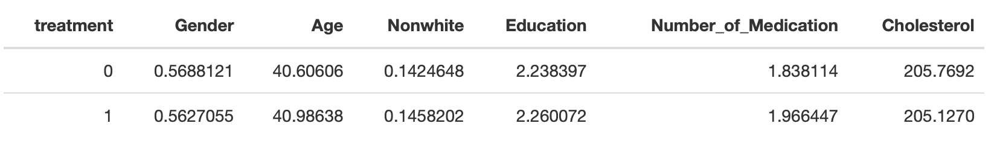

```{r setup, include=FALSE, results = 'asis'}
knitr::opts_chunk$set(echo = TRUE)
```

> **ABSTRACT**
There exists extreme variety of views on Medicaid: it's controversial. While it lowers out of pocket costs when you go to the doctor. we expect demand will increase. You're not facing the true market price, so you could overuse excuses to go to the doctor at little expense. The FDA relies on randomized control trials to disperce the program. They randomly assign public health insurance program, medicaid coverage to some people and not others. In 2008, Oregon has a medicare programs for low income, uninsured adults who are not eligible for medicaid through other means, but because of budget shortfalls, there was no room for openings. Until they got approved to let in 10,000 additional people into the program. Since the demand for these spots were high, policy makers decided the fairest thing to do was to run a huge public relations campaign to apply for the lottery for medicaid. Tracked the outcomes of both those who won the free medicaid coverage and those who lost. How do we allocate limited resources? It's a perennial problem that governments, nonprofits, and everyone faces. Get rid of privilege and follow federal law to run a lottery for fairness. In this empirical study of rich data, the Oregon Health  randomly assigned 30,000 out of 75,000 who showed up the ability to apply for medicaid. 

> Given our dataset, we want to explain the difference between the variables treatment and ohp_all_ever_survey. Explain why treatment is chosen as the treatment variable (Di), rather than ohp_all_ever_survey variable.

The difference between the treatment and ohp_all_ever_survey variable is how individuals were entered into medicaid. The treatment variable defines specifically whether an individual got into medicaid through the lottery or not. Whereas the ohp_all_ever_survey variable defines those that have been enrolled in medicaid, independent of the lottery.

```{r, include = FALSE, warning = FALSE}
#Load packages and libraries
library(pacman)
p_load(readr,dplyr, tidyverse, ggplot2, skimr, haven, stargazer, tidymodels, skimr, janitor, magrittr, datasets, rpart.plot, baguette, glmnet, tune, haven, ranger, data.table, parallel,sandwich, modelsummary, huxtable, hrbrthemes, kableExtra, dcolumn)
```

> Here, we will provide evidence that the OHP lottery really did randomly assign individuals to treatment and control groups. This formatted table reports means of 4 to 6 relevant characteristics for individuals in the control group. Let us pick which variables should be balanced in a randomized experiment by creating regressions below. 

```{r}
#load data
ohp_data <- read_dta("./data/ohp.dta")
```

```{r, results = 'asis', message = FALSE}
#Look at the variable names
names(ohp_data)
#create our 6 regression variables to run OLS
gender = lm(gender_inp ~ treatment, data = ohp_data)
age = lm(age_inp ~ treatment, data = ohp_data)
not_white = lm(race_nwother_inp ~ treatment, data = ohp_data)
education = lm(edu_inp ~ treatment, data = ohp_data)
medicine = lm(rx_num_mod_inp ~ treatment, data = ohp_data)
cholesterol = lm(chl_inp ~ treatment, data = ohp_data)

```

From this information gathered, we see we have 24 variables creating columns, and 12229 observation rows. 9 of which are character variables and 15 of which are numeric in structure.

```{r warning=FALSE}
#create an object that is just a summary
RecurveSum1 <- ohp_data %>%
    group_by(treatment) %>%
    summarize(
      Gender = mean(gender_inp, na.rm = TRUE),
      Age = mean(age_inp, na.rm = TRUE),
      Nonwhite = mean(race_nwother_inp, na.rm = TRUE),
      Education = mean(edu_inp, na.rm = TRUE),
      Number_of_Medication = mean(rx_num_mod_inp, na.rm = TRUE),
      Cholesterol = mean(chl_inp, na.rm = TRUE))

#graph it
kable(RecurveSum1, format = "latex", booktabs = TRUE,
        caption = "Weather Normalized (TMY3) Predicted Annual Therms",
        format.args = list(big.mark= ",")) %>%
    kable_styling(latex_options = c("HOLD_position","scale_down"))
```


This table is called a balance table. A balanced table checks observable characteristics of the treatment and control group to check if they differ. Why would we want to do this? Well if treatment assignment is truly random, then the observable characteristics of the treatment and the control group should be reasonably similar. So they should have randomly selected people with different demographics.

```{r, results = 'asis'}
#Standard error for the difference in means
se <- function(x) sd(x, a.rm= TRUE) / sqrt(length(x))

#function
std <- function(x) sd(x, na.rm = TRUE)/sqrt(length(x))


diff_mean <-
  function(x) {
    diff<-mean(x[ohp_data$treatment==1],na.rm=T) - mean(x[ohp_data$treatment==0],na.rm=T)
    return(diff)
  }

object_df2 = as.data.frame(RecurveSum1)

object_df = object_df2 %>% pivot_longer(!treatment)
object_df 
```

**Interpreting the table:** the data represent the mean of the given variable, grouped by treatment.

We want to check to make sure the randomization actually worked. The basics of reporting results from randomized experiments. First we will do a balancing table that shows that treatment and control groups do not differ by demographic characteristics or pre-treatment outcomes. Then we want to find the impact of the treatment on the outcome called the effect estimation. Thus, to do this we want to look at some variables, like cholesterol, and make sure their means are not biased before the treatment begins. 

```{r}
#assign treatment variables 
treatment1 = object_df %>% filter(treatment==1)
treatment0 = object_df %>% filter(treatment == 0 )


working_table = treatment1 %>% left_join(treatment0, by = "name")

working_table = working_table %>% select(name, value.x, value.y)

#print it out
#working_table

working_table = working_table %>% mutate(difference = value.x-value.y)

working_table = working_table %>% rename("Characteristic"= name,
                                         "Treatment"= value.y, "Control" = value.x)

#Now print our table out for #3
kable(working_table, format = "html", booktabs = TRUE,
        caption = "Difference in Means for Control and Treatment",
        format.args = list(big.mark= ",")) %>%
    kable_styling(latex_options = c("HOLD_position","scale_down"))
```

```{r}
#mutate and then add a variable for se of the difference in means
treatment_ohp = ohp_data %>% filter(treatment==1)
control_ohp = ohp_data %>% filter(treatment==0)


diff_Gender= std(treatment_ohp$gender_inp)- std(control_ohp$gender_inp)
diff_age = std(treatment_ohp$age_inp)- std(control_ohp$age_inp)
diff_nw= std(treatment_ohp$race_nwother_inp)- std(control_ohp$race_nwother_inp)
diff_ed= std(treatment_ohp$edu_inp)- std(control_ohp$edu_inp)
diff_med= std(treatment_ohp$rx_num_mod_inp)- std(control_ohp$rx_num_mod_inp)
diff_chol= std(treatment_ohp$chl_inp)- std(control_ohp$chl_inp)


thisworks = list(c(diff_Gender, diff_age, diff_nw, diff_ed, diff_med, diff_chol))

thisworks = as.data.frame(thisworks)

working_table = working_table%>% mutate(Standard_Error = thisworks)

kable(working_table, format = "html", booktabs = TRUE,
        caption = "Difference in Means for Control and Treatment",
        format.args = list(big.mark= ",")) %>%
    kable_styling(latex_options = c("HOLD_position","scale_down"))
```

Essentially, we are taking a difference of means (of ages) between the treatment and control group and it includes a standard error. So if my regression returns an estimate of the difference in means of 0.380 and a standard error of 0.212 then if I take the ratio of the two (0.380/0.212 = 1.80ish) gives me a t-stat. The t-stat will be statistically significant at the 5% level if > 1.96 (10% if > 1.645). So using the estimate (difference in means) and the standard error, I can make an inference statement about whether the treatment and control group have statistically significant difference in means. This is important to test how well balanced the random treatment assignment was across ages. A sufficiently randomized treatment assignment would hopefully show no difference between the two groups. However even if treatment is randomized well, slight differences may come up. If a lot of significant differences come up it would suggest we did not randomize our groups well, but it seems we have.

This is useful for designing and implementing randomized evaluations for policy making. From our table, we can gather some of the bigger findings: age is statistically significant at the 90 % confidence interval level. We are just checking the difference between the control group and the treatment group so as to see if there were predispositions in bias selection.

Note: **Difference in Group Means  = Treatment Effect + Selection Bias**
Note:  Selection Bias = 0 with if units are randomly assigned to treatment and control groups

> We want to estimate the compliance rate for the OHP experiment. That is, what is the effect of being assigned to the treatment group on the probability of being enrolled in Medicaid?

```{r}
#to find the compliance rate, regress those enrolled in medicaid on the treatment
c_rate <- lm(data= ohp_data, ohp_all_ever_survey ~ treatment)
c_rate
```
The compliance rate for the OHP experiment is 0.2536. The effect of being
assigned to the treatment group on the probability of being enrolled in Medicaid is 25.36%.

> What is the intent-to-treat (ITT) effect of the OHP experiment on health outcomes? Let's create a nicely formatted table that reports ITT estimates on 4 to 6 relevant health outcomes. Again, part of this question is to get us to think about which 4 to 6 variables could be used as health outcome variables.

This question is asking for a simple regression estimate. Choosing some health factored variables now to look for correlations, we want to regress treatment on: Diagnosed with diabetes after the lottery, Number of doctor's visits, Diagnosed with diabetes after the lottery, Number of prescription medications currently taking, and total cholesterol status.

```{r, results = 'asis', messgae = FALSE}
#This reports ITT estimates on the 6 relevant health outcomes we chose
dia <- lm(data=ohp_data, dia_dx_post_lottery~treatment)

doc <- lm(data = ohp_data, doc_num_mod_inp~treatment)

hdp <- lm(data=ohp_data, hbp_dx_post_lottery~treatment)

meds <- lm(data=ohp_data,rx_num_mod_inp~treatment)

chl <- lm(data=ohp_data,chl_inp~treatment)
```

```{r, results = 'asis', message = FALSE}
#let's report them in a table
stargazer(dia, doc, hdp, meds, chl, title = "Overall Regression Results for Outcome Variables", align = TRUE, type = 'html', robust = TRUE, font.size = "small",
          omit.stat = c("f", "ser"),
          column.sep.width = "6pt")
```
The ITT effect is equal to the treatment's impact on each of the variables we chose. For the "medications a person has" variable, the ITT effect is seen in the table as 0.128, significant at the 95% level. For the number of doctor's visits, we have an ITT effect of 0.396 with a lesser significance level. Horizontally alongside "treatment" we can see our variable's corresponding ITT effects.The ITT is the coefficient is the difference in mean of the variable between the control and the treatment. The intercept is the mean of the control, and the treatment coefficient is the ITT estimate. you get one ITT estimate per variable of interest regressed on treatment. 

> What is the “treatment on the treated” effect (ATET) of the OHP experiment, i.e. the effect among those who applied for Medicaid? We will estimate it for every health outcome we chose previously and provide some intuition for the calculation of this estimate.

For this question, we are taking the beta coefficients, and then dividing each of them by the compliance rate found per variable. This yields the average treatment effect on the treated. 

**ATET = The intent to treat effect divided by the compliance rate**

```{r}
ATET = list(c(0.009, 0.396, 0.002, 0.128, -0.642))

#List outcome
Outcome = list(c("Diabetes Post", "Medical Visits", "Hypertension Post", "Medication","Cholesterol" ))

ATET = as.data.frame(ATET)

#Create data frame
Outcome = as.data.frame(Outcome)
Outcome = Outcome %>% mutate(ATET = ATET/.2536)%>% mutate(Outcome = Outcome)
Outcome = Outcome %>% select(ATET, Outcome)

#Output table
kable(Outcome, format = "html", booktabs = TRUE,
        caption = "ATET",
        format.args = list(big.mark= ","))
```


>**Reporting on the ATET's:** The effect for the people who wanted it do not see significant change in their own health outcomes, but we see significant change in "useage" variables related to medicaid. From the table, we can see the treatment's coefficients are equal to the ATET of that column's variable. We see this trend in a surge of medicaid usage, because the use of medication decreases significantly alongside a decrease in the actual usage among the people who got medicaid anyways. The other people who didn't have access to medicaid, and wanted it, were seen to use it more. There was a greater change in medicaid coverage services.

Do we have to worry about attrition bias in analyzing this data? Explain why or why not.

There's only two years of data since the medicaid coverage expanded afterwards to include everyone and that got rid of the control group. Everyone is now offered medicaid coverage due to the crazy demand. 10th of March 2008 to September 30 2009. In the lectures by Amy Finkelstein, she addresses the controversy surrounding medicaid's expansion and the necessities for Randomized Experiment Designs to be implemented into policy making. We should always worry about a little bit of attrition bias just because of unforeseeable attributes like survey fatigue, when people get treatment, leave and don't come back to complete it, since it is such a short time period causes the attrition rate to be lower but it is still there.
