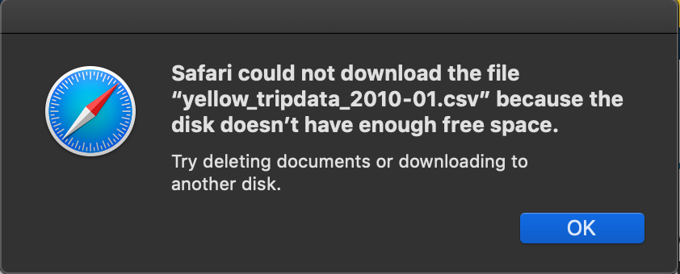
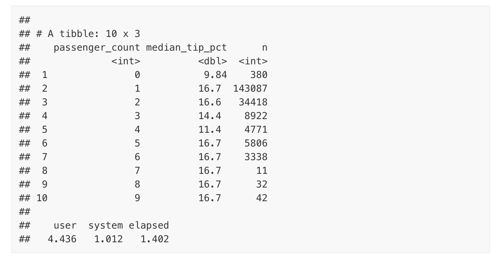

name: overview page
class: inverse, center, middle
```{r, setup, include = FALSE}
#set my own options manually
devtools::install_github("dill/emoGG")

#load libraries for slideshow 
library(pacman)
p_load(
  broom, tidyverse,
  latex2exp, ggplot2, ggthemes, ggforce, viridis, extrafont, gridExtra,
  kableExtra, snakecase, janitor,
  data.table, dplyr, estimatr,
  lubridate, knitr, parallel,
  lfe,
  here, magrittr
)

# I am defining color codes to use in my CSS 
# Define pink color
red_pink <- "#e64173"
turquoise <- "#20B2AA"
orange <- "#FFA500"
red <- "#fb6107"
blue <- "#3b3b9a"
green <- "#8bb174"
grey_light <- "grey70"
grey_mid <- "grey50"
grey_dark <- "grey20"
purple <- "#6A5ACD"
slate <- "#314f4f"
# Dark slate grey: #314f4f
mute_blue <- "#A6DADF"

# Knitr options
opts_chunk$set(
  comment = "#>",
  fig.align = "center",
  fig.height = 7,
  fig.width = 10.5,
  warning = F,
  message = F
)
opts_chunk$set(dev = "svg")
options(device = function(file, width, height) {
  svg(tempfile(), width = width, height = height)
})
options(crayon.enabled = F)
options(knitr.table.format = "html")

# Creating my own personal themes to load
theme_simple <- theme_bw() + theme(
  line = element_blank(),
  panel.grid = element_blank(),
  rect = element_blank(),
  strip.text = element_blank(),
  axis.text.x = element_text(size = 18, family = "STIXGeneral"),
  axis.text.y = element_blank(),
  axis.ticks = element_blank(),
  plot.title = element_blank(),
  axis.title = element_blank(),
  # plot.margin = structure(c(0, 0, -1, -1), unit = "lines", valid.unit = 3L, class = "unit"),
  legend.position = "none"
)
theme_axes_math <- theme_void() + theme(
  text = element_text(family = "MathJax_Math"),
  axis.title = element_text(size = 22),
  axis.title.x = element_text(hjust = .95, margin = margin(0.15, 0, 0, 0, unit = "lines")),
  axis.title.y = element_text(vjust = .95, margin = margin(0, 0.15, 0, 0, unit = "lines")),
  axis.line = element_line(
    color = "grey70",
    size = 0.25,
    arrow = arrow(angle = 30, length = unit(0.15, "inches")
  )),
  plot.margin = structure(c(1, 0, 1, 0), unit = "lines", valid.unit = 3L, class = "unit"),
  legend.position = "none"
)
theme_axes_serif <- theme_void() + theme(
  text = element_text(family = "MathJax_Main"),
  axis.title = element_text(size = 22),
  axis.title.x = element_text(hjust = .95, margin = margin(0.15, 0, 0, 0, unit = "lines")),
  axis.title.y = element_text(vjust = .95, margin = margin(0, 0.15, 0, 0, unit = "lines")),
  axis.line = element_line(
    color = "grey70",
    size = 0.25,
    arrow = arrow(angle = 30, length = unit(0.15, "inches")
  )),
  plot.margin = structure(c(1, 0, 1, 0), unit = "lines", valid.unit = 3L, class = "unit"),
  legend.position = "none"
)

#Load my necessary packages for this presentation
pacman::p_load(tidyverse, hrbrthemes, xaringan, data.table, fontawesome)
```

# The .pretty[`arrow`] package

---
name: arrow package introduction, the forms of data in arrow 

# The .pretty[`arrow`] package

### .hunter_green3[**Objects**]

`arrow` returns two data structures with the same, .hunter_green2[**columnary format**]:  

.pull-left[
1. .hunter_green3[**Table:**] a tabular, column-oriented data structure capable of storing and processing large amounts of data more efficiently than R’s built-in data.frame within databases

2. .hunter_green3[**Dataset:**] a data structure with the capability to work on larger-than-memory data partitioned across multiple files
]

.pull-right[


]

---
name: parquet 
background-image: url(https://arrow.apache.org/img/simd.png)
background-size: 60% 60%
background-position: bottom


```{r, include = FALSE, eval = TRUE}
library(fontawesome)
```

# The .pretty[`arrow`] package

### **.hunter_green3[Benefits of Parquet files]**
1. `r fa("folder-plus", fill = "#91bcab")` Now we can **read parquet files** into R
2. `r fa("columns", fill = "#91bcab")` Apache Parquet is **column-oriented**, meaning the values of each table column are stored next to each other, rather than all in the same row like `.csv` files
3. `r fa("bolt", fill = "#91bcab")` `arrow` provides major **R speedup** with functions for reading and writing large data files 
4. `r fa("users", fill = "#91bcab")` We can apply the **same** familiar, user friendly **`dplyr`** verbs on **Arrow Table** objects  
.pull-left[
.footnote[
.devin[Columnar Structure]]
]

---
name: dplyr connection coverpage 
class: inverse, middle

# Using .pretty[`dplyr`] Syntax within .pretty[`arrow`]

---
name: dplyr connection
# Using .pretty[`dplyr`] Syntax within .pretty[`arrow`]
### .hunter_green3[**Reading and Writing Files**]

- The `arrow` package provides functions that return an R data.frame as defualt .muave2[†]  

  - .pretty[**`read_parquet()`**] : read a Parquet file in columnary format 
  
  - .pretty[**`read_csv_arrow()`**] : read a comma-separated values (CSV) file in row format
  
- .hunter_green3[**Functions**] in `arrow` can be used with .hunter_green2[**R data.frame**] and .hunter_green2[**Arrow Table**] objects alike

  - Inside `dplyr` verbs, `arrow` offers support for common functions to get mapped to their base R and tidyverse equivalents if none exist

.footnote[.muave2[†] To return an Arrow Table, set argument .hunter_green3[as_data_frame = FALSE]]

---
name: NY Taxi Cab big data Example
background-image: url(https://jooinn.com/images/nyc-taxi-2.jpg)
background-size: cover

# .bore[NYC Taxi Data Example]

---
name: storage error

# .bore[NYC Taxi Data Example]

Why can't we just download the file locally?

--

### This metadata is **37** gigabytes in size . . `r fa("dizzy", fill = "#91bcab")`

My .hunter_green2[storage error] message: 


---
name:  C++ library

# Apache Arrow C++ Library Installation

### .hunter_green3[Steps:]

### [ _ ] **1. Install New Package** `arrow`

---
name:  C++ library

# Apache Arrow C++ Library Installation

### .hunter_green3[Steps:]

###[`r fa("check-circle", fill = "green")`] **1. Install New Package** `arrow`

```{r, include = TRUE, eval = FALSE}
## Load/install packages if necessary
if (!require("arrow")) install.packages("arrow")
library(arrow)
```

--

The `arrow` package takes care of all our .hunter_green2[**dependencies**] needed for working with the .hunter_green2[**Apache Arrow C ++ Library**]

.pull-right[.footnote[  . . . and that's all we have to do!]]

---
name: big dataset example

# NYC taxi data
### .hunter_green3[**Metadata**]  
We can use .pretty[`arrow`] to load in subsets of the full data
### .hunter_green3[**Requirements**]
To see if your arrow installation has S3 support, run
```{r, eval = TRUE, include = TRUE, results = 'markdown'}
arrow::arrow_with_s3() ## Mine does!
```
### .hunter_green3[**Sync a local connection to the source of the parquet data file, externally**]
```{r, include = TRUE}
#arrow::copy_files("s3://ursa-labs-taxi-data", "nyc-taxi")
dir.exists("nyc-taxi") ## check to make sure it exists!
```

---
name: big dataset example

# NYC taxi data

Load these explicit libraries in having acquired our knowledge,
```{r}
library(arrow, warn.conflicts = FALSE)
library(dplyr, warn.conflicts = FALSE)
```

Now that we are synced, we can Create our Dataset object, pointing at the directory of data
```{r}
ds <- open_dataset("nyc-taxi", partitioning = c("year", "month"))
```

---
name: big dataset example

#NY taxi data
- Up to this point, we haven’t loaded any data: we have walked directories to find files, we’ve parsed file paths to identify partition
- arrow supports the dplyr verbs mutate(), transmute(), select(), rename(), relocate(), filter(), and arrange().
- .hunter_green3[GOAL]: pull the selected subset of the data into an in-memory R data frame

.hunter_green2[**Let’s find the median tip percentage for rides with fares greater than $100 in 2015, broken down by the number of passengers:**]
```{r, include = TRUE, eval = FALSE, warning = FALSE}
system.time(ds %>%
  filter(total_amount > 100, year == 2015) %>%
  select(tip_amount, total_amount, passenger_count) %>%
  mutate(tip_pct = 100 * tip_amount / total_amount) %>%
  group_by(passenger_count) %>%
  collect() %>%
  summarise(
    median_tip_pct = median(tip_pct),
    n = n()
  ) %>%
  print())
```

---

#Results



We just selected a subset out of a dataset with around **2 billion rows, computed a new column, and aggregated on it in under 2 seconds** on our laptops!

---
name: extra resources for those interested

# Applications are endless . . .

- Parquet is an open source file format available to any project in the [Hadoop ecosystem FOUND HERE](https://www.geeksforgeeks.org/hadoop-ecosystem/)

- The Arrow Datasets library provides functionality to efficiently work with tabular, potentially larger than memory, and multi-file datasets. 

- Link to learn more about the C ++ library languages: https://www.tutorialspoint.com/c_standard_library/index.htm

- Other applications of arrow are described in the following vignettes:  
vignette("python", package = "arrow"): use arrow and reticulate to pass data between R and Python  
vignette("flight", package = "arrow"): connect to Arrow Flight RPC servers to send and receive data  
vignette("arrow", package = "arrow"): access and manipulate Arrow objects through low-level bindings to the C++ library